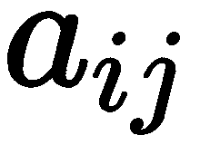
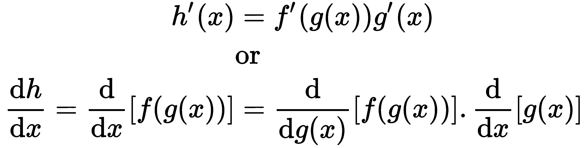
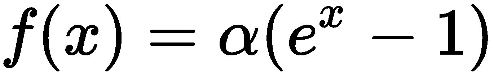
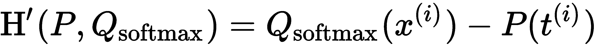
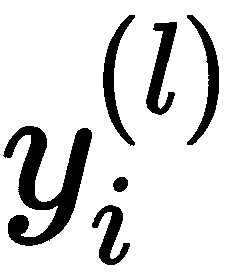
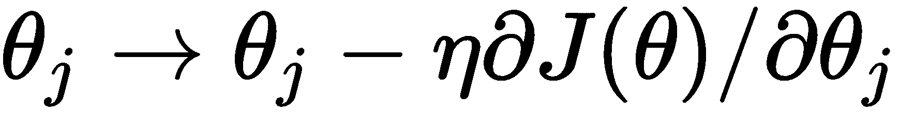

# 二、神经网络的基本要素

在这一章中，我们将讨论神经网络的一些错综复杂之处(**NNs**)——深度学习 ( **DL** )的基石。我们会谈到他们的数学仪器，结构和训练。我们的主要目标是为您提供对 NNs 的系统了解。通常，我们从计算机科学的角度来处理它们——作为由许多不同步骤/组件组成的机器学习( **ML** )算法(甚至是一个特殊的实体)。我们通过从神经元、层等方面进行思考来获得直觉(至少我第一次了解这个领域时是这么做的)。这是一种非常有效的做事方式，在这种理解水平下，我们仍然可以做出令人印象深刻的事情。不过，也许这不是正确的方法。

神经网络有坚实的数学基础，如果我们从这个角度来看待它们，我们将能够以一种更基本、更优雅的方式来定义和理解它们。因此，在这一章中，我们将试图从数学和计算机科学的角度强调神经网络之间的相似性。如果你已经熟悉这些主题，你可以跳过这一章。尽管如此，我还是希望你能找到一些你还不知道的有趣的东西(我们会尽力让这一章保持有趣！).

在本章中，我们将讨论以下主题:

*   神经网络的数学工具
*   NNs 简介
*   培训神经网络

# 神经网络的数学工具

在接下来的几节中，我们将讨论与神经网络相关的数学分支。一旦我们做到这一点，我们将连接他们到 NNs 本身。

# 线性代数

线性代数处理线性方程如 [] 和线性变换(或线性函数)及其表示，如矩阵和向量。

线性代数识别以下数学对象:

*   **标量**:单个数字。
*   **Vectors** :数字(或分量)的一维数组。数组的每个组件都有一个索引。在文献中，我们会看到用上标箭头( [] )或粗体( **x** )表示的向量。下面是一个矢量的例子:

在本书中，我们将主要使用粗体( **x** )图形符号。但在某些情况下，我们会使用不同来源的公式，并尽量保留它们原来的符号。

我们可以形象地把一个 *n* 维向量表示为一个 *n* 维欧氏空间、 [] (相当于一个坐标系)中一个点的坐标。在这种情况下，向量被称为欧几里得向量，每个向量分量代表沿相应轴的坐标，如下图所示:

[] 空间中的矢量表示

然而，欧几里得向量不仅仅是一个点，我们还可以用以下两个属性来表示它:

*   **量级**(或**长度**)是一个 *n* 维空间的勾股定理的推广:

*   **方向**是向量沿向量空间各轴的角度。

*   **矩阵**:这是一个数字的二维数组。每个元素由两个索引标识(行和列)。矩阵通常用粗体大写字母表示；比如说，**一个**。每个矩阵元素用小写的矩阵字母和下标表示；例如，*a[ij]。让我们看看下面公式中矩阵符号的一个例子:*

我们可以把一个向量表示为单列 *n×1* 矩阵(称为列矩阵)或者单列 *1×n* 矩阵(称为行矩阵)。

*   **张量**:在我们解释它们之前，我们必须从一个免责声明开始。张量最初来自数学和物理，在我们开始在 ML 中使用它们之前，它们早就存在了。这些领域中的张量定义不同于 ML 定义。出于本书的目的，我们将只考虑 ML 上下文中的张量。这里，张量是一个多维数组，具有以下属性:
    *   **秩**:表示数组维数。例如，秩为 2 的张量是矩阵，秩为 1 的张量是向量，秩为 0 的张量是标量。然而，张量对维数没有限制。事实上，一些类型的神经网络使用秩为 4 的张量。
    *   **形状**:各尺寸的大小。
    *   **张量元素的数据类型**。这些可能因库而异，但通常包括 16 位、32 位和 64 位浮点以及 8 位、16 位、32 位和 64 位整数。

当代的 DL 库，如 TensorFlow 和 PyTorch，使用张量作为主要的数据结构。

你可以在这里找到关于张量本质的透彻讨论:[https://stats . stack exchange . com/questions/198061/why-the-bureau-inclusion-with-tensors](https://stats.stackexchange.com/questions/198061/why-the-sudden-fascination-with-tensors)。你还可以查看 tensor flow(【https://www.tensorflow.org/guide/tensors】)和 py torch(【https://pytorch.org/docs/stable/tensors.html】[)张量定义。](https://pytorch.org/docs/stable/tensors.html)

现在我们已经介绍了线性代数中的对象类型，在下一节中，我们将讨论一些可以应用于它们的运算。

# 向量和矩阵运算

在本节中，我们将讨论与神经网络相关的向量和矩阵运算。让我们开始:

*   **矢量加法**是将两个或两个以上的矢量相加，得到一个输出矢量和的运算。输出是另一个矢量，计算公式如下:

*   **点** ( **或标量** ) **积**取两个向量，输出一个标量值。我们可以用以下公式计算点积:

这里，| *a* |和| *b* |是矢量幅度，θ是两个矢量之间的角度。我们假设这两个向量是 *n* 维的，它们的分量是*a[1]、 *b [1]* 、 *a [2]* 、 *b [2]* 等等。这里，前面的公式等价于下面的公式:*

两个二维向量 **a** 和 **b** 的点积如下图所示:

向量的点积。顶部:矢量分量；下图:两个向量的点积

点积作为两个向量之间的一种相似性度量——如果两个向量之间的角度θ很小(向量具有相似的方向)，那么它们的点积会因为 [] 而更高。

根据这个想法，我们可以定义两个向量之间的余弦相似度为:

*   **交叉** ( **或矢量** ) **乘积**取两个矢量，输出另一个矢量，该矢量垂直于两个初始矢量。我们可以用以下公式计算叉积输出矢量的幅度:

下图显示了两个二维向量的叉积示例:

两个二维向量的叉积

正如我们之前提到的，输出向量垂直于输入向量，这也意味着向量垂直于包含它们的平面。输出向量的大小等于平行四边形的面积，向量 **a** 和 **b** 代表边(在前面的图中表示)。

We can also define a vector through **vector space**, which is a collection of objects (in our case, vectors) that can be added together and multiplied by a scalar value. The vector space will allow us to define a **linear transformation** as a function, *f*, which can transform each vector (point) of vector space, ***V***, into a vector (point) of another vector space, ***W*** : []. *f* has to satisfy the following requirements for any two vectors, []:

*   可加性: []
*   同质性: [] ，其中 *c* 为标量

*   **矩阵转置**:这里我们沿着矩阵的主对角线翻转矩阵(主对角线是矩阵元素的集合，*a[ij]，其中 *i = j* )。转置操作用上标、 ^() 表示。澄清一下，的单元格 [] 等于 [] 的单元格 [] :*

一个 *m×n* 矩阵的转置是一个 *n×m* 矩阵。以下是一些移调的例子:

*   **矩阵-标量乘法**是矩阵乘以标量值。在下面的例子中， [] 是一个标量:

*   **矩阵-矩阵加法**是一个矩阵与另一个矩阵的元素相加。对于此操作，两个矩阵必须具有相同的大小。下面是一个例子:

*   **矩阵-向量乘法**是矩阵乘以向量。为了使该操作有效，矩阵列的数量必须等于向量长度。将 *m×n* 矩阵与一个 *n* 维向量相乘的结果就是一个 *m* 维向量。下面是一个例子:

我们可以把矩阵的每一行想象成一个独立的 n 维向量。这里，输出向量的每个元素是对应矩阵行和 **x** 之间的点积。下面是一个数值例子:

*   **矩阵乘法**是一个矩阵与另一个矩阵相乘。为了有效，第一个矩阵的列数必须等于第二个矩阵的行数(这是非交换操作)。我们可以把这个操作想象成多重矩阵向量乘法，其中第二个矩阵的每一列都是一个向量。一个 *m×n* 矩阵乘以一个 *n×p* 矩阵的结果就是一个 *m×p* 矩阵。下面是一个例子:

如果我们把两个向量看作行矩阵，我们可以把一个向量的点积表示为矩阵乘法，即。

我们对线性代数的介绍到此结束。在下一节，我们将介绍概率论。

# 概率导论

在这一部分，我们将讨论与神经网络相关的概率和统计的一些方面。

让我们首先介绍一个**统计实验**的概念，它具有以下性质:

*   由多个独立试验组成。
*   每次试验的结果都是不确定的；也就是偶然决定的。
*   它有不止一种可能的结果。这些结果被称为**事件**(在下一节中，我们还将在集合的上下文中讨论事件)。
*   实验的所有可能结果都是预先知道的。

统计实验的一个例子是掷硬币，它有两种可能的结果——正面或反面。另一个例子是掷骰子，有六种可能的结果:1、2、3、4、5 和 6。

我们将**概率**定义为某个事件 **e** 发生的可能性，并用 **P(e)** 表示。概率是一个在[0，1]范围内的数字，其中 0 表示事件不可能发生，1 表示事件将一直发生。如果 *P(e) = 0.5* ，则该事件发生的几率为 50%，依此类推。

有两种方法可以接近概率:

*   **理论上的**:我们感兴趣的事件与可能的事件总数相比。所有的事件都一样可能发生:

为了理解这一点，让我们用掷硬币的例子来说明两种可能的结果。每个可能结果的理论概率是 P(正面)= P(反面)= 1/2。掷骰子每一面的理论概率是 1/6。

*   **经验**:这是我们感兴趣的事件发生的次数与总试验次数之比:

实验的结果可能表明这些事件发生的可能性并不相等。例如，假设我们投掷硬币 100 次，我们观察正面 56 次。这里，人头的经验概率是 P(人头)= 56 / 100 = 0.56。试验次数越多，计算出的概率就越准确(这就是众所周知的大数定律)。

在下一节，我们将讨论集合背景下的概率。

# 概率和集合

一个实验所有可能结果(事件)的集合称为，**样本空间**。我们可以把样本空间看作一个数学的**集合。**通常用大写字母表示，我们可以用{}列出所有的集合结果(与 Python 集合相同)。例如，掷硬币事件的样本空间是 S[c]= {正面，反面}，而对于骰子行是 S [d] = {1，2，3，4，5，6}。集合的单个结果(例如，头部)称为**采样点**。一个 **e** **事件**是样本空间的一个结果(样本点)或结果的组合(子集)。组合事件的一个例子是骰子落在偶数上，即{2，4，6}。

假设我们有一个样本空间 S = {1，2，3，4，5}和两个子集(事件)A = {1，2，3}和 B = {3，4，5}。在这里，我们可以对它们进行以下操作:

*   **交集**:结果是一个新的集合，只包含两个集合中的元素:

交集为空集的集合{}是**不相交的**。

*   **Complement** :结果是一个新的集合，它包含给定集合中不包含的样本空间的所有元素:

*   **Union:** 结果是一个新的集合，其中包含可以在任一集合中找到的元素:

以下文氏图说明了这些不同的集合关系:

Venn diagrams of the possible set relationships

我们可以将集合属性转换为事件及其概率。我们将假设事件是**独立的**——一个事件的发生不影响另一个事件发生的概率。例如，不同掷硬币的结果是相互独立的。也就是说，让我们学习如何翻译事件域中的集合操作:

*   两个事件的交集是包含在两个事件中的结果的子集。相交的概率称为**联合概率**，通过以下公式计算:

假设我们要计算一张牌是红色(红心或方块)和一张 j 的概率。红色的概率是 *P(红色)= 26/52 = 1/2* 。得到千斤顶的概率是 *P(千斤顶)= 4/52 = 1/13* 。所以联合概率是 *P(红方，杰克)= (1/2) * (1/13) = 1/26* 。在这个例子中，我们假设这两个事件是独立的。然而，这两个事件同时发生(我们抽一张牌)。如果它们连续发生，例如，两次抽牌，一次是杰克，另一次是红色，我们将进入条件概率的领域。这个联合概率也被表示为 P(A，B)或 P(AB)。

单个事件发生的概率 P(A)也称为**边际概率**(与联合概率相对)。

*   如果两个事件不共享任何结果，那么它们就是不相交的(或者说**互斥**)。也就是说，它们各自的样本空间子集是不相交的。例如，奇数或偶数骰子行的事件不相交。以下关于不相交事件的概率是正确的:

    *   不相交事件的联合概率(这些事件同时发生的概率)是 P(A∩B) = 0。
    *   不相交事件的概率之和为 [] 。
*   如果多个事件的子集包含它们之间的整个样本空间，则它们是**联合穷尽的**。前一个例子中的事件 A 和 B 是一起穷举的，因为它们一起填满了整个样本空间(1 到 5)。以下是联合穷举事件的概率:

如果我们只有两个不相交且同时联合穷举的事件，那么这两个事件就是**补**。例如，奇数和偶数掷骰子事件是互补。

*   我们将来自 A 或 B(不一定两者都有)的结果称为 A 和 B 的并集。这个并集的概率如下:

到目前为止，我们已经讨论了独立事件。在下一节中，我们将重点关注依赖关系。

# 条件概率和贝叶斯规则

如果事件 A 的发生改变了事件 B 发生的概率，其中 A 发生在 B 之前，那么两者是相依的。为了说明这个概念，让我们想象我们从一副牌中按顺序抽取多张牌。当卡牌满的时候，抽到红心的概率是 *P(红心)= 13/52 = 0.25* 。但是一旦我们抽到了第一张牌，第二回合选红心的概率就变了。现在，我们只有 51 张牌，少了一颗心。我们称第二次抽签的概率为条件概率，用 P(B|A)表示。这是事件 B(第二次抽奖)的概率，假设事件 A 已经发生(第一次抽奖)。继续我们的例子，在第二次抽奖中挑选红心的概率变成 *P(红心[2]|红心 [1] ) = 12/51 = 0.235* 。

接下来，我们可以根据相关事件扩展联合概率公式(在前一节中介绍)。公式如下:

然而，前面的等式只是两个事件的特例。我们可以进一步扩展到多个事件，一个 [1] ，一个 [2] ，...，一个 [n] 。这个新的通用公式被称为概率链规则:

例如，三个事件的链规则如下:

我们还可以推导出条件概率本身的公式:

这个公式是有意义的，原因如下:

*   P(A ∩ B) 表示我们对 B 的出现感兴趣，因为 A 已经出现了。换句话说，我们对事件的联合发生感兴趣，因此对联合概率感兴趣。
*   P(A) 陈述当事件 A 发生时，我们只对结果的子集感兴趣。我们已经知道 A 已经发生，因此我们的观察仅限于这些结果。

以下情况适用于从属事件:

使用这个等式，我们可以替换条件概率公式中的 P(A∩B)的值，得到如下结果:

如果我们知道相反的条件概率 P(B|A ),前面的公式使我们能够计算条件概率 P(B|A)。这个等式被称为**贝叶斯规则**，经常在 ML 中使用。在贝叶斯统计的上下文中，P(A)和 P(B|A)分别被称为先验概率和后验概率。

贝叶斯法则可以在医学测试领域得到说明。假设我们想确定一个病人是否患有某种疾病。我们进行了医学测试，结果呈阳性。但这并不一定意味着病人得了这种病。大多数测试都有一个可靠性值，即当对患有特定疾病的人进行测试时，测试呈阳性的百分比机会。使用这些信息，我们将应用贝叶斯规则来计算患者患病的实际概率，假设测试是阳性的。我们得到以下结果:

这里， *P(已发病)*是在没有任何先验条件下，疾病发生的一般概率。把这想象成疾病在普通人群中的概率。

接下来，让我们对疾病和测试的准确性做一些假设:

*   检测 98%可靠，即如果检测呈阳性，在 98%的情况下也会呈阳性: *P(检测=阳性|有疾病)* = 0.98。
*   50 岁以下的人只有 2%有这种病: *P(有病)* = 0.02。
*   对 50 岁以下的人进行的测试只有 3.9%的人呈阳性: *P(测试=阳性)* = 0.039。

我们可以问以下问题:如果一项检测对癌症的准确率为 98%，如果一个 45 岁的人进行了检测，结果是阳性，那么他们可能患有该疾病的概率是多少？使用前面的公式，我们可以计算如下:

在下一节，我们将超越概率，我们将讨论随机变量和概率分布。

# 随机变量和概率分布

在统计学中，我们将变量定义为描述给定实体的属性。属性的值可以因实体而异。例如，我们可以用一个变量来描述一个人的身高，这个变量因人而异。但是假设我们多次测量同一个人的身高。由于一些随机因素，如人的姿势或我们自己测量的不准确性，我们可以预期每次获得的值略有不同。因此，变量 height 的值会不同，尽管我们测量的是同样的东西。为了解释这些变化，我们将引入随机变量。这些变量的值是由一些随机事件决定的。与常规变量不同，随机变量可以有多个值，每个值都与某种概率相关联。

有两种类型的随机变量:

*   **离散**，可以取截然不同的单独值。例如，足球比赛中的进球数是一个离散变量。

*   **连续**，可以取给定区间内的任意值。例如，高度测量是一个连续变量。

随机变量用大写字母表示，随机变量 *X* 的某个值 *x* 的概率用 *P(X = x)* 或 *p(x)* 表示。随机变量每个可能值的概率集合称为**概率分布**。根据变量类型，我们有两种类型的概率分布:

*   **离散变量的概率质量函数** ( **PMF** )。下面是一个 PMF 的例子。 *x* 轴显示可能的值，而 *y* 轴显示每个值的概率:

一个 PMF 的例子

PMF 只为随机变量的可能值定义。PMF 的所有值都是非负的，它们的和是 1。也就是说，PMF 的事件是相互排斥的，并且是共同详尽无遗的。我们用 P(X)表示 PMF，其中 X 是随机变量。

*   **连续变量的概率密度函数** ( **PDF** )。与 PMF 不同，PDF 在两个值之间的区间是不间断的(为每个可能的值定义)，从而反映了连续变量的性质。以下是一个 PDF 的示例:

一个 PDF 的例子

在 PDF 中，概率是针对一个值区间计算的，由该区间所包围的曲线下的表面积给出(这是上图中标记的区域)。曲线下的总面积为 1。我们将用*f[X]来表示 PDF，其中 X 是随机变量。*

接下来，让我们关注随机变量的一些性质:

*   **均值**(或**期望值**)是一个实验在多次观察后的预期结果。我们用μ或者 [] 来表示。对于离散变量，平均值是所有可能值的加权和乘以它们的概率:

让我们以前面的离散变量为例，我们定义了一个随机变量，它有六个可能的值(0，1，2，3，4，5)和它们各自的概率(0.1，0.2，0.3，0.2，0.1，0.1)。这里的均值是*μ= 0 * 0.1+1 * 0.2+2 * 0.3+3 * 0.2+4 * 0.1+5 * 0.1 = 2.3。*

连续变量的含义定义如下:

对于离散变量，我们可以将 PMF 视为查找表，而 PDF 可能更复杂(实际的函数或方程)，这就是为什么两者之间有不同的符号。关于连续变量的均值，我们就不深入探讨了。

*   **方差**定义为随机变量的平均值μ的平方偏差的期望值:

换句话说，方差衡量随机变量的值与其平均值的差异。

离散随机变量的方差如下:

让我们用前面的例子，计算出平均值为 2.3。新的方差将是*Var(X)*=*(0-2.3)²* 0+(1-2.3)²*** 1+...+ (5- 2.3) ² * 5 = 2.01* 。

连续变量的方差定义如下:

*   **标准偏差**测量随机变量的值与期望值不同的程度。如果这个定义听起来像方差，那是因为它就是。事实上，标准差的公式如下:

我们也可以用标准差来定义方差:

标准差和方差的区别在于，标准差用与均值相同的单位表示，而方差用平方单位。

在本节中，我们定义了什么是概率分布。接下来，让我们讨论不同类型的概率分布。

# 概率分布

我们将从二项式实验中离散变量的**二项式分布**开始。二项式实验只有两种可能的结果:成功或失败。它还满足以下要求:

*   每个试验都是独立的。
*   成功的概率总是一样的。

二项实验的一个例子是扔硬币实验。

现在，让我们假设这个实验由 *n* 次试验组成。其中 *x* 次成功，而每次试验成功的概率是 *p* 。变量 X(不要与 *x* 混淆)的二项式 PMF 公式如下:

这里， [] 是二项式系数。这是 *x* 个成功试验的组合数，我们可以从 *n* 个总试验中选择。如果 *n=1* ，那么我们有一个二项分布的特例叫做**伯努利分布**。

接下来，让我们讨论连续变量的正态(或高斯)分布，它非常接近许多自然过程。正态分布由以下指数 PDF 公式定义，称为正态方程(最流行的符号之一):

这里， *x* 是随机变量的值， *μ* 是均值， *σ* 是标准差， *σ ²* 是方差。前面的等式生成了一条钟形曲线，如下图所示:

正态分布

让我们讨论一下正态分布的一些性质，不分先后:

*   曲线沿其中心对称，也是最大值。
*   曲线的形状和位置完全由平均值和标准偏差描述，其中我们有:

    *   曲线的中心(及其最大值)等于平均值。也就是说，平均值决定了曲线沿 *x* 轴的位置。
    *   曲线的宽度由标准偏差决定。

在下图中，我们可以看到具有不同 *μ* 和 *σ* 值的正态分布示例:

具有不同 *μ* 和 *σ* 值的正态分布示例

*   正态分布向+/-无穷大近似 0，但它永远不会变成 0。因此，正态分布下的随机变量可以有任何值(尽管有些值的概率很小)。
*   曲线下的表面积等于 1，这由指数前的常数 [] 来保证。
*   [] (位于指数中)称为标准分数(或 z 分数)。标准化正态变量的平均值为 0，标准差为 1。一旦变换，随机变量以其标准化形式参与方程。

在下一节中，我们将介绍信息论的多学科领域，这将帮助我们在 NNs 的上下文中使用概率论。

# 信息论

信息论试图确定一个事件拥有的信息量。信息量遵循以下原则:

*   事件的概率越高，该事件的信息量就越少。相反，如果概率越低，事件携带的信息内容就越多。例如，掷硬币的结果(概率为 1/2)比掷骰子的结果(概率为 1/6)提供的信息少。
*   独立事件携带的信息是它们各自信息内容的总和。例如，出现在骰子同一侧的两个骰子行(比如 4 个)的信息量是单个行的两倍。

我们将事件 *x* 的信息量(或自身信息量)定义如下:

这里， *log* 是自然对数。例如，如果事件的概率是 *P(x) = 0.8* ，那么 *I(x) = 0.22* 。或者，如果 *P(x)* *= 0.2* ，则 *I(x) = 1.61* 。我们可以看到，事件信息量与事件概率是相反的。自我信息量 I(x)是以信息的自然单位来测量的( **nat** )。我们也可以用以 2 为底的对数 [] 来计算 I(x)，这种情况下我们用比特来度量。这两个版本之间没有主要区别。出于本书的目的，我们将坚持自然对数版本。

Let's discuss why we use logarithm in the preceding formula, even though a negative probability would also satisfy the reciprocity between self-information and probability. The main reason is the product and division rules of logarithms:

Here, *x[1]* and *x[2]* are scalar values. Without going into too much detail, note that these properties allow us to easily minimize the error function during network training.

到目前为止，我们已经定义了单个结果的信息内容。但是其他结果呢？为了测量它们，我们必须测量随机变量的概率分布的信息量。我们用 I( *X* )来表示吧，其中 *X* 是一个随机离散变量(我们这里重点讲离散变量)*。*回想一下，在*随机变量和概率分布*一节中，我们将离散随机变量的平均值(或期望值)定义为所有可能值的加权和乘以它们的概率。我们将在这里做一些类似的事情，但是我们将把每个事件的信息内容乘以该事件的概率。

这个度量被称为香农熵(或简称熵)，定义如下:

这里，*x[I]代表离散变量值。与低概率事件相比，概率较高的事件将具有更大的权重。我们可以认为熵是关于概率分布的事件(结果)的预期(平均)信息量。为了理解这一点，让我们试着计算一下大家熟悉的掷硬币实验的熵。我们来算两个例子:* 

*   首先我们假设 *P(正面)= P(反面)= 0.5* 。在这种情况下，熵如下:

*   接下来，让我们假设，由于某种原因，结果的可能性并不相等，概率分布是 *P(正面)= 0.2，P(反面)= 0.8* 。熵值如下:

我们可以看到，当结果同样可能时，熵最高，当一个结果变得普遍时，熵降低。在某种意义上，我们可以将熵视为不确定性或混沌的度量。下图显示了二元事件(如抛硬币)的熵 **H(X)** 图，取决于两种结果的概率分布:

左:带自然对数的熵；右图:以 2 为底的对数熵

接下来，让我们假设我们有一个离散的随机变量， *X* ，以及两个不同的概率分布。这通常是这样的场景，在训练期间，一个神经网络产生一些输出概率分布 *Q* ( *X* )，我们将其与目标分布 *P* ( *X* )进行比较。我们可以用**交叉熵**来衡量这两个分布之间的差异，交叉熵定义如下:

例如，让我们计算前面掷硬币场景的两个概率分布之间的交叉熵。我们已经预测了分布 *Q(正面)= 0.2，Q(反面)= 0.8* 和目标(或真实)分布 *P(正面)= 0.5，P(反面)= 0.5* 。交叉熵如下:

两个概率分布之间差异的另一个度量是**库尔贝克-莱布勒散度** ( **KL 散度**):

对数的乘积法则帮助我们将第一行的公式转换成第二行的更直观的形式。很容易看出，KL 散度衡量的是目标对数概率和预测对数概率之间的差异。如果我们进一步推导这个方程，我们还可以看到熵、交叉熵和 KL 散度之间的关系。

掷硬币示例场景的 KL 散度如下:

在下一节中，我们将讨论微分学领域，这将有助于我们训练神经网络。

# 微积分

在最大似然法中，我们经常感兴趣的是如何通过调整最大似然算法的参数来近似某些目标函数。如果我们认为 ML 算法本身是一个数学函数(对于 NNs 就是这种情况)，我们想知道当我们改变它的一些参数(权重)时，该函数的输出是如何变化的。幸运的是，微分学研究的是函数相对于它所依赖的变量的变化率。以下是(非常)简短的衍生品介绍。

假设我们有一个函数， *f(x)* ，只有一个参数， *x* ，它有如下图形:

图中的 *f(x)* 和斜率(红点-虚线)

通过计算函数在该点的斜率，我们可以得到 *f(x)* 相对于 *x* 在 *x* 的任意值如何变化的相对概念。如果斜率为正，则函数增加。相反，如果它是负的，它就会减少。我们可以用下面的公式计算斜率:

这里的想法很简单——我们计算在 *x* 和*x+δx 处 *f* 的两个值之差:δy = f(x+δx)-f(x)*。然后，我们计算*δy*和*δx*的比值，得到斜率。但是如果*δx*太大，测量就不会很精确，因为函数图中包围在 *x* 和*x+δx*之间的部分可能会发生剧烈变化。我们可以使用更小的*δx*来最小化这个误差；这里，我们可以关注图表的一小部分。如果*δx*接近 0，我们可以假设斜率反映了图中的单个点。在这种情况下，我们称斜率为 *f(x)* 的**一阶导数**。我们可以通过以下等式用数学术语来表达这一点:

这里，*f’(x)*和 *dy* / *dx* 分别是拉格朗日和莱布尼茨对导数的记法。 [] 是极限的数学概念——我们可以认为是*δx*趋近于 0。求 *f* 的导数的过程叫做**微分**。下图显示了不同 *x* 值下的斜率:

我们可以看到， *f* 的**局部最小值**和**局部最大值**处的斜率都是 0——在这些点(称为鞍点)，当我们改变 *x* 时， *f* 既不增加也不减少。

接下来，让我们假设我们有一个多参数函数， [] 。 *f* 对任意参数 *x [ i ]* 的导数称为偏导数，用 [] 表示。在计算偏导数时，我们假设所有其他参数 [] 都是常数。我们将用 [] 来表示一个向量的分量的偏导数。

最后，让我们提一些有用的区分规则:

*   **链式法则**:假设 *f* 和 *g* 是一些函数和 *h(x)= f(g(x))。*这里，对于任一 *x* ，f 相对于 *x* 的导数如下:

*   **求和规则**:假设 *f* 和 *g* 是一些函数和 *h(x) = f(x) + g(x)* 。求和规则陈述如下:

*   **常用功能**:
    *   *x' = 1*
    *   *(ax)' = a* ，其中 *a* 为标量
    *   *a' = 0* ，其中 *a* 为标量
    *   *x ² = 2x*
    *   *(e^x)' = e^x*

神经网络的数学装置和神经网络本身形成一种知识层次。如果我们认为实现一个神经网络就像盖房子，那么数学仪器就像搅拌混凝土。我们可以独立地学习如何搅拌混凝土，而不是如何建造房子。事实上，除了建造房屋的特定目标之外，我们还可以为各种目的混合混凝土。然而，我们需要知道如何在建造房子之前搅拌混凝土。继续我们的类比，现在我们知道如何混合混凝土(数学仪器)，我们将专注于实际建造房子(NNs)。

# NNs 简介

NN 是一个试图近似另一个目标函数 *g* 的函数(让我们用 *f* 来表示它)。我们可以用下面的等式来描述这种关系:

Here, *x* is the input data and *θ* are the NN parameters (weights). The goal is to find such *θ* parameters with the best approximate, *g* . This generic definition applies for both regression (approximating the exact value of *g* ) and classification (assigning the input to one of multiple possible classes) tasks. Alternatively, the NN function can be denoted as  .

我们将从神经网络的最小构件——神经元开始讨论。

# 神经元

前面的定义是一个神经网络的鸟瞰图。现在，让我们讨论神经网络的基本构建模块，即神经元(或**单元**)。单位是数学函数，可定义如下:

在这里，我们有以下内容:

*   *y* 为单位输出(单值)。
*   *f* 是非线性可微激活函数。激活函数是神经网络中非线性的来源——如果神经网络完全是线性的，它将只能近似其他线性函数。
*   激活函数的自变量是所有单元输入*x[I]T7(*n*总输入)的加权和(权重为*w[I])和偏置权重 *b* 。输入*x[I]可以是数据输入值，也可以是其他单元的输出。***

或者，我们可以用它们的矢量表示来代替*x[I]和*w[I]，其中 [] 和 [] 。这里，公式将使用两个向量的点积:**

下图(左)显示了一个单元:

左图:一个单位及其等价公式；右图:感知器的几何表示。

如果**xw = 0**，输入向量 **x** 将垂直于权重向量 **w** 。所以所有向量 **x** 其中**xw = 0**定义了向量空间 [] 中的一个超平面，其中 *n* 是 *x* 的维数。在二维输入 *(x [1] ，x [ 2 ] )* 的情况下，我们可以将超平面表示为一条直线。这可以用感知器(或二元分类器)来说明——一个具有**阈值**激活函数的单元，它将其输入分类为两类中的一类。具有两个输入 *(x [1] ，x [ 2 ] )* 的感知器的几何表示是一条分隔两个类的线(或决策边界)(在上图的右侧)。这给神经元带来了严重的限制，因为它不能对线性不可分的问题进行分类——即使是像 XOR 这样简单的问题。

具有恒等式激活函数的单位( *f(x) = x* )等价于多元线性回归，而具有 sigmoid 激活函数的单位等价于 logistic 回归。

接下来，让我们学习如何将神经元组织成层。

# 作为操作的层

神经网络组织结构的下一层是单元层，在这里我们将多个单元的标量输出组合成一个输出向量。层中的单元不相互连接。这种组织结构是有意义的，原因如下:

*   我们可以将多元回归推广到一个层，而不是仅对一个单元进行线性或逻辑回归。换句话说，我们可以用一个层来近似多个值，而不是用一个单元来近似一个值。这发生在分类输出的情况下，其中每个输出单元表示输入属于某个类的概率。
*   一个单元可以传递有限的信息，因为它的输出是标量。通过组合单位输出，而不是单个激活，我们现在可以考虑整个矢量。这样，我们可以传达更多的信息，不仅因为向量有多个值，还因为它们之间的相对比率具有额外的意义。
*   因为层中的单元彼此之间没有连接，所以我们可以并行计算它们的输出(从而提高计算速度)。这种能力是近年来 DL 成功的主要原因之一。

在经典的 NNs(即 DL 之前的 NNs，当时它们只是许多 ML 算法中的一种)中，层的主要类型是**全连接** ( **FC** )层。在这一层，每个单元从输入向量的所有分量接收加权输入， **x** 。让我们假设输入向量的大小是 *m* 并且 FC 层具有 *n* 个单元和一个激活函数 *f* ，这对于所有单元都是相同的。每个 *n* 单元将有 *m* 重量:一个用于一个 *m* 输入。以下是我们可以用于 FC 层的单个单元 *j* 的输出的公式。这与我们在*神经元*部分定义的公式相同，但是我们将在这里包括单位索引:

这里， *w [ij]* 是第 *j* 层单元和第 *i* 层输入分量之间的权重。我们可以将连接输入向量和单元的权重表示为一个 *m×n* 矩阵 **W** 。每个矩阵列代表一个层单元的所有输入的权重向量。在这种情况下，层的输出向量是矩阵向量乘法的结果。但是，我们也可以将多个输入样本 **x** *[i]* 组合在一个输入矩阵中(或**批** ) **X** ，同时通过该层。在这种情况下，我们有矩阵-矩阵乘法，层输出也是一个矩阵。下图显示了 FC 层的一个示例，以及它在批处理和单个样本方案中的等效公式:

具有向量/矩阵输入和输出的 FC 层及其等价公式

我们已经明确地分离了偏差和输入权重矩阵，但是在实践中，底层实现可能使用共享的权重矩阵，并向输入数据追加一行 1。

当代的 DL 并不局限于 FC 层。我们有许多其他类型，如卷积、池等。一些层有可训练的权重(FC，卷积)，而其他层没有(池化)。我们也可以将术语功能或操作与层互换使用。例如，在 TensorFlow 和 PyTorch 中，我们刚刚描述的 FC 层是两个顺序操作的组合。首先，我们对权重和输入进行加权求和，然后将结果作为输入提供给激活函数操作。在实践中(即，当使用 DL 库时)，NN 的基本构建块不是单元，而是以一个或多个张量作为输入并输出一个或多个张量的运算:

具有输入和输出张量的函数

接下来，让我们讨论如何在 NN 中组合层操作。

# NNs

在*神经元*部分，我们演示了一个神经元(对一个层也有效)只能对线性可分的类进行分类。为了克服这个限制，我们必须在神经网络中组合多个层。我们将把神经网络定义为操作(或层)的有向图。图节点是操作，它们之间的边决定了数据流。如果两个操作相连，则第一个操作的输出张量将作为第二个操作的输入，这由边方向决定。一个神经网络可以有多个输入和输出-输入节点只有输出边，而输出节点只有输入边。

根据这一定义，我们可以确定两种主要类型的神经网络:

*   **前馈**，用**非循环**图表示。
*   **循环**(**)，用**循环**图表示。复发是暂时的；图中的循环连接在时刻 *t-1* 传播操作的输出，并在下一时刻 *t* 将其反馈到网络中。RNN 维护一种内部状态，这种状态代表所有先前网络输入的一种总结。这一总结连同最新的投入一起，被反馈给 RNN。网络会产生一些输出，但也会更新其内部状态，并等待下一个输入值。这样，RNN 可以接受可变长度的输入，例如文本序列或时间序列。**

 **以下是两种类型网络的示例:

左:前馈网络；右图:循环网络

让我们假设，当一个操作从不止一个操作接收输入时，我们使用元素相加来组合多个输入张量。然后，我们可以将神经网络表示为一系列嵌套的函数/操作。我们将用 [] 来表示 NN 操作，其中 *i* 是帮助我们区分多个操作的某个索引。例如，左侧前馈网络的等效公式如下:

右侧 RNN 的公式如下:

我们还将使用与操作本身相同的索引来表示操作的参数(权重)。让我们以索引为 *l* 的 FC 网络层为例，它从索引为 *l-1* 的前一层获取输入。以下是具有图层索引的单个单元和矢量/矩阵图层表示的图层公式:

现在我们已经熟悉了完整的神经网络结构，让我们来讨论不同类型的激活函数。

# 激活功能

让我们讨论不同类型的激活功能，从经典开始:

*   **Sigmoid** :其输出有界在 0 和 1 之间，可以随机解释为神经元激活的概率。由于这些性质，sigmoid 在很长一段时间内是最受欢迎的激活函数。然而，它也有一些不太理想的属性(稍后将详细介绍)，这导致了它的受欢迎程度下降。下图显示了 sigmoid 公式、其导数以及它们的图形(导数在我们讨论反向传播时会很有用):

Sigmoid 激活函数

*   **双曲正切** ( **tanh** ):名字本身就说明了一切。与 sigmoid 的主要区别在于 tanh 在(-1，1)范围内。下图显示了 tanh 公式、其导数及其图形:

双曲正切激活函数

接下来，让我们关注一下这个模块上的新成员——* LU(**LU**代表**线性单位**)函数族。先说整流线性单元( **ReLU** ，2011 年首次成功使用(*深度稀疏整流神经网络*、[http://proceedings.mlr.press/v15/glorot11a/glorot11a.pdf](http://proceedings.mlr.press/v15/glorot11a/glorot11a.pdf))。下图显示了 ReLU 公式、其导数及其图形:

ReLU 激活功能

正如我们所见，当 **x > 0** 时，ReLU 重复其输入，否则保持为 0。与 sigmoid 和 tanh 相比，这种激活有几个重要的优点:

*   它的导数有助于防止渐变消失(更多信息见*权重初始化*部分)。严格地说，值为 0 的导数 ReLU 是未定义的，这使得 ReLU 仅是半可微的(关于这一点的更多信息可以在 https://en.wikipedia.org/wiki/Semi-differentiability 找到)。但在实践中，它已经足够好了。

*   这是幂等的——如果我们通过任意数量的 ReLU 激活传递一个值，它不会改变；比如 *ReLU(2) = 2* 、 *ReLU(ReLU(2)) = 2* 等等。对于一个 sigmoid 来说就不是这样了，它的值是*在每一遍上压扁*:*σ(**σ(2))= 0.707*。以下是三次连续乙状结肠激活的激活示例:

连续的 sigmoid 激活会“挤压”数据

与 sigmoid 相比，ReLU 的幂等性使得理论上可以创建具有更多层的网络。

*   它创建稀疏激活—让我们假设网络的权重通过正态分布随机初始化。这里，每个 ReLU 单元的输入有 0.5%的机会< 0。因此，所有激活的大约一半的输出也将是 0。稀疏激活有许多优点，我们可以将其概括为 NNs 环境中的奥卡姆剃刀——用简单的数据表示比复杂的数据表示更好地实现相同的结果。
*   向前和向后传递都更快。

然而，在训练期间，网络权重可以以这样的方式更新，即层中的一些 ReLU 单元将总是接收小于 0 的输入，这又将导致它们也永久输出 0。这种现象被称为死亡。为了解决这个问题，已经提出了许多 ReLU 修改。以下是一个不完整的列表:

*   **Leaky ReLU** :当输入大于 0 时，Leaky ReLU 重复其输入，方式与常规 ReLU 相同。然而，当 **x < 0** 时，泄漏的 ReLU 输出 *x* 乘以某常数 *α (0 < α < 1)* ，而不是 0。下图显示了泄漏 ReLU 公式、其导数以及它们在α=0.2 时的图形:

泄漏 ReLU 激活功能

*   **参数 ReLU** ( **PReLU** ，*深究整流器:在 ImageNet 分类上超越人类水平的表现*，[https://arxiv.org/abs/1502.01852](https://arxiv.org/abs/1502.01852)):这个激活和 leaky ReLU 一样，但是参数α是可调的，在训练时调整。
*   **指数线性单元** ( **ELU** ，*指数线性单元快速精确深度网络学习*，[https://arxiv.org/abs/1511.07289](https://arxiv.org/abs/1511.07289)):当输入大于 0 时，ELU 重复输入，方式与 ReLU 相同。然而，当 *x < 0* 时，ELU 输出变为 [] ，其中α为可调参数。下图显示了 ELU 公式、其导数以及它们在α=0.2 时的图形:

ELU 激活函数

*   **缩放的指数线性单元** ( **SELU** 、*自归一化神经网络*、[https://arxiv.org/abs/1706.02515](https://arxiv.org/abs/1706.02515)):这种激活与 ELU 类似，除了输出(小于和大于 0)用附加的训练参数λ进行缩放。SELU 是称为自归一化神经网络(SNNs)的更大概念的一部分，在源文件中有描述。以下是 SELU 公式:

最后我们会提到 **softmax** ，这是分类问题中输出层的激活函数。假设最终网络层的输出是一个向量， [] ，其中 *n* 个分量中的每一个表示输入数据属于 *n* 个可能类别之一的概率。这里，每个矢量分量的 softmax 输出如下:

这个公式中的分母起归一化器的作用。softmax 输出具有一些重要属性:

*   每个值 *f(z [i] )* 都在[0，1]范围内。
*   **z** 的值总和等于 1: [。]
*   一个额外的好处(事实上是必须的)是函数是可微的。

换句话说，我们可以将 softmax 输出解释为离散随机变量的概率分布。然而，它还有一个更微妙的属性。在我们归一化数据之前，我们用 [] 对每个矢量分量进行指数变换。我们假设其中两个矢量分量是 *z [ 1 ] = 1* 和 *z [ 2 ] = 2* 。这里，我们将得到 *exp(1) = 2.7* 和 *exp(2) = 7.39* 。正如我们所看到的，转换前后组件之间的比率非常不同，分别为 0.5 和 0.36。实际上，与较低的分数相比，softmax 增加了较高分数的概率。

在下一节中，我们将把注意力从神经网络的构建模块上转移，转而关注它的整体。更具体地说，我们将演示神经网络如何近似任何函数。

# 通用近似定理

普适近似定理首先在 1989 年对具有 sigmoid 激活函数的 NN 证明，然后在 1991 年对具有任意非线性激活函数的 NN 证明。它指出， [] 的紧致子集上的任何连续函数可以通过具有至少一个隐层的前馈 NN 近似到任意精度，该隐层具有有限数量的单元和非线性激活。虽然只有一个隐藏层的神经网络在许多任务中表现不佳，但该定理仍然告诉我们，就神经网络而言，没有理论上不可克服的限制。这个定理的形式证明太复杂了，无法在这里解释，但是我们将尝试使用一些基础数学来提供一个直观的解释。

The idea for the following example was inspired by Michael A. Nielsen's book *Neural Networks and* *Deep Learning* ([http://neuralnetworksanddeeplearning.com/](http://neuralnetworksanddeeplearning.com/)).

我们将实现一个近似 boxcar 函数的神经网络(如下图右侧所示)，这是一个简单类型的阶跃函数。由于一系列阶跃函数可以近似任何在 *R* 的紧子集上的连续函数，这将使我们了解为什么通用近似定理成立:

左图描述了一系列阶跃函数的连续函数近似，而右图描述了单个 boxcar 阶跃函数。

为了理解这种近似是如何工作的，我们将从具有单个标量输入 *x* 和 sigmoid 激活的单个单元开始。以下是该单位及其等效公式的可视化:

在下图中，我们可以看到[-10: 10]范围内输入的 *b* 和 *w* 的不同值的公式图:

基于不同的 *w* 和 *b* 值的神经元输出。网络输入 *x* 表示在 x 轴上。

仔细观察公式和图表，我们可以看到，sigmoid 函数的陡度由权重决定， *w* 。同样，函数沿 *x* 轴的平移由公式 *t = -b/w* 确定。让我们讨论上图中的不同场景:

*   左上图显示了规则的乙状结肠。
*   右上图展示了一个大的权重 *w* 将输入 *x* 放大到一个点，此时单位输出类似于阈值激活。
*   左下图示出了偏置 *b* 如何沿着 *x* 轴平移单元激活。
*   右下图显示，我们可以同时使用负权重 *w* 反转激活，并使用偏置 *b* 沿着 *x* 轴平移激活。

我们可以直观地看到，前面的图形包含了盒函数的所有成分。我们可以在具有一个隐藏层的神经网络的帮助下组合不同的场景，该隐藏层包含两个上述单元。下图显示了网络架构、单位的权重和偏差，以及网络产生的盒函数:

它是这样工作的:

*   首先，顶部单元激活功能的上一步并保持激活状态。
*   底部单元随后激活该功能的底部步骤，并保持激活状态。由于输出层中的权重相同但符号相反，因此隐藏单元的输出相互抵消。
*   输出图层的权重决定了 boxcar 矩形的高度。

这个网络的输出不是 0，而只是在(-5，5)区间内。因此，我们可以通过以类似的方式向隐藏层添加更多的单元来近似附加的框。

现在我们已经熟悉了神经网络的结构，让我们把注意力集中在训练过程上。

# 培训神经网络

在这一节中，我们将训练神经网络定义为以最小化成本函数 *J(θ)* 的方式调整其参数(权重) *θ* 的过程。成本函数是对由多个样本组成的训练集的一些性能测量，表示为向量。每个向量都有一个相关联的标签(监督学习)。最常见的是，成本函数测量网络输出和标注之间的差异。

我们将从梯度下降优化算法的简短回顾开始这一部分。如果你已经很熟悉了，你可以跳过这个。

# 梯度下降

在本节中，我们将使用具有单一回归输出和**均方误差** ( **MSE** )成本函数的神经网络，其定义如下:

在这里，我们有以下内容:

*   *f[θ](**x**^((*I*)))是 NN 的输出。*
*   *n* 是训练集中的样本总数。
*   **x** ^(( *i* )) 为训练样本的向量，其中上标 *i* 表示数据集的第 *i* 个样本。我们使用上标是因为**x**(*I*)是一个矢量，下标是为每个矢量分量保留的。例如， [] 是第 *i* 个训练样本的第 *j* 个分量。
*   *t* ^(( *i* )) 是与样本 **x** ^(( *i* )) 关联的标签。

We shouldn't confuse the *(i)* superscript index of the *i*-th training sample with the *(l)* superscript, which represents the layer index of the NN. We'll only use the (*i*) sample index notation in the *Gradient descent* and *Cost functions* sections, and elsewhere we'll use the *(l)* notation for the layer index*.*

首先，梯度下降计算 *J(θ)* 相对于所有网络权重的导数(梯度)。梯度给了我们一个关于 *J(θ)* 相对于每个权重如何变化的指示。然后，该算法使用该信息来更新权重，以便在相同输入/目标对的未来出现中最小化 *J(θ)* 。目标是逐渐达到成本函数的全局最小值。以下是 MSE 和具有单一权重的 NN 的梯度下降的可视化:

MSE 梯度下降的可视化

让我们回顾一下梯度下降的一步一步的执行过程:

1.  用随机值*初始化网络权重 *θ* 。*
2.  重复直到成本函数低于某个阈值:
    1.  向前传递:使用前面的公式计算训练集的所有样本的 MSE *J(θ)* 成本函数。
    2.  反向传递:使用链式法则计算 *J(θ)* 相对于所有网络权重的导数:

Let's analyze the derivative []. *J* is a function of *θ[j]* by being a function of the network output. Therefore, it is also a function of the NN function itself, that is, []. Then, by following the chain rule, we get [].

这里，η是学习率。

梯度下降通过累积所有训练样本的误差来更新权重。在实践中，我们将使用它的两个修改:

*   **随机** ( **或在线** ) **梯度下降**( **SGD** )在每个训练样本后更新权重。
*   **小批量梯度下降**累积每 *n* 个样本(一个小批量)的误差，并执行一次重量更新。

接下来，让我们讨论不同的成本函数，我们可以用 SGD。

# 成本函数

除了 MSE 之外，还有一些在回归问题中常用的其他损失函数。以下是一个不完整的列表:

*   **平均绝对误差** ( **MAE** )是网络输出和目标之间的绝对差(非平方)的平均值。以下是 MAE 图和公式:

MAE 优于 MSE 的一个优点是它能更好地处理异常样本。有了 MSE，如果一个样本的差值是 [] ，那么它就是指数增长的(因为平方)。与其他样品相比，我们会得到一个超大的重量，这可能会扭曲结果。对于 MAE，差异不是指数级的，这个问题不太明显。

另一方面，MAE 梯度将具有相同的值，直到我们达到最小值，此时它将立即变为 0。这使得算法更难预测成本函数最小值有多接近。与 MSE 相比，当我们接近成本最小值时，斜率逐渐减小。这使得 MSE 更容易优化。总之，除非训练数据被异常值破坏，否则通常推荐使用 MSE 而不是 MAE。

*   Huber loss 试图通过结合 MAE 和 MSE 的特性来解决它们的问题。简而言之，当输出数据与目标数据之间的绝对差值低于固定参数值δ时，Huber 损耗表现为 MSE。相反，当差值大于δ时，它类似于 MAE。这样，它对异常值不太敏感(当差异很大时)，同时，函数的最小值是适当可微的。以下是针对三个δ值的 Huber 损失图及其针对单个训练样本的公式，这反映了其二元性:

胡伯损失

接下来，让我们关注分类问题的成本函数。以下是一个不完整的列表:

*   **交叉熵**损失:我们的工作已经完成，因为我们已经在*信息论*部分定义了交叉熵。这种损失通常应用于 softmax 函数的输出。两者配合得非常好。首先，softmax 将网络输出转换成概率分布。然后，交叉熵测量网络输出(Q)和真实分布(P)之间的差异，该差异作为训练标签提供。另一个很好的特性是 *H(P，Q [softmax] )* 的导数非常简单(尽管计算并不简单):

这里，*x^((I))/t^((I))*是第 *i* 个输入/标注训练对。

*   **KL 散度**损失:像交叉熵损失一样，我们已经在*信息论*部分做了一些简单的工作，在那里我们推导了 KL 散度和交叉熵损失之间的关系。根据它们的关系，我们可以说，如果我们使用两者中的任何一个作为损失函数，我们也隐含地使用另一个。

Sometimes, we may encounter the terms loss function and cost function being used interchangeably. It is usually accepted that they differ slightly. We'll refer to the loss function as the difference between the network output and target data for a **single** sample of the training set. The cost function is the same thing but is averaged (or summed) over multiple samples (batch) of the training set.

现在，我们已经研究了不同的成本函数，让我们集中于通过具有反向传播的网络传播误差梯度。

# 反向传播

在本节中，我们将讨论如何更新网络权重以最小化成本函数。正如我们在*梯度下降*部分所展示的，这意味着找到成本函数 *J(θ)* 相对于每个网络权重*的导数。*借助链式法则，我们已经朝着这个方向迈出了一步:

这里， *f(θ)* 为网络输出，*θ[j]为第 *j* 个网络权重*。在本节中，我们将进一步拓展包络，我们将学习如何为所有网络权重推导神经网络函数本身(提示:链式法则)。我们将通过网络反向传播误差梯度来实现这一点(因此得名)。让我们从几个假设开始:**

*   为了简单起见，我们将使用顺序前馈神经网络。顺序意味着每一层都从前一层获取输入，然后将其输出发送到下一层。
*   我们将*w[ij]定义为第 *l* 层的第 *i* 个神经元和第 *l+1 层的第 *j-* 个神经元之间的权重。*换句话说，我们使用下标 *i* 和 *j* ，其中下标 *i* 的元素属于前一层，即包含下标 *j* 的元素的层。在多层网络中， *l* 和 *l+1* 可以是任意两个连续的层，包括输入层、隐藏层和输出层。*
*   我们将用 [] 表示 l 层第 *i* 个单元的输出，用 [] 表示 l+1 层第 *j* 个单元的输出。
*   我们将用*a[j]T7(l)*来表示层 *l* 的单元 *j* 的激活函数的输入(即激活前输入的加权和)。

下图显示了我们引入的所有符号:

这里，层 l 表示输入，层 l+1 表示输出，并且*w[ij]将层 l 中的*y[I]^([(l)])*激活连接到层 l+1 的第 j 个神经元的输入*

有了这些丰富的知识，让我们言归正传:

1.  首先，我们假设 *l* 和 *l+1* 分别是倒数第二个和最后一个(输出)网络层。知道了这一点，J 相对于 *w [ij]* 的导数如下:

2.  让我们来关注一下 [] 。这里，我们计算层 *l* 的输出的加权和相对于其中一个权重*w[ij]的偏导数。正如我们在*微分学*一节中所讨论的，在偏导数中，我们将考虑除*w[ij]常数之外的所有函数参数。当我们导出*a[j]^([(l+1)])*时，它们都变成 0，我们只剩下 [] 。因此，我们得到以下结果:**

3.  第 1 点的公式适用于网络的任何两个连续的隐藏层， *l* 和 *l+1* 。我们知道 [] ，我们也知道 [] 是激活函数的导数，我们可以计算(见*激活函数*一节)。我们需要做的就是计算导数 [] (回想一下，这里， *l+1* 是某个隐藏层)。让我们注意，这是误差相对于层 *l+1* 中的激活函数的导数。我们现在可以计算所有的导数，从最后一层开始并向后移动，因为以下情况适用:

*   我们可以计算最后一层的导数。
*   我们有一个公式，允许我们计算一层的导数，假设我们可以计算下一层的导数。

4.  考虑到这几点，我们通过应用链式法则得到下面的等式:

在 *j* 上的和反映了这样的事实，即在网络的前馈部分中，输出 ** 被馈送给层 *l+1* 中的所有神经元。因此，当误差向后传播时，它们都有助于*y[I]^([(l)])*[。]

再次，我们可以计算 [] 。按照我们在*步骤 3* 中遵循的相同逻辑，我们可以计算出 [] 。因此，一旦我们知道了 [] ，我们就可以计算出 [] 。由于我们可以计算最后一层的，我们可以向后移动并计算任意层的 [] ，因此可以计算任意层的 [] 。

5.  概括来说，假设我们有一系列适用于以下情况的层:

这里，我们有以下基本方程:

通过使用这两个方程，我们可以计算每一层的成本导数。

6.  如果我们设置，那么δ*[j]^((l+1))*表示代价相对于激活值的变化，我们可以把δ*[j]^([(l+1)])*看作神经元处的误差*y[j]^([【l+1)])*。我们可以将这些方程改写如下:

据此，我们可以写出下面的等式:

这两个方程为我们提供了反向传播的另一种观点，因为成本相对于激活值是变化的。一旦我们知道了下一层 *l+1* 的变化，它们为我们提供了一种计算任何层 *l* 的变化的方法。

7.  我们可以将这些等式组合起来，以显示以下内容:

8.  每层权重的更新规则由以下等式给出:

现在我们已经熟悉了反向传播，让我们讨论训练过程的另一个组成部分:权重初始化。

# 重量初始化

训练深度网络的一个关键部分是随机权重初始化。这很重要，因为一些激活函数，如 sigmoid 和 ReLU，如果它们的输入在一定范围内，就会产生有意义的输出和梯度。

一个著名的例子是消失梯度问题。为了理解它，让我们以一个具有 sigmoid 激活的 FC 层为例(这个例子对 tanh 也有效)。我们在*激活函数*部分看到了 sigmoid 图(蓝色)及其导数(绿色)。如果输入的加权和大致落在(-5，5)范围之外，则 sigmoid 激活将有效地为 0 或 1。本质上，它饱和了。这在我们推导 sigmoid(公式为 *σ' =* *σ(1 - σ)* )的反向过程中是可见的。我们可以看到，在输入的相同(-5，5)范围内，导数大于 0。因此，无论我们试图将什么错误传播回之前的层，如果激活不在这个范围内，它就会消失(因此得名)。

除了 sigmoid 导数的严格有意义的范围之外，让我们注意，即使在最好的条件下，它的最大值也是 0.25。当我们通过 sigmoid 导数传播梯度时，一旦它通过，它最多会小四倍。正因为如此，梯度可能会在几层中消失，即使我们没有超出预期的范围。这是 sigmoid 相对于*LU 函数族的主要缺点之一，在大多数情况下，LU 函数族的梯度为 1。

解决这个问题的一个方法是使用*LU 激活。但即使如此，使用更好的权重初始化仍然是有意义的，因为它可以加快训练过程。一种流行的技术是 Xavier/Glorot 初始化器(通常可以在两个名字下面找到:[http://proceedings.mlr.press/v9/glorot10a/glorot10a.pdf](http://proceedings.mlr.press/v9/glorot10a/glorot10a.pdf))。简而言之，这种技术考虑了单元的输入和输出连接的数量。有两种变化:

*   **Xavier 均匀初始化器**，它从范围[-a，a]内的均匀分布中抽取样本。参数 a 定义如下:

这里， 中的 *n [和 *n [out]* 分别是输入和输出的个数(即向当前单元发送其输出的单元数和当前单元向其发送其输出的单元数)。]*

*   **Xavier normal initializer** ，其从均值为 0 且方差如下的正态分布(参见*概率分布*部分)中抽取样本:

对于 sigmoid 或 tanh 激活功能，建议使用 Xavier/Glorot 初始化。论文*深入研究整流器:在 ImageNet 分类上超越人类水平的性能*(【https://arxiv.org/abs/1502.01852】)提出了一种更适合 ReLU 激活的类似技术。同样，有两种变化:

*   **均匀初始化器**，它从范围[-a，a]内的均匀分布中抽取样本。参数 a 定义如下:

*   **正态初始化器**，从均值为 0、方差为 0 的正态分布中抽取样本，如下所示:

当输入为负时，ReLU 输出始终为 0。如果我们假设 ReLU 单元的初始输入以 0 为中心，它们中的一半将产生 0 输出。与 Xavier 初始化相比，he 初始化器通过将方差增加两倍来对此进行补偿。

在下一节中，我们将讨论权重更新规则对标准 SGD 的一些改进。

# SGD 改进

我们将从**动量**开始，它通过用先前权重更新的值调整当前权重更新来扩展标准 SGD。也就是说，如果在步骤 *t-1* 的权重更新很大，它也将增加步骤 *t* 的权重更新。我们可以用类比来解释动量。把损失函数表面想象成一座小山的表面。现在，想象我们在山顶(最大)拿着一个球。如果我们把球扔下去，由于地球的引力，它会开始向山的底部滚动(最小)。它行进的距离越长，它的速度就越快。换句话说，它将获得动量(因此命名为优化)。

现在，让我们看看如何在权重更新规则中实现动量。回想一下我们在*渐变下降*部分介绍的更新规则，即 [] 。假设我们处于培训过程的第 *t* 步:

1.  首先，我们将通过还包括先前更新的 *v [t-1]* 的**速度**来计算当前权重更新值 *v [t]* :

这里，μ是一个在[0:1]范围内的超参数，称为动量率。*v[t]在第一次迭代时初始化为 0。*

2.  然后，我们执行实际重量更新:

对基本动量的一个改进是内斯特罗夫动量。它依赖于来自步骤 *t-1* 的动量可能不反映步骤 *t* 的条件的观察。例如，假设在 *t-1* 处的梯度很陡，因此动量很高。然而，在 *t-1* 权重更新之后，我们实际上达到了成本函数的最小值，并且只需要在 *t* 进行较小的权重更新。尽管如此，我们仍然会从 *t-1* 获得较大的动量，这可能会导致调整后的重量超过最小值。内斯特罗夫动量理论建议改变我们计算权重更新速度的方式。我们将根据由权重 *θ [j]* 的潜在未来值计算的成本函数的梯度来计算 *v [t]* 。以下是更新后的速度公式:

如果在 *t-1* 的动量相对于 *t* 不正确，修改的梯度将在相同的更新步骤中补偿该误差。

接下来，让我们讨论亚当自适应学习率算法(*亚当:一种随机优化的方法*，【https://arxiv.org/abs/1412.6980】)。它根据以前的权重更新(动量)计算每个权重的个体和自适应学习率。让我们看看它是如何工作的:

1.  首先，我们需要计算梯度的一阶矩(或均值)和二阶矩(或方差):

这里，β [1] 和β [2] 是超参数，默认值分别为 0.9 和 0.999。*m[t]和*v[t]作为梯度的移动平均值，有点类似于动量。在第一次迭代中，它们被初始化为 0。**

2.  由于*m[t]和*v[t]都是从 0 开始的，所以在训练的初始阶段会偏向 0。比如说，在 *t=1，β1 = 0.9* ， = 10。这里 *m1 = 0.9 * 0 + (1 - 0.9) * 10 = 1* ，比实际梯度 10 小了很多。为了补偿这种偏差，我们将计算*m[t]和*v[t]的偏差校正版本:****

3.  最后，我们需要使用以下公式执行权重更新:

这里，η是学习率，ε是防止被 0 除的某个小值。

# 摘要

我们从构成神经网络基础的数学仪器教程开始了这一章。然后，我们回顾了 NNs 及其架构。一路上，我们试图明确地将数学概念与神经网络的各个组成部分联系起来。我们特别关注各种类型的激活函数。最后，我们全面了解了 NN 的培训过程。我们讨论了梯度下降、成本函数、反向传播、权重初始化和 SGD 优化技术。

在下一章，我们将讨论卷积网络的复杂性及其在计算机视觉领域的应用。**