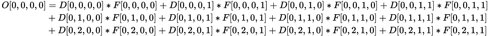
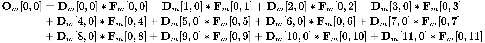
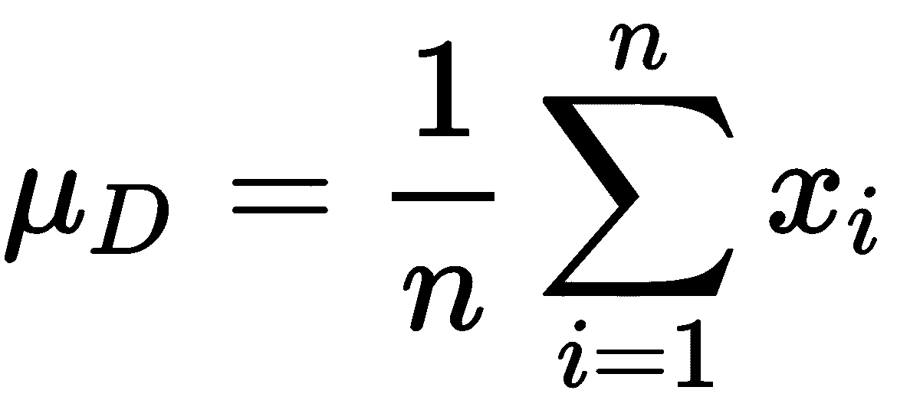

# 四、了解卷积网络

在本章中，我们将讨论**卷积神经网络**(**CNN**)及其在**计算机视觉** ( **CV** )中的应用。CNN 开启了现代深度学习革命。它们是几乎所有最近的 CV 进步的基础，包括**生成对抗网络** ( **GANs** )、对象检测、图像分割、神经类型转移等等。出于这个原因，我们认为 CNN 值得深入研究，这超出了我们对它们的基本理解。

为此，我们首先简要回顾一下 CNN 的构建模块，即卷积层和池层。我们将讨论目前使用的各种类型的卷积，因为它们反映在大量的 CNN 应用中。我们还将学习如何可视化 CNN 的内部状态。然后，我们将关注正则化技术并实现一个迁移学习示例。

本章将涵盖以下主题:

*   了解 CNN
*   介绍迁移学习


# 了解 CNN

在[第一章](b94f711b-daab-4de7-97b7-b7efccd0b392.xhtml)、**神经网络的基本原理、*中，我们讨论了许多 NN 运算都有坚实的数学基础，卷积也不例外。让我们从定义数学卷积开始:*

 *

在这里，我们有以下内容:

*   卷积运算用*表示。
*   *f* 和 *g* 是具有共同参数 *t* 的两个函数。
*   卷积的结果是第三个函数， *s(t)* (不仅仅是单个值)。

*f* 和 *g* 在值 *t* 的卷积是 *f(t)* 和 *g(t-τ)* 的反转(镜像)移位值的乘积的积分，其中 *t-τ* 代表移位。也就是说，对于在时间 *t* 的 *f* 的单个值，我们在范围内移动 *g* ，并且由于积分的原因，我们连续计算乘积 *f(t)* *g(t-τ)* 。积分(以及卷积)相当于两个函数乘积曲线下的面积。

下图最能说明这一点:


左图:卷积，其中 *g* 被移位和反转；右图:卷积运算的逐步说明

在卷积运算中， *g* 被移位和反转，以保持运算的可交换性。在 CNN 的上下文中，我们可以忽略这个属性，我们可以在不反转 *g* 的情况下实现它。在这种情况下，这种操作称为互相关。这两个术语可以互换使用。

我们可以用以下公式定义 *t* 的离散(整数)值的卷积(与连续情况非常相似):


我们也可以将其推广到具有两个共享输入参数的函数的卷积，这两个参数是 *i* 和 *j* :


我们可以用类似的方式推导出三个参数的公式。

在 CNN 中，函数 *f* 是卷积运算(也称为卷积层)的输入。根据输入维度的数量，我们有 1D，2D，或三维卷积。а时间序列输入是 1D 向量，图像输入是 2D 矩阵，3D 点云是 3D 张量。另一方面，函数 *g* 被称为内核(或过滤器)。它具有与输入数据相同的维数，并且由一组可学习的权重来定义。例如，用于 2D 卷积的大小为 *n* 的滤波器是一个 *n×n* 矩阵。下图说明了在单个 3×3 切片上应用 2×2 滤波器的 2D 卷积:


2D convolution with a 2×2filter applied over a single 3×3 slice

卷积的工作方式如下:

1.  我们沿着输入张量的所有维度滑动滤波器。
2.  在每个输入位置，我们将每个滤波器权重乘以其在给定位置的相应输入张量单元。组成单个输出细胞的输入细胞被称为**感受野**。我们将所有这些值相加，得出单个输出像元的值。

与每个输出单元从所有输入收集信息的全连接层不同，卷积输出单元的激活由其感受野中的输入决定。这一原则最适用于分层结构的数据，如图像。例如，相邻像素形成有意义的形状和对象，但是图像一端的像素不太可能与另一端的像素有关系。使用全连接层将所有输入像素与每个输出单元连接起来就像要求网络大海捞针一样。它无法知道输入像素是否在输出单元的接收域中。

过滤器突出了感受野中的一些特殊特征。该操作的输出是一个张量(称为特征图)，它标记了检测到特征的位置。因为我们在整个输入张量中应用相同的滤波器，所以卷积是平移不变的；也就是说，它可以检测相同的特征，而不管它们在图像上的位置。然而，卷积既不是旋转不变的(如果旋转，不保证检测到特征)，也不是比例不变的(不保证在不同比例下检测到相同的伪影)。

在下图中，我们可以看到 1D 和三维卷积的例子(我们已经介绍了一个 2D 卷积的例子):


1D 卷积:滤光器(用多色线表示)在单轴上滑动；3D 卷积:过滤器(用虚线表示)在三个轴上滑动

CNN 卷积可以有多个过滤器，突出显示不同的特征，从而产生多个输出特征图(每个过滤器一个)。它还可以从多个要素图中收集输入，例如，先前卷积的输出。特征映射(输入或输出)的组合称为体积。在这种情况下，我们也可以将特征图称为切片。虽然这两个术语指的是同一个东西，但是我们可以把切片看作是体积的一部分，而特征映射突出了它作为特征映射的作用。

正如我们在本节前面提到的，每个体积(以及过滤器)都由一个张量表示。例如，红色、绿色和蓝色(RGB)图像由三个 2D 切片(每个颜色通道一个切片)的 3D 张量表示。但是在 CNN 的上下文中，我们为小批量中的样本索引增加了一个维度。这里，1D 卷积将具有 3D 输入和输出张量。它们的轴可以是 *NCW* 或 *NWC* 的顺序，其中 *N* 是小批量中样本的索引， *C* 是体积中深度切片的索引， *W* 是每个样本的向量大小。同样，2D 卷积将由 *NCHW* 或 *NHWC* 张量表示，其中 *H* 和 *W* 是切片的高度和宽度。3D 卷积将有一个 *NCLHW* 或 *NLHWC* 顺序，其中 *L* 代表切片的深度。

We use 2D convolutions to work with RGB images. However, we may consider the three colors an additional dimension, hence making the RGB image 3D. Why didn't we use 3D convolutions, then? The reason for this is that, even though we can think of the input as 3D, the output is still a 2D grid. Had we used 3D convolution, the output would also be 3D, which doesn't carry any meaning in the case of 2D images.

假设我们有 *n* 个输入和 *m* 个输出片。在这种情况下，我们将在一组 *n* 输入切片上应用 *m* 过滤器。每个过滤器将生成一个唯一的输出切片，该切片突出显示过滤器检测到的特征( *n* 到 *m* 的关系)。

根据输入和输出切片的关系，我们得到跨通道和深度方向的卷积，如下图所示:


左:跨通道卷积；右图:深度方向卷积

让我们讨论一下它们的属性:

*   **跨通道卷积**:一个输出片接收来自所有输入片的输入( *n* 一对一关系)。对于多个输出片，关系变为 *n* -to- *m* 。换句话说，每个输入切片对每个输出切片的输出都有贡献。每对输入/输出切片使用一个对该对唯一的单独的过滤器切片。让我们用 *F* 来表示滤镜的大小(宽度和高度相等)，用*C[in]来表示输入体积的深度，用 *C [out]* 来表示输出体积的深度。这样，我们可以通过以下等式计算 2D 卷积中的总权重数 *W* :*


这里，+1 表示每个滤波器的偏置权重。假设我们有三个切片，并希望对它们应用四个 5 *×* 5 滤镜。如果我们这样做，卷积滤波器将总共有 *(3*5*5 + 1) * 4 = 304* 个权重，四个输出切片(深度为 4 的输出体积)，每个切片一个偏移。对于三个输入切片中的每一个，每个输出切片的滤波器将具有三个 5 *×* 5 滤波器贴片和一个偏置，总共 3*5*5 + 1 = 76 个权重。

*   **深度方向卷积**:每个输出切片从单个输入切片接收输入。这是对之前案例的一种逆转。在其最简单的形式中，我们对单个输入切片应用滤波器以产生单个输出切片。在这种情况下，输入和输出体积具有相同的深度，即 *C* 。我们还可以指定一个**通道乘数**(一个整数， *m* )，其中我们在单个输出切片上应用 *m* 个滤波器来产生 *m* 个输出切片。这是一个一对一关系的例子。在这种情况下，输出片的总数是 *n * m* 。我们可以用下面的公式计算 2D 深度方向卷积中的权值数量 *W* :


这里， *m* 是通道乘数， *+C* 表示每个输出片的偏置。

卷积运算也由另外两个参数描述:

*   **S** **tride** 是我们每步在输入切片上滑动滤波器的位置数。默认情况下，步幅为 1。如果它大于 1，那么我们称之为**步幅卷积**。最大的步幅增加了输出神经元的感受野。对于步幅 2，输出切片的大小大约是输入的四分之一。换句话说，与步长为 1 的卷积相比，一个输出神经元将覆盖四倍大的区域。接下来的层中的神经元将逐渐从输入图像的较大区域捕获输入。
*   **在卷积运算之前，用零的行和列填充**输入切片的边缘。使用填充的最常见方式是生成与输入尺寸相同的输出。新填充的零将参与切片的卷积运算，但它们不会影响结果。

知道了输入维度和滤波器大小，我们就可以计算输出切片的维度。假设输入切片的大小为 *I* (等高宽)，滤镜的大小为 *F* ，步幅为 *S* ，填充为 *P* 。这里，输出切片的尺寸 *O* 由以下等式给出:


除了步幅卷积，我们还可以使用**池**操作来增加更深层神经元的感受域，并减少未来切片的大小。池将输入切片分成一个网格，其中每个网格单元代表许多神经元的感受野(就像卷积一样)。然后，对网格的每个单元应用池化操作。类似于卷积，汇集由步幅、 *S* 和感受野的大小、 *F* 来描述。如果输入片的大小为 *I* ，那么池的输出大小的公式如下:


实际上，只使用了两种组合。第一个是步幅为 2 的 2 *×* 2 感受野，而第二个是步幅为 2 的 3 *×* 3 感受野(重叠)。最常见的池操作如下:

*   **Max pooling** :传播感受野输入值的最大值。
*   **平均汇集**:传播感受野输入的平均值。
*   **全局平均汇集** ( **缺口**):这与平均汇集相同，但汇集区域与特征图 *I×I* 大小相同。GAP 执行一种极端类型的降维:输出是单个标量，代表整个特征图的平均值。

通常，我们会将一个或多个卷积层与一个汇集(或跨步卷积)层交替使用。以这种方式，卷积层可以检测感受野大小的每个级别的特征，因为更深层的聚集感受野大小大于网络开始处的感受野大小。与初始层相比，更深的层也有更多的过滤器(因此，更高的体积深度)。网络开始处的特征检测器在一个小的感受野上工作。它只能检测所有类共享的有限数量的要素，如边或线。

另一方面，更深的层将检测到更复杂和更多的特征。例如，如果我们有多个类，如汽车、树或人，每个类都有自己的一组特征，如轮胎、门、树叶和脸。这将需要更多的特征检测器。通过添加一个或多个完全连接的层，最终卷积(或池化)的输出被“转换”为目标标签。

现在我们已经对卷积、池操作和 CNN 有了一个概述，在下一节中，我们将关注不同类型的卷积操作。


# 卷积的类型

到目前为止，我们已经讨论了最常见的卷积类型。在接下来的章节中，我们将讨论它的一些变体。


# 转置卷积

在我们到目前为止讨论的卷积运算中，输出维数等于或小于输入维数。相比之下，转置卷积(由马修·d·泽勒、陈爱龙·克里希南、格雷厄姆·w·泰勒和罗布·弗格斯在*解卷积网络*中首次提出:[https://www . Matthew zeiler . com/mattzeiler/de convolution Networks . pdf](https://www.matthewzeiler.com/mattzeiler/deconvolutionalnetworks.pdf))允许我们对输入数据进行上采样(它们的输出大于输入)。该操作也被称为**去卷积**、**分数步长卷积**或**亚像素卷积**。这些名字有时会导致混淆。为了说明问题，请注意，转置卷积实际上是一种常规卷积，带有略微修改的输入切片或卷积滤波器。

为了更详细的解释，我们将从单个输入和输出切片上的 1D 正则卷积开始:


1D 正则卷积

它使用大小为 4、步幅为 2、填充为 2 的过滤器(在上图中用灰色表示)。输入是大小为 6 的向量，输出是大小为 4 的向量。滤镜，一个向量 **f** = [1，2，3，4]，总是相同的，但是对于我们应用它的每个位置，它用不同的颜色表示。各个输出单元用相同的颜色表示。箭头显示哪些输入像元构成一个输出像元。

本节中讨论的例子是受这篇论文的启发；*反卷积层和卷积层一样吗？*(【https://arxiv.org/abs/1609.07009】T2)。

接下来，我们将讨论相同的示例(1D、单个输入和输出切片、大小为 4 的滤波器、填充 2 和步长 2)，但针对转置卷积。下图显示了实现它的两种方法:


左图:步长为 2 的卷积，应用了转置滤波器 **f** 。输出开始和结束处的 2 个像素被裁剪；右图:步长为 0.5 的卷积，应用于输入数据，用子像素填充。输入用 0 值像素(灰色)填充。

我们来详细讨论一下:

*   In the first case, we have a regular convolution with stride 2 and a filter represented as transposed row matrix (equivalent to column matrix) with size 4:  (shown in the preceding diagram, left). Note that the stride is applied over the output layer as opposed to the regular convolution, where we stride over the input. By setting the stride larger than 1, we can increase the output size, compared to the input. Here, the size of the input slice is *I*, the size of the filter is *F*, the stride is *S*, and the input padding is *P*. Due to this, the size, *O*, of the output slice of a transposed convolution is given by the following formula:

    

    在这个场景中，大小为 4 的输入产生大小为 *2*(4 - 1) + 4 - 2*2 = 6* 的输出。我们还在输出向量的开头和结尾裁剪两个单元，因为它们只从单个输入单元收集输入。

*   在第二种情况下，输入由现有像素之间的虚拟 0 值子像素填充(如右图所示)。这就是子像素卷积这个名字的由来。把它想象成填充，但是在图像内部，而不仅仅是沿着边界。一旦输入以这种方式转换，就应用常规卷积。

让我们比较两种场景中的两个输出单元格， *o* [1] 和 *o* [3] 。如上图所示，在任何一种情况下， *o* [1] 从第一个和第二个输入单元格接收输入，而 *o* [3] 从第二个和第三个单元格接收输入。事实上，这两种情况之间的唯一区别是参与计算的权重指数。然而，权重是在训练期间学习的，因此，该指数并不重要。因此，这两种操作是等效的。

接下来，让我们从子像素的角度来看看 2D 转置卷积(输入在底部)。与 1D 的情况一样，我们在输入切片中插入 0 值像素和填充以实现上采样:


具有填充 1 和步幅 2 的 2D 转置卷积的前三步:来源:https://github.com/vdumoulin/conv_arithmetic,·https://arxiv.org/abs/1603.07285

正则卷积的反向传播操作是转置卷积。


# 1×1 卷积

1 *×* 1(或逐点)卷积是卷积的特殊情况，其中卷积滤波器的每个维度的大小为 1(2D 卷积中的 1 *×* 1，3D 中的 1 *×* 1 *×* 1)。起初，这没有意义——1*×*1 滤波器不会增加输出神经元的感受野大小。这种卷积的结果将是逐点缩放。但它在另一方面也很有用——我们可以使用它们来改变输入和输出体积之间的深度。

为了理解这一点，让我们回忆一下，一般来说，我们有深度为 *D* 切片的输入体积和用于 *M* 输出切片的 *M* 过滤器。通过对所有输入切片应用唯一的过滤器来生成每个输出切片。如果我们使用 1 *×* 1 滤波器和 *D！= M* ，我们将得到相同大小的输出切片，但是具有不同的体积深度。同时，我们不会改变输入和输出之间的感受野大小。最常见的用例是减少输出体积，或 *D > M* (维度减少)，俗称“瓶颈”层。


# 深度可分卷积

跨通道卷积中的输出切片使用单个滤波器接收来自所有输入切片的输入。过滤器尝试学习 3D 空间中的特征，其中两个维度是空间维度(切片的高度和宽度),第三个维度是通道。因此，该滤波器映射空间和跨信道相关性。

**深度可分卷积** ( **DSC** ，*例外:深度可分卷积*，[https://arxiv.org/abs/1610.02357](https://arxiv.org/abs/1610.02357)的深度学习可以完全解耦跨通道和空间相关性。DSC 结合了两种运算:深度方向卷积和 1 *×* 1 卷积。在深度方向卷积中，单个输入切片产生单个输出切片，因此它只映射空间(而不是跨通道)相关性。对于 1 *×* 1 卷积，我们得到相反的结果。下图显示了 DSC:


深度可分卷积

DSC 通常在第一次(深度方向)操作后实现，没有非线性。

Let's compare the standard and depthwise separable convolutions. Imagine that we have 32 input and output channels and a filter with a size of 3*×*3\. In a standard convolution, one output slice is the result of applying one filter for each of the 32 input slices for a total of *32 * 3 * 3 = 288* weights (excluding bias). In a comparable depthwise convolution, the filter has only *3 * 3 = 9* weights and the filter for the 1*×*1 convolution has *32 * 1 * 1 = 32* weights. The total number of weights is *32 + 9 = 41*. Therefore, the depthwise separable convolution is faster and more memory-efficient compared to the standard one.

# 扩张的回旋

回想一下我们在*CNN*部分快速回顾开始时介绍的离散卷积公式。为了解释扩张卷积(【https://arxiv.org/abs/1511.07122】、[、](https://arxiv.org/abs/1511.07122))的多尺度上下文聚合，让我们从下面的公式开始:


我们将用 ** [l]* 来表示膨胀卷积，其中 *l* 是一个正整数值，称为膨胀因子。关键是我们对输入应用滤波器的方式。我们在大小为 *(n*l-1)×(n*l-1)* 的感受野上稀疏地应用相同的滤波器，而不是在 *n×n* 感受野上应用 *n×n* 滤波器。我们仍然将每个滤波器权重乘以一个输入切片单元，但是这些单元彼此相距 *l* 的距离。常规卷积是扩张卷积的特例，其中 *l=1* 。下图最能说明这一点:


膨胀因子为 l=2 的膨胀卷积:这里显示了运算的前两步。底层是输入，而顶层是输出。资料来源:https://github.com/vdumoulin/conv_arithmetic

扩张的回旋可以成倍地增加感受野的大小，而不会损失分辨率或覆盖范围。我们也可以通过步幅卷积或合并来增加感受野，但代价是分辨率和/或覆盖范围。为了理解这一点，让我们想象我们有一个步幅卷积，步幅为 *s > 1* 。在这种情况下，输出限幅比输入限幅小 *s* 倍(分辨率损失)。如果我们进一步增加*s>n*(*n*是池或卷积核的大小)，我们会损失覆盖范围，因为输入切片的一些区域根本不会参与输出。此外，扩展卷积不会增加计算和内存成本，因为滤波器使用与常规卷积相同数量的权重。


# 提高 CNN 的效率

最近**深度学习** ( **DL** )取得进步的一个主要原因是它能够非常快速地运行**神经网络** ( **NNs** )。这在很大程度上是因为 NN 算法的本质和**图形处理单元**(**GPU**)的细节之间的良好匹配。在[第 1 章](b94f711b-daab-4de7-97b7-b7efccd0b392.xhtml)、*神经网络的基本要素*中，我们强调了矩阵乘法在神经网络中的重要性。作为证明，也可以将卷积转换成矩阵乘法。矩阵乘法是令人尴尬的并行(相信我，这是一个术语——你可以谷歌一下！).每个输出像元的计算与任何其他输出像元的计算无关。因此，我们可以并行计算所有输出。

并非巧合的是，GPU 非常适合这种高度并行的操作。一方面，与**中央处理器** ( **CPU** )相比，GPU 拥有大量的计算核心。即使 GPU 核比 CPU 核更快，我们仍然可以并行计算更多的输出单元。但更重要的是，GPU 是针对内存带宽优化的，而 CPU 是针对延迟优化的。这意味着 CPU 可以非常快速地获取小块内存，但在获取大块内存时会很慢。GPU 做的正好相反。正因为如此，在 NNs 的大型矩阵乘法等任务中，GPU 更有优势。

除了硬件细节，我们还可以在算法方面优化 CNN。CNN 的大部分计算时间都用于卷积本身。尽管卷积的实现足够简单，但在实践中，有更有效的算法来实现相同的结果。尽管当代的 DL 库，如 TensorFlow 或 PyTorch，对开发者屏蔽了这些细节，但在本书中，我们的目标是对 DL 有更深的理解。

因此，在下一节中，我们将讨论两种最流行的快速卷积算法。


# 作为矩阵乘法的卷积

在这一节中，我们将描述我们用来将卷积转换为矩阵乘法的算法，就像它是如何在 cuDNN 库中实现的一样( *cuDNN:深度学习的有效原语*，【https://arxiv.org/abs/1410.0759】)。为了理解这一点，让我们假设对 RGB 输入图像执行跨通道 2D 卷积。让我们看看下表中卷积的参数:

| **参数** | **符号** | **值** |
| 小批量 | 普通 | one |
| 输入特征图(体积深度) | C | 3(每个 RGB 通道一个) |
| 输入图像高度 | H | four |
| 输入图像宽度 | W | four |
| 输出特征图(体积深度) | K | Two |
| 过滤器高度 | 稀有 | Two |
| 过滤器宽度 | S | Two |
| 输出要素地图高度 | P | 2(基于输入/过滤器尺寸) |
| 输出要素地图宽度 | Q | 2(基于输入/过滤器尺寸) |

为了简单起见，我们假设我们有零填充和步幅 1。我们将用 *D* 表示输入张量，用 *F* 表示卷积滤波器张量。矩阵卷积的工作方式如下:

1.  我们将张量 *D* 和 *F* 分别展开成和矩阵。
2.  然后，我们将这些矩阵相乘，得到输出矩阵。

我们在第一章、*和*中讨论了矩阵乘法。现在，让我们集中讨论如何展开矩阵中的张量。下图显示了如何做到这一点:


作为矩阵乘法的卷积；受 https://arxiv.org/abs/1410.0759 的启发

每个特征图有不同的颜色(R，G，B)。在常规卷积中，滤波器为方形，我们将其应用于方形输入区域。在变换中，我们将 *D* 的每个可能的正方形区域展开成一列 **D** *[m]* 。然后，我们把 *F* 的每一个正方形分量展开成一行 **F** *[m]* 。这样，每个输出单元的输入和滤波数据位于矩阵 **D** *[m]* 和 **F** *[m]* 的单列/单行中。这使得将输出值计算为矩阵乘法成为可能。转换后的输入/滤波器/输出的维数如下:

*   dim(**D***[m]*)= CRS*×*NPQ = 12*×*4
*   dim(**F***mT5)= K*×*CRS = 2*×*12*
*   dim(**O***[m]*)= K*×*NPQ = 2*×*4

为了理解这种变换，让我们学习如何使用常规卷积算法计算第一个输出像元:



接下来，让我们观察相同的公式，但这次是以矩阵乘法的形式:



如果我们比较这两个方程的分量，就会发现它们完全一样。即*D*【0，0，0，0】=**D**[m]【0，0】，*F*【0，0，0】=**F**[m]【0，0】，*D*【0，0，0，1】=**D**[m]【0，1】， *F 我们可以对其余的输出单元进行同样的操作。因此，两种方法的输出是相同的。*

One disadvantage of the matrix convolution is increased memory usage. In the preceding diagram, we can see that some of the input elements are duplicated multiple times (up to RS = 4 times, like D4).

# 维诺格拉卷积

与直接卷积相比，Winograd 算法(*卷积神经网络的快速算法*、【https://arxiv.org/abs/1509.09308】和)可以提供 2 或 3 个 *×* 的加速比。为了解释这一点，我们将使用在*卷积中使用的相同符号作为矩阵乘法*部分，但使用了 *3×3* ( *R=S=3* )滤波器。我们还假设输入切片大于 *4×4* ( *H > 4，W > 4* )。

以下是计算 Winograd 卷积的方法:

1.  将输入图像分成 4 个 *×* 4 个与步幅 2 重叠的图块，如下图所示:


输入被分成小块

区块大小可以变化，但为了简单起见，我们将只关注 4 个 *×* 4 个区块。

2.  使用以下两个矩阵乘法变换每个图块:


在前面的公式中，矩阵 **D** 是输入切片(具有圆形值的切片),而 **B** 是一个特殊的矩阵，由 Winograd 算法的细节产生(您可以在本节开头链接的论文中找到更多关于它们的信息)。

3.  使用以下两个矩阵乘法变换滤波器:


在前面的公式中，矩阵 **F** (具有点值的矩阵)是一个输入和一个输出切片之间的 3 *×* 3 卷积滤波器。 **G** 和它的转置也是特殊的矩阵，由 Winograd 算法的细节产生。注意，变换后的滤波器矩阵 **F** *[ t ]* 与输入图块 **D** *[ t ]* 具有相同的维数。

4.  将变换后的输出计算为变换后的输入和滤波器的**元素式**乘法(符号):


5.  将输出转换回原始形式:


**是一个变换矩阵，它可以将变换回直接卷积的形式。如上式和下图所示，Winograd 卷积允许我们同时计算 2 个 *×* 2 个输出图块(四个输出单元):**

 **

The Winograd convolution allows us to compute four output cells simultaneously

乍一看，Winograd 算法执行的运算似乎比直接卷积多得多。那么，怎样才能更快呢？为了找到答案，我们来关注一下转换。这里的关键是我们只需要执行一次，然后**D***t*就可以参与所有 *K* (以下标注)输出片的输出。因此，分摊到所有输出中，对性能影响不大。接下来，我们来看看的改造。这个更好，因为一旦我们计算了 **F** *[ t ]* ，我们就可以将它应用 *N×P×Q* 次(跨输出切片的所有单元和批中的所有图像)。因此，这种转换的性能损失可以忽略不计。类似地，输出变换分摊到输入通道 c 的数量上。

最后，我们将讨论逐元素乘法，，它在输出切片的所有单元上应用 *P×Q* 次，并占用大部分计算时间。它由 16 个标量乘法运算组成，并允许我们计算 2 个 *×* 2 输出瓦片，这导致一个输出单元的四次乘法。让我们将其与直接卷积进行比较，在直接卷积中，我们必须为单个输出执行 *3*3=9* 标量乘法(每个滤波器元素乘以每个感受野输入单元)。因此，Winograd 卷积需要的运算 *9/4 = 2.25* 更少。

Winograd 卷积在处理较小的滤波器尺寸(例如，3 *×* 3)时具有最大的优势。使用更大的滤波器(例如 11 *×* 11)的卷积可以通过快速傅立叶变换(FFT)卷积有效地实现，这超出了本书的范围。

在下一节中，我们将试图通过可视化 CNN 的内部状态来理解其内部工作方式。


# 可视化 CNN

对神经网络的批评之一是他们的结果不可解释。通常认为神经网络是一个黑盒，其内部逻辑对我们来说是隐藏的。这可能是一个严重的问题。一方面，我们不太可能相信一种以我们不理解的方式工作的算法，而另一方面，如果我们不知道 CNN 是如何工作的，就很难提高它的准确性。因此，在接下来的章节中，我们将讨论两种可视化 CNN 内部层的方法，这两种方法都有助于我们深入了解他们的学习方式。


# 导向反向传播

导向反向传播(*力求简单:全卷积网络*，【https://arxiv.org/abs/1412.6806】)允许我们可视化 CNN 一层的单个单元所学习的特征。下图显示了算法的工作原理:


引导反向传播可视化:受 https://arxiv.org/abs/1412.6806.的启发

下面是一步一步的执行:

1.  首先，我们从一个有 ReLU 激活的常规 CNN(例如，AlexNet，VGG，等等)开始。
2.  然后，我们将单个图像 *f ^((0))* 馈送给网络，并将其向前传播，直到到达我们感兴趣的层 *l* 。这可能是任何网络层—隐藏或输出、卷积或全连接。
3.  将该层的输出张量 *f ^((l))* 中除一个激活之外的所有激活设置为 0。例如，如果我们对分类网络的输出图层感兴趣，我们将选择具有最大激活的单元(相当于预测的类)，并将其值设置为 1。所有其他单位将被设置为 0。通过这样做，我们可以隔离出有问题的单元，并查看输入图像的哪些部分对其影响最大。
4.  最后，我们向后传播所选单元的激活值，直到我们到达输入层和重建图像 *R ^((0))* 。后向传递与常规反向传播非常相似(但不相同)，即我们仍然使用转置卷积作为前向卷积的反向运算。不过，在这种情况下，我们感兴趣的是它的图像恢复特性，而不是误差传播。因此，我们不会受到传播一阶导数(梯度)的要求的限制，并且我们可以以改善可视化的方式修改信号。

为了理解反向传递，我们将使用单个 3 *×* 3 输入和输出切片的卷积示例。让我们假设我们正在使用一个 1 *×* 1 的过滤器，单个权重等于 1(我们重复输入)。下图显示了此卷积，以及实现向后传递的三种不同方式:


卷积和三种不同的图像重建方法；受 https://arxiv.org/abs/1412.6806.的启发

让我们详细讨论实现向后传递的三种不同方式:

*   **常规反向传播**:反向信号在输入图像上进行预处理，因为它也取决于正向激活([第 1 章](b94f711b-daab-4de7-97b7-b7efccd0b392.xhtml)、*神经网络的基本原理*，在*反向传播*章节)。我们的网络使用 ReLU 激活功能，所以信号将只通过在正向传递中有积极激活的单元。
*   **解卷积网络** ( *解卷积网络*，[https://arxiv.org/abs/1311.2901](https://arxiv.org/abs/1311.2901)):层 *l* 的反向信号只依赖于层 *l+1* 的反向信号。无论正向激活是什么，deconvnet 只会将 *l+1* 的正值发送到 *l* 。理论上，信号根本没有在输入图像上进行预处理。在这种情况下，deconvnet 会尝试根据其内部知识和图像类来恢复图像。然而，这并不完全正确——如果网络包含 max-pooling 层，deconvnet 将为每个池层存储所谓的**开关**。每个开关代表一个地图的单位与最大激活的前进通道。该图决定了如何通过反向通道路由信号(您可以在源文件中了解更多相关信息)。
*   **导向反向传播**:这是去配置和常规反向传播的结合。它将只发送在 *l* 正向激活和在 *l+1* 正向反向激活的信号。这将来自较高层的额外引导信号(因此得名)添加到常规反向传播中。本质上，该步骤防止负梯度流过反向通道。基本原理是，充当我们的起始单元的抑制器的单元将被阻断，并且重建的图像将不受它们的影响。导向反向传播性能如此之好，以至于它不需要使用去配置网络开关，而是将信号路由到每个汇集区域中的所有单元。

以下屏幕截图显示了使用导向反向传播和 AlexNet 生成的重建图像:


从左至右:AlexNet 上使用引导反向传播的原始图像、颜色重建和灰度重建；这些图像是用 https://github.com/utkuozbulak/pytorch-cnn-visualizations.生成的


# 梯度加权类激活映射

为了理解梯度加权的类激活映射( *Grad-CAM:通过基于梯度的定位*、【https://arxiv.org/abs/1610.02391】和来自深度网络的视觉解释)，让我们引用原始论文本身:

“Grad-CAM 使用流入最终卷积层的任何目标概念的梯度(例如,‘dog’的逻辑或甚至是标题)来生成粗略的定位图，突出显示图像中用于预测概念的重要区域。”

以下屏幕截图显示了 Grad-CAM 算法:


Grad-CAM 模式；资料来源:https://arxiv.org/abs/1610.02391

现在，让我们看看它是如何工作的:

1.  首先，你从一个分类 CNN 模型开始(例如，VGG)。
2.  然后，您向 CNN 提供一个图像，并将其传播到输出层。
3.  就像我们在引导式反向传播中所做的那样，我们获取具有最大激活的输出单元(相当于预测的类***【c***)，将其值设置为 1，并将所有其他输出设置为 0。换句话说，创建预测的一次性编码向量， *y ^c* 。

4.  接下来，使用反向传播计算*y^c 相对于最终卷积层的特征图*A^k 的梯度。 *i* 和 *j* 为特征图中的单元坐标。**
5.  然后，计算标量权重，其测量特征图 *k* 对于预测类别 *c* 的“重要性”:


6.  最后，计算最终卷积层的标量权重和前向激活特征映射之间的加权组合，并在此之后使用 ReLU:


注意，我们将标量重要性权重乘以张量特征图 *A ^( k )* 。结果是一个热图，其尺寸与特征图相同(在 VGG 和 AlexNet 的情况下为 14 * × * 14)。它将突出显示对类别 *c* 最重要的特征地图区域。ReLU 丢弃了负面激活，因为我们只对增加*y^c 的特性感兴趣。我们可以将该热图向上采样回输入图像的大小，然后将其叠加在上面，如下面的屏幕截图所示:*


从左到右:输入图像；上采样热图；叠加在输入(RGB)上的热图；灰度热图。这些图像是用 https://github.com/utkuozbulak/pytorch-cnn-visualizations.生成的

Grad-CAM 的一个问题是将热图从 14 *×* 14 上采样到 224 *×* 224，因为它没有提供每个类的重要特征的细粒度视角。为了缓解这一问题，论文作者提出了 Grad-CAM 和导向反向传播的组合(显示在本节开头的 Grad-CAM 方案中)。我们采用上采样的热图，并将其与具有逐元素乘法的引导后投影可视化相结合。输入图像包含两个对象:一只狗和一只猫。因此，我们可以用这两个类运行 Grad-CAM(图中的两行)。这个例子显示了不同的类如何在同一幅图像中检测不同的相关特征。

在下一节中，我们将讨论如何在正则化的帮助下优化 CNN。


# CNN 正则化

正如我们在[第一章](b94f711b-daab-4de7-97b7-b7efccd0b392.xhtml)、*神经网络的基本原理*中所讨论的，一个神经网络可以近似任何函数。但是权力越大，责任越大。NN 可以学习近似目标函数的噪声，而不是它的有用分量。例如，假设我们正在训练一个神经网络来分类一幅图像是否包含汽车，但由于某种原因，训练集主要包含红色汽车。结果可能是 NN 将红色与汽车联系在一起，而不是它的形状。现在，如果网络在推理模式下看到一辆绿色汽车，它可能不会识别出它，因为颜色不匹配。这个问题被称为过度拟合，它是机器学习的核心(在深度网络中更是如此)。在本节中，我们将讨论几种防止这种情况的方法。这些技术统称为**正则化**。

在 NNs 的情况下，这些正则化技术通常在训练过程中施加一些人为的限制或障碍，以防止网络过于近似目标函数。他们试图引导网络学习目标函数的一般近似，而不是特定近似，希望这种表示能够很好地概括测试数据集的先前未见过的示例。您可能已经熟悉了其中的许多技术，所以我们将长话短说:

*   **输入特征缩放** : 。该操作缩放[0，1]范围内的所有输入。例如，强度为 125 的像素将具有比例值。特征缩放快速且易于实现。

*   **输入标准分数** : 。这里，μ和σ是所有训练数据的平均值和标准偏差。它们通常是为每个输入维度单独计算的。例如，在 RGB 图像中，我们将计算每个通道的平均值 *μ* 和 *σ* 。我们应该注意到 *μ* 和 *σ* 必须根据训练数据进行计算，然后应用于测试数据。或者，如果在整个数据集上计算 *μ* 和 *σ* 不切实际，我们可以针对每个样本计算它们。
*   **数据扩充**:在将训练样本输入网络之前，我们通过对其进行随机修改(旋转、倾斜、缩放等)来人为增加训练集的大小。
*   **L2 正则化**(或**权重衰减**):这里，我们在代价函数中加入一个特殊的正则化项。让我们假设我们正在使用 MSE ( [第 1 章](b94f711b-daab-4de7-97b7-b7efccd0b392.xhtml)、*NNs 的螺母和螺栓*、*梯度下降*部分)。这里，MSE + L2 正则化公式如下:


这里，*w[j]是 *k* 网络总权重之一，λ是权重衰减系数。基本原理是，如果网络权重*w[j]很大，那么成本函数也会增加。实际上，重量衰减惩罚了大重量(因此得名)。这防止了网络过于依赖与这些权重相关联的一些特征。当网络被迫与多个特征一起工作时，过拟合的机会较小。实际上，当我们计算关于每个权重的权重衰减成本函数(前述公式)的导数，然后将其传播到权重本身时，权重更新规则从变为。**

*   **Dropout** :在这里，我们随机地、周期性地从网络中移除一些神经元(连同它们的输入和输出连接)。在小批量训练期间，每个神经元都有被随机丢弃的概率 *p* 。这是为了确保没有神经元过度依赖其他神经元，而是“学习”对网络有用的东西。
*   **批量归一化** ( **BN** ，*批量归一化:通过减少内部协变量偏移来加速深度网络训练*，[https://arxiv.org/abs/1502.03167](https://arxiv.org/abs/1502.03167)):这是一种对网络的隐含层应用数据处理的方式，类似于标准分数。它对每个小批量(因此得名)的隐藏层的输出进行标准化，使其平均激活值接近 0，标准偏差接近 1。假设是一个小批量的 *n* 。 *D* 的每个样本是一个向量，，是该向量的索引为 *k* 的单元格。为了清楚起见，我们将省略下面公式中的( *k* )上标；也就是我们会写*x[I]，但是我们会表示。我们可以通过以下方式计算整个迷你批次中每次激活的 BN， *k* :*
    1.  [] :这是小批量的意思。我们对所有样本的每个位置分别计算 *μ* 、 *k* 。
    2.  :这是小批量标准偏差。我们对所有样本分别计算每个位置的 *σ* ，以及 *k* 。
    3.  我们将每个样本标准化。 *ε* 是为了数值稳定性而添加的常数。
    4.   : *γ* 和 *β* 是可学习的参数，我们在每个位置*k*(*γ【T8(k)】*和 *β ^( (k) )* )，在小批量的所有样本上计算它们(同样适用于 *μ* 和 *σ* )。在卷积层中，每个样本， *x* ，是一个具有多个特征映射的张量。为了保持卷积属性，我们计算所有样本上每个位置的 *μ* 和 *σ* ，但是我们在所有特征图的匹配位置中使用相同的 *μ* 和 *σ* 。另一方面，我们计算每个特征地图的 *γ* 和 *β* ，而不是每个位置。

这一节总结了我们对 CNN 的结构和内部工作的分析。在这一点上，我们通常会进行某种 CNN 编码的例子。但是在这本书里，我们想做一些不同的事情。因此，我们不会实现一个简单的旧的前馈 CNN，你可能已经做过了。相反，在下一节中，将向您介绍迁移学习技术——一种使用预先训练的 CNN 模型完成新任务的方法。但是不要担心——我们仍然会从头开始实现 CNN。我们将在第 3 章、*高级卷积网络中讨论这个问题。*通过这种方式，我们将能够利用这一章的知识创建一个更复杂的网络架构。


# 介绍迁移学习

比方说，我们想要在一个任务上训练一个模型，这个任务不像 ImageNet 那样有现成的带标签的训练数据。标记训练样本可能是昂贵、耗时且容易出错的。那么，当一个不起眼的工程师想要用有限的资源解决一个真正的 ML 问题时，他们会怎么做呢？进入**转移学习** ( **TL** )。

TL 是将现有的训练过的 ML 模型应用到一个新的但相关的问题的过程。例如，我们可以使用一个在 ImageNet 上训练的网络，并将其重新用于对杂货店商品进行分类。或者，我们可以使用驾驶模拟器游戏来训练神经网络驾驶模拟汽车，然后使用网络驾驶真实的汽车(但不要在家里尝试！).TL 是一个通用的 ML 概念，适用于所有的 ML 算法，但是在这个上下文中，我们将讨论 CNN。它是这样工作的。

我们从现有的预训练网络开始。最常见的情况是从 ImageNet 获取预训练的网络，但它可以是任何数据集。TensorFlow 和 PyTorch 都有我们可以使用的流行的 ImageNet 预训练神经架构。或者，我们可以用自己选择的数据集来训练自己的网络。

CNN 末端的全连接层充当网络语言(训练期间学习的抽象特征表示)和我们的语言(每个样本的类别)之间的翻译器。你可以把目标语看作是另一种语言的翻译。我们从网络的特征开始，它是最后一个卷积层或汇集层的输出。然后，我们把它们翻译成新任务的不同类集。我们可以通过移除现有预训练网络的最后一个全连接层(或所有全连接层)并用代表新问题类别的另一层来替换它来做到这一点。

让我们看看下图所示的 TL 场景:


在 TL 中，我们可以替换预训练网络的全连接层，并将其重新用于新的问题

然而，我们不能机械地这样做并期望新的网络工作，因为我们仍然必须用与新任务相关的数据来训练新的层。这里，我们有两个选择:

*   **使用网络的原始部分作为特征提取器，仅训练新层**:在这种情况下，我们向网络提供一批新数据的训练，并将其向前传播，以查看网络的输出。这部分就像常规训练一样。但是在后向传递中，我们锁定原始网络的权重，只更新新层的权重。当我们对新问题的训练数据有限时，这是推荐的做法。通过锁定大部分网络权重，我们防止了新数据的过度拟合。
*   **微调整个网络**:在这个场景中，我们将训练整个网络，而不仅仅是最后新添加的层。可以更新所有的网络权重，但我们也可以锁定第一层中的一些权重。这里的想法是，初始层检测一般特性——与特定任务无关——并且重用它们是有意义的。另一方面，较深的层可以检测特定于任务的特性，最好更新它们。当我们有更多的训练数据，不需要担心过拟合时，我们可以使用这种方法。


# 用 PyTorch 实现迁移学习

现在我们知道了 TL 是什么，让我们看看它在实践中是否有效。在本节中，我们将使用 **PyTorch 1.3.1** 和`torchvision` 0.4.2 包在 CIFAR-10 映像上应用高级 ImageNet 预训练网络。我们将使用两种类型的 TL。最好在 GPU 上运行这个例子。

This example is partially based on [https://github.com/pytorch/tutorials/blob/master/beginner_source/transfer_learning_tutorial.py](https://github.com/pytorch/tutorials/blob/master/beginner_source/transfer_learning_tutorial.py).

让我们开始吧:

1.  执行以下导入操作:

```py
import torch
import torch.nn as nn
import torch.optim as optim
import torchvision
from torchvision import models, transforms
```

2.  为方便起见，定义`batch_size`:

```py
batch_size = 50
```

3.  定义训练数据集。我们必须考虑几件事:
    *   CIFAR-10 图像是 32 *×* 32，而 ImageNet 网络期望 224 *×* 224 输入。由于我们使用的是基于 ImageNet 的网络，我们将把 32 个 *×* 32 个 CIFAR 图像上采样为 224 个 *×* 224。
    *   使用 ImageNet 平均值和标准偏差对 CIFAR-10 数据进行标准化，因为这是网络所期望的。
    *   我们还将以随机水平或垂直翻转的形式增加一些数据:

```py
# training data
train_data_transform = transforms.Compose([
    transforms.Resize(224),
    transforms.RandomHorizontalFlip(),
    transforms.RandomVerticalFlip(),
    transforms.ToTensor(),
    transforms.Normalize((0.4914, 0.4821, 0.4465), (0.2470, 
    0.2435, 0.2616))
])

train_set = torchvision.datasets.CIFAR10(root='./data',
                           train=True, download=True,
                           transform=train_data_transform)

train_loader = torch.utils.data.DataLoader(train_set,
                           batch_size=batch_size,
                           shuffle=True, num_workers=2)
```

4.  对验证/测试数据遵循相同的步骤，但这次没有增加:

```py
val_data_transform = transforms.Compose([
    transforms.Resize(224),
    transforms.ToTensor(),
    transforms.Normalize((0.4914, 0.4821, 0.4465), (0.2470, 0.2435, 
    0.2616))
])

val_set = torchvision.datasets.CIFAR10(root='./data',
                                  train=False, download=True,
                                  transform=val_data_transform)

val_order = torch.utils.data.DataLoader(val_set,
                                  batch_size=batch_size,
                                  shuffle=False, num_workers=2)
```

5.  选择`device`，最好是 CPU 上有后备的 GPU:

```py
device = torch.device("cuda:0" if torch.cuda.is_available() else "cpu")
```

6.  定义模型的训练。与 TensorFlow 不同，在 PyTorch 中，我们必须手动迭代训练数据。此方法在整个训练集(一个时期)上迭代一次，并在每次向前传递后应用优化器:

```py
def train_model(model, loss_function, optimizer, data_loader):
    # set model to training mode
    model.train()

    current_loss = 0.0
    current_acc = 0

    # iterate over the training data
    for i, (inputs, labels) in enumerate(data_loader):
        # send the input/labels to the GPU
        inputs = inputs.to(device)
        labels = labels.to(device)

        # zero the parameter gradients
        optimizer.zero_grad()

        with torch.set_grad_enabled(True):
            # forward
            outputs = model(inputs)
            _, predictions = torch.max(outputs, 1)
            loss = loss_function(outputs, labels)

            # backward
            loss.backward()
            optimizer.step()

        # statistics
        current_loss += loss.item() * inputs.size(0)
        current_acc += torch.sum(predictions == labels.data)

    total_loss = current_loss / len(data_loader.dataset)
    total_acc = current_acc.double() / len(data_loader.dataset)

    print('Train Loss: {:.4f}; Accuracy: {:.4f}'.format(total_loss, 
    total_acc))
```

7.  定义模型的测试/验证。这与训练阶段非常相似，但我们将跳过反向传播部分:

```py
def test_model(model, loss_function, data_loader):
    # set model in evaluation mode
    model.eval()

    current_loss = 0.0
    current_acc = 0

    # iterate over  the validation data
    for i, (inputs, labels) in enumerate(data_loader):
        # send the input/labels to the GPU
        inputs = inputs.to(device)
        labels = labels.to(device)

        # forward
        with torch.set_grad_enabled(False):
            outputs = model(inputs)
            _, predictions = torch.max(outputs, 1)
            loss = loss_function(outputs, labels)

        # statistics
        current_loss += loss.item() * inputs.size(0)
        current_acc += torch.sum(predictions == labels.data)

    total_loss = current_loss / len(data_loader.dataset)
    total_acc = current_acc.double() / len(data_loader.dataset)

    print('Test Loss: {:.4f}; Accuracy: {:.4f}'.format(total_loss, 
    total_acc))

    return total_loss, total_acc
```

8.  定义第一个 TL 场景，其中我们使用预训练的网络作为特征提取器:
    *   我们将使用一个被称为 ResNet-18 的流行网络。我们将在*高级网络架构*部分详细讨论这一点。PyTorch 将自动下载预训练的重量。
    *   用具有 10 个输出(每个 CIFAR-10 类一个)的新层替换最后一个网络层。
    *   从反向传递中排除现有的网络层，只将新添加的全连接层传递给 Adam 优化器。
    *   运行`epochs`的训练，并在每个历元后评估网络精度。
    *   借助`plot_accuracy`功能绘制测试精度。它的定义很简单，你可以在本书的代码库中找到它。

下面是`tl_feature_extractor`函数，它实现了所有这些:

```py
def tl_feature_extractor(epochs=5):
    # load the pretrained model
    model = torchvision.models.resnet18(pretrained=True)

    # exclude existing parameters from backward pass
    # for performance
    for param in model.parameters():
        param.requires_grad = False

    # newly constructed layers have requires_grad=True by default
    num_features = model.fc.in_features
    model.fc = nn.Linear(num_features, 10)

    # transfer to GPU (if available)
    model = model.to(device)

    loss_function = nn.CrossEntropyLoss()

    # only parameters of the final layer are being optimized
    optimizer = optim.Adam(model.fc.parameters())

    # train
    test_acc = list()  # collect accuracy for plotting
    for epoch in range(epochs):
        print('Epoch {}/{}'.format(epoch + 1, epochs))

        train_model(model, loss_function, optimizer, train_loader)
        _, acc = test_model(model, loss_function, val_order)
        test_acc.append(acc)

    plot_accuracy(test_acc)
```

9.  实现微调方法。这个函数类似于`tl_feature_extractor`，但是在这里，我们训练的是整个网络:

```py
def tl_fine_tuning(epochs=5):
    # load the pretrained model
    model = models.resnet18(pretrained=True)

    # replace the last layer
    num_features = model.fc.in_features
    model.fc = nn.Linear(num_features, 10)

    # transfer the model to the GPU
    model = model.to(device)

    # loss function
    loss_function = nn.CrossEntropyLoss()

    # We'll optimize all parameters
    optimizer = optim.Adam(model.parameters())

    # train
    test_acc = list()  # collect accuracy for plotting
    for epoch in range(epochs):
        print('Epoch {}/{}'.format(epoch + 1, epochs))

        train_model(model, loss_function, optimizer, train_loader)
        _, acc = test_model(model, loss_function, val_order)
        test_acc.append(acc)

    plot_accuracy(test_acc)
```

10.  最后，我们可以用两种方式中的一种来运行整个过程:
    *   调用`tl_fine_tuning()`来使用五个时期的微调 TL 方法。
    *   调用`tl_feature_extractor()`用特征提取器方法训练网络五个时期。

这是两种情况下五个时期后网络的精确度:


左:特征提取 TL 精度；右图:微调 TL 精度

由于所选择的`ResNet18`预训练模型的大尺寸，网络在特征提取场景中开始过度拟合。


# 使用 TensorFlow 2.0 迁移学习

在本节中，我们将再次实现这两个迁移学习场景，但这次使用的是 **TensorFlow 2.0.0 (TF)** 。这样，我们可以比较这两个库。我们将使用`ResNet50V2`架构代替`ResNet18`(更多信息见[第 3 章](433225cc-e19a-4ecb-9874-8de71338142d.xhtml)、*高级卷积网络*)。除了 TF，本示例还需要 the TF Datasets 1.3.0 包([https://www.tensorflow.org/datasets](https://www.tensorflow.org/datasets))，这是各种流行 ML 数据集的集合。

本例部分基于[https://github . com/tensor flow/docs/blob/master/site/en/tutorials/img/transfer _ learning . ipynb](https://github.com/tensorflow/docs/blob/master/site/en/tutorials/img/transfer_learning.ipynb)。

现在，让我们开始吧:

1.  像往常一样，首先，我们需要进行导入:

```py
import matplotlib.pyplot as plt
import tensorflow as tf
import tensorflow_datasets as tfds 
```

2.  然后，我们将定义小批量和输入图像的大小(图像大小由网络架构决定):

```py
IMG_SIZE = 224
BATCH_SIZE = 50

```

3.  接下来，我们将在 TF 数据集的帮助下加载 CIFAR-10 数据集。`repeat()`方法允许我们在多个时期重复使用数据集:

```py
data, metadata = tfds.load('cifar10', with_info=True, as_supervised=True)
raw_train, raw_test = data['train'].repeat(), data['test'].repeat()
```

4.  然后，我们将定义`train_format_sample`和`test_format_sample`函数，它们将把输入图像转换成合适的 CNN 输入。这些函数扮演的角色与`transforms.Compose`对象扮演的角色相同，我们在*用 PyTorch* 实现迁移学习一节中定义了这个角色。输入转换如下:

    *   图像大小调整为 96 *×* 96，这是预期的网络输入大小。
    *   每个图像通过转换其值来标准化，因此它在(-1；1)区间。
    *   标签被转换用于一键编码。
    *   训练图像被随机地水平和垂直翻转。

让我们看看实际的实现:

```py
def train_format_sample(image, label):
    """Transform data for training"""
    image = tf.cast(image, tf.float32)
    image = tf.image.resize(image, (IMG_SIZE, IMG_SIZE))
    image = (image / 127.5) - 1
    image = tf.image.random_flip_left_right(image)
    image = tf.image.random_flip_up_down(image)

    label = tf.one_hot(label, metadata.features['label'].num_classes)

    return image, label

def test_format_sample(image, label):
    """Transform data for testing"""
    image = tf.cast(image, tf.float32)
    image = tf.image.resize(image, (IMG_SIZE, IMG_SIZE))
    image = (image / 127.5) - 1

    label = tf.one_hot(label, 
    metadata.features['label'].num_classes)

    return image, label
```

5.  接下来是一些样板代码，这些代码将这些转换器分配给训练/测试数据集，并将它们分成小批:

```py
# assign transformers to raw data
train_data = raw_train.map(train_format_sample)
test_data = raw_test.map(test_format_sample)

# extract batches from the training set
train_batches = train_data.shuffle(1000).batch(BATCH_SIZE)
test_batches = test_data.batch(BATCH_SIZE)
```

6.  然后，我们需要定义特征提取模型:
    *   我们将使用 Keras 进行预训练网络和模型定义，因为它是 TF 2.0 不可或缺的一部分。
    *   我们加载`ResNet50V2`预训练的网络，不包括最终完全连接的层。
    *   然后，我们调用`base_model.trainable = False`，这*冻结*所有的网络权重并阻止它们训练。
    *   最后，我们添加一个`GlobalAveragePooling2D`操作，然后在网络末端添加一个新的可训练的全连接可训练层。

以下代码实现了这一点:

```py
def build_fe_model():
    # create the pretrained part of the network, excluding FC 
    layers
    base_model = tf.keras.applications.ResNet50V2(input_shape=(IMG_SIZE,
    IMG_SIZE, 3), include_top=False, weights='imagenet')

    # exclude all model layers from training
    base_model.trainable = False

    # create new model as a combination of the pretrained net
    # and one fully connected layer at the top
    return tf.keras.Sequential([
        base_model,
        tf.keras.layers.GlobalAveragePooling2D(),
        tf.keras.layers.Dense(
            metadata.features['label'].num_classes,
            activation='softmax')
    ])
```

7.  接下来，我们将定义微调模型。它与特征提取的唯一区别是，我们只冻结了一些底层预训练网络层(而不是所有层)。以下是实现:

```py
def build_ft_model():
    # create the pretrained part of the network, excluding FC 
    layers
    base_model = tf.keras.applications.ResNet50V2(input_shape=(IMG_SIZE, 
    IMG_SIZE, 3), include_top=False, weights='imagenet')

    # Fine tune from this layer onwards
    fine_tune_at = 100

    # Freeze all the layers before the `fine_tune_at` layer
    for layer in base_model.layers[:fine_tune_at]:
        layer.trainable = False

    # create new model as a combination of the pretrained net
    # and one fully connected layer at the top
    return tf.keras.Sequential([
        base_model,
        tf.keras.layers.GlobalAveragePooling2D(),
        tf.keras.layers.Dense(
            metadata.features['label'].num_classes,
            activation='softmax')
    ])
```

8.  最后，我们将实现`train_model`函数，它训练和评估由`build_fe_model`或`build_ft_model`函数创建的模型:

```py
def train_model(model, epochs=5):
    # configure the model for training
    model.compile(optimizer=tf.keras.optimizers.Adam(lr=0.0001),
                  loss='categorical_crossentropy',
                  metrics=['accuracy'])

    # train the model
    history = model.fit(train_batches,
                        epochs=epochs,
                        steps_per_epoch=metadata.splits['train'].num_examples // BATCH_SIZE,
                        validation_data=test_batches,
                        validation_steps=metadata.splits['test'].num_examples // BATCH_SIZE,
                        workers=4)

    # plot accuracy
    test_acc = history.history['val_accuracy']

    plt.figure()
    plt.plot(test_acc)
    plt.xticks(
        [i for i in range(0, len(test_acc))],
        [i + 1 for i in range(0, len(test_acc))])
    plt.ylabel('Accuracy')
    plt.xlabel('Epoch')
    plt.show()
```

9.  我们可以使用以下代码运行特征提取或微调 TL:
    *   `train_model(build_ft_model())`
    *   `train_model(build_fe_model())`

如果有可用的机器 GPU，TF 将自动使用它；否则，它将恢复到 CPU。下图显示了两种情况下五个历元后网络的精度:


左:特征提取 TL；右图:微调 TL


# 摘要

我们从快速回顾 CNN 开始这一章，并讨论了转置、深度可分和扩张卷积。接下来，我们讨论了通过将卷积表示为矩阵乘法或使用 Winograd 卷积算法来提高 CNN 的性能。然后，我们着重于可视化细胞神经网络的帮助下，引导反向传播和 Grad-CAM。接下来，我们讨论了最流行的正则化技术。最后，我们学习了迁移学习，并用 PyTorch 和 TF 实现了相同的 TL 任务，作为比较两个库的一种方式。

在下一章，我们将讨论一些最流行的高级 CNN 架构。***