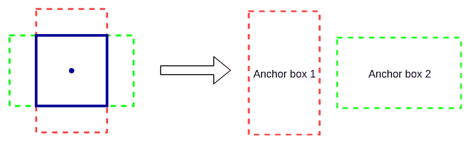
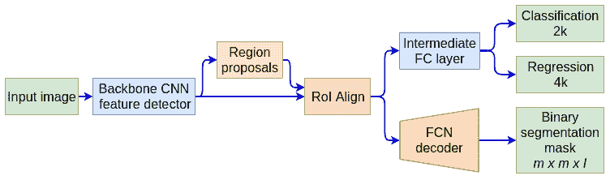

# 四、目标检测和图像分割

在[第三章](433225cc-e19a-4ecb-9874-8de71338142d.xhtml)、*高级卷积网络*中，我们讨论了一些最流行、性能最好的**卷积神经网络** ( **CNN** )模型。为了关注每个网络的架构细节，我们在分类问题的简单上下文中查看了模型。在计算机视觉任务的宇宙中，分类相当简单，因为它给一幅图像分配一个标签。在这一章中，我们将把注意力转移到两个更有趣的计算机视觉任务上——物体检测和语义分割，而网络架构将退居其次。我们可以说，与分类相比，这些任务更复杂，因为模型必须获得对图像的更全面的理解。它必须能够检测不同的对象以及它们在图像上的位置。同时，任务的复杂性允许更有创造性的解决方案。在本章中，我们将讨论其中的一些。

本章将涵盖以下主题:

*   物体检测简介:
*   物体检测方法
*   YOLO
*   更快的 R-CNN
*   图像分割:
*   优信网
*   屏蔽 R-CNN


# 对象检测简介

对象检测是在图像或视频中寻找某一类对象实例的过程，例如人脸、汽车和树木。与分类不同，对象检测可以检测多个对象以及它们在图像中的位置。

对象检测器将返回检测到的对象列表，其中包含每个对象的以下信息:

*   对象的类别(人、汽车、树等)。
*   在[0，1]范围内的概率(或置信度得分),它传达了检测器对物体存在于该位置的置信度。这类似于常规分类器的输出。
*   对象所在的图像矩形区域的坐标。这个矩形被称为**边界框**。

我们可以在下面的照片中看到对象检测算法的典型输出。对象类型和置信度得分位于每个边界框的上方:


物体检测器的输出

接下来，让我们概述解决对象检测任务的不同方法。


# 物体检测方法

在本节中，我们将概述三种方法:

*   **经典滑动窗口**:这里，我们将使用一个常规的分类网络(分类器)。这种方法可以用于任何类型的分类算法，但是它相对较慢并且容易出错:
    1.  构建一个图像金字塔:这是同一幅图像不同尺度的组合(见下图)。例如，每个缩放图像可以比前一个图像小两倍。通过这种方式，我们将能够检测出原始图像中的物体，而不管它们的大小如何。
    2.  在整个图像上滑动分类器:也就是说，我们将使用图像的每个位置作为分类器的输入，结果将确定该位置的对象类型。该位置的边界框就是我们用作输入的图像区域。
    3.  我们将为每个对象创建多个重叠的边界框:我们将使用一些启发式方法将它们组合成一个预测。

以下是滑动窗口方法的示意图:


滑动窗口加图像金字塔目标检测

*   **两阶段检测法**:这些方法非常准确，但相对较慢。顾名思义，它们包括两个步骤:
    1.  一种特殊类型的 CNN，称为**区域提议网络** ( **RPN** )，扫描图像并提出一些可能的边界框，或感兴趣的区域( **RoI** ，物体可能位于其中。然而，该网络不检测对象的类型，而仅检测该区域中是否存在对象。
    2.  感兴趣的区域被发送到用于对象分类的第二阶段，该阶段确定每个边界框中的实际对象。
*   **一阶段** ( **或一次** ) **检测方法**:这里，单个 CNN 产生对象类型和边界框。与两阶段方法相比，这些方法通常更快，但不太准确。

在下一节中，我们将介绍 YOLO——一种精确而高效的一步检测算法。


# 使用 YOLOv3 进行对象检测

在这一节中，我们将讨论最流行的检测算法之一，称为 YOLO。这个名字是流行格言**你只活一次**的首字母缩写，反映了该算法的单阶段性质。作者发布了三个版本，对算法进行了增量改进。我们只讨论最新的，v3(更多细节见 *YOLOv3:增量改进*，【https://arxiv.org/abs/1804.02767】)。

算法从所谓的**骨干**网络开始，称为 **Darknet-53** (在卷积层数之后)。它被训练来对 ImageNet 数据集进行分类，就像[第三章](433225cc-e19a-4ecb-9874-8de71338142d.xhtml)、*高级卷积网络*中的网络一样。它是完全卷积的(没有池层),使用剩余连接。

下图显示了主干架构:


暗网-53 型号(来源:https://arxiv.org/abs/1804.02767)

一旦网络被训练，它将作为随后的目标检测训练阶段的基础。这是一个特征提取迁移学习的案例，我们在[第二章](d94e220f-820e-40da-8bb5-9593e0790b21.xhtml)、*理解卷积网络*中描述过。主干的全连接层被新的随机初始化的卷积层和全连接层取代。新的完全连接的层将在单次通过中输出所有检测到的对象的边界框、对象类和置信度得分。

例如，本节开头的人行横道上的人的图像中的边界框是使用单个网络通道生成的。YOLOv3 预测三种不同比例的盒子。该系统使用与特征金字塔网络相似的概念从这些比例中提取特征(更多信息，参见*用于物体检测的特征金字塔网络*、【https://arxiv.org/abs/1612.03144】和)。在检测阶段，用上下文中的公共对象(*微软可可:上下文中的公共对象*、[https://arxiv.org/abs/1405.0312](https://arxiv.org/abs/1405.0312)、[http://cocodataset.org](http://cocodataset.org))对象检测数据集来训练网络。

接下来，让我们看看 YOLO 是如何工作的:

1.  将图像分割成一个由 *S×S* 个单元格组成的网格(在下图中，我们可以看到一个 3×3 的网格):
    *   网络将每个格网单元的中心视为对象可能位于的区域的中心。
    *   一个对象可能完全位于一个单元格内。然后，它的边界框将小于单元格。或者，它可以跨越多个单元格，并且边界框会更大。YOLO 涵盖了这两种情况。
    *   该算法可以在**锚框**的帮助下检测网格单元中的多个对象(稍后将详细介绍)，但是一个对象只与一个单元相关联(一对一 *n* 关系)。也就是说，如果对象的边界框覆盖多个单元格，我们将把对象与边界框中心所在的单元格相关联。例如，下图中的两个对象跨越多个单元，但它们都被分配到中心单元，因为它们的中心位于该单元中。
    *   一些单元格可能包含对象，而其他单元格可能不包含。我们只对知道的感兴趣。

下图显示了一个 3×3 单元网格，其中有两个对象及其边界框(虚线)。这两个对象都与中间的单元格相关联，因为它们的边界框的中心位于该单元格中:


具有 3×3 单元网格和 2 个对象的对象检测 YOLO 示例

2.  网络将为每个网格单元输出多个可能检测到的物体。例如，如果网格是 3×3，那么输出将包含 9 个可能检测到的对象。为了清楚起见，让我们讨论单个网格单元/检测到的对象的输出数据(及其相应的标签)。它是一个带有值的数组，*【b[x]，b [y] ，b [h] ，b [w] ，p [c] ，c [1] ，c [2] ，...，c[n]*，其中值如下:
    *   *b [x] ，b [y] ，b [h] ，b [w]* 描述的是物体包围盒，如果有物体存在，那么*b[x]和*b[y]就是盒子中心的坐标。它们相对于图像的大小在[0，1]范围内被归一化。也就是说，如果图像的大小为 100 x 100，并且 *b [x] = 20* 和 *b [y] = 50* ，则它们的归一化值将为 0.2 和 0.5。基本上， *b [h]* 和 *b [w]* 代表盒子的高度和宽度。它们相对于格网单元是标准化的。如果边界框大于单元格，则其值将大于 1。预测盒子参数是一项回归任务。**
    *   *p[c]是在[0，1]范围内的置信度得分。置信度得分的标签为 0(不存在)或 1(存在)，使这部分输出成为分类任务。如果一个对象不存在，我们可以丢弃剩余的数组值。*
    *   *c [1] ，c [2] ，...，c [n]* 是 object 类的一键编码。例如，如果我们有 car、person、tree、cat 和 dog 类，并且当前对象是 cat 类型，那么它的编码将是*【0，0，0，1，0】*。如果我们有 *n* 个可能的类，那么一个单元格的输出数组的大小将是 *5 + n* (在我们的例子中是 9)。

网络输出/标签将包含 *S×S* 这样的数组。例如，3×3 单元网格和四个等级的 YOLO 输出的长度将是 *3*3*9 = 81* 。

3.  让我们解决在同一个单元格中有多个对象的情况。谢天谢地，YOLO 为这个问题提出了一个优雅的解决方案。我们将有多个候选框(称为**锚框**或先验),与每个单元格相关的形状略有不同。在下图中，我们可以看到网格单元(正方形的不间断线)和两个定位框—垂直的和水平的(虚线)。如果我们在同一个单元格中有多个对象，我们将把每个对象与一个定位框相关联。相反，如果锚定框没有关联的对象，它的置信度为零。这种安排也将改变网络输出。每个网格单元有多个输出数组(每个锚定框一个输出数组)。为了扩展我们之前的例子，让我们假设我们有一个 *3×3* 单元网格，每个单元有 4 个类和 2 个锚盒。然后，我们将有 *3*3*2 = 18* 个输出边界框，总输出长度为 *3*3*2*9 = 162* 。因为我们有固定数量的单元( *S×S* )和每个单元固定数量的锚盒，所以网络输出的大小不会随着检测到的对象的数量而改变。相反，输出将指示对象是否存在于所有可能的锚定框中。

在下图中，我们可以看到一个带有两个定位框的网格单元:



带有两个定位框(虚线)的网格单元(正方形的不间断线)

现在唯一的问题是如何在训练时为一个对象选择合适的锚盒(在推断时，网络会自行选择)。我们将借助于 Union 上的**交集** ( **IoU** )来完成这项工作。这就是对象边界框/锚定框的交集面积与它们的并集面积之比:


并集上的交集

我们将每个对象的边界框与所有锚框进行比较，并将该对象分配给 IoU 最高的锚框。由于锚定框具有不同的大小和形状，IoU 确保对象将被分配到与其在图像上的足迹最相似的锚定框。

4.  现在我们(希望)知道了 YOLO 是如何工作的，我们可以用它来预测。但是，网络的输出可能会有噪声，也就是说，输出包括每个像元的所有可能的锚盒，而不管其中是否存在对象。许多方框会重叠，实际上预测的是同一个物体。我们将使用**非最大抑制**来消除噪声。它是这样工作的:
    1.  丢弃置信度得分小于或等于 0.6 的所有边界框。
    2.  从剩余的边界框中，挑选一个可能具有最高置信度得分的边界框。
    3.  用我们在上一步中选择的盒子丢弃任何 IoU >= 0.5 的盒子。

如果你担心网络输出/地面真实数据会变得太复杂或太大，不要担心。CNN 可以很好地处理 ImageNet 数据集，它有 1000 个类别，因此有 1000 个输出。

想了解更多关于 YOLO 的信息，请查看原文:

*   你只看一次:约瑟夫·雷德蒙、桑托什·迪夫瓦拉、罗斯·吉斯克和阿里·法尔哈迪的《统一的实时物体检测》
*   《YOLO9000:更好、更快、更强》(【https://arxiv.org/abs/1612.08242】)作者:约瑟夫·雷德蒙和阿里·法尔哈迪
*   约洛夫 3:约瑟夫·雷德蒙和阿里·法尔哈迪的增量改进版(【https://arxiv.org/abs/1804.02767】)

既然我们已经介绍了 YOLO 算法的理论，在下一节，我们将讨论如何在实践中使用它。


# 带有 OpenCV 的 YOLOv3 代码示例

在这一节中，我们将演示如何在 OpenCV 中使用 YOLOv3 对象检测器。对于这个例子，您需要 4.1.1 或更高版本的`opencv-python`，以及 250 MB 的磁盘空间用于预训练的 YOLO 网络。让我们从以下步骤开始:

1.  从进口开始:

```py
import os.path

import cv2  # opencv import
import numpy as np
import requests
```

2.  添加一些样板代码，下载并存储几个配置和数据文件。我们将从 YOLOv3 网络配置`yolo_config`和`weights`开始，我们将使用它们来初始化`net`网络。我们将使用 YOLO 作者的 GitHub 和个人网站来完成这项工作:

```py
# Download YOLO net config file
# We'll it from the YOLO author's github repo
yolo_config = 'yolov3.cfg'
if not os.path.isfile(yolo_config):
   url = 'https://raw.githubusercontent.com/pjreddie/darknet/master/cfg/yolov3.cfg'
    r = requests.get(url)
    with open(yolo_config, 'wb') as f:
        f.write(r.content)

# Download YOLO net weights
# We'll it from the YOLO author's website
yolo_weights = 'yolov3.weights'
if not os.path.isfile(yolo_weights):
    url = 'https://pjreddie.com/media/files/yolov3.weights'
    r = requests.get(url)
    with open(yolo_weights, 'wb') as f:
        f.write(r.content)

# load the network
net = cv2.dnn.readNet(yolo_weights, yolo_config)
```

3.  接下来，我们将下载网络可以检测到的 COCO 数据集类的名称。我们还将从文件中加载它们。COCO 论文中介绍的数据集包含 91 个类别。然而，网站上的数据集只包含 80 个。YOLO 使用 80 类版本:

```py
# Download class names file
# Contains the names of the classes the network can detect
classes_file = 'coco.names'
if not os.path.isfile(classes_file):
    url = 'https://raw.githubusercontent.com/pjreddie/darknet/master/data/coco.names'
    r = requests.get(url)
    with open(classes_file, 'wb') as f:
        f.write(r.content)

# load class names
with open(classes_file, 'r') as f:
    classes = [line.strip() for line in f.readlines()]
```

4.  然后，从维基百科下载一张测试图片。我们还将从文件中加载图像到`blob`变量中:

```py
# Download object detection image
image_file = 'source_1.png'
if not os.path.isfile(image_file):
    url = "https://github.com/ivan-vasilev/advanced-deep-learning-with-python/blob/master/chapter04-detection-segmentation/source_1.png"
    r = requests.get(url)
    with open(image_file, 'wb') as f:
        f.write(r.content)

# read and normalize image
image = cv2.imread(image_file)
blob = cv2.dnn.blobFromImage(image, 1 / 255, (416, 416), (0, 0, 0), True, crop=False)
```

5.  将图像输入网络，然后进行推理:

```py
# set as input to the net
net.setInput(blob)

# get network output layers
layer_names = net.getLayerNames()
output_layers = [layer_names[i[0] - 1] for i in net.getUnconnectedOutLayers()]

# inference
# the network outputs multiple lists of anchor boxes,
# one for each detected class
outs = net.forward(output_layers)
```

6.  遍历类和锚盒，为下一步做准备:

```py
# extract bounding boxes
class_ids = list()
confidences = list()
boxes = list()

# iterate over all classes
for out in outs:
    # iterate over the anchor boxes for each class
    for detection in out:
        # bounding box
        center_x = int(detection[0] * image.shape[1])
        center_y = int(detection[1] * image.shape[0])
        w, h = int(detection[2] * image.shape[1]), int(detection[3] * image.shape[0])
        x, y = center_x - w // 2, center_y - h // 2
        boxes.append([x, y, w, h])

        # confidence
        confidences.append(float(detection[4]))

        # class
        class_ids.append(np.argmax(detection[5:]))
```

7.  用非最大抑制去除噪声。您可以试验不同的`score_threshold`和`nms_threshold`值，看看检测到的物体如何变化:

```py
# non-max suppression
ids = cv2.dnn.NMSBoxes(boxes, confidences, score_threshold=0.75, nms_threshold=0.5)
```

8.  在图像上绘制边界框及其标题:

```py
for i in ids:
    i = i[0]
    x, y, w, h = boxes[i]
    class_id = class_ids[i]

    color = colors[class_id]

    cv2.rectangle(img=image,
                  pt1=(round(x), round(y)),
                  pt2=(round(x + w), round(y + h)),
                  color=color,
                  thickness=3)

    cv2.putText(img=image,
                text=f"{classes[class_id]}: {confidences[i]:.2f}",
                org=(x - 10, y - 10),
                fontFace=cv2.FONT_HERSHEY_SIMPLEX,
                fontScale=0.8,
                color=color,
                thickness=2)
```

9.  最后，我们可以用下面的代码显示检测到的对象:

```py
cv2.imshow("Object detection", image)
cv2.waitKey()
```

如果一切顺利，这个代码块将产生我们在*对象检测简介*部分开始时看到的相同图像。

我们关于 YOLO 的讨论到此结束。在下一节中，我们将介绍一种称为更快的 R-CNN 的两阶段对象检测器(R-CNN 代表带有 CNN 的区域)。


# 快速 R-CNN 的目标检测

在本节中，我们将讨论一种称为更快 R-CNN 的两阶段对象检测算法(*更快 R-CNN:利用区域提议网络*、【https://arxiv.org/abs/1506.01497】和实现实时对象检测)。它是早期两级检测器快速 R-CNN(【https://arxiv.org/abs/1504.08083】)和 R-CNN ( *丰富的特征层次，用于精确的对象检测和语义分割*、[、](https://arxiv.org/abs/1311.2524))的进化。

我们将首先概述更快的 R-CNN 的一般结构，如下图所示:


快速 R-CNN 的结构；资料来源:https://arxiv.org/abs/1506.01497

让我们在解释算法时记住这个数字。像 YOLO 一样，更快的 R-CNN 从在 ImageNet 上训练的主干分类网络开始，作为模型的不同模块的基础。论文作者用 VGG16 和 ZF 网(*可视化和理解卷积网络*，【https://cs.nyu.edu/~fergus/papers/zeilerECCV2014.pdf】)骨干进行了实验。然而，最近的实现使用更现代的架构，如 ResNets。骨干网充当骨干(懂吗？)连接到模型的另外两个组件——**区域建议网络** ( **RPN** )和检测网络。在下一节中，我们将讨论 RPN。


# 区域提案网络

在第一阶段，RPN 将一幅图像(任何大小)作为输入，并将输出一组感兴趣的矩形区域(ROI ),其中可能存在一个对象。RPN 本身是通过采用主干模型的第一个*p*(VGG 为 13，ZF 网络为 5)卷积层创建的(见上图)。一旦输入图像被传播到最后共享的卷积层，该算法就获取该层的特征图，并在特征图的每个位置上滑动另一个小网。小网输出在每个位置上的任何一个 *k* 锚箱中是否存在物体(锚箱的概念与 YOLO 相同)。下图的左侧图像说明了这一概念，它显示了 RPN 在最后一个卷积层的单一特征图上滑动的单一位置:


左图:单一位置的 RPN 建议；右图:使用 RPN 建议的示例检测(标签被人工增强)。资料来源:https://arxiv.org/abs/1506.01497

小网在所有输入特征地图上的相同位置上完全连接到一个 *n×n* 区域(根据论文 *n = 3* )。例如，如果最终的卷积层具有 512 个特征映射，那么在一个位置的小的净输入大小是 512×3×3 = 4，608。每个滑动窗口被映射到一个较低维度的向量(VGG 为 512，ZF 网为 256)。该向量本身用作以下两个平行全连接层的输入:

1.  一个分类层，其具有被组织成 *k* 2 单元二进制 softmax 输出的 *2k* 个单元。每个 softmax 的输出表示对象是否位于每个 *k* 锚框中的置信度得分。该论文将置信度分数称为**对象性**，其测量锚定框内容是否属于相对于背景的一组对象。在训练期间，以与 YOLO 相同的方式基于 IoU 公式将对象分配给锚盒。

2.  一个回归层，具有组织成 *k* 4 单元 RoI 坐标的 *4k* 单元。4 个单位中的 2 个表示 RoI 中心相对于整个图像在[0:1]范围内的坐标。另外两个坐标表示该区域相对于整个图像的高度和宽度(同样，类似于 YOLO)。

这篇论文的作者实验了三种比例和三种长宽比，在每个位置产生了九个可能的锚盒。最终特征图的典型 H×W 大小在 2400 左右，这导致 2400 * 9 = 21600 个锚盒。

理论上，我们在最后一个卷积层的特征图上滑动小网。但是，小净重在所有地点均有分布。因此，滑动可以实现为跨通道卷积。因此，网络可以在单次图像传递中产生所有锚盒的输出。这是对快速 R-CNN 的改进，快速 R-CNN 要求每个锚盒有一个单独的网络通道。

RPN 是用反向传播和随机梯度下降来训练的(真令人吃惊！).共享卷积层用主干网的权重初始化，其余的随机初始化。每个小批量的样本是从单个图像中提取的，该图像包含许多正(对象)和负(背景)锚框。两种类型之间的采样比例为 1:1。每个锚点被分配一个二进制类标签(是否为对象)。具有正标签的锚有两种:具有最高 IoU 重叠的锚与背景事实框重叠，或者与任何背景事实框具有高于 0.7 的 IoU 重叠的锚。如果锚点的 IoU 比率低于 0.3，则该框被分配一个负标签。既不积极也不消极的主播不参加培训。

由于 RPN 有两个输出层(分类和回归)，训练使用以下复合成本函数:


我们来详细讨论一下:

*   *i* 是锚在迷你批中的索引。
*   *p[I]为分类输出，表示主播 *i* 为对象的预测概率。注意 *p [i] ^** 为相同的目标数据(0 或 1)。*
*   *t[I]是大小为 4 的回归输出向量，代表 RoI 参数。如在 YOLO， *t [i] ^** 是相同的目标向量。*
*   *L[cls]是分类层的交叉熵损失。 *N [cls]**
*   *L[reg]是回归损失。，其中 R 为平均绝对误差(参见[第一章](b94f711b-daab-4de7-97b7-b7efccd0b392.xhtml)中的*成本函数*部分，*神经网络的基本原理*)。 *N [ reg]**

最后，借助于 *λ* 参数*，组合成本函数的分类和回归分量。*由于 *N [reg]* ~ 2400 和 *N [cls]* = 256， *λ* 被设置为 10 以保持两个损失之间的平衡。


# 检测网络

既然我们已经讨论了 RPN，让我们来关注一下检测网络。为了做到这一点，我们将回到图*的结构更快的 R-CNN* 在开始的*物体检测与更快的 R-CNN* 部分。让我们回忆一下，在第一阶段，RPN 已经生成了 RoI 坐标。检测网络是常规分类器，其确定当前 RoI 中的对象(或背景)的类型。RPN 和检测网共享它们从主干网借用的第一个卷积层。但是检测网络还结合了来自 RPN 的建议区域，以及最后共享层的特征地图。

但是我们如何组合输入呢？我们可以借助于**感兴趣区域** ( **RoI** ) max pooling 来做到这一点，这是检测网络第二部分的第一层。下图显示了此操作的一个示例:


使用 10×7 特征图和 5×5 感兴趣区域(蓝色矩形)的 *2×2* RoI 最大池示例

为了简单起见，我们假设我们有一个单一的 *10×7* 特征图和一个单一的 RoI。正如我们在*区域提案网络*部分了解到的，RoI 是由其坐标、宽度和高度定义的。该操作将这些参数转换为特征图上的实际坐标。在这个例子中，区域大小是 *h×w = 5×5* 。RoI max pooling 由其输出高度 *H* 和宽度 *W* 进一步定义。在本例中， *H×W = 2×2* ，但实际上这些值可以更大，例如 7×7。该操作将 *h×w* RoI 分割成带有( *h / H)×(w / W)* 子区域的网格。

正如我们从示例中看到的，子区域可能有不同的大小。完成后，通过取该区域的最大值，将每个子区域缩减采样为单个输出像元。换句话说，RoI pooling 可以将任意大小的输入转换为固定大小的输出窗口。这样，转换后的数据可以以一致的格式在网络中传播。

正如我们在*用更快的 R-CNN 进行物体检测*一节中提到的，RPN 和检测网络共享它们的初始层。然而，它们以独立的网络开始它们的生命。培训分四步交替进行:

1.  训练 RPN，RPN 用主干网的 ImageNet 权重初始化。
2.  使用*步骤 1* 中新训练的 RPN 的建议，训练检测网络。训练也从 ImageNet 主干网的重量开始。此时，两个网络不共享权重。
3.  使用检测网络共享层来初始化 RPN 的权重。然后，再次训练 RPN，但是冻结共享层并仅微调 RPN 特定层。这两个网络现在共享权重。
4.  通过冻结共享层并仅微调检测网络特定层来训练检测网络。

现在我们已经介绍了更快的 R-CNN，在下一节中，我们将讨论如何在预训练 PyTorch 模型的帮助下在实践中使用它。


# 用 PyTorch 实现更快的 R-CNN

在本节中，我们将使用预训练的 PyTorch 快速 R-CNN 和 ResNet50 主干进行对象检测。本例需要 PyTorch 1.3.1、`torchvision` 0.4.2 和`python-opencv` 4.1.1:

1.  我们将从进口开始:

```py
import os.path

import cv2
import numpy as np
import requests
import torchvision
import torchvision.transforms as transforms
```

2.  接下来，我们将继续下载输入图像，并在 COCO 数据集中定义类名。这一步与我们在*一节中用 OpenCV* 实现 YOLOv3 的代码示例的步骤相同。下载图像的路径存储在`image_file = 'source_2.png'`变量中，类名存储在`classes`列表中。这个实现使用完整的 91 个 COCO 类别。
3.  我们将加载预训练的更快 R-CNN 模型，并将其设置为评估模式:

```py
# load the pytorch model
model = torchvision.models.detection.fasterrcnn_resnet50_fpn(pretrained=True)

# set the model in evaluation mode
model.eval()
```

4.  然后，我们将使用 OpenCV 读取图像文件:

```py
img = cv2.imread(image_file)
```

5.  我们将定义 PyTorch `transform`序列，我们将把图像转换成 PyTorch 兼容张量，并将它输入网络。网络输出存储在`output`变量中。正如我们在*区域提议网络*部分所讨论的，`output`包含三个部分:`boxes`用于边界框参数，`classes`用于对象类别，`scores`用于置信度得分。该模型在内部应用 NMS，不需要在代码中这样做:

```py
transform = transforms.Compose([transforms.ToPILImage(), transforms.ToTensor()])
nn_input = transform(img)
output = model([nn_input])
```

6.  在继续显示检测到的对象之前，我们将为 COCO 数据集的每个类定义一组随机颜色:

```py
colors = np.random.uniform(0, 255, size=(len(classes), 3))
```

7.  我们迭代每个边界框，并在图像上绘制它:

```py
# iterate over the network output for all boxes
for box, box_class, score in zip(output[0]['boxes'].detach().numpy(),
                                 output[0]['labels'].detach().numpy(),
                                 output[0]['scores'].detach().numpy()):

    # filter the boxes by score
    if score > 0.5:
        # transform bounding box format
        box = [(box[0], box[1]), (box[2], box[3])]

        # select class color
        color = colors[box_class]

        # extract class name
        class_name = classes[box_class]

        # draw the bounding box
        cv2.rectangle(img=img, pt1=box[0], pt2=box[1], color=color, thickness=2)

        # display the box class label
        cv2.putText(img=img, text=class_name, org=box[0], 
                    fontFace=cv2.FONT_HERSHEY_SIMPLEX, fontScale=1, color=color, thickness=2)
```

绘制边界框包括以下步骤:

*   过滤置信度分数小于 0.5 的框，以防止噪声检测。
*   边界`box`参数(从`output['boxes']`中提取)包含图像上边界框的左上和右下绝对(像素)坐标。它们仅被转换成元组以适应 OpenCV 格式。
*   提取类名和边界框的颜色。
*   绘制边界框和类名。

8.  最后，我们可以用下面的代码显示检测结果:

```py
cv2.imshow("Object detection", image)
cv2.waitKey()
```

该代码将产生以下结果(公共汽车上的乘客也被检测到):


更快的 R-CNN 目标检测

关于对象检测的部分到此结束。总之，我们讨论了两种最流行的检测模型——YOLO 和更快的 R-CNN。在下一节中，我们将讨论图像分割——您可以将其视为像素级别的分类。


# 介绍图像分割

图像分割是为图像的每个像素分配类别标签(如人、汽车或树)的过程。你可以把它看作是分类，但是是在像素级别上——我们不是在一个标签下对整个图像进行分类，而是对每个像素分别进行分类。有两种类型的分段:

*   **语义分割**:给每个像素分配一个类，但不区分对象实例。例如，以下截图中的中间图像显示了一个语义分段遮罩，其中每辆车的像素值都相同。语义分割可以告诉我们一个像素是车辆的一部分，但不能区分两个车辆。
*   **实例分割**:给每个像素分配一个类，区分对象实例。例如，以下屏幕截图中右侧的图像显示了一个实例分段遮罩，其中每辆车都被分段为一个单独的对象。

下面的屏幕截图显示了语义和实例分段的示例:


左:输入图像；中间:语义切分；右图:实例分割；资料来源:http://sceneparsing.csail.mit.edu/

为了训练一个分割算法，我们需要一种特殊类型的地面实况数据，其中每个图像的标签都是图像的分割版本。

分割图像最简单的方法是使用熟悉的滑动窗口技术，我们在*物体检测方法*一节中对此进行了描述。也就是说，我们将使用一个常规分类器，并以步长 1 向任一方向滑动它。获得位置预测后，我们将获取位于输入区域中间的像素，并将其分配给预测的类。可以预见的是，这种方法非常慢，因为图像中有大量的像素(即使是 1024×1024 的图像也有超过 100 万个像素)。幸运的是，有更快更精确的算法，我们将在接下来的章节中讨论。


# 基于 U-Net 的语义切分

我们将讨论的第一种分割方法称为 U-Net ( *U-Net:用于生物医学图像分割的卷积网络*、【https://arxiv.org/abs/1505.04597】和)。名字来源于网络架构的可视化。U-Net 是一种**全卷积网络** ( **FCN** )，之所以这么叫是因为它只包含卷积层，没有任何全连接层。FCN 将整个图像作为输入，并在单次通过中输出其分割图。我们可以将一个 FCN 分成两个虚拟组件(实际上，这只是一个网络):

*   编码器是网络的第一部分。它类似于常规的 CNN，没有完全连接的层。编码器的作用是学习输入图像的高度抽象的表示(这里没有什么新的)。
*   解码器是网络的第二部分。它在编码器之后启动，并将其用作输入。解码器的作用是将这些抽象表示翻译成分段的基础数据。为此，解码器使用与编码器相反的操作。这包括转置卷积(卷积的反义词)和取消池化(池化的反义词)。

随着介绍，这里是 U-Net 的所有荣耀:


U-Net 架构；资料来源:https://arxiv.org/abs/1505.04597

每个蓝框对应一个多通道特征图。通道的数量显示在盒子的顶部，特征图的大小显示在盒子的左下边缘。白色方框表示复制的要素地图。箭头表示不同的操作(也显示在图例上)。 *U* 左边部分是编码器，右边部分是解码器。

接下来我们分段(懂了吗？)U-Net 模块:

*   **编码器**:网络输入一幅 572×572 的 RGB 图像。从那里，它继续像一个常规的 CNN 与交替卷积和最大池层。编码器由以下层的四个块组成。
    *   步长为 1 的两个连续跨通道无填充 3×3 卷积。
    *   一个最大 2×2 的池层。
    *   重新启动。
    *   每个缩减采样步骤都会使特征图的数量翻倍。
    *   最终的编码器卷积以 1，024 个 28×28 特征图结束。
*   **解码器**:与编码器对称。解码器获取最内部的 28×28 特征图，同时进行上采样，并将其转换为 388×388 分割图。它包含四个上采样模块:
    *   上采样使用步长为 2 的 2×2 转置卷积([第 2 章](d94e220f-820e-40da-8bb5-9593e0790b21.xhtml)、T2，了解卷积网络)，用绿色垂直箭头表示。
    *   每个上采样步骤的输出与相应编码器步骤的裁剪后的高分辨率特征图连接在一起(灰色水平箭头)。由于每次卷积都会丢失边界像素，因此裁剪是必要的。
    *   每个转置卷积之后是两个常规卷积，以平滑扩展的图像。
    *   上采样步骤将特征图的数量减半。最终输出使用 1×1 瓶颈卷积将 64 分量特征映射张量映射到所需的类别数。该论文的作者已经证明了细胞的医学图像的二值分割。
    *   网络输出是每个像素上的 softmax。也就是说，输出包含与像素数一样多的独立 softmax 操作。一个像素的 softmax 输出决定了像素类别。U-Net 像常规分类网络一样被训练。然而，成本函数是所有像素上 softmax 输出的交叉熵损失的组合。

我们可以看到，由于网络的有效(无填充)卷积，输出分割图小于输入图像(388 对 572)。但是，输出地图不是输入图像的重新缩放版本。相反，与输入相比，它具有一对一的比例，但仅覆盖输入切片的中心部分。

下图对此进行了说明:


用于分割大图像的重叠平铺策略:资料来源:https://arxiv.org/abs/1505.04597

无填充卷积是必要的，因此网络不会在分割图的边界产生噪声伪像。这使得使用所谓的重叠平铺策略分割任意大尺寸的图像成为可能。输入影像被分割成重叠的输入切片，如上图左侧所示。右侧图像中的小光区域的分割图需要左侧图像中的大光区域(一个图块)作为输入。

下一个输入图块与前一个图块重叠，使得它们的分割图覆盖图像的相邻区域。为了预测图像边界区域中的像素，通过镜像输入图像来推断缺失的上下文。在下一节中，我们将讨论 Mask R-CNN——一种模型，它为实例分割扩展了更快的 R-CNN。


# 基于掩模 R-CNN 的实例分割

掩模 R-CNN([https://arxiv.org/abs/1703.06870](https://arxiv.org/abs/1703.06870))是快速 R-CNN 的扩展，用于实例分割。更快的 R-CNN 对每个候选对象有两个输出:包围盒参数和类标签。除此之外，Mask R-CNN 还增加了第三个输出——为每个 RoI 生成二进制分割掩模的 FCN。下图显示了屏蔽 R-CNN 的结构:



屏蔽 R-CNN

RPN 生产五种比例和三种长宽比的锚。分割和分类路径都使用 RPN 的 RoI 预测，但在其他方面彼此独立。分割路径产生 *I* *m×m* 二进制分割掩码，每个二进制分割掩码用于一个 *I* 类。在训练或推断时，仅考虑与分类路径的预测类别相关的掩码，其余的被丢弃。类别预测和分割是并行且分离的——分类路径预测被分割对象的类别，而分割路径确定遮罩。

Mask R-CNN 用更精确的 RoI align 层取代了 RoI max 合并操作。RPN 输出锚定框中心，以及它的高度和宽度，作为四个浮点数。然后，RoI 池层将其转换为整数特征地图像元坐标(量化)。此外，RoI 到 *H×W* 箱的划分也涉及量化。来自使用更快 R-CNN 部分的*对象检测的 RoI 示例显示，箱具有不同的大小(3×3、3×2、2×3、2×2)。这两个量化级别会在 RoI 和提取的特征之间引入不对准。下图显示了 RoI 对齐如何解决这个问题:*


RoI 对齐示例；资料来源:https://arxiv.org/abs/1703.06870

虚线表示要素地图像元。中间有实线的区域是覆盖在特征图上的 2×2 RoI。请注意，它与单元格并不完全匹配。相反，它是根据 RPN 预测来定位的，没有量化。同样，RoI 的一个单元(黑点)与特征图的一个特定单元不匹配。RoI align 运算使用相邻像元的双线性插值来计算 RoI 像元的值。这样，RoI align 比 RoI pooling 更准确。

在训练时，如果一个 RoI 的 IoU 具有至少为 0.5 的基本事实框，则该 RoI 被分配一个正标签，否则为负标签。掩膜目标是 RoI 及其相关背景掩膜之间的交集。只有正 ROI 参与分割路径训练。


# 用 PyTorch 实现掩膜 R-CNN

在本节中，我们将使用预训练的 PyTorch Mask R-CNN 和 ResNet50 主干进行实例分割。本例需要 PyTorch 1.1.0、torchvision 0.3.0 和 OpenCV 3.4.2。这个例子与我们在*用 PyTorch* 实现更快的 R-CNN 一节中实现的例子非常相似。因此，我们将省略一些代码以避免重复。让我们开始:

1.  导入、`classes`和`image_file`与更快的 R-CNN 示例中的相同。
2.  两个示例之间的第一个区别是，我们将加载 Mask R-CNN 预训练模型:

```py
model = torchvision.models.detection.maskrcnn_resnet50_fpn(pretrained=True)
model.eval()
```

3.  我们将输入图像输入网络，并获得`output`变量:

```py
# read the image file
img = cv2.imread(image_file)

# transform the input to tensor
transform = transforms.Compose([transforms.ToPILImage(), transforms.ToTensor()])
nn_input = transform(img)
output = model([nn_input])
```

除了`boxes`、`classes`和`scores`之外，`output`还包含一个用于预测分段掩码的附加的`masks`组件。

4.  我们迭代蒙版并把它们覆盖在图像上。图像和遮罩是`numpy`数组，我们可以将叠加实现为矢量操作。我们将显示边界框和分段遮罩:

```py
# iterate over the network output for all boxes
for mask, box, score in zip(output[0]['masks'].detach().numpy(),
                            output[0]['boxes'].detach().numpy(),
                            output[0]['scores'].detach().numpy()):

    # filter the boxes by score
    if score > 0.5:
        # transform bounding box format
        box = [(box[0], box[1]), (box[2], box[3])]

        # overlay the segmentation mask on the image with random color
        img[(mask > 0.5).squeeze(), :] = np.random.uniform(0, 255, size=3)

        # draw the bounding box
        cv2.rectangle(img=img,
                      pt1=box[0],
                      pt2=box[1],
                      color=(255, 255, 255),
                      thickness=2)
```

5.  最后，我们可以将分割结果显示如下:

```py
cv2.imshow("Object detection", img)
cv2.waitKey()
```

此示例将生成如下右侧的图像(左侧的原始图像用于比较):


屏蔽 R-CNN 实例分割

我们可以看到，每个分割掩模仅在其边界框内定义，其中分割掩模的所有值都大于零。为了获得属于对象的实际像素，我们仅对分割置信度得分大于 0.5 的像素应用遮罩(该代码片段是遮罩 R-CNN 代码示例的步骤 4 的一部分):

```py
img[(mask > 0.5).squeeze(), :] = np.random.uniform(0, 255, size=3)
```

这就结束了专门讨论图像分割的章节(事实上，它结束了这一章本身)。


# 摘要

在本章中，我们讨论了对象检测和图像分割。我们从一次性检测算法 YOLO 开始，然后我们继续使用两阶段更快的 R-CNN 算法。接下来，我们讨论了语义分段网络架构 U-Net。最后，我们讨论了 Mask R-CNN——快速 R-CNN 的扩展，用于实例分割。

在下一章，我们将探索被称为生成模型的新型 ML 算法。我们可以用它们来生成新的内容，比如图像。请继续关注——会很有趣的！