# 语言建模

本章是我们将在**自然语言处理** ( **NLP** )的背景下讨论不同神经网络算法的第一章。NLP 教导计算机处理和分析自然语言数据，以便执行诸如机器翻译、情感分析、自然语言生成等任务。但是要成功地解决如此复杂的问题，我们必须用计算机可以理解的方式来表示自然语言，这不是一项简单的任务。

要理解为什么，让我们回到图像识别。神经网络的输入相当直观——具有预处理像素强度的 2D 张量，它保留了图像的空间特征。让我们来看一张 28×28 的 MNIST 图像，它包含 784 个像素。关于图像中数字的所有信息都包含在这些像素中，我们不需要任何外部信息来对图像进行分类。我们还可以有把握地假设每个像素(可能不包括图像边界附近的像素)都具有相同的信息权重。因此，我们把它们都喂给网络，让它发挥魔力，让结果自己说话。

现在，让我们把重点放在文本数据上。与图像不同，我们有 1D(而不是 2D)的数据——一个很长的单词序列。一般的经验法则是，一个单倍行距的 A4 纸包含 500 个单词。为了向网络(或任何 ML 算法)提供相当于单个 MNIST 图像的信息，我们需要 1.5 页的文本。文本结构有几个层次；从字符开始，然后是单词、句子和段落，所有这些都可以放在 1.5 页的文本中。图像的所有像素与一个数字相关；然而，我们不知道是否所有的单词都与同一个主题相关。为了避免这种复杂性，NLP 算法通常使用较短的序列。尽管一些算法使用了考虑了所有先前输入的**递归神经网络** ( **RNNs** )，但实际上，它们仍然局限于相对较短的前一个单词的窗口。因此，NLP 算法必须用更少的资源(更少量的输入信息)做更多的事情(表现良好)。

为了帮助我们做到这一点，我们将使用一种特殊类型的向量单词表示(语言模型)。我们将讨论的语言模型使用单词的上下文(它周围的单词)来创建与该单词相关联的唯一嵌入向量。与一键编码相比，这些向量携带了更多的单词信息。它们是各种 NLP 任务的基础。

在本章中，我们将讨论以下主题:

*   理解*n*-克
*   介绍神经语言模型:
    *   神经概率语言模型
    *   Word2Vec 和 fastText
    *   单词表示的全局向量

*   实现语言模型


# 理解 n 元语法

基于单词的语言模型定义了单词序列的概率分布。给定一个长度为 *m* 的单词序列(比如一个句子)，它分配一个概率 *P* ( *w1...，w [m]* )到全序列的单词。我们可以如下使用这些概率:

*   估计自然语言处理应用中不同短语出现的可能性。
*   作为生成模型来创建新文本。基于单词的语言模型可以计算给定单词跟随单词序列的可能性。

一个长序列的概率推断，比方说 *w [1] ，...，w [m]* ，通常是不可行的。我们可以计算出 *P* ( *w [1] )的联合概率，...，w [m]* )同链规则的联合概率([第 1 章](b94f711b-daab-4de7-97b7-b7efccd0b392.xhtml)、*神经网络的螺母和螺栓*):

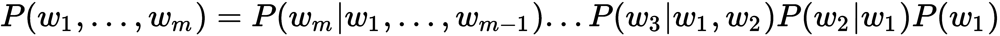

给定较早单词的较晚单词的概率将特别难以从数据中估计。这就是为什么这种联合概率通常由独立性假设来近似，即第 *i-* 个字仅依赖于 *n-1* 个先前的字。我们将只对被称为 *n* -grams 的 *n* 个连续单词的组合的联合概率建模。例如，在短语 *the quick brown fox* 中，我们有以下*n*-克:

*   **1-克** : *的*、*的快*、*的褐*、*的狐*(也称单克)。
*   **2 公克** : *快克*、*快克棕*、*棕狐*(也称公克)。
*   **3 公克** : *快褐*和*快褐狐*(也称八卦)。
*   **4 克** : *敏捷的棕色狐狸*。

联合分布的推断借助于将联合分布分成多个独立部分的*n*gram 模型来近似。

The term *n*-grams can refer to other types of sequences of length *n*, such as *n* characters.

如果我们有一个很大的文本语料库，我们可以找到直到某个 *n* (通常是 2 到 4)的所有*n*-gram，并统计每个*n*gram 在该语料库中的出现次数。根据这些计数，我们可以估计每个 *n* 元的最后一个单词的概率，给定前面的 *n-1* 个单词:

*   **1-克** : [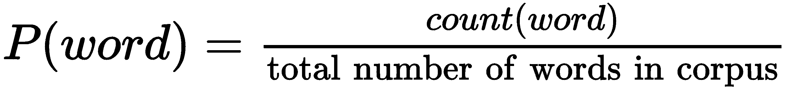]

*   **2 克** : [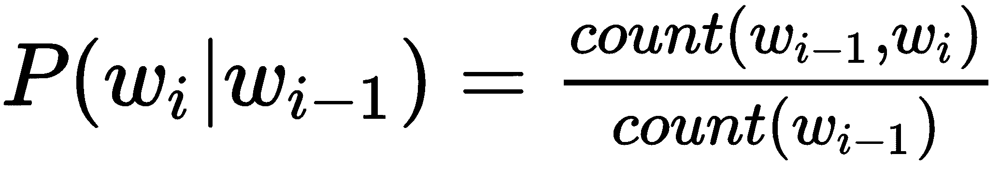]

*   **N-gram** : [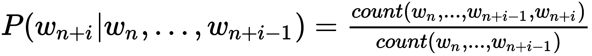]

第 *i-* 个字仅依赖于前面的 *n-1* 个字的独立假设现在可以用来近似联合分布。

例如，对于一个单字，我们可以通过使用以下公式来近似联合分布:

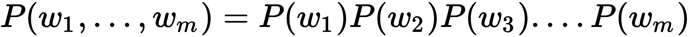

对于三元模型，我们可以使用以下公式来近似联合分布:

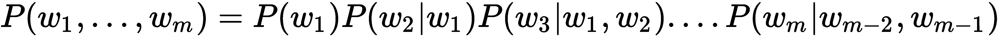

我们可以看到，根据词汇量的大小， *n* -grams 的数量随着 *n* 呈指数增长。例如，如果一个小词汇表包含 100 个单词，那么可能的 5 个单词的数量将是 *100 ⁵ = 10，000，000，000* 个不同的 5 个单词。相比之下，莎士比亚的全部作品包含大约 30，000 个不同的单词，说明了使用带有大的 *n* 的 *n* -grams 的不可行性。不仅存在存储所有概率的问题，而且我们还需要一个非常大的文本语料库来为更大的 *n* 值创建体面的 *n* 克概率估计。

这个问题被称为维数灾难。当可能的输入变量(单词)的数量增加时，这些输入值的不同组合的数量呈指数增长。当学习算法对于每个相关的值组合需要至少一个例子时，维数灾难就出现了，这就是在*n*gram 建模中的情况。我们的 *n* 越大，我们就能越好地逼近原始分布，我们就需要越多的数据来对 *n* 克概率做出好的估计。

既然我们已经熟悉了 *n* -gram 模型和维数灾难，那么让我们讨论一下如何借助神经语言模型来解决它。


# 介绍神经语言模型

克服维数灾难的一种方法是通过学习单词的低维分布式表示(*一种神经概率语言模型*，【http://www.jmlr.org/papers/volume3/bengio03a/bengio03a.pdf】)。这种分布式表示是通过学习嵌入函数来创建的，该嵌入函数将单词空间转换成单词嵌入的低维空间，如下所示:

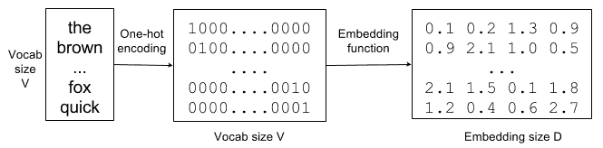

单词->一键编码->单词嵌入向量

来自大小为 *V* 的词汇的单词被转换成大小为 *V* 的独热编码向量(每个单词被唯一编码)。然后，嵌入函数将这个 *V* 维空间转换成大小为 *D* 的分布式表示(这里， *D* =4)。

其思想是嵌入函数学习关于单词的语义信息。它将词汇表中的每个单词与一个连续值向量表示相关联，即单词嵌入。每个词对应这个嵌入空间中的一个点，不同的维度对应这些词的语法或语义属性。

目标是确保嵌入空间中彼此接近的单词具有相似的含义。以这种方式，语言模型可以利用一些单词语义相似的信息。例如，它可能知道*狐狸*和*猫*在语义上是相关的，并且*快速棕色狐狸*和*快速棕色猫*都是有效短语。然后，可以用捕捉这些单词特征的嵌入向量序列来替换单词序列。我们可以使用这个序列作为各种 NLP 任务的基础。例如，试图对一篇文章的情感进行分类的分类器可以使用先前学习的单词嵌入来训练，而不是一次性编码向量。这样，词语的语义信息对于情感分类器变得容易获得。

单词嵌入是解决自然语言处理任务的核心范式之一。我们可以使用它们来提高其他任务的性能，在这些任务中可能没有很多可用的标记数据。接下来，我们将讨论 2001 年推出的第一个神经语言模型(它作为一个例子，说明深度学习中的许多概念都不是新的)。

我们通常用加粗的非斜体小写字母来表示向量，比如 **w** 。但是神经语言模型中的约定是使用斜体小写，比如 *w.* 在本章中，我们将使用这个约定。

在下一节中，我们将看一看**神经概率语言模型** ( **NPLM** )。


# 神经概率语言模型

可以通过前馈全连接网络学习语言模型，并且隐含地学习嵌入函数。给定一个 *n-1* 字序列( *w [t-n+1] ，...，w [t-1]* ，它试图输出下一个词的概率分布， *w [t]* (下图基于[http://www.jmlr.org/papers/volume3/bengio03a/bengio03a.pdf](http://www.jmlr.org/papers/volume3/bengio03a/bengio03a.pdf)):

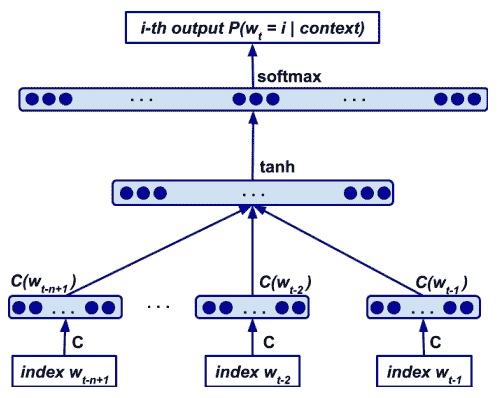

给定单词*w[t-n+1]，输出单词 w [t] 的概率分布的神经网络语言模型...*w[t-1]。 *C* 是嵌入矩阵**

网络层扮演不同的角色，例如:

1.  嵌入层采用单词*w[I]的一键表示，并通过乘以嵌入矩阵 **C** 将其转换为单词的嵌入向量。这种计算可以通过查表来有效地实现。嵌入矩阵 **C** 在单词之间共享，因此所有单词使用相同的嵌入函数。 **C** 是一个 *V * D* 矩阵，其中 *V* 是词汇量的大小， *D* 是嵌入的大小。换句话说，矩阵 **C** 表示隐藏 *tanh* 层的网络权重。*

2.  得到的嵌入被连接起来，并作为隐藏层的输入，隐藏层使用 *tanh* 激活。因此，隐藏层的输出由 [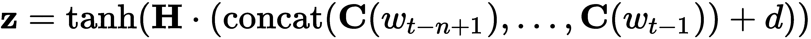] 函数表示，其中 **H** 表示对隐藏层权重的嵌入， *d* 表示隐藏偏差。
3.  最后我们有了带有权重、 **U** 、bias、 *b* 和 softmax activation 的输出层，将隐藏层映射到单词空间概率分布: [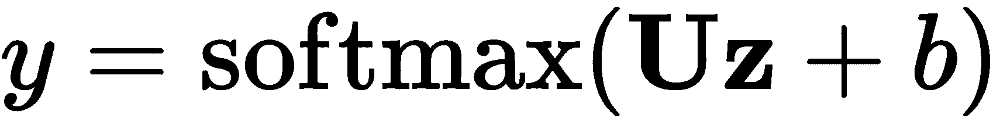] *。*

该模型同时学习词汇表中所有单词的嵌入(嵌入层)和单词序列的概率函数模型(网络输出)。它能够将这个概率函数推广到在训练期间没有看到的单词序列。测试集中的特定单词组合在训练集中可能看不到，但是具有相似嵌入特征的序列在训练期间更有可能被看到。由于我们可以基于单词的位置(已经存在于文本中)来构建训练数据和标签，因此训练该模型是一项无监督的学习任务。接下来，我们将讨论 word2vec 语言模型，该模型于 2013 年推出，并在神经网络的背景下引发了对 NLP 领域的兴趣。


# Word2Vec

很多研究都致力于创建更好的单词嵌入模型，特别是通过省略对单词序列的概率函数的学习。最流行的方法之一是使用 word 2 vec([http://papers . nips . cc/paper/5021-distributed-presentations-of-words-and-phrase-and-they-composition ity . pdf](http://papers.nips.cc/paper/5021-distributed-representations-of-words-and-phrases-and-their-compositionality.pdf)和【https://arxiv.org/abs/1301.3781】[，](https://arxiv.org/abs/1301.3781)[https://arxiv.org/abs/1310.4546](https://arxiv.org/abs/1310.4546))。与 NPLM 类似，word2vec 基于焦点单词的上下文(周围的单词)创建嵌入向量。它有两种风格:**连续单词包** ( **CBOW** )和 **Skip-gram** 。我们将从 CBOW 开始，然后讨论 Skip-gram。


# CBOW

CBOW 根据上下文(周围的单词)预测最可能的单词。例如，给定序列*快速* _____ *狐狸跳跃*，模型将预测*布朗*。上下文是焦点单词的 *n* 前面和 *n* 后面的单词(不像 NPLM，只有前面的单词参与)。下面的屏幕截图显示了上下文窗口在文本上滑动时的情况:

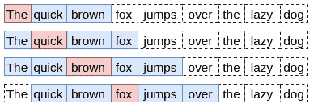

一个 *n = 2* 的 word2vec 滑动上下文窗口。相同类型的上下文窗口适用于 CBOW 和 Skip-gram

CBOW 以相等的权重获取上下文中的所有单词，并且不考虑它们的顺序(因此名称中有*包*)。它有点类似于 NPLM，但因为它只学习嵌入向量，我们将在以下简单神经网络的帮助下训练该模型:

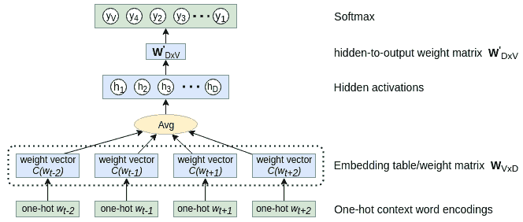

CBOW 模型网络

它是这样工作的:

*   网络有输入层、隐藏层和输出层。
*   输入是独热编码的单词表示。每个单词的独热编码矢量大小等于词汇表的大小， *V* 。
*   嵌入向量由网络的输入-隐藏权重 **W** *[V×D]* 来表示。分别是 *V × D-* 形矩阵，其中 *D* 为嵌入向量的长度(与隐层单元数相同)。在 NPLM，我们可以把权重看作一个查找表，其中每一行代表一个单词嵌入向量。因为每个输入单词都是一次性编码的，所以它总是激活一行权重。也就是说，对于每个输入样本(单词)，只有单词自己的嵌入向量会参与。
*   所有上下文单词的嵌入向量被平均以产生隐藏网络层的输出(没有激活函数)。
*   隐藏激活用作大小为 *V* 的输出 softmax 层的输入(具有权重向量**W^'***[d×V]*)，其预测在输入单词的上下文(邻近度)中最可能找到的单词。具有最高激活度的索引表示一键编码的相关单词。

我们将用梯度下降和反向传播来训练网络。训练集由(上下文和标签)一键编码的单词对组成，这些单词对在文本中彼此非常接近地出现。例如，如果部分文本是序列`[the, quick, brown, fox, jumps]`和 *n = 2* ，则训练元组将包括`([quick, brown], the)`、`([the, brown, fox], quick)`、`([the, quick, fox jumps], brown)`等等。由于我们只对嵌入感兴趣， **W** *[V×D]* ，当训练结束时，我们将丢弃其余的网络权重，**W^'***[v×D]*。

CBOW 会告诉我们哪个单词最有可能出现在给定的上下文中。这可能是生僻字的一个问题。例如，给定上下文*今天的天气实际上是* ____，模型将预测单词*美丽*而不是*难以置信*(嘿，这只是一个例子)。CBOW 的训练速度比 Skip-gram 快几倍，对于频繁出现的单词，CBOW 的准确率略高。


# Skip-gram

给定一个输入单词，Skip-gram 模型可以预测其上下文(与 CBOW 相反)。例如，单词*布朗*将预测单词*快速狐狸跳跃*。与 CBOW 不同，输入是一个单一的热门词。但是我们如何在输出中表示上下文单词呢？Skip-gram 不是试图同时预测整个上下文(所有周围的单词)，而是将上下文转换成多个训练对，例如`(fox, the)`、`(fox, quick)`、`(fox, brown)`和`(fox, jumps)`。同样，我们可以用一个简单的单层网络来训练模型:

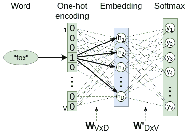

跳格模型网络

与 CBOW 一样，输出是一个 softmax，它表示一个热码编码的最可能的上下文单词。输入到隐藏的权重**W***V×D表示单词嵌入查找表，而隐藏到输出的权重**W^'***[D×V]*仅在训练期间相关。隐藏层没有激活功能(即使用线性激活)。*

我们将使用反向传播来训练模型(这并不奇怪)。给定一个单词序列， *w [1] ，...w[M]，跳格模型的目标是最大化平均对数概率，其中 *n* 是窗口大小:*

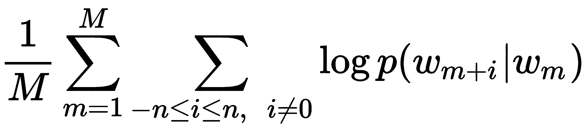

该模型将概率、[、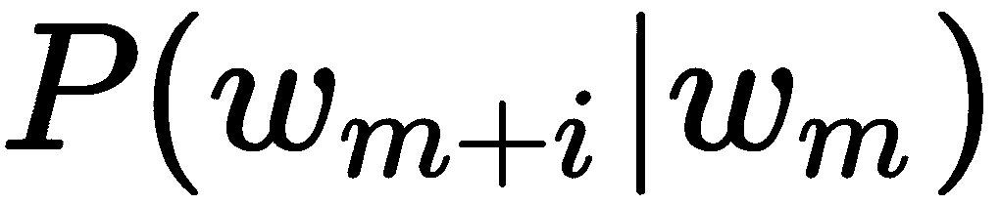、]定义如下:

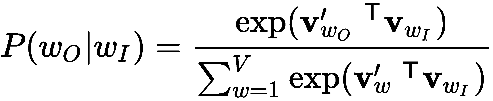

在这个例子中，*W[I]和*W[O]是输入和输出字，而 **v** *[w]* 和**V***^'[W]*是输入和输出权重 **W** *[V×D] 由于网络不具有隐藏激活功能，其对于一个输入/输出字对的输出值简单地是输入字向量、[、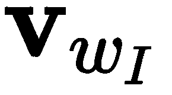、]和输出字向量、[、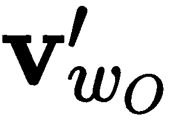、]的乘积(因此是转置操作)。***

word2vec 论文的作者指出，单词表示不能表示不是由单个单词组成的惯用短语。例如，*纽约时报*是一份报纸，而不仅仅是*新*、*纽约、*和*时报*含义的自然组合。为了克服这一点，该模型可以扩展到包括整个短语。然而，这大大增加了词汇量。从前面的公式中我们可以看出，softmax 分母需要计算词汇表中所有单词的输出向量。此外，**W^'***[d×V]*矩阵的每一个权重在每一个训练步骤都被更新，这减慢了训练。

为了解决这个问题，我们可以用所谓的**负采样** ( **负**)来代替 softmax。对于每个训练样本，我们将获取正训练对(例如，`(fox, brown)`)，以及 *k* 个额外的负对(例如，`(fox, puzzle)`)，其中 *k* 通常在[5，20]的范围内。我们不是预测与输入单词(softmax)最匹配的单词，而是简单地预测当前的一对单词是否正确。实际上，我们将多项式分类问题(分类为许多类别中的一个)转换为二元逻辑回归(或二元分类)问题。通过学习正对和负对之间的区别，分类器将最终以与多项式分类相同的方式学习单词向量。在 word2vec 中，否定对的单词来自一个特殊的分布，与更频繁的单词相比，它更频繁地抽取不太频繁的单词。

一些最频繁出现的单词与罕见单词相比，携带的信息价值较少。这类词的例子有定冠词和不定冠词 *a* 、*a*和*t*。与*和*城市*相比，该模型将从观察成对的*伦敦*和*城市*中受益更多，因为几乎所有的单词都与*和*频繁地同现。反之亦然——在大量例子上训练后，频繁词的向量表示并没有显著变化。为了应对罕见词和频繁词之间的不平衡，本文作者提出了一种子采样方法，其中训练集的每个词*w[I]以某种概率被丢弃，该概率通过启发式公式计算，其中 *f(w [i] )* 是词 *w [i]* 的频率，而 *t* 是阈值(通常在 10 ^(-5 左右))**

 *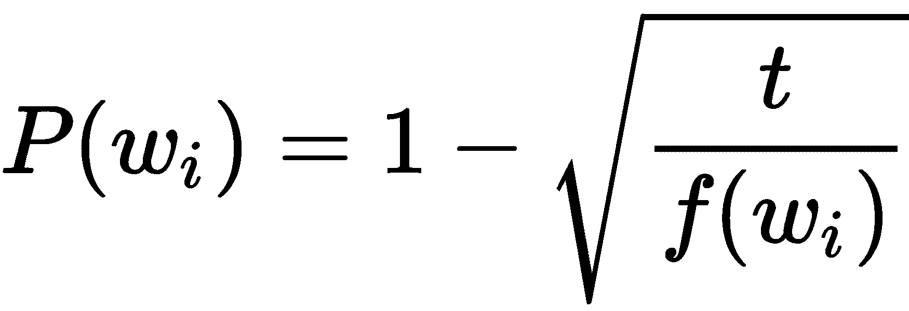

它积极地对频率大于 *t* 的单词进行二次抽样，但也保留了频率的排序。

总之，我们可以说，一般来说，Skip-gram 在生僻字上比 CBOW 表现得更好，但它需要更长的训练时间。


# fastText

fast text([https://fasttext.cc/](https://fasttext.cc/))是由**脸书人工智能研究** ( **FAIR** )团队创建的用于学习单词嵌入和文本分类的库。Word2Vec 将语料库中的每个单词视为一个原子实体，并为每个单词生成一个向量，但这种方法忽略了单词的内部结构。相比之下，fastText 将每个单词 *w* 分解成一包字符*n*-克。例如，如果 *n = 3* ，我们可以将单词 *there* 分解为字符 3-grams，并将特殊序列*there>分解为整个单词:*

*< th* ， *the* ， *her* ， *ere* ， *re >*

注意使用特殊字符 *<* 和 *>* 来表示单词的开始和结束。这对于避免不同单词的*n*-g 之间的不匹配是必要的。例如，单词 *her* 将被表示为 *< her >* 并且不会被误认为是来自单词 *there* 的*n*-克 *her* 。fastText 的作者建议***3≤n******≤6***。

回想一下我们在*跳过程序*部分介绍的 softmax 公式。让我们用一个通用的评分函数来代替 word2vec 网络的向量乘法运算来概括一下， ***s*** ，其中 *w [t]* 是输入单词， *w [c]* 是上下文单词:

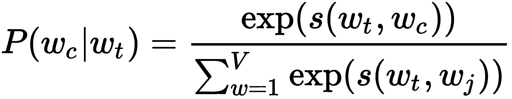

在快速文本的情况下，我们将用一个单词的 *n* 个字母的矢量表示的总和来表示这个单词。让我们用*G[w]= { 1 }来表示出现在单词 *w* 中的 *n* 的集合...G}* ，一个 *n* -gram、 *g* ，带 **v *[g]*** 的向量表示，以及上下文词的势向量， *c* ，带**v***'**[c]***。然后，由 fastText 定义的评分函数变成如下:

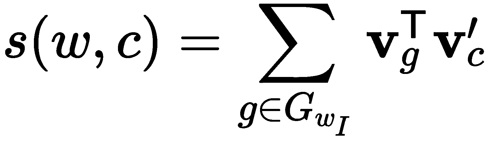

实际上，我们用 Skip-gram 类型的单词对来训练 fastText 模型，但是输入单词被表示为一包 *n* 个单词。

与传统的 word2vec 模型相比，使用 character *n* -grams 有几个优点:

*   如果未知或拼写错误的单词与模型熟悉的其他单词共享 *n* -grams，它可以对这些单词进行分类。
*   它可以为生僻字生成更好的字嵌入。即使一个单词很少见，它的字符 *n* -grams 仍然与其他单词共享，因此嵌入仍然是好的。

现在我们已经熟悉了 word 2 vector，我们将介绍 Word 表示语言的全局向量模型，它改进了 Word 2 vector 的一些缺陷。


# 单词表示模型的全局向量

word2vec 的一个缺点是，它只使用单词的局部上下文，而不考虑它们的全局共现。这样，模型就失去了一个现成的、有价值的信息来源。顾名思义，**单词表示的全局向量** ( **手套**)模型试图解决这个(【https://nlp.stanford.edu/pubs/glove.pdf】T4)。

该算法从全局单词-单词共现矩阵 **X** 开始。一个单元格，*X[ij]，指示单词 *j* 在单词 *i* 的上下文中出现的频率。下表显示了大小为序列*I like D1 的 *n* = 2 的窗口的共生矩阵。我喜欢 NLP。我喜欢骑自行车:**

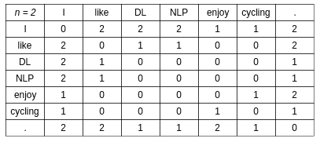

序列 I 的一个共生矩阵喜欢 DL。我喜欢 NLP。我喜欢骑自行车

让我们来表示任何单词在带有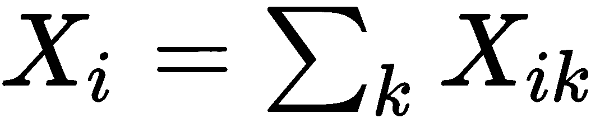的单词 *i* 的上下文中出现的次数，以及单词 *j* 在带有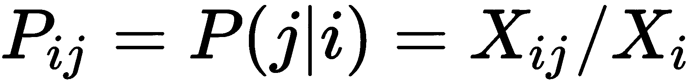的单词 *i* 的上下文中出现的概率。为了更好地理解这如何帮助我们，我们将使用一个示例来显示目标单词 *ice* 和 *steam* 与从 60 亿个标记语料库中选择的上下文单词的共现概率:

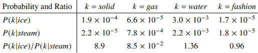

目标词 ice 和 steam 与来自 60 亿令牌语料库的选定上下文词的共现概率:来源:https://nlp.stanford.edu/pubs/glove.pdf

最下面一行显示了概率的比率。**字固**(第一列)与**冰**有关，与**汽**关系较少，所以两者概率之比较大。相反，**气体**与**蒸汽**的关联度大于**冰**的关联度，两者概率之比非常小。单词**水**和**时尚**与两个目标单词同样相关，因此概率的比率接近 1。与原始概率*相比，该比率更好地区分了相关词*(******)*和无关词 *(* **水****时尚***)*。此外，它更擅长区分两个相关的单词。*****

 ****根据前面的论点，GloVe 的作者建议从同现概率的比率开始单词向量学习，而不是概率本身。有了那个起点，并且记住比率 [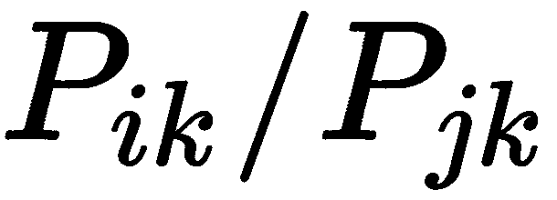] 取决于三个词——*I*、 *j* 和*k——*我们可以如下定义手套模型的最一般形式，其中 [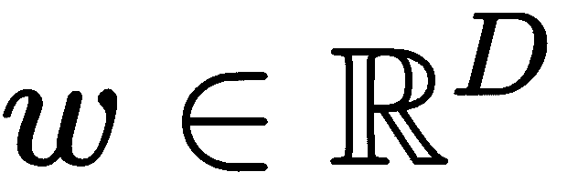] 是词向量， [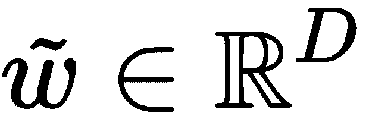] 是特殊的上下文向量，我们将在后面讨论( [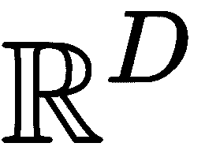] 是 *D* )

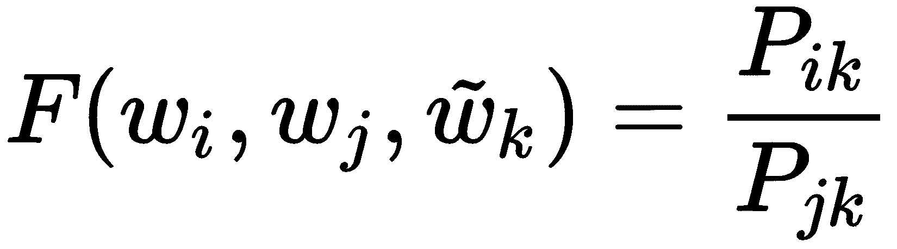

换句话说， *F* 是这样一个函数，当用这三个特定向量(我们假设我们已经知道它们)计算时，将输出概率的比率。此外， *F* 应该对概率比的信息进行编码，因为我们已经确定了它的重要性。由于向量空间本质上是线性的，因此对该信息进行编码的一种方式是利用两个目标单词的向量差。因此，该函数如下所示:

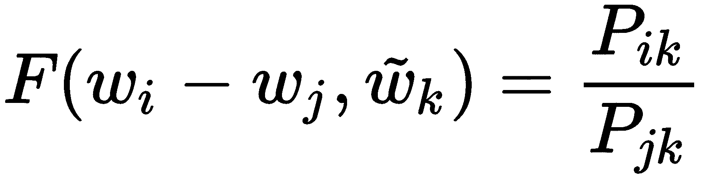

接下来，让我们注意函数自变量是向量，但是概率比是标量。为了解决这个问题，我们可以采用参数的点积:

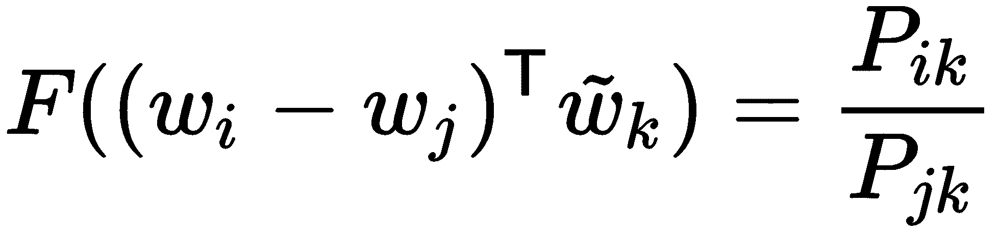

然后，让我们观察一个词和它的上下文词之间的区别是任意的，我们可以自由地交换这两个角色。因此，我们应该有 [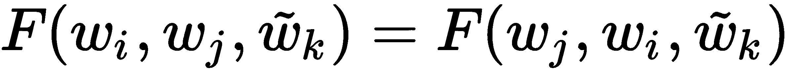] ，但是前面的等式不满足这个条件。长话短说(文中有更详细的解释)，为了满足这个条件，我们需要引入以下等式形式的另一个限制，其中， [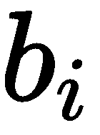] 和 [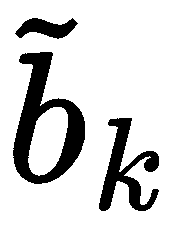] 是偏差标量值:

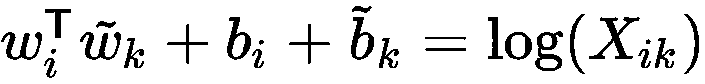

这个公式的一个问题是 *log(0)* 是未定义的，但是大多数的*X[ik]条目将是 *0* 。此外，它以相同的权重对待所有的同现，但是罕见的同现是有噪声的，并且比更频繁的同现携带更少的信息。为了解决所有这些问题，作者提出了一种最小二乘回归模型，该模型具有针对每个共现的加权函数 *f(X [ij] )* 。该模型具有以下成本函数:*

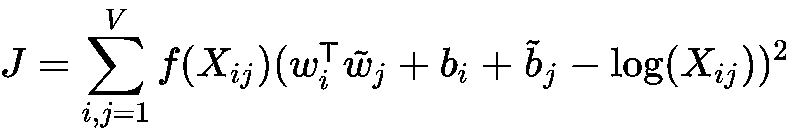

最后，加权函数 *f* 应该满足几个性质。首先， *f(0) = 0* 。那么， *f(x)* 应该是非递减的，使得罕见的同现不会被加权。最后， *f(x)* 对于大值的 *x* 应该相对较小，使得频繁的同现不会被过度加权。基于这些性质及其实验，作者提出以下函数:

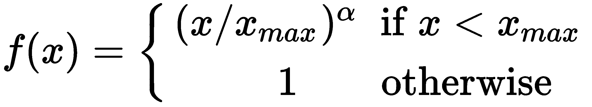

下图显示了 *f(x)* :

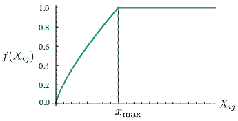

加权函数 *f(X [ij] )* ，截止值为 *x [max]* = 100， *α = 3/4。*作者的实验表明，这些参数效果最好；资料来源:https://nlp.stanford.edu/pubs/glove.pdf

该模型生成两组词向量: *W* 和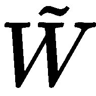。当 *X* 对称时， *W* 和等价，区别仅在于它们的随机初始化。但作者指出，训练一组网络并对其结果进行平均通常有助于防止过度拟合。为了模仿这种行为，他们选择使用 sum [] 作为最终的单词向量，观察到性能有小幅提高。

我们关于神经语言模型的讨论到此结束。在下一节中，我们将看到如何训练和可视化 word2vec 模型。


# 实现语言模型

在这一节中，我们将实现一个短管道来预处理文本序列，并用处理后的数据训练 word2vec 模型。我们还将实现另一个例子来可视化嵌入向量，并检查它们的一些有趣的属性。

本节中的代码需要以下 Python 包:

*   **Gensim** (版本 3.80，【https://radimrehurek.com/gensim/】T2)是一个用于无监督主题建模和 NLP 的开源 Python 库。它支持我们到目前为止讨论的所有三种模型(word2vec、GloVe 和 fastText)。
*   **自然语言工具包** ( **NLTK** ，[https://www.nltk.org/](https://www.nltk.org/)，3.4.4 版)是一套用于符号和统计 NLP 的 Python 库和程序。
*   Scikit-learn(版本 0.19.1，[https://scikit-learn.org/](https://scikit-learn.org/))是一个开源的 Python ML 库，具有各种分类、回归和聚类算法。更具体地说，我们将使用**t-分布随机邻居嵌入** ( **t-SNE** ，[https://lvdmaaten.github.io/tsne/](https://lvdmaaten.github.io/tsne/))来可视化高维嵌入向量(稍后将详细介绍)。

有了这个介绍，让我们继续训练语言模型。


# 训练嵌入模型

在第一个例子中，我们将根据列夫·托尔斯泰的经典小说*战争与和平*训练一个 word2vec 模型。小说作为常规文本文件存储在代码库中。让我们开始:

1.  按照传统，我们将进口:

```py
import logging
import pprint  # beautify prints

import gensim
import nltk
```

2.  然后，我们将日志级别设置为`INFO`，这样我们就可以跟踪训练进度:

```py
logging.basicConfig(level=logging.INFO)
```

3.  接下来，我们将实现文本标记化管道。记号化指的是将文本序列分解成多个片段(或**记号**),如单词、关键字、短语、符号和其他元素。记号可以是单个的单词、短语，甚至是整个句子。我们将实现两级标记化；首先，我们将文本分成句子，然后我们将每个句子分成单独的单词:

```py
class TokenizedSentences:
    """Split text to sentences and tokenize them"""

    def __init__(self, filename: str):
        self.filename = filename

    def __iter__(self):
        with open(self.filename) as f:
            corpus = f.read()

        raw_sentences = nltk.tokenize.sent_tokenize(corpus)
        for sentence in raw_sentences:
            if len(sentence) > 0:
                yield gensim.utils.simple_preprocess(sentence, min_len=2, max_len=15)
```

迭代器将小说所在的文本文件名作为参数。下面是其余部分的工作方式:

1.  迭代从读取`corpus`变量中文件的全部内容开始。
2.  在 NLTK 的`nltk.tokenize.sent_tokenize(corpus)`函数的帮助下，原始文本被分割成一个句子列表(`raw_sentences`变量)。例如，它将为输入列表`'I like DL. I like NLP. I enjoy cycling.'`返回一个`['I like DL.', 'I like NLP.'`、`'I enjoy cycling.']`。
3.  接下来，用`gensim.utils.simple_preprocess(sentence, min_len=2, max_len=15)`函数对每个`sentence`进行预处理。它将一个文档转换成一个小写标记列表，忽略太短或太长的标记。例如，`'I like DL'`句子将被标记到`['like', 'dl']`列表中。标点符号也被删除。将标记化的句子作为最终结果输出。
4.  然后，我们将实例化`TokenizedSentences`:

```py
sentences = TokenizedSentences('war_and_peace.txt')
```

5.  接下来，我们将实例化 Gensim 的 word2vec 训练模型:

```py
model = gensim.models.word2vec. \
    Word2Vec(sentences=sentences,
             sg=1,  # 0 for CBOW and 1 for Skip-gram
             window=5,  # the size of the context window
             negative=5,  # negative sampling word count
             min_count=5,  # minimal word occurrences to include
             iter=5,  # number of epochs
             )
```

模型以`sentences`作为训练数据集。`Word2Vec`支持我们在本章中讨论过的模型的所有参数和变体。例如，您可以使用`sg`参数在 CBOW 或 Skip-gram 之间切换。您还可以设置上下文窗口大小、负采样计数、时期数以及其他内容。您可以探索代码本身的所有参数。

或者，您可以通过用`gensim.models.fasttext.FastText`替换`gensim.models.word2vec.Word2Vec`来使用 fastText 模型(它使用相同的输入参数)。

6.  `Word2Vec`构造器也开始训练。一段时间后(不需要 GPU，因为训练数据集很小)，生成的嵌入向量存储在`model.wv`对象中。一方面，它像一本字典，你可以用`model.wv['WORD_GOES_HERE'],`访问每个单词的向量，然而，它也支持一些其他有趣的功能。您可以使用`model.wv.most_similar`方法，根据不同单词的单词向量的差异来测量它们之间的相似度。首先，它将每个单词向量转换为单位向量(长度为 1 的向量)。然后，它计算目标单词的单位向量和所有其他单词的单位向量之间的点积。两个向量之间的点积越高，它们就越相似。例如，`pprint.pprint(model.wv.most_similar(positive='mother', topn=5))`将输出与单词`'mother'`最相似的五个单词及其点积:

```py
[('sister', 0.9024157524108887),
 ('daughter', 0.8976515531539917),
 ('brother', 0.8965438008308411),
 ('father', 0.8935455679893494),
 ('husband', 0.8779271245002747)]
```

这个结果可以作为一种证据，证明单词向量正确地编码了单词的意思。单词`'mother'`在意思上确实与`'sister'`、`'daughter'`等相关。

我们还可以找到与目标单词组合最相似的单词。例如，`model.wv.most_similar(positive=['woman', 'king'], topn=5)`将取`'woman'`和`'king'`的单词向量的平均值，然后它将找到与新平均值向量最相似的单词:

```py
[('heiress', 0.9176832437515259), ('admirable', 0.9104862213134766), ('honorable', 0.9047746658325195), ('creature', 0.9040032625198364), ('depraved', 0.9013445973396301)]
```

我们可以看到有些词是相关的(`'heiress'`)，但大部分是不相关的(`'creature'`、`'admirable'`)。也许我们的训练数据集太小，无法捕捉像这样更复杂的关系。


# 可视化嵌入向量

为了获得更好的单词向量，与*训练嵌入模型*部分中的那些相比，我们将训练另一个 word2vec 模型。然而，这一次，我们将使用一个更大的语料库——`text8`数据集，它由来自维基百科的前 100，000，000 字节的纯文本组成。这个数据集包含在 Gensim 中，它被标记为一个长长的单词列表。就这样，我们开始吧:

1.  像往常一样，进口是第一位的。为了更好地衡量，我们还将日志设置为`INFO`:

```py
import logging
import pprint  # beautify prints

import gensim.downloader as gensim_downloader
import matplotlib.pyplot as plt
import numpy as np
from gensim.models.word2vec import Word2Vec
from sklearn.manifold import TSNE

logging.basicConfig(level=logging.INFO)
```

2.  接下来，我们将训练`Word2vec`模型。这一次，我们将使用 CBOW 进行更快的训练。我们将用`gensim_downloader.load('text8')`加载数据集:

```py
model = Word2Vec(
    sentences=gensim_downloader.load('text8'),  # download and load the text8 dataset
    sg=0, size=100, window=5, negative=5, min_count=5, iter=5)
```

3.  为了看看这个模型是否更好，我们可以尝试找到与`'woman'`和`'king'`最相似，但与`'man'`最不相似的词。理想情况下，其中一个单词应该是`'queen'`。我们可以通过表达`pprint.pprint(model.wv.most_similar(positive=['woman', 'king'], negative=['man']))`来做到这一点。输出如下所示:

```py
[('queen', 0.6532326936721802), ('prince', 0.6139929294586182), ('empress', 0.6126195192337036), ('princess', 0.6075714230537415), ('elizabeth', 0.588543176651001), ('throne', 0.5846244692802429), ('daughter', 0.5667101144790649), ('son', 0.5659586191177368), ('isabella', 0.5611927509307861), ('scots', 0.5606790781021118)]
```

的确，最相似的单词是`'queen'`，但是其余的单词也是相关的。

4.  接下来，我们将借助 t-SNE 可视化模型在收集的单词向量上显示 2D 图中的单词。t-SNE 以这样的方式在二维或三维点上对每个高维嵌入向量进行建模，其中相似的对象在附近的点上建模，而不相似的对象在远处的点上以高概率建模。我们将从几个`target_words`开始，然后我们将收集与每个目标单词最相似的 *n 个*单词(及其向量)的聚类。下面是实现这一点的代码:

```py
target_words = ['mother', 'car', 'tree', 'science', 'building', 'elephant', 'green']
word_groups, embedding_groups = list(), list()

for word in target_words:
    words = [w for w, _ in model.most_similar(word, topn=5)]
    word_groups.append(words)

    embedding_groups.append([model.wv[w] for w in words])
```

5.  然后，我们将使用以下参数在收集的集群上训练 t-SNE 可视化模型:
    *   `perplexity`与匹配每个点的原始向量和简化向量时所考虑的最近邻的数量不太相关。换句话说，它决定了算法是关注数据的局部属性还是全局属性。
    *   `n_components=2`指定输出向量的维数。
    *   `n_iter=5000`为训练迭代次数。
    *   `init='pca'`使用基于**主成分分析** ( **PCA** )的初始化。

该模型将`embedding_groups`个聚类作为输入，并输出具有 2D 嵌入向量的`embeddings_2d`个数组。以下是实现:

```py
# Train the t-SNE algorithm
embedding_groups = np.array(embedding_groups)
m, n, vector_size = embedding_groups.shape
tsne_model = TSNE(perplexity=8, n_components=2, init='pca', n_iter=5000)

# generate 2d embeddings from the original 100d ones
embeddings_2d = tsne_model.fit_transform(embedding_groups.reshape(m * n, vector_size))
embeddings_2d = np.array(embeddings_2d).reshape(m, n, 2)
```

6.  接下来，我们将展示新的 2D 嵌入。为此，我们将初始化该图及其一些属性以获得更好的可视性:

```py
# Plot the results
plt.figure(figsize=(16, 9))
# Different color and marker for each group of similar words
color_map = plt.get_cmap('Dark2')(np.linspace(0, 1, len(target_words)))
markers = ['o', 'v', 's', 'x', 'D', '*', '+']
```

7.  然后，我们将迭代每个`similar_words`集群，并将它的单词作为点显示在散点图上。我们将为每个集群使用一个唯一的标记。这些点将用相应的词语进行注释:

```py
# Iterate over all groups
for label, similar_words, emb, color, marker in \
        zip(target_words, word_groups, embeddings_2d, color_map, markers):
    x, y = emb[:, 0], emb[:, 1]

    # Plot the points of each word group
    plt.scatter(x=x, y=y, c=color, label=label, marker=marker)

    # Annotate each point with its corresponding caption
    for word, w_x, w_y in zip(similar_words, x, y):
        plt.annotate(word, xy=(w_x, w_y), xytext=(0, 15),
                     textcoords='offset points', ha='center', va='top', size=10)
```

8.  最后，我们将显示该图:

```py
plt.legend()
plt.grid(True)
plt.show()
```

我们可以看到每个相关词簇是如何在 2D 图的一个封闭区域中分组的:

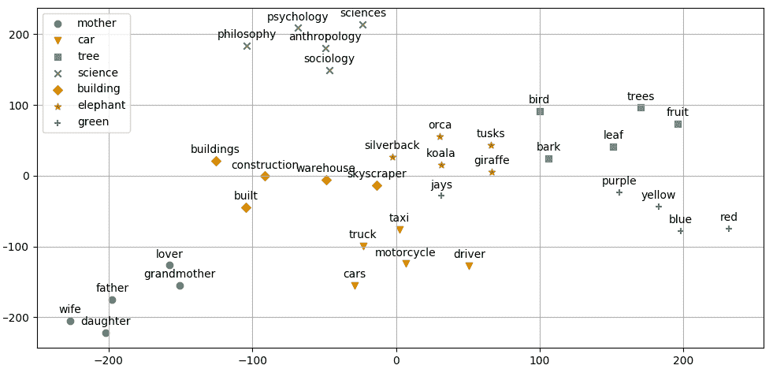

目标词及其最相似词簇的 t-SNE 可视化

该图再次证明了所获得的单词向量包含单词的相关信息。随着这个例子的结束，我们也结束了这一章。


# 摘要

这是第一章专门讨论自然语言处理。恰当地说，我们从今天大多数 NLP 算法的基本构件开始——单词及其基于上下文的向量表示。我们从 *n* -grams 和将单词表示为向量的需求开始。然后，我们讨论了 word2vec、fastText 和 GloVe 模型。最后，我们实现了一个简单的管道来训练嵌入模型，并用 t-SNE 可视化单词向量。

在下一章，我们将讨论 RNNs——一种自然适用于 NLP 任务的神经网络架构。*****