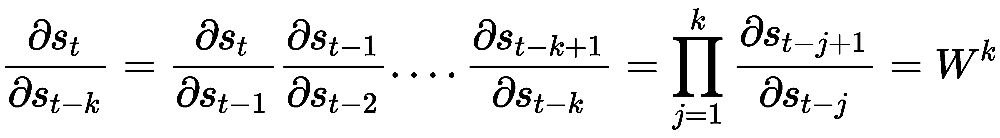

# 十、理解循环网络

在[第一章](b94f711b-daab-4de7-97b7-b7efccd0b392.xhtml)、*神经网络的基本原理*和[第二章](d94e220f-820e-40da-8bb5-9593e0790b21.xhtml)、*了解卷积网络*中，我们深入了解了一般前馈网络及其专门化身**卷积神经网络**(**CNN**)的性质。在本章中，我们将用**循环神经网络** ( **RNNs** )来结束这个故事。我们在前面章节中讨论的神经网络结构接收固定大小的输入，并提供固定大小的输出。rnn 通过在这些序列上定义递归关系(因此得名)来处理可变长度的输入序列，从而解除了这种约束。如果你熟悉本章将要讨论的一些主题，你可以跳过它们。

在本章中，我们将讨论以下主题:

*   RNNs 简介
*   介绍长短期记忆
*   引入门控循环单元
*   实现文本分类


# RNNs 简介

rnn 是可以处理可变长度的顺序数据的神经网络。这种数据的例子包括句子的单词或不同时刻的股票价格。通过使用单词 sequential，我们暗示序列的元素彼此相关，并且它们的顺序很重要。例如，如果我们拿一本书，随机打乱书中所有的单词，文本将失去意义，即使我们仍然知道单个单词。自然，我们可以使用 RNNs 来解决与顺序数据相关的任务。这类任务的例子有语言翻译、语音识别、预测时间序列的下一个元素等等。

rnn 之所以得名，是因为它们对一个序列反复应用相同的函数。我们可以将 RNN 定义为递归关系:


这里， *f* 是可微函数，**s***t*是称为内部网络状态(在步骤 *t* )的值的向量， **x** *[t]* 是步骤 *t* 的网络输入。与常规网络不同，在常规网络中，状态仅取决于当前输入(和网络权重)，在这里， **s** *[t]* 是当前输入以及先前状态的函数，**s***[t-1]*。你可以把**s***[t-1]*看作是网络对之前所有输入的汇总。这与常规前馈网络(包括 CNN)不同，常规前馈网络仅将当前输入样本作为输入。递归关系定义了状态如何通过对先前状态的反馈循环在序列中逐步演变，如下图所示:


Left: Visual illustration of the RNN recurrence relation: s*[t] =*Ws*[t-1] +* Ux*[t;]* The final output will be y*[t] =*Vs*[t] .* Right: The RNN states are recurrently unfolded over the sequence *t-1, t, t+1*. Note that the parameters U, V, and W are shared between all steps

RNN 有三组参数(或权重):

*   **U** 将输入、 **x** *、T5*转换成状态、 **s** *[t] 。*
*   **W** 将之前的状态，**s***t-1*转换为当前状态， **s** *[t] 。*
*   **V** 将新计算的内部状态，**s***t*映射到输出， **y** *[t] 。*

**U** 、 **V** 和 **W** 对各自的输入进行线性变换。这种转换最基本的例子是我们熟悉的加权和。我们现在可以将内部状态和网络输出定义如下:


这里， *f* 为非线性激活函数(如 tanh、sigmoid 或 ReLU)。

例如，在单词级语言模型中，输入 *x* 将是编码在输入向量 *(* **x** *[1] 中的单词序列...*xt...)。状态 *s* 将是一系列状态向量*(***s***[1]...* **s** *[t] ...)*。最后， *y* 的输出将是一系列概率向量*(***y***[1]...* **y** *[t] ...)*序列中的下一个单词。

注意，在 RNN 中，每个状态都依赖于通过这种递归关系的所有先前的计算。这一点的一个重要含义是，rnn 具有随时间推移的记忆，因为状态 *s* 包含基于先前步骤的信息。理论上，RNNs 可以任意长时间地记忆信息，但实际上，它们仅限于回顾几步。我们将在*消失和爆炸渐变*部分详细讨论这个问题。

我们在此描述的 RNN 在某种程度上相当于单层常规神经网络(具有额外的递归关系)。正如我们现在从[第一章](b94f711b-daab-4de7-97b7-b7efccd0b392.xhtml)、*神经网络的具体细节*中所知，一个只有一层的网络有一些严重的局限性。不要害怕！与常规网络一样，我们可以堆叠多个 RNN，形成一个**堆叠 RNN** 。在时间 *t* 时处于水平 *l* 的 RNN 单元的单元状态**s***^l[t]*将从水平 *l-1* 和前一单元状态 **s 取得 RNN 单元的输出**y***[t]^(l-1)***


在下图中，我们可以看到一个展开的堆叠 RNN:


堆叠 RNN

到目前为止，我们讨论的 RNN 采用序列的前面元素来产生输出。这对于时间序列预测等任务很有意义，在这些任务中，我们希望根据前面的元素来预测序列中的下一个元素。但是它也对其他任务施加了不必要的限制，比如来自 NLP 领域的任务。正如我们在[第 6 章](fe6a42c9-f18e-4c2b-9a82-99ec53e727ca.xhtml)、*语言建模*中看到的，我们可以通过上下文获得关于一个单词的大量信息，从前面和后面的单词中提取上下文是有意义的。

我们可以将常规 RNN 扩展到所谓的**双向 RNN** 来涵盖这种情况，如下图所示:


双向 RNN

这个网络有两个在两个方向上工作的传播环路，即从左到右从步骤 *t* 到 *t+1* 和从右到左从步骤 *t+1* 到 *t* 。我们将用 prim 符号表示与从右到左传播相关的符号(不要与导数混淆)。在每个时间步， *t* ，网络保持两个内部状态向量: **s** *[t]* 用于从左到右传播，以及**s***’[t]*用于从右到左传播。从右到左相位有自己的一组输入权重， *U'* 和 *W'* ，反映了从左到右相位的权重， **U** 和 **W** 。从右到左隐藏状态向量的公式如下:


网络的输出， **y** *[t]* ，是内部状态， **s** *[t]* 和**s***[t+1]*的组合。将它们结合起来的一种方法是连接。在这种情况下，我们将用 **V** 表示级联状态的权重矩阵。这里，输出的公式如下:


或者，我们可以简单地将两个状态向量相加:


因为 rnn 不局限于处理固定大小的输入，它们真正扩展了我们可以用神经网络计算的可能性，例如不同长度的序列或不同大小的图像。

让我们来看一些不同的组合:

*   **一个** - **到** - **一个**:这是非顺序处理，比如前馈神经网络和 CNN。请注意，前馈网络和将 RNN 应用于单个时间步长之间没有太大区别。一对一处理的一个例子是图像分类，我们在[第 2 章](d94e220f-820e-40da-8bb5-9593e0790b21.xhtml)、*了解卷积网络*和[第 3 章](433225cc-e19a-4ecb-9874-8de71338142d.xhtml)、*高级卷积网络*中查看过。
*   **一个** - **到** - **多个**:该处理基于单个输入生成一个序列，例如从一个图像生成字幕( *Show and Tell:一个神经图像字幕生成器*、[https://arxiv.org/abs/1411.4555](https://arxiv.org/abs/1411.4555))。
*   **多** - **到** - **一个**:该处理基于一个序列输出一个结果，例如文本的情感分类。
*   **多** - **到** - **多间接**:一个序列被编码成一个状态向量，之后这个状态向量被解码成一个新的序列，例如，语言翻译(*使用用于统计机器翻译的 RNN 编解码器学习短语表示，*[https://arxiv.org/abs/1406.1078](https://arxiv.org/abs/1406.1078)和*序列到序列用神经网络学习*，
*   **多** - **到** - **多直接:**这为每个输入步骤输出一个结果，例如语音识别中的帧音素标注*。*

多对多模型通常被称为**序列到序列** ( **seq2seq** )模型。

以下是上述输入输出组合的图示:


受 http://karpathy.github.io/2015/05/21/rnn-effectiveness/.启发的 RNN 投入产出组合

既然我们已经介绍了 RNNs，在下一节中，我们将从头开始实现一个简单的 RNN 例子来提高我们的知识。


# RNN 实现和培训

在上一节中，我们简要讨论了什么是 rnn 以及它们可以解决什么问题。让我们深入了解 RNN 的细节，以及如何用一个非常简单的玩具例子来训练它:按顺序数数。

在这个问题中，我们将教一个基本的 RNN 如何计算输入中 1 的个数，然后在序列结束时输出结果。这是一个多对一关系的例子，我们在上一节中定义了这种关系。

我们将用 Python(没有 DL 库)和 NumPy 实现这个例子。输入和输出的示例如下:

```py
In: (0, 0, 0, 0, 1, 0, 1, 0, 1, 0) 
Out: 3
```

我们将使用的 RNN 如下图所示:


用于计算输入中 1 的基本 RNN

网络将只有两个参数:输入权重 **U** 和递归权重 **W** 。输出权重 **V** 被设置为 1，因此我们只读出最后一个状态作为输出 **y** 。

由于*s[t]、*x[t]T7、 *U* 和 *W* 是标量值，因此我们不会在 *RNN 实现和训练*部分及其子部分中使用矩阵符号(粗体大写字母)。但是，请注意，这些公式的通用版本使用矩阵和向量参数。**

在我们继续之前，让我们添加一些代码，以便我们的示例可以执行。我们将导入`numpy`，并定义我们的训练和数据`x`，以及标签`y`。`x`是二维的，因为第一维代表小批量中的样品。为了简单起见，我们将使用带有单个样本的小批量:

```py
import numpy as np

# The first dimension represents the mini-batch
x = np.array([[0, 0, 0, 0, 1, 0, 1, 0, 1, 0]])

y = np.array([3])
```

这个网络定义的递归关系是 [] 。请注意，这是一个线性模型，因为我们没有在这个公式中应用非线性函数。我们可以实现如下的递归关系:

```py
def step(s, x, U, W):
   return x * U + s * W
```

状态*s[t]和权重 *W* 和 *U* 是单个标量值。解决这个问题的一个好办法是只得到整个序列的输入之和。如果我们设置 *U=1* ，那么无论何时接收到输入，我们都会得到它的全值。如果我们设置 *W=1* ，那么我们累积的值将永远不会衰减。因此，对于这个例子，我们将得到期望的输出:3。*

尽管如此，让我们用这个简单的例子来对这个神经网络的训练和实现进行网络化。这将是有趣的，我们将在本节的其余部分看到。首先，让我们看看如何通过反向传播得到这个结果。


# 穿越时间的反向传播

穿越时间的反向传播是我们用来训练循环网络的典型算法(*穿越时间的反向传播:它做什么和怎么做*，[http://axon . cs . BYU . edu/~ Martinez/classes/678/Papers/Werbos _ bptt . pdf](http://axon.cs.byu.edu/~martinez/classes/678/Papers/Werbos_BPTT.pdf))。顾名思义，它是基于我们在[第一章](b94f711b-daab-4de7-97b7-b7efccd0b392.xhtml)、*神经网络的具体细节*中讨论过的反向传播算法。

常规反向传播和时间反向传播的主要区别在于，循环网络是在一定数量的时间步长内随时间展开的(如上图所示)。一旦展开完成，我们最终得到一个非常类似于常规多层前馈网络的模型，也就是说，该网络的一个隐藏层代表时间中的一个步骤。唯一的区别是每一层都有多个输入:前一状态， *s [t-1]* ，当前输入， *x [t]* 。参数 *U* 和 *W* 在所有隐藏层之间共享。

正向传递沿序列展开 RNN，并为每一步构建一个状态堆栈。在下面的代码块中，我们可以看到 forward pass 的实现，它为批处理中的每个循环步骤和每个样本返回激活值 *s* :

```py
def forward(x, U, W):
    # Number of samples in the mini-batch
    number_of_samples = len(x)

    # Length of each sample
    sequence_length = len(x[0])

    # Initialize the state activation for each sample along the sequence
    s = np.zeros((number_of_samples, sequence_length + 1))

    # Update the states over the sequence
    for t in range(0, sequence_length):
        s[:, t + 1] = step(s[:, t], x[:, t], U, W)  # step function

    return s
```

既然我们有了向前的步长和损失函数，我们可以定义梯度如何向后传播。由于展开的 RNN 相当于一个常规的前馈网络，我们可以使用我们在[第一章](b94f711b-daab-4de7-97b7-b7efccd0b392.xhtml)、*神经网络的基本原理*中介绍的反向传播链规则。

因为权重 *W* 和 *U* 是跨层共享的，所以我们将累积每个递归步骤的误差导数，最后，我们将使用累积值更新权重。

首先，我们需要得到输出的梯度， **s** *[t]* ，相对于损失函数( *∂J/∂s* )。一旦我们有了它，我们将通过我们在前进步骤中构建的活动堆栈向后传播它。这种向后传递将活动弹出堆栈，以在每个时间步累积它们的误差导数。通过网络传播该梯度的递归关系可以写成如下(链式法则):


这里， *J* 是损失函数。

权重的梯度 *U* 和 *W* 累积如下:


以下是反向传递的实现:

1.  `U`和`W`的梯度分别累积在`gU`和`gW`中:

```py
def backward(x, s, y, W):
    sequence_length = len(x[0])

    # The network output is just the last activation of sequence
    s_t = s[:, -1]

    # Compute the gradient of the output w.r.t. MSE loss function 
      at final state
    gS = 2 * (s_t - y)

    # Set the gradient accumulations to 0
    gU, gW = 0, 0

    # Accumulate gradients backwards
    for k in range(sequence_length, 0, -1):
        # Compute the parameter gradients and accumulate the
          results
        gU += np.sum(gS * x[:, k - 1])
        gW += np.sum(gS * s[:, k - 1])

        # Compute the gradient at the output of the previous layer
        gS = gS * W

    return gU, gW
```

2.  我们现在可以尝试使用梯度下降来优化我们的网络。我们在`backward`函数的帮助下计算`gradients`(使用均方差),并使用它们来更新`weights`值:

```py
def train(x, y, epochs, learning_rate=0.0005):
    """Train the network"""

    # Set initial parameters
    weights = (-2, 0) # (U, W)

    # Accumulate the losses and their respective weights
    losses = list()
    gradients_u = list()
    gradients_w = list()

    # Perform iterative gradient descent
    for i in range(epochs):
        # Perform forward and backward pass to get the gradients
        s = forward(x, weights[0], weights[1])

        # Compute the loss
        loss = (y[0] - s[-1, -1]) ** 2

        # Store the loss and weights values for later display
        losses.append(loss)

        gradients = backward(x, s, y, weights[1])
        gradients_u.append(gradients[0])
        gradients_w.append(gradients[1])

        # Update each parameter `p` by p = p - (gradient *
          learning_rate).
        # `gp` is the gradient of parameter `p`
        weights = tuple((p - gp * learning_rate) for p, gp in
        zip(weights, gradients))

    print(weights)

    return np.array(losses), np.array(gradients_u),
    np.array(gradients_w)
```

3.  接下来，我们将实现相关的`plot_training`函数，该函数显示了`loss`函数和各个时期内每个权重的梯度:

```py
def plot_training(losses, gradients_u, gradients_w):
    import matplotlib.pyplot as plt

    # remove nan and inf values
    losses = losses[~np.isnan(losses)][:-1]
    gradients_u = gradients_u[~np.isnan(gradients_u)][:-1]
    gradients_w = gradients_w[~np.isnan(gradients_w)][:-1]

    # plot the weights U and W
    fig, ax1 = plt.subplots(figsize=(5, 3.4))

    ax1.set_ylim(-3, 20)
    ax1.set_xlabel('epochs')
    ax1.plot(gradients_u, label='grad U', color='blue',
    linestyle=':')
    ax1.plot(gradients_w, label='grad W', color='red', linestyle='--
    ')
    ax1.legend(loc='upper left')

    # instantiate a second axis that shares the same x-axis
    # plot the loss on the second axis
    ax2 = ax1.twinx()

    # uncomment to plot exploding gradients
    ax2.set_ylim(-3, 10)
    ax2.plot(losses, label='Loss', color='green')
    ax2.tick_params(axis='y', labelcolor='green')
    ax2.legend(loc='upper right')

    fig.tight_layout()

    plt.show()
```

4.  最后，我们可以运行这段代码:

```py
losses, gradients_u, gradients_w = train(x, y, epochs=150)
plot_training(losses, gradients_u, gradients_w)
```

上述代码生成了下图:


RNN 损失:实线代表损失，虚线代表训练期间的重量梯度

既然我们已经了解了通过时间的反向传播，让我们讨论一下熟悉的消失和爆炸梯度问题是如何影响它的。


# 消失和爆炸渐变

但是，前面的例子有一个问题。让我们用一个更长的序列来运行培训过程:

```py
x = np.array([[0, 0, 0, 0, 1, 0, 1, 0, 1, 0, 0, 0, 0, 0, 1, 0, 1, 0, 1, 0, 0, 0, 0, 0, 1, 0, 1, 0, 1, 0, 0, 0, 0, 0, 1, 0, 1, 0, 1, 0]])

y = np.array([12])

losses, gradients_u, gradients_w = train(x, y, epochs=150)
plot_training(losses, gradients_u, gradients_w)
```

输出如下所示:

```py
Sum of ones RNN from scratch
chapter07-rnn/simple_rnn.py:5: RuntimeWarning: overflow encountered in multiply
  return x * U + s * W
chapter07-rnn/simple_rnn.py:40: RuntimeWarning: invalid value encountered in multiply
  gU += np.sum(gS * x[:, k - 1])
chapter07-rnn/simple_rnn.py:41: RuntimeWarning: invalid value encountered in multiply
  gW += np.sum(gS * s[:, k - 1])
(nan, nan)
```

出现这些警告的原因是，最终参数 *U* 和 *W* 以**结束，而不是一个数字** ( **NaN** )。为了正确显示梯度，我们需要将`plot_training`函数中梯度轴的比例从`ax1.set_ylim(-3, 20)`更改为`ax1.set_ylim(-3, 600)`，并将损失轴的比例从`ax2.set_ylim(-3, 10)`更改为`ax2.set_ylim(-3, 200)`。

现在，程序将产生新的损失和梯度的如下图表:


爆炸梯度情况下的参数和损失函数

在初始时期，梯度缓慢增加，类似于它们在较短序列中增加的方式。然而，当它们到达第 23 个时段时(尽管确切的时段并不重要)，梯度变得如此之大，以至于超出了`float`变量的范围，并变成 NaN(如图中的跳跃所示)。这个问题被称为爆炸梯度。在常规前馈神经网络中，我们可能会偶然发现爆炸梯度，但在 RNNs 中尤其明显。为了理解为什么，让我们回忆一下我们在时间部分的*反向传播中定义的两个连续序列步骤的递归梯度传播链规则:*


根据序列的长度，展开的 RNN 可以比常规网络更深。同时，RNN 的权重 *W* 在所有步骤中共享。因此，我们可以推广这个公式来计算序列的两个非连续步骤之间的梯度。因为 *W* 是共享的，等式形成了一个几何级数:



在我们简单的线性 RNN 中，如果 *|W|* > *1* (爆炸梯度)，梯度呈指数增长，其中 *W* 是单个标量权重，例如，50 个时间步长超过 W=1.5 就是 *W ^(50) ≈ 637621500* 。如果 *|W| < 1* (消失梯度)，例如 10 个时间步长超过 *W=0.6* 则 *W ^(20) = 0.00097* ，梯度呈指数收缩。如果权重参数 **W** 是一个矩阵而不是一个标量，那么这个爆炸或者消失的梯度与 **W** 的最大特征值( *ρ* )(也称为谱半径)有关。对于 *ρ* < *1* 渐变消失就足够了，对于 *ρ* > *1* 渐变需要爆发。

我们在第一章、*神经网络的基本要素*中首次提到的消失梯度问题，在 RNNs 中有另一个更微妙的影响。梯度随着级数呈指数衰减到某一点，在这一点上它在早期状态变得非常小。实际上，它们被来自更近时间步骤的更大梯度所掩盖，并且网络保留这些更早状态的历史的能力消失了。这个问题更难检测，因为训练仍然有效，网络将产生有效的输出(与爆炸梯度不同)。它只是无法学习长期依赖。

现在，我们熟悉了 RNNs 的一些问题。这些知识将很好地为我们服务，因为在下一节中，我们将讨论如何在一种特殊类型的 RNN 的帮助下解决这些问题。


# 介绍长短期记忆

Hochreiter 和 Schmidhuber 广泛地研究了消失和爆炸梯度的问题，并提出了一个名为**长短期记忆**(【https://www.bioinf.jku.at/publications/older/2604.pdf】**，)的解决方案。由于特制的存储单元，LSTMs 可以处理长期依赖性。事实上，它们工作得如此之好，以至于目前在各种问题上训练 rnn 的大部分成就都是由于 LSTMs 的使用。在本节中，我们将探索这种存储单元如何工作，以及它如何解决渐变消失的问题。**

LSTM 的核心思想是单元格状态， **c** *[t]* (除了隐藏的 RNN 状态， **h** *[t]* )，其中的信息只能显式地写入或删除，以便在没有外界干扰的情况下状态保持不变。细胞状态只能通过特定的门来修改，这是让信息通过的一种方式。这些门由一个 sigmoid 函数和逐元素乘法组成。因为 sigmoid 只输出 0 和 1 之间的值，所以乘法只能减少通过门的值。典型的 LSTM 由三个门组成:遗忘门、输入门和输出门。单元状态、输入和输出都是向量，因此 LSTM 可以在每个时间步长保存不同信息块的组合。

以下是 LSTM 单元的示意图:

Top: LSTM cell; bottom: Unfolded LSTM cell: Inspired by http://colah.github.io/posts/2015-08-Understanding-LSTMs/.

在我们继续之前，让我们介绍一些符号。 **x** *[t]* ， **c** *[t]* ， **h** *[t]* 是时刻 *t* 中 LSTM 的输入、单元记忆状态、输出(或隐藏状态)向量。**c***'[t]*是候选单元格的状态向量(后面会详细说明)。输入端 **x** *[t]* 和前一个单元输出端**h***[t-]*连接到每一个门和候选单元向量，分别具有多组完全连接的权重 **W** 和**U***。***f***[t]*， **i** *[t]* ， **o** *[t]* 是 LSTM 单元的遗忘、输入、输出门。这些门是具有 s 形激活的完全连接的层。

先说忘门，**f***t*。顾名思义，它决定了我们是否要擦除现有单元格状态的一部分。它基于前一个单元的输出的加权矢量和 **h** *[t-1]* 和当前输入的加权矢量和 **x** *[t]* :


从上图中，我们可以看到，遗忘门对前一个状态向量的每个元素应用了元素式 sigmoid 激活，**c***[t-1]*:**f**[*t*]*** c**[*t*-1]。再次注意，因为操作是基于元素的，所以这个向量的值被压缩在[0，1]范围内。输出 0 完全擦除特定的**c***[t-1]*单元块，输出 1 允许该单元块中的信息通过。这意味着 LSTM 可以去除其小区状态向量中的无关信息。

The forget gate was not in the original LSTM that was proposed by Hochreiter. Instead, it was proposed in *Learning to Forget: Continual Prediction with* *LSTM* ([http://citeseerx.ist.psu.edu/viewdoc/download?doi=10.1.1.55.5709&rep=rep1&type=pdf](http://citeseerx.ist.psu.edu/viewdoc/download?doi=10.1.1.55.5709&rep=rep1&type=pdf)).

输入门 **i** *[t]* 决定在多步过程中什么新信息将被添加到存储单元。第一步确定是否要添加任何信息。与在遗忘门中一样，它根据 **h** *[t-1]* 和 **x** *[t]* 做出决定:它通过 sigmoid 函数为候选状态向量的每个单元输出 0 或 1。输出为 0 意味着没有信息添加到该单元块的存储器中。因此，LSTM 可以在其单元状态向量中存储特定的信息片段:


在下一步中，我们计算新的候选小区状态，**c***’[t]*。它基于先前的输出 **h** *[t-1]* 和当前的输入 **x** *[t]* ，并通过双曲正切函数进行转换:


接下来，*c’[t]*通过逐元素乘法与输入门的 sigmoid 输出组合， [] 。

概括地说，遗忘和输入门分别决定从先前和候选单元状态中遗忘和包含什么信息。新单元状态的最终版本， *c [t]* ，只是这两个组件之间的元素式求和:


接下来，让我们关注输出门，它决定了总的细胞输出是多少。它将 **h** *[t-1]* 和 **x** *[t]* 作为单元内存的每个块的输入和输出，即 0 或 1(通过 sigmoid 函数)。像以前一样，0 表示该块不输出任何信息，1 表示该块可以作为单元格的输出通过。因此，LSTM 可以从其小区状态向量中输出特定的信息块:


最后，LSTM 单元输出由双曲正切函数传递:


因为所有这些公式都是可推导的，我们可以将 LSTM 细胞链接在一起，就像我们将简单的 RNN 状态链接在一起，并通过时间的反向传播来训练网络一样。

但是 LSTM 如何保护我们免受渐变消失的影响呢？让我们从正向阶段开始。请注意，如果遗忘门为 1，输入门为 0: [] ，则单元状态会从一个步骤复制到另一个步骤。只有遗忘之门可以彻底清除细胞的记忆。因此，记忆可以在很长一段时间内保持不变。另外，请注意，输入是添加到当前单元格内存中的 tanh 激活。这意味着细胞的记忆不会爆炸，而且相当稳定。

让我们用一个例子来演示 LSTM 电池是如何展开的。为了简单起见，我们假设它有一维(单个标量值)输入、状态和输出向量。因为这些值是标量，所以在本例的其余部分我们不使用矢量符号:


Unrolling an LSTM through time: Inspired by http://nikhilbuduma.com/2015/01/11/a-deep-dive-into-recurrent-neural-networks/.

流程如下:

1.  首先，我们将值 3 作为候选州。输入门设置为 *f [i] = 1* ，遗忘门设置为 *f [t] = 0* 。这意味着先前的状态 *c [t-1] = N* 被擦除，并被新的状态 [] 所取代。
2.  对于接下来的两个时间步长，遗忘门设置为 1，而输入门设置为 0。通过这样做，所有的信息在这些步骤中被保留，并且没有新的信息被添加，因为输入门被设置为 0: [] 。
3.  最后，输出门被设置为 *o [t] = 1* ，3 被输出并保持不变。我们已经成功地演示了内部状态是如何跨多个步骤存储的。

接下来，我们来关注一下后向阶段。单元状态*c[t]也可以在遗忘门*f[t]的帮助下减轻消失/爆炸梯度。像常规的 RNN 一样，我们可以用链式法则连续两步计算偏导数 [] 。遵循公式 [] 且不赘述，其偏导数如下:**


我们也可以将此归纳为不连续的步骤:


如果遗忘门值接近 1，梯度信息可以几乎不变地通过网络状态传回。这是因为*f[t]使用了乙状结肠激活，信息流仍然受制于乙状结肠激活特有的消失梯度([第 1 章](b94f711b-daab-4de7-97b7-b7efccd0b392.xhtml)、*神经网络的基本要素*)。但与常规 RNN 中的梯度不同， *f [t]* 在每个时间步长都有不同的值。因此，这不是一个几何级数，消失梯度效应不太明显。*

我们可以以与堆叠常规 rnn 相同的方式堆叠 LSTM 单元，除了在一个级别的步骤 *t* 的单元状态用作在步骤 *t+1* 的相同级别的单元状态的输入。下图显示了展开的堆叠 LSTM:


Stacked LSTM

现在我们已经介绍了 LSTM，让我们通过在下一部分实现它来巩固我们的知识。


# 实现 LSTM

在本节中，我们将使用 PyTorch 1.3.1 实现一个 LSTM 单元。首先，让我们注意 PyTorch 已经有了一个 LSTM 实现，它在`torch.nn.LSTM`可用。然而，我们的目标是理解 LSTM 单元是如何工作的，所以我们将从头实现我们自己的版本。cell 将是`torch.nn.Module`的子类，我们将把它作为更大模型的构建模块。这个例子的源代码可以在[https://github . com/packt publishing/Advanced-Deep-Learning-with-Python/tree/master/chapter 07/lstm _ cell . py](https://github.com/PacktPublishing/Advanced-Deep-Learning-with-Python/tree/master/Chapter07/lstm_cell.py)获得。让我们开始吧:

1.  首先，我们将进行导入:

```py
import math
import typing

import torch
```

2.  接下来，我们将实现这个类和`__init__`方法:

```py
class LSTMCell(torch.nn.Module):

    def __init__(self, input_size: int, hidden_size: int):
        """
        :param input_size: input vector size
        :param hidden_size: cell state vector size
        """

        super(LSTMCell, self).__init__()
        self.input_size = input_size
        self.hidden_size = hidden_size

        # combine all gates in a single matrix multiplication
        self.x_fc = torch.nn.Linear(input_size, 4 * hidden_size)
        self.h_fc = torch.nn.Linear(hidden_size, 4 * hidden_size)

        self.reset_parameters()
```

为了理解全连接层、`self.x_fc`和`self.h_fc`的作用，让我们回忆一下，候选单元状态和输入、遗忘、输出门都取决于输入、 **x** [*t*] 和前一个单元输出、**h***[t-1]*的加权向量和。因此，我们可以将这些操作组合起来，形成两个大的完全连接的层`self.x_fc`和`self.h_fc`，每个层的输出大小为`4 * hidden_size`，而不是为每个单元设置八个单独的 [] 和 [] 操作。一旦我们需要特定门的输出，我们可以从完全连接的层的两个张量输出中提取必要的切片(我们将在`forward`方法的实现中看到如何做到这一点)。

3.  让我们继续使用`reset_parameters`方法，它用 LSTM 特有的 Xavier 初始化器初始化网络的所有权重(如果您直接复制并粘贴这段代码，您可能需要检查缩进):

```py
def reset_parameters(self):
    """Xavier initialization """
    size = math.sqrt(3.0 / self.hidden_size)
    for weight in self.parameters():
        weight.data.uniform_(-size, size)
```

4.  接下来，我们将开始实现`forward`方法，它包含了我们在*介绍长期短期记忆*一节中描述的所有 LSTM 执行逻辑。它将步骤 *t* 处的当前小批量以及包含步骤 *t-1* 处的单元输出和单元状态的元组作为输入:

```py
def forward(self,
            x_t: torch.Tensor,
            hidden: typing.Tuple[torch.Tensor, torch.Tensor] =      (None, None)) \
        -> typing.Tuple[torch.Tensor, torch.Tensor]:
    h_t_1, c_t_1 = hidden # t_1 is equivalent to t-1

    # in case of more than 2-dimensional input
    # flatten the tensor (similar to numpy.reshape)
    x_t = x_t.view(-1, x_t.size(1))
    h_t_1 = h_t_1.view(-1, h_t_1.size(1))
    c_t_1 = c_t_1.view(-1, c_t_1.size(1))
```

5.  我们将继续同时计算所有三个门和候选状态的激活。这很简单，只需执行以下操作:

```py
gates = self.x_fc(x_t) + self.h_fc(h_t_1)
```

6.  接下来，我们将分割每个门的输出:

```py
i_t, f_t, candidate_c_t, o_t = gates.chunk(4, 1)
```

7.  然后，我们将对它们应用`activation`函数:

```py
i_t, f_t, candidate_c_t, o_t = \
    i_t.sigmoid(), f_t.sigmoid(), candidate_c_t.tanh(), o_t.sigmoid()
```

8.  接下来，我们将计算新的单元格状态， **c** *[t]* :

```py
c_t = torch.mul(f_t, c_t_1) + torch.mul(i_t, candidate_c_t)
```

9.  最后，我们将计算单元格输出，`ht`，并将它与新的单元格状态， *c [t]* 一起返回:

```py
h_t = torch.mul(o_t, torch.tanh(c_t))
return h_t, c_t
```

一旦我们有了 LSTM 细胞，我们就可以用它来完成同样的任务，即在一个序列中计数 1，就像我们对常规的 RNN 所做的那样。我们将只包括源代码中最相关的部分，但完整的示例可在[https://github . com/packt publishing/Advanced-Deep-Learning-with-Python/tree/master/chapter 07/lstm _ gru _ count _ 1s . py](https://github.com/PacktPublishing/Advanced-Deep-Learning-with-Python/tree/master/Chapter07/lstm_gru_count_1s.py)获得。这一次，我们将使用 10，000 个长度为 20 的二进制序列的完整训练集(这些是任意数字)。实现的前提类似于 RNN 的例子:我们以递归的方式将二进制序列输入到 LSTM，并且单元将预测的 1 的计数作为单个标量值输出(回归任务)。然而，我们的`LSTMCell`实现有两个限制:

*   它只涵盖了序列中的一个步骤。
*   它输出单元状态和网络输出向量。这是一个回归任务，我们有一个单一的输出值，但细胞状态和网络输出有更多的维度。

为了解决这些问题，我们将实现一个自定义的`LSTMModel`类，它扩展了`LSTMCell`。它向`LSTMCell`实例提供序列的所有元素，并处理单元状态的转换和从序列的一个元素到下一个元素的网络输出。

一旦产生了最终输出，它就被馈送到完全连接的层，该层将其转换成单个标量值，该标量值表示网络对 1 的数量的预测。下面是它的实现:

```py
class LSTMModel(torch.nn.Module):
    def __init__(self, input_dim, hidden_size, output_dim):
        super(LSTMModel, self).__init__()
        self.hidden_size = hidden_size

        # Our own LSTM implementation
        self.lstm = LSTMCell(input_dim, hidden_size)

        # Fully connected output layer
        self.fc = torch.nn.Linear(hidden_size, output_dim)

    def forward(self, x):
        # Start with empty network output and cell state to initialize the sequence
        c_t = torch.zeros((x.size(0), self.hidden_size)).to(x.device)
        h_t = torch.zeros((x.size(0), self.hidden_size)).to(x.device)

        # Iterate over all sequence elements across all sequences of the mini-batch
        for seq in range(x.size(1)):
            h_t, c_t = self.lstm(x[:, seq, :], (h_t, c_t))

        # Final output layer
        return self.fc(h_t)
```

现在，我们将直接跳到训练/测试设置阶段(回想一下，这只是完整源代码的一个片段):

1.  首先，我们将生成训练和测试数据集。`generate_dataset`函数返回一个`torch.utils.data.TensorDataset`的实例。它包含长度为`SEQUENCE_LENGTH = 20`的二进制序列的`TRAINING_SAMPLES = 10000`二维张量和每个序列中 1 的数量的标量值标签；

```py
train = generate_dataset(SEQUENCE_LENGTH, TRAINING_SAMPLES)
train_loader = torch.utils.data.DataLoader(train, batch_size=BATCH_SIZE, shuffle=True)

test = generate_dataset(SEQUENCE_LENGTH, TEST_SAMPLES)
test_loader = torch.utils.data.DataLoader(test, batch_size=BATCH_SIZE, shuffle=True)
```

2.  我们将用`HIDDEN_UNITS = 20`实例化这个模型。该模型接受单个输入(每个序列元素)并输出单个值(1 的数量):

```py
model = LSTMModel(input_size=1, hidden_size=HIDDEN_UNITS, output_size=1)
```

3.  接下来，我们将实例化`MSELoss`函数(因为回归)和 Adam 优化器:

```py
loss_function = torch.nn.MSELoss()
optimizer = torch.optim.Adam(model.parameters())
```

4.  最后，我们可以为`EPOCHS = 10`运行培训/测试周期。`train_model`和`test_model`函数与我们在[第 2 章](d94e220f-820e-40da-8bb5-9593e0790b21.xhtml)、*理解卷积网络*的*用 PyTorch* 部分实现的函数相同:

```py
for epoch in range(EPOCHS):
    print('Epoch {}/{}'.format(epoch + 1, EPOCHS))

    train_model(model, loss_function, optimizer, train_loader)
    test_model(model, loss_function, test_loader)
```

如果我们运行这个例子，网络将在 5-6 个时期内达到 100%的测试准确度。

现在我们已经了解了 LSTMs，让我们把注意力转移到门控循环单位。这是另一种类型的循环块，试图复制 LSTM 的属性，但结构简化。


# 引入门控循环单元

一个**门控递归单元**(**)是 2014 年引入的一种递归块(*学习短语表示，使用 RNN 编码器-解码器进行统计机器翻译*、[https://arxiv.org/abs/1406.1078](https://arxiv.org/abs/1406.1078)和*门控循环神经网络对序列建模的经验评估*、[https://arxiv.org/abs/1412.3555](https://arxiv.org/abs/1412.3555))，作为对 LSTM 的改进。GRU 装置通常具有与 LSTM 类似或更好的性能，但它使用的参数和操作更少:**

**

GRU 细胞

类似于*经典* RNN，一个 GRU 单元有一个单一的隐藏状态，**h***t*。您可以将其视为 LSTM 的隐藏状态和单元格状态的组合。GRU 牢房有两个门:

*   一个更新门，**z***T3t*，它结合了输入和忘记 LSTM 门。它根据网络输入、 **x** *[t]* 以及前一个单元格的隐藏状态、**h***[t-1]*来决定要丢弃哪些信息以及在其位置上包含哪些新信息。通过结合这两个门，我们可以确保细胞会忘记信息，但只有当我们要在它的位置包含新信息时:


*   一个复位门， **r** *[t]* ，它使用前一个单元状态， **h** *[t-1]* ，以及网络输入， **x** *[t]* ，来决定通过多少前一个状态:


接下来，我们有了候选州， **h** *' [t]* :


最后，GRU 输出， **h** *[t]* ，在时间 *t* 是先前输出，**h***[T1]*和候选输出，**h***'[t]*之间的逐元素求和:


由于更新门允许我们忘记和存储数据，所以它直接应用于先前的输出，**h[t]***[—1]*，并应用于候选输出， **h** *' [t]* 。


# 实现 gru

在本节中，我们将按照*实现 LSTM* 一节中的蓝图，用 PyTorch 1.3.1 实现一个 GRU 单元。让我们开始吧:

1.  首先，我们将进行导入:

```py
import math
import torch
```

2.  接下来，我们将编写类定义和`init`方法。在 LSTM，我们能够为所有门创建一个共享的全连接层，因为每个门都需要相同的输入组合 **x** [*t*] 和 **h** [*t-1*] 。GRU 门使用不同的输入，因此我们将为每个 GRU 门创建单独的全连接操作:

```py
class GRUCell(torch.nn.Module):

    def __init__(self, input_size: int, hidden_size: int):
        """
        :param input_size: input vector size
        :param hidden_size: cell state vector size
        """

        super(GRUCell, self).__init__()
        self.input_size = input_size
        self.hidden_size = hidden_size

        # x to reset gate r
        self.x_r_fc = torch.nn.Linear(input_size, hidden_size)

        # x to update gate z
        self.x_z_fc = torch.nn.Linear(input_size, hidden_size)

        # x to candidate state h'(t)
        self.x_h_fc = torch.nn.Linear(input_size, hidden_size)

        # network output/state h(t-1) to reset gate r
        self.h_r_fc = torch.nn.Linear(hidden_size, hidden_size)

        # network output/state h(t-1) to update gate z
        self.h_z_fc = torch.nn.Linear(hidden_size, hidden_size)

        # network state h(t-1) passed through the reset gate r towards candidate state h(t)
        self.hr_h_fc = torch.nn.Linear(hidden_size, hidden_size)
```

我们将省略`reset_parameters`的定义，因为它与`LSTMCell`中的定义相同。

3.  然后，我们将按照我们在*门控循环单元*一节中描述的步骤，用单元格实现`forward`方法。该方法将当前输入向量 **x** *[t]* 和前一单元格状态/输出**h***[t-1]*作为输入。首先，我们将计算遗忘和更新门，类似于我们在 LSTM 单元中计算门的方式:

```py
def forward(self,
            x_t: torch.Tensor,
            h_t_1: torch.Tensor = None) \
        -> torch.Tensor:

    # compute update gate vector
    z_t = torch.sigmoid(self.x_z_fc(x_t) + self.h_z_fc(h_t_1))

    # compute reset gate vector
    r_t = torch.sigmoid(self.x_r_fc(x_t) + self.h_r_fc(h_t_1))
```

4.  接下来，我们将计算新的候选状态/输出，它使用复位门:

```py
candidate_h_t = torch.tanh(self.x_h_fc(x_t) + self.hr_h_fc(torch.mul(r_t, h_t_1)))
```

5.  最后，我们将根据候选状态和更新门计算新的输出:

```py
h_t = torch.mul(z_t, h_t_1) + torch.mul(1 - z_t, candidate_h_t)
```

我们可以用 GRU 细胞实现“数 1”的任务，就像我们在 LSTM 做的那样。为了避免重复，我们不会在这里包括实现，但它可以在[https://github . com/packt publishing/Advanced-Deep-Learning-with-Python/tree/master/chapter 07/lstm _ gru _ count _ 1s . py](https://github.com/PacktPublishing/Advanced-Deep-Learning-with-Python/tree/master/Chapter07/lstm_gru_count_1s.py)中找到。

我们对各种类型的 rnn 的讨论到此结束。接下来，我们将通过实现一个文本情感分析示例来传递这些知识。


# 实现文本分类

让我们回顾一下到目前为止的这一章。我们从只使用`numpy`实现一个 RNN 开始。然后，我们继续使用原始 PyTorch 操作实现 LSTM。我们将通过为一个文本分类问题训练默认的 PyTorch 1.3.1 LSTM 实现来结束这个弧。这个例子也需要`torchtext` 0.4.0 包。文本分类(或归类)是指根据其内容分配类别(或标签)的任务。文本分类任务包括垃圾邮件检测、主题标注和情感分析。这种类型的问题是*多对一*关系的一个例子，我们在*RNNs 简介*一节中定义了这种关系。

在本节中，我们将在大型电影评论数据集(【http://ai.stanford.edu/~amaas/data/sentiment/】)上实现一个情感分析示例，该数据集由 25，000 个训练和 25，000 个流行电影的测试评论组成。每个评论都有一个二元标签，表明它是积极的还是消极的。除了 PyTorch，我们还将使用`torchtext`包(【https://torchtext.readthedocs.io/】T4)。它由数据处理工具和自然语言的流行数据集组成。您还需要安装用于高级 NLP 的`spacy`开源软件库( [https://spacy.io](https://spacy.io) )，我们将使用它来标记数据集。

情感分析算法显示在下图中:


基于词嵌入和 LSTM 的情感分析

让我们描述一下算法步骤(这些对任何文本分类算法都有效):

1.  序列中的每个单词都被替换为其嵌入向量([第六章](fe6a42c9-f18e-4c2b-9a82-99ec53e727ca.xhtml)、*语言建模*)。这些嵌入可以用 word2vec、fastText、GloVe 等生成。
2.  单词 embedding 作为输入被馈送到 LSTM 单元。
3.  单元输出， **h** *[t]* ，作为具有单个输出单元的全连接层的输入。该单位使用 sigmoid 激活，它表示审核为正(1)或负(0)的概率。如果问题是多项式的(而不是二元的)，我们可以用 softmax 代替 sigmoid。
4.  序列的最后一个元素的网络输出被视为整个序列的结果。

现在我们已经提供了算法的概述，让我们实现它。我们将只包括代码中有趣的部分，但完整的实现可从[https://github . com/packt publishing/Advanced-Deep-Learning-with-Python/tree/master/chapter 07/perspective _ analysis . py](https://github.com/PacktPublishing/Advanced-Deep-Learning-with-Python/tree/master/Chapter07/sentiment_analysis.py)[获得。](https://github.com/PacktPublishing/Advanced-Deep-Learning-with-Python/tree/master/Chapter07/sentiment_analysis.py)

This example is partially based on [https://github.com/bentrevett/pytorch-sentiment-analysis](https://github.com/bentrevett/pytorch-sentiment-analysis).

让我们开始吧:

1.  首先，我们将添加导入:

```py
import torch
import torchtext
```

2.  接下来，我们将实例化一个`torchtext.data.Field`对象:

```py
TEXT = torchtext.data.Field(
    tokenize='spacy',  # use SpaCy tokenizer
    lower=True,  # convert all letters to lower case
    include_lengths=True,  # include the length of the movie review
)
```

这个对象声明了一个文本处理管道，它从原始文本开始，输出文本的张量表示。更具体地说，它使用了`spacy`标记器，将所有的字母转换成小写，并包含了每个电影评论的长度(以单词为单位)。

3.  然后，我们将对标签(正面或负面)进行同样的操作:

```py
LABEL = torchtext.data.LabelField(dtype=torch.float)
```

4.  接下来，我们将实例化训练和测试数据集拆分:

```py
train, test = torchtext.datasets.IMDB.splits(TEXT, LABEL)
```

电影评论数据集包含在`torchtext`中，我们不需要做任何额外的工作。`splits`方法将`TEXT`和`LABEL`字段作为参数。通过这样做，指定的管道被应用于所选数据集。

5.  然后，我们将实例化词汇表:

```py
TEXT.build_vocab(train, vectors=torchtext.vocab.GloVe(name='6B', dim=100))
LABEL.build_vocab(train)
```

词汇表提供了一种用数字表示单词的机制。在这种情况下，`TEXT`字段的数字表示是预训练的 100d 手套向量。另一方面，数据集中的标签有一个字符串值`pos`或`neg`。这里词汇表的作用是给这两个标签分配数字(0 和 1)。

6.  接下来，我们将为训练和测试数据集定义迭代器，其中`device`代表 GPU 或 CPU。迭代器将在每次调用时返回一个小批量:

```py
train_iter, test_iter = torchtext.data.BucketIterator.splits(
    (train, test), sort_within_batch=True, batch_size=64, device=device)
```

7.  我们将通过实现和实例化`LSTMModel`类来继续。这是程序的核心，它实现了我们在本节开头的图表中定义的算法步骤:

```py
class LSTMModel(torch.nn.Module):
    def __init__(self, vocab_size, embedding_size, hidden_size, output_size, pad_idx):
        super().__init__()

        # Embedding field
        self.embedding=torch.nn.Embedding(num_embeddings=vocab_size,
        embedding_dim=embedding_size,padding_idx=pad_idx)

        # LSTM cell
        self.rnn = torch.nn.LSTM(input_size=embedding_size,
        hidden_size=hidden_size)

        # Fully connected output
        self.fc = torch.nn.Linear(hidden_size, output_size)

    def forward(self, text_sequence, text_lengths):
        # Extract embedding vectors
        embeddings = self.embedding(text_sequence)

        # Pad the sequences to equal length
        packed_sequence =torch.nn.utils.rnn.pack_padded_sequence
        (embeddings, text_lengths)

        packed_output, (hidden, cell) = self.rnn(packed_sequence)

        return self.fc(hidden)

model = LSTMModel(vocab_size=len(TEXT.vocab),
                  embedding_size=EMBEDDING_SIZE,
                  hidden_size=HIDDEN_SIZE,
                  output_size=1,
                  pad_idx=TEXT.vocab.stoi[TEXT.pad_token])
```

`LSTMModel`处理小批量的不同长度的序列(在本例中是电影评论)。然而，小批量是一个张量，它为每个序列分配相同长度的切片。因此，所有序列都预先用特殊符号填充，以达到批中最长序列的长度。`torch.nn.Embedding`构造函数中的`padding_idx`参数表示填充符号在词汇表中的索引。但是使用具有填充的序列将导致对填充部分的不必要的计算。因此，模型的正向传播将每个序列的`text`小批量和`text_lengths`作为参数。它们被提供给`pack_padded_sequence`函数，后者将它们转换成一个`packed_sequence`对象。我们这样做是因为`self.rnn`对象(`torch.nn.LSTM`的实例)有一个特殊的例程来处理打包序列，它优化了关于填充的计算。

8.  接下来，我们将手套单词嵌入向量复制到模型的嵌入层:

```py
model.embedding.weight.data.copy_(TEXT.vocab.vectors)
```

9.  然后，我们将填充和未知标记的嵌入条目设置为零，这样它们就不会影响传播:

```py
model.embedding.weight.data[TEXT.vocab.stoi[TEXT.unk_token]] = torch.zeros(EMBEDDING_SIZE)
model.embedding.weight.data[TEXT.vocab.stoi[TEXT.pad_token]] = torch.zeros(EMBEDDING_SIZE)
```

10.  最后，我们可以用下面的代码运行整个过程(函数`train_model`和`test_model`和之前一样):

```py
optimizer = torch.optim.Adam(model.parameters())
loss_function = torch.nn.BCEWithLogitsLoss().to(device)

model = model.to(device)

for epoch in range(5):
    print(f"Epoch {epoch + 1}/5")
    train_model(model, loss_function, optimizer, train_iter)
    test_model(model, loss_function, test_iter)
```

如果一切按预期运行，该模型将达到 88%左右的测试精度。


# 摘要

在本章中，我们讨论了 RNNs。首先，我们从时间理论中的 RNN 和反向传播开始。然后，我们从零开始实现了一个 RNN 来巩固我们在这个主题上的知识。接下来，我们继续使用相同的模式研究更复杂的 LSTM 和 GRU 细胞:理论解释，然后是实际的 PyTorch 实现。最后，我们将第六章、*语言建模*中的知识与本章中的新材料相结合，实现了一个功能全面的情感分析任务。

在下一章中，我们将讨论 seq2seq 模型及其变体——序列处理中一个令人兴奋的新发展。**