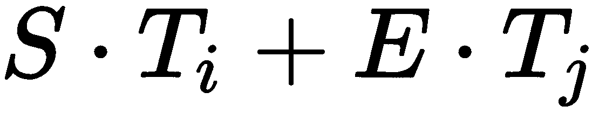

# 八、序列到序列模型和注意力

在[第 7 章](379a4f7b-48da-40f2-99d6-ee57a7a5dcca.xhtml)、*理解循环网络、*中，我们根据输入输出组合概述了几种类型的循环模型。其中之一是**间接多对多**或**序列到序列** ( **seq2seq** )，其中一个输入序列被转换成另一个不同的输出序列，不一定具有与输入相同的长度。机器翻译是 seq2seq 任务中最流行的类型。输入序列是一种语言的句子的单词，输出序列是翻译成另一种语言的同一个句子的单词。例如，我们可以将英语序列**旅游景点**翻译成德语**旅游景点**。不仅输出句子的长度不同，而且输入和输出序列的元素之间也没有直接的对应关系。特别地，一个输出元素对应于两个输入元素的组合。

用单个神经网络实现的机器翻译被称为**神经机器翻译** ( **NMT** )。其他类型的间接多对多任务包括语音识别，其中我们获取音频输入的不同时间帧并将其转换为文本副本；问答聊天机器人，其中输入序列是文本问题的单词，输出序列是该问题的答案；以及文本摘要，其中输入是文本文档，输出是文本内容的简短摘要。

在这一章中，我们将介绍注意机制——seq 2 seq 任务的一种新型算法。它允许直接访问输入序列的任何元素。这与**循环神经网络** ( **RNN** )不同，后者将整个序列汇总在一个单独的隐藏状态向量中，并将最近的序列元素优先于旧的序列元素。

本章将涵盖以下主题:

*   介绍 seq2seq 型号
*   Seq2seq 注意
*   了解转换器
*   转换器语言模型:
    *   来自转换器的双向编码器表示
    *   转换器-XL
    *   XLNet


# 介绍 seq2seq 型号

Seq2seq，或编码器-解码器(参见*序列到序列神经网络学习*在【https://arxiv.org/abs/1409.3215】T2)，模型使用 RNNs 的方式特别适合解决输入和输出之间存在间接多对多关系的任务。在另一篇开创性的论文中也提出了类似的模型，*使用用于统计机器翻译的 RNN 编码器-解码器学习短语表示*(转到[https://arxiv.org/abs/1406.1078](https://arxiv.org/abs/1406.1078)了解更多信息)。以下是 seq2seq 模型的示意图。输入序列[ **A** ， **B** ， **C** ， **< EOS >** ]被解码成输出序列[ **W** ， **X** ， **Y** ， **Z** ， **< EOS >** :


https://arxiv.org/abs/1409.3215 seq 2 seq 模型案例

该模型由两部分组成:编码器和解码器。推理部分是这样工作的:

*   编码器是一个 RNN。原始文件使用 LSTM，但 GRU 或其他类型也可以。就其本身而言，编码器以通常的方式工作——一次一步地读取输入序列，并在每一步之后更新其内部状态。一旦到达特殊的**<EOS>**—序列结束符号，编码器将停止读取输入序列。如果我们假设使用文本序列，我们将使用单词嵌入向量作为每一步的编码器输入，并且 **< EOS >** 符号表示一个句子的结束。编码器输出被丢弃，在 seq2seq 模型中不起作用，因为我们只对隐藏的编码器状态感兴趣。
*   一旦编码器完成，我们将向解码器发送信号，以便它可以使用特殊的 **< GO >** 输入信号开始生成输出序列。编码器也是一个 RNN (LSTM 或 GRU)。编码器和解码器之间的链接是最近的编码器内部状态向量**h***t*(也称为**思想向量**)，其在第一解码器步骤作为递归关系被馈送。在步骤 *t+1* 的解码器输出*y[t+1]是输出序列的一个元素。我们将在步骤 *t+2* 使用它作为输入，然后我们将生成新的输出，以此类推(这种类型的模型称为**自回归**)。在文本序列的情况下，解码器输出是词汇表中所有单词的 softmax。在每一步，我们选择概率最高的单词，并将其作为输入输入到下一步。一旦 **< EOS >** 成为最可能的符号，解码就完成了。*

模型的训练是有监督的，模型既需要知道输入序列，也需要知道其对应的目标输出序列(例如，多种语言的同一文本)。我们将输入序列馈送到解码器，生成思想向量 *h* [*t*] ，并使用它来启动来自解码器的输出序列生成。但是，解码器使用一个称为**教师强制**的过程——步骤 *t* 的解码器输入不是步骤 *t-1* 的解码器输出。相反，步骤 *t* 的输入总是来自步骤 *t-1* 的目标序列的正确字符。例如，假设直到步骤 *t* 的正确目标序列是[ **W** ， **X** ， **Y** ]，但是当前解码器生成的输出序列是[ **W** ， **X** ， **Z** 。通过教师强制，在步骤 *t+1* 的解码器输入将是 **Y** 而不是 **Z** 。换句话说，解码器学习生成目标值[t+1，...]给定目标值[...，t]。我们可以这样想:解码器输入是目标序列，而它的输出(目标值)是相同的序列，但向右移动了一个位置。

总之，seq2seq 模型通过在固定长度的状态向量中对输入序列进行编码，然后使用该向量作为基础来生成输出序列，从而解决了输入/输出序列长度变化的问题。我们可以这样形式化，它试图最大化以下概率:


这相当于以下内容:


让我们更详细地看看这个公式的元素:

*   是条件概率，其中是长度为 *T* 的输入序列，是长度为*T’的输出序列。*
*   元素 *v* 是输入序列(思想向量)的定长编码。
*   是给定先前单词 *y* 以及向量 *v.* 的情况下，输出单词*y[T’]*的概率

最初的 seq2seq 论文介绍了一些技巧来增强模型的训练和性能:

*   编码器和解码器是两个独立的 LSTMs。在 NMTs 的情况下，这使得用相同的编码器训练不同的解码器成为可能。
*   论文作者的实验证明堆叠 LSTMs 比单层 LSTMs 性能更好。
*   输入序列被反向馈送到解码器。比如 **ABC** - > **WXYZ** 会变成 **CBA** - > **WXYZ** 。没有明确的解释为什么这样做，但作者分享了他们的直觉:由于这是一个逐步的模型，如果序列是正常的顺序，那么源句子中的每个源单词都将远离其在输出句子中的对应单词。如果我们颠倒输入顺序，输入/输出单词之间的平均距离不会改变，但第一个输入单词将非常接近第一个输出单词。这将有助于模型在输入和输出序列之间建立更好的*通信*。
*   除了 **< EOS >** 和 **< GO >** 之外，该模型还使用了以下两个特殊符号(我们已经在[第七章](379a4f7b-48da-40f2-99d6-ee57a7a5dcca.xhtml)、*理解循环网络*的*实现文本分类*部分中遇到过):
    *   **<>**——**未知**:用来替换生僻字，使词汇量不会增长太大。
    *   **< PAD >** :由于性能原因，我们要用固定长度的序列来训练模型。然而，这与真实世界的训练数据相矛盾，其中序列可以具有任意长度。为了解决这个问题，较短的序列用特殊的<垫>符号填充。

既然我们已经介绍了基本的 seq2seq 模型架构，我们将学习如何用注意机制来扩展它。


# Seq2seq 注意

解码器必须仅基于思想向量来生成整个输出序列。要做到这一点，思维向量必须对输入序列的所有信息进行编码；然而，编码器是一个 RNN，我们可以预期它的隐藏状态将携带比最早的序列元素更多的信息。使用 LSTM 细胞和逆转输入有所帮助，但不能完全阻止。正因为如此，思想载体成了某种瓶颈。因此，seq2seq 模型对于短句工作得很好，但是对于较长的句子，性能会变差。


# 巴丹瑙注意了

我们可以在**注意机制**的帮助下解决这个问题(参见*神经机器翻译通过在[https://arxiv.org/abs/1409.0473](https://arxiv.org/abs/1409.0473)联合学习对齐和翻译*)，seq2seq 模型的扩展，它为解码器提供了一种处理所有编码器隐藏状态的方法，而不仅仅是最后一个。

The type of attention mechanism in this section is called Bahdanau attention, after the author of the original paper.

除了解决瓶颈问题，注意力机制还有其他一些优点。首先，立即访问所有先前状态有助于防止渐变消失问题。它还允许对结果进行一些解释，因为我们可以看到解码器关注的是输入的哪一部分。

下图显示了注意力是如何工作的:


注意机制

别担心——它看起来比实际上更可怕。我们将从上到下浏览这个图:注意力机制通过在编码器和解码器之间插入一个额外的**上下文向量****c***t*来工作。在时间 *t* 的隐藏解码器状态 **s** *[t]* 现在不仅是在步骤 *t-1* 的隐藏状态和解码器输出的函数，而且是上下文向量 **c** *[t]* 的函数:


每个解码器步骤具有唯一的上下文向量，并且一个解码器步骤的上下文向量仅仅是所有编码器隐藏状态的加权和**。通过这种方式，编码器可以在每个输出步骤 *t* 访问所有输入序列状态，这消除了将源序列的所有信息编码成固定长度向量的必要性，如常规 seq2seq 模型所做的:**


让我们更详细地讨论这个公式:

*   **c** *[t]* 是解码器输出步骤 *t* 的上下文向量，即总输出。
*   **h** *[i]* 是编码器总输入步数 *T* 中的隐藏状态 *i* 。
*   *α [t，I]是在当前解码器步骤 *t* 的上下文中与*h[I]相关联的标量权重。**

请注意， *α [t，I]对于编码器和解码器步骤都是唯一的，也就是说，输入序列状态将根据当前输出步骤具有不同的权重。例如，如果输入和输出序列的长度为 10，那么权重将由一个 10 × 10 的矩阵表示，总共有 100 个权重。这意味着注意力机制会集中注意力(懂了吗？)对输入序列的不同部分进行解码，这取决于输出序列的当前状态。如果 *α* *[t，i]* 较大，那么解码器在步骤 *t.* 会非常注意 **h** *[i]**

但是我们如何计算权重 *α* *[t，i]* ？首先，我们应该提到，对于步骤 *t* 处的解码器，所有 *α* *[t，i]* 的总和为 1。我们可以在注意机制上使用 softmax 操作来实现这一点:


这里， *e [t，k]T3 是对齐模型，表示位置 *k* 周围的输入序列元素与位置 *t* 处的输出匹配(或对齐)的程度。这个分数(由权重 *α* *[t，i]* 表示)是基于之前的解码器状态**s***[t-1]*(我们使用**s***[t-1]*是因为我们还没有计算 **s** *[t]* )以及*


这里， *a* (而不是α)是一个可微函数，它与系统的其余部分一起用反向传播来训练。不同的函数满足这些要求，但论文作者选择了所谓的**加法注意力**，它借助加法将 **s** *[t-1]* 和 **h** *[i]* 结合在一起。它有两种形式:


在第一个公式中， **W** 是权重矩阵，应用于级联的向量**s***t-1*和 **h** [*i*] ，并且 **v** 是权重向量。第二个公式类似，但这次我们有单独的完全连接的层(权重矩阵 **W** *[1]* 和 **W** *[2]* )并且我们求和**s***[t-1]*和 **h** *[i]* )。在这两种情况下，对齐模型可以表示为具有一个隐藏层的简单前馈网络。

现在我们知道了**c***t 和 *α* *[t，i]* 的公式，让我们把后者替换成前者:*


作为结论，我们把注意力算法一步步总结如下:

1.  向编码器输入输入序列并计算一组隐藏状态 [] 。
2.  计算对齐分数 [] ，使用上一步 **s** *[ t-1 ]* 的解码器状态。如果 *t = 1* ，我们将使用最后一个编码器状态 **h** *[ T ]* 作为初始隐藏状态。
3.  计算权重 [] 。
4.  计算上下文向量 [] 。
5.  计算隐藏状态 [] ，基于串接的向量 **s** *[ t-1 ]* 和 **c** *[ t ]* 和先前解码器输出 *y [ t-1 ]* 。至此，我们可以计算出最终的产量*y[t]。在我们需要对下一个单词进行分类的情况下，我们将使用 softmax 输出 [] ，其中 **W** *[ y ]* 是一个权重矩阵。*
6.  重复步骤 2-6，直到序列结束。

接下来，我们将介绍一种稍微改进的注意力机制，称为 Luong attention。


# 梁注意了

Luong attention (参见 https://arxiv.org/abs/1508.04025[的*基于注意力的神经机器翻译的有效方法*)介绍了 Bahdanau attention 的几个改进。最值得注意的是，对齐分数*e[t]取决于解码器隐藏状态*s[t]，与 Bahdanau 关注的 *s [t-1]* 相反。为了更好地理解这一点，我们来比较一下这两种算法:**](https://arxiv.org/abs/1508.04025)


左:Bahdanau 注意；右图:Luong 注意

让我们来一步步执行 Luong 注意:

1.  将输入序列输入编码器，计算编码器隐藏状态集 [] 。
2.  基于先前的解码器隐藏状态 **s** *[t-1]* 和先前的解码器输出 *y [t-1]* (虽然不是上下文向量)，计算解码器隐藏状态 [] 。
3.  计算校准分数 [] ，其使用来自当前步骤***[t]*的解码器状态。除了加法注意力，Luong 的论文还提出了两种类型的乘法注意力:

    *   [] :无任何参数的基本点积。在这种情况下，向量 **s** 和 **h** 需要具有相同的大小。
    *   [] :这里 **W** *[ m ]* 是注意力层的一个可训练的权重矩阵。** 

 **作为比对分数测量的向量乘法有一个直观的解释——正如我们在[第一章](b94f711b-daab-4de7-97b7-b7efccd0b392.xhtml)、*神经网络的基本原理*中提到的，点积作为向量之间的相似性测量。因此，如果向量相似(即对齐)，乘法的结果将是一个大值，注意力将集中在当前的 *t，i* 关系上。

4.  计算重量。
5.  计算上下文向量。
6.  基于连接的向量 **c** *[t]* 和 **s** *[t]* 计算向量。至此，我们可以计算出最终的输出*y[t]。在分类的情况下，我们将使用 softmax ，其中 **W** *[ y ]* 是一个权重矩阵。*
7.  重复步骤 2–7，直到序列结束。

接下来，我们来讨论一些更多的注意力变体。我们将从**硬**和**软注意**开始，这与我们计算上下文向量 **c** *[t]* 的方式有关。到目前为止，我们已经描述了软注意，其中 **c** *[t]* 是输入序列的所有隐藏状态的加权和。辛苦注意，我们还是计算了权重 *α* *[t，i]* ，但是我们只取隐藏状态**h***[IMAX]*与最大关联权重 *α* *[t，imax]* 。然后，选择的状态**h***[IMAX]*作为上下文向量。起初，硬注意似乎有点违反直觉——在努力使解码器能够访问所有输入状态之后，为什么又要将其限制在单一状态呢？然而，硬注意最初是在图像识别任务的背景下引入的，其中输入序列代表同一图像的不同区域。在这种情况下，在多个区域或单个区域之间进行选择更有意义。与软注意不同，硬注意是一个随机过程，不可微。所以，后向阶段使用一些技巧来工作(这超出了本书的范围)。

**局部注意力**代表了软硬注意力的折中。尽管这些机制要么考虑所有的输入隐藏向量(全局的)，要么仅考虑单个输入向量，但是局部注意采用向量窗口，围绕给定的输入序列位置，然后仅在该窗口上应用软注意。但是我们如何根据当前输出步长 *t* 来确定窗口中心*p[t](称为**对齐位置**)？最简单的方法是假设源序列和目标序列大致单调对齐，也就是说，按照输入和输出序列位置与同一事物相关的逻辑来设置 *p [t] = t—* 。*

接下来，我们将通过介绍注意力机制的一般形式来总结我们到目前为止所学的内容。


# 一般注意

虽然我们已经在 NMT 的背景下讨论了注意力机制，但它是一种通用的深度学习技术，可以应用于任何 seq2seq 任务。让我们假设我们正全神贯注地工作。在这种情况下，我们可以将向量 **s** *[t-1]* 视为针对键-值对数据库执行的**查询**，其中**键**是向量，隐藏状态 **h** *[i]* 是**值。**这些通常缩写为 **Q** 、 **K** 、 **V** ，你可以把它们想象成向量的矩阵。Luong 和 Bahdanau 注意力的键 **Q** 和值 **V** 是同一个向量——也就是说，这些注意力模型更像是 **Q** / **V** ，而不是**Q**/**K**/**V**。一般注意机制使用所有三个组成部分。

下图说明了这种新的普遍关注:


一般注意

当我们对数据库执行查询(**q***=***s***[t-1]*)时，我们将接收到一个单一的匹配—键**k***[IMAX]*和最大权重 *α* *[t，imax]* 。隐藏在这个键后面的是矢量**v***[IMAX]=***h***[IMAX]*，这是我们感兴趣的实际值。但是所有价值观都参与的软关注呢？我们可以用相同的查询/键/值术语来思考，但是查询结果不是单个值，而是所有具有不同权重的值。我们可以使用新的符号编写一个通用的注意力公式(基于上下文向量**c**t[t]公式):


在这种一般性关注中，数据库的查询、键和向量不一定以顺序方式相关。换句话说，数据库不必由不同步骤的隐藏 RNN 状态组成，而是可以包含任何类型的信息。这就结束了我们对 seq2seq 模型背后理论的介绍。我们将在下一节中使用这些知识，我们将实现一个简单的 seq2seq NMT 示例。


# 注意执行 seq2seq

在本节中，我们将使用 PyTorch 1.3.1 在 seq2seq 注意力模型的帮助下实现一个简单的 NMT 示例。为了澄清，我们将实现一个 seq2seq 注意力模型，就像我们在*介绍* *seq2seq 模型*一节中介绍的那样，我们将用 Luong 注意力来扩展它。模型编码器将一种语言的文本序列(句子)作为输入，解码器将输出翻译成另一种语言的相应序列。

We'll only show the most relevant parts of the code, but the full example is available at [https://github.com/PacktPublishing/Advanced-Deep-Learning-with-Python/tree/master/Chapter08/nmt_rnn_attention](https://github.com/PacktPublishing/Advanced-Deep-Learning-with-Python/tree/master/Chapter08/nmt_rnn_attention). This example is partially based on the PyTorch tutorial at [https://github.com/pytorch/tutorials/blob/master/intermediate_source/seq2seq_translation_tutorial.py](https://github.com/pytorch/tutorials/blob/master/intermediate_source/seq2seq_translation_tutorial.py).

让我们从训练集开始。它由存储在文本文件中的大量法语和英语句子组成。`NMTDataset` 类(是`torch.utils.data.Dataset`的子类)实现必要的数据预处理。它创建一个词汇表，其中包含数据集中所有可能单词的整数索引。为了简单起见，我们将不使用嵌入向量，我们将用它们的数字表示将单词馈送给网络。此外，我们不会将数据集分成训练和测试部分，因为我们的目标是演示 seq2seq 模型的工作。`NMTDataset`类输出源-目标元组句子，其中每个句子由该句子中单词索引的 1D 张量表示。


# 实现编码器

接下来，让我们继续实现编码器。

我们将从构造函数开始:

```py
class EncoderRNN(torch.nn.Module):
    def __init__(self, input_size, hidden_size):
        super(EncoderRNN, self).__init__()
        self.input_size = input_size
        self.hidden_size = hidden_size

        # Embedding for the input words
        self.embedding = torch.nn.Embedding(input_size, hidden_size)

        # The actual rnn sell
        self.rnn_cell = torch.nn.GRU(hidden_size, hidden_size)
```

入口点是`self.embedding`模块。它将获取每个单词的索引，并返回其指定的嵌入向量。我们不会使用预训练的单词向量(如 GloVe)，但尽管如此，嵌入向量的概念是相同的——只是我们将使用随机值对它们进行初始化，并使用模型的其余部分对它们进行训练。然后，我们有`torch.nn.GRU` RNN 细胞本身。

接下来，让我们实现`EncoderRNN.forward`方法(请记住缩进):

```py
def forward(self, input, hidden):
    # Pass through the embedding
    embedded = self.embedding(input).view(1, 1, -1)
    output = embedded

    # Pass through the RNN
    output, hidden = self.rnn_cell(output, hidden)
    return output, hidden
```

它表示对序列元素的处理。首先，我们获得`embedded`字向量，然后我们把它馈送给 RNN 单元。

我们还将实现`EncoderRNN.init_hidden`方法，它创建一个与隐藏的 RNN 状态大小相同的空张量。这个张量作为序列开始时的第一个 RNN 隐藏态(请记住缩进):

```py
def init_hidden(self):
    return torch.zeros(1, 1, self.hidden_size, device=device)
```

现在我们已经实现了编码器，让我们继续实现解码器。


# 实现解码器

让我们实现`DecoderRNN`类——一个无需关注的基本解码器。同样，我们将从构造函数开始:

```py
class DecoderRNN(torch.nn.Module):

    def __init__(self, hidden_size, output_size):
        super(DecoderRNN, self).__init__()
        self.hidden_size = hidden_size
        self.output_size = output_size

        # Embedding for the current input word
        self.embedding = torch.nn.Embedding(output_size, hidden_size)

        # decoder cell
        self.gru = torch.nn.GRU(hidden_size, hidden_size)

        # Current output word
        self.out = torch.nn.Linear(hidden_size, output_size)
        self.log_softmax = torch.nn.LogSoftmax(dim=1)
```

这类似于编码器——我们有初始的`self.embedding`字嵌入和`self.gru` GRU 单元。我们还有激活了`self.log_softmax`的完全连接的`self.out`层，它将输出序列中的预测单词。

我们将继续使用`DecoderRNN.forward`方法(请记住缩进):

```py
    def forward(self, input, hidden, _):
        # Pass through the embedding
        embedded = self.embedding(input).view(1, 1, -1)
        embedded = torch.nn.functional.relu(embedded)

        # Pass through the RNN cell
        output, hidden = self.rnn_cell(embedded, hidden)

        # Produce output word
        output = self.log_softmax(self.out(output[0]))
        return output, hidden, _
```

它从`embedded`向量开始，作为 RNN 单元的输入。该模块返回其新的`hidden`状态和代表预测单词的`output`张量。该方法接受 void 参数`_`，因此它可以匹配注意力解码器的接口，我们将在下一节中实现它。


# 用心实现解码器

接下来，我们将重点实现`AttnDecoderRNN`解码器。这个也是配合`EncoderRNN`使用的。

我们将从`AttnDecoderRNN.__init__`方法开始:

```py
class AttnDecoderRNN(torch.nn.Module):
    def __init__(self, hidden_size, output_size, max_length=MAX_LENGTH,
    dropout=0.1):
        super(AttnDecoderRNN, self).__init__()
        self.hidden_size = hidden_size
        self.output_size = output_size
        self.max_length = max_length

        # Embedding for the input word
        self.embedding = torch.nn.Embedding(self.output_size,
        self.hidden_size)

        self.dropout = torch.nn.Dropout(dropout)

        # Attention portion
        self.attn = torch.nn.Linear(in_features=self.hidden_size,
                                    out_features=self.hidden_size)

        self.w_c = torch.nn.Linear(in_features=self.hidden_size * 2,
                                   out_features=self.hidden_size)

        # RNN
        self.rnn_cell = torch.nn.GRU(input_size=self.hidden_size,
                                     hidden_size=self.hidden_size)

        # Output word
        self.w_y = torch.nn.Linear(in_features=self.hidden_size,
                                   out_features=self.output_size)
```

像往常一样，我们有`self.embedding`，但这一次，我们还将添加`self.dropout`以防止过度拟合。完全连接的`self.attn`和`self.w_c`层与注意力机制有关，当我们看下面的`AttnDecoderRNN.forward`方法时，我们将学习如何使用它们。 `AttnDecoderRNN.forward`实现我们在 *Seq2seq with attention* 部分描述的 Luong attention 算法。让我们从方法声明和参数预处理开始:

```py
def forward(self, input, hidden, encoder_outputs):
    embedded = self.embedding(input).view(1, 1, -1)
    embedded = self.dropout(embedded)
```

接下来，我们将计算当前的隐藏状态(`hidden`=**s***t*)。请记住缩进，因为这段代码仍然是`AttnDecoderRNN.forward`方法的一部分:

```py
    rnn_out, hidden = self.rnn_cell(embedded, hidden)
```

然后，我们将按照乘法注意力公式计算对齐分数(`alignment_scores` = *e [t，i]* )。这里，`torch.mm`是矩阵乘法，`encoder_outputs`是编码器输出(惊喜！):

```py
    alignment_scores = torch.mm(self.attn(hidden)[0], encoder_outputs.t())
```

接下来，我们将计算分数上的 softmax，以产生注意力权重(`attn_weights` = *a [t，i]* ):

```py
    attn_weights = torch.nn.functional.softmax(alignment_scores, dim=1)
```

然后，我们将按照注意力公式计算上下文向量(`c_t` = **c** *[t]* ):

```py
    c_t = torch.mm(attn_weights, encoder_outputs)
```

接下来，我们将通过连接当前隐藏状态和上下文向量来计算修改后的状态向量(`hidden_s_t` = ):

```py
    hidden_s_t = torch.cat([hidden[0], c_t], dim=1)
    hidden_s_t = torch.tanh(self.w_c(hidden_s_t))
```

最后，我们将计算下一个预测单词:

```py
    output = torch.nn.functional.log_softmax(self.w_y(hidden_s_t), dim=1)
```

我们应该注意到`torch.nn.functional.log_softmax`在常规的 softmax 之后应用对数。该激活函数与负对数似然损失函数`torch.nn.NLLLoss`结合使用。

最后，该方法返回`output`、`hidden`和`attn_weights`。稍后，我们将使用`attn_weights`来可视化输入和输出句子之间的注意力(方法`AttnDecoderRNN.forward`到此结束):

```py
    return output, hidden, attn_weights
```

接下来，我们来看看训练过程。


# 培训和评估

接下来，让我们实现`train`函数。它类似于我们在前面章节中实现的其他类似功能；然而，它考虑了输入的顺序性质和我们在 *Seq2eq 注意*部分描述的教师强制原则。为了简单起见，我们一次只训练一个序列(一个小批量，大小为 1)。

首先，我们将在训练集上开始迭代，设置初始序列张量，并重置梯度:

```py
def train(encoder, decoder, loss_function, encoder_optimizer, decoder_optimizer, data_loader, max_length=MAX_LENGTH):
    print_loss_total = 0

    # Iterate over the dataset
    for i, (input_tensor, target_tensor) in enumerate(data_loader):
        input_tensor = input_tensor.to(device).squeeze(0)
        target_tensor = target_tensor.to(device).squeeze(0)

        encoder_hidden = encoder.init_hidden()

        encoder_optimizer.zero_grad()
        decoder_optimizer.zero_grad()

        input_length = input_tensor.size(0)
        target_length = target_tensor.size(0)

        encoder_outputs = torch.zeros(max_length, encoder.hidden_size, device=device)

        loss = torch.Tensor([0]).squeeze().to(device)
```

编码器和解码器参数是`EncoderRNN`和`AttnDecoderRNN`(或`DecoderRNN`)的实例，`loss_function`代表损失(在我们的例子中是`torch.nn.NLLLoss`)，`encoder_optimizer`和`decoder_optimizer`(名字不言自明)是`torch.optim.Adam`的实例，`data_loader`是一个`torch.utils.data.DataLoader`，它包装了一个`NMTDataset`的实例。

接下来，我们将进行实际训练:

```py
with torch.set_grad_enabled(True):
    # Pass the sequence through the encoder and store the hidden states
    at each step
    for ei in range(input_length):
        encoder_output, encoder_hidden = encoder(
            input_tensor[ei], encoder_hidden)
        encoder_outputs[ei] = encoder_output[0, 0]

    # Initiate decoder with the GO_token
    decoder_input = torch.tensor([[GO_token]], device=device)

    # Initiate the decoder with the last encoder hidden state
    decoder_hidden = encoder_hidden

    # Teacher forcing: Feed the target as the next input
    for di in range(target_length):
        decoder_output, decoder_hidden, decoder_attention = decoder(
            decoder_input, decoder_hidden, encoder_outputs)
        loss += loss_function(decoder_output, target_tensor[di])
        decoder_input = target_tensor[di]  # Teacher forcing

    loss.backward()

    encoder_optimizer.step()
    decoder_optimizer.step()
```

让我们更详细地讨论这个问题:

*   我们将完整序列输入编码器，并将隐藏状态保存在`encoder_outputs`列表中。
*   我们用`GO_token`作为输入启动解码器序列。
*   我们使用解码器来生成序列的新元素。遵循教师强制原则，每一步的`decoder`输入来自真实目标序列`decoder_input = target_tensor[di]`。
*   我们分别用`encoder_optimizer.step()`和`decoder_optimizer.step()`训练编码器和解码器。

与`train`类似，我们有一个`evaluate`函数，它接受一个输入序列并返回其翻译后的副本及其伴随的注意力分数。我们不会在这里包括完整的实现，但我们将重点放在编码器/解码器部分。不是老师强制，每一步的`decoder`输入都是前一步的输出字:

```py
# Initiate the decoder with the last encoder hidden state
decoder_input = torch.tensor([[GO_token]], device=device)  # GO

# Initiate the decoder with the last encoder hidden state
decoder_hidden = encoder_hidden

decoded_words = []
decoder_attentions = torch.zeros(max_length, max_length)

# Generate the output sequence (opposite to teacher forcing)
for di in range(max_length):
    decoder_output, decoder_hidden, decoder_attention = decoder(
        decoder_input, decoder_hidden, encoder_outputs)
    decoder_attentions[di] = decoder_attention.data

    # Obtain the output word index with the highest probability
    _, topi = decoder_output.data.topk(1)
    if topi.item() != EOS_token:
        decoded_words.append(dataset.output_lang.index2word[topi.item()])
    else:
        break

    # Use the latest output word as the next input
    decoder_input = topi.squeeze().detach()
```

当我们运行完整的程序时，它将显示几个翻译示例。它还将显示输入和输出序列元素之间的注意力得分图，如下所示:


翻译注意力分数

例如，我们可以看到输出词 **she** 将注意力集中到输入词 **elle** (法语中的 *she* )上。如果我们没有注意机制，只依靠最后一个编码器隐藏状态来启动翻译，输出可能是**她比我小五岁**一样容易。由于单词 **elle** 离句子的结尾最远，所以很难单独在最后一个编码器隐藏状态内对其进行编码。

在下一节中，我们将抛开 RNNs，引入 transformer——一个 seq2seq 模型，完全基于注意力机制。


# 了解转换器

我们用了本章的大部分时间来吹捧注意力机制的优势。但是我们仍然在 RNNs 的上下文中使用注意力——在这个意义上，它是在这些模型的核心循环性质之上的一个附加物。既然注意力这么好，有没有办法不用 RNN 部分而单独使用它？原来是有的。论文*注意力是你所需要的全部*(【https://arxiv.org/abs/1706.03762】)介绍了一种叫做**转换器**的新架构，其编码器和解码器完全依赖于注意力机制。首先，我们将把注意力集中在转换器注意(双关语)机制上。


# 转换器注意

在关注整个模型之前，让我们先看看 transformer attention 是如何实现的:


左:缩放的点积(乘法)注意力；右:多头关注；资料来源:https://arxiv.org/abs/1706.03762

转换器使用点积注意(上图的左侧图)，遵循我们在 *Seq2seq 注意*部分介绍的一般注意程序(正如我们已经提到的，它不限于 RNN 模型)。我们可以用下面的公式定义它:


在实践中，我们将同时计算一组查询的注意力函数，打包在矩阵 **Q** 中。在这个场景中，键 **K** ，值 **V** ，以及结果也是矩阵。让我们更详细地讨论公式的步骤:

1.  用矩阵乘法匹配查询 **Q** 和数据库(关键字 **K** )以产生比对分数。让我们假设我们想要将 *m* 个不同的查询匹配到一个具有 *n* 个值的数据库，并且查询关键字向量长度是*d[k]。然后，我们有一个矩阵，每行有一个 *d [ k ]* 维查询，总共有 *m* 行。类似地，我们有一个矩阵,每行有一个*d[k]维度键，总共有 *n* 行。然后，输出矩阵将有，其中一行包含单个查询对数据库所有关键字的比对分数:**


换句话说，我们可以在一次矩阵-矩阵乘法中匹配多个数据库关键字的多个查询。在 NMT 的上下文中，我们可以以同样的方式计算目标句子的所有单词相对于源句子的所有单词的对齐分数。

2.  用来衡量对齐分数，其中 *d [ k ]* 是矩阵 **K** 中关键向量的向量大小，也等于 **Q** 中查询向量的大小(同理， *d [ v ]* 是关键向量 **V** 的向量大小)。该论文的作者怀疑，对于大值的*d[k]，点积在数量上变大，并在梯度极小的区域推动 softmax，这导致了臭名昭著的消失梯度问题，因此需要缩放结果。*
3.  沿着矩阵的行用 softmax 运算计算注意力分数(我们稍后将讨论掩码运算):


4.  通过将注意力分数乘以值 **V** *:* 来计算最终的注意力向量


我们可以调整这种机制，使其同时适用于硬注意和软注意。

作者还提出了**多头注意力**(见上图右侧图)。代替具有 *d [模型]维度键的单个注意力函数，我们线性投影键、查询和值 *h* 次，以产生这些值的 *h* 不同 *d [k] -* 、 *d [k] -* 和 *d [v] -* 维度投影。然后，我们对新创建的向量应用单独的并行注意力函数(或头部)，这为每个头部产生单个*d[v]维输出。最后，我们连接头部输出以产生最终的注意力结果。多头注意力允许每个头关注序列中的不同元素。同时，该模型将头部的输出组合在一个单一的内聚表示中。更准确地说，我们可以用下面的公式来定义它:**


让我们更详细地看看这个，从头部开始:

1.  每个头部接收初始 **Q** 、 **K** 和 **V** 的线性投影版本。分别使用可学习的权重矩阵**W***[I]^Q*、**W***[I]^K*和**W***[I]^V*来计算投影。请注意，我们为每个组件( **Q** 、 **K** 、 **V** )和每个头部 *i* 设置了单独的权重。为了满足从 *d [型号]* 到 *d [k]* 和 *d [v]* 的转换，这些矩阵的尺寸为、和。
2.  一旦 **Q** 、 **K** 和 **V** 被转换，我们可以使用我们在本节开始时描述的常规注意力模型来计算每个头部的注意力。
3.  最终的关注结果是可学习权重的权重矩阵**W***O 在级联的头输出 head [i] 上的线性投影。*

到目前为止，我们已经展示了对不同输入和输出序列的注意。例如，我们已经看到在 NMT，翻译句子的每个单词都与源句子的单词相关。transformer 模型还依赖于**自我关注**(或内部关注)，其中查询 **Q** 与查询数据库的关键字 **K** 和向量 **V** 属于同一个数据集。换句话说，在自我关注中，来源和目标是同一个序列(在我们的例子中，是同一个句子)。自我关注的好处并不明显，因为没有直接的任务可以应用它。在直观的层面上，它让我们看到了同序列单词之间的关系。比如下图显示了动词*做*的多头自我关注(不同颜色代表不同的头)。许多注意力集中在*制作*的一个遥远的从属关系上，完成了短语*制作...更难的*:


多头自我关注的一个例子。来源:https://arxiv.org/abs/1706.03762

transformer 模型使用自关注作为编码器/解码器 rnn 的替代，但在下一节中将对此进行更多讨论。


# 转换器模型

现在我们已经熟悉了多头注意力，让我们从下图开始，关注完整的转换器模型:


转换器模型架构。左手边显示编码器，右手边显示解码器；资料来源:https://arxiv.org/abs/1706.03762

这看起来很可怕，但不要担心——这比看起来容易。我们将从编码器(上图的左侧组件)开始:

*   它从一个热编码单词的输入序列开始，这些单词被转换成 *d [模型]* 维嵌入向量。嵌入向量进一步乘以。
*   转换器不使用 RNNs，因此，它必须以其他方式传递每个序列元素的位置信息。我们可以通过用位置编码增加每个嵌入向量来明确地做到这一点。简而言之，位置编码就是一个与嵌入向量长度 *d [模型]相同的向量。位置向量被添加到嵌入向量中(按元素),并且结果在编码器中被进一步传播。当当前单词在序列中具有位置 *pos* 时，该论文的作者为位置向量的每个元素 *i* 引入以下函数:*


位置编码的每个维度对应于一个正弦曲线。波长形成从 2π到 10000 2π的几何级数。作者假设该函数将允许模型容易地学习通过相对位置来参与，因为对于任何固定的偏移 *k* ，*PE[pos+k]可以表示为*PE[pos]的线性函数。**

*   编码器的其余部分由一堆 *N = 6* 相同的块组成。每个块有两个子层:
    *   一种多头自我关注机制，就像我们在标题为*转换器关注*一节中描述的那样。由于自关注机制在整个输入序列中起作用，编码器被设计成双向的**。一些算法仅使用编码器转换器部分，被称为**转换器编码器**。**
    ***   一个简单的全连接前馈网络，由以下公式定义:**

 **

网络分别应用于每个序列元素 *x* 。它在不同的位置使用相同的一组参数( **W** *[1]* ， **W** *[2]* ， *b [1]* ， *b [2]* )，但是在不同的编码器块使用不同的参数。

每个子层(多头注意力网络和前馈网络)都有一个围绕自身的剩余连接，并以该连接及其自身输出和剩余连接之和的归一化结束。因此，每个子层的输出如下:


归一化技术在*图层归一化*(【https://arxiv.org/abs/1607.06450】T2)一文中有描述。

接下来，让我们看看解码器，它有点类似于编码器:

*   在步骤 *t* 的输入是解码器自己在步骤 *t-1* 的预测输出字。输入字使用与编码器相同的嵌入向量和位置编码。
*   解码器继续使用一堆 *N = 6* 相同的块，这些块有点类似于编码器块。每个块由三个子层组成，每个子层采用残差连接和归一化。子层包括:
    *   多头自我关注机制。编码器自我关注可以关注序列的所有元素，不管它们是在目标元素之前还是之后。但是解码器只有部分生成的目标序列。因此，这里的自我注意只能注意到前面的序列元素。这是通过**屏蔽**(设置为 softmax 输入中对应于非法连接的所有值来实现的:


屏蔽使得解码器**单向**(不同于双向编码器)。与解码器一起工作的算法被称为**转换器解码器算法**。

*   解码器以一个完全连接的层结束，随后是一个 softmax，它产生句子中最有可能的下一个单词。

转换器使用 dropout 作为正则化技术。在将每个子图层的输出添加到子图层输入并进行归一化之前，它会将丢失添加到每个子图层的输出中。它还将丢弃应用于编码器和解码器堆栈中的嵌入和位置编码的总和。

最后，让我们总结一下自我关注相对于我们在 *Seq2seq with attention* 部分讨论的 RNN 关注模型的好处。自我注意机制的关键优势是可以立即访问输入序列的所有元素，这与 RNN 模型的瓶颈思维向量相反。此外——以下是论文的直接引用——自我关注层通过恒定数量的顺序执行操作连接所有位置，而递归层需要 *O(n)* 顺序操作。

就计算复杂性而言，当序列长度 *n* 小于表示维度 *d* 时，自我注意层比递归层更快，这是机器翻译中最先进的模型使用的句子表示最常见的情况，例如单词片段(参见【https://arxiv.org/abs/1609.08144】的*谷歌的神经机器翻译系统:弥合人类和机器翻译之间的差距*)和字节对(参见*带有子单词单元的稀有单词的神经机器翻译*)为了提高涉及非常长序列的任务的计算性能，自我关注可以被限制为仅考虑以相应输出位置为中心的输入序列中大小为 *r* 的邻域。

这就结束了我们对转换器的理论描述。在下一节中，我们将从头实现一个转换器。


# 实现转换器

在这一节中，我们将借助 PyTorch 1.3.1 实现 transformer 模型。由于该示例相对复杂，我们将通过使用基本的训练数据集来简化它:我们将训练模型来复制随机生成的整数值序列，也就是说，源序列和目标序列是相同的，转换器将学习复制输入序列作为输出。我们不会包括完整的源代码，但你可以在[https://github . com/packt publishing/Advanced-Deep-Learning-with-Python/tree/master/chapter 08/transformer . py](https://github.com/PacktPublishing/Advanced-Deep-Learning-with-Python/tree/master/Chapter08/transformer.py)找到它。

这个例子是基于[https://github.com/harvardnlp/annotated-transformer](https://github.com/harvardnlp/annotated-transformer)的。我们还要注意 PyTorch 1.2 引入了原生转换器模块(文档可在 https://pytorch.org/docs/master/nn.html#transformer-layers 的[获得)。不过，在这一节中，我们将从头开始实现转换器，以便更好地理解它。](https://pytorch.org/docs/master/nn.html#transformer-layers)

首先，我们将从实用函数`clone`开始，它获取`torch.nn.Module`的一个实例，并产生同一个模块的`n`相同的深层副本(不包括原始的源实例):

```py
def clones(module: torch.nn.Module, n: int):
    return torch.nn.ModuleList([copy.deepcopy(module) for _ in range(n)])
```

有了这个简短的介绍，让我们继续实现多头注意力。


# 多头注意力

在本节中，我们将按照*转换器注意*一节中的定义来实现多头注意。我们将从常规比例点积的实现开始注意:

```py
def attention(query, key, value, mask=None, dropout=None):
    """Scaled Dot Product Attention"""
    d_k = query.size(-1)

    # 1) and 2) Compute the alignment scores with scaling
    scores = torch.matmul(query, key.transpose(-2, -1)) / math.sqrt(d_k)
    if mask is not None:
        scores = scores.masked_fill(mask == 0, -1e9)

    # 3) Compute the attention scores (softmax)
    p_attn = torch.nn.functional.softmax(scores, dim=-1)

    if dropout is not None:
        p_attn = dropout(p_attn)

    # 4) Apply the attention scores over the values
    return torch.matmul(p_attn, value), p_attn
```

提醒一下，这个函数实现了公式 [] ，其中 **Q** = `query`、 **K** = `key`、 **V** = `value`。如果有一个`mask`可用，它也将被应用。

接下来，我们将把多线程注意机制实现为`torch.nn.Module`。提醒一下，实现遵循以下公式:


我们将从`__init__`方法开始:

```py
class MultiHeadedAttention(torch.nn.Module):
    def __init__(self, h, d_model, dropout=0.1):
        """
        :param h: number of heads
        :param d_model: query/key/value vector length
        """
        super(MultiHeadedAttention, self).__init__()
        assert d_model % h == 0
        # We assume d_v always equals d_k
        self.d_k = d_model // h
        self.h = h

        # Create 4 fully connected layers
        # 3 for the query/key/value projections
        # 1 to concatenate the outputs of all heads
        self.fc_layers = clones(torch.nn.Linear(d_model, d_model), 4)
        self.attn = None
        self.dropout = torch.nn.Dropout(p=dropout)
```

注意，我们使用`clones`函数来创建四个相同的、完全连接的`self.fc_layers`。我们将使用其中的三个用于 **Q** / **K** / **V** 线性投影— [] 。第四个全连接层是合并不同头 **W** *^( O )* 输出的级联结果。我们将当前的关注结果存储在`self.attn`属性中。

接下来，让我们实现`MultiHeadedAttention.forward`方法(请记住缩进):

```py
def forward(self, query, key, value, mask=None):
    if mask is not None:
        # Same mask applied to all h heads.
        mask = mask.unsqueeze(1)

    batch_samples = query.size(0)

    # 1) Do all the linear projections in batch from d_model => h x d_k
    projections = list()
    for l, x in zip(self.fc_layers, (query, key, value)):
        projections.append(
            l(x).view(batch_samples, -1, self.h, self.d_k).transpose(1, 2)
        )

    query, key, value = projections

    # 2) Apply attention on all the projected vectors in batch.
    x, self.attn = attention(query, key, value,
                             mask=mask,
                             dropout=self.dropout)

    # 3) "Concat" using a view and apply a final linear.
    x = x.transpose(1, 2).contiguous() \
        .view(batch_samples, -1, self.h * self.d_k)

    return self.fc_layers[-1](x)
```

我们迭代 **Q** / **K** / **V** 向量及其参考投影`self.fc_layers`，并生成**Q**/**K**/**V**`projections`，代码片段如下:

```py
l(x).view(batch_samples, -1, self.h, self.d_k).transpose(1, 2)
```

然后，我们使用我们首先定义的`attention`函数将常规注意力应用于投影，最后，我们连接多个头部的输出并返回结果。现在我们已经实现了多头注意力，让我们继续实现编码器。


# 编码器

在这一节中，我们将实现编码器，它由几个不同的子组件组成。让我们从主要定义开始，然后深入了解更多细节:

```py
class Encoder(torch.nn.Module):
    def __init__(self, block: EncoderBlock, N: int):
        super(Encoder, self).__init__()
        self.blocks = clones(block, N)
        self.norm = LayerNorm(block.size)

    def forward(self, x, mask):
        """Iterate over all blocks and normalize"""
        for layer in self.blocks:
            x = layer(x, mask)

        return self.norm(x)
```

这相当简单:编码器由`EncoderBlock`的`self.blocks` : `N`个堆叠实例组成，其中每个实例作为下一个实例的输入。接下来是`LayerNorm`规范化`self.norm`(我们在*转换器模型*部分讨论了这些概念)。`forward`方法将数据张量`x`和一个实例`mask`作为输入，它阻塞了一些输入序列元素。正如我们在*转换器模型*部分所讨论的，屏蔽仅与模型的解码器部分相关，其中序列的未来元素尚不可用。在编码器中，掩码仅作为占位符存在。

我们将省略`LayerNorm`的定义(知道它是编码器末端的一个归一化就足够了)，我们将关注`EncoderBlock`来代替:

```py
class EncoderBlock(torch.nn.Module):
    def __init__(self,
                 size: int,
                 self_attn: MultiHeadedAttention,
                 ffn: PositionwiseFFN,
                 dropout=0.1):
        super(EncoderBlock, self).__init__()
        self.self_attn = self_attn
        self.ffn = ffn

        # Create 2 sub-layer connections
        # 1 for the self-attention
        # 1 for the FFN
        self.sublayers = clones(SublayerConnection(size, dropout), 2)
        self.size = size

    def forward(self, x, mask):
        x = self.sublayers[0](x, lambda x: self.self_attn(x, x, x, mask))
        return self.sublayers[1](x, self.ffn)
```

提醒一下，每个编码器块由两个子层组成(`self.sublayers`用熟悉的`clones`函数实例化):一个多头自关注`self_attn`(`MultiHeadedAttention`的一个实例)，后面是一个简单的全连接网络`ffn`(`PositionwiseFFN`的一个实例)。每个子层都被它的剩余连接所包装，剩余连接是用`SublayerConnection`类实现的:

```py
class SublayerConnection(torch.nn.Module):
    def __init__(self, size, dropout):
        super(SublayerConnection, self).__init__()
        self.norm = LayerNorm(size)
        self.dropout = torch.nn.Dropout(dropout)

    def forward(self, x, sublayer):
        return x + self.dropout(sublayer(self.norm(x)))
```

剩余连接还包括正常化和脱落(根据定义)。提醒一下，它遵循公式 [] ，但是为了代码简单起见，`self.norm`排在前面而不是最后。`SublayerConnection.forward`短语将数据张量`x`和`sublayer`作为输入，这是`MultiHeadedAttention`或`PositionwiseFFN`的一个实例。我们可以在`EncoderBlock.forward`方法中看到这种动态。

我们唯一没有定义的组件是`PositionwiseFFN`，它实现了公式 [] 。让我们添加这个缺失的部分:

```py
class PositionwiseFFN(torch.nn.Module):
    def __init__(self, d_model: int, d_ff: int, dropout=0.1):
        super(PositionwiseFFN, self).__init__()
        self.w_1 = torch.nn.Linear(d_model, d_ff)
        self.w_2 = torch.nn.Linear(d_ff, d_model)
        self.dropout = torch.nn.Dropout(dropout)

    def forward(self, x):
        return self.w_2(self.dropout(torch.nn.functional.relu(self.w_1(x))))
```

我们现在已经实现了编码器及其所有构建模块。在下一部分，我们将继续解码器的定义。


# 解码器

在这一节中，我们将实现解码器。它遵循与编码器非常相似的模式:

```py
class Decoder(torch.nn.Module):
    def __init__(self, block: DecoderBlock, N: int, vocab_size: int):
        super(Decoder, self).__init__()
        self.blocks = clones(block, N)
        self.norm = LayerNorm(block.size)
        self.projection = torch.nn.Linear(block.size, vocab_size)

    def forward(self, x, encoder_states, source_mask, target_mask):
        for layer in self.blocks:
            x = layer(x, encoder_states, source_mask, target_mask)

        x = self.norm(x)

        return torch.nn.functional.log_softmax(self.projection(x), dim=-1)
```

它由`DecoderBlock`的`self.blocks` : `N`个实例组成，其中每个块的输出作为下一个块的输入。接下来是`self.norm`规范化(`LayerNorm`的一个实例)。最后，为了产生最可能的字，解码器有一个额外的全连接层，具有 softmax 激活。注意，`Decoder.forward`方法带有一个额外的参数`encoder_states`，它代表了编码器的注意力向量。然后将`encoder_states`传递给`DecoderBlock`实例。

接下来，让我们实现`DecoderBlock`:

```py
class DecoderBlock(torch.nn.Module):
    def __init__(self,
                 size: int,
                 self_attn: MultiHeadedAttention,
                 encoder_attn: MultiHeadedAttention,
                 ffn: PositionwiseFFN,
                 dropout=0.1):
        super(DecoderBlock, self).__init__()
        self.size = size
        self.self_attn = self_attn
        self.encoder_attn = encoder_attn
        self.ffn = ffn

        # Create 3 sub-layer connections
        # 1 for the self-attention
        # 1 for the encoder attention
        # 1 for the FFN
        self.sublayers = clones(SublayerConnection(size, dropout), 3)

    def forward(self, x, encoder_states, source_mask, target_mask):
        x = self.sublayers[0](x, lambda x: self.self_attn(x, x, x, target_mask))
        x = self.sublayers[1](x, lambda x: self.encoder_attn(x, encoder_states, encoder_states, source_mask))
        return self.sublayers[2](x, self.ffn)
```

这与`EncoderBlock`类似，但有一个实质性的区别:尽管`EncoderBlock`仅依赖于自我注意机制，但这里我们将自我注意与来自编码器的常规注意结合起来。这反映在`encoder_attn`模块和`forward`方法的`encoder_states`参数中，以及编码器注意值的附加`SublayerConnection`中。我们可以在`DecoderBlock.forward`方法中看到多种注意力机制的结合。注意`self.self_attn`使用`x`查询/键/值，而`self.encoder_attn`使用`x`作为查询，使用`encoder_states`作为键和值。这样，有规律的注意建立了编码者和解码者之间的联系。

解码器实现到此结束。我们将在下一节继续构建完整的 transformer 模型。


# 把所有的放在一起

我们将继续主要的`EncoderDecoder`课程:

```py
class EncoderDecoder(torch.nn.Module):
    def __init__(self,
                 encoder: Encoder,
                 decoder: Decoder,
                 source_embeddings: torch.nn.Sequential,
                 target_embeddings: torch.nn.Sequential):
        super(EncoderDecoder, self).__init__()
        self.encoder = encoder
        self.decoder = decoder
        self.source_embeddings = source_embeddings
        self.target_embeddings = target_embeddings

    def forward(self, source, target, source_mask, target_mask):
        encoder_output = self.encoder(
            x=self.source_embeddings(source),
            mask=source_mask)

        return self.decoder(
            x=self.target_embeddings(target),
            encoder_states=encoder_output,
            source_mask=source_mask,
            target_mask=target_mask)
```

它结合了`Encoder`、`Decoder`和`source_embeddings/target_embeddings`(我们将在本节的后面关注嵌入)。`EncoderDecoder.forward`方法获取源序列并将其提供给`self.encoder`。然后，`self.decoder`从前面的输出步骤`x=self.target_embeddings(target)`获取输入，编码器状态`encoder_states=encoder_output`，以及源和目标掩码。有了这些输入，它产生预测的序列的下一个元素(单词)，这也是`forward`方法的返回值。

接下来，我们将实现`build_model`函数，它将我们到目前为止实现的所有东西合并到一个一致的模型中:

```py
def build_model(source_vocabulary: int,
                target_vocabulary: int,
                N=6, d_model=512, d_ff=2048, h=8, dropout=0.1):
    """Build the full transformer model"""
    c = copy.deepcopy
    attn = MultiHeadedAttention(h, d_model)
    ff = PositionwiseFFN(d_model, d_ff, dropout)
    position = PositionalEncoding(d_model, dropout)

    model = EncoderDecoder(
        encoder=Encoder(EncoderBlock(d_model, c(attn), c(ff), dropout), N),
        decoder=Decoder(DecoderBlock(d_model, c(attn), c(attn),c(ff),
                                    dropout), N, target_vocabulary),
        source_embeddings=torch.nn.Sequential(
            Embeddings(d_model, source_vocabulary), c(position)),
        target_embeddings=torch.nn.Sequential(
            Embeddings(d_model, target_vocabulary), c(position)))

    # This was important from their code.
    # Initialize parameters with Glorot / fan_avg.
    for p in model.parameters():
        if p.dim() > 1:
            torch.nn.init.xavier_uniform_(p)

    return model
```

除了熟悉的`MultiHeadedAttention`和`PositionwiseFFN`，我们还创建了`position`变量(一个`PositionalEncoding`类的实例)。这个类实现了我们在**transformer model*一节中描述的正弦位置编码(这里我们不包括完整的实现)。现在让我们把注意力集中在`EncoderDecoder`的实例化上:我们已经熟悉了编码器和解码器，所以这并不奇怪。但是嵌入更有趣一点。以下代码实例化了源嵌入(但这对目标嵌入也有效):*

```py
source_embeddings=torch.nn.Sequential(Embeddings(d_model, source_vocabulary), c(position))
```

我们可以看到，它们是两个组件的顺序列表:

*   一个`Embeddings`类的实例，它只是将`torch.nn.Embedding`再乘以 [] (我们在这里省略了类的定义)
*   位置编码`c(position)`，将位置正弦数据添加到嵌入向量中

一旦我们以这种方式预处理了输入数据，它就可以作为编码器/解码器的核心部分的输入。

这就结束了我们对转换器的实现。我们举这个例子的目的是为名为*转换器注意事项*和*转换器模型*的章节的理论基础提供补充。因此，我们将重点放在代码最相关的部分，并省略了一些普通的*代码部分，其中主要是用于随机数字序列的`RandomDataset`数据生成器和实现训练的`train_model`函数。尽管如此，我还是鼓励读者一步一步地浏览完整的示例，以便更好地理解转换器的工作方式。*

在下一节中，我们将讨论一些基于我们目前介绍的注意力机制的最新语言模型。


# 转换器语言模型

在[第 6 章](fe6a42c9-f18e-4c2b-9a82-99ec53e727ca.xhtml)、*语言*、*建模*中，我们介绍了几种不同的语言模型(word2vec、GloVe 和 fastText)，它们使用单词的上下文(其周围的单词)来创建单词向量(嵌入)。这些模型有一些共同的属性:

*   它们是上下文无关的(我知道这与前面的说法相矛盾),因为它们基于每个单词在训练文本中的所有出现，为每个单词创建一个单独的全局单词向量。例如， *lead* 在短语 *lead the way* 和 *lead atom* 中可以具有完全不同的含义，然而该模型会尝试将这两种含义嵌入到同一个词向量中。
*   它们是位置无关的，因为它们在训练嵌入向量时不考虑上下文单词的顺序。

相比之下，可以创建基于 transformer 的语言模型，它既依赖于上下文又依赖于位置。考虑到当前上下文单词及其位置，这些模型将为单词的每个唯一上下文产生不同的单词向量。这导致了经典模型和基于 transformer 的模型之间的概念差异。因为像 word2vec 这样的模型创建了静态的上下文无关和位置无关的嵌入向量，所以我们可以丢弃该模型，只在后续的下游任务中使用这些向量。但是 transformer 模型基于上下文创建动态向量，因此，我们必须将其作为任务管道的一部分。

在接下来的章节中，我们将讨论一些最新的基于 transformer 的模型。


# 来自转换器的双向编码器表示

来自转换器 ( **BERT** )(参见 *BERT:语言理解深度双向转换器*在[https://arxiv.org/abs/1810.04805](https://arxiv.org/abs/1810.04805)的预训练)模型的**双向编码器表示有一个非常描述性的名字。让我们看看提到的一些元素:**

*   编码器表示:该模型仅使用我们在*转换器模型*一节中描述的转换器架构的多层编码器部分的输出。
*   双向:编码器具有固有的双向特性。

为了获得一些视角，让我们用 *L* 表示转换器块的数量，用 *H* 表示隐藏的大小(之前用 *d [型号]* 表示)，用 *A* 表示自关注头的数量。论文作者实验了两种 BERT 构型:BERT[BASE](*L*= 12， *H* = 768， *A* = 12，总参数= 110M)和 BERT[LARGE](*L*= 24， *H* = 1024， *A* = 16，总参数= 340M

为了更好地理解 BERT 框架，我们将从培训开始，培训有两个步骤:

1.  **预训练**:通过不同的预训练任务，在无标签的数据上训练模型。
2.  **微调**:用预训练的参数初始化模型，然后在特定下游任务的标记数据集上微调所有参数。

我们可以在下图中看到这些步骤:


左:预训练；右图:微调来源:https://arxiv.org/abs/1810.04805

这些图表将作为下一节的参考，请继续关注更多细节。现在，我们知道 **Tok N** 代表一位热编码输入令牌， *E* 代表令牌嵌入， *T* 代表模型输出向量就足够了。

现在我们已经对 BERT 有了一个概述，让我们看看它的组件。


# 输入数据表示

在进入每个训练步骤之前，让我们讨论一下这两个步骤共享的输入和输出数据表示。有点类似于 fastText(参见[第六章](fe6a42c9-f18e-4c2b-9a82-99ec53e727ca.xhtml)、*语言建模*)，BERT 使用了一种数据驱动的分词算法，叫做 wordpick(【https://arxiv.org/abs/1609.08144】)。这意味着，它不是完整单词的词汇表，而是在迭代过程中创建子单词标记的词汇表，直到词汇表达到预定的大小(在 BERT 的情况下，大小是 30，000 个标记)。这种方法有两个主要优点:

*   它允许我们控制字典的大小。
*   它通过将未知单词分配给最接近的现有字典子单词标记来处理未知单词。

BERT 可以处理各种下游任务。为此，作者引入了特殊输入数据表示，它可以明确地将以下内容表示为单输入令牌序列:

*   一句话(例如，在分类任务中，如情感分析)
*   一对句子(例如，在问答问题中)

这里，*句*不仅指语言学上的句子，还可以指任意长度的任何连续文本。

该模型使用两个特殊的令牌:

*   每个序列的第一个标记总是一个特殊的分类标记(`[CLS]`)。对应于该令牌的隐藏状态被用作分类任务的聚集序列表示。例如，如果我们想要对序列应用情感分析，对应于`[CLS]`输入标记的输出将表示模型的情感(肯定/否定)输出。
*   成对的句子被打包成一个序列。第二个特殊记号(`[SEP]`)标记两个输入句子之间的边界(在我们有两个句子的情况下)。我们进一步借助于附加的学习分割嵌入来区分句子，该附加的学习分割嵌入用于指示每个标记是属于句子 A 还是句子 b。因此，输入嵌入是标记嵌入、分割嵌入和位置嵌入的总和。这里，标记和位置嵌入的作用与它们在常规转换器中的作用相同。

下图显示了特殊标记以及输入嵌入:


伯特输入表示法；输入嵌入是记号嵌入、分段嵌入和位置嵌入的总和。资料来源:https://arxiv.org/abs/1810.04805

现在我们知道了输入是如何处理的，让我们来看看预训练步骤。


# 预训练

转换器部分的*双向编码器表示图的左侧显示了预训练步骤。论文作者使用两个无监督的训练任务来训练 BERT 模型:**掩蔽语言建模** ( **MLM** )和**下一句预测** ( **NSP** )。*

我们将从 MLM 开始，这里的模型提供了一个输入序列，它的目标是预测该序列中缺失的单词。在这种情况下，BERT 充当了一个**去噪自编码器**，它试图重建其有意破坏的输入。MLM 本质上类似于 word2vec 模型的 CBOW 目标(参见[第 6 章](fe6a42c9-f18e-4c2b-9a82-99ec53e727ca.xhtml)、*语言建模*)。为了解决这一任务，BERT 编码器输出通过 softmax 激活的全连接层进行扩展，以在给定输入序列的情况下产生最可能的单词。通过随机屏蔽 15%(根据论文)的单词块标记来修改每个输入序列。为了更好地理解这一点，我们将使用论文本身的一个示例:假设无标签的句子是*我的狗是多毛的*，并且在随机掩蔽过程中，我们选择了第四个标记(对应于`hairy`)，我们的掩蔽过程可以通过以下几点来进一步说明:

*   **80%的时间**:用`[MASK]`令牌替换这个词——比如*我的狗是长毛的* → *我的狗是* `[MASK]`。
*   **10%的时间**:用一个随机的词替换这个词——比如*我的狗是长毛的* → *我的狗是苹果的*。
*   **10%的时间**:保持字不变*我的狗有毛* → *我的狗有毛*。这样做的目的是使表示偏向实际观察到的单词。

Because the model is bidirectional, the `[MASK]` token can appear at any position in the input sequence. At the same time, the model will use the full sequence to predict the missing word. This is opposed to unidirectional autoregressive models (we'll discuss these in the following sections), which always try to predict the next word from all preceding words, thereby avoiding the need to have `[MASK]` tokens.

我们需要 80/10/10 分布有两个主要原因:

*   `[MASK]`标记造成了预训练和微调之间的不匹配(我们将在下一节讨论这一点)，因为它只出现在前者中，而不出现在后者中——也就是说，微调任务将为模型提供不带`[MASK]`标记的输入序列。然而，该模型被预先训练为带有`[MASK],`的期望序列，这可能导致未定义的行为。
*   BERT 假设预测的记号是相互独立的。为了理解这一点，让我们想象模型试图用我的 `[MASK]`来重构输入序列*我去了* `[MASK]` *。BERT 可以预测句子*我用自行车*去骑车了，这是一个有效句子。但是因为模型没有把两个被屏蔽的单词联系起来，所以没有什么能阻止它预测*我骑着自行车去游泳*，这是不成立的。*

对于 80/10/10 分布，`transformer`编码器不知道它将被要求预测哪些单词，或者哪些单词已被随机单词替换，因此它被迫保留每个输入标记的分布上下文表示。此外，由于随机替换只发生在所有标记的 1.5%(即 15%中的 10%)，这似乎不会损害模型的语言理解能力。

MLM 的一个缺点是，因为模型只预测每批中 15%的单词，所以它可能比使用所有单词的预训练模型收敛得更慢。

接下来，让我们继续 NSP。作者认为，许多重要的下游任务，如**问答** ( **QA** )和**自然语言推理** ( **NLI** )都是基于理解两个句子之间的关系，而这并不是语言建模直接捕捉到的。

自然语言推理决定了代表一个**假设**的一个句子是真(蕴涵)、假(矛盾)还是未确定(中性)给定另一个句子，称为**前提**。下表显示了一些例子:

| **前提** | **假设** | **标签** |
| 我在跑步 | 我在睡觉 | 矛盾 |
| 我在跑步 | 我正在听音乐 | 中立的 |
| 我在跑步 | 我在训练 | 需要 |

为了训练一个理解句子关系的模型，我们对下一句预测任务进行了预训练，该任务可以从任何单语语料库中轻松生成。具体来说，每个输入序列都由一个起始的`[CLS]`标记组成，后面是两个连接在一起的句子 A 和 B，它们由`[SEP]`标记分隔开(参见转换器部分的*双向编码器表示中的图表)。在为每个预训练示例选择句子 A 和 B 时，50%的情况下，B 是跟随 A 的实际下一个句子(标记为`IsNext`)，50%的情况下，它是从语料库中随机选择的句子(标记为`NotNext`)。正如我们提到的，模型在`[CLS]`相应的输入上输出`IsNext` / `NotNext`标签。*

下面的例子说明了 NSP 任务:

*   这个男人去了一家商店，他买了一加仑牛奶，标签是 T4。
*   `[CLS]` *男人* `[MASK]` *到店* `[SEP]` *企鹅* `[MASK]` *都是航班#少鸟* `[SEP]`带标签`NotNext`。注意使用了*# # # less*标记，这是单词块分词算法的结果。

接下来，我们来看微调步骤。


# 微调

微调任务在预训练任务之后，除了输入预处理之外，这两个步骤非常相似。我们不是创建屏蔽序列，而是简单地向 BERT 模型提供特定任务的未修改输入和输出，并以端到端的方式微调所有参数。因此，我们在微调阶段使用的模型与我们将在实际生产环境中使用的模型相同。

下图显示了如何使用 BERT 解决几种不同类型的任务:


不同任务的 BERT 应用程序；资料来源:https://arxiv.org/abs/1810.04805

让我们来讨论一下:

*   左上角的场景说明了如何使用 **BERT** 进行句子对分类任务，比如 NLI。简而言之，我们用两个连接起来的句子喂给模型，只看`[CLS]` token 输出分类，它会输出模型结果。例如，在 NLI 任务中，目标是预测第二句话相对于第一句话是推论、矛盾还是中性的。
*   右上角的场景说明了如何使用 **BERT** 进行单句分类任务，比如情感分析。这与句对分类非常相似。
*   左下角的场景说明了如何在**斯坦福问答数据集** ( **小队** v1.1，[https://rajpurkar.github.io/SQuAD-explorer/explore/1.1/dev/](https://rajpurkar.github.io/SQuAD-explorer/explore/1.1/dev/))上使用**伯特**。假设序列 A 是一个问题，序列 B 是维基百科中的一段话，其中包含答案，目标是预测这段话中答案的文本跨度(开始和结束)。我们引入两个新的向量:一个开始向量和一个结束向量，其中 *H* 是模型的隐藏尺寸。每个单词 *i* 作为答案区间的开始(或结束)的概率被计算为其输出向量*T[I]和 *S* (或 *E* )之间的点积，随后是序列 *B* : 的所有单词的软最大值。从位置 *i* 开始到 *j* 的候选跨度的分数计算为。输出的候选者是得分最高的一个，其中。*
*   右下角的场景演示了如何使用 **BERT** 进行**命名实体识别** ( **NER** )，其中每个输入令牌都被分类为某种类型的实体。

这就结束了我们致力于 BERT 模型的部分。提醒一下，它是基于转换器编码器的。在下一部分，我们将讨论转换器解码器模型。


# 转换器-XL

在这一节中，我们将讨论对传统 transformer 的改进，称为 transformer-XL，其中 XL 代表超长(参见*Transformer-X*https://arxiv.org/abs/1901.02860L:超过固定长度上下文的专注语言模型)。为了理解改进常规转换器的必要性，让我们讨论一下它的一些局限性，其中之一来自于转换器本身的性质。基于 RNN 的模型具有(至少在理论上)传递任意长度序列信息的能力，因为内部 RNN 状态是基于所有先前的输入进行调整的。但是转换器的自我注意没有这样的循环成分，并且完全被限制在当前输入序列的范围内。如果我们有无限的内存和计算能力，一个简单的解决方案就是处理整个上下文序列。但实际上，我们的资源有限，因此我们将整个文本分割成更小的片段，并仅在每个片段中训练模型，如下图中的图像 **(a)** 所示:


具有长度为 4 的输入序列的常规变换器的训练(a)和评估(b)的图示；注意单向转换器解码器的使用。资料来源:https://arxiv.org/abs/1901.02860

横轴代表输入序列[ *x [1] ，...，x[4]，垂直轴表示堆叠的解码器块。注意，元素*x[I]只能处理元素。这是因为 transformer-XL 基于 transformer 解码器(不包括编码器)，而不像 BERT 基于编码器。因此，transformer-XL 解码器与*全*编码器-解码器转换器中的解码器不同，因为它不能像常规解码器那样访问编码器状态。从这个意义上说，transformer-XL 解码器非常类似于一般的 transformer 编码器，只是由于输入序列掩码的原因，它是单向的。Transformer-XL 是**自回归模型**的一个例子。**

如上图所示，最大可能的依赖长度是段长度的上限，虽然注意机制通过允许直接访问序列的所有元素来帮助防止渐变消失，但由于输入段有限，转换器不能充分利用这一优势。此外，通常通过选择连续的符号块来分割文本，而不考虑句子或任何其他语义边界，该论文的作者称之为上下文分割。引用论文本身的话，该模型缺乏很好地预测前几个符号所需的上下文信息，导致低效的优化和低劣的性能。

vanilla transformer 的另一个问题在评估过程中显现出来，如前面图表的右侧所示。在每一步，模型都将完整的序列作为输入，但只进行一次预测。为了预测下一个输出，转换器右移一个位置，但是新的段(除了最后一个值之外，与最后一个段相同)必须在整个输入序列中从头开始处理。

现在，我们已经确定了 transformer 模型的一些问题，让我们看看如何解决它们。


# 具有状态重用的段级递归

Transformer-XL 在 Transformer 模型中引入了递归关系。在训练期间，模型缓存当前段的状态，当它处理下一段时，它可以访问缓存的(但固定的)值，如下图所示:


输入序列长度为 4 的 transformer-XL 的训练图(a)和评估图(b)。资料来源:https://arxiv.org/abs/1901.02860

在训练期间，梯度不通过缓存的段传播。让我们形式化这个概念(我们将使用论文中的符号，它可能与本章前面的符号略有不同)。我们将用和来表示长度为 *L* 的两个连续段，用来表示第 *τ* 段的第 *n* 块隐藏状态，其中 *d* 为隐藏尺寸(相当于 *d [模型]* )。为了澄清，是一个具有 *L* 行的矩阵，其中每行包含输入序列的每个元素的 *d* 维自我关注向量。然后，通过以下步骤产生第 *τ+1* 段的第 *n* 层隐藏状态:


这里，是指停止梯度， **W [ * ]** 是指模型参数(之前用 **W ^( * )** 表示)，而是指两个隐藏序列沿长度维度的拼接。为了澄清，级联的隐藏序列是具有 *2L* 行的矩阵，其中每一行包含组合输入序列τ和τ+1 的一个元素的 *d* 维自我关注向量。这篇论文很好地解释了前面公式的复杂性，所以下面的解释包含了一些直接引用。与标准转换器相比，关键区别在于键和值取决于扩展上下文，因此是从前面的片段缓存的(在前图中用绿色路径显示)。通过将这种递归机制应用于语料库的每两个连续段，它实质上在隐藏状态中创建了段级递归。因此，所利用的有效上下文可以超越仅仅两个片段。但是，请注意，和之间的循环依赖关系将每个段向下移动一层。因此，最大可能的从属长度相对于层数和段长度线性增长，即*O*(*N*×*L*)，如前图的阴影区域所示。

除了获得超长上下文和解决碎片问题，递归方案带来的另一个好处是显著加快了计算速度。具体来说，在评估期间，来自先前片段的表示可以被重用，而不是像在香草模型的情况下那样从头开始计算。

最后，请注意，循环方案不需要仅限于前一段。理论上，我们可以缓存 GPU 内存允许的尽可能多的先前段，并在处理当前段时将它们作为额外的上下文重用。

递归方案将需要一种新的方法来编码序列元素的位置。接下来我们来看这个话题。


# 相对位置编码

普通转换器输入增加了正弦位置编码(参见*转换器模型*部分)，仅在当前段内相关。以下公式显示了如何用当前位置编码示意性地计算状态和:


这里，是 *s [ τ ]* 的嵌字序列， *f* 是变换函数。我们可以看到，我们对和使用了相同的位置编码。因此，模型无法区分不同序列和中相同位置的两个元素的位置。为了避免这种情况，论文作者提出了一种新型的**相对**位置编码方案。他们观察到，当查询向量(或查询矩阵)关注关键向量时，不需要知道每个关键向量的绝对位置来识别片段的时间顺序。相反，知道每个关键向量与其自身之间的相对距离就足够了——即*ij*。

建议的解决方案是创建一组相对位置编码，其中第 *i* 行的每个单元表示第 *i* 元素和序列中其余元素之间的相对距离。 **R** 使用与之前相同的正弦公式，但这一次，使用相对位置而不是绝对位置。这个相对距离是动态注入的(而不是输入预处理的一部分)，这使得查询向量能够区分和的位置。为了理解这一点，让我们从*转换器注意*部分的产品绝对位置注意公式开始，它可以分解如下:


让我们来讨论这个公式的组成部分:

1.  指示单词 *i* 关注单词 *j* 的程度，而不考虑它们当前的位置(基于内容的寻址)——例如，单词*轮胎*与单词*汽车*的关联程度。
2.  反映了单词 *i* 在位置 *j* 上关注单词的程度，而不管那个单词是什么(内容相关的位置偏差)——例如，如果单词 *i* 是*奶油*，我们可能想要检查单词 *j = i - 1* 是*冰*的概率。
3.  这一步与第二步相反。
4.  指示位置 *i* 中的一个单词应该关注位置 *j* 中的一个单词的程度，而不管这两个单词是什么(全球定位偏差)——例如，对于相距很远的位置，该值可能很低。

在 transformer-XL 中，此公式被修改为包括相对位置嵌入:


让我们概括一下相对于绝对位置公式的变化:

*   将(2)和(4)项中用于计算关键向量的绝对位置嵌入*U[j]的所有出现替换为其相对对应的*R[ij]*。*
*   用一个可训练的参数替换术语(3)中的查询。这背后的推理是，查询向量对于所有查询位置都是相同的；因此，不管查询位置如何，对不同单词的注意偏向应该保持不变。类似地，可训练参数在项(4)中替代。
*   将**W***K 分离成两个权重矩阵 **W** *[K，E]* 和 **W** *[K，R]* 产生独立的基于内容和基于位置的关键向量。*

概括地说，段级递归和相对位置编码是 transformer-XL 相对于普通 transformer 的主要改进。在下一节中，我们将看看 transformer-XL 的另一个改进。


# XLNet

作者指出，与单向自回归模型(如 transformer-XL)相比，具有去噪自编码预训练的双向模型(如 BERT)可以实现更好的性能。但是正如我们在转换器部分的*双向编码器表示的*预训练*小节中提到的，`[MASK]`标记在预训练和微调步骤之间引入了差异。为了克服这些限制，transformer-XL 的作者提出了 XLNet(参见 *XLNet:在[https://arxiv.org/abs/1906.08237](https://arxiv.org/abs/1906.08237)的*用于语言理解的广义自回归预训练):一种广义的**自回归**预训练机制，通过最大化因子分解顺序的所有排列的预期可能性来实现双向上下文的学习。为了澄清，XLNet 建立在 transformer-XL 的 transformer 解码器模型上，并在自回归预训练步骤中引入了一种基于智能排列的双向上下文流机制。*

下图说明了模型如何处理具有不同因子分解顺序的相同输入序列。具体来说，它显示了一个具有两个堆叠模块和段级递归的转换器解码器( **mem** 字段):


用四种不同的分解顺序对相同的输入序列预测*x[3]。来源:https://arxiv.org/abs/1906.08237*

还有 *T* ！在长度为 *T* 的序列上执行有效自回归因子分解的不同顺序。假设我们有一个长度为 4 的输入序列[ *x [1] ，x [2] ，x [3] ，x [4]* ]。图表显示了四种可能的 4！=该序列的 24 个因式分解顺序(从左上角开始按顺时针方向依次排列):[ *x [3] ，x [2] ，x [4] ，x [1]* ]，[ *x [2] ，x [4] ，x [3] ，x [1]* ，【】 x[2]2 和[ *x [1] ，x [4] ，x [2] ，x[3]。 请记住，自回归模型允许当前元素只关注序列的前面元素。因此，一般情况下，*x[3]能够参加的只有*x[1]和 *x [2]* 。但是 XLNet 算法不仅用常规序列训练模型，而且用该序列的不同分解顺序训练模型。因此，模型将*看到*所有四个因子分解顺序以及原始输入。例如，对于[ *x [3] ，x [2] ，x [4] ，x [1]* ]， *x [3]* 将无法顾及任何其他元素，因为它是第一个元素。或者，用[ *x [2] ，x [4] ，x [3] ，x [1]* ， *x [3]* 就能兼顾到 *x [2]* 和 *x [4]* 。在以前的情况下，*x[4]早就无法访问了。图中的黑色箭头表示*x[3]可以处理的元素，具体取决于因式分解的顺序(不可用的元素没有箭头)。*****

但是这是怎么做到的呢？如果这个序列没有按照自然的顺序排列，就会失去它的意义，那么训练的目的是什么呢？要回答这个问题，让我们记住转换器没有隐式的递归机制，相反，我们用显式的位置编码来传递元素的位置。我们还要记住，在常规的 transformer 解码器中，我们使用自我关注掩码来限制对当前序列元素之后的序列元素的访问。当我们输入另一个分解顺序的序列时，比如说[ *x [2] ，x [4] ，x [3] ，x [1]* ]，序列的元素将保持它们原来的位置编码，并且转换器不会丢失它们正确的顺序。事实上，输入仍然是原始序列[ *x [1] ，x [2] ，x [3] ，x [4]* ]，但是使用了**改变的注意屏蔽**来提供对元素*x[2]T25*x[4]的访问。**

为了形式化这个概念，让我们引入一些符号:是长度- *T* 索引序列[1，2，...，的所有可能排列的集合。。。，*T*；是的一种排列；是该排列的第 *t* 个元素；是该排列的第一个 *t-1 个*元素，是给定当前排列(自回归任务，是模型的输出)的下一个单词的概率分布，其中θ是模型参数。然后，置换语言建模的目标如下:


它一次对输入序列的不同因式分解顺序进行一次采样，并试图最大化概率—也就是说，增加模型预测正确单词的机会。参数θ在所有因式分解阶上共享；因此，模型将能够看到每一个可能的元素，从而模拟双向上下文。同时这还是一个自回归函数，不需要`[MASK]`令牌。

我们还需要一块来充分利用基于排列的预训练。我们将从定义下一个词的概率分布开始，给定当前排列(自回归任务，它是模型的输出)，它只是模型的 softmax 输出:


这里，充当查询，是转换器在适当屏蔽后产生的隐藏表示，充当键值数据库。

接下来，让我们假设我们有两个因式分解顺序和，其中前两个元素相同，后两个交换。我们还假设 *t = 3—* 也就是说，模型必须预测序列的第三个元素。由于，我们可以看到在两种情况下都是一样的。因此，。但这不是一个有效的结果，因为在第一种情况下，模型应该预测 *x [ 4 ]* ，而在第二种情况下， *x [ 1 ]* 。让我们记住，虽然我们在位置 3 预测了*x[1]和*x[4]，但它们仍然保持原来的位置编码。因此，我们可以修改当前公式，以包括预测元素的位置信息(对于 *x [1] 和*x[4]来说，位置信息会有所不同)，但排除实际的单词。换句话说，我们可以将模型的任务从*预测下一个单词*修改为*预测下一个单词，假设我们知道它的位置*。这样，两个样本因式分解阶数的公式将会不同。修改后的公式如下:****


这里，是新的变换函数，它也包括位置信息。论文作者提出了一种称为双流自我注意的特殊机制来解决这一问题。顾名思义，它由两种结合的注意力机制组成:

*   内容表征 [] ，这是我们已经熟悉的注意机制。这种表示编码了上下文和内容[本身。]
*   查询表示，它只能访问上下文信息和位置，而不能访问内容 [] ，正如我们之前提到的。

我鼓励你检查原始文件以获得更多的细节。在下一节中，我们将实现一个转换器语言模型的基本示例。


# 使用转换器语言模型生成文本

在这一节中，我们将在拥抱脸发布的`transformers` 2.1.1 库([https://huggingface.co/transformers/](https://huggingface.co/transformers/))的帮助下实现一个基本的文本生成示例。这是一个维护良好且受欢迎的开源包，实现了不同的 transformer 语言模型，包括 BERT、transformer-XL、XLNet、OpenAI GPT、GPT-2 等。我们将使用一个预训练的 transformer-XL 模型来基于初始输入序列生成新文本。我们的目标是让您对图书馆有一个简单的了解:

1.  让我们从进口开始:

```py
import torch
from transformers import TransfoXLLMHeadModel, TransfoXLTokenizer
```

`TransfoXLLMHeadModel`和`TransfoXLTokenizer`短语是 transformer-XL 语言模型及其相应标记器的实现。

2.  接下来，我们将初始化设备并实例化`model`和`tokenizer`。注意，我们将使用库中的`transfo-xl-wt103`预训练参数集:

```py
device = torch.device("cuda:0" if torch.cuda.is_available() else "cpu")

# Instantiate pre-trained model-specific tokenizer and the model itself
tokenizer = TransfoXLTokenizer.from_pretrained('transfo-xl-wt103')
model = TransfoXLLMHeadModel.from_pretrained('transfo-xl-wt103').to(device)
```

3.  然后，我们将指定初始序列，将其分词，并将其转换为模型兼容的输入`tokens_tensor`，其中包含一个标记列表:

```py
text = "The company was founded in"
tokens_tensor = \
    torch.tensor(tokenizer.encode(text)) \
        .unsqueeze(0) \
        .to(device)
```

4.  接下来，我们将使用这个令牌来启动一个循环，其中模型将生成序列的新令牌:

```py
mems = None  # recurrence mechanism

predicted_tokens = list()
for i in range(50):  # stop at 50 predicted tokens
    # Generate predictions
    predictions, mems = model(tokens_tensor, mems=mems)

    # Get most probable word index
    predicted_index = torch.topk(predictions[0, -1, :], 1)[1]

    # Extract the word from the index
    predicted_token = tokenizer.decode(predicted_index)

    # break if [EOS] reached
    if predicted_token == tokenizer.eos_token:
        break

    # Store the current token
    predicted_tokens.append(predicted_token)

    # Append new token to the existing sequence
    tokens_tensor = torch.cat((tokens_tensor, predicted_index.unsqueeze(1)), dim=1)
```

我们从令牌的初始序列`tokens_tensor`开始循环。模型使用它来生成`predictions`(词汇表中所有标记的软最大值)和`mems`(存储递归关系的先前隐藏解码器状态的变量)。我们提取最可能的单词`predicted_index`的索引，并将其转换为词汇标记`predicted_token`。然后，我们将它添加到现有的`tokens_tensor`中，并用新的序列再次启动循环。循环在 50 个令牌后或达到特殊的`[EOS]`令牌时结束。

5.  最后，我们将显示结果:

```py
print('Initial sequence: ' + text)
print('Predicted output: ' + " ".join(predicted_tokens))
```

该程序的输出如下:

```py
Initial sequence: The company was founded in
Predicted output: the United States .
```

通过这个例子，我们结束了关于注意力模型的一个长章节。


# 摘要

在这一章中，我们主要讨论 seq2seq 模型和注意机制。首先，我们讨论并实现了一个规则的递归编码器-解码器 seq2seq 模型，并学习了如何用注意机制来补充它。然后，我们讨论并实现了一个名为**转换器**的纯粹基于注意力的模型。我们还在上下文中定义了多头注意力。接下来，我们讨论了 transformer 语言模型(比如 BERT、transformerXL 和 XLNet)。最后，我们使用`transformers`库实现了一个简单的文本生成示例。

这一章以自然语言处理为重点结束了我们的系列章节。在下一章，我们将讨论深度学习的一些新趋势，这些趋势尚未完全成熟，但对未来具有巨大的潜力。*****