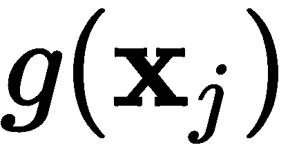
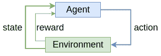
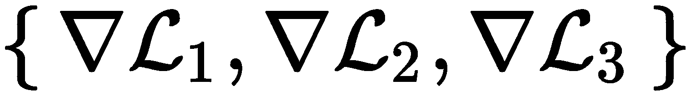

# 十四、元学习

在[第九章](66956576-0f67-49a6-9ba8-1a782baa6b24.xhtml)、*新兴神经网络设计*中，我们引入了新的**神经网络** ( **NN** )架构，以解决现有**深度学习** ( **DL** )算法的一些限制。我们讨论了用于处理结构化数据(用图形表示)的图形神经网络。我们还引入了记忆增强神经网络，它允许网络使用外部记忆。在这一章中，我们将看看如何改进 DL 算法，让它们能够用更少的训练样本学习更多的信息。

让我们用一个例子来说明这个问题。想象一下，一个人从未见过某种类型的物体，比如一辆汽车(我知道——可能性极小)。他们只需要看一次车，就能认出其他的车。但是 DL 算法却不是这种情况。DNN 需要大量的训练样本(有时也需要数据扩充)，才能识别某一类物体。即使相对较小的 CIFAR-10([https://www.cs.toronto.edu/~kriz/cifar.html](https://www.cs.toronto.edu/~kriz/cifar.html))数据集也仅包含 10 类物体的 50，000 幅训练图像，相当于每类 5000 幅图像。

元学习，也称为学会学习，允许**机器学习** ( **ML** )算法利用和引导在多个训练任务中获得的知识，以提高其在新任务中的训练效率。希望通过这种方式，该算法将需要更少的训练样本来学习新任务。使用较少样本进行训练的能力有两个优点:减少训练时间和在没有足够训练数据时的良好性能。在这方面，元学习的目标类似于我们在[第 2 章](d94e220f-820e-40da-8bb5-9593e0790b21.xhtml)、*、*、*了解卷积网络*中介绍的迁移学习机制。事实上，我们可以把迁移学习看作一种元学习算法。但是元学习有多种方法。在本章中，我们将讨论其中的一些。

本章将涵盖以下主题:

*   元学习简介
*   基于度量的元学习
*   基于优化的元学习


# 元学习简介

正如我们在介绍中提到的，元学习的目标是允许 ML 算法(在我们的情况下，NN)从与标准监督训练相比相对较少的训练样本中学习。一些元学习算法试图通过找到它们在已知任务领域的现有知识到新任务领域之间的映射来实现这个目标。其他算法只是从零开始设计，从较少的训练样本中学习。还有一类算法引入了新的优化训练技术，专门针对元学习而设计。但是在我们讨论这些话题之前，让我们先介绍一些基本的元学习范式。在标准的 ML 监督学习任务中，我们的目标是通过更新模型参数 *θ* (在 NNs 的情况下为网络权重)来最小化训练数据集 *D* 上的成本函数 *J(θ)* 。正如我们在引言中提到的，在元学习中，我们通常使用多个数据集。因此，在元学习场景中，我们可以扩展这个定义，说我们的目标是在这些数据集的分布上最小化*J(θ)**P(D)*:


这里，是最佳模型参数，是成本函数，其现在取决于当前数据集以及模型参数。换句话说，目标是找到模型参数，使得所有数据集的成本期望值(如*随机变量和概率分布*部分的[第 1 章](b94f711b-daab-4de7-97b7-b7efccd0b392.xhtml)、*神经网络*的具体细节所述)最小化。我们可以将这种情况视为在单个数据集上进行训练，该数据集的训练样本本身就是数据集。

接下来，让我们继续扩展我们在简介中使用的表达式*更少的训练样本*。在监督训练中，我们可以将这种训练数据稀缺的场景称为***k*-铅球学习**，其中 *k* 可以是 0、1、2 等等。让我们假设我们的训练数据集由分布在 *n* 个类中的标记样本组成。在 *k* -shot 学习中，我们为每个 *n* 类都有 *k* 个标注的训练样本(标注样本总数为 *n × k* )。我们将这个数据集称为**支持集**，我们将用 *S* 来表示它。我们还有一个**查询集** *Q* ，其中包含属于 *n* 类之一的无标签样本。我们的目标是正确分类查询集的样本。有三种类型的*k*-镜头学习:零镜头、一镜头、少镜头。先说零拍学习。


# 零射击学习

我们将从零炮学习( *k* = 0)开始，其中我们知道某个特定的类存在，但是我们没有该类的任何标记样本(也就是说，没有支持集)。起初，这听起来不可能——我们如何对从未见过的东西进行分类？但是在元学习中，情况并不完全如此。回想一下，我们利用之前学习的任务的知识(让我们用 *a* 来表示它们)来处理手头的任务( *b* )。在这方面，零起点学习是迁移学习的一种形式。为了理解这是如何工作的，让我们想象一个人从未见过大象(另一个极不可能的例子)，然而当他们看到大象的照片时，他们必须认出大象(新任务 *b* )。然而，这个人在一本书中读到过，大象很大，灰色，有四条腿，大耳朵，还有一个鼻子(之前的任务 *a* )。根据这种描述，他们看到大象时会很容易认出它。在这个例子中，这个人将他们以前学习的任务(读书)的知识应用到新任务(图像分类)的领域。

在 ML 的上下文中，这些特征可以被编码为非人类可读的嵌入向量。我们可以通过使用语言建模技术，例如 word2vec 或 transformers，在 NN 领域中复制大象识别示例，以编码单词 *elephant* 的基于上下文的嵌入向量。我们还可以使用卷积网络(CNN)来产生大象图像的嵌入向量**h**[b]。让我们来看看如何一步一步地实现这一点:

1.  将编码器 *f* 和 g (NNs)应用于已标记和无标签的样本 *a* 和 *b* 以分别产生嵌入 **h** [*a*] 和 **h** [*b*] 。
2.  使用映射函数将 **h** [*b*] 变换到已知样本的嵌入 **h** [*a**] 的向量空间。映射函数也可以是神经网络。此外，编码器和映射可以被组合在单个模型中并被共同学习。

3.  一旦我们有了查询样本的转换后的表示，我们可以使用相似性度量(例如，余弦相似性)将其与所有表示 **h** [*a*] *进行比较。然后，我们假设查询样本的类与和查询最相关的支持样本的类相同。下图说明了这种情况:


由于迁移学习，零射击学习成为可能。受《http://www.deeplearningbook.org/》第十五章的启发

让我们形式化零射击学习场景。在传统的单数据集分类任务中，NN 代表条件概率，其中 *y* 是输入样本 **x** 的标签， *θ* 是模型参数。在元学习中， **x** 和 *y* 属于传统的数据集，但是我们引入了一个随机变量 *T* 来描述我们感兴趣的新任务。在我们的例子中， **x** 是单词 *elephant* 的上下文(周围的单词)，标签 *y* 是 elephant 类的一次性编码。另一方面， *T* 将是我们感兴趣的图像；因此，元学习模型代表了一种新的条件概率。我们刚刚描述的零射击场景是所谓的基于度量的元学习的一部分(我们将在本章后面看到更多这方面的例子)。现在，让我们转到一次性学习。


# 一次性学习

在本节中，我们将关注**一次性学习** ( *k = 1* )及其推广**少量学习** ( *k > 1* )。在这种情况下，支持集不是空的，我们有每个类的一个或多个标记样本。这是优于零触发场景的一个优点，因为我们可以依赖来自相同域的标记样本，而不是使用来自另一个域的标记样本的映射。因此，我们有一个单独的编码器 *f* ，不需要额外的映射。

一次性学习任务的一个例子是一家公司的面部识别系统。该系统应该能够根据一张照片识别员工的身份。应该可以用一张照片添加新员工。让我们注意一下，在这个场景中，添加一个新的雇员相当于添加一个已经看到的新类(照片本身)，但在其他方面是未知的。这与零起点学习形成对比，在零起点学习中，我们有看不见但已知的类。解决这个任务的一个简单方法是使用分类**前馈网络** ( **FFN** )，它将照片作为输入，并以 softmax 输出结束，其中每个类别代表一名员工。这个系统有两个主要缺点。首先，每次我们添加新员工时，我们都必须使用完整的员工数据集来重新训练整个模型。第二，我们需要每个雇员的多个图像来训练模型。

The following description is based on the method introduced in *Matching Networks for One Shot Learning* ([https://arxiv.org/abs/1606.04080](https://arxiv.org/abs/1606.04080)). The paper has two major contributions: a novel one-shot training procedure and a special network architecture. In this section, we'll discuss the training procedure and we'll describe the network architecture in the *Matching networks* section.

我们也可以在一次性学习框架内解决这个任务。我们需要的第一件事是一个预训练的网络，它可以生成员工图像的嵌入向量。我们假设预训练允许网络为每张照片产生足够独特的嵌入 **h** 。我们还会将所有员工的照片存储在一些外部数据库中。出于性能原因，我们可以将网络应用于所有照片，然后也存储每个图像的嵌入。让我们关注这样一个用例，当一个现有员工试图用新照片进行身份验证时，系统必须识别他或她。我们将使用网络生成该照片的嵌入内容，然后将它与数据库中的嵌入内容进行比较。我们将通过获取与当前照片嵌入最匹配的数据库嵌入来识别员工。

接下来，让我们看看当一个新员工被添加到系统中时的用例。在这里，我们将简单地拍摄该员工的照片，并将其存储在数据库中。这样，每当员工尝试进行身份验证时，他们的当前照片将与初始照片(以及所有其他照片)进行比较。这样，我们就添加了一个新的类(雇员),而没有对网络进行任何更改。我们可以将员工照片/身份数据库视为一个支持集。该任务的目标是将这个支持集映射到一个分类器，该分类器在给定一个以前看不见的查询样本的情况下，输出标签的概率分布。在我们的例子中，对代表以前不属于系统的新雇员(即新的查询样本和新的类)。

换句话说，我们希望能够在现有支持集的帮助下预测以前从未见过的类。我们将映射定义为条件概率，由具有权重 *θ* 的神经网络实现。此外，我们还可以将新的支持集插入同一网络，这将导致新的概率分布。这样，我们可以在不改变网络权重 *θ* 的情况下，根据新的训练数据来调节输出。

现在我们已经熟悉了*k*-镜头学习，让我们看看如何用少数镜头数据集训练一个算法。


# 元培训和元测试

我们在*零次学习*和*一次学习*部分描述的场景被称为**元测试** **阶段**。在这一阶段，我们利用预训练网络的知识，并将其应用于仅在小支持集(或根本没有支持集)的帮助下预测以前未见过的标签。我们还有一个**元训练阶段**，在这个阶段，我们从零开始，在几个场景中训练一个网络。*一次性学习的匹配网络*的作者介绍了一种元训练算法，它与元测试紧密匹配。这是必要的，这样我们就可以在我们期望它在测试阶段工作的相同条件下训练模型。由于我们从零开始训练网络，训练集(用 ***D*** 表示)不是少量的数据集，而是包含每个类的足够数量的标记示例。尽管如此，训练过程模拟了几次拍摄的数据集。

它是这样工作的:

1.  采样一组标签，其中 *T* 是 *D* 中所有标签的集合。澄清一下， *L* 只包含所有标签 *T* 的一部分。这样，当模型只看到几个样本时，训练就模仿了测试。例如，向面部识别系统添加一名新员工需要一张图像和一个标签。
2.  样本 a 支持集合，其中中所有样本的标签只是 L 的一部分。支撑集包含每个标签的 *k* 个样本。
3.  采样一个训练批次，其中(同支持集)。和的组合代表一个训练**集**。我们可以将这一集视为一个单独的学习任务**及其相应的数据集**。或者，在监督学习中，一集只是单个训练样本。

4.  优化剧集的网络权重。网络表示概率，并使用和作为输入。为了澄清，集合由元组组成，以支持集合为条件。这是训练过程的“元”部分，因为模型学习从支持集学习，以最小化整批的损失。该模型使用以下交叉熵目标:


这里，和分别反映标签和样本的抽样。让我们将它与相同的任务进行比较，但是是在经典的监督学习场景中。在这种情况下，我们从数据集 *D* 中抽取小批 *B* ，并且没有支持集。抽样是随机的，不依赖于标签。然后，前面的公式将转换为以下形式:


元学习算法可以分为三大类:基于度量的、基于模型的和基于优化的。在这一章中，我们将关注基于度量和优化的方法(不包括基于模型的方法)。基于模型的元学习算法对实现概率的 ML 算法的类型没有任何限制。也就是说，不需要编码器和映射功能。相反，他们依赖于专门适用于少量标记样本的网络架构。你可能还记得，在[第九章](66956576-0f67-49a6-9ba8-1a782baa6b24.xhtml)、*新兴神经网络设计*中，我们在查看*使用记忆增强神经网络的一次性学习*论文([https://arxiv.org/abs/1605.06065](https://arxiv.org/abs/1605.06065))时介绍了一个这样的模型。顾名思义，这篇论文演示了在一次性学习框架中使用记忆增强神经网络。由于我们已经讨论了网络架构，并且训练过程与我们在本节中描述的过程相似，所以我们在本章中不包括另一个基于模型的例子。

既然我们已经介绍了元学习的基础，在下一节中，我们将关注基于度量的学习算法。


# 基于度量的元学习

当我们在*元学习简介*部分讨论一次性场景时，我们提到了一种基于度量的方法，但这种方法通常适用于 *k* 一次性学习。想法是测量无标签的查询样本和支持集的所有其他样本之间的相似性。使用这些相似性分数，我们可以计算一个概率分布。以下公式反映了这一机制:


这里， *α* 是查询样本之间的相似性度量，是具有 *n* 个类别和每个类别的 *k* 个样本的支持集的大小。为了澄清，查询样本的标签只是支持集的所有样本的线性组合。具有较高相似性的样本的类别将对查询样本的标签分布具有较高的贡献。我们可以将 *α* 实现为一个聚类算法(例如，*k*-最近邻居)或一个注意力模型(我们将在下一节中看到)。在零镜头学习的情况下，这个过程有两个正式步骤:计算样本嵌入，然后计算嵌入之间的相似性。但是前面的公式是这两个步骤的综合，直接从查询样本中计算相似性(尽管在内部，这两个步骤仍然是分开的)。基于度量的两步学习(包括编码器 *f* 和 *g* )如下图所示:


通用的基于度量的学习算法

在接下来的几节中，我们将讨论一些更流行的度量元学习算法。


# 一次性学习的匹配网络

我们已经在 *元学习*章节的*介绍中讨论了与匹配网络一起介绍的训练程序。现在，让我们关注实际的模型，从相似性度量开始，我们在*基于度量的元学习*部分*中概述了相似性度量。*实现这一点的一种方法是余弦相似性(用 *c* 表示)，然后是 softmax:*


这里， *f* 和 *g* 分别是新任务和支持集的样本的编码器(正如我们讨论过的，有可能 *f* 和 *g* 是同一个函数)。编码器可以是用于图像输入或单词嵌入的 CNN，例如在自然语言处理任务的情况下的 word2vec。这个公式非常类似于我们在[第八章](0a021de6-b007-49bf-80e9-b7f6a72cbba7.xhtml)、*序列到序列模型和注意中介绍的注意机制。*

在当前定义下，编码器 *g* 一次仅编码一个支持样本，独立于支持集的其他样本。然而，有可能两个样本 *i* 和 *j* 的嵌入和在嵌入特征空间中非常接近，但是这两个样本具有不同的标签。本文作者建议修改 *g* ，将整个支撑集 *S* 作为附加输入:。这样，编码器可以将的嵌入向量置于 *S* 上，从而避免这个问题。我们也可以对编码器 *f* 应用类似的逻辑。该论文将新的嵌入函数称为**全上下文嵌入**。

让我们看看如何在 *f* 上实现完整的上下文嵌入。首先，我们将引入一个新的函数，它类似于旧的编码器(在包含 *S* 作为输入之前)——也就是说，*f’*可以是一个 CNN 或单词嵌入模型，它创建样本嵌入，独立于支持集。的结果将作为完整嵌入函数的输入。我们将把支持集视为一个序列，这允许我们使用长短期记忆(LSTM)来嵌入它。因此，计算嵌入向量是一个包含多个步骤的连续过程。

但 *S* 为一组，表示序列中样本的顺序无关。为了反映这一点，该算法还对支持集的元素使用了一种特殊的关注机制。通过这种方式，嵌入函数可以处理序列中所有先前的元素，不管它们的顺序如何。

让我们看看编码器的一个步骤是如何工作的:

1.  ，其中 *t* 为输入序列的当前元素，为中间隐藏状态，为步骤 *t-1* 的隐藏状态，为单元格状态。注意机制是用向量实现的，它连接到隐藏状态。

2.  ，其中是在步骤 *t* 的最终隐藏状态。
3.  ，其中是支持集的大小， *g* 是支持集的嵌入函数，α是相似性度量，被定义为乘法关注度，后面是 softmax:


该过程继续进行 *T* 步( *T* 是一个参数)。我们可以用下面的公式来总结:


接下来，让我们关注一下 *g* 的完整上下文嵌入。像 *f* 一样，我们将引入一个新的函数，它类似于旧的编码器(之前包括 *S* 作为输入)。作者建议使用双向 LSTM 编码器，定义如下:


这里，和是两个方向的单元格隐藏状态。我们可以将它们定义如下:


在下一节中，我们将讨论另一种基于度量的学习方法，称为暹罗网络。


# 暹罗网络

在这一节中，我们将讨论用于一次性图像识别的*连体神经网络*论文(【https://www.cs.cmu.edu/~rsalakhu/papers/oneshot1.pdf】T2)。连体网络是由两个相同的基础网络组成的系统，如下图所示:


暹罗网络

这两个网络是相同的，因为它们共享相同的架构和相同的参数(权重)。每个网络被馈送一个输入样本，最后一个隐藏层产生该样本的嵌入向量。这两个嵌入被馈送到距离度量。该距离被进一步处理以产生系统的最终输出，该输出是二进制的，并表示两个样本是否来自同一类的验证。距离度量本身是可微分的，这允许我们将网络作为单个系统来训练。论文作者推荐使用 *L1* 距离:


这里，是基网。在一次性学习场景中使用暹罗网络遵循我们在*元训练和元测试*部分中描述的相同的一般思想，但是在这种情况下，任务被简化了，因为我们总是只有两个类(相同或不同)，而不管数据集中的实际类数量。在元训练阶段，我们用一个大的标记数据集来训练系统。我们通过生成具有相同或不同类别的图像对和二进制标签的样本来做到这一点。在元测试阶段，我们有一个查询样本和一个支持集。然后，我们创建多对图像，每对图像包含查询样本和支持集的单个样本。我们有和支持集一样多的图像对。然后，我们将所有线对输入到连体系统中，并选择距离最小的线对。查询图像的类别由该对支持样本的类别确定。


# 实施暹罗网络

在本节中，我们将使用 Keras 实现一个简单的暹罗网络示例，它将验证两个 MNIST 图像是否来自同一个类。部分基于[https://github . com/keras-team/keras/blob/master/examples/mnist _ siamese . py](https://github.com/keras-team/keras/blob/master/examples/mnist_siamese.py)。

让我们看一下如何一步一步地做到这一点:

1.  我们将从导入语句开始:

```py
import random

import numpy as np
import tensorflow as tf
```

2.  接下来，我们将实现`create_pairs`函数来创建训练/测试数据集(用于训练和测试):

```py
def create_pairs(inputs: np.ndarray, labels: np.ndarray):
    num_classes = 10

    digit_indices = [np.where(labels == i)[0] for i in range(num_classes)]
    pairs = list()
    labels = list()
    n = min([len(digit_indices[d]) for d in range(num_classes)]) - 1
    for d in range(num_classes):
        for i in range(n):
            z1, z2 = digit_indices[d][i], digit_indices[d][i + 1]
            pairs += [[inputs[z1], inputs[z2]]]
            inc = random.randrange(1, num_classes)
            dn = (d + inc) % num_classes
            z1, z2 = digit_indices[d][i], digit_indices[dn][i]
            pairs += [[inputs[z1], inputs[z2]]]
            labels += [1, 0]

    return np.array(pairs), np.array(labels, dtype=np.float32)
```

每个数据集样本由两个 MNIST 影像的输入对和一个二进制标注组成，该标注指示它们是否来自同一个类。该函数创建分布在所有类(数字)上的相同数量的真/假样本。

3.  接下来，让我们实现`create_base_network`函数，它定义了暹罗网络的一个分支:

```py
def create_base_network():
    return tf.keras.models.Sequential([
        tf.keras.layers.Flatten(),
        tf.keras.layers.Dense(128, activation='relu'),
        tf.keras.layers.Dropout(0.1),
        tf.keras.layers.Dense(128, activation='relu'),
        tf.keras.layers.Dropout(0.1),
        tf.keras.layers.Dense(64, activation='relu'),
    ])
```

分支表示从输入开始到距离测量之前的最后一个隐藏图层的基础网络。我们将使用一个三层完全连接的简单神经网络。

4.  接下来，让我们构建整个训练系统，从 MNIST 数据集开始:

```py
(x_train, y_train), (x_test, y_test) = tf.keras.datasets.mnist.load_data()
x_train = x_train.astype(np.float32)
x_test = x_test.astype(np.float32)
x_train /= 255
x_test /= 255
input_shape = x_train.shape[1:]
```

5.  我们将使用原始数据集来创建实际的培训和测试验证数据集:

```py
train_pairs, tr_labels = create_pairs(x_train, y_train)
test_pairs, test_labels = create_pairs(x_test, y_test)
```

6.  然后，我们将构建暹罗网络的基础部分:

```py
base_network = create_base_network()
```

`base_network`对象在 Siamese 系统的两个分支之间共享。这样，我们确保两个分支中的权重相同。

7.  接下来，让我们创建两个分支:

```py
# Create first half of the siamese system
input_a = tf.keras.layers.Input(shape=input_shape)

# Note how we reuse the base_network in both halfs
encoder_a = base_network(input_a)

# Create the second half of the siamese system
input_b = tf.keras.layers.Input(shape=input_shape)
encoder_b = base_network(input_b)
```

8.  接下来，我们将创建 L1 距离，它使用`encoder_a`和`encoder_b`的输出。它被实现为一个`tf.keras.layers.Lambda`层:

```py
l1_dist = tf.keras.layers.Lambda(
    lambda embeddings: tf.keras.backend.abs(embeddings[0] - embeddings[1])) \
    ([encoder_a, encoder_b])
```

9.  然后，我们将创建最终的完全连接图层，该图层获取距离的输出并将其压缩为单个 sigmoid 输出:

```py
flattened_weighted_distance = tf.keras.layers.Dense(1, activation='sigmoid') \
    (l1_dist)
```

10.  最后，我们可以建立模型并启动 20 个时期的训练:

```py
# Build the model
model = tf.keras.models.Model([input_a, input_b], flattened_weighted_distance)

# Train
model.compile(loss='binary_crossentropy',
              optimizer=tf.keras.optimizers.Adam(),
              metrics=['accuracy'])

model.fit([train_pairs[:, 0], train_pairs[:, 1]], tr_labels,
          batch_size=128,
          epochs=20,
          validation_data=([test_pairs[:, 0], test_pairs[:, 1]], test_labels))
```

如果一切顺利，该模型将达到 98%左右的准确率。

接下来，我们将讨论另一种称为原型网络的度量学习方法。


# 原型网络

在一些短的学习场景中，高容量模型(具有许多层和参数的神经网络)很容易过度拟合。原型网络(如在*用于少量学习的原型网络*论文、【https://arxiv.org/abs/1703.05175】T2 中所讨论的)通过计算每个标签的特殊原型向量来解决这个问题，该向量基于该标签的所有样本。相同的原型网络也计算查询样本的嵌入。然后，我们测量查询嵌入和原型之间的距离，并相应地分配查询类(这一部分后面会有更多的细节)。

原型网络适用于零触发和少触发学习，如下图所示:


左:少射学习；右图:零拍学习。来源:https://arxiv.org/abs/1703.05175

让我们从少数镜头学习场景开始，其中每个类 *k* 的原型向量被计算为该类的所有样本的元素平均值:


这里，是类别 *k* 的支持集中的样本数，是具有参数 *θ* 的原型网络。在零触发学习场景中，原型计算如下:


这里，是元数据向量，给出了标签的高层描述，是那个向量的嵌入函数(编码器)。元数据向量可以预先给定或计算。

每个新的查询样本被分类为样本嵌入和所有原型之间距离的软最大值:


这里， *d* 是距离度量(例如，线性欧几里德距离)。

现在我们已经对原型网络背后的主要思想有了一个概述，让我们关注如何训练它们(这个过程类似于我们在*元学习简介*一节中概述的训练)。

开始之前，我们将介绍一些符号:

*   *D* 是少投训练集。
*   *D[k]是 *k* 类 *D* 的训练样本。*
*   *T* 是数据集中类的总数。
*   是为每个训练集选择的标签子集。
*   *N[S]是每集每类的支持样本数。*
*   *N[Q]是每集的查询样本数。*

该算法从训练集 *D* 开始，输出代价函数 *J.* 的结果，让我们一步步来看它是如何工作的:

1.  取样一组标签。

2.  对于 *L* 中的每个类别 *k* ，执行以下操作:
    1.  样品支架组，其中。
    2.  样本查询设置，其中。
    3.  从支持集计算类原型:


3.  初始化成本函数。
4.  对于 *L* 中的每个类别 *k* ，执行以下操作:
    1.  对于每个查询样本，按如下方式更新成本函数:


直观地说，第一个组件(在方括号中)最小化了查询与其对应的同类原型之间的距离。第二项最大化查询和其他类的原型之间的距离之和。

这篇论文的作者展示了他们在 Omniglot 数据集([https://github.com/brendenlake/omniglot](https://github.com/brendenlake/omniglot))上的工作，该数据集包含从 50 个字母中收集的 1623 幅手写字符图像。每个角色有 20 个相关的例子，每个例子都是由不同的人类主体绘制的。目标是将一个新角色归类为 1623 个类别中的一个。他们使用欧几里德距离、一次和五次场景训练原型网络，并使用 60 个类别和每个类别 5 个查询点训练剧集。下面的截图显示了由原型网络学习的相同字母表的相似(但不相同)字符子集的嵌入的*t*-SNE([https://lvdmaaten.github.io/tsne/](https://lvdmaaten.github.io/tsne/))可视化。

即使可视化的字符是彼此的微小变化，网络也能够将手绘字符紧密地聚集在类原型周围。几个错误分类的字符在矩形中突出显示，箭头指向正确的原型:


由网络学习的相似字符子集的嵌入的 SNE 可视化；资料来源:https://arxiv.org/abs/1703.05175

这就结束了我们对原型网络和基于度量的元学习的描述。接下来，我们将关注基于模型的方法。


# 优化学习

到目前为止，我们已经讨论了基于度量的学习，它使用特殊的相似性度量(很难过度拟合)来调整 NNs 的表示能力，使其能够从具有少量训练样本的数据集学习。或者，基于模型的方法依赖于改进的网络架构(例如，内存增强网络)来解决相同的问题。在本节中，我们将讨论基于优化的方法，这种方法调整训练框架以适应少量学习的要求。更具体地说，我们将关注一种叫做**模型不可知元学习**(MAML；用于深度网络快速适应的模型不可知元学习，【https://arxiv.org/abs/1703.03400】，*。顾名思义，MAML 可以应用于任何学习问题和用梯度下降训练的模型。*

引用原文:

我们的方法的关键思想是训练模型的初始参数，使得在通过用来自新任务的少量数据计算的一个或多个梯度步骤更新参数之后，模型在新任务上具有最大性能。
...
从特征学习的角度来看，训练模型参数以使几个梯度步骤或甚至单个梯度步骤可以在新任务中产生良好结果的过程可以被视为构建广泛适用于许多任务的内部表示。如果内部表示适用于许多任务，简单地稍微微调参数(例如，通过主要修改前馈模型中的顶层权重)可以产生良好的结果。实际上，我们的过程优化了易于快速微调的模型，允许在正确的空间进行快速学习。从动力系统的角度来看，我们的学习过程可以被视为最大化新任务的损失函数对参数的敏感性:当敏感性高时，参数的小的局部变化可以导致任务损失的大的改善。
这项工作的主要贡献是一个简单的模型和任务不可知的元学习算法，该算法训练模型的参数，使得少量的梯度更新将导致对新任务的快速学习。我们在不同的模型类型上演示了该算法，包括全连接和卷积网络，以及几个不同的领域，包括少量回归、图像分类和强化学习。我们的评估表明，我们的元学习算法优于专门为监督分类设计的最先进的一次性学习方法，同时使用更少的参数，但它也可以很容易地应用于回归，并可以在存在任务可变性的情况下加速强化学习，大大优于作为初始化的直接预训练。

为了理解 MAML，我们将介绍一些特定于论文的符号(其中一些与前面章节中的符号重叠，但我更喜欢保留论文中的原始符号):

*   我们将用 *、*来表示模型(神经网络)，它将输入 **x** 映射到输出 **a** 。
*   我们将用来表示完整的训练集(相当于数据集 *D* )。类似于*元训练和元测试*部分的元训练，我们在训练过程中从中抽取任务(相当于剧集)。这个过程被定义为任务的分配。
*   我们将用来表示一个任务(一集)。它由损失函数(相当于损失 *J* )、初始观测值的分布、转移分布和长度 *H* 定义。

为了理解 MAML 任务定义的一些组成部分，让我们注意，除了监督问题，MAML 也可以应用于**强化学习** ( **RL** )任务。在 RL 框架中，我们有一个环境和一个代理，它们不断地相互作用。在每一步，代理采取一个动作(从许多可能的动作中)，环境向它提供反馈。反馈包括奖励(可能是负面的)和行动者行动后环境的新状态。然后代理采取新的操作，依此类推，如下图所示:



RL 框架

很多现实世界的任务都可以表示为 RL 问题，包括游戏，其中代理是玩家，环境是游戏宇宙。

我们可以在监督和 RL 环境中查看任务。对于监督任务，我们没有特定的顺序标记训练样本。但是在 RL 环境中，我们可以将输入 **x** 视为环境状态，将输出 **a** 视为代理的动作。在这个场景中，任务是连续的—状态 **x** *[ 1 ]* 导致动作 **a** [* 1 *] ，这又导致状态 **x** [* 2 *] ，以此类推。环境的初始状态表示为。这意味着是一个新环境状态的概率，给定前一个状态 **x** *[ t ]* 和代理的动作 **a** [* t *] 。损失也可以在两种情况下查看:监督场景中的错误分类损失和 RL 场景中的成本函数(提供奖励的函数)。

既然我们已经熟悉了符号，让我们把重点放在 MAML 算法上。为了理解它是如何工作的，我们来看看原始论文中的另一段引文:

我们提出了一种方法，该方法可以通过元学习来学习任何标准模型的参数，从而为该模型的快速适应做准备。这种方法背后的直觉是，一些内部表征比其他的更容易转移。例如，神经网络可能会学习广泛适用于中所有任务的内部特征，而不是单个任务。我们如何鼓励这种通用表示的出现？我们对这个问题采取了一种明确的方法:由于模型将在新任务上使用基于梯度的学习规则进行微调，我们将致力于以这样一种方式学习模型，即这种基于梯度的学习规则可以在从中提取的新任务上取得快速进展，而不会过度适应。实际上，我们的目标是找到对任务变化敏感的模型参数，这样，当在损失梯度的方向上改变时，参数的小变化将对来自的任何任务的损失函数产生大的改进。

在所有这些悬念之后，让我们检查一下 MAML 算法，用下面的伪代码来说明:


资料来源:https://arxiv.org/abs/1703.03400:《MAML 算法》

该算法有一个外环(第 2 行)和一个内环(第 4 行)。我们将从内部循环开始，它迭代许多任务，从任务分布中取样。让我们关注单个循环迭代，它使用训练样本处理单个任务，其中是任务的支持集。训练样本在以下步骤中成批处理(前面屏幕截图中的第 4 行到第 7 行):

1.  通过模型传播样本并计算损耗。
2.  计算相对于初始参数 *θ的误差梯度。*
3.  向后传播梯度并计算更新的模型参数，其中α是学习率。请注意，参数是辅助性的，并且特定于每个任务。为了澄清，每当内循环开始新任务的新迭代时，模型总是以相同的初始参数*θ*开始。同时，每个任务将其更新的权重存储为一个附加变量，而不会实际修改初始参数 *θ* (我们将在外循环中更新原始模型)。
4.  我们可以在同一任务中多次执行这样的梯度更新。可以把它想象成对多个批处理的训练，在内部循环中用一个额外的嵌套循环来实现。在这种情况下，该算法以最后一次迭代的权重而不是初始参数 *θ* 开始每次迭代 *i* ，如以下公式所示:


在多次迭代的情况下，仅保留最新的权重。

只有在内循环完成后，我们才能根据所有任务的反馈，继续更新原始模型的初始参数 *θ* 。为了理解为什么这是必要的，让我们看一下下图:


针对参数进行优化的 MAML*θ*能够快速适应新任务来源:https://arxiv.org/abs/1703.03400

它显示了三个任务沿着全局误差梯度的误差梯度。让我们假设，代替内部/外部循环机制，我们在每个任务上顺序迭代，并且在每个小批量*之后简单地更新原始模型参数 *θ* 。*我们可以看到，不同损失函数的梯度会将模型推向完全不同的方向；例如，任务 2 的误差梯度将与任务 1 的梯度相矛盾。MAML 通过聚合(但不应用)来自内部循环的每个任务的更新权重来解决这个问题(辅助参数)。然后，我们可以计算外环成本函数(称为元目标)，一次性组合所有任务的更新权重(这是跨所有任务的元优化):


我们使用以下公式来更新主要模型参数的权重:


这里，β是学习率。外循环任务(MAML 伪代码程序的第 8 行)与内循环任务(第 3 行)不同。我们可以将内循环任务视为训练集，将外循环任务视为验证集。注意，我们使用特定于任务的参数来计算损失，但是我们计算相对于初始参数 *θ* 的损失梯度。为了澄清，这意味着我们也通过外部循环和内部循环反向传播。这被称为二阶梯度，因为我们在梯度上计算梯度(二阶导数)。这使得学习参数成为可能，即使在多次更新之后，该参数也可以在任务上一般化。

MAML 的一个缺点是通过整个计算图(外环和内环)的反向传播在计算上是昂贵的。此外，由于大量的反向传播步骤，它可能遭受消失或爆炸梯度。为了更好地理解这一点，让我们假设我们有一个单一的任务(我们将从公式中省略它)；我们为该任务执行单个梯度步骤(一个内循环迭代)，内循环的更新参数是。也就是说，我们将损失函数的符号从改为。然后，外部循环的参数更新规则变成如下:


我们可以借助链式法则(参见[第一章](b94f711b-daab-4de7-97b7-b7efccd0b392.xhtml)、*神经网络的基本原理*)计算损失相对于初始参数 *θ* 的梯度:


我们可以看到公式中包含了二阶导数。MAML 的作者们提出了所谓的**一阶 MAML**(**fo mall**)，这完全忽略了术语。这样，我们就有了【the FOMAML 梯度变为:


这个简化的公式排除了计算上昂贵的二阶梯度。

到目前为止，我们已经研究了通用的 MAML 算法，它适用于监督和 RL 设置。接下来，我们来关注一下监督版。让我们回忆一下，在受监督的情况下，每个任务都是一个不相关的输入/标签对的列表，并且剧集长度 *H* 是 *1* 。我们可以在下面的伪代码中看到用于少量监督学习的 MAML 算法(它类似于通用算法):


MAML for few-shot supervised learning: source: https://arxiv.org/abs/1703.03400

在前面的代码中，等式 2 和 3 都指分类任务的交叉熵损失或回归任务的均方误差，指内循环训练集，指外循环的验证集。

最后，让我们讨论 RL 场景，如以下伪代码所示:


MAML for few-shot reinforcement learning: source: https://arxiv.org/abs/1703.03400

每个样本代表一个游戏情节的轨迹，其中环境在步骤 *t* 向代理呈现其当前状态。接着，代理(NN)样本使用**策略** 将状态映射到动作的分布。该模型使用一种特殊类型的损失函数，旨在训练网络在剧集的所有步骤中实现回报最大化。


# 摘要

在这一章中，我们研究了元学习领域，它可以被描述为学会学习。我们从元学习的介绍开始。更具体地说，我们谈到了零投和少投学习，以及元培训和元测试。然后，我们关注几种基于度量的学习方法。我们研究了匹配网络，实现了一个暹罗网络示例，并介绍了原型网络。接下来，我们关注基于优化的学习，在这里我们引入了 MAML 算法。

在下一章，我们将学习一个令人兴奋的话题:自动车辆。