# 十五、自动驾驶汽车的深度学习

让我们想想**自动驾驶汽车** ( **AVs** )将会如何影响我们的生活。首先，我们不用把注意力集中在开车上，我们可以在旅途中做些别的事情。迎合这些旅行者的需求本身可能会催生一个完整的产业。但那只是额外的收获。如果我们能在旅行中更有效率或者只是放松，我们很可能会开始更多的旅行，更不用说对那些自我驾驶能力有限的人的好处了。让交通这样一种重要的基本商品变得更容易获得，有可能改变我们的生活。这只是对我们个人的影响——从送货服务到即时制造，AVs 也会对经济产生深远的影响。简而言之，让 AVs 发挥作用是一场高风险的游戏。难怪近年来这一领域的研究已经从学术界转向了实体经济。从 Waymo、优步和 NVIDIA 到几乎所有主要汽车制造商的公司都在争相开发 AVs。

然而，我们还没有到那一步。原因之一是自驾车是一项复杂的任务，由多个子问题组成，每个子问题都是一项主要任务。为了成功导航，车辆的程序需要环境的精确 3D 模型。构建这种模型的方法是结合来自多个传感器的信号。一旦有了模型，我们还需要解决实际的驾驶任务。想一想一个司机在不撞车的情况下必须克服的许多意想不到的和独特的情况。但是，即使我们创建了一个驾驶策略，它也需要在几乎 100%的时间里保持准确。假设我们的 AV 在 100 个红灯中有 99 个会成功停下来。99%的准确率对于任何其他**机器学习** ( **ML** )任务来说都是巨大的成功；对于自动驾驶来说并非如此，即使是一个错误也可能导致事故。

在这一章中，我们将探索深度学习在 AVs 中的应用。我们将看看如何使用深度网络来帮助车辆了解周围的环境。我们也将看到如何在实际控制车辆中使用它们。

本章将涵盖以下主题:

*   AVs 简介
*   影音系统的组件
*   3D 数据处理简介
*   模仿驾驶政策
*   司机网驾驶策略


# AVs 简介

我们将从反病毒研究的简史开始这一部分(令人惊讶的是，反病毒研究很久以前就开始了)。我们还将尝试根据**汽车工程师协会** ( **SAE** )来定义 AV 自动化的不同级别。


# AV 研究简史

实现自动驾驶汽车的第一次认真尝试始于 20 世纪 80 年代的欧洲和美国。自 2000 年代中期以来，进展迅速加快。该领域的第一项重大努力是尤里卡·普罗米修斯计划([https://en.wikipedia.org/wiki/Eureka_Prometheus_Project](https://en.wikipedia.org/wiki/Eureka_Prometheus_Project))，从 1987 年持续到 1995 年。它在 1995 年达到高潮，当时一辆自动驾驶的梅赛德斯-奔驰 S 级汽车使用计算机视觉在慕尼黑和哥本哈根之间行驶了 1600 公里。在某些时候，这辆车在德国高速公路上的速度高达 175 公里/小时(有趣的事实:高速公路的一些路段没有速度限制)。这辆汽车能够自己超越其他汽车。人类干预的平均距离为 9 公里，在没有干预的情况下，它曾行驶了 158 公里。

1989 年，卡耐基梅隆大学的 Dean Pomerleau 发表了 *ALVINN:神经网络中的自主陆地车辆*([https://papers . nips . cc/paper/95-ALVINN-An-Autonomous-Land-Vehicle-in-a-Neural-Network . pdf](https://papers.nips.cc/paper/95-alvinn-an-autonomous-land-vehicle-in-a-neural-network.pdf))，这是一篇关于将神经网络用于 AVs 的开创性论文。这项工作特别有趣，因为它应用了 30 年前我们在 AVs 中讨论过的许多主题。让我们看看 ALVINN 最重要的属性:

*   它使用一个简单的神经网络来决定车辆的转向角度(它不控制加速度和刹车)。
*   网络与一个输入层、一个隐藏层和一个输出层完全连接。
*   输入包括以下内容:
    *   来自安装在车辆上的前置摄像头的 30 × 32 单色图像(他们使用了 RGB 图像中的蓝色通道)。
    *   来自激光测距仪的 8 × 32 图像。这是一个简单的网格，其中每个单元都包含到视野中该单元所覆盖的最近障碍物的距离。
    *   一个标量输入，指示道路强度，即道路比相机图像中的非道路更亮还是更暗。该值递归地来自网络输出。
*   具有 29 个神经元的单个完全连接的隐藏层。
*   具有 46 个神经元的全连接输出层。道路的弯曲度由 45 个这样的神经元以类似一键编码的方式来表示——也就是说，如果中间的神经元激活度最高，那么道路就是直的。相反，左侧和右侧神经元代表增加的道路曲率。最终输出单位表示道路强度。
*   该网络在 1，200 幅图像的数据集上被训练了 40 个时期:

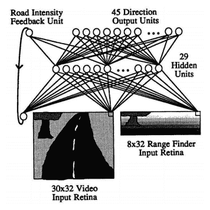

ALVINN 的网络架构。资料来源:ALVINN 报纸

接下来，让我们来看看(主要)商业影音发展的最新时间表:

*   DARPA 大挑战([https://en.wikipedia.org/wiki/DARPA_Grand_Challenge](https://en.wikipedia.org/wiki/DARPA_Grand_Challenge))组织于 2004 年、2005 年和 2007 年。第一年，参赛团队的 AVs 必须在莫哈韦沙漠行驶 240 公里。在被挂在岩石上之前，表现最好的无人机只完成了 11.78 公里的路程。在 2005 年，车队必须克服加州和内华达州 212 公里的越野课程。这一次，有五辆车设法开完了全程。2007 年的挑战是在一个空军基地建造的模拟城市环境中航行。总路线长度为 89 公里，参与者必须遵守交通规则。六辆车完成了全程。
*   2009 年，谷歌开始研发自动驾驶技术。这一努力导致了 Alphabet(谷歌母公司)子公司 way mo([https://waymo.com/](https://waymo.com/))的诞生。2018 年 12 月，他们在亚利桑那州凤凰城与 AVs 合作推出了首个商业按需乘车服务。2019 年 10 月，Waymo 宣布开始第一批真正无人驾驶的汽车，作为其 robotaxi 服务的一部分(此前，安全驾驶员一直在场)。
*   mobile ye([https://www.mobileye.com/](https://www.mobileye.com/))使用深度神经网络来提供驾驶辅助系统(例如，车道保持辅助)。该公司开发了一系列**片上系统** ( **SOC** )设备，专门针对汽车使用所需的低能耗运行神经网络进行了优化。它的产品被许多主要的汽车制造商使用。2017 年，Mobileye 被英特尔以 153 亿美元收购。从那时起，宝马、英特尔、菲亚特-克莱斯勒、SAIC、大众、NIO 和汽车供应商德尔福(现在的 Aptiv)就合作开发自动驾驶技术。2019 年前三个季度，Mobileye 的总销售额为 8.22 亿美元，而 2016 年所有四个季度的销售额为 3.58 亿美元。
*   2016 年，通用汽车以超过 5 亿美元的价格收购了自动驾驶技术开发商 Cruise Automation([https://getcruise.com/](https://getcruise.com/))(具体数字不详)。从那以后，Cruise Automation 已经在旧金山测试和演示了多辆 AV 原型车。2018 年 10 月，宣布本田也将参与该合资企业，投资 7.5 亿美元，换取 5.7%的股份。2019 年 5 月，Cruise 从一群新老投资者那里获得了 11.5 亿美元的额外投资。
*   2017 年，福特汽车公司收购了自动驾驶初创公司 Argo AI 的多数股权。2019 年，大众汽车宣布将向 Argo AI 投资 26 亿美元，作为与福特更大交易的一部分。大众汽车将出资 10 亿美元，并出资 16 亿美元成立位于慕尼黑、拥有 150 多名员工的自动智能驾驶子公司。


# 自动化水平

当我们谈论 AVs 时，我们通常会想象完全无人驾驶车辆。但在现实中，我们有需要司机的汽车，但仍然提供一些自动化功能。

SAE 已经开发了六个自动化等级:

*   **0 级**:驾驶员操纵车辆的转向、加速和制动。这一级别的功能只能为驾驶员的行动提供警告和即时帮助。这一级别的功能示例包括:
    *   车道偏离警告只是在车辆越过其中一个车道标志时向驾驶员发出警告。
    *   当另一辆车位于汽车的盲点区域(车辆后端左侧或右侧的区域)时，盲点警告会警告驾驶员。
*   **1 级**:为驾驶员提供转向或加速/制动辅助的功能。当今车辆中最受欢迎的功能如下:
    *   **车道保持辅助** ( **LKA** ):车辆可以检测车道标线，并利用转向保持自己在车道上居中。
    *   **自适应巡航控制** ( **ACC** ):车辆可以检测到其他车辆，并根据情况使用刹车和加速来保持预设的速度或降低速度。
    *   **自动紧急制动** ( **AEB** ):车辆在探测到障碍物而驾驶员没有反应的情况下可以自动停下来。
*   **级别 2** :为驾驶员提供转向和制动/加速辅助的功能。一个这样的特征是 LKA 和自适应巡航控制的组合。在这个级别上，汽车可以随时将控制权交还给驾驶员，而无需提前警告。因此，他或她必须持续关注路况。例如，如果车道标志突然消失，LKA 系统可以提示驾驶员立即控制方向盘。
*   第三级:这是我们可以谈论真正自主的第一级。在某种意义上，它类似于 2 级，即汽车可以在某些有限的条件下自动驾驶，并可以提示驾驶员进行控制；然而，这肯定会提前发生，留出足够的时间让粗心的人熟悉路况。例如，假设汽车在高速公路上自动驾驶，但云连接导航获得了前方道路上的建筑工程信息。在到达施工区域之前，驾驶员将被提示采取控制。
*   第 4 级:与第 3 级相比，第 4 级的车辆在更广泛的情况下是完全自主的。例如，本地地理围栏(即，限于某个区域)的出租车服务可能处于第 4 级。不需要驾驶员来控制。相反，如果车辆驶出该区域，它应该能够安全地中止行程。
*   **第五级**:所有情况下的完全自主。方向盘是可选的。

今天所有商用车辆最多具有 2 级功能(即使是特斯拉的自动驾驶)。唯一的例外(根据制造商的说法)是 2018 款奥迪 A8，它有一个名为 AI 堵车飞行员的 3 级功能。该系统负责在双向交通之间有物理屏障的多车道道路上以高达 60 公里/小时的速度驾驶。可以通过 10 秒钟的提前警告来提示驾驶员进行控制。这一功能在汽车上市期间得到了展示，但在撰写本章时，奥迪引用了监管限制，并未将其纳入所有市场。我不知道该功能在哪里(或是否)可用。

在下一节中，我们将看看构成 AV 系统的组件。


# 影音系统的组件

在这一节中，我们将从软件架构的角度概述两种类型的 AV 系统。第一种类型使用具有多个组件的顺序架构，如下图所示:

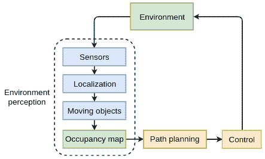

影音系统的组成部分

该系统类似于我们在第十章、*元学习*中简要讨论过的强化学习框架。我们有一个反馈回路，其中环境(物理世界或模拟)向代理(车辆)提供其当前状态。反过来，代理决定它的新轨迹，环境对它做出反应，等等。让我们从环境感知子系统开始，它有以下模块(我们将在下面的章节中更详细地讨论它们):

*   **传感器:**物理设备，如摄像头、雷达等。
*   **定位:**确定车辆在高清地图内的准确位置(厘米级精度)。
*   **运动目标检测和跟踪:**检测和跟踪其他交通参与者，例如车辆和行人。

感知系统的输出将来自其各个模块的数据结合起来，产生周围环境的**中级**虚拟表示。这种表示通常是环境的自上而下(鸟瞰)2D 视图，称为**占用地图**。下面的截图显示了一个示例的司机网络系统的占用地图，我们将在本章的后面讨论。它包括路面(白线和黄线)、交通灯(红线)和其他车辆(白色矩形)。图像以彩色显示效果最佳:

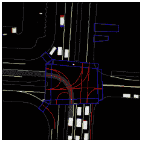

司机网占用地图。资料来源:https://arxiv.org/abs/1812.03079

占用地图用作**路径规划**模块的输入，该模块使用它来确定车辆的未来轨迹。**控制**模块获取期望的轨迹，并将其转化为车辆的低级控制输入。

中间层表示方法有几个优点。首先，它非常适合于路径规划和控制模块的功能。此外，我们可以使用模拟器来生成自上而下的图像，而不是使用传感器数据。通过这种方式，收集训练数据将更加容易，因为我们不必驾驶真正的汽车。更重要的是，我们将能够模拟现实世界中很少发生的情况。例如，我们的 AV 必须不惜一切代价避免崩溃，然而真实世界的训练数据将很少(如果有的话)崩溃。如果我们只使用真实的传感器数据，最重要的驾驶情况之一将严重不足。

第二种类型的 AV 系统使用单个端到端组件，该组件将原始传感器数据作为输入，并以转向控制的形式产生驾驶策略，如下图所示:

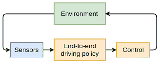

端到端影音系统

事实上，我们在讨论 ALVINN 时已经提到了端到端系统(在*AV 研究简史*部分)。接下来，我们将关注顺序系统的不同模块。我们将在本章后面更详细地讨论端到端系统。


# 环境感知

为了使任何自动化功能发挥作用，车辆需要对其周围环境有良好的感知。环境感知系统必须识别移动物体的准确位置、距离和方向，例如行人、骑自行车的人和其他车辆。此外，它还必须创建路面的精确地图，以及车辆在路面和整个环境中的准确位置。让我们讨论一下帮助 AV 创建这个虚拟环境模型的硬件和软件组件。


# 感觉

建立良好环境模型的关键是车辆传感器。以下是最重要的传感器列表:

*   **摄像头**:其图像用于检测路面、车道标线、行人、骑自行车的人、其他车辆等。在汽车环境中，一个重要的相机属性(除了分辨率之外)是视野。它测量相机在任何给定时刻能看到多少可观察的世界。例如，拥有 180 度 ^o 视野，它可以看到前面的一切，后面什么也看不到。拥有 360 ^o 视野，可以看到车辆前方的一切，也可以看到车辆后方的一切(全观察)。存在以下不同类型的摄像机系统:
    *   **单色摄像头**:使用一个前向摄像头，通常安装在挡风玻璃的顶部。大多数自动化功能依赖于这种类型的摄像机工作。单色摄像机的典型视野是 125 度 ^o 。
    *   **立体摄像机**:一个由两个前向摄像机组成的系统，彼此稍微分开。相机之间的距离允许它们从稍微不同的角度捕捉相同的图片，并将它们组合成 3D 图像(就像我们用眼睛一样)。立体系统可以测量到图像中一些物体的距离，而单声道相机仅依靠试探法来完成这一任务。
    *   **360 ^o 周边** **环境视角**:有些车辆有四个摄像头的系统(前、后、左、右)。
    *   **夜视摄像头**:一种系统，其中车辆包括一种特殊类型的前灯，除了其常规功能之外，它还发射红外光谱中的光。光线由红外摄像机记录，红外摄像机可以向驾驶员显示增强的图像，并在夜间检测障碍物。

*   **雷达**:利用发射机向不同方向发射电磁波(在无线电或微波频谱中)的系统。当波到达一个物体时，它们通常会被反射，其中一些波会朝着雷达本身的方向反射。雷达可以用特殊的接收天线探测到它们。因为我们知道无线电波以光速传播，所以我们可以通过测量发射和接收信号之间经过的时间来计算到反射物体的距离。我们还可以通过测量出射波和入射波的频率差(多普勒效应)来计算物体(例如，另一辆车)的速度。与相机图像相比，雷达的“图像”噪声更大、更窄、分辨率更低。例如，远程雷达可以探测到 160 米外的物体，但视野范围很窄。雷达可以探测到其他车辆和行人，但它无法探测到路面或车道标志。它通常用于 ACC 和 AEB，而 LKA 系统使用相机。大多数车辆有一个或两个前向雷达，在极少数情况下，有一个后向雷达。
*   **激光雷达** ( **光探测和测距**):这个传感器是有点类似于雷达，但它发射的不是无线电波，而是近红外光谱的激光束。因此，一个发射的脉冲可以精确地测量到单点的距离。激光雷达以一种模式非常快速地发射多个信号，这创建了环境的 3D 点云(传感器可以非常快速地旋转)。下图显示了车辆如何通过激光雷达观察世界:

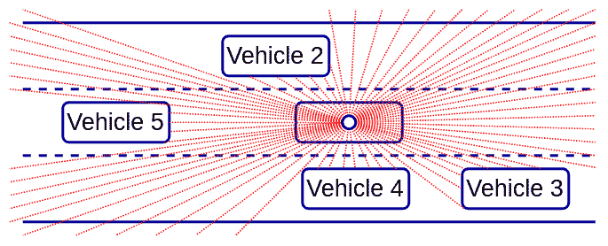

车辆如何通过激光雷达观察世界的示意图

*   **声纳** ( **声音导航测距**):这种传感器发射超声波脉冲，通过收听周围物体反射的声波回声来绘制环境地图。声纳比雷达便宜，但有效探测范围有限。因此，它们通常用于停车辅助功能。

来自多个传感器的数据可以通过称为**传感器融合**的过程合并到单个环境模型中。传感器融合通常使用卡尔曼滤波器(【https://en.wikipedia.org/wiki/Kalman_filter】)来实现。


# 本地化

**定位**就是确定车辆在地图上的准确位置的过程。为什么这很重要？像 HERE ( [、https://www.here.com/](https://www.here.com/))这样的公司专门制作极其精确的道路地图，在这种地图上，整个路面区域的误差在几厘米之内。这些地图还可以包括感兴趣的静态对象的信息，例如车道标志、交通信号灯、速度限制、斑马线、减速带等。因此，如果我们知道车辆在道路上的准确位置，就不难计算出最佳轨迹。

一个显而易见的解决方案是使用全球定位系统；然而，在完美的条件下，GPS 可以精确到 1-2 米以内。在有高层建筑或山脉的地区，精确度可能会受到影响，因为 GPS 接收器无法从足够数量的卫星接收信号。解决这个问题的一个方法是使用**同时定位和地图绘制** ( **SLAM** )算法。这些算法超出了本书的范围，但是我鼓励你自己对这个主题进行研究。


# 运动目标检测和跟踪

我们现在对车辆使用的传感器有了一个概念，并且我们简要地提到了知道它在地图上的确切位置的重要性。有了这些知识，车辆理论上可以通过简单地跟随细粒度点的面包屑轨迹导航到目的地。然而，自动驾驶的任务并不那么简单，因为环境是动态的，因为它包括移动的物体，如车辆、行人、骑自行车的人等等。自主车辆必须不断了解移动物体的位置，并在规划其轨迹时跟踪它们。这是我们可以将深度学习算法应用于原始传感器数据的一个领域。首先，我们将为摄像机做这件事。在[第五章](9ac88546-8662-4b23-aa96-7eb00f48fedb.xhtml)、*物体检测和图像分割*中，我们讨论了如何在两个高级视觉任务中使用**卷积网络**(**CNN**)——物体检测和语义分割。

概括地说，对象检测在图像中检测到的不同类别的对象周围创建一个边界框。语义分割给图像的每个像素分配一个类别标签。我们可以使用分段来检测相机图像上的道路表面和车道标记的确切形状。我们可以使用目标检测对环境中感兴趣的运动目标进行分类和定位；然而，我们已经在第五章、*的[中讨论了这些主题。](9ac88546-8662-4b23-aa96-7eb00f48fedb.xhtml)*在本章中，我们将重点关注激光雷达传感器，并讨论如何在该传感器产生的 3D 点云上应用 CNN。

既然我们已经概述了感知子系统组件，在下一节中，我们将介绍路径规划子系统。


# 路径规划

路径规划(或驾驶策略)是计算车辆轨迹和速度的过程。尽管我们可能有精确的地图和车辆的确切位置，但我们仍然需要记住环境的动态。汽车被其他移动的车辆、行人、交通灯等等包围。如果前方车辆突然停车会怎么样？还是进展太慢了？我们的 AV 必须做出超车的决定，然后执行机动。这是 ML 和 DL 特别有用的地方，我们将在本章中讨论实现它们的两种方法。更具体地说，我们将讨论在端到端学习系统中使用模仿驾驶策略，以及由 Waymo 开发的名为“司机网”的驾驶策略算法。

AV 研究中的一个障碍是建造一个 AV 并获得必要的测试许可是非常昂贵和耗时的。谢天谢地，我们仍然可以在 AV 模拟器的帮助下训练我们的算法。

下面是一些最流行的模拟器:

*   微软 AirSim，建立在虚幻引擎上([https://github.com/Microsoft/AirSim/](https://github.com/Microsoft/AirSim/))
*   卡拉，建造在虚幻引擎上([https://github.com/carla-simulator/carla](https://github.com/carla-simulator/carla))
*   Udacity 的自动驾驶汽车模拟器，由 Unity([https://github.com/udacity/self-driving-car-sim](https://github.com/udacity/self-driving-car-sim))打造
*   OpenAI 健身房的`CarRacing-v0`环境(我们将在*模仿驾驶政策*部分看到一个这样的例子)

这就结束了我们对 AV 系统组件的描述。接下来，我们将讨论如何处理 3D 空间数据。


# 3D 数据处理简介

激光雷达产生点云，即三维空间中的一组数据点。记住激光雷达发射的是激光束。从表面反射并返回接收器的光束产生点云的单个数据点。如果我们假设激光雷达设备是坐标系的中心，并且每个激光束是一个矢量，那么一个点由矢量的方向和大小来定义。因此，点云是矢量的一个**无序集合**。或者，我们可以通过它们在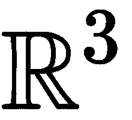空间中的笛卡尔坐标来定义这些点，如下图左侧所示。在这种情况下，点云是一组矢量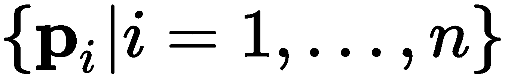，其中每个矢量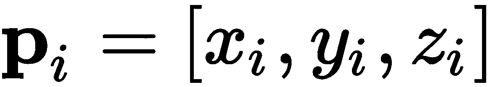包含该点的三个坐标。为了清楚起见，每个点都表示为一个立方体:

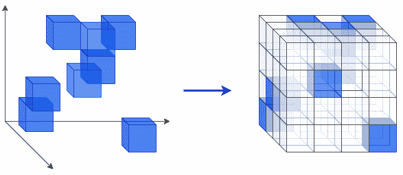

左侧:三维空间中的点(表示为立方体)；右侧:体素的三维网格

接下来，让我们关注神经网络的输入数据格式，特别是 CNN。2D 彩色图像被表示为具有三个切片(每个通道一个切片)的张量，并且每个切片是由像素组成的矩阵(2D 网格)。CNN 使用 2D 卷积(参见[第二章](d94e220f-820e-40da-8bb5-9593e0790b21.xhtml)、*了解卷积网络*)。直觉上，我们可能认为我们可以对 3D 点云使用类似的由**体素**(一个体素是一个 3D 像素)组成的 3D 网格，如上图右图所示。假设点云点没有颜色，我们可以将网格表示为 3D 张量，并使用它作为具有 3D 卷积的 CNN 的输入。

然而，如果我们仔细观察这个 3D 网格，我们会发现它很稀疏。例如，在上图中，我们有一个包含 8 个点的点云，但是网格包含 4 x 4 x 4 = 64 个单元。在这个简单的例子中，我们将数据的内存占用增加了八倍，但在现实世界中，情况可能会更糟。在本节中，我们将介绍 PointNet(参见 *PointNet:针对 3D**、【https://arxiv.org/abs/1612.00593】的点集深度学习)，它为这个问题提供了一个解决方案。*

 *PointNet 将一组点云向量 **p** *[i]* 作为输入，而不是它们的 3D 网格表示。为了理解其架构，我们将从导致网络设计的点云向量集的属性开始(下面的项目符号包含来自原始论文的引文):

*   **无序**:与图像中的像素阵列或 3D 网格中的体素阵列不同，点云是一组没有特定顺序的点。所以消耗 *N* 个 3D 点集的网络需要对 *N* 不变！按数据输入顺序排列输入集。
*   **点与点之间的相互作用**:类似于图像的像素，3D 点之间的距离可以表明它们之间的关系水平——也就是说，与远处的点相比，附近的点更有可能是同一物体的一部分。因此，该模型需要能够从附近的点捕获局部结构以及局部结构之间的组合相互作用。
*   **变换下的不变性**:作为一个几何对象，点集的学习表示对于某些变换应该是不变的。例如，一起旋转和平移点不应修改全局点云类别，也不应修改点的分段。

现在我们知道了这些先决条件，让我们看看 PointNet 如何解决它们。我们将从网络架构开始，然后更详细地讨论其组件:

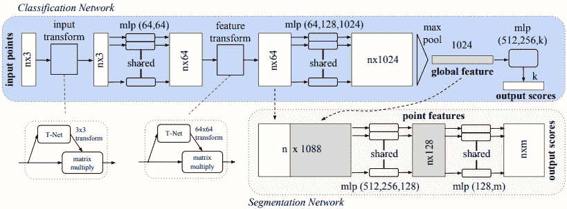

点网架构。资料来源:https://arxiv.org/abs/1612.00593

PointNet 是一个**多层感知器** ( **MLP** )。这是一个前馈网络，仅由完全连接的层组成(以及最大池，稍后将详细介绍)。我们提到过，输入点云矢量的集合 **p** *[i]* 被表示为一个 *n* × 3 张量。值得注意的是，网络(直到最大池层)是在集合的所有点之间共享的。也就是说，虽然输入大小是 *n* × 3，但是我们可以认为 PointNet 在大小为 1 × 3 的 *n* 个输入向量上应用了相同的网络 *n* 次。换句话说，网络权重在点云的所有点之间共享。这种顺序排列也允许任意数量的输入点。

输入通过输入变换(我们将在后面更详细地讨论)，输出另一个 *n* × 3 张量，其中每个 *n* 点由三个分量定义(类似于输入张量)。这个张量被馈送到一个上采样全连接层，该层将每个点编码为一个 64 维向量，用于 *n* × 64 输出。网络继续进行另一种变换，类似于输入变换。然后用 64、128、最后 1024 个完全连接的层对结果进行逐步上采样，以产生最终的 *n* × 1024 输出。该张量用作 max pooling 层的输入，该层在所有 *n* 个点中取相同位置的最大元素，并产生 1024 维输出向量。这个向量是整个点集的集合表示。

但是为什么首先要使用 max pooling 呢？请记住，最大池化是一种对称操作，也就是说，不管输入的顺序如何，它都会产生相同的输出。同时，点集也是无序的。使用最大池可确保无论点的顺序如何，网络都会产生相同的结果。该论文的作者选择了 max pooling 而不是其他对称函数，如 average pooling 和 sum，因为 max pooling 在基准数据集中表现出最高的准确性。

在最大池化之后，网络根据任务的类型分成两个网络(见上图):

*   **分类**:1024d 聚合向量作为几个全连接层的输入，以 *k* -way softmax 结束，其中 *k* 是类的数量。这是一个标准的分类管道。
*   **分段**:给集合中的每个点分配一个类别。作为分类网络的扩展，这项任务需要本地和全球知识的结合。如图所示，我们将每个 *n* 64D 中间点表示与全局 1024D 矢量连接起来，形成一个组合的 *n* × 1088 张量。像网络的初始段一样，该路径也在所有点之间共享。每个点的向量被下采样到 128D，具有一系列(1088 到 512，然后到 256，最后到 128)完全连接的层。最终的全连接层有 *m* 个单元(每个类一个)和 softmax 激活。

到目前为止，我们已经用 max pooling 操作明确地解决了输入数据的无序性质，但是我们仍然必须解决点之间的不变性和交互。这就是输入和特征转换将会有所帮助的地方。让我们从输入转换开始(在上图中，这是 T-net)。T-net 是一种 MLP，类似于全点网(它被称为迷你点网)，如下图所示:

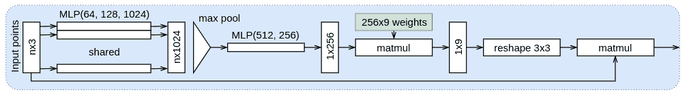

输入(和特征)转换 T 网

输入变换 T-net 将第 *n* × 3 组点作为输入(与整个网络相同的输入)。像完整的点网一样，T-网在所有点之间共享。首先，输入被上采样到 *n* × 1024，具有 64 个单元，然后是 128 个单元，最后是 1024 个单元的全连接层。上采样输出馈入最大池运算，输出 1 × 1024 矢量。然后，使用两个 512 单元和 256 单元的全连接层将矢量下采样至 1 × 256。1 × 256 向量乘以全局(共享)可学习权重的 256 × 9 矩阵。结果被整形为一个 3 × 3 的矩阵，在所有点上乘以原始输入点 **p** *[i]* 产生最终的 *n* × 3 输出张量。中间的 3 × 3 矩阵充当点集上的一种可学习的仿射变换矩阵。通过这种方式，点被归一化到网络的熟悉视角中，也就是说，网络在变换下保持不变。第二个 T-net(特征变换)几乎与第一个相同，除了输入张量是 *n* × 64，这产生了 64 × 64 的矩阵。

虽然全局最大池层确保网络不受数据顺序的影响，但它还有另一个缺点，因为它创建了整个输入点集的单一表示；但是，这些点可能属于不同的对象(例如，车辆和行人)。在这种情况下，全局聚合可能会有问题。为了解决这个问题，PointNet 的作者引入了 PointNet++(参见 *PointNet++:在【https://arxiv.org/abs/1706.02413】的[对度量空间](https://arxiv.org/abs/1706.02413)*中的点集进行深度分层特征学习)，这是一个分层的神经网络，它在输入点集的嵌套分区上递归地应用 PointNet。

在本节中，我们研究了 AV 环境感知系统中的 3D 数据处理。在下一节中，我们将把注意力转移到具有模仿驾驶策略的路径规划系统。


# 模仿驾驶政策

在 AV 系统的*组件*部分，我们概述了自动驾驶系统所必需的几个模块。在这一节中，我们将看看如何在 DL 的帮助下实现其中之一——驱动策略。一种方法是用 RL，汽车是代理，环境是环境。另一种流行的方法是**模仿学习**，其中模型(网络)学习模仿专家(人类)的动作。让我们来看看 AV 场景中模仿学习的属性:

*   我们将使用一种模仿学习，称为**行为克隆**。这仅仅意味着我们将以一种受监督的方式训练我们的网络。或者，我们可以在强化学习(RL)场景中使用模仿学习，这被称为反向 RL。
*   网络的输出是由期望的转向角和/或加速度或制动表示的驾驶策略。例如，我们可以有一个用于转向角的回归输出神经元和一个用于加速或制动的神经元(因为我们不能同时拥有两者)。
*   网络输入可以是以下任意一种:
    *   端到端系统的原始传感器数据，例如来自前置摄像头的图像。单个模型使用原始传感器输入并输出驾驶策略的 AV 系统被称为**端到端**。
    *   时序组合系统的中间层环境表示。
*   我们将在专家的帮助下创建训练数据集。我们将让专家在真实世界或模拟器中手动驾驶车辆。在旅程的每一步，我们将记录以下内容:
    *   环境的当前状态。这可能是原始传感器数据或自上而下的视图表示。我们将使用当前状态作为模型的输入。
    *   专家在当前环境状态下的行动(转向角和制动/加速)。这将是网络的目标数据。在训练过程中，我们将简单地使用熟悉的梯度下降来最小化网络预测和驾驶员行为之间的误差。这样，我们将教会网络模仿司机。

行为克隆场景如下图所示:

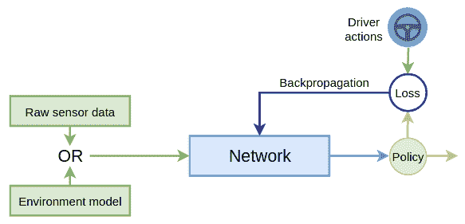

行为克隆场景

正如我们已经提到的，ALVINN(来自*AV 研究简史*部分)是一个端到端的行为克隆系统。最近，论文*自动驾驶汽车的端到端学习*([https://arxiv.org/abs/1604.07316](https://arxiv.org/abs/1604.07316))介绍了一个类似的系统，它使用一个具有五个卷积层的 CNN，而不是一个完全连接的网络。在他们的实验中，车辆上的前向摄像头的图像被输入到 CNN。CNN 的输出是一个单一的标量值，它代表汽车所需的转向角度。网络不控制加速和刹车。为了建立训练数据集，论文的作者收集了大约 72 小时的真实世界驾驶视频。在评估过程中，汽车在郊区 98%的时间里能够自动驾驶(不包括变道和从一条路转向另一条路)。此外，它还在多车道的高速公路上行驶了 16 公里，没有受到任何干扰。在下一节中，我们将实现一些有趣的东西——一个使用 PyTorch 的行为克隆示例。


# 用 PyTorch 进行行为克隆

在本节中，我们将使用 PyTorch 1.3.1 实现一个行为克隆示例。为了帮助我们完成这项任务，我们将使用 open ai Gym([https://gym.openai.com/](https://gym.openai.com/))，这是一个用于开发和比较强化学习算法的开源工具包。它允许我们教会**代理**承担各种任务，比如行走或者玩游戏，比如 Pong、Pinball、一些其他 Atari 游戏，甚至 Doom。

我们可以用`pip`来安装:

```py
pip install gym[box2d]
```

在本例中，我们将使用`CarRacing-v0` OpenAI Gym 环境，如下图所示:

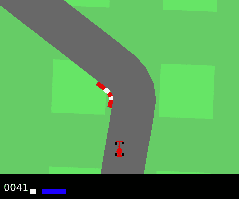

在 CarRacing-v0 环境中，代理是一辆赛车；整个过程都使用鸟瞰图

这个例子包含多个 Python 文件。在这一部分，我们将提到最重要的部分。完整源代码位于[https://github . com/packt publishing/Advanced-Deep-Learning-with-Python/tree/master/chapter 11/imitation _ Learning](https://github.com/PacktPublishing/Advanced-Deep-Learning-with-Python/tree/master/Chapter11/imitation_learning)。

目标是让红色赛车(称为代理)尽可能快地在赛道上行驶，而不会滑出路面。我们可以通过四个动作来控制汽车:加速、刹车、左转和右转。每个动作的输入都是连续的，例如，我们可以用值 1.0 指定全油门，用值 0.5 指定半油门(其他控件也是如此)。

为了简单起见，我们假设只能指定两个离散的动作值:0 表示无动作，1 表示全动作。因为，最初，这是一个 RL 环境，代理在沿着轨道前进的每一步都将获得奖励；然而，我们不会使用它，因为代理将直接从我们的动作中学习。我们将执行以下步骤:

1.  通过驾驶汽车在赛道上行驶来创建一个训练数据集(我们将使用键盘箭头来控制它)。换句话说，我们将成为代理试图模仿的专家。在这一集的每一步，我们将记录当前的游戏画面(状态)和当前按下的键，并将它们存储在一个文件中。这一步的完整代码可以在[https://github . com/packt publishing/Advanced-Deep-Learning-with-Python/blob/master/chapter 11/imitation _ Learning/keyboard _ agent . py](https://github.com/PacktPublishing/Advanced-Deep-Learning-with-Python/blob/master/Chapter11/imitation_learning/keyboard_agent.py)获得。你所要做的就是运行文件，游戏就会开始。播放时，剧集将被记录(每五集一次)在`imitation_learning/data/data.gzip`文件中。如果你想重新开始，你可以删除它。你可以通过按下*退出*退出游戏，并使用*空格键*暂停游戏。您也可以通过按 *Enter* 开始新的一集。在这种情况下，当前剧集将被丢弃，其序列将不会被存储。我们建议您至少播放 20 集，以获得足够大的训练数据集。最好多使用刹车，否则数据集会变得过于不平衡。在正常比赛中，加速比刹车或转向使用得更频繁。或者，如果你不想玩，GitHub 库已经包含了一个现有的数据文件。
2.  代理人由 CNN 代理。我们将使用刚刚生成的数据集以监督的方式训练它。输入将是单个游戏帧，输出将是转向方向和制动/加速度的组合。目标(标签)将是为操作员记录的动作。如果您想省略这一步，存储库已经有一个经过训练的 PyTorch 网络，位于[https://github . com/packt publishing/Advanced-Deep-Learning-with-Python/tree/master/chapter 11/imitation _ Learning/data/model . pt](https://github.com/PacktPublishing/Advanced-Deep-Learning-with-Python/tree/master/Chapter11/imitation_learning/data/model.pt)。
3.  让 CNN 代理通过使用网络输出来决定发送到环境的下一个动作。只需运行[https://github . com/packt publishing/Advanced-Deep-Learning-with-Python/blob/master/chapter 11/imitation _ Learning/nn _ agent . py](https://github.com/PacktPublishing/Advanced-Deep-Learning-with-Python/blob/master/Chapter11/imitation_learning/nn_agent.py)[文件即可。如果您没有执行前面两个步骤中的任何一个，这个文件将使用现有的代理。](https://github.com/PacktPublishing/Advanced-Deep-Learning-with-Python/blob/master/Chapter11/imitation_learning/nn_agent.py)

有了这些介绍，让我们继续准备训练数据集。


# 生成训练数据集

在这一节中，我们将了解如何生成一个训练数据集，并将其作为 PyTorch 的`torch.utils.data.DataLoader`类的实例进行加载。我们将强调代码中最相关的部分，但完整的源代码位于[https://github . com/packt publishing/Advanced-Deep-Learning-with-Python/blob/master/chapter 11/imitation _ Learning/train . py](https://github.com/PacktPublishing/Advanced-Deep-Learning-with-Python/blob/master/Chapter11/imitation_learning/train.py)。

我们将分几个步骤创建训练数据集:

1.  `read_data`函数读取两个`numpy`数组中的`imitation_learning/data/data.gzip`:一个用于游戏框架，另一个用于与它们相关的键盘组合。
2.  该环境接受由三元素数组组成的操作，其中下列情况为真:
    *   第一个元素的值在范围`[-1, 1]`内，代表转向角(`-1`代表右，`1`代表左)。
    *   第二个元素在`[0, 1]`范围内，代表油门。
    *   第三个元素在`[0, 1]` 范围内，代表制动力。
3.  我们将使用七个最常见的组合键:`[0, 0, 0]`表示无动作(汽车滑行)，`[0, 1, 0]`表示加速，`[0, 0, 1]`表示刹车，`[-1, 0, 0]`表示向左，`[-1, 0, 1]`表示向左和刹车的组合，`[1, 0, 0]`表示向右， `[1, 0, 1]`表示向右和刹车的组合。我们有意避免同时使用加速和向左或向右，因为赛车变得非常不稳定。其余的组合都不可信。`read_data`短语将把这些数组转换成从`0`到`6`的单个类标签。这样，我们将简单地解决一个包含七个类的分类问题。
4.  `read_data`函数也将平衡数据集。正如我们提到的，加速是最常见的组合键，而其他一些组合键，如刹车，是最罕见的。因此，我们将删除一些加速度样本，并乘以一些制动(和左/右+制动)。然而，作者通过尝试删除/倍增比率的多种组合，以启发式的方式做到了这一点，并选择了最有效的组合。如果您记录自己的数据集，您的驾驶风格可能会有所不同，您可能需要修改这些比率。

一旦我们有了训练样本的`numpy`数组，我们将使用`create_datasets`函数将它们转换成`torch.utils.data.DataLoader`实例。这些类只允许我们以小批量提取数据并应用数据扩充。

但是首先，让我们实现转换的`data_transform`列表，它在将图像馈送到网络之前修改图像。完整的实现可从[https://github . com/packt publishing/Advanced-Deep-Learning-with-Python/blob/master/chapter 11/imitation _ Learning/util . py](https://github.com/PacktPublishing/Advanced-Deep-Learning-with-Python/blob/master/Chapter11/imitation_learning/util.py)获得。我们将把图像转换成灰度，归一化`[0, 1]`范围内的颜色值，并裁剪框架的底部(黑色矩形，显示奖励和其他信息)。实现如下:

```py
data_transform = torchvision.transforms.Compose([
   torchvision.transforms.ToPILImage(),
    torchvision.transforms.Grayscale(1),
    torchvision.transforms.Pad((12, 12, 12, 0)),
    torchvision.transforms.CenterCrop(84),
    torchvision.transforms.ToTensor(),
    torchvision.transforms.Normalize((0,), (1,)),
])
```

接下来，让我们将注意力转移回`create_datasets`函数。我们从声明开始:

```py
def create_datasets():
```

然后，我们将实现`TensorDatasetTransforms`助手类，以便能够对输入图像应用`data_transform`变换。实现如下(请记住缩进，因为这段代码仍然是`create_datasets`函数的一部分):

```py
    class TensorDatasetTransforms(torch.utils.data.TensorDataset):
        def __init__(self, x, y):
            super().__init__(x, y)

        def __getitem__(self, index):
            tensor = data_transform(self.tensors[0][index])
            return (tensor,) + tuple(t[index] for t in self.tensors[1:])
```

接下来，我们将完整读取之前生成的数据集:

```py
    x, y = read_data()
    x = np.moveaxis(x, 3, 1)  # channel first (torch requirement)
```

然后，我们将创建训练和验证数据加载器(`train_loader`和`val_loader`)。最后，我们将把它们作为`create_datasets`函数的结果返回:

```py
    # train dataset
    x_train = x[:int(len(x) * TRAIN_VAL_SPLIT)]
    y_train = y[:int(len(y) * TRAIN_VAL_SPLIT)]

    train_set = TensorDatasetTransforms(torch.tensor(x_train), torch.tensor(y_train))

    train_loader = torch.utils.data.DataLoader(train_set, batch_size=BATCH_SIZE,
                                               shuffle=True, num_workers=2)

    # test dataset
    x_val, y_val = x[int(len(x_train)):], y[int(len(y_train)):]

    val_set = TensorDatasetTransforms(torch.tensor(x_val), torch.tensor(y_val))

    val_loader = torch.utils.data.DataLoader(val_set, batch_size=BATCH_SIZE,
                                             shuffle=False, num_workers=2)

    return train_loader, val_loader
```

接下来，我们来关注一下 agent NN 架构。


# 代理神经网络的实现

代理由具有以下属性的 CNN 表示:

*   单输入 84 × 84 切片。
*   三个卷积层，跨越下采样。
*   ELU 激活。
*   两个完全连接的层。
*   七个输出神经元(每个神经元一个)。
*   在每一层(甚至卷积层)之后应用批量标准化和剔除，以防止过度拟合。这项任务中的过度拟合被特别夸大了，因为我们不能使用任何有意义的数据增强技术。例如，假设我们随机水平翻转图像。在这种情况下，我们还必须更改标签以反转转向值。因此，我们将尽可能地依靠正规化。

以下代码块显示了网络实现:

```py
def build_network():
    return torch.nn.Sequential(
        torch.nn.Conv2d(1, 32, 8, 4),
        torch.nn.BatchNorm2d(32),
        torch.nn.ELU(),
        torch.nn.Dropout2d(0.5),
        torch.nn.Conv2d(32, 64, 4, 2),
        torch.nn.BatchNorm2d(64),
        torch.nn.ELU(),
        torch.nn.Dropout2d(0.5),
        torch.nn.Conv2d(64, 64, 3, 1),
        torch.nn.ELU(),
        torch.nn.Flatten(),
        torch.nn.BatchNorm1d(64 * 7 * 7),
        torch.nn.Dropout(),
        torch.nn.Linear(64 * 7 * 7, 120),
        torch.nn.ELU(),
        torch.nn.BatchNorm1d(120),
        torch.nn.Dropout(),
        torch.nn.Linear(120, len(available_actions)),
    )
```

实现了训练数据集和代理之后，我们可以继续进行训练了。


# 培养

我们将在`train`函数的帮助下实现训练本身，该函数将网络和`cuda`设备作为参数。我们将使用交叉熵损失和 Adam 优化器(分类任务的常用组合)。该函数简单地迭代`EPOCHS`次，并为每个时期调用`train_epoch`和`test`函数。以下是实现:

```py
def train(model: torch.nn.Module, device: torch.device):
    loss_function = torch.nn.CrossEntropyLoss()

    optimizer = torch.optim.Adam(model.parameters())

    train_loader, val_order = create_datasets()  # read datasets

    # train
    for epoch in range(EPOCHS):
        print('Epoch {}/{}'.format(epoch + 1, EPOCHS))

        train_epoch(model, device, loss_function, optimizer, train_loader)

        test(model, device, loss_function, val_order)

        # save model
        model_path = os.path.join(DATA_DIR, MODEL_FILE)
        torch.save(model.state_dict(), model_path)
```

然后，我们将为单个历元训练实现`train_epoch`。该函数迭代所有小型批处理，并对每个小型批处理执行向前和向后传递。以下是实现:

```py
def train_epoch(model, device, loss_function, optimizer, data_loader):
    model.train() # set model to training mode
    current_loss, current_acc = 0.0, 0.0

    for i, (inputs, labels) in enumerate(data_loader):
        inputs, labels = inputs.to(device), labels.to(device) # send to device

        optimizer.zero_grad() # zero the parameter gradients
        with torch.set_grad_enabled(True):
            outputs = model(inputs) # forward
            _, predictions = torch.max(outputs, 1)
            loss = loss_function(outputs, labels)

            loss.backward() # backward
            optimizer.step()

        current_loss += loss.item() * inputs.size(0) # statistics
        current_acc += torch.sum(predictions == labels.data)

    total_loss = current_loss / len(data_loader.dataset)
    total_acc = current_acc / len(data_loader.dataset)

    print('Train Loss: {:.4f}; Accuracy: {:.4f}'.format(total_loss, total_acc))

```

`train_epoch`和`test`函数类似于我们在[第 2 章](d94e220f-820e-40da-8bb5-9593e0790b21.xhtml)、*理解卷积网络*中为迁移学习代码示例实现的函数。为了避免重复，我们不会在这里实现`test`函数，尽管它可以在 GitHub 库中找到。

我们将运行大约 100 个时期的训练，但是对于快速实验，您可以将其缩短到 20 或 30 个时期。使用默认训练集，一个历元通常需要不到一分钟的时间。现在我们已经熟悉了培训，让我们看看如何使用代理 NN 在我们的模拟环境中驾驶赛车。


# 让代理开车

我们将从实现`nn_agent_drive`函数开始，该函数允许代理玩游戏(在[https://github . com/packt publishing/Advanced-Deep-Learning-with-Python/blob/master/chapter 11/imitation _ Learning/nn _ agent . py](https://github.com/PacktPublishing/Advanced-Deep-Learning-with-Python/blob/master/Chapter11/imitation_learning/nn_agent.py)中定义)。该函数将以初始状态(游戏画面)启动`env`环境。我们将把它作为网络的输入。然后，我们将把 softmax 网络输出从一键编码转换为基于数组的操作，并将它发送到环境中进行下一步。我们将重复这些步骤，直到这一集结束。`nn_agent_drive`功能还允许用户通过按下*退出*来退出。请注意，我们仍然使用与培训时相同的`data_transform`转换。

首先，我们将实现初始化部分，它绑定 *Esc* 键并初始化环境:

```py
def nn_agent_drive(model: torch.nn.Module, device: torch.device):
    env = gym.make('CarRacing-v0')

    global human_wants_exit  # use ESC to exit
    human_wants_exit = False

    def key_press(key, mod):
        """Capture ESC key"""
        global human_wants_exit
        if key == 0xff1b:  # escape
            human_wants_exit = True

    state = env.reset()  # initialize environment
    env.unwrapped.viewer.window.on_key_press = key_press
```

接下来，我们将实现主循环，其中代理(车辆)获取一个`action`，环境返回新的`state`，以此类推。这种动态反映在无限的`while`循环中(请注意缩进，因为这段代码仍然是`nn_agent_play`的一部分):

```py
    while 1:
        env.render()

        state = np.moveaxis(state, 2, 0) # channel first image
        state = torch.from_numpy(np.flip(state, axis=0).copy()) # np to tensor
        state = data_transform(state).unsqueeze(0) # apply transformations
        state = state.to(device) # add additional dimension

        with torch.set_grad_enabled(False): # forward
            outputs = model(state)

        normalized = torch.nn.functional.softmax(outputs, dim=1)

        # translate from net output to env action
        max_action = np.argmax(normalized.cpu().numpy()[0])
        action = available_actions[max_action]
        action[2] = 0.3 if action[2] != 0 else 0 # adjust brake power

        state, _, terminal, _ = env.step(action) # one step

        if terminal:
            state = env.reset()

        if human_wants_exit:
            env.close()
            return

```

我们现在已经有了运行程序的所有要素，我们将在下一节中进行操作。


# 把所有的放在一起

最后，我们可以运行整个程序。这方面的完整代码可以在[https://github . com/packt publishing/Advanced-Deep-Learning-with-Python/blob/master/chapter 11/imitation _ Learning/main . py](https://github.com/PacktPublishing/Advanced-Deep-Learning-with-Python/blob/master/Chapter11/imitation_learning/main.py)上找到。

以下代码片段构建并恢复(如果可用)网络，运行培训，并评估网络:

```py
# create cuda device
dev = torch.device("cuda:0" if torch.cuda.is_available() else "cpu")

# create the network
model = build_network()

# if true, try to restore the network from the data file
restore = False
if restore:
    model_path = os.path.join(DATA_DIR, MODEL_FILE)
    model.load_state_dict(torch.load(model_path))

# set the model to evaluation (and not training) mode
model.eval()

# transfer to the gpu
model = model.to(dev)

# train
train(model, dev)

# agent play
nn_agent_drive(model, dev)
```

虽然我们无法在这里展示代理的运行，但是您可以通过遵循本节中的说明来轻松地看到它的运行。尽管如此，我们可以说它学习得很好，能够定期(但不总是)在赛道上跑完整圈。有趣的是，网络的驾驶风格与生成数据集的操作员的风格非常相似。这个例子也表明，我们不应该低估监督学习。我们能够用一个小的数据集，在相对较短的训练时间内，创建一个表现良好的代理。

这样，我们就结束了我们的模仿学习例子。接下来，我们将讨论一个更复杂的驾驶策略算法，称为司机网。


# 司机网驾驶策略

在这一部分，我们将讨论最近一篇名为*司机网:通过模仿最好的和综合最差的*(【https://arxiv.org/abs/1812.03079】)来学习驾驶。它是由 AV 领域的领导者之一 Waymo 于 2018 年 12 月发布的。让我们看看 ChaffeurNet 模型的一些属性:

*   它是两个互联网络的结合。第一个是名为 FeatureNet 的 CNN，它从环境中提取特征。这些特征被输入到第二个循环网络，称为 AgentRNN，它决定了驾驶策略。
*   它以类似于我们在*模仿驾驶策略*一节中描述的算法的方式使用模仿监督学习。训练集是基于真实世界驾驶情节的记录生成的。司机网可以处理复杂的驾驶情况，比如变道、红绿灯、交通标志、从一条街换到另一条街等等。

本文由 Waymo 在 arxiv.org 发布，仅供参考。Waymo 和 arxiv.org 没有关系，也不支持这本书或作者。

我们将从输入和输出数据表示开始讨论 drick net。


# 输入和输出表示

端到端方法将原始传感器数据(例如，摄像机图像)提供给 ML 算法(NN)，后者进而产生驾驶策略(转向角和加速度)。相比之下，司机网使用我们在 AV 系统章节的*组件中介绍的中级输入和输出。让我们先看看 ML 算法的输入。这是一系列自上而下(鸟瞰)400 × 400 的图像，类似于`CarRacing-v0`环境的图像，但要复杂得多。一个时刻 *t* 由多个图像表示，每个图像包含不同的环境元素。*

我们可以在下图中看到一个司机网络输入/输出组合的示例:

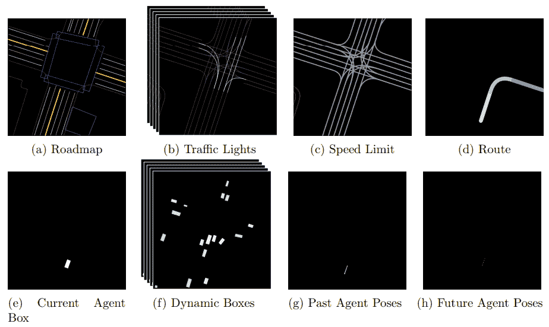ChauffeurNet inputs. Source: https://arxiv.org/abs/1812.03079

让我们按字母顺序看一下输入元素((a)到(g)):

*   (a)是路线图的精确表示。它是一个 RGB 图像，使用不同的颜色来表示各种道路特征，如车道、人行横道、交通标志和路缘。
*   (b)是交通灯的灰度图像的时间序列。与(a)的特征不同，交通灯是动态的——也就是说，它们在不同的时间可以是绿灯、红灯或黄灯。为了恰当地传达它们的动态，该算法使用一系列图像，显示过去 *T [场景]秒到当前时刻每个车道的交通灯状态。每个图像中的线条颜色代表每个交通灯的状态，其中最亮的颜色是红色，中间颜色是黄色，最暗的颜色是绿色或未知。*
*   (c)是具有每个车道的已知速度限制的灰度图像。不同的颜色强度代表不同的速度限制。
*   (d)是起点和终点之间的预定路线。把它想象成谷歌地图生成的方向。
*   (e)是代表代理当前位置的灰度图像(显示为白色框)。
*   (f)是灰度图像的时间序列，表示环境的动态元素(显示为方框)。这些可能是其他车辆、行人或骑自行车的人。随着这些物体随时间改变位置，该算法用一系列快照图像来传达它们的轨迹，代表它们在最后 *T [场景]秒的位置。这与交通灯(b)的工作方式相同。*
*   (g)是过去 *T [姿势]秒直到当前时刻的代理轨迹的单个灰度图像。代理位置在图像上显示为一系列点。请注意，我们在单个图像中显示它们，而不是像其他动态元素那样按时间顺序显示。在时刻 *t* 的代理用属性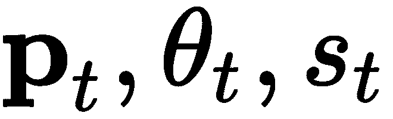表示在相同的自顶向下的环境中，其中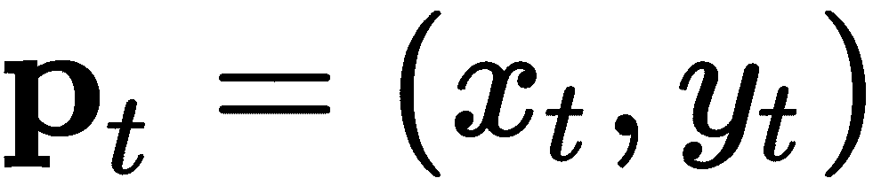是坐标，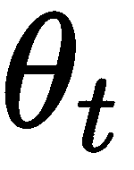是方向(或航向)，而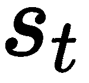是速度。*
*   (h)是算法中层输出:代理的未来轨迹，用一系列点表示。这些点与过去的轨迹(g)具有相同的含义。在时间 *t+1* 的未来位置输出是通过使用直到当前时刻 *t 的过去轨迹(g)产生的。*我们将司机网表示为:

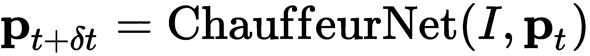

这里， *I* 是所有前面的输入图像，**p***t*是时间 *t* 处的代理位置， *δt* 是 0.2 s 的时间增量。 *δt* 的值是任意的，由论文作者选择。一旦我们有了 *t+δt* ，我们可以将它添加到过去的轨迹(g)中，并且我们可以使用它以循环的方式在步骤 *t+2δt* 中生成下一个位置。新生成的轨迹被馈送到车辆的控制模块，该控制模块通过车辆控制(转向、加速和制动)尽力执行该轨迹。

正如我们在 AV 系统部分的*组件中提到的，这种中间层输入表示允许我们轻松使用不同来源的训练数据。它可以通过融合车辆传感器输入(如相机和激光雷达)和地图数据(如街道、交通灯、交通标志等)从真实世界驾驶中生成。但是我们也可以用模拟环境生成相同格式的图像。这同样适用于中级输出，其中控制模块可以连接到各种类型的物理车辆或模拟车辆。使用模拟可以从现实世界中很少发生的情况中学习，例如紧急制动甚至撞车。为了帮助代理了解这种情况，论文的作者使用模拟明确地合成了多个罕见的场景。*

现在我们已经熟悉了数据表示，让我们将注意力转移到模型的核心组件上。


# 模型架构

下图说明了司机网模型架构:

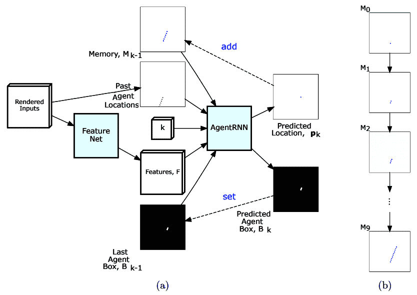

(a)司机网架构和(b)迭代过程中的内存更新来源:https://arxiv.org/abs/1812.03079

首先，我们有 FeatureNet(在上图中，用(a)标记)。这是一个具有剩余连接的 CNN，其输入是我们在*输入和输出表示*部分看到的自上而下的图像。FeatureNet 的输出是一个特征向量 *F* ，它表示合成网络对当前环境的理解。该向量用作循环网络 AgentRNN 的输入之一，循环网络 agent rnn 迭代地预测驾驶轨迹中的连续点。假设我们想要预测代理在步骤 *k* 的轨迹的下一个点。在这种情况下，AgentRNN 有以下输出:

*   **p** *[k]* 为该步行驶轨迹的预测下一点。从图中我们可以看到，AgentRNN 的输出实际上是一个热图，其尺寸与输入图像相同。它表示空间坐标上的概率分布 *P [k] (x，y)* ，表示热点图的每个单元(像素)上的下一个航点的概率。我们使用`arg-max`操作从该热图中获得粗略的姿态预测 **p** *[k]* 。
*   *B [k]*
*   还有两个额外的输出没有显示在图中:*θ[k]用于代理的航向(或方向)和*s[k]用于期望的速度。**

drick net 还包括一个附加内存，用 *M* 表示(在上图中，用(b)表示)。 *M* 是我们在*输入和输出表示*部分定义的单通道输入图像(g)。它代表航路点预测( **p** *[k，]***p***[k-1]，....，***p***[0]*)过去的步骤 *k* 。当前航路点 **p** *[k]* 在每一步都被添加到内存中，如上图所示。

输出 **p** *[k]* 和 *B [k]* 作为输入递归反馈到 AgentRNN，用于下一步 *k+1* 。AgentRNN 输出的公式如下:

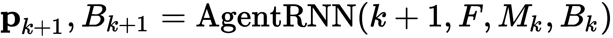

接下来，让我们检查一下 drick net 如何集成到顺序 AV 管道中:

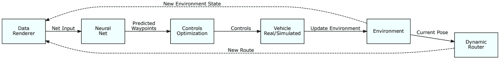

ChauffeurNet within the full end-to-end driving pipeline. Source: https://arxiv.org/abs/1812.03079

该系统类似于我们在 AV 系统部分的*组件中介绍的反馈回路。让我们看看它的组成部分:*

*   **数据呈现器**:接收来自环境和动态路由器的输入。它的作用是将这些信号转换成我们在*输入和输出表示*部分定义的自上而下的输入图像。
*   **动态路由器**:根据代理是否能够到达之前的目标坐标，提供动态更新的预定路线。把它想象成一个导航系统，你输入一个目的地，它就给你提供到达目的地的路线。您开始在这条路线上导航，如果您偏离了这条路线，系统将根据您的当前位置和目的地动态计算出一条新路线。
*   **神经网络**:司机网络模块，输出期望的未来轨迹。
*   **控制优化**:接收未来轨迹，并将其转化为驱动车辆的低级控制信号。

司机网是一个相当复杂的系统，所以现在让我们看看如何训练它。


# 培养

使用模仿监督学习，用 3000 万个专家驾驶示例训练了司机网。模型输入是我们在*输入和输出表示*部分定义的自上而下的图像，如下图所示:


The image is best viewed in color. Source: https://arxiv.org/abs/1812.03079

接下来，我们来看看司机网培训流程的组成部分:

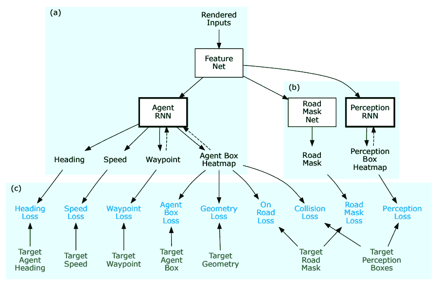ChauffeurNet training components: (a) the model itself, (b) the additional networks, and (c) the losses. Source: https://arxiv.org/abs/1812.03079

我们已经熟悉了 drick net 模型本身(在上图中标记为(a))。让我们重点关注流程中涉及的另外两个网络(在上图中标为(b):

*   **道路遮罩** N **et** :输出一个分割遮罩，该遮罩包含当前输入图像上道路表面的准确区域。为了更好地理解这一点，下图展示了目标道路掩膜(左)和网络的预测道路掩膜(右):

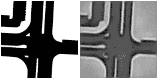

Source: https://arxiv.org/abs/1812.03079

*   **PerceptionRNN** :输出一个分段蒙版，其中包含环境中所有其他动态对象(车辆、骑自行车的人、行人等)的预测未来位置。下图显示了 PerceptionRNN 的输出，其中显示了其他车辆的预测位置(浅色矩形):

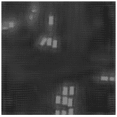

Source: https://arxiv.org/abs/1812.03079

这些网络不参与最终的车辆控制，仅在训练期间使用。使用它们的目的是，与简单地从 AgentRNN 获得反馈相比，如果 FeatureNet 网络从树任务(AgentRNN、Road Mask Net 和 PerceptionRNN)获得反馈，它将学习更好的表示。

现在，让我们把重点放在各种损失函数上(司机网模式的底部部分(c))。我们将从模拟损失开始，它反映了未来代理位置的模型预测如何不同于人类专家的基本事实。下表显示了 AgentRNN 输出及其相应的损失函数:

*   预测航点 **p** *[k]* 的空间坐标上的概率分布 *P [k] (x，y)* 。我们将使用以下损失来训练该组件:

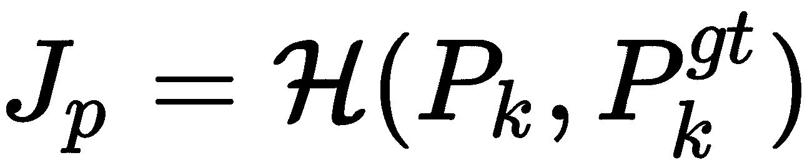

这里，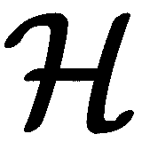是交叉熵损失，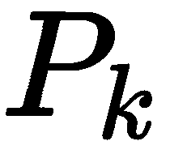是预测分布，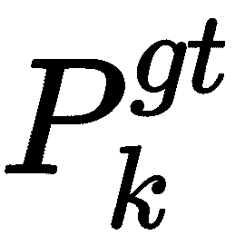是地面真值分布。

*   代理包围盒的热图*B[k]。我们可以用以下损失来训练它(沿着热图的单元格应用):*

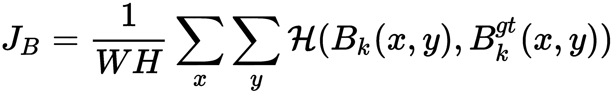

这里， *W* 和 *H* 是输入图像尺寸，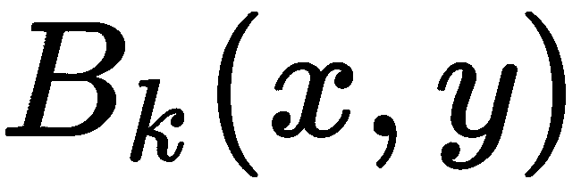是预测热图，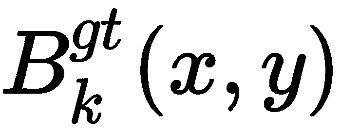是地面真实热图。

*   代理*θ[k]的航向(方位)有以下损失:*

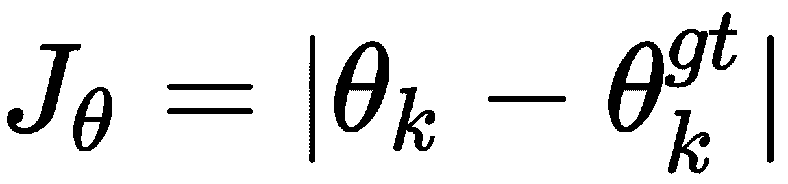

这里，*θ[k]是预测方位，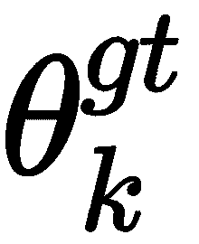是地面真实方位。*

该论文的作者还介绍了过去的议案辍学。我们可以引用这篇论文来最好地解释这一点:

在训练期间，向模型提供过去的运动历史作为输入之一(在部分*输入和输出表示*中模式的图像(g))。由于训练期间过去的运动历史来自专家演示，网络可以通过仅仅从过去推断而不是找到行为的潜在原因来学习“欺骗”。在闭环推理过程中，这一点会被打破，因为过去的历史来自网络自己过去的预测。例如，这种经过训练的网络可以学习，如果它在过去的历史中看到减速，则只为停止标志而停止，因此在闭环推断期间，将永远不会为停止标志而停止。为了解决这个问题，我们在过去的姿态历史上引入一个丢弃，其中对于 50%的例子，我们只保留输入数据的过去代理姿态通道中代理的当前位置 *(u [0] ，v [0] )* 。这迫使网络查看环境中的其他线索，以解释训练示例中的未来运动轮廓。

他们还观察到，当驾驶情况与专家驾驶训练数据没有明显差异时，模仿学习方法效果很好。然而，代理人必须为许多不属于训练范围的驾驶情况做好准备，例如碰撞。如果代理只依赖于训练数据，它将不得不隐式地学习冲突，这并不容易。为了解决这个问题，本文提出了最重要情况下的显式损失函数。其中包括以下内容:

*   **航路点损失**:地面真实与预测的代理未来位置*p[k]之间的误差。*
*   **速度损失**:地面真实值与预测的代理未来速度之间的误差*s[k]。*
*   **航向损失**:地面真实与预测的代理未来方向的误差*θ[k]。*
*   **Agent-box loss** :地面真实与预测的 Agent 包围盒*B[k]之间的误差。*
*   **几何损失**:强制代理明确跟随目标轨迹，与速度曲线无关。
*   **路上损失**:迫使代理只在路面区域导航，避开环境中的非路面区域。如果代理的预测边界框与道路掩膜网络预测的图像的非道路区域重叠，这种损失将会增加。
*   **碰撞损失**:明确强制代理避免碰撞。如果代理的预测边界框与环境中任何其他动态对象的边界框重叠，这种损失将会增加。

ChauffeurNet performed well in various real-world driving situations. You can see some of the results at [https://medium.com/waymo/learning-to-drive-beyond-pure-imitation-465499f8bcb2](https://medium.com/waymo/learning-to-drive-beyond-pure-imitation-465499f8bcb2).


# 摘要

在这一章中，我们探索了深度学习在 AVs 中的应用。我们从 AV 研究的简要历史概述开始，讨论了不同层次的自主性。然后，我们描述了 AV 系统的组件，并确定了何时适合使用 DL 技术。接下来，我们看了 3D 数据处理和 PointNet。然后，我们介绍了使用行为克隆实现驾驶策略的主题，并用 PyTorch 实现了一个模仿学习示例。最后，我们看了一下 Waymo 的司机网系统。

这一章结束了我们的书。我希望你喜欢这本书！*