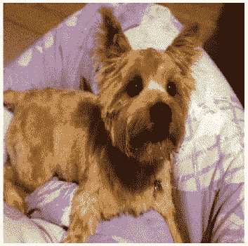
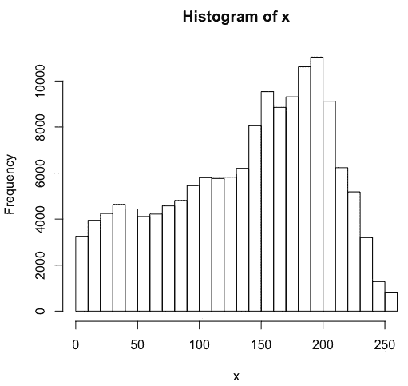
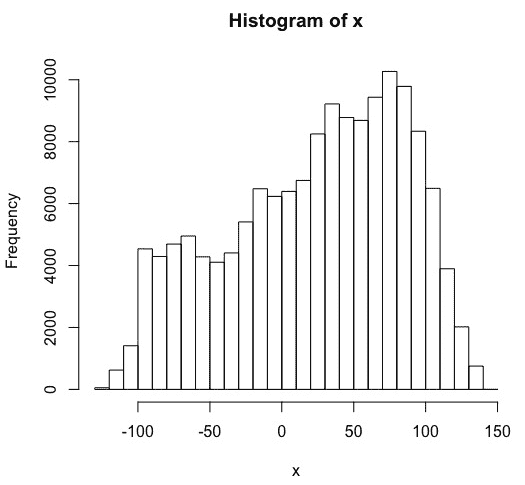
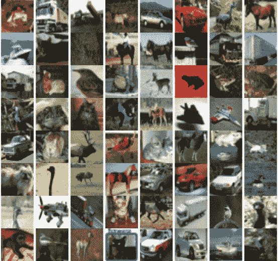
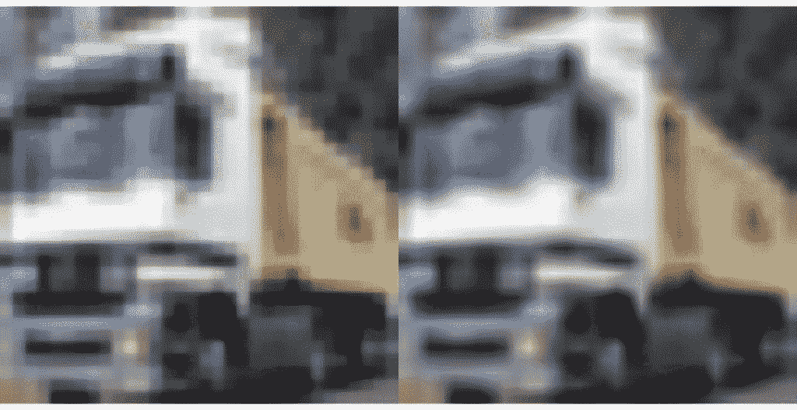
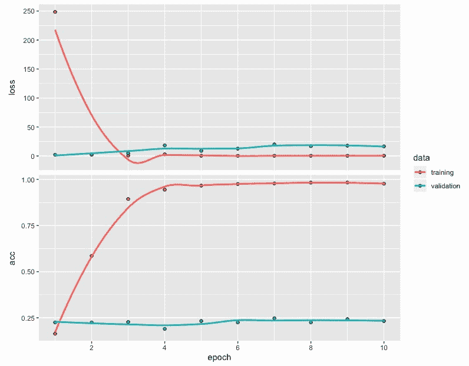
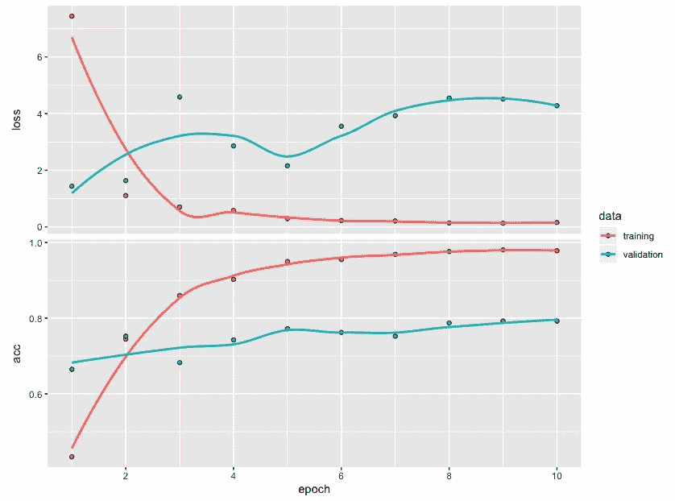
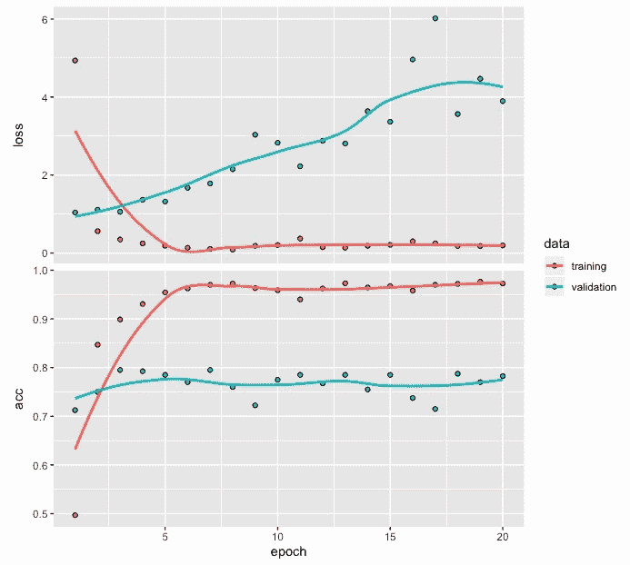
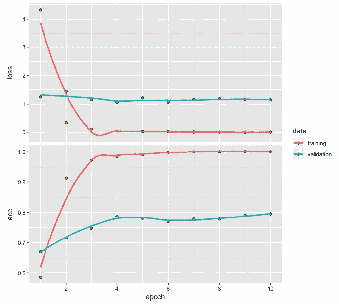

# 七、基于迁移学习的小数据图像分类

在前面的章节中，我们开发了深度学习网络，并探索了与图像数据相关的各种应用示例。与我们将在本章讨论的内容相比，一个主要的区别是，在前面的章节中，我们从头开始开发模型。

迁移学习可以被定义为一种方法，在这种方法中，我们重用经过训练的深度网络所学的知识来解决一个新的但相关的问题。例如，我们可能能够重复使用一个深度学习网络来分类数千种不同的时尚物品，以开发一个深度网络来分类三种不同类型的服装。这种方法类似于我们在现实生活中观察到的情况，老师将多年来获得的知识或学习传授给学生，教练将学习或经验传授给新球员。另一个例子是，学习骑自行车被转化为学习骑摩托车，这反过来对学习如何驾驶汽车变得有用。

在本章中，我们将在开发图像分类模型时利用预训练的深度网络。预训练模型允许我们将我们从更大的数据集中学到的有用特征转移到我们有兴趣用有点类似但新的相对较小的数据集开发的模型中。预训练模型的使用不仅允许我们克服由于数据集小而导致的问题，而且有助于减少开发模型的时间和成本。

为了说明预训练图像分类模型的使用，在本章中，我们将讨论以下主题:

*   使用预训练模型来识别图像
*   使用 CIFAR10 数据集
*   基于 CNN 的图像分类
*   使用预训练的 RESNET50 模型对图像进行分类
*   模型评估和预测
*   性能优化技巧和最佳实践


# 使用预训练模型来识别图像

在我们继续之前，让我们加载本节需要的三个包:

```r
# Libraries used
library(keras)
library(EBImage)
library(tensorflow)
```

Keras 和 TensorFlow 库将用于开发预训练图像分类模型，而 EBImage 库将用于处理和可视化图像数据。

在 Keras 中，以下预训练图像分类模型可用:

*   例外
*   VGG16
*   VGG19
*   ResNet50
*   InceptionV3
*   InceptionResNetV2
*   MobileNet
*   MobileNetV2
*   DenseNet
*   纳斯网

这些预训练的模型在来自 ImageNet([http://www.image-net.org/](http://www.image-net.org/))的图像上进行训练。ImageNet 是一个巨大的图像数据库，包含几百万张图像。

我们将从使用被称为`resnet50`的预训练模型来识别图像开始。下面是我们可以用来利用这个预训练模型的代码:

```r
# Pretrained model
pretrained <- application_resnet50(weights = "imagenet")
summary(pretrained)
```

这里，我们将`weights`指定为`"imagenet"`。这使得我们可以重复使用 RESNET50 网络的预训练权重。RESNET50 是深度为 50 层的深度残差网络，包括卷积神经网络层。请注意，如果我们只想使用没有预训练权重的模型架构，并且希望从头开始训练，那么我们可以将`weights`指定为`null`。通过使用`summary`，我们可以获得 RESNET50 网络的架构。但是，为了节省空间，我们不提供摘要的任何输出。该网络中的参数总数为 25，636，712。RESNET50 网络在使用来自 ImageNet 的 100 多万幅图像方面接受了培训，并有能力将图像分为 1，000 个不同的类别。


# 读取图像

我们先来读一个 RStudio 里的一只狗的图像。以下代码加载一个图像文件，然后获取相应的输出:

使用 RESNET50 网络时，允许的最大目标大小是 224 x 224，允许的最小目标大小是 32 x 32。

```r
# Read image data
setwd("~/Desktop")
img <- image_load("dog.jpg", target_size = c(224,224))
x <- image_to_array(img)
str(x)
OUTPUT
num [1:224, 1:224, 1:3] 70 69 68 73 88 79 18 22 21 20 ...

# Image plot
plot(as.raster(x, max = 255))  

# Summary and histogram
summary(x)
OUTPUT
 Min. 1st Qu. Median Mean 3rd Qu. Max. 
 0.0 89.0 150.0 137.7 190.0 255.0 
hist(x)
```

在前面的代码中，我们可以观察到以下情况:

*   使用 Keras 的`image_load()`功能，从 224 x 224 大小的电脑桌面上加载一张诺里奇梗狗的图片。
*   请注意，原始图像的大小可能不是 224 x 224。然而，在加载图像的时候指定这个维度允许我们容易地调整原始图像的大小，以便它具有新的维度。
*   使用`image_to_array()`函数将该图像转换成一个数字数组。该阵列的结构显示了 224×224×3 的尺寸。
*   该数组的摘要显示它包含 0 到 255 之间的数字。

以下是诺威奇梗犬的 224 x 224 彩色图片。这可以使用 plot 命令获得:



上图是一只诺威奇梗犬坐着向前看的照片。我们将利用这张图片，检查 RESNET50 模型是否能准确预测图片中狗的类型。

由数组中的值生成的直方图如下:



阵列中前面的直方图值显示强度值的范围从 0 到 255，大多数值集中在 200 左右。接下来，我们将预处理图像数据。该直方图可用于比较图像数据的结果变化。


# 预处理输入

现在，我们可以对输入进行预处理，使其可以用于预训练的 RESNET50 模型。预处理数据的代码如下:

```r
# Preprocessing of input data
x <- array_reshape(x, c(1, dim(x))) 
x <- imagenet_preprocess_input(x)
hist(x)
```

在前面的代码中，我们可以观察到以下情况:

*   在应用`array_reshape()`函数后，数组的尺寸将变为 1 x 224 x 224 x 3。
*   我们使用了`imagnet_preprocess_input()`函数，使用预先训练的模型以所需的格式准备数据。

预处理后直方图形式的数据图如下:



预处理后的直方图显示了位置的移动。现在大部分数值都集中在 50 到 100 之间。但是，直方图的整体模式没有重大变化。


# 五大类别

现在，我们可以通过提供预处理的图像数据作为输入，使用预训练的模型来进行预测。实现这一点的代码如下:

```r
# Predictions for top 5 categories
preds <- pretrained %>% predict(x)
imagenet_decode_predictions(preds, top = 5)[[1]]
Output
  class_name  class_description       score
1  n02094258    Norwich_terrier 0.769952953
2  n02094114    Norfolk_terrier 0.126662806
3  n02096294 Australian_terrier 0.046003290
4  n02096177              cairn 0.040896162
5  n02093991      Irish_terrier 0.005021056
```

在前面的代码中，我们可以观察到以下情况:

*   预测是使用`predict`函数进行的，包含 1000 个不同类别的概率，其中概率最高的五个类别是使用`imagenet_decode_predictions()`函数获得的。
*   大约 0.7699 的最高分正确地识别出该图片是诺威奇梗狗。
*   第二高的分数是诺福克梗狗，它看起来很像诺里奇梗狗。
*   预测还表明，照片可能是另一种类型的梗狗；然而，这些概率相对较小或可以忽略不计。

在下一节中，我们将着眼于更大的图像数据集而不是单个图像，并使用预训练网络来开发图像分类模型。


# 使用 CIFAR10 数据集

为了说明预训练模型与新数据的使用，我们将使用 CIFAR10 数据集。CIFAR 代表*加拿大高级研究所*，10 指的是数据中包含的 10 类图像。CIFAR10 数据集是 Keras 库的一部分，获取它的代码如下:

```r
# CIFAR10 data
data <- dataset_cifar10()
str(data)
OUTPUT
List of 2
 $ train:List of 2
  ..$ x: int [1:50000, 1:32, 1:32, 1:3] 59 154 255 28 170 159 164 28 134 125 ...
  ..$ y: int [1:50000, 1] 6 9 9 4 1 1 2 7 8 3 ...
 $ test :List of 2
  ..$ x: int [1:10000, 1:32, 1:32, 1:3] 158 235 158 155 65 179 160 83 23 217 ...
  ..$ y: num [1:10000, 1] 3 8 8 0 6 6 1 6 3 1 ...
```

在前面的代码中，我们可以观察到以下情况:

*   我们可以使用`dataset_cifar10()`函数读取数据集。
*   数据的结构显示，有 50，000 个带标签的训练图像可用。
*   它还包含 10，000 张带标签的测试图像。

接下来，我们将使用以下代码从 CIFAR10 中提取训练和测试数据:

```r
# Partitioning the data into train and test
trainx <- data$train$x       
testx <- data$test$x
trainy <- to_categorical(data$train$y, num_classes = 10)
testy <- to_categorical(data$test$y, num_classes = 10)

table(data$train$y)
OUTPUT
   0    1    2    3    4    5    6    7    8    9 
5000 5000 5000 5000 5000 5000 5000 5000 5000 5000 

table(data$test$y)
OUTPUT
   0    1    2    3    4    5    6    7    8    9 
1000 1000 1000 1000 1000 1000 1000 1000 1000 1000 

```

从前面的代码中，我们可以观察到以下内容:

*   我们在`trainx`中保存训练图像数据，在`testx`中保存测试图像数据。
*   我们还使用`to_categorical()`函数对训练和测试数据标签进行一次性编码，并将结果分别保存在`trainy`和`testy`中。
*   训练数据的表格表明图像被分为 10 个不同的类别，每个类别正好包含 5，000 幅图像。
*   类似地，测试数据包含 10 个类别中每一个类别的 1000 幅图像。

例如，可以使用以下代码获得训练数据中前 64 个图像的标签:

```r
# Category Labels
data$train$y[1:64,]
 [1] 6 9 9 4 1 1 2 7 8 3 4 7 7 2 9 9 9 3 2 6 4 3 6 6 2 6 3 5 4 0 0 9 1
[34] 3 4 0 3 7 3 3 5 2 2 7 1 1 1 2 2 0 9 5 7 9 2 2 5 2 4 3 1 1 8 2
```

正如我们所看到的，每张图片都用 0 到 9 之间的数字进行标记。下表描述了 10 种不同类别的图像:

| 标签 | 描述 |
| --- | --- |
| 0 | 飞机 |
| 一 | 汽车 |
| 2 | 伯德 |
| 3 | 猫 |
| 四 | 鹿 |
| 5 | 狗 |
| 6 | 青蛙 |
| 七 | 马 |
| 8 | 船 |
| 9 | 卡车 |

请注意，这 10 个类别之间没有重叠。例如，汽车类别指轿车和 SUV，而卡车类别仅指大型卡车。

样本图像


# CIFAR10 的训练数据中的前 64 个图像可以使用以下代码绘制。这样，我们可以对数据集中包含的图像类型有所了解:

CIFAR10 的图像都是 32 x 32 的彩色图像。下图显示了 8 x 8 网格中的 64 幅图像:

```r
# Plot of first 64 pictures
par(mfrow = c(8,8), mar = rep(0, 4))
for (i in 1:64) plot(as.raster(trainx[i,,,], max = 255))
par(mfrow = c(1,1))
```



从前面的图像中，我们可以看到这些图像具有各种背景，并且分辨率较低。此外，有时这些图像并不完全可见，这使得图像分类成为一项具有挑战性的任务。

预处理和预测


# 我们可以使用预训练的 RESNET50 模型来识别训练数据中的第二个图像。请注意，由于定型数据中的第二个图像大小为 32 x 32，而 RESNET50 是在大小为 224 x 224 的图像上定型的，因此我们需要在应用之前使用的代码之前调整图像的大小。以下代码用于识别图像:

从前面的代码中，我们可以观察到得分为 0.9988 的顶级类别是针对移动货车的。其他四个类别的分数相对来说可以忽略不计。

```r
# Pre-processing and prediction
x <- resize(trainx[2,,,], w = 224, h = 224)
x <- array_reshape(x, c(1, dim(x)))
x <- imagenet_preprocess_input(x)
preds <- pretrained %>% predict(x)
imagenet_decode_predictions(preds, top = 5)[[1]]
OUTPUT
  class_name class_description        score
1  n03796401        moving_van 9.988740e-01
2  n04467665     trailer_truck 7.548324e-04
3  n03895866     passenger_car 2.044246e-04
4  n04612504              yawl 2.441246e-05
5  n04483307          trimaran 1.862814e-05
```

基于 CNN 的图像分类


# 在本节中，我们将使用 CIFAR10 数据集的一个子集来开发一个基于卷积神经网络的图像分类模型，并评估其分类性能。

数据准备


# 我们将通过仅使用来自 CIFAR10 的训练和测试数据中的前 2，000 个图像来保持较小的数据大小。这将允许图像分类模型在普通计算机或笔记本电脑上运行。我们还将调整训练和测试图像的大小，从 32 x 32 维调整到 224 x 224 维，以便能够比较训练前模型的分类性能。下面的代码包含了我们在本章前面讨论过的必要的预处理:

在前面的代码中，在将尺寸从 32 x 32 调整到 224 x 224 时，我们使用了双线性插值，这是 EBImage 包的一部分。双线性插值将线性插值扩展到两个变量，在这种情况下是图像的高度和宽度。从下图所示的卡车前后图像中可以观察到双线性插值的效果:

```r
# Selecting first 2000 images
trainx <- data$train$x[1:2000,,,] 
testx <- data$test$x[1:2000,,,] 

# One-hot encoding
trainy <- to_categorical(data$train$y[1:2000,], num_classes = 10)
testy <- to_categorical(data$test$y[1:2000,] , num_classes = 10)

# Resizing train images to 224x224
x <- array(rep(0, 2000 * 224 * 224 * 3), dim = c(2000, 224, 224, 3))
for (i in 1:2000) { x[i,,,] <- resize(trainx[i,,,], 224, 224) }

# Plot of before/after resized image
par(mfrow = c(1,2), mar = rep(0, 4))  
plot(as.raster(trainx[2,,,], max = 255))
plot(as.raster(x[2,,,], max = 255))
par(mfrow = c(1,1))

trainx <- imagenet_preprocess_input(x)

# Resizing test images to 224x224
x <- array(rep(0, 2000 * 224 * 224 * 3), dim = c(2000, 224, 224, 3))
for (i in 1:2000) { x[i,,,] <- resize(testx[i,,,], 224, 224) }
testx <- imagenet_preprocess_input(x)
```



这里，我们可以看到，与原始图像(第一幅图像)相比，后一幅图像(第二幅图像)看起来更平滑，因为它包含更多的像素。

CNN 模型


# 我们将从使用不太深的卷积神经网络来开发图像分类模型开始。为此，我们将使用以下代码:

从前面的代码中，我们可以观察到以下内容:

```r
# Model architecture
model <- keras_model_sequential()
model %>% 
  layer_conv_2d(filters = 32, kernel_size = c(3,3), activation = 'relu', 
                input_shape = c(224,224,3)) %>%   
  layer_conv_2d(filters = 32, kernel_size = c(3,3), activation = 'relu') %>%  
  layer_max_pooling_2d(pool_size = c(2,2)) %>% 
  layer_dropout(rate = 0.25) %>%   
  layer_flatten() %>% 
  layer_dense(units = 256, activation = 'relu') %>%  
  layer_dropout(rate = 0.25) %>% 
  layer_dense(units = 10, activation = 'softmax') 
summary(model)
_________________________________________________________________________
Layer (type)                    Output Shape                Param # 
=========================================================================
conv2d_6 (Conv2D)               (None, 222, 222, 32)         896 
_________________________________________________________________________
conv2d_7 (Conv2D)               (None, 220, 220, 32)         9248 
_________________________________________________________________________
max_pooling2d_22 (MaxPooling2D) (None, 110, 110, 32)          0 
_________________________________________________________________________
dropout_6 (Dropout)             (None, 110, 110, 32)          0 
_________________________________________________________________________
flatten_18 (Flatten)            (None, 387200)                0 
__________________________________________________________________________
dense_35 (Dense)                (None, 256)                99123456 
__________________________________________________________________________
dropout_7 (Dropout)             (None, 256)                   0 
__________________________________________________________________________
dense_36 (Dense)                (None, 10)                   2570 
==========================================================================
Total params: 99,136,170
Trainable params: 99,136,170
Non-trainable params: 0
___________________________________________________________________________________________

# Compile
model %>% compile(loss = 'categorical_crossentropy',
 optimizer = 'rmsprop', 
 metrics = 'accuracy')

# Fit
model_one <- model %>% fit(trainx, 
                         trainy, 
                         epochs = 10, 
                         batch_size = 10, 
                         validation_split = 0.2)
```

该网络的参数总数为 99，136，170。

*   在编译模型时，我们使用`categorical_crossentropy`作为损失函数，因为响应有 10 个类别。
*   对于优化器，我们指定了`rmsprop`，这是一种基于梯度的优化方法，是一种流行的选择，可以提供相当好的性能。
*   我们用 10 个时期和 10 个批量来训练模型。
*   在训练数据的 2，000 幅图像中，20%(或 400 幅图像)用于评估验证误差，剩余的 80%(或 1，600 幅图像)用于训练。
*   `model_one`训练模型后的精度和损失值的曲线图如下:



从前面的图中，可以得出以下观察结果:

准确度和损失值的图显示，在大约 4 个时期后，训练和验证数据的损失和准确度值或多或少保持恒定。

*   尽管训练数据的准确度达到接近 100%的高值，但是基于验证数据中的图像，似乎对准确度没有影响。
*   此外，训练和验证数据的准确性之间的差距似乎很大，这表明存在过度拟合。在评估该模型的性能时，我们预计该模型在图像分类方面的准确性较低。
*   请注意，使用 CNN 开发一个像样的图像分类模型需要大量的图像进行训练，因此需要更多的时间和资源。在本章的后面，我们将学习如何使用预训练网络来帮助我们克服这个问题。不过，现在让我们继续评估图像分类模型的性能。

模型性能


# 为了评估模型的性能，我们将对训练和测试数据的损失、准确性和混淆矩阵进行计算。

使用训练数据的性能评估


# 基于训练数据获得损失、准确度和混淆矩阵的代码如下:

在这里，我们可以看到训练数据的损失和准确度值分别是 3.335 和 0.846。混淆矩阵显示了基于训练数据的不错的结果。然而，对于某些类型的图像，错误分类率很高。例如，来自类别 7(马)的 12 幅图像被错误分类为类别 9(卡车)。同样，分别属于类别 6(青蛙)和类别 8(船)的 11 幅图像也被误划为类别 9(卡车)。

```r
# Loss and accuracy
model %>% evaluate(trainx, trainy)
$loss
[1] 3.335224
$acc
[1] 0.8455

# Confusion matrix
pred <- model %>%   predict_classes(trainx)
table(Predicted=pred, Actual=data$train$y[1:2000,])
         Actual
Predicted   0   1   2   3   4   5   6   7   8   9
        0 182   2   8   2   9   4   1   2  10   5
        1   1 176   3   5   6   5   2   3   4   7
        2   1   0 167   4   3   4   3   2   0   1
        3   0   0   0 157   2   1   1   2   1   0
        4   2   1   5   6 167   4   2   1   0   0
        5   2   0   4   4   3 149   3   4   4   3
        6   1   1   3   6   5   2 173   5   0   0
        7   3   2   4   2   4   3   9 166   0   1
        8  10   1   7   1   6   4   2   2 173   5
        9   0   8   2   8   9   7  11  12  11 181
```

使用测试数据进行性能评估


# 基于测试数据获得损失、准确度和混淆矩阵的代码如下:

根据前面的输出，可以得出以下结论:

```r
# Loss and accuracy
model %>% evaluate(testx, testy)
$loss
[1] 16.4562
$acc
[1] 0.2325

# Confusion matrix
pred <- model %>% predict_classes(testx)
table(Predicted = pred, Actual = data$test$y[1:2000,])
         Actual
Predicted  0  1  2  3  4  5  6  7  8  9
        0 82 24 29 17 16 10 17 19 67 19
        1 16 65 20 26 18 21 26 26 33 53
        2 10  0 26 20 20 18 14  5  1  2
        3  6  5  8 21 12 22  9 12  9  3
        4  4  8 22 11 22 16 25  9  6  4
        5  5  7 12 29 17 29  9 19  4  9
        6  6  6 20 17 23 15 51 25  6 13
        7  3 10 10 15 21 16 11 37  3  5
        8 34 22 20 12 22  2  7  7 61 24
        9 30 51 28 31 27 36 47 34 27 71
```

测试数据的损失值和准确度值分别为 16.456 和 0.232。

*   由于过拟合问题，这些结果不如我们对训练数据所观察到的那样令人印象深刻。
*   虽然我们可以尝试和开发更深的网络，以努力改善图像分类结果，或者尝试和增加训练数据，以提供更多的样本来学习，但在这里，我们将利用预训练的网络来获得更好的结果。

使用预训练的 RESNET50 模型对图像进行分类


# 在本节中，我们将利用预训练的 RESNET50 模型来开发一个图像分类模型。我们将使用与上一节中相同的训练和测试数据，以便更容易地比较分类性能。

模型架构


# 我们将上传 RESNET50 模型，但不包括顶层。这将有助于我们定制预训练模型，以用于 CIFAR10 数据。由于 RESNET50 模型是在超过 100 万幅图像的帮助下训练的，因此它可以捕获有用的特征和图像表示，这些图像可以与新的但相似且较小的数据一起重复使用。预训练模型的这种可重用性不仅有助于减少从头开发图像分类模型的时间和成本，而且在训练数据相对较少时尤其有用。

用于开发模型的代码如下:

上传 RESNET50 模型时，基于彩色图像的数据的输入尺寸被指定为 224 x 224 x 3。虽然更小的尺寸也可以，但图像尺寸不能小于 32 x 32 x 3。CIFAR10 数据集中的图像尺寸为 32 x 32 x 3，但我们将它们的尺寸调整为 224 x 224 x 3，因为这样可以提高图像分类的准确性。

```r
# RESNET50 network without the top layer
pretrained <- application_resnet50(weights = "imagenet",
                                   include_top = FALSE,
                                   input_shape = c(224, 224, 3))

model <- keras_model_sequential() %>% 
         pretrained %>% 
         layer_flatten() %>% 
         layer_dense(units = 256, activation = "relu") %>% 
         layer_dense(units = 10, activation = "softmax")
summary(model)
_______________________________________________________________________
Layer (type)                   Output Shape              Param # 
=======================================================================
resnet50 (Model)               (None, 7, 7, 2048)        23587712 
________________________________________________________________________
flatten_6 (Flatten)            (None, 100352)               0 
________________________________________________________________________
dense_12 (Dense)               (None, 256)               25690368 
________________________________________________________________________
dense_13 (Dense)               (None, 10)                  2570 
========================================================================
Total params: 49,280,650
Trainable params: 49,227,530
Non-trainable params: 53,120
_________________________________________________________________________
```

从前面的总结中，我们可以观察到以下情况:

RESNET50 网络的输出尺寸为 7 x 7 x 2，048。

*   我们使用展平层将输出形状更改为具有 7 x 7 x 2，048 = 100，352 个元素的单列。
*   增加了 256 个单位的密集层和`relu`激活功能。
*   这个密集层导致(100，353 x 256) + 256 = 25，690，368 个参数。
*   最后的密集层具有 10 个单元，用于具有 10 个类别和一个`softmax`激活功能的图像。该网络共有 49，280，650 个参数。
*   在网络的所有参数中，49，227，530 个是可训练参数。
*   尽管我们可以用所有这些参数来训练网络，但这是不可取的。训练和更新与 RESNET50 网络相关的参数将导致我们失去从超过 100 万幅图像中学习到的特征所带来的好处。我们只使用来自 2000 幅图像的数据进行训练，并有 10 个不同的类别。因此，对于每个类别，我们只有大约 200 张图片。因此，冻结 RESNET50 网络中的权重非常重要，这将使我们获得使用预训练网络的好处。

冻结预训练网络权重


# 冻结 RESNET50 网络的权重，然后编译模型的代码如下:

在前面的代码中，我们可以观察到以下情况:

```r
# Freeze weights of resnet50 network
freeze_weights(pretrained)

# Compile
model %>% compile(loss = 'categorical_crossentropy',
 optimizer = 'rmsprop', 
 metrics = 'accuracy')

summary(model)
______________________________________________________
Layer (type) Output Shape Param # 
======================================================
resnet50 (Model) (None, 7, 7, 2048) 23587712 
______________________________________________________
flatten_6 (Flatten) (None, 100352) 0 
______________________________________________________
dense_12 (Dense) (None, 256) 25690368 
______________________________________________________
dense_13 (Dense) (None, 10) 2570 
======================================================
Total params: 49,280,650
Trainable params: 25,692,938
Non-trainable params: 23,587,712
______________________________________________________
```

为了冻结 RESNET50 网络中的权重，我们使用了`freeze_weights()`功能。

*   注意，在冻结预训练的网络权重之后，需要编译模型。
*   在冻结 RESNET50 网络的权重之后，我们观察到可训练参数的数量从 49，227，530 下降到较低值 25，692，938。
*   这些参数属于我们添加的两个密集层，将帮助我们自定义来自 RESNET50 网络的结果，以便我们可以将它们应用于来自我们正在使用的 CIFAR10 数据的映像。
*   拟合模型


# 拟合模型的代码如下:

从前面的代码中，我们可以观察到以下内容:

```r
# Fit model
model_two <- model %>% fit(trainx, 
                        trainy, 
                        epochs = 10, 
                        batch_size = 10, 
                        validation_split = 0.2)
```

我们用 10 个历元和 10 的批量大小来训练网络。

*   我们指定 20%(或 400 张图像)用于评估验证损失和验证准确性，剩余的 80%(或 1600 张图像)用于训练。
*   训练模型后的准确度和损失值的曲线如下:



从损耗和精度值的曲线图中，我们可以得出以下观察结果:

与之前的图相比有一个重要的区别，在之前的图中没有使用预训练模型。该图向我们显示，与之前的图相比，该模型在第二个时期达到了超过 60%的准确度，而之前的图保持在 25%以下。因此，我们可以看到，预训练模型的使用对图像分类有直接影响。

*   与训练数据相比，基于验证数据的改进是缓慢的。
*   尽管基于验证数据的准确度值显示出逐渐提高，但验证数据的损失值显示出更多的可变性。
*   在下一节中，我们将评估该模型并评估其预测性能。

模型评估和预测


# 现在，我们将针对训练和测试数据评估该模型的性能。将执行与损失、准确性和混淆矩阵相关的计算，以便我们可以评估模型图像的分类性能。我们还将获得 10 个类别中每一个类别的准确性。

训练数据的损失、准确性和混淆矩阵


# 获取训练数据的损失、准确性和混淆矩阵的代码如下:

从前面的输出中，我们可以观察到以下情况:

```r
# Loss and accuracy
model %>% evaluate(trainx, trainy)
$loss
[1] 1.954347
$acc
[1] 0.8785

# Confusion matrix
pred <- model %>%   predict_classes(trainx)
table(Predicted=pred, Actual=data$train$y[1:2000,])
         Actual
Predicted   0   1   2   3   4   5   6   7   8   9
        0 182   0   5   2   3   0   2   0  10   1
        1   1 156   1   1   1   0   2   0   4   0
        2   2   0 172   3   4   0   4   0   1   0
        3   0   0   1 133   2  12   2   1   0   0
        4   1   0   8   4 188   3   4   2   0   0
        5   1   0   4  22   3 162   1   3   0   0
        6   0   0   3   9   3   0 192   1   1   0
        7   3   0   5  10  10   5   0 188   0   0
        8   5   0   3   3   0   1   0   1 182   0
        9   7  35   1   8   0   0   0   3   5 202

# Accuracy for each category
100*diag(tab)/colSums(tab)
       0        1        2        3        4 
90.09901 81.67539 84.72906 68.20513 87.85047 
       5        6        7        8        9 
88.52459 92.75362 94.47236 89.65517 99.50739 
```

基于训练数据的损失和准确度分别是 1.954 和 0.879。

*   这两个数字都比基于先前模型的相应结果有所改进。
*   混淆矩阵显示了不错的图像分类性能。
*   类别 9(卡车)的图像分类性能最好，只有一幅图像被错误分类为类别 0(飞机)，准确率为 99.5%。
*   该模型对于类别-3(猫)是最混乱的，类别-3 大部分被分类为类别-5(狗)或类别-7(马)，并且对于该类别仅提供 68.2%的准确度。
*   在错误分类中，最高的情况(35 幅图像)是当类别 1(汽车)被错误分类为类别 9(卡车)时。
*   接下来，我们将使用测试数据评估模型的性能。

测试数据的损失、准确性和混淆矩阵


# 获取测试数据的损失、准确性和混淆矩阵的代码如下:

从前面的输出中，我们可以观察到以下情况:

```r
# Loss and accuracy
model %>% evaluate(testx, testy)
$loss
[1] 4.437256
$acc
[1] 0.768

# Confusion matrix
pred <- model %>% predict_classes(testx)
table(Predicted = pred, Actual = data$test$y[1:2000,])
         Actual
Predicted   0   1   2   3   4   5   6   7   8   9
        0 158   1  12   0   5   1   6   2  15   0
        1   3 142   0   2   0   2   3   1   9   2
        2   2   0 139   8   6   3   6   0   0   0
        3   0   0   3  86   5  13   6   1   0   0
        4   4   0  14   6 138   5  10   4   1   0
        5   0   0  15  47   6 148   2  12   0   0
        6   0   0   4  12   9   3 178   0   0   0
        7   2   0   4  23  27   9   3 169   0   0
        8  13   1   1   5   1   0   0   0 179   2
        9  14  54   3  10   1   1   2   4  13 199

# Accuracy for each category
100*diag(tab)/colSums(tab)
       0        1        2        3        4 
80.61224 71.71717 71.28205 43.21608 69.69697 
       5        6        7        8        9 
80.00000 82.40741 87.56477 82.48848 98.02956 
```

基于测试数据的损耗和准确度分别为 4.437 和 0.768。

*   尽管这种基于测试数据的性能不如基于训练数据的结果，但与第一个模型的结果相比，这是一个显著的改进。
*   混淆矩阵提供了对模型性能的进一步了解。性能最好的是类别 9(卡车)，有 199 个正确的分类，准确率为 98%。

*   对于测试数据，该模型似乎对分类错误最多的类别 3 (cat)最困惑。这一类的准确率可以低至 43.2%。
*   单个类别(54 张图像)的最高错误分类是类别 1(汽车)，该类别被错误分类为类别 9(卡车)。
*   76.8%的准确率，可以说这个图像分类性能还过得去。预训练模型的使用使我们能够将对涉及超过 100 万张图像的数据进行训练的模型的学习转移到包含来自 CIFAR10 数据集的 2，000 张图像的新数据。与完全从零开始构建图像分类模型相比，这是一个巨大的优势，因为从零开始构建图像分类模型需要更多的时间和计算成本。既然我们已经从模型中获得了不错的性能，我们可以探索如何进一步改进它。

性能优化技巧和最佳实践


# 为了探索进一步的图像分类改进，在本节中，我们将尝试三个实验。在第一个实验中，我们将主要在编译模型时使用`adam`优化器。在第二个实验中，我们将通过改变密集层中的单元数量、脱落层中的脱落百分比以及拟合模型时的批次大小来进行超参数调整。最后，在第三个实验中，我们将使用另一个名为 VGG16 的预训练网络。

试用 adam 优化器


# 在第一个实验中，我们将在编译模型时使用`adam`优化器。在训练模型时，我们还会将纪元的数量增加到 20。

训练模型后的准确度和损失值的曲线如下:



该模型的前面的损失和准确度图显示，与训练数据相关的值在大约六个时期后是平坦的。对于验证数据，损失值显示出逐渐增加，而准确度值在第三个时期之后是平坦的。

获取测试数据的损失、准确性和混淆矩阵的代码如下:

从前面的输出中，我们可以观察到以下情况:

```r
# Loss and accuracy
model %>% evaluate(testx, testy)
$loss
[1] 4.005393
$acc
[1] 0.7715

# Confusion matrix
pred <- model %>% predict_classes(testx)
table(Predicted = pred, Actual = data$test$y[1:2000,])
         Actual
Predicted   0   1   2   3   4   5   6   7   8   9
        0 136   0  20   4   2   0   1   5   2   4
        1   3 177   1   1   0   0   0   0   2  26
        2   7   0 124   2   3   1   3   0   1   0
        3   2   0   4  80   7   6   7   2   1   0
        4   3   1  18   9 151   4   8   9   0   0
        5   2   0   3  58   3 152   4   5   0   3
        6   3   2   8  22   8   8 190   0   6   2
        7   1   0  14  18  22  14   2 172   0   0
        8  36  11   3   5   2   0   1   0 205  12
        9   3   7   0   0   0   0   0   0   0 156

# Accuracy for each category
100*diag(tab)/colSums(tab)
       0        1        2        3        4 
69.38776 89.39394 63.58974 40.20101 76.26263 
       5        6        7        8        9 
82.16216 87.96296 89.11917 94.47005 76.84729 
```

测试数据的损失和准确度分别为 4.005 和 0.772。

*   这些结果略好于`model_two`的结果。
*   与之前的模型相比，混淆矩阵显示了稍微不同的图像分类模式。

*   类别 8(船只)获得了最好的分类结果，在 217 个图像分类中有 205 个是正确的(准确率为 94.5%)。
*   分类性能最低的是类别 3 (cat)，199 个预测中有 80 个正确(40.2%的准确率)。
*   最糟糕的错误分类是来自类别 3(猫)的 58 幅图像被错误分类为类别 5(狗)。
*   接下来，我们将进行超参数调整实验。

超参数调谐


# 在本实验中，我们将改变密集层中的单位、丢失率和批量大小，以获得有助于提高分类性能的值。这也说明了通过实验获得合适参数值的有效方式。我们将从使用以下代码创建一个`TransferLearning.R`文件开始:

在前面的代码中，在阅读了预训练的模型之后，我们为想要试验的参数声明了三个标志。现在，我们可以在模型架构(密集单元和辍学率)和拟合模型的代码(批量大小)中使用这些标志。我们将时期的数量减少到了五个，对于优化器，在编译模型时，我们保留了`adam`。我们将把这个 R 文件保存在我们电脑的桌面上，我们称之为`TransferLearning.R`。

```r
# Model with RESNET50
pretrained <- application_resnet50(weights = 'imagenet',
                                   include_top = FALSE,
                                   input_shape = c(224, 224, 3))
# Flags for hyperparameter tuning
FLAGS <- flags(flag_integer("dense_units", 256),
               flag_numeric("dropout", 0.1),
               flag_integer("batch_size", 10))

# Model architecture
model <- keras_model_sequential() %>% 
         pretrained %>% 
         layer_flatten() %>% 
         layer_dense(units = FLAGS$dense_units, activation = 'relu') %>% 
         layer_dropout(rate = FLAGS$dropout) %>%
         layer_dense(units = 10, activation = 'softmax')
freeze_weights(pretrained)

# Compile
model %>% compile(loss = "categorical_crossentropy",
                  optimizer = 'adam',
                  metrics = 'accuracy')

# Fit model
history <- model %>% fit(trainx,
                         trainy,
                         epochs = 5,
                         batch_size = FLAGS$batch_size,
                         validation_split = 0.2)
```

运行这个实验的代码如下:

在前面的代码中，我们可以看到工作目录被设置在`TransferLearning.R`文件的位置。注意，这个实验的输出也将保存在这个目录中。为了运行超参数调优实验，我们将使用`tfruns`库。对于密集层中的单元数量，我们将尝试 256 和 512 作为值。对于辍学率，我们将实验 0.1 和 0.3。最后，对于批量，我们将尝试 10 和 30。有三个参数，每个参数在两个值下进行试验，试验运行的总数将是 2 ³ = 8。

```r
# Set working directory
setwd('~/Desktop')

# Hyperparameter tuning
library(tfruns)
runs <- tuning_run("TransferLearning.R", 
                   flags = list(dense_units = c(256, 512),
                                dropout = c(0.1,0.3),
                                batch_size = c(10, 30)))
```

从该实验中获得的结果摘录如下:

前面的输出显示了基于所有八次实验运行的验证数据的损失和准确度值。为了便于参考，它还包括参数值。我们可以从前面的输出中观察到以下情况:

```r
# Results
runs[,c(6:10)]
Data frame: 8 x 5 

  metric_val_loss metric_val_acc flag_dense_units flag_dropout flag_batch_size
1          1.1935         0.7525              512          0.3              30
2          0.9521         0.7725              256          0.3              30
3          1.1260         0.8200              512          0.1              30
4          1.3276         0.7950              256          0.1              30
5          1.1435         0.7700              512          0.3              10
6          1.3096         0.7275              256          0.3              10
7          1.3458         0.7850              512          0.1              10
8          1.0248         0.7950              256          0.1              10
```

当密集单元的数量为 512，退出率为 0.1，批次大小为 30 时，获得最高精度值(第 3 行)。

*   另一方面，当密集单元的数量是 256、漏失率是 0.3 并且批量大小是 10 时，获得最低准确度值(行 6)。
*   使用实验第 3 行的测试数据获得损失、准确性和混淆矩阵的代码如下:

根据上述结果，我们可以得出以下结论:

```r
# Loss and accuracy
model %>% evaluate(testx, testy)
$loss
[1] 1.095251
$acc
[1] 0.7975

# Confusion matrix
pred <- model %>% predict_classes(testx)
(tab <- table(Predicted = pred, Actual = data$test$y[1:2000,]))
         Actual
Predicted   0   1   2   3   4   5   6   7   8   9
        0 167   5  20   4   5   4   4  15  10   8
        1   1 176   0   3   0   0   1   1   2  15
        2   3   0 139   9   2   4   8   1   1   0
        3   0   0   3  92   6   6   5   0   0   0
        4   4   0  20  16 177  12  17  23   0   1
        5   0   0   7  50   1 149   1   9   0   0
        6   1   0   2  11   2   5 177   1   0   1
        7   0   0   0   5   3   4   1 143   0   0
        8  16   3   3   5   2   0   1   0 203   6
        9   4  14   1   4   0   1   1   0   1 172

# Accuracy for each category
100*diag(tab)/colSums(tab)
       0        1        2        3        4        5        6        7 
85.20408 88.88889 71.28205 46.23116 89.39394 80.54054 81.94444 74.09326 
       8        9 
93.54839 84.72906 
```

测试数据的损失值和准确度值都比我们目前获得的结果要好。

*   类别 8(船只)获得了最好的分类结果，在 217 个图像分类中有 203 个是正确的(准确率为 93.5%)。
*   分类性能最低的是类别 3 (cat)，199 个预测中有 92 个是正确的(准确率为 46.2%)。
*   最糟糕的错误分类是来自类别 3(猫)的 50 幅图像被错误分类为类别 5(狗)。
*   在下一个实验中，我们将使用另一个预训练的网络:VGG16。

将 VGG16 作为预训练网络进行试验


# 在本实验中，我们将使用名为 VGG16 的预训练网络。VGG16 是一个 16 层深的卷积神经网络，可以将图像分类成数千种类别。该网络还使用来自 ImageNet 数据库的超过一百万幅图像进行训练。模型架构和编译的代码如下所示:

从前面的总结中，我们可以观察到以下情况:

```r
# Pretrained model
pretrained <- application_vgg16(weights = 'imagenet', 
                           include_top = FALSE,
                           input_shape = c(224, 224, 3))

# Model architecture
model <- keras_model_sequential() %>% 
  pretrained %>% 
  layer_flatten() %>% 
  layer_dense(units = 256, activation = "relu") %>% 
  layer_dense(units = 10, activation = "softmax")
summary(model)

freeze_weights(pretrained)
summary(model)
_________________________________________________________________________
Layer (type)                    Output Shape            Param # 
=========================================================================
vgg16 (Model)                  (None, 7, 7, 512)        14714688 
__________________________________________________________________________
flatten (Flatten)              (None, 25088)              0 
__________________________________________________________________________
dense (Dense)                  (None, 256)              6422784 
__________________________________________________________________________
dense_1 (Dense)                (None, 10)                2570 
==========================================================================
Total params: 21,140,042
Trainable params: 6,425,354
Non-trainable params: 14,714,688
___________________________________________________________________________

# Compile model
model %>% compile(loss = 'categorical_crossentropy',
                  optimizer = 'adam',    
                  metrics = 'accuracy')

# Fit model
model_four <- model %>% fit(trainx, 
                         trainy, 
                         epochs = 10, 
                         batch_size = 10, 
                         validation_split = 0.2)
```

该模型有 21，140，042 个参数，冻结 VGG16 的权重后，可训练参数总数减少到 6，425，354 个。

*   在编译模型时，我们保留了对`adam`优化器的使用。
*   此外，我们运行 10 个时期来训练模型。所有其他设置都与我们在以前的型号中使用的设置相同。
*   训练模型后的准确度和损失值的曲线图如下:



前面的训练和验证数据的损失和准确度图表明，在大约四个时期之后，模型性能保持平稳。这与之前的模型形成对比，在之前的模型中，验证数据的损失值显示逐渐增加。

获取测试数据的损失、准确性和混淆矩阵的代码如下:

从前面的输出中，我们可以观察到以下情况:

```r
# Loss and accuracy
model %>% evaluate(testx, testy)
$loss
 [1] 1.673867
$acc
 [1] 0.7565

# Confusion matrix
pred <- model %>% predict_classes(testx)
(tab <- table(Predicted = pred, Actual = data$test$y[1:2000,]))
         Actual
Predicted   0   1   2   3   4   5   6   7   8   9
        0 137   2  12   0   6   0   0   1  11   6
        1   9 172   1   0   0   0   0   1   9  21
        2   7   0 123  11  11   3   3   5   3   0
        3   3   0  11 130  10  35   7   7   0   0
        4   7   0  13   5 118   7  10   5   1   0
        5   1   0  11  27   3 125   2   7   0   0
        6   2   5  20  18  21   8 192   3   4   1
        7   6   0   4   6  25   7   2 163   2   1
        8  18   6   0   2   4   0   0   1 182   3
        9   6  13   0   0   0   0   0   0   5 171

# Accuracy for each category
100*diag(tab)/colSums(tab)
       0        1        2        3        4 
69.89796 86.86869 63.07692 65.32663 59.59596 
       5        6        7        8        9 
67.56757 88.88889 84.45596 83.87097 84.23645 
```

测试数据的损失和准确度分别为 1.674 和 0.757。

*   困惑矩阵提供了进一步的见解。在对类别 6(青蛙)进行分类时，该模型具有 88.9%的最佳分类准确率。
*   另一方面，当对类别 4(鹿)图像进行分类时，精度仅为大约 59.6%。
*   在本节中，我们尝试了三种情况:

使用`adam`优化器稍微改善了结果，并提供了大约 77.2%的测试数据准确性。

*   在第二个实验中，超参数调整提供了最佳结果，密集单元数为 512，退出率为 0.1，批量为 30。这种参数组合帮助我们获得了大约 79.8%的测试数据准确性。
*   第三个实验中，我们使用 VGG16 预训练网络，也提供了不错的结果。然而，它提供的测试数据准确度略低于 75.7%。
*   处理较小数据集的另一种方法是使用数据扩充。在这种方法中，修改现有的图像(通过翻转、旋转、移动等)来创建新的样本。由于图像数据集中的图像并不总是居中，因此这种人工创建的新样本有助于我们了解有用的特征，从而提高图像分类性能。

摘要


# 在这一章中，我们举例说明了使用预训练的深度神经网络来开发图像分类模型。这种预先训练的网络使用超过 100 万张图像进行训练，捕捉可重复使用的特征，这些特征可应用于类似但新的数据。当使用相对较小的数据集开发图像分类模型时，这一方面变得很有价值。此外，它们节省了计算资源和时间。我们首先利用 RESNET50 预训练网络来识别诺里奇梗狗的图像。随后，我们利用来自 CIFAR10 数据集的 2，000 幅图像来说明将预训练网络应用于相对较小的数据集的有效性。我们从零开始构建的初始卷积神经网络模型遭受过拟合，并且没有产生有用的结果。

接下来，我们使用预训练的 RESNET50 网络，并通过在预训练网络之上添加两个密集层来定制它以满足我们的需求。我们获得了不错的结果，测试数据准确率约为 76.8%。虽然预训练模型可以提供更快的结果，需要更少的历元，但我们需要借助一些实验来探索我们可以对模型性能进行的改进。为了探索更好的结果，我们用`adam`优化器进行了实验，它产生了大约 77.2%的测试数据准确性。我们还进行了超参数调整，在密集层中的单元数量为 512，脱落层中的脱落率为 0.1，以及拟合模型时的批量大小为 30 方面产生了最佳水平。使用这种组合的图像分类精度产生了大约 79.8%的测试数据精度。最后，我们对经过预训练的 VGG16 网络进行了实验，获得了大约 75.6%的测试数据准确率。这些实验说明了我们可以如何探索和改进模型性能。

在下一章，我们将探索另一类有趣且流行的深度网络，称为**生成对抗网络** ( **GANs** )。我们将利用 GANs 来创造新的形象。

In the next chapter, we will explore another interesting and popular class of deep networks, called **generative adversarial networks** (**GANs**). We will make use of GANs to create new images.