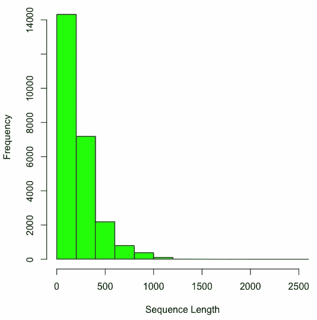
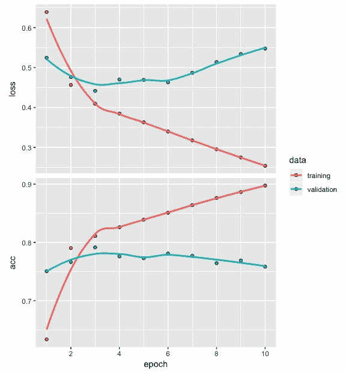

# 九、文本分类的深度网络

文本数据属于非结构化数据范畴。在开发深度网络模型时，由于此类数据的独特性质，我们需要完成额外的预处理步骤。在本章中，您将了解使用深度神经网络开发文本分类模型所需遵循的步骤。这个过程将通过简单易懂的例子来说明。文本数据，如客户评论、产品评论和电影评论，在商业中起着重要的作用，文本分类是一个重要的深度学习问题。

在本章中，我们将讨论两个文本数据集，了解在开发深度网络分类模型时如何准备文本数据，查看 IMDb 电影评论数据，开发深度网络架构，拟合和评估模型，并讨论一些技巧和最佳实践。更具体地说，在本章中，我们将讨论以下主题:

*   文本数据集
*   为模型构建准备数据
*   开发深度神经网络
*   模型评估和预测
*   性能优化技巧和最佳实践


# 文本数据集

当我们想练习开发深度网络模型时，可以使用文本数据。这种数据可以从几个公开来源获得。在本节中，我们将介绍两种这样的资源:

*   UCI 机器学习知识库
*   Keras 中的文本数据


# UCI 机器学习知识库

以下链接提供了包含文本句子的各种数据集，这些文本句子是从产品评论(来自[Amazon.com](https://www.amazon.com/))、电影评论(来自【IMDB.com】T2)和餐馆评论(来自[yelp.com](https://www.yelp.com/))中提取的:[https://archive . ics . UCI . edu/ml/datasets/情操+标签+句子](https://archive.ics.uci.edu/ml/datasets/Sentiment+Labelled+Sentences)。

每个句子都根据评论中表达的观点进行标注。这种情绪要么是正面的，要么是负面的。对于每个网站，有 500 个正面句子和 500 个负面句子，这意味着总共有 3000 个标记句子。这些数据可用于开发情感分类深度网络模型，该模型可帮助我们自动将客户评论分类为正面或负面。

以下是一些来自 IMDb 的负面评论的示例，这些负面评论被标记为 0:

*   一部非常、非常、非常缓慢、漫无目的的电影，讲述了一个痛苦、漂泊的年轻人
*   不知道谁更失落——平淡的角色还是观众，将近一半的观众离开了
*   这部电影试图用黑白和巧妙的镜头角度来表现艺术，但令人失望——变得更加荒谬——因为表演很差，情节和台词几乎不存在
*   很少音乐或任何东西可言

以下是一些来自 IMDb 的正面评价的例子，它们被标记为 1:

*   这部电影中最精彩的一幕是杰勒德试图寻找一首一直在他脑海中萦绕的歌曲
*   今天看了这部电影，认为这是一个很好的努力，对孩子们来说是一个很好的信息
*   喜欢吉米·巴菲特扮演科学老师的角色
*   那些小猫头鹰很可爱
*   这部电影展示了佛罗里达州的最佳状态，使它看起来非常吸引人

以下是亚马逊一些被标为 0 的负面评价的例子:

*   所以在美国我没有办法把它插上电源，除非我用转换器
*   连接充电器，通话时间超过 45 分钟。重大问题！！
*   我必须摇动插头，让它排成一行，以获得合适的音量
*   如果你有几十个或者几百个联系人，那么想象一下一个一个发送他们的乐趣
*   我劝大家不要上当！

以下是一些来自亚马逊的正面评价的例子，它们被标为 1:

*   好案例，超值
*   对颚骨有好处
*   麦克风很棒
*   如果你是 Razr 的所有者...你一定要有这个！
*   而且音质很棒


# Keras 中的文本数据

Keras 中有两个文本数据集，如下所示:

*   **互联网电影数据库** ( **IMDb** )，包含影评情感分类
*   路透社新闻专线的主题分类数据

IMDb 评论数据包含 25，000 个被分类为包含正面或负面情绪的评论。这些数据已经过预处理，每个评论都被编码成一个整数序列。路透社新闻专线的主题分类数据包含 11，228 条新闻专线，这些新闻专线也经过了预处理，每条新闻专线都被编码为一个整数序列。新闻专线被分为 46 组或 46 个主题，如牲畜、黄金、住房、工作。

以下是来自 Keras 的 IMDb 数据的正面电影评论示例:

《简》这部简单明了的改编电影中奢华的制作价值和扎实的表演？讽刺经典关于阶级内部和阶级之间的婚姻游戏。18 世纪英国诺瑟姆和帕特洛是一个？混合物作为朋友谁必须通过？和谎言，发现他们彼此相爱的好心情是一种吗？美德对解释。老化的原始资料，它的粗糙程度已经降低了一点？我喜欢这部电影的外观和镜头的设置，我认为它没有太依赖于？像 80 年代和 90 年代的大多数电影一样，头部特写的效果非常好。”

以下是来自 Keras 的 IMDb 数据的负面电影评论示例:

我一生中最糟糕的错误 br br 我在塔吉特百货买了这部电影，因为我想嘿，这是桑德勒，我可以得到一些廉价的笑声我错了，完全错了在电影进行到一半的时候，我的三个朋友都睡着了，我仍然在忍受最糟糕的情节最糟糕的剧本我看过最糟糕的电影我想用头撞墙一个小时，然后我会停下来，你知道为什么吗，因为这感觉真他妈的好，当我把我的头撞进去的时候，我把那该死的电影卡在里面？看着它燃烧，这种感觉比我做过的任何事情都要好得多。美国的黑暗心理军队杀了比尔，只是为了忘掉那些废话。我恨你，桑德勒，你真的经历了这些，毁了我一整天的生活。”


# 为模型构建准备数据

为了准备用于模型构建的数据，我们需要遵循以下步骤:

1.  标记化
2.  将文本转换成整数
3.  填充和截断

为了说明数据准备中涉及的步骤，我们将利用一个非常小的文本数据集，其中包含与 2017 年 9 月苹果 iPhone X 发布时间相关的五条推文。我们将使用这个小数据集来了解数据准备中涉及的步骤，然后我们将切换到一个更大的 IMDb 数据集，以便构建深度网络分类模型。以下是我们将要存储在`t1`到`t5`中的五条推文:

```r
t1 <- "I'm not a huge $AAPL fan but $160 stock closes down $0.60 for the day on huge volume isn't really bearish"
t2 <- "$AAPL $BAC not sure what more dissapointing: the new iphones or the presentation for the new iphones?"
t3 <- "IMO, $AAPL animated emojis will be the death of $SNAP."
t4 <- "$AAPL get on board. It's going to 175\. I think wall st will have issues as aapl pushes 1 trillion dollar valuation but 175 is in the cards"
t5 <- "In the AR vs. VR battle, $AAPL just put its chips behind AR in a big way."
```

前面的推文包括小写和大写的文本、标点符号、数字和特殊字符。


# 标记化

推文中的每个单词或数字都是一个令牌，将推文拆分成令牌的过程称为**令牌化**。用于执行令牌化的代码如下:

```r
tweets <- c(t1, t2, t3, t4, t5)
token <- text_tokenizer(num_words = 10) %>%    
         fit_text_tokenizer(tweets)
token$index_word[1:3]
$`1`
[1] "the"

$`2`
[1] "aapl"

$`3`
[1] "in"
```

从前面的代码中，我们可以看到以下内容:

*   我们首先在`tweets`保存了五条推文。
*   对于标记化过程，我们将`num_words`指定为`10`,以表明我们希望使用 10 个最常用的单词，并忽略其他任何单词。

*   尽管我们指定了我们将有`10`个常用词，但是将使用的最大整数值实际上将是 10 - 1 = 9。
*   我们使用了`fit_text_tokenizer`，它会自动将文本转换成小写，并删除推文中的任何标点符号。
*   我们观察到，这五条推文中出现频率最高的前三个词是`the`、`aapl`和`in`。

注意，具有高频率的单词对于文本分类可能重要，也可能不重要。


# 将文本转换成整数序列

下面的代码用于将文本转换成整数序列。还提供了输出:

```r
seq <- texts_to_sequences(token, tweets)
seq
[[1]]
[1] 4 5 6 2 7 8 1 9 6

[[2]]
[1] 2 4 1 1 8 1

[[3]]
[1] 2 1

[[4]]
[1] 2 9 2 7 3 1

[[5]]
[1] 3 1 2 3 5

```

从前面的代码中，我们可以看到以下内容:

*   我们已经使用`texts_to_sequences`将 tweets 转换成整数序列。
*   因为我们已经选择了最常用的单词为`10`，所以每个整数序列中的整数的最大值为 9。
*   对于每条 tweet，序列中的整数数量少于单词数量，因为只使用了最常用的单词。

*   整数序列的长度不同，从 2 到 9 不等。
*   出于开发分类模型的目的，所有的序列需要具有相同的长度。这是通过执行填充或截断来实现的。


# 填充和截断

使所有整数序列相等的代码如下:

```r
pad_seq <- pad_sequences(seq, maxlen = 5)
pad_seq
 [,1] [,2] [,3] [,4] [,5]
[1,]    7    8    1    9    6
[2,]    4    1    1    8    1
[3,]    0    0    0    2    1
[4,]    9    2    7    3    1
[5,]    3    1    2    3    5
```

从前面的代码中，我们可以看到以下内容:

*   我们使用了`pad_sequences`,所以所有的整数序列长度相等。
*   当我们指定所有序列的最大长度(使用`maxlen`)为 5 时，这将截断长于 5 的序列，并向短于 5 的序列添加零。
*   请注意，此处填充的默认设置是“前”。这意味着当序列长度大于 5 时，截断将影响序列开头的整数。我们可以在前面的输出中的第一个序列中观察到这一点，其中删除了 4、5、6 和 2。
*   类似地，对于长度为 2 的第三个序列，在序列的开头添加了三个零。

在某些情况下，您可能更喜欢在整数序列的末尾截断或添加零。实现这一点的代码如下:

```r
pad_seq <- pad_sequences(seq, maxlen = 5, padding = 'post')
pad_seq 
 [,1] [,2] [,3] [,4] [,5]
[1,]    7    8    1    9    6
[2,]    4    1    1    8    1
[3,]    2    1    0    0    0
[4,]    9    2    7    3    1
[5,]    3    1    2    3    5
```

在前面的代码中，我们将填充指定为`post`。这种类型的填充的影响可以在输出中看到，其中在序列 3 的末尾添加了零，加起来小于 5。


# 开发推特情感分类模型

为了开发一个 tweet 情感分类模型，我们需要为每条 tweet 添加标签。然而，获得准确反映推特情绪的标签具有挑战性。让我们看看一些现有的情感分类词汇，看看为什么不容易得到合适的标签。仅凭五条推文，不可能开发出一个情感分类模型。然而，这里的想法是查看为每个 tweet 找到合适标签的过程。这将有助于我们理解获得准确标签所面临的挑战。为了自动提取每条推文的情感分数，我们将使用`syuzhet`包。为此，我们还将利用常用的词汇。**国家研究委员会** ( **NRC** )词典有助于捕捉基于特定词汇的各种情绪。我们将使用以下代码来获得五条推文的情感得分:

```r
library(syuzhet) 
get_nrc_sentiment(tweets) 
  anger anticipation disgust fear joy sadness surprise trust negative positive
1     1            0       0    1   0       0        0     0        0        0
2     0            0       0    0   0       0        0     0        0        0
3     1            1       1    1   1       1        1     0        1        1
4     0            1       0    0   0       0        0     0        0        0
5     1            0       0    0   0       0        0     0        1        0
```

第一条推文的愤怒和恐惧得分均为 1。虽然它包含单词`'bearish'`，但如果我们阅读这条推文，我们会确定它实际上是积极的。

让我们看看下面的代码，它包含了单词`'bearish'`、`'death'`和`'animated'`的情感分数:

```r
get_nrc_sentiment('bearish') 
  anger anticipation disgust fear joy sadness surprise trust negative positive
1     1            0       0    1   0       0        0     0        0        0

get_nrc_sentiment('death') 
  anger anticipation disgust fear joy sadness surprise trust negative positive
1     1            1       1    1   0       1        1     0        1        0

get_nrc_sentiment('animated') 
  anger anticipation disgust fear joy sadness surprise trust negative positive
1     0            0       0    0   1       0        0     0        0        1
```

从前面的代码中，我们可以确定以下内容:

*   第一条推文的总得分是基于斜体这个词，而不是其他。
*   除了信任，第三条推文的每个类别的得分为 1。
*   从阅读推文来看，我们很明显地看到，写这条推文的人实际上觉得动画表情符号对苹果会是积极的，对 Snapchat 会是消极的。
*   情感评分基于这条推文中的两个词:死亡和动画。他们没有抓住第三条推文中表达的真实情绪，这对苹果来说是非常积极的。

当我们用负面情绪(用 0 表示)和正面情绪(用 1 表示)手动标记五条推文中的每一条时，我们很可能会得到 1、0、1、1 和 1 的分数。让我们使用下面的代码，通过使用`syuzhet`、`bing`和`afinn`词汇来得出这些情感分数:

```r
get_sentiment(tweets, method="syuzhet")
[1]  0.00  0.80 -0.35  0.00 -0.25

get_sentiment(tweets, method="bing")
[1] -1  0 -1 -1  0

get_sentiment(tweets, method="afinn")
[1]  4  0 -2  0  0
```

查看来自`syuzhet`、`bing`和`afinn`词汇库的结果，我们可以观察到以下情况:

*   结果与推文中包含的实际情绪有很大差异。因此，试图自动给一条推文贴上合适的情感分数是很困难的。
*   我们看到自动标注文本序列是一个具有挑战性的问题。然而，一种解决方案是手动标记大量的文本序列，如推文，然后使用它来开发情感分类模型。
*   此外，重要的是要注意，这样的情感分类模型将仅对用于开发该模型的特定类型的文本数据有帮助。
*   不同的文本情感分类应用不可能使用相同的模型。


# 开发深度神经网络

尽管我们不会仅仅基于五条推文开发一个分类模型，但让我们看看模型架构的代码:

```r
model <- keras_model_sequential()
model %>% layer_embedding(input_dim = 10, 
                          output_dim = 8, 
                          input_length = 5) 
summary(model)

OUTPUT
__________________________________________________________________________________
Layer (type)                        Output Shape                     Param # 
==================================================================================
embedding_1 (Embedding)             (None, 5, 8)                     80 
==================================================================================
Total params: 80
Trainable params: 80
Non-trainable params: 0
________________________________________________________________________________

print(model$get_weights(), digits = 2)
[[1]]
 [,1]    [,2]    [,3]   [,4]    [,5]    [,6]    [,7]    [,8]
 [1,]  0.0055 -0.0364 -0.0475  0.049 -0.0139 -0.0114 -0.0452 -0.0298
 [2,]  0.0398 -0.0143 -0.0406  0.023 -0.0496 -0.0124  0.0087 -0.0104
 [3,]  0.0370 -0.0321 -0.0491 -0.021 -0.0214  0.0391  0.0428 -0.0398
 [4,] -0.0257  0.0294  0.0433  0.048  0.0259 -0.0323 -0.0308  0.0224
 [5,] -0.0079 -0.0255  0.0164  0.023 -0.0486  0.0273  0.0245 -0.0020
 [6,]  0.0372  0.0464  0.0454 -0.020  0.0086 -0.0375 -0.0188  0.0395
 [7,]  0.0293  0.0305  0.0130  0.037 -0.0324 -0.0069 -0.0248  0.0178
 [8,] -0.0116 -0.0087 -0.0344  0.027  0.0132  0.0430 -0.0196 -0.0356
 [9,]  0.0314 -0.0315  0.0074 -0.044 -0.0198 -0.0135 -0.0353  0.0081
[10,]  0.0426  0.0199 -0.0306 -0.049  0.0259 -0.0341 -0.0155  0.0147

```

从前面的代码中，我们可以观察到以下内容:

*   我们使用`keras_model_sequential()`初始化模型。
*   我们将输入维度指定为 10，这是最频繁使用的词的数量。
*   输出维数为 8 导致参数数量为 10 x 8 = 80。
*   输入长度是整数序列的长度。
*   我们可以使用`model$get_weights()`获得这 80 个参数的权重。

请注意，每次初始化模型时，这些权重都会改变。


# 获取 IMDb 电影评论数据

现在，我们将利用 IMDb 电影评论数据，其中每个评论的情绪已经被标记为积极或消极。从 Keras 访问 IMDb 电影评论数据的代码如下:

```r
imdb <- dataset_imdb(num_words = 500)  
c(c(train_x, train_y), c(test_x, test_y)) %<-% imdb
z <- NULL
for (i in 1:25000) {z[i] <- print(length(train_x[[i]]))}
summary(z)
   Min. 1st Qu.  Median    Mean 3rd Qu.    Max. 
   11.0   130.0   178.0   238.7   291.0  2494.0 
```

从前面的代码中，我们可以观察到以下内容:

*   我们使用了`train_x`和`train_y`来存储数据，它们分别是代表积极或消极情绪的整数和标签序列。
*   我们对测试数据也使用了类似的约定。
*   训练和测试数据各包含 25，000 条评论。
*   对序列长度的总结显示，基于最频繁的词的电影评论的最小长度是 11，最大序列长度是`2494`。
*   序列长度的中位数是`178`。
*   中值小于平均值，这表明该数据将向右倾斜，并且在右侧将具有更长的尾部。

训练数据序列长度的直方图可以绘制如下:



前面的整数序列长度直方图显示了一个右偏模式。大多数序列的整数少于 500。

接下来，我们将使用以下代码使整数序列的长度相等:

```r
train_x <- pad_sequences(train_x, maxlen = 100)
test_x <- pad_sequences(test_x, maxlen = 100)
```

从前面的代码中，我们可以观察到以下内容:

*   我们已经使用 100 的`maxlen`将每个序列的长度标准化为 100 个整数。
*   长于 100 的序列将截断或删除任何额外的整数，短于 100 的序列将添加零，以人为增加序列的长度，使其达到 100。我们对训练和测试序列都这样做。

现在，我们准备建立一个分类模型。


# 构建分类模型

对于模型架构和模型摘要，我们将使用以下代码:

```r
model <- keras_model_sequential()
model %>% layer_embedding(input_dim = 500, 
                          output_dim = 16, 
                          input_length = 100) %>%
         layer_flatten() %>% 
         layer_dense(units = 16, activation = 'relu') %>%
         layer_dense(units = 1, activation = "sigmoid")
summary(model)

OUTPUT
___________________________________________________________________
Layer (type)                  Output Shape              Param # 
===================================================================
embedding_12 (Embedding)      (None, 100, 16)           8000 
___________________________________________________________________
flatten_3 (Flatten)           (None, 1600)              0 
___________________________________________________________________
dense_6 (Dense)               (None, 16)                25616 
___________________________________________________________________
dense_7 (Dense)               (None, 1)                 17 
===================================================================
Total params: 33,633
Trainable params: 33,633
Non-trainable params: 0
___________________________________________________________________
```

从前面的代码中，我们可以观察到以下内容:

*   这里，我们在`layer_embedding()`后添加了`layer_flatten()`。
*   随后是具有 16 个节点的密集层和一个`relu`激活函数。
*   模型汇总显示共有`33,633`个参数。

现在，我们可以编译模型了。


# 编译模型

我们需要使用以下代码来编译模型:

```r
model %>% compile(optimizer = "rmsprop",
          loss = "binary_crossentropy",
          metrics = c("acc"))
```

从前面的代码中，我们可以观察到以下内容:

*   我们已经使用了`rmsprop`优化器来编译这个模型。
*   对于损耗，我们使用了`binary_crossentropy`，因为响应有两个值，即正值或负值。度量将利用准确性。

现在，让我们开始拟合模型。


# 拟合模型

我们需要使用以下代码来拟合模型:

```r
model_1 <- model %>% fit(train_x, train_y,
                         epochs = 10,
                         batch_size = 128,
                         validation_split = 0.2)
plot(model_1)
```

如前面的代码所示，我们使用`train_x`和`train_y`来拟合模型，以及`10`时期和`128`的批量大小。我们使用 20%的训练数据来评估模型在损失和准确性值方面的性能。拟合模型后，我们获得了损失和精度图，如下图所示:



从前面的图中，我们可以观察到以下情况:

*   损失和准确度的图显示了大约四个时期后训练和验证数据之间的差异。
*   对于损失值和准确度值，观察到训练数据和验证数据之间的差异。
*   我们不会使用这个模型，因为有明显的证据表明存在过度拟合的问题。

为了克服这个过度拟合的问题，我们需要修改前面的代码，使其如下所示:

```r
model <- keras_model_sequential()
model %>% layer_embedding(input_dim = 500, 
                          output_dim = 16, 
                          input_length = 100) %>%
         layer_flatten() %>% 
         layer_dense(units = 16, activation = 'relu') %>%
         layer_dense(units = 1, activation = "sigmoid")
model %>% compile(optimizer = "rmsprop",
          loss = "binary_crossentropy",
          metrics = c("acc"))
model_2 <- model %>% fit(train_x, train_y,
                         epochs = 10,
                         batch_size = 512,
                         validation_split = 0.2)
plot(model_2)
```

查看前面的代码，我们可以观察到以下内容:

*   我们重新运行模型，只做了一处改动；也就是说，我们将批量增加到 512
*   我们保持其他一切不变，然后使用训练数据来拟合模型

拟合模型后，存储在`model_2`中的损耗和精度值被绘制出来，如下图所示:


从前面的图中，我们可以观察到以下情况:

*   损失和精度值这次显示了更好的结果。
*   用于训练和验证的曲线在损失和准确性方面彼此更接近。
*   此外，基于验证数据的损失值和准确度值没有显示出我们在之前的模型中观察到的严重恶化，在之前的模型中，最近三个时期的值在这里是平稳的。
*   我们能够通过对代码进行微小的修改来克服过度拟合的问题。

我们将使用这个模型进行评估和预测。


# 模型评估和预测

现在，我们将使用训练和测试数据来评估模型，以获得损失、准确性和混淆矩阵。我们的目标是获得一个模型，可以将电影评论中包含的情感分为正面或负面。


# 使用训练数据进行评估

从训练数据中获取损失值和精度值的代码如下:

```r
model %>% evaluate(train_x, train_y)
$loss
[1] 0.3745659
$acc
[1] 0.83428
```

我们可以看到，对于训练数据，损失和精度分别是`0.375`和`0.834`。为了更深入地了解模型的情感分类性能，我们需要开发一个混淆矩阵。为此，请使用以下代码:

```r
pred <- model %>%   predict_classes(train_x)
table(Predicted=pred, Actual=imdb$train$y)
         Actual
Predicted     0     1
        0 11128  2771
        1  1372  9729
```

在前面的代码中，我们预测训练数据的类正在使用该模型，并将结果与电影评论的实际情感类进行比较。这在混淆矩阵中进行了总结。我们可以对混淆矩阵进行如下观察:

*   该模型正确预测了 11，128 条电影评论中包含的负面情绪。
*   该模型正确地预测了包含在 9，729 条电影评论中的正面情绪。
*   将正面评论错误分类为负面评论的比例(2，771)高于将具有负面情绪的电影评论错误分类为正面的比例(1，372)。

接下来，我们将对测试数据重复这个过程。


# 使用测试数据进行评估

从测试数据中获取损耗和精度值的代码如下:

```r
model %>% evaluate(test_x, test_y)
$loss
[1] 0.4431483
$acc
[1] 0.79356
```

我们可以看到，就测试数据而言，损耗和精度分别为`0.443`和`0.794`。这些结果比从训练数据中获得的结果稍差。我们可以使用模型预测`test`数据的类别，并将它们与电影评论的实际类别进行比较。这可以总结为一个混淆矩阵，如下所示:

```r
pred1 <- model %>%   predict_classes(test_x)
table(Predicted=pred1, Actual=imdb$test$y)
         Actual
Predicted     0     1
        0 10586  3247
        1  1914  9253
```

从前面的混淆矩阵中，我们可以观察到以下情况:

*   总体而言，该模型在正确预测负面电影评论(10，586)方面似乎比正面电影评论(9，253)更准确。
*   这种模式与通过训练数据获得的结果一致。
*   此外，尽管 79%的测试数据准确率相当不错，但仍有提高模型情感分类性能的空间。

在下一节中，我们将探索性能优化技巧和最佳实践。


# 性能优化技巧和最佳实践

现在我们已经获得了测试数据的电影评论分类准确率，即 79%，我们可以进一步提高这个准确率。实现这样的改进可能涉及对模型架构中的参数、我们编译模型时使用的参数和/或我们拟合模型时使用的设置进行试验。在本节中，我们将通过改变单词序列的最大长度来进行实验，同时，使用与我们在之前的模型中使用的优化器不同的优化器。


# 试验最大序列长度和优化器

让我们首先使用以下代码为表示电影评论及其标签的整数序列创建`train`和`test`数据:

```r
c(c(train_x, train_y), c(test_x, test_y)) %<-% imdb
z <- NULL
for (i in 1:25000) {z[i] <- print(length(train_x[[i]]))}
summary(z)
   Min. 1st Qu.  Median    Mean 3rd Qu.    Max. 
   11.0   130.0   178.0   238.7   291.0  2494.0 
```

在前面的代码中，我们根据`z`中的训练数据存储序列的长度。通过这样做，我们得到了`z`的摘要。从这里，我们可以获得数字汇总值，如最小值、第一个四分位数、中值、平均值、第三个四分位数和最大值。单词序列的中值是 178。在前面的部分中，我们在填充序列时使用了最大长度 100，以使它们长度相等。在这个实验中，我们将把它增加到 200，这样我们就有一个更接近中值的数字，如下面的代码所示:

```r
imdb <;- dataset_imdb(num_words = 500)  
c(c(train_x, train_y), c(test_x, test_y)) %<-% imdb
train_x <- pad_sequences(train_x, maxlen = 200) 
test_x <- pad_sequences(test_x, maxlen = 200)
model <- keras_model_sequential()
model %>% layer_embedding(input_dim = 500, 
                          output_dim = 16, 
                          input_length = 200) %>%
         layer_flatten() %>% 
         layer_dense(units = 16, activation = 'relu') %>%
         layer_dense(units = 1, activation = "sigmoid")
model %>% compile(optimizer = "adamax",  
                  loss = "binary_crossentropy",
                  metrics = c("acc"))
model_3 <- model %>% fit(train_x, train_y,
                         epochs = 10,
                         batch_size = 512,
                         validation_split = 0.2)
plot(model_3)
```

我们要做的另一个改变是在编译模型时使用`adamax`优化器。注意，这是流行的`adam`优化器的变体。我们保持其他一切不变。训练模型后，我们绘制了最终的损失和准确度，如下图所示:


从前面的损耗和精度图中，我们可以观察到以下情况:

*   训练和验证数据的损失和准确度值显示了大约四个时期的快速改善。
*   在四个时期之后，对于训练数据，这些改进变慢。
*   对于验证数据，损失和精度值在最后几个时期变得平缓。
*   该图没有显示任何关于过度拟合的原因。

接下来，我们需要使用以下代码根据测试数据计算损耗和精度:

```r
model %>% evaluate(test_x, test_y)
$loss
[1] 0.3906249
$acc
[1] 0.82468
```

查看前面的代码，我们可以观察到以下内容:

*   基于测试数据的模型损耗和精度分别为`0.391`和`0.825`。
*   这两个数字都表明，与我们在上一节中检索到的性能相比，有所改进。

为了进一步了解模型的情感分类性能，我们可以使用以下代码:

```r
pred1 <- model %>%   predict_classes(test_x)
table(Predicted=pred1, Actual=imdb$test$y)
         Actual
Predicted     0     1
        0  9970  1853
        1  2530 10647
```

从前面基于测试数据电影评论的混淆矩阵中，我们可以观察到以下情况:

*   负面(9，970)和正面(10，647)电影评论的正确分类现在更接近了。
*   正面电影评论的正确分类比负面评论的正确分类稍微好一点。
*   该模型将负面电影评论错误分类为正面的比率(2，530)略高于正面评论被错误分类为负面评论的比率(1，853)。

在这里，对最大序列长度和用于编译模型的优化器类型进行试验，提高了情感分类性能。我们鼓励您继续尝试并改进模型的情感分类性能。


# 摘要

在这一章中，我们从开发用于文本分类的深度神经网络开始。由于文本数据的独特特征，在可以开发深度神经网络情感分类模型之前，需要几个额外的预处理步骤。我们使用五条 tweets 的小样本来检查预处理步骤，包括标记化、将文本数据转换为整数序列，以及填充/截断以达到相同的序列长度。我们还强调，用适当的情感自动标记文本序列是一个具有挑战性的问题，一般的词典可能无法提供有用的结果。

为了开发一个深度网络情感分类模型，我们转向了一个更大的现成的 IMDb 电影评论数据集，它是 Keras 的一部分。为了优化模型的性能，我们还试验了一些参数，比如数据准备时的最大序列长度，以及用于编译模型的优化器的类型。这些实验产生了不错的结果；但是，我们将继续探索这些数据，以便我们可以进一步改进深度网络模型的情感分类性能。

在下一章中，我们将利用循环神经网络分类模型，它更适合处理涉及序列的数据。