在这一章中，我们将首先建立一个 Jupyter 环境来运行我们的实验和算法，我们将了解不同的漂亮的 Python 和 Jupyter hacks for **人工智能** ( **AI** )，我们将在 scikit-learn、Keras 和 PyTorch 中做一个玩具示例，然后在 Keras 中做一个稍微复杂一点的示例来完成事情。这一章主要是介绍性的，在本章中看到的许多内容将在我们进入更高级的应用时的后续章节中建立。

在本章中，我们将介绍以下食谱:

*   设置 Jupyter 环境
*   精通人工智能 Python
*   在 scikit-learn、Keras 和 PyTorch 中分类
*   使用 Keras 建模

# 技术要求

你真的应该有一个可用的 GPU 来运行这本书里的一些食谱，或者你最好使用 Google Colab。需要一些额外的步骤来确保您安装了正确的 NVIDIA 图形驱动程序，以及一些额外的库。Google 在 TensorFlow 网站上提供最新的说明，网址为 [https:/ / www。tensorflow. org/ install/ gpu](https:/%E2%80%8B/%E2%80%8Bwww.%20tensorflow.%E2%80%8Borg/%E2%80%8Binstall/%E2%80%8Bgpu) 。类似地，PyTorch 版本对 NVIDIA 驱动程序版本有最低要求(您必须手动检查每个 PyTorch 版本)。让我们看看如何使用 dockerized 环境来帮助设置这一点。

你可以在本书的 GitHub 资源库[https://GitHub . com/packt publishing/Artificial-Intelligence-with-Python-Cookbook](https://github.com/PacktPublishing/Artificial-Intelligence-with-Python-Cookbook)找到本章的食谱。

# 设置 Jupyter 环境

正如你所知道的，自从你买了这本书，Python 就是人工智能中占主导地位的编程语言。它拥有所有编程语言中最丰富的生态系统，包括许多先进算法的实现，使用这些算法通常只需简单地导入和设置一些选定的参数。不言而喻，在许多情况下，我们将超越基本的用法，我们将在学习菜谱的过程中讨论许多潜在的想法和技术。

我们再怎么强调能够快速原型化想法并观察它们作为解决方案的一部分效果如何的重要性也不为过。这往往是 AI 或数据科学工作的主要部分。一个**读取-评估-打印循环** ( **REPL** )对于将想法转化为原型时的快速迭代来说是必不可少的，并且您需要诸如编辑历史、绘图等功能。这解释了为什么 Jupyter Notebook(其中 **Jupyter** 是 **Julia，Python，R** 的缩写)对人工智能的工作如此重要。

请注意，虽然我们将重点放在 Jupyter Notebook，或在云中运行 Jupyter Notebook 的 Google Colab，但也有一些功能类似的替代产品，如 JupyterLab，甚至是运行远程解释器的 PyCharm。然而，Jupyter 笔记本仍然是最受欢迎的(也可能是最受支持的)选择。

在这个菜谱中，我们将确保我们有一个工作的 Python 环境，其中包含本书中需要的软件库。我们将处理安装相关的 Python 库来与 AI 一起工作，并且我们将建立一个 Jupyter 笔记本服务器。

## 做好准备

首先，确保你已经安装了 Python，以及安装库的方法。根据以下两种情况，有不同的使用和安装库的方法:

*   你使用一个托管交互式笔记本的服务，比如 Google Colab。
*   您在自己的机器上安装 Python 库。

在 Python 中，**模块**是包含函数、变量或类的 Python 文件。一个**包**是同一路径中模块的集合。一个**库**是相关功能的集合，通常以不同的包或模块的形式出现。非正式地，将 Python 库称为包是很常见的，我们有时也会这样做。

## 怎么做...

让我们来设置我们的 Python 环境！

正如我们提到的，我们将看到两种情况:

*   使用 Google Colab

*   我们自己设置一台计算机来托管 Jupyter 笔记本实例

在第一种情况下，我们不需要在服务器上设置任何东西，因为我们只需要安装一些额外的库。在第二种情况下，我们将使用 Anaconda 发行版安装一个环境，并且我们将查看 Jupyter 的安装选项。

在这两种情况下，我们都有一个交互式 Python 笔记本，通过它我们可以运行大部分实验。

### 使用 Google Colab 安装库

Google Colab 是 Jupyter Notebook 的修改版本，运行在 Google 硬件上，并提供对 TPUs 和 GPU 等硬件加速的运行时的访问。

使用 Colab 的缺点是最大超时 12 小时；也就是说，运行时间超过 12 小时的作业将会停止。如果您想解决这个问题，您可以执行以下任一操作:

*   用本地内核运行 Colab。这意味着您使用 Colab 接口，但是模型在您自己的计算机上进行计算([https://research . Google . com/co laboratory/local-runtimes . html](https://research.google.com/colaboratory/local-runtimes.html))。
*   自己装 Jupyter 笔记本，不要用 Google Colab。

对于谷歌实验室，只需进入[https://colab.research.google.com/](https://colab.research.google.com/)，用你的谷歌证书登录。在下一节中，我们将讨论在您自己的机器上托管笔记本。

在 Google Colab 中，您可以在 Google 服务器的远程磁盘上保存和重新加载您的模型。在那里，你可以将模型下载到自己的电脑上，或者与 Google Drive 同步。Colab GUI 为这些用例提供了许多有用的代码片段。下面介绍如何从 Colab 下载文件:

`from joblib import dump`
`dump(`
`my_model,`
`'my_model_auc0.84.joblib'`
`)`
`files.download('my_model_auc0.84.joblib')`

### 自托管 Jupyter 笔记本电脑环境

有不同的方法来维护你的 Python 库(更多细节见[https://packaging.Python.org/tutorials/installing-packages/](https://packaging.python.org/tutorials/installing-packages/))。对于 Jupyter Notebook 和所有库的安装，我们推荐 Anaconda Python 发行版，它与`conda`环境管理器一起工作。

Anaconda 是一个 Python 发行版，带有自己的包安装程序和环境管理器，名为`conda`。这使得保持你的库是最新的变得更加容易，并且它处理系统依赖性管理以及 Python 依赖性管理。稍后我们将提到 Anaconda/conda 的几种替代方案；现在，我们将快速浏览本地安装的说明。在在线资料中，您可以找到说明，这些说明将展示如何为团队中的其他人提供类似的安装，例如，在一家使用 dockerized 设置的公司中，这有助于使用 Python 环境管理网络中一台或一组机器的设置。

If you have your computer already set up, and you are familiar with `conda` and `pip`, please feel free to skip this section.

对于 Anaconda 安装，我们需要下载一个安装程序，然后选择一些设置:

1.  进入位于[https://www.anaconda.com/products/individual](https://www.anaconda.com/products/individual)的 Anaconda 发行版页面，为您的系统下载合适的 Python 3.7 安装程序，比如 64 位(x86)安装程序(506 MB)。

Anaconda supports Linux, macOS, and Windows installers.

对于 macOS 和 Windows，您还可以选择图形安装程序。这在 Anaconda 文档中有很好的解释；但是，我们将快速浏览一下终端安装。

2.  从您的终端执行下载的 shell 脚本:

```py
bash Anaconda3-2019.10-Linux-x86_64.sh
```

您需要阅读并确认许可协议。您可以通过按空格键直到看到要求您同意的问题。你需要按下 *Y* 然后*输入*。

您可以使用建议的下载位置，或者选择电脑上用户之间共享的目录。一旦你完成了这些，你就可以喝一杯美味的咖啡，或者留下来观看 Python 和大量 Python 库的安装。

最后，您可以决定是否要运行`conda init`例程。这将在您的终端上设置路径变量，因此当您键入`python`、`pip`、`conda`或`jupyter`时，conda 版本将优先于您计算机上安装的任何其他版本。

请注意，在基于 Unix/Linux 的系统(包括 macOS)上，您可以随时检查您正在使用的 Python 二进制文件的位置，如下所示:

```py
> which Python
```

在 Windows 上，您可以使用`where.exe`命令。

如果您看到如下内容，那么您知道您正在使用正确的 Python 运行时:

```py
/home/ben/anaconda3/bin/Python
```

如果看不到正确的路径，您可能需要运行以下命令:

```py
source ~/.bashrc
```

这将设置您的环境变量，包括`PATH`。在 Windows 上，你必须检查你的路径变量。

也可以在同一台机器上设置不同的环境并在它们之间切换。Anaconda 默认带有 Jupyter/iPython，因此您可以从终端启动 Jupyter 笔记本，如下所示:

```py
> jupyter notebook
```

您应该会看到 Jupyter 笔记本服务器正在启动。作为该信息的一部分，用于登录的 URL 被打印到屏幕上。

如果您从通过网络访问的服务器上运行这个程序，请确保您使用了一个屏幕多路复用器，如 GNU screen 或 tmux，以确保一旦您的终端断开连接，您的 Jupyter 笔记本客户端不会停止。

我们将在本书中使用许多库，如 pandas、NumPy、scikit-learn、TensorFlow、Keras、PyTorch、Dash、Matplotlib 和其他库，所以我们将在浏览菜谱时安装很多库。这通常如下所示:

```py
pip install <LIBRARY_NAME>
```

或者，有时候，像这样:

```py
conda install <LIBRARY_NAME>
```

如果我们直接使用 conda 的`pip`，或者 conda，这意味着库将全部由 Anaconda 的 Python 安装来管理。

3.  您可以像这样安装前面提到的库:

```py
pip install scikit-learn pandas numpy tensorflow-gpu torch

```

请注意，对于`tensorflow-gpu`库，您需要准备好一个可用的 GPU。如果没有，把这个改成`tensorflow`(也就是没有`-gpu`)。

这应该使用 Anaconda 附带的`pip`二进制文件，并运行它来安装前面的库。请注意，Keras 是 TensorFlow 库的一部分。

或者，您可以如下运行`conda`包安装程序:

```py
conda install scikit-learn pandas numpy tensorflow-gpu pytorch
```

干得好！您已经成功地设置了您的计算机，可以处理即将出现的许多令人兴奋的食谱。

## 它是如何工作的...

Conda 是一个环境和包管理器。像我们将在本书中使用的许多其他库一样，也像 Python 语言本身一样，conda 是开源的，所以我们总是可以准确地找到一个算法做什么，并轻松地修改它。Conda 也是跨平台的，不仅支持 Python，还支持 R 等语言。

包管理可能会带来许多令人烦恼的挑战，如果您已经工作了一段时间，您可能会记得在诸如冲突的依赖关系或重新编译包和修复路径等问题上花费了很多时间——如果只是这样，您可能会很幸运。

Conda 超越了早期的`pip`包管理器(见[https://pip.pypa.io/en/stable/](https://pip.pypa.io/en/stable/))，因为它检查环境中安装的所有包的依赖性，并试图提出解决所有需求的方法。它不仅可以安装包，还允许我们建立环境，分别安装 Python 和来自不同软件仓库的二进制文件，例如专门研究生物信息学的 bio conda([https://bioconda.github.io/](https://bioconda.github.io/))或 Anaconda 仓库([https://anaconda.org/anaconda/repo](https://anaconda.org/anaconda/repo))。

conda 有数百个专用频道可供您使用。这些子库可以包含成百上千个不同的包。其中一些由开发特定库或软件的公司维护。

例如，您可以从 PyTorch 通道安装`pytorch`包，如下所示:

```py
conda install -c pytorch pytorch
```

为了让所有东西都拥有最先进的技术，启用许多渠道是很诱人的。然而，这有一个问题。如果您启用了许多通道，或者通道非常大，conda 的依赖关系解析会变得非常慢。所以在使用许多额外的通道时要小心，尤其是当它们包含很多库的时候。

## 还有更多...

有很多 Jupyter 选项你应该很熟悉。这些都在`$HOME/.jupyter/jupyter_notebook_config.py`的文件里。如果您还没有该文件，可以使用以下命令创建它:

```py
> jupyter notebook --generate-config
```

以下是`/home/ben/.jupyter/jupyter_notebook_config.py`的配置示例:

```py
import random, string
from notebook.auth import passwd

c = get_config()
c.NotebookApp.ip = '*'

password = ''.join(random.SystemRandom().choice(string.ascii_letters + string.digits + string.punctuation) for _ in range(8))
print('The password is {}'.format(password))
c.NotebookApp.password = passwd(password)
c.NotebookApp.open_browser = False
c.NotebookApp.port = 8888
```

如果您将 Python 环境安装在您想要从笔记本电脑访问的服务器上(我的本地计算服务器在阁楼上)，您首先需要确保您可以从另一台计算机(如笔记本电脑)远程访问计算服务器(`c.NotebookApp.ip = '*'`)。

然后我们创建一个随机密码并配置它。我们禁用了在运行 Jupyter Notebook 时打开浏览器的选项，然后将默认端口设置为`8888`。

因此，当你在同一台电脑上的浏览器中打开`localhost:8888`时，Jupyter Notebook 就可用了。如果你在一个大型组织的一个团队中，你将主要在远程数字处理机器上工作，为了方便起见，你或者你的系统管理员可以建立一个托管的 Jupyter 笔记本环境。这有几个优点:

*   您可以使用强大服务器的资源，同时只需通过浏览器访问它。

*   您可以在该服务器上的封闭环境中管理您的包，而不会影响服务器本身。

*   你会发现自己正在与 Jupyter Notebook 熟悉的 REPL 交互，它允许你快速测试想法和原型项目。

如果你是单身人士，不需要这个；然而，如果你在一个团队中工作，你可以使用 Docker 或 JupyterHub 将每个人放入一个封闭的环境中。在网上，你可以找到用 Docker 设置 Jupyter 环境的安装说明。

## 请参见

您可以在 conda、Docker、JupyterHub 和其他相关工具各自的文档站点上阅读更多内容，如下所示:

*   康达文档:[https://docs.conda.io/en/latest/](https://docs.conda.io/en/latest/)

*   码头工人文档:[https://docs.docker.com/](https://docs.docker.com/)

*   JupyterHub: [https://jupyterhub.readthedocs.io/en/stable/](https://jupyterhub.readthedocs.io/en/stable/)

*   Jupyter: [https://jupyter.org/](https://jupyter.org/)

*   JupyterLab: [https://jupyterlab.readthedocs.io/en/stable/](https://jupyterlab.readthedocs.io/en/stable/)

*   皮查姆:[https://www.jetbrains.com/pycharm/](https://www.jetbrains.com/pycharm/)

*   科拉布:[https://Colab.research.google.com](https://colab.research.google.com)

*   https://pipenv-fork.readthedocs.io/en/latest/

*   pip:t0]https://pip . pypa . io/en/stable/

# 精通人工智能 Python

在这组速战速决的食谱中，我们将看看如何在 Jupyter 中变得更高效，以及如何编写更高效的 Python 代码。如果你不熟悉 Jupyter 笔记本，请阅读教程，然后回到这里。你可以在[https://realPython.com/jupyter-notebook-introduction/](https://realpython.com/jupyter-notebook-introduction/)找到写得很好的教程。在下面的食谱中，我们假设你对 Jupyter 笔记本有些熟悉。

让我们来看看一些简单但非常方便的技巧，让在笔记本上工作更加舒适和高效。无论您是依赖本地还是托管 Python 环境，这些都适用。

在这份食谱中，我们将看到许多不同的东西，当你在笔记本上工作并为人工智能解决方案编写 Python 代码时，这些东西可以帮助你变得更有效率。一些内置或外部可用的魔法命令或扩展也可以派上用场(更多详细信息，请参见[https://ipython . readthe docs . io/en/stable/interactive/magics . html](https://ipython.readthedocs.io/en/stable/interactive/magics.html))。

当谈到机器学习时，了解一些 Python 效率技巧是很重要的，特别是在处理一些更大的数据集或更复杂的算法时。有时，您的作业可能需要很长时间才能运行，但通常有办法解决。例如，一种通常相对容易的更快完成工作的方法是使用并行。

以下简短食谱包括以下内容:

*   获取 Jupyter 命令历史记录
*   自动重装软件包
*   排除故障
*   定时代码执行
*   编译您的代码
*   加速熊猫数据帧
*   显示进度条
*   并行化您的代码

## 做好准备

如果您正在使用自己的安装，无论是直接在您的系统上还是在 Docker 环境中，请确保它正在运行。然后将您的 Colab 或 Jupyter 笔记本实例的地址输入到您的浏览器中，并按下 *Enter* 。

我们将使用以下库:

*   `tqdm`对于进度条
*   `swifter`为了更快地处理熊猫
*   用于多重处理的`ray`和`joblib`
*   `numba`进行**即时** ( **JIT** )编译
*   `jax`(本节稍后)用于自动签名的数组处理
*   `cython`用于在笔记本中编译 Cython 扩展

我们可以像以前一样用`pip`安装它们:

```py
pip install swifter tqdm ray joblib jax jaxlib seaborn numba cython
```

做完这些，让我们开始一些效率技巧，让在 Jupyter 中工作更快更方便。

## 怎么做...

这里的子菜谱短小精悍，都提供了在 Jupyter 和 Python 中提高效率的方法。

除非另有说明，否则所有代码都需要在笔记本中运行，或者更准确地说，在笔记本单元中运行。

让我们来看看这些小食谱吧！

### 获取 Jupyter 命令和输出的历史记录

有许多不同的方法可以通过编程获得 Jupyter 单元格中的代码。除了这些输入，您还可以查看生成的输出。这两个我们都会用到，为此我们可以使用全局变量。

#### 执行历史

为了获得您的单元的执行历史，`_ih`列表保存了被执行单元的代码。为了获得完整的执行历史并将其写入文件，您可以执行以下操作:

```py
with open('command_history.py', 'w') as file:
    for cell_input in _ih[:-1]:
        file.write(cell_input + '\n')
```

如果到目前为止，我们只运行了由`print('hello, world!')`组成的单个单元格，这正是我们应该在新创建的文件`command_history.py`中看到的:

```py
!cat command_history.py
print('hello, world!')
```

在 Windows 上，要打印文件的内容，可以使用`type`命令。

我们可以使用后三个单元格内容的简写来代替`_ih`。`_i`给出刚刚执行的单元的代码，`_ii`用于之前执行的单元的代码，`_iii`用于之前执行的单元的代码。

#### 输出

为了获得最近的输出，您可以使用`_`(单下划线)、`__`(双下划线)和`___`(三下划线)，分别表示最近、第二和第三最近的输出。

### 自动重装软件包

`autoreload`是一个内置的扩展，当您对磁盘上的模块进行更改时，它会重新加载模块。一旦你保存了模块，它会自动重新加载。

不用手动重新加载你的包或者重启笔记本，有了`autoreload`，你唯一要做的就是加载并启用扩展，它就会发挥它的魔力。

我们首先如下加载扩展:

```py
%load_ext autoreload 
```

然后我们按如下方式启用它:

```py
%autoreload 2
```

当您开发(和测试)一个库或模块时，这可以节省很多时间。

### 排除故障

如果您不能发现错误，并且错误的回溯不足以找到问题，那么调试可以大大加快错误搜索过程。让我们快速看一下调试的神奇之处:

1.  将以下代码放入单元格中:

```py
def normalize(x, norm=10.0):
  return x / norm

normalize(5, 1)
```

您应该看到`5.0`是单元格输出。

然而，函数中有一个错误，我相信细心的读者已经发现了。我们来调试吧！

2.  将它放入一个新的单元格:

```py
%debug
normalize(5, 0)
```

3.  通过按下 *Ctrl* + *Enter* 或 *Alt* + *Enter* 来执行单元格。您将得到一个调试提示:

```py
> <iPython-input-11-a940a356f993>(2)normalize() 
     1 def normalize(x, norm=10): ----> 
     2   return x / norm 
     3 
     4 normalize(5, 1) 
ipdb> a 
x = 5 
norm = 0 
ipdb> q
--------------------------------------------------------------------------- ZeroDivisionError                         Traceback (most recent call last)
<iPython-input-13-8ade44ebcb0c> in <module>()
     1 get_iPython().magic('debug') ---->
     2 normalize(5, 0)

<iPython-input-11-a940a356f993> in normalize(a, norm)
     1 def normalize(x, norm=10): ----> 
     2   return x / norm 
     3 
     4 normalize(5, 1) 
ZeroDivisionError: division by zero
```

我们已经使用 argument 命令打印出被执行函数的参数，然后使用`quit`命令退出调试器。你可以在[https://docs.Python.org/3/library/pdb.html](https://docs.python.org/3/library/pdb.html)的**Python 调试器** ( **pdb** )文档页面上找到更多命令。

让我们看看几个更有用的魔法命令。

### 定时代码执行

一旦你的代码做了它应该做的事情，你经常会从你的模型或算法中榨取每一点性能。为此，您将检查执行时间并使用它们创建基准。让我们看看如何为执行计时。

有一个内置的用于定时单元执行的神奇命令—`timeit`。`timeit`功能是 Python 标准库的一部分(【https://docs.Python.org/3/library/timeit.html】T2)。它在一个循环(默认情况下)内运行一个命令 10，000 次(默认情况下),结果显示平均执行时间:

```py
%%timeit -n 10 -r 1
import time
time.sleep(1)
```

我们看到以下输出:

```py
1 s ± 0 ns per loop (mean ± std. dev. of 1 run, 10 loops each)
```

`iPython-autotime`库(【https://github.com/cpcloud/iPython-autotime】T2)是一个外部扩展，它为所有执行的单元格提供计时，而不是每次都必须使用`%%timeit`:

1.  按照以下步骤安装`autotime`:

```py
pip install iPython-autotime
```

请注意，这种语法适用于 Colab，但不适用于标准的 Jupyter 笔记本。安装库的一贯做法是分别使用`pip`或`conda`魔法命令、`%pip`和`%conda`。此外，如果以感叹号开头，您可以从笔记本中执行任何 shell 命令，如下所示:

```py
!pip install iPython-autotime
```

2.  现在让我们使用它，如下所示:

```py
%load_ext autotime
```

3.  使用以下命令测试理解一个简单的列表需要多长时间:

```py
sum([i for i in range(10)])
```

我们将看到这个输出:`time: 5.62 ms`。

希望您能看到这对于比较不同的实现是多么的方便。特别是在您有大量数据或复杂处理的情况下，这非常有用。

### 显示进度条

即使你的代码被优化了，知道它是在几分钟、几小时还是几天内完成也是很好的。`tqdm`提供估计时间的进度条。如果你不确定你的工作会持续多久，这只是一个字母的距离——在许多情况下，这只是将`range`换成`trange`的问题:

```py
from tqdm.notebook import trange
from tqdm.notebook import tqdm
tqdm.pandas()
```

pandas 集成(可选)意味着您可以看到 pandas `apply`操作的进度条。把`apply`换成`progress_apply`就行了。

对于 Python 循环，只需用一个`tqdm`函数包装你的循环，瞧，会有一个进度条和你循环完成的时间估计！

```py
global_sum = 0.0
for i in trange(1000000):
   global_sum += 1.0
```

Tqdm 提供了不同的方法来做到这一点，并且它们都需要最小的代码更改——有时只有一个字母，正如您在前面的例子中所看到的。更通用的语法是用`tqdm`包装循环迭代器，如下所示:

```py
for _ in tqdm(range(10)):
   print()
```

您应该会看到一个进度条，如下图所示:

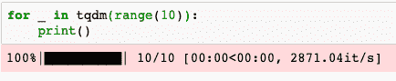

所以，下一次你正要开始长时间的循环，你不确定要花多长时间，记住这个子配方，使用`tqdm`。

### 编译您的代码

Python 是一种解释型语言，这对于实验来说是一个很大的优势，但是它可能对速度不利。有不同的方法来编译您的 Python 代码，或者使用 Python 中编译的代码。

我们先来看看 Cython。Cython 是一个针对 Python 的优化静态编译器，是由 Cython 编译器编译的编程语言。主要思想是用非常类似 Python 的语言写代码，生成 C 代码。然后，可以将这些 C 代码编译成二进制 Python 扩展。SciPy(和 NumPy)、scikit-learn 和许多其他库的重要部分都是用 Cython 编写的，以提高速度。你可以在 Cython 的网站上找到更多关于 cy thon 的信息，网址为[https://cython.org/](https://cython.org/):

1.  您可以使用`Cython`扩展在笔记本中构建 cython 功能:

```py
%load_ext Cython
```

2.  加载扩展后，对单元格进行如下注释:

```py
%%cython
def multiply(float x, float y):
    return x * y
```

3.  我们可以像调用任何 Python 函数一样调用这个函数，还有一个额外的好处是它已经被编译过了:

```py
multiply(10, 5)  # 50
```

这可能不是编译代码最有用的例子。这么小的函数，编译的开销太大了。你可能想编译一些更复杂的东西。

Numba 是 Python 的 JIT 编译器([https://numba.pydata.org/](https://numba.pydata.org/))。使用`numba`并编写如下的惯用 Python 代码，通常可以获得类似于 C 或 Cython 的加速:

```py
from numba import jit
@jit
def add_numbers(N):
    a = 0
    for i in range(N):
        a += i

add_numbers(10)
```

激活`autotime`后，您应该会看到如下内容:

```py
time: 2.19 s
```

因此，编译的开销太大，无法产生有意义的影响。当然，我们只有在它抵消编译时才能看到好处。然而，如果我们再次使用这个函数，我们应该会看到一个加速。自己试试吧！代码编译完成后，时间会显著缩短:

```py
add_numbers(10)
```

您应该会看到类似这样的内容:

```py
time: 867 µs
```

还有其他提供 JIT 编译的库，包括 TensorFlow、PyTorch 和 JAX，可以帮助您获得类似的好处。

下面的例子直接来自位于[https://jax.readthedocs.io/en/latest/index.html](https://jax.readthedocs.io/en/latest/index.html):的 JAX 文档

```py
import jax.numpy as np
from jax import jit
def slow_f(x):
    return x * x + x * 2.0

x = np.ones((5000, 5000)) 
fast_f = jit(slow_f) 
fast_f(x)
```

因此，使用 JIT 或提前编译有不同的方法来获得速度优势。在接下来的几节中，我们将会看到其他一些加速代码的方法。

### 加速熊猫数据帧

贯穿本书的最重要的库之一将是`pandas`，一个用于表格数据的库，这些表格数据对于**提取**、**转换**、**加载** ( **ETL** )作业很有用。然而，熊猫是一个奇妙的图书馆；一旦你开始做要求更高的任务，你就会遇到一些限制。Pandas 是加载和转换数据的首选库。数据处理的一个问题是它可能很慢，即使你对函数进行矢量化或者使用`df.apply()`。

您可以通过并行化`apply`进一步移动。有些库，比如`swifter`，可以帮你选择计算的后端，或者你可以自己选择:

*   如果您想通过网络在同一台或多台机器的多个内核上运行，您可以使用 Dask DataFrames 而不是 pandas。
*   如果想在 GPU 而不是 CPU 上运行计算，可以使用 CuPy 或 cuDF。这些与 Dask 有稳定的集成，所以你可以在多个内核和多个 GPU 上运行，并且你仍然可以依赖类似熊猫的语法(见[https://docs.dask.org/en/latest/gpu.html](https://docs.dask.org/en/latest/gpu.html))。

正如我们提到的，`swifter`可以为您选择一个后端，而无需改变语法。以下是将`pandas`与`swifter`配合使用的快速设置:

```py
import pandas as pd
import swifter

df = pd.read_csv('some_big_dataset.csv')
df['datacol'] = df['datacol'].swifter.apply(some_long_running_function)
```

一般来说，`apply()`比在数据帧上循环要快得多。

通过直接使用底层 NumPy 数组和访问 NumPy 函数，例如使用`df.values.apply()`，可以进一步提高执行速度。NumPy 矢量化其实很容易。请参见以下对 pandas DataFrame 列应用 NumPy 矢量化的示例:

```py
squarer = lambda t: t ** 2
vfunc = np.vectorize(squarer)
df['squared'] = vfunc(df[col].values)
```

这只是两种方法，但是如果你看下一个子方法，你应该能够写一个并行映射函数作为另一种选择。

### 并行化您的代码

更快完成某件事的一个方法是同时做多件事。有不同的方法来实现您的并行例程或算法。Python 有很多支持这种功能的库。让我们看几个多处理、Ray、joblib 的例子，以及如何利用 scikit-learn 的并行性。

多重处理库是 Python 标准库的一部分。我们先来看看。我们在这里不提供数百万个点的数据集——重点是展示一种使用模式——但是，请想象一个大型数据集。下面是使用伪数据集的代码片段:

```py
# run on multiple cores
import multiprocessing

dataset = [
    {
        'data': 'large arrays and pandas DataFrames',
        'filename': 'path/to/files/image_1.png'
    }, # ... 100,000 datapoints
]

def get_filename(datapoint):
    return datapoint['filename'].split('/')[-1]

pool = multiprocessing.Pool(64)
result = pool.map(get_filename, dataset)
```

使用 Ray，除了多核之外，您还可以在多台机器上实现并行化，而无需修改代码。Ray 通过共享内存(和零拷贝序列化)高效地处理数据，并使用具有容错功能的分布式任务调度程序:

```py
# run on multiple machines and their cores
import ray
ray.init(ignore_reinit_error=True)

@ray.remote
def get_filename(datapoint):
    return datapoint['filename'].split('/')[-1]

result = []
for datapoint in dataset:
    result.append(get_filename.remote(datapoint))

```

我们之前安装的机器学习库 Scikit-learn 在内部使用`joblib`进行并行化。以下是这方面的一个例子:

```py

from joblib import Parallel, delayed

def complex_function(x):
    '''this is an example for a function that potentially coult take very long.
    '''
    return sqrt(x)

Parallel(n_jobs=2)(delayed(complex_function)(i ** 2) for i in range(10))
```

这会给你`[0.0, 1.0, 2.0, 3.0, 4.0, 5.0, 6.0, 7.0, 8.0, 9.0]`。我们从 https://joblib.readthedocs.io/en/latest/parallel.html 的[获得的`joblib`关于并行 for 循环的例子中选取了这个例子。](https://joblib.readthedocs.io/en/latest/parallel.html)

当使用 scikit-learn 时，要注意带有`n_jobs`参数的函数。这个参数直接交给`joblib.Parallel`([https://github . com/job lib/job lib/blob/master/job lib/parallel . py](https://github.com/joblib/joblib/blob/master/joblib/parallel.py))。`none`(默认设置)意味着顺序执行，换句话说，没有并行性。因此，如果您想并行执行代码，请确保将这个`n_jobs`参数设置为`-1`，以便充分利用您的所有 CPU。

PyTorch 和 Keras 都支持多 GPU 和多 CPU 执行。默认情况下，多核并行化已经完成。随着 TensorFlow 作为默认后端，Keras 中的多机执行越来越容易。

## 请参见

笔记本虽然方便，但往往杂乱无章，不利于良好的编码习惯，也无法干净地版本化。Fastai 已经开发了一个名为 nbdev([https://github.com/fastai/nbdev](https://github.com/fastai/nbdev))的笔记本识字代码开发扩展，它提供了导出和记录代码的工具。

您可以在不同的地方找到更多有用的扩展:

*   延伸指数:[https://github.com/iPython/iPython/wiki/Extensions-Index](https://github.com/ipython/ipython/wiki/Extensions-Index)
*   Jupyter contrib 扩展:[https://jupyter-contrib-nb extensions . readthedocs . io/en/latest/nb extensions . html](https://jupyter-contrib-nbextensions.readthedocs.io/en/latest/nbextensions.html)
*   令人敬畏的 jupyter 列表:[https://github.com/markusschanta/awesome-jupyter](https://github.com/markusschanta/awesome-jupyter)

我们还想强调以下扩展:

*   SQL Magic，它执行 SQL 查询:[https://github.com/catherinedevlin/iPython-sql](https://github.com/catherinedevlin/ipython-sql)
*   水印，提取所用包的版本信息:[https://github.com/rasbt/watermark](https://github.com/rasbt/watermark)
*   Pyheatmagic，用于热图剖析:[https://github.com/csurfer/pyheatmagic](https://github.com/csurfer/pyheatmagic)
*   鼻子测试，使用鼻子测试:[https://github.com/taavi/iPython_nose](https://github.com/taavi/ipython_nose)
*   Pytest 魔法，用于使用 pytest 进行测试:[https://github.com/cjdrake/iPython-magic](https://github.com/cjdrake/ipython-magic)
*   点和其他，用于使用 graphviz 绘制图表:[https://github.com/cjdrake/iPython-magic](https://github.com/cjdrake/ipython-magic)
*   Scalene，一个 CPU 和内存分析器:[https://github.com/emeryberger/scalene](https://github.com/emeryberger/scalene)

本配方中使用或提及的其他一些库包括:

*   `Swifter`:[https://github . com/jmcarpenter 2/swifter](https://github.com/jmcarpenter2/swifter)
*   `Autoreload`:[https://ipython . org/ipython-doc/3/config/extensions/auto load . html](https://ipython.org/ipython-doc/3/config/extensions/autoreload.html)
*   `pdb`:[https://docs.Python.org/3/library/pdb.html](https://docs.python.org/3/library/pdb.html)
*   `tqdm`:[https://github.com/tqdm/tqdm](https://github.com/tqdm/tqdm)
*   `JAX` : [https://jax.readthedocs.io/](https://jax.readthedocs.io/)
*   `Seaborn`:[https://seaborn.pydata.org/](https://seaborn.pydata.org/)
*   `Numba`:[https://numba.pydata.org/numba-doc/latest/index.html](https://numba.pydata.org/numba-doc/latest/index.html)
*   `Dask`:[https://ml.dask.org/](https://ml.dask.org/)
*   `CuPy`:[https://cupy.chainer.org](https://cupy.chainer.org)
*   `cuDF`:[https://github.com/rapidsai/cudf](https://github.com/rapidsai/cudf)
*   `Ray`:[http://ray.readthedocs.io/en/latest/rllib.html](http://ray.readthedocs.io/en/latest/rllib.html)
*   `joblib`:[https://joblib.readthedocs.io/en/latest/](https://joblib.readthedocs.io/en/latest/)

# 在 scikit-learn、Keras 和 PyTorch 中分类

在这一节中，我们将了解三个最重要的库中的数据探索和建模。因此，我们将把事情分解成以下子配方:

*   在 Seaborn 中可视化数据
*   scikit 中的建模-学习
*   Keras 中的建模
*   PyTorch 建模

在这些菜谱和随后的几个菜谱中，我们将首先关注 Python 中三个最重要的人工智能库的基础知识:scikit-learn、Keras 和 PyTorch。通过这个，我们将介绍具有深度神经网络和其他算法的监督机器学习中的基本和中间技术。这个食谱将涵盖机器学习和深度学习中这三个主要库的基础知识。

我们将依次使用 scikit-learn、Keras 和 PyTorch 完成一个简单的分类任务。我们将在离线模式下运行这两个深度学习框架。

这些食谱是为了介绍这三个库的基础知识。然而，即使你已经和他们都合作过了，你可能还是会找到一些感兴趣的东西。

## 做好准备

Iris Flower 数据集是仍在使用的最古老的机器学习数据集之一。它是由罗纳德·费雪在 1936 年发表的，用来说明线性判别分析。问题是根据萼片和花瓣的宽度和长度来分类三种鸢尾花中的一种。

虽然这是一个非常简单的问题，但基本工作流程如下:

1.  加载数据集。
2.  将数据可视化。
3.  预处理和转换数据。
4.  选择要使用的模型。
5.  检查模型性能。
6.  解释和理解模型(这个阶段通常是可选的)。

这是一个标准的过程模板，我们必须将它应用到本书中的大多数问题上。通常情况下，对于工业规模的问题，*步骤 1* 和 *2* 可能会比你在 Kaggle 比赛或 UCI 机器学习库中获得的已经预处理过的数据集花费更长的时间(有时估计需要大约 95%的时间)。我们将在后面的食谱和章节中深入这些步骤的复杂性。

我们假设您已经安装了这三个库，并且您的 Jupyter 笔记本或 Colab 实例正在运行。此外，我们将使用 seaborn 和 scikit-plot 库进行可视化，因此我们也将安装它们:

```py
!pip install seaborn scikit-plot
```

使用众所周知的数据集的方便之处在于，我们可以轻松地从许多包中加载它，例如，像这样:

```py
import seaborn as sns
iris = sns.load_dataset('iris')
```

让我们直接从数据可视化开始。

## 怎么做...

我们先来看看数据集。

### 在 seaborn 中可视化数据

在本菜谱中，我们将介绍数据探索的基本步骤。这对于理解问题的复杂性和数据的任何潜在问题通常很重要:

1.  绘制一对图——图:

```py
%matplotlib inline
# this^ is not necessary on Colab
import seaborn as sns
sns.set(style="ticks", color_codes=True)

g = sns.pairplot(iris, hue='species')
```

它来了(呈现在 seaborn 的令人愉快的间距和颜色):

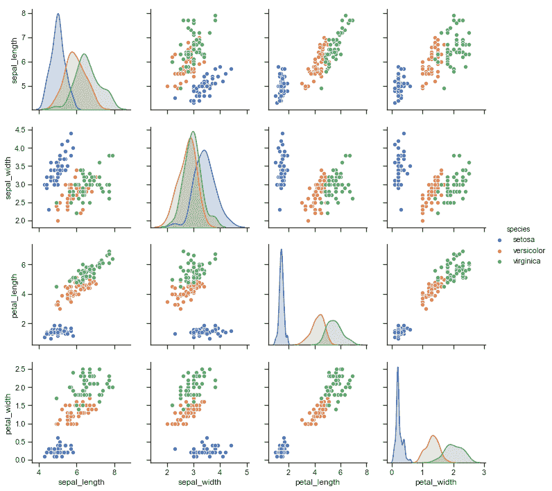

seaborn 中的 pair-plot 可视化了数据集中的成对关系。每个子图显示了散点图中一个变量与另一个变量之间的关系。对角线上的支线图显示了变量的分布。这些颜色对应于三个等级。

从这个图中，特别是如果你沿着对角线看，我们可以看到海滨锦鸡儿和杂色锦鸡儿是不可分的。这是我们将要努力解决的问题，也是我们必须克服的问题。

2.  让我们快速浏览一下数据集:

```py
iris.head()
```

我们只看到 setosa，因为花卉种类被一个接一个地排序和列出:

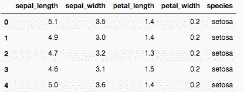

3.  在准备培训时，将功能和目标分开，如下所示:

```py
classes = {'setosa': 0, 'versicolor': 1, 'virginica': 2}
X = iris[['sepal_length', 'sepal_width', 'petal_length', 'petal_width']].values
y = iris['species'].apply(lambda x: classes[x]).values
```

最后一行将对应于三个类的三个字符串转换成数字——这被称为序数编码。多类机器学习算法可以处理这种情况。对于神经网络，我们将使用另一种编码，稍后您会看到。

完成这些基本步骤后，我们就可以开始开发预测模型了。这些是根据特征预测花类的模型。对于 Python 中三个最重要的机器学习库，我们将依次看到这一点。先说 scikit-learn。

### scikit 中的建模-学习

在这个菜谱中，我们将在 scikit-learn 中创建一个分类器，并检查它的性能。

Scikit-learn(也称为 sklearn)是 2007 年开始开发的 Python 机器学习框架。它也是可用的最全面的框架之一，并且可以与 pandas、NumPy、SciPy 和 Matplotlib 库互操作。scikit-learn 的大部分已经在 Cython、C 和 C++中针对速度和效率进行了优化。

请注意，不是所有的 scikit-learn 分类器都可以处理多类问题。所有的分类器都可以进行二元分类，但不是所有的分类器都可以进行两个以上的分类。幸运的是，随机森林模型可以。**随机森林**模型(有时也称为**随机决策森林**)是一种可以应用于分类和回归任务的算法，是决策树的集合。主要思想是，我们可以通过在数据集的自举样本上创建决策树来提高精度，并对这些树进行平均。

下面几行代码对您来说应该是样板文件，我们会反复使用它们:

1.  单独培训和验证。

作为一个良好的实践，我们应该总是在训练中没有使用的数据样本上测试我们的模型的性能(称为**坚持集**或**验证集**)。我们可以这样做:

```py
from sklearn.ensemble import RandomForestClassifier
from sklearn.model_selection import train_test_split

X_train, X_test, y_train, y_test = train_test_split(
    X, y, test_size=0.33, random_state=0
)
```

2.  定义一个模型。

这里我们定义了我们的模型**超参数**，并用这些超参数创建模型实例。在我们的例子中，情况如下:

超参数不是学习过程的一部分，但是控制学习。在神经网络的情况下，这包括学习速率、模型结构和激活函数。

```py
params = dict(
    max_depth=20,
    random_state=0,
    n_estimators=100,
)
clf = RandomForestClassifier(**params)
```

3.  训练模型。

这里，我们将训练数据集传递给我们的模型。在训练期间，模型的参数被拟合，以便我们获得更好的结果(其中*更好的*由一个函数定义，称为**成本函数**或**损失函数**)。

对于培训，我们使用`fit`方法，该方法适用于所有 sklearn 兼容型号:

```py
clf.fit(X_train, y_train)
```

4.  检查模型的性能。

虽然模型内部有一个度量标准(成本函数)，但我们可能还想看看其他的度量标准。在建模的上下文中，这些被称为度量。在 scikit-learn 中，我们手边有很多指标。对于分类，我们通常会查看混淆矩阵，并且经常会想要绘制它:

```py
from sklearn.metrics import plot_confusion_matrix

plot_confusion_matrix(
    clf, X_test, y_test,
    display_labels=['setosa', 'versicolor', 'virginica'],
    normalize='true'
)
```

混淆矩阵相对直观，尤其是当演示像 sklearn 的`plot_confusion_matrix()`一样清晰的时候。基本上，我们可以看到我们的类预测与实际类的符合程度。我们可以看到对实际标签的预测，按类分组，因此每个条目对应于在给定实际类 b 的情况下预测类 A 的次数。在这种情况下，我们对矩阵进行了规范化，因此每行(实际标签)的总和为 1。

这是混淆矩阵:

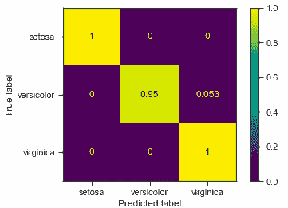

由于这是一个归一化矩阵，对角线上的数字也被称为**命中率**或**真阳性率**。我们可以看到，setosa 被预测为 setosa 的概率为 100% (1)。相比之下，在 95%的时间(0.95)中，杂色被预测为杂色，而在 5%的时间(0.053)中，它被预测为海滨。

然而，就命中率而言，性能非常好；正如所料，我们有一个小问题区分杂色和海滨。

让我们继续到 Keras。

### Keras 中的建模

在这个食谱中，我们将预测喀拉斯的花卉种类。

Keras 是(深度)神经网络模型的高级接口，可以使用 TensorFlow 作为后端，也可以使用**微软认知工具包** ( **CNTK** )、Theano 或 PlaidML。Keras 是一个开发 AI 模型的接口，而不是一个独立的框架本身。Keras 已经集成为 TensorFlow 的一部分，所以我们从 TensorFlow 导入 Keras。TensorFlow 和 Keras 都是开源的，由 Google 开发。

由于 Keras 与 TensorFlow 紧密集成，Keras 模型可以保存为 TensorFlow 模型，然后部署在谷歌的部署系统 TensorFlow Serving(参见[https://www.tensorflow.org/tfx/guide/serving](https://www.tensorflow.org/tfx/guide/serving))中，或者从任何编程语言(如 C++或 Java)中使用。让我们开始吧:

1.  运行以下代码。如果您熟悉 Keras，您会认为它是样板文件:

```py
from tensorflow.keras.models import Sequential
from tensorflow.keras.layers import Dense
import tensorflow as tf

def create_iris_model():
    '''
    Create the iris classification model
    '''
    iris_model = Sequential()
    iris_model.add(Dense(10, activation='selu', input_dim=4))
    iris_model.add(Dense(3, activation='softmax'))
    iris_model.compile(
        optimizer='rmsprop',
        loss='categorical_crossentropy',
        metrics=['accuracy']
    )
    iris_model.summary()
    return iris_model

iris_model = create_iris_model()
```

这产生了以下模型构造:

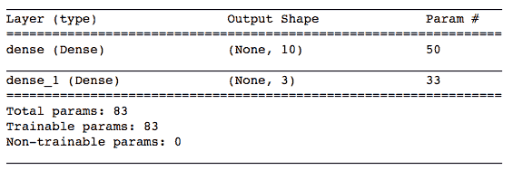

我们可以用不同的方式来想象这个模型。我们可以使用内置的 Keras 功能，如下所示:

```py
dot = tf.keras.utils.model_to_dot(
    iris_model,
    show_shapes=True,
    show_layer_names=True,
    rankdir="TB",
    expand_nested=True,
    dpi=96,
    subgraph=False,
)
dot.write_png('iris_model_keras.png')
```

这将把网络的可视化写到一个名为`iris_model_keras.png`的文件中。生成的图像如下所示:

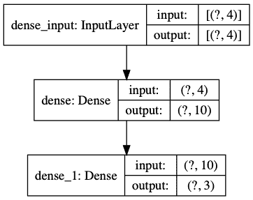

这表明我们有 4 个输入神经元、10 个隐藏神经元和 3 个输出神经元，它们以前馈方式完全连接。这意味着输入中的所有神经元将输入馈送给隐藏层中的所有神经元，隐藏层又馈送给输出层中的所有神经元。

我们使用顺序模型结构(与图表相反)。顺序模型类型比图表类型更容易构建。这些层以相同的方式构造；但是，对于序列模型，您必须定义输入维度`input_dim`。

我们使用两个密集层，中间层具有 SELU 激活函数，最后一层具有 softmax 激活函数。我们将在*中解释这两者是如何工作的...*一节。至于 **SELU 激活函数**，现在可以说它提供了必要的非线性，这样神经网络就可以处理更多不可线性分离的变量，就像我们的情况一样。在实践中，很少在隐藏层中使用线性(**身份函数**)激活。

最后一层中的每个单元(或神经元)对应于三个类别中的一个。 **softmax 函数**对输出层进行归一化，使其神经激活加起来等于 1。我们用分类交叉熵作为损失函数进行训练。交叉熵通常用于神经网络的分类问题。二元交叉熵损失是针对两个类别的，而分类交叉熵损失是针对两个或更多类别的(交叉熵将在*中更详细地解释它是如何工作的...*节)。

2.  接下来，对特征进行一次性编码。

这意味着我们有三列，每列代表一个物种，其中一列将被设置为对应类的`1`:

```py
y_categorical = tf.keras.utils.to_categorical(y, 3)
```

我们的`y_categorical`因此具有形状(150，3)。这意味着，为了将类 0 表示为标签，而不是有一个`0`(这有时会被称为**标签编码**或**整数编码**)，我们有一个矢量`[1.0, 0.0, 0.0]`。这叫做**一键编码**。每行的总和等于 1。

3.  将特征标准化。

对于神经网络，我们的特征应该以这样一种方式进行归一化，即激活函数可以处理整个范围的输入-通常这种归一化是针对标准分布的，其平均值为 0.0，标准偏差为 1.0:

```py
X = (X - X.mean(axis=0)) / X.std(axis=0)
X.mean(axis=0)
```

这个细胞的输出是这样的:

```py
array([-4.73695157e-16, -7.81597009e-16, -4.26325641e-16, -4.73695157e-16])
```

我们看到每一列的平均值都非常接近于零。我们还可以使用以下命令查看标准偏差:

```py
X.std(axis=0)
```

输出如下所示:

```py
array([1., 1., 1., 1.])
```

标准差正好是`1`，和预期的一样。

4.  在 TensorBoard 上展示我们的训练进度。

TensorBoard 是用于神经网络学习的可视化工具，例如跟踪和可视化指标、模型图、特征直方图、投影嵌入等等:

```py
%load_ext tensorboard
import os

logs_base_dir = "./logs"
os.makedirs(logs_base_dir, exist_ok=True)
%tensorboard --logdir {logs_base_dir}
```

此时，您的笔记本中应该会弹出一个 TensorBoard 小部件。我们只需要确保它得到它需要的信息:

5.  将 TensorBoard 详细信息作为回调插入 Keras 培训功能，以便 TensorBoard 获得培训信息:

```py
import datetime

logdir = os.path.join(
  logs_base_dir,
  datetime.datetime.now().strftime("%Y%m%d-%H%M%S")
)
tensorboard_callback = tf.keras.callbacks.TensorBoard(
  logdir, histogram_freq=1
)
X_train, X_test, y_train, y_test = train_test_split(
    X, y_categorical, test_size=0.33, random_state=0
)
iris_model.fit(
  x=X_train,
  y=y_train,
  epochs=150,
  callbacks=[tensorboard_callback]
)
```

这就是我们的训练。一个时期是数据集通过神经网络的整个过程。我们这里用`150`，有点武断。当验证和训练错误开始发散时，或者换句话说，当过度拟合发生时，我们可以使用停止标准来自动停止训练。

为了像以前一样使用`plot_confusion_matrix()`，为了进行比较，我们必须将模型包装在一个实现`predict()`方法的类中，并且有一个`classes_`列表和一个等同于分类器的属性`_estimator_type`。我们将在在线材料中展示这一点。

6.  绘制混淆矩阵。

在这里，使用`scikitplot`函数更容易:

```py
import scikitplot as skplt

y_pred = iris_model.predict(X_test).argmax(axis=1)
skplt.metrics.plot_confusion_matrix(
    y_test.argmax(axis=1),
    y_pred,
    normalize=True
)
```

再次，像以前一样，我们归一化矩阵，所以我们得到分数。输出应该类似于以下内容:

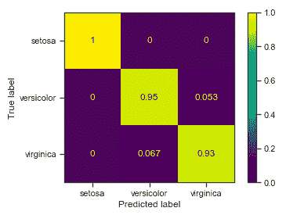

这比我们之前在 scikit-learn 中的尝试要差一点，但是经过一些调整，我们可以达到相当的水平，或者甚至更好的性能。调整的例子可以是改变模型的任何超参数，例如隐藏层中神经元的数量，对网络架构的任何改变(添加新层)，或者改变隐藏层的激活函数。

7.  查看 TensorBoard 的图表:训练进度和模型图。他们在这里:

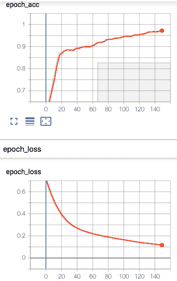

这些图分别显示了整个训练过程中的准确度和损失。我们还在 TensorBoard 中得到了网络的另一种可视化:

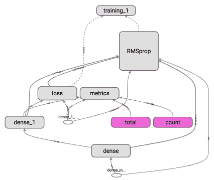

这显示了所有网络层、损耗和度量、优化器(RMSprop)和训练例程，以及它们之间的关系。至于网络架构，我们可以看到四个密集层(所呈现的输入和目标不被认为是网络的适当部分，因此用白色表示)。网络由一个密集的隐藏层(由输入提供)和一个密集的输出层(由隐藏层提供)组成。在输出层激活和目标之间计算损失函数。优化器基于损失处理所有层。你可以在[https://www.tensorflow.org/tensorboard/get_started](https://www.tensorflow.org/tensorboard/get_started)找到 TensorBoard 的教程。TensorBoard 文档解释了有关配置和选项的更多信息。

因此，在训练时期的过程中，分类精度在提高，损失在减少。最后一张图显示了网络和培训架构，包括两个密集层、损耗和指标以及优化器。

### PyTorch 建模

在本食谱中，我们将描述一个与 Keras 中所示的网络等效的网络，对其进行训练，并绘制性能图。

PyTorch 是一个基于 Torch 库的深度学习框架，最初由脸书开发。一段时间以来，脸书正在开发另一个深度学习框架，名为 Caffe2 不过 2018 年 3 月并入 PyTorch。PyTorch 的一些优势在于图像和语言处理应用程序。除了 Python，Torch 还提供了一个 C++接口，用于学习和模型部署:

1.  让我们首先定义模型架构。这看起来与 Keras 非常相似:

```py
import torch
from torch import nn

iris_model = nn.Sequential(
  torch.nn.Linear(4, 10), # equivalent to Dense in keras
  torch.nn.SELU(),
  torch.nn.Linear(10, 3),
  torch.nn.Softmax(dim=1)
)
print(iris_model)
```

这与我们之前在 Keras 中定义的架构相同:这是一个前馈的双层神经网络，在隐藏层上有一个 SELU 激活，在 2 层上有 10 个和 3 个神经元。

如果您喜欢类似于 Keras 中的`summary()`函数的输出，您可以使用`torchsummary`包(【https://github.com/sksq96/pytorch-summary】[)。](https://github.com/sksq96/pytorch-summary)

2.  我们需要将 NumPy 阵列转换为 Torch 张量:

```py
from torch.autograd import Variable

X_train = Variable(
    torch.Tensor(X_train).float()
)
y_train = Variable(torch.Tensor(
   y_train.argmax(axis=1)).long()
)
X_test = Variable(
    torch.Tensor(X_test).float()
)
y_test = Variable(
    torch.Tensor(y_test.argmax(axis=1)).long()
)
```

`y_train`是我们之前创建的一键编码目标矩阵。我们将其转换回整数编码，因为 PyTorch 交叉熵损失预计到了这一点。

3.  现在我们可以训练了，如下:

```py
criterion = torch.nn.CrossEntropyLoss()  # cross entropy loss
optimizer = torch.optim.RMSprop(
    iris_model.parameters(), lr=0.01
)
for epoch in range(1000):
  optimizer.zero_grad()
  out = iris_model(X_train)
  loss = criterion(out, y_train)
  loss.backward()
  optimizer.step()
  if epoch % 10 == 0:
    print('number of epoch', epoch, 'loss', loss)
```

4.  然后我们将使用`scikitplot`来可视化我们的结果，与之前类似:

```py
import scikitplot as skplt

y_pred = iris_model(X_test).detach().numpy()
skplt.metrics.plot_confusion_matrix(
    y_test,
    y_pred.argmax(axis=1),
    normalize=True
)
labels = ['setosa', 'versicolor', 'virginica']
ax.set_xticklabels(labels)
ax.set_yticklabels(labels)
```

这是我们得到的情节:

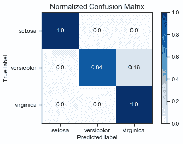

你的计划可能会不同。神经网络学习是不确定的，所以你可能得到更好或更差的数字，或者只是不同的数字。

如果我们让它运行更长时间，我们可以获得更好的性能。这是留给你的练习。

## 它是如何工作的...

我们将首先看看神经网络训练背后的直觉，然后我们将更多地看看我们将在 PyTorch 和 Keras 食谱中使用的一些技术细节。

### 神经网络训练

机器学习的基本思想是，我们试图通过改变模型的参数来最小化错误。参数的这种适应被称为学习。在监督学习中，误差由在模型预测和目标之间计算的损失函数来定义。该误差在每一步计算，并且相应地调整模型参数。

神经网络是由可调仿射变换( *f* )和激活函数(sigma)组成的可组合函数近似器:

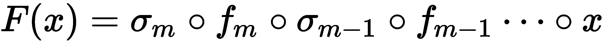

用最简单的术语来说，在具有线性激活的一层前馈神经网络中，模型预测由系数与其所有维度的输入的乘积之和给出:

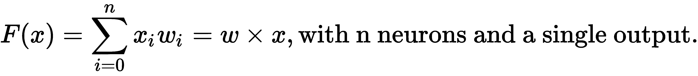

这个叫做**感知器**，是线性二元分类器。下图显示了一个带有四个输入的简单示例:

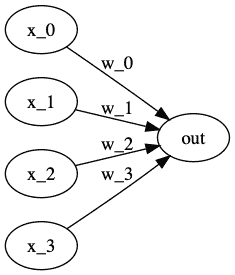

一维输入的预测值分解为二维直线的斜率截距形式，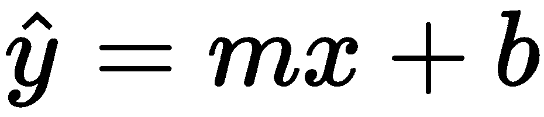。这里， *m* 是斜率， *b* 是 y 轴截距。对于更高维的输入，我们可以用偏差项和权重来写(改变符号和矢量化)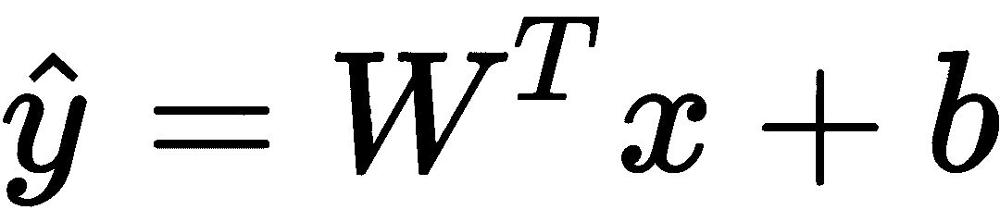。这仍然是一条线，只是在与输入维数相同的空间中。请注意，表示我们对的模型预测，对于已知的例子，我们可以计算两者之差作为我们的预测误差。

我们也可以使用相同的非常简单的线性代数，通过如下阈值处理来定义二元分类器:

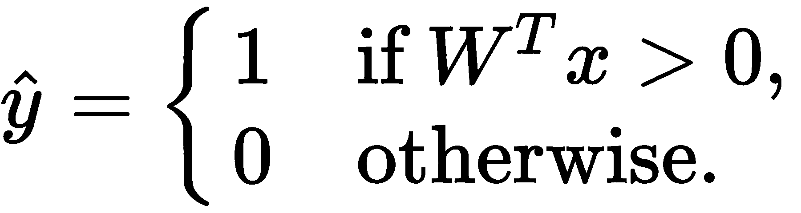

这还是很简单的线性代数。这种只有一层的线性模型称为感知器，很难预测任何更复杂的关系。在 Minsky 和 Papert 于 1969 年发表了一篇有影响力的论文之后，这导致了对神经网络局限性的深切关注。然而，自 20 世纪 90 年代以来，神经网络一直在以**支持向量机** ( **支持向量机**)和**多层感知器** ( **MLP** )的形式复兴。MLP 是一个前馈神经网络，在输入和输出之间至少有一层(**隐层**)。由于具有许多层线性激活的多层感知器可以减少到只有一层，不平凡的是，我们将提到具有隐藏层和非线性激活函数的神经网络。这些类型的模型可以近似任意函数，并执行非线性分类(根据通用近似定理)。任何层上的激活函数可以是任何可微的非线性；传统上，乙状结肠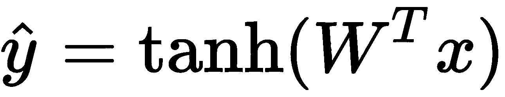已被大量用于此目的。

为了便于说明，让我们用`jax`写下来:

```py
import jax.numpy as np
from jax import grad, jit
import numpy.random as npr

def predict(params, inputs):
    for W, b in params:
        outputs = np.dot(inputs, W) + b
        inputs = np.tanh(outputs)
    return outputs

def construct_network(layer_sizes=[10, 5, 1]):
    '''Please make sure your final layer corresponds to
    the target dimensionality.
    '''
    def init_layer(n_in, n_out):
        W = npr.randn(n_in, n_out)
        b = npr.randn(n_out,)
        return W, b
    return list(
        map(init_layer, layer_sizes[:-1], layer_sizes[1:])
    )

params = construct_network()
```

如果你看看这段代码，你会发现我们同样可以用 NumPy、TensorFlow 或 PyTorch 中的操作来编写这段代码。您还会注意到,`construct_network()`函数带有一个`layer_sizes`参数。这是网络的超参数之一，需要在学习之前决定。我们可以选择[1]的输出来获得感知器，或者[10，1]来获得两层感知器。这显示了如何获得一个作为一组参数的网络，以及如何从这个网络获得一个预测。我们还没有讨论如何学习参数，这给我们带来了错误。

有句谚语说，“所有的模型都是错的，但有些是有用的。”我们可以测量模型的误差，这可以帮助我们计算参数的变化幅度和方向，以减少误差。

给定一个(可微的)损失函数(也叫成本函数)，，比如**均方误差** ( **MSE** ，我们就可以计算出我们的误差。在 MSE 的情况下，损失函数如下:

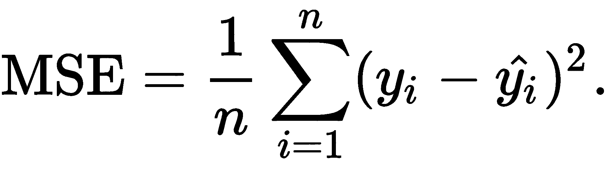

然后，为了改变我们的权重，我们将使用训练中各点损失的导数:

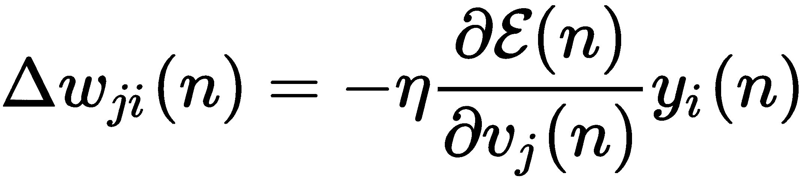

这意味着我们正在应用梯度下降，这意味着随着时间的推移，我们的误差将与梯度成比例地减少(按学习率成比例)。让我们继续我们的代码:

```py
def mse(preds, targets):
    return np.sum((preds - targets)**2)

def propagate_and_error(loss_fun):
    def error(params, inputs, targets):
        preds = predict(params, inputs)
        return loss_fun(preds, targets)
    return error

error_grads = jit(grad(propagate_and_error(mse)))
```

PyTorch 和 JAX 都有`autograd`功能，这意味着我们可以自动获得广泛函数的导数(梯度)。

在这本书里，我们会遇到很多不同的激活和损失函数。在本章中，我们使用了 SELU 激活函数。

### SELU 激活函数

**标度指数线性单元** ( **SELU** )激活函数最近由 Klambauer 等人在 2017 年发表([http://papers . nips . cc/paper/6698-self-normalizing-neural-networks . pdf](http://papers.nips.cc/paper/6698-self-normalizing-neural-networks.pdf)):

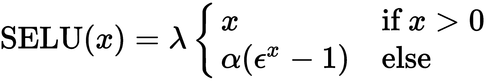

对于 x 的正值，SELU 函数是线性的，对于负值，是比例指数，当 *x* 为 0 时，该函数为 0。是一个大于 1 的值。细节可以在原论文中找到。SELU 函数已被证明比其他函数具有更好的收敛特性。你可以在[https://arxiv.org/pdf/1804.02763.pdf](https://arxiv.org/pdf/1804.02763.pdf)找到 Padamonti (2018)中激活函数的对比。

### Softmax 激活

作为神经网络输出层的激活函数，我们使用 softmax 函数。这作为输出层的神经激活总和 1.0 的归一化。因此，输出可以解释为类别概率。softmax 激活功能定义如下:

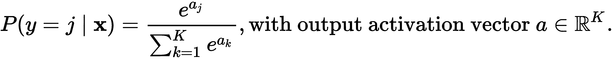

### 交叉熵

在使用神经网络的多类训练中，通常训练交叉熵。多类情况下的二元交叉熵如下所示:

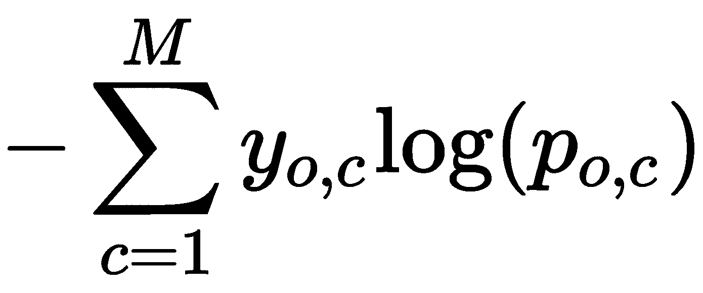

这里， *M* 是类(setosa、versicolor 和 virginica)的数量， *y* 是 0 或 1，如果类标签 *c* 是正确的，并且 *p* 是观测值 *o* 是类 *c* 的预测概率。您可以在 ml-cheatsheet 网站上阅读有关不同损失函数和指标的更多信息，网址为[https://ml-cheat sheet . readthedocs . io/en/latest/loss _ functions . html](https://ml-cheatsheet.readthedocs.io/en/latest/loss_functions.html)。

## 请参见

您可以在本食谱中使用的每个库的网站上找到更多详细信息:

*   `Seaborn`:[https://seaborn.pydata.org/](https://seaborn.pydata.org/)
*   `Scikit-plot` : [https://scikit-plot.readthedocs.io/](https://scikit-plot.readthedocs.io/)
*   `Scikit-learn`:[https://github.com/scikit-learn/scikit-learn](https://github.com/scikit-learn/scikit-learn)
*   `Keras` : [https://github.com/keras-team/keras](https://github.com/keras-team/keras)
*   `TensorFlow`:[http://tensorflow.org/](http://tensorflow.org/)
*   `TensorBoard`:[https://www.tensorflow.org/tensorboard](https://www.tensorflow.org/tensorboard)
*   `PyTorch`:[https://pytorch.org/](https://pytorch.org/)

TensorboardX 是除 TensorFlow (PyTorch、Chainer、MXNet 等)之外的其他深度学习框架的 TensorBoard 接口，可在[https://github.com/lanpa/tensorboardX](https://github.com/lanpa/tensorboardX)获得。

可能需要注意的是，scikit-plot 不再被维护。对于机器学习指标和图表的绘制，mlxtend 是一个很好的选择，在[http://rasbt.github.io/mlxtend/](http://rasbt.github.io/mlxtend/)。

我们在这里使用的以及将在本书中遇到的其他一些库包括:

*   `Matplotlib`:[https://matplotlib.org/](https://matplotlib.org/)
*   `NumPy`:[https://docs.scipy.org/doc/numpy](https://docs.scipy.org/doc/numpy)
*   `SciPy`:[https://docs.scipy.org/doc/scipy/reference](https://docs.scipy.org/doc/scipy/reference)
*   `pandas`:[https://pandas.pydata.org/pandas-docs/stable](https://pandas.pydata.org/pandas-docs/stable)

在下面的食谱中，我们将在 Keras 中抓住一个更现实的例子。

# 使用 Keras 建模

在这个方法中，我们将加载一个数据集，然后我们将进行**探索性数据分析** ( **EDA** )，例如可视化分布。

我们将执行典型的预处理任务，例如对分类变量进行编码，以及对神经网络训练进行标准化和重新标度。然后，我们将在 Keras 中创建一个简单的神经网络模型，使用生成器训练模型绘图，并绘制训练和验证性能。我们将看一个非常简单的数据集:来自 UCI 机器学习知识库的 dult 数据集。使用该数据集(也称为人口普查收入数据集)，目标是根据人口普查数据预测某人的年收入是否超过 50，000 美元。

因为我们有几个分类变量，我们也将处理分类变量的编码。

由于这仍然是一个介绍性的食谱，我们将通过大量的细节来说明这个问题。我们将拥有以下零件:

*   数据加载和预处理:

    1.  加载数据集
    2.  检查数据
    3.  分类编码
    4.  绘制变量和分布
    5.  绘制相关性
    6.  标签编码
    7.  标准化和缩放
    8.  保存预处理的数据

*   模型培训:

    1.  创建模型
    2.  编写数据生成器
    3.  训练模型
    4.  策划表演
    5.  提取性能指标
    6.  计算特征重要性

## 做好准备

除了我们之前安装的库之外，我们还需要一些库来保存这个食谱:

*   `category_encoders`用于分类变量的编码
*   `minepy`对于基于信息的相关性测量
*   `eli5`对于黑盒模型的检查

我们以前使用过 Seaborn 进行可视化。

我们可以按如下方式安装这些库:

```py
!pip install category_encoders minepy eli5 seaborn
```

读者们，请注意:如果你们一起使用`pip`和`conda`,就会有一些库变得不兼容的危险，造成一个不稳定的环境。当`conda`版本可用时，我们推荐使用`conda`，尽管使用`pip`通常更快。

此数据集已经分为训练和测试两部分。让我们从 UCI 下载数据集，如下所示:

```py
!wget http://archive.ics.uci.edu/ml/machine-learning-databases/adult/adult.data
!wget http://archive.ics.uci.edu/ml/machine-learning-databases/adult/adult.test
```

`wget`默认情况下，macOS 不附带；我们建议使用【https://formulae.brew.sh/formula/wget】()安装`wget`。在 Windows 上，您可以访问前面两个 URL，并通过文件菜单下载这两个 URL。确保您记住了保存文件的目录，以便以后可以找到它们。但是，有几个备选方案:

*   你可以使用我们在[第二章](bca59029-1915-4856-b47d-6041d7b10a0a.xhtml)、*监督机器学习的高级主题*、PyTorch 菜谱中*预测房价中提供的下载脚本。*
*   你可以安装`wget`库并运行`import wget; wget.download(URL, filepath)`。

我们从 UCI 数据集描述页面获得以下信息:
-年龄:连续。
-工作类:私人，自我雇佣非公司，自我雇佣公司，联邦政府，地方政府，州政府，无薪，从未工作。
- fnlwgt:连续。
-教育:学士、部分大学、11 年级、HS-grad、Prof-school、Assoc-acdm、Assoc-voc、9 年级、7 年级、12 年级、硕士、1-4 年级、10 年级、博士、5-6 年级、学前班。
-教育-编号:连续。
-婚姻状况:已婚-同居-配偶、离婚、未婚、分居、丧偶、已婚-配偶不在、已婚-配偶。职业:技术支持、工艺修理、其他服务、销售、行政管理、专业教授、搬运工人、清洁工、机器操作员、行政文员、农业渔业、运输搬运、私人住宅服务、保安服务、武装部队。
-关系:妻子、亲生子女、丈夫、非家庭成员、其他亲属、未婚。种族:白人、亚洲太平洋岛民、美洲印第安爱斯基摩人、其他人、黑人。
-性别:女，男。
-资本收益:持续。
-资本损失:连续。
-每周小时数:连续。
-本国:美国，以此类推。

`fnlwgt`实际代表最终重量；换句话说，构成条目的总人数。

请记住，这个数据集是一个众所周知的数据集，已经在科学出版物和机器学习教程中多次使用。我们在这里使用它来复习 Keras 中的一些基础知识，而不必关注数据集。

## 怎么做...

正如我们之前提到的，我们将首先加载数据集，进行一些 EDA，然后在 Keras 中创建一个模型，训练它，并查看性能。

我们将这个方法分为数据加载和预处理，其次是模型训练。

### 数据加载和预处理

我们将从加载训练集和测试集开始:

1.  **加载数据集**:为了加载数据集，我们将再次使用熊猫。我们像以前一样使用熊猫的`read_csv()`命令:

```py
import pandas as pd
cols = [
    'age', 'workclass', 'fnlwgt',
    'education', 'education-num',
    'marital-status', 'occupation',
    'relationship', 'race', 'sex',
    'capital-gain', 'capital-loss',
    'hours-per-week', 'native-country', '50k'
]
train = pd.read_csv(
    'adult.data',
    names=cols
)
test = pd.read_csv(
    'adult.test',
    names=cols
)
```

现在我们来看数据！

2.  **检查数据**:我们可以用`head()`方法看到的数据帧的开始:

```py
train.head()
```

这会产生以下输出:

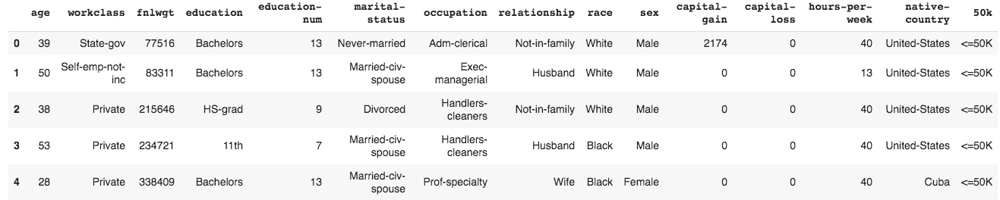

接下来，我们将查看测试数据:

```py
test.head()
```

这看起来如下:

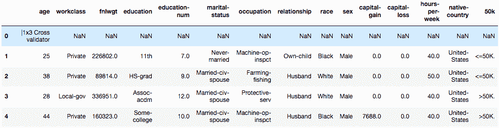

第一行有 14 个空值和 15 列中的 1 列不可用。我们将放弃这一行:

```py
test.drop(0, axis=0, inplace=True)
```

它不见了。

3.  **分类编码**:先说分类编码。对于 EDA 来说，使用序数编码是很好的。这意味着对于分类特征，我们将每个值映射到一个不同的数字:

```py
import category_encoders as ce

X = train.drop('50k', axis=1)
encoder = ce.OrdinalEncoder(cols=list(
    X.select_dtypes(include='object').columns)[:]
)
encoder.fit(X, train['50k'])
X_cleaned = encoder.transform(X)

X_cleaned.head()
```

我们在这里将特征 *X* 和目标 *y* 分开。要素不包含标注；这就是`drop()`方法的目的——我们同样可以使用`del train['50k']`。

结果如下:

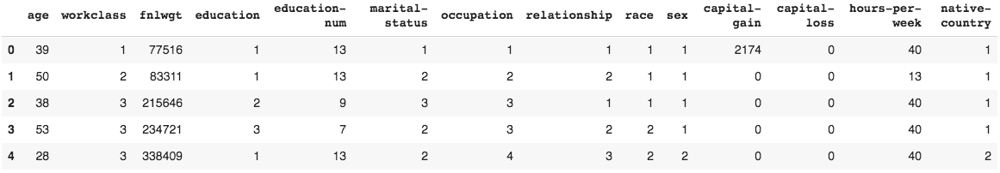

当开始一项新任务时，最好做 EDA。让我们画出这些变量中的一些。

4.  要绘制变量和分布，请使用以下代码块:

```py
from scipy import stats
import seaborn as sns
sns.set(color_codes=True)
sns.set_context(
 'notebook', font_scale=1.5,
 rc={"lines.linewidth": 2.0}
)
sns.distplot(train['age'], bins=20, kde=False, fit=stats.gamma)
```

我们会得到如下的情节:

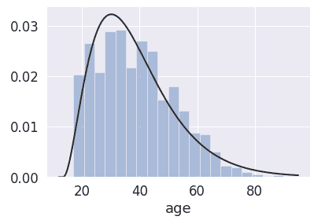

接下来，我们将再次查看配对图。我们将绘制所有相互对应的数字变量:

```py
import numpy as np

num_cols = list(
  set(
    train.select_dtypes(
      include='number'
    ).columns
  ) - set(['education-num'])
) + ['50k']]
g = sns.pairplot(
 train[num_cols],
 hue='50k',
 height=2.5,
 aspect=1,
)
for i, j in zip(*np.triu_indices_from(g.axes, 1)):
  g.axes[i, j].set_visible(False)
```

正如在前面的配方中所讨论的，配对图中的对角线向我们显示了单个变量的直方图——即变量的分布——以及由类定义的色调。这里我们有橙色对蓝色(见下图右侧的图例)。对角线上的以下子图显示了两个变量之间的散点图:

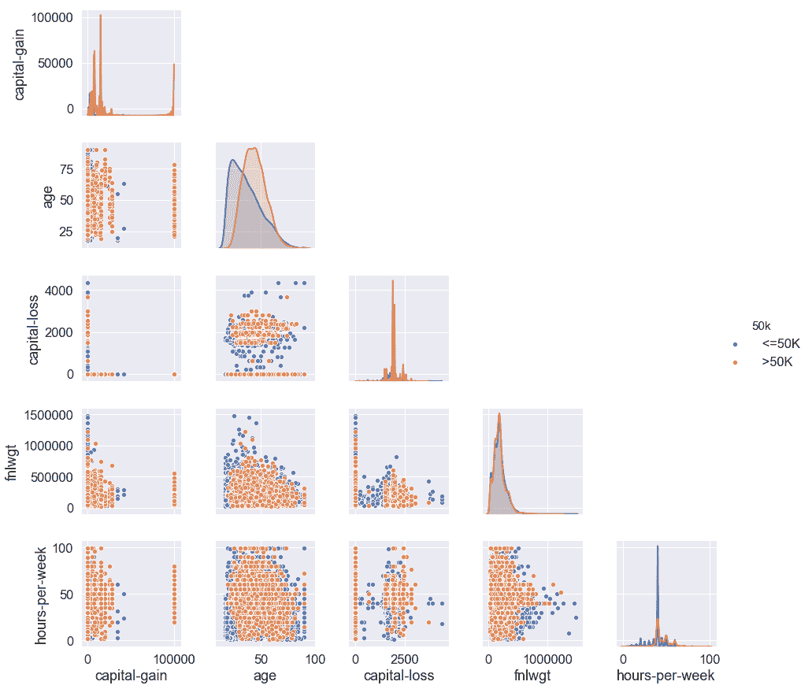

如果我们观察对角线(第二行)上的年龄变量，我们会看到这两个类具有不同的分布，尽管它们仍然重叠。因此，年龄似乎对我们的目标群体有歧视性。

我们也可以在分类图中看到:

```py
sns.catplot(x='50k', y='age', kind='box', data=train)
```

这是结果图:

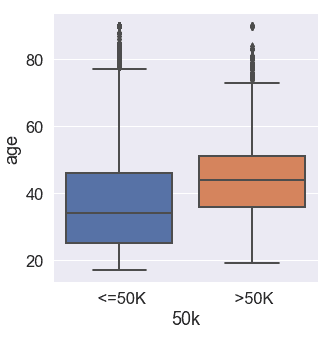

在这之后，让我们继续看相关图。

5.  **绘制相关性**:为了了解变量之间的冗余，我们将绘制一个基于**最大信息系数** ( **MIC** )的相关性矩阵，这是一个基于信息熵的相关性度量。我们会在食谱的最后解释麦克风。

由于 MIC 的计算需要一段时间，我们将采用之前介绍的并行模式。请注意线程池的创建和`map`操作:

```py
import numpy as np
import os
from sklearn.metrics.cluster import adjusted_mutual_info_score
from minepy import MINE
import multiprocessing

def calc_mic(args):
  (a, b, i1, i2) = args
  mine = MINE(alpha=0.6, c=15, est='mic_approx')
  mine.compute_score(a, b)
  return (mine.mic(), i1, i2)

pool = multiprocessing.Pool(os.cpu_count())

corrs = np.zeros((len(X_cleaned.columns), len(X_cleaned.columns)))
queue = []
for i1, col1 in enumerate(X_cleaned.columns):
  if i1 == 1:
    continue
  for i2, col2 in enumerate(X_cleaned.columns):
    if i1 < i2:
      continue
    queue.append((X_cleaned[col1], X_cleaned[col2], i1, i2))

results = pool.map(calc_mic, queue)

for (mic, i1, i2) in results:
  corrs[i1, i2] = mic

corrs = pd.DataFrame(
    corrs,
    columns=list(X_cleaned.columns),
    index=list(X_cleaned.columns)
)
```

这仍然需要一段时间，但应该比按顺序进行计算要快得多。

让我们将关联矩阵可视化为热图:因为矩阵是对称的，所以在这里，我们将只显示下面的三角形，并应用一些漂亮的样式:

```py
mask = np.zeros_like(corrs, dtype=np.bool)
mask[np.triu_indices_from(mask)] = True
cmap = sns.diverging_palette(
    h_neg=220, h_pos=10, n=50, as_cmap=True
)
sns.set_context(
    'notebook', font_scale=1.1,
    rc={'lines.linewidth': 2.0}
)
sns.heatmap(
    corrs,
    square=True,
    mask=mask,
    cmap=cmap, vmax=1.0, center=0.5,
    linewidths=.5,
    cbar_kws={"shrink": .5}
)
```

这看起来如下:

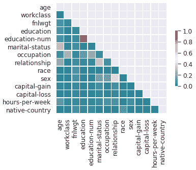

我们可以在相关矩阵热图中看到，大多数对的相关性相当低(大多数相关性低于 0.4)，这意味着大多数特征相对不相关；然而，有一对变量很突出，它们是`education-num`和`education`:

```py
corrs.loc['education-num', 'education']
```

输出为`0.9995095286140694`。

这是它所能得到的最接近完美的相关性。这两个变量实际上指的是相同的信息。

让我们看看`education`中每个值在`education-num`中的方差:

```py
train.groupby(by='education')['education-num'].std()
```

我们只看到零。没有差异。换句话说，`education`中的每个值恰好对应于`education-num`中的一个值。变量完全一样！我们应该能够删除其中一个，例如用`del train['education']`，或者在训练中忽略其中一个。

UCI 描述页面提到了缺失的变量。现在让我们寻找缺失的变量:

```py
train.isnull().any()
```

我们只看到每个变量的`False`，所以我们在这里看不到任何丢失的值。

在神经网络训练中，对于分类变量，我们可以选择使用嵌入(我们将在[第 10 章](955f3e81-9e58-483b-bc9d-b23981325b62.xhtml)、*自然语言处理*中讨论这些)或者作为一次性编码输入；这意味着每一个因素，每一个可能的值，都被编码在一个二进制变量中，这个二进制变量表示它是否是给定的。为了简单起见，让我们试试一键编码。

所以，首先，让我们重新编码变量:

```py
encoder = ce.OneHotEncoder(
    cols=list(X.select_dtypes(include='object').columns)[:]
)
encoder.fit(X, train['50k'])
X_cleaned = encoder.transform(X)
x_cleaned_cols = X_cleaned.columns
x_cleaned_cols
```

我们的`x_cleaned_cols`看起来如下:

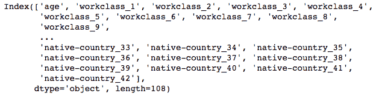

在这之后，是时候给我们的标签编码了。

6.  **标签编码**:我们将把目标值编码成两列，如果存在则为 1，如果不存在则为 0。请记住，对于 false 和 true，Python 的真值分别对应于 0 和 1。因为我们有一个二进制分类任务(也就是说，我们只有两个类)，所以我们可以在单个输出中使用 0 和 1。如果我们有两个以上的类，我们必须对输出使用分类编码，这通常意味着我们使用和类一样多的输出神经元。通常，我们不得不尝试不同的解决方案，以找出最有效的方案。

在下面的代码块中，我们只是做了一个选择并坚持下去:

```py
y = np.zeros((len(X_cleaned), 2))
y[:, 0] = train['50k'].apply(lambda x: x == ' <=50K')
y[:, 1] = train['50k'].apply(lambda x: x == ' >50K')
```

7.  **标准化和缩放**:我们必须将所有值转换成 z 值。这是当我们减去平均值并除以标准差时，为了得到平均值为 0.0、标准差为 1.0 的正态分布。神经网络输入不需要正态分布。然而，重要的是数值被缩放到神经网络激活函数的敏感部分。转换为 z 分数是一种标准的方法:

```py
from sklearn.preprocessing import StandardScaler

standard_scaler = StandardScaler()
X_cleaned = standard_scaler.fit_transform(X_cleaned)
X_test = standard_scaler.transform(encoder.transform(test[cols[:-1]]))
```

8.  **保存我们的预处理**:为了更好的实践，我们保存我们的数据集和转换器，以便我们有一个审计跟踪。这对较大的项目很有用:

```py
import joblib
joblib.dump(
    [encoder, standard_scaler, X_cleaned, X_test],
    'adult_encoder.joblib'
)
```

我们准备好训练了。

### 模特培训

我们将创建模型，训练它，绘制性能，然后计算特性的重要性。

1.  为了创建模型，我们再次使用 **`Sequential`** 模型类型。这是我们的网络架构:

```py
from tensorflow.keras import Sequential
from tensorflow.keras.layers import Dense

model = Sequential()
model.add(Dense(20, activation='selu', input_dim=108))
model.add(Dense(2, activation='softmax'))
model.compile(
    optimizer='rmsprop',
    loss='categorical_hinge',
    metrics=['accuracy']
)
model.summary()
```

以下是 Keras 模型总结:

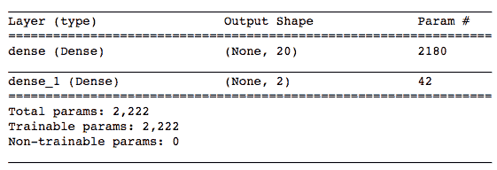

2.  现在，让我们编写一个数据生成器。为了让这个变得更有趣，我们这次将使用一个生成器来批量输入我们的数据。这意味着我们流式传输数据，而不是一次将所有的训练数据放入`fit()`函数。这对于非常大的数据集非常有用。

我们将如下使用`fit_generator()`函数:

```py
def adult_feed(X_cleaned, y, batch_size=10, shuffle=True):
  def init_batches():
    return (
        np.zeros((batch_size, X_cleaned.shape[1])),
        np.zeros((batch_size, y.shape[1]))
        )
  batch_x, batch_y = init_batches()
  batch_counter = 0
  while True: # this is for every epoch
    indexes = np.arange(X_cleaned.shape[0])
    if shuffle == True:
      np.random.shuffle(indexes)
    for index in indexes:
      batch_x[batch_counter, :] = X_cleaned[index, :]
      batch_y[batch_counter, :] = y[index, :]
      batch_counter += 1
      if batch_counter >= batch_size:
        yield (batch_x, batch_y)
        batch_counter = 0
        batch_x, batch_y = init_batches()
```

如果我们还没有做预处理，我们可以把它放到这个函数中。

3.  现在我们有了数据生成器，我们可以按如下方式训练我们的模型:

```py
history = model.fit_generator(
    adult_feed(X_cleaned, y, 10),
    steps_per_epoch=len(X_cleaned) // 10,
    epochs=50
)
```

这应该相对较快，因为这是一个小数据集；但是，如果您发现这花费的时间太长，您总是可以减少数据集的大小或历元的数量。

在我们的`history`变量中有来自训练的输出，比如损失和度量。

4.  这一次，我们将从 Keras 训练历史中绘制不同时期的训练进度，而不是使用 TensorBoard。我们没有进行验证，所以我们将只绘制训练损失和训练准确度:

```py
import matplotlib.pyplot as plt

plt.plot(history.history['accuracy'])
plt.plot(history.history['loss'])
plt.title('Model Training')
plt.ylabel('Accuracy')
plt.xlabel('Epoch')
plt.legend(['Accuracy', 'Loss'], loc='center left')
```

请注意，在 Keras 的某些版本中，精确度在历史中存储为`accuracy`而不是`acc`。

下面是结果图:

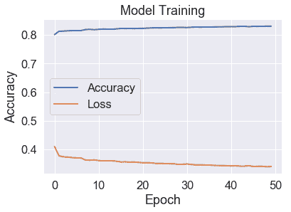

经过一段时间的训练，精度在提高，而损失在减少，这很好。

5.  因为我们已经对测试数据进行了一次性编码和缩放，所以我们可以直接预测和计算我们的性能。我们将使用 sklearn 的内置函数计算 **AUC** ( **曲线下面积**)分数。AUC 分数来自接收器操作特性，它是相对于 *y* 轴上的真阳性率(也称为命中率)而言的 *x* 轴上的假阳性率(也称为虚警率)的可视化。该曲线下的积分，即 AUC 分数，是分类性能的常用度量，并且有助于理解高命中率和任何假警报之间的权衡:

```py
from sklearn.metrics import roc_auc_score

predictions = model.predict(X_test)
# Please note that the targets have slightly different names in the test set than in the training dataset. We'll need to take care of this here:
target_lookup = {' <=50K.': 0, ' >50K.': 1 }
y_test = test['50k'].apply(
    lambda x: target_lookup[x]
).values
roc_auc_score(y_test, predictions.argmax(axis=1))
```

我们得到`0.7579310072282265`作为 AUC 分数。76%的 AUC 分数可以是好的分数，也可以是坏的分数，这取决于任务的难度。对于这个数据集来说，这并不坏，但是我们可以通过进一步调整模型来提高性能。然而，现在，我们将让它保持原样。

6.  最后，我们将检查特性的重要性。为此，我们将使用`eli5`库来表示黑盒排列的重要性。黑盒置换重要性包括一系列与模型无关的技术，粗略地说，置换特征以建立它们的重要性。你可以在*如何工作中阅读更多关于许可重要性的内容...*一节。

为此，我们需要一个评分函数，如下所示:

```py
from eli5.permutation_importance import get_score_importances

def score(data, y=None, weight=None):
  return model.predict(data).argmax(axis=1)

base_score, score_decreases = get_score_importances(score, X_test, y_test)
feature_importances = np.mean(score_decreases, axis=0).mean(axis=1)
```

现在，我们可以按排序顺序打印特征重要性:

```py
import operator

feature_importances_annotated = {col: imp for col, imp in zip(x_cleaned_cols, feature_importances)}
sorted_feature_importances_annotated = sorted(feature_importances_annotated.items(), key=operator.itemgetter(1), reverse=True)

for i, (k, v) in enumerate(sorted_feature_importances_annotated):
  print('{i}: {k}: {v}'.format(i=i, k=k, v=v))
  if i > 9:
        break
```

我们获得类似下面的列表:

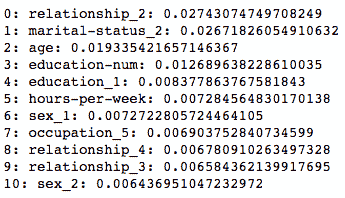

您的最终列表可能与此处的列表不同。神经网络训练是不确定的，尽管我们可以尝试修复随机生成器种子。正如我们所料，年龄是一个重要因素；然而，关系状态和婚姻状态中的一些类别在年龄之前出现。

## 它是如何工作的...

我们经历了机器学习中的一个典型过程:我们加载一个数据集，绘制和探索它，并通过分类变量的编码和归一化进行预处理。然后，我们在 Keras 中创建和训练了一个神经网络模型，并绘制了训练和验证性能。让我们更详细地谈谈我们做了什么。

### 最大信息系数

有许多方法可以计算和绘制相关矩阵，我们将在接下来的食谱中看到更多的可能性。这里我们计算了基于**最大信息系数** ( **MIC** )的相关性。MIC 来自于*基于最大信息量的非参数探索*框架。这发表在 2011 年的*科学*杂志上，在那里它被誉为 21 世纪的相关性度量(文章可以在[https://science.sciencemag.org/content/334/6062/1518.full](https://science.sciencemag.org/content/334/6062/1518.full)找到)。

应用于两个变量， *X* 和 *Y* ，它启发式地搜索两个变量中的箱，使得给定箱的 *X* 和 *Y* 之间的互信息最大。系数范围在 0(无相关性)和 1(完全相关)之间。相对于 Pearson 相关系数，它有一个优势，首先是因为它发现了非线性的相关性，其次是因为它与分类变量一起工作。

### 数据生成器

如果您熟悉 Python 生成器，您不需要解释这是什么，但是可能需要一些澄清性的词语。使用生成器提供了按需加载数据**或在线加载数据**而不是一次加载数据**的可能性。这意味着您可以处理比可用内存大得多的数据集。**

神经网络和 Keras 中生成器的一些重要术语如下

*   *迭代* ( `steps_per_epoch`)是完成一个历元所需的批次数。
*   *批量*是单个批次中训练样本的数量。

用 Keras 实现生成器有不同的方法，如下所示:

*   使用任何 Python 生成器
*   实现`tensorflow.keras.utils.Sequence`

对于第一个选项，我们实际上可以使用任何生成器，但这使用了一个带有 yield 的函数。这意味着我们为 Keras `fit_generator()`函数提供了`steps_per_epoch`参数。

至于第二个，我们编写一个继承自`tensorflow.keras.utils.Sequence`的类，它实现了以下方法:

*   `len()`，以便`fit_generator()`函数知道还有多少数据要来。这对应于`steps_per_epoch`，是。
*   `__getitem__()`，供`fit_generator`索取下一批。
*   在一个时期结束时做一些洗牌或其他事情——这是可选的。

为了简单起见，我们采用了前一种方法。

我们将在后面看到，使用生成器进行批量数据加载通常是在线学习的一部分，也就是说，在这种学习中，我们在越来越多的数据上增量训练模型。

### 排列重要性

`eli5`库可以计算排列重要性，当特征不存在时，它测量预测误差的增加。它也被称为**平均降低精度** ( **MDA** )。可以用随机噪声代替特征，而不是以留下一个特征的方式重新训练模型。该噪声来自与特征相同的分布，以避免失真。实际上，做到这一点最简单的方法是在各行之间随机打乱特征值。你可以在 Breiman 的*随机森林* (2001)中找到关于排列重要性的更多细节，网址是[https://www . stat . Berkeley . edu/% 7 ebreiman/randomforest2001 . pdf](https://www.stat.berkeley.edu/%7Ebreiman/randomforest2001.pdf)。

## 请参见

我们将在接下来的食谱中涉及更多关于 Keras、底层 TensorFlow 库、在线学习和生成器的内容。我建议您熟悉图层类型、数据加载器和预处理程序、损耗、度量和培训选项。所有这些都可以转移到 PyTorch 等其他框架，其中的**应用编程接口** ( **API** )有所不同；然而，基本原则是相同的。

以下是 TensorFlow/Keras 文档的链接:

*   图层类型:[https://www.tensorflow.org/api_docs/Python/tf/keras/layers](https://www.tensorflow.org/api_docs/python/tf/keras/layers)
*   数据加载:[https://www.tensorflow.org/guide/data](https://www.tensorflow.org/guide/data)
*   损失:[https://www.tensorflow.org/api_docs/Python/tf/keras/losses](https://www.tensorflow.org/api_docs/python/tf/keras/losses)
*   指标:[https://www.tensorflow.org/api_docs/Python/tf/keras/metrics](https://www.tensorflow.org/api_docs/python/tf/keras/metrics)
*   训练:[https://www.tensorflow.org/guide/keras/train_and_evaluate](https://www.tensorflow.org/guide/keras/train_and_evaluate)

Keras/TensorFlow 组合和 PyTorch 都提供了许多有趣的功能，超出了本食谱甚至本书的范围。举几个例子，PyTorch 具有自动区分功能(以亲笔签名的形式，在[https://pytorch.org/docs/stable/autograd.html](https://pytorch.org/docs/stable/autograd.html)有更多信息)，TensorFlow 有一个估计器 API，这是一个类似于 Keras 的抽象(关于这一点的更多细节，请参见【https://www.tensorflow.org/guide/estimator】T2)。

有关`eli5`的信息，请访问其位于[https://eli5.readthedocs.io/.](https://eli5.readthedocs.io/)的网站

更多数据集，以下三个网站是你的朋友:

*   http://archive.ics.uci.edu/ml/datasets UCI 机器学习数据集:
*   Kaggle 数据集:[https://www.kaggle.com/datasets/](https://www.kaggle.com/datasets/)
*   谷歌数据集搜索:[https://datasetsearch.research.google.com/](https://datasetsearch.research.google.com/)