继上一章的 scikit-learn、Keras 和 PyTorch 之后，本章我们将继续讨论更多的端到端示例。这些例子更高级，因为它们包含了更复杂的转换和模型类型。

我们将预测 sklearn 的合作伙伴选择，在那里我们将实现许多定制的转换器步骤和更复杂的机器学习管道。然后，我们将预测 PyTorch 的房价，并可视化特征和神经元的重要性。之后，我们将在 sklearn 中进行主动学习，与在线学习一起决定客户价值。在众所周知的惯犯预测案例中，我们将建立一个没有种族偏见的模型。最后，但同样重要的是，我们将预测二氧化碳水平的时间序列。

**Online learning** in this context (as opposed to internet-based learning) refers to a model update strategy that incorporates training data that comes in sequentially. This can be useful in cases where the dataset is very big (often the case with images, videos, and texts) or where it's important to keep the model up to date given the changing nature of the data.

在这些食谱中，我们将描述缩短到最突出的细节，以突出特定的概念。有关完整的详细信息，请参考 GitHub 上的笔记本。

在这一章中，我们将介绍以下食谱:

*   在 scikit 中转换数据-学习
*   预测 PyTorch 的房价
*   实时决策客户价值
*   对抗算法偏见
*   预测 CO [2] 时间序列

# 技术要求

本章的代码和笔记本可以在 GitHub 上获得，网址是 https://GitHub . com/pack publishing/Artificial-Intelligence-with-Python-Cookbook/tree/master/chapter 02。

# 在 scikit 中转换数据-学习

在这个菜谱中，我们将使用混合类型的列数据构建更复杂的管道。我们将使用 Fisman *等人*:【https://doi.org/10.1162/qjec.2006.121.2.673】T2 在 2006 年发表的速配数据集

也许这份食谱会在多个方面提供信息，我们会学到一些关于人类择偶机制的有用知识。

OpenML 网站上的数据集描述如下:

This data was gathered from participants in experimental speed dating events from 2002-2004\. During the events, the attendees would have a four-minute **first date** with every other participant of the opposite sex. At the end of their 4 minutes, participants were asked whether they would like to see their date again. They were also asked to rate their date on six attributes: attractiveness, sincerity, intelligence, fun, ambition, and shared interests. The dataset also includes questionnaire data gathered from participants at different points in the process. These fields include demographics, dating habits, self-perception across key attributes, beliefs in terms of what others find valuable in a mate, and lifestyle information.

问题是根据我们对参与者及其匹配的了解来预测配偶选择。该数据集提出了一些挑战，可以起到说明作用:

*   它包含 123 种不同类型的不同功能:
    *   绝对的
    *   数字的
    *   范围特征

它还包含以下内容:

*   一些缺失的值
*   目标不平衡

在解决预测配偶选择这一问题的过程中，我们将在 scikit-learn 中构建自定义编码器和一个包含所有特征及其预处理步骤的管道。

这个配方的主要焦点是管道和转换器。特别是，我们将构建一个自定义转换器来处理范围特性，并构建另一个转换器来处理数值特性。

## 做好准备

对于这个食谱，我们需要下面的库。它们如下:

*   OpenML 下载数据集
*   `openml_speed_dating_pipeline_steps`使用我们定制的转换器
*   `imbalanced-learn`处理不平衡的班级
*   向我们展示特性的重要性

为了安装它们，我们可以再次使用`pip`:

```py
pip install -q openml openml_speed_dating_pipeline_steps==0.5.5 imbalanced_learn category_encoders shap
```

OpenML is an organization that intends to make data science and machine learning reproducible and therefore more conducive to research. The OpenML website not only hosts datasets, but also allows the uploading of machine learning results to public leaderboards under the condition that the implementation relies solely on open source. These results and how they were obtained can be inspected in complete detail by anyone who's interested.

为了检索数据，我们将使用 OpenML Python API。`get_dataset()`方法将下载数据集；使用`get_data()`，我们可以获得 pandas 数据帧的特征和目标，并且我们将方便地获得关于分类和数字特征类型的信息:

```py
import openml
dataset = openml.datasets.get_dataset(40536)
X, y, categorical_indicator, _ = dataset.get_data(
  dataset_format='DataFrame',
  target=dataset.default_target_attribute
)
categorical_features = list(X.columns[categorical_indicator]) numeric_features = list(
  X.columns[[not(i) for i in categorical_indicator]]
)
```

在数据集的原始版本中，正如论文中所介绍的，还有很多工作要做。然而，OpenML 上的数据集版本已经有表示为`numpy.nan`的缺失值，这让我们可以跳过这个转换。有兴趣可以在 GitHub 上看到这个预处理器:[https://github.com/benman1/OpenML-Speed-Dating](https://github.com/benman1/OpenML-Speed-Dating)

或者，您可以使用 OpenML 数据集网页上的下载链接，网址为[https://www . OpenML . org/data/get _ CSV/13153954/speeddate . ARFF](https://www.openml.org/data/get_csv/13153954/speeddating.arff)。

随着数据集的加载和库的安装，我们准备开始破解。

## 怎么做...

管道是一种描述机器学习算法(包括预处理步骤)如何在应用最终预测器之前，在原始数据集之上的一系列转换中一个接一个的方式。我们将在这份食谱和整本书中看到这些概念的例子。

看看这个数据集，一些事情很快就凸显出来了。我们有很多分类特征。因此，对于建模，我们需要对它们进行数字编码，如[第一章](87098651-b37f-4b05-b0ee-878193f28b95.xhtml)中 Keras 食谱中的*建模和预测、*Python 中的人工智能入门*。*

### 数字编码范围

其中一些实际上是编码范围。这意味着它们是有序的，换句话说，它们是有序的范畴；例如，`d_interests_correlate`特性包含如下字符串:

```py
[[0-0.33], [0.33-1], [-1-0]]
```

如果我们将这些范围视为分类变量，我们将丢失关于顺序的信息，并且我们将丢失关于两个值有多大不同的信息。但是，如果我们将它们转换成数字，我们将保留这些信息，并且我们将能够在顶部应用其他数字转换。

我们将实现一个转换器来插入 sklearn 管道，以便将这些范围特征转换为数字特征。转换的基本思想是提取这些范围的上限和下限，如下所示:

```py
def encode_ranges(range_str):
  splits = range_str[1:-1].split('-')
  range_max = splits[-1]
  range_min = '-'.join(splits[:-1])
  return range_min, range_max

examples = X['d_interests_correlate'].unique()
[encode_ranges(r) for r in examples]
```

我们将在我们的示例中看到这一点:

```py
[('0', '0.33'), ('0.33', '1'), ('-1', '0')]
```

为了得到数值特征，我们可以取两个界限之间的平均值。正如我们之前提到的，在 OpenML 上，不仅显示结果，而且模型也是透明的。因此，如果我们想要提交我们的模型，我们只能使用已发布的模块。我们创建了一个模块，并将其发布在`pypi` Python 包存储库中，在这里可以找到完整代码的包:[https://pypi . org/project/openml-speed-dating-pipeline-steps/](https://pypi.org/project/openml-speed-dating-pipeline-steps/)。

下面是`RangeTransformer`的简化代码:

```py
from sklearn.base import BaseEstimator, TransformerMixin
import category_encoders.utils as util

class RangeTransformer(BaseEstimator, TransformerMixin):
  def __init__(self, range_features=None, suffix='_range/mean', n_jobs=-1):
    assert isinstance(range_features, list) or range_features is None
    self.range_features = range_features
    self.suffix = suffix
    self.n_jobs = n_jobs

  def fit(self, X, y=None):
    return self

  def transform(self, X, y=None):
    X = util.convert_input(X)
    if self.range_features is None:
      self.range_features = list(X.columns)

    range_data = pd.DataFrame(index=X.index)
    for col in self.range_features:
      range_data[str(col) + self.suffix] = pd.to_numeric(
        self._vectorize(X[col])
      )
    self.feature_names = list(range_data.columns)
    return range_data

    def _vectorize(self, s):
        return Parallel(n_jobs=self.n_jobs)(
            delayed(self._encode_range)(x) for x in s
        )

    @staticmethod
    @lru_cache(maxsize=32)
    def _encode_range(range_str):
        splits = range_str[1:-1].split('-')
        range_max = float(splits[-1])
        range_min = float('-'.join(splits[:-1]))
        return sum([range_min, range_max]) / 2.0

    def get_feature_names(self):
        return self.feature_names
```

这是范围自定义转换器的一个简短片段。请在[https://github.com/benman1/OpenML-Speed-Dating](https://github.com/benman1/OpenML-Speed-Dating)查看 GitHub 上的完整实现。

请注意`fit()`和`transform()`方法是如何使用的。我们不需要在`fit()`方法中做任何事情，因为我们总是应用相同的静态规则。`transfer()`方法应用了这一规则。我们之前已经看过例子了。我们在`transfer()`方法中所做的是对列进行迭代。这个转换器还展示了 scikit-learn 典型的并行化模式的使用。此外，由于这些范围重复很多，而且没有那么多，我们将使用一个缓存，这样，一旦范围被处理一次，就可以从内存中检索范围值，而不是进行代价高昂的字符串转换。

关于 scikit-learn 中的自定义转换器，有一点很重要，就是它们要继承`BaseEstimator`和`TransformerMixin`，实现`fit()`和`transform()` 方法。稍后，我们将需要`get_feature_names()`,这样我们就可以找出生成的特征的名称。

### 推导高阶特征

让我们实现另一个转换器。您可能已经注意到，我们有不同类型的特征，这些特征似乎指的是相同的个人属性:

*   个人偏好
*   自我评估
*   对他人的评估

很明显，这些特征之间的差异可能是显著的，比如真诚的重要性与某人评估潜在伴侣的真诚程度。因此，我们的下一个转换器将计算数字特征之间的差异。这应该有助于突出这些差异。

这些特征源自其他特征，并且结合了来自两个(或者潜在的更多特征)的信息。让我们看看`NumericDifferenceTransformer`功能是什么样子的:

```py
import operator

class NumericDifferenceTransformer(BaseEstimator, TransformerMixin):
    def __init__(self, features=None,
                 suffix='_numdist', op=operator.sub, n_jobs=-1
                 ):
        assert isinstance(
            features, list
        ) or features is None
        self.features = features
        self.suffix = suffix
        self.op = op
        self.n_jobs = n_jobs

    def fit(self, X, y=None):
        X = util.convert_input(X)
        if self.features is None:
            self.features = list(
                X.select_dtypes(include='number').columns
            )
        return self

    def _col_name(self, col1, col2):
        return str(col1) + '_' + str(col2) + self.suffix

    def _feature_pairs(self):
        feature_pairs = []
        for i, col1 in enumerate(self.features[:-1]):
            for col2 in self.features[i+1:]:
                feature_pairs.append((col1, col2))
        return feature_pairs

    def transform(self, X, y=None):
        X = util.convert_input(X)

        feature_pairs = self._feature_pairs()
        columns = Parallel(n_jobs=self.n_jobs)(
            delayed(self._col_name)(col1, col2)
            for col1, col2 in feature_pairs
        )
        data_cols = Parallel(n_jobs=self.n_jobs)(
            delayed(self.op)(X[col1], X[col2])
            for col1, col2 in feature_pairs
        )
        data = pd.concat(data_cols, axis=1)
        data.rename(
            columns={i: col for i, col in enumerate(columns)},
            inplace=True, copy=False
        )
        data.index = X.index
        return data

    def get_feature_names(self):
        return self.feature_names
```

这是一个自定义转换器，用于计算数字特征之间的差异。请参考位于[https://github.com/benman1/OpenML-Speed-Dating](https://github.com/benman1/OpenML-Speed-Dating)的 OpenML-Speed-date 库的完整实现。

这个转换器的结构和`RangeTransformer`非常相似。请注意列之间的并行性。`__init__()`方法的一个参数是用于计算差值的函数。这是默认的`operator.sub()`。运算符库是 Python 标准库的一部分，它将基本运算符作为函数来实现。`sub()`函数的作用和它听起来的一样:

```py
import operator
operator.sub(1, 2) == 1 - 2
# True
```

这为我们提供了标准操作符的前缀或函数语法。由于我们可以将函数作为参数传递，这给了我们在列之间指定不同操作符的灵活性。

这次的`fit()`方法只是收集数字列的名称，我们将在`transform()`方法中使用这些名称。

### 组合转换

我们将把这些转换器与`ColumnTransformer`和管道放在一起。然而，我们需要在列和它们的转换之间建立关联。我们将定义不同的列组:

```py
range_cols = [
    col for col in X.select_dtypes(include='category')
    if X[col].apply(lambda x: x.startswith('[')
    if isinstance(x, str) else False).any()
]
cat_columns = list(
  set(X.select_dtypes(include='category').columns) - set(range_cols)
)
num_columns = list(
    X.select_dtypes(include='number').columns
)
```

现在，我们有了范围列、分类列和数字列，我们可以为它们分配管道步骤。

在我们的例子中，我们首先在一个预处理器中把它们放在一起如下:

```py
from imblearn.ensemble import BalancedRandomForestClassifier
from sklearn.feature_selection import SelectKBest, f_classif
from sklearn.compose import ColumnTransformer
from sklearn.pipeline import Pipeline
from sklearn.preprocessing import FunctionTransformer
import category_encoders as ce
import openml_speed_dating_pipeline_steps as pipeline_steps

preprocessor = ColumnTransformer(
 transformers=[
 ('ranges', Pipeline(steps=[
 ('impute', pipeline_steps.SimpleImputerWithFeatureNames(strategy='constant', fill_value=-1)),
 ('encode', pipeline_steps.RangeTransformer())
 ]), range_cols),
 ('cat', Pipeline(steps=[
 ('impute', pipeline_steps.SimpleImputerWithFeatureNames(strategy='constant', fill_value='-1')),
 ('encode', ce.OneHotEncoder(
 cols=None, # all features that it given by ColumnTransformer
 handle_unknown='ignore',
 use_cat_names=True
 )
 )
 ]), cat_columns),
 ('num', pipeline_steps.SimpleImputerWithFeatureNames(strategy='median'), num_columns),
 ],
 remainder='drop', n_jobs=-1
)
```

然后，我们将把预处理和估计器放在一个管道中:

```py
def create_model(n_estimators=100):
    return Pipeline(
        steps=[('preprocessor', preprocessor),
               ('numeric_differences', pipeline_steps.NumericDifferenceTransformer()),
               ('feature_selection', SelectKBest(f_classif, k=20)),
               ('rf', BalancedRandomForestClassifier(
                  n_estimators=n_estimators,
                  )
               )]
       )
```

以下是测试集中的性能:

```py
from sklearn.metrics import roc_auc_score, confusion_matrix
from sklearn.model_selection import train_test_split

X_train, X_test, y_train, y_test = train_test_split(
  X, y,
  test_size=0.33,
  random_state=42,
  stratify=y
)
clf = create_model(50)
clf.fit(X_train, y_train)
y_predicted = clf.predict(X_test)
auc = roc_auc_score(y_test, y_predicted)
print('auc: {:.3f}'.format(auc))
```

我们得到以下性能作为输出:

```py
auc: 0.779
```

这是一个非常好的表现，你可以将它与 OpenML 上的排行榜进行比较。

## 它是如何工作的...

是时候解释基本的 sci kit-学习与这个食谱相关的术语了。这些概念都不对应于现有的机器学习算法，而是对应于可组合的模块:

*   Transformer(在 scikit-learn 中):从`sklearn.base.TransformerMixin`派生的一个类；它有`fit()`和`transform()`方法。这些包括预处理步骤或特征选择。
*   Predictor:从`sklearn.base.ClassifierMixin`或`sklearn.base.RegressorMixin`派生的类；它有`fit()`和`predict()`两种方法。这些是机器学习估计器，换句话说，分类器或回归器。
*   Pipeline:一个将所有步骤包装在一起的接口，为转换的所有步骤和结果估计器提供一个单一的接口。管道也有`fit()`和`predict()`方法。

关于我们的方法，有几点需要指出。如前所述，我们有缺失值，所以我们必须用其他值来估计(即替换)缺失值。在这种情况下，我们用-1 替换丢失的值。在分类变量的情况下，这将是一个新的类别，而在数值变量的情况下，它将成为分类器必须处理的特殊值。

scikit-learn 的 0.20 版本提供了一个期待已久的特性。从那以后，`ColumnTransformer`经常可以这样被看到，例如:

```py
from sklearn.compose import ColumnTransformer, make_column_transformer
from sklearn.preprocessing import StandardScaler, OneHotEncoder

feature_preprocessing = make_column_transformer(
  (StandardScaler(), ['column1', 'column2']),
  (OneHotEncoder(), ['column3', 'column4', 'column5']) 
)
```

`feature_preprocessing`可以照常与`fit()`、`transform()`和`fit_transform()`方法一起使用:

```py
processed_features = feature_preprocessing.fit_transform(X)

```

在这里，`X`表示我们的特征。

或者，我们可以将`ColumnTransformer`作为一个步骤放入管道，例如，像这样:

```py
from sklearn.pipeline import make_pipeline
from sklearn.linear_model import LogisticRegression

make_pipeline(
    feature_preprocessing,
    LogisticRegression()
)
```

我们的分类器是随机森林分类器的改进形式。随机森林是决策树的集合，每个决策树都根据训练数据的随机子集进行训练。平衡随机森林分类器(Chen*et al .*:[https://statistics . Berkeley . edu/sites/default/files/tech-reports/666 . pdf](https://statistics.berkeley.edu/sites/default/files/tech-reports/666.pdf))确保每个随机子集在两个类之间是平衡的。

由于`NumericDifferenceTransformer`可以提供许多特性，我们将加入一个额外的基于模型的特性选择步骤。

## 还有更多...

你可以在 GitHub 上的[https://GitHub . com/packt publishing/Artificial-Intelligence-with-Python-Cookbook/blob/master/chapter 02/Transforming % 20 data % 20 in % 20 sci kit-learn . ipynb](https://github.com/PacktPublishing/Artificial-Intelligence-with-Python-Cookbook/blob/master/chapter02/Transforming%20Data%20in%20Scikit-Learn.ipynb)看到完整的例子，包括快速约会数据集、几个自定义变形器和一个扩展插补类。

`RangeTransformer`和`NumericDifferenceTransformer`也可以使用 scikit-learn 中的`FunctionTransformer`来实现。

`ColumnTransformer`对于 pandas 数据帧或 NumPy 数组尤其方便，因为它允许为不同的特征子集指定不同的操作。然而，另一个选项是`FeatureUnion`，它允许连接不同转换的结果。还有另一种方法来将我们的操作链接在一起，请查看我们知识库中的`PandasPicker`。

## 请参见

在这个配方中，我们使用方差分析 f 值进行单变量特征选择，这相对简单，但有效。单变量特征选择方法通常是简单的过滤器或统计测试，用于测量特征与目标的相关性。然而，特性选择有许多不同的方法，scikit-learn 实现了其中的许多方法:[https://scikit-learn . org/stable/modules/feature _ selection . html](https://scikit-learn.org/stable/modules/feature_selection.html)。

# 预测 PyTorch 的房价

在这个菜谱中，问题的目标是预测爱荷华州埃姆斯市的房价，给定 81 个描述房屋、面积、土地、基础设施、公用设施等的要素。Ames 数据集很好地结合了分类特征和连续特征，大小适中，而且最重要的是，它不像其他类似数据集(如波士顿住房)那样存在潜在的红线圈定或数据输入问题。这里我们将集中讨论 PyTorch 建模的主要方面。我们将在[第一章](87098651-b37f-4b05-b0ee-878193f28b95.xhtml)、*Python 人工智能入门*中的*建模和预测*配方中进行在线学习，类似于 Keras。如果你想了解更多细节，请查看我们在 GitHub 上的笔记本。

另外，我们还将展示 PyTorch 中开发的模型中神经元的重要性。您可以在 PyTorch 或模型类型中尝试不同的网络架构。这份食谱的重点是方法论，而不是对最佳解决方案的详尽搜索。

## 做好准备

为了准备食谱，我们需要做几件事。我们将下载前一个配方中的数据，*在 scikit-learn* 中转换数据，并通过以下步骤执行一些预处理:

```py
from sklearn.datasets import fetch_openml
data = fetch_openml(data_id=42165, as_frame=True)

```

你可以在 OpenML:[https://www.openml.org/d/42165](https://www.openml.org/d/42165)看到完整的数据集描述。

让我们来看看特性:

```py
import pandas as pd
data_ames = pd.DataFrame(data.data, columns=data.feature_names)
data_ames['SalePrice'] = data.target
data_ames.info()
```

以下是数据帧信息:

```py
<class 'pandas.core.frame.DataFrame'>
RangeIndex: 1460 entries, 0 to 1459
Data columns (total 81 columns):
Id               1460 non-null float64
MSSubClass       1460 non-null float64
MSZoning         1460 non-null object
LotFrontage      1201 non-null float64
LotArea          1460 non-null float64
Street           1460 non-null object
Alley            91 non-null object
LotShape         1460 non-null object
LandContour      1460 non-null object
Utilities        1460 non-null object
LotConfig        1460 non-null object
LandSlope        1460 non-null object
Neighborhood     1460 non-null object
Condition1       1460 non-null object
Condition2       1460 non-null object
BldgType         1460 non-null object
HouseStyle       1460 non-null object
OverallQual      1460 non-null float64
OverallCond      1460 non-null float64
YearBuilt        1460 non-null float64
YearRemodAdd     1460 non-null float64
RoofStyle        1460 non-null object
RoofMatl         1460 non-null object
Exterior1st      1460 non-null object
Exterior2nd      1460 non-null object
MasVnrType       1452 non-null object
MasVnrArea       1452 non-null float64
ExterQual        1460 non-null object
ExterCond        1460 non-null object
Foundation       1460 non-null object
BsmtQual         1423 non-null object
BsmtCond         1423 non-null object
BsmtExposure     1422 non-null object
BsmtFinType1     1423 non-null object
BsmtFinSF1       1460 non-null float64
BsmtFinType2     1422 non-null object
BsmtFinSF2       1460 non-null float64
BsmtUnfSF        1460 non-null float64
TotalBsmtSF      1460 non-null float64
Heating          1460 non-null object
HeatingQC        1460 non-null object
CentralAir       1460 non-null object
Electrical       1459 non-null object
1stFlrSF         1460 non-null float64
2ndFlrSF         1460 non-null float64
LowQualFinSF     1460 non-null float64
GrLivArea        1460 non-null float64
BsmtFullBath     1460 non-null float64
BsmtHalfBath     1460 non-null float64
FullBath         1460 non-null float64
HalfBath         1460 non-null float64
BedroomAbvGr     1460 non-null float64
KitchenAbvGr     1460 non-null float64
KitchenQual      1460 non-null object
TotRmsAbvGrd     1460 non-null float64
Functional       1460 non-null object
Fireplaces       1460 non-null float64
FireplaceQu      770 non-null object
GarageType       1379 non-null object
GarageYrBlt      1379 non-null float64
GarageFinish     1379 non-null object
GarageCars       1460 non-null float64
GarageArea       1460 non-null float64
GarageQual       1379 non-null object
GarageCond       1379 non-null object
PavedDrive       1460 non-null object
WoodDeckSF       1460 non-null float64
OpenPorchSF      1460 non-null float64
EnclosedPorch    1460 non-null float64
3SsnPorch        1460 non-null float64
ScreenPorch      1460 non-null float64
PoolArea         1460 non-null float64
PoolQC           7 non-null object
Fence            281 non-null object
MiscFeature      54 non-null object
MiscVal          1460 non-null float64
MoSold           1460 non-null float64
YrSold           1460 non-null float64
SaleType         1460 non-null object
SaleCondition    1460 non-null object
SalePrice        1460 non-null float64
dtypes: float64(38), object(43)
memory usage: 924.0+ KB
```

PyTorch 和 seaborn 默认安装在 Colab 中。我们假设，即使您现在正在使用自托管安装，您也已经安装了库。

然而，我们将使用另一个库`captum`，它允许检查 PyTorch 模型的特征和神经元重要性:

```py
!pip install captum
```

还有一件事。我们假设你有一个可用的 GPU。如果你的电脑没有图形处理器，我们建议你在 Colab 上试试这个食谱。在 Colab 中，你必须选择 GPU 的运行时类型。

做好这些准备之后，再来看看如何预测房价。

## 怎么做...

Ames Housing 数据集是一个中小型数据集(1，460 行)，包含 81 个分类和数值要素。没有丢失的值。

在之前的 Keras 配方中，我们已经看到了如何缩放变量。缩放在这里很重要，因为所有变量都有不同的缩放比例。分类变量需要转换成数字类型，以便输入到我们的模型中。我们可以选择一次性编码，为每个分类因子创建虚拟变量，或者选择顺序编码，为所有因子编号并用这些数字替换字符串。我们可以像任何其他浮点变量一样输入虚拟变量，而顺序编码则需要使用嵌入、线性神经网络投影来对多维空间中的类别进行重新排序。

我们在这里采用嵌入路线:

```py
import numpy as np
from category_encoders.ordinal import OrdinalEncoder
from sklearn.preprocessing import StandardScaler

num_cols = list(data_ames.select_dtypes(include='float'))
cat_cols = list(data_ames.select_dtypes(include='object'))

ordinal_encoder = OrdinalEncoder().fit(
    data_ames[cat_cols]
)
standard_scaler = StandardScaler().fit(
    data_ames[num_cols]
)

X = pd.DataFrame(
    data=np.column_stack([
        ordinal_encoder.transform(data_ames[cat_cols]),
        standard_scaler.transform(data_ames[num_cols])
    ]),
    columns=cat_cols + num_cols
)
```

我们在 GitHub 上的笔记本中详细讨论了数据分析，如相关性和分布图。

现在，我们可以将数据分成训练集和测试集，就像我们在前面的菜谱中所做的那样。这里，我们添加了一个数值变量的分层。这确保了不同的部分(五个部分)在训练集和测试集中被同等程度地包括:

```py
np.random.seed(12)  
from sklearn.model_selection import train_test_split

bins = 5
sale_price_bins = pd.qcut(
    X['SalePrice'], q=bins, labels=list(range(bins))
)
X_train, X_test, y_train, y_test = train_test_split(
    X.drop(columns='SalePrice'),
    X['SalePrice'],
    random_state=12,
    stratify=sale_price_bins
)
```

在继续之前，让我们使用独立于模型的技术来看看这些特性的重要性。

然而，在我们运行任何东西之前，让我们确保我们正在 GPU 上运行:

```py
device = torch.device('cuda')
torch.backends.cudnn.benchmark = True
```

让我们建立我们的 PyTorch 模型，类似于 scikit 中的*分类——学习*、 *Keras* 、[第一章](87098651-b37f-4b05-b0ee-878193f28b95.xhtml)、*Python 中的人工智能入门*中的 *PyTorch* 配方。

我们将使用 PyTorch 实现带有批量输入的神经网络回归。这将涉及以下步骤:

1.  将数据转换为火炬张量
2.  定义模型架构
3.  定义损失标准和优化程序
4.  为批处理创建数据加载器
5.  运行培训

不再赘述，让我们开始吧:

1.  首先将数据转换为火炬张量:

```py
from torch.autograd import Variable 

num_features = list(
    set(num_cols) - set(['SalePrice', 'Id'])
)
X_train_num_pt = Variable(
    torch.cuda.FloatTensor(
        X_train[num_features].values
    )
)
X_train_cat_pt = Variable(
    torch.cuda.LongTensor(
        X_train[cat_cols].values
    )
)
y_train_pt = Variable(
    torch.cuda.FloatTensor(y_train.values)
).view(-1, 1)
X_test_num_pt = Variable(
    torch.cuda.FloatTensor(
        X_test[num_features].values
    )
)
X_test_cat_pt = Variable(
   torch.cuda.LongTensor(
        X_test[cat_cols].values
    ).long()
)
y_test_pt = Variable(
    torch.cuda.FloatTensor(y_test.values)
).view(-1, 1)
```

这确保了我们将数值和分类数据加载到单独的变量中，类似于 NumPy。如果在一个变量(数组/矩阵)中混合数据类型，它们将成为对象。我们希望将数字变量作为浮点数，将分类变量作为 long(或 int)来索引我们的类别。我们还将训练集和测试集分开。

显然，ID 变量在模型中并不重要。在最坏的情况下，如果 ID 与目标有任何关联，就可能导致目标泄漏。我们已经把它从进一步加工中移除了。

2.  定义模型架构:

```py
class RegressionModel(torch.nn.Module): 

    def __init__(self, X, num_cols, cat_cols, device=torch.device('cuda'), embed_dim=2, hidden_layer_dim=2, p=0.5): 
        super(RegressionModel, self).__init__() 
        self.num_cols = num_cols
        self.cat_cols = cat_cols
        self.embed_dim = embed_dim
        self.hidden_layer_dim = hidden_layer_dim

        self.embeddings = [
            torch.nn.Embedding(
                num_embeddings=len(X[col].unique()),
                embedding_dim=embed_dim
            ).to(device)
            for col in cat_cols
        ]
        hidden_dim = len(num_cols) + len(cat_cols) * embed_dim,

        # hidden layer
        self.hidden = torch.nn.Linear(torch.IntTensor(hidden_dim), hidden_layer_dim).to(device)
        self.dropout_layer = torch.nn.Dropout(p=p).to(device)
        self.hidden_act = torch.nn.ReLU().to(device)

        # output layer
        self.output = torch.nn.Linear(hidden_layer_dim, 1).to(device)

    def forward(self, num_inputs, cat_inputs):
        '''Forward method with two input variables -
        numeric and categorical.
        '''
        cat_x = [
            torch.squeeze(embed(cat_inputs[:, i] - 1))
            for i, embed in enumerate(self.embeddings)
        ]
        x = torch.cat(cat_x + [num_inputs], dim=1)
        x = self.hidden(x)
        x = self.dropout_layer(x)
        x = self.hidden_act(x)
        y_pred = self.output(x)
        return y_pred

house_model = RegressionModel(
    data_ames, num_features, cat_cols
)
```

我们在两个线性层(Keras 术语中的密集层)上的激活函数是**整流线性单元激活** ( **ReLU** )函数。请注意，我们不可能(容易地)将相同的架构封装成顺序模型，因为在分类和数字类型上发生了不同的操作。

3.  接下来，定义损失标准和优化器。我们将**均方误差** ( **MSE** )作为损失，随机梯度下降作为我们的优化算法:

```py
criterion = torch.nn.MSELoss().to(device)
optimizer = torch.optim.SGD(house_model.parameters(), lr=0.001)
```

4.  现在，创建一个数据加载器，一次输入一批数据:

```py
data_batch = torch.utils.data.TensorDataset(
    X_train_num_pt, X_train_cat_pt, y_train_pt
)
dataloader = torch.utils.data.DataLoader(
    data_batch, batch_size=10, shuffle=True
)
```

我们设定批量为 10。现在我们可以开始训练了。

5.  运行培训！

由于这看起来比我们在 scikit-learn 的*分类中看到的 Keras,[第 1 章](87098651-b37f-4b05-b0ee-878193f28b95.xhtml),*Python 人工智能入门*中的 PyTorch* 食谱要冗长得多，我们对这段代码进行了大量注释。基本上，我们必须循环遍历各个时期，在每个时期内，一个推论就是性能，一个错误被计算出来，优化器根据错误进行调整。

这是在没有用于训练的内部循环的时期上的循环:

```py
from tqdm.notebook import trange

train_losses, test_losses = [], []
n_epochs = 30
for epoch in trange(n_epochs):
    train_loss, test_loss = 0, 0
    # training code will go here:
    # <...>

    # print the errors in training and test:
    if epoch % 10 == 0 :
        print(
            'Epoch: {}/{}\t'.format(epoch, 1000),
            'Training Loss: {:.3f}\t'.format(
                train_loss / len(dataloader)
            ),
            'Test Loss: {:.3f}'.format(
                test_loss / len(dataloader)
            )
        )
```

在该循环内对所有批次的训练数据执行训练。这看起来如下:

```py
    for (x_train_num_batch,
         x_train_cat_batch,
         y_train_batch) in dataloader:
        # predict y by passing x to the model 
        (x_train_num_batch,
         x_train_cat_batch, y_train_batch) = (
                x_train_num_batch.to(device),
                x_train_cat_batch.to(device),
                y_train_batch.to(device)
        )
        pred_ytrain = house_model.forward(
            x_train_num_batch, x_train_cat_batch
        )
        # calculate and print loss:
        loss = torch.sqrt(
            criterion(pred_ytrain, y_train_batch)
        ) 

        # zero gradients, perform a backward pass, 
        # and update the weights. 
        optimizer.zero_grad() 
        loss.backward() 
        optimizer.step()
        train_loss += loss.item()
        with torch.no_grad():
            house_model.eval()
            pred_ytest = house_model.forward(
                X_test_num_pt, X_test_cat_pt
            )
            test_loss += torch.sqrt(
                criterion(pred_ytest, y_test_pt)
            )

        train_losses.append(train_loss / len(dataloader))
        test_losses.append(test_loss / len(dataloader))
```

这是我们得到的输出。TQDM 为我们提供了一个有用的进度条。每隔十个时期，我们打印一份更新以显示训练和验证性能:

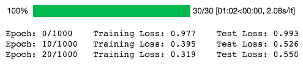

请注意，我们取`nn.MSELoss`的平方根，因为 PyTorch 中的`nn.MSELoss`定义如下:

```py
((input-target)**2).mean()
```

让我们画出我们的模型在训练期间对训练和验证数据集的表现:

```py
plt.plot(
    np.array(train_losses).reshape((n_epochs, -1)).mean(axis=1),
    label='Training loss'
)
plt.plot(
    np.array(test_losses).reshape((n_epochs, -1)).mean(axis=1),
    label='Validation loss'
)
plt.legend(frameon=False)
plt.xlabel('epochs')
plt.ylabel('MSE')
```

下图显示了结果图:

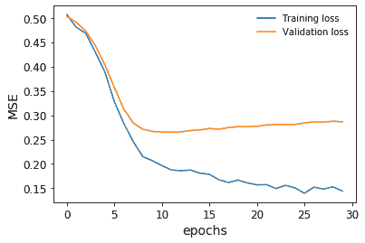

在我们的验证损失停止下降之前，我们及时停止了训练。

我们还可以对我们的目标变量进行分级和分类，并根据它绘制预测图，以了解该模型在整个房价范围内的表现。这是为了避免回归中的情况，特别是以 MSE 为损失的情况，即您只对中间范围的值预测良好，接近平均值，但对其他任何值都预测不好。你可以在 GitHub 的笔记本上找到代码。这被称为提升图(这里有 10 个箱):

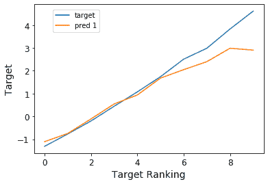

我们可以看到，该模型实际上非常接近地预测了整个房价范围。事实上，我们得到了具有非常高显著性的大约 93%的 Spearman 等级相关性，这证实了该模型具有高精度。

## 它是如何工作的...

深度学习神经网络框架使用不同的优化算法。其中比较流行的有**随机梯度下降** ( **SGD** )、**均方根传播** ( **RMSProp** )、**自适应矩估计** ( **ADAM** )。

我们定义随机梯度下降作为我们的优化算法。或者，我们可以定义其他优化器:

```py
opt_SGD = torch.optim.SGD(net_SGD.parameters(), lr=LR)
opt_Momentum = torch.optim.SGD(net_Momentum.parameters(), lr=LR, momentum=0.6)
opt_RMSprop = torch.optim.RMSprop(net_RMSprop.parameters(), lr=LR, alpha=0.1)
opt_Adam = torch.optim.Adam(net_Adam.parameters(), lr=LR, betas=(0.8, 0.98))
```

SGD 的工作原理与梯度下降相同，只是它一次只对一个示例起作用。有趣的是，这种收敛类似于梯度下降，在计算机内存上更容易实现。

RMSProp 的工作原理是根据梯度符号调整算法的学习速率。最简单的变体检查最后两个梯度符号，然后如果它们相同，则通过增加一个分数来调整学习速率，或者如果它们不同，则通过减少一个分数来调整学习速率。

亚当是最受欢迎的优化者之一。这是一种自适应学习算法，根据梯度的一阶和二阶矩改变学习速率。

Captum 是一种工具，可以帮助我们了解在数据集上学习的神经网络模型的来龙去脉。它可以帮助学习以下内容:

*   特征重要性
*   层重要性
*   神经元重要性

这对于学习可解释的神经网络非常重要。在这里，综合梯度已被用来理解特征的重要性。随后，神经元的重要性也用层电导法进行了论证。

## 还有更多...

假设我们已经定义并训练了神经网络，让我们使用 captum 库来查找重要的特征和神经元:

```py
from captum.attr import (
    IntegratedGradients,
    LayerConductance,
    NeuronConductance
)
house_model.cpu()
for embedding in house_model.embeddings:
    embedding.cpu()

house_model.cpu()
ing_house = IntegratedGradients(forward_func=house_model.forward, )
#X_test_cat_pt.requires_grad_()
X_test_num_pt.requires_grad_()
attr, delta = ing_house.attribute(
 X_test_num_pt.cpu(),
 target=None,
 return_convergence_delta=True,
 additional_forward_args=X_test_cat_pt.cpu()
)
attr = attr.detach().numpy()
```

现在，我们有了一系列的特征重要性。

使用该工具还可以获得层和神经元的重要性。让我们看看第一层神经元的重要性。我们可以传递`house_model.act1`，它是第一个线性层之上的 ReLU 激活函数:

```py
cond_layer1 = LayerConductance(house_model, house_model.act1)
cond_vals = cond_layer1.attribute(X_test, target=None)
cond_vals = cond_vals.detach().numpy()
df_neuron = pd.DataFrame(data = np.mean(cond_vals, axis=0), columns=['Neuron Importance'])
df_neuron['Neuron'] = range(10)
```

看起来是这样的:

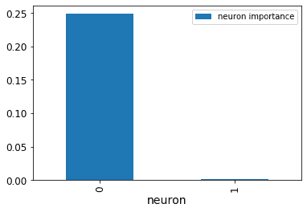

该图显示了神经元的重要性。显然，一个神经元并不重要。

通过对前面获得的 NumPy 数组进行排序，我们还可以看到最重要的变量:

```py
df_feat = pd.DataFrame(np.mean(attr, axis=0), columns=['feature importance'] )
df_feat['features'] = num_features
df_feat.sort_values(
    by='feature importance', ascending=False
).head(10)
```

所以这里列出了 10 个最重要的变量:

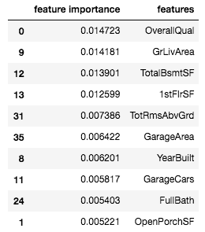

通常，特性重要性可以帮助我们理解模型，并修剪我们的模型，使其变得不那么复杂(希望不要过于复杂)。

## 请参见

PyTorch 文档包括您需要了解的关于图层类型、数据加载、损失、度量和培训的一切:[https://pytorch.org/docs/stable/nn.html](https://pytorch.org/docs/stable/nn.html)

关于优化算法的详细讨论可以在下面的文章中找到:[https://imaddabbura . github . io/post/gradient-descent-algorithm/](https://imaddabbura.github.io/post/gradient-descent-algorithm/)。Geoffrey Hinton 等人在一个演示幻灯片中解释了小批量梯度下降:[https://www . cs . Toronto . edu/~ tij men/CSC 321/slides/lecture _ slides _ le C6 . pdf](https://www.cs.toronto.edu/~tijmen/csc321/slides/lecture_slides_lec6.pdf)。最后，你可以在介绍亚当的文章中找到他的所有细节:https://arxiv.org/abs/1412.6980。

Captum 提供了很多关于 PyTorch 模型的可解释性和模型检查的功能。在 https://captum.ai/看一看它的综合文档是值得的。详细内容可在 https://arxiv.org/pdf/1703.01365.pdf 的[查阅原论文。](https://arxiv.org/pdf/1703.01365.pdf)

# 实时决策客户价值

让我们假设有以下场景:我们有一个客户列表，为了向他们销售我们的产品，我们需要给他们打电话。每通电话都要花费呼叫中心员工的工资，所以我们想尽可能降低这些成本。我们掌握了每位顾客的某些信息，可以帮助我们确定他们是否有可能购买。每次通话后，我们都可以更新模型。主要目标是只致电最有前景的客户，并提高我们对哪些客户更有可能购买我们产品的认识。

在这份食谱中，我们将通过主动学习来解决这个问题，这是一种我们主动决定下一步探索(和学习)什么的策略。我们的模型将帮助决定给谁打电话。因为我们将在每次查询(电话)后更新我们的模型，所以我们将使用在线学习模型。

## 做好准备

我们将通过下载数据集和安装几个库来准备菜谱。

同样，我们将从 OpenML 中获取数据:

```py
!pip install -q openml

import openml 
dataset = openml.datasets.get_dataset(1461)
X, y, categorical_indicator, _ = dataset.get_data(
  dataset_format='DataFrame',
  target=dataset.default_target_attribute
)
categorical_features = X.columns[categorical_indicator]
numeric_features = X.columns[
  [not(i) for i in categorical_indicator]
]
```

这个数据集叫做`bank-marketing`，你可以在[https://www.openml.org/d/1461](https://www.openml.org/d/1461)的 OpenML 上看到描述。

对于描述一个人的每一行，我们有不同的特征，数字的和分类的，告诉我们人口统计和客户历史。

为了模拟客户注册我们产品的可能性，我们将使用专门用于在线模型的 scikit-multiflow 包。我们还将再次使用`category_encoders`包:

```py
!pip install scikit-multiflow category_encoders
```

有了这两个库，我们就可以开始制作食谱了。

## 怎么做...

我们需要实现一个不断更新的探索策略和模型。我们使用网络版的随机森林——赫夫丁树作为我们的模型。我们正在估计每一步的不确定性，并基于此，我们将返回一个候选人进行下一次呼叫。

和往常一样，我们需要定义一些预处理步骤:

```py
from sklearn.compose import ColumnTransformer
from sklearn.preprocessing import FunctionTransformer
import category_encoders as ce

ordinal_encoder = ce.OrdinalEncoder(
  cols=None,  # all features that it encounters
  handle_missing='return_nan',
  handle_unknown='ignore'
).fit(X)

preprocessor = ColumnTransformer(
  transformers=[
    ('cat', ordinal_encoder, categorical_features),
    ('num', FunctionTransformer(validate=False), numeric_features)
])
preprocessor = preprocessor.fit(X)
```

然后我们来看我们的主动学习方法本身。这是受`modAL.models.ActiveLearner`的启发:

```py
import numpy as np
from skmultiflow.trees.hoeffding_tree import HoeffdingTreeClassifier 
from sklearn.metrics import roc_auc_score
import random

class ActivePipeline:
  def __init__(self, model, preprocessor, class_weights):
    self.model = model
    self.preprocessor = preprocessor
    self.class_weights = class_weights

  @staticmethod
  def values(X):
    if isinstance(X, (np.ndarray, np.int64)):
      return X
    else:
      return X.values

  def preprocess(self, X):
    X_ = pd.DataFrame(
      data=self.values(X),
      columns=[
        'V1', 'V2', 'V3', 'V4',
        'V5', 'V6', 'V7', 'V8',
        'V9', 'V10', 'V11', 'V12',
        'V13', 'V14', 'V15', 'V16'
      ])
    return self.preprocessor.transform(X_)

  def fit(self, X, ys):
    weights = [self.class_weights[y] for y in ys]
    self.model.fit(self.preprocess(X), self.values(ys))

  def update(self, X, ys):
    if isinstance(ys, (int, float)):
      weight = self.class_weights[y]
    else:
      weight = [self.class_weights[y] for y in ys]

    self.model.partial_fit(
      self.preprocess(X),
      self.values(ys),
      weight
    )

  def predict(self, X):
    return self.model.predict(
      self.preprocess(X)
    )

  def predict_proba(self, X):
    return self.model.predict_proba(
      self.preprocess(X)
    )

  @staticmethod
  def entropy(preds):
    return -np.sum(
      np.log((preds + 1e-15) * preds)
      / np.log(np.prod(preds.size))
    )

  def max_margin_uncertainty(self, X, method: str='entropy',
      exploitation: float=0.9, favor_class: int=1, k: int=1
  ):
    '''similar to modAL.uncertainty.margin_uncertainty
    ''' 
    probs = self.predict_proba(X)
    if method=='margin':
      uncertainties = np.abs(probs[:,2] - probs[:, 1]) / 2.0
    elif method=='entropy':
      uncertainties = np.apply_along_axis(self.entropy, 1, probs[:, (1,2)])
    else: raise(ValueError('method not implemented!'))

    if favor_class is None:
      weights = uncertainties 
    else: weights = (1.0 - exploitation) * uncertainties + exploitation * probs[:, favor_class]

    if self.sampling:
      ind = random.choices(
        range(len(uncertainties)), weights, k=k
      )
    else:
      ind = np.argsort(weights, axis=0)[::-1][:k]
    return ind, np.mean(uncertainties[ind])

  def score(self, X, y, scale=True):
    probs = self.predict_proba(X, probability=2)
    if scale:
      probs = np.clip(probs - np.mean(probs) + 0.5, 0, 1)
    return roc_auc_score(y, probs)
```

同样，我们创建了一个 scikit-learn 兼容的类。它基本上拥有一个机器学习模型和一个数据预处理器。我们实现了`fit()`和`predict()`，还实现了`score()`来获得模型性能。我们还实现了一个调用机器学习模型的`partial_fit()`的`update()`方法。调用`partial_fit()`而不是`fit()`大大加快了计算速度，因为我们不必每次获得新数据都从头开始。

以下是创建主动学习渠道的方法:

```py
active_pipeline = ActivePipeline(
  HoeffdingTreeClassifier(),
  preprocessor,
  class_weights.to_dict()
)
active_pipeline.model.classes = [0, 1, 2]
```

使用这种设置，我们可以在数据集上运行不同的模拟。例如，我们可以将大量实验(0.5 剥削)与仅剥削(1.0)进行比较，或者在第一批之后根本没有学习。我们基本上经历了一个循环:

*   通过`active_pipeline.` `max_margin_uncertainty()`，我们将数据呈现给活动管道，并根据我们对整合方法的偏好，获得整合不确定性和目标预测的多个数据点。
*   一旦我们得到这些数据点的实际结果，我们就可以更新我们的模型:`active_pipeline.update()`。

你可以在 GitHub 的笔记本上看到这样的例子。

我们可以看到，在前几个例子之后，好奇心占了上风。剥削实际上是最不成功的方案。如果不更新模型，性能会随着时间的推移而下降:

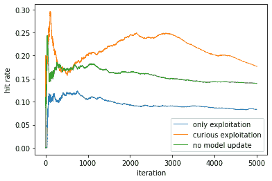

对于主动学习或强化学习来说，这是一个理想的场景，因为与强化学习不同，除了积极的期望之外，不确定性可以是来自客户的一个额外的标准。随着时间的推移，这种寻求熵减少的行为会随着模型对客户理解的提高而减少。

## 它是如何工作的...

值得深入研究一下这个食谱中使用的一些概念和策略。

### 主动学习

主动学习意味着我们可以主动查询更多的信息；换句话说，探索是我们战略的一部分。这在我们必须主动决定学习什么的场景中是有用的，并且我们所学的不仅影响我们的模型学习多少和学习得多好，还影响我们可以获得多少投资回报。

### 赫夫丁树

赫夫丁树(也被称为*非常快速决策树*，简称 *VFDT* 于 2001 年由杰夫·胡尔腾等人提出(*挖掘时变数据流*)。这是一个不断增长的数据流决策树。树节点基于 Hoeffding 界限(或附加 Chernoff 界限)扩展。理论上表明，给定足够的训练数据，由 Hoeffding 树学习的模型非常接近由非增量学习者建立的模型。

赫夫丁界限定义如下:

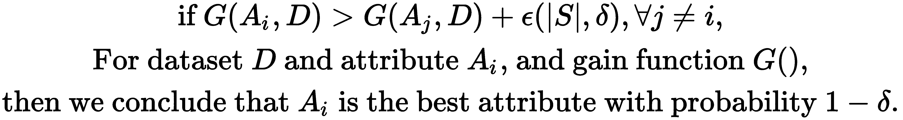

值得注意的是，Hoeffding 树不处理随时间变化的数据分布。

### 类别加权

因为我们正在处理一个不平衡的数据集，所以让我们使用类权重。这基本上意味着我们正在对少数(注册)类进行上采样，对多数类(未注册)进行下采样。

类别权重的公式如下:

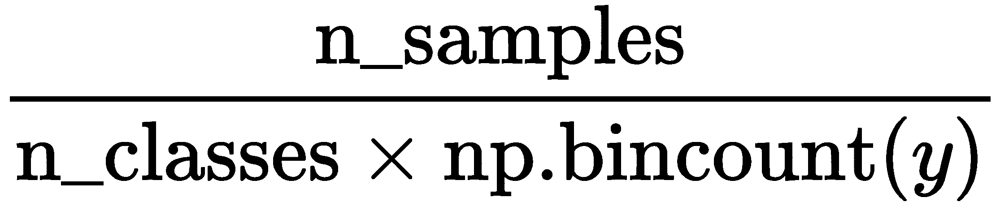

同样，在 Python 中，我们可以编写以下代码:

```py
class_weights = len(X) / (y.astype(int).value_counts() * 2)
```

然后，我们可以使用这些类别权重进行采样。

我们会用更多的提示来结束这个食谱。

## 请参见

scikit-learn 中只有少数模型允许增量学习或在线学习。参考[https://scikit-learn.org/stable/modules/computing.html](https://scikit-learn.org/stable/modules/computing.html)的列表。

一些线性模型包括`partial_fit()`方法。scikit-multiflow 库专门研究增量和在线/流模型:[https://scikit-multiflow.github.io/](https://scikit-multiflow.github.io/)

你可以从最近一篇专注于生物医学图像处理的综述中找到更多关于主动学习的资源和想法(Samuel Budd 等人，*医学图像分析的主动学习和人在回路深度学习调查*，2019；https://arxiv.org/abs/1910.02923。

我们的方法受到了 modalAI Python 主动学习包的启发，你可以在[https://modal-python.readthedocs.io/](https://modal-python.readthedocs.io/)找到它。如果你对主动学习方法感兴趣，我们建议你去看看。还有一些 Python 包可用，如下所示:

*   alipy:Python 中的主动学习:[http://parnec.nuaa.edu.cn/huangsj/alipy/](http://parnec.nuaa.edu.cn/huangsj/alipy/)
*   主动学习:关于主动学习的谷歌报告:[https://github.com/google/active-learning](https://github.com/google/active-learning)

主动学习的主要决策之一是探索和利用之间的权衡。你可以在一篇名为*主动学习中的探索与利用:贝叶斯方法*:[http://www . Vincent Lemaire-labs . fr/publis/ij CNN _ 2 _ 2010 _ camera _ ready . pdf](http://www.vincentlemaire-labs.fr/publis/ijcnn_2_2010_camera_ready.pdf)的论文中找到更多信息

# 对抗算法偏见

**替代制裁的罪犯管理概况** ( **COMPAS** )是一种商业算法，根据刑事被告的案件记录为其分配风险分值。这一风险分数对应于再次犯罪(累犯)和实现暴力犯罪的可能性，这一分数在法庭上用于帮助判决。ProPublica 组织获得了佛罗里达州 1 个县的分数和数据，包含约 7000 人的数据。在等待 2 年以查看谁再次犯罪后，他们在 2016 年审计了 COMPAS 模型，并发现了该模型非常令人担忧的问题。ProPublica 的调查结果之一是基于性别、种族和民族的歧视，特别是在过度预测少数民族累犯的情况下。

歧视是人工智能系统的一个主要问题，也说明了审核你的模型和你输入模型的数据的重要性。如果人类的偏见被忽略，建立在人类决策基础上的模型将会放大人类的偏见。不仅从法律的角度，而且从伦理的角度来看，我们希望建立不使某些群体处于不利地位的模式。这对模型构建提出了一个有趣的挑战。

一般来说，我们会认为正义应该是不分性别或种族的。这意味着法院判决不应考虑种族或性别等敏感变量。然而，即使我们从模型训练中忽略它们，这些敏感变量也可能与其他一些变量相关，因此它们仍然会影响决策，对少数民族或妇女等受保护群体造成损害。

在本节中，我们将使用 ProPublica 提供的 COMPAS 建模数据集。我们将检查种族偏见，然后创建一个模型来消除它。你可以在[https://github.com/propublica/compas-analysis](https://github.com/propublica/compas-analysis)找到 ProPublica 的原始分析。

## 做好准备

在开始之前，我们将首先下载数据，提到预处理中的问题，并安装库。

让我们来看看数据:

```py
!wget https://raw.githubusercontent.com/propublica/compas-analysis/master/compas-scores-two-years.csv
import pandas as pd
date_cols = [
    'compas_screening_date', 'c_offense_date',
    'c_arrest_date', 'r_offense_date', 
    'vr_offense_date', 'screening_date',
    'v_screening_date', 'c_jail_in',
    'c_jail_out', 'dob', 'in_custody', 
    'out_custody'
]
data = pd.read_csv(
    'compas-scores-two-years.csv',
    parse_dates=date_cols
)
```

每一行代表一名囚犯的暴力风险和再犯风险得分。最后一列`two_year_recid`，表示我们的目标。

ProPublica 从不同的来源汇编了他们的数据集，并根据罪犯的名字进行了匹配:

*   布劳沃德县书记员办公室网站上的犯罪记录
*   佛罗里达州惩教署网站上的公开监禁记录
*   COMPAS 分数，它们是通过公共记录信息请求获得的

我们可以强调数据集中的几个问题:

1.  列赛是受保护的类别。它不应该作为模型训练的一个特征，而应该作为一个控制。
2.  数据集中有全名，这是没有用的，甚至可能泄露囚犯的种族。
3.  数据集中有案例号。这些可能对训练模型没有用，尽管它们可能有一些目标泄漏，因为增加的病例数可能给出时间的指示，并且随着时间的推移目标可能有漂移效应。
4.  缺少值。我们需要进行估计。
5.  有日期戳。这些可能没有用，甚至会带来相关的问题(见第 3 点)。然而，我们可以将这些特性转换成 UNIX epochs，它指示自 1970 年以来已经过去的秒数，然后计算日期戳之间的时间段，例如，通过重新调整我们在早期食谱中看到的`NumericDifferenceTransformer`。然后，我们可以将这些时间段用作模型特征，而不是日期戳。
6.  我们有几个分类变量。
7.  收费说明(`c_charge_desc`)可能需要清理。

马蒂亚斯·巴伦斯坦指出([https://arxiv.org/abs/1906.04711](https://arxiv.org/abs/1906.04711))ProPublica 的截止日期中的一个数据处理错误导致保留了比他们应该保留的多 40%的累犯。我们将他的修正应用于两年的截止期:

```py
import datetime
indexes = data.compas_screening_date <= pd.Timestamp(datetime.date(2014, 4, 1))
assert indexes.sum() == 6216
data = data[indexes]
```

我们将在这个菜谱中使用几个库，它们可以按如下方式安装:

```py
!pip install category-encoders
```

`category-encoders`是一个库，它提供了 scikit-learn 所没有的分类编码功能。

## 怎么做...

让我们先弄清楚一些基本术语。我们需要提出公平的衡量标准。但是公平(或者，如果我们看不公平，偏见)是什么意思呢？

公平可以指两个非常不同的概念:

*   【**机会均等**】:模型预测值与实际值的相对比率不应有差异；或者
*   [ **同等结果** ]:模型结果之间不应该有任何差异。

第一种也被称为**等比**，而后者指的是**等假阳性率**。虽然平等机会意味着每个群体都应该得到相同的机会，而不管他们属于哪个群体，但平等结果战略意味着表现不佳的群体应该得到比其他群体更多的宽容或机会。

我们同意假阳性率的观点，这种观点很有吸引力，在平等就业机会的情况下，这种观点在许多司法管辖区的法律中都有明文规定。我们将在*参见*部分提供一些关于这些术语的资源。

因此，影响计算的逻辑是基于混淆矩阵中的值，最重要的是，我们刚刚提到的误报。这些病例被预测为阳性，即使它们实际上是阴性的；在我们的例子中，人们预测为累犯，但他们不是累犯。让我们为此编写一个函数:

```py
def confusion_metrics(actual, scores, threshold):
    y_predicted = scores.apply(
        lambda x: x >= threshold
    ).values
    y_true = actual.values
    TP = (
        (y_true==y_predicted) & 
        (y_predicted==1)
    ).astype(int)
    FP = (
        (y_true!=y_predicted) &
        (y_predicted==1)
    ).astype(int)
    TN = (
        (y_true==y_predicted) &
        (y_predicted==0)
    ).astype(int)
    FN = (
        (y_true!=y_predicted) &
        (y_predicted==0)
    ).astype(int)
    return TP, FP, TN, FN

```

我们现在可以使用此函数来总结此代码对特定组的影响:

```py
def calculate_impacts(data, sensitive_column='race', recid_col='is_recid', score_col='decile_score.1', threshold=5.0):
    if sensitive_column == 'race':
      norm_group = 'Caucasian'
    elif sensitive_column == 'sex':
      norm_group = 'Male'
    else:
      raise ValueError('sensitive column not implemented')
    TP, FP, TN, FN = confusion_metrics(
        actual=data[recid_col],
        scores=data[score_col],
        threshold=threshold
    )
    impact = pd.DataFrame(
        data=np.column_stack([
              FP, TN, FN, TN,
              data[sensitive_column].values, 
              data[recid_col].values,
              data[score_col].values / 10.0
             ]),
        columns=['FP', 'TP', 'FN', 'TN', 'sensitive', 'reoffend', 'score']
    ).groupby(by='sensitive').agg({
        'reoffend': 'sum', 'score': 'sum',
        'sensitive': 'count', 
        'FP': 'sum', 'TP': 'sum', 'FN': 'sum', 'TN': 'sum'
    }).rename(
        columns={'sensitive': 'N'}
    )

    impact['FPR'] = impact['FP'] / (impact['FP'] + impact['TN'])
    impact['FNR'] = impact['FN'] / (impact['FN'] + impact['TP'])
    impact['reoffend'] = impact['reoffend'] / impact['N']
    impact['score'] = impact['score'] / impact['N']
    impact['DFP'] = impact['FPR'] / impact.loc[norm_group, 'FPR']
    impact['DFN'] = impact['FNR'] / impact.loc[norm_group, 'FNR']
    return impact.drop(columns=['FP', 'TP', 'FN', 'TN'])
```

这首先用真阳性和假阴性计算混淆矩阵，然后对**不利影响比** ( **空气**)，统计学上也称为**相对风险比** ( **RRR** )进行编码。给定任何性能指标，我们可以写出以下内容:


这表达了一种期望，即受保护群体(非裔美国人)的指标应该与正常群体(白种人)的指标相同。在这种情况下，我们将得到 1.0。如果受保护组的指标与正常组的差异超过 20 个百分点(即低于 0.8 或高于 1.2)，我们会将其标记为显著歧视。

**常模组** : **常模组**，也称为**标准化样本**或**常模组**，是数据集的一个样本，代表统计数据要与之进行比较的总体。在偏倚的上下文中，其合法定义是成功最高的组，但在某些上下文中，整个数据集或最频繁的组反而被作为基线。实际上，我们以白人群体为例，因为他们是最大的群体，也是模型最适用的群体。

在前面的函数中，我们按敏感组计算假阳性率。然后我们可以检查非裔美国人相对于白种人的假阳性率是否不成比例，或者非裔美国人的假阳性率是否高得多。这将意味着非裔美国人被标记为惯犯的频率比他们应该的要高得多。我们发现事实确实如此:

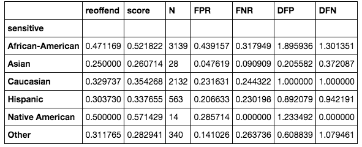

关于此表的简短说明如下:

*   重新犯罪:重新犯罪的频率
*   分数:小组的平均分数
*   n:团体中的总人数
*   FPR:假阳性率
*   FNR:假阴性率
*   DFP:不成比例的假阳性
*   DFN:不成比例的假阴性

最后的 FPR 和 FNR 栏一起可以给出一个模型的一般质量的想法。如果两者都很高，那么这个模型对于特定的群体来说表现不好。最后两列分别表示 FPR 和 FNR 比率的不利影响比率，这是我们主要关注的。我们需要通过将非裔美国人的 FPR 降低到可容忍的水平来减少模型中的种族偏见。

让我们做一些预处理，然后我们将建立模型:

```py
from sklearn.feature_extraction.text import CountVectorizer
from category_encoders.one_hot import OneHotEncoder
from sklearn.model_selection import train_test_split
from sklearn.preprocessing import StandardScaler

charge_desc = data['c_charge_desc'].apply(lambda x: x if isinstance(x, str) else '')
count_vectorizer = CountVectorizer(
    max_df=0.85, stop_words='english',
    max_features=100, decode_error='ignore'
)
charge_desc_features = count_vectorizer.fit_transform(charge_desc)

one_hot_encoder = OneHotEncoder()
charge_degree_features = one_hot_encoder.fit_transform(
    data['c_charge_degree']
)

data['race_black'] = data['race'].apply(lambda x: x == 'African-American').astype(int)
stratification = data['race_black'] + (data['is_recid']).astype(int) * 2

```

`CountVectorizer`统计单词的词汇量，表示每个单词使用的次数。这被称为单词袋表示法，我们将它应用于电荷描述列。我们排除英语停用词，这是很常见的词如介词(如上的**或**上的**)和人称代词(如 **I** 或**me**)；我们还将词汇量限制在 100 个单词以内，以及不会在超过 85%的字段中出现的单词。**

我们将虚拟编码(一位热编码)应用于电荷量。

为什么我们使用两种不同的变换？基本上，描述是对某人为什么被指控犯罪的文字描述。每个领域都不一样。如果我们使用独热编码，每个字段将得到它们自己的虚拟变量，我们将看不到字段之间的任何共性。

最后，我们创建了一个新的分层变量，以确保我们在训练和测试数据集中对累犯(我们的目标变量)和某人是否是非裔美国人有相似的比例。这将有助于我们计算指标来检查歧视:

```py
y = data['is_recid']
X = pd.DataFrame(
    data=np.column_stack(
        [data[['juv_fel_count', 'juv_misd_count',
 'juv_other_count', 'priors_count', 'days_b_screening_arrest']], 
          charge_degree_features, 
          charge_desc_features.todense()
        ]
    ),
    columns=['juv_fel_count', 'juv_misd_count', 'juv_other_count', 'priors_count', 'days_b_screening_arrest'] \
    + one_hot_encoder.get_feature_names() \
    + count_vectorizer.get_feature_names(),
    index=data.index
)
X['jailed_days'] = (data['c_jail_out'] - data['c_jail_in']).apply(lambda x: abs(x.days))
X['waiting_jail_days'] = (data['c_jail_in'] - data['c_offense_date']).apply(lambda x: abs(x.days))
X['waiting_arrest_days'] = (data['c_arrest_date'] - data['c_offense_date']).apply(lambda x: abs(x.days))
X.fillna(0, inplace=True)

columns = list(X.columns)
X_train, X_test, y_train, y_test = train_test_split(
    X, y, test_size=0.33,
    random_state=42,
    stratify=stratification
)  # we stratify by black and the target
```

我们做一些数据工程，导出变量来记录某人在监狱里呆了多少天，等待审判，或者等待逮捕。

我们将使用 jax 构建一个神经网络模型，类似于我们在 scikit 中的*分类中遇到的模型——在 [第 1 章](87098651-b37f-4b05-b0ee-878193f28b95.xhtml)，*Python 中的人工智能入门*中的*配方。这一次，我们将进行全面的实现:

```py
import jax.numpy as jnp
from jax import grad, jit, vmap, ops, lax
import numpy.random as npr
import numpy as onp
import random
from tqdm import trange
from sklearn.base import ClassifierMixin
from sklearn.preprocessing import StandardScaler

class JAXLearner(ClassifierMixin):
  def __init__(self, layer_sizes=[10, 5, 1], epochs=20, batch_size=500, lr=1e-2):
    self.params = self.construct_network(layer_sizes)
    self.perex_grads = jit(grad(self.error))
    self.epochs = epochs
    self.batch_size = batch_size
    self.lr = lr

  @staticmethod
  def construct_network(layer_sizes=[10, 5, 1]):
    '''Please make sure your final layer corresponds to targets in dimensions.
    '''
    def init_layer(n_in, n_out):
      W = npr.randn(n_in, n_out)
      b = npr.randn(n_out,)
      return W, b

    return list(map(init_layer, layer_sizes[:-1], layer_sizes[1:]))

  @staticmethod
  def sigmoid(X):  # or tanh
    return 1/(1+jnp.exp(-X))

  def _predict(self, inputs):
    for W, b in self.params:
      outputs = jnp.dot(inputs, W) + b
      inputs = self.sigmoid(outputs)
    return outputs

  def predict(self, inputs):
    inputs = self.standard_scaler.transform(inputs)
    return onp.asarray(self._predict(inputs))

  @staticmethod
  def mse(preds, targets, other=None):
    return jnp.sqrt(jnp.sum((preds - targets)**2))

  @staticmethod
  def penalized_mse(preds, targets, sensitive):
    err = jnp.sum((preds - targets)**2)
    err_s = jnp.sum((preds * sensitive - targets * sensitive)**2)
    penalty = jnp.clip(err_s / err, 1.0, 2.0)
    return err * penalty

  def error(self, params, inputs, targets, sensitive):
      preds = self._predict(inputs)
      return self.penalized_mse(preds, targets, sensitive)

  def fit(self, X, y, sensitive):
    self.standard_scaler = StandardScaler()
    X = self.standard_scaler.fit_transform(X)
    N = X.shape[0]
    indexes = list(range(N))
    steps_per_epoch = N // self.batch_size

    for epoch in trange(self.epochs, desc='training'):
        random.shuffle(indexes)
        index_offset = 0
        for step in trange(steps_per_epoch, desc='iteration'):
            grads = self.perex_grads(
                self.params, 
                X[indexes[index_offset:index_offset+self.batch_size], :], 
                y[indexes[index_offset:index_offset+self.batch_size]],
                sensitive[indexes[index_offset:index_offset+self.batch_size]]
            )
            # print(grads)
            self.params = [(W - self.lr * dW, b - self.lr * db)
                      for (W, b), (dW, db) in zip(self.params, grads)]
            index_offset += self.batch_size
```

这是一个 JAX 神经网络的 scikit-learn 包装器。为了 scikit-learn 的兼容性，我们从`ClassifierMixin`继承并实现了`fit()`和`predict()`。这里最重要的部分是惩罚 MSE 方法，它除了模型预测和目标之外，还考虑了一个敏感变量。

让我们训练它，检查它的性能。请注意，我们输入了`X`、`y`和`sensitive_train`，我们将它们定义为训练数据集的非裔美国人的指示变量:

```py
sensitive_train = X_train.join(
    data, rsuffix='_right'
)['race_black']
jax_learner = JAXLearner([X.values.shape[1], 100, 1])
jax_learner.fit(
    X_train.values,
    y_train.values,
    sensitive_train.values
)

```

我们将统计数据可视化如下:

```py
X_predicted = pd.DataFrame(
    data=jax_learner.predict(
        X_test.values
    ) * 10,
    columns=['score'], 
    index=X_test.index
).join(
    data[['sex', 'race', 'is_recid']], 
    rsuffix='_right'
)
calculate_impacts(X_predicted, score_col='score')

```

这是我们得到的表格:

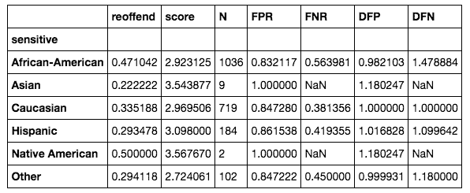

我们可以看到，非裔美国人的不成比例的假阳性率非常接近(甚至低于)1.0，这正是我们想要的。测试集很小，没有包含足够的亚洲人和美洲原住民的样本，所以我们无法为这些群体计算有意义的统计数据。然而，如果我们想要确保这两个组具有相同的假阳性率，我们可以扩展我们的方法以包括这两个组。

## 它是如何工作的...

实现这一点的关键是定制目标函数或损失函数。这在 scikit-learn 中并不简单，尽管我们将在下一节展示一个实现。

通常，实现您自己的成本或损失函数有不同的可能性。

*   LightGBM、Catboost 和 XGBoost 都提供了一个具有许多损失函数的接口，并且能够定义自定义损失函数。
*   PyTorch 和 Keras (TensorFlow)提供了接口。
*   您可以从头开始实现您的模型(这就是我们在主菜谱中所做的)。

Scikit-learn 通常不提供公共 API 来定义自己的损失函数。对于许多算法来说，只有一个选择，有时有几个选择。树的分割标准的基本原理是损失函数必须是可执行的，只有 Cython 实现才能保证这一点。这仅在非公共 API 中可用，这意味着它更难使用。

最后，当没有(直截了当的)方法来实现自定义损失时，您可以将您的算法包装在一个通用的优化方案中，比如遗传算法。

在神经网络中，只要你提供一个可微的损失函数，你就可以插入任何你想要的东西。

基本上，我们能够用**均方误差** ( **MSE** )函数将不利影响编码为惩罚项。它基于我们之前提到的 MSE，但是有一个不利影响的惩罚项。让我们再来看看损失函数:

```py
  @staticmethod
  def penalized_mse(preds, targets, sensitive):
    err = jnp.sum((preds - targets)**2)
    err_s = jnp.sum((preds * sensitive - targets * sensitive)**2)
    penalty = jnp.clip(err_s / err, 1.0, 2.0)
    return err * penalty
```

首先要注意的是，我们传递的不是两个变量，而是三个变量。`sensitive`是与不利影响相关的变量，表明我们是否有来自受保护群体的人。

计算过程如下:

1.  我们从模型预测和目标中计算总体 MSE。
2.  我们计算保护组的 MSE，`err_s`。
3.  我们取保护组的 MSE 与整体 MSE(AIR)的比值，并将其限制在 1.0 到 2.0 之间。我们不希望值低于 1，因为我们只对空气感兴趣，如果它对受保护的群体有负面影响的话。
4.  然后，我们将空气乘以总均方误差。

至于 2，MSE 可以简单地通过将预测和目标分别乘以`sensitive`来计算。这将抵消所有的点，其中敏感等于 0。

至于 4，这似乎会抵消整体误差，但我们看到它实际上似乎是可行的。我们也许可以把这两项加起来，给这两个错误一个相似的重要性。

我们使用 Jax 中的自动签名功能来区分这一点。

## 还有更多...

在下文中，我们将使用非公共的 scikit-learn API 来实现决策树的自定义分割标准。我们将使用 COMPAS 数据集来训练一个随机森林模型:

这扩展了叶夫根尼·杜波夫([https://github.com/EvgeniDubov/hellinger-distance-criterion](https://github.com/EvgeniDubov/hellinger-distance-criterion))对海灵格准则的实现。

```py
%%cython

from sklearn.tree._criterion cimport ClassificationCriterion
from sklearn.tree._criterion cimport SIZE_t

import numpy as np
cdef double INFINITY = np.inf

from libc.math cimport sqrt, pow
from libc.math cimport abs

cdef class PenalizedHellingerDistanceCriterion(ClassificationCriterion):    

    cdef double proxy_impurity_improvement(self) nogil:
        cdef double impurity_left
        cdef double impurity_right

        self.children_impurity(&impurity_left, &impurity_right)

        return impurity_right + impurity_left

    cdef double impurity_improvement(self, double impurity) nogil:
        cdef double impurity_left
        cdef double impurity_right

        self.children_impurity(&impurity_left, &impurity_right)
        return impurity_right + impurity_left

    cdef double node_impurity(self) nogil:
        cdef SIZE_t* n_classes = self.n_classes
        cdef double* sum_total = self.sum_total
        cdef double hellinger = 0.0
        cdef double sq_count
        cdef double count_k
        cdef SIZE_t k
        cdef SIZE_t c

        for k in range(self.n_outputs):
            for c in range(n_classes[k]):
                hellinger += 1.0

        return hellinger / self.n_outputs

    cdef void children_impurity(self, double* impurity_left,
                                double* impurity_right) nogil:
        cdef SIZE_t* n_classes = self.n_classes
        cdef double* sum_left = self.sum_left
        cdef double* sum_right = self.sum_right
        cdef double hellinger_left = 0.0
        cdef double hellinger_right = 0.0
        cdef double count_k1 = 0.0
        cdef double count_k2 = 0.0

        cdef SIZE_t k
        cdef SIZE_t c

        # stop splitting in case reached pure node with 0 samples of second class
        if sum_left[1] + sum_right[1] == 0:
            impurity_left[0] = -INFINITY
            impurity_right[0] = -INFINITY
            return

        for k in range(self.n_outputs):
            if(sum_left[0] + sum_right[0] > 0):
                count_k1 = sqrt(sum_left[0] / (sum_left[0] + sum_right[0]))
            if(sum_left[1] + sum_right[1] > 0):
                count_k2 = sqrt(sum_left[1] / (sum_left[1] + sum_right[1]))

            hellinger_left += pow((count_k1  - count_k2), 2)

            if(sum_left[0] + sum_right[0] > 0):    
                count_k1 = sqrt(sum_right[0] / (sum_left[0] + sum_right[0]))
            if(sum_left[1] + sum_right[1] > 0):
                count_k2 = sqrt(sum_right[1] / (sum_left[1] + sum_right[1]))

            if k==0:
              hellinger_right += pow((count_k1  - count_k2), 2)
            else:
              hellinger_right -= pow((count_k1  - count_k2), 2)

        impurity_left[0]  = hellinger_left  / self.n_outputs
        impurity_right[0] = hellinger_right / self.n_outputs
```

让我们用它来进行训练和测试:

```py
ensemble = [
    DecisionTreeClassifier(
      criterion=PenalizedHellingerDistanceCriterion(
        2, np.array([2, 2], dtype='int64')
      ),
      max_depth=100
    ) for i in range(100)
]
for model in ensemble:
    model.fit(
        X_train,
        X_train.join(
            data,
            rsuffix='_right'
        )[['is_recid', 'race_black']]
    )
Y_pred = np.array(
    [model.predict(X_test) for model in
     ensemble]
)
predictions2 = Y_pred.mean(axis=0)
```

这使我们的 AUC 为 0.62:

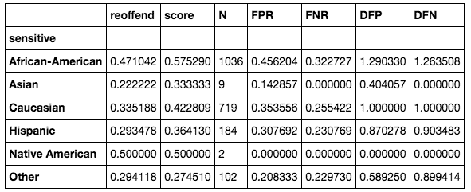

我们可以看到，虽然我们走了很长的路，但我们并没有完全消除所有的偏见。30%(非裔美国人的 DFP)仍被认为是不可接受的。我们可以尝试不同的优化或采样策略来改善结果。不幸的是，我们不能在实践中使用这个模型。

例如，解决这个问题的一种方法是在随机森林中进行模型选择。由于每棵树都有自己对人进行分类的方式，我们可以计算每棵树或树的组合的负面影响统计数据。我们可以移除树木，直到只剩下满足不利影响条件的树木子集。这超出了本章的范围。

## 请参见

你可以在不同的地方阅读更多关于算法公平的内容。关于公平有各种各样的文献:

*   《科学》杂志一篇关于 COMPAS 模型的文章(茱莉亚·德雷塞尔和哈尼·法里德，2018，*预测累犯的准确性、公平性和局限性*):【https://advances.sciencemag.org/content/4/1/eaao5580】T2
*   *机器学习中公平增强干预的比较研究* (Sorelle Friedler 等人，2018):【https://arxiv.org/pdf/1802.04422.pdf 
*   *关于机器学习中的偏见和公平的调查* (Mehrabi 等人，2019):【https://arxiv.org/pdf/1908.09635.pdf
*   解释公平的效果(Jonathan Dodge 等人，2019):[https://arxiv.org/pdf/1901.07694.pdf](https://arxiv.org/pdf/1901.07694.pdf)

不同的 Python 库可用于解决偏见(或者相反，算法的公平性):

*   费尔勒:https://github.com/fairlearn/fairlearn
*   AIF 360:[https://github.com/IBM/AIF360](https://github.com/IBM/AIF360)
*   https://github.com/adebayoj/fairml
*   https://github.com/algofairness/BlackBoxAuditing
*   平衡委员会选举:[https://github.com/huanglx12/Balanced-Committee-Election](https://github.com/huanglx12/Balanced-Committee-Election)

最后，Scikit-Lego 包含了公平的功能:[https://scikit-lego.readthedocs.io/en/latest/fairness.html](https://scikit-lego.readthedocs.io/en/latest/fairness.html)

虽然你可以通过执行谷歌数据集搜索([https://toolbox.google.com/datasetsearch](https://toolbox.google.com/datasetsearch))找到许多关于累犯的数据集，但还有更多应用和相应的数据集，其中公平性很重要，例如信用评分、人脸识别、招聘或预测性警务，仅举几例。

有不同的地方找到更多关于海关损失。文章*Custom loss vs Custom scoring*([https://kiwi Damien . github . io/Custom-loss-vs-Custom-scoring . html](https://kiwidamien.github.io/custom-loss-vs-custom-scoring.html))提供了一个很好的概述。对于梯度增强中自定义损失函数的实现，towards data science([https://towards data science . com/custom-loss-functions-for-gradient-boosting-f 79 C1 b 40466d](https://towardsdatascience.com/custom-loss-functions-for-gradient-boosting-f79c1b40466d))是一个很好的起点。

# 预测 CO [2] 时间序列

在这个食谱中，我们将测试一些著名的模型(ARIMA，萨里玛)和信号分解，通过使用脸书的先知库对时间序列数据进行预测，以检查它们在预测我们的时间序列 CO [2] 值时的性能。

## 做好准备

为了准备这个菜谱，我们将安装库并下载数据集。

我们将使用`statsmodels`包和 prophet:

```py
pip install statsmodels fbprophet
```

我们将分析该配方中的 CO [2] 浓度数据。你可以在 GitHub 上的笔记本中看到这个食谱的数据加载，或者在 scikit-learn **高斯过程回归** ( **GPR** )关于莫纳罗亚公司 [2] 数据的例子:[https://scikit-learn . org/stable/auto _ examples/Gaussian _ process/plot _ GPR _ CO2 . html # sphx-glr-auto-examples-Gaussian-process-plot-GPR-CO2-py](https://scikit-learn.org/stable/auto_examples/gaussian_process/plot_gpr_co2.html#sphx-glr-auto-examples-gaussian-process-plot-gpr-co2-py)

这个数据集是二氧化碳的大气记录中最早的记录之一。正如稍后将观察到的，该数据遵循正弦曲线模式，由于冬季植物和植被数量减少，CO [2] 浓度在冬季上升，在夏季下降:

```py
X,y = load_mauna_loa_atmospheric_co2()
```

该数据集包含了从 1958 年到 2001 年在夏威夷莫纳罗亚天文台测量的平均 CO [2] 浓度。我们将根据这一点来模拟二氧化碳的浓度。

## 怎么做...

现在我们开始预测二氧化碳数据的时间序列。我们将首先探索数据集，然后应用 ARIMA 和萨里玛技术。

1.  让我们来看看时间序列:

```py
df_CO2 = pd.DataFrame(data = X, columns = ['Year'])
df_CO2['CO2 in ppm'] = y
lm = sns.lmplot(x='Year', y='CO2 in ppm', data=df_CO2, height=4, aspect=4)
fig = lm.fig 
fig.suptitle('CO2 conc. mauna_loa 1958-2001', fontsize=12)
```

这是图表:

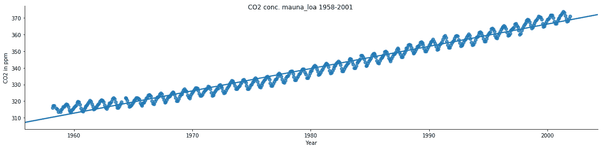

此处的脚本显示了 CO [2] 数据的时间序列季节性分解，显示了 CO [2] 浓度的明显季节性变化，这可以追溯到生物学:

```py
import statsmodels.api as stmd
d = stm.datasets.co2.load_pandas()
co2 = d.data
co2.head()
y = co2['co2']
y = y.fillna(
    y.interpolate()
)  # Fill missing values by interpolation
```

既然我们已经为分解预处理了数据，让我们继续吧:

```py
from pylab import rcParams
rcParams['figure.figsize'] = 11, 9
result = stm.tsa.seasonal_decompose(y, model='additive')
pd.plotting.register_matplotlib_converters()
result.plot()
plt.show()
```

在这里，我们看到了分解:观察到的时间序列，它的趋势，季节性成分，以及仍然无法解释的剩余元素:

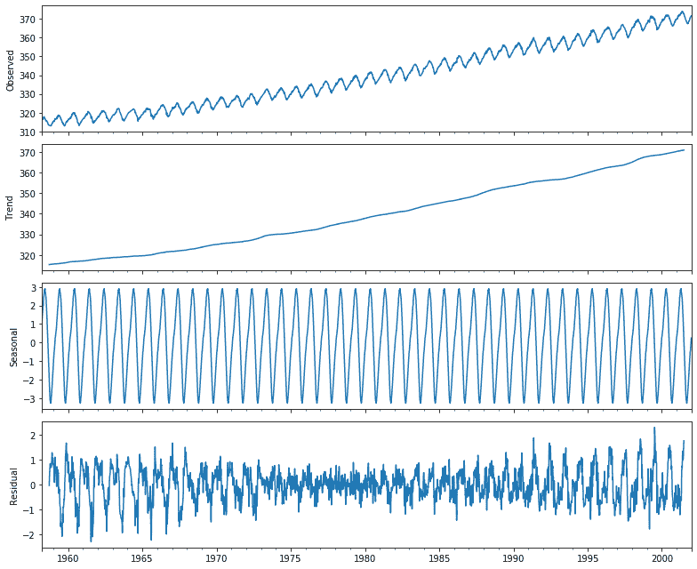

现在，我们来分析一下时间序列。

### 使用 ARIMA 和萨里玛分析时间序列

我们将使 ARIMA 和萨里玛模型适合数据集。

我们将定义我们的两个模型，并将它们应用到测试数据集中的每一点。这里，我们在所有的点上迭代地拟合模型，并预测下一个点，作为一步前进。

1.  首先，我们拆分数据:

```py
# taking a 90/10 split between training and testing:
future = int(len(y) * 0.9)
print('number of train samples: %d test samples %d' (future, len(y)-future)
)
train, test = y[:future], y[future:]

```

这样我们就剩下 468 个样本用于训练，53 个样本用于测试。

2.  接下来，我们定义模型:

```py
from statsmodels.tsa.arima_model import ARIMA
from statsmodels.tsa.statespace.sarimax import SARIMAX

def get_arima_model(history, order=(5, 1, 0)):
    return ARIMA(history, order=order)

def get_sarima_model(
    history,
    order=(5, 1, 1),
    seasonal_order=(0, 1, 1, 4)
    ):
    return SARIMAX(
        history,
        order=order,
        enforce_stationarity=True,
        enforce_invertibility=False,
        seasonal_order=seasonal_order
    )

```

3.  然后我们训练模型:

```py
from sklearn.metrics import mean_squared_error

def apply_model(train, test, model_fun=get_arima_model):
  '''we just roll with the model and apply it to successive
  time steps
  '''
  history = list(train)
  predictions = []
  for t in test:
    model = model_fun(history).fit(disp=0)
    output = model.forecast()
    predictions.append(output[0])
    history.append(t)
  error = mean_squared_error(test, predictions)
  print('Test MSE: %.3f' % error)
  #print(model.summary().tables[1])
  return predictions, error

predictions_arima, error_arima = apply_model(train, test)
predictions_sarima, error_sarima = apply_model(
    train, test, get_sarima_model
)
```

对于 ARIMA 和萨里玛模型，我们在测试中分别得到 0.554 和 0.405 的 MSE。让我们看看这些模型是如何图形拟合的:

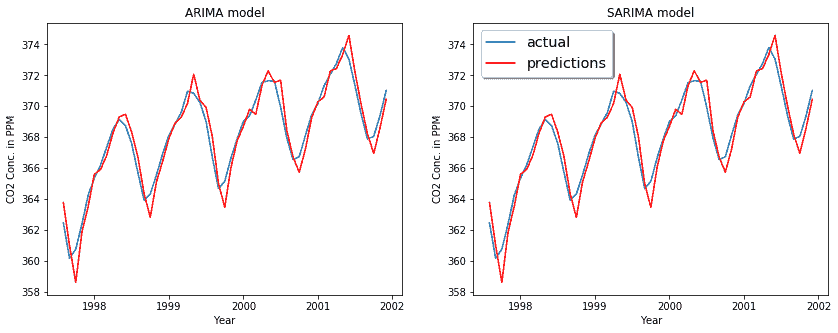

我们可以使用 **Akaike 信息标准** ( **AIC** )进行参数探索，它表达了与模型中参数数量相关的模型质量。statsmodels 中的 fit 函数返回的模型对象包含 AIC，因此我们可以在一系列参数上进行网格搜索，然后选择最小化 AIC 的模型。

## 它是如何工作的...

时间序列数据是观察值 *x(t)* 的集合，其中每个数据点在时间 *t* 被记录。在大多数情况下，时间是一个离散变量，也就是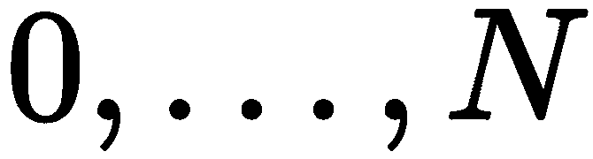。我们正在研究预测，这是一项基于时间序列中以前的观察预测未来值的任务。

为了解释我们使用的模型，ARIMA 和萨里玛，我们必须一步一步来，依次解释每一个:

*   **自回归** ( **AR**
*   **移动平均线** ( **马**)
*   **自回归移动平均** ( **ARMA** )
*   **自回归综合移动平均线**(**)和**
***   **季节性自回归综合移动平均线** ( **SARIMA** )**

 **ARIMA 和萨里玛基于 ARMA 模型，这是一个**自回归移动平均**模型。让我们简单回顾一下一些基础知识。

ARMA 是一个线性模型，分为两部分。一、自回归线性模型:

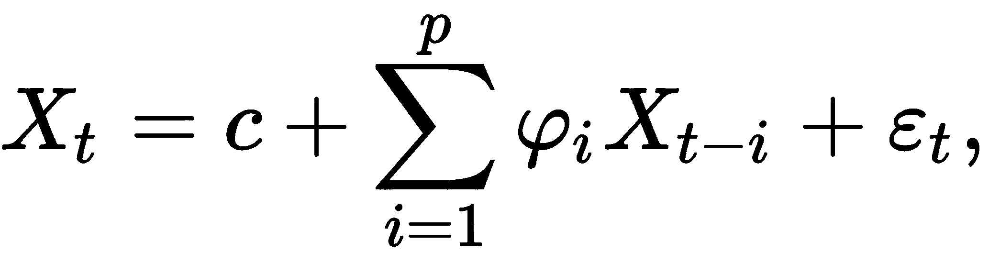

这里，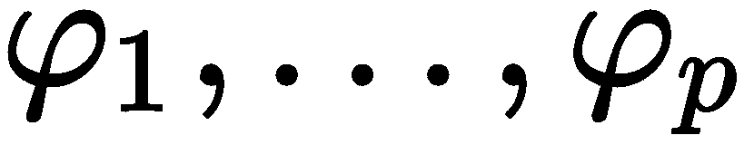是参数，是常数，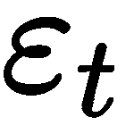是白噪声，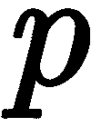是模型的阶数(或线性模型的窗口大小)。ARMA 的第二部分是移动平均线，这也是一个线性回归，但是是不可观察的滞后误差项，定义如下:

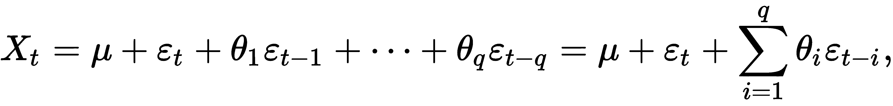

这里，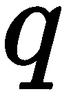是移动平均的阶次，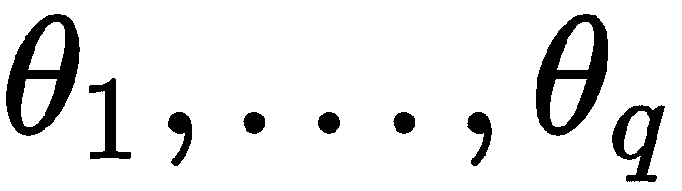是参数，是时间序列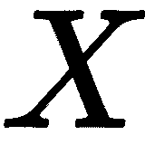的期望或均值。ARMA(p，q)模型是 AR(p)和 MA(q)这两个模型的组合:

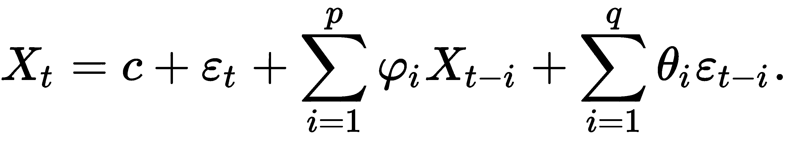

装配过程有点复杂，尤其是因为 MA 部分。如果你有兴趣，你可以在维基百科上阅读博克斯-詹金斯方法:[https://en.wikipedia.org/wiki/Box%E2%80%93Jenkins_method](https://en.wikipedia.org/wiki/Box%E2%80%93Jenkins_method)

然而，有一些限制需要注意。时间序列必须如下:

*   平稳:基本上，观测值的均值和协方差必须随时间保持不变。
*   非周期性:虽然 p 和 q 的较大值可以用来模拟季节性，但它不是模型的一部分。
*   线性: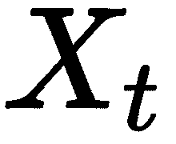的每个值可以建模为先前值和误差项的线性组合。

ARMA 有不同的扩展来解决前两个限制，这就是 ARIMA 和萨里玛的用武之地。

ARIMA ( *p* 、 *d* 、 *q* )代表**自回归综合移动平均线**。它有三个参数:

*   **p** :自回归项(autoregression)的个数
*   **d** :平稳性(积分)所需的非季节性差异数
*   **q** :滞后预测误差数(移动平均)

*积分*指的是差分。为了稳定平均值，我们可以取连续观测值之间的差值。这也可以消除趋势或季节性。可以这样写:

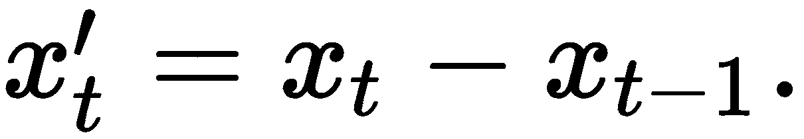

这可以重复几次，这就是 ARIMA 带的参数 d 描述的。请注意，ARIMA 可以处理漂移和非平稳时间序列。然而，它仍然不能处理季节性。

萨里玛代表季节性 ARIMA，是 ARIMA 的扩展，因为它也考虑了数据的季节性。

*萨里玛* ( *p* ， *d* ， *q* )( *P* ， *D* ， *Q* ) *m* 包含 ARIMA 的非季节性参数和附加季节性参数。大写字母 P、D、Q 标注了季节移动平均和自回归分量，其中 *m* 是每个季节的期数。通常这是一年中的周期数；例如， *m=4* 代表季度季节效应，这意味着 *D* 代表观测值 *Xt* 和 *Xt-m* 之间的季节差异，而 *P* 和 *Q* 代表后移为 *m* 的线性模型。

在 Python 中，statsmodels 库提供了一种基于数据的季节性来执行信号分解的方法。

## 还有更多...

Prophet 是脸书提供的用于预测时间序列数据的库。它在一个附加模型上工作，适合非线性模型。当数据具有强烈的季节效应并且有足够的历史趋势可用时，库工作得最好。

让我们看看如何使用它:

```py
from fbprophet import Prophet

train_df = df_CO2_fb['1958':'1997']
test_df = df_CO2_fb['1998':'2001']
train_df = train_df.reset_index()
test_df = test_df.reset_index()Co2_model= Prophet(interval_width=0.95)

Co2_model.fit(train_df)
train_forecast = Co2_model.predict(train_df)
test_forecast = Co2_model.predict(test_df)
fut = Co2_model.make_future_DataFrame(periods=12, freq='M')
forecast_df = Co2_model.predict(fut)
Co2_model.plot(forecast_df)
```

以下是我们的模型预测:

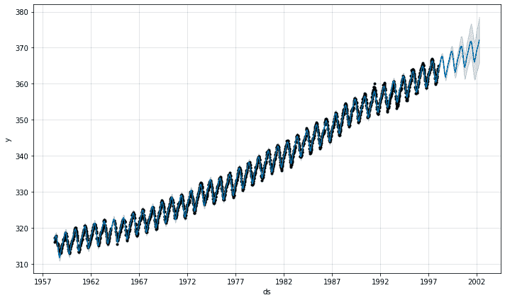

我们得到了与之前 SARIMA 萨里玛模型类似的分解，即趋势和季节成分:

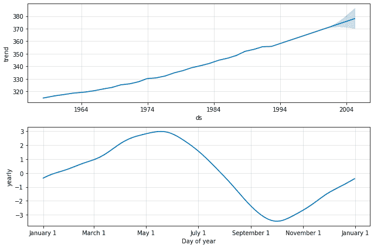

每年的变化很好地显示了二氧化碳浓度随季节的上升和下降。随着时间的推移，这种趋势明显上升，如果你考虑到全球变暖，这可能是令人担忧的。

## 请参见

我们在这个配方中使用了以下库:

*   统计模型:[http://statsmodels.sourceforge.net/stable/](http://statsmodels.sourceforge.net/stable/)
*   先知:[https://facebook.github.io/prophet/](https://facebook.github.io/prophet/)

还有许多与时间序列相关的有趣的库，包括:

*   使用 statsmodels 中的状态空间模型进行时间序列建模:
    [https://www.statsmodels.org/dev/statespace.html](https://www.statsmodels.org/dev/statespace.html)
*   Glu onts:MXNet 中的概率时间序列模型(Python):[https://gluon-ts.mxnet.io/](https://gluon-ts.mxnet.io/)
*   SkTime:时间序列建模的统一接口:[https://github.com/alan-turing-institute/sktime](https://github.com/alan-turing-institute/sktime)**