为了从数据中获取知识，理解数据集背后的结构很重要。我们表示数据集的方式可以使以某种方式工作变得更加直观，从而更容易从中获得洞察力。工具定律指出，当拿着锤子时，一切看起来都像钉子(根据安德鲁马斯洛的《科学心理学》(1966 年出版)，并且是关于使工作适应可用工具的趋势。然而，没有什么灵丹妙药，因为考虑到眼前的问题，所有方法都有其缺点。因此，重要的是了解可用工具库中的基本方法，以便识别我们应该使用锤子而不是螺丝刀的情况。

在本章中，我们将了解表示数据的不同方式，无论是出于营销目的可视化客户群并发现不寻常的模式，还是投影数据以强调差异，根据客户自己以及其他客户之前的选择向客户推荐产品，以及通过相似性识别欺诈者。

具体来说，我们将展示以下食谱:

*   聚类细分市场
*   发现异常
*   相似性搜索的表示
*   推荐产品
*   发现欺诈者社区

# 聚类细分市场

在这个菜谱中，我们将应用聚类方法来找到用于营销目的的客户群。我们将查看德国信用风险数据集，并尝试识别不同的客户群；理想情况下，我们希望找到最有利可图且与众不同的群体，这样我们就可以向他们投放广告。

## 做好准备

对于这个食谱，我们将使用一个信用风险数据集，通常简称为德国信用风险数据集。每一行都描述了一个贷款的人，给出了这个人的一些属性，并告诉我们这个人是否还了贷款(也就是说，这个贷款是好的还是坏的风险)。

我们需要下载并加载德国信用数据，如下所示:

```py
import pandas as pd
!wget http://archive.ics.uci.edu/ml/machine-learning-databases/statlog/german/german.data
names = ['existingchecking', 'duration', 'credithistory',
         'purpose', 'creditamount', 'savings', 
         'employmentsince', 'installmentrate', 
         'statussex', 'otherdebtors', 'residencesince', 
         'property', 'age', 'otherinstallmentplans', 
         'housing', 'existingcredits', 'job', 
         'peopleliable', 'telephone', 'foreignworker', 
         'classification']

customers = pd.read_csv('german.data', names=names, delimiter=' ')
```

对于可视化，我们将使用`dython`库。`dython`库直接作用于分类和数字变量，并对数字-分类或分类-分类比较进行调整。详情请见文件，地点在 http://shakedzy.xyz/dython/[。让我们安装库如下:](http://shakedzy.xyz/dython/)

```py
!pip install dython
```

我们现在可以玩德国信用数据集，用`dython`可视化它，看看里面代表的人如何被聚集在不同的组中。

## 怎么做...

我们将首先可视化数据集，进行一些预处理，并应用一个聚类算法。我们将尝试从集群中找出意义，并借助新的见解再次进行集群。

我们将从可视化特征开始:

1.  **可视化关联**:在这个菜谱中，我们将使用`dython`库。我们可以使用 dython 的`associations`函数计算相关性，该函数根据变量类型调用分类、数值(皮尔逊相关)和混合分类-数值相关函数:

```py
from dython.nominal import associations

associations(customers, clustering=True, figsize=(16, 16), cmap='YlOrBr');
```

这个调用不仅计算相关性，还通过将相关的变量聚集在一起来清理相关性矩阵。数据可视化如下图所示:

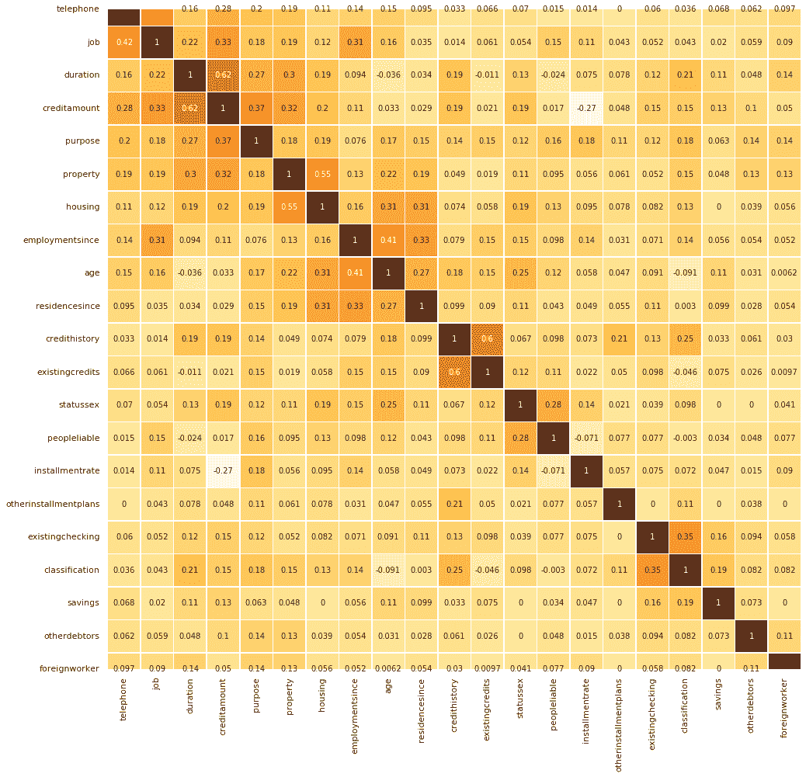

我们看不到清晰的星团界线；然而，如果你沿着对角线看，似乎有几组。

此外，一些变量，如电话和工作，从其他变量中脱颖而出。在 GitHub 上的笔记本中，我们尝试了降维方法，看看这是否有助于我们的聚类。然而，降维并没有那么有效，而直接聚类效果更好:[https://github . com/packt publishing/Artificial-Intelligence-with-Python-Cookbook/blob/master/chapter 03/Clustering % 20 market % 20 segments . ipynb](https://github.com/PacktPublishing/Artificial-Intelligence-with-Python-Cookbook/blob/master/chapter03/Clustering%20market%20segments.ipynb)。

作为聚类的第一步，我们将把一些变量转换成虚拟变量；这意味着我们将对分类变量进行一次性编码。

2.  **预处理变量**:我们一次性编码(也称为*虚拟转换*)分类变量如下:

```py
catvars = ['existingchecking', 'credithistory', 'purpose', 'savings', 'employmentsince',
 'statussex', 'otherdebtors', 'property', 'otherinstallmentplans', 'housing', 'job', 
 'telephone', 'foreignworker']
numvars = ['creditamount', 'duration', 'installmentrate', 'residencesince', 'age', 
 'existingcredits', 'peopleliable', 'classification']

dummyvars = pd.get_dummies(customers[catvars])
transactions = pd.concat([customers[numvars], dummyvars], axis=1)
```

不幸的是，当我们可视化该数据集以突出客户差异时，结果并不吸引人。你可以在网上看到这方面的一些尝试。

3.  **第一次尝试聚类**:典型的聚类方法是`kmeans`。让我们试一试:

```py
from sklearn.cluster import KMeans
from matplotlib import pyplot as plt

sse = {}
for k in range(1, 15):
    kmeans = KMeans(n_clusters=k).fit(transactions)
    sse[k] = kmeans.inertia_ 
plt.figure()
plt.plot(list(sse.keys()), list(sse.values()))
plt.xlabel("Number of cluster")
plt.ylabel("SSE")
plt.show()
```

惯性是所有数据点到最近聚类中心的距离之和。选择最佳聚类数的视觉标准(在*k*-均值聚类算法中的超参数`k`)被称为**肘标准**。

让我们想象一下一些集群的惯性:

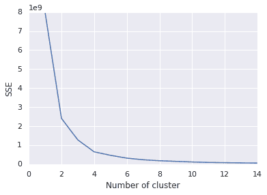

肘准则的基本思想是选择误差或惯性趋于平稳的聚类数。根据肘标准，我们可以采取`4`集群。让我们再来看看集群:

```py
kmeans = KMeans(n_clusters=4).fit(transactions)
y = kmeans.labels_
```

4.  **汇总集群**:现在我们可以汇总集群了:

```py
clusters = transactions.join(
    pd.DataFrame(data=y, columns=['cluster'])
).groupby(by='cluster').agg(
    age_mean=pd.NamedAgg(column='age', aggfunc='mean'),
    age_std=pd.NamedAgg(column='age', aggfunc='std'),
    creditamount=pd.NamedAgg(column='creditamount', aggfunc='mean'),
    duration=pd.NamedAgg(column='duration', aggfunc='mean'),
    count=pd.NamedAgg(column='age', aggfunc='count'),
    class_mean=pd.NamedAgg(column='classification', aggfunc='mean'),
    class_std=pd.NamedAgg(column='classification', aggfunc='std'),
).sort_values(by='class_mean')
clusters
```

这是集群的汇总表。我们包括了营销特征，比如年龄，以及其他能让我们了解客户为我们赚了多少钱的信息。我们展示了其中一些指标的标准偏差，以了解各组的一致性:

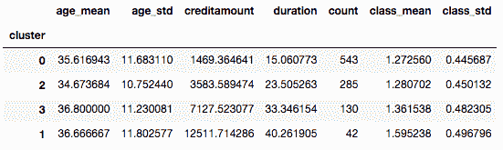

我们在这个小摘录中看到，差异很大程度上是由于信贷金额的差异。这让我们回到了开始的地方，也就是说，我们很大程度上得到了我们所投入的集群。没有简单的方法可以解决这个问题，但是我们可以选择我们想要在集群中关注的变量。

5.  **聚类的新尝试**:我们可以从头开始，简化我们的目标，并从我们实际想要寻找的问题开始:满足两个特征的客户群:
    *   聚类应该根据谁为我们赚钱来区分客户:这将我们引向一些变量，如信贷额、贷款期限以及他们是否还贷。
    *   聚类应该突出与营销相关的不同特征，例如年龄、性别或一些其他特征。

考虑到这一点，我们将进行新的尝试:

```py
from scipy.spatial.distance import pdist, squareform
from sklearn.preprocessing import StandardScaler
from sklearn.cluster import AgglomerativeClustering

distances = squareform(pdist(
    StandardScaler().fit_transform(
        transactions[['classification', 'creditamount', 'duration']]
   )
))
clustering = AgglomerativeClustering(
    n_clusters=5, affinity='precomputed', linkage='average'
).fit(distances)
y = clustering.labels_
```

我们现在可以再次生成概览表，以便查看集群统计信息:

```py
clusters = transactions.join(
    pd.DataFrame(data=y, columns=['cluster'])
).groupby(by='cluster').agg(
    age_mean=pd.NamedAgg(column='age', aggfunc='mean'),
    age_std=pd.NamedAgg(column='age', aggfunc='std'),
    creditamount=pd.NamedAgg(column='creditamount', aggfunc='mean'),
    duration=pd.NamedAgg(column='duration', aggfunc='mean'),
    count=pd.NamedAgg(column='age', aggfunc='count'),
    class_mean=pd.NamedAgg(column='classification', aggfunc='mean'),
    class_std=pd.NamedAgg(column='classification', aggfunc='std'),
).sort_values(by='class_mean')
clusters
```

下面是新的总结:

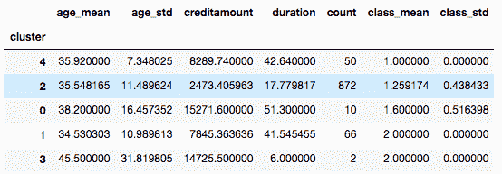

我认为这比之前的聚类更有用，因为它清楚地向我们展示了哪些客户可以为我们赚钱，并突出了他们之间与营销相关的其他差异。

## 它是如何工作的...

聚类是商业智能中非常常见的可视化技术。在市场营销中，你的目标人群会有所不同，比如说青少年和退休人员，有些群体比其他群体更有价值。通常，作为第一步，使用降维方法或通过特征选择来降低维度，然后通过应用聚类算法来分离组。例如，您可以首先应用**主成分分析** ( **PCA** )来减少维度(特征的数量)，然后应用*k*——寻找数据点组的方法。

由于可视化很难客观判断，在上一节中，我们所做的是后退一步，看看实际的目的，我们想要实现的业务目标。我们采取了以下步骤来实现这一目标:

*   我们专注于对我们的目标很重要的变量。
*   我们创建了一个函数来帮助我们确定聚类的质量。

从这个前提出发，我们尝试了不同的方法，并根据我们的业务目标对它们进行了评估。

如果你在看食谱的时候注意了，你可能已经注意到我们没有标准化我们的输出(z 分数)。在使用 z 分数的标准化中，原始分数 *x* 通过减去平均值并除以标准偏差而转换成标准分数，因此每个标准化变量的平均值为 0，标准偏差为 1:

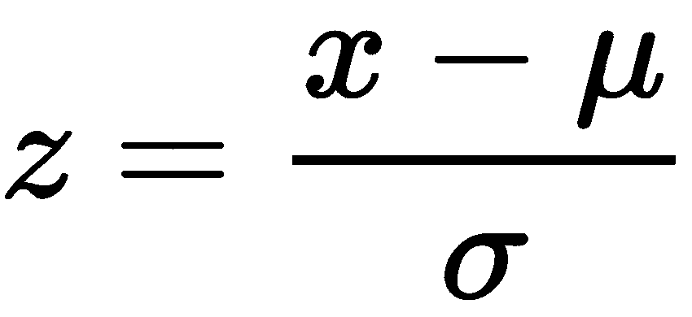

我们不应用标准化，因为经过虚拟转换的变量将具有与其因子数量成比例的更高的重要性。简而言之，z 分数意味着每个变量都具有相同的重要性。一键编码为它可以接受的每个值提供了一个单独的变量。如果我们在哑元转换后计算并使用 z 得分，则转换为许多新(哑元)变量的变量(因为它有许多值)将不如另一个值较少因而哑元列较少的变量重要。这种情况是我们想要避免的，所以我们不应用 z 分数。

然而，重要的是，我们必须把注意力集中在我们能够理解和描述的差异上。否则，我们最终可能会得到用处有限的集群。

在下一节中，我们将更详细地介绍 *k* -means 算法。

## 还有更多...

主成分分析是在 1901 年提出的(由卡尔·皮尔逊在*中提出，关于最接近空间点系统的直线和平面*，*k*——指的是在 1967 年提出的(由詹姆斯·麦克奎恩在*中提出，关于多元观测值的一些分类和分析方法*)。虽然这两种方法在数据和计算资源难以获得的时候都有用武之地，但如今有许多替代方法可以处理数据点和要素之间更复杂的关系。就个人而言，作为本书的作者，我们经常发现依赖于正态性或变量之间非常有限的一种关系的方法令人沮丧，例如 PCA 或 *K* 均值等经典方法，尤其是在有这么多更好的方法的时候。

PCA 和 *k* -means 都有严重的缺点，影响它们在实践中的有用性。由于 PCA 对相关矩阵进行操作，它只能找到数据点之间的线性相关性。这意味着如果变量是相关的，但不是线性的(就像你在散点图中看到的那样)，那么主成分分析就会失败。此外，PCA 基于均值和方差，它们是高斯分布的参数。 *K* -means，作为一种基于质心的聚类算法，只能发现欧几里得空间中的球面群——也就是说，它不能发现任何更复杂的结构。关于这方面的更多信息可以在[https://developers . Google . com/machine-learning/clustering/algorithm/advantages-visits](https://developers.google.com/machine-learning/clustering/algorithm/advantages-disadvantages)找到。

其他稳健的非线性方法也是可用的，例如，相似性传播、模糊 *c* 均值、凝聚聚类等。然而，重要的是要记住，尽管这些方法将数据点分成组，但以下陈述也是正确的:

*   这是根据试探法完成的。
*   它基于数据集中明显的差异和应用的距离度量。
*   聚类的目的是为人类观察者可视化和简化输出。

让我们更详细地看看 *k* -means 算法。它实际上非常简单，可以用`numpy`或`jax`从头开始写。这个实现基于 NapkinML(【https://github.com/eriklindernoren/NapkinML】T4)中的一个:

```py
import jax.numpy as jnp
import numpy as np
from jax import jit, vmap
from sklearn.base import ClassifierMixin
import jax
import random
from scipy.stats import hmean

class KMeans(ClassifierMixin):
    def __init__(self, k, n_iter=100):
      self.k = k
      self.n_iter = n_iter
      self.euclidean = jit(vmap(
          lambda x, y: jnp.linalg.norm(
              x - y, ord=2, axis=-1, keepdims=False
          ), in_axes=(0, None), out_axes=0
      ))

    def adjust_centers(self, X):
        jnp.row_stack([X[self.clusters == c].mean(axis=0)
          for c in self.clusters
        ])

    def initialize_centers(self):
        '''roughly the kmeans++ initialization
        '''
        key = jax.random.PRNGKey(0)
        # jax doesn't have uniform_multivariate
        self.centers = jax.random.multivariate_normal(
            key, jnp.mean(X, axis=0), jnp.cov(X, rowvar=False), shape=(1,)
        )
        for c in range(1, self.k):
            weights = self.euclidean(X, self.centers)
            if c>1:
              weights = hmean(weights ,axis=-1)
              print(weights.shape)

            new_center = jnp.array(
                random.choices(X, weights=weights, k=1)[0],
                ndmin=2
            )
            self.centers = jnp.row_stack(
                (self.centers, new_center)
            )
            print(self.centers.shape)

    def fit(self, X, y=None):
        self.initialize_centers()
        for iter in range(self.n_iter):
            dists = self.euclidean(X, self.centers)
            self.clusters = jnp.argmin(dists, axis=-1)
            self.adjust_centers(X)
        return self.clusters
```

正如所料，主要的逻辑在`fit()`方法中。它分为三个步骤，迭代如下:

1.  计算每个点和聚类中心之间的距离。
2.  每个点都被分配到其最近的聚类中心的聚类中。
3.  聚类中心被重新计算为算术平均值。

令人惊讶的是，这样一个简单的想法可以产生对人类观察者来说有意义的东西。这是一个它被使用的例子。让我们用我们已经从 scikit-learn 中的*分类中知道的 Iris 数据集来尝试一下，[第 1 章](87098651-b37f-4b05-b0ee-878193f28b95.xhtml)、*Python 人工智能入门*中的*配方:

```py
import matplotlib.pyplot as plt
from sklearn.datasets import load_iris
X, y = load_iris(return_X_y=True)

kmeans = KMeans(k=3)
kmeans.fit(X)
```

我们最终得到可以可视化或观察的集群，类似于之前。

## 请参见

为了获得不同聚类方法的概述，请参考调查或评论文章。Saxena 等人在他们的文章*聚类技术和发展回顾* (2017)中涵盖了大多数重要术语。

我们建议查看以下与聚类和降维相关的方法(我们链接到实现):

*   affinity propagation([https://sci kit-learn . org/stable/modules/generated/sk learn . cluster . affinity propagation . html](https://scikit-learn.org/stable/modules/generated/sklearn.cluster.AffinityPropagation.html)):一种聚类方法，作为其试探法的一部分，它会找到许多聚类
*   模糊 c 均值([https://python hosted . org/scikit-fuzzy/auto _ examples/plot _ cmeans . html](https://pythonhosted.org/scikit-fuzzy/auto_examples/plot_cmeans.html)):一个模糊版本的 *k* 均值算法
*   局部线性嵌入([https://sci kit-learn . org/stable/modules/generated/sk learn . manifold . locallylineareembedding . html](https://scikit-learn.org/stable/modules/generated/sklearn.manifold.LocallyLinearEmbedding.html)):一种低维嵌入，其中保持局部相似性
*   t-分布式随机邻居嵌入([https://sci kit-learn . org/stable/modules/generated/sk learn . manifold . tsne . html](https://scikit-learn.org/stable/modules/generated/sklearn.manifold.TSNE.html)):一种适合二维或三维空间可视化的非线性降维方法。
*   混合建模([https://mixem . readthedocs . io/en/latest/examples/old _ faithful . html](https://mixem.readthedocs.io/en/latest/examples/old_faithful.html))

利用预先训练的随机森林来提供定制内核的想法在 https://arxiv.org/abs/1402.4293 的*《随机森林内核和来自随机分区的大数据的其他内核》* (2014)中讨论，作者是亚历克斯·戴维斯和邹斌·格拉马尼，可在[获得。](https://arxiv.org/abs/1402.4293)

# 发现异常

异常是指任何偏离预期或正常结果的情况。检测异常在**I**工业过程监控 ( **IPM** )中非常重要，在这种情况下，数据驱动的故障检测和诊断可以帮助实现更高水平的安全性、效率和质量。

在这份食谱中，我们将看看异常值检测的方法。我们将使用 **Python 离群点检测** ( **pyOD** )来查看一个时间序列中离群点检测的示例，这是一个用于离群点检测的工具箱，实现了许多最先进的方法和可视化。PyOD 的文档可以在 https://pyod.readthedocs.io/en/latest/的[找到。](https://pyod.readthedocs.io/en/latest/)

我们将为基于相似性的方法应用一个自编码器，然后应用一个适合于在数据流中发现事件的在线学习方法。

## 做好准备

这个食谱将着重于发现异常值。我们将演示如何使用 pyOD 库来实现这一点，包括自编码器方法。我们还将概述不同方法的优缺点。

数据流是网站绩效的**关键绩效指标**(**KPI**)的时间序列。该数据集在 https://github.com/haowen-xu/donut的 DONUT outlier 检测器存储库中提供。

让我们下载并加载它，如下所示:

```py
import pandas as pd

!wget https://raw.githubusercontent.com/haowen-xu/donut/master/sample_data/cpu4.csv
cpu_data = pd.read_csv('cpu4.csv')
```

我们将使用 pyOD 中的方法，所以让我们也安装它:

```py
!pip install pyOD
```

请注意，一些 pyOD 方法具有依赖项，如 TensorFlow 和 Keras，因此您可能需要确保这些方法也已安装。如果您收到一条消息，内容为`No Module named Keras`,您可以单独安装 Keras，如下所示:

```py
!pip install keras
```

请注意，通常使用 TensorFlow 附带的 Keras 版本更好。

让我们看看我们的数据集，然后应用不同的离群点检测方法。

## 怎么做...

我们将在这一部分介绍不同的步骤和方法。它们如下:

1.  肉眼观察
2.  标杆管理
3.  运行隔离林
4.  运行自编码器

让我们从探索和可视化我们的数据集开始:

1.  我们可以将一段时间内的数据集可视化为一个时间序列:

让我们用下面的命令来看看我们的数据集:

```py
cpu_data.head()
```

看起来是这样的:

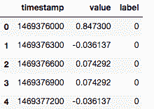

KPI 的这个时间序列适合于监控 web 服务的操作和维护。如果服务出现问题，它们会带有一个指示异常(换句话说，异常值)的标签:

```py
from datetime import datetime
import seaborn as sns

cpu_data['datetime'] = cpu_data.timestamp.astype(int).apply(
    datetime.fromtimestamp
)
# Use seaborn style defaults and set the default figure size
sns.set(rc={'figure.figsize':(11, 4)})

time_data = cpu_data.set_index('datetime')
time_data.loc[time_data['label'] == 1.0, 'value'].plot(linewidth=0.5, marker='o', linestyle='')
time_data.loc[time_data['label'] == 0.0, 'value'].plot(linewidth=0.5)
```

这是结果图，其中的点代表异常值:

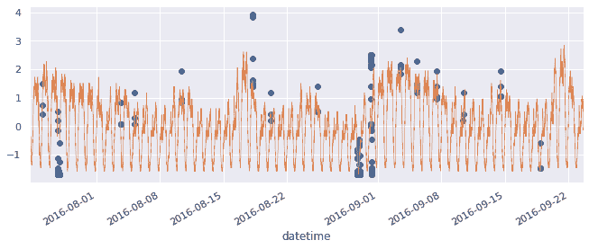

或者，我们可以使用以下代码查看异常值在 KPI 范围中的位置，以及它们与正常数据的区别有多明显:

```py
import numpy as np
from matplotlib import pyplot as plt

markers = ['r--', 'b-^']

def hist2d(X, by_col, n_bins=10, title=None):
  bins = np.linspace(X.min(), X.max(), n_bins)

  vals = np.unique(by_col)
  for marker, val in zip(markers, vals):
    n, edges = np.histogram(X[by_col==val], bins=bins)
    n = n / np.linalg.norm(n)
    bin_centers = 0.5 * (edges[1:] + edges[:-1])
    plt.plot(bin_centers, n, marker, alpha=0.8, label=val)

  plt.legend(loc='upper right')
  if title is not None:
    plt.title(title)
  plt.show()

hist2d(cpu_data.value, cpu_data.label, n_bins=50, title='Values by label')
```

在前面的代码中，我们使用线图绘制了两个直方图。或者，我们可以使用不透明的`hist()`。

下面的图是异常值分布密度，其中时间序列的值位于 *x* 轴上，两条线分别显示了被识别为正常的和被识别为异常值的数据点——0 表示正常数据点，1 表示异常值:

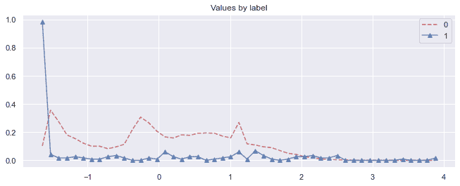

我们将对所有后续方法使用相同的可视化，这样我们就可以用图形来比较它们。

离群值(用虚线显示)很难与正常数据点(正方形)区分开来，所以我们不会期望完美的性能。

2.  我们现在将实现基准测试。

在我们继续测试离群点检测方法之前，让我们设定一个过程来比较它们，这样我们将有一个测试方法的相对性能的基准。

我们像往常一样将数据分为训练集和测试集:

```py
from sklearn.model_selection import train_test_split

X_train, X_test, y_train, y_test = train_test_split(
    cpu_data[['value']].values, cpu_data.label.values
)
```

现在让我们编写一个测试函数，我们可以使用不同的异常值检测方法:

```py
from pyod.utils.data import evaluate_print
from pyod.models.knn import KNN

def test_outlier_detector(X_train, y_train,
                          X_test, y_test, only_neg=True,
                          basemethod=KNN()):
  clf = basemethod
  if only_neg:
    clf.fit(X_train[y_train==0.0], np.zeros(shape=((y_train==0.0).sum(), 1)))
  else:
    clf.fit(X_train, y_train) # most algorithms ignore y

  y_train_pred = clf.predict(X_train) # labels_
  y_train_scores = clf.decision_scores_

  y_test_pred = clf.predict(X_test)
  y_test_scores = clf.decision_function(X_test)

  print("\nOn Test Data:")
  evaluate_print(type(clf).__name__, y_test, y_test_scores)
  hist2d(X_test, y_test_pred, title='Predicted values by label')
```

该函数测试数据集上的异常值检测方法。它训练模型，从模型中获取性能指标，并绘制可视化图形。

它采用这些参数:

*   `X_train`:培训特色
*   `y_train`:培训标签
*   `X_test`:测试特征
*   `y_test`:测试标签
*   `only_neg`:是否只使用正常点(即非异常点)进行训练
*   `basemethod`:要测试的模型

我们可以选择只在正常点(排除异常值的所有点)上训练，以便学习这些点的分布或一般特征，然后异常值检测方法可以决定新点是否符合这些特征。

至此，让我们测试两种离群点检测方法:隔离森林和自编码器。

首先是隔离林。

3.  这里我们来看看隔离森林。

我们运行基准测试方法，并移交隔离森林检测方法:

```py
from pyod.models.iforest import IForest

test_outlier_detector(
    X_train, y_train, X_test, y_test, 
    only_neg=True, basemethod=IForest(contamination=0.01),
)
#On Test Data:
#IForest ROC:0.867, precision @ rank n:0.1
```

隔离带预测与测试数据的**接收机工作特性** ( **ROC** )性能约为 0.86，表现相当不错。

然而，我们可以从下图中看到，在 KPI 谱的较低范围中没有 1(预测的异常值)。该模型遗漏了较低范围内的异常值:

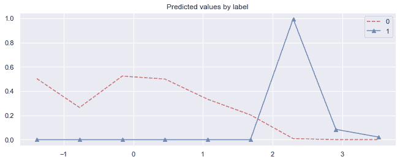

它只将点识别为具有更高值的异常值( *> =1.5)* 。

4.  接下来，让我们尝试运行一个自编码器:

```py
from pyod.models.auto_encoder import AutoEncoder

test_outlier_detector(
    X_train, y_train, X_test, y_test, 
    only_neg=False, 
    basemethod=AutoEncoder(hidden_neurons=[1], epochs=10)
)
```

我们可以看到 Keras 网络结构和测试函数的输出:

```py
Layer (type)                 Output Shape              Param #   
=================================================================
dense_39 (Dense)             (None, 1)                 2         
_________________________________________________________________
dropout_30 (Dropout)         (None, 1)                 0         
_________________________________________________________________
dense_40 (Dense)             (None, 1)                 2         
_________________________________________________________________
dropout_31 (Dropout)         (None, 1)                 0         
_________________________________________________________________
dense_41 (Dense)             (None, 1)                 2         
_________________________________________________________________
dropout_32 (Dropout)         (None, 1)                 0         
_________________________________________________________________
dense_42 (Dense)             (None, 1)                 2         
=================================================================
Total params: 8
Trainable params: 8
Non-trainable params: 0

... 
On Test Data:
AutoEncoder ROC:0.8174, precision @ rank n:0.1
```

自编码器的性能与隔离林非常相似；但是，autoencoder 在 KPI 范围的上限和下限都发现了异常值。

此外，当只提供正常数据或同时提供正常数据和异常值时，我们不会得到明显的差异。我们可以在下图中看到自编码器的工作原理:

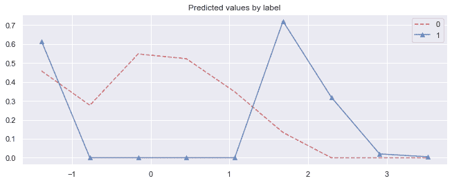

实际上，这看起来并不太糟糕——中间范围内的值被归类为正常，而范围之外的值被归类为异常值。

请记住，这些方法是无人监督的；当然，如果我们使用监督的方法，我们可以得到更好的结果。作为一个实际的考虑，如果我们对我们自己的数据集使用监督方法，这将需要我们通过注释异常来做额外的工作，这在非监督方法中是不必要的。

## 它是如何工作的...

异常值是偏离其他数据观察值的极端值。离群点检测在许多领域都很重要，包括网络安全、金融、交通、社交媒体、机器学习、机器模型性能监控和监视。在这些领域中，已经提出了大量的离群点检测算法。最著名的算法包括***k*-最近邻居** ( **kNN** )、 **L** **局部离群因子** ( **LOF** )和隔离森林，以及最近出现的自编码器、 **L** **ong 短时记忆** ( **LSTM** )和 **G** **生成对抗网络**()我们将在后面的食谱中发现其中的一些方法。在这个食谱中，我们使用了 kNN，一个自编码器，和隔离森林算法。下面简单说一下这三种方法。

### k 近邻

kNN 分类器是由 Thomas Cover 和 Peter Hart 引入的非参数分类器(在*最近邻模式分类*，1967)。主要思想是新点很可能与其邻居属于同一类。超参数`k`是要比较的邻居的数量。有基于新点与其邻居的相对距离的加权版本。

### 隔离森林

隔离森林的想法相对简单:创建随机决策树(这意味着每片叶子使用随机选择的特征和随机选择的分裂值)，直到只剩下一个点。穿过树到达终端节点的路径的长度指示一个点是否是离群点。

关于隔离林的更多细节，可以在刘等人的原始出版物*隔离林*中找到。ICDM 2008:413–422:[https://cs . nju . edu . cn/Zhou zh/Zhou zh . files/publication/ICD m08 b . pdf](https://cs.nju.edu.cn/zhouzh/zhouzh.files/publication/icdm08b.pdf)。

### 自编码器

自编码器是一种神经网络架构，其中我们学习基于一组数据的表示。这通常是由一个较小的隐藏层(**瓶颈**)来完成的，从这个隐藏层可以恢复原始文件。在这种情况下，它类似于许多其他降维方法。

自编码器由两部分组成:编码器和解码器。我们真正想要学习的是编码器的转换，它给我们一个代码或者我们寻找的数据的表示。

更正式地说，我们可以将编码器定义为函数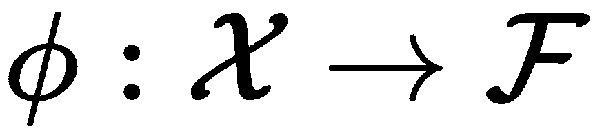，将解码器定义为函数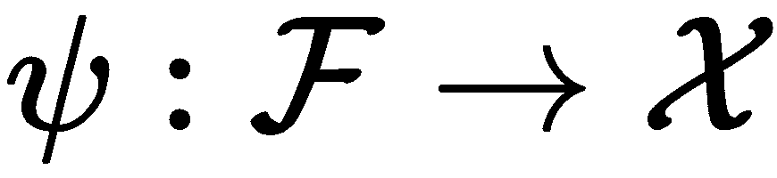。我们试图找到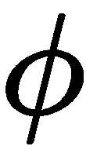和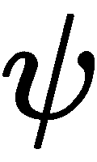，使得重建误差最小化；

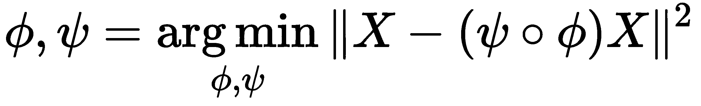

自编码器在中间网络层中表示数据，并且它们越接近基于中间表示的重构，它们就越不像是离群值。

## 请参见

对于 Python，离群点检测的许多实现都是公开可用的:

*   作为 Numenta 皮层学习算法的一部分:[http://nupic . docs . Numenta . org/stable/guides/anomaly-detection . html # temporal anomaly-model](http://nupic.docs.numenta.org/stable/guides/anomaly-detection.html#temporalanomaly-model)
*   班培，对于奇异谱变换:[https://github.com/tsurubee/banpei](https://github.com/tsurubee/banpei)
*   时间序列深层异常检测方法:[https://github.com/KDD-OpenSource/DeepADoTS](https://github.com/KDD-OpenSource/DeepADoTS)
*   多元时序数据的 telemanom–lst ms:[https://github.com/khundman/telemanom](https://github.com/khundman/telemanom)
*   DONUT–季节性 KPI 的可变自编码器:[https://github.com/haowen-xu/donut](https://github.com/haowen-xu/donut)

关于异常值检测的一个极好的资源是 PyOD 作者的专用知识库，可以在[https://github.com/yzhao062/anomaly-detection-resources](https://github.com/yzhao062/anomaly-detection-resources)找到。

# 相似性搜索的表示

在这个菜谱中，我们希望找到一种方法，在给定两个字符串的表示的情况下，确定这两个字符串是否相似。我们将尝试改进字符串的表示方式，以便在字符串之间进行更有意义的比较。但是首先，我们将使用更传统的字符串比较算法获得一个基线。

我们将做以下工作:给定一个成对字符串匹配的数据集，我们将尝试不同的函数来测量字符串相似性，然后是字符包表示，最后是字符串表示的**连体神经网络**(也称为**孪生神经网络**)维度缩减。我们将建立一个双网络方法来学习基于字符 n 元语法频率的字符串潜在相似性空间。

一个**连体神经网络**，有时也被称为**双胞胎神经网络**，使用连体双胞胎的类比来命名。这是一种训练投影或度量空间的方法。同时训练两个模型，比较两个模型的输出。训练采用比较输出而不是模型输出。

## 做好准备

像往常一样，我们需要下载或加载数据集并安装必要的依赖项。

我们将使用成对字符串的数据集，根据它们是否相似来判断它们是否匹配:

```py
!wget https://raw.githubusercontent.com/ofrendo/WebDataIntegration/7db877abadd2be94d5373f5f47c8ccd1d179bea6/data/goldstandard/forbes_freebase_goldstandard_train.csv
```

然后，我们可以按如下方式读取它:

```py
import pandas as pd

data = pd.read_csv(
    'forbes_freebase_goldstandard_train.csv',
    names=['string1', 'string2', 'matched']
)
```

数据集包括相互对应或不对应的字符串对。它是这样开始的:

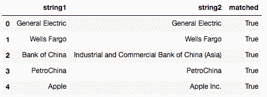

同一个 GitHub repo 中还有一个测试数据集:

```py
!wget https://raw.githubusercontent.com/ofrendo/WebDataIntegration/7db877abadd2be94d5373f5f47c8ccd1d179bea6/data/goldstandard/forbes_freebase_goldstandard_test.csv
```

我们可以像以前一样把它读入熊猫数据帧:

```py
test = pd.read_csv(
    'forbes_freebase_goldstandard_test.csv',
    names=['string1', 'string2', 'matched']
)
```

最后，我们将在这个菜谱中使用几个库，我们可以这样安装:

```py
!pip install python-Levenshtein annoy
```

**Levenshtein 距离**(有时也称为**编辑距离**)测量将一个字符串转换成另一个字符串所需的插入、删除和替换的数量。它执行一个搜索，以便想出最短的方法来完成这个转换。这里使用的库是这个算法的一个非常快速的实现。你可以在 https://github.com/ztane/python-Levenshtein[找到更多关于`python-Levenshtein`图书馆的信息。](https://github.com/ztane/python-Levenshtein)

`annoy`库提供了最近邻搜索的高度优化的实现。给定一组点和一个距离，我们可以使用树表示来索引所有点，然后对于任何点，我们可以遍历树来找到相似的数据点。你可以在 https://github.com/spotify/annoy T2 找到更多关于骚扰的信息。

我们开始吧。

## 怎么做...

如前所述，我们将首先使用标准的字符串比较函数计算基线，然后我们将使用字符包方法，然后我们将使用连体神经网络方法学习投影。你可以在这本书的 GitHub repo 上找到相应的笔记本，在[https://GitHub . com/packt publishing/Artificial-Intelligence-with-Python-Cookbook/blob/master/chapter 03/representative % 20 for % 20 similarity % 20 search . ipynb](https://github.com/PacktPublishing/Artificial-Intelligence-with-Python-Cookbook/blob/master/chapter03/Representing%20for%20similarity%20search.ipynb)。

### 基线-字符串比较函数

让我们首先实现几个标准的字符串比较函数。

我们首先需要确保清理我们的字符串:

```py
def clean_string(string):
    return ''.join(map(lambda x: x.lower() if str.isalnum(x) else ' ', string)).strip()
```

我们将在下面的代码中看到的每个字符串比较函数中使用这个清理函数。我们将使用这个函数在任何字符串距离计算之前删除特殊字符。

现在我们可以实现简单的字符串比较函数。让我们先来看一下`Levenshtein`距离:

```py
import Levenshtein

def levenstein_distance(s1_, s2_):
    s1, s2 = clean_string(s1_), clean_string(s2_)
    len_s1, len_s2 = len(s1), len(s2)
    return Levenshtein.distance(
        s1, s2
    ) / max([len_s1, len_s2])
```

现在我们来做`Jaro-Winkler`距离，这是单字符换位的最小次数:

```py
def jaro_winkler_distance(s1_, s2_):
    s1, s2 = clean_string(s1_), clean_string(s2_)
    return 1 - Levenshtein.jaro_winkler(s1, s2)
```

我们还将在比较对之间使用最长的公共子串。我们可以为此使用`SequenceMatcher`，它是 Python 标准库的一部分:

```py
from difflib import SequenceMatcher

def common_substring_distance(s1_, s2_):
    s1, s2 = clean_string(s1_), clean_string(s2_)
    len_s1, len_s2 = len(s1), len(s2)
    match = SequenceMatcher(
        None, s1, s2
    ).find_longest_match(0, len_s1, 0, len_s2)
    len_s1, len_s2 = len(s1), len(s2)
    norm = max([len_s1, len_s2])
    return 1 - min([1, match.size / norm])
```

现在，我们可以遍历所有的字符串对，并基于这三种方法中的每一种来计算字符串距离。对于这三种算法中的每一种，我们可以计算曲线下的**面积** ( **AUC** )分数，以查看它在从非匹配字符串中分离匹配字符串方面做得如何:

```py
import numpy as np
from sklearn.metrics import roc_auc_score

dists = np.zeros(shape=(len(data), 3))
for algo_i, algo in enumerate(
    [levenstein_distance, jaro_winkler_distance, common_substring_distance]
):
    for i, string_pair in data.iterrows():
        dists[i, algo_i] = algo(string_pair['string1'], string_pair['string2'])

    print('AUC for {}: {}'.format(
        algo.__name__, 
        roc_auc_score(data['matched'].astype(float), 1 - dists[:, algo_i])
    ))
#AUC for levenstein_distance: 0.9508904955034385
#AUC for jaro_winkler_distance: 0.9470992770234525
#AUC for common_substring_distance: 0.9560042320578381
```

所有算法的 AUC 分数都在 95%左右，看起来不错。所有三个距离已经表现得相当好了。让我们试着战胜它。

### 字符包方法

我们现在将为字符串相似性实现一个字符包方法。

一包字符意味着我们将创建一个字符直方图，或者换句话说，我们将计算每个单词中出现的字符数:

```py
from sklearn.feature_extraction.text import CountVectorizer

# We clean the strings as before and we take ngrams.
ngram_featurizer = CountVectorizer(
    min_df=1,
    analyzer='char',
    ngram_range=(1, 1), # this is the range of ngrams that are to be extracted!
    preprocessor=clean_string
).fit(
    np.concatenate(
        [data['string1'], data['string2']],
        axis=0
    )
)
```

我们已经将`ngrams`的范围设置为仅`1`，这意味着我们只需要单个字符。但是，如果您希望包含字符之间的更大范围的依赖关系，而不仅仅是字符频率，那么这个参数可能会很有意思。

让我们看看我们能从中获得什么样的性能:

```py
string1cv = ngram_featurizer.transform(data['string1'])
string2cv = ngram_featurizer.transform(data['string2'])

def norm(string1cv):
    return string1cv / string1cv.sum(axis=1)

similarities = 1 - np.sum(np.abs(norm(string1cv) - norm(string2cv)), axis=1) / 2
roc_auc_score(data['matched'].astype(float), similarities)
#0.9298183741844471
```

正如您在大约 93%的 AUC 分数中可以看到的，这种方法总体上还没有表现得很好，尽管性能并不完全糟糕。所以让我们试着调整一下。

### 连体神经网络方法

现在，我们将实现一个暹罗网络来学习表示字符串之间相似性(或差异)的投影。

如果你不熟悉的话，暹罗网络方法可能看起来有点令人生畏。我们将在*中进一步讨论它是如何工作的...*一节。

让我们从字符串特征化函数开始:

```py
from tensorflow.keras.models import Sequential, Model
from tensorflow.keras.layers import Dense, Lambda, Input
import tensorflow as tf
from tensorflow.keras import backend as K

def create_string_featurization_model(
    feature_dimensionality, output_dim=50):
    preprocessing_model = Sequential()
    preprocessing_model.add(
        Dense(output_dim, activation='linear', input_dim=feature_dimensionality)
    )
    preprocessing_model.summary()
    return preprocessing_model
```

`create_string_featurization_model`函数返回字符串特征化的模型。特征模型是字符袋输出的非线性投影。

该函数具有以下参数:

*   `feature_dimensionality`:来自矢量器的特征数量(即字符袋输出的维数)
*   我们试图创建的嵌入/投影的尺寸

接下来，我们需要创建两个模型的**连体双胞胎**。为此，我们需要一个比较函数。我们取归一化的欧几里德距离。这是两个 *L2-* 归一化投影向量之间的欧几里德距离。

向量 *x* 的 *L2* 范数定义如下:

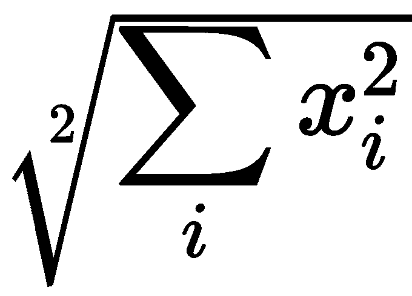

*L2* 归一化是将向量 *x* 除以其范数。

我们可以将距离函数定义如下:

```py
def euclidean_distance(vects):
    x, y = vects
    x = K.l2_normalize(x, axis=-1)
    y = K.l2_normalize(y, axis=-1)
    sum_square = K.sum(
        K.square(x - y),
        axis=1,
        keepdims=True
    )
    return K.sqrt(K.maximum(
        sum_square,
        K.epsilon()
    ))
```

现在，暹罗网络可以通过将其包装为 Lambda 层来使用该函数。让我们定义如何连接双胞胎，或者换句话说，我们如何将它包装到一个更大的模型中，以便我们可以使用成对的字符串和标签(即相似和不相似)进行训练:

```py
def create_siamese_model(preprocessing_models, #initial_bias =
                          input_shapes=(10,)):    
    if not isinstance(preprocessing_models, (list, tuple)):
        raise ValueError('preprocessing models needs to be a list or tuple of models')
    print('{} models to be trained against each other'.format(len(preprocessing_models)))
    if not isinstance(input_shapes, list):
        input_shapes = [input_shapes] * len(preprocessing_models)

    inputs = []
    intermediate_layers = []
    for preprocessing_model, input_shape in zip(preprocessing_models, input_shapes):
        inputs.append(Input(shape=input_shape))
        intermediate_layers.append(preprocessing_model(inputs[-1]))

    layer_diffs = []
    for i in range(len(intermediate_layers)-1): 
        layer_diffs.append(
            Lambda(euclidean_distance)([intermediate_layers[i], intermediate_layers[i+1]])
        ) 
    siamese_model = Model(inputs=inputs, outputs=layer_diffs)
    siamese_model.summary()
    return siamese_model
```

这是一种啰嗦的说法:取两个网络，计算归一化欧氏距离，将距离作为输出。

让我们创建双网络并进行培训:

```py
def compile_model(model):
    model.compile(
        optimizer='rmsprop',
        loss='mse',
    )

feature_dims = len(ngram_featurizer.get_feature_names())
string_featurization_model = create_string_featurization_model(feature_dims, output_dim=10)

siamese_model = create_siamese_model(
    preprocessing_models=[string_featurization_model, string_featurization_model],
    input_shapes=[(feature_dims,), (feature_dims,)],
)
compile_model(siamese_model)
siamese_model.fit(
    [string1cv, string2cv],
    1 - data['matched'].astype(float),
    epochs=1000
)
```

这创建了一个具有 10 维输出的模型；给定 n 元语法特征的 41 个维度，这意味着我们总共有 420 个参数( *41 * 10 + 10* )。

正如我们之前提到的，我们组合网络的输出是两个输出之间的欧几里德距离。这意味着我们必须反转我们的目标(匹配)列，以便将含义从相似改为遥远，因此 1 对应于不同，0 对应于相同。我们可以很容易地从 1 中减去。

我们现在可以得到这个新投影的性能:

```py
from scipy.spatial.distance import euclidean

string_rep1 = string_featurization_model.predict(
    ngram_featurizer.transform(data['string1'])
)
string_rep2 = string_featurization_model.predict(
    ngram_featurizer.transform(data['string2'])
)
dists = np.zeros(shape=(len(data), 1))
for i, (v1, v2) in enumerate(zip(string_rep1, string_rep2)):
    dists[i] = euclidean(v1, v2)

roc_auc_score(data['matched'].astype(float), 1 - dists)
0.9802944806912361
```

我们设法击败了其他方法。这还是在我们尝试调整任何超参数之前。我们的投影明显地突出了字符串之间的差异，这对于字符串相似性比较是重要的。

## 它是如何工作的...

scikit-learn `CountVectorizer`统计字符串中出现的特征。一个常见的用例是统计句子中的单词——这种表示方法被称为单词包，在这种情况下，特征就是单词。在我们的例子中，我们对基于字符的特性感兴趣，所以我们只需要计算 a 发生了多少次，a **b** 发生了多少次，等等。我们可以通过表示连续字符的元组，比如 **ab** 或 **ba** ，使这种表示更巧妙；然而，这超出了我们的讨论范围。

连体网络训练是在给定一对(或一组)输入和这些输入之间差异的知识的情况下，通过比较网络的输出来相互训练两个(或多个)神经网络的情况。通常，连体网络由相同的网络组成(即，相同的权重)。两个网络输出之间的比较函数可以是诸如欧几里德距离或余弦相似性的度量。既然我们知道这两个输入是否相似，甚至它们有多相似，我们就可以针对这些知识作为目标进行训练。

下图说明了信息流和我们将使用的不同构造块:

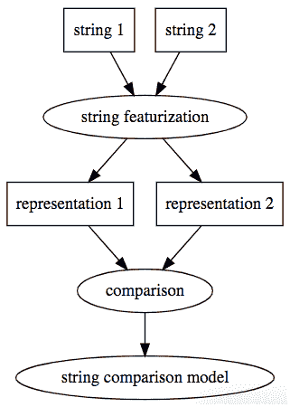

给定我们想要比较的两个字符串，我们将使用相同的模型从每个字符串创建要素，从而产生两种表示。然后，我们可以比较这些表示，我们希望比较与结果相关，这样，如果我们的比较显示出很大的差异，字符串将是不相似的，如果比较显示出很小的差异，则字符串将是相似的。

给定一个字符串比较模型和一个由一对字符串和一个目标组成的数据集，我们实际上可以直接训练这个完整的模型。这种训练将调整字符串特征模型，使表示更加有用。

# 推荐产品

在这个食谱中，我们将建立一个推荐系统。推荐器是一个信息过滤系统，它通过将内容和社会联系在一起来预测排名或相似性。

我们将下载从 Goodreads 网站收集的书籍评级数据集，用户在这里对他们读过的书籍进行排名和评论。我们将建立不同的推荐模型，我们将根据已知的评分推荐新书。

## 做好准备

为了准备我们的菜谱，我们将下载数据集并安装所需的依赖项。

让我们获取数据集并安装我们将在这里使用的两个库——`spotlight`和`lightfm`是推荐库:

```py
!pip install git+https://github.com/maciejkula/spotlight.git lightfm

```

然后我们需要得到图书评分的数据集:

```py
from spotlight.datasets.goodbooks import get_goodbooks_dataset
from spotlight.cross_validation import random_train_test_split 

import numpy as np

interactions = get_goodbooks_dataset()
train, test = random_train_test_split(
 interactions, random_state=np.random.RandomState(42)
)
```

数据集以交互对象的形式出现。根据 spotlight 的文档，交互对象可以定义如下:

[它]包含(至少)一对用户-项目交互，但也可以增加评级、时间戳和交互权重。

对于**隐式反馈**场景，应该只为观察到交互的用户-项目对提供用户 id 和项目 id。未提供的所有对都被视为缺失观察值，并且通常被解释为(隐含的)负信号。

对于**显式反馈**场景，应该为数据集中观察到的所有用户-项目-评级三元组提供用户 id、项目 id 和评级。

我们有以下训练和测试数据集:

```py
<Interactions dataset (53425 users x 10001 items x 4781183 interactions)>
<Interactions dataset (53425 users x 10001 items x 1195296 interactions)>
```

为了知道项目编号指的是哪本书，我们将下载下面的 CSV 文件:

```py
!wget https://raw.githubusercontent.com/zygmuntz/goodbooks-10k/master/books.csv
```

接下来，我们将实现一个通过`id`获取书名的函数。这将有助于稍后展示我们的建议:

```py
import pandas as pd 
books = pd.read_csv('books.csv', index_col=0)

def get_book_titles(book_ids):
    '''Get book titles by book ids 
    ''' 
    if isinstance(book_ids, int): 
        book_ids = [book_ids]
    titles = []
    for book_id in book_ids:
        titles.append(books.loc[book_id, 'title'])
    return titles

book_labels = get_book_titles(list(train.item_ids))
```

现在我们可以如下使用该函数:

```py
get_book_titles(1) 
['The Hunger Games (The Hunger Games, #1)'] 
```

现在我们已经安装了数据集和库，我们可以开始我们的食谱了。

## 怎么做...

我们将首先使用矩阵分解模型，然后是深度学习模型。您可以在 Jupyter 笔记本中找到更多示例，该笔记本位于 https://github . com/packt publishing/Artificial-Intelligence-with-Python-Cookbook/blob/master/chapter 03/Recommending _ products . ipynb。

我们必须设置很多参数，包括潜在维度的数量和历元的数量:

```py
import torch
from spotlight.factorization.explicit import ExplicitFactorizationModel
from spotlight.evaluation import (
    rmse_score,
    precision_recall_score
)

model = ExplicitFactorizationModel(
    loss='regression',
    embedding_dim=128,
    n_iter=10,
    batch_size=1024,
    l2=1e-9,
    learning_rate=1e-3,
    use_cuda=torch.cuda.is_available()
)
model.fit(train, verbose=True)
train_rmse = rmse_score(model, train)
test_rmse = rmse_score(model, test)
print('Train RMSE {:.3f}, test RMSE {:.3f}'.format(
    train_rmse, test_rmse
))
```

结果如以下截图所示:

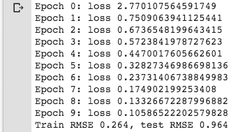

我们得到以下建议:

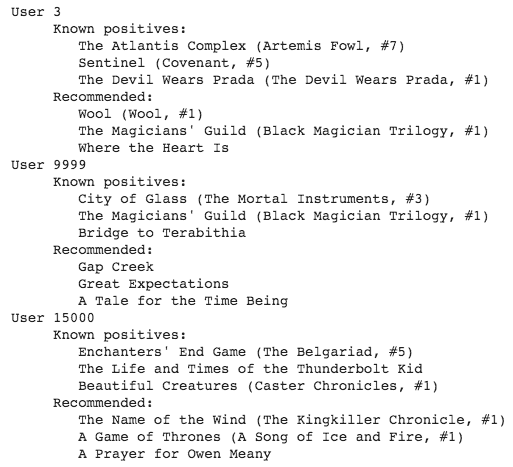

现在我们将使用`lightfm`推荐算法:

```py
from lightfm import LightFM
from lightfm.evaluation import precision_at_k

# Instantiate and train the model
model = LightFM(loss='warp')
model.fit(train.tocoo(), epochs=30, num_threads=2)
test_precision = precision_at_k(model, test.tocoo(), k=5)
print(
    'mean test precision at 5: {:.3f}'.format(
        test_precision.mean()
))
mean test precision at 5: 0.114
```

我们也可以看看这些建议，如下:

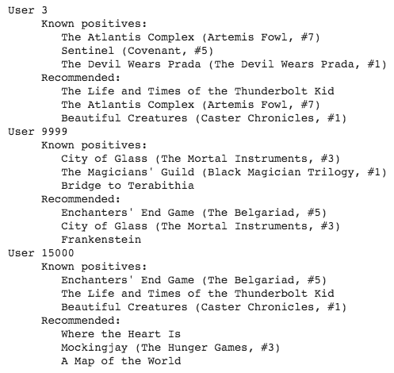

两个推荐人都有他们的申请。基于两个推荐器在 *k (k=5)* 处的精度，我们可以得出结论，第二推荐器`lightfm`执行得更好。

## 它是如何工作的...

推荐者向用户推荐产品。

他们可以根据不同的原则提出建议，例如:

*   他们可以基于这样的假设进行预测，即在以前的购买中表现出类似品味的客户在未来会购买类似的商品(**协同过滤**)。
*   基于顾客会对与他们过去购买过的商品相似的商品感兴趣的想法的预测(**基于内容的过滤**)。
*   基于协同过滤、基于内容的过滤或其他方法组合的预测(一个**混合推荐器**)。

混合模型可以以不同的方式组合各种方法，例如分别进行基于内容和基于协作的预测，然后将分数相加，或者将各种方法统一到一个模型中。

我们尝试的两个模型都是基于这样一个想法，即我们可以将用户和项目的影响分开。我们将依次解释每个模型，以及它们如何组合方法，但首先让我们解释我们使用的度量:在 *k* 的精度。

### k 精度

我们在这里提取的度量是在*k*T3 的**精度。例如，precision at 10 计算前 *k* 个文档中相关结果的数量，通常为 *k=5* 或 *k=10* 。**

在 *k* 处的精度不考虑前 *k* 个结果中的排序，也不包括我们绝对应该捕获的真正好的结果中有多少是实际返回的:那就是召回。也就是说， *k* 的精度是一个合理的度量，而且很直观。

### 矩阵分解

`spotlight`中的显式模型基于耶胡达·科伦等人提出的矩阵分解技术(在*推荐系统的矩阵分解技术*，2009)。基本思想是，用户-项目(交互)矩阵可以分解成两个分量，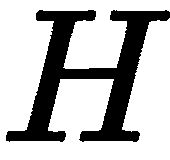和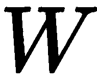，分别表示用户潜在因素和项目潜在因素，因此给定项目和用户的推荐可以计算如下:

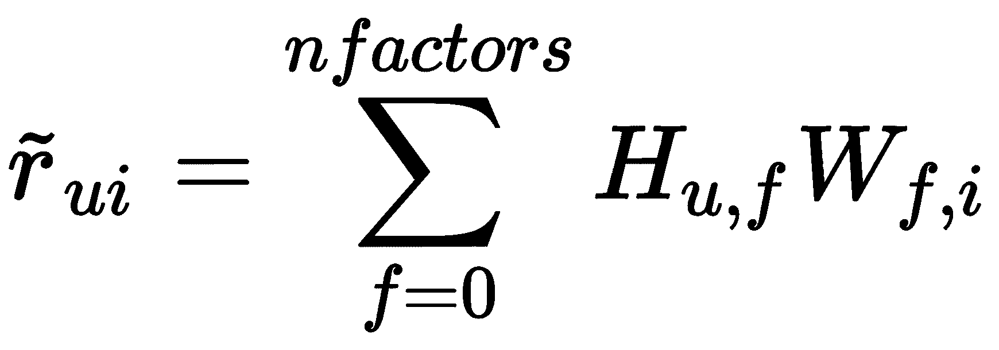

**Matrix decomposition** or **matrix factorization** is the factorization of a matrix into a product of matrices. Many different such decompositions exist, serving a variety of purposes.

一种相对简单的分解是**奇异值分解** ( **SVD** )然而，现代推荐器使用其他分解。`spotlight`矩阵分解和`lightfm`模型都使用线性积分。

### lightfm 模型

库拉在一篇论文中介绍了`lightfm`模型(*用于用户和项目冷启动推荐的元数据嵌入，* 2015)。更具体地说，我们使用扭曲损失，这在 Jason Weston 等人 2011 年的论文*wsa bie:Scaling Up To Large Vocabulary Image Annotation*中有所解释。

在`lightfm`算法中，以下函数用于预测:

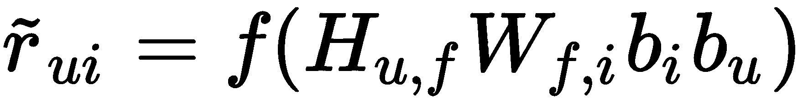

在前面的函数中，我们有用户和项目的偏差项，而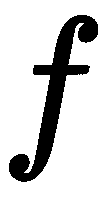是 sigmoid 函数。

模型训练使数据的可能性最大化，条件是参数表达如下:

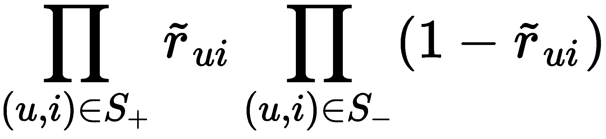

有不同的方法来衡量推荐者的表现，和往常一样，我们选择使用哪一种取决于我们试图实现的目标。

## 请参见

再说一次，周围有很多库，使它很容易启动和运行。首先，我想强调这两个，我们已经在这个食谱中使用过了:

*   https://github.com/lyst/lightfm
*   聚光灯:[https://maciejkula.github.io/spotlight](https://maciejkula.github.io/spotlight)

但是其他一些也很有前途:

*   Polara，其中包括一个叫做 HybridSVD 的算法，看起来很强:[https://github.com/evfro/polara](https://github.com/evfro/polara)
*   DeepRec，提供深度学习模型进行推荐(基于 tensor flow):[https://github.com/cheungdaven/DeepRec](https://github.com/cheungdaven/DeepRec)

您可以在以下 repo 中找到带有数据集的项目排名库功能演示:[https://github . com/cheungdaven/DeepRec/blob/master/test/test _ item _ ranking . py](https://github.com/cheungdaven/DeepRec/blob/master/test/test_item_ranking.py)。

微软一直在写推荐者的最佳实践:[https://github.com/Microsoft/Recommenders](https://github.com/Microsoft/Recommenders)。

最后，但同样重要的是，你可能会发现以下关于推荐系统的阅读列表很有用:[https://github . com/deepgraph learning/re commender systems/blob/master/reading list . MD](https://github.com/DeepGraphLearning/RecommenderSystems/blob/master/readingList.md)。

# 发现欺诈者社区

在这个菜谱中，我们将尝试使用网络分析的方法来检测欺诈社区。这是一个似乎经常出现在图表分析和直观诉求中的用例，因为在进行欺诈检测时，我们对人们之间的关系感兴趣，例如他们是否住得很近，是否通过社交媒体联系在一起，或者是否有相同的工作。

## 做好准备

为了让食谱一切就绪，我们将安装所需的库，并下载一个数据集。

我们将使用以下库:

*   `networkx` -是图形分析库:[https://networkx.github.io/documentation](https://networkx.github.io/documentation)。
*   `annoy` -是一个非常高效的最近邻实现:[https://github.com/spotify/annoy](https://github.com/spotify/annoy)。
*   `tqdm` -为我们提供进度条:[https://github.com/tqdm/tqdm](https://github.com/tqdm/tqdm)。

此外，我们将使用 SciPy，但这是 Anaconda 发行版附带的:

```py
!pip install networkx annoy tqdm python-louvain
```

我们将使用以下欺诈性信用卡交易数据集:[https://www.kaggle.com/mlg-ulb/creditcardfraud](https://www.kaggle.com/mlg-ulb/creditcardfraud)。

信用卡欺诈数据集包含欧洲持卡人在 2013 年 9 月通过信用卡进行的交易。该数据集显示了两天内发生的交易，284，807 笔交易中有 492 笔欺诈交易。数据集高度不平衡:正类(欺诈)占所有交易的 0.172%。

让我们导入数据集，然后将其分成训练集和测试集:

```py
import pandas as pd
from sklearn.datasets import fetch_openml
import random

X, y = fetch_openml(data_id=1597, return_X_y=True)

samples = random.choices(
    list(range(X.shape[0])), k=int(X.shape[0] * 0.33)
)
X_train = X[(samples), :]
```

我们准备好了！我们来做食谱吧！

## 怎么做...

我们将首先创建一个邻接矩阵，然后我们可以对其应用社区检测方法，最后，我们将评估生成的社区的质量。整个过程增加了与大型数据集相关的困难，这意味着我们只能应用某些算法。

### 创建邻接矩阵

首先，我们需要计算所有点的距离。对于像这样的大型数据集来说，这是一个真正的问题。你可以在网上找到几种方法。

为此，我们使用了 Spotify 的`annoy`库，它速度非常快，而且节省内存:

```py
from annoy import AnnoyIndex
t = AnnoyIndex(X_train.shape[1], 'euclidean') # Length of item vector that will be indexed
for i, v in enumerate(X_train):
    t.add_item(i, v)

t.build(10) # 10 trees
```

然后，我们可以用索引给出的距离初始化邻接矩阵:

```py
from tqdm import trange
from scipy.sparse import lil_matrix

MAX_NEIGHBORS = 10000 # Careful: this parameter determines the run-time of the loop!
THRESHOLD = 6.0

def get_neighbors(i):
  neighbors, distances = t.get_nns_by_item(i, MAX_NEIGHBORS, include_distances=True)
  return [n for n, d in zip(neighbors, distances) if d < THRESHOLD]

n_rows = X_train.shape[0]
A = lil_matrix((n_rows, n_rows), dtype=np.bool_)
for i in trange(n_rows):
  neighborhood = get_neighbors(i)
  for n in neighborhood:
      A[i, n] = 1
      A[n, i] = 1
```

我们现在可以应用一些社区检测算法。

### 社区检测算法

我们矩阵的大小让我们的选择有限。我们将应用以下两种算法:

*   **强连通分量** ( **SCC** )
*   卢万算法

我们可以将 SCC 算法直接应用于邻接矩阵，如下所示:

```py
from scipy.sparse.csgraph import connected_components

n_components, labels = connected_components(
    A,
    directed=False,
    return_labels=True
)
```

对于第二种算法，我们首先需要将邻接矩阵转换成图；这意味着我们将矩阵中的每个点视为节点之间的边。为了节省空间，我们为此使用了一个简化的图形类:

```py
import networkx as nx

class ThinGraph(nx.Graph):
    all_edge_dict = {'weight': 1}

    def single_edge_dict(self):
        return self.all_edge_dict

    edge_attr_dict_factory = single_edge_dict

G = ThinGraph(A)
```

那么我们可以如下应用卢万算法:

```py
import community  # this is the python-louvain package

partition = community.best_partition(G)
```

现在，我们的数据集有了两个不同的分区。让我们看看他们是否有价值！

### 评估社区

在理想情况下，我们预计一些社区中只有欺诈者，而其他(大多数)社区中没有欺诈者。这种纯洁是我们在一个完美的社区中所寻求的。然而，由于我们也可能需要一些关于谁可能是欺诈者的建议，我们会预计在多数非欺诈者组中的一些点会被标记为欺诈者，反之亦然。

我们可以从查看每个社区的欺诈频率直方图开始。卢万欺诈者分布如下:

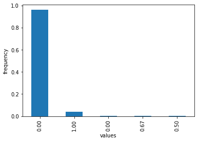

这表明，社区中有非常高频率的人不是欺诈者，其他价值观很少。但是我们能量化这有多好吗？

我们可以通过计算每个聚类中的**类熵**来描述欺诈者分布。我们将在*中解释熵是如何工作的...*一节。

然后，我们可以创建适当选择的随机实验，看看是否有任何其他社区分配会导致更好的类熵。如果我们随机洗牌，然后计算社区的熵，我们得到一个熵分布。这将给我们一个 **p 值**，即**统计显著性**，用于卢万社区的熵。

The **p-value** is the probability that we get a distribution like this (or better) purely by chance.

您可以在 GitHub 上的笔记本中找到采样的实现。

我们得到了非常低的显著性，这意味着它极不可能偶然得到这样的东西，这使我们得出结论，我们已经找到了在识别欺诈者方面有意义的聚类。

## 它是如何工作的...

使用大型数据集进行网络分析最困难的部分是构建邻接矩阵。你可以在网上的笔记本中找到不同的方法。这两个问题是运行时和内存。两者都可以随着数据点的数量呈指数增长。

我们的数据集包含 284，807 个点。这意味着所有点之间的完整连接矩阵需要几百千兆字节(每个点 4 字节)，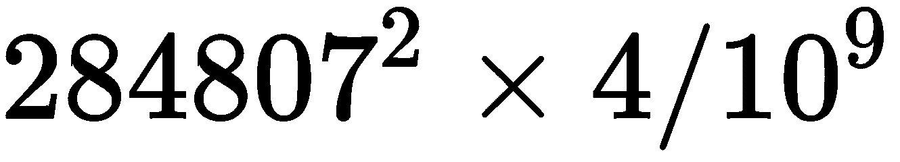。

我们正在使用一个稀疏矩阵，其中如果没有超过给定的阈值，大多数邻接都是 0。我们将点之间的每个连接表示为一个布尔型(1 位),我们取 33%的样本，即 93，986 个点，而不是整个数据集。

### 图形社区算法

让我们通过两个图形社区算法来了解它们是如何工作的。

#### 卢万算法

我们在这个食谱中使用了鲁文算法。该算法于 2008 年由布朗德尔*等人*([https://arxiv.org/abs/0803.0476](https://arxiv.org/abs/0803.0476))发表。由于其时间复杂度是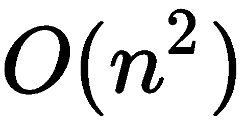，卢万算法可以并且已经被用于大数据集，包括来自 Twitter 的包含 240 万个节点和 3800 万个链接的数据。

Louvain 算法的主要思想是通过连续地将社区合并在一起来以聚集的方式进行，从而增加它们的连通性。连通性通过边模块性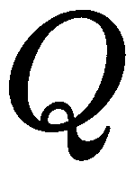来测量，边模块性是社区内连接到同一社区的其他顶点的边相对于其他社区的顶点的密度。顶点的社区的任何开关都有关联的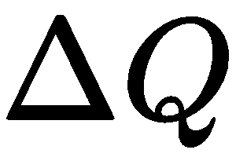。在将每个顶点初始分配给它们自己的社区后，启发式算法分两步操作:贪婪地将顶点分配给社区，以及粗粒化。

*   对于所有顶点，将它们分配到社区，使尽可能地高。这个步骤可以重复几次，直到模块性没有改善。
*   所有社区都被视为顶点。这意味着边也被组合在一起，使得属于组合在一起的顶点的所有边现在都是新创建的顶点的边。

重复这两个步骤，直到模块性没有进一步改善。

#### 格文-纽曼算法

作为另一种算法的例子，让我们看看格文-纽曼算法。格文-纽曼算法(格文和纽曼，2002 年，论文可在 https://www.pnas.org/content/99/12/7821[获得)基于节点间最短路径的概念。一条边的**边介数**是沿着这条边的节点之间最短路径的数量。](https://www.pnas.org/content/99/12/7821)

该算法的工作原理如下:

1.  计算所有边的边介数。
2.  移除介数最高的边。
3.  重新计算边的介数。
4.  重复*步骤 2* 和 *3* ，直到没有剩余的边。

结果是一个树状图，它显示了算法步骤对聚类的排列。

整个算法的时间复杂度为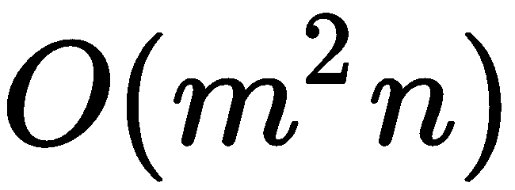，边 *m* ，顶点 *n* 。

### 信息熵

给定一个离散随机变量，其可能值(或结果)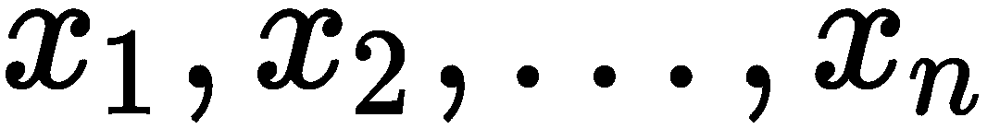以概率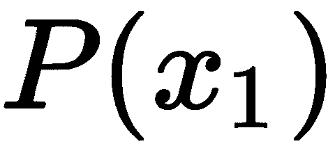发生，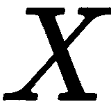的熵正式定义如下:

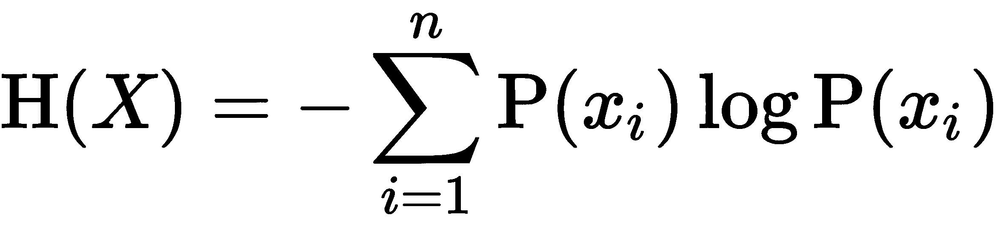

这通常被视为随机变量中的惊奇、不确定性或混乱程度。

如果变量不是离散的，我们可以应用宁滨(例如，通过直方图)或使用公式的非离散版本。

## 还有更多...

我们本可以应用其他算法，比如 David Pearce 在 2005 年发表的 SCC(在*中，一种寻找有向图的强连通分量的改进算法*)。

我们也可以试试这个方法:

```py
from scipy.sparse.csgraph import connected_components

n_components, labels = connected_components(
    A,
    directed=False,
    return_labels=True
)
```

SCC 社区欺诈者分布如下所示:

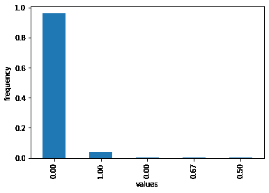

我们再次得到一个 p 值，它显示了非常高的统计显著性。这意味着这不太可能纯粹是偶然发生的，并表明我们的方法确实是一个很好的欺诈分类器。

我们也可以应用更传统的聚类算法。例如，相似性传播算法采用邻接矩阵，如下所示:

```py
from sklearn.cluster import AffinityPropagation

ap = AffinityPropagation(
    affinity='precomputed'
).fit(A)
```

我们还可以应用许多其他方法。对于其中的一些，我们必须将邻接矩阵转换成距离矩阵。

## 请参见

你可以在 GitHub 上找到由 Benedek Rozemberczki 收集的关于图分类和图算法的阅读材料，网址是[https://GitHub . com/benedekrozemberczki/awesome-graph-classification](https://github.com/benedekrozemberczki/awesome-graph-classification)。

如果你对图形卷积网络或图形注意力网络感兴趣，在[https://github.com/Jiakui/awesome-gcn](https://github.com/Jiakui/awesome-gcn)也有一个有用的列表。

Python 有一些非常好的图形库，有许多社区检测或图形分析的实现:

*   https://cdlib.readthedocs.io/en/latest/
*   https://karateclub.readthedocs.io/en/latest/
*   网络 x:[https://networkx.github.io/](https://networkx.github.io/)
*   标签传播:[https://github.com/yamaguchiyuto/label_propagation](https://github.com/yamaguchiyuto/label_propagation)

大多数 Python 库处理中小规模的邻接矩阵(可能多达大约 1000 条边)。适合较大数据量的库包括:

*   https://snap.stanford.edu/snappy/index.html
*   巨蟒-鲁汶[:](https://github.com/taynaud/python-louvain)【https://github.com/taynaud/python-louvain 
*   图形工具:[https://graph-tool.skewed.de/](https://graph-tool.skewed.de/)

Cdlib 还包含 BigClam 算法，它可以处理大图。

一些图形数据库，比如带有 Python 接口的 neo4j，实现了社区检测算法:[https://neo4j.com/docs/graph-algorithms/current/](https://neo4j.com/docs/graph-algorithms/current/)。