# 四、概率建模

这一章是关于不确定性和概率方法。最先进的机器学习系统有两个显著的缺点。

首先，他们可能对自己的预测过于自信(或者有时不够自信)。在实践中，给定有噪声的数据，即使我们观察到用看不见的数据集进行交叉验证的最佳实践，这种置信度也可能不被保证。尤其是在受监管或敏感的环境中，例如在金融服务、医疗保健、安全和情报领域，我们需要非常小心我们的预测以及预测的准确性。

其次，机器学习系统越复杂，我们需要的拟合模型的数据就越多，过度拟合的风险就越严重。

概率模型是使用随机抽样技术产生概率推断的模型。通过参数化分布和固有的不确定性，我们可以克服这些问题，并获得准确性，否则将需要更多的数据没有这些假设。

在这一章中，我们将建立一个股票价格预测模型，使用不同的插件方法进行置信度估计。然后我们将讨论估计客户生命周期，这是服务客户的企业中的一个常见问题。考虑到不同类型的不确定性，我们还将研究疾病的诊断，并量化信用风险。

本章包括以下配方:

*   满怀信心地预测股票价格
*   估计客户终身价值
*   诊断疾病
*   停止信用违约

# 技术要求

在本章中，我们主要使用以下内容:

*   sci kit-像以前一样学习
*   喀拉斯，和以前一样
*   生命周期([https://lifetimes.readthedocs.io/](https://lifetimes.readthedocs.io/))，客户生命周期价值库
*   `tensorflow-probability`(**TFP**；[https://www.tensorflow.org/probability](https://www.tensorflow.org/probability)

你可以在 GitHub 的 https://GitHub . com/packt publishing/Artificial-Intelligence-with-Python-Cookbook/tree/master/chapter 04 找到这一章的代码。

# 满怀信心地预测股票价格

有效市场假说认为，在任何给定的时间，股票价格整合了关于股票的所有信息，因此，市场不可能通过更好的策略或更一般的更好的信息持续跑赢大盘。然而，可以说，投资银行业的当前实践与此相矛盾，在这种实践中，机器学习和统计被构建到算法交易系统中。但这些算法可能会失败，正如 2010 年闪电崩盘或系统性风险被低估时所看到的那样，正如罗杰·洛温斯坦在其著作《当天才失败:长期资本管理的兴衰》中所讨论的那样。

在这个菜谱中，我们将在 scikit-learn 中构建一个简单的股票预测管道，并使用不同的方法生成概率估计。然后我们将评估我们不同的方法。

## 做好准备

我们将使用`yfinance`库检索历史股票价格。

我们是这样安装的:

```py
pip install yfinance
```

将帮助我们下载历史股票价格。

## 怎么做...

在实际环境中，我们想要回答以下问题:给定价格水平，它们会上升还是下降，以及下降多少？

为了朝着这一目标前进，我们将采取以下步骤:

1.  下载股票价格。
2.  创建一个特征函数。
3.  写一个评价函数。
4.  训练模型来预测股票和比较业绩。

特别是，我们将比较以下生成置信度值的方法:

*   普拉特标度
*   朴素贝叶斯
*   保序回归

我们将在*工作原理中讨论这些方法及其背景...*一节。

让我们试一试！

1.  **下载股票价格**:我们将下载微软的价格:

```py
import yfinance as yf

msft = yf.Ticker('MSFT')
hist = msft.history(period='max')
```

现在我们有了作为数据框架`hist`的股票价格。

2.  **创建特征化函数**:因此，让我们从一个函数开始，该函数将给我们一个用于训练和预测的数据集，给定一个窗口大小和一个偏移；基本上，我们希望每个价格有多少个描述符，以及我们对未来有多远的展望:

```py
from typing import Tuple
import numpy as np
import pandas as pd
import scipy

def generate_data(
    data: pd.DataFrame, window_size: int, shift: int
) -> Tuple[np.array, np.array]:
    y = data.shift(shift + window_size)
    observation_window = []
    for i in range(window_size):
        observation_window.append(
            data.shift(i)
        )
    X = pd.concat(observation_window, axis=1)
    y = (y - X.values[:, -1]) / X.values[:, -1]
    X = X.pct_change(axis=1).values[:, 1:]
    inds = (~np. isnan(X).any(axis=1)) & (~np. isnan(y))
    X, y = X[inds], y[inds]
    return X, y
```

然后，我们将使用我们的新函数`generate_data()`，来生成我们的训练和测试数据集:

```py
from sklearn.model_selection import train_test_split

X, y = generate_data(hist.Close, shift=1, window_size=30)
X_train, X_test, y_train, y_test = train_test_split(X, y)
```

当然，这是一种常见的模式，我们已经在导致这种情况的方法中见过几次:我们生成数据集，然后将它分成训练集和验证集，其中训练集用于训练(顾名思义)，验证集用于检查我们的算法工作得如何(特别是，我们是否过度拟合)。

我们的数据集近似正态分布。这是我们的目标在训练中的样子:

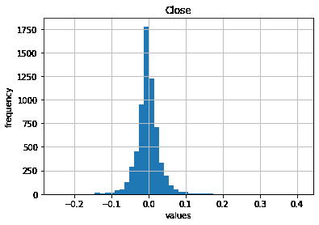

我们可以看到有一个向左的倾斜，也就是说，低于零的值(约 49%)比高于零的值(约 43%)多。这意味着在培训中，价格下降而不是上升。

然而，我们还没有完成我们的数据集；我们需要再做一次转变。我们的场景是，我们希望应用这个模型来帮助我们决定是否在价格上涨的情况下购买股票。我们将分成三个不同的班级:

*   价格上涨 *x* 。
*   价格保持不变。
*   价格下降了 *x* 。

在下面的代码块中，给定`threshold`参数，我们通过`x`应用此截止:

```py
def threshold_vector(x, threshold=0.02):
    def threshold_scalar(f):
        if f > threshold:
            return 1
        elif f < -threshold:
            return -1
        return 0
    return np.vectorize(threshold_scalar)(x)

y_train_classes, y_test_classes = threshold_vector(y_train), threshold_vector(y_test)
```

在这之后，我们有了用于训练和测试(验证)的阈值 *y* 值。

3.  **写一个评估函数**:这是为了衡量我们用一个给定的模型预测股票价格的表现。为了进行评估，我们需要一个助手函数来将整数编码转换为一键编码。

在评估中，我们计算并打印出曲线 ( **AUC** )下的**面积，作为绩效衡量标准。我们创建了一个函数`measure_perf()`，它测量性能并打印出相关的指标，给出一个这样的模型:**

```py
from sklearn import metrics

def to_one_hot(a):
    """convert from integer encoding to one-hot"""
    b = np.zeros((
       a.size, 3
    ))
    b[np.arange(a.size), a+1] = 1
    return b

def measure_perf(model, y_test_classes):
  y_pred = model.predict(X_test)
  auc = metrics.roc_auc_score(
    to_one_hot(y_test_classes),
    to_one_hot(y_pred),
    multi_class='ovo'
  )
  print('AUC: {:.3f}'.format(auc))
```

在训练我们的模型之后，我们现在可以使用我们的新方法来评估性能。

4.  **训练模型以预测 sto** **cks 并比较性能**:我们现在将比较以下方法以从我们的三个模型生成概率结果，其中前两个我们可以快速实现:

```py
from sklearn.ensemble import RandomForestClassifier
from sklearn.calibration import CalibratedClassifierCV

rf = RandomForestClassifier(
    n_estimators=500, n_jobs=-1
).fit(X_train, y_train_classes)
platt = CalibratedClassifierCV(
    rf, method='sigmoid'
).fit(X_train, y_train_classes)
isotonic = CalibratedClassifierCV(
    rf, method='isotonic'
).fit(X_train, y_train_classes)
print('Platt:')
measure_perf(platt, y_test_classes)
print('Isotonic:')
measure_perf(isotonic, y_test_classes)
#Platt:
#AUC: 0.504
#Isotonic:
#AUC: 0.505
```

对于朴素贝叶斯，我们尝试不同的变体:分类朴素贝叶斯和互补朴素贝叶斯:

```py
from sklearn.ensemble import StackingClassifier
from sklearn.naive_bayes import ComplementNB, CategoricalNB

def create_classifier(final_estimator):
    estimators = [
        ('rf', RandomForestClassifier(
            n_estimators=100,
            n_jobs=-1
        ))
    ] 
    return StackingClassifier(
        estimators=estimators,
        final_estimator=final_estimator,
        stack_method='predict_proba'
    ).fit(X_train, y_train_classes)

measure_perf(create_classifier(CategoricalNB()), y_test_classes)
measure_perf(create_classifier(ComplementNB()), y_test_classes)
#CategoricalNB:
#AUC: 0.500
#ComplementNB: 
#AUC: 0.591
```

我们发现，无论是普拉特尺度(逻辑回归)还是保序回归都不能很好地处理我们的数据集。朴素贝叶斯回归不会比 50%更好，这是我们不想赌的，即使它比随机选择略好。然而，互补朴素贝叶斯分类器表现得更好，在 59% AUC。

## 它是如何工作的...

我们已经看到，我们可以创建一个股票价格的预测器。我们将此分解为创建数据、验证和训练模型。最后，我们找到了一种方法，这种方法给了我们希望，我们可以在实践中使用它。

让我们先来看看我们的数据生成，然后再来看看我们不同的方法。

### 特征化

这是任何人工智能工作的核心。在做任何工作或第一次查看我们的数据集之前，我们应该问自己，我们选择什么作为我们观察单位的单位，以及我们如何以一种有意义并且可以被算法捕获的方式来描述我们的点。随着经验的积累，这是自然而然的事情。

在我们的`generate_data()`函数中，我们从股票价格历史数据中提取一个数据集用于训练和测试。我们专注于预测单个价格，所以我们的观察单位是单个股票价格。对于每个价格，我们需要提取特征，其他价格也是如此。我们提取一段时间内的价格，这可以帮助我们预测未来的价值。更准确地说，我们不直接使用价格；我们必须首先将它们标准化，因此最好将它们称为价格水平，而不是价格。

使用我们的方法，我们用不同的时间范围和多个点对我们的预测数据进行参数化。价格水平是在一个时间段内提取的(特征)。最后，几天后的价格水平将被预测(目标)。时间段和班次是我们的两个附加参数:`window_size`和`shift`。该函数返回 *x* ，股票价格及其窗口的历史，以及 *y* ，未来要预测的股票价格。

我们还有更多的问题需要解决。我们已经在[第二章](bca59029-1915-4856-b47d-6041d7b10a0a.xhtml)*监督机器学习*的*预测 CO2 时间序列*配方中看到了一些时间序列的数据处理方法。特别是，稳定和规范化也是这个食谱中的关注点(你可能想翻回来看看那里的解释)。

将特征归一化为平均值 0，然后以百分比变化的形式求差(窗口中的每个值与之前的值)。进行差分步骤是为了引入平稳性的度量。特别地，目标被表示为相对于窗口中最后一个值(特征)的百分比变化。

接下来，我们将看看普拉特标度，这是一种最简单的缩放模型预测以获得概率结果的方法。

### 普拉特标度

普拉特标度(John Platt，1999，*支持向量机的概率输出以及与正则化似然方法的比较* ) 是我们使用的第一种标度模型结果的方法。简而言之，它在我们的分类器预测之上应用逻辑回归。逻辑回归可以表示如下(等式 1):

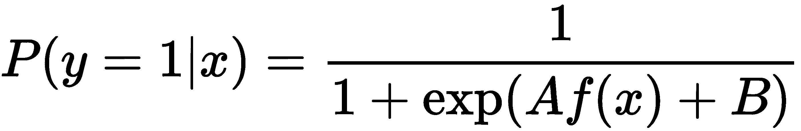

这里，通过最大似然法学习 *A* 和 *B* 。

我们正在搜索 *A* 和 *B* ，如下所示:

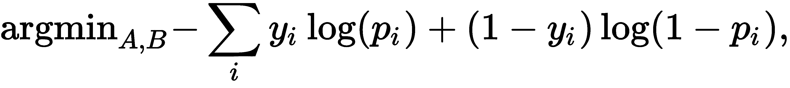

这里的 *p* 指的是前面的等式 1。

作为梯度下降，我们可以迭代地应用以下两个步骤:

1.  将梯度计算为似然函数的微分。
2.  根据由学习率缩放的梯度更新参数。

在下一小节中，我们将看看使用保序回归的概率校准的替代方法。

### 保序回归

保序回归(Zadrozny 和 Elkan，2001 年，*当成本和概率都未知时的学习和决策*)是使用保序函数的回归，即单调递增或非递减的函数，作为最小化均方误差的函数近似值。

我们可以这样表达:

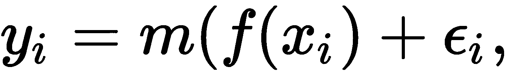

这里 *m* 是我们的等张函数， *x* 和 *y* 是特征和目标， *f* 是我们的分类器。

接下来，我们将看看一个最简单的概率模型，朴素贝叶斯。

### 朴素贝叶斯

朴素贝叶斯分类器基于贝叶斯定理。

贝叶斯定理是关于给定 *B* 的情况下，事件 *A* 发生的条件概率:

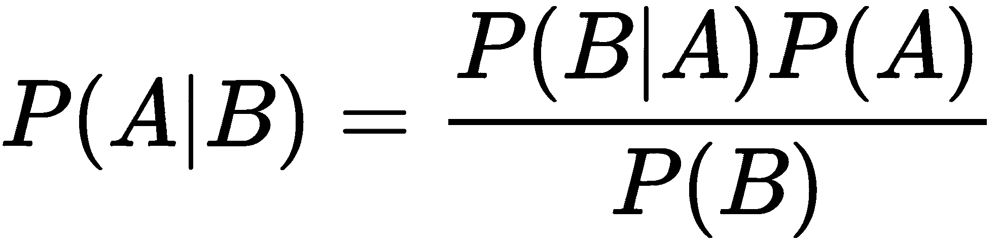

*P(A)* 是观察到 *A* 的概率( *A* 的边际概率)。给定公式，分母中的 *P(B)* 不可能是 0。这背后的原因值得一读。

朴素贝叶斯分类器是关于给定特征的类的概率。我们可以将类别 *k* 和特征 *x* 插入贝叶斯定理，如下所示:

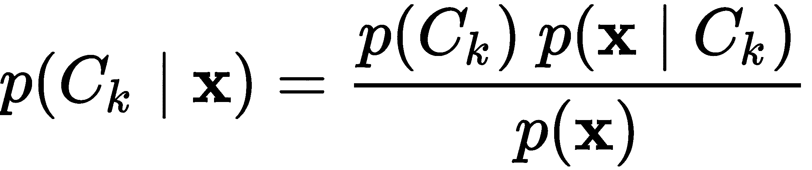

之所以称之为幼稚，是因为它假设特性是相互独立的，所以命名器可以简化如下:

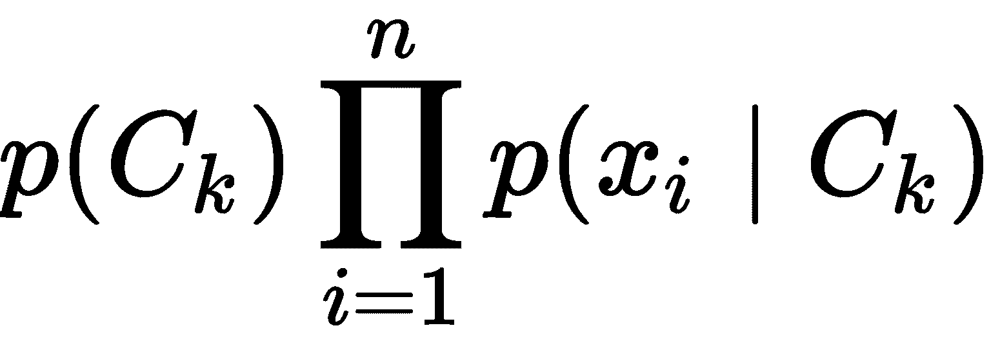

在下一节中，我们将看看其他材料。

## 请参见

以下是您可以浏览的一些资源:

*   对于普拉特缩放，请参考约翰·普拉特(1999)的*支持向量机的概率输出和正则化似然方法的比较*。
*   对于保序回归，如我们在分类中概率估计的应用，请参考 Zadrozny，b .和 Elkan，c .(2002)的*将分类器得分转换为精确的多类概率估计*。
*   要比较这两者，请参考 A. Niculescu-Mizil & R. Caruana，ICML(2005)的*用监督学习预测好的概率*。参考雷尼，J. D .等人，*处理朴素贝叶斯文本分类器的不良假设* (2003)，关于补码朴素贝叶斯算法。
*   scikit-learn 文档概述了置信度校准([https://sci kit-learn . org/stable/auto _ examples/calibration/plot _ calibration _ curve . html # sphx-glr-auto-examples-calibration-plot-calibration-curve-py](https://scikit-learn.org/stable/auto_examples/calibration/plot_calibration_curve.html#sphx-glr-auto-examples-calibration-plot-calibration-curve-py))。
*   关于应用于深度学习模型的方法，请参见李等人在 ICLR 2018 年发表的论文*训练置信度校准的分类器以检测非分布样本*(【https://arxiv.org/abs/1711.09325】)。他们的代码可以在 https://github.com/alinlab/Confident_classifier[的 GitHub 上找到。](https://github.com/alinlab/Confident_classifier)

您可以在以下链接中找到更多使用不同框架对时间序列进行概率分析的示例:

*   **bayesloop** :分析股市波动——[http://docs . Bayes loop . com/en/stable/examples/stockmarketfloatings . html](http://docs.bayesloop.com/en/stable/examples/stockmarketfluctuations.html)
*   **张量流概率**:不同方法——[https://www . tensor flow . org/Probability/examples/Structural _ Time _ Series _ Modeling _ Case _ Studies _ Atmospheric _ CO2 _ and _ Electricity _ Demand](https://www.tensorflow.org/probability/examples/Structural_Time_Series_Modeling_Case_Studies_Atmospheric_CO2_and_Electricity_Demand)
*   **Pyro** :高斯过程时间序列建模——【https://pyro.ai/examples/timeseries.html】T2

# 估计客户终身价值

在本食谱中，我们将学习如何计算终身价值以及客户为公司提供的价值。这对于营销预算非常重要，例如，基于客户细分的潜在客户获取或广告支出。我们将通过对客户购买模式随时间和购买价值的变化分别建模来做到这一点。

## 做好准备

我们需要这个食谱的包装。让我们安装它，如下面的代码所示:

```py
pip install lifetimes
```

现在我们可以开始了。

## 怎么做...

用于客户终身价值的数据集可以是事务性的，也可以是由客户汇总的。

汇总数据应包括以下统计数据:

*   **T** :交易周期；客户第一次购买后经过的时间
*   **频率**:客户在观察期内的购买次数
*   **货币价值**:购买的平均价值
*   **新近度**:顾客最后一次购买时的年龄

让我们从第一步开始！

1.  我们首先将**贝塔吉奥** ( **BD** )/ **负二项分布** ( **NBD** )模型拟合到客户交易的汇总数据集:

```py
from lifetimes.datasets import load_cdnow_summary_data_with_monetary_value
from lifetimes import BetaGeoFitter

bgf = BetaGeoFitter(penalizer_coef=0.0)
bgf.fit(
   data['frequency'],
    data['recency'],
    data['T']
)
```

2.  购买值的 Gamma-Gamma 模型无法处理没有重复购买的客户，因此我们将在拟合之前排除这些客户:

```py
from lifetimes import GammaGammaFitter

data_repeat = data[data.frequency>0]
ggf = GammaGammaFitter(penalizer_coef=0.0)
ggf.fit(
    data_repeat.frequency,
    data_repeat.monetary_value
)
```

3.  然后，我们可以使用生命周期库的另一种方法，将预测未来交易数量的模型(`bgf`)和预测平均购买价值的模型(`ggf`)的预测结合起来。它包括一个用于贴现未来值的参数。我们将包括相当于年化 12.7%的折扣。我们将打印五位客户的终身价值:

```py
print(ggf.customer_lifetime_value(
    bgf,
    data['frequency'],
    data['recency'],
    data['T'],
    data['monetary_value'],
    time=12,
    discount_rate=0.01
).head(5))
```

输出向我们展示了客户终身价值:

```py
customer_id
1      140.096218
2       18.943466
3       38.180575
4       38.180575
5       38.180575
```

现在我们知道谁是我们最好的客户，因此也知道在哪里投资我们的时间和资源！

让我们复习一下这个食谱中的一些方法。

## 它是如何工作的...

在这个食谱中，我们根据顾客的购买模式估计了他们的终身价值。

每个客户对公司都有价值。这对于营销预算非常重要，例如，基于客户细分的潜在客户获取或广告支出。客户离开公司后，才知道实际的客户终身价值；但是，我们可以为每个客户建立两个不同的概率预测模型:

*   模拟购买更多产品的可能性
*   对购买的平均价值(收入)建模

我们使用 BG/NBD 模型模拟购买频率，或者更准确地说，客户购买模式随时间的变化，使用 Gamma-Gamma 模型模拟购买价值。这两个模型都利用了变量之间的非线性关联。

最后，我们可以根据以下公式合并预测值，以获得寿命值:

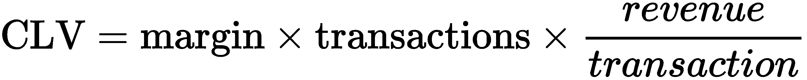

让我们回顾一下我们在这里使用的两个子模型。

### 英国天然气公司/NBD 模型

这考虑了客户的购买频率和客户的退出概率。

它带有以下假设:

*   每个客户的购买遵循带有λ参数的泊松分布。
*   每次交易后的客户流失概率 p 遵循 beta 分布。
*   交易率和退出概率在客户之间是独立的。

可以根据最大似然估计来估计λ和 *p* 参数。

### 伽马-伽马模型

该模型用于估计客户一生中的平均交易价值， *E(M)* ，我们对此有一个不完善的估计，如下所示:

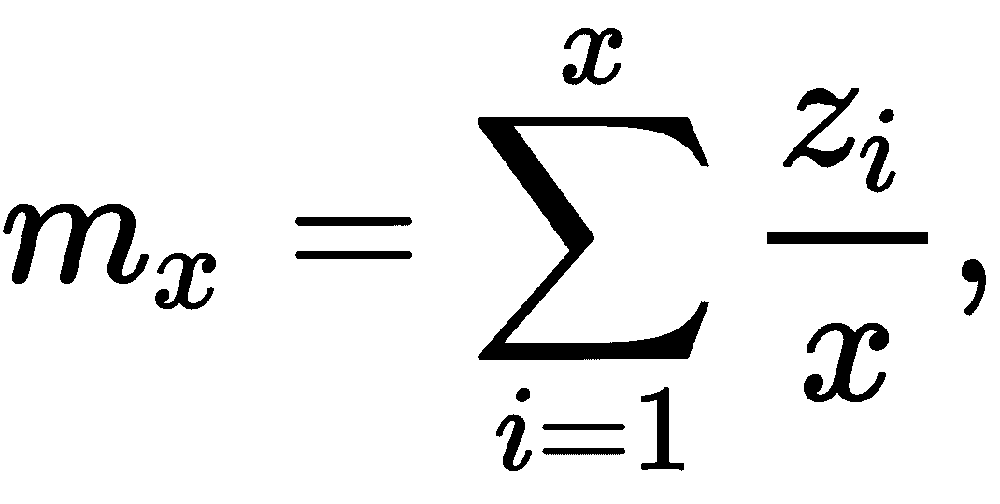

这里， *x* 是客户一生中购买的(未知)总次数， *z* 是每次购买的价值。

我们假设 *z* 是从伽马分布中取样的，因此，模型拟合涉及在个体水平上寻找形状和比例参数。

## 请参见

这个配方相对较短，因为已经在生存期库中做了出色的工作，使得许多所需的功能即插即用。可以在寿命文档([https://lifetimes.readthedocs.io/en/latest/Quickstart.html](https://lifetimes.readthedocs.io/en/latest/Quickstart.html))中找到该分析的扩展解释。

生存期库附带了一系列模型(称为 **fitters** )，您可能想了解一下。你可以在 Fader 等人的《*用最简单的方法计算你的顾客:帕累托/NBD 模型的替代方案》*，2005，以及巴蒂斯拉姆等人的《*顾客群分析模型的实证验证和比较》*， *2007* 中找到关于这两种方法的更多细节。你可以在 Fader 和 Hardi 的报告中找到 Gamma-Gamma 模型的细节，*货币价值的 Gamma-Gamma 模型* (2013)。

谷歌云平台 GitHub repo 显示了一个用于估计客户终身价值的模型比较([https://GitHub . com/Google Cloud Platform/tensorflow-lifetime-value](https://github.com/GoogleCloudPlatform/tensorflow-lifetime-value))，其中包括寿命、tensor flow 神经网络和 AutoML。你可以在 http://archive.ics.uci.edu/ml/datasets/Online+Retail 的 UCI 机器学习档案中找到一个非常相似的在线零售数据集。

Lifelines 是一个生存回归库，作者是 lifetings，Cameron Davidson-Pilon([https://lifelines . readthe docs . io/en/latest/Survival % 20 regression . html](https://lifelines.readthedocs.io/en/latest/Survival%20Regression.html))。

# 诊断疾病

对于概率建模，实验库比比皆是。运行概率网络可能比算法(非算法)方法慢得多，直到不久前，算法方法还不适合非常小的数据集。事实上，大多数教程和例子都与玩具数据集有关。

然而，由于更快的硬件和变分推理，这种情况近年来发生了变化。使用 TensorFlow Probability，定义架构、损耗和层通常很简单，即使使用完全支持 GPU 的概率采样和支持快速训练的最新实现也是如此。

在这个菜谱中，我们将实现一个医疗保健应用程序—我们将诊断一种疾病。

## 做好准备

我们已经安装了前面章节中的 scikit-learn 和 TensorFlow。

对于这个食谱，我们还需要`tensorflow-probability`:

```py
pip install tensorflow-probability
```

既然已经安装了`tensorflow-probability`,我们将在下一节广泛使用它。

## 怎么做...

我们将把它分成几个步骤:

1.  下载和准备数据
2.  创建一个神经网络
3.  模特培训
4.  确认

我们将从将数据集导入 Python 开始:

1.  **下载和准备数据**:我们将下载由安朵斯·雅诺西([https://www.openml.org/d/1565/](https://www.openml.org/d/1565/))小组在匈牙利心脏病学研究所收集的症状和心脏病诊断数据集，然后对其进行预处理，在 Keras 中构建一个神经网络，并根据症状进行概率诊断。

我们将像以前一样从 OpenML 下载它。你可以在那里看到完整的描述。目标最初编码不同的状态，其中 0 表示健康，其他表示疾病。因此，我们将健康和不健康分开，并将其视为二元分类问题。我们应用一个标准的定标器，这样我们就可以将 z 值输入到神经网络中。所有这些都应该是熟悉的几个早期食谱，在 [第一章](87098651-b37f-4b05-b0ee-878193f28b95.xhtml)、*Python 人工智能入门*、[第二章](bca59029-1915-4856-b47d-6041d7b10a0a.xhtml)、*监督机器学习中的高级主题*、[第三章](424f3988-2d11-4098-9c52-beb685a6ed27.xhtml)、*模式、离群值和建议*和[第四章](562919eb-c6f4-48d8-adc7-fabd55d93599.xhtml)、*概率建模*:

```py
from sklearn.datasets import fetch_openml
from sklearn.preprocessing import StandardScaler
from sklearn.model_selection import train_test_split

X, y = fetch_openml(data_id=1565, return_X_y=True, as_frame=True)
target = (y.astype(int) > 1).astype(float)
scaler = StandardScaler()
X_t = scaler.fit_transform(X)
Xt_train, Xt_test, y_train, y_test = train_test_split(
    X_t, target, test_size=0.33, random_state=42
)
```

现在，我们已经对数据集进行了预处理，并将其分为训练和测试两部分。

2.  **创建神经网络**:网络构建本身很简单，看起来非常像我们见过的其他 Keras 网络。不同之处在于最后有一个`DistributionLambda`层，我们将在下一节解释:

```py
import tensorflow as tf
import tensorflow_probability as tfp
tfd = tfp.distributions
from tensorflow import keras

negloglik = lambda y, p_y: -p_y.log_prob(y)

model = keras.Sequential([
  keras.layers.Dense(12, activation='relu', name='hidden'),
  keras.layers.Dense(1, name='output'),
  tfp.layers.DistributionLambda(
      lambda t: tfd.Bernoulli(logits=t)
  ),
])

model.compile(optimizer=tf.optimizers.Adagrad(learning_rate=0.05), loss=negloglik)
```

值得注意的是，我们不是像在二进制分类任务中那样以最后一层`Dense(2, activation = 'softmax'`结束，而是将输出减少到概率分布所需的参数数量，这在伯努利分布的情况下只有一个，它采用单个参数，即二进制结果的预期平均值。

我们正在使用一个只有 181 个参数的相对较小的模型。我们将在*中解释损失函数是如何工作的...*一节。

3.  模特训练:现在，我们可以训练我们的模特了。我们将在`tensorboard`中标出我们的培训损失，并允许提前停止:

```py
%load_ext tensorboard
callbacks = [
    keras.callbacks.EarlyStopping(patience=10, monitor='loss'),
    keras.callbacks.TensorBoard(log_dir='./logs'),
]
history = model.fit(
    Xt_train,
    y_train.values,
    epochs=2000,
    verbose=False,
    callbacks=callbacks
)
```

这将运行 2000 个纪元，可能需要一段时间才能完成。从 TensorBoard 上，我们可以看到不同时期的训练损失:

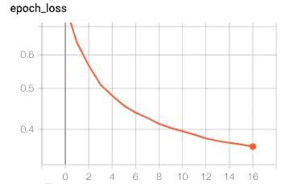

4.  **验证模型**:我们现在可以从模型中取样了。每个网络预测给我们一个均值和方差。我们可以看一下单个预测。我们任意选择了预测数字`10`:

```py
from scipy.stats import norm
import matplotlib.pyplot as plt

y_pred = model(Xt_test)
a = y_pred.mean().numpy()[10]
b = y_pred.variance().numpy()[10]
fig, ax = plt.subplots(1, 1)
x = np.linspace(
    norm.ppf(0.001, a, b),
    norm.ppf(0.999, a, b),
    100
)
pdf = norm.pdf(x, a, b)
ax.plot(
    x, 
    pdf / np.sum(pdf), 
    'r-', lw=5, alpha=0.6, 
    label='norm pdf'
)
plt.ylabel('probability density')
plt.xlabel('predictions')
```

这个预测看起来如下:

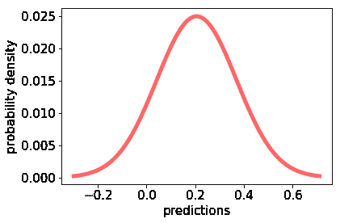

因此，每个预测都是伯努利过程中的一个样本。我们可以使用累积分布函数将这些预测转换成类别概率:

```py
def to_classprobs(y_pred):
    N = y_pred.mean().numpy().shape[0]
    class_probs = np.zeros(
        shape=(N, 2)
    )
    for i, (a, b) in enumerate(
        zip(
            y_pred.mean().numpy(),
            y_pred.variance().numpy()
        )
    ):
        conf = norm.cdf(0.5, a, b)
        class_probs[i, 0] = conf
        class_probs[i, 1] = 1 - conf
    return class_probs

class_probs = to_classprobs(y_pred)
```

现在，我们可以根据测试目标计算曲线下的面积和其他指标:

```py
import sklearn

def to_one_hot(a):
    """convert from integer encoding to one-hot"""
    b = np.zeros((a.size, 2))
    b[np.arange(a.size), np.rint(a).astype(int)] = 1
    return b

sklearn.metrics.roc_auc_score(
    to_one_hot(y_test),
    class_probs
)
print('{:.3f}'.format(sklearn.metrics.roc_auc_score(to_one_hot(y_test), class_probs)))
0.859
```

85% AUC 听起来不错。但我们是做医疗保健的，所以需要检查召回率(也叫敏感度)和精确度；换句话说，我们能检测出所有的病人吗？如果我们诊断出某人，他们真的生病了吗？如果我们错过了某人，他们可能会死于未经治疗的情况。如果我们发现每个人都生病了，那会给资源带来压力。

在下面的代码段中，我们将更详细地查看我们得到的结果:

```py
from sklearn.metrics import plot_precision_recall_curve
import matplotlib.pyplot as plt
from sklearn.metrics import average_precision_score

class ModelWrapper(sklearn.base.ClassifierMixin):
    _estimator_type = 'classifier'
    classes_ = [0, 1]
    def predict_proba(self, X):
        pred = model(X)
        return to_classprobs(pred)

model_wrapper = ModelWrapper()
average_precision = average_precision_score(
    to_one_hot(y_test),
    class_probs
)
fig = plot_precision_recall_curve(
    model_wrapper, Xt_test, y_test
)
fig.ax_.set_title(
    '2-class Precision-Recall curve: '
    'AP={0:0.2f}'.format(average_precision)
)
```

这使我们的结果可视化，以便让我们更好地理解精确度和召回率之间的权衡。

我们得到下面的图表:

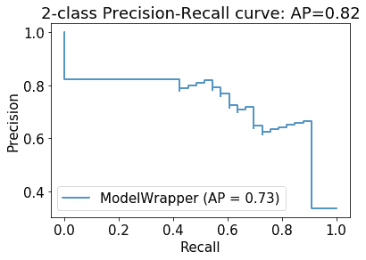

这条曲线可视化了我们的模型在召回率和精确度之间固有的权衡。给定我们的信心(或类别概率)的不同截止值，我们可以打电话询问某人是否生病。如果我们想找到每个人(`recall=100%`)，精度下降到 40%以下。另一方面，如果我们想在诊断某人生病时总是正确的(`precision=100%`)，那么我们就会错过每个人(`recall=0%`)。

现在的问题是，要决定一个说某人生病的截止时间，分别是错过的人或诊断出太多的人的成本。鉴于治疗的重要性，也许有一个 90%左右的召回率和 65%左右的准确率的最佳点。

## 它是如何工作的...

我们已经训练了一个神经网络，用于概率预测诊断疾病。让我们把它拆开一点，看看我们在这里使用了什么。

### 任意不确定性

张量流概率带有用于模拟不同类型不确定性的图层类型。随机不确定性指的是在给定相同输入的情况下，我们的结果的随机可变性——换句话说，我们可以了解我们数据的分布。

我们可以通过参数化描述预测的分布，而不是直接预测输入，在 Keras 和张量流概率中实现这一点。基本上，`DistributionLambda`从分布中提取(在我们的例子中，是伯努利)。

### 负对数似然

我们使用负对数似然作为我们的损失。这种损失常用于最大似然估计。

我们的定义是:

```py
negloglik = lambda y, p_y: -p_y.log_prob(y)
```

损失函数有两个值:`y`、目标和提供`log_prob()`方法的概率分布。该方法返回`y`的概率密度的对数。因为高值是好的，我们想用负值反转函数。

### 伯努利分布

伯努利分布(有时称为抛硬币分布)是一个事件的离散分布，有两种结果发生，概率为 *p* 和 *q = 1 - p* 。它只有一个参数，那就是 *p* 。我们可以选择其他建模选项，例如 softmax 激活层上的分类分布。

### 韵律学

最后，我们谈到了召回率和精确度。

它们的定义如下:

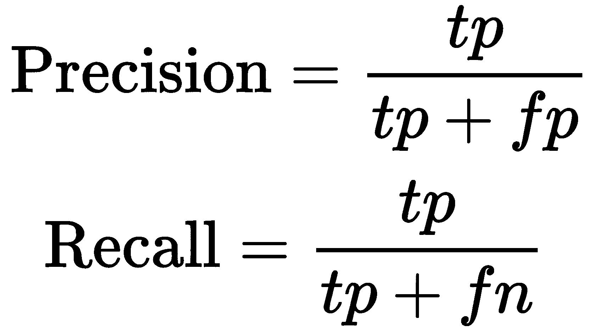

我们之前见过**真阳性**(**TP**)**假阳性**(**FP**)**假阴性** ( **fn** )。提醒一下，真阳性是指正确的预测，假阳性是指被错误预测为阳性的值，假阴性是指被错误预测为阴性的值。

## 请参见

在这个菜谱中，您已经看到了如何在健康应用程序中使用概率模型。还有许多其他数据集和许多不同的方法来进行概率推断。请将张量流概率视为概率建模中最有吸引力的框架之一([https://www.tensorflow.org/probability](https://www.tensorflow.org/probability))。它附带了广泛的教程。

# 停止信用违约

对于一家向客户提供信贷的公司来说，为了盈利，批准申请的最重要标准是他们能否偿还债务。这是由基于客户的金融历史和社会经济信息的信用评分过程决定的。传统上，对于信用评分，一直使用记分卡，尽管近年来，这些简单的模型已经让位于更复杂的机器学习模型。记分卡基本上是不同信息项目的清单，每一项都与最后加起来的分数相关联，并与及格分数进行比较。

我们将使用一个相对较小的信用卡应用数据集；然而，它仍然可以给我们一些关于如何用神经网络模型进行信用评分的见解。我们将实现一个包括权重分布和输出分布的模型。这被称为认知的、任意的不确定性，它会给我们更多关于预测可信度的信息。

## 做好准备

我们将使用`tensorflow-probability`。以防你跳过了之前的食谱，*诊断*ng a 病，下面是安装方法:

```py
pip install tensorflow-probability
```

现在，我们应该准备好 Keras 和`tensorflow-probability`。

## 怎么做...

让我们获取数据集并对其进行预处理，然后创建模型、训练模型并验证它:

1.  **下载并准备数据集**:我们将在这个食谱中使用的数据集发表于 2009 年(I-Cheng Yeh 和 Che-hui Lien，*信用卡客户违约概率预测准确性的数据挖掘技术比较*)，最初托管在 UCI 机器学习知识库上[https://archive . ics . UCI . edu/ml/datasets/default+of+credit+card+clients](https://archive.ics.uci.edu/ml/datasets/default+of+credit+card+clients)。

我们将使用 scikit-learn 的实用函数下载带有`openml`的数据:

```py
import numpy as np
from sklearn.datasets import fetch_openml

openml_frame = fetch_openml(data_id=42477, as_frame=True)
data = openml_frame['data']
```

这为我们提供了关于客户人口统计及其应用的特征。

我们将使用一个非常标准的预处理过程，这个过程我们在本书中已经见过很多次了，我们很大程度上会轻松通过。我们本可以对特性进行更多的检查，或者在转换和特性工程方面做更多的工作，但是这与本食谱无关。

所有特征都注册为数字，所以我们只应用标准缩放。这是预处理，然后我们将它分成训练和测试数据集:

```py
from sklearn.preprocessing import StandardScaler
from sklearn.model_selection import train_test_split

scaler = StandardScaler()
X = scaler.fit_transform(
    data
)
target_dict = {val: num for num, val in enumerate(list(openml_frame['target'].unique()))}
y = openml_frame['target'].apply(lambda x: target_dict[x]).astype('float').values
X_train, X_test, y_train, y_test = train_test_split(
    X, y, test_size=0.33, random_state=42
)
```

现在已经完成了，让我们创建模型。

2.  **创建模型**:首先，我们需要先验和后验。这是通过直接遵循在线 TensorFlow 概率教程([http://www . github . com/tensor flow/Probability/blob/master/tensor flow _ Probability/examples/jupyter _ notebooks/Probability _ Layers _ regression . ipynb](http://www.github.com/tensorflow/probability/blob/master/tensorflow_probability/examples/jupyter_notebooks/Probabilistic_Layers_Regression.ipynb))来完成的，并且适用于正态分布:

```py
import tensorflow as tf
import tensorflow_probability as tfp
import matplotlib.pyplot as plt
tfd = tfp.distributions
%matplotlib inline

negloglik = lambda y, rv_y: -rv_y.log_prob(y)
def prior_trainable(kernel_size, bias_size=0, dtype=None):
    n = kernel_size + bias_size
    return tf.keras.Sequential([
    tfp.layers.VariableLayer(n, dtype=dtype),
    tfp.layers.DistributionLambda(lambda t: tfd.Independent(
        tfd.Normal(loc=t, scale=1),
        reinterpreted_batch_ndims=1)),
    ])
def posterior_mean_field(kernel_size, bias_size=0, dtype=None):
    n = kernel_size + bias_size
    c = np.log(np.expm1(1.))
    return tf.keras.Sequential([
    tfp.layers.VariableLayer(2 * n, dtype=dtype),
    tfp.layers.DistributionLambda(lambda t: tfd.Independent(
        tfd.Normal(
            loc=t[..., :n],
            scale=1e-5 + tf.nn.softplus(c + t[..., n:])
        ),
    reinterpreted_batch_ndims=1)),
    ])
```

请注意`DenseVariational`。

现在到主模型，我们将使用先验和后验。你会认出`DistributionLambda`。我们已经用`Normal`代替了之前食谱中的`Binomial`、诊断疾病的*，这将为我们提供对预测方差的估计:*

```py
model = tf.keras.Sequential([
    tfp.layers.DenseVariational(2, posterior_mean_field, prior_trainable, kl_weight=1/X.shape[0]),
    tfp.layers.DistributionLambda(
        lambda t: tfd.Normal(
            loc=t[..., :1],
            scale=1e-3 + tf.math.softplus(0.01 * t[...,1:])
        )
    ),
])
model.compile(
    optimizer=tf.optimizers.Adam(learning_rate=0.01),
    loss=negloglik
)
callback = tf.keras.callbacks.EarlyStopping(monitor='val_loss', patience=5)
model.fit(
    X_train,
    y_train,
    validation_data=(X_test, y_test),
    epochs=1000,
    verbose=False,
    callbacks=[callback]
)
```

拟合之后，我们将模型应用到我们的测试数据集，并获得对它的预测。

3.  **验证**:让我们看看我们的模型有多好:

```py
from sklearn.metrics import roc_auc_score
preds = model(X_test)
roc_auc_score(y_test, preds.mean().numpy())
```

我们得到大约 70%的 AUC。因为这个汇总数字通常不能说明全部情况，所以我们也来看看混淆矩阵:

```py
from sklearn.metrics import confusion_matrix
import pandas as pd
import seaborn as sns

cm = confusion_matrix(y_test, preds.mean().numpy() >= 0.5)
cm = pd.DataFrame(
 data=cm / cm.sum(axis=0),
 columns=['False', 'True'],
 index=['False', 'True']
)
sns.heatmap(
 cm,
 fmt='.2f',
 cmap='Blues',
 annot=True,
 annot_kws={'fontsize': 18}
)
```

这段代码给了我们以下混淆矩阵:

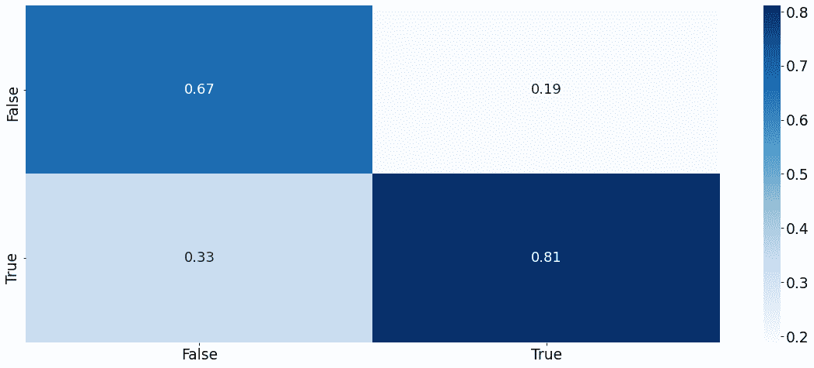

这个混乱矩阵将违约预测与实际违约进行列表。在点的对角线上，假-假和真-真是正确的预测(真阳性和真阴性)。我们可以看到正确预测的数量比错误预测的数量要高，这很令人欣慰。

然而，最有趣的一点是预测的方差与误差相关！

```py
import scipy
scipy.stats.spearmanr(np.abs(y_test - preds.mean().numpy().squeeze()), preds.variance().numpy().squeeze())
```

我们得到绝对误差和预测方差之间大约 60%的等级相关性。

这给了我们一个在实践中非常有用的置信度估计。我们发现误差高的测试点的方差较高，而我们预期误差较低的测试点的方差较低。我们可以在散点图中查看绝对误差和方差:

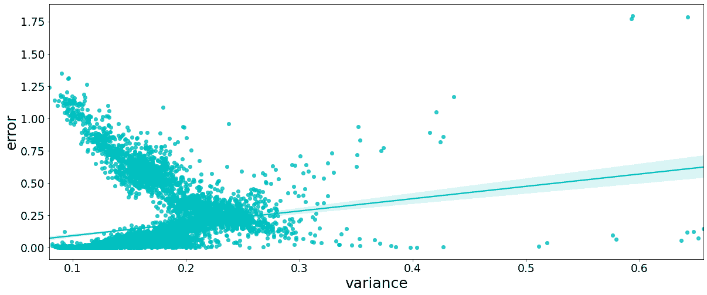

我们的食谱到此结束。这个食谱是作为一个练习，让你尝试更好的预处理，更多地调整模型，或者切换分布。

## 它是如何工作的...

信用评分模型通常使用逻辑回归模型，我们在本章的*满怀信心地预测股票价格*中已经遇到过。或者，增强模型或可解释决策树也在使用中。考虑到在线学习和表示剩余不确定性的能力，`tensorflow-probability`提供了另一个实用的选择。

在这个配方中，我们创建了一个概率信用违约预测模型，该模型适用于认知不确定性。是时候解释这是什么意思了。

### 认知不确定性

这是与不完全信息相关的不确定性——换句话说，是模型固有的不确定性。在嘈杂的真实世界数据集里，我们总是会遇到认知上的不确定性。

在张量流概率中，这可以建模为权重不确定性。在这个食谱中，我们使用了贝叶斯神经网络，其中权重是一个概率分布，而不是标量估计。这种权重的不确定性转化为预测的不确定性，这是我们希望看到的。

作为我们最终的网络层，我们包括了来自正态分布的随机性，以模拟随机的不确定性。相反，我们可以假设这种可变性是已知的。

## 请参见

还有其他途径可以探索，比如图书馆或其他资料，我们将在这里列出。

你可以在网上找到类似的问题，比如如下:

*   通过预测财务困境进行信用评分:[https://www.kaggle.com/c/GiveMeSomeCredit/data](https://www.kaggle.com/c/GiveMeSomeCredit/data)。
*   Lending Club 提供了一个庞大的贷款申请数据集:[https://www.lendingclub.com/info/download-data.action](https://www.lendingclub.com/info/download-data.action)。
*   保险索赔严重程度预测:[https://www.kaggle.com/c/allstate-claims-severity/data](https://www.kaggle.com/c/allstate-claims-severity/data)。

由于版权限制，我们不能在这里使用这些。

至于图书馆，我们建议您看看这些:

*   risk-slim 是一个可定制风险分值的 Python 库:[https://github.com/ustunb/risk-slim](https://github.com/ustunb/risk-slim)。
*   scorecardpy 是一个用于记分卡开发的库:[https://github.com/ShichenXie/scorecardpy](https://github.com/ShichenXie/scorecardpy)。

至于教程，开放风险手册提供了 Python 的信用评分开放资源:[https://www . openriskmanual . org/wiki/Credit _ Scoring _ with _ Python](https://www.openriskmanual.org/wiki/Credit_Scoring_with_Python)。

NumPyro 提供了一个关于离婚率贝叶斯回归的教程:[http://pyro . ai/NumPyro/Bayesian _ Regression . html # Regression-Model-to-Predict-离婚率](http://pyro.ai/numpyro/bayesian_regression.html#Regression-Model-to-Predict-Divorce-Rate)。*