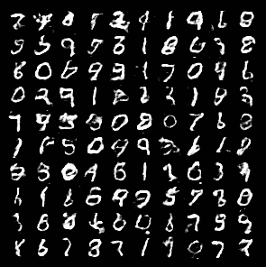

# 七、高级图像应用

人工智能在计算机视觉中的应用包括机器人、自动驾驶汽车、面部识别、识别生物医学图像中的疾病以及制造业中的质量控制等。

在这一章中，我们将从图像识别(或图像分类)开始，我们将研究基本模型和更高级的模型。然后我们将使用**生成对抗网络** ( **GANs** )来创建图像。

在本章中，我们将介绍以下配方:

*   识别服装项目
*   生成图像
*   编码图像和样式

# 技术要求

我们将使用许多标准库，如 NumPy、Keras 和 PyTorch，但我们还会看到更多的库，我们将在每个菜谱的开头提到它们，因为它们变得相关。

你可以在 GitHub 的[https://GitHub . com/packt publishing/Artificial-Intelligence-with-Python-Cookbook/tree/master/chapter 07](https://github.com/PacktPublishing/Artificial-Intelligence-with-Python-Cookbook/tree/master/chapter07)找到本章食谱的笔记本。

# 识别服装项目

影像分类的一个常见示例是 MNIST 数据集，其中包含不同样式的从 0 到 9 的数字。在这里，我们将使用一个名为“时尚 MNIST”的替代物，由不同的衣服组成。

时尚-https://github.com/zalandoresearch/fashion-mnist 是 Zalando 文章图像的数据集，由 60，000 个样本的训练集和 10，000 个样本的测试集组成:[。](https://github.com/zalandoresearch/fashion-mnist)

以下是数据集中的一些示例:


在这个食谱中，我们将识别不同型号的服装——我们将从通用图像特征(**高斯**的差异，或**狗**)和支持向量机开始；然后我们将转向前馈**多层感知器**(**MLP**)；那么我们就用一个**卷积神经网络**(**conv net**)；最后，我们将看看 MobileNet 的迁移学习。

## 做好准备

在我们开始之前，我们必须安装一个库。在这个菜谱中，我们将使用`scikit-image`，一个用于图像转换的库，所以我们将快速设置它:

```py
pip install scikit-image
```

我们现在可以开始制作食谱了！

## 怎么做...

我们将首先加载和准备数据集，然后我们将学习使用不同方法对来自时尚 MNIST 数据集的服装项目进行分类的模型。让我们从加载时装-MNIST 时装数据集开始。

我们可以通过`keras`实用函数直接获得数据集:

```py
from tensorflow import keras
from matplotlib import pyplot as plt

(train_images, train_labels), (test_images, test_labels) = keras.datasets.fashion_mnist.load_data()
train_images = train_images / 255.0
test_images = test_images / 255.0
plt.imshow(train_images[0])
plt.colorbar()
plt.grid(False)
```

我们还通过除以最大像素强度(`255.0`)来归一化 0 和 1 范围内的图像，并且我们可视化第一幅图像。

我们应该看到下面的运动鞋图像，这是训练集中的第一个图像:


正如我们在介绍这个食谱时提到的，我们将在接下来的章节中应用不同的方法:

*   狗的特征
*   MLP
*   LeNet
*   使用 MobileNet 转移学习

让我们从狗开始。

### 高斯差异

在深度学习在图像识别方面取得突破之前，图像是使用拉普拉斯或高斯差分滤波器来表征的。这些都是在`scikit-image`中实现的，所以我们可以拿一个现成的实现。

让我们编写一个使用高斯金字塔提取图像特征的函数:

```py
import skimage.transform
import numpy as np

def get_pyramid_features(img):
    return np.hstack([
        layer.reshape(-1)
        for layer in skimage.transform.pyramids.pyramid_gaussian(img)
    ])
```

`get_pyramid_features()`函数应用高斯金字塔并返回这些展平为矢量的要素。我们将在*中解释什么是高斯金字塔以及它是如何工作的...*一节。

我们差不多准备好开始学习了。我们只需要迭代所有的图像并提取我们的高斯金字塔特征。让我们创建另一个这样的函数:

```py
from sklearn.svm import LinearSVC

def featurize(x_train, y_train):
    data = []
    labels = []
    for img, label in zip(x_train, y_train):
        data.append(get_pyramid_features(img))
        labels.append(label)

    data = np.array(data)
    labels = np.array(labels)
    return data, labels
```

为了训练模型，我们在训练数据集上应用了`featurize()`函数。我们将使用线性支持向量机作为我们的模型。然后，我们将该模型应用于从我们的测试数据集中提取的特征，请注意，这可能需要一段时间来运行:

```py
x_train, y_train = featurize(train_images, train_labels)
clf = LinearSVC(C=1, loss='hinge').fit(x_train, y_train)

x_val, y_val = featurize(test_images, test_labels)
print('accuracy: {:.3f}'.format(clf.score(x_val, y_val)))
```

使用这些特征，我们在来自线性支持向量机的验证数据集上获得了 84%的准确度。通过对滤波器进行更多的调整，我们可以获得更高的性能，但这超出了本食谱的范围。在 2012 年 AlexNet 发表之前，这种方法是最先进的图像分类方法之一。

训练模型的另一种方法是使图像变平，并将归一化的像素值直接输入分类器，如 MLP。这就是我们现在要尝试的。

### 多层感知器

分类图像的一种相对简单的方法是使用 MLP。在这种具有 10 个神经元的两层 MLP 的情况下，您可以将隐藏层视为 10 个特征检测器的特征提取层。

我们已经在本书中多次看到 MLP 的例子，所以我们将跳过这里的细节；也许有趣的是，我们将图像从 28x28 展平为 784 的向量。至于其他的，只需要说我们训练分类交叉熵，我们将监控准确性。

您将在下面的代码块中看到这一点:

```py
import tensorflow as tf
from tensorflow.keras.losses import SparseCategoricalCrossentropy

def compile_model(model):
  model.summary()
  model.compile(
    optimizer='adam',
    loss=SparseCategoricalCrossentropy(
      from_logits=True
    ),
    metrics=['accuracy']
  ) 

def create_mlp():
  model = tf.keras.Sequential([
    tf.keras.layers.Flatten(input_shape=(28, 28)),
    tf.keras.layers.Dense(128, activation='relu'),
    tf.keras.layers.Dense(10)
  ])
  compile_model(model)
  return model
```

该模型在两层及其连接之间具有 101，770 个可训练参数。

我们将使用下面的函数来包装我们的训练集。这应该是不言自明的:

```py
def train_model(model, train_images, test_images):
    model.fit(
        train_images,
        train_labels,
        epochs=50,
        verbose=1,
        validation_data=(test_images, test_labels)
    )
    loss, accuracy = model.evaluate(test_images, test_labels, verbose=0)
    print('loss:', loss)
    print('accuracy:', accuracy)
```

在 50 个时期之后，我们在验证集中的准确度是 0.886。

下一个模型是为 MNIST 提出的经典 ConvNet，采用卷积、池和全连接层。

### LeNet5

LeNet5 是一个前馈神经网络，具有卷积层和最大池，以及完全连接的前馈层，用于实现读取功能。让我们看看它的表现如何:

```py
from tensorflow.keras.layers import (
  Conv2D, MaxPooling2D, Flatten, Dense
)

def create_lenet():
    model = tf.keras.Sequential([
        Conv2D(
            filters=6,
            kernel_size=(5, 5),
            padding='valid',
            input_shape=(28, 28, 1),
            activation='tanh'
        ),
        MaxPooling2D(pool_size=(2, 2)),
        Conv2D(
            filters=16,
            kernel_size=(5, 5),
            padding='valid',
            activation='tanh'
        ),
        MaxPooling2D(pool_size=(2, 2)),
        Flatten(),
        Dense(120, activation='tanh'),
        Dense(84, activation='tanh'),
        Dense(10, activation='softmax')
    ])
    compile_model(model)
    return model
```

`create_lenet()`函数构建了我们的模型。我们只需调用它并使用它运行我们的`train_model()`函数，以便使它适合训练数据集并查看我们的测试性能:

```py
train_model(
    create_lenet(),
    train_images.reshape(train_images.shape + (1,)),
    test_images.reshape(test_images.shape + (1,)),
)
```

50 集之后，我们的验证准确率在 0.891。

我们也可以看看混淆矩阵，看看我们如何区分不同的衣服:


让我们继续最后一次尝试对衣物进行分类。

### MobileNet 迁移学习

MobileNetV2 模型是在 ImageNet 上训练的，ImageNet 是一个包含 1400 万张图片的数据库，这些图片被手工标注到 WordNet 分类法的类别中。

MobileNet 可以带权重下载，用于迁移学习。这意味着我们让 MobileNet 的大部分或全部权重保持不变。在大多数情况下，我们将只添加一个新的输出投影，以便在 MobileNet 表示之上区分一组新的类:

```py
base_model = tf.keras.applications.MobileNetV2(
    input_shape=(224, 224, 3),
    include_top=False,
    weights='imagenet'
)
```

MobileNet 包含 2，257，984 个参数。下载 MobileNet 时，我们可以方便地选择省略输出层(`include_top=False`)，这样可以节省我们的工作。

对于我们的转移模型，我们必须附加一个池层，然后我们可以附加一个输出层，就像前面两个神经网络一样:

```py
def create_transfer_model():
    base_model = tf.keras.applications.MobileNetV2(
        input_shape=(224, 224, 3),
        include_top=False,
        weights='imagenet'
    )
    base_model.trainable = False
    model = tf.keras.Sequential([
      base_model,
      tf.keras.layers.GlobalAveragePooling2D(),
      tf.keras.layers.Dense(10)
    ])
    compile_model(model)
    return model
```

请注意，我们冻结或固定了 MobileNet 模型中的权重，并且只学习我们在上面添加的两个层。

当我们下载 MobileNet 时，您可能已经注意到了一个细节:我们指定了 224x224x3 的尺寸。MobileNet 有不同的输入形状，224x224x3 是最小的一种。这意味着我们必须重新缩放我们的图像，并将其转换为 RGB(通过连接灰度)。你可以在 GitHub 的在线笔记本中找到详细信息。

MobileNet 迁移学习的验证精度与 leNet 和我们的 MLP 非常相似:0.893。

## 它是如何工作的...

图像分类包括给图像分配标签，这就是深度学习革命开始的地方。

下图摘自前面的 URL，说明了 ImageNet 图像分类基准测试的性能随时间的增长情况:


*y* 轴上的前 1 名准确度(也简称为准确度)是一个度量标准，用于测量正确预测占所有预测的比例，或者换句话说，一个对象被正确识别的频率的比率。随着时间的推移，图表上最先进的线条一直在不断改进( *x* 轴)，直到现在，使用 NoisyStudent 方法达到了 87.4%的准确率(详见此处:[https://papers with code . com/paper/self-training-with-noise-student-improves](https://paperswithcode.com/paper/self-training-with-noisy-student-improves))。

在下图中，你可以看到图像识别中深度学习的时间线，在这里你可以看到 **ImageNet 大规模视觉识别挑战赛** ( **ILSVRC** )中不断增加的复杂度(就层数而言)和不断降低的错误率:


你可以在 http://www.image-net.org/challenges/LSVRC/找到更多关于挑战的细节。

### 高斯差分

高斯金字塔是原始图像的一系列递归缩减版本，其中缩减是使用高斯滤波器执行的。你可以在[http://www . Scholarpedia . org/article/Scale _ Invariant _ Feature _ Transform](http://www.scholarpedia.org/article/Scale_Invariant_Feature_Transform)找到关于 scholar pedia 的详细信息。

我们使用`skimage`中的效用函数来提取特征，然后我们在上面应用线性支持向量机作为分类器。我们可以尝试其他分类器，如随机森林或梯度推进，以提高性能。

### LeNet5

CNN 或 ConvNet 是至少具有一个卷积层的神经网络。LeNet 是 ConvNet 的一个经典例子，由 Yann LeCun 等人在 1989 年以其原始形式(*反向传播应用于手写邮政编码识别*)和 1998 年的修订形式(称为 LeNet 5)(*基于梯度的学习应用于文档识别*)提出。

您可以在下图中看到 LeNet 架构(在[http://alexlenail.me/NN-SVG](http://alexlenail.me/NN-SVG)使用 NN-SVG 工具创建):


卷积是图像识别中非常重要的变换，并且是图像识别中非常深度的神经网络的最重要的构建块之一。卷积由前馈连接组成，称为过滤器或内核，应用于图像的矩形块(前一层)。然后，每个结果图是整个图像上内核的滑动窗口。这些卷积映射之后通常是通过合并层的子采样(在 LeNet 的情况下，提取每个核的最大值)。

### MobileNet 迁移学习

MobileNets (Howard 等人， *MobileNets:用于移动视觉* *应用*的高效卷积神经网络；2017;https://arxiv.org/abs/1704.04861[是谷歌为提高移动和嵌入式应用程序的效率而开发的一类模型，记住明确地权衡延迟和准确性。MobileNet 主要由不同形状的堆叠卷积层组成。所有卷积层之后是批量归一化和 ReLU 激活。最终卷积后是一个平均池层，用于移除空间维度，最后是一个具有 softmax 函数的密集读出层。](https://arxiv.org/abs/1704.04861)

在 Keras 中，加载模型只是一个简单的命令。`tf.keras.applications`包公开了许多模型的架构和权重，例如 DenseNet、EfficientNet Inception-ResNet V2、Inception V3、MobileNetV1、MobileNetV2、NASNet-A、ResNet、ResNet V2、VGG16、VGG19 和 Xception V1。在我们的例子中，我们有一个预先训练好的模型，这意味着它有带`tf.keras.applications.MobileNetV2()`函数的架构和权重。

我们可以重新训练(微调)该模型，以提高我们的应用程序的性能，或者我们可以按原样使用该模型，并在其上放置额外的层，以便对新的类进行分类。

我们加载模型的方法是:

```py
    base_model = tf.keras.applications.MobileNetV2(
        input_shape=(224, 224, 3),
        include_top=False,
        weights='imagenet'
    )
```

如前所述，我们可以从选择中指定不同的输入形状。`include_top`指定我们是否要包括分类层。如果我们想要使用 ImageNet 数据集的原始模型输出，我们可以将它设置为`True`。由于我们的数据集中有不同的类，我们想将它设置为`False`。

如果我们想要微调模型(有或没有顶部)，我们将让基本模型(MobileNetV2)可训练。显然，这种方式的训练可能需要更长的时间，因为需要训练更多的层。这就是为什么我们在训练期间冻结了 MobileNetV2 的所有层，将其`trainable`属性设置为`False`。

## 请参见

从 LeNet over AlexNet 到更近期的架构，你可以在*A Survey of the Recent Architectures of Deep convolutionary Neural Networks*by Khan and others(2020)，可从 arXiv:[https://arxiv.org/pdf/1901.06032.pdf](https://arxiv.org/pdf/1901.06032.pdf)获得。

最近的架构是 EfficientNet (Mingxing Tan 和 Quoc V. Le，2019 年)，它在 ImageNet 上实现了最先进的性能，同时比最好的 ConvNets 小近一个数量级，速度快约五倍:[https://arxiv.org/abs/1905.11946](https://arxiv.org/abs/1905.11946)。

# 生成图像

Ian Goodfellow 等人在 2014 年提出的 GANs 对抗性学习是一个拟合数据集分布的框架，通过将两个网络相互配对，一个模型生成样本，其他模型区分样本，不管它们是不是真实的。这可以帮助我们用新的训练示例来扩展我们的数据集。使用 GANs 的半监督训练可以帮助在监督任务中实现更高的性能，同时只使用少量的标记训练样本。

这个配方的重点是在 MNIST 数据集上实现一个**深度卷积生成对抗网络** ( **DCGAN** )和一个鉴别器，该数据集是最知名的数据集之一，由 0 到 9 之间的 6 万个数字组成。我们将在*中解释术语和背景，它是如何工作的...*一节。

## 做好准备

对于这个食谱，我们不需要任何特殊的库。我们将 TensorFlow 与 Keras、NumPy 和 Matplotlib 一起使用，所有这些我们前面都见过。为了保存图像，我们将使用枕头库，您可以按如下方式安装或升级:

```py
pip install --upgrade Pillow
```

让我们直接开始吧。

## 怎么做...

对于我们的 GAN 方法，我们需要一个生成器——一个接受一些输入(可能是噪声)的网络——和一个鉴别器，一个图像分类器，就像本章的*识别服装商品*配方中看到的那样。

生成器和鉴别器都是深度神经网络，两者会配对在一起进行训练。训练后，我们将看到训练损失、各时期的示例图像和最终时期的合成图像。

首先，我们将设计鉴别器。

这是一个典型的 ConvNet 示例。这是一系列卷积和合并操作(通常是平均或最大合并)，然后是拼合和输出图层。更多详情，请参见本章的*识别服装物品*配方:

```py
def discriminator_model():
    model = Sequential([
        Conv2D(
            64, (5, 5),
            padding='same',
            input_shape=(28, 28, 1),
            activation='tanh'
        ),
        MaxPooling2D(pool_size=(2, 2)),
        Conv2D(128, (5, 5), activation='tanh'),
        MaxPooling2D(pool_size=(2, 2)),
        Flatten(),
        Dense(1024, activation='tanh'),
        Dense(1, activation='sigmoid')
    ])
  return model
```

这与 LeNet 卷积模块非常相似，我们在本章的*识别服装项目*配方中介绍了该模块。

接下来，我们设计发电机。

鉴别器通过卷积和池操作对输入进行下采样，而生成器进行上采样。我们的生成器接受一个 100 维的输入向量，并通过执行与 ConvNet 相反方向的操作来生成图像。因此，这种类型的网络有时被称为 DeconvNet。

通过 Tanh 激活，发生器的输出在-1 到 1 的范围内归一化。DCGAN 论文(亚历克·拉德福德等人，2015 年，*深度卷积生成对抗网络的无监督表示学习*)的主要贡献之一是在去卷积操作后引入了批量归一化。在 Keras 中，有两种方法可以实现反卷积:一种是使用`UpSampling2D`(见[https://www . tensor flow . org/API _ docs/python/TF/Keras/layers/upsampling 2d](https://www.tensorflow.org/api_docs/python/tf/keras/layers/UpSampling2D))，另一种是使用`Conv2DTranspose`。在这里，我们选择了`UpSampling2D`:

```py
from tensorflow.keras.models import Sequential
from tensorflow.keras.layers import (
    Dense, Reshape, Activation,
    Flatten, BatchNormalization,
    UpSampling2D, Conv2D, MaxPooling2D
)

def create_generator_model():
    model = Sequential([
        Dense(input_dim=100, units=1024, activation='tanh'), Dense(128*7*7),
        BatchNormalization(),
        Activation('tanh'),
        Reshape((7, 7, 128), input_shape=(128*7*7,)),
        UpSampling2D(size=(2, 2)),
        Conv2D(64, (5, 5), padding='same'),
        Activation('tanh'),
        UpSampling2D(size=(2, 2)),
        Conv2D(1, (5, 5), padding='same'),
        Activation('tanh'),
    ])
    model.summary()
    return model
```

调用这个函数，我们将通过使用`summary()`得到我们的网络架构的输出。我们将看到我们有 6，751，233 个可训练参数。我们建议在一个强大的系统上运行，比如 Google Colab。

为了训练网络，我们加载 MNIST 数据集并将其归一化:

```py
from tensorflow.keras.datasets import mnist

(X_train, y_train), (X_test, y_test) = mnist.load_data()
X_train = (X_train.astype(np.float32) - 127.5) / 127.5
X_train = X_train[:, :, :, None]
X_test = X_test[:, :, :, None]
```

图像以灰度显示，像素值为 0-255。我们归一化到范围-1 和+1。然后，我们重塑形状，在最后给出一个单独的维度。

为了将误差传递给发生器，我们将发生器与鉴别器连接起来，如下所示:

```py
def chain_generator_discriminator(g, d):
    model = Sequential()
    model.add(g)
    model.add(d)
    return model
```

作为我们的优化器，我们将使用 Keras 随机梯度下降:

```py
from tensorflow.keras.optimizers import SGD

def optim():
    return SGD(
        lr=0.0005,
        momentum=0.9,
        nesterov=True
    )
```

现在，让我们创建并初始化我们的模型:

```py
d = discriminator_model()
g = generator_model()
d_on_g = chain_generator_discriminator(g, d)
d_on_g.compile(loss='binary_crossentropy', optimizer=optim())
d.compile(loss='binary_crossentropy', optimizer=optim())
```

单个训练步骤由三个步骤组成:

*   生成器从噪声中生成图像。
*   鉴别器学习区分生成的图像和真实的图像。
*   给定鉴别器反馈，生成器学习创建更好的图像。

让我们依次看一下这些。首先是从噪音中产生图像:

```py
import numpy as np

def generate_images(g, batch_size):
    noise = np.random.uniform(-1, 1, size=(batch_size, 100))
    image_batch = X_train[index*batch_size:(index+1)*batch_size]
    return g.predict(noise, verbose=0)
```

然后，当给定假图像和真图像时，鉴别器学习:

```py
def learn_discriminate(d, image_batch, generated_images, batch_size):
    X = np.concatenate(
        (image_batch, generated_images)
    )
    y = np.array(
        [1] * batch_size + [0] * batch_size
    )
    loss = d.train_on_batch(X, y)
    return loss
```

我们将真、`1`和假、`0`图像连接起来，作为鉴别器的输入。

最后，发生器从鉴频器反馈中学习:

```py
def learn_generate(d_on_g, d, batch_size):
    noise = np.random.uniform(-1, 1, (batch_size, 100))
    d.trainable = False
    targets = np.array([1] * batch_size)
    loss = d_on_g.train_on_batch(noise, targets)
    d.trainable = True
    return loss
```

请注意该函数中鉴别器目标的反转。我们输入 1，而不是 0(和以前一样，表示假的)。同样重要的是要注意，在学习生成器的过程中，鉴别器中的参数是固定的(否则，我们将再次忘记)。

为了保存图像，我们可以在培训中加入额外的命令，以便直观地了解生成器的进度:

```py
from PIL import Image

def save_images(generated_images, epoch, index):
    image = combine_images(generated_images)
    image = image*127.5+127.5
    Image.fromarray(
        image.astype(np.uint8)
    ).save('{}_{}.png'.format(epoch, index))
```

因此，我们的训练是通过交替前面的步骤来进行的:

```py
from tqdm.notebook import trange

batch_size = 1024
generator_losses = []
discriminator_losses = []
for epoch in trange(100):
    for index in trange(nbatches):
        image_batch = X_train[index*batch_size:(index+1)*batch_size]
        generated_images = generate_images(g, batch_size)
        d_loss = learn_discriminate(
            d, image_batch, generated_images, batch_size
        )
        g_loss = learn_generate(d_on_g, d, batch_size)
        discriminator_losses.append(d_loss)
        generator_losses.append(g_loss)
        if (index % 20) == 0:
            save_images(generated_images, epoch, index)
```

我们让它跑了。进度条会告诉我们还剩多少时间。在 Google Colab 上可能需要一个小时左右。

经过 100 个时期，我们的训练错误如下:


我们已经保存了图像——因此，我们还可以查看各个时期的发生器输出。以下是 100 个时期中每个时期随机生成的一个数字:


我们可以看到图像普遍变得越来越清晰。这很有趣，因为生成器的训练误差在前几个时期后似乎停留在相同的基线上。下图显示了上一个时期生成的 100 幅图像:



这些图像并不完美，但大多数都是可识别的数字。

## 它是如何工作的...

生成模型可以生成与训练集具有相同统计数据的新数据，这对于半监督和非监督学习非常有用。gan 是由 Ian Goodfellow 等人在 2014 年(*生成对抗网络*)在 NIPS 中提出的；[https://papers . nips . cc/paper/5423-Generative-Adversarial-nets](https://papers.nips.cc/paper/5423-generative-adversarial-nets))和 2015 年亚历克·拉德福德等人的 DCG ans(*深度卷积生成对抗网络的无监督表示学习*；[https://arxiv.org/abs/1511.06434](https://arxiv.org/abs/1511.06434)。自从最初的论文以来，已经提出了许多渐进的改进。

在 GAN 技术中，生成网络学习从种子映射，例如，随机输入到目标数据分布，而鉴别网络评估和鉴别生成器从真实数据分布产生的数据。

生成网络生成数据，而判别网络评估数据。两个神经网络相互竞争，其中生成型网络的训练增加了鉴别型网络的错误率，鉴别型网络的训练增加了生成器的误差，从而进行一场武器竞赛，迫使对方变得更好。

在训练中，我们将随机噪声输入生成器，然后让鉴别器学习如何根据真实图像对生成器输出进行分类。然后，给定鉴别器的输出，或者相反的输出，训练发生器。鉴别者判断一幅图像是赝品的可能性越小，对生成者越有利，反之亦然。

## 请参见

原甘论文，*生成对抗网络* (Ian Goodfellow 等人；2014)，可从 arXiv:【https://arxiv.org/abs/1406.2661】T2 获得。

DCGAN 论文，*深度卷积生成对抗网络的无监督表示学习*(亚历克·拉德福德等；2015)，arXiv 上也有:【https://arxiv.org/abs/1511.06434[。](https://arxiv.org/abs/1511.06434)

你可以在 PyTorch 网站[https://py torch . org/tutorials/beginner/dcgan _ faces _ tutorial . html](https://pytorch.org/tutorials/beginner/dcgan_faces_tutorial.html)找到关于 dcgan 的教程。

值得探索的 GAN 架构还有很多。Erik Linder-Norén 在 PyTorch 和 Keras 实现了数十个最先进的架构。你可以在他的 GitHub 知识库中找到它们(分别是[https://github.com/eriklindernoren/PyTorch-GAN](https://github.com/eriklindernoren/PyTorch-GAN)和[https://github.com/eriklindernoren/Keras-GAN](https://github.com/eriklindernoren/Keras-GAN))。

# 编码图像和样式

自编码器对于有效地表示输入非常有用。在他们 2016 年的论文中，Makhazani 和其他人表明，对立的自编码器可以比变化的自编码器创建更清晰的表示，并且——与我们在之前的配方中看到的 DCGAN 类似——我们获得了学习创建新示例的额外好处，这可以帮助半监督或监督学习场景，并允许使用更少的标记数据进行训练。以压缩方式表示也有助于基于内容的检索。

在这个菜谱中，我们将在 PyTorch 中实现一个对抗性的自编码器。我们将实现监督和非监督方法，并显示结果。在无监督的方法中有一个很好的分类，在有监督的方法中，我们的编码器-解码器架构可以识别风格，这使我们能够进行风格迁移。在这个食谱中，我们将使用 MNIST 计算机视觉公司的 *hello world* 数据集。

## 做好准备

这个食谱我们需要`torchvision`。这将帮助我们下载数据集。我们将快速安装它:

```py
!pip install torchvision
```

对于 PyTorch，我们需要做一些准备工作，比如启用`CUDA`并设置`tensor`类型和`device`:

```py
use_cuda = True
use_cuda = use_cuda and torch.cuda.is_available()
print(use_cuda)
if use_cuda:
    dtype = torch.cuda.FloatTensor
    device = torch.device('cuda:0')
else:
    dtype = torch.FloatTensor
    device = torch.device('cpu')
```

与其他食谱中的风格不同，我们还将引入一些东西:

```py
import numpy as np
import torch
from torch import autograd
import torch.nn as nn
import torch.nn.functional as F
from torch.utils.data import DataLoader, dataset
from torchvision.datasets import MNIST
import torchvision.transforms as T
from tqdm.notebook import trange
```

现在，让我们开始吧。

## 怎么做...

我们将在这个菜谱中实现一个对抗性的自编码器，并将其应用于 MNIST 数字数据集。该代码基于毛里茨·迪菲思和施德赫·雷扎伊法尔:[https://github.com/mdiephuis/adversarial-autoencoders](https://github.com/mdiephuis/adversarial-autoencoders)的实现。

我们将首先解决进口问题。然后，我们将加载数据集，定义模型组件，包括编码器、解码器和鉴别器，然后我们将进行训练，最后，我们将可视化结果表示。

首先是加载数据集。

我们需要设置一些全局变量来定义训练和数据集。然后，我们加载数据集:

```py
EPS = torch.finfo(torch.float32).eps
batch_size = 1024
n_classes = 10
batch_size = 1024
n_classes = 10

train_loader = torch.utils.data.DataLoader(
    MNIST(
        'Data/',
        train=True,
        download=True,
        transform=T.Compose([
                T.transforms.ToTensor(),
                T.Normalize((0.1307,), (0.3081,))
        ])
    ),
    batch_size=batch_size,
    shuffle=True
)

val_loader = torch.utils.data.DataLoader(
    MNIST(
        'Val/',
        train=False,
        download=True,
        transform=T.Compose([
                T.transforms.ToTensor(),
                T.Normalize((0.1307,), (0.3081,))
        ])
    ),
    batch_size=batch_size,
    shuffle=False
)
```

归一化中的变换对应于 MNIST 数据集的均值和标准差。

接下来是定义自编码器模型。

自编码器由编码器、解码器和鉴别器组成。如果你熟悉自编码器，这对你来说并不陌生。你会在下一节找到解释，它是如何工作的...，此处分解。

首先，我们将定义编码器和解码器:

```py
dims = 10
class Encoder(nn.Module):
    def __init__(self, dim_input, dim_z):
        super(Encoder, self).__init__()
        self.dim_input = dim_input # image size
        self.dim_z = dim_z
        self.network = []
        self.network.extend([
            nn.Linear(self.dim_input, self.dim_input // 2),
            nn.Dropout(p=0.2),
            nn.ReLU(),
            nn.Linear(self.dim_input // 2, self.dim_input // 2),
            nn.Dropout(p=0.2),
            nn.ReLU(),
            nn.Linear(self.dim_input // 2, self.dim_z),
        ])
        self.network = nn.Sequential(*self.network)
    def forward(self, x):
        z = self.network(x)
        return z
```

请注意`dim`，代表表现层大小的参数。我们选择`10`作为我们编码层的大小。

然后，我们将定义我们的解码器:

```py
class Decoder(nn.Module):
    def __init__(self, dim_input , dim_z, supervised=False):
        super(Decoder, self).__init__()
        self.dim_input = dim_input
        self.dim_z = dim_z
        self.supervised = supervised
        self.network = []
        self.network.extend([
            nn.Linear(self.dim_z, self.dim_input // 2) if not self.supervised
            else nn.Linear(self.dim_z + n_classes, self.dim_input // 2),
            nn.Dropout(p=0.2),
            nn.ReLU(),
            nn.Linear(self.dim_input // 2, self.dim_input // 2),
            nn.Dropout(p=0.2),
            nn.ReLU(),
            nn.Linear(self.dim_input // 2, self.dim_input),
            nn.Sigmoid(),
        ])
        self.network = nn.Sequential(*self.network)
    def forward(self, z):
        x_recon = self.network(z)
        return x_recon
```

同时，我们还可以定义我们的鉴别器来与我们的编码器竞争:

```py
class Discriminator(nn.Module):
    def __init__(self, dims, dim_h):
        super(Discriminator,self).__init__()
        self.dim_z = dims
        self.dim_h = dim_h
        self.network = []
        self.network.extend([
            nn.Linear(self.dim_z, self.dim_h),
            nn.Dropout(p=0.2), 
            nn.ReLU(),
            nn.Dropout(p=0.2), 
            nn.Linear(self.dim_h, self.dim_h),
            nn.ReLU(),
            nn.Linear(self.dim_h, 1),
            nn.Sigmoid(),
        ])
        self.network = nn.Sequential(*self.network)

    def forward(self, z):
        disc = self.network(z)
        return disc
```

请注意，为了保持在 0 和 1 的范围内，我们压缩了输出。这对我们的损失函数很重要。

然后是训练模型。

对抗自编码器可以以受监督的方式使用，其中除了编码输出之外，标签还被馈送到解码器。在这种情况下，我们还需要一个效用函数，它对变量进行一次性编码:

```py
def one_hot_encoding(labels, n_classes=10):
    cat = np.array(labels.data.tolist())
    cat = np.eye(n_classes)[cat].astype('float32')
    cat = torch.from_numpy(cat)
    return autograd.Variable(cat)
```

我们将展示如何使用带标签和不带标签的对抗性自编码器:

```py
def train_validate(
        encoder,
        decoder,
        Disc,
        dataloader,
        optim_encoder,
        optim_decoder,
        optim_D,
        train):
    total_rec_loss = 0
    total_disc_loss = 0
    total_gen_loss = 0
    if train:
        encoder.train()
        decoder.train()
        Disc.train()
    else:
        encoder.eval()
        decoder.eval()
        Disc.eval()

    iteration = 0
    for (data, labels) in dataloader:
        # [ training loop here, see next code segment ]

    M = len(dataloader.dataset)
    return total_rec_loss / M, total_disc_loss / M, total_gen_loss / M
```

正如你在评论中看到的，我们已经打破了训练循环。训练循环如下所示:

```py
    for (data, labels) in dataloader:
        # Reconstruction loss:
        for p in Disc.parameters():
            p.requires_grad = False

        real_data_v = autograd.Variable(data).to(device).view(-1, 784)
        encoding = encoder(real_data_v)

        if decoder.supervised:
            categories = one_hot_encoding(labels, n_classes=10).to(device)
            decoded = decoder(torch.cat((categories, encoding), 1))
        else:
            decoded = decoder(encoding)

        reconstruction_loss = F.binary_cross_entropy(decoded, real_data_v)
        total_rec_loss += reconstruction_loss.item()
        if train:
            optim_encoder.zero_grad()
            optim_decoder.zero_grad()
            reconstruction_loss.backward()
            optim_encoder.step()
            optim_decoder.step()

        encoder.eval()
        z_real_gauss = autograd.Variable(
            torch.randn(data.size()[0], dims) * 5.0
        ).to(device)
        z_fake_gauss = encoder(real_data_v)
        D_real_gauss = Disc(z_real_gauss)
        D_fake_gauss = Disc(z_fake_gauss)

        D_loss = -torch.mean(
            torch.log(D_real_gauss + EPS) +
            torch.log(1 - D_fake_gauss + EPS)
        )
        total_disc_loss += D_loss.item()

        if train:
            optim_D.zero_grad()
            D_loss.backward()
            optim_D.step()

        if train:
            encoder.train()
        else:
            encoder.eval()
        z_fake_gauss = encoder(real_data_v)
        D_fake_gauss = Disc(z_fake_gauss)

        G_loss = -torch.mean(torch.log(D_fake_gauss + EPS))
        total_gen_loss += G_loss.item()

        if train:
            optim_encoder_reg.zero_grad()
            G_loss.backward()
            optim_encoder_reg.step()

        if (iteration % 100) == 0:
            print(
                'reconstruction loss: %.4f, discriminator loss: %.4f , generator loss: %.4f' %
                (reconstruction_loss.item(), D_loss.item(), G_loss.item()))

        iteration += 1
```

对于这段代码，我们将在*中讨论它是如何工作的...*说明如何计算和反向传播三种不同的损失。还请注意监督参数，它定义了我们是希望使用监督训练还是非监督训练。

现在，让我们初始化我们的模型和优化器:

```py
encoder = Encoder(784, dims).to(device)
decoder = Decoder(784, dims, supervised=True).to(device)
Disc = Discriminator(dims, 1500).to(device)

lr = 0.001
optim_encoder = torch.optim.Adam(encoder.parameters(), lr=lr)
optim_decoder = torch.optim.Adam(decoder.parameters(), lr=lr)
optim_D = torch.optim.Adam(Disc.parameters(), lr=lr)
optim_encoder_reg = torch.optim.Adam(encoder.parameters(), lr=lr * 0.1)
```

现在我们可以开始训练了:

```py
train_loss = []
val_loss = []
for epoch in trange(n_epochs):
    l1, l2, l3 = train_validate(
        encoder, decoder, Disc,
        train_loader, optim_encoder, optim_decoder,
        optim_D, train=True
    )
    print('epoch: {} ---- training loss: {:.8f}'.format(epoch, l1))
    train_loss.append(l1)

    if (epoch % 5) == 0:
        l1, l2, l3 = train_validate(
            encoder, decoder, Disc,
            val_loader, optim_encoder,
            optim_decoder, optim_D, False
        )
        print('epoch: {} ---- validation loss: {:.8f}'.format(epoch, l1))
        val_loss.append(l1)
```

这除了调用之前定义的`train_validate()`函数之外没什么作用，一次用`train=True`选项，一次用`train=False`。从这两个调用中，我们分别收集了用于训练和验证的错误。

正如我们在下图中看到的，训练和验证错误持续下降:


如果你运行这个，比较发生器和鉴频器的损耗——看看发生器和鉴频器的损耗如何相互驱动是很有趣的。

下一步是可视化表示。

在监督条件下，编码器空间的投影与类别没有太大关系，如下面的`tsne`图所示:


这是编码器的数字表示空间的 2D 可视化。代表不同数字的颜色(或阴影，如果你看到的是黑白的)都被组合在一起，而不是分成簇。编码器根本不区分不同的数字。

被编码的是完全不同的东西，那就是风格。事实上，为了说明这一点，我们可以分别在两个维度上改变解码器的输入:


前五行对应于第一维度的线性范围，第二维度保持不变，然后在接下来的五行中，第一维度是固定的，第二维度是变化的。我们可以理解，第一维对应于厚度，第二维对应于倾斜度。这叫风格迁移。

我们也可以尝试无监督训练，通过设置`supervised=False`。我们应该看到这样的投影，其中类聚集在`tsne`投影的 2D 空间中:


这是编码器的数字表示空间的 2D 可视化。每种颜色(或阴影)代表一个不同的数字。我们可以看到不同的聚类将相同数字的实例组合在一起。编码器正在区分不同的数字。

在下一节中，我们将讨论这是如何工作的。

## 它是如何工作的...

一个**自编码器**是一个由两部分组成的网络——一个编码器和一个解码器——其中编码器将输入映射到一个潜在空间，而解码器重建输入。自编码器可以被训练成通过重建损失来重建输入，重建损失通常是原始输入和恢复的输入之间的平方误差。

对抗式自编码器是 Makhazani 等人在 2016 年推出的(*对抗式自编码器*；https://arxiv.org/pdf/1511.05644.pdf。该出版物展示了它们如何用于聚类和半监督训练，或者它们如何去相关类表示。对抗性自编码器是一种概率性自编码器，它使用 GAN 来执行变分推理。自编码器的隐藏代码向量的聚合后验概率与任意先验分布相匹配，而不是直接匹配输入与输出。

由于敌对的自编码器是 GANs，因此依赖于生成器和鉴别器之间的竞争，训练比普通自编码器要复杂一些。我们计算三种不同类型的误差:

*   标准重建误差
*   鉴别器的一种误差，用于量化无法区分真实随机数和编码器输出的情况
*   因编码器未能欺骗鉴别器而对其进行惩罚的编码器错误

在我们的情况下，我们强制先验分布和解码器输出在范围 0 和 1 内，因此我们可以使用交叉熵作为重建误差。

突出显示负责计算不同类型错误的代码段可能会有所帮助。

重建错误如下所示:

```py
if decoder.supervised:
    categories = one_hot_encoding(labels, n_classes=10).to(device)
    decoded = decoder(torch.cat((categories, encoding), 1))
else:
    decoded = decoder(encoding)
    reconstruction_loss = F.binary_cross_entropy(decoded, real_data_v)
```

有一个额外的标志，用于将标签作为监督训练输入解码器。我们发现，在监督设置中，编码器不代表数字，而是代表风格。我们认为这是事实，因为在监督设置中，重建误差不再依赖于标签。

鉴频器损耗计算如下:

```py
        # i) latent representation:
        encoder.eval()
        z_real_gauss = autograd.Variable(
            torch.randn(data.size()[0], dims) * 5.0
        ).to(device)
        z_fake_gauss = encoder(real_data_v)
        # ii) feed into discriminator
        D_real_gauss = Disc(z_real_gauss)
        D_fake_gauss = Disc(z_fake_gauss)

        D_loss = -torch.mean(
            torch.log(D_real_gauss + EPS) +
            torch.log(1 - D_fake_gauss + EPS)
        )
```

请注意，这是为了训练鉴别器，而不是编码器，因此有了`encoder.eval()`语句。

发电机损耗计算如下:

```py
        if train:
            encoder.train()
        else:
            encoder.eval()
        z_fake_gauss = encoder(real_data_v)
        D_fake_gauss = Disc(z_fake_gauss)

        G_loss = -torch.mean(torch.log(D_fake_gauss + EPS))
        total_gen_loss += G_loss.item()
```

在下一部分，我们将看更多的材料和背景。

## 请参见

关于对抗性自编码器的更新、更全面的实现，请参考由 Maurits Diephuis 在 https://github.com/mdiephuis/generative-models 维护的知识库。

有关自编码器和对抗性自编码器的更多历史和数学背景，请参见 Lilian Weng 的精彩概述文章，*从自编码器到 Beta-VAE* ，她的博客:[https://Lilian Weng . github . io/lil-log/2018/08/12/From-auto encoder-to-Beta-vae . html](https://lilianweng.github.io/lil-log/2018/08/12/from-autoencoder-to-beta-vae.html)

最后，请看看 Maurits Diephuis 等人的*变分扫视:大分辨率图像的高效推断* (Ramapuram 等人，2019)。他们引入了一种概率算法，通过眼睛的扫视运动来聚焦更大图像中的感兴趣区域。你可以在 https://github.com/jramapuram/variational_saccading 的[的 GitHub 上找到他们的代码。](https://github.com/jramapuram/variational_saccading)