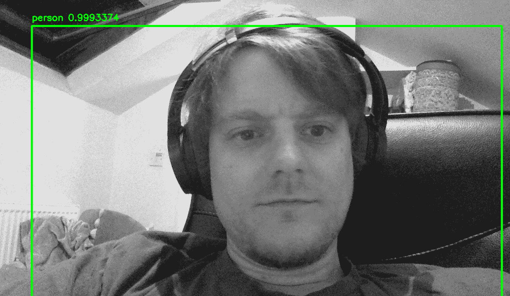

本章讨论视频应用。虽然应用于图像的方法可以应用于单帧视频，但这通常会损失时间一致性。我们将努力在消费类硬件的可能性和足以展示和实现的趣味性之间取得平衡。

当谈论视频时，应该会想到相当多的应用，例如对象跟踪、事件检测(监控)、深度伪造、3D 场景重建和导航(自动驾驶汽车)。

很多都需要数小时或数天的计算。我们将努力在可能性和趣味性之间达成合理的妥协。这种妥协可能比其他章节更能感受到，在其他章节中，计算不像视频那样苛刻。作为妥协的一部分，我们将逐帧处理视频，而不是跨越时间域。不过，和往常一样，我们将通过给出代表实际应用或至少相似的例子来解决问题。

在这一章中，我们将从图像检测开始，算法将图像识别模型应用于图像的不同部分，以定位对象。然后，我们将举例说明如何将其应用于视频提要。然后，我们将使用深度假货模型创建视频，并参考更多相关模型来创建和检测深度假货。

在这一章中，我们将看看下面的食谱:

*   本地化对象
*   伪造视频

# 技术要求

我们将使用许多标准库，包括`keras`和`opencv`，但是在它们变得相关之前，我们将看到更多的库，我们将在每个食谱的开始提到它们。

你可以在 GitHub 的[https://GitHub . com/packt publishing/Artificial-Intelligence-with-Python-Cookbook/tree/master/chapter 08](https://github.com/PacktPublishing/Artificial-Intelligence-with-Python-Cookbook/tree/master/chapter08)找到本章食谱的笔记本。

# 本地化对象

目标检测是指在图像和视频中识别特定类别的目标。例如，在自动驾驶汽车中，为了避免行人和树木，必须对其进行识别。

在这个菜谱中，我们将在 Keras 中实现一个对象检测算法。我们将它应用到一个单一的图像，然后到我们的笔记本电脑相机。*它是如何工作的...*部分，我们将讨论对象检测的理论和更多算法。

## 做好准备

对于这个菜谱，我们需要为**开放计算机视觉库** ( **OpenCV** )和`scikit-image`提供 Python 绑定:

```py
!pip install -U opencv-python scikit-image
```

作为我们的示例图像，我们将从对象检测工具箱下载一个图像:

```py
def download_file(url: str, filename='demo.jpg'):
    import requests
    response = requests.get(url)
    with open(filename, 'wb') as f:
        f.write(response.content)

download_file('https://raw.githubusercontent.com/open-mmlab/mmdetection/master/demo/demo.jpg')
```

请注意，任何其他图像都可以。

我们将使用基于`keras-yolo3`库的代码，只需做一些修改就可以快速设置。我们也可以快速下载:

```py
download_file('https://gist.githubusercontent.com/benman1/51b2e4b10365333f0af34f4839f86f27/raw/991b41e5d5d83174d3d75b55915033550e16adf8/keras-yolo3.py', 'keras_yolo3.py')
```

最后，我们还需要`YOLOv3`网络的权重，可以从 darknet 开源实现下载:

```py
download_file('https://pjreddie.com/media/files/yolov3.weights', 'yolov3.weights')
```

现在，在运行笔记本的本地目录中，您应该已经有了示例图像、`yolo3-keras` Python 脚本和`YOLOv3`网络权重。

## 怎么做...

在本节中，我们将使用 Keras 实现一个对象检测算法。

我们将导入`keras-yolo3`库，加载预训练的权重，然后对给定的图像或来自摄像机的视频进行对象检测:

1.  由于我们已经在`keras-yolo3`脚本中实现了大部分对象检测，我们只需要导入它:

```py
from keras_yolo3 import load_model, detect
```

2.  然后，我们可以用如下的预训练权重加载我们的网络。请注意，权重文件相当大——它们将占用大约 237 MB 的磁盘空间:

```py
yolov3 = load_model('yolov3.weights')
```

我们的模型现在可以作为一个 Keras 模型。

3.  然后，我们可以在示例图像上执行对象检测:

```py
from matplotlib import pyplot as plt

plt.imshow(detect(yolov3, 'demo.jpg'))
```

我们应该看到我们的示例图像标注了每个边界框的标签，如下面的屏幕截图所示:


我们可以使用`OpenCV`库为视频扩展这个。我们可以从连接到我们的计算机上的摄像机逐帧捕捉图像，运行对象检测，并显示带注释的图像。

请注意，这种实现并没有经过优化，可能会运行得相对较慢。对于更快的实现，请参考*中链接的暗网实现，另请参见*部分。

当您运行以下代码时，请注意您可以通过按`q`来停止摄像机:

```py
import cv2
from skimage import color

cap = cv2.VideoCapture(0)

while(True):
    ret, frame = cap.read()

    img = cv2.cvtColor(frame, cv2.COLOR_BGR2RGB)    
    img = detect(yolov3, img)
    cv2.imshow('frame', img)
    if cv2.waitKey(1) & 0xFF == ord('q'):
        break

cap.release()
cv2.destroyAllWindows()
```

我们将图像捕捉为灰度级，但随后必须使用`scikit-image`通过堆叠图像将其转换回 RGB。然后我们检测对象并显示带注释的框架。

这是我们获得的图像:



在下一节，我们将讨论这个食谱和一些背景解释。

## 它是如何工作的...

我们用 Keras 实现了一个物体检测算法。这是一个现成的标准库，但我们将它连接到一个相机，并将其应用于一个示例图像。

图像检测方面的主要算法如下:

*   快速 R-CNN(罗斯·吉斯克，2015 年)
*   **单次多盒探测器**(**SSD**)；刘等人，2015:【https://arxiv.org/abs/1512.02325】
*   **你只看一次**(**YOLO**)；约瑟夫·雷德蒙等人*，*2016:[https://arxiv.org/abs/1506.02640](https://arxiv.org/abs/1506.02640)
*   约洛夫 4(阿列克谢·博奇科夫斯基等人，2020:[https://arxiv.org/abs/2004.10934](https://arxiv.org/abs/2004.10934))

物体检测的主要要求之一是速度——你不会想等撞到树后才认出它。

图像检测基于图像识别，增加了在图像中搜索候选位置的复杂性。

快速 R-CNN 是同一作者(2014)对 R-CNN 的改进。每个感兴趣区域是由边界框定义的矩形图像块，通过图像金字塔进行比例归一化。然后，卷积网络可以通过卷积神经网络的单次前向传递来处理这些对象提议(从几千个到多达几千个)。作为实现细节，快速 R-CNN 利用奇异值分解压缩完全连接的层以提高速度。

YOLO 是一个单一的网络，它在一次评估中直接从图像中提出边界框和类。它比当时的其他检测方法快得多；在他们的实验中，作者以每秒 45 帧和每秒 155 帧的速度运行不同版本的 YOLO。

SSD 是一个单阶段模型，它不需要单独的对象提议生成，而不是选择通过网络传递的一组离散的边界框。然后跨不同分辨率和边界框位置组合预测。

作为旁注，Joseph Redmon 发表并维护了他的 YOLO 架构的几个增量改进，但他已经离开了学术界。然而，Bochkovskiy 和其他人的 YOLO 系列的最新实例也是本着同样的精神，并在 Redmon 的 GitHub 知识库上得到认可:[https://github.com/AlexeyAB/darknet](https://github.com/AlexeyAB/darknet)。

YOLOv4 为他们的 CNN 引入了几个新的网络功能，它们表现出快速的处理速度，同时保持了明显优于 YOLOv3 的准确性水平(对于 MS COCO 数据集，在 Tesla V100 GPU 上以每秒约 65 帧的实时速度，平均精度为 43.5%**(**AP**)。**

 **## 还有更多...

有不同的方式与网络摄像头进行交互，甚至有一些移动应用程序允许您流式传输您的摄像头馈送，这意味着您可以将其插入在云(例如，Colab 笔记本电脑)或服务器上运行的应用程序。

最常见的库之一是`matplotlib`，也可以从网络摄像头实时更新 matplotlib 图形，如以下代码块所示:

```py
%matplotlib notebook
import cv2
import matplotlib.pyplot as plt

def grab_frame(cap):
    ret, frame = cap.read()
    if not ret:
        print('No image captured!')
        exit()
    return cv2.cvtColor(frame, cv2.COLOR_BGR2RGB)

cap = cv2.VideoCapture(0)
fig, ax = plt.subplots(1, 1)
im = ax.imshow(grab_frame(cap))

plt.tick_params(
    top=False, bottom=False, left=False, right=False,
    labelleft=False, labelbottom=False
)
plt.show()

while True:
    try:
        im.set_data(grab_frame(cap))
        fig.canvas.draw()
    except KeyboardInterrupt:
        cap.release()
        break
```

这是启动视频提要的基本模板，并在 matplotlib 子图中显示它。我们可以通过中断内核来停止。

我们将在下一节提到更多的库。

## 请参见

我们建议看看 arxiv:[https://arxiv.org/abs/2004.10934](https://arxiv.org/abs/2004.10934)上的 YOLOv4 论文。

有几个库可用于对象检测:

*   YOLOv4 论文的第一作者正在 https://github.com/AlexeyAB/darknet 维护一个支持对象检测的开源框架 darknet(最初由 Joseph Redmon 开发)。
*   Detectron2 是脸书人工智能研究所的一个库，实现了许多用于物体检测的算法:[https://github.com/facebookresearch/detectron2](https://github.com/facebookresearch/detectron2)。
*   Google 在 TensorFlow 中用于物体检测的实现，包括最近发布的 spine net([https://ai . Google blog . com/2020/06/spine net-novel-architecture-for-object . html](https://ai.googleblog.com/2020/06/spinenet-novel-architecture-for-object.html))，可在 GitHub:[https://GitHub . com/tensor flow/models/tree/master/official/vision/detection](https://github.com/tensorflow/models/tree/master/official/vision/detection)上获得。
*   Valkka Live 是一个开源的 Python 视频监控平台:[https://elsampsa . github . io/valkka-Live/_ build/html/index . html](https://elsampsa.github.io/valkka-live/_build/html/index.html)。
*   MMDetection 是一个开放的检测工具箱，它涵盖了许多流行的检测方法，并带有大约 200 个网络模型的预训练权重:[https://mmdetection.readthedocs.io/en/latest/](https://mmdetection.readthedocs.io/en/latest/)。
*   SpineNet 是一个新的模型，使用大量的超参数探索发现的，用于 TensorFlow 中的对象检测:[https://github . com/tensor flow/models/tree/master/official/vision/detection](https://github.com/tensorflow/models/tree/master/official/vision/detection)。
*   PyTracking 是一个用于对象跟踪和视频对象分割的库，具有许多基于 PyTorch 的强大、先进的模型，可以直接插在网络摄像头输入的顶部:[https://github.com/visionml/pytracking](https://github.com/visionml/pytracking)。
*   PySlowFast 为视频分类和检测任务提供了许多预训练的模型:[https://github.com/facebookresearch/SlowFast](https://github.com/facebookresearch/SlowFast)。
*   用 PyTorch 实现实时手势识别的模型如下:[https://github.com/ahmetgunduz/Real-time-GesRec](https://github.com/ahmetgunduz/Real-time-GesRec)。

让我们进入下一个食谱！

# 伪造视频

深度假货是深度学习的应用产生的被操纵的视频。潜在的不道德使用已经在媒体上出现了一段时间。你可以想象这将如何落入一个试图颠覆政府的宣传机构手中。请注意，我们建议不要出于邪恶的目的生产深度假货。

深度造假技术有一些伦理上的应用，其中一些很有趣。你有没有想过西尔维斯特·史泰龙在《终结者》中的样子？今天你可以！

在这个食谱中，我们将学习如何用 Python 制作一个深度赝品。我们将下载两部电影的公共领域视频，并通过用另一张脸替换一张脸来制作一个深度假货。《猜谜游戏》是 1963 年由斯坦利·多南导演的一部电影，其风格让人想起希区柯克的电影。它将五十多岁的加里·格兰特和三十出头的奥黛丽·赫本配对。我们认为我们应该让这个组合更适合年龄。经过一番搜寻，我们在 1963 年约翰·韦恩的车*麦克林托克中找到了玛琳·奥哈拉！*接替奥黛丽·赫本。

## 做好准备

Faceit 是一个围绕着`faceswap`库的包装器，它简化了我们需要为深度伪造执行的许多任务。我们已经在 https://github.com/benman1/faceiT3 分叉了 faceit 存储库。

我们要做的是下载 faceit 存储库并安装必要的库。

您可以使用`git`下载(`clone`)存储库(如果您在`ipython`笔记本中输入此内容，请添加感叹号):

```py
git clone https://github.com/benman1/faceit
```

我们发现 Docker 容器非常适合安装依赖项(为此，您需要安装 Docker)。我们可以像这样创建一个 Docker 容器:

```py
./dockerbuild.sh
```

这应该需要一段时间来建立。请注意，Docker 映像基于 Nvidia 的容器，因此您可以在容器内使用您的 GPU。

请注意，虽然我们可以使用一个轻量级的模型，但我们强烈建议您在一台配有 GPU 的机器上运行 deep fake。

最后，我们可以如下输入我们的容器:

```py
./dockerrun.sh
```

在容器内部，我们可以运行 Python 3.6。下面所有的命令都假设我们在容器内部和`/project`目录中。

## 怎么做...

我们需要将视频和人脸定义为我们深度造假过程的输入。

1.  我们在 Python (Python 3.6)中这样定义我们的模型:

```py
from faceit import *

faceit = FaceIt('hepburn_to_ohara', 'hepburn', 'ohara')
```

这表明我们希望用`ohara`替换`hepburn`(这是我们在流程中对它们的命名方式)。因此，我们必须将图像放入名为`hepburn.jpg`和`ohara.jpg`的数据/人物`directories`中。为了方便起见，我们将这些图像作为存储库的一部分提供。

如果我们不提供图像，faceit 将提取所有的人脸图像，而不管它们显示的是谁。然后，我们可以为`persons`目录放置两张这样的图片，并删除`data/processed/`下带有面孔的目录。

2.  然后我们需要定义我们想要使用的视频。我们可以选择使用完整的电影或短片。我们没有为*麦克林托克找到好的剪辑！*胶片，所以我们用的是整张胶片。至于*哑谜*，我们已经集中在一个单一场景的剪辑。我们在磁盘上将这些剪辑命名为`mclintock.mp4`和`who_trust.mp4`。

请注意，您应该只从允许或不禁止下载的网站下载视频，即使是公共领域的视频:

```py
faceit.add('ohara', 'mclintock.mp4')
faceit.add('hepburn', 'who_trust.mp4')
FaceIt.add_model(faceit)
```

这将我们的模型使用的数据定义为几个视频。Faceit 允许一个可选的第三个参数，这个参数可以是一个视频链接，可以从这里自动下载。但是，在您从 YouTube 或其他网站下载视频之前，请确保他们的服务条款允许这样做，并且在您的管辖范围内是合法的。

3.  然后，通过多几行代码(以及大量的调整和等待)开始创建深度假货:

```py
faceit.preprocess()
faceit.train()
faceit.convert('who_trust.mp4', face_filter=True, photos=False)
```

预处理步骤包括下载视频，提取所有帧作为图像，最后提取人脸。我们已经提供了面，所以你不必执行预处理步骤。

下图左边是奥黛丽·赫本，右边是玛琳·奥哈拉饰演的奥黛丽·赫本:


这些变化可能看起来很微妙。如果你想要更清楚的东西，我们可以用同样的模型把加里·格兰特换成玛琳·奥哈拉:


事实上，我们可以制作一部电影，*是玛琳·奥哈拉*，通过在转换中禁用面部滤镜。

我们可以使用更先进的模型，更多的训练来提高深度假动作，或者我们可以选择更容易的场景。但是，结果有时候看起来一点都不差。我们已经将我们的假视频上传到 YouTube，你可以在那里观看:[https://youtu.be/vDLxg5qXz4k](https://youtu.be/vDLxg5qXz4k)。

## 它是如何工作的...

典型的深度伪造管道由许多步骤组成，由于 faceit 中提供的抽象，我们在我们的配方中方便地忽略了这些步骤。给定人员 A 和人员 B，这些步骤如下，其中 A 将被 B 替换:

*   选择 A 和 B 的视频，将视频拆分成帧。
*   使用人脸识别从 A 和 B 的这些帧中提取人脸。这些脸，或者说面部表情和面部姿势，应该是你要伪造的视频的理想代表。确保它们没有模糊，没有遮挡，不要显示除 A 和 B 之外的任何人，并且不要太重复。
*   你可以在这些人脸上训练一个可以取 A 面，用 b 面代替的模型，你应该让训练运行一段时间。这可能需要几天，甚至几周或几个月，取决于面的数量和模型的复杂程度。
*   我们现在可以通过运行人脸识别和它上面的模型来转换视频。

在我们的例子中，人脸识别库(`face-recognition`)在检测和识别方面有非常好的表现。然而，它仍然遭受高假阳性，但也有假阴性。这可能会导致糟糕的体验，尤其是在有几个面的帧中。

在当前版本的`faceswap`库中，我们将从目标视频中提取帧，以获得所有人脸对齐的标志。然后，我们可以使用 GUI 来手动检查和清理这些对齐，以确保它们包含正确的面。这些比对将用于转换:[https://forum.faceswap.dev/viewtopic.php?t=27#align](https://forum.faceswap.dev/viewtopic.php?t=27#align)。

这些步骤中的每一步都需要大量的关注。整个运营的核心是模型。可以有不同的模型，包括生成对立自编码器等。faceswap 中的原始模型是一个带有扭曲的自编码器。我们以前在[第 7 章](f386de9e-b56d-4b39-bf36-803860def385.xhtml)、*高级图像应用中使用过自编码器。*这是一个相对传统的方法，我们可以在此基础上实现 autoencoder。然而，为了完整起见，我们将展示它的实现，它基于`keras` / `tensorflow`(简称):

```py
from keras.models import Model
from keras.layers import Input, Dense, Flatten, Reshape
from keras.layers.advanced_activations import LeakyReLU
from keras.layers.convolutional import Conv2D
from keras.optimizers import Adam
from lib.PixelShuffler import PixelShuffler

IMAGE_SHAPE = (64, 64, 3)
ENCODER_DIM = 1024

def conv(self, filters):
    def block(x):
    x = Conv2D(filters, kernel_size=5, strides=2, padding='same')(x)
    x = LeakyReLU(0.1)(x)
    return x
 return block

def upscale(self, filters):
    def block(x):
    x = Conv2D(filters * 4, kernel_size=3, padding='same')(x)
    x = LeakyReLU(0.1)(x)
    x = PixelShuffler()(x)
    return x
 return block

def Encoder():
    input_ = Input(shape=IMAGE_SHAPE)
    x = input_
    x = conv(128)(x)
    x = conv(256)(x)
    x = conv(512)(x)
    x = conv(1024)(x)
    x = Dense(ENCODER_DIM)(Flatten()(x))
    x = Dense(4 * 4 * 1024)(x)
    x = Reshape((4, 4, 1024))(x)
    x = upscale(512)(x)
    return Model(input_, x)

def Decoder():
    input_ = Input(shape=(8, 8, 512))
    x = input_
    x = upscale(256)(x)
    x = upscale(128)(x)
    x = upscale(64)(x)
    x = Conv2D(3, kernel_size=5, padding='same', activation='sigmoid')(x)
    return Model(input_, x)
```

这段代码本身并不十分有趣。我们有两个函数，`Decoder()`和`Encoder()`，它们分别返回解码器和编码器模型。这是一个带卷积的编码器-解码器架构。解码器升级操作中的`PixelShuffle`层通过排列将深度数据重新排列成空间数据块。

现在，autoencoder 更有趣的部分是如何以两种模式执行训练:

```py
optimizer = Adam(lr=5e-5, beta_1=0.5, beta_2=0.999)
x = Input(shape=IMAGE_SHAPE)

encoder = Encoder()
decoder_A, decoder_B = Decoder(), Decoder()
autoencoder_A = Model(x, decoder_A(encoder(x)))
autoencoder_B = Model(x, decoder_B(encoder(x)))

autoencoder_A.compile(optimizer=optimizer, loss='mean_absolute_error')
autoencoder_B.compile(optimizer=optimizer, loss='mean_absolute_error')
```

我们有两个自编码器，一个用于训练`A`人脸，一个用于训练`B`人脸。两个自编码器都最小化输出对输入的重构误差(以平均绝对误差测量)。如上所述，我们有一个单独的编码器，它构成了两个模型的一部分，因此将在人脸`A`和人脸`B`上进行训练。解码器模型在两个面之间保持分离。这个架构确保了我们在`A`和`B`人脸之间有一个共同的潜在表示。在转换中，我们可以从`A`中取出一个面，表示它，然后对`B`应用解码器，以便得到一个对应于潜在表示的`B`面。

## 请参见

我们收集了一些与视频和深度假货以及检测深度假货相关的进一步参考资料。

### 深度假货

我们整理了一些与深层假货相关的链接，以及一些与制造深层假货的过程相关的链接。

面部识别库已经在该配方中被用于选择图像区域用于训练和应用变换。它可以在 https://github.com/ageitgey/face_recognition 的 GitHub 上获得。

有一些简单的视频伪造应用的好例子:

*   OpenCV 遮罩可用于选择性地操作图像的部分，例如，用于隐身衣:[https://www . geeks forgeeks . org/invisible-coat-using-OpenCV-python-project/](https://www.geeksforgeeks.org/invisible-cloak-using-opencv-python-project/)。
*   类似的努力还包括根据检测到的面部标志添加胡子:[http://sublimerobots.com/2015/02/dancing-mustaches/](http://sublimerobots.com/2015/02/dancing-mustaches/)。

至于更复杂的带有深度假像的视频操作，有相当多的工具可用，我们将重点介绍其中的两个:

*   faceswap 库有一个 GUI，甚至还有一些向导:[https://github.com/deepfakes/faceswap](https://github.com/deepfakes/faceswap)。
*   DeepFaceLab 是一个创建深度假货的 GUI 应用:[https://github.com/iperov/DeepFaceLab](https://github.com/iperov/DeepFaceLab)。

已经提出并实施了许多不同的模型，包括:

*   **重演甘***——学习通过边界转移重演人脸* (2018，[https://arxiv.org/abs/1807.11079](https://arxiv.org/abs/1807.11079))
    *   正式实施:[https://github.com/wywu/ReenactGAN](https://github.com/wywu/ReenactGAN)。
*   **disco gan***–*Taeksoo Kim 等人，*学习用生成对抗网络发现跨域关系* (2017，[https://arxiv.org/abs/1703.05192](https://arxiv.org/abs/1703.05192))
    *   在这里为现场视频演示:[https://github.com/ptrblck/DiscoGAN](https://github.com/ptrblck/DiscoGAN)。
*   这里可以看到一个去噪的对抗性自编码器，它具有用于面部交换的注意机制:[https://github.com/shaoanlu/faceswap-GAN](https://github.com/shaoanlu/faceswap-GAN)。

faceit live repository([https://github.com/alew3/faceit_live](https://github.com/alew3/faceit_live))是 face it 的一个分支，可以对直播视频进行操作，并附带一个黑客，可以将视频反馈给视频会议中的恶作剧参与者。

### 检测深层假货

以下链接与检测深层假货相关:

*   https://github.com/592McAvoy/fake-face-detection 收集了很多关于检测深层假货的链接。
*   特别感兴趣的是通过对抗性攻击的检测，可以在这里找到:[https://github.com/natanielruiz/disrupting-deepfakes](https://github.com/natanielruiz/disrupting-deepfakes)。
*   谷歌、谷歌拼图、慕尼黑工业大学和那不勒斯的费德里科二世大学为检测算法的研究提供了一个广泛的深度假货数据集:[https://github.com/ondyari/FaceForensics/](https://github.com/ondyari/FaceForensics/)。

论文*deep fakes and Beyond:A Survey of**人脸操纵和假货检测* (Ruben Tolosana 等人，2020 年)提供了更多的数据集和方法的链接和资源。**