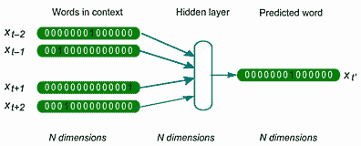
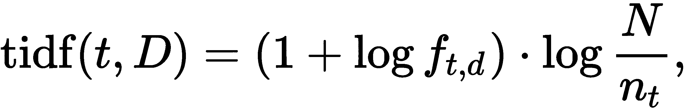
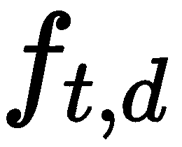
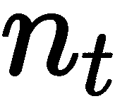
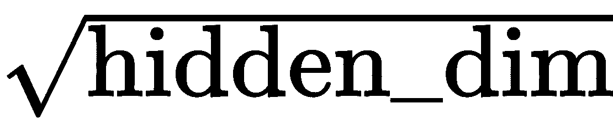
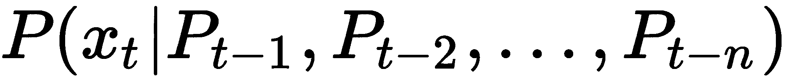

**自然语言处理** ( **NLP** )是关于分析文本和设计算法来处理文本，从文本中做出预测，或者生成更多的文本。NLP 涵盖了与语言相关的任何东西，通常包括类似于我们在*R*中看到的语音识别语音命令方法[第 9 章](270a18b0-4bf4-4bb3-8c39-a9bab3fe38e1.xhtml)、*音频和语音深度学习*。对于更传统的方法，您可能还想参考[第 2 章](bca59029-1915-4856-b47d-6041d7b10a0a.xhtml)、*监督机器学习的高级主题*中的*对抗算法偏差*方法，或者[第 3 章](424f3988-2d11-4098-9c52-beb685a6ed27.xhtml)、*模式、异常值和建议*中的*代表相似性搜索*方法。本章的大部分内容将涉及近年来突破背后的深度学习模型。

语言通常被视为与人类智能有着内在联系，掌握通信能力的机器长期以来被视为与实现**人工通用智能** ( **AGI** )的目标紧密交织在一起。艾伦·图灵在他 1950 年的文章*计算机器和智能*中，提出了一个测试，此后被称为**图灵测试**，在这个测试中，审讯者必须找出他们的对话者(在不同的房间)是计算机还是人。然而，有人认为，成功地欺骗审讯者认为他们正在与人类打交道并不是真正理解(或智力)的证明，而是操纵符号的证明(中文房间争论**；约翰·塞尔，《心智、大脑和程序》，1980 年。无论是哪种情况，近年来，随着 GPU 等并行计算设备的出现，NLP 在许多基准测试中取得了令人印象深刻的进展，例如，在文本分类方面:[http://nlpprogress.com/english/text_classification.html](http://nlpprogress.com/english/text_classification.html)。**

 **我们将首先做一个简单的监督任务，确定段落的情感，然后我们将设置一个 Alexa 风格的聊天机器人来响应命令。接下来，我们将使用序列到序列模型翻译文本。最后，我们将尝试使用最先进的文本生成模型来编写一本流行的小说。

在这一章中，我们将做这些食谱:

*   新闻组分类
*   与用户聊天
*   将文本从英语翻译成德语
*   写一本流行小说

# 技术要求

如同到目前为止的大多数章节一样，我们将尝试 PyTorch 和基于 TensorFlow 的模型。我们将在每个配方中应用不同的、更专门化的库。

和往常一样，你可以在 GitHub 上找到食谱笔记本:[https://GitHub . com/packt publishing/Artificial-Intelligence-with-Python-Cookbook/tree/master/chapter 10](https://github.com/PacktPublishing/Artificial-Intelligence-with-Python-Cookbook/tree/master/chapter10)。

# 新闻组分类

在这个食谱中，我们将做一个相对简单的监督任务:基于文本，我们将训练一个模型，从一系列主题中确定一篇文章是关于什么的。这是 NLP 的一个相对常见的任务；我们将尝试给出处理这一问题的不同方法的概述。

你可能还想比较*对抗算法偏差*的方法在[第二章](bca59029-1915-4856-b47d-6041d7b10a0a.xhtml)、*监督机器学习的高级主题*中，关于如何使用词汇袋方法(scikit-learn 中的`CountVectorizer`)来处理这个问题。在这个食谱中，我们将使用单词嵌入的方法和使用单词嵌入的深度学习模型。

## 做好准备

在这个食谱中，我们将使用 scikit-learn 和 TensorFlow (Keras)，就像本书中的许多其他食谱一样。此外，我们将使用必须下载的单词嵌入，并且我们将使用 Gensim 库中的实用函数将它们应用到我们的机器学习管道中:

```py
!pip install gensim
```

我们将使用来自 scikit-learn 的数据集，但是我们仍然需要下载单词 embeddings。我们将使用脸书在维基百科上训练的 fastText 单词嵌入:

```py
!pip install wget
import wget
wget.download(
    'https://dl.fbaipublicfiles.com/fasttext/vectors-wiki/wiki.en.vec',
    'wiki.en.vec'
)
```

请注意，下载可能需要一段时间，大约需要 6 GB 的磁盘空间。如果你在 Colab 上运行，你可能想把嵌入文件放到你的 Google Drive 的一个目录中，这样当你重启笔记本的时候你就不用再下载它了。

## 怎么做...

新闻组数据集是大约 20，000 个新闻组文档的集合，分为 20 个不同的组。20 个新闻组集合是一个流行的数据集，用于测试 NLP 中的机器学习技术，如文本分类和文本聚类。

我们将把选定的新闻组分类为三个不同的主题，我们将用三种可以比较的不同技术来完成这项任务。我们将首先获得数据集，然后应用词袋技术，使用词嵌入，在深度学习模型中训练定制的词嵌入。

首先，我们将使用 scikit-learn 功能下载数据集。我们将分两批下载新组数据集，分别用于训练和测试:

```py
from sklearn.datasets import fetch_20newsgroups

categories = ['alt.atheism', 'soc.religion.christian', 'comp.graphics', 'sci.med']
twenty_train = fetch_20newsgroups(
    subset='train',
    categories=categories,
    shuffle=True,
    random_state=42
  )
twenty_test = fetch_20newsgroups(
    subset='test',
    categories=categories,
    shuffle=True,
    random_state=42
)
```

这为我们提供了训练和测试数据集，我们可以在这三种方法中使用它们。

让我们从第一个开始，使用词汇袋方法。

### 词汇袋

我们将建立一个计算单词的管道，并根据它们的频率重新加权。最终的分类器是一个随机森林。我们在我们的训练数据集上对此进行训练:

```py
import numpy as np
from sklearn.pipeline import Pipeline
from sklearn.feature_extraction.text import CountVectorizer
from sklearn.feature_extraction.text import TfidfTransformer
from sklearn.ensemble import RandomForestClassifier

text_clf = Pipeline([
  ('vect', CountVectorizer()),
  ('tfidf', TfidfTransformer()),
  ('clf', RandomForestClassifier()),
])
text_clf.fit(twenty_train.data, twenty_train.target)
```

`CountVectorizer`计算文本中的标记，`tfidfTransformer`重新计算计数。我们将在*中讨论**术语频率-逆文档频率** ( **TFIDF** )重新加权是如何工作的...*一节。

训练结束后，我们可以在测试数据集上测试准确性:

```py
predicted = text_clf.predict(twenty_test.data)
np.mean(predicted == twenty_test.target)
```

我们得到大约 0.805 的精确度。让我们看看我们的其他两个方法会如何。接下来是使用单词嵌入。

### 单词嵌入

我们将加载之前下载的单词嵌入:

```py
from gensim.models import KeyedVectors

model = KeyedVectors.load_word2vec_format(
    'wiki.en.vec',
    binary=False, encoding='utf8'
)
```

对几个单词的文本进行矢量化的最直接的策略是对单词间的单词嵌入进行平均。对于短文本来说，这通常至少相当有效:

```py
import numpy as np
from tensorflow.keras.preprocessing.text import text_to_word_sequence

def embed_text(text: str):
  vector_list = [
    model.wv[w].reshape(-1, 1) for w in text_to_word_sequence(text)
    if w in model.wv
  ]
  if len(vector_list) > 0:
    return np.mean(
        np.concatenate(vector_list, axis=1),
        axis=1
    ).reshape(1, 300)
  else:
   return np.zeros(shape=(1, 300))

assert embed_text('training run').shape == (1, 300)
```

我们将把这种矢量化应用到我们的数据集，然后在这些矢量的基础上训练一个随机森林分类器:

```py
train_transformed = np.concatenate(
    [embed_text(t) for t in twenty_train.data]
)
rf = RandomForestClassifier().fit(train_transformed, twenty_train.target)
```

然后，我们可以测试我们方法的性能:

```py
test_transformed = np.concatenate(
    [embed_text(t) for t in twenty_test.data]
)
predicted = rf.predict(test_transformed)
np.mean(predicted == twenty_test.target)
```

我们得到了大约 0.862 的精度。

让我们看看最后一个方法是否比这个更好。我们将使用 Keras 的嵌入层构建定制的单词嵌入。

### 自定义单词嵌入

嵌入层是在神经网络中动态创建定制单词嵌入的一种方式:

```py
from tensorflow.keras import layers

embedding = layers.Embedding(
    input_dim=5000, 
    output_dim=50, 
    input_length=500
)
```

我们必须告诉嵌入层你想要存储多少个单词，你的单词嵌入应该有多少个维度，每个文本中有多少个单词。我们输入整数数组，每个数组都引用字典中的单词。我们可以将为嵌入层创建输入的工作委托给 TensorFlow 实用函数:

```py
from tensorflow.keras.preprocessing.text import Tokenizer

tokenizer = Tokenizer(num_words=5000)
tokenizer.fit_on_texts(twenty_train.data)
```

这将创建字典。现在我们需要将文本和填充序列标记为正确的长度:

```py
from tensorflow.keras.preprocessing.sequence import pad_sequences

X_train = tokenizer.texts_to_sequences(twenty_train.data)
X_test = tokenizer.texts_to_sequences(twenty_test.data)
X_train = pad_sequences(X_train, padding='post', maxlen=500)
X_test = pad_sequences(X_test, padding='post', maxlen=500)
```

现在我们准备建立我们的神经网络:

```py
from tensorflow.keras.models import Sequential
from tensorflow.keras.losses import SparseCategoricalCrossentropy
from tensorflow.keras import regularizers

model = Sequential()
model.add(embedding)
model.add(layers.Flatten())
model.add(layers.Dense(
    10,
    activation='relu',
    kernel_regularizer=regularizers.l1_l2(l1=1e-5, l2=1e-4)
))
model.add(layers.Dense(len(categories), activation='softmax'))
model.compile(optimizer='adam',
              loss=SparseCategoricalCrossentropy(),
              metrics=['accuracy'])
model.summary()
```

我们的模型包含 50 万个参数。其中大约一半位于嵌入层，另一半位于前馈全连接层。

我们让网络适应几个时期，然后我们可以在测试数据上测试我们的准确性:

```py
model.fit(X_train, twenty_train.target, epochs=10)
predicted = model.predict(X_test).argmax(axis=1)
np.mean(predicted == twenty_test.target)
```

我们得到大约 0.902 的精度。我们还没有调整模型架构。

我们使用单词包、预训练单词嵌入和自定义单词嵌入的新闻组分类到此结束。我们现在来了解一些背景知识。

## 它是如何工作的...

我们已经基于三种不同的特征化方法对文本进行了分类:单词包、预训练单词嵌入和自定义单词嵌入。让我们简单地研究一下单词嵌入和 TFIDF。

我们已经在[第 5 章](146f9a36-b2f6-4853-9fed-229537c08052.xhtml)、*启发式搜索技术和逻辑推理*(在嵌入 Walklets 小节的*图中)的*基于知识做出决策*配方中谈到了 Skipgram 和**连续单词包** ( **CBOW** )算法。*

简而言之，单词向量是一个简单的机器学习模型，可以根据上下文预测下一个单词(CBOW 算法)，也可以根据单个单词预测上下文(Skipgram 算法)。我们快速看一下 CBOW 神经网络。

### CBOW 算法

CBOW 算法是一个两层前馈神经网络，它根据上下文预测单词(更确切地说，是稀疏索引向量):



此图显示了在 CBOW 模型中，如何根据周围的上下文预测单词。这里，单词被表示为单词包向量。隐藏层由上下文的加权平均值(线性投影)组成。输出字是基于隐藏层的预测。这是改编自法语维基百科上关于单词嵌入的图片:[https://fr.wikipedia.org/wiki/Word_embedding](https://fr.wikipedia.org/wiki/Word_embedding)。

我们还没有谈到的是这些单词嵌入的含义，它们一出来就引起了如此大的轰动。嵌入是一个单词的网络激活，它们有一个复合属性，为许多演讲和一些论文提供了标题。我们可以结合向量做语义代数或者做类比。这方面最著名的例子如下:


直觉上，国王和王后是相似的社会地位，只是一个由男人占据，另一个由女人占据。这一点体现在数十亿字上学习到的嵌入空间。从国王的向量开始，减去男人的向量，最后加上女人的向量，我们最后得到的最接近的词是女王。

嵌入空间可以告诉我们很多关于我们如何使用语言的信息，其中一些有点令人担忧，例如当词向量表现出性别刻板印象时:


这实际上可以通过仿射变换在一定程度上得到纠正，正如托尔加·博鲁克巴斯和其他人所展示的那样？去偏置词嵌入，2016；【https://arxiv.org/abs/1607.06520】[。](https://arxiv.org/abs/1607.06520)

让我们快速看一下在这个食谱的单词袋方法中使用的重新加权。

### TFIDF

在*单词袋*部分，我们用`CountVectorizer`来统计单词。这给了我们一个向量，其中是词汇表中的单词数。在`transform()`能够基于词汇中记号(单词)的位置创建(稀疏)向量之前，必须在`CountVectorizer`的`fit()`阶段创建词汇。

通过对多个文档应用`CountVectorizer`，我们得到形状为的稀疏矩阵，其中是语料库(文档的集合)，而是文档的数量。这个矩阵中的每个位置说明了某个标记在文档中出现的次数。在这个配方中，一个令牌对应一个单词，然而，它同样可以是一个字符或任何字符的集合。

一些单词可能出现在每个文档中；其他的可能只出现在一小部分文档中，表明它们更加具体和精确。这是 TFIDF 的直觉，如果语料库(文档集合)中的词频很低，计数(矩阵中的列)的重要性就会提高。

给定一组文档的术语的逆术语定义如下:



这里的是一个文档中一个术语的计数，是出现的文档数。您应该会看到 TFIDF 值随着减少。当一个术语出现在更多的文档中时，对数和 TFIDF 值接近 0。

在本章的下一个食谱中，我们将超越单个单词的编码，研究更复杂的语言模型。

## 还有更多...

我们将简要介绍使用 Gensim 学习自己的单词嵌入，构建更复杂的深度学习模型，以及在 Keras 中使用预训练的单词嵌入:

1.  我们可以很容易地在 Gensim 中的文本上训练我们自己的单词嵌入。

让我们读入一个文本文件，以便将其作为 fastText 的训练数据集:

```py
from gensim.utils import tokenize
from gensim.test.utils import datapath

class FileIter(object):
  def __init(self, filepath: str):
    self.path = datapath(filepath)

  def __iter__(self):
    with utils.open(self.path, 'r', encoding='utf-8') as fin:
      for line in fin:
        yield list(tokenize(line))
```

这对于迁移学习、搜索应用程序或者学习嵌入需要很长时间的情况非常有用。使用 Gensim，这只是几行代码(改编自 Gensim 文档)。

培训本身很简单，而且因为我们的文本文件很小，所以相对较快:

```py
from gensim.models import FastText

model = FastText(size=4, window=3, min_count=1)
model.build_vocab(
  sentences=FileIter(
    'crime-and-punishment.txt'
))
model.train(sentences=common_texts, total_examples=len(common_texts), epochs=10)
```

你可以在古腾堡计划找到*罪与罚*小说，那里有更多经典小说:【http://www.gutenberg.org/ebooks/2554】T2。

您可以从训练好的模型中检索向量，如下所示:

```py
model.wv['axe']
```

Gensim 附带了许多功能，我们建议您通读一下它的一些文档。

2.  建立更复杂的深度学习模型:对于更困难的问题，我们可以在嵌入的顶部使用堆叠的`conv1d`层，如下所示:

```py
x = Conv1D(128, 5, activation='relu')(embedded_sequences)
x = MaxPooling1D(5)(x)
```

卷积层的参数很少，这是使用它们的另一个优势。

3.  在 Keras 模型中使用预训练的单词嵌入:如果我们想要使用下载的(或之前定制的单词嵌入)，我们也可以这样做。我们首先需要创建一个字典，在加载它们之后，我们可以很容易地自己完成，例如，使用 Gensim:

```py
word_index = {i: w for i, w in enumerate(model.wv.vocab.keys())}
```

然后，我们可以将这些向量送入嵌入层:

```py
from tensorflow.keras.layers import Embedding

embedding_layer = Embedding(
    len(word_index) + 1,
    300,
    weights=[list(model.wv.vectors)],
    input_length=500,
    trainable=False
)
```

为了训练和测试，你必须通过在我们的新字典中查找来输入单词索引，并填充到和我们以前一样的长度。

我们对新闻组进行分类的方法到此结束。我们应用了三种不同类型的特征化:单词袋、预训练单词嵌入和简单神经网络中的自定义单词嵌入。

## 请参见

我们在这个食谱中使用了单词嵌入。已经引入了许多不同的嵌入方法，并且已经发布了相当多的单词嵌入矩阵，它们是在来自数百万个文档的数千亿个单词上训练的。如果在租来的硬件上进行这种大规模的培训，成本可能高达数十万美元。最流行的单词嵌入如下:

*   手套:[https://nlp.stanford.edu/projects/glove/](https://nlp.stanford.edu/projects/glove/)
*   fastText: [https://fasttext.cc/docs/en/crawl-vectors.html](https://fasttext.cc/docs/en/crawl-vectors.html)
*   word 2 vec:[https://code.google.com/archive/p/word2vec/](https://code.google.com/archive/p/word2vec/)

处理单词嵌入的常用库有:

*   根西姆:[https://radimrehurek.com/gensim/](https://radimrehurek.com/gensim/)
*   fastText: [https://fasttext.cc/](https://fasttext.cc/)
*   空间:https://spacy.io/

`Kashgari`是一个构建在 Keras 之上的库，用于文本标记和文本分类，包括 Word2vec 和更高级的模型，如 BERT 和 GPT2 语言嵌入:[https://github.com/BrikerMan/Kashgari](https://github.com/BrikerMan/Kashgari)。

拥抱脸变压器库([https://github.com/huggingface/transformers](https://github.com/huggingface/transformers))包括许多先进的架构和预训练的权重，用于许多可用于文本嵌入的变压器模型。这些模型可以在许多 NLP 任务中实现最先进的性能。例如，像 Google 这样的公司已经将他们的许多语言应用程序转移到了 BERT 架构中。我们将在本章的*将文本从英语翻译成德语*中学习更多关于变压器架构的知识。

fast.ai 用 PyTorch 提供深度学习的教程和课程简编；它还包括许多关于自然语言处理的资源:[https://nlp.fast.ai/](https://nlp.fast.ai/)。

最后，在 NLP 中，在分类任务中经常会有数千甚至数百万个不同的标签。这被称为**极端多标签** ( **XML** )场景。你可以在这里找到关于 XML 的笔记本教程:[https://github . com/ppontisso/Extreme-Multi-Label-Classification](https://github.com/ppontisso/Extreme-Multi-Label-Classification)。

# 与用户聊天

1966 年，Joseph Weizenbaum 发表了一篇关于他的聊天机器人 ELIZA 的文章，名为*ELIZA——一个用于研究人和机器之间自然语言交流的计算机程序*。聊天机器人以幽默感来展示技术的局限性，它采用简单的规则和模糊的开放式问题，作为一种在对话中给人以移情理解的印象的方式，这是一种讽刺的转折，通常被视为人工智能的里程碑。这个领域一直在发展，今天，人工智能助理就在我们身边:你可能有 Alexa、谷歌 Echo 或市场上其他任何商业家庭助理。

在这个食谱中，我们将构建一个人工智能助手。这样做的困难在于，人们有无限多的方式来表达自己，而预测用户可能会说的每一句话是根本不可能的。在这个食谱中，我们将训练一个模型来推断他们想要什么，我们将相应地做出反应。

## 做好准备

对于这个食谱，我们将使用一个由法里兹·拉赫曼开发的叫做 **Eywa** 的框架。我们将用 GitHub 的`pip`安装它:

```py
!pip install git+https://www.github.com/farizrahman4u/eywa.git
```

Eywa 拥有对话代理的主要功能，我们可以查看它的代码，了解其功能背后的一些建模。

我们还将通过`pyOWM`库使用 OpenWeatherMap Web API，因此我们也将安装这个库:

```py
!pip install pyOWM
```

有了这个库，作为聊天机器人功能的一部分，我们可以请求天气数据来响应用户的请求。如果你想在你自己的聊天机器人中使用这个，你应该注册一个免费的用户账户，并在[OpenWeatherMap.org](https://openweathermap.org/)上获得你的 API 密匙，每天最多可以有 1000 个请求。

让我们看看如何实现这一点。

## 怎么做...

我们的代理将处理用户的句子，解释它们，并做出相应的响应。它将首先预测用户查询的意图，然后提取实体，以便更准确地了解查询的内容，然后返回答案:

1.  让我们从意图类开始——基于每个短语的几个样本，我们将定义意图，如`greetings`、`taxi`、`weather`、`datetime`和`music`:

```py
from eywa.nlu import Classifier

CONV_SAMPLES = {
    'greetings' : ['Hi', 'hello', 'How are you', 'hey there', 'hey'],
    'taxi' : ['book a cab', 'need a ride', 'find me a cab'],
    'weather' : ['what is the weather in tokyo', 'weather germany',
                   'what is the weather like in kochi',
                   'what is the weather like', 'is it hot outside'],
    'datetime' : ['what day is today', 'todays date', 'what time is it now',
                   'time now', 'what is the time'],
    'music' : ['play the Beatles', 'shuffle songs', 'make a sound']
}

CLF = Classifier()
for key in CONV_SAMPLES:
    CLF.fit(CONV_SAMPLES[key], key)
```

我们已经创建了一个基于对话样本的分类器。我们可以使用下面的代码块快速测试这是如何工作的:

```py
print(CLF.predict('will it rain today')) # >>> 'weather'
print(CLF.predict('play playlist rock n\'roll')) # >>> 'music'
print(CLF.predict('what\'s the hour?')) # >>> 'datetime'
```

我们可以成功地预测所需的动作是关于天气、酒店预订、音乐还是关于时间。

2.  下一步，我们需要了解是否有更具体的意图，例如伦敦的天气与纽约的天气，或者播放披头士与 Kanye West。为此我们可以使用`eywa`实体提取:

```py
from eywa.nlu import EntityExtractor

X_WEATHER = [
  'what is the weather in tokyo',
  'weather germany',
  'what is the weather like in kochi'
]
Y_WEATHER = [
  {'intent': 'weather', 'place': 'tokyo'},
  {'intent': 'weather', 'place': 'germany'},
  {'intent': 'weather', 'place': 'kochi'}
]

EX_WEATHER = EntityExtractor()
EX_WEATHER.fit(X_WEATHER, Y_WEATHER)
```

这是为了查看天气预报的具体地点。我们还可以测试天气的实体提取:

```py
EX_WEATHER.predict('what is the weather in London')
```

我们请求伦敦的天气，事实上，我们的实体提取成功地返回了地名:

```py
{'intent': 'weather', 'place': 'London'}
```

3.  我们还需要编写对话代理的功能代码，比如查找天气预报。让我们首先做一个天气请求:

```py
from pyowm import OWM

mgr = OWM('YOUR-API-KEY').weather_manager()

def get_weather_forecast(place):
    observation = mgr.weather_at_place(place)
    return observation.get_weather().get_detailed_status()

print(get_weather_forecast('London'))
```

我们可以使用 Python OpenWeatherMap 库(`pyOWM`)请求给定位置的天气预报。使用`London`作为参数调用新函数`get_weather_forecast()`,在撰写本文时会产生如下结果:

```py
overcast clouds
```

请注意，如果您想执行此操作，您需要使用自己的(免费)OpenWeatherMap API 密钥。

没有问候和日期的聊天机器人是不完整的:

```py
X_GREETING = ['Hii', 'helllo', 'Howdy', 'hey there', 'hey', 'Hi']
Y_GREETING = [{'greet': 'Hii'}, {'greet': 'helllo'}, {'greet': 'Howdy'},
              {'greet': 'hey'}, {'greet': 'hey'}, {'greet': 'Hi'}]
EX_GREETING = EntityExtractor()
EX_GREETING.fit(X_GREETING, Y_GREETING)

X_DATETIME = ['what day is today', 'date today', 'what time is it now', 'time now']
Y_DATETIME = [{'intent' : 'day', 'target': 'today'}, {'intent' : 'date', 'target': 'today'},
              {'intent' : 'time', 'target': 'now'}, {'intent' : 'time', 'target': 'now'}]

EX_DATETIME = EntityExtractor()
EX_DATETIME.fit(X_DATETIME, Y_DATETIME)
```

4.  让我们基于分类器和实体提取创建一些交互。我们将编写一个响应函数，它可以问候、告知日期并给出天气预报:

```py
_EXTRACTORS = {
  'taxi': None,
  'weather': EX_WEATHER,
  'greetings': EX_GREETING,
  'datetime': EX_DATETIME,
  'music': None
}
```

我们省略了呼叫出租车或播放音乐的功能:

```py
import datetime

_EXTRACTORS = {
  'taxi': None,
  'weather': EX_WEATHER,
  'greetings': EX_GREETING,
  'datetime': EX_DATETIME,
  'music': None
}

def question_and_answer(u_query: str):
    q_class = CLF.predict(u_query)
    print(q_class)
    if _EXTRACTORS[q_class] is None:
      return 'Sorry, you have to upgrade your software!'

    q_entities = _EXTRACTORS[q_class].predict(u_query)
    print(q_entities)
    if q_class == 'greetings':
      return q_entities.get('greet', 'hello')

    if q_class == 'weather':
      place = q_entities.get('place', 'London').replace('_', ' ')
      return 'The forecast for {} is {}'.format(
          place,
          get_weather_forecast(place)
      )

    if q_class == 'datetime':
      return 'Today\'s date is {}'.format(
          datetime.datetime.today().strftime('%B %d, %Y')
      )

    return 'I couldn\'t understand what you said. I am sorry.'
```

`question_and_answer()`函数回答用户的查询。

如果我们向代理询问以下问题，我们现在可以与代理进行有限的对话:

```py
while True:
    query = input('\nHow can I help you?')
    print(question_and_answer(query))
```

这就结束了我们的食谱。我们实现了一个简单的聊天机器人，它首先预测意图，然后提取实体。基于意图和实体，基于规则回答用户查询。

你应该能够询问不同地方的日期和天气，然而，如果你询问出租车或音乐，它会告诉你升级你的软件。如果您有兴趣，您应该能够自己实现和扩展这个功能。

## 它是如何工作的...

我们已经为基本任务实现了一个非常简单但有效的聊天机器人。应该清楚这如何能被扩展和定制用于更多或其他任务。

在我们开始之前，先来看看这个食谱介绍中提到的 ELIZA chatbot 可能会有意思。这将有望阐明我们需要哪些改进来理解更广泛的语言。

伊莱扎是怎么工作的？

### 伊莱扎

简介中提到的原始 ELIZA 有许多语句-响应对，如下所示:

```py
[r'Is there (.*)', [
    "Do you think there is %1?",
    "It's likely that there is %1.",
    "Would you like there to be %1?"
]],
```

给定正则表达式的一个匹配，随机选择一个可能的响应，而动词在必要时被转换，包括缩写，使用这样的逻辑，例如:

```py
 gReflections = {
  #...
  "i'd" : "you would",
}
```

以下是 Jez Higgins 在 GitHub 上发表的《ELIZA knock-off》的摘录:[https://github.com/jezhiggins/eliza.py](https://github.com/jezhiggins/eliza.py)。

可悲的是，呼叫中心的经历可能看起来很相似。他们还经常使用脚本，如下所示:

“谢谢您的来电，我叫 _。今天我能为你做些什么？”

...

“今天，您还有什么其他问题或顾虑需要我帮忙吗？”

虽然对于机器来说，在开始时，硬编码一些规则更容易，但如果您想处理更复杂的问题，您将构建解释意图和引用(如位置)的模型。

### 伊娃！伊娃

对话代理框架 Eywa 有三个主要功能:

*   **分类器**——从几个选项中决定用户输入属于哪一类
*   **实体提取器**——从句子中提取命名实体
*   **模式匹配**–基于词性和语义的变量匹配

这三个工具使用起来都非常简单，尽管功能非常强大。我们已经在*如何实现中看到了前两个功能...*一节。让我们看看基于语义上下文的食物类型的模式匹配:

```py
from eywa.nlu import Pattern

p = Pattern('I want to eat [food: pizza, banana, yogurt, kebab]')
p('i\'d like to eat sushi')
```

我们用样本值创建一个可变食物:`pizza`、`banana`、`yogurt`和`kebab`。在相似的上下文中使用食物术语将符合我们的变量。该表达式应返回以下内容:

```py
{'food' : 'sushi'}
```

这种用法看起来非常类似于正则表达式，然而，正则表达式是基于单词及其词法的，`eywa.nlu.Pattern`在语义上工作，锚定在单词嵌入中。

一个**正则表达式**(简称:regex)是一个定义搜索模式的字符序列。它首先由史蒂文·克莱尼形式化，并由 Ken Thompson 等人在 20 世纪 60 年代在诸如 QED、ed、grep 和 sed 等 Unix 工具中实现。这种语法已经进入 POSIX 标准，因此有时被称为 **POSIX 正则表达式**。20 世纪 90 年代后期，Perl 编程语言出现了一个不同的标准，称为 **Perl 兼容正则表达式** ( **PCRE** )，它已经被不同的编程语言采用，包括 Python。

这些模型是如何工作的？

首先，`eywa`库依赖于 explosion.ai 中的 sense2vec 单词嵌入，Sense2vec 单词嵌入是由 Andrew Trask 等人引入的(*Sense 2 vec——一种快速准确的神经单词嵌入中的词义消歧方法*，2015)。这个想法被 explosion.ai 采纳，他在 Reddit 讨论上训练了词性消歧词嵌入。你可以在 explosion.ai 网站上了解这些:[https://explosion.ai/blog/sense2vec-reloaded](https://explosion.ai/blog/sense2vec-reloaded)。

分类器检查存储的会话项目，并基于这些嵌入挑选出具有最高相似性得分的匹配。请注意`eywa`有另一个基于循环神经网络的模型实现。

## 请参见

有大量的库和框架可以用来创建具有不同想法和集成的聊天机器人:

*   ParlAI 是一个用于训练和测试对话模型的库。它有 80 多个现成的对话数据集，还集成了 Facebook Messenger 和 Mechanical Turk:[https://github.com/facebookresearch/ParlAI](https://github.com/facebookresearch/ParlAI)。

*   英伟达有自己的对话式人工智能应用工具包，并附带许多模块，提供额外的功能，如自动语音识别和语音合成:[https://github.com/NVIDIA/NeMo](https://github.com/NVIDIA/NeMo)。
*   Google Research 开源了他们开放域对话系统的代码:[https://github . com/Google-Research/Google-Research/tree/master/meena](https://github.com/google-research/google-research/tree/master/meena)。
*   Rasa 整合了每次互动的反馈来改进聊天机器人:[https://rasa.com/](https://rasa.com/)。
*   基于空间的图书馆:https://spacy.io/universe/project/Chatterbot。

# 将文本从英语翻译成德语

在这个菜谱中，我们将从头开始实现一个 transformer 网络，并训练它完成从英语到德语的翻译任务。*它是如何工作的...*部分，我们将讨论许多细节。

## 做好准备

我们建议使用带有 **GPU** 的机器。强烈推荐 Colab 环境，但是，请确保您使用的是启用了 GPU 的运行时。如果您想检查您是否有权访问 GPU，您可以调用 NVIDIA 系统管理界面:

```py
!nvidia-smi
```

您应该会看到类似这样的内容:

```py
Tesla T4: 0MiB / 15079MiB
```

这告诉你你使用的是 NVIDIA Tesla T4，0 MB，大约 1.5 GB(1 MiB 相当于大约 1.049 MB)。

我们需要一个相对较新版本的`torchtext`，一个包含文本数据集和`pytorch`实用程序的库:

```py
!pip install torchtext==0.7.0
```

对于*中的部分，还有更多...*部分，您可能需要安装一个额外的依赖项:

```py
!pip install hydra-core
```

我们使用 spaCy 进行分词。这是 Colab 预装的。在其他环境中，你可能不得不`pip-install`它。我们确实需要安装德国的核心功能，比如`spacy`的分词，我们将在这个菜谱中依赖它:

```py
!python -m spacy download de
```

我们将在菜谱的主要部分加载这个功能。

## 怎么做...

在这个菜谱中，我们将从头实现一个 transformer 模型，并且我们将为翻译任务训练它。我们改编了本·特里维特关于用 PyTorch 和 torch text:[https://github.com/bentrevett/pytorch-seq2seq](https://github.com/bentrevett/pytorch-seq2seq)实现变压器序列到序列模型的优秀教程。

我们将首先准备数据集，然后实现 transformer 架构，然后进行培训，最后进行测试:

1.  准备数据集–让我们先导入所有需要的模块:

```py
import torch
import torch.nn as nn
import torch.optim as optim

import torchtext
from torchtext.datasets import Multi30k
from torchtext.data import Field, BucketIterator

import matplotlib.pyplot as plt
import matplotlib.ticker as ticker

import spacy
import numpy as np

import math
```

我们将要训练的数据集是 Multi30k 数据集。这是一个由大约 30，000 个平行的英语、德语和法语短句组成的数据集。

我们将加载`spacy`功能，并实现函数来分别标记德语和英语文本:

```py
spacy_de = spacy.load('de')
spacy_en = spacy.load('en')

def tokenize_de(text):
    return [tok.text for tok in spacy_de.tokenizer(text)]

def tokenize_en(text):
    return [tok.text for tok in spacy_en.tokenizer(text)]
```

这些函数将德语和英语文本从一个字符串标记为一个字符串列表。

`Field`定义将文本转换成张量的操作。它提供了通用文本处理工具的接口，并拥有一个将标记或单词映射成数字表示的`Vocab`。我们正在传递前面的分词方法:

```py
SRC = Field(
    tokenize=tokenize_en, 
    init_token='<sos>', 
    eos_token='<eos>', 
    lower=True, 
    batch_first=True
)

TRG = Field(
    tokenize=tokenize_de, 
    init_token='<sos>', 
    eos_token='<eos>', 
    lower=True, 
    batch_first=True
)
```

我们将从数据集创建一个训练-测试-验证分割。`exts`参数指定使用哪种语言作为源和目标，而`fields`指定输入哪些字段。之后，我们从训练数据集构建词汇表:

```py
train_data, valid_data, test_data = Multi30k.splits(
    exts=('.en', '.de'), 
    fields=(SRC, TRG)
)
SRC.build_vocab(train_data, min_freq=2)
TRG.build_vocab(train_data, min_freq=2)
```

然后，我们可以在训练、验证和测试数据集上定义数据迭代器:

```py
device = torch.device('cuda' if torch.cuda.is_available() else 'cpu')
BATCH_SIZE = 128

train_iterator, valid_iterator, test_iterator = BucketIterator.splits(
    (train_data, valid_data, test_data), 
     batch_size=BATCH_SIZE,
     device=device
)
```

在用这个数据集训练它之前，我们现在可以构建我们的 transformer 架构。

2.  实施变压器架构时，重要的部分是多头关注和前馈连接。让我们定义它们，首先从注意力开始:

```py
class MultiHeadAttentionLayer(nn.Module):
    def __init__(self, hid_dim, n_heads, dropout, device):
        super().__init__()
        assert hid_dim % n_heads == 0
        self.hid_dim = hid_dim
        self.n_heads = n_heads
        self.head_dim = hid_dim // n_heads
        self.fc_q = nn.Linear(hid_dim, hid_dim)
        self.fc_k = nn.Linear(hid_dim, hid_dim)
        self.fc_v = nn.Linear(hid_dim, hid_dim)
        self.fc_o = nn.Linear(hid_dim, hid_dim)
        self.dropout = nn.Dropout(dropout)
        self.scale = torch.sqrt(torch.FloatTensor([self.head_dim])).to(device)

    def forward(self, query, key, value, mask = None):
        batch_size = query.shape[0]
        Q = self.fc_q(query)
        K = self.fc_k(key)
        V = self.fc_v(value)
        Q = Q.view(batch_size, -1, self.n_heads, self.head_dim).permute(0, 2, 1, 3)
        K = K.view(batch_size, -1, self.n_heads, self.head_dim).permute(0, 2, 1, 3)
        V = V.view(batch_size, -1, self.n_heads, self.head_dim).permute(0, 2, 1, 3)
        energy = torch.matmul(Q, K.permute(0, 1, 3, 2)) / self.scale
        if mask is not None:
            energy = energy.masked_fill(mask == 0, -1e10)
        attention = torch.softmax(energy, dim = -1)
        x = torch.matmul(self.dropout(attention), V)
        x = x.permute(0, 2, 1, 3).contiguous()
        x = x.view(batch_size, -1, self.hid_dim)
        x = self.fc_o(x)
        return x, attention
```

前馈层只是具有非线性激活、下降和线性读出的单个正向传递。第一个投影比原始隐藏维度大得多。在我们的例子中，我们使用 512 的隐藏维度和 2048 的`pf`维度:

```py
class PositionwiseFeedforwardLayer(nn.Module):
    def __init__(self, hid_dim, pf_dim, dropout):
        super().__init__()
        self.fc_1 = nn.Linear(hid_dim, pf_dim)
        self.fc_2 = nn.Linear(pf_dim, hid_dim)
        self.dropout = nn.Dropout(dropout)

    def forward(self, x):
        x = self.dropout(torch.relu(self.fc_1(x)))
        x = self.fc_2(x)
        return x
```

我们将需要`Encoder`和`Decoder`部分，每个部分都有自己的层。然后我们将这两个与`Seq2Seq`模型联系起来。

这是编码器的外观:

```py
class Encoder(nn.Module):
    def __init__(self, input_dim, hid_dim,
                 n_layers, n_heads, pf_dim,
                 dropout, device,
                 max_length=100):
        super().__init__()
        self.device = device
        self.tok_embedding = nn.Embedding(input_dim, hid_dim)
        self.pos_embedding = nn.Embedding(max_length, hid_dim)
        self.layers = nn.ModuleList(
            [EncoderLayer(
                hid_dim,
                n_heads,
                pf_dim,
                dropout,
                device
            ) for _ in range(n_layers)])
        self.dropout = nn.Dropout(dropout)
        self.scale = torch.sqrt(torch.FloatTensor([hid_dim])).to(device)

    def forward(self, src, src_mask):
        batch_size = src.shape[0]
        src_len = src.shape[1]
        pos = torch.arange(
            0, src_len
        ).unsqueeze(0).repeat(
            batch_size, 1
        ).to(self.device)
        src = self.dropout(
            (self.tok_embedding(src) * self.scale) +
            self.pos_embedding(pos)
        )
        for layer in self.layers:
            src = layer(src, src_mask)
        return src
```

它由多个编码器层组成。这些看起来如下:

```py
class EncoderLayer(nn.Module):
    def __init__(self, hid_dim, n_heads,
                 pf_dim, dropout, device):
        super().__init__()
        self.self_attn_layer_norm = nn.LayerNorm(hid_dim)
        self.ff_layer_norm = nn.LayerNorm(hid_dim)
        self.self_attention = MultiHeadAttentionLayer(hid_dim, n_heads, dropout, device)
        self.positionwise_feedforward = PositionwiseFeedforwardLayer(
            hid_dim, pf_dim, dropout
        )
        self.dropout = nn.Dropout(dropout)

    def forward(self, src, src_mask):
        _src, _ = self.self_attention(src, src, src, src_mask)
        src = self.self_attn_layer_norm(src + self.dropout(_src))
        _src = self.positionwise_feedforward(src)
        src = self.ff_layer_norm(src + self.dropout(_src))
        return src
```

解码器与编码器没有太大区别，但是，它带有两个多头注意力层。解码器如下所示:

```py
class Decoder(nn.Module):
    def __init__(self, output_dim, hid_dim,
                 n_layers, n_heads, pf_dim,
                 dropout, device, max_length=100):
        super().__init__()
        self.device = device
        self.tok_embedding = nn.Embedding(output_dim, hid_dim)
        self.pos_embedding = nn.Embedding(max_length, hid_dim)
        self.layers = nn.ModuleList(
            [DecoderLayer(
                hid_dim, n_heads,
                pf_dim, dropout,
                device
            ) for _ in range(n_layers)]
        )
        self.fc_out = nn.Linear(hid_dim, output_dim)
        self.dropout = nn.Dropout(dropout)
        self.scale = torch.sqrt(torch.FloatTensor([hid_dim])).to(device)

    def forward(self, trg, enc_src, trg_mask, src_mask):
        batch_size = trg.shape[0]
        trg_len = trg.shape[1]
        pos = torch.arange(0, trg_len).unsqueeze(0).repeat(
            batch_size, 1
        ).to(self.device)
        trg = self.dropout(
            (self.tok_embedding(trg) * self.scale) +
            self.pos_embedding(pos)
        )
        for layer in self.layers:
            trg, attention = layer(trg, enc_src, trg_mask, src_mask)
        output = self.fc_out(trg)
        return output, attention
```

解码器层依次执行以下任务:

*   自我注意与掩饰
*   前馈
*   拒绝传统社会的人
*   剩余连接
*   正常化

自我关注层中的掩码是为了避免模型在其预测中包括下一个令牌(这将是欺骗)。

让我们实现解码器层:

```py
class DecoderLayer(nn.Module):
    def __init__(self, hid_dim, n_heads,
                 pf_dim, dropout, device):
        super().__init__()
        self.self_attn_layer_norm = nn.LayerNorm(hid_dim)
        self.enc_attn_layer_norm = nn.LayerNorm(hid_dim)
        self.ff_layer_norm = nn.LayerNorm(hid_dim)
        self.self_attention = MultiHeadAttentionLayer(hid_dim, n_heads, dropout, device)
        self.encoder_attention = MultiHeadAttentionLayer(hid_dim, n_heads, dropout, device)
        self.positionwise_feedforward = PositionwiseFeedforwardLayer(
            hid_dim, pf_dim, dropout
        )
        self.dropout = nn.Dropout(dropout)

    def forward(self, trg, enc_src, trg_mask, src_mask):
        _trg, _ = self.self_attention(trg, trg, trg, trg_mask)
        trg = self.self_attn_layer_norm(trg + self.dropout(_trg))
        _trg, attention = self.encoder_attention(trg, enc_src, enc_src, src_mask)
        trg = self.enc_attn_layer_norm(trg + self.dropout(_trg))
        _trg = self.positionwise_feedforward(trg)
        trg = self.ff_layer_norm(trg + self.dropout(_trg))
        return trg, attention
```

最后，所有这些都汇集在`Seq2Seq`模型中:

```py
class Seq2Seq(nn.Module):
    def __init__(self, encoder, decoder,
                 src_pad_idx, trg_pad_idx, device):
        super().__init__()
        self.encoder = encoder
        self.decoder = decoder
        self.src_pad_idx = src_pad_idx
        self.trg_pad_idx = trg_pad_idx
        self.device = device

    def make_src_mask(self, src):
        src_mask = (src != self.src_pad_idx).unsqueeze(1).unsqueeze(2)
        return src_mask

    def make_trg_mask(self, trg):
        trg_pad_mask = (trg != self.trg_pad_idx).unsqueeze(1).unsqueeze(2)
        trg_len = trg.shape[1]
        trg_sub_mask = torch.tril(torch.ones((trg_len, trg_len), device=self.device)).bool()
        trg_mask = trg_pad_mask & trg_sub_mask
        return trg_mask

    def forward(self, src, trg):
        src_mask = self.make_src_mask(src)
        trg_mask = self.make_trg_mask(trg)
        enc_src = self.encoder(src, src_mask)
        output, attention = self.decoder(trg, enc_src, trg_mask, src_mask)
        return output, attention
```

我们现在可以用实际参数实例化我们的模型:

```py
INPUT_DIM = len(SRC.vocab)
OUTPUT_DIM = len(TRG.vocab)
HID_DIM = 256
ENC_LAYERS = 3
DEC_LAYERS = 3
ENC_HEADS = 8
DEC_HEADS = 8
ENC_PF_DIM = 512
DEC_PF_DIM = 512
ENC_DROPOUT = 0.1
DEC_DROPOUT = 0.1

enc = Encoder(INPUT_DIM, 
    HID_DIM, ENC_LAYERS, 
    ENC_HEADS, ENC_PF_DIM, 
    ENC_DROPOUT, device
)

dec = Decoder(OUTPUT_DIM, 
    HID_DIM, DEC_LAYERS, 
    DEC_HEADS, DEC_PF_DIM, 
    DEC_DROPOUT, device
)
SRC_PAD_IDX = SRC.vocab.stoi[SRC.pad_token]
TRG_PAD_IDX = TRG.vocab.stoi[TRG.pad_token]

model = Seq2Seq(enc, dec, SRC_PAD_IDX, TRG_PAD_IDX, device).to(device)
```

这整个模型带有 9，543，087 个可训练参数。

3.  训练翻译模型，我们可以使用 Xavier 统一归一化来初始化参数:

```py
def initialize_weights(m):
    if hasattr(m, 'weight') and m.weight.dim() > 1:
        nn.init.xavier_uniform_(m.weight.data)

model.apply(initialize_weights);
```

我们需要将学习率设置得比默认值低得多:

```py
LEARNING_RATE = 0.0005

optimizer = torch.optim.Adam(model.parameters(), lr=LEARNING_RATE)
```

在我们的损失函数`CrossEntropyLoss`中，我们必须确保忽略填充标记:

```py
criterion = nn.CrossEntropyLoss(ignore_index=TRG_PAD_IDX)
```

我们的训练函数看起来像这样:

```py
def train(model, iterator, optimizer, criterion, clip):
    model.train()
    epoch_loss = 0
    for i, batch in enumerate(iterator):
        src = batch.src
        trg = batch.trg
        optimizer.zero_grad()
        output, _ = model(src, trg[:, :-1])
        output_dim = output.shape[-1]
        output = output.contiguous().view(-1, output_dim)
        trg = trg[:,1:].contiguous().view(-1)
        loss = criterion(output, trg)
        loss.backward()
        torch.nn.utils.clip_grad_norm_(model.parameters(), clip)
        optimizer.step()
        epoch_loss += loss.item()
    return epoch_loss / len(iterator)
```

然后循环执行训练:

```py
N_EPOCHS = 10
CLIP = 1
best_valid_loss = float('inf')

for epoch in range(N_EPOCHS):    
    train_loss = train(model, train_iterator, optimizer, criterion, CLIP)

    print(f'\tTrain Loss: {train_loss:.3f} | Train PPL: {math.exp(train_loss):7.3f}')
```

我们在这里稍微简化了一些事情。你可以在 GitHub 上找到完整的笔记本。

这训练了 10 个时代。

4.  测试模型时，我们首先要编写函数来为模型编码一个句子，然后解码模型输出得到一个句子。然后我们可以运行一些句子，看看翻译。最后，我们可以计算跨测试集的翻译性能指标。

为了翻译一个句子，我们必须使用之前创建的源词汇对它进行数字编码，并在将它输入到我们的模型之前添加 stop 标记。然后，必须从目标词汇表中解码出模型输出:

```py
def translate_sentence(sentence, src_field, trg_field, model, device, max_len=50):
    model.eval()
    if isinstance(sentence, str):
        nlp = spacy.load('en')
        tokens = [token.text.lower() for token in nlp(sentence)]
    else:
        tokens = [token.lower() for token in sentence]
    tokens = [src_field.init_token] + tokens + [src_field.eos_token]
    src_indexes = [src_field.vocab.stoi[token] for token in tokens]
    src_tensor = torch.LongTensor(src_indexes).unsqueeze(0).to(device)
    src_mask = model.make_src_mask(src_tensor)
    with torch.no_grad():
        enc_src = model.encoder(src_tensor, src_mask)
    trg_indexes = [trg_field.vocab.stoi[trg_field.init_token]]
    for i in range(max_len):
        trg_tensor = torch.LongTensor(trg_indexes).unsqueeze(0).to(device)
        trg_mask = model.make_trg_mask(trg_tensor)
        with torch.no_grad():
            output, attention = model.decoder(trg_tensor, enc_src, trg_mask, src_mask)
        pred_token = output.argmax(2)[:, -1].item()
        trg_indexes.append(pred_token)
        if pred_token == trg_field.vocab.stoi[trg_field.eos_token]:
            break
    trg_tokens = [trg_field.vocab.itos[i] for i in trg_indexes]
    return trg_tokens[1:], attention
```

我们可以看一个示例对并检查翻译:

```py
example_idx = 8

src = vars(train_data.examples[example_idx])['src']
trg = vars(train_data.examples[example_idx])['trg']

print(f'src = {src}')
print(f'trg = {trg}')
```

我们得到下面的一对:

```py
src = ['a', 'woman', 'with', 'a', 'large', 'purse', 'is', 'walking', 'by', 'a', 'gate', '.']
trg = ['eine', 'frau', 'mit', 'einer', 'großen', 'geldbörse', 'geht', 'an', 'einem', 'tor', 'vorbei', '.']
```

我们可以将此与我们从模型中得到的翻译进行比较:

```py
translation, attention = translate_sentence(src, SRC, TRG, model, device)
print(f'predicted trg = {translation}')
```

这是我们翻译的句子:

```py
predicted trg = ['eine', 'frau', 'mit', 'einer', 'großen', 'handtasche', 'geht', 'an', 'einem', 'tor', 'vorbei', '.', '<eos>']
```

我们的翻译看起来比原文更好。钱包其实不是钱包(`geldbörse`)，而是一个小包(`handtasche`)。

然后，我们可以计算一个指标，即我们的模型相对于黄金标准的 BLEU 分数:

```py
from torchtext.data.metrics import bleu_score

def calculate_bleu(data, src_field, trg_field, model, device, max_len=50):
    trgs = []
    pred_trgs = []

    for datum in data:
        src = vars(datum)['src']
        trg = vars(datum)['trg']
        pred_trg, _ = translate_sentence(src, src_field, trg_field, model, device, max_len)

        #cut off <eos> token
        pred_trg = pred_trg[:-1]

        pred_trgs.append(pred_trg)
        trgs.append([trg])

    return bleu_score(pred_trgs, trgs)

bleu_score = calculate_bleu(test_data, SRC, TRG, model, device)

print(f'BLEU score = {bleu_score*100:.2f}')
```

我们得到了 33.57 的 BLEU 分数，这在训练较少的参数并且训练在几分钟内完成的情况下是不错的。

在翻译中，一个有用的指标是**双语评估替角** ( **BLEU** )分数，其中 1 是可能的最佳值。它是候选翻译中的部分与参考翻译中的部分的比率(黄金标准)，其中部分可以是单个单词或一系列单词( **n-grams** )。

这就结束了我们的翻译模型。我们可以看到创建一个翻译模型其实并不难。然而，有相当多的理论，其中一部分我们将在下一节中介绍。

## 它是如何工作的...

在这个菜谱中，我们从头开始为一个英语到德语的翻译任务训练一个 transformer 模型。让我们稍微了解一下变压器是什么以及它是如何工作的。

直到不久前，**长短期记忆网络**(**lstm**)一直是深度学习模型的普遍选择，然而，由于单词是顺序处理的，训练可能需要很长时间才能收敛。我们在之前的菜谱中已经看到了循环神经网络如何用于序列处理(请与[第九章](270a18b0-4bf4-4bb3-8c39-a9bab3fe38e1.xhtml)、*音频和语音的深度学习*中的*生成旋律*菜谱进行比较)。在其他配方中，例如，第 9 章中的*识别语音命令*配方，音频和语音中的*深度学习*，我们讨论了卷积模型如何取代这些循环网络，使其在速度和预测性能方面具有优势。在 NLP 中，也尝试了卷积网络(例如，Jonas Gehring 和其他人，*卷积序列到序列学习*，2017)，提高了递归模型的速度和预测性能，但是，变压器架构证明更强大，速度也更快。

transformer 架构最初是为机器翻译而创建的(Ashish Vaswani 等人，*注意力是你所需要的全部*，2017)。由于省略了递归和卷积，变压器网络的训练和预测要快得多，因为单词是并行处理的。Transformer 架构提供了通用的语言模型，这些模型已经在一系列广泛的任务中突破了极限，例如**神经机器翻译**(**NMT**)**问答**(**QA**)**命名实体识别**(**NER**)**文本蕴涵** ( **TE** )、抽象文本摘要以及其他任务。Transformer 模型经常从货架上取下，并针对特定任务进行微调，以便从通过漫长而昂贵的培训过程获得的一般语言理解中受益。

变压器分为两部分，类似于自编码器:

*   **编码器**–它将输入编码成一系列上下文向量(也称为隐藏状态)。
*   **解码器**–它获取上下文向量并将其解码成目标表示。

我们配方中的实现与最初的 transformer 实现(Ashish Vaswani 等人，*注意是你所需要的全部*，2017)之间的差异如下:

*   我们使用学习的位置编码代替静态编码。
*   我们使用固定的学习速率(没有热身和冷却步骤)。
*   我们不使用标签平滑。

这些变化与伯特等现代变形金刚同步。

首先，输入通过嵌入层和位置嵌入层，以便编码序列中记号的位置。标记嵌入按(隐藏层大小的平方根)缩放，并添加到位置嵌入中。最后，退学申请正规化。

编码器然后通过堆叠的模块，每个模块由注意力、前馈全连接层和标准化组成。注意力层是缩放的乘法(点积)注意力层的线性组合(**多头注意力**)。

一些变压器架构只包含两部分中的一部分。例如，OpenAI GPT 变压器架构(Alec Radfor 等人，*通过生成式预训练*，2018)生成惊人连贯的文本，并由堆叠解码器组成，而谷歌的 BERT 架构(Jacob Devlin 等人， *BERT:深度双向变压器语言理解预训练*，2019)也由堆叠编码器组成。

## 还有更多...

Torch 和 TensorFlow 都有预训练模型的存储库。我们可以从 Torch hub 下载一个翻译模型并直接使用它。这是我们将很快展示的。对于`pytorch`模型，我们需要先安装一些依赖项:

```py
!pip install fairseq fastBPE sacremoses
```

在此之后，我们可以下载模型。它相当大，这意味着它将占用大量磁盘空间:

```py
import torch

en2de = torch.hub.load(
    'pytorch/fairseq',
    'transformer.wmt19.en-de',
    checkpoint_file='model1.pt:model2.pt:model3.pt:model4.pt',
    tokenizer='moses',
    bpe='fastbpe'
)
en2de.translate('Machine learning is great!')
```

我们应该得到这样的输出:

```py
Maschinelles Lernen ist großartig!
```

这种模式(Nathan Ng 等人，*脸书博览会 WMT19 新闻翻译任务提交*，2019)是最先进的翻译模式。它甚至在精确度上胜过人工翻译(BLEU 评分)。`fairseq`附带教程，用于在您自己的数据集上训练翻译模型。

Torch hub 提供了许多不同的翻译模型，但也提供了通用语言模型。

## 请参见

你可以在哈佛大学 NLP 小组的网站上找到关于 transformer 架构的指南，包括 PyTorch 代码(以及关于位置嵌入的解释)，这个网站也可以在 Google Colab:[http://nlp.seas.harvard.edu/2018/04/03/attention.html](http://nlp.seas.harvard.edu/2018/04/03/attention.html)上运行。

OpenAI 的 Lilian Weng 撰写了关于语言建模和转换器模型的文章，并提供了一个简明清晰的概述:

*   广义语言模型——关于语言的历史和**神经机器翻译模型**(**NMTs**):[https://lilian Weng . github . io/lil-log/2019/01/31/generalized-Language-Models . html](https://lilianweng.github.io/lil-log/2019/01/31/generalized-language-models.html)
*   变形金刚家族——关于变形金刚型号的历史:[https://lilian Weng . github . io/lil-log/2020/04/07/the-Transformer-Family . html](https://lilianweng.github.io/lil-log/2020/04/07/the-transformer-family.html)

至于支持翻译任务的库，`pytorch`和`tensorflow`都提供了预先训练的模型，并支持在翻译中有用的架构:

*   `fairseq`是 PyTorch 中序列间模型的库:[https://github.com/pytorch/fairseq](https://github.com/pytorch/fairseq)。
*   你可以在 GitHub 上找到 Google Research 关于 TensorFlow 的教程:[https://github.com/tensorflow/nmt](https://github.com/tensorflow/nmt)。

最后，OpenNMT 是一个基于 PyTorch 和 TensorFlow 的框架，用于翻译任务，有很多教程和预先训练好的模型:[https://opennmt.net/](https://opennmt.net/)。

# 写一本流行小说

我们之前提到过图灵测试，它是一种发现计算机是否足够智能来欺骗询问者认为它是人类的方法。一些文本生成工具生成可能有意义的文章，然而，在科学语言的外表背后并不包含智力价值。

然而，一些人类的文章和话语也是如此。纳西姆·塔勒布(Nassim Taleb)在他的书《被随机性愚弄》(stopped by randomnes)中认为，如果一个人的文字无法与人工生成的文字区分开来，那么这个人就应该被称为愚笨(一种 T2 的反向图灵测试)。同样，艾伦·索卡尔(Alan Sokal)在 1996 年发表的恶作剧文章《超越界限:迈向量子引力的变革性诠释学》(over the Boundaries:to a transformationary interpolation of Quantum Gravity)被一家知名的社会科学期刊接受并发表，这是这位大学物理学教授故意试图揭露缺乏学术严谨性和在不理解的情况下滥用科学术语。一个可能的结论是，模仿人类可能不是智力进步的途径。

拥有 1750 亿个参数的 OpenAI GPT-3 极大地推动了语言模型领域，它已经了解了物理事实，能够基于描述生成编程代码，并且能够撰写有趣的散文。

全世界数百万粉丝已经等待了 200 多年，想知道《傲慢与偏见》的故事将如何在伊丽莎白和达西先生身上延续。在这个菜谱中，我们将使用一个基于变形金刚的模型来生成*傲慢与偏见 2* 。

## 做好准备

古登堡计划是一个(主要)公共领域电子书的数字图书馆，拥有超过 60，000 本不同语言和格式的书籍，如纯文本、HTML、PDF、EPUB、MOBI 和 Plucker。古腾堡计划还列出了最受欢迎的下载:[http://www.gutenberg.org/browse/scores/top](http://www.gutenberg.org/browse/scores/top)。

在撰写本文时，简·奥斯汀 19 世纪早期的浪漫小说《傲慢与偏见》在过去 30 天内获得了迄今为止最多的下载量(超过 47，000)。我们将以纯文本格式下载这本书:

```py
!wget -O pride_and_prejudice.txt http://www.gutenberg.org/files/1342/1342-0.txt

```

我们将文本文件保存为`pride_and_prejudice.txt`。

我们将在 Colab 工作，在那里你可以使用英伟达 T4 或英伟达 K80 GPUs。但是，您也可以使用自己的计算机，使用 GPU 甚至 CPU。

如果你在 Colab 工作，你需要把你的文本文件上传到你的 Google Drive([https://drive.google.com](https://drive.google.com))，在那里你可以从 Colab 访问它。

我们将为 OpenAI 的 GPT-2 使用一个名为`gpt-2-simple`的包装器库，它由 BuzzFeed 的数据科学家 Max Woolf 创建和维护:

```py
%tensorflow_version 1.x
!pip install -q gpt-2-simple
```

这个库可以很容易地将模型调整到新的文本，并向我们展示文本样本。

然后我们可以选择 GPT-2 模型的大小。OpenAI 已经发布了四种尺寸的 GPT-2 作为预训练模型:

*   **小**(1.24 亿参数；占用 500 MB)
*   **中**(3.55 亿参数；1.5 GB)
*   **大**(7.74 亿)
*   **特大号**(15.58 亿)

大模型目前不能在 Colab 中进行微调，但是可以从预训练的模型中生成文本。特大模型太大，无法加载到 Colab 的内存中，因此既不能进行微调，也不能生成文本。虽然更大的模型将获得更好的性能和更多的知识，但它们将需要更长的时间来训练和生成文本。

我们将选择小型号:

```py
import gpt_2_simple as gpt2
gpt2.download_gpt2(model_name='124M')
```

我们开始吧！

## 怎么做...

我们已经下载了一本流行小说的文本，*傲慢与偏见*，我们将首先微调这个模型，然后我们将生成与*傲慢与偏见*相似的文本:

1.  微调模型:我们将加载一个预先训练好的模型，并针对我们的文本进行微调。

我们会安装谷歌硬盘。`gpt-2-simple`库提供了一个实用函数:

```py
gpt2.mount_gdrive()
```

此时，您需要授权 Colab 笔记本访问您的 Google Drive。我们将使用之前上传到 Google Drive 的*傲慢与偏见*文本文件:

```py
gpt2.copy_file_from_gdrive(file_name)
```

然后，我们可以根据下载的文本开始微调:

```py
sess = gpt2.start_tf_sess()

gpt2.finetune(
    sess,
    dataset=file_name,
    model_name='124M',
    steps=1000,
    restore_from='fresh',
    run_name='run1',
    print_every=10,
    sample_every=200,
    save_every=500
)
```

我们应该看到，在至少几个小时的时间里，训练损失在下降。我们在培训过程中会看到生成的文本示例，如下所示:

```py
she will now make her opinions known to the whole of the family, and
 to all their friends.

 “At a time when so many middle-aged people are moving into
 town, when many couples are making fortunes off each other, when
 many professions of taste are forming in the society, I am
 really anxious to find some time here in the course of the next three
 months to write to my dear Elizabeth, to seek her informed opinion
 on this happy event, and to recommend it to her husband’s conduct as well
 as her own. I often tell people to be cautious when they see
 connections of importance here. What is to be done after my death?
 To go through the world in such a way as to be forgotten?”

 Mr. Bennet replied that he would write again at length to write
 very near to the last lines of his letter. Elizabeth cried
 out in alarm, and while she remained, a sense of shame had
 entered her of her being the less attentive companion she had been
 when she first distinguished her acquaintance. Anxiety increased
 every moment for the other to return to her senses, and
 every opportunity for Mr. Bennet to shine any brighter was given
 by the very first letter.
```

图书馆真的让训练和继续训练变得很容易。所有的模型检查点都可以存储在 Google Drive 上，所以当运行时超时时它们不会丢失。我们可能需要重启几次，所以最好总是在 Google Drive 上存储备份:

```py
gpt2.copy_checkpoint_to_gdrive(run_name='run1')
```

如果我们想在 Colab 重启后继续训练，我们也可以这样做:

```py
# 1\. copy checkpoint from google drive:
gpt2.copy_checkpoint_from_gdrive(run_name='run1')

# 2\. continue training:
sess = gpt2.start_tf_sess()
gpt2.finetune(
    sess,
    dataset=file_name,
    model_name='124M',
    steps=500,
    restore_from='latest',
    run_name='run1',
    print_every=10,
    overwrite=True,
    sample_every=200,
    save_every=100
)
# 3\. let's backup the model again:
gpt2.copy_checkpoint_to_gdrive(run_name='run1')
```

我们现在可以创作我们的新小说了。

2.  撰写我们的新畅销书:我们可能需要从 Google Drive 获取模型，并将其加载到 GPU 中:

```py
gpt2.copy_checkpoint_from_gdrive(run_name='run1')
sess = gpt2.start_tf_sess()
gpt2.load_gpt2(sess, run_name='run1')
```

请注意，您可能需要再次重启笔记本(Colab ),以便 TensorFlow 变量不会发生冲突。

3.  现在我们可以调用`gpt-2-simple`中的一个实用函数来将文本生成到一个文件中。最后，我们可以下载文件:

```py
gen_file = 'gpt2_gentext_{:%Y%m%d_%H%M%S}.txt'.format(datetime.utcnow())

gpt2.generate_to_file(
  sess,
  destination_path=gen_file,
  temperature=0.7,
  nsamples=100,
  batch_size=20
)
files.download(gen_file)
```

`gpt_2_simple.generate()`函数接受一个可选的`prefix`参数，它是要继续的文本。

《傲慢与偏见》——传奇仍在继续；阅读文本时，有时在连贯性上有一些明显的缺陷，但是，有些段落读起来很吸引人。我们总是可以生成一些样本，这样我们就可以选择如何继续我们的小说。

## 它是如何工作的...

在这个菜谱中，我们使用了 GPT-2 模型来生成文本。这被称为**神经故事生成**，是**神经文本生成**的子集。简而言之，神经文本生成是建立文本或语言的统计模型并应用该模型生成更多文本的过程。

XLNet、OpenAI 的 GPT 和 GPT-2、Google 的 Reformer、OpenAI 的稀疏变压器和其他基于变压器的模型有一个共同点:它们是可生成的，因为建模选择——它们是自回归的，而不是自编码的。这种自回归语言生成基于这样的假设，即给定长度为的上下文序列，可以预测单词的概率，如下所示:



这可以通过最小化预测记号相对于实际记号的交叉熵来近似。LSTMs、 **G** **生成对抗网络** ( **GANs** )或自回归变压器架构已被用于此。

在文本生成过程中，我们必须做出的一个主要选择是如何采样，我们有几个选择:

*   贪婪搜索
*   波束搜索
*   Top-k 抽样
*   Top-p(核)取样

在贪婪搜索中，我们每次都选择评分最高的选项，忽略其他选项。相比之下，beam search 并行跟踪几个选项的得分，而不是采用一个得分最高的令牌，以便采用得分最高的序列。Top-k 采样是 Angela Fan 等人提出的(*分层神经故事生成*，2018)。在 top-k 抽样中，除了 *k* 个最有可能的单词之外的所有单词都被丢弃。相反，在 top-p(也称为:核采样)中，选择超过概率阈值 *p* 的得分最高的标记，而丢弃其他标记。Top-k 和 top-p 为了避免排名靠后的词，可以组合使用。

虽然`huggingface transformers`库为我们提供了所有这些选择，但是通过`gpt-2-simple`，我们可以选择 top-k 采样和 top-p 采样。

## 请参见

有许多奇妙的库使得训练一个模型或者应用一个现成的模型变得更加容易。首先，也许是`Hugging Face transformers`，这是一个用于语言理解和语言生成的库，支持伯特、GPT-2、罗伯塔、XLM、迪翁伯特、XLNet、T5 和 CTRL 等的架构和预训练模型:[https://github.com/huggingface/transformers](https://github.com/huggingface/transformers)。

`Hugging Face transformers`库附带了一些预训练的变压器模型，包括一个经过提炼的 GPT-2 模型，它提供了 GPT-2 水平的性能，但参数减少了约 30%，在内存和处理能力方面带来了更高速度和更低资源需求的优势。你可以从 Hugging Face GitHub 资源库中找到几个链接的笔记本，描述文本生成和变压器模型的微调:[https://GitHub . com/Hugging Face/transformers/tree/master/notebooks # community-notebooks](https://github.com/huggingface/transformers/tree/master/notebooks#community-notebooks)。

此外，拥抱脸提供了一个名为*用变形金刚*写字的网站，根据他们的口号，这个网站可以让*自动完成你的想法*:【https://transformer.huggingface.co/】和。

你可以在 TensorFlow 文档:【https://www.tensorflow.org/tutorials/text/text_generation】中找到关于用**循环神经网络**生成文本的教程。

这样的模型也预先打包在诸如 textgenrnn:[https://github.com/minimaxir/textgenrnn](https://github.com/minimaxir/textgenrnn)这样的库中。

TensorFlow Hub 还提供更复杂的基于变压器的模型，如另一个教程所示:[https://www.tensorflow.org/hub/tutorials/wiki40b_lm](https://www.tensorflow.org/hub/tutorials/wiki40b_lm)。**