在创建一个涉及**人工智能** ( **AI** )的系统时，实际的 AI 通常只占总工作量的一小部分，而实施的主要部分需要周围的基础设施，从数据收集和验证、特征提取、分析、资源管理以及服务和监控开始(大卫·斯卡利等人)。*机器学习系统中隐藏的技术债务*，2015)。

在这一章中，我们将讨论监控和模型版本化、作为仪表板的可视化，以及保护模型免受可能泄露用户数据的恶意黑客攻击。

在这一章中，我们将介绍以下食谱:

*   可视化模型结果
*   为实时决策提供模型
*   保护模型免受攻击

# 技术要求

对于 Python 库，我们将使用 TensorFlow 和 PyTorch 中开发的模型，并且我们将在每个配方中应用不同的、更专业的库。

和往常一样，你可以在 GitHub 的 https://GitHub . com/packt publishing/Artificial-Intelligence-with-Python-Cookbook/tree/master/chapter 11 找到食谱笔记。

# 可视化模型结果

与商业股东的频繁沟通是获得部署人工智能解决方案的关键，应该从想法和前提开始，到决策和发现。在商业环境中，如何传达结果会决定成败。在这个菜谱中，我们将为一个**机器学习** ( **ML** )模型构建一个可视化解决方案。

## 做好准备

我们将在`streamlit`([https://www.streamlit.io/](https://www.streamlit.io/))中构建我们的解决方案，并且我们将使用来自`altair`的可视化，这是`streamlit`集成的众多 Python 绘图库之一(该列表还包括`matplotlib`和`plotly`)。让我们安装`streamlit`和`altair`:

```py
pip install streamlit altair
```

我们不会在这个食谱中使用笔记本。因此，我们在这个代码块中省略了感叹号。我们将从终端运行一切。

Altair 有一个非常令人愉快的声明方式来绘制图表，我们将在菜谱中看到。Streamlit 是一个创建数据应用程序的框架——在浏览器中使用可视化的交互式应用程序。

让我们继续构建一个交互式数据应用程序。

## 怎么做...

我们将建立一个简单的应用程序来建立模型。这是为了展示为浏览器创建一个可视化的交互式应用程序是多么容易，以便向非技术或技术观众展示结果。

为了快速、实用地介绍`streamlit`，让我们看看 Python 脚本中的几行代码是如何处理的。

### 简化 hello-world

我们将把我们的 streamlit 应用程序写成 Python 脚本，而不是笔记本，并且我们将在部署 streamlit 的情况下执行脚本。

我们将创建一个新的 Python 文件，比方说`streamlit_test.py`，在我们最喜欢的编辑器中，例如 vim，我们将写下这些行:

```py
import streamlit as st

chosen_option = st.sidebar.selectbox('Hello', ['A', 'B', 'C'])
st.write(chosen_option)
```

这将显示一个标题为 *Hello* 的选择框或下拉菜单，以及选项 *A* 、 *B* 和 *C* 之间的选择。这个选择将存储在`chosen_option`变量中，我们可以在浏览器中输出。

我们可以从终端运行 intro 应用程序，如下所示:

```py
streamlit run streamlit_test.py --server.port=80
```

服务器端口选项是可选的。

这应该会在一个新的选项卡或窗口中打开我们的浏览器，显示带有三个选项的下拉菜单。我们可以更改选项，新值将会显示出来。

这应该足够做一个介绍了。我们现在来看真正的食谱。

### 创建我们的数据应用

我们的数据应用程序的主要思想是，我们将建模选择等决策纳入到我们的应用程序中，我们可以观察结果，既可以用数字总结，也可以用图形可视化。

我们将从实现核心功能开始，例如建模和数据集加载，然后我们将创建它的界面，首先在侧面板中，然后是主页。我们将把这个菜谱中的所有代码编写成一个 Python 脚本，我们可以称之为`visualizing_model_results.py`:

1.  加载数据集–我们将实现数据集加载器:

让我们从一些准备工作开始，例如导入:

```py
import numpy as np
import pandas as pd
import altair as alt
import streamlit as st

from sklearn.datasets import (
    load_iris,
    load_wine,
    fetch_covtype
)
from sklearn.model_selection import train_test_split
from sklearn.ensemble import (
    RandomForestClassifier,
    ExtraTreesClassifier,
)
from sklearn.tree import DecisionTreeClassifier
from sklearn.metrics import roc_auc_score
from sklearn.metrics import classification_report

```

如果您仔细阅读了 hello-world 的介绍，您可能想知道该接口如何与 Python 通信。这是由 streamlit 处理的，每次用户通过单击某处或输入字段进行更改时，streamlit 都会重新运行您的脚本。

我们需要将数据集加载到内存中。这可能包括下载步骤，对于较大的数据集，下载可能需要很长时间。因此，我们将把这个步骤缓存到磁盘上，而不是每次单击按钮时都下载，我们将从磁盘上的缓存中检索它:

```py
dataset_lookup = {
    'Iris': load_iris,
    'Wine': load_wine,
    'Covertype': fetch_covtype,
}

@st.cache
def load_data(name):
    iris = dataset_lookup[name]()
    X_train, X_test, y_train, y_test = train_test_split(
        iris.data, iris.target, test_size=0.33, random_state=42
    )
    feature_names = getattr(
        iris, 'feature_names',
        [str(i) for i in range(X_train.shape[1])]
    )
    target_names = getattr(
        iris, 'target_names',
        [str(i) for i in np.unique(iris.target)]
    )
    return (
        X_train, X_test, y_train, y_test,
        target_names, feature_names
    )
```

这实现了建模和数据集加载器的功能。

请注意 streamlit 缓存装饰器`@st.cache`的使用。它处理修饰函数的缓存，在本例中是`load_data()`，以这种方式传递给函数的任意数量的参数将与相关的输出一起存储。

这里，数据集加载可能需要一些时间。但是，缓存意味着我们只需加载每个数据集一次，因为随后将从缓存中检索数据集，因此加载会快得多。这种缓存功能可以应用于长期运行的函数，是使 streamlit 更快响应的核心。

我们使用 scikit-learn datasets API 来下载数据集。由于 scikit-learn 的`load_x()`类型函数，如`load_iris()`，主要用于玩具数据集，包括属性如`target_names`和`feature_names`，但 scikit-learn 的`fetch_x()`函数，如`fetch_covtype()`，用于更大、更严肃的数据集，我们将分别为这些数据集生成特性和目标名称。

训练过程被类似地修饰以被缓存。但是，请注意，我们必须包含超参数，以确保缓存对于模型类型、数据集以及所有超参数都是唯一的:

```py
@st.cache
def train_model(dataset_name, model_name, n_estimators, max_depth):
    model = [m for m in models if m.__class__.__name__ == model_name][0]
    with st.spinner('Building a {} model for {} ...'.format(
            model_name, dataset_name
    )):
        return model.fit(X_train, y_train)
```

建模函数接受一个模型列表，我们将根据超参数的选择来更新这个列表。我们现在将实施这一选择。

2.  在侧面板中展示关键决策:

在侧面板中，我们将展示数据集、模型类型和超参数的选择。让我们从选择数据集开始:

```py
st.sidebar.title('Model and dataset selection')
dataset_name = st.sidebar.selectbox(
    'Dataset',
    list(dataset_lookup.keys())
)
(X_train, X_test, y_train, y_test,
 target_names, feature_names) = load_data(dataset_name)
```

这将在我们在虹膜、葡萄酒和封面类型之间做出选择后加载数据集。

对于模型超参数，我们将提供滑动条:

```py
n_estimators = st.sidebar.slider(
    'n_estimators',
    1, 100, 25
)
max_depth = st.sidebar.slider(
    'max_depth',
    1, 150, 10
)
```

最后，我们将再次将模型类型显示为下拉菜单:

```py
models = [
    DecisionTreeClassifier(max_depth=max_depth),
    RandomForestClassifier(
        n_estimators=n_estimators,
        max_depth=max_depth
    ),
    ExtraTreesClassifier(
        n_estimators=n_estimators,
        max_depth=max_depth
    ),
]
model_name = st.sidebar.selectbox(
    'Model',
    [m.__class__.__name__ for m in models]
)
model = train_model(dataset_name, model_name, n_estimators, max_depth)
```

最后，在选择之后，我们将使用数据集、模型类型和超参数作为参数来调用`train_model()`函数。

此屏幕截图显示了侧面板的外观:

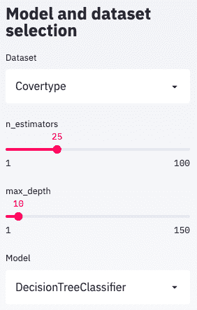

这将显示浏览器中的菜单选项。我们将在浏览器页面的主要部分显示这些选择的结果。

3.  在主面板中报告分类结果:

在主面板中，我们将显示重要的统计数据，包括一个分类报告、几个可以洞察模型优缺点的图，以及数据本身的视图，其中模型的错误决策将被突出显示。

我们首先需要一个标题:

```py
st.title('{model} on {dataset}'.format(
    model=model_name,
    dataset=dataset_name
))
```

然后，我们展示与建模结果相关的基本统计数据，例如曲线下的面积、精度等等:

```py
predictions = model.predict(X_test)
probs = model.predict_proba(X_test)
st.subheader('Model performance in test')
st.write('AUC: {:.2f}'.format(
    roc_auc_score(
        y_test, probs,
        multi_class='ovo' if len(target_names) > 2 else 'raise',
        average='macro' if len(target_names) > 2 else None
    )
))
st.write(
    pd.DataFrame(
        classification_report(
            y_test, predictions,
            target_names=target_names,
            output_dict=True
        )
    )
) 
```

然后，我们将展示一个混淆矩阵，其中列出了每个类别的实际标签和预测标签:

```py
test_df = pd.DataFrame(
    data=np.concatenate([
        X_test,
        y_test.reshape(-1, 1),
        predictions.reshape(-1, 1)
    ], axis=1),
    columns=feature_names + [
        'target', 'predicted'
    ]
)
target_map = {i: n for i, n in enumerate(target_names)}
test_df.target = test_df.target.map(target_map)
test_df.predicted = test_df.predicted.map(target_map)
confusion_matrix = pd.crosstab(
    test_df['target'],
    test_df['predicted'],
    rownames=['Actual'],
    colnames=['Predicted']
)
st.subheader('Confusion Matrix')
st.write(confusion_matrix)
```

我们还希望能够浏览我们的测试数据，以便能够检查分类错误的样本:

```py
def highlight_error(s):
    if s.predicted == s.target:
        return ['background-color: None'] * len(s)
    return ['background-color: red'] * len(s)

if st.checkbox('Show test data'):
    st.subheader('Test data')
    st.write(test_df.style.apply(highlight_error, axis=1))
```

错误分类的样本将以红色背景突出显示。我们已经使这种原始数据探索成为可选的。它需要通过单击复选框来激活。

最后，我们将展示散点图中变量之间的分面图。这是我们使用`altair`库的部分:

```py
if st.checkbox('Show test distributions'):
    st.subheader('Distributions')
    row_features = feature_names[:len(feature_names)//2]
    col_features = feature_names[len(row_features):]
    test_df_with_error = test_df.copy()
    test_df_with_error['error'] = test_df.predicted == test_df.target
    chart = alt.Chart(test_df_with_error).mark_circle().encode(
            alt.X(alt.repeat("column"), type='quantitative'),
            alt.Y(alt.repeat("row"), type='quantitative'),
            color='error:N'
    ).properties(
            width=250,
            height=250
    ).repeat(
        row=row_features,
        column=col_features
    ).interactive()
    st.write(chart)
```

这些图中突出显示了错误分类的示例。同样，我们将这部分设置为可选，通过选中复选框来激活。

`Covetype`数据集主页的上半部分如下所示:

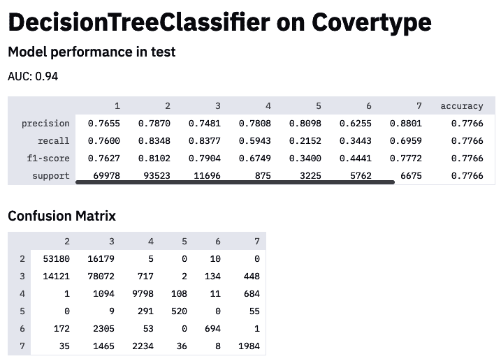

可以看到分类报告和混淆矩阵。下面(不是截图的一部分)是数据探索和数据图。

我们的演示应用程序到此结束。我们的应用程序相对简单，但希望这个方法可以作为构建这些应用程序的指南，以实现清晰的通信。

## 它是如何工作的...

这本书是关于实践学习的，我们也向 streamlit 推荐这本书。使用 streamlit，您有一个快速的反馈循环，在这个循环中，您可以实施更改并看到结果，然后继续下去，直到您对所看到的感到满意为止。

Streamlit 提供了一个本地服务器，如果您愿意，可以通过浏览器远程访问它。因此，您可以在 Azure、Google Cloud、AWS 或您的公司云上运行您的 streamlit 应用服务器，并在您的本地浏览器中查看您的结果。

理解 streamlit 工作流程非常重要。小部件的值由 streamlit 存储。当 Python 脚本从上到下再次执行时，每次用户与微件交互时，其他值都会被动态地重新计算。为了避免昂贵的计算，这些可以使用`@st.cache`装饰器缓存，正如我们在菜谱中看到的。

Streamlit 的 API 集成了许多绘图和图形库。其中包括 Matplotlib、Seaborn、Plotly、Bokeh、交互式绘图库，如 Altair、Vega Lite、用于地图和 3D 图表的 deck.gl 以及 graphviz graphs。其他集成包括 Keras 模型、SymPy 表达式、pandas 数据帧、图像、音频等。

Streamlit 还附带了几种类型的小部件，如滑块、按钮和下拉菜单。Streamlit 还包括一个可扩展的组件系统，其中每个组件都由一个 HTML 和 JavaScript 的浏览器前端和一个 Python 后端组成，能够双向发送和接收信息。现有组件与其他库接口，包括 HiPlot、Echarts、Spacy 和 D3，仅举几个例子:[https://www.streamlit.io/components](https://www.streamlit.io/components)。

您可以尝试不同的输入和输出，可以从零开始，也可以改进这个菜谱中的代码。我们可以扩展它来显示不同的结果，构建仪表板，连接到数据库进行实时更新，或者为主题专家构建用户反馈表单来传达他们的判断，例如注释或批准。

## 请参见

人工智能和统计学中的可视化是一个广阔的领域。Fernanda Viégas 和 Martin Wattenberg 在 NIPS 2018 上做了一个概述演讲，*机器学习的可视化*，你可以找到他们的幻灯片和他们的演讲录音。

这里列出了一些有趣的 streamlit 演示供您参考:

*   使用实时 TensorFlow 会话创建交互式人脸-GAN 浏览器:[https://github.com/streamlit/demo-face-gan/](https://github.com/streamlit/demo-face-gan/)。
*   用于 Udacity 自动驾驶汽车数据集和实时物体检测的图像浏览器:[https://github.com/streamlit/demo-self-driving](https://github.com/streamlit/demo-self-driving)。
*   地图、音频、图像和许多其他内容的组件演示:[https://fullstackstation.com/streamlit-components-demo](https://fullstackstation.com/streamlit-components-demo)。

除了 streamlit，还有其他库和框架可以帮助创建交互式仪表板、演示和报告，如 Bokeh、Jupyter Voilà、Panel 和 Plotly Dash。

如果你正在寻找仪表板和数据库集成的实时图表，像 Apache Superset 这样的工具就派上用场了:[https://](https://superset.apache.org/)superset.apache.org/T2。

# 为实时决策提供模型

通常，人工智能专家被要求建模、展示或提出模型。然而，即使该解决方案可能具有商业影响力，但在实践中，为现场决策制作一个概念证明 ( **POC** )以便实际上根据洞察力采取行动可能比一开始就提出模型要困难得多。一旦我们基于训练数据创建了一个模型，对其进行了分析以验证其是否符合预期标准，并与利益相关者进行了沟通，我们希望使该模型可用，以便它可以为新的决策提供数据预测。这可能意味着某些需求，例如延迟(对于实时应用程序)和带宽(对于服务大量客户)。通常，模型被部署为微服务(如推理服务器)的一部分。

在这份食谱中，我们将从头开始构建一个小型推理服务器，并将重点放在将人工智能引入生产的技术挑战上。我们将展示如何将 POC 开发成一个软件解决方案，该软件解决方案要健壮、可根据需求扩展、响应及时，并且您可以根据需要快速更新。

## 做好准备

在这个菜谱中，我们必须在终端和 Jupyter 环境之间进行切换。我们将从 Jupyter 环境中创建并记录模型。我们将从终端控制`mlflow`服务器。我们将注意哪一个适合每个代码块。

我们将在这个食谱中使用`mlflow`。让我们从终端安装它:

```py
pip install mlflow
```

我们假设您安装了 conda。如果没有，详细说明请参考[第一章](87098651-b37f-4b05-b0ee-878193f28b95.xhtml)、*Python 人工智能入门*中的*设置 Jupyter 环境*菜谱。

我们可以从终端使用一个用于后端存储的`sqlite`数据库后端启动我们的本地`mlflow`服务器，如下所示:

```py
mlflow server --backend-store-uri sqlite:///mlflow.db --host 0.0.0.0 --default-artifact-root file://$PWD/mlruns
```

我们应该会看到一条消息，表明我们的服务器正在侦听 http://0.0.0.0:5000 。

这是我们可以从浏览器访问这个服务器的地方。在浏览器中，我们将能够比较和检查不同的实验，并看到我们的模型的指标。

在*还有更多...*部分，我们将快速演示如何使用`FastAPI`库建立一个定制的 API。我们也将快速安装这个库:

```py
!pip install fastapi
```

有了这个，我们就可以出发了！

## 怎么做...

我们将从一个由**列分隔的值** ( **CSV** )文件构建一个简单的模型。我们将尝试不同的建模选项，并对它们进行比较。然后我们将部署这个模型:

1.  下载和准备数据集:

我们将下载一个数据集作为 CSV 文件，并为培训做准备。这个食谱中选择的数据集是葡萄酒数据集，描述了葡萄酒样品的质量。我们将从 UCI ML 档案下载并阅读葡萄酒质量 CSV 文件:

```py
import pandas as pd
import numpy as np
from sklearn.model_selection import train_test_split

csv_url =\
    'http://archive.ics.uci.edu/ml/machine-' \
    'learning-databases/wine-quality/winequality-red.csv'
data = pd.read_csv(csv_url, sep=';')
```

我们将数据分成训练集和测试集。预测列为**列质量**:

```py
train_x, test_x, train_y, test_y = train_test_split(
    data.drop(['quality'], axis=1),
    data['quality']
)
```

2.  使用不同的超参数进行训练:

在`mlflow`服务器中，我们可以随心所欲地追踪。我们可以为性能指标创建一个报告函数，如下所示:

```py
from sklearn.metrics import mean_squared_error, mean_absolute_error, r2_score

def eval_metrics(actual, pred):
    rmse = np.sqrt(mean_squared_error(actual, pred))
    mae = mean_absolute_error(actual, pred)
    r2 = r2_score(actual, pred)
    return rmse, mae, r2
```

在运行我们的培训之前，我们需要向服务器注册`mlflow`库:

```py
import mlflow

mlflow.set_tracking_uri('http://0.0.0.0:5000')
mlflow.set_experiment('/wine')
```

我们将我们的服务器设置为 URI。我们也可以给我们的实验取个名字。

每次我们使用不同的选项运行训练集时，MLflow 可以记录结果，包括度量、超参数、pickled 模型和一个捕获库版本和创建时间的 MLModel 定义。

在我们的训练函数中，我们对训练数据进行训练，从测试数据中提取模型的度量。我们需要选择适当的超参数和指标进行比较:

```py
from sklearn.linear_model import ElasticNet
import mlflow.sklearn

np.random.seed(40)

def train(alpha=0.5, l1_ratio=0.5):
 with mlflow.start_run():
 lr = ElasticNet(alpha=alpha, l1_ratio=l1_ratio, random_state=42)
 lr.fit(train_x, train_y)
 predicted = lr.predict(test_x)
 rmse, mae, r2 = eval_metrics(test_y, predicted)

        model_name = lr.__class__.__name__
        print('{} (alpha={}, l1_ratio={}):'.format(
            model_name, alpha, l1_ratio
        ))
        print(' RMSE: %s' % rmse)
        print(' MAE: %s' % mae)
        print(' R2: %s' % r2)

        mlflow.log_params({key: value for key, value in lr.get_params().items()})
        mlflow.log_metric('rmse', rmse)
        mlflow.log_metric('r2', r2)
        mlflow.log_metric('mae', mae)
        mlflow.sklearn.log_model(lr, model_name)
```

我们拟合模型，提取我们的度量，将它们打印到屏幕上，将它们记录到`mlflow`服务器上，并且将模型工件存储在服务器上。

为了方便起见，我们在`train()`函数中公开了我们的模型超参数。我们选择用`mlflow`记录所有的超参数。或者，我们可以只记录与商店相关的参数，比如:`mlflow.log_param('alpha', alpha)`。

我们还可以计算更多的工件来伴随我们的模型，例如，可变的重要性。

我们还可以尝试使用不同的超参数，例如:

```py
train(0.5, 0.5)
```

我们应该得到性能指标作为输出:

```py
ElasticNet (alpha=0.5, l1_ratio=0.5):
  RMSE: 0.7325693777577805
  MAE: 0.5895721434715478
  R2: 0.12163690293641838
```

在我们用不同的参数运行了几次之后，我们可以去我们的服务器，比较模型运行，并选择一个模型进行部署。

3.  将模型部署为本地服务器。我们可以在浏览器中比较我们的模型。我们应该能够在服务器上的实验选项卡下找到我们的葡萄酒实验。

然后，我们可以在概览表中比较不同的模型运行，或获得不同超参数的概览图，如下所示:

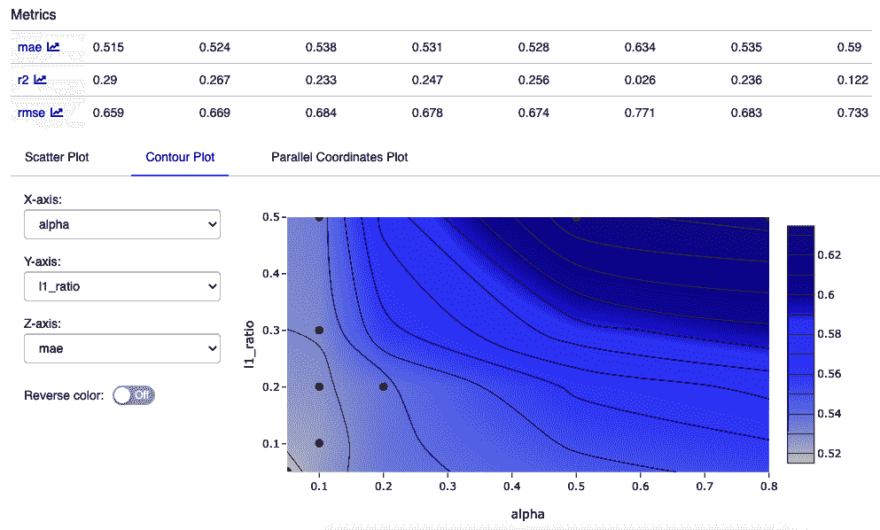

这个等高线图向我们展示了我们针对平均误差 ( **MAE** )改变的两个超参数。

然后，我们可以选择部署模型。我们可以看到我们的最佳模型的运行 ID。可以从命令行将模型部署到服务器，例如，如下所示:

```py
mlflow models serve -m /Users/ben/mlflow/examples/sklearn_elasticnet_wine/mlruns/1/208e2f5250814335977b265b328c5c49
/artifacts/ElasticNet/
```

我们可以像 JSON 一样传递数据，例如，使用 curl，再次从终端。这可能如下所示:

```py
curl -X POST -H "Content-Type:application/json; format=pandas-split" --data '{"columns":["alcohol", "chlorides", "citric acid", "density", "fixed acidity", "free sulfur dioxide", "pH", "residual sugar", "sulphates", "total sulfur dioxide", "volatile acidity"],"data":[[1.2, 0.231, 0.28, 0.61, 4.5, 13, 2.88, 2.1, 0.26, 63, 0.51]]}' http://127.0.0.1:1234/invocations
```

至此，我们已经用`mlflow`完成了模型部署的演示。

## 它是如何工作的...

生产模型的基本工作流程如下:

*   根据数据训练模型。

*   将模型本身以可重用和可再现的模型格式与从模型中提取预测的粘合代码一起打包。

*   将模型部署在 HTTP 服务器中，这将使您能够对预测进行评分。

这通常会导致微服务通过 JSON(通常称为 RESTful 服务)或 GRPC(通过 Google 的协议缓冲区进行远程过程调用)进行通信。这样做的好处是能够从后端解开决策智能的运输，并让 ML 专家完全拥有他们的解决方案。

一个**微服务**是一个可独立部署、维护和测试的单一服务。将一个应用构建成一个松散耦合的微服务的集合被称为**微服务** **架构。**

另一种方法是将您的模型打包，并将代码粘贴到您公司现有的企业后端中进行部署。这种集成有几种选择:

*   在模型交换格式中，如**预测模型标记语言** ( **PMML** )，一种由数据挖掘组旗下的一组组织开发的格式。

*   一些软件实现，如 LightGBM、XGBoost 或 TensorFlow，具有多种编程语言的 API，因此可以用 Python 开发模型，并从 C、C++或 Java 等语言加载。
*   重新设计您的模型:
    *   一些工具可以帮助将决策树等模型转换成 C 或其他语言。
    *   这也可以手动完成。

MLflow 具有命令行、Python、R、Java 和 REST API 接口，用于将模型上传到模型库、记录模型结果(**实验**)、将模型上传到模型库、再次下载以在本地使用它们、控制服务器等等。然而，它提供了一个服务器，也允许部署到 Azure ML、Amazon Sagemaker、Apache Spark UDF 和 RedisAI。

如果您希望能够远程访问您的`mlflow`服务器，例如通常使用模型服务器作为独立服务(微服务)的情况，我们希望将根设置为`0.0.0.0`，就像我们在菜谱中所做的那样。默认情况下，本地服务器将在`http://127.0.0.1:5000`启动。

如果我们想要访问模型，我们需要从默认的后端存储(这是存储度量的地方)切换到数据库后端，并且我们必须使用 URI 中的协议来定义我们的工件存储，例如本地`mlruns/`目录的`file://$PWD/mlruns`。我们已经为后端启用了 SQLite 数据库，这是最简单的方法(但可能不是生产的最佳方法)。我们可以选择 MySQL Postgres，或者其他数据库后端。

然而，这只是挑战的一部分，因为模型变得陈旧或可能不合适，只有当我们能够在部署中监控模型和服务器性能时，我们才能确定这些事实。因此，关于监测的说明是适当的。

### 监视

在监控人工智能解决方案时，我们特别感兴趣的是可操作的或与适当决策相关的指标。前一种指标如下:

*   **延迟**–对数据进行预测需要多长时间？
*   **吞吐量**–在任何时间段内我们可以处理多少个数据点？
*   **资源使用**–完成推理时，我们分配了多少 CPU、内存和磁盘空间？

以下指标可以构成监控决策过程的一部分:

*   统计指标，如某段时间内预测的平均值、方差
*   异常值和漂移检测
*   决策的业务影响

关于检测异常值的方法，请参考[第 3 章](424f3988-2d11-4098-9c52-beb685a6ed27.xhtml)、*模式、异常值和建议*中的*发现异常值*配方。

独立监控可以按照类似于本章中的*可视化模型结果*方法的模板从头开始构建，或者与更专业的监控解决方案集成，如 Prometheus、Grafana 或 Kibana(用于日志监控)。

## 请参见

这是一个非常广泛的话题，我们已经在*如何工作中提到了生产化的许多方面...*本食谱的一节。对于 ML 和**深度学习** ( **DL** )模型，有许多竞争的工业强度解决方案，鉴于篇幅限制，我们只能尝试给出一个概述。和本书一样，我们将主要关注开源解决方案，这些解决方案将避免供应商锁定:

*   MLflow 渴望管理整个 ML 生命周期，包括实验、可复制性、部署和中央模型注册:[https://mlflow.org/](https://mlflow.org/)。
*   BentoML 创建了一个高性能的 API 端点，服务于经过训练的模型:[https://github.com/bentoml/bentoml](https://github.com/bentoml/bentoml)。

虽然一些工具只支持一个或几个建模框架，但其他工具，特别是 BentoML 和 MLflow，支持部署在所有主要 ML 培训框架下培训的模型，如 FastAI、scikit-learn、PyTorch、Keras、XGBoost、LightGBM、H2o、FastText、Spacy 和 ONNX。这两者都进一步为用 Python 创建的任何东西提供了最大的灵活性，并且它们都具有用于监视的跟踪功能。

我们的食谱改编自`mlflow`教程的例子。MLflow 在 GitHub 上有更多不同建模框架集成的例子:[https://github.com/mlflow/mlflow/](https://github.com/mlflow/mlflow/)。

其他工具包括:

*   Elyra 是基于云的 Jupyter 笔记本部署解决方案，带有可视化数据流编辑器:[https://elyra.readthedocs.io/en/latest/index.html](https://elyra.readthedocs.io/en/latest/index.html)。
*   RedisAI 是一个 Redis 模块，用于执行 DL/ML 模型并管理它们的数据:[https://oss.redislabs.com/redisai/](https://oss.redislabs.com/redisai/)。
*   https://www.tensorflow.org/tfx/guide 是一个谷歌生产规模的 ML 平台。
*   TorchServe 是为 PyTorch 模型服务的工具:[https://pytorch.org/serve/](https://pytorch.org/serve/)。

此外，有许多库可用于创建定制的微服务。其中两个最受欢迎的库是:

*   烧瓶:[https://palletsprojects.com/p/flask/](https://palletsprojects.com/p/flask/)
*   FastAPI:[https://fastapi.tiangolo.com/](https://fastapi.tiangolo.com/)

使用这些，您可以创建端点来获取图像或文本等数据并返回预测。

# 保护模型免受攻击

ML 中的对抗性攻击指的是通过输入信息欺骗模型。这种攻击的例子包括通过改变几个像素给图像添加扰动，从而导致分类器对样本进行错误分类，或者携带带有特定图案的 t 恤以逃避人员检测器(**对抗性 t 恤**)。一种特殊的对抗性攻击是**隐私攻击**，黑客可以获得模型训练数据集的知识，通过成员推理攻击和模型反演攻击潜在地暴露个人或敏感信息。

隐私攻击是危险的，尤其是在医疗或金融等领域，在这些领域中，训练数据可能涉及敏感信息(例如，健康状况)，并且可能可追溯到个人身份。在这个食谱中，我们将建立一个安全的模型来抵御隐私攻击，因此不会被黑客攻击。

## 做好准备

我们将实现 PyTorch 模型，但是我们将依赖于由 Nicolas Papernot 等人创建和维护的 TensorFlow/privacy 存储库中的脚本。我们将如下克隆存储库:

```py
!git clone https://github.com/tensorflow/privacy
```

在菜谱的后面，我们将使用分析脚本来计算模型的隐私界限。

## 怎么做...

我们必须为教师模型和学生模型定义数据加载器。在我们的例子中，教师和学生架构是相同的。我们将训练老师，然后我们从老师的反馈中训练学生。最后，我们将从隐私存储库中执行脚本进行隐私分析。

这是改编自迭戈·穆尼奥斯的一个笔记本，可以在 GitHub 上找到:[https://github.com/dimun/pate_torch](https://github.com/dimun/pate_torch):

1.  让我们从加载数据开始。我们将使用`torch`实用函数下载数据:

```py
from torchvision import datasets
import torchvision.transforms as transforms

batch_size = 32

transform = transforms.Compose(
    [transforms.ToTensor(),
     transforms.Normalize((0.1307,), (0.3081,))]
)

train_data = datasets.MNIST(
    root='data', train=True,
    download=True,
    transform=transform
)
test_data = datasets.MNIST(
    root='data', train=False,
    download=True,
    transform=transform
)
```

这将加载 MNIST 数据集，可能需要一些时间。该转换将数据转换为`torch.FloatTensor`。`train_data`和`test_data`分别为训练和测试数据定义加载器。

请参考[第 7 章](f386de9e-b56d-4b39-bf36-803860def385.xhtml)、*高级图像应用*中的*识别服装项目*配方，以获得对 MNIST 数据集的简要讨论，以及同一章中的*使用数据集为另一个模型生成图像*配方。

请注意，我们将在整个配方中以特别的方式定义一些参数。其中有`num_teachers`和`standard_deviation`。你会在*中看到该算法如何工作的解释...*部分，希望到时候参数会有意义。

另一个参数`num_workers`定义了用于数据加载的子流程数量。`batch_size`定义每批装载多少样品。

我们将为教师定义数据加载器:

```py
num_teachers = 100

def get_data_loaders(train_data, num_teachers=10):
    teacher_loaders = []
    data_size = len(train_data) // num_teachers

    for i in range(num_teachers):
        indices = list(range(i * data_size, (i+1) * data_size))
        subset_data = Subset(train_data, indices)
        loader = torch.utils.data.DataLoader(
            subset_data,
            batch_size=batch_size,
            num_workers=num_workers
        )
        teacher_loaders.append(loader)

    return teacher_loaders

teacher_loaders = get_data_loaders(train_data, num_teachers)
```

`get_data_loaders()`函数实现了一个简单的分区算法，从一定数量的教师中返回给定教师所需数据的正确部分。每个教师模型将获得训练数据的不相交子集。

我们为学生定义了一个包含 9，000 个训练样本和 1，000 个测试样本的训练集。这两组数据都来自教师的测试数据集，作为无标签的训练点，它们将使用教师的预测进行标记:

```py
import torch
from torch.utils.data import Subset

student_train_data = Subset(test_data, list(range(9000)))
student_test_data = Subset(test_data, list(range(9000, 10000)))

student_train_loader = torch.utils.data.DataLoader(
    student_train_data, batch_size=batch_size, 
    num_workers=num_workers
)
student_test_loader = torch.utils.data.DataLoader(
    student_test_data, batch_size=batch_size, 
    num_workers=num_workers
)
```

2.  定义模型:我们将为所有教师定义一个模型:

```py
import torch.nn as nn
import torch.nn.functional as F
import torch.optim as optim

class Net(nn.Module):
    def __init__(self):
        super(Net, self).__init__()
        self.conv1 = nn.Conv2d(1, 10, kernel_size=5)
        self.conv2 = nn.Conv2d(10, 20, kernel_size=5)
        self.conv2_drop = nn.Dropout2d()
        self.fc1 = nn.Linear(320, 50)
        self.fc2 = nn.Linear(50, 10)

    def forward(self, x):
        x = F.relu(F.max_pool2d(self.conv1(x), 2))
        x = F.relu(F.max_pool2d(self.conv2_drop(self.conv2(x)), 2))
        x = x.view(-1, 320)
        x = F.relu(self.fc1(x))
        x = F.dropout(x, training=self.training)
        x = self.fc2(x)
        return F.log_softmax(x)
```

这是一个用于图像处理的卷积神经网络。更多图像处理模式请参考[第 7 章](f386de9e-b56d-4b39-bf36-803860def385.xhtml)、*高级图像应用*。

让我们创建另一个效用函数，在给定一个`dataloader`的情况下从这些模型中进行预测:

```py
def predict(model, dataloader):
    outputs = torch.zeros(0, dtype=torch.long).to(device)
    model.to(device)
    model.eval()
    for images, labels in dataloader:
        images, labels = images.to(device), labels.to(device)
        output = model.forward(images)
        ps = torch.argmax(torch.exp(output), dim=1)
        outputs = torch.cat((outputs, ps))

    return outputs
```

我们现在可以开始培训老师了。

3.  培训教师模型:

首先，我们将实现一个函数来训练模型:

```py
device = torch.device('cuda:0' if torch.cuda.is_available() else 'cpu')

def train(model, trainloader, criterion, optimizer, epochs=10, print_every=120):
    model.to(device)
    steps = 0
    running_loss = 0
    for e in range(epochs):
        model.train()
        for images, labels in trainloader:
            images, labels = images.to(device), labels.to(device)
            steps += 1         
            optimizer.zero_grad()     
            output = model.forward(images)
            loss = criterion(output, labels)
            loss.backward()
            optimizer.step()
            running_loss += loss.item()
```

我们现在准备培训我们的教师:

```py
from tqdm.notebook import trange

def train_models(num_teachers):
    models = []
    for t in trange(num_teachers):
        model = Net()
        criterion = nn.NLLLoss()
        optimizer = optim.Adam(model.parameters(), lr=0.003)
        train(model, teacher_loaders[t], criterion, optimizer)
        models.append(model)
    return models

models = train_models(num_teachers) 
```

这为每个教师实例化和训练模型。

4.  培训学生:

对于学生，我们需要一个聚合函数。你可以在*中看到关于聚合函数如何工作的解释...*章节:

```py
import numpy as np

def aggregated_teacher(models, data_loader, standard_deviation=1.0):
    preds = torch.torch.zeros((len(models), 9000), dtype=torch.long)
    print('Running teacher predictions...')
    for i, model in enumerate(models):
        results = predict(model, data_loader)
        preds[i] = results

    print('Calculating aggregates...')
    labels = np.zeros(preds.shape[1]).astype(int)
    for i, image_preds in enumerate(np.transpose(preds)):
        label_counts = np.bincount(image_preds, minlength=10).astype(float)
        label_counts += np.random.normal(0, standard_deviation, len(label_counts))
        labels[i] = np.argmax(label_counts)

    return preds.numpy(), np.array(labels)

standard_deviation = 5.0
teacher_models = models
preds, student_labels = aggregated_teacher(
    teacher_models,
    student_train_loader,
    standard_deviation
)
```

`aggregated_teacher()`函数对所有老师进行预测，统计票数，并添加噪声。最后，它返回投票和由`argmax`汇总的结果。

`standard_deviation`定义噪音的标准偏差。这对隐私保证很重要。

学生首先需要一个数据加载器:

```py
def student_loader(student_train_loader, labels):
    for i, (data, _) in enumerate(iter(student_train_loader)):
        yield data, torch.from_numpy(labels[i*len(data):(i+1)*len(data)])
```

该学生数据加载器将被提供聚合教师标签:

```py
student_model = Net()
criterion = nn.NLLLoss()
optimizer = optim.Adam(student_model.parameters(), lr=0.001)
epochs = 10
student_model.to(device)
steps = 0
running_loss = 0
for e in range(epochs):
    student_model.train()
    train_loader = student_loader(student_train_loader, student_labels)
    for images, labels in train_loader:
        images, labels = images.to(device), labels.to(device)
        steps += 1
        optimizer.zero_grad()
        output = student_model.forward(images)
        loss = criterion(output, labels)
        loss.backward()
        optimizer.step()
        running_loss += loss.item()
        # <validation code omitted>
```

这就是学生培训。

为了简洁起见，在训练循环中省略了这段代码的某些部分。验证如下所示:

```py
        if steps % 50 == 0:
            test_loss = 0
            accuracy = 0
            student_model.eval()
            with torch.no_grad():
                for images, labels in student_test_loader:
                    images, labels = images.to(device), labels.to(device)
                    log_ps = student_model(images)
                    test_loss += criterion(log_ps, labels).item()

                    ps = torch.exp(log_ps)
                    top_p, top_class = ps.topk(1, dim=1)
                    equals = top_class == labels.view(*top_class.shape)
                    accuracy += torch.mean(equals.type(torch.FloatTensor))
            student_model.train()
            print('Training Loss: {:.3f}.. '.format(running_loss/len(student_train_loader)),
                  'Test Loss: {:.3f}.. '.format(test_loss/len(student_test_loader)),
                  'Test Accuracy: {:.3f}'.format(accuracy/len(student_test_loader)))
            running_loss = 0
```

最终的培训更新内容如下:

```py
Epoch: 10/10..  Training Loss: 0.026..  Test Loss: 0.190..  Test Accuracy: 0.952
```

我们看到这是一个很好的模型:在测试数据集上有 95.2%的准确率。

5.  分析隐私:

在 Papernot 等人(2018 年)的文章中，他们详细介绍了如何计算数据相关的差分隐私界限，以估计培训学生的成本。

他们提供了一个脚本来基于投票计数和所使用的噪声标准偏差进行分析。我们之前已经克隆了这个存储库，所以我们可以切换到其中的一个目录，并执行分析脚本:

```py
%cd privacy/research/pate_2018/ICLR2018
```

我们需要将汇总的教师人数保存为一个 NumPy 文件。这可以由分析脚本加载:

```py
clean_votes = []
for image_preds in np.transpose(preds):
    label_counts = np.bincount(image_preds, minlength=10).astype(float)
    clean_votes.append(label_counts)

clean_votes = np.array(counts)
with open('clean_votes.npy', 'wb') as file_obj:
  np.save(file_obj, clean_votes)
```

这将把`counts`矩阵放在一起，并保存为一个文件。

最后，我们调用隐私分析脚本:

```py
!python smooth_sensitivity_table.py  --sigma2=5.0 --counts_file=clean_votes.npy --delta=1e-5
```

ε隐私保证估计为 34.226(数据无关)和 6.998(数据相关)。ε值本身并不直观，但需要在数据集及其维度的上下文中进行解释。

## 它是如何工作的...

我们已经从一个数据集创建了一组教师模型，然后我们从这些教师中引导出一个提供隐私保证的学生模型。在这一节中，我们将讨论 ML 中隐私问题的一些背景，差异隐私，以及 PATE 是如何工作的。

泄露客户数据可能会给公司带来巨大的声誉损害，更不用说因违反 GDPR 等数据保护和隐私法律而被监管机构收取费用。因此，在数据集的创建和 ML 中考虑隐私和以往一样重要。作为一个例子，来自著名的网飞奖推荐开发数据集的 50 万用户的数据通过与公开可用的亚马逊评论共同引用而被去匿名化。

虽然几个列的组合可能会泄露太多关于特定个人的信息，例如，地址或邮政编码以及年龄对于任何试图跟踪数据的人来说都是泄露的信息，但基于此类数据集创建的 ML 模型也可能是不安全的。当受到诸如成员推断攻击和模型反转攻击之类的攻击时，ML 模型可能会泄漏敏感信息。

**Membership attacks** consist, roughly speaking, of recognizing differences in the target model's predictions on inputs that it was trained on compared to inputs that it wasn't trained on. You can find out more about membership attacks from the paper *Membership Inference Attacks against Machine Learning Models* (Reza Shokri and others, 2016). They showed that off-the-shelf models provided as a service by Google and others can be vulnerable to these attacks.

In **inversion attacks**, given API or black box access to a model and some demographic information, the samples used in the model training can be reconstructed. In a particularly impressive example, faces used for training facial recognition models were reconstructed. Of even greater concern, Matthew Fredrikson and others showed that models in personalized medicine can expose sensitive genomic information about individuals (*Privacy in pharmacogenetics*: *An end-to-end case study of personalized warfarin dosing*; 2014)

**差分隐私** ( **DP** )机制可以防止模型反转和成员攻击。在接下来的部分中，我们将先讨论 DP，然后讨论 PATE。

### 差异隐私

DP 的概念首先由 Cynthia Dwork 等人在 2006 年提出(*在隐私数据分析中校准噪声与敏感度*)，是 ML 中隐私的黄金标准。它的中心是单个数据点对算法决策的影响。粗略地说，这反过来意味着模型的任何输出都不会泄露是否包含个人信息。在动态规划中，数据受到某种分布噪声的干扰。这不仅可以防止隐私攻击，还可以减少过度拟合。

为了正确解释 DP，我们需要引入相邻数据库的概念(想想*数据集*)，这是一个仅在单个行中不同的数据库，或者换句话说，是一个单独的数据库。两个数据集，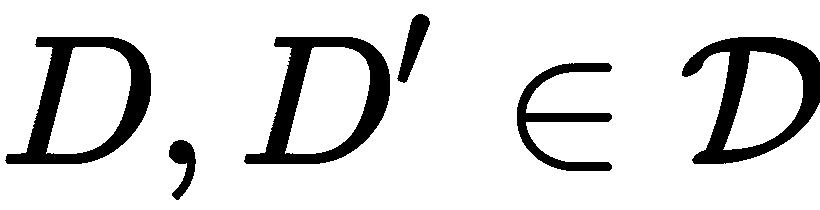，唯一不同的是，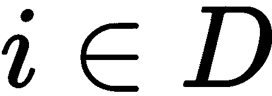和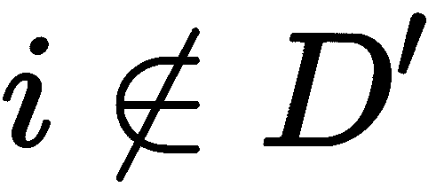。

然后，关键是设置一个上限，以要求相邻数据库上的映射(或机制)的行为几乎相同:


这被称为算法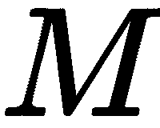的ε-δ参数化 DP，在任何相邻数据库和结果的任何子集上。

在这个公式中，ε参数是乘法保证，而δ参数是概率上几乎精确的结果的加法保证。这意味着个人因其数据被使用而产生的数据保护成本是最小的。Delta privacy 可视为子集或特例，其中 epsilon 为 *0* ，epsilon privacy 为例，其中 Delta 为 *0* 。

这些保证是通过屏蔽输入数据的微小变化来实现的。例如，Stanley L. Warner 在 1965 年描述了这种掩蔽的简单程序(*随机化回答:一种消除回避回答偏差的调查技术*)。受访者在调查中回答敏感问题，如*你堕胎过吗？*根据掷硬币的结果，真实地或确定地:

1.  抛硬币。
2.  如果是反面，如实回答:不是。
3.  如果是正面，抛第二枚硬币，如果是正面，回答*是*，如果是反面，回答*否*。

这给了可信的否认。

### 教师集体的私人聚集

根据 Nicolas Papernot 等人(2017 年)的论文*用于从私人训练数据进行深度学习的半监督知识转移*，教师集合的**私人聚集** ( **PATE** )技术依赖于教师的嘈杂聚集。2018 年，Nicolas Papernot 等人(*带 PATE* 的可扩展私人学习)完善了 2017 年的框架，提高了组合模型的准确性和隐私性。他们进一步证明了 PATE 框架对大规模真实数据集的适用性。

PATE 培训遵循以下程序:

1.  模型集合(**教师模型**)是基于不同的数据集创建的，没有共同的训练示例。
2.  基于查询教师模型的有噪声的集合决策来训练学生模型。
3.  只能发布学生模型，不能发布教师模型。

如前所述，每位教师都是在数据集的不连续子集上接受培训的。直觉是，如果教师同意如何对一个新的输入示例进行分类，那么总体决策不会揭示任何单个训练示例的信息。

查询中的聚合机制包括**高斯噪声最大值** ( **GNMax** )，一个带有高斯噪声的 argmax，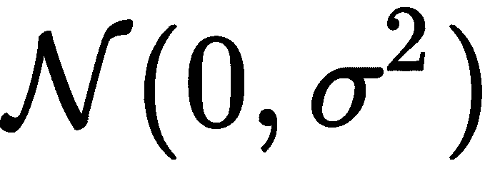，定义如下:

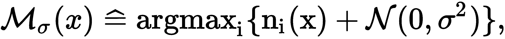

这有一个数据点，班级，x 上老师的投票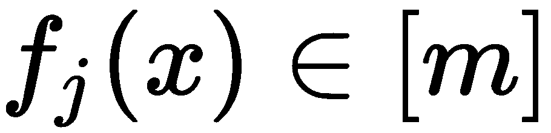

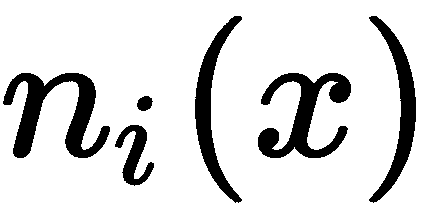表示类别的投票数:

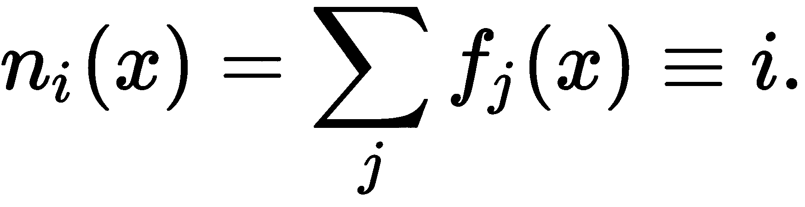

直觉上，精度会随着噪声的变化而降低，因此必须选择足够小的变化以提供良好的性能，但要足够宽以保护隐私。

ε值取决于聚合，尤其是噪声水平，但也取决于数据集的上下文及其维度。请看*多少才够？选择进行差异隐私* (2011)，Jaewoo Lee 和 Chris Clifton，供讨论。

## 请参见

在辛西娅·德沃克和亚伦·罗斯的*差分隐私的算法基础*中可以找到 DP 概念的详细概述。请看第二篇 PATE 论文(Nicolas Papernot 等人 2018；【https://arxiv.org/pdf/1802.08908.pdf】的方法，我们采用了这种配方。

至于与 DP 相关的 Python 库，有很多可用的:

*   Opacus 支持使用 DP:[https://github.com/pytorch/opacus](https://github.com/pytorch/opacus)训练 PyTorch 模型。
*   PySyft 与 PyTorch、TensorFlow 和 Keras 一起工作，并包含许多机制，包括 PATE:[https://github.com/OpenMined/PySyft](https://github.com/OpenMined/PySyft)。
*   TensorFlow 的 cleverhans 库提供了针对对抗性攻击的模型漏洞基准测试工具:[https://github.com/tensorflow/cleverhans](https://github.com/tensorflow/cleverhans)。

TensorFlow 的隐私存储库包含与 DP 相关的优化器和模型。它还包含在成人、IMDB 或其他数据集上使用不同机制的教程，如 DP 随机梯度下降、DP Adam 优化器或 PATE:[https://github.com/tensorflow/privacy](https://github.com/tensorflow/privacy)。

TensorFlow 和 PyTorch 都有加密 ML 的框架:

*   tf-encrypted 涉及 TensorFlow 中的隐私保护 ML 和加密:[tf-encrypted.io/](https://tf-encrypted.io/)。
*   https://github.com/facebookresearch/CrypTen 的脸书 CrypTen 也与 PyTorch 有关，包括模型和数据的加密。