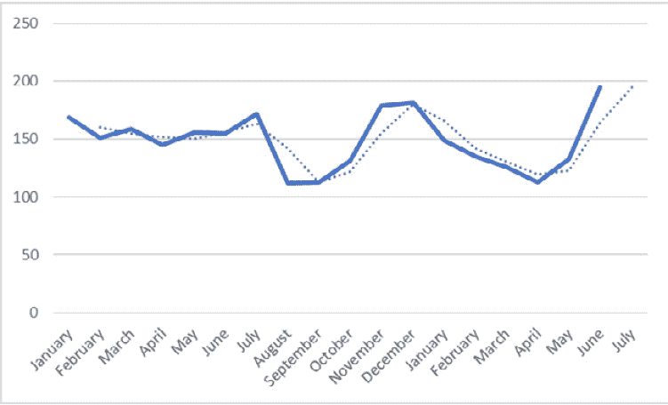
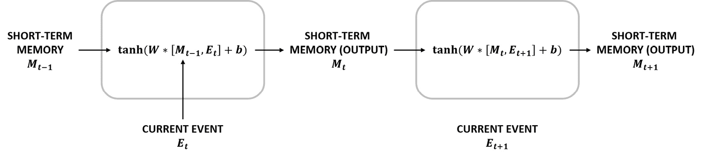
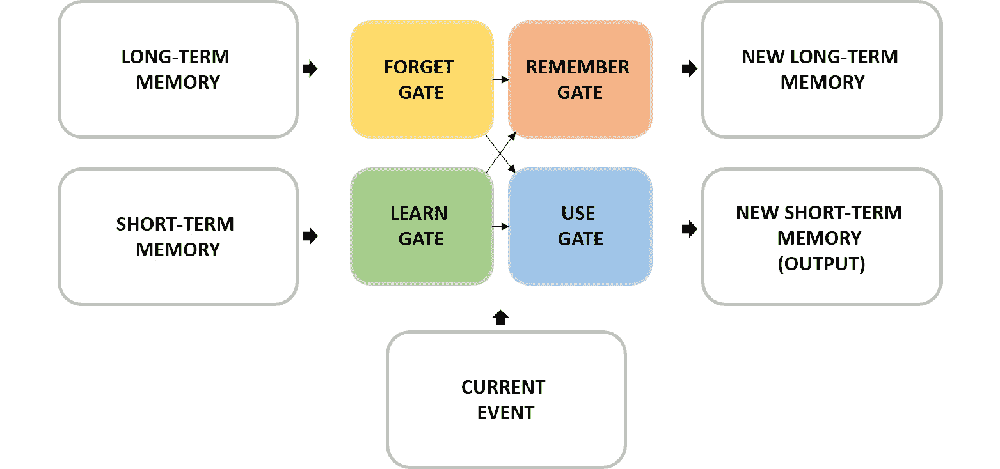
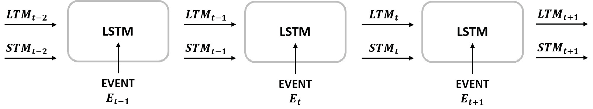
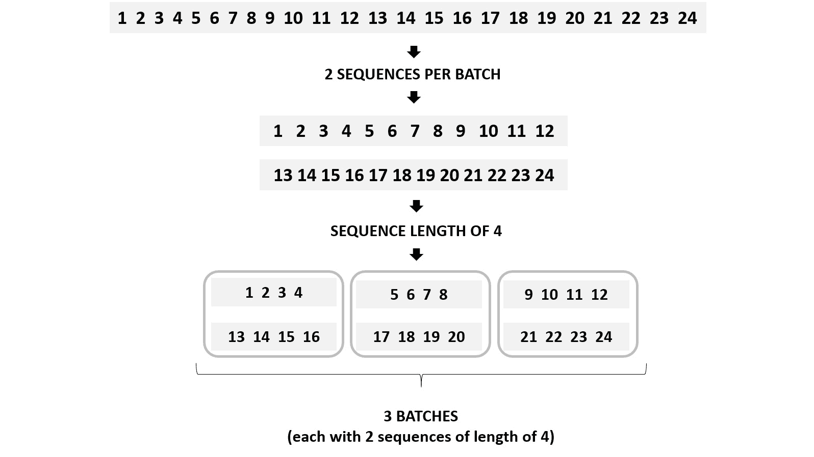
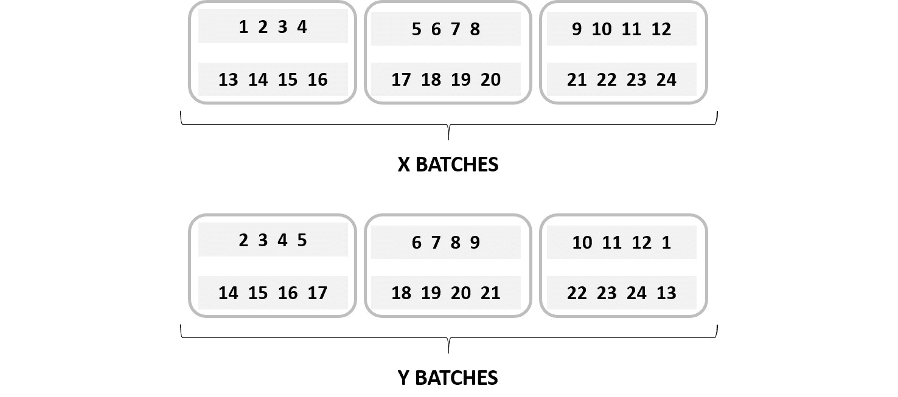
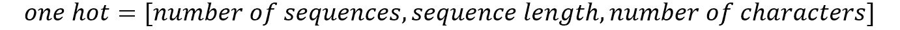

# 六、使用 RNN 分析数据序列

## 学习目标

本章结束时，您将能够:

*   解释循环神经网络(RNNs)的概念
*   构建一个简单的 RNN 架构来解决预测数据问题
*   用长短期记忆(LSTM) 架构工作，用 LSTM 网络生成文本
*   用长期和短期记忆解决一个数据问题
*   使用 RNNs 解决自然语言处理问题

在这一章中，你将具备使用 RNNs 解决 NLP 问题所需的技能。

## 简介

在前几章的书中，已经解释了不同的网络架构——从可以解决分类和回归问题的传统人工神经网络(ann ),到主要用于通过执行对象分类、定位、检测和分割任务来解决计算机视觉问题的卷积神经网络(CNN)。

在这最后一章中，我们将探索**循环神经网络** ( **RNNs** )的概念，并解决序列数据问题。这些网络架构能够处理顺序数据，其中上下文是至关重要的，这要归功于它们能够保存来自先前预测的信息，这被称为记忆。这意味着，例如，当一个单词一个单词地分析一个句子时，RNNs 有能力在处理最后一个单词时保存来自句子第一个单词的信息。

此外，本章还将探讨**长短期记忆** ( **LSTM** )网络架构，这是一种可以保存长期和短期记忆的 RNN，对长数据序列(如视频剪辑)特别有用。

最后，本章还将探讨**自然语言处理** ( **NLP** )的概念。NLP 指的是计算机与人类语言的交互，这是当今的一个热门话题，这要归功于提供定制客户服务的虚拟助理的兴起。尽管如此，本章将使用 NLP 进行情感分析，包括分析句子背后的含义。这有助于根据客户评论了解客户对产品或服务的看法。

#### 注意

提醒一下，包含本章使用的所有代码的 GitHub 资源库可以在[https://GitHub . com/TrainingByPackt/Applied-Deep-Learning-with-py torch](https://github.com/TrainingByPackt/Applied-Deep-Learning-with-PyTorch)找到。

## 循环神经网络

正如人类不会每秒都重置自己的思维一样，旨在理解人类语言的神经网络也不应该这样做。这意味着，为了理解一个段落甚至整本书的每个单词，你或模型需要理解前面的单词，这可以帮助给可能有不同含义的单词提供上下文。

正如我们到目前为止所讨论的，传统的神经网络不能执行这样的任务——因此产生了 RNNs 的概念和网络架构。如前所述，这些网络架构包含不同节点之间的环路。这允许信息在模型中保留更长的时间。由于这个原因，模型的输出变成了预测和记忆，当序列文本的下一位通过模型时，将使用这两个输出。

这一概念可以追溯到 20 世纪 80 年代，尽管它只是最近才变得流行，这要归功于技术的进步，这些进步导致了机器计算能力的提高，并允许数据的回忆，以及 20 世纪 90 年代 LSTM RNNs 概念的发展，这增加了他们的行动。rnn 是最有前途的网络架构之一，这要归功于它们存储内部存储器的能力，这允许它们有效地处理数据序列并解决各种各样的数据问题。

### 无线神经网络的应用

虽然我们已经非常清楚，RNNs 最适合处理数据序列，如文本、音频剪辑和视频，但仍然有必要解释 RNNs 在现实生活问题中的不同应用，以便理解它们为什么日益流行。

以下是通过使用 rnn 可以执行的不同任务的简要说明:

*   **NLP**: This refers to the ability of machines to represent human language. Nowadays, this is perhaps one of the most explored areas of deep learning, and undoubtedly the preferred data problem when making use of RNNs. The idea is to train the network using text as input data, such as poems and books, among others, with the objective of creating a model that is capable of generating such texts.

    NLP 通常用于创建聊天机器人(虚拟助手)。通过从以前的人类对话中学习，NLP 模型能够帮助一个人解决常见的问题或询问。当你试图通过在线聊天系统联系一家银行时，你可能会遇到这种情况，通常情况下，当查询超出常规范围时，你就会被转接到人工接线员那里。现实生活中聊天机器人的另一个常见例子是通过 Facebook Messenger 接受查询的餐馆:


###### 图 6.1:脸书的信使聊天机器人

*   **Speech recognition**: Similar to NLP, speech recognition attempts to understand and represent human language. However, the difference here is that the former (NLP) is trained and produces the output in the form of text, while the latter (speech recognition) uses audio clips. With the proliferation of developments in this field, and the interest of big companies, these models are capable of understanding different languages and even different accents and pronunciation.

    语音识别设备的一个流行例子是 Alexa——亚马逊的语音激活虚拟辅助模型:


###### 图 6.2:亚马逊的 Alexa

*   **Machine translation**: This refers to a machine's ability to translate human languages effectively. According to this, the input is the source language (for instance, Spanish) and the output is the target language (such as English). The main difference between NLP and machine translation is that, in the latter, the output is built after the entire input has been fed to the model.

    随着全球化的兴起和休闲旅游的流行，现在人们需要掌握一种以上的语言。因此，能够在不同语言之间进行翻译的设备大量涌现。这些最新的发明之一是谷歌推出的 Pixel Buds，它可以实时进行翻译:


###### 图 6.3:谷歌的像素芽

*   **Time-series forecasting**: A less popular application of an RNN is the prediction of a sequence of data points in the future based on historical data. RNNs are particularly good at this task due to their ability to retain an internal memory, which allows time-series analysis to consider the different timesteps in the past to perform a prediction or a series of predictions in the future.

    这通常用于预测未来的收入或需求，帮助公司为不同的情况做好准备:



###### 图 6.4:月销售额(数量)预测

例如，如果通过预测几种保健产品的需求，确定其中一种产品的需求将会增加，而另一种产品的需求将会减少，那么公司可能会决定生产更多的这种产品，而生产更少的另一种产品。

*   **图像识别**:与 CNN 结合，RNNs 可以给一张图像一个标题或描述。这种模型的组合允许您检测图像中的所有对象，从而确定图像主要由什么组成。输出可以是图像中存在的对象的一组标签、图像的描述或图像中相关对象的标题，如下图所示:


###### 图 6.5:使用 RNNs 的图像识别

### RNNs 是如何工作的？

简单地说，RNNs 接受一个输入(x)并返回一个输出(y)。这里，产出不仅受投入的影响，还受过去投入的整个历史的影响。这种输入历史通常被称为模型的内部状态或内存，它是遵循某个顺序且彼此相关的数据序列，例如时间序列，它是按顺序(如按月)列出的数据点序列(如销售额)。

#### 注意

请记住，RNN 的一般结构可能会根据手头的问题而有所不同。例如，它们可以是一对多类型或多对一类型，正如在*第二章*、*神经网络的构建模块*中提到的。

为了更好地理解 RNNs 的概念，解释 RNNs 和传统神经网络之间的差异是很重要的。传统的神经网络通常被称为前馈神经网络，因为信息仅在一个方向上移动，即从输入到输出，而不经过节点两次来执行预测。这些网络对过去被喂食的食物没有任何记忆，这就是为什么它们不擅长预测序列中接下来会发生什么。

另一方面，在 RNNs 中，信息使用循环进行循环，因此每次预测都要考虑输入和以前预测的记忆。它的工作原理是复制每次预测的输出，并将其传递回网络，用于后续的预测。这样，rnn 有两个输入:当前值和过去信息:


###### 图 6.6:网络的图形表示，其中 A 表示前馈神经网络，B 表示 RNN

#### 注意

传统 RNNs 的内部记忆只是短期的。然而，我们稍后将探索一种能够存储长期和短期记忆的结构。

通过使用来自以前预测的信息，用有序数据序列训练网络，使其能够预测下一步。这是通过将当前信息与上一步的输出合并成一个操作来实现的(如图*图 6.7* 所示)。此操作的输出将成为预测以及后续预测的部分输入:



###### 图 6.7:每次预测的 RNN 计算

如你所见，发生在节点内部的操作是任何其他神经网络的操作；最初，数据通过线性函数传递。权重和偏差是在训练过程中要更新的参数。接下来，使用激活函数破坏该输出的线性。在这种情况下，这就是`tanh`函数，因为几项研究表明，对于大多数数据问题，它可以获得更好的结果:


###### 图 6.8:传统 RNNs 的数学计算

这里，Mt-1 指的是从先前的预测中得到的记忆，W 和 b 是权重和偏差，E 指的是当前事件。

记住前面的内容，让我们考虑一个产品在过去两年的销售数据。rnn 能够预测下个月的销售额，因为通过存储过去几个月的信息，它们能够检查销售额是增加了还是减少了。

使用*图 6.7* ，下个月的预测可以通过获取上个月的销售额(即当前事件)和短期记忆(代表过去几个月的数据)并将它们结合在一起来处理。该操作的输出将包含下个月的预测和过去几个月的一些相关信息，这些信息将依次成为后续预测的新的短期记忆。

此外，值得一提的是，一些 RNN 架构，如 LSTM 网络，也将能够考虑两年前甚至更早的数据(因为它存储长期记忆)，这将让网络知道在特定月份的减少是否可能继续减少或开始增加。稍后我们将更详细地探讨这个主题。

### py torch 中的 RNNs

在 PyTorch 中，类似于任何其他层，递归层在一行代码中定义。这将在网络的转发函数中调用，如下面的代码所示:

```py
class RNN(nn.Module):
    def __init__(self, input_size, hidden_size, num_layers):
        super().__init__()
        self.hidden_size = hidden_size
        self.rnn = nn.RNN(input_size, hidden_size, num_layers,
        batch_first=True)
        self.output = nn.Linear(hidden_size, 1)
        def forward(self, x, hidden):
            out, hidden = self.rnn(x, hidden)
            out = out.view(-1, self.hidden_size)
            out = self.output(out)
            return out, hidden
```

这里，递归层必须定义为在输入(`input_size`)中获取预期特征数量的参数；处于隐藏状态的特征数量，由用户定义(`hidden_size`)；和循环层数(`num_layers`)。

#### 注意

与任何其他神经网络类似，隐藏大小指的是该层中节点(神经元)的数量。

`batch_first`参数被设置为`True`,以定义输入和输出张量是批处理、序列和特征的形式。

在`forward`功能中，输入通过循环层并展平，以便通过完全连接的层。

此外，这种网络的训练可以如下处理:

```py
for i in range(1, epochs+1):

    hidden = None

    for inputs, targets in batches:
       pred, hidden = model(inputs, hidden)

       loss = loss_function(pred, targets)
       optimizer.zero_grad()
       loss.backward()
       optimizer.step()
```

对于每个时期，隐藏状态被初始化为`none`。这是因为，在每个时期，网络将试图将输入映射到目标(给定一组参数)。这种映射应该在没有任何偏差(隐藏状态)的情况下发生，这些偏差来自先前对数据集的运行。

接下来，执行一个`for`循环来遍历不同批次的数据。在这个循环中，进行了一个预测，并保存了一个隐藏状态，用作下一批的输入。

最后计算损失函数，用来更新网络的参数。然后，该过程再次开始，直到达到期望的次数。

### 活动 11:使用简单的 RNN 进行时间序列预测

在下面的练习中，我们将使用一个简单的 RNN 来解决一个时间序列问题。让我们考虑以下场景:您的公司希望能够提前预测其所有产品的需求。这是因为生产每一种产品需要相当长的时间，而且这个过程要花很多钱。因此，除非产品有可能卖出去，否则他们不愿意在生产上花费金钱和时间。为了预测这一点，他们为您提供了一个数据集，其中包含去年销售的所有产品的每周需求(在销售交易中):

#### 注意

包含将用于以下活动的数据集的 CSV 文件可以在本书的 GitHub 存储库中找到。在本章的介绍中提到了存储库的 URL。也可在线获取，网址为[https://archive . ics . UCI . edu/ml/datasets/Sales _ Transactions _ Dataset _ Weekly。](https://archive.ics.uci.edu/ml/datasets/Sales_Transactions_Dataset_Weekly.)

1.  首先，导入所需的库。
2.  然后，设置`seed`等于`0`来重现本书中的结果，使用下面的代码行:

    ```py
    torch.manual_seed(0)
    ```

3.  加载数据集并对其进行切片，使其包含所有行，但只包含从索引 1 到 52 的列。
4.  从整个数据集中随机选择五种产品，按周绘制销售交易图。进行随机抽样时，使用随机种子`0`，以获得与当前活动相同的结果。
5.  Create the `inputs` and `targets` variables that will be fed to the network to create the model. These variables should be of the same shape and be converted to PyTorch Tensors.

    `inputs`变量应该包含所有周的所有产品的数据，除了最后一周，因为模型的想法是预测最后一周。

    `targets`变量应该比`inputs`变量早一步——也就是说，`targets`变量的第一个值应该是输入变量的第二个值，依此类推，直到`targets`变量的最后一个值(应该是不在`inputs`变量之内的最后一周)。

6.  创建一个包含网络架构的类；请注意，全连接层的输出大小应为 1。
7.  初始化包含模型的类函数。馈入输入大小，每个递归层的神经元数(10)，递归层数(1)。
8.  定义损失函数、优化算法和训练网络的历元数；使用均方误差损失函数、Adam 优化器和 10，000 个历元。
9.  使用`for`循环通过遍历所有时期来执行训练过程。在每个时期，必须进行预测，随后计算损失函数并优化网络参数。然后，保存每个历元的丢失。
10.  画出所有时代的损失。
11.  Using a scatter plot, display the predictions that were obtained in the last epoch of the training process against the ground truth values (that is, the sales transactions of the last week).

    #### 注意

    该活动的解决方案可在第 219 页找到。

## 长短期记忆网络

如前所述，RNNs 只储存短期记忆。当处理长数据序列时，这是一个问题，在这种情况下，网络将很难将信息从前面的步骤传送到最后的步骤。

例如，著名诗人埃德加·爱伦·坡写的一首 1000 多字的诗《乌鸦》。试图使用传统的 RNN 来处理它，目的是创建后续的相关诗歌，这将导致模型忽略前几个段落中的关键信息。反过来，这可能导致与诗歌的初始主题无关的输出。例如，它可以忽略事件发生在晚上，因此使新诗不太可怕。

这种无法保持长期记忆的现象之所以会发生，是因为传统的 rnn 遇到了一个叫做消失梯度的问题。当用于更新网络参数以最小化损失函数的梯度变得非常小时，就会发生这种情况，使得它们不再有助于网络的学习过程。这通常发生在网络的第一层，使网络忘记了不久前看到的内容。

正因为如此，LSTM 网络得以发展。LSTM 网络可以长时间记忆信息，因为它们以类似于计算机的方式存储其内部存储器——即，通过使用门来实现根据需要读取、写入和删除信息的能力。

这些门有助于网络根据它赋予每一位信息的重要性来决定保留什么信息和从存储器中删除什么信息(是否打开门)。这是非常有用的，因为它不仅允许存储更多的信息(作为长期记忆)，而且还有助于丢弃可能改变预测结果的无用信息，如句子中的冠词。

### 应用离子

除了之前解释的应用，LSTM 网络存储长期信息的能力使数据科学家能够利用大量数据序列作为输入来解决复杂的数据问题，其中一些将在下面解释:

*   **文本生成**:生成任何文本，比如你正在阅读的这个，都可以转化为 LSTM 网络的任务。这是通过基于所有前面的字母选择每个字母来实现的。执行这一任务的网络是用大型文本来训练的，比如那些名著。这是因为最终的模型将创建与它被训练时的书写风格相似的文本。例如，一个经过诗歌训练的模型将会有一个不同于你在与邻居的对话中所期望的叙述。
*   **音乐生成**:正如一个文本序列可以输入到网络中以生成类似的新文本一样，一个音符序列也可以输入到网络中以生成新的音符序列。跟踪之前的音符将有助于实现和谐的旋律，而不仅仅是一系列随机的音符。例如，将甲壳虫乐队的一首流行歌曲输入音频文件，将产生一系列类似该乐队和声的音符。
*   **笔迹生成和识别**:在这里，每个字母也是所有先前字母的产物，这又将产生一组具有意义的手写字母。同样，LSTM 网络也可以用于识别手写文本，其中一个字母的预测将取决于所有先前预测的字母。

### LSTM 网络是如何运作的？

到目前为止，已经很清楚，LSTM 网络与传统 rnn 的区别在于它们具有长期记忆的能力。然而，重要的是要提到久而久之，非常旧的信息不太可能影响下一个输出。考虑到这一点，LSTM 网络还能够考虑数据位和底层上下文之间的距离，以便做出决定，忘记一些不再相关的信息。

那么，LSTM 网络是如何决定何时记住何时忘记的呢？与每个节点只执行一次计算的传统 RNNs 不同，LSTM 网络执行四次不同的计算，允许网络的不同输入(即当前事件、短期记忆和长期记忆)之间的交互来得出结果。

为了理解 LSTM 网络背后的过程，让我们考虑一下用于管理网络中信息的四个网关，如下图所示:



###### 图 6.9: LSTM 网络网关

图 6.9 中*各闸门的功能可解释如下:*

*   `tanh`)。这个的输出乘以一个忽略因子，删除任何不相关的信息。为了计算忽略因子，短期记忆和当前事件通过一个线性函数传递。然后，它们被`sigmoid`激活功能挤压在一起:


###### 图 6.10:发生在学习门的数学计算

这里，STM 指的是从之前的预测中得出的短期记忆，W 和 b 是权重和偏差，E 指的是当前事件。

*   `sigmoid`):


###### 图 6.11:发生在遗忘门中的数学计算

这里，STM 指的是从以前的预测中得到的短期记忆，LSM 是从以前的预测中得到的长期记忆，W 和 b 是权重和偏差，E 指的是当前事件。

*   **记忆门**:在遗忘门中没有被遗忘的长时记忆和从学习门中保留下来的信息在记忆门中汇合在一起，成为新的长时记忆。从数学上来说，这是通过对学习和遗忘门的输出求和来实现的:


###### 图 6.12:发生在记忆门中的数学计算

这里，L 是指学习门的输出，而 F 是遗忘门的输出。

*   `tanh`)超过遗忘门的输出。第二，它对短期记忆和当前事件都应用了线性和激活函数(`sigmoid`)。第三，它将前面步骤的输出相乘。第三步的输出将是新的短期记忆和当前步骤的预测:


###### 图 6.13:在使用门中发生的数学计算

这里，STM 指的是从之前的预测中得出的短期记忆，W 和 b 是权重和偏差，E 指的是当前事件。

#### 注意

虽然使用不同的激活函数和数学运算符似乎是任意的，但这样做是因为它已被证明适用于处理大量数据序列的大多数数据问题。

对模型执行的每个预测都执行上述过程。例如，对于为创建文学作品而构建的模型，学习、遗忘、记忆和使用信息的过程是针对模型生成的每个字母执行的，如下图所示:



###### 图 6.14:随时间推移的 LSTM 网络过程

## py torch 的 LSTM 网络

在 PyTorch 中定义 LSTM 网络结构的过程类似于我们到目前为止讨论过的任何其他神经网络。然而，重要的是要注意，当处理与数字序列不同的数据序列时，需要进行一些预处理，以便向网络提供它可以理解和处理的数据。

考虑到这一点，将对训练模型以将文本数据作为输入并检索新的文本数据的一般步骤进行解释。值得一提的是，并不是这里解释的所有步骤都是严格要求的，但作为一个整体，它们为使用文本数据的 LSTM 提供了一个干净且可重用的代码:

### 对输入数据进行预处理

第一步是将文本文件加载到代码中。这些数据将经过一系列转换，以便正确地输入到模型中。这是必要的，因为神经网络执行一系列的数学计算来获得输出，这意味着所有的输入必须是数字的。此外，将数据分批(而不是一次全部)提供给模型也是一种很好的做法，因为这有助于减少训练时间，尤其是对于长数据集。这些转换解释如下:

**编号标签**

首先，从输入数据中获得未复制字符的列表。这些字符中的每一个都被分配了一个号码。然后，通过用指定的数字替换每个字符来对输入数据进行编码。例如，给定以下字符和数字的映射，单词“hello”将被编码为 123344:


###### 图 6.15:字符和数字的映射

**生成批次**

对于 rnn，使用两个变量创建批次。第一，每批序列的数量，第二，每个序列的长度。这些值用于将数据划分为矩阵，这将有助于加快计算速度。

使用 24 个整数的数据集，每批的序列数设置为 2，序列长度等于 4，除法运算如下:



###### 图 6.16:rnn 的批量生成

从*图 6.16* 中可以看出，创建了 3 个批次，每个批次包含 2 个序列，每个序列长度为 4。

应该对`x`和`y`进行批量生成过程，其中前者是网络的输入，后者代表目标。据此，考虑到`y`会比`x`领先 1 步，网络的想法是想办法映射`x`和`y`的关系。

按照上图(图 6.16)中解释的方法创建`x`的批次。然后，将创建与`x`相同长度的`y`批次。这是因为`y`的第一个元素将是`x`的第二个元素，依此类推，直到`y`的最后一个元素(将是`x)`的第一个元素):

#### 注意

有许多不同的方法可以用来填充 y 的最后一个元素，这里提到的方法是最常用的。方法的选择通常是个人喜好的问题，尽管一些数据问题可能从一种方法中比从其他方法中获益更多。



###### 图 6.17:X 和 Y 的批次表示

#### 注意

尽管生成批次被认为是数据预处理的一部分，但它通常在训练过程的`for`循环中编程。

### 一键编码

将所有字符转换成数字不足以将它们输入到模型中。这是因为这种近似会给模型带来一些偏差，因为转换为更高数值的字符将被视为更重要。为了避免这种情况，最好将不同批次编码为一个热矩阵。这包括用 0 和 1 创建一个三维矩阵，其中 0 表示不存在事件，1 表示存在事件。记住这一点，矩阵的最终形状应该如下:



###### 等式 6.18:一键矩阵维数

这意味着对于批处理中的每个位置，它将创建一个长度等于整个文本中字符总数的值序列。对于每个字符，它将放置一个零，除了在那个位置出现的那个(它将放置一个 1)。

#### 注意

你可以在 https://hackernoon . com/what-is-one-hot-encoding-why-and-when-do-you-have-use-it-e3c 6186d 008 f 找到更多关于 one-hot 编码的信息。

### 构建架构

与其他神经网络类似，LSTM 层很容易在一行代码中定义。然而，包含网络架构的类现在必须包括一个函数，该函数允许初始化隐藏和单元状态(即网络的两个存储器)的特征。LSTM 网络架构的示例如下所示:

```py
class LSTM(nn.Module):
    def __init__(self, char_length, hidden_size, n_layers):
        super().__init__()
        self.hidden_size = hidden_size
        self.n_layers = n_layers
        self.lstm = nn.LSTM(char_length, hidden_size, n_layers,                             batch_first=True)
        self.output = nn.Linear(hidden_size, char_length)

    def forward(self, x, states):
        out, states = self.lstm(x, states)
        out = out.contiguous().view(-1, self.hidden_size)
        out = self.output(out)

        return out, states

    def init_states(self, batch_size):
        hidden = next(self.parameters()).data.new(self.n_layers,                  batch_size, self.hidden_size).zero_()
        cell = next(self.parameters()).data.new(self.n_layers,                batch_size, self.hidden_size).zero_()
        states = (hidden, cell)

        return states
```

#### 注意

同样，当输入和输出张量是批处理、序列和特征的形式时，`batch_first`参数被设置为`True`。否则不需要定义，因为它的默认值是`False`。

可以看出，LSTM 层是在一行中定义的，以输入数据中的要素数量(即非重复字符的数量)、隐藏维度(神经元)的数量和 LSTM 层的数量作为参数。

与任何其他网络一样，转发功能定义了数据在网络中向前传递的方式。

最后，定义一个函数在每个时期将隐藏和单元状态初始化为零。这是通过`next(self.parameters()).data.new()`实现的，它获取模型的第一个参数并创建一个相同类型的新张量，括号内有指定的维度，然后用零填充。隐藏状态和单元格状态都作为元组输入到模型中。

### 训练模特

一旦定义了损失函数和优化算法，就该训练模型了。这是通过遵循与用于其他神经网络体系结构的方法非常相似的方法来实现的，如下面的代码片段所示:

```py
for e in range(1, epochs+1):
    states = model.init_states(n_seq)

    for b in range(0, x.shape[1], seq_length):
        x_batch = x[:,b:b+seq_length]

        if b == x.shape[1] - seq_length:
            y_batch = x[:,b+1:b+seq_length]
            y_batch = np.hstack((y_batch, indexer["."] *                       np.ones((y_batch.shape[0],1))))
        else:
            y_batch = x[:,b+1:b+seq_length+1]

        x_onehot = torch.Tensor(index2onehot(x_batch))
        y = torch.Tensor(y_batch).view(n_seq * seq_length)

        pred, states = model(x_onehot, states)
        loss = loss_function(pred, y.long())
        optimizer.zero_grad()
        loss.backward(retain_graph=True)
        optimizer.step()
```

如前面的代码所示，将遵循以下步骤:

1.  为了得到更好的模型，需要对数据进行多次检查；因此，有必要设定一些纪元。
2.  在每个时期，必须初始化隐藏和单元状态。这是通过调用先前在类中创建的函数来实现的。
3.  数据被批量输入到模型中；考虑到输入数据应该被编码为独热矩阵。
4.  通过对一批数据调用模型，得到网络的输出，然后计算损失函数，再优化参数。

### 执行预测

为定型模型提供前几个字符是一种很好的做法，以便执行具有某种目的的预测。这个初始字符应该在不执行任何预测的情况下被提供给模型，但是目的是生成记忆。接下来，通过将前一个字符和记忆输入网络来创建每个新字符。然后，模型的输出通过一个`softmax`函数，以获得新字符成为每个可能字符的概率。最后从概率较高的人物中，随机选择一个。

### 活动 12:文本 G 与 LSTM 网络生成

#### 注意

将用于以下活动的文本数据可以在互联网上免费获得，尽管您也可以在本书的 GitHub 资源库中找到它。在本章的介绍中提到了存储库的 URL。

在下面的活动中，我们将使用《爱丽丝梦游仙境》这本书来训练一个 LSTM 网络，使其能够向模型输入一个起始句子，并让它完成该句子。让我们考虑下面的场景:你喜欢让生活变得更简单的东西，并决定建立一个模型来帮助你在写电子邮件时完成句子。为此，您决定使用一本流行的儿童书籍来训练一个网络:

#### 注意

值得一提的是，虽然本活动中的网络经过了足够多次的训练，可以显示不错的结果，但它并没有经过训练和配置，以实现最佳性能。我们鼓励您使用它来提高性能。

1.  导入所需的库。
2.  打开并朗读《爱丽丝梦游仙境》中的文字到笔记本中。打印前 100 个字符的摘录和文本文件的总长度。
3.  创建一个包含数据集中未复制字符列表的变量。然后，创建一个字典，将每个字符映射到一个整数，其中字符是键，整数是值。
4.  将数据集的每个字母编码成成对的整数。打印前 100 个编码字符和数据集编码版本的总长度。
5.  创建一个函数，它接收一个批处理并将其编码为一个热矩阵。
6.  创建定义网络架构的类。该类应包含一个额外的功能，初始化 LSTM 层的状态。
7.  确定要从数据集创建的批次数量，记住每个批次应包含 100 个序列，并且每个序列的长度应为 50。接下来，将编码数据分割成 100 个序列。
8.  使用 256 作为总共两个递归层的隐藏单元数来初始化您的模型。
9.  定义损失函数和优化算法。使用 Adam 优化器和交叉熵损失。
10.  Train the network for 20 epochs, bearing in mind that, in each epoch, the data must be divided into batches with a sequence length of 50\. This means that each epoch will have 100 sequences, each with a length of 50.

    #### 注意

    请记住，批处理是为输入和目标创建的，其中后者是前者的副本，但领先一步。

11.  绘制损失函数随时间的变化过程。
12.  Use the following sentence starter to feed into the trained model and complete the sentence: "So she was considering in her own mind "

    #### 注意

    这项活动的解决方案可在第 223 页找到。

## 自然语言处理

计算机擅长分析标准化数据，如财务记录或存储在表格中的数据库。事实上，它们在这方面比人类做得更好，因为它们有能力一次分析数百个变量。另一方面，人类擅长分析非结构化数据，例如语言，这是计算机不擅长做的事情，除非他们手头有一套规则来帮助他们理解它。

考虑到这一点，计算机在人类语言方面面临的最大挑战是，即使计算机在非常大的数据集上经过非常长时间的训练后，能够很好地分析人类语言，但它们仍然无法理解句子背后的真正含义，因为它们不是直观的，也不能读懂字里行间的意思。

这意味着，虽然人类能够理解说“他昨晚着火了”的句子。多棒的游戏啊！”指的是某种运动的选手的表现，计算机会从字面上理解，意思是它会把它解释为昨晚真的着火了的人。

NLP 是人工智能(AI)的一个子领域，它通过使计算机能够理解人类语言来工作。虽然人类可能总是更擅长这项任务，但 NLP 的主要目标是在理解人类语言时让计算机更接近人类。

这个想法是创建专注于理解人类语言的特定领域的模型，如机器翻译和文本摘要。这种任务的专业化有助于计算机开发一种模型，能够解决现实生活中的数据问题，而不必一次性处理人类语言的所有复杂性。

情感分析是人类语言理解的一个领域，目前非常流行。

### 情感分析

一般来说，情感分析包括理解输入文本背后的情感。考虑到随着社交媒体平台的激增，公司每天收到的消息和评论数量呈指数级增长，它变得越来越受欢迎。这使得实时手动修改和回复每封邮件的任务变得不可能，这可能会损害公司的形象。

情感分析侧重于提取句子的本质成分，而同时忽略了细节。这有助于解决两个主要需求:

1.  确定客户最关心的产品或服务的关键方面。
2.  提取这些方面背后的感觉，以确定哪些方面会引起积极和消极的反应，从而能够相应地改变它们:


###### 图 6.19:一条推文的例子

从上图中可以看出，执行情感分析的模型可能会获得以下信息:

“辩论”是推特的主要话题。

“悲伤”是由它们衍生出来的感觉。

“美国”作为主题的情绪超过主要位置。

正如你所看到的，情绪分析的概念对任何有在线业务的公司来说都是关键，因为它将有能力对那些需要立即关注的评论做出惊人的快速响应，并且精确度类似于人。

作为情绪分析的一个示例，一些公司可能选择对他们每天接收的大量消息执行情绪分析，以便对那些包含抱怨或负面情绪的消息进行优先响应。这不仅有助于减轻这些特定客户的负面情绪；这也将有助于公司迅速改正错误，并与客户建立信任关系。

为情感分析执行 NLP 的过程将在下一节中进一步解释。我们将解释词嵌入的概念以及在 PyTorch 中开发这样一个模型可以执行的不同步骤，这将是本章最后一个活动的目标。

## py torch 中的情感分析

在 PyTorch 中构建一个模型来执行情感分析与我们目前所看到的 RNNs 非常相似。不同的是，在这种情况下，文本数据将被逐字处理。下面列出了构建这样一个模型所需的步骤。

### 对输入数据进行预处理

与任何其他数据问题一样，数据首先被加载到代码中，记住不同的方法用于不同的数据类型。除了将整个单词集转换成小写字母之外，数据还要经过一些基本的转换，以便将数据输入到网络中。最常见的转换如下:

*   **删除标点**:为了自然语言处理的目的，逐字处理文本数据时，最好删除任何标点。这是为了避免将同一个单词当作两个单独的单词，因为其中一个单词后面跟有点、逗号或任何其他特殊字符。一旦实现了这一点，就可以定义一个包含输入文本中存在的词汇(即整个单词集)的列表。
*   **编号标签**:与前面解释的映射字符的过程类似，词汇中的每个单词都被映射到一个整数，该整数将用来替换输入文本中的单词，以便将其输入网络:


###### 等式 6.20:单词和数字的映射

PyTorch 允许您将词嵌入到一行代码中，而不是执行一次热编码，这些代码可以在包含网络体系结构的类中定义(这将在下面解释)。

### 打造建筑

同样，定义网络体系结构的过程与我们到目前为止所研究的非常相似。然而，如前所述，网络还应包括一个嵌入层，该层将接受输入数据(已转换为数字表示)，并为每个单词指定相关度。也就是说，这些值将在训练过程中更新，直到最相关的单词被赋予更高的权重。

接下来，将显示一个体系结构示例:

```py
class LSTM(nn.Module):
    def __init__(self, vocab_size, embed_dim, hidden_size, n_layers):
        super().__init__()
        self.hidden_size = hidden_size
        self.embedding = nn.Embedding(vocab_size, embed_dim)
        self.lstm = nn.LSTM(embed_dim, hidden_size, n_layers
        self.output = nn.Linear(hidden_size, 1)

    def forward(self, x, states):
        out = self.embedding(x)
        out, states = self.lstm(out, states)
        out = out.contiguous().view(-1, self.hidden_size)
        out = self.output(out)

        return out, states
```

如您所见，嵌入层将把整个词汇的长度和用户设置的嵌入维度作为参数。这个嵌入维度将是 LSTM 层的输入大小，架构的其余部分将保持不变。

### 模型训练

最后，在定义损失函数和优化算法后，训练模型的过程与其他神经网络相同。根据研究的需要和目的，数据可分为不同的组。定义了多个时期和一种方法，以便将数据分为多个批次。网络的内存通常保存在数据批之间，但在每个时期都初始化为零。通过对一批数据调用模型获得网络输出，然后计算损失函数，并优化参数。

### 活动 13:进行情绪分析的 ng NLP

#### 注意

包含将用于以下活动的数据集的文本文件可以在本书的 GitHub 存储库中找到。本章的介绍中提到了存储库的 URL。它也可在[网站上查阅:https://archive . ics . UCI . edu/ml/dataset/情操+标签+句子](https://archive.ics.uci.edu/ml/datasets/Sentiment+Labelled+Sentences)。

对于以下活动，将使用 LSTM 网络来分析一组评论，以确定其背后的观点。让我们考虑一下下面的场景:你在一家互联网供应商的公共关系部门工作，审查你在公司社交媒体上收到的每一个询问都要花相当长的时间。最大的问题是，对服务有问题的客户比没有问题的客户更没有耐心，所以您需要对您的回答进行优先排序，以便可以首先解决它们。由于您喜欢在空闲时间编程，因此您决定尝试构建一个能够确定消息是负面还是正面的神经网络:

#### 注意

值得一提的是，本活动中的数据并未划分为允许对模型进行微调和测试的不同数据集。这是因为活动的主要焦点是显示创建能够执行情感分析的模型的过程。

1.  导入所需的库。
2.  加载包含 1，000 条亚马逊产品评论的数据集，这些评论的标签为 0(负面评论)或 1(正面评论)。将数据分为两个变量:一个包含评论，另一个包含标签。
3.  删除评论中的标点符号。
4.  创建一个变量，包含整个评论集的词汇。此外，创建一个字典，将每个单词映射到一个整数，其中单词将是键，整数将是值。
5.  通过用成对的整数替换评论中的每个单词，对评论数据进行编码。
6.  Create a class containing the architecture of the network. Make sure that you include an embedding layer.

    #### 注意

    因为在训练过程中，数据不会被分批输入，所以没有必要在 forward 函数中返回状态。然而，这并不意味着模型将没有内存，而是内存用于单独处理每个审阅，因为一个审阅不依赖于下一个审阅。

7.  使用 64 个嵌入维度和 3 个 LSTM 层的 128 个神经元初始化模型。
8.  定义损失函数、优化算法和要训练的时期数。例如，可以使用二进制交叉熵损失作为损失函数、Adam 优化器，并训练 10 个时期。
9.  创建一个`for`循环，通过不同的时期和每一个单独的回顾。对于每个检查，执行预测，计算损失函数，并更新网络的参数。此外，根据训练数据计算网络的准确性。
10.  Plot the progress of the loss function and accuracy over time.

    #### 注意

    这项活动的解决方案可在第 228 页找到。

## 总结

本章讨论了 RNNs。开发这种类型的神经网络是为了解决与序列中的数据相关的问题。这意味着单个实例不包含所有相关信息，因为它依赖于来自先前实例的信息。

有几个应用程序符合这种类型的描述。例如，如果没有文本其余部分的上下文，文本(或语音)的特定部分可能没有多大意义。然而，尽管 RNN 对 NLP 的探索最多，但在其他应用中，文本的上下文也很重要，例如预测、视频处理或与音乐相关的问题。

一个 RNN 以一种非常聪明的方式工作；网络不仅输出一个结果，还输出一个或多个通常被称为记忆的值。该记忆值用作未来预测的输入。

还存在不同类型的 RNN 配置，它们基于架构的输入和输出。例如，在多对一的配置中，多个例子(比如单词)可能导致单一的最终输出(比如评论是否粗鲁)。在多对多配置中，多个输入将导致多个输出，就像在语言翻译问题中一样，其中有不同的输入单词和不同的输出单词。

当处理处理非常大的序列的数据问题时，传统的 rnn 存在一个称为消失梯度的问题，其中梯度变得非常小，以至于它们不再有助于网络的学习过程，这通常发生在网络的早期层，导致网络不能具有长期记忆。

为了解决这个问题，开发了 LSTM 网络。这种网络架构能够存储两种类型的内存，因此得名。此外，这个网络中发生的数学计算也允许它忘记信息——只存储过去的相关信息。

最后解释了一个很新潮的 NLP 问题:情感分析。在这个问题中，理解文本提取背后的情感是很重要的。考虑到人类可以使用许多不同的词语和表达形式(例如，讽刺)来描述事件背后的情绪，这对机器来说是一个非常困难的问题。然而，由于社交媒体使用的增加，产生了更快处理文本数据的需求，这个问题在大公司中变得非常流行，大公司已经投入时间和金钱来创建几种近似方法以解决它，如本章的最后活动所示。