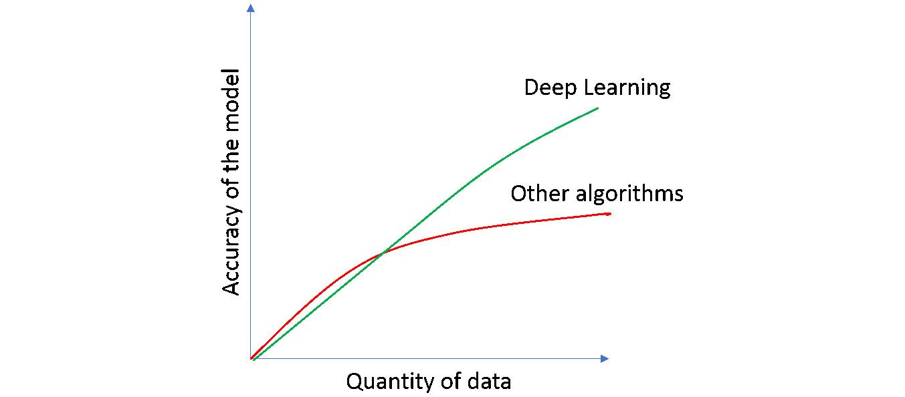

# 一、深度学习和 PyTorch 简介

## 学习目标

本章结束时，您将能够:

*   解释什么是深度学习，它的重要性，以及它如何融入 AI 和 ML
*   确定可以使用深度学习解决的数据问题的种类
*   通过了解 PyTorch 库的优点和缺点，将其与其他机器学习库区分开来
*   使用 PyTorch 创建单层神经网络

在这一章中，我们将了解深度学习如何与人工智能和机器学习产生共鸣。通过对 PyTorch 的介绍，我们将探索应用 PyTorch 语法知识的基本编程练习。

## 简介

深度学习是机器学习的一个子集，专注于使用深度神经网络解决复杂的数据问题。如今它变得越来越受欢迎，这要归功于软件和硬件的进步，允许收集和处理大量数据(我们正在谈论数百万和数十亿的条目)，考虑到神经网络是目前唯一能够通过向模型提供更多数据来达到更高精确度的算法。

考虑到这一点，对更快处理时间的需求是不可避免的。PyTorch 诞生于 2017 年，其主要特点依赖于它使用 GPU 的能力来使用张量运行数据。这允许算法以非常高的速度运行，同时它为其用户提供了灵活性和标准语法，以获得许多数据问题的最佳结果。

这本书的重点是使用 PyTorch 揭开神经网络的神秘面纱，以消除人们对神经网络架构复杂性的恐惧。

考虑到这一点，本章重点介绍深度学习和 PyTorch 两个主题。在这里，您将了解什么是深度学习，它如何融入机器学习和人工智能的世界，它如何在一般情况下工作，最后是一些当今最受欢迎的应用。此外，您将了解 PyTorch 如何工作，它的一些主要模块和特性是什么，以及它给用户带来的一些主要优点和缺点。

## 了解深度学习

为了理解什么是深度学习以及为什么它现在变得如此流行，重要的是首先定义什么是人工智能和机器学习，以及深度学习如何适应那个世界。


###### 图 1.1:人工智能、机器学习和深度学习的示意图

如上图所示，**人工智能** ( **AI** )是一个概括了机器学习和深度学习的通用范畴。它指的是机器表现出的最终导致解决问题的任何智能。这些技术包括遵循一组规则或逻辑，或者从以前的数据中学习，等等。考虑到这一点，人工智能解决方案可能拥有也可能不拥有实现最优解决方案的学习能力。

拥有学习能力的人工智能解决方案属于机器学习子集。简单来说，**机器学习**只是实现人工智能的方式之一，它由具有学习能力的算法组成，而无需显式编程来这样做。这意味着算法能够解析数据，从中学习，并相应地做出决策(预测)。这种机器学习方法被称为“监督学习”，它基本上意味着算法既有输入数据又有目标值(期望的结果)。

机器学习的另一种方法被称为“无监督学习”，与前面提到的不同，只有输入数据被提供，而与输出没有任何关系。此处算法的目标是理解手头的数据，以便找到相似之处。

最后，**深度学习**是使用多层神经网络(大型神经网络)的机器学习的子集，受人脑生物结构的启发，一层中的神经元接收一些输入数据，对其进行处理，并将输出发送到下一层。这些神经网络可以由成千上万个互连的节点(神经元)组成，大多组织在不同的层中，其中一个节点连接到前一层中的几个节点，从那里接收输入数据，以及连接到下一层中的几个节点，在处理后将输出数据发送到下一层。

神经网络的结构和功能将在本书的后续章节中进一步解释。

### 深度学习为什么重要？为什么会流行起来？

总的来说，它的流行是由于准确性的问题。对于非常复杂的数据问题，深度学习已经达到了比以往任何时候都更高的准确性水平。这种出色表现的能力已经达到了机器可以超越人类的水平，这使得模型不仅可以优化流程，还可以提高质量。由于这一点，一些革命性领域取得了进展，在这些领域，准确性对于安全至关重要，例如无人驾驶汽车。

而且，尽管神经网络在几十年前就有了理论，但有两个主要原因可以解释为什么它们最近变得流行起来:

*   Neural networks require, and actually capitalize on, vast amounts of labeled data to achieve an optimal solution. This means that for the algorithm to create an outstanding model, it is required to have hundreds of thousands of entries (and even millions for some data problems), containing both the features and the target values.

    #### 注意

    标记数据是指包含一组特征(描述实例的特征)和一个目标值(要达到的值)的数据。



###### 图 1.2:在数据量方面，深度学习相对于其他算法的性能

由于软件的进步允许这种粒度的收集，而硬件的进步允许对其进行处理，这在今天是可能的。

*   Neural networks require considerable computing power to be able to process such amounts of data, as mentioned before. This is crucial as, otherwise, it would take weeks (or even longer) for a traditional network to be trained, and considering that the process of achieving the best possible model is based on trial-and-error, it is necessary to be able to run the training process as efficiently as possible.

    这可以通过使用 GPU 来实现，GPU 可以将神经网络的训练时间从数周缩短到数小时。

    #### 注意

    此外，为了加速深度学习，以便能够利用大量训练数据和构建最先进的模型，主要云计算提供商，如 AWS、微软 Azure 和谷歌，正在开发 FPGAs(现场可编程门阵列)和 TPU(张量处理单元)。

### 深度学习的应用

正如我们所知，深度学习正在彻底改变技术，因为基于其应用的许多发展正在影响我们目前的生活。此外，据认为，在未来 5 至 10 年内，许多流程的处理方式将发生巨大变化。

此外，深度学习可以应用于各种各样的情况，从医疗和安全目的到更琐碎的任务，如彩色黑白图像或实时翻译文本。

深度学习的一些正在开发或正在使用的应用程序可以在这里找到:

*   自动驾驶汽车:谷歌等几家公司一直致力于开发部分或完全自动驾驶汽车，这些汽车通过使用数字传感器识别周围的物体来学习驾驶。


###### 图 1.3:谷歌的自动驾驶汽车

*   **医疗诊断**:深度学习通过提高脑癌、乳腺癌等晚期疾病的诊断准确率，正在重新定义这个行业。这是通过对新患者的图像进行分类来实现的，基于来自患有或未患有癌症的先前患者的标记图像。
*   **语音助手**:这可能是当今最受欢迎的应用之一，这是由于不同的语音激活智能助手的激增，如苹果的 Siri、谷歌 Home 和亚马逊的 Alexa。


###### 图 1.4:亚马逊的 Alexa 智能助手

*   **自动文本生成**:这包括根据输入的句子生成新的文本。这在电子邮件写作中被广泛使用，电子邮件提供商根据到目前为止所写的文本向用户建议接下来的几个单词。


###### 图 1.5: Gmail 的文本生成功能

*   **广告**:这里的主要思想是通过瞄准正确的受众或创造更有效的广告等方法来增加广告的投资回报。
*   **价格预测**:对于初学者来说，这是一个通过使用机器学习算法可以实现什么的典型例子。价格预测包括基于真实数据训练模型，真实数据例如包括真实状态、财产特征及其最终价格，以便能够仅基于财产特征预测未来条目的价格。

## PyTorch 简介


###### 图 1.6: PyTorch 库徽标

PyTorch 是一个开源库，主要由脸书的人工智能研究小组开发，作为 Torch 的 Python 版本，于 2017 年 1 月首次向公众发布。它利用**图形处理单元**(**GPU**)的能力来加速张量的计算，从而加速复杂模型的训练次数。

该库有一个 C++后端，结合了 Torch 的深度学习框架，允许比具有许多深度学习功能的原生 Python 库快得多的计算。另一方面，它的前端是 Python，考虑到该库的新数据科学家可以毫不费力地构建非常复杂的神经网络，这有助于它的流行。由于与 Python 的集成，PyTorch 可以与其他流行的 Python 包一起使用。

虽然这个库相当新，但它很快就受到欢迎，因为它是使用该领域许多专家的反馈开发的，这些专家将它转换为一个为用户创建的库。下一节将讨论使用它的许多优点和缺点。

### 优势

现在有几个库可以用于开发深度学习解决方案，那么为什么要使用 PyTorch 呢？因为 PyTorch 是一个动态库，它允许用户非常灵活地开发非常复杂的体系结构，以适应每个特定的数据问题。

正因为如此，它已经被大量的研究人员和人工智能开发人员采用，这使得它成为在机器学习领域获得工作的一个必须条件。

这里显示了需要强调的关键方面:

*   **易用性**:在 API 方面，PyTorch 有一个简单的界面，使得开发和运行模型变得非常容易。许多早期采用者认为它比其他库，如 TensorFlow，更直观。它本质上是 Python，这意味着它与 Python 集成，如前所述，这使得它非常直观且易于使用，尽管该库对许多开发人员来说是新的。这种集成还允许使用许多 Python 包，如 NumPy 和 SciPy，来扩展其功能。
*   **Speed**: PyTorch makes use of GPUs that allow GPU-accelerated tensor computations. This enables the library to train faster than other deep learning libraries. This is especially useful when different approximations have to be tested in order to achieve the best possible model, and speed is a crucial matter. Additionally, even though other libraries may also have the option to accelerate computations with GPUs, PyTorch achieves this operation by typing just a couple of simple lines of code.

    #### 注意

    以下 URL 包含不同深度学习框架上的速度基准(考虑到在处理非常大量的训练数据时，训练时间的差异很明显):

    [https://github.com/u39kun/deep-learning-benchmark](https://github.com/u39kun/deep-learning-benchmark)

*   **便利性** : PyTorch 灵活。它使用动态计算图，允许您随时改变网络。此外，它在构建架构时提供了很大的灵活性，因为很容易对传统架构进行调整。
*   **祈使** : PyTorch 也是祈使。每一行代码都是单独执行的，允许您实时跟踪模型，并以一种非常方便的方式调试模型。
*   **预训练模型**:最后，它包含许多预训练模型，非常易于使用，是一些数据问题的一个很好的起点。

### 缺点

虽然优点很多，但还是有一些缺点需要考虑，下面解释一下:

*   小社区:与其他一些库相比，这个库的适配器社区非常小，比如 TensorFlow。然而，向公众开放仅两年，今天它是实现深度学习解决方案的第三大最受欢迎的库，其社区与日俱增。
*   **参差不齐的文档**:考虑到库是新的，文档不如一些比较成熟的库完整，比如 TensorFlow。然而，随着库的特性和功能的增加，文档也在扩展。此外，随着社区的不断发展，互联网上将会提供更多的信息。
*   **未做好生产准备**:尽管对该库的许多抱怨都集中在它无法部署用于生产，但在 1.0 版本发布后，该库包含了生产功能，能够导出最终模型并在生产环境中使用它们。

### 什么是张量？

PyTorch 与 NumPy 类似，使用张量来表示数据，是类似矩阵的 *n* 维的结构，如图*图 1.7* 所示，区别在于张量可以在 GPU 上运行，有助于加速数值计算。此外，重要的是要提到，对于张量，维数被称为秩。


###### 图 1.7:不同维度张量的可视化表示

与矩阵相反，张量是包含在结构中的数学实体，它可以与其他数学实体交互。当一个张量变换另一个张量时，前者也带有自己的变换。

这意味着张量不仅仅是数据结构，而是容器，当输入一些数据时，可以以多线性方式与其他张量进行映射。

### 练习 1:使用 PyTorch 创建不同等级的张量

#### 注意

所有练习和活动将主要在 Jupyter 笔记本上进行。建议为不同的作业准备一个单独的笔记本，除非有人建议不要这样做。

在本练习中，我们将使用 PyTorch 库创建一阶、二阶和三阶张量。

#### 注意

对于本章中的练习和活动，您需要具备 Python 3.6、Jupyter、Matplotlib 和 PyTorch 1.0。

#### 注意

要克隆包含本书中所有练习和活动的存储库，请在导航到所需路径后，在 CMD 或终端中使用以下命令:

[T2`git clone https://github.com/TrainingByPackt/Applied-Deep-Learning-with-PyTorch.git`](git clone https://github.com/TrainingByPackt/Applied-Deep-Learning-with-PyTorch.git )

1.  Open a Jupyter notebook to implement this exercise.

    打开 CMD 或终端，导航到所需的路径，使用以下命令打开 Jupyter 笔记本:`jupyter notebook`。

    #### 注意

    根据您的操作系统及其配置，此命令可能会有所不同。

2.  导入名为`torch` :

    ```py
    import torch
    ```

    的 PyTorch 库
3.  Create tensors of the following ranks: 1, 2, and 3.

    使用 0 到 1 之间的值来填充张量。假设等级创建正确，张量的大小可以根据需要定义:

    ```py
    tensor_1 = torch.tensor([0.1,1,0.9,0.7,0.3])
    tensor_2 = torch.tensor([[0,0.2,0.4,0.6],[1,0.8,0.6,0.4]])
    tensor_3 = torch.tensor([[[0.3,0.6],[1,0]], [[0.3,0.6],[0,1]]])
    ```

    使用支持 GPU 的机器时，使用以下脚本创建张量:

    ```py
    tensor_1 = torch.cuda.tensor([0.1,1,0.9,0.7,0.3])
    tensor_2 = torch.cuda.tensor([[0,0.2,0.4,0.6],[1,0.8,0.6,0.4]])
    tensor_3 = torch.cuda.tensor([[[0.3,0.6],[1,0]], [[0.3,0.6],[0,1]]])
    ```

4.  Print the shape of each of the tensors using the `shape` property, just as you would do with NumPy arrays:

    ```py
    print(tensor_1.shape)
    print(tensor_2.shape)
    print(tensor_3.shape)
    ```

    每个张量的最终形状应该如下:

    ```py
    torch.Size([5])
    torch.Size([2, 4])
    torch.Size([2, 2, 2])
    ```

恭喜你！您已经成功创建了不同等级的张量。

### py torch 的关键元素

像任何其他库一样，PyTorch 有各种各样的模块、库和包，用于开发不同的功能。在本节中，将解释构建深度神经网络的三个最常用的元素，以及一个简单的语法示例。

**PyTorch 亲笔签名库**

`autograd`库由一种叫做自动微分的技术组成。它的目的是数值计算一个函数的导数。这对于我们将在下一章学习的反向传播概念至关重要，反向传播是在训练神经网络时进行的。

#### 注意

关于神经网络的详细解释将在随后的章节中进行，解释训练模型所采取的不同步骤。

要计算梯度，只需调用`backward()`函数，如下所示:

```py
a = torch.tensor([5.0, 3.0], requires_grad=True)
b = torch.tensor([1.0, 4.0])
ab = ((a + b) ** 2).sum()
ab.backward()
```

在前面的代码中，创建了两个张量。我们在这里使用`requires_grad`参数来告诉 PyTorch 计算这个张量的梯度。但是，在构建神经网络时，此参数不是必需的。

接下来，使用两个张量的值定义一个函数。最后，使用`backward()`函数来计算梯度。

**py torch nn 模块**

考虑到更复杂的部分(梯度的计算)已经被考虑在内，单独的`autograd`库可以用来构建简单的神经网络。然而，这种方法可能是麻烦的，因此引入了神经网络模块。

nn 模块是一个完整的 PyTorch 模块，用于创建和训练神经网络，通过使用不同的元素，允许非常简单和非常复杂的开发。例如，`Sequential()`容器允许轻松创建遵循一系列预定义模块(或层)的网络架构，而不需要太多知识。

#### 注意

可用于每个神经网络架构的不同层将在后续章节中进一步解释。

此外，该模块还具有定义损失函数来评估模型的能力，以及本书将讨论的许多更高级的功能。

将神经网络体系结构构建为一系列预定义模块的过程只需几行代码即可完成，如下所示:

```py
import torch.nn as nn
model = nn.Sequential(nn.Linear(input_units, hidden_units),         nn.ReLU(),         nn.Linear(hidden_units, output_units),         nn.Sigmoid())
loss_funct = torch.nn.MSELoss()
```

首先，导入模块。接下来，定义模型架构。`input_units`指输入数据包含的特征数，`hidden_units`指隐含层的节点数，`output_units`指输出层的节点数。

可以看出，网络的架构包含一个具有 ReLU 激活函数的隐藏层和一个具有 sigmoid 激活函数的输出层。

最后，损失函数被定义为**均方误差** ( **MSE** )。

#### 注意

为了创建不遵循现有模块序列的模型，使用定制 nn 模块。我们将在本书的后面介绍这些。

**py torch optim 包**

`optim`包用于定义优化器，该优化器将使用由`autograd`模块计算的梯度来更新每次迭代中的参数(这将在后面的章节中进一步解释)。在这里，可以从可用的优化算法中进行选择，例如亚当、**随机梯度下降** ( **SGD** )和 RMSprop 等。

要设置要使用的优化器，以下代码行就足够了:

```py
optimizer = torch.optim.SGD(model.parameters(), lr=0.01)
```

这里，`model.parameters()`参数指的是先前创建的模型的权重和偏差，`lr`指的是学习率，它被设置为`0.01`。

接下来，这里显示了运行 100 次迭代的优化过程，如您所见，它使用了由 nn 模块创建的模型和由`autograd`库计算的梯度:

```py
for i in range(100):
    # Call to to the model to perform a prediction
    y_pred = model(x)
    # Calculation of loss function based on y_pred and y
    loss = loss_func(y_pred, y)
    # Zero the gradients so that previous ones don't accumulate
    optimizer.zero_grad()
    # Calculate the gradients of the loss function
    loss.backward()
    # Call to the optimizer to perform an update of the parameters
    optimizer.step()
```

对于每次迭代，模型被调用以获得预测(`y_pred`)。该预测和地面真实值(`y`)被馈送给损失函数，以便确定模型逼近地面真实值的能力。

接下来，将梯度归零，并使用`backward()`函数计算损失函数的梯度。

最后，调用`step()`函数，根据优化算法和先前计算的梯度更新权重和偏差。

### 活动 1:创建单层神经网络

对于此活动，我们将创建一个单层神经网络，这将是我们在未来活动中创建深度神经网络的起点。让我们看看下面的场景。

你正在申请一家大型科技公司的工作，并且已经通过了所有的筛选面试。招聘过程的下一步是在面试中实时展示你的编程机器学习技能。他们要求您使用 PyTorch 构建一个单层神经网络:

1.  导入所需的库。
2.  Create dummy input data (`x`) of random values and dummy target data (`y`) that only contains 0s and 1s. Store the data in tensors. Tensor `x` should have a size of (100,5), while the size of `y` should be (100,1).

    #### 注意

    PyTorch 张量可以像 NumPy 数组一样操作。使用`torch.randn(number_instances`，数字特征)创建`x`。用`torch.randint(low=0, high, size)`创造`y`。考虑到`randint`是上限独占。确保将`y`张量转换为`FloatTensor`类型，因为这是 nn 模块处理的默认类型。为此使用`.type(torch.FloatTensor)`。

3.  定义模型的架构，并将其存储在名为`model`的变量中。记得创建一个单层模型。
4.  Define the loss function to be used.

    使用均方误差损失函数。

5.  Define the optimizer of your model.

    使用 Adam 优化器。

6.  Run the optimization for 100 iterations. In each iteration, print and save the loss value.

    #### 注意

    使用下面一行代码将每个迭代步骤的损失值附加到先前在 for 循环之外创建的列表中(损失):`losses.append(loss.item())`

7.  打印最终重量和偏差的值。总共应该有五个权重(输入数据的每个特征一个)和一个偏差值:

    ```py
    model.state_dict()
    ```

8.  Make a line plot to display the loss value for each iteration step.

    #### 注意

    这项活动的解决方案可在第 186 页找到。

## 总结

人工智能这个术语在过去几年里变得越来越流行。我们在电影中见过，在现实生活中也见过，它基本上是指机器以优化人类任务为目的而展示的任何形式的智能。人工智能的一个子类，专注于那些有能力从数据中学习的算法，被称为机器学习。

反过来，深度学习是受人脑生物结构启发的机器学习的子集。它使用深度神经网络，通过使用大量数据来解决复杂的数据问题。尽管该理论是几十年前开发的，但由于硬件和软件的进步，它最近才被使用，这使得数百万条数据的收集和处理成为可能。

随着深度学习解决方案的流行，已经开发了许多深度学习库。其中，最近的一个就是 PyTorch。PyTorch 使用 C++后端来帮助加速计算，同时使用 Python 前端来保持库的易用性。

它使用张量来存储数据，张量是 n 排序的类似矩阵的结构，可以在 GPU 上运行以加快处理速度。它提供了三个主要元素，对于轻松创建复杂的神经网络架构非常有用。

`autograd`库可以计算函数的导数，这些导数被用作梯度来优化模型的权重和偏差。此外，`nn`模块帮助您轻松地将模型的架构定义为一系列预定义的模块，以及确定用于测量模型的损失函数。最后，使用`optim`包选择优化算法，用于更新参数，考虑之前计算的梯度。