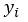
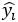

# 二、神经网络的构建模块

## 学习目标

本章结束时，您将能够:

*   识别神经网络的优点和缺点
*   区分神经网络解剖中的不同组件
*   认识最流行的神经网络架构，并了解它们的主要用途
*   使用技术准备要输入神经网络的数据
*   使用简单的架构解决回归问题
*   通过解决高偏差或高方差来提高模型的性能

在这一章中，我们将看看神经网络的基本构件。我们将探索不同的架构来解决各种各样的任务。最后，我们将学习如何使用 PyTorch 构建神经网络。

## 简介

尽管神经网络理论是在几十年前发展起来的，并且这个概念是从感知器的概念发展而来的，但是最近已经创建了不同的架构来解决不同的数据问题。这主要是由于现实生活中的数据问题中存在不同的数据格式，如文本、音频和图像。本章的目的是介绍神经网络的主题及其主要优点和缺点，以便更好地理解何时以及如何使用它们。然后，本章将继续解释最流行的神经网络架构的构建模块:**人工神经网络** ( **ANNs** )、**卷积神经网络**(**CNN**)和**循环神经网络** ( **RNNs** )。

接下来，将通过解决现实生活中的回归问题来解释建立有效模型的过程。这包括准备要馈送给神经网络的数据(也称为数据预处理)、定义要使用的神经网络架构，以及最后评估模型的性能，目的是确定如何对其进行改进以实现最佳解决方案。

考虑到每个数据问题的解决方案应该使用对所讨论的数据类型执行得最好的架构，上述过程将使用在前一章中学习的神经网络架构之一来完成。其他架构将在后续章节中使用，以解决更复杂的数据问题，包括使用图像和文本序列作为输入数据。

#### 注意

提醒一下，包含本章中使用的所有代码的 GitHub 资源库可以在以下链接中找到:[https://GitHub . com/TrainingByPackt/Applied-Deep-Learning-with-py torch](https://github.com/TrainingByPackt/Applied-Deep-Learning-with-PyTorch )

## 神经网络简介

几十年前开发的神经网络需要从训练数据中学习，而不是被编程为遵循一组规则来解决特定任务。学习过程可以遵循以下方法之一:

*   **监督学习**:这是最简单的学习形式，因为它由一个带标签的数据集组成，其中神经网络需要找到解释特征和目标之间关系的模式。学习过程中的迭代旨在最小化预测值和实际值之间的差异。这方面的一个例子是根据叶子的属性对植物进行分类。
*   **无监督学习**:与前面的方法相反，无监督学习包括用未标记的数据(意味着没有目标值)训练模型。这样做的目的是为了更好地理解输入数据，一般来说，网络获取输入数据，对其进行编码，然后从编码版本中重建内容，理想情况下保留相关信息。例如，给定一个段落，神经网络可以映射单词，以便输出那些实际上是关键的单词，这些单词可以用作描述该段落的标签。
*   **Reinforcement learning**: This methodology consists of learning from the data at hand, with the main objective of maximizing a reward function in the long run. Hence, decisions are not made based on the immediate reward, but on the accumulation of it in the entire learning process, such as allocating resources to different tasks, with the objective of minimizing bottlenecks that would slow down general performance.

    #### 注意

    从提到的学习方法中，最常用的是监督学习，这是将在后续部分中主要使用的方法。这意味着大多数练习、活动和示例将使用带标签的数据集作为输入数据。

### 什么是神经网络？

简单地说，神经网络是一种基于人脑解剖结构的机器学习算法，它使用数学方程从训练数据的观察中学习模式。

然而，要真正理解神经网络通常遵循的训练过程背后的逻辑，首先理解感知机的概念是很重要的。

感知器是由 Frank Rosenblatt 在 20 世纪 50 年代开发的，它是一种人工神经元，类似于人脑中的神经元，接受几个输入并产生一个二进制输出，该输出成为后续神经元的输入。它们是神经网络的基本组成部分(就像神经元是人脑的组成部分一样)。


###### 图 2.1:感知器的示意图

这里，X1、X2、X3 和 X4 代表感知器接收的不同输入，并且可以有任意数量的输入。灰色的圆圈是感知器，在这里输入的信息被处理并产生结果。

罗森布拉特还引入了权重(w1，w2，…，wn)的概念，权重是表示每个输入的重要性的数字。输出可以是 0 或 1，它取决于输入的加权和是高于还是低于给定的阈值，该阈值可以设置为感知器的参数，如下所示:


###### 图 2.2:感知器的输出方程

### 练习 2:执行感知机的计算

以下练习不需要任何类型的编程；相反，它由简单的计算组成，帮助你理解感知器的概念。要执行计算，请考虑以下场景。

下周五你所在的城市将举办一场音乐节，但你生病了，正在考虑是否要去(其中 0 表示你要去，1 表示你不去)。为了做出决定，您决定考虑三个因素:

*   会有好天气吗？(X1)
*   你有人一起去吗？(X2)
*   这音乐你喜欢吗？(X3)

对于前面的因素，如果问题的答案是肯定的，我们将使用 1，如果答案是否定的，我们将使用 0。此外，由于您病得很重，与天气相关的因素高度相关，您决定给予该因素两倍于其他 2 个因素的权重。因此，因子的权重为 4 (w1)、2 (w2)和 2 (w3)。现在，考虑 5 的阈值:

1.  根据给定的信息，计算感知器的输出，考虑到下周五天气不好，但你们都有人一起去，并且喜欢音乐节上的音乐:


###### 图 2.3:感知器的输出

考虑到产量小于阈值，最终结果将等于 1，这意味着你不应该去参加节日，以避免病情加重的风险。

恭喜你！你已经成功地完成了感知机的计算。

### 多层感知器

考虑到上述情况，多层网络的概念由堆叠在一起的多个感知器(也称为节点或神经元)组成，如下所示:


###### 图 2.4:多层感知器的示意图

#### 不要

引用神经网络中各层的符号如下:第一层也称为输入层，最后一层也称为输出层，中间的所有层都称为隐藏层。

这里，再次使用一组输入来训练模型，但是它们不是馈送给单个感知器，而是馈送给第一层中的所有感知器(神经元)。接下来，从这一层获得的输出被用作后续层中的感知器的输入，等等，直到到达负责输出结果的最后一层。

值得一提的是，感知器的第一层通过加权输入来处理简单的决策过程，而后续层可以根据前一层的输出来处理更复杂和抽象的决策，因此深度神经网络(使用许多层的网络)在复杂数据问题上具有最先进的性能。

与传统的感知器不同，神经网络已经发展到能够在输出层具有一个或多个节点，以便能够以二进制或多类的形式呈现结果。

### 神经网络的学习过程

一般来说，神经网络是多个神经元的连接，其中每个神经元计算一个线性函数以及一个激活函数，以基于一些输入获得输出。该输出与一个权重相关联，该权重表示其重要性级别，用于下一层的计算。

此外，这些计算是在网络的整个架构中进行的，在那里得到最终输出。该输出用于确定网络相对于地面实况的性能，然后用于调整网络的不同参数以重新开始计算过程。

考虑到这一点，可以将神经网络的训练过程视为一个迭代过程，该过程通过网络的各个层向前和向后进行，以达到最佳结果，这可以在下图中看到，并将在下面详细解释:


###### 图 2.5:神经网络的学习过程图

**正向传播**

这是从左到右遍历网络架构的过程，同时使用输入数据执行计算，以得出可与地面实况进行比较的预测。这意味着网络中的每个神经元将根据与其相关联的权重和偏差来转换输入数据(初始数据或从前一层接收的数据),并将输出发送到下一层，直到到达最后一层并做出预测。

每个神经元中执行的计算包括一个线性函数，该函数将输入数据乘以一些权重加上一个偏差，然后通过一个激活函数传递。激活函数的主要目的是打破模型的线性，考虑到使用神经网络解决的大多数现实生活数据问题不是由直线定义的，而是由复杂的函数定义的，这是至关重要的。公式可在此处找到:


###### 图 2.6:每个神经元执行的计算

这里，如前所述，X 指的是输入数据，W 是确定输入数据的重要性级别的权重，b 是偏差值，sigma ( )表示应用于线性函数的激活函数。

激活的目的是给模型引入非线性。有不同的激活功能可供选择，现在最常用的功能列表如下:

*   **Sigmoid** :这是 S 形的，基本上是把数值转换成 0 到 1 之间的简单概率，其中 Sigmoid 函数得到的大部分输出会接近 0 和 1 的极值:


###### 图 2.7:乙状结肠激活功能


###### 图 2.8:乙状结肠激活函数的图示

*   **Softmax** :类似 sigmoid 函数，计算一个事件在 n 个事件上的概率分布，意味着其输出不是二进制的。简而言之，此函数计算与其他类相比，输出成为目标类之一的概率:


###### 图 2.9: Softmax 激活功能

考虑到它的输出是一个概率，这个激活函数经常出现在分类网络的输出层。

*   **Tanh** :该函数表示双曲正弦和双曲余弦之间的关系，结果在-1 和 1 之间。这个激活函数的主要优点是负值可以更容易地处理:


###### 图 2.10: Tanh 激活函数。


###### 图 2.11:双曲正切函数激活函数的图示

*   **整流线性函数(ReLU)** :这基本上激活了一个节点，假设线性函数的输出大于 0，否则其输出将为 0。如果线性函数的输出大于 0，则该激活函数的结果将是它作为输入接收的原始数字:


###### 图 2.12: ReLU 激活功能

通常，该激活功能用于所有隐藏层:


###### 图 2.13:ReLU 激活功能的图示

**损失函数的计算**

前向传播完成后，训练过程的下一步是计算损失函数，通过比较预测相对于地面真实值的好坏程度来估计模型的误差。考虑到这一点，要达到的理想值是 0，这意味着两个值之间没有差异。

这意味着训练过程的每次迭代的目标将是通过改变用于在前向传递期间执行计算的参数(权重和偏差)来最小化损失函数。

同样，有多个损失函数可供选择。但是，回归和分类任务中最常用的损失函数如下:

*   **均方误差(MSE)** :广泛用于测量回归模型的性能，MSE 函数计算实际值和预测值之间的距离之和:


###### 图 2.14:均方误差损失函数

这里， *n* 是指样本数，是地面真值，是预测值。

*   **交叉熵/多类交叉熵**:该函数通常用于二值或多类分类模型。它衡量两个概率分布之间的差异；大的损失函数将代表大的散度。因此，这里的目标也是最小化损失函数:


###### 图 2.15:交叉熵损失函数

同样，n 是指样本数。和分别是地面真实值和预测值。

**反向传播(Backpropagation)**

训练过程的最后一步包括在网络结构中从右到左计算损失函数相对于每层中的权重和偏差的偏导数，以便更新这些参数(权重和偏差),从而在下一个迭代步骤中，损失函数更低。

此外，优化算法的最终目标是找到损失函数达到最小可能值的全局最小值，如下图所示:

#### 注意

提醒一下，局部最小值指的是函数域的一部分内的最小值。另一方面，全局最小值指的是函数的整个定义域的最小值。


###### 图 2.16:迭代步骤中的损失函数优化。二维空间。

这里，最左边的点(A)是在任何优化之前损失函数的初始值。曲线底部最右边的点(B)是几个迭代步骤后的损失函数，其值已经最小化。从一个点到另一个点的过程称为**步**。

然而，重要的是要提到损失函数并不总是像前一个那样平滑，这可能会在优化过程中引入达到局部最小值的风险。

这个过程也被称为优化，有不同的算法，不同的方法来实现相同的目标。接下来将解释最常用的优化算法。

**梯度下降**

梯度下降是数据科学家中使用最广泛的优化算法，也是许多其他优化算法的基础。在计算出每个神经元的梯度之后，权重和偏差在梯度的相反方向上更新，这应该乘以学习率(用于控制每次优化中所采取的步骤的大小)，如下面的等式所示。

学习率在训练过程中是至关重要的，因为它防止权重和偏差的更新过冲/下冲，过冲/下冲可能分别防止模型达到收敛或延迟训练过程。

梯度下降算法中权重和偏差的优化如下:


###### 图 2.17:梯度下降算法中参数的优化

这里，α指的是学习速率，dw/db 表示给定神经元中权重或偏差的梯度。从权重或偏差的原始值中减去这两个值的乘积，以便惩罚较高的值，这有助于计算大的损失函数。

对梯度下降算法的一种改进称为随机梯度下降，它基本上遵循相同的过程，区别在于它以随机批次而不是一个块的方式获取输入数据，这在达到出色性能的同时改善了训练时间。此外，这种方法允许使用更大的数据集，因为通过使用小批量的数据集作为输入，我们不再受计算资源的限制。

### 优点和缺点

以下是对神经网络的优点和缺点的解释。

**优势**

神经网络在过去几年变得越来越流行，主要有四个原因:

*   **数据**:神经网络因其利用大量数据的能力而广为人知，由于硬件和软件的进步，现在可以回忆和存储大规模数据库。随着越来越多的数据输入神经网络，这使得神经网络显示出了它们真正的潜力。
*   **复杂数据问题**:正如之前所解释的，神经网络对于解决其他机器学习算法无法解决的复杂数据问题非常优秀。这主要是由于它们处理大型数据集和揭示复杂模式的能力。
*   **计算能力**:如今，技术的进步也增加了可用的计算能力，这对训练使用数百万条数据的神经网络模型至关重要。
*   **学术研究**:由于上述三点，互联网上出现了大量关于该主题的学术研究，这不仅有助于每天沉浸在新的研究中，也有助于保持算法和硬件/软件需求的更新。

**缺点**

仅仅因为使用神经网络有很多优点，并不意味着每个数据问题都应该这样解决。这是一个常见的错误。没有一种算法可以很好地解决所有的数据问题，算法的选择应该取决于可用的资源以及数据问题。

此外，尽管神经网络被认为优于几乎任何机器学习算法，但考虑它们的缺点也是至关重要的，以权衡什么对数据问题最重要。

*   黑盒:这是神经网络最常见的缺点之一。它基本上意味着神经网络如何以及为什么达到某个输出是未知的。例如，当一个神经网络错误地将一幅猫的图片预测为一只狗时，就不可能知道错误的原因是什么。
*   **数据需求**:他们实现最佳结果所需的大量数据可能既是优势也是劣势。神经网络比传统的机器学习算法需要更多的数据，这可能是在一些数据问题上在它们和其他算法之间进行选择的主要原因。当手头的任务受到监督时，这就成了一个更大的问题，这意味着数据需要被标记。
*   **训练时间**:与前面的缺点联系在一起，对大量数据的需求也使得训练过程比传统的机器学习算法持续更长时间，在某些情况下这不是一个选项。通过使用加速计算的 GPU，可以减少训练时间。
*   **Computationally expensive**: Again, the training process of neural networks is computationally expensive. While one neural network could take weeks to converge, other machine learning algorithms can take hours or minutes to be trained. The amount of computational resources needed depends on the quantity of data at hand, as well as the complexity of the network; deeper neural networks take a longer time to train.

    #### 注意

    有各种各样的神经网络结构。本章将解释三种最常用的方法，以及它们在后续章节中的实际实现。然而，如果你想了解其他建筑，请访问 http://www.asimovinstitute.org/neural-network-zoo/。

### 人工神经网络简介

**人工神经网络** ( **ANNs** )，也称为多层感知器，是多个感知器的集合，如前所述。这里，重要的是要提到，感知器之间的连接是通过层发生的，其中一层可以有任意多的感知器，并且它们都连接到前一层和后一层中的所有其他感知器。

网络可以有一层或多层。超过四层的网络被认为是深度神经网络，通常用于解决复杂和抽象的数据问题。

人工神经网络通常由三个主要元素组成，这在前面已经详细解释过，也可以在*图 2.18* 中看到:

1.  **Input layer**: This is the first layer of the network, conventionally located furthest left in the graphical representation of a network. It receives the input data before any calculation is performed, and completes the first set of calculations, where the most generic patterns are uncovered.

    对于监督学习问题，输入数据由一对特征和目标组成。网络的工作是揭示输入和输出之间的相关性或依赖性。

2.  **Hidden layers**: Next, the hidden layers can be found. A neural network can have as many hidden layers as possible. The more layers it has, the more complex data problems it can tackle, but it will also take longer to train. There are also neural network architectures that do not contain hidden layers at all, which is the case with single-layer networks.

    在每一层中，基于作为来自前一层的输入而接收的信息来执行计算，以输出将成为后续层的输入的预测。

3.  **Output layer**: This is the last layer of the network, located at the far right of the graphical representation of the network. It receives data after being processed by all the neurons in the network to make and display a final prediction.

    输出层可以有一个或多个神经元。前者指的是解决方案是二进制的模型，以 0 或 1 的形式。另一方面，后一种情况由输出实例属于每个可能的类标签(目标)的概率的模型组成，这意味着该层将具有与类标签一样多的神经元。


###### 图 2.18:具有两个隐藏层的神经网络的架构

### 卷积神经网络简介

卷积神经网络(CNN)主要用于计算机视觉领域，近几十年来，机器已经达到了超过人类能力的精度水平，这使得它们越来越受欢迎。

受人类大脑的启发，CNN 寻求创建模型，使用不同组的神经元来识别图像的不同方面。这些小组应该能够相互交流，这样，他们就可以一起形成大的画面。

考虑到这一点，CNN 架构中的层划分了它们的识别任务。第一层关注琐碎的模式，网络末端的各层使用这些信息来发现更复杂的模式。

例如，当识别照片中的人脸时，前几层着重于寻找将一个特征与另一个特征分开的边缘。接下来，随后的图层强调面部的某些特征，例如鼻子。最后，最后几层使用这些信息来拼出这个人的整张脸。

这种使用一组神经元在遇到某些特征时激活的想法是通过使用过滤器或内核来实现的，过滤器或内核是卷积神经网络架构的主要构建块之一。然而，它们不是该架构中存在的唯一元素，这就是为什么将提供 CNN 所有组件的简要说明:

#### 注意

在使用 CNN 时，您可能听说过填充和步幅的概念，这将在本书的后续章节中解释。

1.  **Convolutional layers**: In these layers, a convolutional computation occurs between an image (represented as a matrix of pixels) and a filter. This computation produces a feature map as an output that ultimately serves as input for the next layer.

    该计算采用滤波器的相同形状的图像矩阵的一个子部分，并执行值的乘法。然后，乘积之和被设置为图像该部分的输出，如下图所示:

    

    ###### 图 2.19:图像和滤镜之间的卷积运算

    这里，左边的矩阵是输入数据，中间的矩阵是过滤器，右边的矩阵是计算的输出。这里可以看到用红框突出显示的值进行的计算:

    

    ###### 图 2.20:图像第一部分的卷积

    对图像的所有子部分进行卷积乘法。图 2.21 显示了同一个例子的另一个卷积步骤:

    

    ###### 图 2.21:卷积运算的进一步步骤

    卷积层的一个重要概念是它们是不变的，即每个滤波器都有一个特定的函数，该函数在训练过程中不会变化。例如，负责检测耳朵的过滤器将在整个训练过程中只专注于该功能。

    此外，卷积神经网络通常会有几个卷积层，考虑到它们中的每一个都将专注于识别图像的特定特征，这取决于所使用的滤波器。此外，值得一提的是，通常在两个卷积层之间有一个池层。

2.  **Pooling layers**: Although convolutional layers are capable of extracting relevant features from images, their results can become enormous when analyzing complex geometrical shapes, which would make the training process impossible in terms of computational power. Hence the invention of pooling layers.

    这些层不仅实现了减少卷积层输出的目标，还实现了去除提取的特征中存在的噪声，这最终有助于模型的准确性。

    有两种主要类型的池图层可以应用，其背后的思想是检测在图像中表现出更强影响的区域，以便可以忽略其他区域:

    *   **最大池化**:该操作包括获取给定大小的矩阵的一个子部分，并将该子部分中的最大数作为最大池化操作的输出。


###### 图 2.22:最大池操作

在上图中，通过使用 3x3 最大池过滤器，获得了右侧的结果。这里，黄色部分(左上角)的最大数量为 4，而橙色部分(右上角)的最大数量为 5。

*   **Average pooling** :类似地，Average pooling 操作获取矩阵的子部分，并将满足规则的数字作为输出，在这种情况下，这是所讨论的子部分中所有数字的平均值。


###### 图 2.23:平均池操作

这里，使用 3x3 过滤器，我们得到 8.6 是黄色部分(左上角)所有数字的平均值，而 9.6 是橙色部分(右上角)所有数字的平均值。

1.  **Fully connected layers**: Finally, and considering that the network would be of no use if it was only capable of detecting a set of features without having the capability of classifying them into a class label, fully connected layers are used at the end of CNNs to take the features detected by the previous layer (known as the features map) and output the probability of that group of features of belonging to a class label, which is used to make the final prediction.

    像人工神经网络一样，全连接层使用感知器根据给定的输入计算输出。此外，必须提到的是，卷积神经网络通常在架构末端有一个以上的全连接层。

通过结合所有这些概念，获得了卷积神经网络的传统架构，其中每种类型可以有任意多的层，每个卷积层可以有任意多的过滤器(每个过滤器用于特定的任务)，并且汇集层应该具有相同数量的过滤器，如下图所示:


###### 图 2.24:卷积神经网络架构图

### 循环神经网络简介

上述神经网络的主要局限性在于，它们仅通过考虑当前事件(正在处理的输入)来学习，而不考虑之前或之后的事件，考虑到我们人类不这样思考，这是不方便的。例如，当阅读一本书时，你可以通过考虑前一段或更多段落的上下文来更好地理解每一句话。

由于这一点，并考虑到神经网络旨在优化传统上由人类完成的几个过程，关键是要想到一个能够考虑一系列输入和输出的网络，因此创建了循环神经网络(RNNs)。它们是一种健壮的神经网络，允许通过使用内部存储器来解决复杂的数据问题。

简而言之，这些网络中含有环路，允许信息在内存中保留更长时间，即使在处理后续信息集时也是如此。这意味着 RNN 中的感知器不仅将输出传递给下一个感知器，还将一点信息传递给自己，这对分析下一点信息很有用。这种记忆保持能力使它们能够非常准确地预测接下来会发生什么。

类似于其他网络，循环神经网络的学习过程试图映射输入(x)和输出(y)之间的关系，不同之处在于这些模型还考虑了先前输入的全部或部分历史。

rnn 允许以输入序列、输出序列或两者同时存在的形式处理数据序列，如下图所示:


###### 图 2.25:RNNs 处理的数据序列

这里，每个方框是一个矩阵，箭头代表一个发生的函数。底部的框是输入，顶部的框是输出，中间的框代表 RNNs 在该点的状态，它保存网络的存储器。

下面从左到右解释前面的图表:

1.  不需要求解 RNN 的典型模型。它有一个固定输入和一个固定输出。例如，这可以指图像分类。
2.  这个模型接受一个输入并产生一系列输出。例如，一个模型接收一个图像作为输入，输出应该是一个图像标题。
3.  与上面相反，这个模型接受一系列的输入并产生一个单一的结果。这种类型的架构可以在情感分析问题上看到，其中输入是要分析的句子，输出是句子背后的预测情感。
4.  最后两个模型接受一系列输入并返回一系列输出，不同之处在于第一个模型首先分析整个输入集，然后生成输出集。例如，对于语言翻译，在进行实际翻译之前，需要理解一种语言的整个句子。另一方面，第二种多对多模型分析输入，同时生成输出。例如，当视频的每一帧被标记时。

## 数据准备

在收集数据之后，开发任何深度学习模型的第一步都应该是准备数据。这对于理解手头的数据是至关重要的，因此，能够正确地勾勒出项目的范围。

许多数据科学家没有这样做，这导致模型表现不佳，甚至是无用的模型，因为它们没有从一开始就回答数据问题。

准备数据的过程可分为三个主要任务:1)了解数据并处理任何潜在问题，2)重新调整要素以确保不会因错误而引入偏差，以及 3)拆分数据以准确测量性能。所有这三项任务将在下一节中进一步解释。

#### 注意

考虑到前面解释的所有任务都是指预先准备数据所需的技术，因此它们对于应用任何机器学习算法都是非常相同的。

### 处理杂乱的数据

该任务主要包括执行**探索性数据分析** ( **EDA** )以了解可用数据，以及检测可能影响模型开发的潜在问题。

EDA 过程是有用的，因为它帮助开发人员发现对行动之书的定义至关重要的信息。此信息解释如下:

1.  **数据量**:指实例的数量和特征的数量。前者对于确定是否有必要甚至有可能使用神经网络甚至深度神经网络来解决数据问题至关重要，因为这种模型需要大量数据来实现高水平的准确性。另一方面，后者有助于确定事先开发一些特征选择方法是否是一种好的做法，以便减少特征的数量，简化模型，并消除任何冗余信息。
2.  **目标特征**:对于监督模型，需要对数据进行标记。考虑到这一点，选择目标要素(我们希望通过构建模型实现的目标)以评估该要素是否有许多缺失值或异常值是非常重要的。此外，这有助于确定开发的目标，该目标应与可用数据一致。
3.  **Noisy data/outliers**: Noisy data refers to values that are visibly incorrect, for instance, a person who is 200 years old. On the other hand, outliers refer to values that, although they may be correct, are very far from the mean, for instance, a 10-year-old college student.

    没有精确的科学来检测异常值，但是有一些被普遍接受的方法。假设数据集呈正态分布，最流行的方法之一是将任何在两个方向上距离所有值的平均值约 3-6 个标准差的值确定为异常值。

    识别异常值的一个同样有效的方法是选择第 99 和第 1 百分位的值。

    当这些值占某个特征数据的 5%以上时，处理这些值非常重要，因为不这样做可能会给模型带来偏差。与任何其他机器学习算法一样，处理这些值的方法是删除异常值或使用均值或回归插补技术分配新值。

4.  **缺失值**:与前面提到的类似，考虑到不同的模型会对这些值做出不同的假设，具有许多缺失值的数据集会给模型带来偏差。同样，当缺失值占某个特性值的 5%以上时，应通过消除或替换它们来处理，同样使用平均值或回归插补技术。
5.  **Qualitative features**: Finally, checking whether the dataset contains qualitative data is also a key step considering that removing or encoding data may result in more accurate models.

    此外，在许多研究开发中，为了确定哪种算法的性能更好，需要对相同的数据测试几种算法，其中一些算法不允许使用定性数据，因此必须对它们进行转换或编码，以便能够为所有算法提供相同的数据。

### 练习 3:处理杂乱的数据

#### 注意

本章中的所有练习都将使用来自加州大学欧文分校机器学习资源库的`Appliances energy prediction Dataset`来完成，该资源库可以使用以下 URL 下载，网址为`Data Folder`超链接:[https://archive . ics . UCI . edu/ml/datasets/Appliances+energy+prediction](https://archive.ics.uci.edu/ml/datasets/Appliances+energy+prediction )

在本练习中，我们将使用 Python 最受欢迎的包之一来研究手头的数据，并了解如何检测缺失值、异常值和定性值:

#### 注意

对于本章中的练习和活动，您需要使用 Python 3.6、Jupyter、NumPy 和 Pandas(至少 0.21 版本)。

1.  Open a Jupyter notebook to implement this exercise.

    打开 cmd 或终端，导航到所需的路径，使用以下命令打开 Jupyter 笔记本:`jupyter notebook`

2.  导入熊猫库:

    ```py
    import pandas as pd
    ```

3.  Use pandas to read the CSV file containing the dataset previously downloaded from the UC Irvine Machine Learning Repository site.

    接下来，删除名为`date`的列，因为我们不想在下面的练习中考虑它。

    最后，打印数据帧的头:

    ```py
    data = pd.read_csv("energydata_complete.csv")
    data = data.drop(columns=["date"])
    data.head()
    ```

4.  Check for categorical features in your dataset:

    ```py
    cols = data.columns
    num_cols = data._get_numeric_data().columns
    list(set(cols) - set(num_cols))
    ```

    结果列表为空，这表明没有要处理的分类要素。

5.  Use Python's `isnull()` and `sum()` functions to find out whether there are any missing values in each column of the dataset:

    ```py
    data.isnull().sum()
    ```

    该命令计算每列中 null 值的数量。对于正在使用的数据集，不应有任何缺失值。

6.  Use three standard deviations as the measure to detect outliers for all features in the dataset:

    ```py
    outliers = {}
    for i in range(data.shape[1]):
        min_t = data[data.columns[i]].mean() – (3 *             data[data.columns[i[[.std())
        max_t = data[data.columns[i]].mean() + (3 *             data[data.columns[i[[.std())

        count = 0
        for j in data[data.columns[i]]:
            if j < min_t or j > max_t:
                count += 1

        percentage = count / data.shape[0]
        outliers[data.columns[i]] = "%.3f" % percentage
    ```

    生成的字典显示数据集中所有要素的列表，以及异常值的百分比。从这些结果中，可以得出这样的结论:考虑到异常值占不到 5%,没有必要处理异常值。

恭喜你！您已经成功地浏览了数据集并处理了潜在的问题。

### 数据重新调整

虽然数据不需要重新调整就可以输入算法进行训练，但这是提高模型准确性的重要一步。这基本上是因为每个特征具有不同的比例可能会导致模型假设某个特征由于具有较高的数值而比其他特征更重要。

举个例子，有两个特征:一个测量一个人有几个孩子，另一个显示这个人的年龄。尽管年龄特征可能具有较高的数值，但在推荐学校的研究中，孩子数量特征可能更重要。

考虑到这一点，如果所有要素的比例相等，模型实际上可以为那些对目标要素最重要的要素赋予更高的权重，而不是它们所具有的数值。此外，它还可以通过消除模型从数据的不变性中学习的需要来帮助加速训练过程。

数据科学家中流行两种主要的重新调整方法，尽管没有选择这一种或那一种的规则，但重要的是要强调它们要单独使用(这一种或那一种)。

这两种方法的简要说明可以在下面找到:

*   **归一化**:这包括重新调整值，使所有特征的所有值都在 0 和 1 之间，使用以下等式:


###### 图 2.26:数据规范化

*   **标准化**:相比之下，这种重新调整方法使用以下等式转换所有值，使其平均值为 0，标准偏差等于 1:


###### 图 2.27:数据标准化

### 练习 4:重新调整数据

在本练习中，我们将重新调整上一练习中的数据:

#### 注意

使用您在上一个练习中使用的 Jupyter 笔记本。

1.  从目标中分离特征。这样做只是为了重新调整特征数据:

    ```py
    X = data.iloc[:, 1:]
    Y = data.iloc[:, 0]
    ```

2.  使用归一化方法重新缩放要素数据。显示结果数据帧的头部以验证结果:

    ```py
    X = (X - X.min()) / (X.max() - X.min())
    X.head()
    ```

恭喜你！您已经成功地重新调整了数据集。

### 拆分数据

将数据集分成三个子集的目的是为了在不引入偏差的情况下，对模型进行适当的训练、微调和测量。以下是对每组的解释:

*   **训练集**:顾名思义，这个集合被馈入要训练的神经网络。对于监督学习，它由特征和目标值组成。如前所述，考虑到神经网络需要大量数据来训练，这通常是三个集合中最大的一个。
*   **Validation set (dev set)**: This set is used mainly to measure the performance of the model in order to make adjustments to the hyperparameters to improve performance. This fine-tuning process is done to arrive at the configuration of hyperparameters that achieve the best results.

    尽管该模型不是基于该数据训练的，但是它间接对其有影响，这就是为什么性能的最终测量不应该在其上进行，因为它可能是有偏差的测量。

*   **测试集**:这个测试集对模型没有影响，这就是为什么它被用来对看不见的数据执行模型的最终评估，这成为模型在未来数据集上表现如何的指南。

考虑到每个数据问题都是不同的，并且开发深度学习解决方案通常需要一种试错方法，因此没有关于将数据分成上述三组的完美比例的实际科学。然而，众所周知，考虑到对训练集使用尽可能多的数据是至关重要的，对于较大的数据集(数十万和数百万个实例)，每个数据集应该有 98%/1%/1%的拆分比率。对于较小的数据集，传统的拆分比例是 60%/20%/20%。

### 练习 5:分割数据集

在本练习中，我们将把上一个练习中的数据集分成三个子集。出于学习的目的，我们将探索两种不同的方法。首先，将使用索引拆分数据集。接下来，scikit-learn 的`train_test_split()`函数将用于相同的目的，通过两种方法实现相同的结果:

#### 注意

使用您在之前练习中使用过的 Jupyter 笔记本。

1.  Print the shape of the dataset in order to determine the split ration to be used.

    ```py
    X.shape
    ```

    t his 运算的输出应该是`(19735, 28)`。这意味着可以对定型集、验证集和测试集使用 60%/20%/20%的拆分比率。

2.  获取用作定型集和验证集的下限的值。这将用于使用索引分割数据集:

    ```py
    train_end = int(len(X) * 0.6)
    dev_end = int(len(X) * 0.8)
    ```

3.  无序播放数据集:

    ```py
    X_shuffle = X.sample(frac=1)
    Y_shuffle = Y.sample(frac=1)
    ```

4.  对于特征和目标数据，使用索引将混洗的数据集分成三组:

    ```py
    x_train = X_shuffle.iloc[:train_end,:]
    y_train = Y_shuffle.iloc[:train_end]
    x_dev = X_shuffle.iloc[train_end:dev_end,:]
    y_dev = Y_shuffle.iloc[train_end:dev_end]
    x_test = X_shuffle.iloc[dev_end:,:]
    y_test = Y_shuffle.iloc[dev_end:]
    ```

5.  Print the shapes of all three sets:

    ```py
    print(x_train.shape, y_train.shape)
    print(x_dev.shape, y_dev.shape)
    print(x_test.shape, y_test.shape)
    ```

    前面操作的结果应该如下所示:

    ```py
    (11841, 27) (11841, )
    (3947, 27) (3947, )
    (3947, 27) (3947, )
    ```

6.  从 scikit-learn 的`model_selection`模块中导入`train_test_split()`函数:

    ```py
    from sklearn.model_selection import train_test_split
    ```

7.  Split the shuffled dataset:

    ```py
    x_new, x_test_2, y_new, y_test_2 = train_test_split(X_shuffle, Y_shuffle, test_size=0.2, random_state=0)
    dev_per = x_test_2.shape[0]/x_new.shape[0]
    x_train_2, x_dev_2, y_train_2, y_dev_2 = train_test_split(x_new, y_new, test_size=dev_per, random_state=0)
    ```

    第一行代码执行初始分割。该函数将两个要分割的数据集(X 和 Y)、`test_size`(包含在测试集中的实例的百分比)和`random_state`作为参数，以确保结果的可重复性。这行代码的结果是将每个数据集(X 和 Y)分成两个子集。

    为了创建一个额外的集合(验证集)，我们将执行第二次分割。前面代码的第二行负责确定用于第二次分割的`test_size`,以便测试集和验证集具有相同的形状。

    最后，最后一行代码执行第二次分割，使用之前计算的值作为`test_size`。

8.  Print the shape of all three sets:

    ```py
    print(x_train_2.shape, y_train_2.shape)
    print(x_dev_2.shape, y_dev_2.shape)
    print(x_test_2.shape, y_test_2.shape)
    ```

    前面操作的结果应该如下所示:

    ```py
    (11841, 27) (11841, )
    (3947, 27) (3947, )
    (3947, 27) (3947, )
    ```

    可以看出，两种方法得到的集合具有相同的形状。使用哪种方法是个人喜好的问题。

恭喜你！您已经成功地将数据集分成了三个子集。

### 活动 2:执行数据准备

在接下来的活动中，我们将准备一个包含歌曲列表的数据集，每首歌曲都有几个属性来帮助确定其发行年份。这一数据准备步骤对于本章中的后续活动至关重要。让我们看看下面的场景。

你在一家音乐唱片公司工作，他们希望发现不同时期唱片的特征细节，这就是为什么他们建立了一个包含 515，345 张唱片数据的数据集，发行年份从 1922 年到 2011 年不等。他们让你准备数据集，这样就可以输入神经网络了。

#### 注意

要下载数据集，请访问以下加州大学欧文分校机器学习资源库 URL:[https://archive.ics.uci.edu/ml/datasets/YearPredictionMSD](https://archive.ics.uci.edu/ml/datasets/YearPredictionMSD)

1.  导入所需的库。
2.  使用 pandas 加载文本文件。由于之前下载的文本文件具有与 CSV 文件相同的格式，您可以使用`read_csv()`功能读取它。确保将 header 参数设置为`None`。
3.  验证数据集中是否存在任何定性数据。
4.  Check for missing values.

    如果您在先前用于此目的的代码行中添加一个额外的`sum()`函数，您将获得整个数据集中缺失值的总和，而不按列进行区分。

5.  检查异常值。
6.  从目标数据中分离要素。
7.  使用标准化方法重新调整数据。
8.  Split the data into three sets: training, validation, and testing. Use the approach of your preference.

    #### 注意

    这项活动的解决方案可在第 188 页找到。

## 构建深度神经网络

一般来说，构建神经网络可以在非常简单的层面上实现，使用 scikit-learn(不适合深度学习)这样的库为您执行所有的数学运算，没有太大的灵活性；或者在非常复杂的层次上，通过从头开始对训练过程的每一个步骤进行编码，或者通过使用更健壮的框架，这允许很大的灵活性。

另一方面，PyTorch 是考虑到该领域许多开发人员的意见而构建的，它的优点是允许在同一个地方进行两种近似。如前所述，它有一个 nn 模块，允许使用顺序容器轻松预定义简单架构的实现，同时允许创建自定义模块，为构建非常复杂的架构的过程带来灵活性。

在本节中，我们将进一步讨论使用顺序容器来开发深度神经网络，以消除其复杂性。尽管如此，在本书的后面部分，我们将继续探索更复杂和抽象的应用程序，这也可以不费吹灰之力实现。

如前所述，顺序容器是一个模块，用于包含遵循一定顺序的模块序列。它包含的每个模块都将对给定的输入进行一些计算，以得出结果。

下面解释了一些最常用的模块(层),它们可以在顺序容器中用来开发常规分类模型:

#### 注意

用于其他类型架构的模块，如卷积神经网络和循环神经网络，将在后续章节中解释。

*   **线性层**:将线性变换应用于输入数据，同时保留内部张量来保存权重和偏差。它接收输入样本的大小(数据集的要素数或前一层的输出数)、输出样本的大小(当前层的单元数，这将是输出数)，以及是否在训练过程中使用偏差张量(默认设置为`True`)作为参数。
*   **Activation functions**: They receive as input the output from the linear layer in order to break the linearity. There are several activation functions, as explained previously, that can be added to the sequential container. The most commonly used ones are explained here:

    **ReLU** :将校正后的线性单位函数应用于包含输入数据的张量。它接受的唯一参数是操作是否应该就地完成，默认设置为`False`。

    **Tanh** :对包含输入数据的张量应用基于元素的 Tanh 函数。这不需要任何争论。

    **Sigmoid** :将之前解释的 Sigmoid 函数应用于包含输入数据的张量。这不需要任何争论。

    **Softmax** :将 Softmax 函数应用于包含输入数据的 n 维张量。输出被重新缩放，使得张量的元素位于 0 和 1 之间的范围内，并且总和为 1。它将计算 softmax 函数的维度作为参数。

*   **Dropout layer** :这个模块根据一个设定的概率，将输入张量的一些元素随机置零。它将用于随机选择的概率以及操作是否应该就地完成作为参数，默认情况下设置为`False`。这种技术通常用于处理过度拟合的模型，这将在后面进一步解释。
*   **规范化层**:有不同的方法可以用来在顺序容器中添加规范化层。其中一些是 BatchNorm1d、BatchNorm2d 和 BatchNorm3d。这背后的想法是归一化来自前一层的输出，最终在较低的训练时间达到类似的精度水平。

### 练习 6:使用 PyTorch 构建深度神经网络

在本练习中，我们将使用 PyTorch 库来定义四层深度神经网络的架构，然后使用之前准备的数据集对其进行训练:

#### 注意

使用您在上一个练习中使用的 Jupyter 笔记本。

1.  Import the PyTorch library, called `torch`, as well as the `nn` module from PyTorch:

    ```py
    import torch
    import torch.nn as nn
    ```

    #### 注意

    尽管不同的包和库被导入，因为它们是实际学习所需要的，但是在代码的开始导入它们总是一个好的习惯。

2.  对于上一练习中创建的每个集合，将特征列与目标列分开。此外，将最终数据帧转换成张量:

    ```py
    x_train = torch.tensor(x_train.values).float()
    y_train = torch.tensor(y_train.values).float()
    x_dev = torch.tensor(x_dev.values).float()
    y_dev = torch.tensor(y_dev.values).float()
    x_test = torch.tensor(x_test.values).float()
    y_test = torch.tensor(y_test.values).float()
    ```

3.  Define the network architecture using the `sequential()` container. Make sure to create a four-layer network.

    考虑到我们正在处理一个回归问题，对前三层使用 ReLU 激活函数，对最后一层不使用激活函数。

    每层的单位数应为:100、50、25 和 1:

    ```py
    model = nn.Sequential(nn.Linear(x_train.shape[1], 100),
                          nn.ReLU(),
                          nn.Linear(100, 50),
                          nn.ReLU(),
                          nn.Linear(50, 25),
                          nn.ReLU(),
                          nn.Linear(25, 1))
    ```

4.  将损失函数定义为均方误差:

    ```py
    loss_function = torch.nn.MSELoss()
    ```

5.  将优化器算法定义为 Adam 优化器:

    ```py
    optimizer = torch.optim.Adam(model.parameters(), lr=0.01)
    ```

6.  使用`for`循环通过 100 个迭代步骤的训练数据来训练网络:

    ```py
    for i in range(100):
        y_pred = model(x_train)
        loss = loss_function(y_pred, y_train)
        print(i, loss.item())
        optimizer.zero_grad()
        loss.backward()
        optimizer.step()
    ```

7.  To test out the model, perform a prediction on the first instance of the testing set, and compare it to the ground truth (target value):

    ```py
    pred = model(x_test[0])
    print(y_test[0], pred)
    ```

    从该结果可以看出，考虑到目标值与预测值相差很大，模型表现不佳。在本书的后续章节中，您将学习如何提高模型的性能。

恭喜你！您已经成功创建并训练了一个深度神经网络来解决一个回归问题。

### 活动 3:为回归问题开发深度学习解决方案

在下面的练习中，我们将创建并训练一个四个隐藏层的神经网络来解决前面练习中提到的回归问题。让我们看看下面的场景:

您继续在音乐唱片公司工作，在看到您在准备数据集方面所做的出色工作后，他们委托您定义网络的架构和代码，并使用准备好的数据集对其进行训练:

#### 注意

使用您在之前活动中使用的 Jupyter 笔记本。

1.  导入所需的库。
2.  针对前一活动中创建的所有三组数据，从目标中分割要素。将数据帧转换成张量。
3.  定义网络的架构。随意尝试层数和每层单元数的不同组合。
4.  定义损失函数和优化算法。
5.  使用一个`for`循环来训练 100 个迭代步骤的网络。
6.  通过对测试集的第一个实例执行预测并将其与实际情况进行比较来测试您的模型。

您的输出应该如下所示:


###### 图 2.28:活动的输出

#### 注意

这项活动的解决方案可在第 190 页找到。

## 总结

诞生神经网络的理论是由弗兰克·罗森布拉特在几十年前提出的。它始于感知器的定义，感知器是一种受人类神经元启发的单元，它将数据作为输入来执行转换。它包括为输入数据分配权重以执行计算，因此最终结果不是这个就是那个，取决于结果。

最广为人知的神经网络形式是由一系列感知器创建的，这些感知器层叠在一起，其中一列感知器(层)的输出是下一列感知器的输入。

据此，解释了神经网络的典型学习过程。在这个问题上，有三个主要过程需要考虑:向前传播、损失函数的计算和向后传播。

该过程的最终目标是通过更新伴随神经网络的每个输入值的权重和偏差来最小化损失函数。这是通过一个可能需要几分钟、几小时甚至几周的迭代过程来实现的，具体取决于数据问题的性质。

还讨论了三类神经网络的主要结构:人工神经网络、卷积神经网络和循环神经网络。第一个用于解决传统的分类问题，第二个因其解决计算机视觉问题(图像分类)的能力而广受欢迎，最后一个能够按顺序处理数据，对于语言翻译等任务非常有用。