# 七、附录

## 关于

本节旨在帮助学生完成书中的活动。它包括学生为实现活动目标而要执行的详细步骤。

##  1 、深度学习和 PyTorch 简介

### 活动 1:创建单层神经网络

解决方案:

1.  导入所需的库:

    ```py
    import torch
    import torch.nn as nn
    import matplotlib.pyplot as plt
    ```

2.  创建随机值的虚拟输入数据(`x`)和仅包含 0 和 1 的虚拟目标数据(`y`)。将数据存储在 PyTorch 张量中。张量`x`的大小应该是(100，5)，而`y`的大小应该是(100，1):

    ```py
    x = torch.randn(100,5)
    y = torch.randint(0, 2, (100, 1)).type(torch.FloatTensor)
    ```

3.  Define the architecture of the model and store it in a variable named `model`. Remember to create a single-layer model:

    ```py
    model = nn.Sequential(nn.Linear(5, 1),
                          nn.Sigmoid())
    ```

    定义要使用的损失函数。使用均方误差损失函数:

    ```py
    loss_function = torch.nn.MSELoss()
    ```

    定义模型的优化器。使用 Adam 优化器和 0.01 的学习率:

    ```py
    optimizer = torch.optim.Adam(model.parameters(), lr=0.01)
    ```

4.  Run the optimization for 100 iterations. In each iteration, print and save the loss value:

    ```py
    losses = []
    for i in range(100):
        y_pred = model(x)
        loss = loss_function(y_pred, y)
        print(loss.item())
        losses.append(loss.item())
        optimizer.zero_grad()
        loss.backward()
        optimizer.step()
    ```

    最终损失应该约为 0.238。

5.  打印最终重量和偏差的值。总共应该有五个权重(输入数据的每个特征一个)和一个偏差值:

    ```py
    model.state_dict()
    ```

6.  Make a line plot to display the loss value for each iteration step:

    ```py
    plt.plot(range(0,100), losses)
    plt.show()
    ```

    结果图应该如下所示:

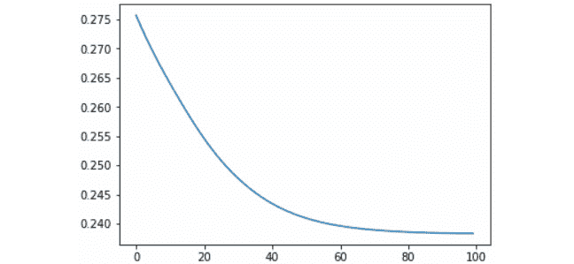

###### 图 1.8:整个训练过程中的损失函数

##  2 、神经网络的构建模块

### 活动 2:执行数据准备

解决方案:

1.  导入所需的库:

    ```py
    import pandas as pd
    ```

2.  Using pandas, load the text file. Considering that the previously downloaded text file has the same formatting as a CSV file, you can read it using the `read_csv()` function. Make sure to change the header argument to `None`:

    ```py
    data = pd.read_csv("YearPredictionMSD.txt", header=None, nrows=50000)
    data.head()
    ```

    #### 注意

    为了避免内存限制，在读取文本文件时使用`nrows`参数，以便读取整个数据集的较小部分。在前面的示例中，我们正在读取前 50，000 行。

3.  验证数据集中是否存在任何定性数据。

    ```py
    data.iloc[0,:]
    ```

4.  Check for missing values.

    如果您在先前用于此目的的代码行中添加一个额外的`sum()`函数，您将获得整个数据集中缺失值的总和，而不区分列:

    ```py
    data.isnull().sum().sum() 
    ```

5.  检查异常值:

    ```py
    outliers = {}
    for i in range(data.shape[1]):
        min_t = data[data.columns[i]].mean() - (            3 * data[data.columns[i]].std())
        max_t = data[data.columns[i]].mean() + (            3 * data[data.columns[i]].std())
        count = 0
        for j in data[data.columns[i]]:
            if j < min_t or j > max_t:
                count += 1
        percentage = count/data.shape[0]
        outliers[data.columns[i]] = "%.3f" % percentage
    print(outliers)
    ```

6.  从目标数据中分离特征:

    ```py
    X = data.iloc[:, 1:]
    Y = data.iloc[:, 0]
    ```

7.  使用标准化方法重新调整特征数据:

    ```py
    X = (X - X.mean())/X.std()
    X.head()
    ```

8.  将数据分成三组:训练、验证和测试。使用您喜欢的方法:

    ```py
    from sklearn.model_selection import train_test_split
    X_shuffle = X.sample(frac=1)
    Y_shuffle = Y.sample(frac=1)
    x_new, x_test, y_new, y_test = train_test_split(X_shuffle,                                                 Y_shuffle,                                                 test_size=0.2,                                                 random_state=0)
    dev_per = x_test.shape[0]/x_new.shape[0]
    x_train, x_dev, y_train, y_dev = train_test_split(x_new,                                                   y_new,                                                   test_size=dev_per,                                                   random_state=0)
    ```

生成的形状应该如下所示:

```py
(30000, 90) (30000, )
(10000, 90) (10000, )
(10000, 90) (10000, )
```

### 活动 3:执行数据准备

解决方案:

1.  导入所需的库:

    ```py
    import torch
    import torch.nn as nn
    ```

2.  针对前一活动中创建的所有三组数据，从目标中分割要素。将数据帧转换成张量:

    ```py
    x_train = torch.tensor(x_train.values).float()
    y_train = torch.tensor(y_train.values).float()
    x_dev = torch.tensor(x_dev.values).float()
    y_dev = torch.tensor(y_dev.values).float()
    x_test = torch.tensor(x_test.values).float()
    y_test = torch.tensor(y_test.values).float()
    ```

3.  定义网络的架构。随意尝试层数和每层单元数的不同组合:

    ```py
    model = nn.Sequential(nn.Linear(x_train.shape[1], 10),
                            nn.ReLU(),
                            nn.Linear(10, 7),
                            nn.ReLU(),
                            nn.Linear(7, 5),
                            nn.ReLU(),
                            nn.Linear(5, 1))
    ```

4.  定义损失函数和优化算法:

    ```py
    loss_function = torch.nn.MSELoss()
    optimizer = torch.optim.Adam(model.parameters(), lr=0.01)
    ```

5.  使用`for`循环训练网络 100 个迭代步骤:

    ```py
    for i in range(100):
        y_pred = model(x_train)
        loss = loss_function(y_pred, y_train)
        print(i, loss.item())
        optimizer.zero_grad()
        loss.backward()
        optimizer.step()
    ```

6.  通过对测试集的第一个实例执行预测并将其与实际情况进行比较来测试您的模型:

    ```py
    pred = model(x_test[0])
    print(y_test[0], pred)
    ```

您的输出应该如下所示:

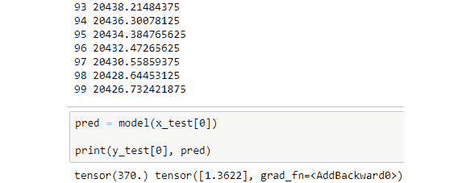

###### 图 2.29:活动的输出

## 三、使用 DNNs 的分类问题

### 活动 4:构建人工神经网络

解决方案:

1.  导入以下库:

    ```py
    import pandas as pd
    import numpy as np
    from sklearn.model_selection import train_test_split
    from sklearn.utils import shuffle
    from sklearn.metrics import accuracy_score
    import torch
    from torch import nn, optim
    import torch.nn.functional as F
    import matplotlib.pyplot as plt
    ```

2.  读取之前准备好的数据集，它应该已经被命名为`dccc_prepared.csv` :

    ```py
    data = pd.read_csv("dccc_prepared.csv")
    ```

3.  从目标中分离特征:

    ```py
    X = data.iloc[:,:-1]
    y = data["default payment next month"]
    ```

4.  Using scikit-learn's `train_test_split` function, split the dataset into training, validation, and testing sets. Use a 60/20/20% split ratio. Set `random_state` as 0:

    ```py
    X_new, X_test, y_new, y_test = train_test_split(X, y, test_size=0.2, random_state=0)
    dev_per = X_test.shape[0]/X_new.shape[0]
    X_train, X_dev, y_train, y_dev = train_test_split(X_new, y_new, test_size=dev_per, random_state=0)
    ```

    每组的最终形状如下所示:

    ```py
    Training sets: (28036, 22) (28036,)
    Validation sets: (9346, 22) (9346,)
    Testing sets: (9346, 22) (9346,)
    ```

5.  Convert the validation and testing sets to tensors, considering that the features matrices should be of type float, while the target matrices should not.

    暂时不要转换训练集，因为它们将经历进一步的转换。

    ```py
    X_dev_torch = torch.tensor(X_dev.values).float()
    y_dev_torch = torch.tensor(y_dev.values)
    X_test_torch = torch.tensor(X_test.values).float()
    y_test_torch = torch.tensor(y_test.values)
    ```

6.  构建自定义模块类来定义网络层。包括指定将应用于每层输出的激活函数的转发函数。对所有层使用 ReLU，除了输出，在输出中你应该使用`log_softmax` :

    ```py
    class Classifier(nn.Module):
        def __init__(self, input_size):
            super().__init__()
            self.hidden_1 = nn.Linear(input_size, 10)
            self.hidden_2 = nn.Linear(10, 10)
            self.hidden_3 = nn.Linear(10, 10)
            self.output = nn.Linear(10, 2)
        def forward(self, x):
            z = F.relu(self.hidden_1(x))
            z = F.relu(self.hidden_2(z))
            z = F.relu(self.hidden_3(z))
            out = F.log_softmax(self.output(z), dim=1)
            return out
    ```

7.  定义模型训练所需的所有变量。将时期数设置为 50，将批处理大小设置为 128。使用 0.001 的学习率:

    ```py
    model = Classifier(X_train.shape[1])
    criterion = nn.NLLLoss()
    optimizer = optim.Adam(model.parameters(), lr=0.001)
    epochs = 50
    batch_size = 128
    ```

8.  使用训练集数据训练网络。使用验证集来衡量性能。为此，保存每个历元中训练集和验证集的损失和准确度:

    ```py
    train_losses, dev_losses, train_acc, dev_acc= [], [], [], []
    for e in range(epochs):
        X_, y_ = shuffle(X_train, y_train)
        running_loss = 0
        running_acc = 0
        iterations = 0
        for i in range(0, len(X_), batch_size):
            iterations += 1
            b = i + batch_size
            X_batch = torch.tensor(X_.iloc[i:b,:].values).float()
            y_batch = torch.tensor(y_.iloc[i:b].values)
            log_ps = model(X_batch)
            loss = criterion(log_ps, y_batch)
            optimizer.zero_grad()
            loss.backward()
            optimizer.step()
            running_loss += loss.item()
            ps = torch.exp(log_ps)
            top_p, top_class = ps.topk(1, dim=1)
            running_acc += accuracy_score(y_batch, top_class)
            dev_loss = 0
            acc = 0
            with torch.no_grad():
                log_dev = model(X_dev_torch)
                dev_loss = criterion(log_dev, y_dev_torch)
                ps_dev = torch.exp(log_dev)
                top_p, top_class_dev = ps_dev.topk(1, dim=1)
                acc = accuracy_score(y_dev_torch, top_class_dev)
                train_losses.append(running_loss/iterations)
                dev_losses.append(dev_loss)
                train_acc.append(running_acc/iterations)
                dev_acc.append(acc)
                print("Epoch: {}/{}.. ".format(e+1, epochs),
                "Training Loss: {:.3f}.. ".format(running_loss/iterations),
                "Validation Loss: {:.3f}.. ".format(dev_loss),
                "Training Accuracy: {:.3f}.. ".format(running_acc/                                                  iterations),
                "Validation Accuracy: {:.3f}".format(acc))
    ```

9.  Plot the loss of both sets:

    ```py
    plt.plot(train_losses, label='Training loss')
    plt.plot(dev_losses, label='Validation loss')
    plt.legend(frameon=False)
    plt.show()
    ```

    结果图应该与这里的图类似，尽管有一些不同，考虑到对训练数据的洗牌可能会得到稍微不同的结果。

    

    ###### 图 3.10:显示训练和验证损失的图

10.  Plot the accuracy of both sets:

    ```py
    plt.plot(train_acc, label="Training accuracy")
    plt.plot(dev_acc, label="Validation accuracy")
    plt.legend(frameon=False)
    plt.show()
    ```

    下面是从这段代码中得出的图表:

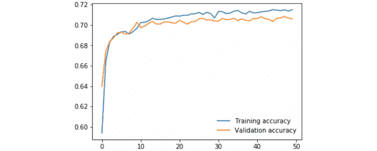

###### 图 3.11:显示器械包精确度的图表

### 活动 5:提高模特的表现

解决方案:

1.  导入与上一练习中相同的库:

    ```py
    import pandas as pd
    import numpy as np
    from sklearn.model_selection import train_test_split
    from sklearn.utils import shuffle
    from sklearn.metrics import accuracy_score
    import torch
    from torch import nn, optim
    import torch.nn.functional as F
    import matplotlib.pyplot as plt
    torch.manual_seed(0)
    ```

2.  加载数据并从目标中分割要素。接下来，使用 60:20:20 的拆分比例将数据拆分为三个子集(培训、验证和测试)。最后，将验证集和测试集转换成 PyTorch 张量，就像您在前面的练习中所做的一样:

    ```py
    data = pd.read_csv("dccc_prepared.csv")
    X = data.iloc[:,:-1]
    y = data["default payment next month"]
    X_new, X_test, y_new, y_test = train_test_split(X, y, test_size=0.2, random_state=0)
    dev_per = X_test.shape[0]/X_new.shape[0]
    X_train, X_dev, y_train, y_dev = train_test_split(X_new, y_new, test_size=dev_per, random_state=0)
    X_dev_torch = torch.tensor(X_dev.values).float()
    y_dev_torch = torch.tensor(y_dev.values)
    X_test_torch = torch.tensor(X_test.values).float()
    y_test_torch = torch.tensor(y_test.values)
    ```

3.  Considering that the model is suffering from high bias, the focus should be on increasing the number of epochs or increasing the size of the network by adding additional layers or units to each layer.

    目标应该是验证集的准确度接近 80%。

    以下代码片段来自性能最佳的模型，该模型是经过多次微调后获得的:

    ```py
    # class defining model's architecture and operations between layers
    class Classifier(nn.Module):
        def __init__(self, input_size):
            super().__init__()
            self.hidden_1 = nn.Linear(input_size, 100)
            self.hidden_2 = nn.Linear(100, 100)
            self.hidden_3 = nn.Linear(100, 50)
            self.hidden_4 = nn.Linear(50,50)
            self.output = nn.Linear(50, 2)
            self.dropout = nn.Dropout(p=0.1)
            #self.dropout_2 = nn.Dropout(p=0.1)
        def forward(self, x):
            z = self.dropout(F.relu(self.hidden_1(x)))
            z = self.dropout(F.relu(self.hidden_2(z)))
            z = self.dropout(F.relu(self.hidden_3(z)))
            z = self.dropout(F.relu(self.hidden_4(z)))
            out = F.log_softmax(self.output(z), dim=1)
            return out
    # parameters definition
    model = Classifier(X_train.shape[1])
    criterion = nn.NLLLoss()
    optimizer = optim.Adam(model.parameters(), lr=0.001)
    epochs = 3000
    batch_size = 128
    # training process
    train_losses, dev_losses, train_acc, dev_acc= [], [], [], []
    x_axis = []
    for e in range(1, epochs + 1):
        X_, y_ = shuffle(X_train, y_train)
        running_loss = 0
        running_acc = 0
        iterations = 0

        for i in range(0, len(X_), batch_size):
            iterations += 1
            b = i + batch_size
            X_batch = torch.tensor(X_.iloc[i:b,:].values).float()
            y_batch = torch.tensor(y_.iloc[i:b].values)

            log_ps = model(X_batch)
            loss = criterion(log_ps, y_batch)
            optimizer.zero_grad()
            loss.backward()
            optimizer.step()

            running_loss += loss.item()
            ps = torch.exp(log_ps)
            top_p, top_class = ps.topk(1, dim=1)
            running_acc += accuracy_score(y_batch, top_class)

        dev_loss = 0
        acc = 0
        # Turn off gradients for validation, saves memory and computations       with torch.no_grad():
            log_dev = model(X_dev_torch)
            dev_loss = criterion(log_dev, y_dev_torch)
            ps_dev = torch.exp(log_dev)
            top_p, top_class_dev = ps_dev.topk(1, dim=1)
            acc = accuracy_score(y_dev_torch, top_class_dev)
        if e%50 == 0 or e == 1:
            x_axis.append(e)

            train_losses.append(running_loss/iterations)
            dev_losses.append(dev_loss)
            train_acc.append(running_acc/iterations)
            dev_acc.append(acc)

            print("Epoch: {}/{}.. ".format(e, epochs),
                  "Training Loss: {:.3f}.. ".format(running_loss/                                                iterations),
                  "Validation Loss: {:.3f}.. ".format(dev_loss),
                  "Training Accuracy: {:.3f}.. ".format(running_acc/                                                    iterations),
                  "Validation Accuracy: {:.3f}".format(acc))
    ```

    #### 注意

    本次活动附带的 Jupyter 笔记本可以在之前共享的 GitHub 资源库中找到。在那里，您会发现对模型进行微调的不同尝试及其结果。表现最好的型号在笔记本的末尾。

4.  Plot the loss and accuracy for both sets of data:

    #### 注意

    请记住，此处显示的结果不会与您的结果完全匹配。这主要是由于在网络训练期间使用的混洗功能。

    ```py
    plt.plot(x_axis,train_losses, label='Training loss')
    plt.plot(x_axis, dev_losses, label='Validation loss')
    plt.legend(frameon=False)
    plt.show()
    ```

    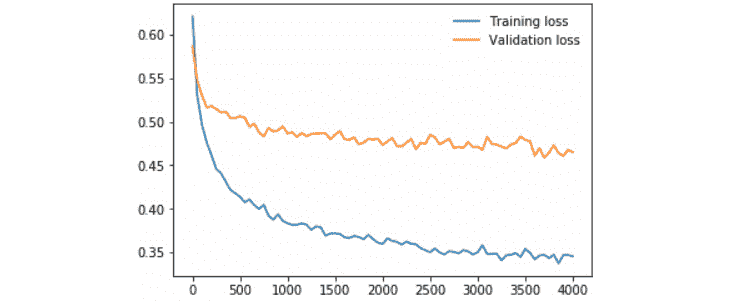

    ###### 图 3.12:显示器械包丢失的图表

    ```py
    plt.plot(x_axis, train_acc, label="Training accuracy")
    plt.plot(x_axis, dev_acc, label="Validation accuracy")
    plt.legend(frameon=False)
    plt.show()
    ```

    

    ###### 图 3.13:显示器械包精确度的图表

5.  Using the best-performing model, perform prediction over the testing set (which should not have been used during the fine-tuning process). Compare the prediction to the ground truth by calculating the accuracy of the model over this set:

    ```py
    model.eval()
    test_pred = model(X_test_torch)
    test_pred = torch.exp(test_pred)
    top_p, top_class_test = test_pred.topk(1, dim=1)
    acc_test = accuracy_score(y_test_torch, top_class_test)
    ```

    通过模型架构和上面定义的参数获得的精度应该在 80%左右。

### 活动 6:利用你的模型

解决方案:

1.  打开您在之前的活动中使用的 Jupyter 笔记本。
2.  Save a Python file containing the class where you define the architecture of your best-performing module. Make sure to import PyTorch's required libraries and modules. Name it `final_model.py`.

    该文件应该如下所示:

    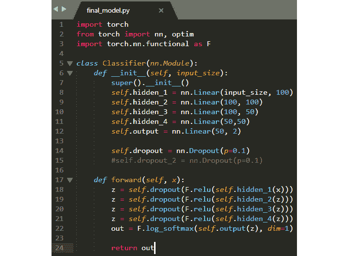

    ###### 图 3.14:final _ model . py 的截图

3.  保存性能最好的模型。确保保存输入单位的信息以及模型的参数。命名为`checkpoint.pth` :

    ```py
    checkpoint = {"input": X_train.shape[1],
                  "state_dict": model.state_dict()}
    torch.save(checkpoint, "checkpoint.pth")
    ```

4.  打开新的 Jupyter 笔记本。
5.  导入 PyTorch，以及之前创建的 Python 文件:

    ```py
    import torch
    import final_model
    ```

6.  创建一个加载模型的函数:

    ```py
    def load_model_checkpoint(path):
        checkpoint = torch.load(path)
        model = final_model.Classifier(checkpoint["input"])
        model.load_state_dict(checkpoint["state_dict"])
        return model
    model = load_model_checkpoint("checkpoint.pth")
    ```

7.  Perform a prediction by inputting the following tensor into your model:

    ```py
    example = torch.tensor([[0.0606, 0.5000, 0.3333, 0.4828, 0.4000, 0.4000, 0.4000, 0.4000, 0.4000, 0.4000, 0.1651, 0.0869, 0.0980, 0.1825, 0.1054, 0.2807, 0.0016, 0.0000, 0.0033, 0.0027, 0.0031, 0.0021]]).float()
    pred = model(example)
    pred = torch.exp(pred)
    top_p, top_class_test = pred.topk(1, dim=1)
    ```

    通过打印`top_class_test`，我们获得了模型的预测，在本例中等于 1 (yes)。

8.  使用 JIT 模块转换模型:

    ```py
    traced_script = torch.jit.trace(model, example, check_trace=False)
    ```

9.  Perform a prediction by inputting the following information to the traced script of your model:

    ```py
    prediction = traced_script(example)
    prediction = torch.exp(prediction)
    top_p_2, top_class_test_2 = prediction.topk(1, dim=1)
    ```

    通过打印`top_class_test_2`，我们从您的模型的跟踪脚本表示中得到预测，它也等于 1(是)。

## 四、卷积神经网络

### 活动 7:为图像分类问题构建 CNN

解决方案:

1.  导入以下库:

    ```py
    import numpy as np
    import torch
    from torch import nn, optim
    import torch.nn.functional as F
    from torchvision import datasets
    import torchvision.transforms as transforms
    from torch.utils.data.sampler import SubsetRandomSampler
    from sklearn.metrics import accuracy_score
    import matplotlib.pyplot as plt
    ```

2.  设置要对数据执行的转换，这将是数据到张量的转换和像素值的归一化:

    ```py
    transform = transforms.Compose([transforms.ToTensor(), transforms.Normalize((0.5, 0.5, 0.5), (0.5, 0.5, 0.5))])
    ```

3.  设置 100 个图像的批量大小，并从`CIFAR10`数据集:

    ```py
    batch_size = 100
    train_data = datasets.CIFAR10('data', train=True, download=True, transform=transform)
    test_data = datasets.CIFAR10('data', train=False, download=True, transform=transform)
    ```

    下载训练和测试数据
4.  使用 20%的验证大小，定义将用于将数据集分成这两个集合的训练和验证采样器:

    ```py
    dev_size = 0.2
    idx = list(range(len(train_data)))
    np.random.shuffle(idx)
    split_size = int(np.floor(dev_size * len(train_data)))
    train_idx, dev_idx = idx[split_size:], idx[:split_size]
    train_sampler = SubsetRandomSampler(train_idx)
    dev_sampler = SubsetRandomSampler(dev_idx)
    ```

5.  使用`DataLoader()`功能定义要使用的每组数据的批次:

    ```py
    train_loader = torch.utils.data.DataLoader(train_data, batch_size=batch_size, sampler=train_sampler)
    dev_loader = torch.utils.data.DataLoader(train_data, batch_size=batch_size, sampler=dev_sampler)
    test_loader = torch.utils.data.DataLoader(test_data, batch_size=batch_size)
    ```

6.  定义您的网络架构。为此，请使用以下信息:
    *   Conv1:卷积层，将彩色图像作为输入，并通过 10 个大小为 3 的过滤器。填充和步幅都应设置为 1。
    *   Conv2:将输入数据通过 20 个大小为 3 的过滤器的卷积层。填充和步幅都应设置为 1。
    *   Conv3:将输入数据通过 40 个大小为 3 的过滤器的卷积层。填充和步幅都应设置为 1。
    *   在每个卷积层之后使用 ReLU 激活函数。
    *   每个卷积层之后的池层，过滤器大小和步幅为 2。
    *   展平图像后，一个设定为 20%的下降项。
    *   Linear1:一个完全连接的层，接收来自前一层的展平矩阵作为输入，并生成 100 个单位的输出。对该层使用 ReLU 激活功能。这里的退出项设置为 20%。
    *   Linear2:一个全连接的层，生成 10 个输出，每个类标签一个。对输出层使用`log_softmax`激活功能:

        ```py
        class CNN(nn.Module):
            def __init__(self):
                super(CNN, self).__init__()
                self.conv1 = nn.Conv2d(3, 10, 3, 1, 1)
                self.conv2 = nn.Conv2d(10, 20, 3, 1, 1)
                self.conv3 = nn.Conv2d(20, 40, 3, 1, 1)
                self.pool = nn.MaxPool2d(2, 2)

                self.linear1 = nn.Linear(40 * 4 * 4, 100)
                self.linear2 = nn.Linear(100, 10)
                self.dropout = nn.Dropout(0.2)
            def forward(self, x):
                x = self.pool(F.relu(self.conv1(x)))
                x = self.pool(F.relu(self.conv2(x)))
                x = self.pool(F.relu(self.conv3(x)))

                x = x.view(-1, 40 * 4 * 4)
                x = self.dropout(x)
                x = F.relu(self.linear1(x))
                x = self.dropout(x)
                x = F.log_softmax(self.linear2(x), dim=1)

                return x
        ```

7.  定义训练模型所需的所有参数。训练它 100 个纪元:

    ```py
    model = CNN()
    loss_function = nn.NLLLoss()
    optimizer = optim.Adam(model.parameters(), lr=0.001)
    epochs = 50
    ```

8.  训练您的网络，并确保保存训练集和验证集的损失值和准确度值:

    ```py
    train_losses, dev_losses, train_acc, dev_acc= [], [], [], []
    x_axis = []
    for e in range(1, epochs+1):
        losses = 0
        acc = 0
        iterations = 0

        model.train()
        for data, target in train_loader:
            iterations += 1
            pred = model(data)
            loss = loss_function(pred, target)
            optimizer.zero_grad()
            loss.backward()
            optimizer.step()

            losses += loss.item()
            p = torch.exp(pred)
            top_p, top_class = p.topk(1, dim=1)
            acc += accuracy_score(target, top_class)

        dev_losss = 0
        dev_accs = 0
        iter_2 = 0

        if e%5 == 0 or e == 1:
            x_axis.append(e)

            with torch.no_grad():
                model.eval()

                for data_dev, target_dev in dev_loader:
                    iter_2 += 1

                    dev_pred = model(data_dev)
                    dev_loss = loss_function(dev_pred, target_dev)
                    dev_losss += dev_loss.item()
                    dev_p = torch.exp(dev_pred)
                    top_p, dev_top_class = dev_p.topk(1, dim=1)
                    dev_accs += accuracy_score(target_dev,                 dev_top_class)

            train_losses.append(losses/iterations)
            dev_losses.append(dev_losss/iter_2)
            train_acc.append(acc/iterations)
            dev_acc.append(dev_accs/iter_2)

            print("Epoch: {}/{}.. ".format(e, epochs),
                  "Training Loss: {:.3f}.. ".format(losses/iterations),
                  "Validation Loss: {:.3f}.. ".format(dev_losss/iter_2),
                  "Training Accuracy: {:.3f}.. ".format(acc/iterations),
                  "Validation Accuracy: {:.3f}".format(dev_accs/iter_2))
    ```

9.  Plot the loss and accuracy of both sets:

    ```py
    plt.plot(x_axis,train_losses, label='Training loss')
    plt.plot(x_axis, dev_losses, label='Validation loss')
    plt.legend(frameon=False)
    plt.show()
    ```

    生成的图应该类似于下图:

    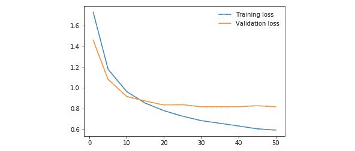

    ###### 图 4.19:显示集合丢失的结果图

    ```py
    plt.plot(x_axis, train_acc, label="Training accuracy")
    plt.plot(x_axis, dev_acc, label="Validation accuracy")
    plt.legend(frameon=False)
    plt.show()
    ```

    精度应该类似于下图:

    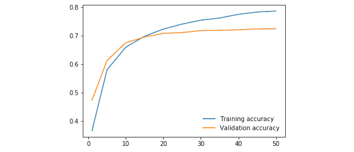

    ###### 图 4.20:显示集合精确度的结果图

    可以看出，在第十五个时期之后，过度拟合开始影响模型。

10.  Check the model's accuracy on the testing set:

    ```py
    model.eval()
    iter_3 = 0
    acc_test = 0
    for data_test, target_test in test_loader:
        iter_3 += 1
        test_pred = model(data_test)
        test_pred = torch.exp(test_pred)
        top_p, top_class_test = test_pred.topk(1, dim=1)
        acc_test += accuracy_score(target_test, top_class_test)
    print(acc_test/iter_3)
    ```

    测试集的准确性与其他 2 个集的准确性非常相似，这意味着该模型能够在看不见的数据上表现得同样好。应该在 72%左右。

### 活动 8:实施数据扩充

解决方案:

1.  Duplicate the notebook from the previous activity.

    为了解决这个活动，除了下一步中提到的变量定义之外，不需要修改任何代码。

2.  更改`transform`变量的定义，除了将数据标准化并转换为张量外，还包括以下转换:
    *   对于训练/验证集，一个概率为 50% (0.5)的`RandomHorizontalFlip`函数和一个概率为 10% (0.1)的`RandomGrayscale`函数。
    *   对于测试集，不要添加任何其他转换:

        ```py
        transform = {
            "train": transforms.Compose([
            transforms.RandomHorizontalFlip(0.5), 
            transforms.RandomGrayscale(0.1),
            transforms.ToTensor(),
            transforms.Normalize((0.5, 0.5, 0.5), (0.5, 0.5, 0.5))]),
            "test": transforms.Compose([
            transforms.ToTensor(),
            transforms.Normalize((0.5, 0.5, 0.5), (0.5, 0.5, 0.5))])}
        ```

3.  Train the model for 100 epochs.

    训练集和验证集的损失和准确度的结果图应类似于如下所示:

    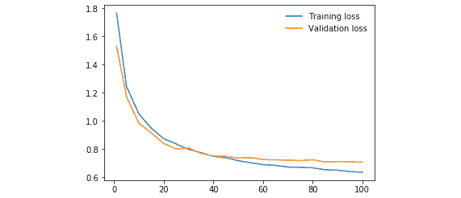

    ###### 图 4.21:显示器械包丢失的结果图

    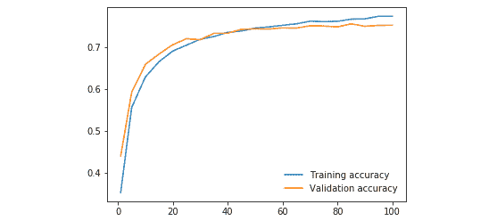

    ###### 图 4.22:显示集合精确度的结果图

    通过添加数据扩充，可以提高模型的性能，并减少正在发生的过拟合。

4.  Calculate the accuracy of the resulting model on the testing set.

    该模型在测试集上的性能达到了 76%左右。

### 活动 9:实现批量标准化

解决方案:

1.  复制上一个活动中的笔记本。
2.  Add batch normalization to each convolutional layer, as well as to the first fully-connected layer.

    网络的最终架构应该如下所示:

    ```py
    class Net(nn.Module):
        def __init__(self):
            super(Net, self).__init__()
            self.conv1 = nn.Conv2d(3, 10, 3, 1, 1)
            self.norm1 = nn.BatchNorm2d(10)
            self.conv2 = nn.Conv2d(10, 20, 3, 1, 1)
            self.norm2 = nn.BatchNorm2d(20)
            self.conv3 = nn.Conv2d(20, 40, 3, 1, 1)
            self.norm3 = nn.BatchNorm2d(40)
            self.pool = nn.MaxPool2d(2, 2)
            self.linear1 = nn.Linear(40 * 4 * 4, 100)
            self.norm4 = nn.BatchNorm1d(100)
            self.linear2 = nn.Linear(100, 10)
            self.dropout = nn.Dropout(0.2)
        def forward(self, x):
            x = self.pool(self.norm1(F.relu(self.conv1(x))))
            x = self.pool(self.norm2(F.relu(self.conv2(x))))
            x = self.pool(self.norm3(F.relu(self.conv3(x))))
            x = x.view(-1, 40 * 4 * 4)
            x = self.dropout(x)
            x = self.norm4(F.relu(self.linear1(x)))
            x = self.dropout(x)
            x = F.log_softmax(self.linear2(x), dim=1)
            return x
    ```

3.  Train the model for 100 epochs.

    训练集和验证集的损失和准确性的结果图应类似于下面显示的图:

    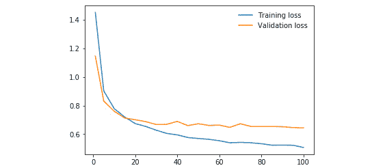

    ###### 图 4.23:显示器械包丢失的结果图

    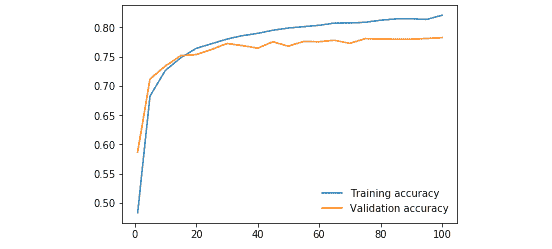

    ###### 图 4.24:显示集合丢失的结果图

    虽然过度拟合再次被引入到模型中，但可以看到两组的性能都有所提高。

    #### 注意

    虽然本章没有探讨，但理想的做法是在网络架构中增加压差，以降低高方差。请随意尝试，看看您是否能够进一步提高性能。

4.  Calculate the accuracy of the resulting model on the testing set.

    模型在测试集上的准确率应该在 78%左右。

## 五、风格转移

### 活动 10:进行风格转移

解决方案:

#### 注意

为了能够多次(30，000 次)运行该活动，使用了 GPU。根据这一点，可以在 GitHub 的资源库中找到一个副本，该副本将下面的代码改编为使用 GPU 工作。

1.  导入所需的库:

    ```py
    import numpy as np
    import torch
    from torch import nn, optim
    from PIL import Image
    import matplotlib.pyplot as plt
    from torchvision import transforms, models
    ```

2.  指定要对输入图像执行的变换。一定要把它们调整到相同的大小，转换成张量，并归一化:

    ```py
    imsize = 224
    loader = transforms.Compose([
    transforms.Resize(imsize), 
    transforms.ToTensor(),
    transforms.Normalize((0.485, 0.456, 0.406), (0.229, 0.224, 0.225))])
    ```

3.  定义一个图像加载函数。它应该打开图像并加载它。调用图像加载器函数加载两幅输入图像:

    ```py
    def image_loader(image_name):
        image = Image.open(image_name)
        image = loader(image).unsqueeze(0)
        return image
    content_img = image_loader("img/landscape.jpg")
    style_img = image_loader("img/monet.jpg")
    ```

4.  为了能够显示图像，设置转换以恢复图像的正常化，并将张量转换为 PIL 图像:

    ```py
    unloader = transforms.Compose([
    transforms.Normalize((-0.485/0.229, -0.456/0.224, -0.406/0.225), (1/0.229, 1/0.224, 1/0.225)),
    transforms.ToPILImage()])
    ```

5.  创建一个能够在张量上执行上述变换的函数。为两幅图像调用函数并绘制结果:

    ```py
    def tensor2image(tensor):
        image = tensor.clone()
        image = image.squeeze(0)
        image = unloader(image)
        return image
    plt.figure()
    plt.imshow(tensor2image(content_img))
    plt.title("Content Image")
    plt.show()
    plt.figure()
    plt.imshow(tensor2image(style_img))
    plt.title("Style Image")
    plt.show()
    ```

6.  装载 VGG-19 型号:

    ```py
    model = models.vgg19(pretrained=True).features
    for param in model.parameters():
        param.requires_grad_(False)
    ```

7.  创建将相关层的索引(键)映射到名称(值)的字典。然后，创建一个函数来提取相关图层的要素地图。使用它们来提取两个输入图像的特征:

    ```py
    relevant_layers = {'0': 'conv1_1', '5': 'conv2_1', '10': 'conv3_1', '19': 'conv4_1', '21': 'conv4_2', '28': 'conv5_1'}
    def features_extractor(x, model, layers):
        features = {}
        for index, layer in model._modules.items():
            if index in layers:
                x = layer(x)
                features[layers[index]] = x
        return features
    content_features = features_extractor(content_img, model, relevant_layers)
    style_features = features_extractor(style_img, model, relevant_layers)
    ```

8.  计算样式特征的 gram 矩阵。另外，创建初始目标图像:

    ```py
    style_grams = {}
    for i in style_features:
        layer = style_features[i]
        _, d1, d2, d3 = layer.shape
        features = layer.view(d1, d2 * d3)
        gram = torch.mm(features, features.t())
    style_grams[i] = gram
    target_img = content_img.clone().requires_grad_(True)
    ```

9.  设置不同样式层的权重，以及内容和样式损失的权重:

    ```py
    style_weights = {'conv1_1': 1., 'conv2_1': 0.8, 'conv3_1': 0.6, 'conv4_1': 0.4, 'conv5_1': 0.2}
    alpha = 1
    beta = 1e6
    ```

10.  Run the model for 500 iterations. Define the Adam optimization algorithm before starting to train the model, using 0.001 as the learning rate.

    #### 注意

    为了获得最终的目标图像，代码运行了 30，000 次迭代，这在没有 GPU 的情况下需要很长时间才能运行。然而，要了解输出图像中开始发生的变化，只需运行 500 次迭代就足够了，但是鼓励您测试不同的训练时间。

    ```py
    for i in range(1, iterations+1):

        target_features = features_extractor(target_img, model,                                          relevant_layers)
        content_loss = torch.mean((target_features['conv4_2'] -                                content_features['conv4_2'])**2)

        style_losses = 0
        for layer in style_weights:

            target_feature = target_features[layer]
            _, d1, d2, d3 = target_feature.shape

            target_reshaped = target_feature.view(d1, d2 * d3)
            target_gram = torch.mm(target_reshaped, target_reshaped.t())
            style_gram = style_grams[layer]

            style_loss = style_weights[layer] * torch.mean((target_gram -                                                         style_gram)**2)
            style_losses += style_loss / (d1 * d2 * d3)

        total_loss = alpha * content_loss + beta * style_loss

        optimizer.zero_grad()
        total_loss.backward()
        optimizer.step()

        if  i % print_statement == 0 or i == 1:
            print('Total loss: ', total_loss.item())
            plt.imshow(tensor2image(target_img))
            plt.show()
    ```

11.  Plot both content and target images to compare the results:

    ```py
    fig, (ax1, ax2) = plt.subplots(1, 2, figsize=(20, 10))
    ax1.imshow(tensor2image(content_img))
    ax2.imshow(tensor2image(target_img))
    plt.show()
    ```

    以下是从这段代码中得出的情节:

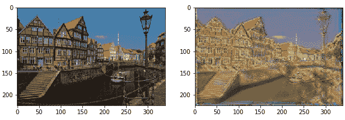

###### 图 5.10:内容和目标图像的绘图

## 六、用 RNNs 分析数据序列

### 活动 11:使用简单的 RNN 进行时间序列预测

解决方案:

1.  导入所需的库，如下:

    ```py
    import pandas as pd
    import matplotlib.pyplot as plt
    import torch
    from torch import nn, optim
    ```

2.  将种子设置为 0，使用下面的代码行复制本书中的结果:

    ```py
    torch.manual_seed(10)
    ```

3.  加载数据集，然后对其进行切片，使其包含所有行，但只包含从索引 1 到 52 的列:

    ```py
    data = pd.read_csv("Sales_Transactions_Dataset_Weekly.csv")
    data = data.iloc[:,1:53]
    data.head()
    ```

4.  从整个数据集中随机选择五种产品，按周绘制销售交易图。进行随机采样时使用随机种子 0，以获得与当前活动相同的结果:

    ```py
    plot_data = data.sample(5, random_state=0)
    x = range(1,53)
    plt.figure(figsize=(10,5))
    for i,row in plot_data.iterrows():
        plt.plot(x,row)
        plt.legend(plot_data.index)
        plt.xlabel("Weeks")
        plt.ylabel("Sales transactions per product")
    plt.show()
    ```

5.  由此产生的情节应该看起来如下: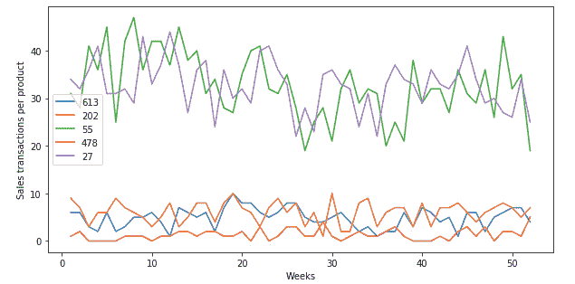

    ###### 图 6.21:输出图

6.  创建`inputs`和`targets`变量，这些变量将被输入网络以创建模型。这些变量应该具有相同的形状，并转换为 PyTorch 张量。
7.  `inputs`变量应该包含所有周的所有产品的数据，除了最后一周——因为模型的想法是预测最后一周。
8.  `targets`变量应该比`inputs`变量早一步——也就是说，`targets`变量的第一个值应该是输入变量的第二个值，依此类推，直到目标变量的最后一个值(应该是在`inputs`变量之外的最后一周):

    ```py
    data_train = data.iloc[:,:-1]
    inputs = torch.Tensor(data_train.values).unsqueeze(1)
    targets = data_train.shift(-1, axis="columns", fill_value=data.iloc[:,-1]).astype(dtype = "float32")
    targets = torch.Tensor(targets.values)
    ```

9.  创建一个包含网络架构的类；注意，全连接层的输出大小应该是 1:

    ```py
    class RNN(nn.Module):
        def __init__(self, input_size, hidden_size, num_layers):
            super().__init__()
            self.hidden_size = hidden_size
            self.rnn = nn.RNN(input_size, hidden_size, num_layers,                           batch_first=True)
            self.output = nn.Linear(hidden_size, 1)

        def forward(self, x, hidden):
            out, hidden = self.rnn(x, hidden)
            out = out.view(-1, self.hidden_size)
            out = self.output(out)

            return out, hidden
    ```

10.  初始化包含模型的`class`函数；然后，馈入输入大小，每个递归层的神经元数(10)，递归层数(1):

    ```py
    model = RNN(data_train.shape[1], 10, 1) 
    ```

11.  定义损失函数、优化算法和训练网络的时期数；例如，您可以使用均方误差损失函数、Adam 优化器和 10，000 个历元:

    ```py
    loss_function = nn.MSELoss()
    optimizer = optim.Adam(model.parameters(), lr=0.001)
    epochs = 10000
    ```

12.  Use a `for` loop to perform the training process by going through all the epochs. In each epoch, a prediction must be made, along with the subsequent calculation of the loss function and the optimization of the parameters of the network. Save the loss of each of the epochs:

    #### 注意

    考虑到没有使用批处理来遍历数据集，隐藏变量实际上并没有在递归层之外使用(在处理序列的每个元素期间使用隐藏状态)，但是为了清楚起见，它被留在这里。

    ```py
    losses = []
    for i in range(1, epochs+1):
        hidden = None
        pred, hidden = model(inputs, hidden)
        loss = loss_function(targets, pred)
        optimizer.zero_grad()
        loss.backward()
        optimizer.step()
        losses.append(loss.item())
        if i%1000 == 0:
            print("epoch: ", i, "=... Loss function: ", losses[-1])
    ```

13.  绘制所有时期的损失，如下:

    ```py
    x_range = range(len(losses))
    plt.plot(x_range, losses)
    plt.xlabel("epochs")
    plt.ylabel("Loss function")
    plt.show()
    ```

14.  由此产生的情节应该看起来如下: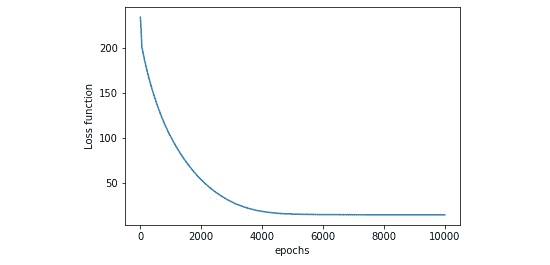

    ###### 图 6.22:显示所有时期损失的图

15.  使用散点图，显示在训练过程的最后一个时期获得的预测与基础真实值(即上周的销售交易):

    ```py
    x_range = range(len(data))
    target = data.iloc[:,-1].values.reshape(len(data),1)
    plt.figure(figsize=(15,5))
    plt.scatter(x_range[:20], target[:20])
    plt.scatter(x_range[:20], pred.detach().numpy()[:20])
    plt.legend(["Ground truth", "Prediction"])
    plt.xlabel("Product")
    plt.ylabel("Sales Transactions")
    plt.xticks(range(0, 20))
    plt.show()
    ```

16.  最终的剧情应该是这样的:

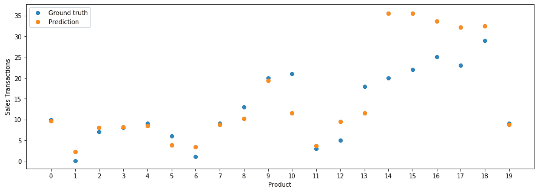

###### 图 6.23:显示预测的散点图

### 活动 12:利用 LSTM 网络生成文本

解决方案:

1.  导入所需的库，如下所示:

    ```py
    import math
    import numpy as np
    import matplotlib.pyplot as plt
    import torch
    from torch import nn, optim
    import torch.nn.functional as F
    ```

2.  打开*爱丽丝梦游仙境*中的文字，并朗读到笔记本中。打印前 100 个字符的摘录和文本文件的总长度:

    ```py
    with open('alice.txt', 'r', encoding='latin1') as f:
        data = f.read()
        print("Extract: ", data[:50])
        print("Length: ", len(data))
    ```

3.  创建一个包含数据集中未复制字符列表的变量。然后，创建一个字典，将每个字符映射到一个整数，其中字符是键，整数是值:

    ```py
    chars = list(set(data))
    indexer = {char: index for (index, char) in enumerate(chars)}
    ```

4.  将数据集的每个字母编码成成对的整数。打印前 100 个编码字符和数据集编码版本的总长度:

    ```py
    indexed_data = []
    for c in data:
        indexed_data.append(indexer[c])

    print("Indexed extract: ", indexed_data[:50])
    print("Length: ", len(indexed_data))
    ```

5.  创建一个函数，它接收一个批处理并将其编码为一个热矩阵:

    ```py
    def index2onehot(batch):
        batch_flatten = batch.flatten()
        onehot_flat = np.zeros((batch.shape[0] * batch.shape[1],len(indexer)))
        onehot_flat[range(len(batch_flatten)), batch_flatten] = 1
        onehot = onehot_flat.reshape((batch.shape[0],
        batch.shape[1], -1))
        return onehot
    ```

6.  创建定义网络架构的类。这个类应该包含一个额外的函数来初始化 LSTM 层的状态:

    ```py
    class LSTM(nn.Module):
        def __init__(self, char_length, hidden_size, n_layers):
            super().__init__()
            self.hidden_size = hidden_size
            self.n_layers = n_layers
            self.lstm = nn.LSTM(char_length, hidden_size,
            n_layers, batch_first=True)
            self.output = nn.Linear(hidden_size, char_length)
        def forward(self, x, states):
            out, states = self.lstm(x, states)
            out = out.contiguous().view(-1, self.hidden_size)
            out = self.output(out)
            return out, states
        def init_states(self, batch_size):
            hidden = next(self.parameters()).data.new(
            self.n_layers, batch_size,
            self.hidden_size).zero_()
            cell = next(self.parameters()).data.new(self.n_layers,                                                batch_size,                                                 self.hidden_size).                                                zero_()
            states = (hidden, cell)
            return states
    ```

7.  确定要从数据集创建的批次数量，记住每个批次应包含 100 个序列，每个序列的长度为 50。接下来，将编码数据分成 100 个序列:

    ```py
    n_seq = 100 ## Number of sequences per batch
    seq_length =  50
    n_batches = math.floor(len(indexed_data) / n_seq / seq_length)
    total_length = n_seq * seq_length * n_batches
    x = indexed_data[:total_length]
    x = np.array(x).reshape((n_seq,-1))
    ```

8.  初始化你的模型，使用 256 作为总共 2 个递归层的隐藏单元数:

    ```py
    model = LSTM(len(chars), 256, 2)
    ```

9.  定义损失函数和优化算法。使用 Adam 优化器和交叉熵损失:

    ```py
    loss_function = nn.CrossEntropyLoss()
    optimizer = optim.Adam(model.parameters(), lr=0.001)
    epochs = 20
    ```

10.  训练网络 20 个历元，记住，在每个历元中，数据必须被分成序列长度为 50 的批。这意味着，每个历元有 100 个历元，每个历元的序列为 50:

    ```py
    losses = []
    for e in range(1, epochs+1):
        states = model.init_states(n_seq)
        batch_loss = []

        for b in range(0, x.shape[1], seq_length):
            x_batch = x[:,b:b+seq_length]

            if b == x.shape[1] - seq_length:
                y_batch = x[:,b+1:b+seq_length]
                y_batch = np.hstack((y_batch, indexer["."] *                       np.ones((y_batch.shape[0],1))))
            else:
                y_batch = x[:,b+1:b+seq_length+1]

            x_onehot = torch.Tensor(index2onehot(x_batch))
            y = torch.Tensor(y_batch).view(n_seq * seq_length)

            pred, states = model(x_onehot, states)
            loss = loss_function(pred, y.long())
            optimizer.zero_grad()
            loss.backward(retain_graph=True)
            optimizer.step()

            batch_loss.append(loss.item())

        losses.append(np.mean(batch_loss))

        if e%1 == 0:
            print("epoch: ", e, "... Loss function: ", losses[-1])
    ```

11.  绘制`loss`函数随时间的进度:

    ```py
    x_range = range(len(losses))
    plt.plot(x_range, losses)
    plt.xlabel("epochs")
    plt.ylabel("Loss function")
    plt.show()
    ```

12.  The chart should look as follows:

    ###### Figure 6.24: Chart showing the progress of loss function

13.  Feed the following sentence starter into the trained model and complete the sentence:

    “所以她在心里考虑”

    ```py
    starter = "So she was considering in her own mind "
    states = None
    for ch in starter:
        x = np.array([[indexer[ch]]])
        x = index2onehot(x)
        x = torch.Tensor(x)

        pred, states = model(x, states)
    counter = 0
    while starter[-1] != "." and counter < 50:
        counter += 1
        x = np.array([[indexer[starter[-1]]]])
        x = index2onehot(x)
        x = torch.Tensor(x)

        pred, states = model(x, states)
        pred = F.softmax(pred, dim=1)
        p, top = pred.topk(10)
        p = p.detach().numpy()[0]
        top = top.numpy()[0]
        index = np.random.choice(top, p=p/p.sum())

        starter += chars[index]
        print(starter)
    ```

14.  考虑到在选择每个字符时存在随机因素，最后的句子会有所不同，但是它应该看起来像这样:

    ```py
    So she was considering in her own mind of would the cace to she tount ang to ges seokn.
    ```

15.  考虑到网络一次选择一个字符，而没有对之前创建的单词的长期记忆，前面的句子没有意义。然而，我们可以看到，仅仅经过 20 个时代，网络已经能够形成一些有意义的单词。

### 活动 13:为情感分析执行自然语言处理

解决方案:

1.  导入所需的库:

    ```py
    import pandas as pd
    import numpy as np
    import matplotlib.pyplot as plt
    from string import punctuation
    from sklearn.metrics import accuracy_score
    import torch
    from torch import nn, optim
    import torch.nn.functional as F
    ```

2.  加载包含来自 Amazon 的 1，000 条产品评论的数据集，这些评论带有标签 0(表示负面评论)或 1(表示正面评论)。将数据分成两个变量——一个包含评论，另一个包含标签:

    ```py
    data = pd.read_csv("amazon_cells_labelled.txt", sep="\t",        header=None)
    reviews = data.iloc[:,0].str.lower()
    sentiment = data.iloc[:,1].values
    ```

3.  删除评论中的标点:

    ```py
    for i in punctuation:
        reviews = reviews.str.replace(i,"")
    ```

4.  创建一个包含所有评论词汇的变量。此外，创建一个字典，将每个单词映射到一个整数，其中单词是键，整数是值:

    ```py
    words = ' '.join(reviews)
    words = words.split()
    vocabulary = set(words)
    indexer = {word: index for (index, word) in enumerate(vocabulary)}
    ```

5.  通过将评论中的每个单词替换为成对的整数来对评论数据进行编码:

    ```py
    indexed_reviews = []
    for review in reviews:
        indexed_reviews.append([indexer[word] for word in     review.split()])
    ```

6.  创建一个包含网络架构的类。确保你包含了一个嵌入层:

    ```py
    class LSTM(nn.Module):
        def __init__(self, vocab_size, embed_dim, hidden_size,     n_layers):
            super().__init__()
            self.hidden_size = hidden_size
            self.embedding = nn.Embedding(vocab_size, embed_dim)
            self.lstm = nn.LSTM(embed_dim, hidden_size, n_layers,                     batch_first=True)
            self.output = nn.Linear(hidden_size, 1)

        def forward(self, x):
            out = self.embedding(x)
            out, _ = self.lstm(out)
            out = out.contiguous().view(-1, self.hidden_size)
            out = self.output(out)
            out = out[-1,0]
            out = torch.sigmoid(out)

            return out
    ```

7.  对于 3 个 LSTM 层，使用 64 个嵌入维度和 128 个神经元来初始化模型:

    ```py
    model = LSTM(len(vocabulary), 64, 128, 3)
    ```

8.  定义损失函数、优化算法和要训练的时期数。例如，您可以使用二进制交叉熵损失作为损失函数，Adam 优化器，并训练 10 个时期:

    ```py
    loss_function = nn.BCELoss()
    optimizer = optim.Adam(model.parameters(), lr=0.001)
    epochs = 10
    ```

9.  创建一个`for`循环，通过不同的时期和每一个单独的回顾。对于每个检查，执行预测，计算损失函数，并更新网络的参数。此外，计算训练数据的网络精度:

    ```py
    losses = []
    acc = []
    for e in range(1, epochs+1):
        single_loss = []
        preds = []
        targets = []
        for i, r in enumerate(indexed_reviews):
            if len(r) <= 1:
                continue
            x = torch.Tensor([r]).long()
            y = torch.Tensor([sentiment[i]])

            pred = model(x)
            loss = loss_function(pred, y)
            optimizer.zero_grad()
            loss.backward()
            optimizer.step()

            final_pred = np.round(pred.detach().numpy())
            preds.append(final_pred)
            targets.append(y)
            single_loss.append(loss.item())

        losses.append(np.mean(single_loss))
        accuracy = accuracy_score(targets,preds)
        acc.append(accuracy)
        if e%1 == 0:
            print("Epoch: ", e, "... Loss function: ", losses[-1],         "... Accuracy: ", acc[-1])
    ```

10.  绘制损失函数和精度随时间的变化过程:

    ```py
    x_range = range(len(losses))
    plt.plot(x_range, losses)
    plt.xlabel("epochs")
    plt.ylabel("Loss function")
    plt.show()
    ```

11.  输出图应该如下所示: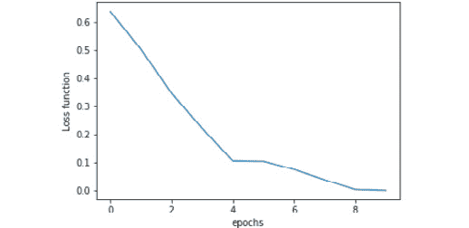

    ###### 图 6.25:显示损失函数进展的图

    ```py
    x_range = range(len(acc))
    plt.plot(x_range, acc)
    plt.xlabel("epochs")
    plt.ylabel("Accuracy score")
    plt.show()
    ```

12.  该图应该如下所示:

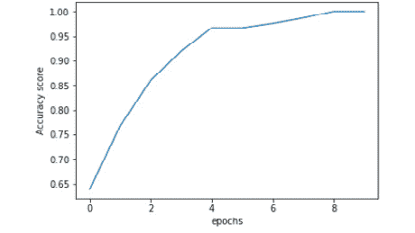

###### 图 6.26:显示精确度进度的图