# 六、用于需求预测的循环神经网络

到目前为止，我们已经收集了一些关于两种变体的全连接前馈神经网络的经验:通过将输入样本分配给一组预定义类别中的一个类别来实现分类任务，或者通过自编码器架构来尝试再现输入向量的形状。在这两种情况下，输出响应仅取决于电流输入矢量的值。在时间，输出响应取决于并且仅取决于在时间的输入向量。网络对之前发生的事情没有记忆，只根据输入产生。

对于**循环神经网络** ( **RNNs** )，我们引入时间成分。我们将发现这样的网络，其中在时间的输出响应取决于当前的输入样本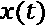，以及先前的输入样本、、… ，其中对过去样本的网络记忆取决于网络架构。

我们将首先介绍 RNNs 的一般概念，然后在一个经典的时间序列分析任务:**需求预测**的领域中介绍**长短时记忆** ( **LSTM** )的具体概念。然后，我们将展示如何不仅向网络馈送静态向量，而且馈送向量序列，例如跨越过去输入信号的个样本的、、、… 。这些建立在训练集上的输入向量(张量)序列用于训练和评估基于 LSTM 的 RNN 的实际实现。

总之，本章将涵盖以下主题:

*   RNNs 简介
*   需求预测问题
*   数据准备–创造过去
*   建立、训练和部署一个位于 LSTM 的 RNN

# 介绍 RNNs

让我们从 RNNs 的概述开始。

**RNNs** 是一类神经网络，不能被限制在前馈架构中。

重要说明

rnn 是通过将自动或反向连接(即循环连接)引入前馈神经网络而获得的。

当引入循环连接时，我们引入时间的概念。这允许 rnn 考虑环境；也就是说，通过捕捉信号的动态来记住来自过去的输入。

引入递归连接将神经网络的性质从静态改变为动态，因此适合于分析时间序列。实际上，rnn 经常被用于创建涉及时间排序序列的问题的解决方案，例如时间序列分析、语言建模、自由文本生成、自动机器翻译、语音识别、图像字幕以及调查给定信号的时间演变的其他类似问题。

## 循环神经网络

如前一节所述，在前馈网络中引入自动或反向连接会将其转换为 RNN。例如，让我们考虑在*图 6.1* 中描述的简单前馈网络，在左边看它的详细表示，在右边看它的紧凑表示:

图 6.1–左边是一个简单的全连接馈电前向网络，右边是其更紧凑的矩阵表示

图 6.1 中*网络的简洁表示包括一个多维输入，一个可能的多维输出，一个由包含神经元图标的方框表示的隐藏层，以及从输入到隐藏层的两个权重矩阵，以及从隐藏到输出层的两个权重矩阵。*

现在让我们向这个网络引入一个循环连接，除了原始输入向量 ( *图 6.2* )之外，将输出向量反馈回输入层。这种对网络架构的简单改变改变了网络行为。以前，网络实现的功能只是，其中是输入样本呈现给网络的当前时间。现在，由循环网络实现的函数呈现形状；也就是说，当前输出取决于当前输入，以及在先前步骤中为先前输入样本产生的输出。我们已经引入了时间的概念:

图 6.2–将循环连接添加到前馈网络

由于这些循环连接，RNNs 的输出也包含输入信号的一点历史。然后我们说他们有记忆。记忆范围延伸到过去多远取决于循环的架构和其中包含的范例。由于这个原因，RNNs 比前馈网络更适合分析序列数据，因为它们也可以处理来自过去的信息。过去的输入信息通过递归连接经由输出反馈代谢到输入层。

现在的问题是如何训练一个输出也依赖于先前输出的网络。可以想象，这些年来已经提出了许多算法。最简单的一种，也是最常被采用的，是**穿越时间的反向传播**(**BPTT**)(good fellow I，Bengio Y .，库维尔 a .，*深度学习*，麻省理工学院出版社，(2016)。

BPTT 是基于随着时间的推移展开网络的概念。为了理解*展开*的概念，让我们在训练期间的不同时间浏览一下网络:

*   在时刻，我们有原始前馈网络，带有权重矩阵和，输入和，输出。
*   在时间，我们再次具有原始前馈网络，具有权重矩阵和，但是这次具有输入和以及输出。
*   在时间，我们再次拥有原始前馈网络，具有权重矩阵和，但是这次具有输入和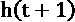以及输出。
*   对于输入序列中的样本，这将继续。

实际上，我们可以用静态权重矩阵和 多次复制同一个原始前馈网络，这与输入序列中的样本一样多(*图 6.3* )。在时间原始网络的每个副本将具有当前输入向量和先前输出向量作为输入。更一般地，在每个时间，网络拷贝将产生输出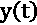和相关状态。状态是网络存储器，并馈送静态网络的下一个副本，而是每个网络副本的专用输出。在一些递归架构中，和是相同的。

我们总结一下。我们有一个具有以下特征的循环网络:

*   由大小的输入张量提供，由一系列 维向量组成
*   产生大小为的输出张量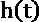，由一系列 维向量组成
*   Producing a state tensor, , related to output tensor , used as the network memory

    重要说明

    这个循环网络也可能只是一个子网络，是一个更大的神经架构中的隐藏单元。在这种情况下，它由前几层的输出提供，其输出构成了更大网络中下几层的输入。那么，就不是全网的输出，而只是这个递归单元的输出——也就是全网的一个中间隐藏状态。

在*图 6.3* 中，我们提出了在*图 6.2* 中简单循环网络的四个时间步上展开:

图 6.3-随着时间的推移展开循环网络

此时，我们已经将递归子网络转换为原始前馈网络的个副本的序列，也就是说，转换为一个更大的静态前馈网络。尽管它可能很大，但我们确实已经知道如何用反向传播算法训练完全连接的前馈网络。因此，反向传播算法已被修改为包括展开过程，并训练产生的前馈网络。这是基本的 BPTT 算法。多年来，BPTT 算法的许多变体也被提出。

我们现在将深入研究最简单的循环网络的细节，即仅由一层循环单元构成的网络。

## 循环神经单元

最简单的循环神经单元由一个只有一个隐藏层的网络组成，具有激活功能，具有自动连接。使用相同的随时间展开过程，我们可以将该单元表示为仅具有一个单元的一个隐藏层的前馈网络的副本(*图 6.4* ):

图 6.4–最简单的循环神经单元

在这种情况下，输出也是网络的状态，它被反馈到 e 输入中——也就是在时间反馈到展开的网络的下一个副本的输入中。

这个简单的递归单元已经显示了一些内存，在某种意义上，当前的输出也依赖于输入层先前呈现的样本。但是，它的架构有点过于简单，无法显示相当大的内存跨度。当然要看任务来解决需要多长的记忆跨度。一个经典的例子是句子补全。

要完成一个句子，你需要知道句子的主题，而要知道主题，你需要知道句子中的前几个词。例如，分析句子*汽车行驶在……*上，我们意识到题目是*汽车*，那么唯一符合逻辑的答案将是*路*。为了完成这个句子，我们只需要记住四个单词。我们现在来看一个更复杂的句子，比如*我爱海滩。我最喜欢的声音是……*的撞击声。在这里，很多答案都是可能的，包括*汽车*、*玻璃*，或者*波浪*。为了理解哪个是逻辑答案，我们需要在句子中回到单词 *beach* ，向后九个单词。分析这句话所需的记忆广度是分析上一句话所需记忆广度的两倍多。这个简短的例子表明，有时需要更长的记忆跨度来给出正确的答案。

简单的循环神经单元提供了一些记忆，但通常不足以解决大多数需要的任务。我们需要更强大的东西，可以追溯到更远的过去，而不仅仅是简单的循环单元所能做的。这正是引入 LSTM 单位的原因。

## 长短期记忆

LSTM 于 1997 年首次介绍了(hoch Reiter，Sepp and Schmidhuber，jürgen(1997)*长短期记忆。神经计算*，9。1735-80.10.1162/ neco.1997.9.8.1735，https://www . researchgate . net/publication/13853244 _ Long _ Short-term _ Memory)。它是一种更复杂的递归单元，使用一个额外的隐藏向量、单元状态或存储器状态、和门的概念。

*图 6.5* 展示了一个展开的 LSTM 单元的结构(C. Olah，*了解 LSTM 网络*，2015，[https://colah.github.io/posts/2015-08-Understanding-LSTMs/](https://colah.github.io/posts/2015-08-Understanding-LSTMs/)):

图 6.5-LSTM 层

如你所见，这个单元的不同副本由两个隐藏向量连接。顶部的一个是单元 st ate 向量，用于使信息通过不同的单元副本。底部的第二个是这个单元的输出向量。

接下来，我们有大门，总共三个。门可以打开或关闭(或部分打开/关闭)，通过这种方式，它们决定在隐藏向量中存储或删除什么。门由一个 sigmoid 函数和一个逐点乘法组成。事实上，sigmoid 函数采用[0，1]中的值。具体来说，删除输入(忘记它)，而让输入不变地通过(记住它)。在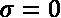和之间，记忆和遗忘的各种细微差别都是可能的。

这些实现门的 sigmoid 层的权重通过学习过程来调整。也就是说，通过进行猜测、反向传播误差和通过梯度下降调整权重的迭代过程，门学习何时允许数据进入、离开或被删除。LSTM 层的训练算法也是反向传播算法的改编。

LSTM 层包含三个门:遗忘门、输入门和输出门(*图 6.5* )。让我们仔细看看这些门。

### 遗忘之门

左起第一个门**遗忘门**，过滤单元状态向量中的分量。基于当前输入向量和前一个单元的输出向量中的值，该门产生一个忘记或记住决定，如下所示:

这里，是遗忘门的权重矩阵。

然后，决定的向量逐点乘以隐藏单元状态向量，以决定从前一状态记住什么()和忘记什么()。

现在的问题是，我们为什么要忘记？如果引入 LSTM 单位是为了获得更长的记忆，为什么我们需要忘记一些东西呢？例如，分析文本语料库中的文档；您可能需要忘记关于前一个文档的所有知识，因为这两个文档可能是不相关的。因此，对于每个新文档，内存都应该重置为 0。

即使在同一个文本中，如果你移动到下一个句子，文本的主题发生了变化，新的主题出现了新的性别，那么你可能要忘记前一个主题的性别，准备加入新的主题，并相应地调整相应的词性。

### 输入门

输入门的目标更简单:它保存新的有用的输入信息。这里，同样，一个 sigmoid 门让输入分量完全通过()，完全阻挡它们()，或者介于两者之间，这取决于它们对最终、当前和未来输出的重要性。

该决定再次执行如下:

这是用一套新的砝码完成的，当然是。

输入门不直接对先前的单元状态进行操作。相反，使用双曲正切层，基于当前输入向量和前一单元的输出向量中的值，创建新的单元候选状态。

这看起来如下:

同样，这是另一组权重，。

输入门现在决定单元候选状态向量的哪个信息应该被添加到单元状态向量中。因此，将候选状态逐点乘以输入门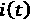的 sigmoid 层的输出，然后添加到过滤后的单元状态向量，最终状态，然后产生以下结果:

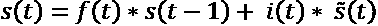

我们在这里做了什么？我们已经向先前的单元状态向量添加了新的内容。假设我们想看课文中的一个新句子，其中是一个不同性别的主语。在遗忘门中，我们忘记了先前存储在细胞状态向量中的性别。现在，我们需要填补空白，将新的性别推入记忆——也就是说，推入新的细胞状态向量。

### 输出门

最后是输出门！我们有新的单元状态，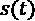，要传递给单元的下一个副本；我们只需要为当前时间输出一些东西。

同样，像所有其他门一样，输出门将 sigmoid 函数应用于输入向量和先前输出向量的所有分量，以便决定从新创建的状态向量到最终输出向量中阻止什么和传递什么。然后，所有决策逐点乘以新创建的状态向量，先前通过函数归一化以落入:

这是该输出门的一组新权重。

在这种情况下，由 LSTM 递归单元产生的输出向量和状态向量是不同的，是的滤波版本。

为什么我们需要不同于晶胞状态的输出？有时候输出需要和内存不同。例如，虽然细胞状态应该将性别的记忆带到下一个单元副本，但输出可能需要产生主体的数量，复数或单数，而不是其性别。

LSTM 层是一种非常强大的循环架构，能够保留大量先前输入的记忆。因此，这些层适合——并且经常用于解决——涉及有序数据序列的问题。如果有序的数据序列是基于时间排序的，那么我们就称之为时间序列。事实上，基于 LSTM 的 RNNs 已经成功地应用于时间序列分析问题。时间序列分析中要解决的一个经典任务是需求预测。在下一节中，我们将探索应用基于 LSTM 的神经网络来解决需求预测问题。

# 需求预测问题

让我们继续探索一个需求预测问题以及如何将它作为一个时间序列分析问题来处理。

需求预测是一项与对未来做出估计的需求相关的任务。我们都同意知道未来会发生什么会让生活变得容易得多。对于生活事件来说是如此，例如，洗衣机和冰箱的价格，或者整个城市的电能需求。了解顾客明天或下周想要多少瓶橄榄油，可以让零售店制定更好的进货计划。知道对汽油或柴油的需求可能会增加，可以让卡车运输公司更好地规划其财务。有无数的例子表明，这种对未来的了解是有帮助的。

## 需求预测

**需求预测**，或需求预测，是数据科学的一大分支。其目标是利用历史数据和其他可能的外部信息对未来需求进行估计。需求预测可以指任何种类的数字:餐馆的游客、发电量、学校新注册人数、啤酒瓶、尿布包、家用电器、时尚服装和配饰等等。需求预测可用于生产计划、库存管理，有时还可用于评估未来的产能需求，或决定是否进入新市场。

需求预测技术通常基于时间序列分析。给定产品、货物或服务的先前需求值被存储并随时间排序以形成时间序列。当时间序列中的过去值被用来预测同一时间序列中的未来值时，我们说的是自回归分析技术。当来自其他外部时间序列的过去值也被用于预测时间序列中的未来值时，那么我们就在谈论多元回归分析技术。

**时间序列分析**是数据科学的一个领域，有很多传统，因为它已经提供了广泛的经典技术。传统的预测技术源于统计学，其顶级技术见于**自回归综合移动平均** ( **ARIMA** )模型及其变体。这些技术需要大量的统计假设，很难验证，并且通常不现实。另一方面，他们满足于相对少量的过去数据。

最近，随着**机器学习**算法的日益流行，一些基于数据的回归技术也被应用于需求预测问题。这些机器学习技术的优点包括缺少所需的统计假设和数据转换的开销较少。缺点是需要大量的数据。此外，请注意，在时间序列的情况下，所有需要的统计假设都得到验证，传统方法往往表现更好。

让我们试着根据过去的值来预测时间序列中的下一个值。当使用机器学习模型进行时间序列分析时，例如线性回归或回归树，我们需要提供过去的样本的向量作为输入，以训练模型预测下一个值。虽然这种策略通常被实现并产生令人满意的结果，但它仍然是一种静态的时间序列分析方法—**static**,因为每个输出响应仅取决于相应的输入向量。模型输入样本的呈现顺序不影响响应。没有输入序列的概念，只有输入向量的概念。

小费

KNIME 分析平台提供了一些节点和标准组件来处理时间序列分析。这里的关键节点是后台的`statsmodels` Python 模块中的`EXAMPLES/00_Components/Time Series`文件夹。因此，它们需要安装 KNIME Python 集成([https://www . KNIME . com/blog/setting-up-the-KNIME-Python-extension-revisited-for-Python-30-and-20](https://www.knime.com/blog/setting-up-the-knime-python-extension-revisited-for-python-30-and-20))。

在*图 6.6* 中，您可以看到 KNIME Analytics 平台中时间序列分析任务的可用组件列表:

图 6.6–EXAMPLES/00 _Components/Time Series 文件夹包含专用于时间序列分析的组件

总的来说，这些使用回归模型的基于机器学习的策略没有充分利用数据的顺序结构，其中在之后的事实携带了一些额外的信息。这就是 RNNs，尤其是 LSTMs，可能在其他机器学习算法上提供优势的地方，这要归功于它们的内部**内存**。

现在让我们介绍本章的案例研究:预测每小时所需的能源需求，单位为**千瓦** ( **千瓦**)。

## 预测能源需求

作为需求预测的一个例子，我们想解决电能预测的问题——也就是说，预测一个普通家庭消费者在下一个小时需要多少千瓦。

能源行业最困难的问题之一是供需匹配。一方面，过度生产能源会浪费资源；另一方面，生产不足会使人们没有现代生活的基本商品。因此，预测每个时间点的电能需求是数据科学中一个非常重要的课题。

出于这个原因，几年前能源公司开始通过智能电表监控每个家庭、商店或其他实体的用电量。2009 年，爱尔兰能源监管委员会(CER)启动了一个试点项目。

智能计量电力**客户行为试验** ( **CBTs** )在 2009 年至 2010 年间进行，有5000 多个爱尔兰家庭和企业参与。试验的目的是评估对消费者电力消耗的影响，以便为全国推广的成本效益分析提供信息。参与试验的 Electric Ireland 住宅和企业客户以及 Bord Gáis 能源企业客户在其家中或其场所安装了智能电表，并同意参与研究，以帮助确定智能电表如何帮助塑造各种人口统计、生活方式和家庭规模的能源使用行为。

原始数据集包含超过 5000 个时间序列，每个时间序列测量每个安装的智能电表一年多一点的用电量。所有原始时间序列都已调整和标准化，以报告每小时的能源计量。

最终目标是预测所有用户的能源需求。在这一点上，我们有一个两难的问题:我们应该为每个时间序列训练一个模型，并对所有预测求和，以获得下一个小时的需求，还是应该为所有时间序列训练一个模型，以获得下一个小时的全局需求？

在单个时间序列上训练一个模型更容易，也可能更准确。然而，训练 5000 个模型(在现实生活中可能更多)会带来一些技术问题。在所有时间序列上训练一个单一模型可能没有那么准确。正如预期的那样，实现了一个折衷的解决方案。智能电能表已根据能源使用情况进行了分组，并计算了每个分组的每小时能源使用量的平均时间序列。现在的目标是计算每个聚类时间序列在下一个小时的能量需求，根据聚类大小对其进行加权，然后对所有贡献进行求和，以找到下一个小时的最终总能量需求。

根据工作日与周末在 24 小时内不同时间使用的能源以及每小时的平均消耗量，检测了 30 个智能仪表群。

关于这个数据准备过程的更多细节可以在 *Data Chef ETL Battles 中找到。用今天的数据可以准备什么？成分主题:能源消耗时间序列*博客文章，可在 https://www.knime.com/blog/EnergyConsumptionTimeSeries,获得，并在*大数据、智能能源和预测分析*白皮书中获得，可在[https://files . knime . com/sites/default/files/inline-images/knime _ Big Data _ Energy _ Time Series _ white paper . pdf](https://files.knime.com/sites/default/files/inline-images/knime_bigdata_energy_timeseries_whitepaper.pdf)获得。

最终数据集包含 30 个集群平均能源使用的 30 个时间序列。每个时间序列显示了给定智能电表集群的电力配置:从商店(工作日上午 9 点到下午 5 点的高能耗)到夜间商业客户(每天晚上 9 点到 6 点的高能耗)，从家庭住户(每个工作日上午 7 点到 9 点的高能耗，然后下午 6 点到晚上 10 点的高能耗)到其他不明确的实体(一周 7 天 24 小时的能源使用)。例如，分类 26 表示商店(*图 6.7* )。在这里，电能主要在所有工作日的上午 9 点到下午 5 点之间使用:

图 6.7–集群 26 每小时的能源使用寿命图

另一方面，集群 13 包括许多餐馆(*图 6.8* )，这些餐馆的能源使用被推到晚上，主要是从下午 6 点到午夜，一周的每一天:

图 6.8–集群 13 每小时的能源使用寿命图

请注意，分类 26 是时间序列分析的典型代表，在一天 24 小时和一周 7 天的序列中具有明显的季节性。在这一章中，我们将继续对星团 26 的时间序列进行自回归分析。目标将是基于过去小时的平均能量使用来预测集群 26 在下一小时的平均能量使用。

现在我们有了一组描述用户群每小时电能使用情况的时间序列，我们将尝试对每个用户群的未来使用情况进行一些预测。我们先来关注一下这个时间序列问题的数据准备。

# 数据准备–创造过去

现在让我们在练习中实现一个需求预测应用程序，使用集群 26 的时间序列。同样，我们将有两个独立的工作流:一个用于培训位于 LSTM 的 RNN，另一个用于在生产中部署它。两个应用程序都将包括数据准备阶段，这两个阶段必须完全相同。在本节中，我们将经历这个数据准备阶段。

处理**时间序列**时，**数据准备**步骤与其他分类或聚类应用中实现的步骤略有不同。让我们来完成这些步骤:

*   **数据加载**:从文件中读取被识别的 30 个集群的平均每小时用电量的时间序列及其对应的时间。
*   **日期和时间标准化**:时间通常从文件中以字符串形式读取。为了确保它得到适当的处理，最好的做法是将其转换成一个 **Date & Time** 对象。有许多节点可以用来以一种适当而简单的方式处理日期时间对象，尤其是以一种标准化的方式。
*   **时间戳对齐**:一旦加载了时间序列，我们需要确保它的采样没有时间漏洞。可能的时间漏洞需要用丢失的值来填充。我们还需要确保时间序列的数据已经按时间排序。
*   **分区**:在这里，我们需要创建一个训练集来训练网络，以及一个测试集来评估它的性能。与分类问题不同，这里我们需要尊重时间顺序，以免将时间序列的过去和未来混在同一个集合中。应该为训练集保留过去的样本，为测试集保留未来的样本。
*   **缺失值插补**:时间序列的缺失值插补也不同于静态数据集中的缺失值插补。由于后一项取决于前一项，大多数时间序列缺失值插补技术都是基于前一项和/或后一项样本值。
*   **创建过去样本的输入向量**:一旦时间序列准备好进行分析，我们就需要构建张量来为网络提供信息。张量必须由过去的样本组成，网络将使用这些样本及时预测下一个样本的值。因此，我们需要为所有的训练和测试记录生成过去维度向量的序列(过去样本)。
*   **创建列表以馈入网络**:最后，必须将过去样本的输入张量转换为值列表，因为这是网络所需的输入格式。

让我们从数据加载开始。

## 数据加载和标准化

数据集通过**文件阅读器**节点从 **CSV** 文件中读取:30 个时间序列和一个日期列。日期列由文件读取器节点作为字符串导入，并且必须被转换成日期&时间对象，以确保它在接下来的步骤中得到适当的处理——例如，排序。**日期&时间**是表示 KNIME 分析平台中日期和时间实体的内部标准对象。为了将一个字符串转换成日期&时间对象，我们使用**字符串来表示日期&时间**节点:

图 6.9–到目前为止的字符串&Tim e 节点及其配置窗口

在配置窗口(*图 6.9* ，您必须选择包含日期和/或时间信息的字符串输入栏，并定义日期/时间格式。您可以通过提供一个字符串格式来手动完成这项工作——例如，`dd.mm.yyyy`表示日，`mm`表示月，`yyyy`表示年。

例如，如果您有`day(2).month(2).year(4)`的日期格式，您可以手动添加选项`dd.MM.yyyy`，如果在**日期格式**选项中没有此项。手动添加日期/时间类型时，必须选择合适的**新类型**选项:**日期或时间**或**日期&时间**。

或者，您可以按下**猜测数据类型和格式**按钮，自动提供日期/时间格式。使用最后一个选项，KNIME Analytics Platform 将解析您的字符串，找出日期/时间格式。大部分时间都管用！如果没有，您可以随时恢复到手动输入日期/时间格式。

小费

在**字符串到数据&时间**节点的节点描述中，您可以找到格式结构中可能的占位符的概述。最重要的是代表年份的 **y** 、代表一年中月份的 **M** 、代表一月中某日的 **d** 、代表一天中某小时的**H**(0 到 23 之间)、代表一小时中某分钟的 **m** 以及代表一分钟中某秒钟的 **s** 。支持更多的占位符——例如， **W** 表示一个月中的某周，或者 **D** 表示一年中的某天。

“日期和时间字符串”节点只是处理日期和时间对象的众多节点之一，所有节点都包含在**节点库**面板的**其他数据类型/时间序列**文件夹中。一些节点操纵日期&时间对象，例如，计算时差或产生时间偏移；其他节点用于将日期&时间对象从一种格式转换为另一种格式。

之后，插入列过滤器节点，只隔离集群 26 的时间序列。这里唯一需要的标准化是关于从字符串到日期和时间对象的日期转换。我们现在可以继续进行数据清理了。

## 数据清理和分区

插入**时间戳对齐**组件来检查时间序列中的时间漏洞。该组件检查所选的时间戳列是否在所选的时间标度内被均匀采样。缺失值将在跳过的采样时间插入。在这种情况下，它检查包含时间戳的 **rowID** 列是否在考虑每小时采样率的情况下丢失了采样时间。

时间戳对齐组件是`EXAMPLES/00_Components/Time Series`中提供的时序专用组件集的一部分。要在工作流中创建实例，只需将其拖放到工作流编辑器中或双击它。

之后，我们将数据分成训练集和测试集，对 LSTM 的 RNN 进行训练和评估。我们在此没有提供额外的验证集来评估整个培训过程中的网络性能。我们决定保持简单，只为 Keras 网络学习者节点提供一个训练集和一个测试集，以测量时间序列预测任务的误差:

图 6.10–分区节点及其配置窗口。请注意用于时间序列分析的 top 数据提取模式

为了将输入数据集分成训练集和测试集，我们再次使用了**分区**节点。这里，我们决定实现 80%–20%的分割:80%的输入数据将用于训练，20%用于测试。此外，我们将提取程序设置为**从顶部提取** ( *图 6.10* )。在一个时间序列分析问题中，我们希望保持数据的内在时间顺序:我们用过去来训练网络，用未来来检验网络。当使用**从顶部提取**数据提取选项时，顶部百分比的数据被指定到顶部输出端口，而底部剩余的数据被指定到下部输出端口。如果数据是从过去到未来按时间排序的，那么这种数据提取方式会保留数据的时间顺序。

重要说明

在时间序列分析问题中，分区应该使用**自顶向下**的数据提取模式，以便保留数据的时间顺序，并使用过去的数据进行训练，使用未来的数据进行测试。

对于每一个数据集，缺失值填补操作都是一个重要的操作；首先，因为神经网络无法处理缺失值，其次，因为选择正确的缺失值插补技术会影响最终结果。

重要说明

缺失值插补必须在时间戳对齐组件之后实现，因为根据定义，该组件会产生缺失值。

在 [*第四章*](B16391_04_Final_NM_ePUB.xhtml#_idTextAnchor101)*构建和训练前馈网络*中，我们已经介绍了**缺失值**节点及其不同的缺失值估算策略。当涉及到顺序数据时，这些策略中的一些特别有用，因为它们考虑了时间序列中的前一个和/或后一个值。可能的策略如下:

*   **平均/线性插值**，用上一个和下一个样本的平均值替换缺失值
*   **移动平均值**，用样本窗口的平均值替换缺失值
*   **下一个**，用下一个样本的值替换缺失值
*   **前一个**，用前一个样本的值替换缺失的值

我们使用前一个值和下一个值之间的线性插值来估算时间序列中的缺失值(*图 6.11* ):

图 6.11–缺失值节点及其配置窗口

用于缺失值插补的公式在训练数据的**缺失值**节点中计算，通过**缺失值(应用)**节点应用于测试数据，并通过模型编写器节点保存到文件中。在训练集上定义的公式的测试集上的纯应用防止测试数据干扰模型训练所需的任何转换的实现。

接下来让我们关注神经网络的输入张量的创建。

## 创建输入张量

我们已经读取了数据，将日期单元格转换为日期&时间对象，分离出聚类 26 的时间序列，将缺失值分配给缺失的采样步骤，将数据分成 80%用于训练集，20%用于测试集，在缺失值插补的前一个值和下一个值之间应用线性插值。数据准备好了，现在是为神经网络创建输入张量的时候了。

重要说明

创建过去样本向量的一个关键节点是滞后列节点，这在时间序列分析中是经常需要的。

*图 6.12* 显示了滞后列节点及其配置窗口 w:

图 6.12–滞后列节点及其配置窗口

**滞后列**节点复制所选列，并将其下移个单元格，其中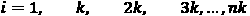个单元格，其中是滞后间隔，是配置窗口中的**滞后**设置。

滞后列节点是一个非常简单但非常强大的节点，在很多情况下都很方便。如果输入列是按时间排序的，那么下移单元格相当于将它们移到过去或未来，这取决于时间顺序。

在*图 6.13* 中，我们解释了这个概念:

图 6.13–滞后列节点在不同时间拍摄同一列的快照，如滞后和滞后间隔设置所定义

考虑到滞后= 4 和滞后间隔= 2，滞后列节点产生选定列的四个副本，每个副本向后移动 2 步。也就是说，除了在当前时间 *t* 选择的列之外，我们还将拥有同一列在时间 *t* -2、 *t* -4、 *t* -6、 *t* -8 ( *图 6.13* )的四个快照。

对于我们的需求预测问题，我们使用集群 26 在最近 200 小时内使用的平均能量值来预测当前小时的平均能量需求。也就是说，我们使用滞后=200 且滞后间隔=1 的滞后列节点，用 200 个刚刚过去的样本构建输入向量(*图 6.12* )。

出于空间原因，我们随后使用**列聚合器**节点将细胞向量转换为细胞集合，因为这是通过 Keras 网络学习器节点向神经网络提供信息的可能格式之一。列聚合器节点是产生**数据单元格列表**的另一种方式。该节点对每行的选定列进行分组，并使用选定的聚合方法聚合它们的单元格。在这种情况下，选择**列表**聚集方法，并将其应用于通过滞后列节点创建的群集 26 的 200 个过去值。

实现数据准备部分为即将到来的需求预测问题提供 RNN 的工作流片段如图*图 6.14* 所示:

图ure 6.14–需求预测的数据准备:日期和时间标准化、时间校准、缺失值插补、创建过去样本的输入向量以及分区

数据准备好了。现在，让我们构建、训练和测试基于 LSTM 的 RNN，以在给定同一集群 26 在前 200 小时中使用的平均能量的情况下，预测集群 26 在当前小时的平均电能需求。

# 建立、训练和部署 LSTM RNN

让我们进行下一步:构建一个简单的基于 LSTM 的需求预测 RNN。首先，我们将训练网络，然后我们将测试它，最后，我们将部署它。在本案例研究中，我们没有为网络使用验证集，也没有对网络的静态超参数(例如，LSTM 层的大小)进行优化。

一个相对简单的网络已经在我们的需求预测任务的测试集上实现了良好的误差测量，因此，我们决定将本节的重点放在如何测试时间序列预测的模型，而不是如何优化神经网络的静态参数。我们在 [*第 5 章*](B16391_05_Final_NM_ePUB.xhtml#_idTextAnchor152) 、*欺诈检测自编码器*中查看了优化循环。一般来说，这个优化循环也可以应用于优化网络超参数。让我们从建立一个基于 LSTM 的 RNN 开始。

## 打造 LSTM RNN

在这个案例研究中，我们选择了最简单的基于 LSTM 的 RNN:只有一个隐藏 LSTM 层的 RNN。因此，最终网络由以下部分组成:

*   一个输入层接受 200 个过去向量的张量-每个过去向量都是前一个样本，即大小为 1-通过 Shape = 200，1 的 Keras 输入层节点获得。
*   一个具有 100 个 LSTM 单位的隐藏层，通过 **Keras LSTM 层**节点接受之前的张量作为唯一输入
*   作为输出的经典密集层，只有一个神经元产生时间序列中下一个样本的预测值，该预测值通过具有 ReLU 激活函数的 Keras 密集层节点获得。

用于构建该神经架构的节点如图*图 6.15* 所示:

图 6.15–建造一个非常基本、非常简单的 LSTM RNN

重要说明

输入张量的大小是[200，1]，它是 200 个 1 大小的向量的序列。如果输入序列的长度未知，我们可以使用*？*表示未知序列长度。下一章的 NLP 案例研究将向你展示一些这样的例子。

我们已经在前面的章节中描述了 Keras 输入层节点和 Keras 密集层节点。让我们探索，在这一节，只是喀拉斯 LSTM 层节点。

重要说明

到目前为止，当我们谈到输入、单元状态和输出时，我们一直使用术语向量。张量是一种更一般化的形式，代表一个沿着 k 维延伸的向量。秩 0 张量等于标量值，秩 1 张量等于向量，秩 2 张量等于矩阵。

注意，Keras LSTM 层节点最多接受三个输入张量:一个输入序列的输入值，两个初始化隐藏状态张量，和。

如果前一个神经层产生多个张量作为输出，在当前 LSTM 层的配置窗口中，通过下拉菜单，您可以选择哪个张量应该用作输入或初始化隐藏状态。

我们将在下一章探索更复杂的神经结构。这里，我们将我们的架构限制在最简单的经典 LSTM 层配置，只接受来自输入层的一个输入张量。在*图 6.16* 的 LSTM 层节点的配置窗口中可以看到作为输入接受的一个输入张量:

图6.16-Keras LSTM 层节点及其配置窗口

对于 LSTM 层，我们可以设置两个激活函数，称为**激活**和**循环激活**。门使用**循环激活**功能来过滤输入组件。选择为**激活**的功能用于创建单元状态的候选项，并在应用输出门之前归一化新的单元状态。这意味着，对于我们在本章中介绍的标准 LSTM 单元，激活**的设置是双曲正切函数，循环激活**的设置是 sigmoid 函数。****

我们设置层来增加 LSTM 单位的不同层的偏差，但决定不使用下降。

**实现**和**展开**设置选项对结果没有任何影响，但可以提高性能，具体取决于您的硬件和序列长度。当激活**展开**复选框时，网络会在训练前展开，这样可以加快学习过程，但是占用内存大，只适合短输入序列。如果未选中，在 TensorFlow 后端会使用一个所谓的符号循环。

您可以选择是将中间输出张量作为完整序列返回，还是仅返回最后一个输出张量(**返回序列**选项)。此外，还可以输出隐藏的单元格状态张量作为输出(**返回状态**选项)。在能源需求预测案例研究中，仅使用 LSTM 单元的最终输出张量来为下一个密集层提供 ReLU 激活函数。因此，这两个复选框没有被激活。

“节点配置”窗口中的其他三个选项卡设置正则化项、初始化策略和学习算法的约束。我们在这一层没有设置任何规则和约束。让我们训练这个网络。

## 培训 LSTM 的 RNN

Keras 网络学习者节点随后在训练集上训练这个位于 LSTM 的 RNN。我们已经知道了这个节点。让我们总结一下本案例研究的配置窗口中使用的规格:

*   接受输入张量，并从数字(双精度)集合转换为**。**
*   通过转换成**数字(双精度)**产生输出向量。
*   在**目标**选项卡中，损失函数被设置为**均方误差** ( **MSE** )。
*   在**选项**选项卡中，历元数设置为`50`，训练批量设置为`256`，训练算法设置为**亚当**——反向传播的优化版本。
*   学习率被设置为`0.001`，没有学习率衰减。

对于在输出层中只有一个神经元的这个网络，训练批次上的 MSE 损失函数采用更简单的形式，并且变成如下:

这里，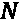是批量，是训练样本的输出值，是对应的目标答案。

由于我们将数字预测和 MSE 作为损失函数进行讨论，因此**学习监视器**视图的**损失**选项卡中的图是评估学习过程时要考虑的图。因为我们试图预测精确的数字，所以在这种情况下准确性没有意义。*图 6.17* 显示了针对该需求预测示例的 Keras 网络学习者节点的**学习监视器**视图:

图 6.17-学习监视器视图的 loss 选项卡中 MSE 损失函数在训练时期的曲线图

*图 6.17* 中的截图显示，经过几次批量训练迭代后，我们达到了可接受的预测误差，至少在训练集上是如此。训练后，应使用 **Keras 网络执行器**节点将网络应用于测试集，并使用 **Keras 网络编写器**节点将其保存为 Keras 文件进行部署。

现在让我们将训练好的 LSTM 网络应用于测试集。

## 测试 LSTM RNN

理论上，要测试网络的性能，我们只需将网络应用于测试集中的输入张量。这很容易用一个 **Keras 网络执行器**节点来完成。

*图 6.18* 显示了**样品内测试**组件的内部:

图 6.18-样品内测试组件的 Insid e

样本内测试组件选择要测试的输入序列的数量(**行过滤器**节点)，然后将它们通过 **Keras 网络执行器**节点，并将预测与相应的目标答案相结合。

之后，在**样本内测试**组件之外，**数字计分器**节点计算一些误差指标，并且**线图(Plotly)** 节点显示原始时间序列和重构的时间序列(最终工作流程见*图* *6.25* )。数字误差指标量化了误差，而折线图直观地展示了预测的可信度。用这种方法生成的预测称为**样本内**预测。

数值计分器节点计算六个误差度量(*图 6.19* ): R2、**平均绝对误差** ( **MAE** )、MSE、**均方根误差** ( **RMSE** )、**平均有符号差** ( **MSD** )、**平均绝对百分比误差** ( **MAPE** )。相应的公式如下所示:

这里，是来自测试集的预测数，是测试样本的输出值，是相应的目标答案。我们选择在 600 个张量的测试集上应用网络，生成相应的预测，并计算误差度量。这是我们得到的结果:

图 6.19–样本内预测 600 值和相应目标值之间的误差测量

每个指标都有其优点和缺点。时间序列预测通常采用的误差是 MAPE、平均误差或均方误差。例如，MAPE 在预测时间序列的下 600 个值上显示只有 9%的误差，这是一个非常好的结果。*图 6.20* 中的曲线证明了这一点:

图 6.20–时间序列中下一个 600 英寸的充足预测值与下一个 600 目标值的对比

这是一个简单的测试。对于每个要预测的值，我们将真实值的先前历史输入网络。这是一种奢侈的情况，我们不能总是负担得起。通常，我们只根据过去的预测值，一个接一个地预测接下来的 600 个值。也就是说，一旦我们训练了网络，我们就用测试集中的前 200 个真实的过去值来触发下一个预测。然而，在这之后，我们基于最新的 199 个真实值加上当前预测的值来预测下一个值；然后再次基于最新的 198 个实际值加上先前预测的值和当前预测的值，等等。这是一种次优但更现实的情况。用这种方法生成的预测称为**样本外**预测，这种测试称为样本外测试。

为了实现样本外测试，我们需要实现将当前预测反馈到过去样本向量中的循环。这个循环也已经在部署工作流中实现了。让我们来看看这个实现的细节。

## 构建部署循环

为了实现样本外测试，我们需要实现上一节描述的循环，其中当前预测值成为下一次预测的过去值的张量的一部分。这是在名为**部署循环** ( *图 6.21* )的组件中完成的，该组件也在最终工作流中的出样测试组件内(*图 6.25* ):

图 6.21–部署 l oop。注意递归循环在每次迭代中都传回新的输入序列

这里，一个`no_preds`，在`no_preds=600`中创建)。

整数配置节点属于一组特殊的配置节点，因此它的配置窗口转移到包含它的组件的配置窗口中。因此，**部署循环**组件有一个配置设置，用于使用递归循环创建预测的数量，如图*图 6.22* 所示:

F 图 6.22–展开回路组件的配置窗口

重要说明

递归循环是 KNIME Analytics 平台中为数不多的循环之一，它允许您将结果传递回去，供下一次迭代使用。

**部署循环**组件使用两个新的重要节点:

*   **Keras 到 TensorFlow 网络转换器节点**:Keras 到 TensorFlow 转换器节点将带有 TensorFlow 后端的 Keras 深度学习模型转换为 TensorFlow 模型。TensorFlow 模型使用 TensorFlow Java API 执行，它通常比通过 Keras Python API 提供的 Python 内核更快。如果我们在递归循环中使用 Keras 网络执行器节点，那么每次迭代都必须启动一个 Python 内核，这会降低网络执行速度。TensorFlow模型使网络执行速度更快。
*   **TensorFlow 网络执行器节点**:tensor flow 网络执行器节点的配置窗口类似于 Keras 网络执行器节点的配置窗口，唯一的区别是后端引擎，在本例中是 tensor flow。

对于样本外测试，部署循环由测试集中的第一个张量触发，并从那里自动生成 600 个预测。在样本外测试组件中，这些预测将与目标值相结合，在样本外测试组件之外，数值误差节点将计算选定的误差指标。

显然，对于样本外测试，误差值变得更大(*图 6.23* )，因为预测误差受到前面步骤中预测误差的影响。例如，MAPE 达到 18%，几乎是样品测试结果的两倍:

图 6.23–样本外预测 600 值和相应目标值之间的误差测量

在*图 6.24* 中，我们可以看到可视化预测时间序列并将其与前 600 个样本外预测的原始时间序列进行比较时的预测误差:

F 图 6.24–时间序列中接下来的 600 个样本外预测值(橙色)与接下来的 600 个目标值(蓝色)

在那里，我们可以看到第一个预测是非常正确的，但是随着我们远离测试集的开始，它们开始恶化。当然，样本内预测不存在这种效应。事实上，第一次样本外预测的误差值与相应的样本内预测的误差值相当。

我们在这里进行了一个非常粗略的时间序列预测，因为我们没有将季节性预测作为一个单独的问题来考虑。我们以某种方式让网络自己管理整个预测，而不分离季节性和残差。对于这个用例，我们的结果是令人满意的。然而，对于更复杂的用例，可以计算季节性指数，减去季节性，然后只对时间序列的残值进行预测。希望这将是一个更简单的问题，并导致更准确的预测。然而，我们对预测误差感到满意，特别是考虑到网络还必须管理季节性的预测。

最终的工作流程，构建、训练和样本内测试网络，如图*图 6.25* 所示:

图 6.25-准备数据以及建立、训练和测试基于时间序列预测问题的 LSTM 网络的最终工作流程

这个工作流程可以在本书的 GitHub 空间中找到。现在让我们转到部署工作流。

## 部署位于 LSTM 的 RNN

此时部署很容易。例如，我们从一个`.table`文件中读取部署数据；然后，我们应用与训练和测试数据相同的数据准备步骤。我们用 200 个过去的样本分离第一个输入序列；我们应用部署循环来生成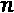新样本(这里，我们使用)；我们在部署循环中应用训练有素的 LSTM RNN；最后，我们用一个线图(Plotly)节点来可视化预测。请注意，这一次没有相对于目标值的预测，因为部署数据是真实世界的数据，而不是实验室数据，因此没有任何目标值可以比较。

部署工作流程如图*图 6.26* 所示，可在 KNIME Hub 上获得，网址为[https://Hub . KNIME . com/kath rin/spaces/Codeless % 20 deep % 20 learning % 20 with % 20 KNIME/latest/Chapter % 206/](https://hub.knime.com/kathrin/spaces/Codeless%20Deep%20Learning%20with%20KNIME/latest/Chapter%206/):

图 6.26–需求预测问题的部署工作流程

这是部署工作流，包括数据读取、与训练工作流中的数据相同的数据准备、网络读取和生成预测的部署循环。

在最后一节中，我们学习了如何将部署循环应用于部署工作流，以在现实生活中生成新的预测。

# 总结

在这一章中，我们介绍了一个新的循环神经单元:LSTM 单元。我们展示了它是如何构建和训练的，以及它如何应用于时间序列分析问题，如需求预测。

作为需求预测问题的一个例子，我们试图预测一群用户在下一个小时消耗的平均能量，给定前 200 个小时使用的能量。我们展示了如何测试样本内和样本外预测，以及一些常用于量化预测误差的数值度量。应用于能源消耗的需求预测只是众多需求预测用例之一。这里学到的相同方法可以应用于预测餐馆中的顾客数量、网站的访问者数量或超市中某类食品的需求量。

在本章中，我们还介绍了 KNIME Analytics 平台中的一个新循环，即递归循环，并且我们提到了一个新的可视化节点，即线图(Plotly)节点。

在下一章中，我们将继续学习 RNNs，关注不同的文本相关的应用。

# 问题和练习

通过回答以下问题，检查您对本章所探讨概念的理解程度:

1.  Why are LSTM units suitable for time series analysis?

    a)。因为它们比传统的前馈网络更快

    b)。因为它们能记住过去的输入张量

    c)。因为他们使用大门

    d)。因为它们有隐藏状态

2.  What is the data extraction option to use for partitioning in time series analysis?

    a)。随机抽取

    b)。从头开始

    c)。分层抽样

    d)。线性抽样

3.  What is a tensor?

    a)。张量是一个二维向量。

    b)。张量是一个 k 维 T2 矢量。

    c)。张量只是一个数字。

    d)。张量是一系列数字。

4.  What is the difference between in-sample and out-sample testing?

    a)。样本内测试使用测试集中真实的过去值来进行预测。样本外测试使用过去的预测值来进行新的预测。

    b)。样本内测试比样本外测试更现实。

    c)。样本内测试比样本外测试更复杂。

    d)。样本内测试应用训练好的网络，而样本外测试使用规则。