# 一、机器学习简介

你大概这几年经常听到**机器学习** ( **ML** )或者**人工智能** ( **AI** )这个名词，尤其是**深度学习** ( **DL** )。这可能是你决定投资这本书并了解更多的原因。鉴于神经网络领域中一些新的、令人兴奋的发展，DL 已经成为 ML 中的一个热门领域。今天，很难想象一个没有语言之间快速文本翻译，或者没有快速歌曲识别的世界。当谈到 DL 改变你的世界的潜力时，这些以及许多其他事情只是冰山一角。当你读完这本书的时候，我们希望你能加入公共汽车，和基于 DL 的令人惊奇的新应用和项目一起前进。

这一章简要介绍了 ML 领域以及如何使用它来解决常见问题。通过这一章，你将被驱使去理解 ML 的基本概念，解决的研究问题，以及它们的重要性。

本章将涵盖以下主题:

*   潜入 ML 生态系统
*   从数据中训练 ML 算法
*   引入深度学习
*   为什么深度学习在今天很重要？

# 潜入 ML 生态系统

从*图 1.1* 中描绘的典型 ML 应用流程，可以看出 ML 具有广泛的应用范围。然而，ML 算法只是一个更大的生态系统的一小部分，这个生态系统有许多移动的部分，然而 ML 正在改变当今世界的生活:

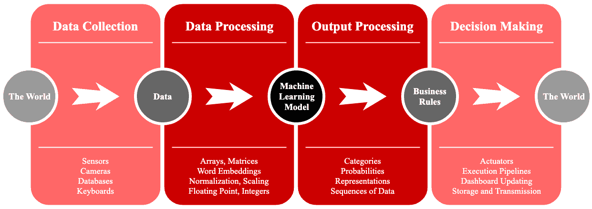

图 1.1 - ML 生态系统。ML 通过数据操作和解释的几个阶段与世界进行交互，以实现整体系统集成

部署的 ML 应用程序通常从数据收集过程开始，该过程使用不同类型的传感器，如照相机、激光器、分光镜或其他类型的直接数据访问，包括本地和远程数据库，或大或小。在最简单的情况下，输入可以通过电脑键盘或智能手机屏幕采集。在这个阶段，收集或感测的数据被认为是原始数据。

原始数据通常在提交给 ML 模型之前进行预处理。原始数据很少是 ML 算法的实际输入，除非 ML 模型旨在找到原始数据的丰富表示，并在以后用作另一个 ML 算法的输入。换句话说，有一些 ML 算法专门用作预处理代理，它们与将对预处理数据进行分类或回归的主 ML 模型完全无关。一般来说，这个数据预处理阶段旨在将原始数据转换为具有特定数据类型的数组或矩阵。一些流行的预处理策略包括:

*   例如，使用 GloVe 或 Word2Vec 进行单词到矢量的转换
*   序列-载体或序列-矩阵策略
*   数值范围标准化，例如，(0，255)到(0.0，1.0)
*   例如，统计值标准化具有零平均值和单位方差

一旦这些预处理措施发生，大多数最大似然算法可以使用这些数据。然而，必须指出，预处理阶段并不简单，它需要操作系统方面的高级知识和技能，有时甚至需要电子学方面的知识和技能。一般来说，一个真正的 ML 应用程序有一条长长的管道，涉及计算机科学和工程的不同方面。

经过处理的数据就是你通常会在书本上看到的，比如你现在正在阅读的这本书。原因是我们需要专注于深度学习，而不是数据处理。如果你希望在这方面有更多的知识，你可以阅读数据科学材料，如 Ojeda，t .*et al .*2014 或 Kane，F. 2017。

从数学上来说，处理后的数据作为一个整体是指使用大写，粗体，字母 ***X*** ，有 ***N*** 行(或数据点)。如果我们想引用数据集的第 *i* 个元素(或行)，我们可以这样写: ***X [i]*** 。数据集将有 *d* 列，它们通常被称为特性*。*考虑特征的一种方式是尺寸。例如，如果数据集有两个特征，身高和体重，那么您可以使用二维绘图来表示整个数据集。第一维度， ***x [1]*** ，(高度)可以是横轴，而第二维度， ***x [2]*** ，(重量)可以是纵轴，如图*图 1.2* 所示:

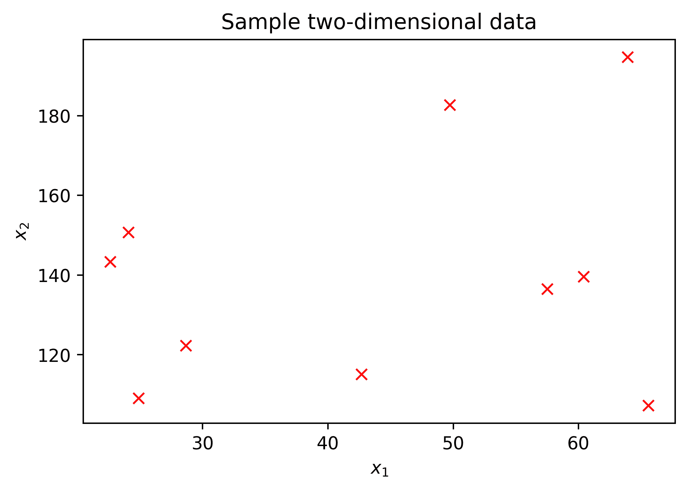

图 1.2 -二维数据示例

在生产过程中，当数据呈现给 ML 算法时，将执行一系列张量积和加法。这种矢量运算通常使用非线性函数进行转换或归一化。然后是更多的乘积和加法、更多的非线性变换、中间值的临时存储，最后产生与输入相对应的期望输出。现在，你可以把这个过程想象成一个 ML 黑盒，当你继续阅读时，它就会显现出来。

ML 产生的与输入相对应的输出通常需要某种类型的解释，例如，如果输出是对象被分类为属于一个组或另一个组的概率的向量，则可能需要解释。为了解释不确定性，你可能需要知道概率有多低，或者为了解释更多的不确定性，你可能需要知道概率的差异有多大。通过使用业务规则，输出处理充当 ML 和决策世界之间的连接因素。这些规则可以是，例如， *if-then* 规则，例如，“如果最大值的预测概率是第二个最大值的两倍，则发布预测；否则，不要继续做决定。”或者它们可以是基于公式的规则或更复杂的方程组。

最后，在决策阶段，ML 算法准备好与世界互动，通过执行器打开灯泡，或者在预测不确定的情况下购买股票，通过提醒经理公司将在三天内耗尽库存，他们需要购买更多商品，或者通过向智能手机扬声器发送音频消息说， “这是去电影院的路线”并通过**应用编程接口** ( **API** )调用或**操作系统** ( **OS** )命令打开地图应用。

这是对生产中的 ML 系统世界的概括。然而，这假设 ML 算法被适当地训练和测试，这是容易的部分，相信我。在本书结束时，你将能够熟练地训练高度复杂的深度学习算法，但现在，让我们介绍一下通用的训练过程。

# 从数据中训练 ML 算法

典型的预处理数据集正式定义如下:

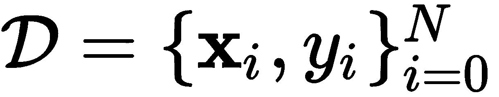

其中 *y* 是对应于输入向量 **x** 的期望输出。因此，ML 的动机是使用高度复杂的张量(向量)乘法和加法，使用数据在 **x** 上找到线性和非线性变换，或者简单地找到测量数据点之间的相似性或距离的方法，最终目的是在给定 **x** 的情况下预测 ***y*** 。

一种常见的思考方式是，我们希望在 **x** 上逼近某个未知函数:

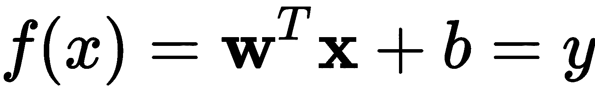

其中 ***w*** 是便于 **x** 连同 ***b*** 变换的未知向量。这个公式是非常基本的，线性的，仅仅是简单学习模型的一个例子。在这个简单的例子中，ML 算法围绕着寻找最佳的***【w】***和*【b】*来产生最接近的(如果不是完美的)近似值**【y】，即期望的输出。非常简单的算法如感知器(Rosenblatt，F. 1958)在选择 **w** 和 ***b*** 时，利用过去的错误，为 ***w*** 和 *b* 尝试不同的值，以做出与所犯错误成比例的下一个选择。**

 **直觉上，看着相同输入的类似感知器的模型的组合比单一的要好。后来，人们意识到，将它们堆叠起来可能是通向多层感知机的下一个逻辑步骤，但问题是，对于 20 世纪 70 年代的人来说，学习过程相当复杂。这些多层系统类似于大脑神经元，这就是我们今天称之为神经网络的原因。随着 ML 中一些有趣的发现，新的特定种类的神经网络和算法被创造出来，被称为深度学习。

# 引入深度学习

虽然学习算法的更详细讨论将在[第 4 章](7f55e68e-2e9f-486f-9337-5b2ea7bdb504.xhtml)、*从数据中学习*中进行，但在本节中，我们将处理神经网络的基本概念以及导致深度学习的发展。

## 神经元的模型

人类大脑有来自其他神经元(突触)的输入连接，这些神经元以电荷的形式接收刺激，然后有一个取决于输入如何刺激神经元的细胞核，可以触发神经元的激活**。**在神经元的末端，输出信号通过树突传播到其他神经元，从而形成神经元网络。

在*图 1.3* 中描绘了人类神经元的类比，其中输入用向量 ***x*** 表示，神经元的激活由某个函数 **z(。)**，输出为 ***y*** 。神经元的参数是 **w** 和**b:**

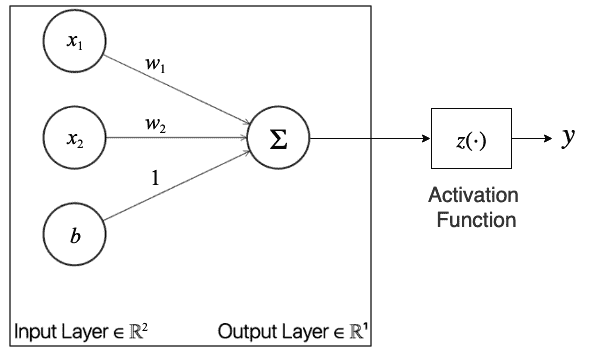

图 1.3 -神经元的基本模型

一个神经元的可训练参数是 ***w*** 和 ***b*** ，它们是未知的。因此，我们可以使用训练数据通过一些学习策略来确定这些参数。从图片来看， **x** [** 1 **] 乘以 *** w [ 1 ] *** ，然后***x***[**2**]乘以***w[2】]***，以及 *** b *** [添加所有这些产品，可以简化如下:]

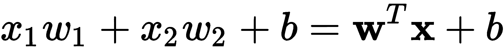

激活功能的作用是确保输出在所需的输出范围内。假设我们想要一个简单的线性激活，那么函数 **z** **(。)**不存在或者可以绕过，如下:

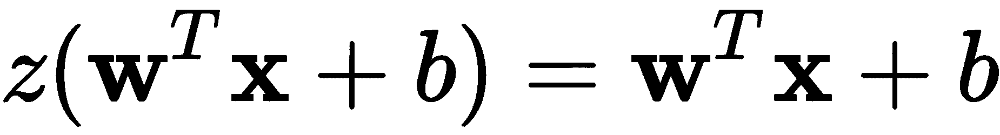

当我们想要解决回归问题并且输出数据的范围可以从-∞到+∞时，通常就是这种情况。然而，我们可能希望训练神经元来确定向量 ***x*** 是否属于两类中的一类，比如-1 和+1。那么我们会更适合使用一种叫做符号激活的功能:

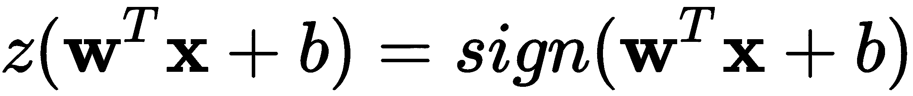

其中*标志*(。)功能表示如下:

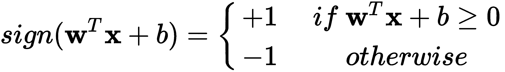

还有许多其他的激活函数，但是我们将在后面介绍。现在，我们将简单展示一个最简单的学习算法，**感知器学习算法** ( **PLA** )。

## 感知器学习算法

PLA 首先假设您想要将数据 **X** 分成两个不同的组，正组(+)和负组(-)。它会通过训练找到*一些*w 和 *b* 来预测相应的正确标签*y。*解放军使用*标志*(。)起激活作用。以下是解放军遵循的步骤:

1.  将 **w** 初始化为零，迭代计数器 *t* = 0
2.  虽然有任何错误分类的例子:

*   挑一个分类错误的例子，称之为 **x** ^* ，其真正的标签是 *y* ^*
*   更新 **w** 如下:**w***[t+1]*=**w***[t]*+*y*^***x**^*
*   增加迭代计数器 *t* ++并重复

请注意，为了让 PLA 按照我们想要的方式工作，我们必须进行调整。我们想要的是在表达式中隐含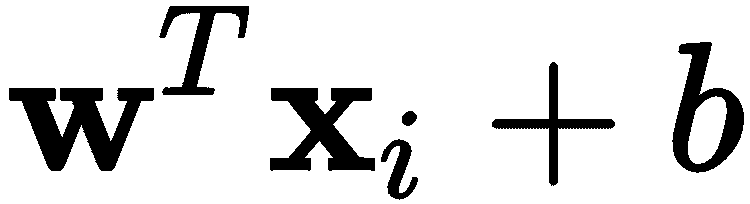。唯一可行的方法是我们设置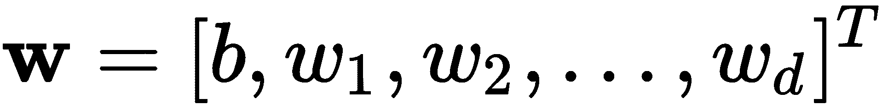和。前面的规则寻找 **w** ，这意味着寻找 *b.*

为了说明 PLA，考虑以下线性可分数据集的情况:

线性可分数据集是这样一种数据集，其数据点相距足够远，以至于至少存在一条可用于将数据组分成两组的假想线。拥有一个线性可分的数据集是所有 ML 科学家的梦想，但我们很少会自然地找到这样的数据集。在接下来的章节中，我们将看到神经网络将数据转换到一个新的特征空间，在这个空间中可能存在这样一条线。

这个二维数据集是使用 Python 工具随机生成的，我们将在后面讨论。就目前而言，不言而喻的是，你可以在这两个群体之间划一条线，并对它们进行划分。

按照前面概述的步骤，PLA 可以找到*解，也就是说，在这种特殊情况下，只需要四次迭代就可以完全满足训练数据目标输出的分隔线。每次更新后的图显示在下面的图中，每次更新时都有相应的线:*

 *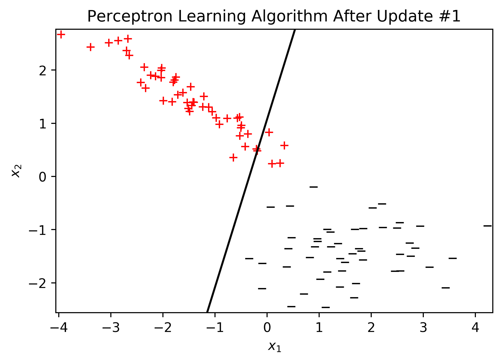

在第 0 次迭代时，所有 100 个点都被错误分类，但是在随机选择一个错误分类的点进行第一次更新后，新线仅遗漏了四个点:

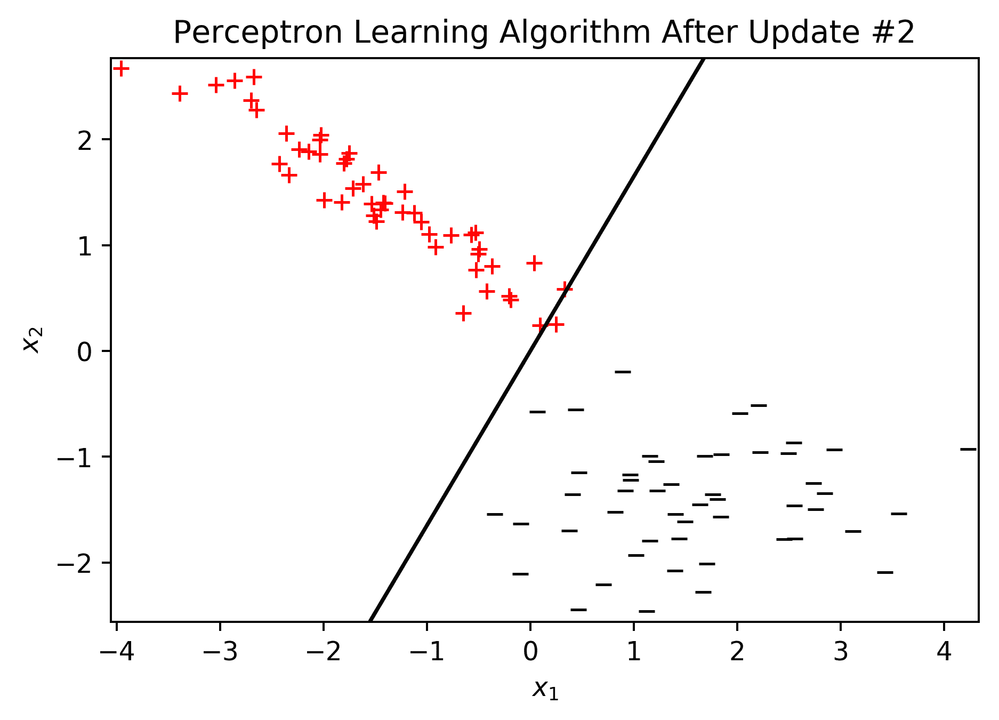

在第二次更新之后，该行只丢失了一个数据点:

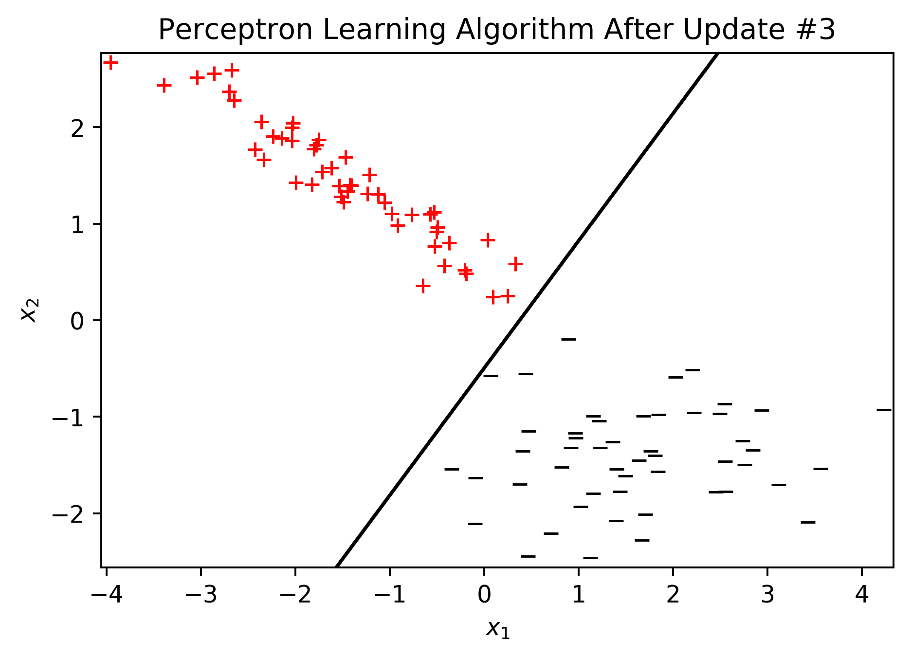

最后，在第三次更新之后，所有数据点都被正确分类。这只是为了说明一个简单的学习算法可以成功地从数据中学习。此外，感知器模型导致了更复杂的模型，如神经网络。我们现在将介绍浅层网络的概念及其基本复杂性。

## 浅层网络

神经网络由连接在不同层的多个网络组成。相比之下，感知器只有一个神经元，其架构由输入层和输出层组成。在神经网络中，在输入和输出层之间还有附加层，如图*图 1.4* 所示，它们被称为隐藏层:

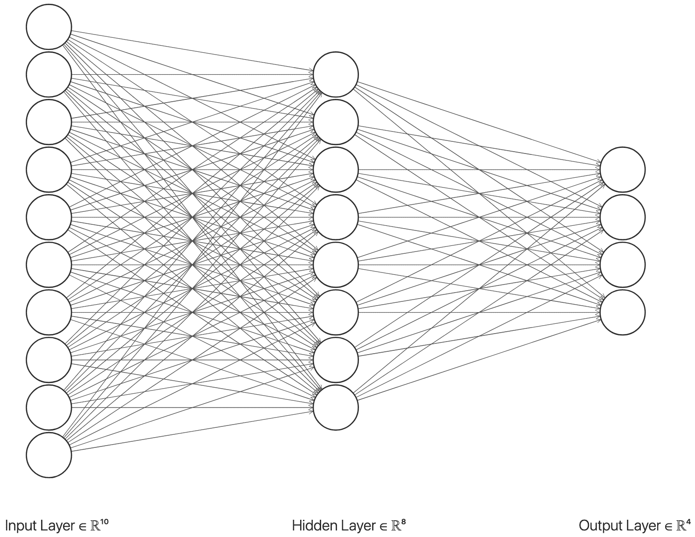

图 1.4 -浅层神经网络示例

图中的示例显示了一个神经网络，其中有一个包含八个神经元的隐藏层。输入大小是 10 维，输出层有 4 维(4 个神经元)。在训练过程中，这个中间层可以有尽可能多的神经元，但通常保持合理数量的神经元是一个好主意。

如果这是你第一次使用神经网络，建议你的隐层大小，也就是神经元的个数，大于等于输入层，小于等于输出层。然而，尽管这是对绝对初学者的好建议，但这不是绝对的科学事实，因为找到神经网络中神经元的最佳数量是一门艺术，而不是一门科学，并且它通常是通过大量实验来确定的。

神经网络可以解决比没有网络更困难的问题，例如*、*用单个神经单元如感知器。这必须感觉直观，必须容易构思。神经网络可以解决包括线性可分问题在内的问题。对于线性可分的问题，我们可以使用感知器模型和神经网络。然而，对于更复杂和非线性可分的问题，感知器不能提供高质量的解决方案，而神经网络可以。

例如，如果我们考虑样本两类数据集，并使数据组更接近，感知器将无法以解决方案终止，可以使用一些其他策略来永远阻止它。或者，我们可以切换到神经网络，训练它找到它可能找到的最佳解决方案。*图 1.5* 显示了一个在不可线性分离的两类数据集上，在隐藏层中训练 100 个神经元的神经网络的示例:

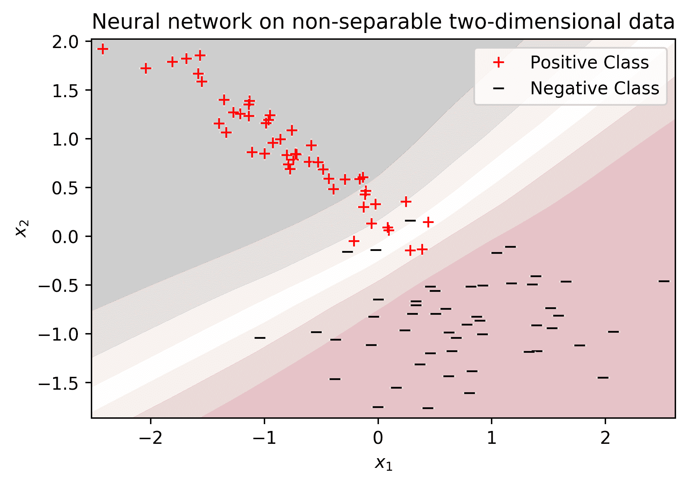

图 1.5 -不可分离的数据和一个非线性的解决方案，使用一个在隐藏层有 100 个神经元的神经网络

这个神经网络的隐含层有 100 个神经元。这是通过实验做出的选择，你将在后续章节中学习如何找到这样的实例的策略。但是，在我们进一步讨论之前，有两个新术语需要进一步解释:不可分离数据和非线性模型，其定义如下:

*   不可分数据是指没有一条线可以将数据组(或类)分成两组。
*   非线性模型或解决方案是当分类问题的最佳解决方案不是直线时自然和通常出现的模型。例如，它可以是由大于 1 的任意次多项式描述的曲线。示例见*图 1.5* 。

非线性模型通常是我们在本书中要用到的，原因是这很可能是你在现实世界中遇到的。在某种程度上，它也是非线性的，因为这个问题是不可分的。为了实现这种非线性解，神经网络模型经历以下数学运算。

### 隐藏层的输入

在神经网络中，输入向量 ***x*** 通过每个神经元的权重 ***w*** 连接到多个神经元，现在可以认为是形成矩阵 ***W*** 的多个权重向量。矩阵 ***W*** 的列数与层的神经元数一样多，行数与特征(或维度) ***x*** 的数量一样多。因此，隐藏层的输出可以被认为是以下向量:

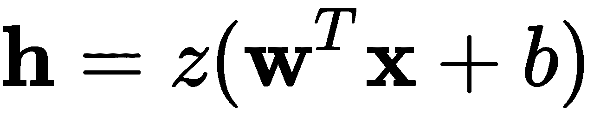

其中 **b** 为偏差向量，其元素对应一个神经单元， **h** 的大小与隐藏单元的数量成正比。比如*图 1.4* 中的 8 个神经元，*图 1.5* 中的 100 个神经元。然而，激活函数 z(。)不一定是*符号*(。)功能，其实通常从来都不是。相反，大多数人使用容易微分的函数*。*

可微分的激活函数是具有数学导数的函数，该导数可以用传统的数值方法计算或者被清楚地定义。相反的是一个没有定义导数的函数，它不存在，或者几乎无法计算。

### 隐藏到隐藏层

在一个神经网络中，我们可以有不止一个单独的隐藏层，我们将在本书中大量使用这种方法。在这种情况下，矩阵 ***W*** 可以表示为三维矩阵，该三维矩阵将具有与网络一样多的第三维元素和隐藏层。在第 *i* 层的情况下，为了方便起见，我们将该矩阵称为**W[IT46。]**

因此，我们可以参考第 *i* 个隐藏层的输出如下:

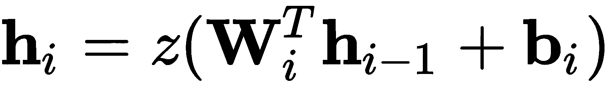

对于 *i* = 2，3，...、 *k* -1，其中 ***k*** 是总层数，而 ***h [1]*** 的情况是用第一层给出的等式计算的(见上一节)，直接用***×***，并不一直到最后一层，

 **### 隐藏到输出层

网络的总输出是最后一层的输出:

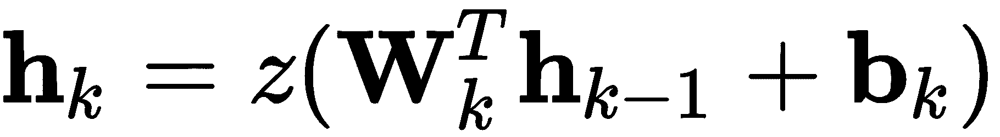

这里，最后激活功能通常不同于隐藏层激活。最后一层(输出)中的激活函数传统上取决于我们试图解决的问题的类型。例如，如果我们想解决一个回归问题，我们会使用一个线性函数，或用于分类问题的 sigmoid 激活。我们稍后将讨论这些。现在，很明显，感知器算法将不再在训练阶段工作。

虽然学习仍然必须根据神经网络所犯的错误，但调整不能与错误分类或预测的数据点成正比。原因是最后一层中的神经元负责进行预测，但是它们依赖于前一层，并且那些神经元可能依赖于更多的前一层，并且当对 ***W*** 和 ***b*** 进行调整时，必须对每个神经元进行不同的调整。

一种方法是对神经网络应用梯度下降技术。这些技术有很多，我们将在后面的章节中讨论其中最流行的。一般来说，梯度下降算法是一种使用以下概念的算法:如果对一个函数求导并达到零值，那么您就找到了对其求导的参数集的最大(或最小)值。对于标量的情况，我们称之为导数，但是对于向量或矩阵( **W** ， **b** )，我们称之为梯度。

我们可以使用的函数叫做损失函数。

损失函数通常是可微的，因此我们可以使用某种梯度下降算法来计算它的梯度。

例如，我们可以定义一个损失函数如下:

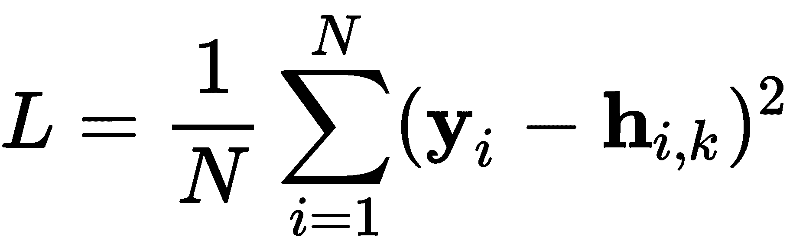

这种损失被称为**均方误差**(**MSE**)；其目的是测量目标输出 ***y*** 与输出层***h***[***k***]*中的预测输出在其元素的平方方面有多大差异，并取平均值。这是一个很好的损失，因为它是可微的，而且很容易计算。*

 *像这样的神经网络引入了大量的可能性，但严重依赖于梯度下降技术来学习它们，称为反向传播(Hecht-Nielsen，R. 1992)。与其在这里解释反向传播(我们将留待以后再解释)，我们不如说它改变了 ML 的世界，但多年来没有取得太大进展，因为它有一些实际限制，这些限制的解决方案为深度学习铺平了道路。

## 深层网络

2019 年 3 月 27 日，ACM 发布公告称，三名计算机科学家因在深度学习领域的成就被授予诺贝尔计算奖，即 ACM 图灵奖。他们的名字是约舒阿·本吉奥、扬·勒昆和杰弗里·辛顿；他们都是非常有成就的科学家。他们的主要贡献之一是被称为反向传播的学习算法。

在官方通讯中，ACM 写了以下关于辛顿博士和他的一篇开创性论文(Rumelhart，D. E. 1985)的内容:

在 1986 年与大卫·鲁梅尔哈特(David Rumelhart)和罗纳德·威廉姆斯(Ronald Williams)合著的论文《通过错误传播学习内部表示》(Learning Internal Representations by Error Propagation)中，辛顿证明了反向传播算法允许神经网络发现它们自己的数据内部表示，从而使使用神经网络解决以前被认为超出它们能力范围的问题成为可能。反向传播算法是当今大多数神经网络的标准。

同样，他们对 LeCun 博士的论文(LeCun，y .，*et al .，* 1998)作了如下描述:

LeCun 提出了反向传播算法(backprop)的早期版本，并基于变分原理给出了它的清晰推导。他在加速反向传播算法方面的工作包括描述了两种加速学习时间的简单方法。

Hinton 博士能够表明，有一种方法可以使用生物启发的算法来最小化神经网络中的损失函数，例如通过修改特定神经元的重要性来向后和向前调整连接。通常，反向传播与前馈神经网络有关，而反向传播与受限玻尔兹曼机器(在[第 10 章](6ec46669-c8d3-4003-ba28-47114f1515df.xhtml)、*受限玻尔兹曼机器*中涉及)。

前馈神经网络的输入通过没有反向连接的中间层直接流向输出层，如图*图 1.4* 所示，我们将在本书中一直讨论这些。

通常可以安全地假设，除非你被告知，所有的神经网络都有一个前馈结构。这本书的大部分内容将讨论深度神经网络，其中绝大多数是前馈型的，例如，除了受限的玻尔兹曼机器或循环神经网络。

反向传播使人们能够以一种前所未有的方式训练神经网络；然而，人们在大型数据集和更大(更深)的架构上训练神经网络存在问题。如果你继续下去，看看 80 年代末和 90 年代初的神经网络论文，你会注意到架构的规模很小；网络通常不超过两到三层，神经元的数量通常不超过数百个。这些(今天)被称为浅层神经网络。

主要问题是大型数据集的收敛时间，以及更深层次架构的收敛时间。LeCun 博士的贡献正是在这个领域，因为他设想了不同的方法来加快训练过程。其他方面的进步，如通过**图形处理单元**(**GPU**)进行矢量(张量)计算，极大地提高了训练速度。

因此，在过去的几年里，我们看到了深度学习的兴起，即训练更深层次神经网络的能力，超过三层或四层，事实上有几十层或几百层。此外，我们有各种各样的架构，可以完成我们在过去十年中无法完成的事情。

*图 1.6* 所示的深度网络在 30 年前是不可能训练出来的，反正也没那么深:

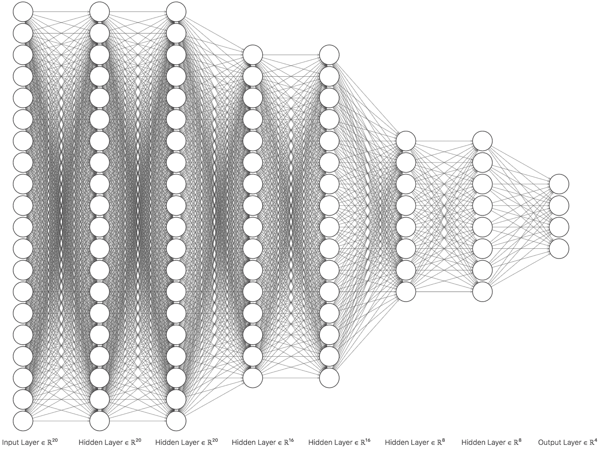

图 1.6 -一个深度和完全连接的八层前馈神经网络

在本书中，我们将考虑深度神经网络，即总体上超过三层或四层的任何网络。然而，到底有多深才算深并没有一个标准的定义。此外，你需要考虑到，在 2020 年写这本书的时候，我们今天认为很深的东西，在 20 年或 30 年后可能不会被认为很深。

不管数字图书馆的未来如何，现在让我们来讨论是什么让数字图书馆变得如此重要。

# 为什么深度学习在今天很重要？

今天，我们享受 20 或 30 年前没有的算法和策略的好处，这使我们能够拥有改变生活的惊人应用。请允许我总结一下今天深度学习的一些伟大而重要的事情:

*   **小批量训练**:这种策略允许我们今天拥有非常大的数据集，并一点一点地训练深度学习模型。在过去，我们必须将整个数据集加载到内存中，这使得一些大型数据集在计算上变得不可能。今天，是的，这可能需要更长的时间，但我们至少可以在有限的时间内进行训练。
*   **新颖的激活函数** : **例如，整流线性单元** ( **ReLUs** )是一种相对较新的激活，它解决了使用反向传播策略进行大规模训练的许多问题。这些新的激活使训练算法能够收敛于深度架构，而在过去，我们会陷入非收敛的训练会话，最终会出现爆炸或消失的梯度。
*   **新型神经网络架构**:例如，卷积或循环网络通过开启我们可以用神经网络做的事情的可能性，一直在改变世界。卷积网络广泛应用于计算机视觉应用或其他领域，在这些领域中卷积运算是很自然的事情，例如多维信号或音频分析。具有记忆的循环神经网络被广泛用于分析文本序列，从而使我们能够拥有理解单词、句子和段落的网络，我们可以使用它们在语言之间进行翻译，以及许多其他事情。
*   **有趣的损失函数**:这些损失在深度学习中起着有趣的作用，因为，在过去，我们只是反复使用相同的标准损失；MSE 等损失。今天，我们可以最小化 MSE，同时最小化一些神经元的权重或输出的范数，这导致了更稀疏的权重和解决方案，从而使生成的模型在部署到生产中时更加有效。

*   **类似生物学的新颖策略**:像神经元之间缺失或丢弃连接这样的事情，而不是让它们一直完全连接，更现实，或者说比得上生物神经网络设计。此外，完全丢弃或移除神经元是一种新策略，可以在移除其他神经元时推动一些神经元脱颖而出，学习更丰富的表示，同时减少训练和部署期间的计算。不同的和专门的神经网络之间的参数共享也被证明是有趣和有效的。
*   **对抗性训练**:让一个神经网络与另一个网络竞争，后者的唯一目的是生成欺诈性、嘈杂和混乱的数据点，试图让网络失败，这已被证明是一种优秀的策略，网络可以更好地从数据中学习，并在部署到生产中时对嘈杂的环境保持稳健。

还有许多其他有趣的事实和观点使深度学习成为一个令人兴奋的领域，并证明了这本书的写作。我希望你和我们一样兴奋，开始阅读这本书，知道我们将要编码我们这个时代最令人兴奋和不可思议的神经网络。我们的最终目的将是制造能够泛化的深度神经网络。

泛化是神经网络对从未见过的数据做出正确预测的能力。这是所有机器和深度学习从业者的最终目的，需要大量的技能和数据知识。

# 摘要

这一章介绍了 ML 的概况。它介绍了 ML 背后的动机和该领域中常用的术语。它还介绍了深度学习以及它如何适应人工智能领域。在这一点上，你应该感到自信，你对什么是神经网络有足够的了解，对它能有多大感到好奇。你也应该对深度学习领域和每周出现的新事物感到非常好奇。

此时，你一定有点急于开始你的深度学习编码之旅；出于这个原因，下一个合乎逻辑的步骤是前往 [第 2 章](0b6e1f9c-280c-4107-aa1b-862b99f991c8.xhtml)、*深度学习框架的设置和介绍。*在这一章中，你将通过设置你的系统并确保你能够访问成为一名成功的深度学习实践者所需的资源，为行动做好准备。但是在你去那里之前，请试着用下面的问题来测验你自己。

# 问题和答案

1.  **感知器和/或神经网络能否解决线性可分数据的分类问题？**

是的，两者都可以。

2.  感知器和/或神经网络能否解决对不可分数据进行分类的问题？

是的，两者都可以。然而，感知器将永远继续下去，除非我们指定一个停止条件，如最大迭代(更新)次数，或者在多次迭代后错误分类点的数量没有减少时停止。

3.  **ML 领域有哪些变化让我们有了今天的深度学习？**

(A)反向传播算法、批量训练、ReLUs 等等；

(B)计算能力、图形处理器、云等等。

4.  **为什么泛化是一件好事？**

因为深度神经网络最有用的时候是当它们被给定以前没有见过的数据，也就是没有被训练过的数据时，它们能够按预期发挥作用。

# 参考

*   赫克特-尼尔森，R. (1992 年)。*反向传播神经网络理论*。在*用于感知的神经网络*(第 65-93 页)。*学术出版社*。
*   f .凯恩(2017)。*动手数据科学和 Python ML* 。*帕克特出版有限公司*。
*   LeCun、l . Bottou、g . Orr 和 k . Muller(1998 年)。*神经网络中的有效反向传播:交易技巧*(奥尔和米勒编辑。).*计算机科学讲义*，1524(98)，111。
*   Ojeda、s . p . Murphy、b . beng fort 和 a . das Gupta(2014 年)。*实用数据科学食谱*。帕克特出版有限公司。

*   罗森布拉特，F. (1958)。*感知器:在*大脑*中用于信息存储和组织的概率模型*。*心理评论*，65 卷 6 期，386 页。
*   鲁梅尔哈特、辛顿和威廉姆斯(1985)。*通过错误* *传播*学习内部表示(编号 ICS-8506)。加州大学圣地亚哥分校拉荷亚认知科学研究所。******