# 五、训练单个神经元


在修改了关于从数据中学习的概念之后，我们现在将密切关注一种算法，该算法训练一种最基本的基于神经的模型:感知机。我们将看看算法运行所需的步骤，以及停止条件。本章将介绍感知器模型，它是第一个代表神经元的模型，旨在以简单的方式从数据中学习。感知器模型是理解从数据中学习的基本和高级神经模型的关键。在这一章中，我们还将讨论与非线性可分数据相关的问题和注意事项。

完成这一章后，你应该对讨论感知器模型和应用它的学习算法感到舒服了。您将能够在线性和非线性可分离数据上实现该算法。

具体来说，本章涵盖以下主题:

*   感知器模型
*   感知器学习算法
*   基于非线性可分数据的感知器

# 感知器模型

回到[第一章](e3181710-1bb7-4069-825a-a235355bc116.xhtml)、*机器学习介绍*，我们简单介绍了一个神经元的基本模型和**感知器学习算法** ( **PLA** )。在这一章中，我们将重温和扩展这个概念，并展示如何用 Python 来编码。我们将从基本定义开始。

## 视觉概念

感知器是对人类启发的信息处理单元的类比，最初由 F. Rosenblatt 构想，并在*图 5.1* 中描述(Rosenblatt，F. (1958))。在该模型中，输入用向量表示，神经元的激活由函数给出，输出为。神经元的参数是和:

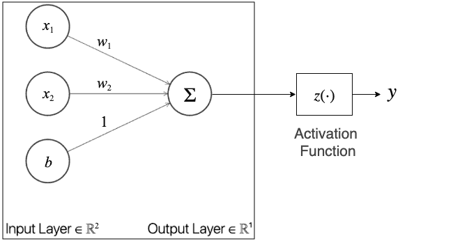

图 5.1-感知器的基本模型

感知器的*可训练*参数为，未知。因此，我们可以使用输入训练数据通过 PLA 来确定这些参数。从*图 5.1 * ,  乘以，然后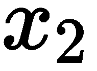 乘以，乘以 1；所有这些乘积相加，然后传递到*符号*激活函数，该函数在感知器中的操作如下:


激活标志的主要作用是将模型的任何响应映射成一个二进制输出: [] 。

现在我们来谈谈一般意义上的张量。

## 张量运算

在 Python 中，感知器的实现需要一些简单的张量(向量)运算，这些运算可以通过标准的 NumPy 功能来执行。首先我们可以假设给我们的数据 [] 是一个向量的形式，包含多个向量(一个矩阵)，表示为 [] ，多个单独的目标表示为一个向量 [] 。但是，请注意，为了更容易实现感知器，有必要将包含在中，如图 5.1 中的*所示，这样，如果我们将修改为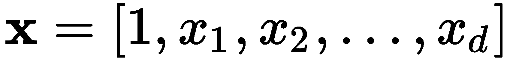，将修改为 [] ，则 [] 中的乘积和加法可以简化。这样，对于输入 [] 的感知器响应可以简化如下:*


注意 **** 现在隐含在中。

说我们要有训练数据`X`，需要为感知器准备；我们可以使用一个简单的线性可分数据集来实现这一点，该数据集可以通过 scikit-learn 的 dataset 方法`make_classification`生成，如下所示:

```py
from sklearn.datasets import make_classification

X, y = make_classification(n_samples=100, n_features=2, n_classes=2,
                           n_informative=2, n_redundant=0, n_repeated=0,
                           n_clusters_per_class=1, class_sep=1.5, 
                           random_state=5)
```

在这里，我们使用`make_classification`构造函数为两个类(`n_classes`)产生 100 个数据点(`n_samples`)，并且有足够的间隔(`class_sep`)来产生线性可分的数据。但是数据集在集合 [] 中的`y`产生了二进制值，我们需要将其转换为集合 [] 中的值。这可以通过简单地执行以下操作，用负目标替换零目标来容易地实现:

```py
y[y==0] = -1
```

生成的数据集如图*图 5.2* 所示:

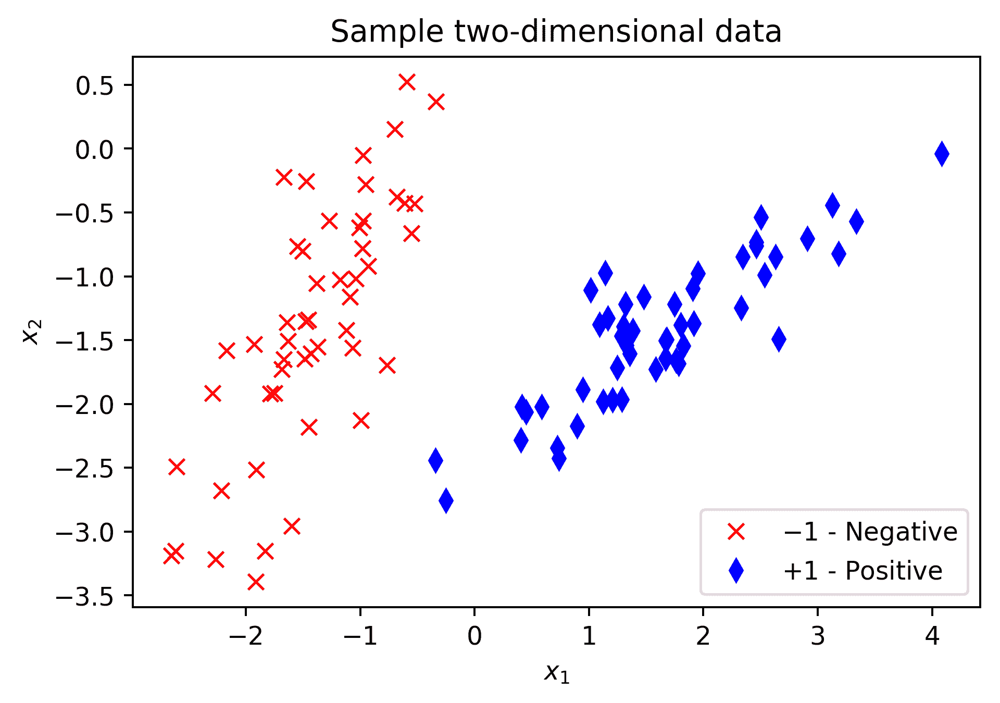

图 5.2–感知器测试的二维数据样本

接下来，我们可以通过将长度为`N=100`的一个向量添加到`X`来将数字 1 添加到每个输入向量，如下所示:

```py
import numpy as np
X = np.append(np.ones((N,1)), X, 1)    
```

`X`中的新数据现在包含一个 1 的向量。这将允许更容易地计算所有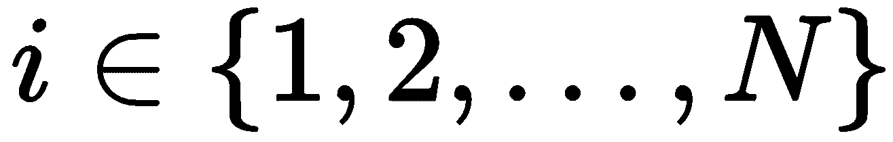的张量运算 [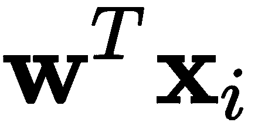] 。将矩阵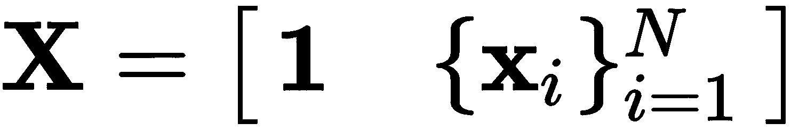简化为，这种常见的张量运算可以在一个单一步骤中完成。我们甚至可以将此操作和符号激活功能合并在一个步骤中，如下所示:

```py
np.sign(w.T.dot(X[n]))
```

这相当于数学张量运算 [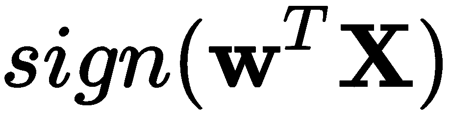] 。记住这一点，让我们使用前面介绍的数据集和刚才描述的操作来更详细地回顾一下 PLA。

# 感知器学习算法

**感知器学习算法** ( **PLA** )如下:

**输入**:二进制类数据集 []

*   将初始化为零，并迭代计数器
*   虽然有任何错误分类的例子:
*   挑一个分类错误的例子，称之为，其真正的标签是
*   更新如下: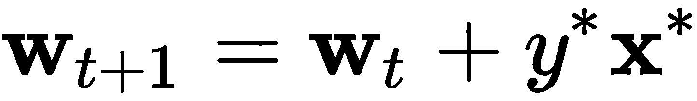
*   增加迭代计数器， [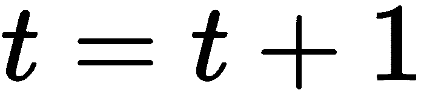] ，并重复

**返回** : 

现在，让我们看看这是如何在 Python 中实现的。

## Python 中的 PLA

下面是 Python 中的一个实现，我们将一部分一部分地讨论，其中一些已经讨论过了:

```py
N = 100 # number of samples to generate
random.seed(a = 7) # add this to achieve for reproducibility

X, y = make_classification(n_samples=N, n_features=2, n_classes=2,
                           n_informative=2, n_redundant=0, n_repeated=0,
                           n_clusters_per_class=1, class_sep=1.2, 
                           random_state=5)

y[y==0] = -1

X_train = np.append(np.ones((N,1)), X, 1) # add a column of ones

# initialize the weights to zeros
w = np.zeros(X_train.shape[1])
it = 0

# Iterate until all points are correctly classified
while classification_error(w, X_train, y) != 0:
  it += 1
  # Pick random misclassified point
  x, s = choose_miscl_point(w, X_train, y)
  # Update weights
  w = w + s*x

print("Total iterations: ", it)
```

本章的*张量运算*部分已经讨论了前几行。使用`w = np.zeros(X_train.shape[1])`将初始化为零。这个向量的大小取决于输入的维度。然后，`it`仅仅是一个迭代计数器，用于跟踪在 PLA 收敛之前执行的迭代次数。

`classification_error()`方法是一个助手方法，它将参数`w`的当前向量、输入数据`X_train`和相应的目标数据`y`作为参数。该方法的目的是确定当前状态下误分类点的数量，如果有，返回错误总数。该方法可以定义如下:

```py
def classification_error(w, X, y):
  err_cnt = 0
  N = len(X)
  for n in range(N):
    s = np.sign(w.T.dot(X[n]))
    if y[n] != s:
      err_cnt += 1    # we could break here on large datasets
  return err_cnt      # returns total number of errors
```

这种方法可以简化如下:

```py
def classification_error(w, X, y):
  s = np.sign(X.dot(w))
  return sum(s != y)
```

然而，虽然这对于小数据集来说是一个很好的优化，但是对于大数据集来说，可能没有必要计算所有的误差点。因此，可以使用第一种(也是更长的)方法，并根据预期的数据类型进行修改，如果我们知道我们将处理大型数据集，我们可以在第一次出现错误时中断该方法。

我们代码中的第二个助手方法是`choose_miscl_point()`。该方法的主要目的是随机选择一个错误分类的点，如果有的话。它将参数`w`的当前向量、输入数据`X_train`和相应的目标数据`y`作为自变量。它返回一个错误分类的点`x`，以及对应的目标符号应该是什么`s`。该方法可以如下实现:

```py
def choose_miscl_point(w, X, y):
  mispts = []
  for n in range(len(X)):
    if np.sign(w.T.dot(X[n])) != y[n]:
      mispts.append((X[n], y[n]))
  return mispts[random.randrange(0,len(mispts))]
```

类似地，这可以通过随机化索引列表、遍历它们并返回找到的第一个索引来优化速度，如下所示:

```py
def choose_miscl_point(w, X, y):
 for idx in random.permutation(len(X)):
   if np.sign(w.T.dot(X[idx])) != y[idx]:
     return X[idx], y[idx]
```

然而，第一个实现对于绝对的初学者或者那些想要对错误分类的点进行一些额外分析的人来说可能是有用的，这可以在列表`mispts`中方便地获得。

不管实现如何，关键点是随机选择错误分类的点。

最后，使用当前参数、错误分类点和执行`w = w + s*x`的行上的相应目标进行更新。

如果您运行完整的程序，它应该输出如下内容:

```py
Total iterations: 14
```

迭代的总次数可以根据数据的类型和误分类点选择的随机性质而变化。对于我们正在使用的特定数据集，决策边界可能如图*图 5.3* 所示:


图 5.3–用计划发现的决策边界

迭代的次数也将取决于特征空间中数据点之间的间隔或间隙。差距越大，越容易找到解决办法，反之亦然。最坏的情况是数据是非线性可分的，我们接下来会谈到这一点。

# 基于非线性可分数据的感知器

正如我们之前讨论的，如果数据是可分的，感知器会在有限的时间内找到解决方案。然而，找到一个解需要多少次迭代取决于这些组在特征空间中彼此的接近程度。

**Convergence** is when the learning algorithm finds a solution or reaches a steady state that is acceptable to the designer of the learning model.

以下段落将讨论不同类型数据的收敛性:线性可分数据和非线性可分数据。

线性可分数据的收敛性

## 对于我们在本章中学习的特定数据集，两组数据之间的分离是一个可以变化的参数(这通常是真实数据的一个问题)。参数为`class_sep`，可以取实数；例如:

这使我们能够研究，如果我们改变分离参数，感知器算法平均需要多少次迭代才能收敛。实验可以设计如下:

```py
X, y = make_classification(..., class_sep=2.0, ...)
```

我们将从大到小改变分离系数，记录收敛所需的迭代次数:2.0，1.9，..., 1.2, 1.1.

*   我们将重复 1000 次，并记录平均迭代次数和相应的标准偏差。
*   请注意，我们决定将这个实验运行到 1.1，因为 1.0 已经产生了一个非线性可分离的数据集。如果我们进行实验，我们可以将结果记录在一个表格中，结果如下所示:

**跑**

| **2.0** | **1.9** | **1.8** | **1.7** | **1.6** | **1.5** | **1.4** | **1.3** | **1.2** | **1.1** | 一 |
| 2 | 2 | 2 | 2 | 七 | 10 | 四 | 15 | 13 | 86 | 2 |
| 5 | 一 | 2 | 2 | 四 | 8 | 6 | 26 | 62 | 169 | 3 |
| 四 | 四 | 5 | 6 | 6 | 10 | 11 | 29 | 27 | 293 | ... |
| ... | ... | ... | ... | ... | ... | ... | ... | ... | ... | 998 |
| 2 | 5 | 3 | 一 | 9 | 3 | 11 | 9 | 35 | 198 | 紧急服务电话 |
| 2 | 2 | 四 | 七 | 6 | 8 | 2 | 四 | 14 | 135 | 1000 |
| 2 | 一 | 2 | 2 | 2 | 8 | 13 | 25 | 27 | 36 | 平均。 |
| **2.79** | **3.05** | **3.34** | **3.67** | **4.13** | **4.90** | **6.67** | **10.32** | **24.22** | **184.41** | **标准。** |
| **1.2** | **1.3** | **1.6** | **1.9** | **2.4** | **3.0** | **4.7** | **7.8** | **15.9** | **75.5** | **75.5** |

该表显示，当数据被很好地分离时，平均迭代次数相当稳定；然而，随着分离间隙的减小，迭代次数急剧增加。为了直观起见，表中的相同数据现在以对数标度显示在*图 5.4* 中:

图 5.4–随着数据组越来越接近，PLA 迭代次数的增长

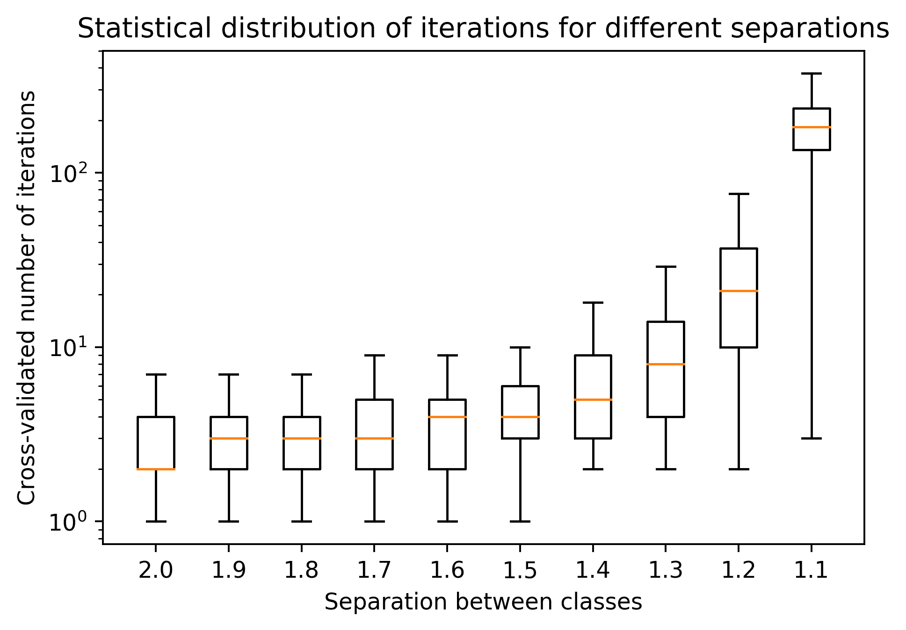

很明显，随着分离间隙的缩小，迭代次数会呈指数增长。*图 5.5* 描绘了最大分离间隙 2.0，表明 PLA 在四次迭代后找到了解决方案:

图 5.5–感知器在 4 次迭代中找到了分离间隙为 2.0 的解决方案


Figure 5.5 – The perceptron found a solution in four iterations for a separation gap of 2.0

同样，*图 5.6* 显示，对于最大的缺口，1.1，PLA 需要 183 次迭代；仔细观察该图可以发现，后一种情况的解决方案很难找到，因为数据组彼此过于接近:

图 5.6–感知器在 183 次迭代中找到了分离间隙为 1.1 的解决方案


如前所述，不可线性分离的数据可以产生 1.0 的间隙，并且 PLA 将在无限循环中运行，因为总会有数据点被错误分类，并且`classification_error()`方法永远不会返回零值。对于这些情况，我们可以修改 PLA 以允许在非线性可分数据上寻找解决方案，我们将在下一节中讨论。

非线性可分数据的收敛性

## 对原始 PLA 的修改相当简单，但足以在大多数情况下找到可接受的解决方案。我们需要添加到 PLA 中的两个主要内容如下:

防止算法永远运行的机制

*   一种存储已发现的最佳解决方案的机制
*   关于第一点，我们可以简单地指定算法可以停止的迭代次数。关于第二点，我们可以简单地保存一个解决方案，并将其与当前迭代中的解决方案进行比较。

With respect to the first point, we can simply specify a number of iterations at which the algorithm can stop. With respect to the second point, we can simply keep a solution in storage, and compare it to the one in the current iteration.

此处显示了 PLA 的相关部分，新的更改用粗体标出，我们将对此进行详细讨论:

在这段代码中，`bestW`是一个记录目前为止最佳结果的字典，它被初始化为合理的值。首先请注意，循环现在被数字 1，000 所限制，这是您当前允许的最大迭代次数，您可以将其更改为您希望的最大迭代次数。对于每次迭代成本都很高的大型数据集或高维数据集，减少这个数量是合理的。

```py
X, y = make_classification(n_samples=N, n_features=2, n_classes=2,
 n_informative=2, n_redundant=0, n_repeated=0,
 n_clusters_per_class=1, class_sep=1.0, 
 random_state=5)

y[y==0] = -1

X_train = np.append(np.ones((N,1)), X, 1) # add a column of ones

# initialize the weights to zeros
w = np.zeros(X_train.shape[1])
it = 0
bestW = {}
bestW['err'] = N + 1 # dictionary to keep best solution
bestW['w'] = []
bestW['it'] = it

# Iterate until all points are correctly classified
#   or maximum iterations (i.e. 1000) are reached
while it < 1000:
 err = classification_error(w, X_train, y)
 if err < bestW['err']:   # enter to save a new w
 bestW['err'] = err
 bestW['it'] = it
 bestW['w'] = list(w)
 if err == 0:  # exit loop if there are no errors
 break
  it += 1
  # Pick random misclassified point
  x, s = choose_miscl_point(w, X_train, y)
  # Update weights
  w += s*x

print("Best found at iteration: ", bestW['it'])
print("Number of misclassified points: ", bestW['err'])
```

接下来的变化是包含了条件语句`if err < bestW['err']`，它决定了我们是否应该存储一组新的参数。每当由错误分类样本的总数确定的误差低于存储参数的误差时，就进行更新。为了完成，我们仍然必须检查没有错误，这表明数据是线性可分的，已经找到了解决方案，循环需要终止。

最后几个`print`语句将简单地告知记录最佳解决方案时获得的迭代和误差。输出可能如下所示:

该输出是通过在数据集上运行更新的 PLA 产生的，间隔为 1.0，如图*图 5.7* 所示:

图 5.7-更新的 PLA 在 95 次迭代后找到了一个只有一个错误分类点的解决方案

```py
Best found at iteration: 95
Number of misclassified points: 1
```

从图中可以看出，有一个来自阳性类别的样本被错误地分类。知道在这个例子中总共有 100 个数据点，我们可以确定精度是 99/100。

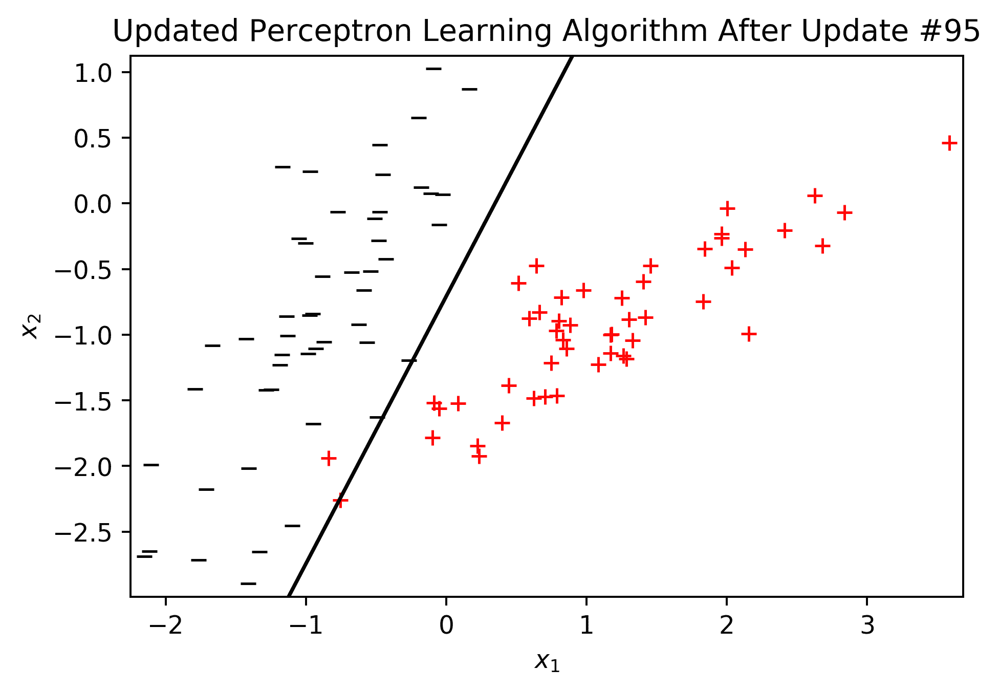

这种类型的算法存储了迄今为止的*最佳解*，通常被称为**袖珍算法** (Muselli，M. 1997)。并且学习算法的提前终止的想法受到了众所周知的数值优化方法的启发。

From the figure, it can be seen that there is one sample from the positive class that is incorrectly classified. Knowing that in this example there is a total of 100 data points, we can determine that the accuracy is 99/100.

一个普遍的限制是，感知器只能产生基于二维直线或多维线性超平面的解决方案。然而，这种限制可以通过将几个感知器放在一起并放在多个层中来容易地解决，以产生用于可分离和不可分离问题的高度复杂的非线性解决方案。这将是下一章的主题。

摘要

本章概述了经典的感知器模型。我们讨论了线性和非线性可分离数据集的理论模型及其 Python 实现。在这一点上，你应该感到自信，你对感知机有足够的了解，你可以自己实现它。您应该能够在神经元的环境中识别感知器模型。此外，您现在应该能够在感知器中实现口袋算法和提前终止策略，或者任何其他一般的学习算法。

# 由于感知器是为深度神经网络铺平道路的最重要的元素，在我们在这里讲述完之后，下一步是前往第六章，*训练多层神经元。*在该章中，您将接触到使用多层感知器算法进行深度学习的挑战，例如用于误差最小化的梯度下降技术，以及实现泛化的超参数优化。但是在你去那里之前，请试着用下面的问题来测验你自己。

问题和答案

**数据的可分性与 PLA 的迭代次数有什么关系？**

# 随着数据组彼此接近，迭代次数会呈指数增长。

1.  **解放军会一直收敛吗？**

并不总是这样，只是对于线性可分的数据。

2.  **PLA 能收敛于非线性可分数据吗？**

不会。但是，您可以通过修改 pocket 算法找到一个可接受的解决方案。

3.  **为什么感知器很重要？**

因为这是最基本的学习策略之一，有助于理解学习的可能性。如果没有感知器，科学界可能需要更长时间才能意识到基于计算机的自动学习算法的潜力。

4.  参考

罗森布拉特，F. (1958)。感知器:大脑中信息存储和组织的概率模型。*心理评论*，65 卷 6 期，386 页。

# 穆塞利博士(1997 年)。pocket 算法的收敛性。 *IEEE 神经网络汇刊*，8(3)，623-629。

*   Rosenblatt, F. (1958). The perceptron: a probabilistic model for information storage and organization in the brain. *Psychological review*, 65(6), 386.
*   Muselli, M. (1997). On convergence properties of the pocket algorithm. *IEEE Transactions on Neural Networks*, 8(3), 623-629.