# 十一、深度和宽度神经网络

到目前为止，我们已经涵盖了各种无监督的深度学习方法，这些方法可以带来许多有趣的应用，如特征提取、信息压缩和数据增强。然而，当我们转向可以执行分类或回归的监督深度学习方法时，例如，我们必须从解决一个可能已经在你脑海中的与神经网络相关的重要问题开始:*宽神经网络和深度神经网络之间的区别是什么？*

在本章中，您将实现深度和广度神经网络，以了解两者在性能和复杂性方面的差异。作为一个额外的收获，我们将根据神经元之间的连接来涵盖密集网络和稀疏网络的概念。我们还将优化网络中的辍学率，以最大限度地提高网络的泛化能力，这是当今的一项关键技能。

本章组织如下:

*   宽神经网络
*   密集深度神经网络
*   稀疏深度神经网络
*   超参数优化

# 宽神经网络

在我们讨论本章中涵盖的神经网络类型之前，重新审视深度学习的定义，然后继续讨论所有这些类型可能是合适的。

## 深度学习再探

最近，在 2020 年 2 月 9 日，图灵奖获得者 Yann LeCun 在 AAAI 20 会议上做了一个有趣的演讲。在他的演讲中，他明确了什么是深度学习，在我们在这里给出这个定义之前，让我提醒你，LeCun(与 J. Bengio 和 G. Hinton 一起)被认为是深度学习的创始人之一，正是因为他在该领域的成就而获得了图灵奖。因此，他要说的话很重要。其次，纵观这本书，我们并没有给出深度学习是什么的强有力的定义；人们可能认为它指的是深度神经网络，但事实上这是不正确的——它远不止如此，所以让我们一劳永逸地澄清事实。

“不仅仅是监督学习，不仅仅是神经网络，**深度学习**是一种通过将参数化模块组装成(可能是动态的)计算图来构建系统的想法，并通过使用基于梯度的方法优化参数来训练它执行任务。”-扬·勒昆

到目前为止，我们讨论的大多数模型都符合这个定义，除了我们用来解释更复杂模型的简单介绍性模型。那些介绍性模型没有作为深度学习包括进来的唯一原因是，它们不一定是计算图的一部分；我们具体指的是感知器(Rosenblatt，F. (1958) *)* ，以及相应的**感知器学习算法** ( **PLA** ) (Muselli，M. (1997) *)* 。然而，从**多层感知器** ( **MLP** )开始，迄今为止提出的所有算法实际上都是深度学习算法。

在这一点上，这是一个重要的区别，因为这是一本深度学习的书，而你正在*学习*深度学习。我们将要学习深度学习中一些最有趣的话题，我们需要关注深度学习是什么。我们会讲深网和广网；但是，两者都是深度学习。事实上，我们将在这里讨论的所有模型都是深度学习模型。

明白了这一点，我们来定义一下什么是广域网。

## 宽层

使神经网络**宽**的是在相对少量的隐藏层中相对大量的神经元。深度学习的最新发展甚至使具有无限数量神经单元的宽网络的计算处理成为可能(Novak，r .，et al. (2019) *)* 。虽然这是一个很好的进步，但我们将限制我们的层有一个合理的单位数。为了与*不太宽的*网络进行比较，我们将为 CIFAR-10 数据集创建一个宽网络。我们将创建下图所示的体系结构:

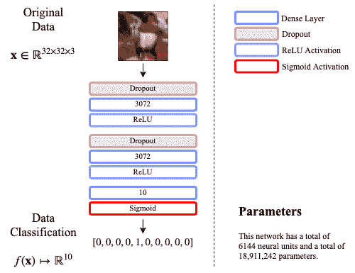

图 11.1–CIFAR-10 广域网的网络架构

从现在开始，我们将考虑的神经网络的一个重要方面是**参数**的数量。

在深度学习中，**参数的个数**被定义为学习算法为了最小化损失函数而需要通过梯度下降技术估计的变量个数。大多数参数通常是网络的权重；然而，其他参数可能包括*批量标准化*的偏差、平均值和标准偏差、卷积网络的过滤器、循环网络的记忆向量以及许多其他参数。

知道参数的数量特别重要，因为在理想情况下，你想要的数据样本比你想要学习的变量要多。换句话说，理想的学习场景包括的数据比参数多。你想想，它是直观的；想象有一个两行三列的矩阵。这三列分别描述了水果的红色、绿色和蓝色。这两行对应于一个橙子样本和另一个苹果样本。如果你想建立一个线性回归系统来确定数据来自橙子的概率，你当然希望有更多的数据！尤其是因为有许多苹果的颜色可能接近于橙子的颜色。数据越多越好！但是如果你有更多的参数，就像线性回归中的参数和列一样多，那么你的问题通常被描述为一个不适定的 T4 问题。在深度学习中，这种现象被称为**过参数化**。

只有在深度学习中，过度参数化的模型才能真正发挥作用。有研究表明，在神经网络的特定情况下，鉴于数据以非线性关系流动时的冗余，损失函数可以产生平滑的景观(Soltanolkotabi，m .，et al. (2018))。这是特别有趣的，因为这样我们就可以证明过参数化的深度学习模型将使用梯度下降收敛到非常好的解决方案(Du，S. S .，et al. (2018))。

### 摘要

在 Keras 中，有一个名为`summary()`的函数，从一个`Model`对象调用，可以给出要估计的参数总数。例如，让我们在*图 11.1* 中创建一个广域网:

```py
from tensorflow.keras.layers import Input, Dense, Dropout
from tensorflow.keras.models import Model

inpt_dim = 32*32*3    # this corresponds to the dataset
                      # to be explained shortly
inpt_vec = Input(shape=(inpt_dim,), name='inpt_vec')
dl = Dropout(0.5, name='d1')(inpt_vec)
l1 = Dense(inpt_dim, activation='relu', name='l1')(dl)
d2 = Dropout(0.2, name='d2')(l1)
l2 = Dense(inpt_dim, activation='relu', name='l2') (d2)
output = Dense(10, activation='sigmoid', name='output') (l2)

widenet = Model(inpt_vec, output, name='widenet')

widenet.compile(loss='binary_crossentropy', optimizer='adam')
widenet.summary()
```

该代码产生以下输出:

```py
Model: "widenet"
_________________________________________________________________
Layer (type)           Output Shape    Param # 
=================================================================
inpt_vec (InputLayer)  [(None, 3072)]  0 
_________________________________________________________________
d1 (Dropout)           (None, 3072)    0 
_________________________________________________________________
l1 (Dense)             (None, 3072)    9440256 
_________________________________________________________________
d2 (Dropout)           (None, 3072)    0 
_________________________________________________________________
l2 (Dense)             (None, 3072)    9440256 
_________________________________________________________________
output (Dense)         (None, 10)      30730 
=================================================================
Total params: 18,911,242
Trainable params: 18,911,242
Non-trainable params: 0
```

此处生成的摘要表明模型中的参数总数为 18，911，242。这是为了说明一个简单的广域网对于一个有 3072 个特征的问题可以有将近 1900 万个参数。这显然是一个过度参数化的模型，我们将在此模型上执行梯度下降来学习这些参数；换句话说，这是一个深度学习模型。

### 名称

我们将在本章介绍的另一个新事物是使用**名称**来表示 Keras 模型的各个部分。您应该已经注意到，在前面的代码中，脚本包含一个新的参数，并为其分配了一个字符串；例如，`Dropout(0.5, **name**='d1')`。这是在内部使用的，用于跟踪模型中各部分的名称。这可能是很好的实践；但是，这不是必需的。如果您不提供名称，Keras 将自动为每件作品指定通用名称。在保存或恢复模型时，为元素指定名称会很有帮助(我们很快就会这么做——请耐心等待),或者在打印摘要时会很有用，就像前面的例子一样。

现在，让我们来看看将要加载的数据集。准确地说，前面提到的数据有 3072 个维度，称为 CIFAR-10。

## CIFAR-10 数据集

我们将在本章中使用的数据集被称为 **CIFAR-10** 。它来源于缩写**加拿大高级研究所** ( **CIFAR** )。数字 10 来自用来组织数据集的类的数量。这是一个彩色图像数据集，也有一个替代数据库，其中有 100 个不同的对象，称为 CIFAR-100；但是，我们现在将重点关注 CIFAR-10。每幅彩色图像是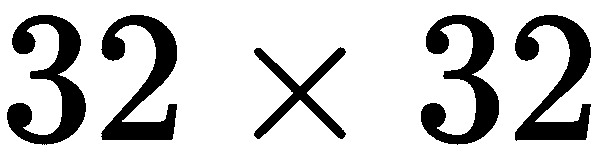像素。考虑到颜色通道，其总尺寸为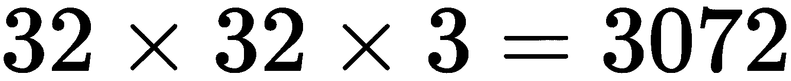。

*图 11.1* 中的图表有一个图像样本，而*图 11.2* 中有一个测试集中每个类别的示例:

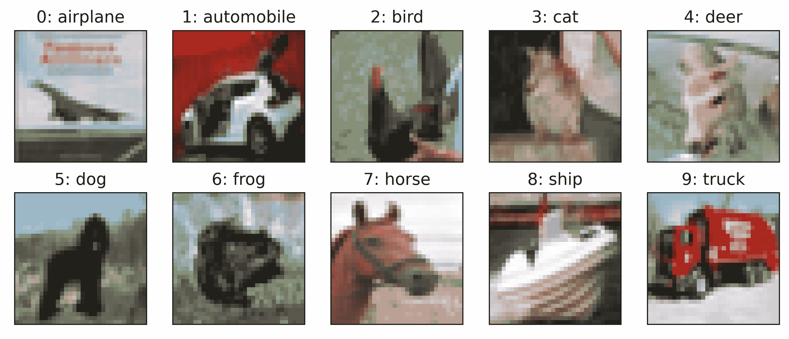

图 11.2–CIFAR-10 数据集中每个类别的示例彩色图像

可以通过执行以下命令来加载该数据集:

```py
from tensorflow.keras.datasets import cifar10
from tensorflow.keras.utils import to_categorical
import NumPy as np

(x_train, y_train), (x_test, y_test) = cifar10.load_data()

# Makes images floats between [0,1]
x_train = x_train.astype('float32') / 255.
x_test = x_test.astype('float32') / 255.

# Reshapes images to make them vectors of 3072-dimensions
x_train = x_train.reshape((len(x_train), np.prod(x_train.shape[1:])))
x_test = x_test.reshape((len(x_test), np.prod(x_test.shape[1:])))

# Converts list of numbers into one-hot encoded vectors of 10-dim
y_train = to_categorical(y_train, 10)
y_test = to_categorical(y_test, 10)

print('x_train shape:', x_train.shape)
print('x_test shape:', x_test.shape)
```

这会自动下载数据并产生以下输出:

```py
x_train shape: (50000, 3072)
x_test shape: (10000, 3072)
```

除了数据集，这些都不是什么新鲜事。有关如何准备该数据集的更多信息，请查看[第 3 章](8300fba9-620e-4bc3-8d81-3b02c5043a0d.xhtml)、*准备数据*，其中我们将介绍如何通过规范化数据和将目标转换为一次性编码来将数据转换为可用数据。

通过使用 NumPy 数组的`.shape`属性打印数据集的形状，我们得到的输出告诉我们，我们有 50，000 个样本用于训练，还有 10，000 个样本用于测试我们的训练性能。这是深度学习社区中的标准划分，有助于方法之间的比较。

## 新的培训工具

使用我们目前拥有的代码，我们可以通过调用如下的`fit()`方法轻松地开始训练过程:

```py
widenet.fit(x_train, y_train, epochs=100, batch_size=1000, 
            shuffle=True, validation_data=(x_test, y_test))
```

这不是什么新鲜事；我们在第 9 章、*变型自编码器*中讨论了所有这些细节。然而，我们希望引入新的重要工具来帮助我们更有效地训练更好的模型，并保留我们训练最好的模型。

### 保存或加载模型

如果我们想要销售一个产品，或者发布一个工作架构，或者控制模型的版本，保存我们训练好的模型是很重要的。可以通过调用以下任一方法来保存这些模型:

*   `save()`，用于保存整个模型，包括优化器状态，如梯度下降算法、历元数、学习率等。
*   `save_weights()`，仅用于保存模型的参数。

例如，我们可以按如下方式保存模型的权重:

```py
widenet.save_weights("widenet.hdf5")
```

这将在您的本地磁盘中创建一个名为`widenet.hdf5`的文件。这种类型的文件扩展名适用于一种称为**分层数据格式** ( **HDF** )的标准文件格式，这种格式支持跨通用平台的一致性，因此可以轻松共享数据。

您可以稍后通过简单地执行以下操作来重新加载已保存的模型:

```py
widenet.load_weights("widenet.hdf5")
```

请注意，这样做依赖于您首先构建模型，也就是说，以完全相同的顺序和完全相同的名称创建**模型的所有层。另一种方法是使用`save()`方法，以节省精确重建模型的所有努力。**

```py
widenet.save("widenet.hdf5")
```

然而，使用`save()`方法的缺点是，要加载模型，您需要导入一个额外的库，如下所示:

```py
from tensorflow.keras.models import load_model

widenet = load_model("widenet.hdf5")
```

这基本上消除了重新创建模型的需要。在这一章中，我们将简单地保存我们的模型权重，以便你能习惯它。现在让我们看看如何使用**回调**，这是监控学习过程的有趣方式。我们将从降低学习率的**回调**开始。

### 降低动态学习率

Keras 有一个用于**回调**的超类，可以在`tensorflow.keras.callbacks`中找到，其中我们有一个用于降低学习算法学习速率的类。如果你不记得什么是**学习率**，可以随时回到[第六章](a6dd89cc-54bd-454d-8bea-7dd4518e85b0.xhtml)、*训练多层神经元*，复习概念。但是，快速回顾一下，学习率控制着在梯度方向上更新模型参数的步长。

问题是，很多时候，你会遇到某些类型的深度学习模型*在学习过程中卡住*。通过*陷入*我们的意思是在减少训练集或验证集的损失函数方面没有取得进展。专业人士使用的技术术语是，学习看起来像一个平稳期。当你观察损失函数如何跨时段最小化时，这是一个明显的问题，因为它看起来像一个*平台*，也就是一条平坦的线。理想情况下，我们希望看到损失在每个时期减少，通常在最初的几个时期是这样，但有时降低学习率可以帮助学习算法通过对现有获得的知识(即学习参数)进行小的改变来*聚焦*。

我们在这里讨论的这个类叫做`ReduceLROnPlateau`。您可以按如下方式加载它:

```py
from tensorflow.keras.callbacks import ReduceLROnPlateau
```

要使用这个库，您必须在如下定义后使用`fit()`函数中的`callbacks`参数:

```py
reduce_lr = ReduceLROnPlateau(monitor='val_loss', factor=0.1, patience=20)

widenet.fit(x_train, y_train, batch_size=128, epochs=100, 
            callbacks=reduce_lr, shuffle=True, 
            validation_data=(x_test, y_test))
```

在这段代码中，我们使用以下参数调用`ReduceLROnPlateau`:

*   `monitor='val_loss'`，这是默认值，但您可以更改它以寻找`'loss'`曲线中的平稳段。
*   `factor=0.1`，这是缺省值，是学习率降低的速率。例如，Adam 优化器的默认学习率是 0.001，但是当检测到平稳状态时，它将乘以 0.1，从而得到新的更新学习率 0.0001。
*   `patience=20`，默认值为 10，是监测损耗无改善的时期数，将被视为平台期。

在这个方法中，你还可以使用其他的论点，但在我看来，这些是最流行的。

接下来我们来看另一个重要的回调:*提前停*。

### 尽早停止学习过程

下一个回调很有趣，因为它允许您在没有进展的情况下停止训练，并且允许您在学习过程中保留模型的最佳版本。它和前一个在同一个类中，叫做`EarlyStopping()`，你可以如下加载它:

```py
from tensorflow.keras.callbacks import EarlyStopping
```

早期停止回调本质上允许您在过去几个时期没有进展的情况下停止训练过程，正如在`patience`参数中所指定的。您可以定义和使用提前停止回调，如下所示:

```py
stop_alg = EarlyStopping(monitor='val_loss', patience=100, restore_best_weights=True)

widenet.fit(x_train, y_train, batch_size=128, epochs=1000, 
            callbacks=stop_alg, shuffle=True, 
            validation_data=(x_test, y_test))
```

下面是对`EarlyStopping()`中使用的每个参数的简短解释:

*   `monitor='val_loss'`，这是默认值，但是您可以更改它以查看`'loss'`曲线的变化。
*   `patience=100`，默认值为 10，是监测到的损耗没有改善的时期数。我个人喜欢将这个设置为比`ReduceLROnPlateau`中的耐心更大的数字，因为我喜欢让学习率在学习过程中产生一个改进(希望如此)，然后因为没有改进而终止学习过程。
*   `restore_best_weights=True`，默认值为`False`。如果`False`，则保存上一个时期获得的模型权重。但是，如果设置为`True`，它将在学习过程结束时保留并返回最佳权重。

这最后一个论点是我个人最喜欢的，因为我可以在合理的范围内将历元的数量设置为一个很大的数字，并且让训练持续到它需要的时间。在前面的例子中，如果我们将时期的数量设置为 1000，这并不一定意味着学习过程将进行 1000 个时期，但是如果在 50 个时期内没有进展，该过程可以提前停止。如果该过程到达它已经学习了好的参数的点，它可以到达没有进展的点，然后在 50 个时期之后停止，并且仍然返回在学习过程中曾经记录的最佳模型。

我们可以将所有前面的回调和保存方法结合起来，如下所示:

```py
from tensorflow.keras.callbacks import ReduceLROnPlateau, EarlyStopping

reduce_lr = ReduceLROnPlateau(monitor='val_loss', factor=0.5, patience=20)
stop_alg = EarlyStopping(monitor='val_loss', patience=100, 
                         restore_best_weights=True)

hist = widenet.fit(x_train, y_train, batch_size=1000, epochs=1000, 
                   callbacks=[stop_alg, reduce_lr], shuffle=True, 
                   validation_data=(x_test, y_test))

widenet.save_weights("widenet.hdf5")
```

请注意，回调已被合并到一个回调列表中，该列表将监控学习过程，寻找降低学习率的平稳期，或者如果几个时期内没有改善，则寻求停止该过程。另外，请注意，我们创建了一个新变量`hist`。这个变量包含一个字典，其中记录了学习过程，例如跨时代的损失。我们可以绘制这样的损失图，以了解训练是如何进行的，如下所示:

```py
import matplotlib.pyplot as plt

plt.plot(hist.history['loss'], color='#785ef0')
plt.plot(hist.history['val_loss'], color='#dc267f')
plt.title('Model reconstruction loss')
plt.ylabel('Binary Cross-Entropy Loss')
plt.xlabel('Epoch')
plt.legend(['Training Set', 'Test Set'], loc='upper right')
plt.show()
```

这产生了*图 11.3* 中的曲线:

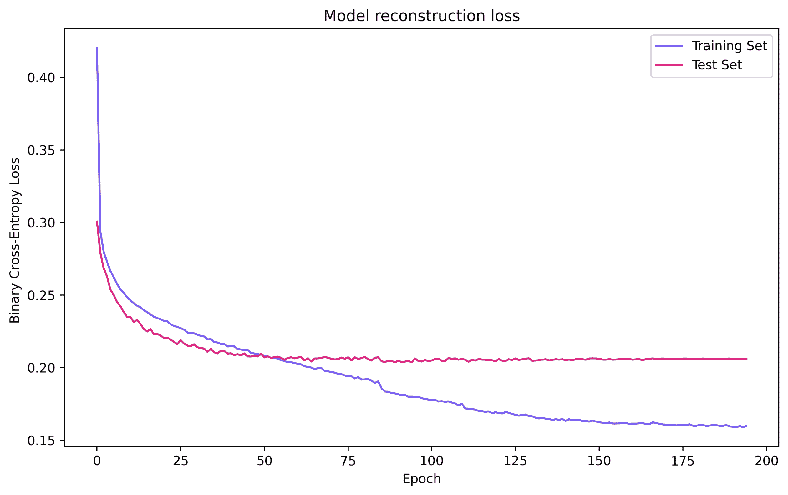

图 11.3–使用回调对跨时代的 widenet 损失建模

从该图中，我们可以清楚地看到在纪元 85 附近学习率降低的证据，其中在验证损失(即，测试集上的损失)的平台期之后调整学习；然而，这对验证损失几乎没有影响，因此，由于验证损失没有改善，训练在时期 190 左右提前终止。

在下一节中，我们将以定量的方式分析`widenet`模型的性能，以便稍后进行比较。

## 结果

在这里，我们想简单地用易于理解和与他人交流的术语来解释网络的性能。我们将重点分析模型的混淆矩阵、精确度、召回率、F1 分数、精确度和平衡错误率。如果您不记得这些术语的含义，请返回并快速回顾第 4 章、*从数据中学习*。

scikit-learn 的一个优点是，它有一个很好的自动过程来计算分类性能报告，其中包括了上面提到的大部分术语。它被简称为**分类报告**。我们将需要的这个库和其他库可以在`sklearn.metrics`类中找到，可以按如下方式导入:

```py
from sklearn.metrics import classification_report
from sklearn.metrics import confusion_matrix
from sklearn.metrics import balanced_accuracy_score
```

这三个库以相似的方式运行——它们采用基础事实和预测来评估性能:

```py
from sklearn.metrics import classification_report
from sklearn.metrics import confusion_matrix
from sklearn.metrics import balanced_accuracy_score
import NumPy as np

y_hat = widenet.predict(x_test) # we take the neuron with maximum
y_pred = np.argmax(y_hat, axis=1)  # output as our prediction

y_true = np.argmax(y_test, axis=1)   # this is the ground truth
labels=[0, 1, 2, 3, 4, 5, 6, 7, 8, 9]

print(classification_report(y_true, y_pred, labels=labels))

cm = confusion_matrix(y_true, y_pred, labels=labels)
print(cm)

ber = 1- balanced_accuracy_score(y_true, y_pred)
print('BER:', ber)
```

这段代码输出如下所示:

```py
    precision  recall  f1-score  support
0   0.65       0.59    0.61      1000
1   0.65       0.68    0.67      1000
2   0.42       0.47    0.44      1000
3   0.39       0.37    0.38      1000
4   0.45       0.44    0.44      1000
5   0.53       0.35    0.42      1000
6   0.50       0.66    0.57      1000
7   0.66       0.58    0.62      1000
8   0.62       0.71    0.67      1000
9   0.60       0.57    0.58      1000

accuracy               0.54      10000

[[587  26  86  20  39   7  26  20 147  42]
 [ 23 683  10  21  11  10  22  17  68 135]
 [ 63  21 472  71 141  34 115  41  24  18]
 [ 19  22  90 370  71 143 160  43  30  52]
 [ 38  15 173  50 442  36 136  66  32  12]
 [ 18  10 102 224  66 352 120  58  29  21]
 [  2  21  90  65  99  21 661   9  14  18]
 [ 36  15  73  67  90  45  42 582  13  37]
 [ 77  70  18  24  17   3  20   9 713  49]
 [ 46 167  20  28  14  14  30  36  74 571]]

BER: 0.4567
```

顶部表示`classification_report()`的输出。它给出了模型的精确度、召回率、f1 值和准确度。理想情况下，我们希望所有这些数字尽可能接近 1.0。直观上，准确率需要达到 100%(或者 1.0)；然而，其余的数字需要仔细研究。从这个报告中，我们可以观察到总准确率为 54%。从报告的其余部分，我们可以确定分类比较准确的类别是 1 和 8，分别对应*汽车*和*船舶*。同样，我们可以看到分类最差的两个类是 3 和 5，分别对应*猫*和*狗*。

虽然这些数字信息丰富，但我们可以通过查看混淆矩阵(由`confusion_matrix()`产生的一组数字)来了解混淆的来源。如果我们检查第四行上的混淆矩阵(对应于标签 3，*猫*，我们看到它正确地将 370 只猫分类为猫，但是 143 只猫被分类为狗，160 只猫被分类为青蛙，这只是命名混淆最严重的区域。另一种方式是视觉上的，如下图所示:

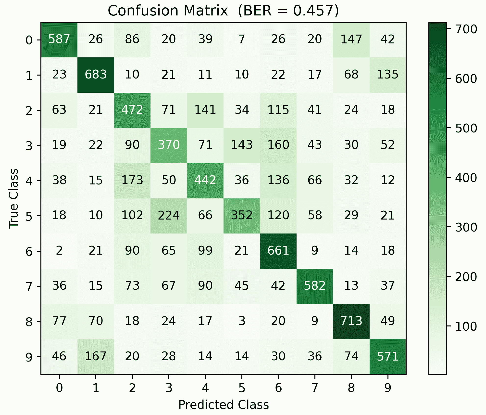

图 11.4–widenet 模型的混淆矩阵可视化

理想情况下，我们希望看到一个对角的混淆矩阵；然而，在这种情况下，我们看不到这种效果。目测之后，从*图 11.4* 中，我们可以观察哪些类别的预测正确率最低，并从视觉上确认混淆在哪里。

最后，需要注意的是，虽然**分类精度** ( **ACC** )是 54%，我们仍然需要验证**平衡误差率** ( **BER** )来补充我们所知道的精度。当类不是均匀分布时，也就是说，当某些类的样本比其他类多时，这一点尤其重要。如[第四章](7f55e68e-2e9f-486f-9337-5b2ea7bdb504.xhtml)、*从数据中学习*所述，我们可以简单地计算平衡精度并将其从 1 中减去。这表明误码率为 0.4567，即 45.67%。在理想的情况下，我们希望将 BER 降低到零，并且绝对远离 50%的 BER，这意味着该模型比随机机会好不了多少。

在这种情况下，模型的准确性并不令人印象深刻；然而，对于全连接网络来说，这是一个非常具有挑战性的分类问题，因此，这种性能并不令人惊讶。现在，我们将尝试做一个类似的实验，从一个相对较广的网络改变到一个深度网络，并比较结果。

# 密集深度神经网络

众所周知，深度网络可以在分类任务中提供良好的性能(廖，q .，et al. (2018))。在本节中，我们希望构建一个深度密集的神经网络，并查看它在 CIFAR-10 数据集上的表现。我们将构建下图所示的模型:

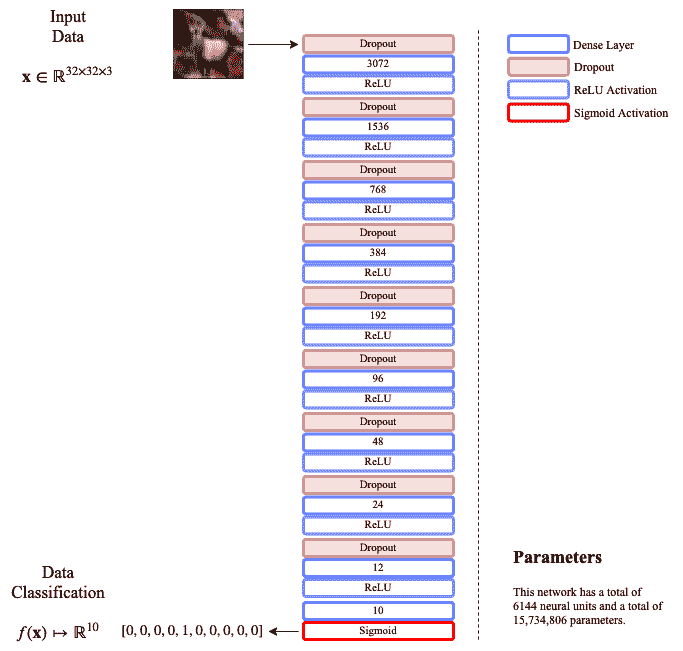

图 11.5–CIFAR-10 的深度密集网络的网络架构

该模型的目的之一是拥有与*图 11.1* 中模型相同数量的神经单元，用于广域网。这个模型有一个瓶颈架构，其中神经元的数量随着网络的深入而减少。正如我们接下来讨论的，这可以使用 Keras 函数方法以编程方式进行编码。

## 构建和训练模型

关于 Keras 的函数式方法的一个有趣的事实是，我们可以在构建模型时**回收**变量名，我们甚至可以使用循环来构建模型。例如，假设我想创建密集层，其漏失率随着神经元数量的增加而呈指数下降，分别为 1.5 和 2 倍。

我们可以通过这样的循环来实现这一点，该循环使用初始退出率`dr`和神经单元的初始数量`units`，并且每次分别减少 1.5 和 2 倍，只要神经单元的数量总是大于 10；我们停在 10，因为最后一层将包含 10 个神经元，每个类一个。它看起来像这样:

```py
while units > 10: 
  dl = Dropout(dr)(dl)
  dl = Dense(units, activation='relu')(dl)
  units = units//2
  dr = dr/1.5
```

前面的代码片段说明了我们可以重用变量而不会混淆 Python，因为 TensorFlow 在计算图形上操作，以正确的顺序解析图形的各个部分没有问题。代码还显示，我们可以非常容易地创建一个瓶颈型网络，其单元数量和丢失率呈指数衰减。

构建该模型的完整代码如下所示:

```py
# Dimensionality of input for CIFAR-10
inpt_dim = 32*32*3

inpt_vec = Input(shape=(inpt_dim,))

units = inpt_dim    # Initial number of neurons 
dr = 0.5    # Initial drop out rate   

dl = Dropout(dr)(inpt_vec)
dl = Dense(units, activation='relu')(dl)

# Iterative creation of bottleneck layers
units = units//2
dr = dr/2
while units>10: 
 dl = Dropout(dr)(dl)
 dl = Dense(units, activation='relu')(dl)
 units = units//2
 dr = dr/1.5

# Output layer
output = Dense(10, activation='sigmoid')(dl)

deepnet = Model(inpt_vec, output)
```

编译和训练模型是这样的:

```py
deepnet.compile(loss='binary_crossentropy', optimizer='adam')
deepnet.summary()

reduce_lr = ReduceLROnPlateau(monitor='val_loss', factor=0.5, patience=20, 
                              min_delta=1e-4, mode='min')
stop_alg = EarlyStopping(monitor='val_loss', patience=100, 
                         restore_best_weights=True)
hist = deepnet.fit(x_train, y_train, batch_size=1000, epochs=1000, 
                   callbacks=[stop_alg, reduce_lr], shuffle=True, 
                   validation_data=(x_test, y_test))

deepnet.save_weights("deepnet.hdf5")
```

这产生了由前面代码中的`deepnet.summary()`引起的以下输出:

```py
Model: "model"
_________________________________________________________________
Layer (type)          Output Shape    Param # 
=================================================================
input_1 (InputLayer)  [(None, 3072)]  0 
_________________________________________________________________
dropout (Dropout)     (None, 3072)    0 
_________________________________________________________________
dense (Dense)         (None, 3072)    9440256 
_________________________________________________________________
.
.
.
_________________________________________________________________
dense_8 (Dense)       (None, 12)      300 
_________________________________________________________________
dense_9 (Dense)       (None, 10)      130 
=================================================================
Total params: 15,734,806
Trainable params: 15,734,806
Non-trainable params: 0
```

如前总结所示，同时在*图 11.5* 中，该模型的参数总数**为 15，734，806** 。这证实了这是一个过度参数化的模型。打印的概要还描述了在没有提供具体名称的情况下，模型的每个部分是如何命名的；也就是说，它们都有一个基于类名和连续数字的通用名称。

`fit()`方法训练深度模型，当我们绘制记录在`hist`变量中的训练时，正如我们之前对*图 11.3* 所做的那样，我们获得了下图:


图 11.6–使用回调对跨时代的 deepnet 损失建模

从*图 11.6* 中，我们看到深度网络在大约 200 个时期后停止训练，训练集和测试集在时期 70 左右交叉，之后，模型开始过度拟合训练集。如果我们将这个结果与*图 11.3* 中的广域网络的结果进行比较，我们可以看到模型在第 55 个时期开始过度拟合。

现在让我们讨论这个模型的定量结果。

## 结果

如果我们以与广域网相同的方式生成分类报告，我们将获得如下所示的结果:

```py
     precision  recall  f1-score  support

 0   0.58       0.63    0.60      1000
 1   0.66       0.68    0.67      1000
 2   0.41       0.42    0.41      1000
 3   0.38       0.35    0.36      1000
 4   0.41       0.50    0.45      1000
 5   0.51       0.36    0.42      1000
 6   0.50       0.63    0.56      1000
 7   0.67       0.56    0.61      1000
 8   0.65       0.67    0.66      1000
 9   0.62       0.56    0.59      1000

 accuracy               0.53      10000

[[627  22  62  19  45  10  25  18 132  40]
 [ 38 677  18  36  13  10  20  13  55 120]
 [ 85  12 418  82 182  45  99  38  23  16]
 [ 34  14 105 347  89 147 161  50  17  36]
 [ 58  12 158  34 496  29 126  55  23   9]
 [ 25   7 108 213  91 358 100  54  23  21]
 [ 9   15  84  68 124  26 631   7  11  25]
 [ 42  23  48  58 114  57  61 555  10  32]
 [110  75  16  22  30  11   8   5 671  52]
 [ 51 171  14  34  16   9  36  36  69 564]]

BER 0.4656
```

这表明了与宽模型相当的结果，在宽模型中，我们获得了 0.4567 的 BER，这表示宽模型有 0.0089 的差异，这在这种情况下不表示显著差异。通过查看前面的结果或下图所示的混淆矩阵，我们可以验证这些模型在特定类别的分类性能方面也是可比较的:

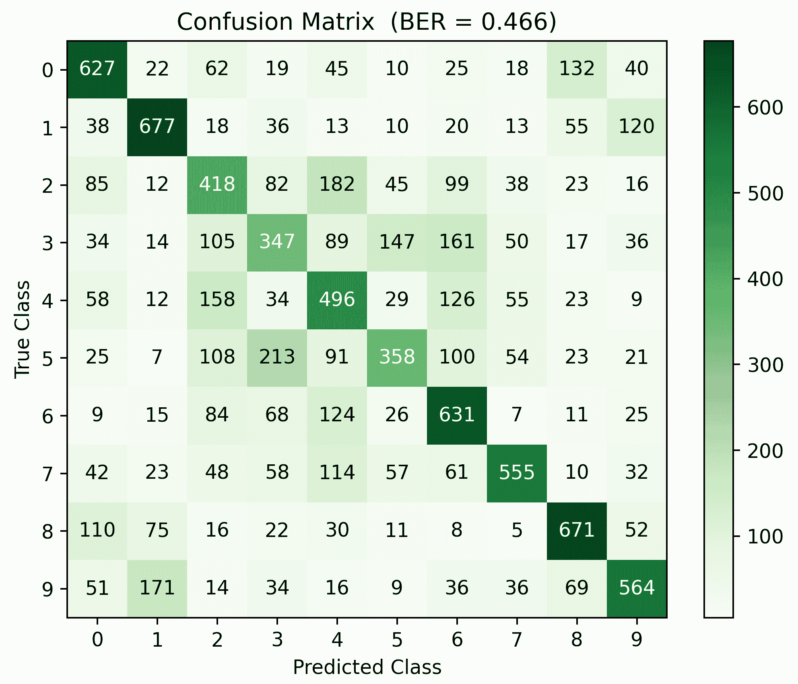

图 11.7-deep net 模型的混淆矩阵可视化

从前面的结果中，我们可以确定最难分类的类别是第三类，*猫*，它们经常与狗混淆。同样，最容易分类的是 1 号，*舰* *s* ，这两个数字经常和飞机混淆。但是再一次，这与来自广域网络的结果是一致的。

我们可以尝试的另一种深度网络是促进网络权重稀疏的网络，我们将在接下来讨论。

# 稀疏深度神经网络

稀疏网络在其架构的不同方面可以定义为*稀疏*(Gripon，v .和 Berrou，c .，2011)。然而，我们将在本节中研究的特定类型的稀疏性是相对于网络的权重(即其参数)获得的稀疏性。我们将查看每个特定参数，看它是否相对接近于零(从计算角度来说)。

目前，在 TensorFlow 上的 Keras 中有三种施加权重稀疏的方式，并且它们与向量范数的概念相关。如果我们看看曼哈顿范数或欧几里德范数，它们的定义如下:

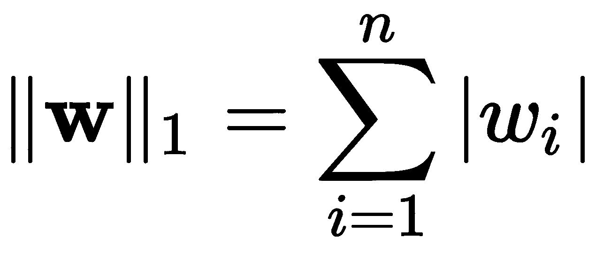，

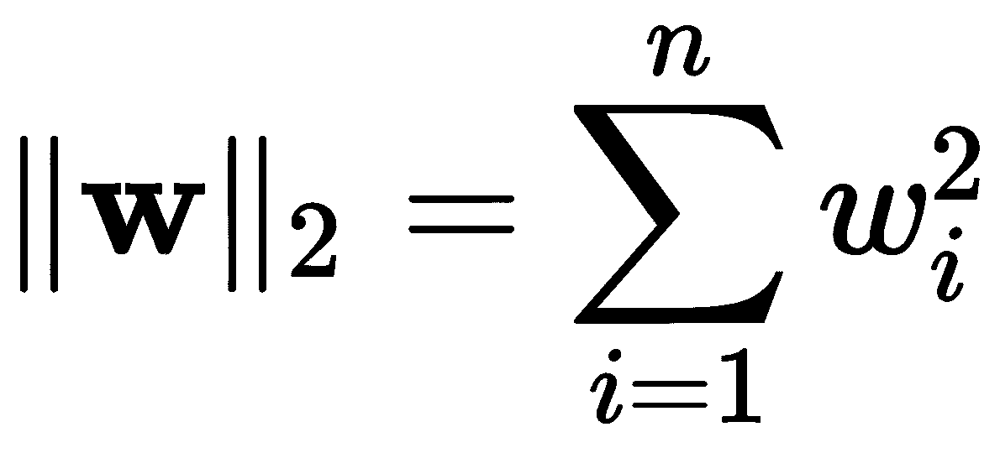

这里， *n* 是向量中的元素个数。如你所见，简单来说， -norm 根据绝对值将所有元素相加，而 -norm 则根据它们的平方值。很明显，如果两个范数都接近于零，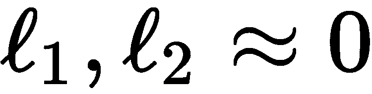，那么它的大部分元素很可能是零或接近于零。作为个人选择，我们将使用-范数，因为与相反，非常大的向量是二次惩罚的，以避免特定的神经元支配特定的项。

Keras 在`regularizers`类中包含了这些工具:`tf.keras.regularizers`。我们可以按如下方式导入它们:

*   -定额:`tf.keras.regularizers.l1(l=0.01)`
*   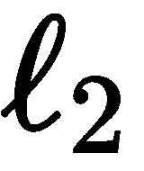-定额:`tf.keras.regularizers.l2(l=0.01)`

这些正则化子被应用于网络的损失函数，以便最小化权重的范数。

**正则化子**是机器学习中使用的一个术语，用来表示为目标(损失)函数或一般优化问题(如梯度下降)提供元素的术语或函数，以便提供数值稳定性或提高问题的可行性。在这种情况下，正则化通过防止一些权重值的爆炸来促进权重的稳定性，同时促进一般稀疏性。

参数`l=0.01`是一个罚因子，直接决定最小化权重范数的重要性。换句话说，处罚如下:

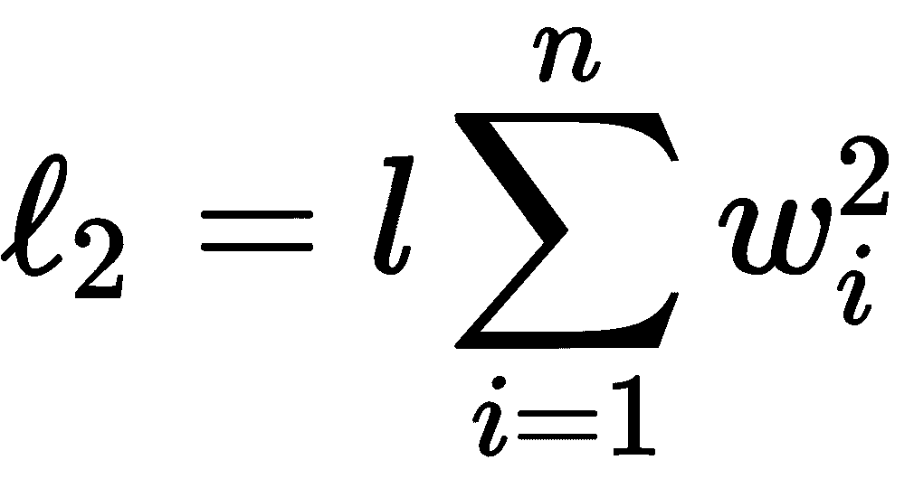

所以用一个很小的值，比如`l=0.0000001`会很少注意范数，而`l=0.01`在损失函数最小化过程中会很注意范数。这里有一个问题:这个参数需要调整，因为如果网络太大，可能会有几百万个参数，这会使范数看起来非常大，因此需要一个小的惩罚；而如果网络相对较小，则推荐较大的惩罚。由于这个练习是在一个有 1500 多万个参数的非常深的网络上进行的，我们将使用一个值`l=0.0001`。

让我们继续建立一个稀疏网络。

## 构建稀疏网络并训练它

为了构建这个网络，我们将使用与图 11.5 所示完全相同的架构，除了每个单独密集层的声明将包含一个规范，我们希望考虑与该层相关的权重范数的最小化。请查看前一部分的代码，并将其与下面的代码进行比较，我们在下面的代码中强调了不同之处:

```py
# Dimensionality of input for CIFAR-10
inpt_dim = 32*32*3

inpt_vec = Input(shape=(inpt_dim,))

units = inpt_dim    # Initial number of neurons 
dr = 0.5    # Initial drop out rate   

dl = Dropout(dr)(inpt_vec)
dl = Dense(units, activation='relu', 
           kernel_regularizer=regularizers.l2(0.0001))(dl)

# Iterative creation of bottleneck layers
units = units//2
dr = dr/2
while units>10: 
  dl = Dropout(dr)(dl)
  dl = Dense(units, activation='relu', 
             kernel_regularizer=regularizers.l2(0.0001))(dl)
  units = units//2
  dr = dr/1.5

# Output layer
output = Dense(10, activation='sigmoid', 
               kernel_regularizer=regularizers.l2(0.0001))(dl)

sparsenet = Model(inpt_vec, output)
```

编译和训练模型的过程是一样的，就像这样:

```py
sparsenet.compile(loss='binary_crossentropy', optimizer='adam')
sparsenet.summary()

reduce_lr = ReduceLROnPlateau(monitor='val_loss', factor=0.5, patience=20, 
                              min_delta=1e-4, mode='min')
stop_alg = EarlyStopping(monitor='val_loss', patience=100, 
                         restore_best_weights=True)
hist = sparsenet.fit(x_train, y_train, batch_size=1000, epochs=1000, 
                     callbacks=[stop_alg, reduce_lr], shuffle=True, 
                     validation_data=(x_test, y_test))

sparsenet.save_weights("sparsenet.hdf5")
```

`sparsenet.summary()`的输出与上一节中显示的`deepnet.summary()`的输出相同，因此我们在此不再重复。但是，我们可以查看损失最小化时的训练曲线，见下图:

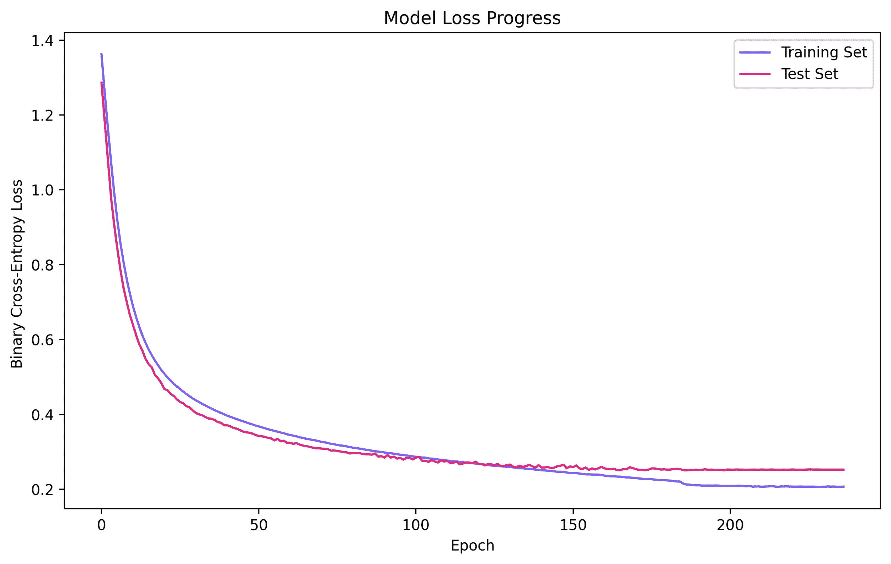

图 11.8–sparsenet 模型跨时段的损失函数优化

从该图中，我们可以看到两条曲线，训练集和测试集，都被一起最小化到大约时期 120，在此处两条曲线都开始偏离，并且在此之后模型开始过度拟合。与图 11.3 和图 11.6 中的*模型相比，我们可以看到，该模型可以训练得更慢一些，但仍能实现相对收敛。然而，请注意，虽然损失函数仍然保持二元交叉熵，但是该模型也最小化了范数，使得这个特定的损失不能与之前的损失直接比较。*

现在让我们讨论这个模型的定量结果。

## 结果

当我们查看性能的定量分析时，我们可以看出该模型与以前的模型不相上下。就 BER 而言有轻微的增益；然而，仅仅宣布胜利和通过任何手段解决问题是不够的——参见以下分析:

```py
     precision recall f1-score support

 0   0.63      0.64   0.64     1000
 1   0.71      0.66   0.68     1000
 2   0.39      0.43   0.41     1000
 3   0.37      0.23   0.29     1000
 4   0.46      0.45   0.45     1000
 5   0.47      0.50   0.49     1000
 6   0.49      0.71   0.58     1000
 7   0.70      0.61   0.65     1000
 8   0.63      0.76   0.69     1000
 9   0.69      0.54   0.60     1000

 accuracy             0.55     10000

[[638  17  99   7  27  13  27  10 137  25]
 [ 40 658  11  32  11   7  21  12 110  98]
 [ 78  11 431  34 169  93 126  31  19   8]
 [ 18  15  96 233  52 282 220  46  14  24]
 [ 47   3 191  23 448  36 162  57  28   5]
 [ 17   6 124 138  38 502 101  47  16  11]
 [  0   9  59  51 111  28 715   8  13   6]
 [ 40   1  66  50  85  68  42 608  12  28]
 [ 76  45  18  16  25   8  22   5 755  30]
 [ 51 165  12  38   6  23  29  43  98 535]]

BER 0.4477
```

我们可以明确得出的结论是，与本章中讨论的其他模型相比，该模型在性能方面并不差。事实上，仔细观察下图所示的混淆矩阵可以发现，就本质上相似的对象而言，该网络也会出现类似的错误:

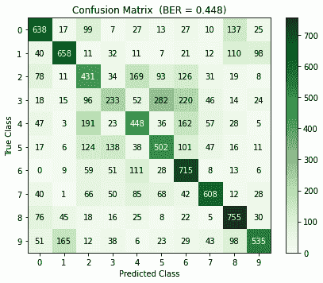

图 11.9-稀疏网络模型的混淆矩阵

现在，由于很难理解我们到目前为止所讨论的模型(宽、深和稀疏)之间的差异，我们可以计算并绘制每个训练模型的权重的范数，如下图所示:

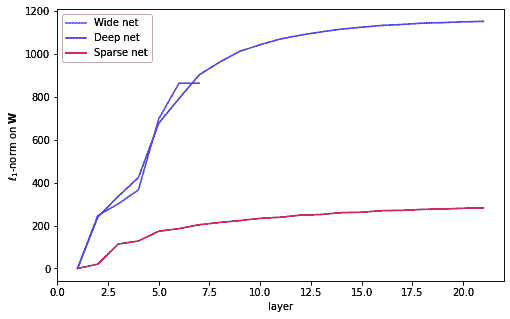

图 11.10–训练模型的累积标准权重

该图显示了根据-标准的计算，以便有足够接近的值来评价它们；在水平轴上，我们有层数，在垂直轴上，我们有随着我们在网络的层中前进的累积范数。这就是我们能够体会到网络在参数方面有多么不同的地方。在稀疏网络中，与其他网络相比，累积范数要小得多(大约四到五倍)。对于那些可能在芯片上实现的网络或其他应用来说，这可能是一个有趣而重要的特性，在这些应用中，零权重可以导致生产中的高效计算(Wang，p .，et al. 2018)。

虽然可以通过超参数优化技术实验性地确定网络权重受范数影响的程度，但通常更常见的是确定其他参数，如辍学率、神经单元的数量以及我们在下一节中讨论的其他参数。

# 超参数优化

有一些优化参数的方法；例如，一些是基于梯度的(Rivas，p .，et al . 2014Maclaurin，d .等人 2015 *)* ，其他为贝叶斯(福雷尔，m .等人 2015 *)* 。然而，很难找到一个通用的方法，既能非常好地工作，又能同时高效地工作——通常，你只能得到其中的一个。你可以在这里阅读更多关于其他算法的内容(Bergstra，J. S .等人 2011 *)* 。

对于这一领域的任何初学者来说，从简单易记的东西开始可能更好，比如随机搜索(Bergstra，j .，& Bengio，Y. 2012 *)* 或网格搜索。这两种方法非常相似，虽然我们在这里将重点放在**网格搜索**上，但是两者的实现非常相似。

## 库和参数

我们将需要使用两个以前没有涉及过的主要库:`GridSearchCV`，用于执行带有交叉验证的网格搜索，以及`KerasClassifier`，用于创建一个可以与 scikit-learn 通信的 Keras 分类器。

两个库都可以按如下方式导入:

```py
from sklearn.model_selection import GridSearchCV
from tensorflow.keras.wrappers.scikit_learn import KerasClassifier
```

我们将优化的超参数(及其可能的值)如下:

*   **辍学率** : `0.2`，`0.5`
*   **优化器** : `rmsprop`，`adam`
*   **学习率** : `0.01`，`0.0001`
*   **隐层神经元** : `1024`，`512`，`256`

总的来说，超参数的可能组合是 2x2x2x3=24。这是四维网格中的选项总数。备选方案的数量可以大得多，也可以更全面，但是请记住:在这个例子中，我们希望事情简单一些。此外，由于我们将应用交叉验证，您将把可能的组合乘以交叉验证中的分裂数，这就是将执行多少次完整的端到端训练，以确定超参数的最佳组合。

请注意您将在格网搜索中尝试的选项数量，因为所有选项都将被测试，对于较大的网络和较大的数据集，这可能会花费大量时间。当您获得更多经验时，您将能够仅通过考虑您定义的架构来选择更小的参数集。

接下来将讨论完整的实现。

## 实现情况和结果

此处显示了网格搜索的完整代码，但是考虑到这些内容中的大多数都是重复的，因为这是在本章前面讨论的广域网模型上建模的:

```py
from sklearn.model_selection import GridSearchCV
from tensorflow.keras.wrappers.scikit_learn import KerasClassifier
from tensorflow.keras.layers import Input, Dense, Dropout
from tensorflow.keras.models import Model
from tensorflow.keras.optimizers import Adam, RMSprop
from tensorflow.keras.datasets import cifar10
from tensorflow.keras.utils import to_categorical
from tensorflow.keras.callbacks import ReduceLROnPlateau, EarlyStopping
import NumPy as np

# load and prepare data (same as before)
(x_train, y_train), (x_test, y_test) = cifar10.load_data()
x_train = x_train.astype('float32') / 255.0
x_test = x_test.astype('float32') / 255.0
x_train = x_train.reshape((len(x_train), np.prod(x_train.shape[1:])))
x_test = x_test.reshape((len(x_test), np.prod(x_test.shape[1:])))
y_train = to_categorical(y_train, 10)
y_test = to_categorical(y_test, 10)
```

我们声明一个方法来构建一个模型，并像这样返回它:

```py
# A KerasClassifier will use this to create a model on the fly
def make_widenet(dr=0.0, optimizer='adam', lr=0.001, units=128):
  # This is a wide architecture
  inpt_dim = 32*32*3
  inpt_vec = Input(shape=(inpt_dim,))
  dl = Dropout(dr)(inpt_vec)
  l1 = Dense(units, activation='relu')(dl)
  dl = Dropout(dr)(l1)
  l2 = Dense(units, activation='relu') (dl)
  output = Dense(10, activation='sigmoid') (l2)

  widenet = Model(inpt_vec, output)

  # Our loss and lr depends on the choice
  if optimizer == 'adam':
    optmzr = Adam(learning_rate=lr)
  else:
    optmzr = RMSprop(learning_rate=lr)

  widenet.compile(loss='binary_crossentropy', optimizer=optmzr, 
                  metrics=['accuracy'])

  return widenet
```

然后，我们将这些片段放在一起，搜索参数，并进行如下训练:

```py
# This defines the model architecture
kc = KerasClassifier(build_fn=make_widenet, epochs=100, batch_size=1000, 
                     verbose=0)

# This sets the grid search parameters
grid_space = dict(dr=[0.2, 0.5],      # Dropout rates
                  optimizer=['adam', 'rmsprop'], 
                  lr=[0.01, 0.0001],  # Learning rates
                  units=[1024, 512, 256])

gscv = GridSearchCV(estimator=kc, param_grid=grid_space, n_jobs=1, cv=3, verbose=2)
gscv_res = gscv.fit(x_train, y_train, validation_split=0.3,
                    callbacks=[EarlyStopping(monitor='val_loss', 
                                             patience=20, 
                                             restore_best_weights=True),
                               ReduceLROnPlateau(monitor='val_loss', 
                                                 factor=0.5, patience=10)])

# Print the dictionary with the best parameters found:
print(gscv_res.best_params_)
```

这将打印出几行，每次交叉验证运行一行。这里我们将省略很多输出，只是为了向您展示它的样子，但是如果您愿意，您可以手动调整详细程度:

```py
Fitting 3 folds for each of 24 candidates, totalling 72 fits
[CV] dr=0.2, lr=0.01, optimizer=adam, units=1024 .....................
[Parallel(n_jobs=1)]: Using backend SequentialBackend with 1 concurrent workers.
[CV] ...... dr=0.2, lr=0.01, optimizer=adam, units=1024, total= 21.1s
[CV] dr=0.2, lr=0.01, optimizer=adam, units=1024 .....................
[Parallel(n_jobs=1)]: Done 1 out of 1 | elapsed: 21.1s remaining: 0.0s
[CV] ...... dr=0.2, lr=0.01, optimizer=adam, units=1024, total= 21.8s
[CV] dr=0.2, lr=0.01, optimizer=adam, units=1024 .....................
[CV] ...... dr=0.2, lr=0.01, optimizer=adam, units=1024, total= 12.6s
[CV] dr=0.2, lr=0.01, optimizer=adam, units=512 ......................
[CV] ....... dr=0.2, lr=0.01, optimizer=adam, units=512, total= 25.4s
.
.
.
[CV] .. dr=0.5, lr=0.0001, optimizer=rmsprop, units=256, total= 9.4s
[CV] dr=0.5, lr=0.0001, optimizer=rmsprop, units=256 .................
[CV] .. dr=0.5, lr=0.0001, optimizer=rmsprop, units=256, total= 27.2s
[Parallel(n_jobs=1)]: Done 72 out of 72 | elapsed: 28.0min finished

{'dr': 0.2, 'lr': 0.0001, 'optimizer': 'adam', 'units': 1024}
```

这最后一行是您需要的最宝贵的信息，因为它是给出最佳结果的最佳参数组合。现在，您可以继续使用这些**优化的**参数来更改您最初的广域网实现，并查看性能如何变化。您应该会获得大约 5%的平均准确率提升，这已经不错了！

或者，您可以尝试更大的参数集，或者增加交叉验证的拆分数量。可能性是无限的。出于以下原因，您应该始终尝试优化模型中的参数数量:

*   它让你对你的模型充满信心。
*   这会让你的客户对你有信心。
*   它告诉世界你是专业的。

干得好！是总结的时候了。

# 摘要

本章讨论了神经网络的不同实现，即宽、深和稀疏实现。读完这一章后，你应该能体会到设计上的不同，以及它们如何影响表现或训练时间。至此，您应该能够欣赏这些架构的简单性，以及它们如何为我们到目前为止讨论的其他内容提供新的替代方案。在本章中，您还学习了优化模型的超参数，例如，辍学率，旨在最大化网络的泛化能力。

我确信你注意到这些模型达到了超过随机机会的精确度，也就是说，超过 50%；然而，我们讨论的问题是一个很难解决的问题，你可能不会感到惊讶，一个通用的神经架构，就像我们在这里研究的那样，并没有表现得非常好。为了获得更好的性能，我们可以使用更专业的体系结构来解决输入的高空间相关性问题，例如图像处理。一种专门的架构被称为**卷积神经网络** ( **CNN** )。

我们的下一站，[第十二章](c36bdee9-51f3-4283-8f15-6dd603d071a1.xhtml)，*卷积神经网络，*将详细讨论*。*当您从通用模型转移到更加专业的模型时，您将能够看到差异有多大。你不能错过即将到来的这一章。但是在你离开之前，请试着用下面的问题来测验你自己。

# 问题和答案

1.  **广域网络和深度网络的性能有显著差异吗？**

不多的情况下，我们在这里学习。然而，你必须记住的一件事是，两个网络从根本上学习不同的东西或输入的方面。因此，在其他应用程序中，性能可能会有所不同。

2.  **深度学习和深度神经网络一样吗？**

不。深度学习是机器学习的领域，专注于使用新的梯度下降技术训练过参数化模型的所有算法。深度神经网络是具有许多隐藏层的网络。所以，深度网络就是深度学习。但是深度学习并不仅仅局限于深度网络。

3.  你能举例说明什么时候需要稀疏网络吗？

让我们想想机器人技术。在这个领域，大多数东西都运行在微芯片上，这些芯片有内存限制、存储限制和计算能力限制；找到权重几乎为零的神经架构意味着你不必计算这些乘积。这意味着重量可以存储在更小的空间中，快速加载，计算速度更快。其他可能性包括物联网设备、智能手机、智能汽车、智能城市、执法部门等等。

4.  **我们怎样才能让这些模型表现得更好？**

我们可以通过包含更多选项来进一步优化超参数。我们可以使用自编码器对输入进行预处理。但是最有效的方法是切换到 CNN 来解决这个问题，因为 CNN 特别擅长图像的分类。见下一章。

# 参考

*   罗森布拉特，F. (1958)。感知器:大脑中信息存储和组织的概率模型。*心理评论*，第 65 卷第 6 期，第 386 页。
*   穆塞利博士(1997 年)。pocket 算法的收敛性。 *IEEE 神经网络汇刊*，8(3)，623-629。
*   Novak，r .，Xiao，l .，Hron，j .，Lee，j .，Alemi，A. A .，Sohl-Dickstein，j .，& Schoenholz，S. S. (2019)。神经切线:Python 中快速简单的无限神经网络。arXiv 预印本 arXiv:1912.02803。
*   Soltanolkotabi，m .，Javanmard，a .，和 Lee，J. D. (2018)。对过参数化浅层神经网络优化前景的理论洞察。 *IEEE 信息论汇刊*，65(2)，742-769 页。
*   杜，S. S .，翟，x .，Poczos，b .，& Singh，A. (2018)。梯度下降可证明优化过参数神经网络。arXiv 预印本 arXiv:1810.02054。
*   廖，q .，米兰达，b .，班布尔斯基，a .，希达里，j .，&波焦，T. (2018)。一个令人惊讶的线性关系预测了深度网络中的测试性能。arXiv 预印本 arXiv:1807.09659。
*   格里彭，v .和贝鲁，C. (2011 年)。具有大学习多样性的稀疏神经网络。 *IEEE 神经网络汇刊*，22(7)，1087-1096。
*   王平，纪，洪，吕，王，谢，(2018 年 6 月)。SNrram:一种基于阻变存储器的高效稀疏神经网络计算架构。在 *2018 第 55 届 ACM/ESDA/IEEE 设计自动化大会* (DAC)(第 1-6 页)。IEEE。
*   Rivas-Perea，p .，Cota-Ruiz，j .，和 Rosiles，J. G. (2014 年)。lp-svr 超参数选择的非线性最小二乘拟牛顿策略。*国际机器学习和控制论杂志*，5 卷 4 期，579-597 页。
*   麦克劳伦博士、杜文瑙博士和亚当斯博士(2015 年 6 月)。通过可逆学习的基于梯度的超参数优化。在*机器学习国际会议*(第 2113-2122 页)。
*   m .福雷尔、J. T .斯普林根贝格和 f .哈特(2015 年 2 月)。通过元学习初始化贝叶斯超参数优化。在*第二十九届 AAAI 人工智能会议*。
*   伯格斯特拉，j .，&本吉奥，Y. (2012 年)。超参数优化的随机搜索。*机器学习研究杂志*，13 卷 1 期，281-305 页。
*   伯格斯特拉、J. S .、巴登内特、r .、本吉奥、y .、凯格尔、B. (2011 年)。超参数优化算法。在*神经信息处理系统的进展*(第 2546-2554 页)。