# 二、让自己为深度学习做好准备

由于最近**人工神经网络**(**ann**)在**人工智能** ( **AI** )的不同应用中取得的成就，例如计算机视觉、**自然语言处理** ( **NLP** )和语音识别，深度学习已经成为大多数现实世界实现的突出技术基础。本章旨在成为如何在现实世界中试验和应用深度学习技术的起点。

我们将回答一个关键问题，即开始深度学习需要哪些技能和概念。我们将具体回答以下问题:

*   理解和入门深度学习需要哪些技能？
*   深度学习需要哪些来自线性代数的核心概念？
*   深度学习系统的实际实现存在哪些硬件要求？
*   现在有哪些软件框架可以让开发者轻松开发他们的深度学习应用？
*   如何在 AWS 等基于云的**图形处理单元** ( **GPU** )实例上搭建深度学习系统？


# 线性代数基础

让自己建立深度学习所需的最基本技能之一是对线性代数的基本理解。虽然线性代数本身是一个很大的课题，并且完全涵盖它超出了本书的范围，我们将在本章中讨论线性代数的一些重要方面。希望这将让你充分理解一些核心概念，以及它们如何与深度学习方法相互作用。


# 数据表示

在这一节中，我们将看看不同线性代数任务中最常用的核心数据结构和表示。这并不意味着是一个全面的列表，而只是为了突出一些对理解深度学习概念有用的突出表示:

*   **向量**:线性代数中最基本的表示之一就是向量。向量可以定义为一个对象数组，或者更具体地说，一个保持数字顺序的数字数组。基于索引位置，可以在向量中访问每个数字。例如，考虑一个向量 *x* ，包含从 1 到 7 编码的一周七天，其中 1 代表星期天，7 代表星期六。使用这种符号，一周中的某一天，比如说星期三，可以通过向量 x [4]直接访问:

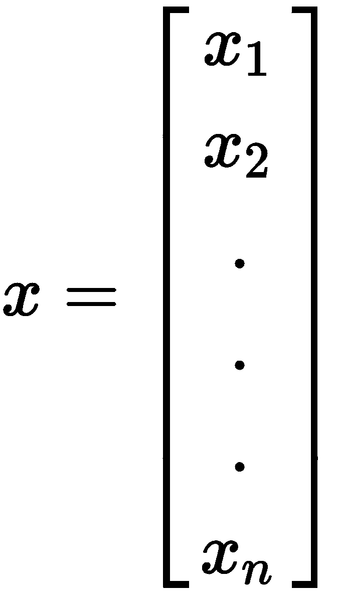

*   **矩阵**:这些是数字的二维表示，或者基本上是向量的向量。每个矩阵， *m，*由一定数量的行， *r，*和一定数量的列， *c* 组成。每一个 *i* 行，其中 *1 < = i < = r* ，是一个 *c* 数的向量。每一个 *j* 列，其中 *1 < =j < = c* ，也是一个 *r* 数的向量。当我们处理图像时，矩阵是一种特别有用的表示。虽然真实世界的图像本质上是三维的，但是大多数计算机视觉问题都集中在图像的二维表示上。因此，矩阵表示是图像的直观表示:

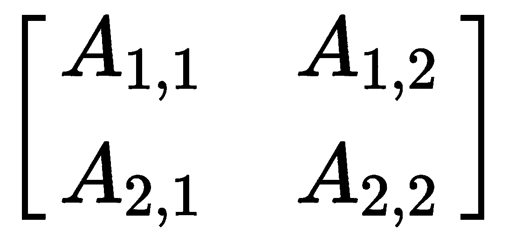

*   **单位矩阵**:单位矩阵被定义为一个矩阵，当它与一个向量相乘时，不改变该向量。通常，单位矩阵的所有元素都是 0，除了主对角线上的元素都是 1:

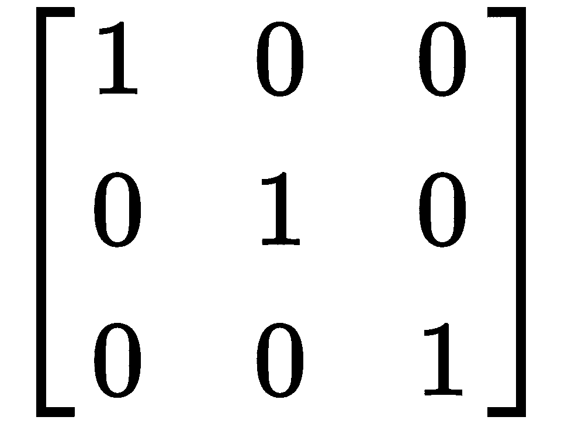

# 数据操作

在这一节中，我们将看看应用于矩阵的一些最常见的变换。

*   **矩阵转置**:矩阵转置是一种矩阵变换，只是沿着矩阵的主对角线镜像矩阵。数学上定义如下:

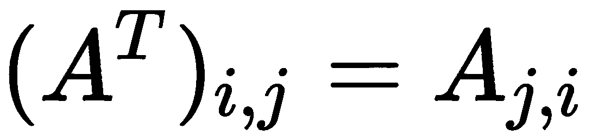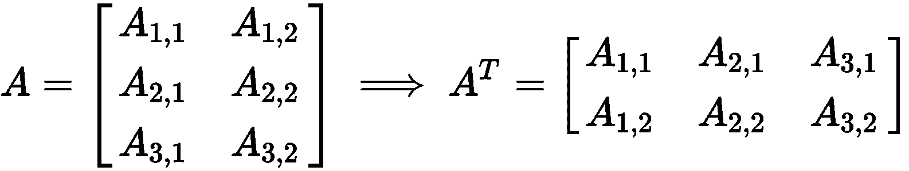

*   **矩阵乘法**:矩阵乘法是最基本的运算之一，可以应用于任意两个矩阵。一个矩阵，形状为*的 *A、*A[r]x A[c]可以乘以另一个矩阵，形状为*B[r]x B*[*c*]当且仅当*A[c]**= B*[*r*]合成矩阵， *C，*是形状*A[r]x*B[C]。乘法运算定义如下:*

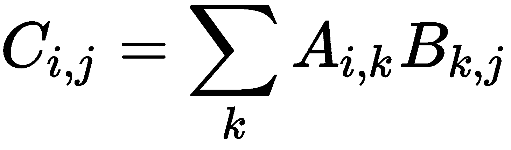

矩阵乘法通常具有非常有用的性质。例如，矩阵乘法是分布式的:


矩阵乘法也是关联的:

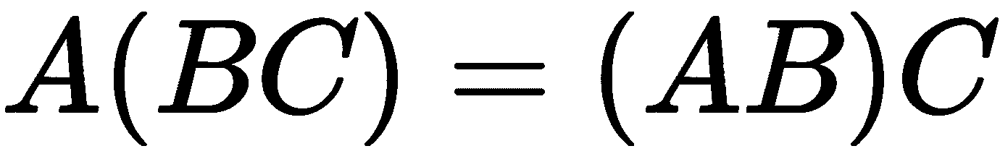

矩阵乘法也有一个非常简单的转置形式:

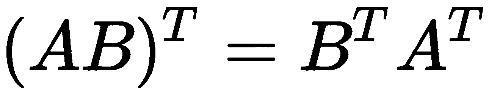

矩阵乘法是不可交换的，也就是说 *A x B ≠ B x A* 。然而，两个向量之间的点积是可交换的:

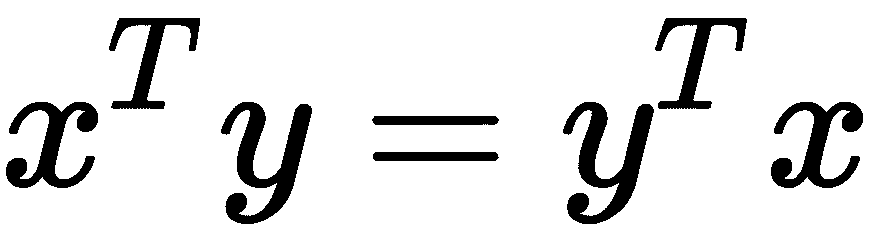      

# 矩阵属性

在本节中，我们将了解一些对深度学习应用非常有用的重要属性矩阵。

*   **范数**:范数是向量或矩阵的重要性质，度量向量或矩阵的大小。从几何学上讲，它也可以解释为一个点 *x* 到原点的距离。因此，*L[p]定额定义如下:*

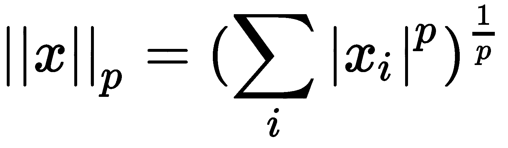

虽然可以为各种阶的 *p* 计算范数，但是最广为人知的范数是 L1 和 L [2] 范数。L [1] 范数通常被认为是稀疏模型的好选择:

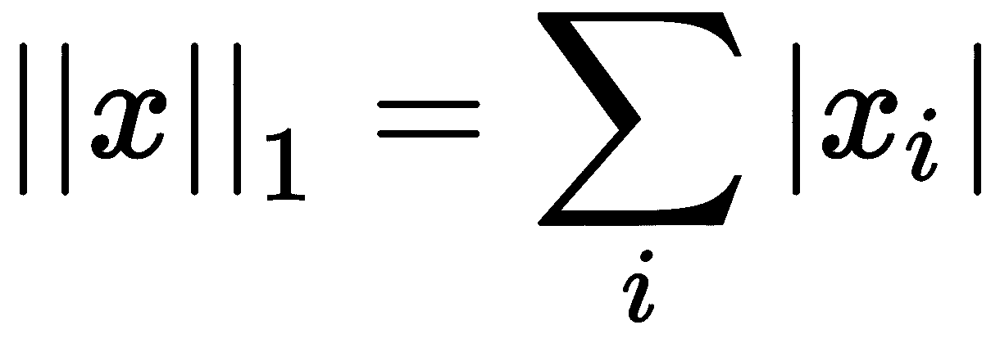

深度学习社区中流行的另一个规范是`max`规范，也被称为 *L ^∞* 。这相当于向量中最大元素的值:

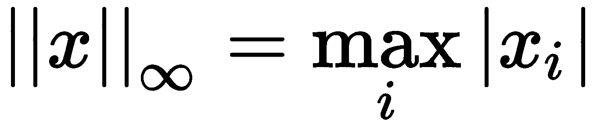

到目前为止，前面提到的所有规范都适用于向量。当我们想要计算矩阵的大小时，我们使用 **Frobenius 范数**，定义如下:

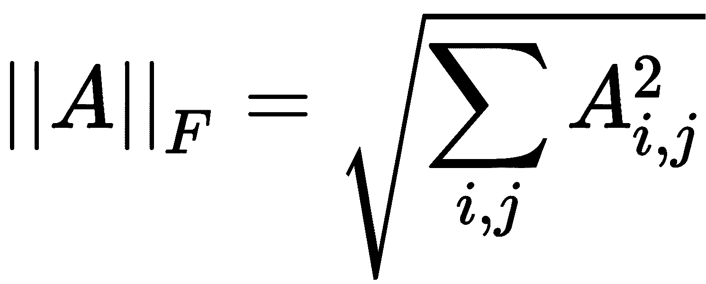

通常使用范数，因为它们可以用来直接计算两个向量的点积:

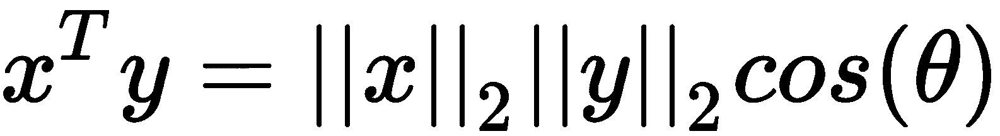

*   **Trace** : Trace 是一个运算符，定义为一个矩阵的所有对角元素之和:

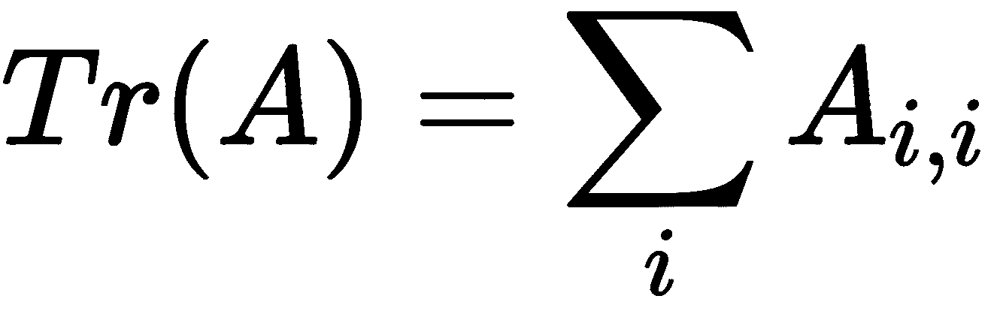

追踪运算符在计算矩阵的 **Frobenius 范数**时非常有用，如下所示:

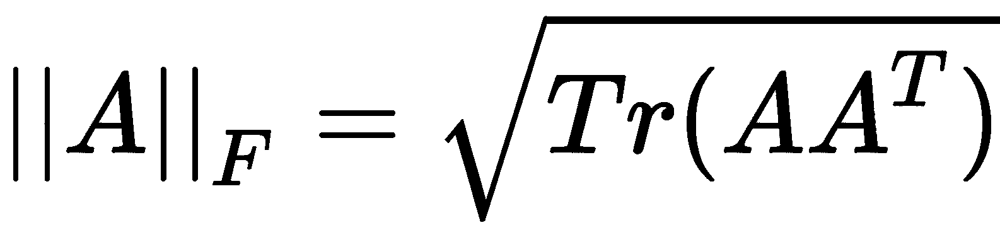

跟踪算子的另一个有趣的性质是它对矩阵转置运算是不变的。因此，它通常用于处理矩阵表达式以产生有意义的恒等式:

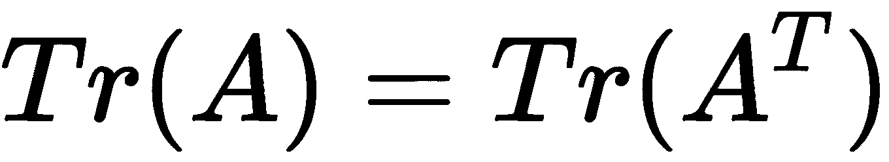

*   **行列式**:矩阵的行列式定义为一个标量值，它只是矩阵所有特征值的乘积。它们通常在线性方程组的分析和求解中非常有用。例如，根据克莱姆法则，当且仅当由线性方程组组成的矩阵的行列式不为零时，线性方程组才有唯一解。


# 利用 GPU 进行深度学习

顾名思义，深度学习包括学习数据的更深层次的表示，这需要大量的计算能力。如此强大的计算能力通常是现代 CPU 所无法实现的。另一方面，GPU 非常适合这项任务。GPU 最初是为实时渲染图形而设计的。典型 GPU 的设计允许不成比例的大量**算术逻辑单元** ( **ALU** )，这允许它们实时处理大量计算。

用于通用计算的 GPU 具有高度的数据并行架构，这意味着它们可以并行处理大量数据点，从而提高计算吞吐量。每个 GPU 都由数千个内核组成。每一个这样的内核都由许多功能单元组成，这些功能单元包含高速缓存和 ALU 以及其他模块。这些功能单元中的每一个都执行完全相同的指令集，从而允许 GPU 中的大规模数据并行。在下一节中，我们将比较 GPU 和 CPU 的设计。

下表说明了 CPU 与 GPU 设计之间的差异。如图所示，GPU 被设计为执行大量线程，这些线程被优化为执行相同的控制逻辑。因此，每个 GPU 核心的设计都相当简单。另一方面，CPU 被设计为使用更少的内核运行，但是更通用。它们的基本核心设计可以处理高度复杂的控制逻辑，这在 GPU 中通常是不可能的。因此，CPU 可以被认为是一种商品处理单元，而 GPU 是一种专用单元:

| **GPU** | **CPU** |
| 大量较简单的内核 | 更少数量的复杂内核 |
| 更高级别的多线程优化 | 单线程优化 |
| 适合专业计算 | 适用于通用计算 |

就相对性能比较而言，在执行高数据并行操作时，GPU 的延迟比 CPU 低得多。如果 GPU 有足够的设备内存来加载峰值负载计算所需的所有数据，情况尤其如此。然而，对于核心数量的直接比较，CPU 的延迟要低得多，因为每个 CPU 核心都要复杂得多，并且具有先进的状态控制逻辑，而不是 GPU。

因此，算法的设计与使用 GPU 和 CPU 的潜在优势有很大关系。下表列出了适合 GPU 实现的算法。Erik Smistad 和他们的合著者概述了五个不同的因素，这些因素决定了算法对使用 GPU 的适用性——数据并行性、线程数量、分支分歧、内存使用和同步。

Dutta-Roy 的表格*影响 GPU 计算的因素*说明了所有这些因素对使用 GPU 的适用性的影响。如下所示，任何位于**高**列的算法都比其他算法更适合使用 GPU:

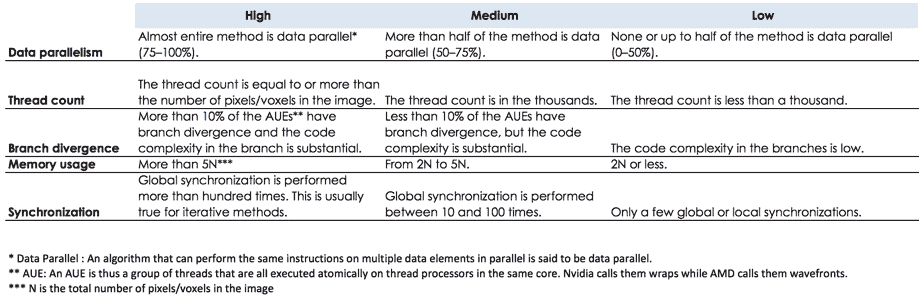

影响 GPU 计算的因素(来源:Dutta Roy 等人 https://medium . com/@ taposhdr/GPU-s-have-be-the-new-core-for-image-analytics-b 8 ba 8 BD 8d 8 f 3)


# 深度学习硬件指南

在为深度学习应用程序开发设置自己的硬件时，还有一些其他重要的事情需要注意。在本节中，我们将概述 GPU 计算的一些最重要的方面。


# CPU 内核

大多数深度学习应用和库都使用单核 CPU，除非它们用在并行化框架中，如**消息传递接口** ( **MPI** )、MapReduce 或 Spark。例如，雅虎团队的**咖啡馆**([https://github.com/yahoo/CaffeOnSpark](https://github.com/yahoo/CaffeOnSpark))使用 Spark 和 Caffe 在多个 GPU 和 CPU 之间并行化网络训练。在单个盒子中的大多数正常设置中，一个 CPU 核心足以用于深度学习应用开发。


# CPU 缓存大小

CPU 缓存大小是用于高速计算的重要 CPU 组件。CPU 缓存通常以缓存层的层次结构组织，从 L1 到 L4——L1 和 L2 是较小和较快的缓存层，而不是较大和较慢的 L3 和 L4 层。在理想设置中，应用程序所需的每个数据都驻留在缓存中，因此不需要从 RAM 中读取，从而使整体操作更快。

然而，这几乎不是大多数深度学习应用的场景。例如，对于一个批量为 128 的典型 ImageNet 实验，我们需要超过 85MB 的 CPU 缓存来存储一个小批量的所有信息[13]。因为这样的数据集不够小，不能只缓存，所以无法避免 RAM 读取。因此，现代 CPU 缓存大小对深度学习应用程序的性能几乎没有影响。


# RAM 大小

正如我们在本节前面看到的，大多数深度学习应用程序直接从 RAM 读取，而不是从 CPU 缓存读取。因此，保持 CPU RAM 几乎与 GPU RAM 一样大(如果不是更大的话)通常是明智的。

GPU RAM 的大小取决于你的深度学习模型的大小。例如，基于 ImageNet 的深度学习模型有大量的参数，占用 4 GB 到 5 GB 的空间，因此至少具有 6 GB RAM 的 GPU 将是这种应用的理想选择。配有至少 8 GB 或更多 CPU RAM 的 CPU 将允许应用程序开发人员专注于应用程序的关键方面，而不是调试 RAM 性能问题。


# 硬盘驱动器

典型的深度学习应用需要数百 GB 的大数据集。由于这些数据不能设置在任何 RAM 中，因此需要构建一个持续的数据管道。深度学习应用程序从 GPU RAM 加载小批量数据，GPU RAM 反过来继续从 CPU RAM 读取数据，CPU RAM 直接从硬盘加载数据。由于 GPU 拥有大量内核，并且每个内核都有少量数据，因此它们需要不断从磁盘中读取大量数据，以实现高数据并行性。

例如，在基于 AlexNet 的**卷积神经网络** ( **CNN** )的模型中，每秒需要读取大约 300 MB 的数据。这通常会降低应用程序的整体性能。因此，**固态驱动器** ( **SSD** )往往是大多数深度学习应用开发者的正确选择。


# 冷却系统

现代的 GPU 是节能的，并且有内置的机制来防止它们过热。例如，当 GPU 提高速度和功耗时，它们的温度也会升高。通常在 80°C 左右，它们内置的温度控制就会启动，这会降低它们的速度，从而自动冷却 GPU。这一过程中的真正瓶颈是风扇速度的预编程时间表的不良设计。

在典型的深度学习应用中，在应用的最初几秒钟内达到 80°C 的温度，从而从一开始就降低了 GPU 性能，并提供了较差的 GPU 吞吐量。让事情变得复杂的是，大多数现有的风扇调度选项在当前大多数深度学习应用工作的 Linux 中不可用。

目前有许多选择可以缓解这个问题。首先，**基本输入/输出系统** ( **BIOS** )升级并修改风扇计划可以在过热和性能之间提供最佳平衡。用于外部冷却系统的另一种选择，例如水冷系统。但是，此选项主要适用于运行多个 GPU 服务器的 GPU 场。外部冷却系统也有点贵，因此成本也成为为您的应用选择合适的冷却系统的一个重要因素。


# 深度学习软件框架

每个好的深度学习应用程序都需要有几个组件才能正确运行。其中包括:

*   模型层，允许开发者更灵活地设计他或她自己的模型
*   一个 GPU 层，使应用程序开发人员可以无缝地在 GPU/CPU 之间为其应用程序进行选择
*   一个并行化层，允许开发人员扩展他或她的应用程序，以便在多个设备或实例上运行

可以想象，实现这些模块并不容易。通常，开发人员需要花更多的时间来调试实现问题，而不是合法的模型问题。令人欣慰的是，当今行业中存在许多软件框架，这使得深度学习应用程序开发几乎成为其编程语言的第一类。

这些框架在架构、设计和特性上各不相同，但几乎所有的框架都为开发者提供了巨大的价值，为他们的应用程序提供了简单快速的实现框架。在这一部分，我们将了解一些流行的深度学习软件框架，以及它们之间的比较。


# tensor flow——深度学习库

**TensorFlow** 是一个使用数据流图进行数值计算的开源软件库。TensorFlow 由 Google 设计和开发，将完整的数据计算表示为流图。该图中的每个节点都可以表示为一个数学运算符。连接两个节点的边表示在两个节点之间流动的多维数据。

TensorFlow 的主要优势之一是它支持 CPU 和 GPU 以及移动设备，从而使开发人员几乎可以无缝地针对任何设备架构编写代码。TensorFlow 还有一个非常大的开发人员社区，为这个框架提供了巨大的推动力。


# 咖啡

Caffe 是在**伯克利人工智能研究** ( **BAIR** )实验室设计开发的。它的设计考虑了表达、速度和模块化。它有一个富有表现力的架构，因为它允许一种非常可配置的方式来定义模型和优化参数，而不需要任何额外的代码。这种配置还允许从 CPU 模式轻松切换到 GPU 模式，反之亦然，只需更改一个标志。

在速度方面，Caffe 也拥有良好的性能基准数据。例如，在一个 NVIDIA K40 GPU 上，Caffe 每天可以处理超过 6000 万张图像。Caffe 还有一个强大的社区，从学术研究人员到工业研究实验室都在使用 Caffe，跨越不同的应用程序堆栈。


# MXNet

**MXNet** 是一个多语言的机器学习库。它提供了两种计算模式:

*   命令模式:这种模式公开了一个接口，很像常规的 NumPy，比如 API。例如，要使用 MXNet 在 CPU 和 GPU 上构造零张量，可以使用以下代码块:

```py
import mxnet as mx
tensor_cpu = mx.nd.zeros((100,), ctx=mx.cpu())
tensor_gpu = mx.nd.zeros((100,), ctx=mx.gpu(0))

```

在前面的例子中，MXNet 指定了在 CPU 或 GPU 设备的位置`0`保存张量的位置。MXNet 的一个重要区别是所有的计算都是延迟发生的，而不是瞬间发生的。这使得 MXNet 实现了令人难以置信的设备利用率，不同于其他任何框架。

*   **符号模式**:该模式公开了一个类似 TensorFlow 的计算图。尽管命令式 API 非常有用，但它的一个缺点是过于死板。所有计算都需要事先知道，以及预定义的数据结构。符号 API 旨在通过允许 MXNet 使用符号或变量而不是固定数据类型来消除这种限制。然后，这些符号可以被编译或解释为一组操作来执行，如下所示:

```py
import mxnet as mx
x = mx.sym.Variable("X") # represent a symbol.
y = mx.sym.Variable("Y")
z = (x + y)
m = z / 100
```


# 火炬

**Torch** 是一个基于 Lua 的深度学习框架，由 Ronan Collobert、Clement Farabet 和 Koray Kavukcuoglu 开发。它最初由纽约大学的 CILVR 实验室使用。Torch 由 C/C++库提供支持，并使用**计算统一设备架构** ( **CUDA** )进行 GPU 交互。它旨在成为最快的深度学习框架，同时还为快速应用开发提供简单的类似 C 的接口。


# Theano

**Theano** 是一个 Python 库，它允许您高效地定义、优化和评估涉及多维数组的数学表达式。Theano 的一些关键特性是它与 NumPy 的紧密集成，这使得它几乎成为大量 Python 开发人员的母语。它还提供了一个非常直观的界面来使用 GPU 或 CPU。它有一个*有效的符号微分*，允许它为具有一个或多个输入的函数提供导数。它在数值上也是稳定的，并且具有动态代码生成能力，从而导致更快的表达式求值。如果你有先进的机器学习专业知识，并且正在寻找一个低级别的 API 来细粒度控制你的深度学习应用程序，那么 Theano 是一个很好的框架选择。


# 微软认知工具包

**微软认知工具包**又称**CNTK**；这是不断增加的深度学习框架集的最新条目。CNTK 支持两个主要功能:

*   支持多种功能，例如:
    *   用于训练和预测的 CPU/GPU
    *   Windows 和 Linux 操作系统
    *   通过批处理技术进行有效的循环网络训练
    *   使用一位量化的**奇异值分解** ( **SVD** )的数据并行化
*   高效的模块化设计可分离:
    *   计算机网络
    *   执行引擎
    *   学习算法
    *   模型配置


# 克拉斯

Keras 是一个深度学习框架，可能是与之前描述的所有其他框架最不同的。大多数描述的框架都是使用 CUDA 直接与 GPU 交互的低级模块。

另一方面，Keras 可以被理解为一个元框架，它与其他框架(如 Theano 或 TensorFlow)进行交互，以处理其 GPU 交互或其他系统级访问管理。因此，它非常灵活，非常用户友好，允许开发人员从各种底层模型实现中进行选择。Keras 社区支持也获得了良好的势头，截至 2017 年 9 月，TensorFlow 团队计划将 Keras 作为 TensorFlow 项目的子集进行集成。


# 框架比较

尽管存在许多深度学习软件框架，但很难理解它们的功能对等性。表格*描述了 DL 框架的特性奇偶校验*概述了这些框架的特性奇偶校验:

|  | **语言** | **社区支持** | **建模灵活性** | **简单配置** | **速度** | **GPU 并行化** | **教程** |
| TensorFlow | 计算机编程语言 | 优秀的 | 优秀的 | 优秀的 | 强烈的 | 强烈的 | 优秀的 |
| 咖啡 | C++ | 优秀的 | 强烈的 | 强烈的 | 强烈的 | 好的 | 强烈的 |
| MXNet | r，Python，Julia，Scala | 优秀的 | 强烈的 | 强烈的 | 强烈的 | 优秀的 | 优秀的 |
| 火炬 | Lua，Python | 强烈的 | 优秀的 | 优秀的 | 优秀的 | 强烈的 | 强烈的 |
| Theano | Python，C++ | 强烈的 | 强烈的 | 好的 | 强烈的 | 好的 | 优秀的 |
| CNTK | C++ | 优秀的 | 强烈的 | 好的 | 强烈的 | 好的 | 强烈的 |
| 克拉斯 | 计算机编程语言 | 优秀的 | 优秀的 | 优秀的 | 强烈的 | 强烈的 | 强烈的 |

DL 框架的功能对等

最近，石少怀和他们的合著者在他们的论文([的](https://arxiv.org/pdf/1608.07249.pdf))中也提出了一个全面的性能基准测试，测试了四个流行的框架:Caffe、CNTK、TensorFlow 和 Torch。他们首先在三种最流行的神经网络类型上对这些框架的性能进行基准测试，这三种神经网络是:**全连接神经网络** ( **FCN** )、CNN 和循环神经网络(RNN)。他们还在使用多个 GPU 和 CPU 时对这些系统的性能进行了基准测试。

在他们的论文中，他们概述了所有系统的比较性能。他们的实验结果表明，所有框架都可以非常有效地利用 GPU，并显示出优于 CPU 的性能增益。然而，在所有这些框架中仍然没有明显的赢家，这表明所有这些框架仍然需要改进。


# 在 AWS 上设置深度学习

在本节中，我们将展示使用**亚马逊网络服务** ( **AWS** )建立深度学习系统的两种不同方式。


# 从头开始设置

在本节中，我们将说明如何在运行 Ubuntu Server 16.04 LTS 的 AWS EC2 GPU 实例 g2.2xlarge 上设置深度学习环境。对于这个例子，我们将使用一个预烤的**亚马逊机器映像** ( **AMI** )，它已经安装了许多软件包——这使得建立一个端到端的深度学习系统更加容易。我们将使用一个公开可用的 AMI 映像 ami-b03ffedf，它有以下预安装的包:

*   CUDA 8.0
*   使用 Python 3.0 的 Anaconda 4.20
*   喀拉斯/泰阿诺

1.  设置系统的第一步是设置一个 AWS 帐户，并使用 AWS web 控制台旋转一个新的 EC2 GPU 实例，如图[http://console.aws.amazon.com/](https://signin.aws.amazon.com/signin?redirect_uri=https%3A%2F%2Fconsole.aws.amazon.com%2Fconsole%2Fhome%3Fstate%3DhashArgs%2523%26isauthcode%3Dtrue&client_id=arn%3Aaws%3Aiam%3A%3A015428540659%3Auser%2Fhomepage&forceMobileApp=0)所示*选择 EC2 AMI* :

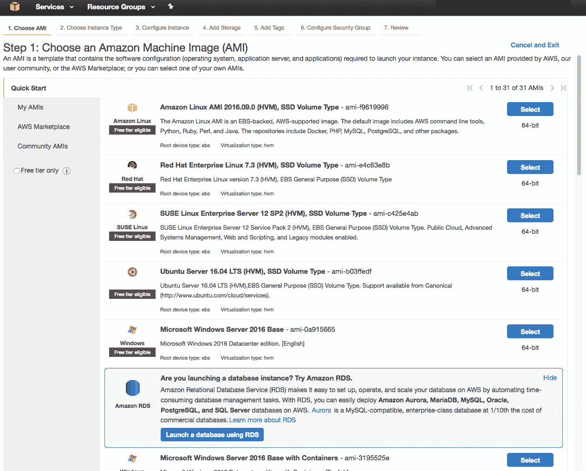

选择 EC2 AMI

2.  我们从下一页选择一个 g2.2xlarge 实例类型，如图*选择实例类型*:

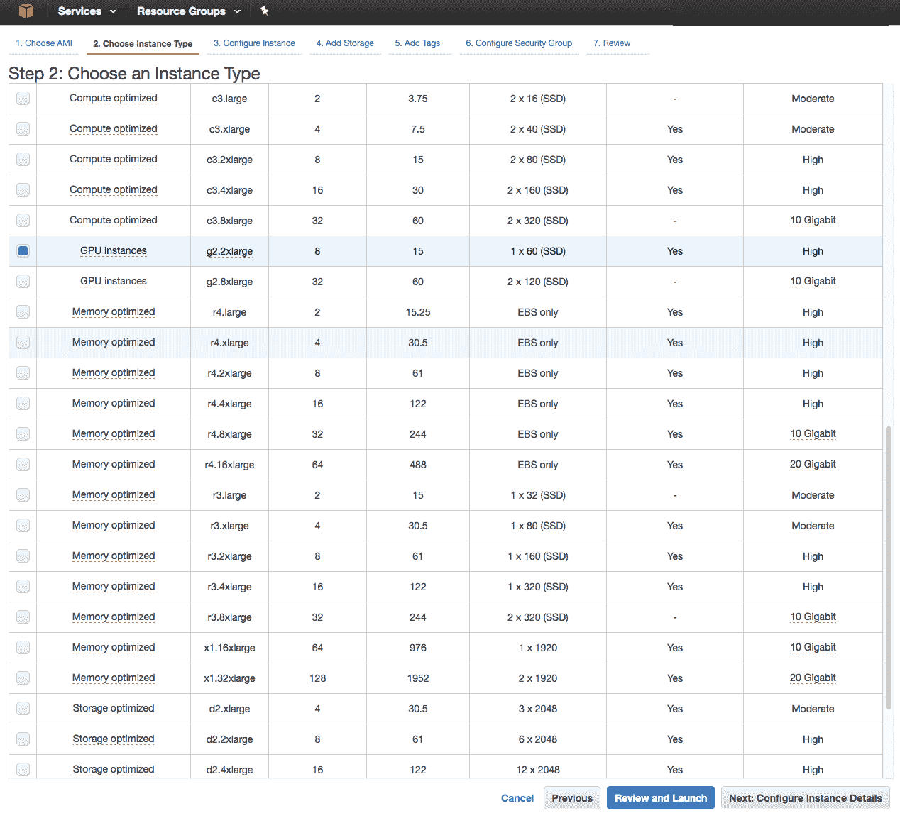

选择实例类型

3.  在添加了如图所示的`30` GB 存储后*选择存储*，我们现在启动一个群集并分配一个 EC2 密钥对，该密钥对允许我们`ssh`使用提供的密钥对文件登录到机器:

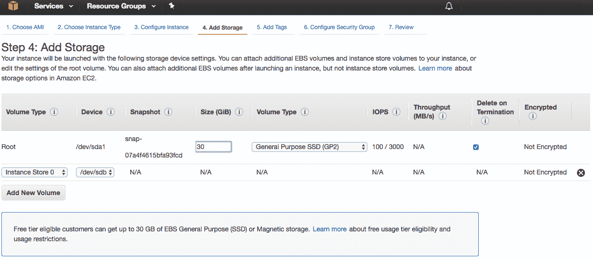

选择存储

4.  一旦 EC2 盒子启动，下一步就是安装相关的软件包。为了确保正确利用 GPU，确保首先安装图形驱动程序非常重要。我们将升级并安装 NVIDIA 驱动程序，如下所示:

```py
$ sudo add-apt-repository ppa:graphics-drivers/ppa -y
$ sudo apt-get update
$ sudo apt-get install -y nvidia-375 nvidia-settings
```

虽然 NVIDIA 驱动程序确保主机 GPU 现在可以被任何深度学习应用程序利用，但它并没有为应用程序开发人员提供一个简单的接口，以便在设备上轻松编程。

现在有各种不同的软件库帮助可靠地完成这项任务。**开放计算语言** ( **OpenCL** )和 CUDA 是工业上比较常用的。在本书中，我们使用 CUDA 作为访问 NVIDIA 图形驱动程序的应用程序编程接口。要安装 CUDA 驱动程序，我们首先 SSH 到 EC2 实例，并将 CUDA 8.0 下载到我们的`$HOME`文件夹，然后从那里安装:

```py
$ wget https://developer.nvidia.com/compute/cuda/8.0/Prod2/local_installers/cuda-repo-ubuntu1604-8-0-local-ga2_8.0.61-1_amd64-deb
$ sudo dpkg -i cuda-repo-ubuntu1604-8-0-local_8.0.44-1_amd64-deb
$ sudo apt-get update
$ sudo apt-get install -y cuda nvidia-cuda-toolkit
```

安装完成后，您可以运行以下命令来验证安装:

```py
$ nvidia-smi
```

现在，您的 EC2 盒子已经完全配置好，可以用于深度学习开发。然而，对于不太熟悉深度学习实现细节的人来说，从头构建深度学习系统可能是一项艰巨的任务。

为了简化这种开发，存在许多先进的深度学习软件框架，如 Keras 和 Theano。这两个框架都基于 Python 开发环境，因此我们首先在机器上安装一个 Python 发行版，比如 Anaconda:

```py
$ wget https://repo.continuum.io/archive/Anaconda3-4.2.0-Linux-x86_64.sh
$ bash Anaconda3-4.2.0-Linux-x86_64.sh
```

最后，使用 Python 的包管理器`pip`安装 Keras 和 Theanos:

```py
$ pip install --upgrade --no-deps git+git://github.com/Theano/Theano.git
$ pip install keras
```

一旦成功完成了`pip`的安装，这个盒子现在就完全可以进行深度学习开发了。


# 使用 Docker 设置

前一节描述了从零开始，这有时会很棘手，因为软件包和网络链接会不断变化。避免依赖链接的一个方法是使用 Docker 这样的容器技术。

在本章中，我们将使用 NVIDIA-Docker 官方映像，该映像预打包了所有必要的包和深度学习框架，以帮助您快速开始深度学习应用开发:

```py
$ sudo add-apt-repository ppa:graphics-drivers/ppa -y
$ sudo apt-get update
$ sudo apt-get install -y nvidia-375 nvidia-settings nvidia-modprobe
```

1.  我们现在安装 Docker 社区版如下:

```py
$ curl -fsSL https://download.docker.com/linux/ubuntu/gpg | sudo apt-key add -
# Verify that the key fingerprint is 9DC8 5822 9FC7 DD38 854A E2D8 8D81 803C 0EBF CD88
$ sudo apt-key fingerprint 0EBFCD88
$ sudo add-apt-repository \
 "deb [arch=amd64] https://download.docker.com/linux/ubuntu \
 $(lsb_release -cs) \
 stable"
$ sudo apt-get update
$ sudo apt-get install -y docker-ce
```

2.  然后我们安装 NVIDIA-Docker 及其插件:

```py
$ wget -P /tmp https://github.com/NVIDIA/nvidia-docker/releases/download/v1.0.1/nvidia-docker_1.0.1-1_amd64.deb
$ sudo dpkg -i /tmp/nvidia-docker_1.0.1-1_amd64.deb && rm /tmp/nvidia-docker_1.0.1-1_amd64.deb
```

3.  为了验证安装是否正确，我们使用以下命令:

```py
$ sudo nvidia-docker run --rm nvidia/cuda nvidia-smi
```

4.  一旦设置正确，我们就可以使用官方 TensorFlow 或 Theano Docker 图像:

```py
$ sudo nvidia-docker run -it tensorflow/tensorflow:latest-gpu bash
```

5.  我们可以运行一个简单的 Python 程序来检查 TensorFlow 是否正常工作:

```py
import tensorflow as tf
a = tf.constant(5, tf.float32)
b = tf.constant(5, tf.float32)
with tf.Session() as sess:
 sess.run(tf.add(a, b)) # output is 10.0
   print("Output of graph computation is = ",output) 
```

您现在应该在屏幕上看到 TensorFlow 输出，如图*所示 Tensorflow 示例输出:*

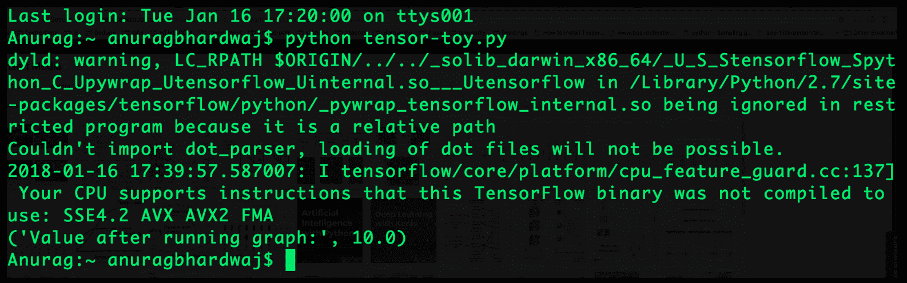

TensorFlow 样本输出


# 摘要

在这一章中，我们总结了开始实现深度学习系统所需的关键概念。我们描述了线性代数的核心概念，这些概念对于理解深度学习技术的基础至关重要。我们提供了深度学习的硬件指南，涵盖了基于 GPU 的实现的各个方面，以及对应用程序开发人员来说什么是正确的硬件选择。我们概述了当今最流行的深度学习软件框架的列表，并为它们提供了功能级别的对等性以及性能基准。最后，我们演示了如何在 AWS 上设置基于云的深度学习应用。

在下一章中，我们将介绍神经网络，并概述一个自启动模块，以便更详细地理解它们。