# 三、神经网络入门

在这一章中，我们将集中在神经网络的基础上，包括输入/输出层，隐藏层，以及网络如何通过正向和反向传播来学习。我们将从标准的多层感知器网络开始，讨论它们的构建模块，并说明它们如何一步一步地学习。我们还将介绍几个流行的标准模型，如**卷积神经网络** ( **CNN** )、**受限玻尔兹曼机** ( **RBM** )、**循环神经网络** ( **RNN** )及其变种**长短期记忆** ( **LSTM** )。我们将概述模型成功应用的关键要素，并解释一些重要概念，以帮助您更好地理解为什么这些网络在某些领域如此有效。除了理论上的介绍，我们还将展示使用 TensorFlow 的示例代码片段，说明如何构建层和激活函数，以及如何连接不同的层。最后，我们将使用 TensorFlow 演示一个端到端的 MNIST 分类示例。有了你从第 2 章[学到的设置，*让自己为深度学习做好准备*是时候我们跳到一些真实的例子中来动手了。](7ea715d3-38a1-45ce-83af-0583b92b2efc.xhtml)

本章的大纲如下:

*   多层感知器；
    *   输入层
    *   输出层
    *   隐藏层
    *   激活功能
*   网络如何学习
*   深度学习模型:
    *   卷积神经网络
    *   受限玻尔兹曼机器
    *   RNN/LSTM
*   MNIST 动手分类示例


# 多层感知器

多层感知器是最简单的网络之一。本质上，它被定义为具有一个输入层、一个输出层和几个隐藏层(不止一个)。每层有多个神经元，相邻层完全连接。每个神经元都可以被认为是这些巨大网络中的一个细胞。它决定了输入信号的流动和转换。来自先前层的信号通过连接的权重被向前推至下一层的神经元。对于每个人工神经元，它通过将信号乘以权重并加上偏差来计算所有输入的加权和。然后，加权和将通过一个被称为**激活函数**的函数，以决定它是否应该被触发，从而产生下一级的输出信号。

例如，下图描绘了一个完全连接的前馈神经网络。你可能注意到了，每一层上都有一个截取节点(*x[0]和 *a [0]* )。网络的非线性主要由激活函数的形状决定。*

这种完全连接的前馈神经网络的架构本质上如下所示:

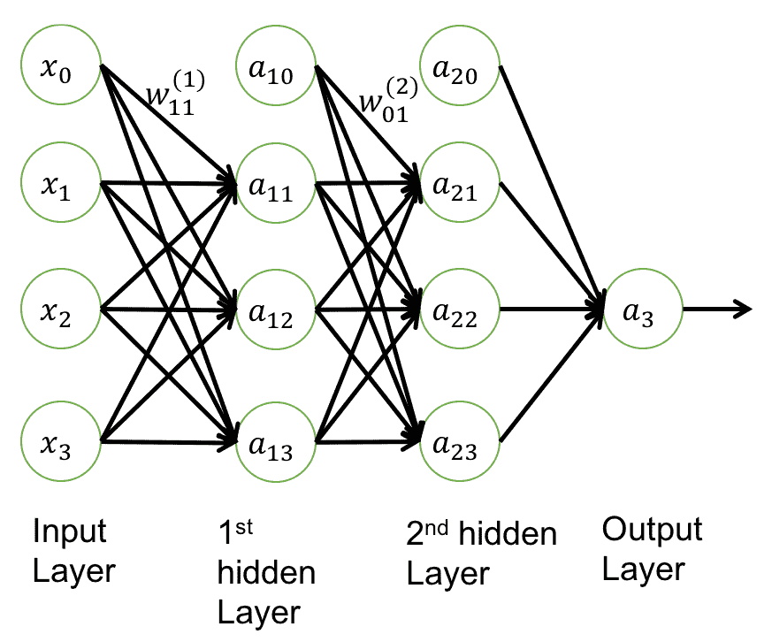

具有两个隐藏层的全连接前馈神经网络


# 输入层

输入图层通常被定义为原始输入数据。对于文本数据，这可以是单词或字符。对于图像，这可以是来自不同颜色通道的原始像素值。此外，随着输入数据维度的变化，它会形成不同的结构，如一维向量或类似张量的结构。


# 输出层

输出层基本上是网络的输出值，根据问题设置而形成。在无监督学习中，如编码或解码，输出可以与输入相同。对于分类问题，输出层可以有 *n* 个神经元用于 *n* 路分类，并利用 softmax 函数输出每个类别的概率。总的来说，输出层映射到你的目标空间，其中的感知器会根据你的问题设置相应地改变。


# 隐藏层

隐藏层是输入层和输出层之间的层。隐藏层上的神经元可以采取各种形式，如最大池层、卷积层等，都执行不同的数学功能。如果您将整个网络视为数学变换的管道，则隐藏的图层将分别进行变换，然后组合在一起，以将输入数据映射到输出空间。在本章后面的章节中，当我们讨论卷积神经网络和 RNN 时，我们将介绍隐藏层的更多变化。


# 激活功能

每个人工神经元中的激活函数决定输入信号是否已经达到阈值，是否应该输出下一级的信号。因为梯度消失的问题，设置正确的激活函数是至关重要的，我们将在后面讨论。

激活函数的另一个重要特征是它应该是可微的。网络从输出层计算的误差中学习。需要可微分的激活函数来执行反向传播优化，同时在网络中反向传播，以计算相对于权重的误差(损失)的梯度，然后相应地优化权重，使用梯度下降或任何其他优化技术来减少误差。

下表列出了一些常见的激活功能。我们将深入探讨它们，讨论它们之间的差异，并解释如何选择正确的激活功能:

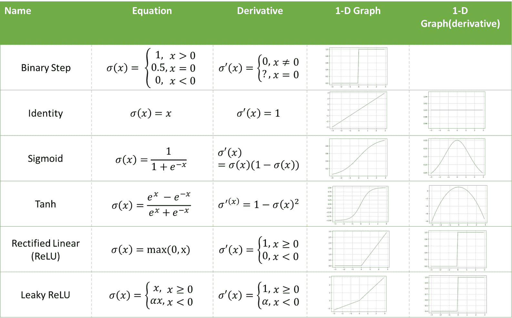

# 乙状结肠或逻辑函数

sigmoid 函数具有独特的 *S* 形状，并且对于任何实输入值，它都是可微的实函数。其范围在 0 和 1 之间。它是以下形式的激活函数:

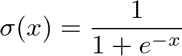

在训练步骤的反向传播期间使用的它的一阶导数具有以下形式:

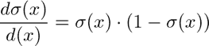

实现如下:

```py
def sigmoid(x):
    return tf.div(tf.constant(1.0),
                  tf.add(tf.constant(1.0), tf.exp(tf.neg(x))))
```

`sigmoid`函数的导数如下:

```py
def sigmoidprime(x):
    return tf.multiply(sigmoid(x), tf.subtract(tf.constant(1.0), sigmoid(x)))
```

然而，`sigmoid`函数会导致渐变消失问题或渐变饱和。众所周知，它的收敛速度很慢。所以在实际使用中，不建议使用一个`sigmoid`作为激活功能，ReLU 已经比较流行了。


# 双曲正切函数

tanh 的数学公式如下:

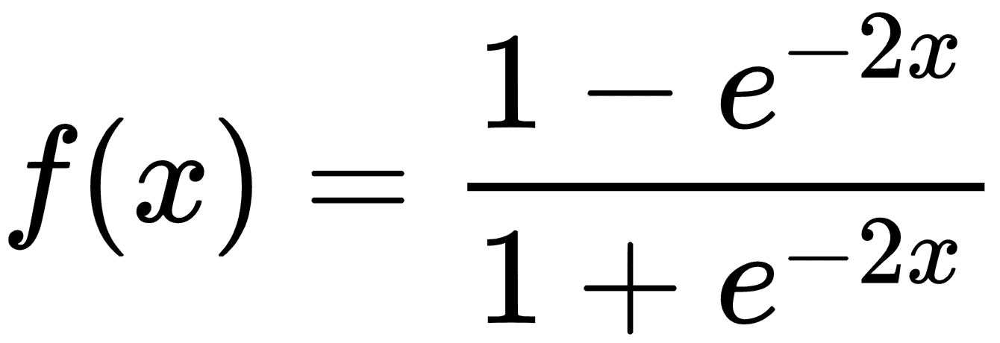

其输出以零为中心，范围为-1 到 1。因此，优化更容易，因此在实践中，它优于 sigmoid 激活函数。然而，它仍然受到消失梯度问题的困扰。


# 热卢

**整流线性单元(ReLU)** 近年来变得相当流行。它的数学公式如下:

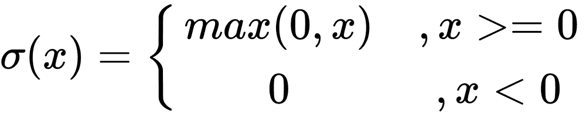

与 sigmoid 和 tanh 相比，它的计算更简单、更有效。事实证明，它将收敛提高了 6 倍(例如，Krizhevsky 及其合著者在 2012 年 *ImageNet 分类与深度卷积神经网络*的工作中提高了 6 倍)，这可能是因为它具有线性和非饱和形式。此外，与涉及昂贵的指数运算的 tanh 或 sigmoid 函数不同，ReLU 可以通过简单地将激活阈值设为零来实现。因此，在过去的几年里，它变得非常流行。现在几乎所有的深度学习模型都使用 ReLU。ReLU 的另一个重要优点是它避免或纠正了消失梯度问题。

它的局限性在于它的直接输出不在概率空间中。它不能用于输出图层，只能用于隐藏图层。因此，对于分类问题，需要在最后一层使用 softmax 函数来计算类的概率。对于回归问题，应该简单地使用线性函数。ReLU 的另一个问题是，它会导致死神经元问题。例如，如果大的梯度流过 ReLU，它可能导致权重被更新，使得神经元将永远不会在任何其他未来数据点上活动。

为了解决这个问题，引入了另一个名为 **Leaky ReLU** 的修改。为了解决神经元死亡的问题，它引入了一个小斜率来保持更新的活力。


# 泄漏 ReLU 和最大输出

泄漏的 ReLU 在负侧将具有小的斜率α，例如 0.01。斜率α也可以做成每个神经元的参数，比如在 PReLU 神经元中(P 代表参数)。这种激活函数的问题是这种修改对各种问题的有效性不一致。

Maxout 是解决 ReLU 中死神经元问题的又一次尝试。它以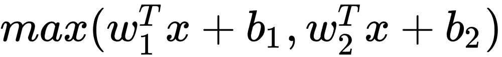的形式出现。从这个形态我们可以看出，ReLU 和漏 ReLU 都只是这个形态的特例，也就是对于 ReLU 来说，是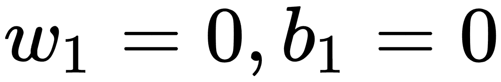。虽然它受益于线性和没有饱和，但它使每个单个神经元的参数数量增加了一倍。


# Softmax

当使用 ReLU 作为分类问题的激活函数时，在最后一层使用 softmax 函数。它有助于为每个类别生成概率，例如类似于(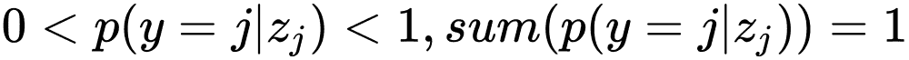)的分数:

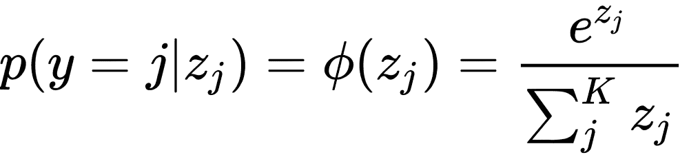


# 选择正确的激活功能

大多数情况下，我们总是应该首先考虑 ReLU。但是请记住，ReLU 应该只应用于隐藏层。如果你的模型患有死神经元，那么考虑调整你的学习速率，或者尝试 Leaky ReLU 或 maxout。

不建议使用 sigmoid 或 tanh，因为它们会遇到渐变消失的问题，而且收敛非常慢。以乙状结肠为例。它的导数处处大于 0.25，使得反向传播期间的项更小。而对于 ReLU，它的导数在零以上的每一点都是 1，因此创建了一个更稳定的网络。

现在，您已经对神经网络中的关键组件有了基本的了解，让我们继续了解网络如何从数据中学习。


# 网络如何学习

假设我们有一个两层网络。我们用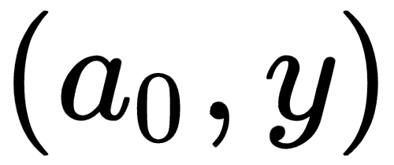来表示输入/输出，用状态来表示两层，也就是用偏置值来表示连接权重: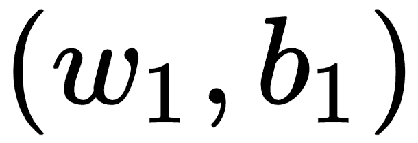和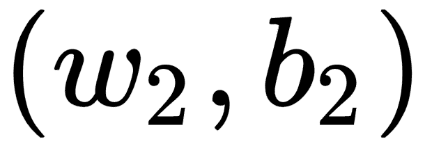。我们还将使用σ作为激活函数。


# 重量初始化

网络配置完成后，训练从初始化权重值开始。正确的权重初始化很重要，因为所有的训练都是调整系数，以便从数据中最好地捕获模式，从而成功地输出目标值的近似值。在大多数情况下，权重是随机初始化的。在一些微调设置中，使用预训练的模型初始化权重。


# 正向传播

前向传播基本上是计算输入数据乘以网络的权重加上偏移，然后通过激活函数到达下一层:

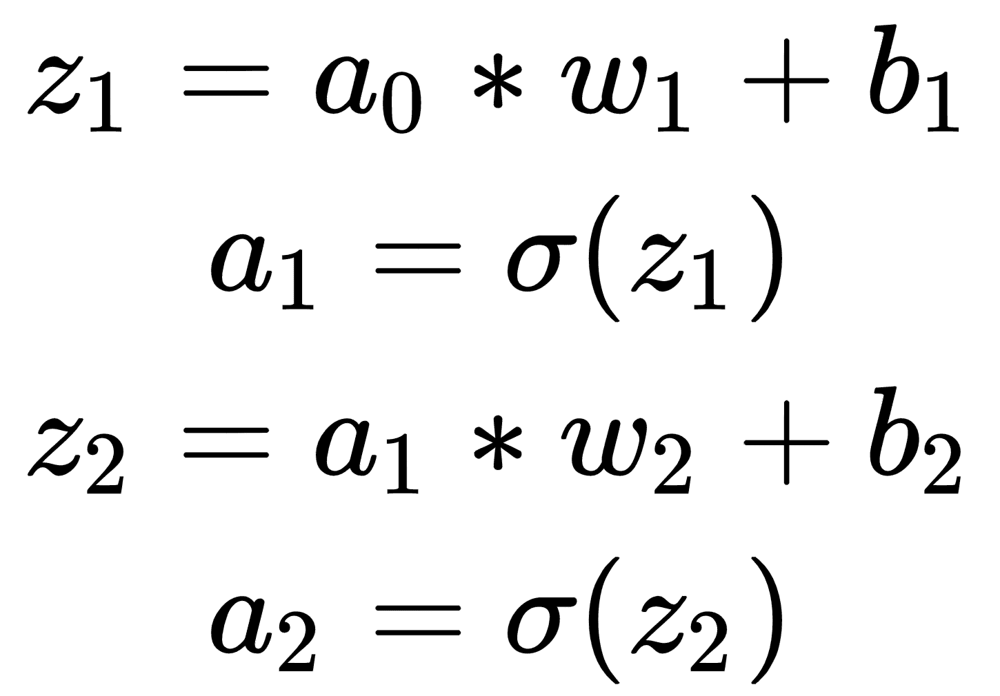

使用 TensorFlow 的示例代码块可以编写如下:

```py
# dimension variables
dim_in = 2 
dim_middle = 5
dim_out = 1

# declare network variables
a_0 = tf.placeholder(tf.float32, [None, dim_in])
y = tf.placeholder(tf.float32, [None, dim_out])

w_1 = tf.Variable(tf.random_normal([dim_in, dim_middle]))
b_1 = tf.Variable(tf.random_normal([dim_middle]))
w_2 = tf.Variable(tf.random_normal([dim_middle, dim_out]))
b_2 = tf.Variable(tf.random_normal([dim_out]))

# build the network structure
z_1 = tf.add(tf.matmul(a_0, w_1), b_1)
a_1 = sigmoid(z_1)
z_2 = tf.add(tf.matmul(a_1, w_2), b_2)
a_2 = sigmoid(z_2)
```


# 反向传播

所有网络从误差中学习，然后基于给定的成本函数更新网络权重/参数以反映误差。梯度是表示网络权重与其误差之间关系的斜率。


# 计算误差

反向传播的第一件事是计算目标值的正向传播误差。输入提供了 *y* 作为对网络输出准确性的测试，因此我们计算以下向量:

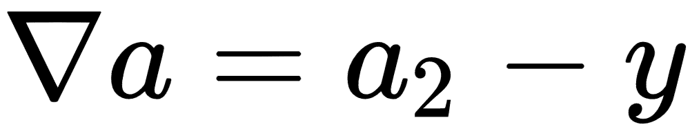

这是用如下代码编写的:

```py
# define error, which is the difference between the activation function output from the last layer and the label
error = tf.sub(a_2, y)
```


# 反向传播

对于误差，反向传播反向工作以更新误差梯度方向上的网络权重。首先，我们需要计算权重和偏差的增量。注意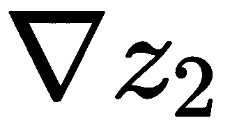用于更新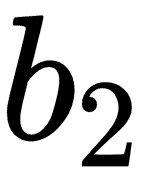和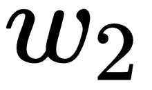,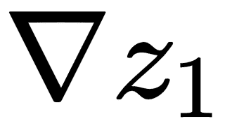用于更新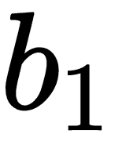和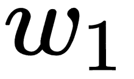:

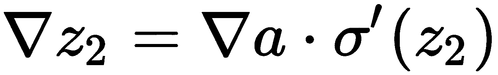

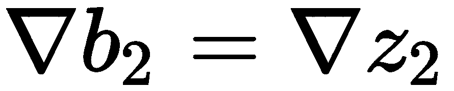

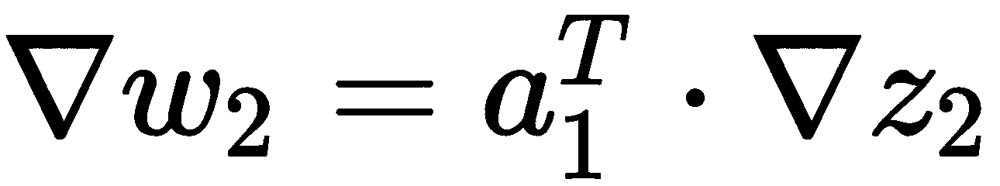

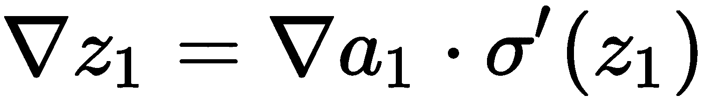


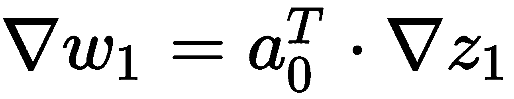

这用 TensorFlow 代码写成，如下所示:

```py
d_z_2 = tf.multiply(error, sigmoidprime(z_2))
d_b_2 = d_z_2
d_w_2 = tf.matmul(tf.transpose(a_1), d_z_2)

d_a_1 = tf.matmul(d_z_2, tf.transpose(w_2))
d_z_1 = tf.multiply(d_a_1, sigmoidprime(z_1))
d_b_1 = d_z_1
d_w_1 = tf.matmul(tf.transpose(a_0), d_z_1)
```


# 更新网络

现在已经计算出了增量，是时候更新网络的参数了。在大多数情况下，我们使用一种梯度下降。设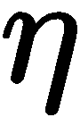代表学习率，参数更新公式为:


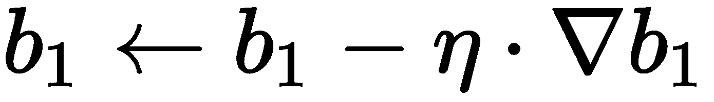

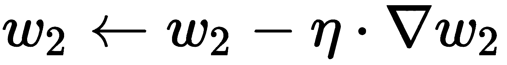

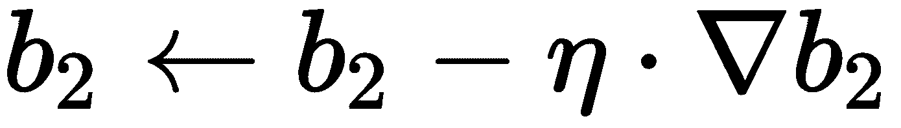

这用 TensorFlow 代码写成，如下所示:

```py
eta = tf.constant(0.01)
step = [
    tf.assign(w_1,
              tf.subtract(w_1, tf.multiply(eta, d_w_1))),
    tf.assign(b_1,
              tf.subtract(b_1, tf.multiply(eta,
                               tf.reduce_mean(d_b_1, axis=[0])))),
    tf.assign(w_2,
              tf.subtract(w_2, tf.multiply(eta, d_w_2))),
    tf.assign(b_2,
              tf.subtract(b_2, tf.multiply(eta,
                               tf.reduce_mean(d_b_2, axis=[0]))))
]
```


# 自动微分

TensorFlow 提供了一个非常方便的 API，可以帮助我们直接导出增量并更新网络参数:

```py
# Define the cost as the square of the errors
cost = tf.square(error)

# The Gradient Descent Optimizer will do the heavy lifting
learning_rate = 0.01
optimizer = tf.train.GradientDescentOptimizer(learning_rate).minimize(cost)

# Define the function we want to approximate
def linear_fun(x):
    y = x[:,0] * 2 + x[:,1] * 4 + 1
    return y.reshape(y.shape[0],1)

# Other variables during learning
train_batch_size = 100
test_batch_size = 50

# Normal TensorFlow - initialize values, create a session and run the model
sess = tf.Session() 
sess.run(tf.initialize_all_variables())

for i in range(1000):
    x_value = np.random.rand(train_batch_size,2)
    y_value = linear_fun(x_value)
    sess.run(optimizer, feed_dict={a_0:x_value, y: y_value})
    if i % 100 == 0:
        test_x = np.random.rand(test_batch_size,2) 
        res_val = sess.run(res, feed_dict =
            {a_0: test_x, y: linear_fun(test_x)})
        print res_val
```

除了这个基本设置之外，现在让我们来谈谈你在实践中可能遇到的几个重要概念。


# 消失和爆炸渐变

这些都是很多深度神经网络中非常重要的问题。架构越深入，就越容易受到这些问题的困扰。正在发生的是，在反向传播阶段，权重与梯度值成比例地调整。所以我们可能有两种不同的情况:

*   如果梯度太小，那么这被称为*消失梯度*问题。这使得学习过程非常缓慢，甚至完全停止更新。例如，使用 sigmoid 作为激活函数，其中它的导数总是小于 0.25，在几层反向传播之后，较低的层将很难从误差中接收到任何有用的信号，因此网络没有被适当地更新。
*   如果梯度变得太大，那么它会导致学习发散，这被称为*爆炸梯度*。当激活函数不有界或者学习率过大时，经常会出现这种情况。


# 优化算法

优化是网络学习的关键。学习基本上是一个优化的过程。它指的是最小化误差、成本或找到最小误差点的过程。然后逐步调整网络系数。一个非常基本的优化方法是我们在上一节*梯度下降*中使用的方法。然而，有多种变体做着类似的工作，但增加了一点改进。TensorFlow 提供了多个选项供您选择作为优化器，例如， *GradientDescentOptimizer、AdagradOptimizer、MomentumOptimizer、AdamOptimizer、FtrlOptimizer* 和 *RMSPropOptimizer* 。有关 API 及其使用方法，请参见本页:

[https://www . tensor flow . org/versions/master/API _ docs/python/TF/train # optimizer](https://www.tensorflow.org/versions/master/api_docs/python/tf/train#optimizers)。

这些优化器对于大多数深度学习技术来说应该是足够的。如果你不确定使用哪一个，使用*梯度下降优化器*作为起点。


# 正规化

像所有其他机器学习方法一样，过度拟合是需要一直控制的事情，尤其是考虑到网络有如此多的参数要学习。处理过拟合的方法之一叫做**正则化**。典型的正则化是通过对参数添加一些约束来完成的，例如 L1 或 L2 正则化，其防止网络的权重或系数变得太大。以 L2 正则化为例。这是通过用神经网络中所有权重的平方来增加成本函数来实现的。它所做的是严重惩罚峰值权重向量并扩散权重向量。

也就是说，我们通过更均匀地分散权重向量来鼓励网络使用其所有输入，而不是仅使用其一部分。过大的权重意味着网络过于依赖一些权重较大的输入，这可能会导致难以推广到新数据。在梯度下降阶段，L2 正则化实质上导致每个权重衰减到零，这被称为**权重衰减**。

另一种常见的正则化类型是 L1 正则化，这通常会导致权重向量变得过于稀疏。通过将许多其他特征变为零，有助于了解哪些特征对预测更有用。这可能有助于网络更好地抵抗输入中的噪声，但是根据经验，L2 正则化表现得更好。

Max-norm 是对每个神经元的传入权重向量的大小施加绝对上限的另一种方式。也就是说，在梯度下降步骤中，我们用半径 *c* if 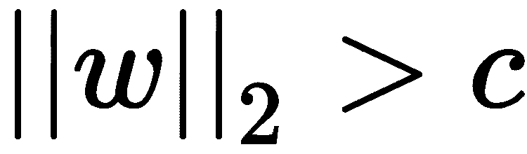将向量归一化。这被称为**投影** **梯度下降**。这有时会稳定网络的学习，因为即使学习速率太高，系数也不会变得太大(总是有界的)。

Dropout 是一种非常不同的防止过度拟合的方法，通常与我们之前提到的技术一起使用。在训练过程中，只保持一定比例的神经元活动，而将其他神经元设置为零，就可以实现辍学。预设超参数用于生成随机采样，其中神经元应设置为零(被删除)。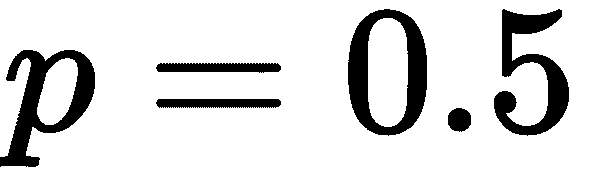在实践中经常使用。直观上，丢失使得网络的不同部分从不同的信息中学习，因为在每一批中只有网络的一部分在更新。总的来说，它通过提供一种指数地和有效地近似组合许多不同的神经网络结构的方式来防止过拟合。要了解更多细节，可以参考辛顿的辍学论文(*斯里瓦斯塔瓦等人，辍学:防止神经网络过度拟合的简单方法，2013* )。


# 深度学习模型

在本节中，我们将逐一深入研究三种流行的深度学习模型:CNN、**受限玻尔兹曼机器** ( **RBM** )和**循环神经网络** ( **RNN** )。


# 卷积神经网络

卷积神经网络是多层感知器的生物启发变体，并已被证明在图像识别和分类等领域非常有效。ConvNets 已经成功应用于识别人脸、目标和交通标志，以及为机器人和自动驾驶汽车的视觉提供动力。CNN 通过在相邻层的神经元之间实现局部连接模式来利用空间局部相关性。换句话说，层 *m* 中隐藏单元的输入来自层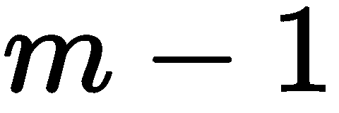中单元的子集，这些单元具有空间上连续的感受野。

LeNet 是 Yann LeCun 在 1988 年提出的最早的卷积神经网络之一。它主要用于字符识别任务，如阅读邮政编码、数字等。2012 年，Alex Krizhevsky 和 Hinton 以惊人的改进赢得了 ImageNet 比赛，使用 CNN 将分类错误从 26%降至 15%，开启了深度学习的复兴时代。

CNN 有几个基本的组成部分:

*   卷积层(CONV)
*   激活层(非线性，例如 ReLU)
*   混合或子采样层(混合)
*   全连接层(FC，使用 softmax)

ConvNet 最常见的形式是在几对 conv-雷鲁层上堆叠，每对层后面都有一个池层。这种模式重复进行，直到整个输入图像被聚集并在空间上转换成小块。然后，在最后一层，它过渡到一个完全连接的层，该层通常利用 softmax 输出概率，尤其是当它是一个多向分类问题时，如下图所示:

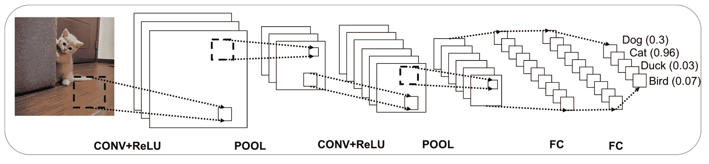

一个典型的卷积神经网络，具有 conv-雷鲁，池层重复，最后是全连接层


# 盘旋

卷积涉及几个概念，如卷积、步长和填充。

对于二维图像，每个颜色通道都会发生卷积。假设您有一个权重矩阵和图像(显示为每个像素的值)，如下图所示。

权重矩阵(通常称为**内核**或**滤波器**)通过将内核放置在要卷积的图像上并在整个图像上移动来应用于图像。如果权重矩阵一次移动 1 个像素，则称之为 1 的**步距**。在每次放置时，来自原始图像的数字(像素值)乘以当前在其之前对齐的权重矩阵的数字。

所有这些乘积的总和除以内核的规格化器。将结果放入新图像中权重矩阵居中的位置。内核被转换到下一个像素位置，并且重复该过程，直到所有的图像像素都被处理。

正如我们从下图中看到的，步幅为 2 将导致以下结果:

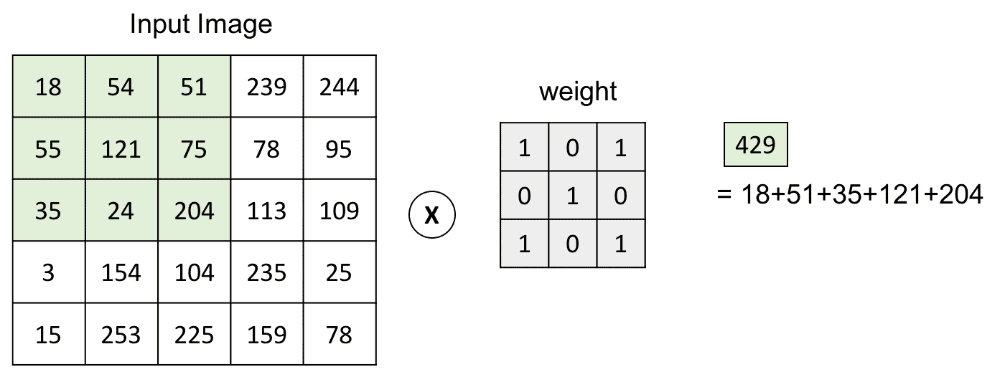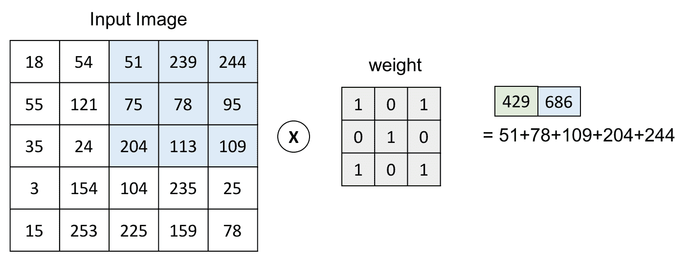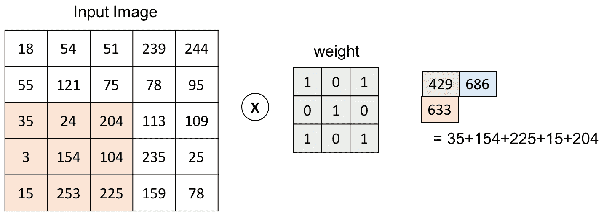

步幅= 2 的卷积示例

所以步幅越大，图像收缩得越快。为了保持图像的原始大小，我们可以在图像的边界添加 0(行和列)。这被称为*相同的填充*。步幅越大，衬垫就必须越大:

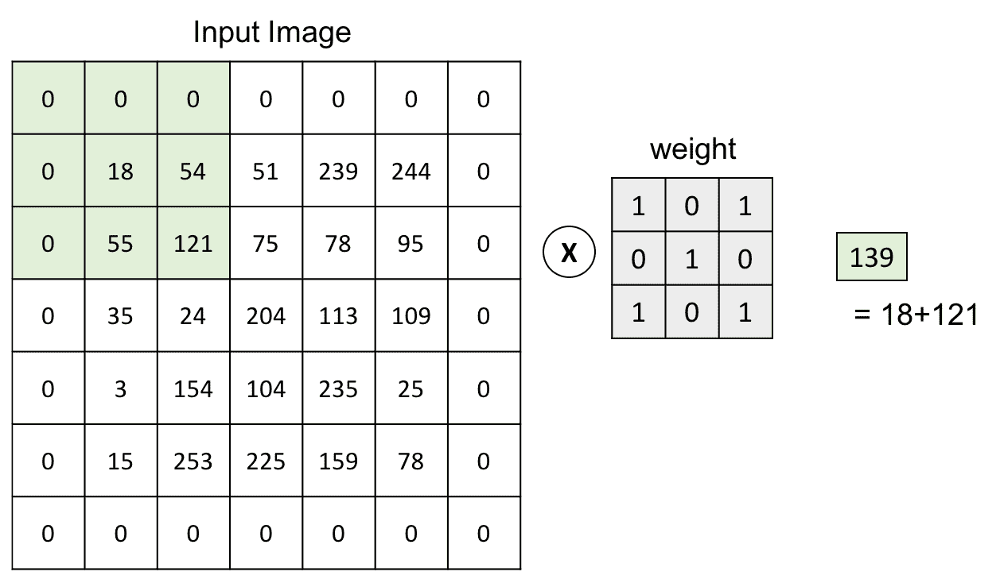

卷积的零填充


# 合并/二次抽样

汇集层逐渐减小表示的空间大小，以减少网络中的参数和计算的数量。对于彩色图像，池化是在每个颜色通道上独立完成的。通常应用的最常见的池层形式是*最大池*。还有其他类型的共用单位，如平均共用或 L2-诺姆共用。你可能会发现一些早期的网络使用平均池。由于*最大池*通常在实践中表现更好，平均池最近已经失宠。应该注意的是，实践中常见的最大池只有两种变化形式:步幅= 2 的 3 x 3(也称为**重叠池**)，更常见的是步幅= 2 的 2 x 2 池。具有较大感受野的池大小具有太大的破坏性。

下图说明了最大池化过程:

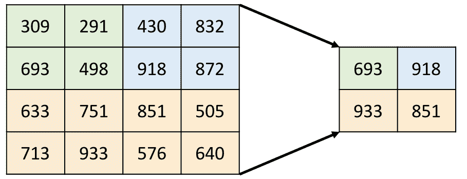

最大池化


# 全连接层

全连接层中的神经元与前一层中的所有激活具有全连接，这与 CONV 层不同。在 CONV 层中，神经元仅连接到输入中的局部区域，并且 CONV 体积中的许多神经元共享参数。全连接层通常用在最后两层，用 softmax 函数代替其他激活函数来输出概率。


# 全部的

一轮训练包括向前传递和向后传递:

*   对于每个输入图像，我们首先让它通过卷积层。卷积后的结果被送入激活函数(即 CONV + ReLU)。
*   得到的激活图再通过最大池化函数即 POOL 进行聚合。池化将导致更小的补丁大小，并有助于减少特征的数量。
*   CONV (+ReLU)和池层在连接到完全连接的层之前会重复几次。这增加了网络的深度，从而增加了其模拟复杂数据的能力。此外，不同级别的过滤器在不同级别学习数据的分层表示。请参考[第一章](493c55cb-3fea-436a-a44b-6e7231fe3dba.xhtml)，*为什么要深度学习？*了解更多关于深度网络表示学习的细节。
*   输出层通常是完全连接的，但是使用 softmax 函数来帮助计算类似概率的输出。
*   然后将输出与地面实况进行比较，以生成误差值，然后使用这些误差值来计算成本。通常，损失函数被定义为均方误差，并用于优化阶段。
*   然后误差被反向传播以更新系数和偏差值。

要深入了解计算机视觉的 CovNet 应用，请参考[第四章](376d1d26-c4be-445b-8304-ab2b6b64f134.xhtml)、*计算机视觉中的深度学习*了解详情。


# 受限玻尔兹曼机器

RBM 是只有两层的神经网络:可见层和隐藏层。每个可见节点/神经元都连接到每个隐藏节点。限制意味着没有层内通信，也就是说，在可见-可见节点或隐藏-隐藏节点之间没有连接。它是人工智能领域中最早引入的模型之一，并已成功应用于许多领域，如降维、分类、特征学习和异常检测。

下图显示了它的基本结构:

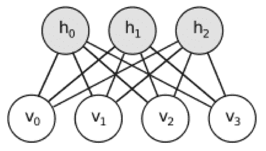

RBM 的基本结构，只有一个可见层和一个隐藏层

用数学形式表达 RBM 相对容易，因为只有几个参数:

*   权重矩阵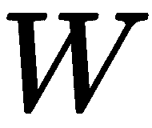 ( 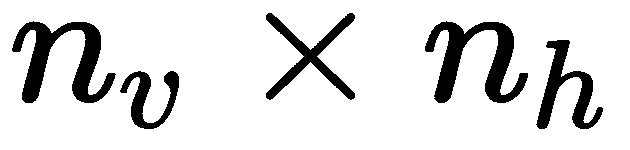)描述了可见节点和隐藏节点之间的连接强度。每一项都是可见节点 *i* 和隐藏节点 *j* 之间连接的权重。
*   可见层和隐藏层的两个偏置向量分别为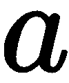 ( 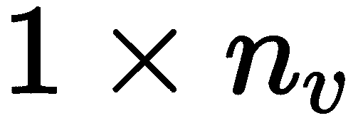)，元素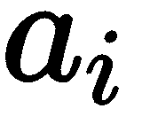对应于第 *i* 个可见节点的偏置值。类似地，向量 *b* 对应于隐藏层的偏移值，每个元素*b[j]对应于第 *j* 个节点。*

与常见的神经网络相比，有一些显著的差异:

*   RBM 是一个生成的随机神经网络。参数被调整以学习该组输入的概率分布。
*   RBM 是一个基于能源的模式。能量函数产生一个标量值，该值基本上对应于指示模型处于该配置的概率的配置。
*   它以二进制模式编码输出，而不是概率。
*   神经网络通常通过梯度下降来执行权重更新，但是 RBM 使用**对比散度** ( **CD** )。我们将在下面的章节中更详细地讨论 CD。


# 能量函数

RBM 是一个基于能源的模式。能量函数产生一个标量值，指示模型处于该配置的概率。

根据 Geoffrey Hinton 的教程( *Geoffrey Hinton，训练受限玻尔兹曼机器的实用指南，2010* )，能量函数写如下:

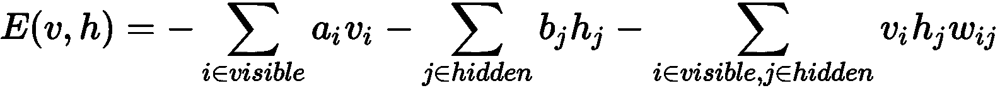

计算很简单。基本上，你在偏差和相应的单位(可见的或隐藏的)之间做点积来计算它们对能量函数的贡献。第三项是可见节点和隐藏节点之间连接的能量表示。

在模型学习阶段，该能量被最小化，也就是说，模型参数(和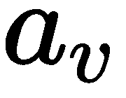、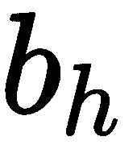)朝着较低能量配置的方向被更新。


# 编码和解码

RBM 的训练可以被认为是两个过程，前向编码路径(构造)和后向解码(重建)。在无监督的设置中，我们喜欢训练网络来模拟输入数据的分布，向前和向后传递如下进行。

在前向传递中，数据的原始输入值(例如，图像的像素值)由可见节点表示。然后，它们与权重相乘，并与隐藏的偏置值相加(注意，在正向传递中不使用可见的偏置值)。结果值通过激活函数传递，以获得最终输出。如果连接了以下层，此激活结果将用作输入以向前移动:

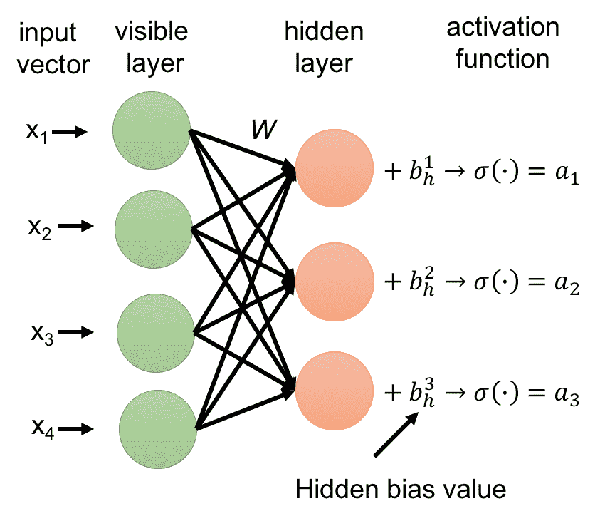

RBM 转发传球示例

在我们简单的 RBM 案例中，只有一个隐藏层和一个可见层，隐藏层的激活值成为反向传递的输入。它们乘以权重矩阵，通过权重的边，并向后填充到可见节点。在每个可见节点处，所有传入值相加，并添加到可见偏移值中(注意，反向传递中不使用隐藏偏移值):

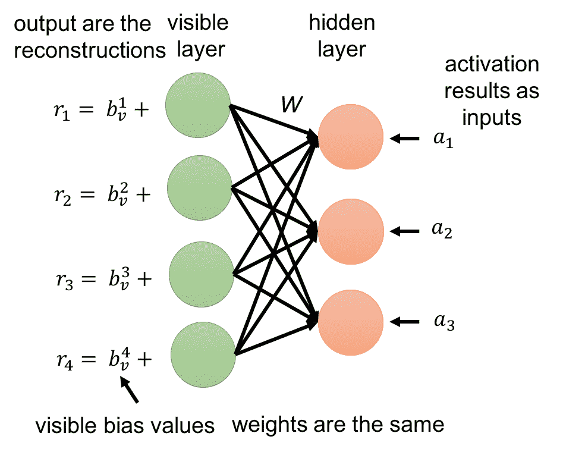

RBM 向后传球的例子

因为 RBM 的权重在开始时是随机化的，所以在最初几轮中，由重建值相对于实际数据值计算的重建误差可能很大。因此，通常需要几次迭代来最小化这种误差，直到达到误差最小值。向前和向后传递帮助模型学习数据输入和激活结果(作为隐藏层的输出)的联合概率分布。这就是为什么 RBM 被认为是一个生成学习算法。

现在的问题是如何更新网络参数。

首先，使用 KL 散度计算误差。要了解更多关于 KL-divergence 的信息，读者可以参考大卫·麦凯(David MacKay)([http://www.inference.org.uk/itprnn/book.pdf](http://www.inference.org.uk/itprnn/book.pdf)，链接最后一次查看是在 2018 年 1 月)所著的《信息理论、推理和学习算法*》一书的*第 34 页*。基本上，它通过对两个分布的差进行积分来计算两个分布的差。最小化 KL-散度意味着将学习的模型分布(以来自隐藏层的输出的激活值的形式)推向输入数据分布。在很多深度学习算法中，都会用到梯度下降，比如随机梯度下降。然而，RBM 正在使用一种近似最大似然学习的方法，称为**对比差异**。*


# 对比差异

对比分歧可以被认为是一种*近似最大似然*学习算法。它计算正相位(第一次编码的能量)和负相位(最后一次编码的能量)之间的偏差/差异。这相当于最小化模型分布和(经验)数据分布之间的 KL-散度。变量 *k* 是你运行对比背离的次数。在实践中， *k = 1* 似乎出奇地有效。

基本上，使用两个部分之间的差异来近似**梯度:正相位关联梯度和负相位关联梯度。正项和负项并不反映其项的符号，而是反映其对所学习的模型概率分布的影响。正相关梯度增加了训练数据的概率(通过减少相应的自由能)，而第二项减少了模型生成样本的概率。TensorFlow 中的伪代码片段可以编写如下:**

```py
# Define Gibbs-Sampling function
def sample_prob(probs): 
    return tf.nn.relu(tf.sign(probs - tf.random_uniform(tf.shape(probs))))

hidden_probs_0 = sample_prob(tf.nn.sigmoid(tf.matmul(X, W) + hidden_bias))
visible_probs = sample_prob(tf.nn.sigmoid( tf.matmul(hidden_0, tf.transpose(W)) + visible_bias))
hidden_probs_1 = tf.nn.sigmoid(tf.matmul(visible_probs, W) + hidden_bias)
# positive associated gradients increases the probability of training data
w_positive_grad = tf.matmul(tf.transpose(X), hidden_probs_0)
# decreases the probability of samples generated by the model. 
w_negative_grad = tf.matmul(tf.transpose(visible_probs), hidden_probs_1)

W = W + alpha * (w_positive_grad - w_negative_grad)
vb = vb + alpha * tf.reduce_mean(X - visible_probs, 0)
hb = hb + alpha * tf.reduce_mean(hidden_probs_0 - hidden_probs_1, 0)
X is the input data. For example, MNIST images have 784 pixels so the input X is a vector of 784 entries and accordingly, the visible layer has 784 nodes. Also note that in RBM the input data is encoded binary. For MNIST data, one can use one-hot encoding to transfer the input pixel value. In addition, alpha is the learning rate, vb is the bias of the visible layer, hb is the bias of the hidden layer, and W is the weight matrix. The sampling function sample_prob is the Gibbs-Sampling function and it decides which node to turn on.
```


# 堆叠/连续 RBM

深度信念网络(DBN)只是几个相互叠加的 RBM。前一个 RBM 的输出成为后一个 RBM 的输入。2006 年，Hinton 在他的论文中提出了一种快速的贪婪算法:*深度信念网络的快速学习算法*，它可以一次一层地学习深度的有向信念网络。DBN 学习输入的层次表示，目的是重建数据，因此它非常有用，特别是在无人监督的情况下。

对于连续输入，可以参考另一个称为连续受限玻尔兹曼机器的模型，它利用了不同类型的对比发散采样。这种模型可以处理在零和一之间标准化的图像像素或单词向量。


# RBM 对玻尔兹曼机器

**玻尔兹曼机器** ( **BMs** )可以被认为是对数线性马尔可夫随机场的一种特殊形式，对于它，能量函数在其自由参数中是线性的。为了增加它们对复杂分布的表示能力，人们可以考虑并增加从未观察到的变量的数量，即隐藏变量，或者在这种情况下，隐藏神经元。RBM 是建立在 BMs 之上的，在 BMs 中，应用了限制来强制没有可见-可见和隐藏-隐藏连接。


# 循环神经网络(RNN/LSTM)

在卷积神经网络或典型的前馈网络中，信息流通过在节点上执行的一系列数学运算，而没有反馈回路或对信号顺序的任何考虑。因此，它们不能处理按顺序出现的输入。

然而，在实践中，我们有许多顺序数据，如句子和时间序列数据，其中包括文本、基因组、手写、口语或来自传感器、股票市场和政府机构的数字时间序列数据。这里重要的不仅仅是顺序。行中的下一个值通常很大程度上取决于过去的上下文(长或短)。例如，为了预测句子中的下一个单词，需要大量的信息，不仅仅是来自附近的单词，有时还包括句子中的前几个单词。这有助于设置主题和内容。

**循环神经网络** ( **RNN** )是一种新型的人工神经网络，专门为这些类型的数据而设计。它考虑了序列顺序(该序列可以是任意长度)和其架构内的内部循环，这意味着网络的任何配置/状态都受到影响，不仅受当前输入的影响，还受其最近的过去的影响。


# 细胞在 RNN 和展开

所有的循环神经网络都可以被认为是在时间维度上重复模型/细胞的链。该重复模块/电池可以简单地是单个 tanh 层。理解这一点的一种方法是将架构展开或解开到每个时间步骤中，并将每个时间步骤视为一层。我们可以看到，RNN 的深度基本上是由时间步长或序列长度决定的。序列的第一个元素，如句子的单词，相当于第一层。

下图显示了时间轴中单个循环单元格的展开:


RNN 的展开。标准 RNN 中的重复模块实际上包含一个层


# 穿越时间的反向传播

在前馈网络中，**反向传播** ( **BP** )从计算输出层的最终误差开始，然后一层一层地向输入层返回。在每一步，它都会计算误差对权重的偏导数。然后通过优化方法(例如梯度下降)，这些导数用于在减小误差的方向上向上或向下调整权重。

类似地，在循环网络中，在网络随着时间展开之后，BP 可以被认为是时间维度上的扩展，这被称为通过时间的**反向传播**或 **BPTT** 。计算非常相似，只是一系列层被时间轴中一系列相似的单元所取代。


# 消失梯度和 LTSM

与所有深层架构类似，网络越深，消失梯度问题就越严重。现在的情况是，网络开始时的权重变化越来越小。鉴于网络的权重是随机生成的，权重不变，我们从数据中学到的东西很少。这个所谓的*消失梯度*问题也影响着 RNN。

RNN 中的每一个时间步长都可以看作是一个层。然后，在反向传播过程中，误差从一个时间步到前一个时间步。所以这个网络可以被认为和时间步数一样深。在许多实际问题中，如单词句子、段落或其他时间序列数据，输入 RNN 的序列可能很长。RNN 擅长序列相关问题的原因是，他们擅长从以前的输入中保留重要信息，并使用这个*过去的*上下文信息来修改当前的输出。如果序列很长，并且在训练/BPTT 期间计算的梯度或者消失(由于 0 <值< 1 的多次相乘，假设展开的 RNN 很深)或者爆炸，网络将学习得非常慢。

例如，如果我们从句子中学习预测接下来的单词，句子中的第一个单词可能对主体非常重要，对建立整个句子的上下文非常重要，甚至对预测句子中的最后一个单词也很重要。对于没有通过时间线正确学习的权重，我们可能已经丢失了这样的信息。

在 90 年代中期，德国研究人员 Sepp Hochreiter 和 Juergen Schmidhuber 提出了一种具有所谓长短期记忆单元(LSTMs)的循环网络变体，作为消失梯度问题的解决方案。

LSTM 通过引入更多的门来控制对细胞状态的访问，解决了长序列训练和保持记忆的问题。新的单元结构有助于保持更恒定的误差，从而允许循环网络在许多时间步长(有时可能超过 1000)上继续学习。

除了合并先前的输出(在时间线中)和当前的输入以生成输出之外，LTSM 不同于典型的 RNN，它保留隐藏的状态信息，合并它以生成输出，并更新新的单元状态。这意味着，RNN 的当前产出由两项决定:当前投入和以前的产出。LTSM 的当前输出由三项决定:当前输入、先前输出和先前状态。RNN 单元格将只输出隐藏值，而 LTSM 单元格将输出带有新单元格状态的隐藏值。


# LTSM 的牢房和大门

LSTM 网络由许多相连的 LSTM 细胞组成，每个细胞都可以被认为是由三个重要的门组成。这些门决定了过去/现在的信息是否能通过。

下图显示了一个标准的 LSTM 存储单元。在这个单元格中，向量乘法和向量加法由一个蓝色圆形表示，圆形内有一个符号。将一个向量与另一个在[0，1]范围内的向量相乘称为**选通**。在[0，1]中生成向量可以被认为是一个*滤波*过程。是前一个(在时间上)单元格状态。是由当前输入更新的单元状态。是当前预测/输出，是先前预测/输出(如果网络中仅使用一个 LSTM 单元，实质上是预测输出，如果架构中堆叠了一个以上的 LSTM 单元，被认为是当前 LSTM 单元的隐藏输出:


LSTM 体系结构中包含三个门的重复模块/单元

在每个单元内，对传入的信息执行三个步骤:单元的当前输入，单元的先前输出，以及来自上次的单元状态。在图中，和通过串联组合在一起。


# 第一步——遗忘之门

**遗忘门**决定我们想要从过去的细胞状态中保留或丢弃哪个记忆。这是通过使通过激活/挤压函数(sigmoid)来获得指示向量，然后将该向量(门控)乘以先前的单元状态向量来实现的。

结果表示从先前状态记忆的保留信息，我们认为该信息将对当前值有用。


# 步骤 2–更新存储器/单元状态

下一步是将单元状态从更新到。从步骤 1 中选择的隐藏存储器与当前输入的过滤版本相结合。所谓的**输入门**再次进行过滤，输入门是一个 sigmoid 层，决定我们想要更新哪些值。这个滤波决定与 tanh 的激活结果相乘，然后添加到来自遗忘门的所选记忆向量。结果用于更新单元状态。


# 步骤 3–输出门

**输出门**决定我们要输出什么，也就是选择性地决定我们要输出当前单元格状态的哪一部分作为新的隐藏状态/输出/预测。同样，sigmoid 节点用于从生成过滤向量(决定当前单元格状态的哪些部分将被选择)。然后，当前单元状态通过一个双曲正切函数(为了将值压缩到-1 和 1 之间),并乘以 sigmoid 门的输出。然后我们得到我们的最终输出。


# 实际例子

在本节中，我们提供了一个可以使用神经网络解决的实际问题。我们将介绍问题，并使用 TensorFlow 建立我们的神经网络模型来解决问题。


# TensorFlow 设置和关键概念

我们建议读者按照 https://www.tensorflow.org/install/[的说明安装 TensorFlow。我们将使用 Python 作为我们的编程语言。代码示例中主要使用了三个关键概念:](https://www.tensorflow.org/install/)

*   **张量**:张量是 TensorFlow 中的中心数据单元。我们可以认为它是一个任意维数的矩阵。张量中的条目是原始值。例如，请参见以下内容:

```py
5 is a scalar and a rank 0 tensor
[[0, 1, 2], [3, 4, 5]] is a matrix with shape [2, 3] and a rank 2 tensor
```

*   **TensorFlow 会话**:TensorFlow 会话封装了 tensor flow 运行时的控制和状态。
*   **计算图**:排列成节点计算图的一组 TensorFlow 运算。图的边是张量。节点可以是张量或运算。在 TensorFlow 中，我们需要构建计算图并运行计算图。例如，下面的代码构建了一个由三个节点组成的图，其中 node1 和 node2 输出常数，node 3 是一个加法运算，将 node 1 和 node 2 中的两个常数相加:

```py
node1 = tf.constant(1.0, dtype=tf.float32)
node2 = tf.constant(2.0, dtype=tf.float32)
node3 = tf.add(node1, node2)]
```

然后我们可以使用下面的代码来运行图形:

```py
sess = tf.Session()
print("sess.run(node3):", sess.run(node3))
```

上述代码的输出如下:

```py
sess.run(node3):3.0
```


# 手写数字识别

手写数字识别的挑战是从手写数字的图像中识别数字。这在很多情况下都很有用，例如识别信封上的邮政编码。在这个例子中，我们将使用 MNIST 数据集来开发和评估我们用于手写数字识别的神经网络模型。

http://yann.lecun.com/exdb/mnist/的 MNIST 是一个计算机视觉数据集。它由手写数字的灰度图像以及正确的数字标签组成。每个图像是 28 像素乘 28 像素。样本图像如下所示:


来自 MNIST 数据集的样本图像

MNIST 数据分为三部分:55，000 幅训练数据图像、10，000 幅测试数据图像和 5，000 幅验证数据图像。每张图片都附有标签，代表一个数字。目标是将图像分类成数字，换句话说，将每个图像与十个类别中的一个相关联。

我们可以使用介于 0 和 1 之间的浮点数的 1 x 784 向量来表示图像。数字 784 是 28 x 28 图像中的像素数。我们通过将 2D 图像展平成 1D 矢量来获得 1×784 矢量。我们可以将标签表示为一个 1 x 10 的二进制值向量，其中有且仅有一个元素为 1，其余的为 0。我们将使用 TensorFlow 建立一个深度学习模型，在给定 1 x 784 数据向量的情况下预测 1 x 10 标签向量。

我们首先导入数据集:

```py
from tensorflow.examples.tutorials.mnist import input_data
mnist = input_data.read_data_sets('MNIST_data', one_hot=True)
```

然后，我们定义 CNN 的一些基本构件:

*   重量:

```py
def weight_variable(shape):
  # initialize weights with a small noise for symmetry breaking
  initial = tf.truncated_normal(shape, stddev=0.1)
  return tf.Variable(initial)
```

*   偏见:

```py
def bias_variable(shape):
  # Initialize the bias to be slightly positive to avoid dead
  # neurons
  initial = tf.constant(0.1, shape=shape)
  return tf.Variable(initial)
```

*   卷积:

```py
def conv2d(x, W):
  # First dimension in x is batch size
  return tf.nn.conv2d(x, W, strides=[1, 1, 1, 1],
                      padding='SAME')
```

*   最大池:

```py
def max_pool_2x2(x):
  return tf.nn.max_pool(x, ksize=[1, 2, 2, 1],
                        strides=[1, 2, 2, 1], padding='SAME')
```

现在，我们通过使用基本构件的计算图来构建神经网络模型。我们的模型由两个卷积层组成，每个卷积层后有一个池，最后是一个完全连接的卷积层。该图表可以在下图中进行说明:


用于数字识别的卷积神经网络结构

以下代码实现了这种卷积神经网络架构:

```py
x = tf.placeholder(tf.float32, shape=[None, 784])
y_ = tf.placeholder(tf.float32, shape=[None, 10]) # ground-truth label
# First convolution layer
W_conv1 = weight_variable([5, 5, 1, 32])
b_conv1 = bias_variable([32])
# first dimension of x_image is batch size
x_image = tf.reshape(x, [-1, 28, 28, 1])
h_conv1 = tf.nn.relu(conv2d(x_image, W_conv1) + b_conv1)
h_pool1 = max_pool_2x2(h_conv1)
# Second convolution layer
W_conv2 = weight_variable([5, 5, 32, 64])
b_conv2 = bias_variable([64])
h_conv2 = tf.nn.relu(conv2d(h_pool1, W_conv2) + b_conv2)
h_pool2 = max_pool_2x2(h_conv2)
# Fully connected layer
W_fc1 = weight_variable([7 * 7 * 64, 1024])
b_fc1 = bias_variable([1024])
h_pool2_flat = tf.reshape(h_pool2, [-1, 7*7*64])
h_fc1 = tf.nn.relu(tf.matmul(h_pool2_flat, W_fc1) + b_fc1)
```

我们还可以使用 dropout 来减少过度拟合:

```py
keep_prob = tf.placeholder(tf.float32)
h_fc1_drop = tf.nn.dropout(h_fc1, keep_prob)
```

我们现在构建最后一层，读出层:

```py
W_fc2 = weight_variable([1024, 10])
b_fc2 = bias_variable([10])
# Readout layer
y_conv = tf.matmul(h_fc1_drop, W_fc2) + b_fc2
h_fc1_drop = tf.nn.dropout(h_fc1, keep_prob)
```

现在我们定义成本函数和训练参数:

```py
cross_entropy = tf.reduce_mean(
    tf.nn.softmax_cross_entropy_with_logits(labels=y_, logits=y_conv))
train_step = tf.train.AdamOptimizer(1e-4).minimize(cross_entropy)
```

接下来，我们定义评估:

```py
correct_prediction = tf.equal(tf.argmax(y_conv, 1), tf.argmax(y_, 1))
accuracy = tf.reduce_mean(tf.cast(correct_prediction, tf.float32))
```

最后，我们最终可以在一个会话中运行图表:

```py
with tf.Session() as sess:
   sess.run(tf.global_variables_initializer())
   for i in range(2000):
     batch = mnist.train.next_batch(50)
     if i % 20 == 0:
       train_accuracy = accuracy.eval(feed_dict={
           x: batch[0], y_: batch[1], keep_prob: 1.0})
       print('step %d, training accuracy %g' % (i, train_accuracy))
     train_step.run(feed_dict={x: batch[0], y_: batch[1],
                              keep_prob: 0.5})
print('test accuracy %g' % accuracy.eval(
      feed_dict={
          x: mnist.test.images,
          y_: mnist.test.labels,
          keep_prob: 1.0}))
```

最后，我们使用一个简单的 CNN 在这个 MNIST 数据集上取得了 99.2%的准确率。


# 摘要

在这一章中，我们从基本的多层感知器网络开始。从那里，我们讨论了基本结构，例如输入/输出层以及各种类型的*激活功能*。我们也给出了网络如何学习的详细步骤，重点是反向传播和其他一些重要的组成部分。考虑到这些基本原理，我们介绍了三种流行的网络:CNN、受限玻尔兹曼机器和循环神经网络(及其变体，LSTM)。对于每种特定的网络类型，我们都详细解释了每种体系结构中的关键构造块。最后，我们给出了一个实际的例子来说明如何使用 TensorFlow 进行端到端的应用。在下一章，我们将讨论神经网络在计算机视觉中的应用，包括流行的网络架构、最佳实践和真实的工作实例。**