# 五、NLP 向量表示

**自然语言处理** ( **NLP** )是机器学习中最重要的技术之一。理解复杂的语言是**人工智能** ( **AI** )至关重要的一部分。自然语言处理的应用几乎无处不在，因为我们主要通过语言交流，也主要用语言存储人类的知识。这包括网络搜索、广告、电子邮件、客户服务、机器翻译等等。一些热门研究领域包括语言建模(语音识别、机器翻译)、词义学习和消歧、知识库推理、声学建模、词性标注、命名实体识别、情感分析、聊天机器人、问答等。这些任务中的每一个都需要对任务或应用的深刻理解，以及有效和快速的机器学习模型。

类似于计算机视觉，从文本中提取特征是非常重要的。最近，深度学习方法在文本数据的表示学习方面取得了重大进展。本章将描述 NLP 中的词嵌入。我们将讨论三种最先进的嵌入模型:Word2Vec、Glove 和 FastText。我们将展示一个如何在 TensorFlow 中训练 Word2Vec 的例子，以及如何做可视化。我们还将讨论 Word2Vec、Glove 和 FastText 之间的区别，以及如何在文本分类等应用中使用它们。


# 传统自然语言处理

从基于文本的信息中提取有用的信息绝非易事。对于一个基本的应用，比如文档分类，常用的特征提取方式叫做**单词包** ( **BoW** )，其中每个单词出现的频率作为训练分类器的特征。我们将在下一节中简要讨论 BoW，以及 tf-idf 方法，该方法旨在反映一个单词对集合或语料库中的文档有多重要。


# 一袋单词

BoW 主要用于对文档进行分类。它也用于计算机视觉。这个想法是将文档表示为一个包或一组单词，而不考虑语法和单词序列的顺序。

在对文本进行预处理之后，通常称为**语料库**，生成一组词汇表，并在此基础上构建每个文档的 BoW 表示。

以下面两个文本示例为例:

```py
“The quick brown fox jumps over the lazy dog”
“never jump over the lazy dog quickly”
```

然后，语料库(文本样本)形成一个字典，将关键字作为单词，第二列作为单词`ID`:

```py
{
    'brown': 0,
    'dog': 1,
    'fox': 2,
    'jump': 3,
    'jumps': 4,
    'lazy': 5,
    'never': 6,
    'over': 7,
    'quick': 8,
    'quickly': 9,
    'the': 10,
 }
```

词汇表的大小(V=10)是语料库中唯一单词的数量。句子将被表示为长度为 10 的向量，其中每个条目对应于词汇表中的一个单词。此条目的值由相应单词在文档或句子中出现的次数决定。

在这种情况下，这两个句子将被编码为 10 个元素的向量，如下所示:

```py
Sentence 1: [1,1,1,0,1,1,0,1,1,0,2]
Sentence 2: [0,1,0,1,0,1,1,1,0,1,1]
```

向量的每个元素表示每个单词在语料库(文本句子)中的出现次数。因此，在第一句话中，对于`brown`(在向量中的位置 0)有`1`计数，`dog`有`1`，`1`有`fox`，以此类推。类似地，对于第二个句子，没有出现`brown`，所以我们得到位置 0 的`0`、`dog`(在数组向量的位置 1)的`1`计数、`fox`的`0`计数，等等。


# 加权术语 tf-idf

在大多数语言中，一些单词往往比其他单词出现得更频繁，但可能不包含关于判断两个文档相似性的太多区别信息。例如,*是*、*是*和*是*这样的单词，它们在英语中都很常见。如果我们像上一节课那样只考虑它们的原始频率，我们可能不能有效地区分不同类别的文档，或者检索与核心内容匹配的相似文档。

解决这个问题的一种方法叫做**术语频率和逆文档频率** ( **tf-idf** )。如其名，它考虑了两个术语:**词频** ( **tf** )和**逆文档频** ( **idf** )。

使用 tf， *tf(t，d)* ，最简单的选择是使用文档中某个术语的原始计数；即术语 *t* 在文档 *d* 中出现的次数。然而，为了防止偏向较长的文档，通常的方法是将原始频率除以文档中任何术语的最大频率:


在这个等式中， *f [t，d]是该术语在文档中出现的次数(原始计数)。*

idf 衡量单词提供了多少信息；即该术语在所有文档中是常见的还是罕见的。确定该术语的一种常用方法是取包含该术语的文档比例的倒数的对数:

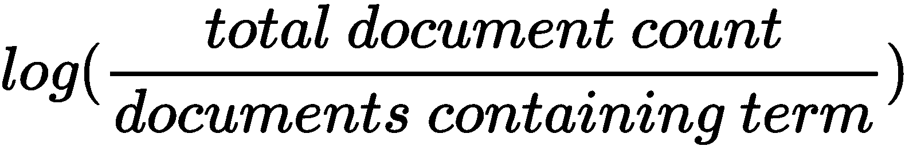

将两个值相乘，tf-idf 计算如下:

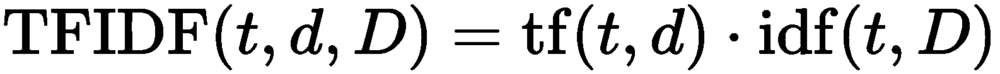

tf-idf 常用于信息检索和文本挖掘。


# 深度学习 NLP

深度学习在学习自然语言的多层次表示方面带来了多重好处。在这一节中，我们将讨论使用深度学习和分布式表示进行自然语言处理的动机、词嵌入和几种执行词嵌入的方法，以及应用。


# 动机和分布式表示

与许多其他情况一样，数据的表示，即信息如何编码并显示给机器学习算法，通常是所有学习或人工智能管道中最重要和最基本的部分。表示的有效性和可扩展性在很大程度上决定了下游机器学习模型和应用的性能。

如前一节所述，传统的 NLP 通常使用一键编码来表示固定词汇表中的单词，并使用 BoW 来表示文档。这种方法将每个单词都视为一个原子符号，例如，房子、道路、树。独热编码将生成类似于[0000000000010000]的表示。表示的长度就是词汇量的大小。使用这种表示，人们通常会得到巨大的稀疏向量。例如，在典型的语音应用中，词汇量可以从 20，000 到 500，000。但是它有一个很明显的问题，就是忽略了任意一对词之间的关系，比如:motel[0 0 0 0 0 0 0 0 0 0 0 0 0 0 1 0 0 0 0 0 0 0 0 0 0 0 0 0 0 0 0 0 0 0 0 0 0 0。此外，编码实际上是任意的，例如在一个设置中，*猫*可以表示为 *Id321* ，而*狗*表示为 *Id453* ，这意味着长稀疏向量的第 453 个条目是 1。这种表示没有向系统提供关于各个符号之间可能存在的相互作用或相似性的有用信息。

这使得模型的学习变得困难，因为当模型处理关于*狗*的数据时，它将不能利用它已经了解的关于*猫*的很多信息。因此，离散 id 将单词的实际语义与其表示分离开来。虽然可以在文档级别计算一些统计信息，但是原子级别的信息非常有限。这就是分布式向量表示，特别是深度学习的用处。

深度学习算法试图学习越来越复杂/抽象的多层次表示。

使用深度学习解决 NLP 问题有多种好处:

*   通常直接来自数据或问题，改进手工制作的特性的不完整性和过度规范。手工制作功能通常非常耗时，并且可能需要针对每个任务或特定领域的问题反复执行。从一个领域学到的特征通常很少表现出对其他领域或领域的推广能力。相反，深度学习从数据和跨多个级别的表示中学习信息，其中较低的级别对应于更通用的信息，这些信息可以直接或在微调后被其他领域利用。

*   学习不相互排斥的特征可能比类最近邻或类聚类模型更有效。原子符号表示不捕捉单词之间的任何语义相互关系。由于单词被独立处理，自然语言处理系统非常脆弱。在有限向量空间中捕捉这些相似性的分布表示为下面的 NLP 系统提供了进行更复杂的推理和知识推导的机会。

*   学习可以在无人监督的情况下进行。鉴于目前的数据规模，非常需要无监督学习。在许多实际情况下，获取标签通常是不现实的。

*   深度学习学习多层次的表示。这是深度学习最重要的优势之一，为此，学习到的信息是通过组合逐层构建的。较低级别的表示通常可以跨任务共享。

*   自然处理人类语言的递归性。人类的句子是由具有一定结构的单词和短语组成的。深度学习，尤其是循环神经模型，能够更好地捕捉序列信息。


# 词嵌入

基于分布相似性的表示的基本思想是，一个词可以通过它的邻居来表示。正如 J. R. Firth 1957 年 11 月所说:

从一个人交的朋友，你就可以知道这个人说的话

这可能是现代统计 NLP 最成功的想法之一。邻居的定义可以变化，以考虑局部或更大的上下文，从而获得更多的语法或语义表示。


# 词嵌入的概念

首先，一个词被表示为一个密集向量。词嵌入可以被认为是从单词到一个 *n* 维空间的映射函数；也就是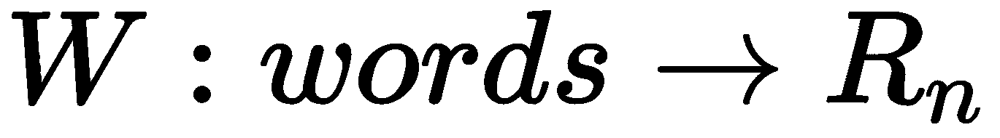，其中 *W* 是将某种语言中的单词映射到高维向量(例如 200 到 500 维的向量)的参数化函数。你也可以把 *W* 看成一个查找表，大小为 *V X N* ，其中 *V* 是词汇量的大小， *N* 是维度的大小，每行对应一个单词。例如，我们可能会发现:

```py
W("dog")=(0.1, -0.5, 0.8, ...)
W(‘‘mat")=(0.0, 0.6, -0.1, ...)
```

这里，`W`经常被初始化为每个单词都有随机向量，然后我们让网络学习并更新`W`以便执行一些任务。

例如，我们可以训练网络，让它预测一个*n*-gram(n*n*字的序列)是否有效。假设我们得到一个单词序列，如*一只狗对陌生人吠叫*，并把它作为一个带有肯定标签的输入(意味着有效)。然后，我们用随机单词替换这个句子中的一些单词，并将其转移到*猫对陌生人吠叫*，标签是否定的，因为这几乎肯定意味着这个 5-gram 是无意义的:

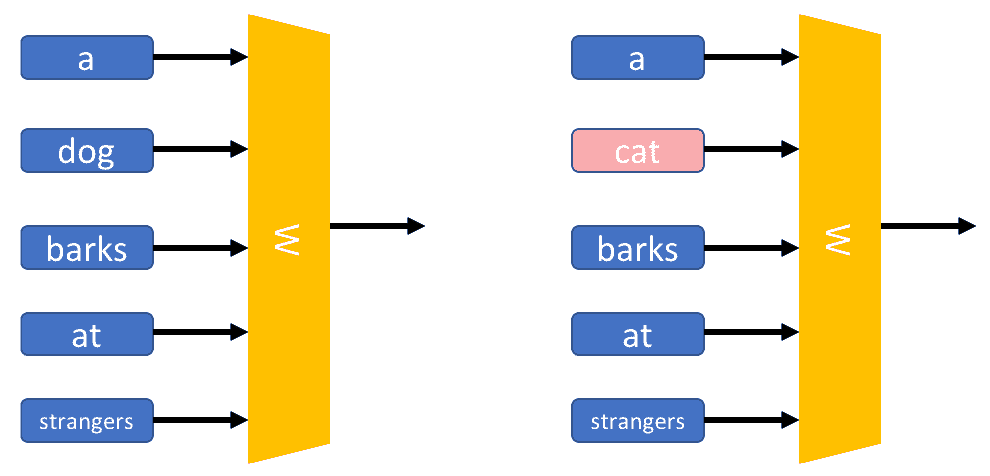

如上图所示，我们通过查找矩阵 **W** 输入*n*gram 来训练模型，并获得代表每个单词的向量。然后，向量通过输出神经元进行组合，并将结果与目标值进行比较。一个完美的预测将导致以下结果:

```py
R(W("a"), W(‘‘dog"), W(‘barks"), W(‘‘at”), W("strangers"))=1
R(W("a"), W(‘‘cat"),  W(‘barks"), W(‘‘at”), W("strangers"))=0
```

目标值和预测值之间的差异/误差将用于更新`W`和`R` (聚合函数，例如 sum)。

学习过的词嵌入有一些有趣的性质。

首先，单词表示在高维空间中的位置由它们的含义确定，使得具有相近含义的单词聚集在一起:

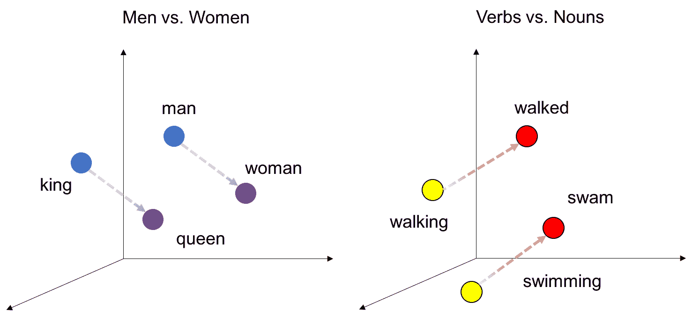

从模型中学习到的嵌入之间的线性关系

第二，也是更有趣的，单词向量有线性关系。词与词之间的关系可以认为是一对词所形成的方向和距离。例如，从字**王**的位置开始，在**男**和**女**之间移动相同的距离和方向，就会得到字**后**，即:

*【国王】-【男人】+【女人】~ =【女王】*

研究人员发现，如果使用大量数据进行训练，得到的向量可以反映非常微妙的语义关系，例如一个城市和它所属的国家。例如，法国对于巴黎就像德国对于柏林一样。

另一个例子是，找到一个与“最大”和“大”意思相同的单词。人们可以简单地计算出*向量 X =向量(最大)——向量(大)+向量(小)*。还可以捕捉许多其他种类的语义关系，例如对立和比较。在米科洛夫的出版物中可以找到一些很好的例子，*向量空间中单词表示的有效估计*(【https://arxiv.org/pdf/1301.3781.pdf】T5)，如下图所示:

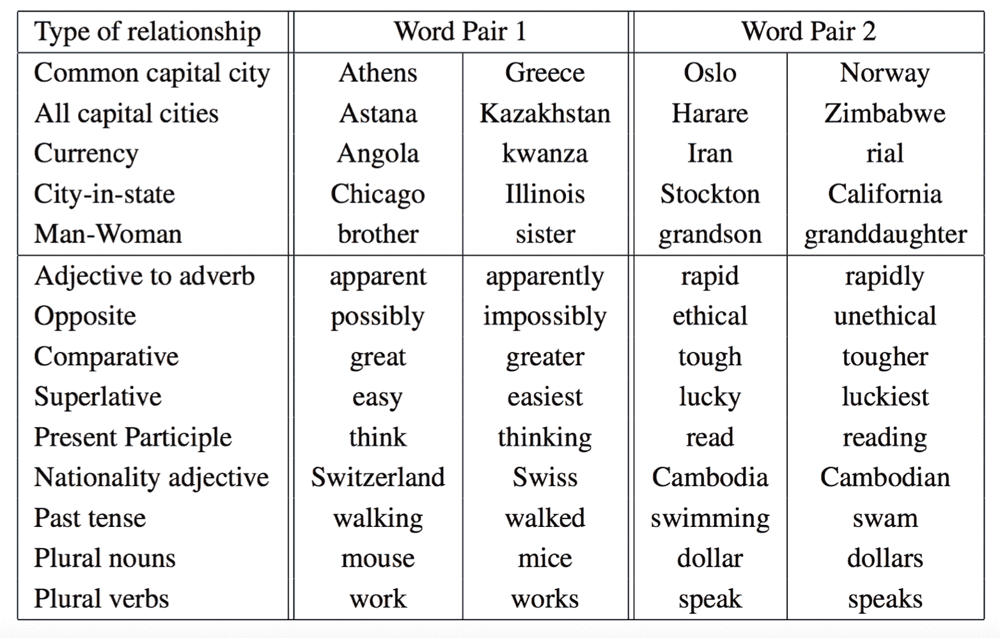

Mikolov 和他们的合著者在*矢量空间中单词表示的有效估计*中的论文中的语义句法单词关系测试集中的五种语义和九种句法问题的示例


# 分布式表示的优势

使用分布式单词向量来解决 NLP 问题有很多优点。随着微妙的语义关系被捕获，在改进许多现有的自然语言处理应用方面有很大的潜力，例如机器翻译、信息检索和问答系统。一些明显的优势是:

*   捕获本地同现统计
*   产生最先进的线性语义关系
*   有效利用统计数据
*   可以在(相对)少量数据和大量数据上进行训练
*   快速，只有非零计数才重要
*   对下游任务很重要的小(100-300)维向量的良好性能


# 分布式表示的问题

请记住，没有一种方法可以解决所有问题，同样，分布式表示也不是灵丹妙药。为了正确使用它，我们需要了解它的一些已知问题:

*   **相似性和相关度不一样**:虽然在一些出版物中给出了很好的评估结果，但并不能保证其实际应用的成功。一个原因是，当前的标准评估通常基于相关度，而不是人类创造的一组单词。有可能来自模型的表示与人类评估很好地相关，但是在给定特定任务的情况下并没有提高性能。这可能是由于大多数评估数据集没有区分单词相似性和相关度。例如，*男*和*男*相似，而*电脑*和*键盘*相关但不相似。

*   **单词歧义**:当单词有多个意思时，就会出现这个问题。比如*银行*这个词除了有*一个金融机构*的意思外，还有*坡地*的意思。这样，在不考虑单词歧义的情况下，将单词表示为一个向量是有限制的。已经提出了一些方法来学习每个单词的多种表示。例如，Trask 和他们的合作者提出了一种方法，基于监督歧义消除为每个单词的多个嵌入建模([https://arxiv.org/abs/1511.06388](https://arxiv.org/abs/1511.06388))。当任务需要时，可以参考这些方法。


# 常用的预训练词嵌入

下表列出了一些常用的预训练词嵌入:

| **名称** | **年份** | **网址** | **评论** |
| Word2Vec | 2013 | [https://code.google.com/archive/p/word2vec/](https://code.google.com/archive/p/word2vec/) | 在[https://github.com/Kyubyong/wordvectors.](https://github.com/Kyubyong/wordvectors)可获得多语种预训练矢量 |
| 手套 | 2014 | [http://nlp.stanford.edu/projects/glove/](http://nlp.stanford.edu/projects/glove/) | 斯坦福开发的，号称比 Word2Vec 好。GloVe 本质上是一个基于计数的模型，它结合了全局矩阵分解和局部上下文窗口。 |
| 快速文本 | 2016 | https://github.com/icoxfog417/fastTextJapaneseTutorial | 在 FastText 中，原子单位是 *n* 个 gram 字符，一个词向量由 *n* 个 gram 字符的集合表示。学的挺快的。 |
| LexVec | 2016 | [https://github.com/alexandres/lexvec](https://github.com/alexandres/lexvec) | LexVec 使用**窗口采样和** ( **WSNS** )负采样对**正逐点互信息** ( **PPMI** )矩阵进行因式分解。Salle 等人在其使用位置上下文和外部记忆增强 LexVec 分布式单词表示模型的工作*中提出，在单词相似性和语义类比任务中，LexVec 匹配并经常优于竞争模型。* |
| 元嵌入 | 2016 | [http://cistern.cis.lmu.de/meta-emb/](http://cistern.cis.lmu.de/meta-emb/) | 尹等，*学习词元嵌入*，2016。它结合不同的公共嵌入集来生成更好的向量(元嵌入)。 |

下面几节主要讲三个比较流行的:Word2Vec、GloVe、FastText。特别是，我们将更深入地研究 Word2Vec 的核心思想、两个不同的模型、训练过程，以及如何利用开源的预训练 Word2Vec 表示。


# Word2Vec

Word2Vec 是一组有效的预测模型，用于从原始文本中学习词嵌入。它将单词映射成向量。在映射的向量空间中，共享共同上下文的单词彼此靠近。在本节中，我们将详细讨论 Word2Vec 及其两个具体模型。我们还将描述如何使用 TensorFlow 训练一个 Word2Vec。


# Word2Vec 的基本思想

Word2Vec 型号只有三层；输入图层、投影图层和输出图层。它有两种模型，即**连续单词包** ( **CBOW** )模型和跳格模型。它们非常相似，但不同之处在于输入层和输出层的构造方式。跳格模型将每个目标单词(例如， *mat* )作为输入，并预测上下文/周围的单词作为输出(*猫坐在* *the* )。另一方面，CBOW 从源上下文单词开始(*猫坐在*上)，使用中间层进行聚合和转换，并预测目标单词( *mat* )。下图说明了不同之处:

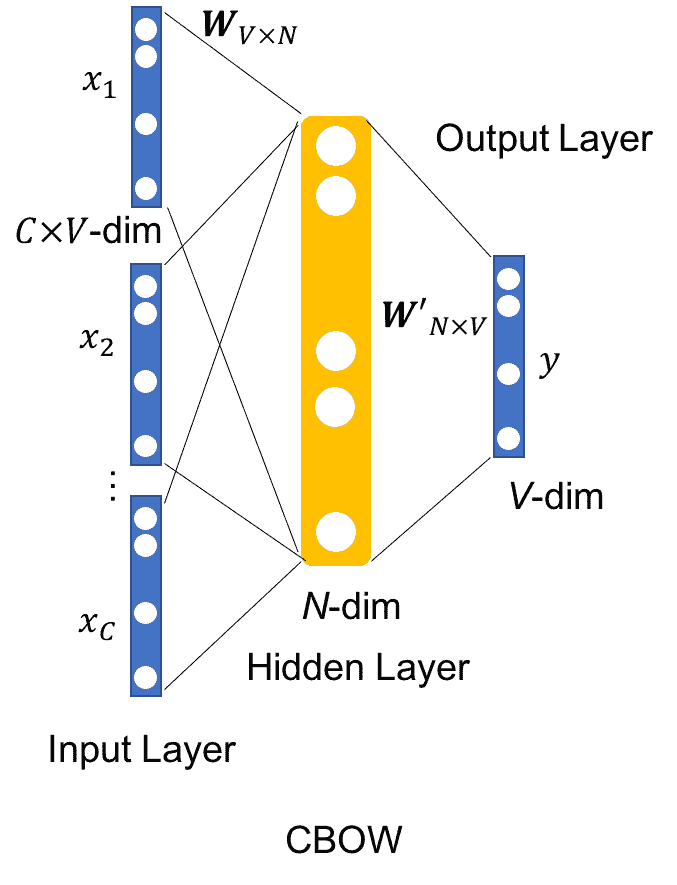

以 CBOW 模型为例。训练集中的每个单词被表示为一个独热编码向量。 *x [1] ，x [2] ，...，x[c]是上下文单词的一键编码。目标词也用一键编码 *y* 表示。隐藏层有 *N* 个节点。矩阵*W[V X N]表示输入层和隐藏层之间的权重矩阵(连接)，其行表示对应于词汇表中单词的权重。这个权重矩阵是我们感兴趣学习的，因为它包含了我们词汇表中所有单词的矢量编码(作为它的行)。*W′[N X V]*是连接隐藏层与输出层的输出矩阵(连接)，也称为上下文字矩阵。这是与每个输出字向量相关联的矩阵。在 Skip-Gram 模型中，输入是目标单词表示向量 *x* ，输出是长度为 *V* 的向量，每个词条对应词汇表中的一个单词。对于同一个目标词 *x* ，生成多个对( *x* 、 *y [1]* )、( *x* 、 *y [2]* )、( *x* 、 *y [c]* )进行训练。目标是，通过网络的变换，给定一个输入的独热编码字 *x* ，预测(一个 *1 X V* 长度向量)应该在对应于上下文字的独热编码向量的条目处具有更高的数字。**


# 视窗这个词

请记住，从词嵌入的概念这一节，我们知道单词可以通过它的上下文来表示，或者更具体地说，它的 so 单词。因此，我们可以使用一个窗口来确定我们希望与中心目标单词一起学习的周围单词(前后)的数量，如下图所示:

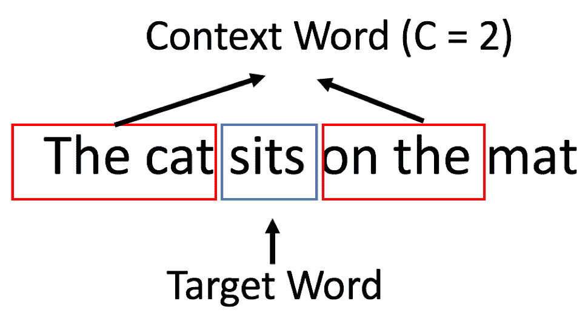

在这种情况下，窗口大小为 **2** 。为了学习目标单词 **sits** ，将包括距离目标单词最多两个单词的邻近单词，以生成训练对。然后我们沿着结构化文本滑动窗口。


# 生成训练数据

在 Skip-Gram 模型中，我们如下生成用于训练的词对:

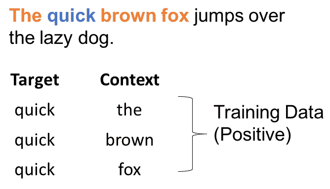

生成正训练对的示例，其中窗口覆盖了文档的开头

可以如下生成正训练对:

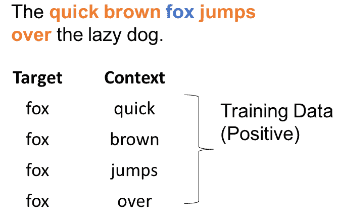

生成正训练对的示例

从这些图示中，人们可以容易地看到，网络将从每个配对(目标、上下文)出现的次数中学习统计数据。例如，模特可能会看到更多的*约克*、*新*或*新*、*约克*而不是*旧*、*约克*的样品。因此，在测试阶段，如果你给出单词 *York* 作为输入，它会输出一个大得多的概率为 *New* 。

从生成训练数据的方式中，可以注意到被训练的神经网络不知道关于输出上下文单词相对于目标单词的偏移的任何事情。以上图为例，模型不会考虑到在句子中， **quick** 比 **brown** 更远， **quick** 在目标词 **fox** 之前，而 **jump** 在之后。已经学习的信息是所有这些上下文单词都在目标单词附近，而不管它们的顺序或位置。因此，给定输入目标单词的上下文单词的预测概率仅表示它出现在附近的概率。


# 负采样

从损失函数中，我们可以看到，计算 softmax 层可能非常昂贵。交叉熵成本函数要求网络产生概率，这意味着需要对每个神经元的输出分数进行归一化，以生成每个类别的实际概率(例如，Skip-Gram 模型中词汇表中的一个单词)。归一化需要用上下文单词矩阵中的每个单词计算隐藏层输出。为了处理这个问题，Word2Vec 使用了一种叫做**负采样** ( **NEG** )的技术，类似于**噪声对比估计** ( **NCE** )。

NCE 的核心思想是将一个多项式分类问题，例如基于上下文预测一个单词的情况，其中每个单词可以被认为是一个类，转化为一个*好对*对*坏对*的二元分类问题。

在训练期间，向网络输入*好词对、*和一些随机生成的*坏词对*，好词对是与上下文窗口中的另一个词配对的目标词，坏词对由目标词和从词汇表中随机选择的词构成。

因此，网络被迫区分好的和坏的，这最终导致基于上下文的表示的学习。

本质上，NEG 保留了 softmax 层，但是具有修改的损失函数。目标是迫使单词的嵌入类似于单词在上下文中的嵌入，而不同于远离上下文的单词的嵌入。

采样过程根据一些特别设计的分布，例如单文法分布，选择一对窗口外上下文对，其可以被形式化为:

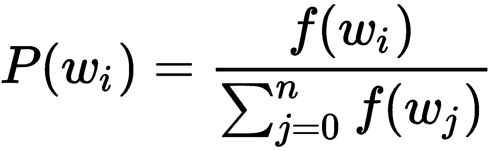

在 Word2Vec 的某些实现中，频率被提升到的幂，这是一个经验值:

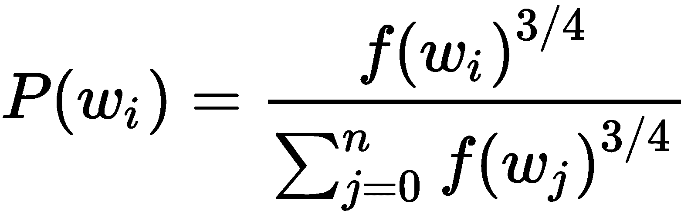

在这个等式中，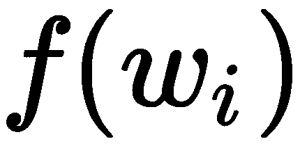是词频。通过这种分布进行选择实质上有利于频繁出现的单词被更频繁地抽取。改变采样策略会对学习结果产生重大影响。

下图说明了将目标单词与上下文之外的单词配对的方法，这些单词是从词汇表中随机选择的:

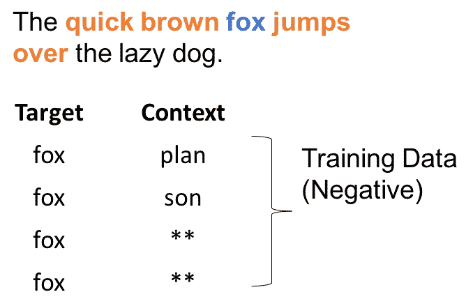

# 分级 softmax

计算 softmax 是昂贵的，因为对于每个目标单词，我们必须计算分母来获得归一化的概率。然而，分母是隐藏层输出向量 *h* 和词汇表中每个单词的输出嵌入*W**V*之间的内积之和。

为了解决这个问题，已经提出了许多不同的方法。有些是基于 softmax 的方法，如分层 softmax、差分 softmax 和 CNN softmax 等，而其他是基于采样的方法。读者可以参考[http://ruder . io/word-embeddings-softmax/index . html # cnnsoftmax](http://ruder.io/word-embeddings-softmax/index.html#cnnsoftmax)更深入的了解近似 soft max 函数。

基于 Softmax 的方法是保持 softmax 层不变但修改其架构以提高其效率的方法(例如，分层 softmax)。

然而，基于采样的方法将完全去除 softmax 层，而是优化新设计的损失函数来逼近 softmax。例如，近似计算成本较低的分母，如 NEG。一个很好的解释可以在 Yoav Goldberg 和 Omer Levy 的论文中找到，*word 2 vec Explained:derivating miko lov 等人的负采样词嵌入法*，2014([https://arxiv.org/abs/1402.3722](https://arxiv.org/abs/1402.3722))。

对于分层 softmax，主要思想是基于词频构建霍夫曼树，其中每个词都是这棵树的一片叶子。然后，对特定单词的 softmax 值的计算被转化为计算树中代表该单词的从根到叶的节点的概率的乘积。在每个子树分裂点，我们计算去右分支或左分支的概率。左右分支的概率之和等于 1；这保证了叶节点的所有概率之和等于 1。有了平衡树，这可以将计算复杂度从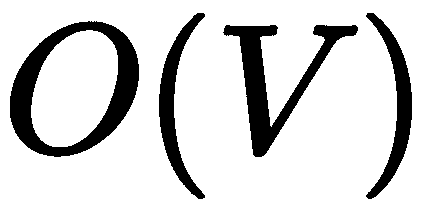降低到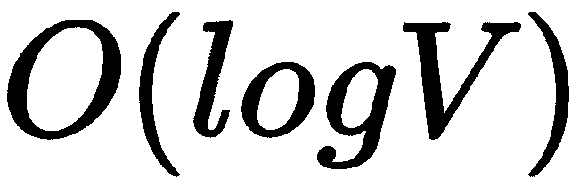，其中 *V* 是词汇量。


# 其他超参数

与传统的基于计数的方法相比，除了新算法的新颖性，如 Skip-Gram 模型(使用负采样)、CBOW(使用分层 softmax)、NCE 和 GloVe，还有许多新的超参数或预处理步骤可以进行调整以提高性能。比如二次采样、去除生僻字、使用动态上下文窗口、使用上下文分布平滑、添加上下文向量等等。如果使用得当，它们中的每一个都将极大地帮助提高性能，尤其是在实际环境中。


# 跳格模型

我们现在关注 Word2Vec 中一个重要的模型架构，即跳格模型。如本节开头所述，跳格模型在给定输入目标单词的情况下预测上下文单词。我们要的嵌入这个词，其实就是输入层和隐藏层之间的权重矩阵。接下来，我们详细解释跳格模型。


# 输入层

嗯，我们不能把一个单词作为文本串直接输入神经网络。相反，我们需要数学上的东西。假设我们有 10，000 个独特单词的词汇量；通过使用 one-hot 编码，我们可以将每个单词表示为长度为 10，000 的向量，其中一个条目在对应于单词本身的位置为 1，在所有其他位置为零。

跳跃语法模型的输入是单个单词，其长度等于词汇表的大小 *V* ，输出由生成的词对决定。


# 隐藏层

在这种情况下，隐藏层没有任何激活功能。输入层和隐藏层之间的连接可以被认为是一个权重矩阵，*W[V X N]T5，其中 *N* 是隐藏层中神经元的数量。 *W [V X N] 数字 *N* 将是嵌入向量长度。还有另外一个辅助矩阵，*W′[N X V]*，连接隐层和输出层，最小化单词 *W* 与*幻觉*上下文单词(窗外单词)的相似度。**


# 输出层

输出层是 softmax 回归分类器。它接受一个任意实值分数的向量( *z* )，并将其压缩为一个介于零和一之间的值的向量，其总和为 1:

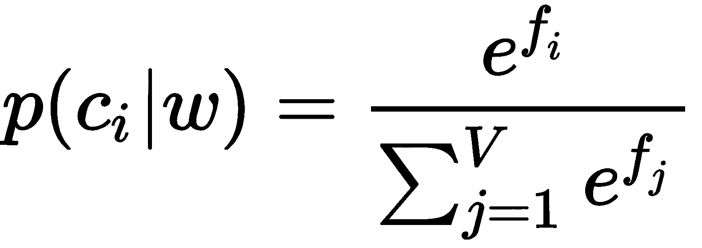

隐藏层的输出(输入目标单词的单词向量， *w* )乘以辅助矩阵*W’[N X V]*，其中它的每一列代表一个单词(假设一个单词， *c* )。点积产生一个值，在归一化之后，该值表示在给定输入目标单词 *w* 的情况下，具有上下文单词 *c* 的概率。

下面是计算单词 *car* 的输出神经元的输出并应用 softmax 函数的示例:

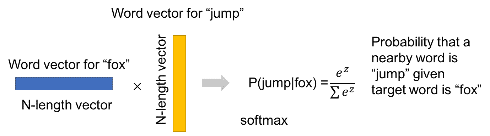

# 损失函数

损失函数是 softmax 输出的负对数:

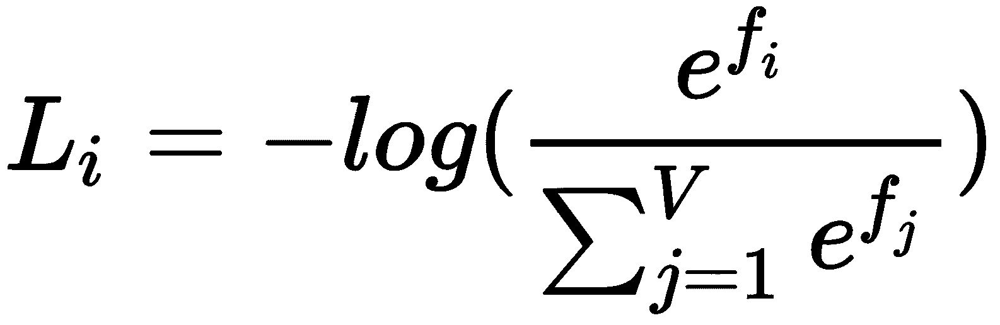

请记住，数据集的总损失是全部训练示例的平均值 *L [i]* 以及正则化项 *R(W)* 。

从**信息论**的角度来看，这本质上是一个交叉熵损失函数。

我们可以这样理解。

交叉熵定义为:

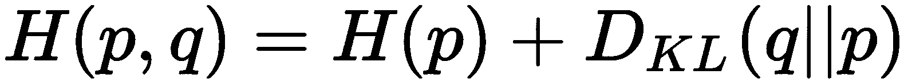

以实际分布为δ函数，其熵项为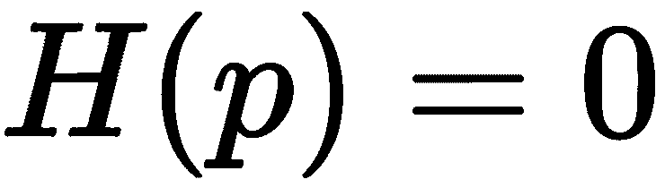。

因此:

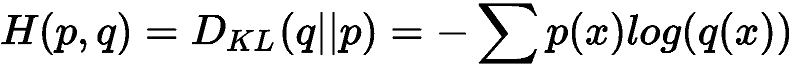

在这个等式中，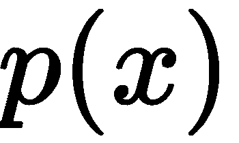是实际分布，是分布的估计。

在我们的例子中，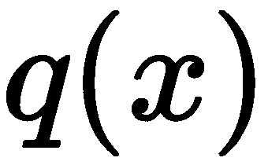本质上是 softmax 输出，即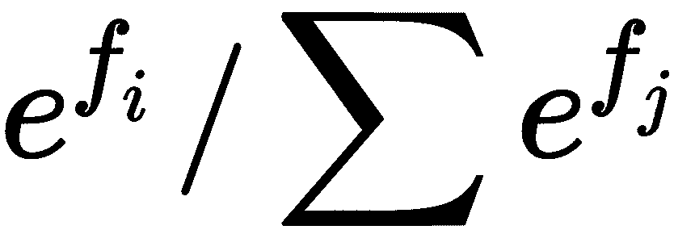，而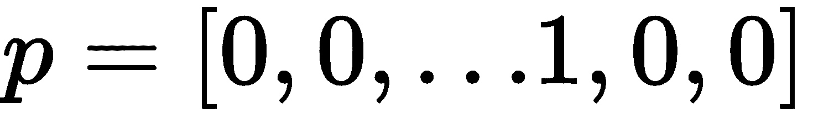中只有第 *j* 个条目是 *1* 。前面的等式可以简化为:

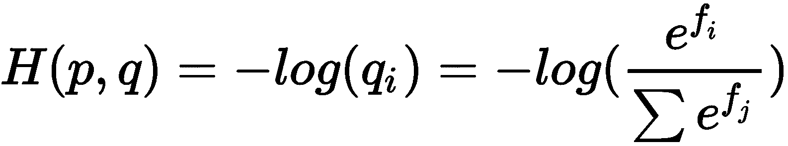

所以，这里最小化损失函数等价于最小化交叉熵值。

从**概率解释**的角度来看，可以解释为分配给正确标签的(归一化)概率。我们实际上是在最小化正确类的负对数似然，也就是执行**最大似然估计** ( **MLE** )。


# 连续词袋模型

对于**连续词袋** ( **CBOW** )模型来说，这个想法甚至更直接，因为这个模型使用周围的上下文来预测目标词。输入基本上仍然是具有固定窗口大小的周围环境，*C*；不同之处在于，我们首先聚合它们(添加它们的独热编码)，然后输入到神经网络。然后，这些单词将通过中间层进行处理，输出的是中间的目标单词。


# 使用 TensorFlow 训练 Word2Vec

在本节中，我们将逐步解释如何使用 TensorFlow 构建和训练 Skip-Gram 模型。详细教程和源代码请参考[https://www.tensorflow.org/tutorials/word2vec](https://www.tensorflow.org/tutorials/word2vec):

1.  我们可以从 http://mattmahoney.net/dc/text8.zip 下载数据集。
2.  我们以单词列表的形式读入文件内容。
3.  我们建立了TensorFlow图。我们为输入单词和上下文单词创建占位符，它们表示为词汇表的整数索引:

```py
train_inputs = tf.placeholder(tf.int32, shape=[batch_size]) train_labels = tf.placeholder(tf.int32, shape=[batch_size, 1])
```

注意我们是分批训练的，所以`batch_size`指的是批次的大小。我们还创建了一个常量来保存验证集索引，其中`valid_examples`是用于验证的词汇表的整数索引数组:

```py
valid_dataset = tf.constant(valid_examples, dtype=tf.int32)
```

我们通过计算验证集中的词嵌入和词汇表之间的相似性来执行验证，并在词汇表中找到与验证集中的单词最相似的单词。

4.  我们设置嵌入矩阵变量:

```py
embeddings = tf.Variable(
    tf.random_uniform([vocabulary_size, embedding_size],
                      -1.0, 1.0))
embed = tf.nn.embedding_lookup(embeddings, train_inputs)
```

5.  我们创建连接隐藏层和输出 softmax 层的权重和偏差。权重变量是一个大小为`vocabulary_size` × `embedding_size`的矩阵，其中`vocabulary_size`是输出层的大小，`embedding_size`是隐藏层的大小。`biases`变量的大小就是输出层的大小:

```py
weights = tf.Variable(
    tf.truncated_normal([vocabulary_size, embedding_size],
                        stddev=1.0 / math.sqrt(embedding_size)))
biases = tf.Variable(tf.zeros([vocabulary_size]))
hidden_out = tf.matmul(embed, tf.transpose(weights)) + biases
```

现在，我们将 softmax 应用于`hidden_out`，并使用交叉熵损失来优化权重、偏差和嵌入。在下面的代码中，我们还指定了一个学习速率为`1.0`的梯度下降优化器:

```py
train_one_hot = tf.one_hot(train_context, vocabulary_size)
cross_entropy = tf.reduce_mean(
    tf.nn.softmax_cross_entropy_with_logits(logits=hidden_out,
                                            labels=train_one_hot))
optimizer =
    tf.train.GradientDescentOptimizer(1.0).minimize(cross_entropy)
```

为了提高效率，我们可以将损失函数从`cross_entropy`损失改为 NCE 损失。NCE 损失最初是在 Michael Gutmann 及其合著者的论文*Noise-contrast estimation:A new estimation principle for non normalized statistical models*中提出的:

```py
nce_loss = tf.reduce_mean(
    tf.nn.nce_loss(weights=weights,
                   biases=biases,
                   labels=train_context,
                   inputs=embed,
                   num_sampled=num_sampled,
                   num_classes=vocabulary_size))
optimizer =
    tf.train.GradientDescentOptimizer(1.0).minimize(nce_loss)
```

对于验证，我们计算验证集中的词嵌入和词汇表中的词嵌入之间的余弦相似度。稍后，我们将打印词汇表中与验证词嵌入最接近的前 K 个单词。嵌入 *A* 和 *B* 之间的余弦相似度定义为:

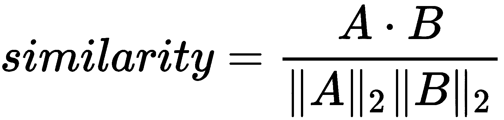

这转化为以下代码:

```py
norm = tf.sqrt(tf.reduce_sum(tf.square(embeddings), 1, keep_dims=True))
normalized_embeddings = embeddings / norm
valid_embeddings = tf.nn.embedding_lookup(
    normalized_embeddings, valid_dataset)
similarity = tf.matmul(
    valid_embeddings, normalized_embeddings, transpose_b=True)
```

6.  现在我们准备运行TensorFlow图:

```py
with tf.Session(graph=graph) as session:
  # We must initialize all variables before we use them.
  init.run()
  print('Initialized')
  average_loss = 0
  for step in range(num_steps):
    # This is your generate_batch function that generates input
    # words and context words (labels) in a batch from data.
    batch_inputs, batch_context = generate_batch(data,
        batch_size, num_skips, skip_window)
    feed_dict = {train_inputs: batch_inputs,
                 train_context: batch_context}
    # We perform one update step by evaluating the optimizer op
    # and include it in the list of returned values for
    # session.run()
    _, loss_val = session.run(
        [optimizer, cross_entropy], feed_dict=feed_dict)
    average_loss += loss_val
    if step % 2000 == 0:
      if step > 0:
        average_loss /= 2000
      # The average loss is an estimate of the loss over
      # the last 2000 batches.
      print('Average loss at step ', step, ': ', average_loss)
      average_loss = 0
   final_embeddings = normalized_embeddings.eval()
```

7.  此外，我们希望打印出与我们的验证单词最相似的单词——我们通过调用我们前面定义的相似性操作来实现这一点，并对结果进行排序。请注意，这是一个开销很大的操作，因此我们每 10，000 步才执行一次:

```py
if step % 10000 == 0:
  sim = similarity.eval()
  for i in range(valid_size):
    # reverse_dictionary - maps codes(integers) to words(strings)
    valid_word = reverse_dictionary[valid_examples[i]]
    top_k = 8  # number of nearest neighbors
    nearest = (-sim[i, :]).argsort()[1:top_k + 1]
    log_str = 'Nearest to %s:' % valid_word
    for k in range(top_k):
      close_word = reverse_dictionary[nearest[k]]
      log_str = '%s %s,' % (log_str, close_word)
      print(log_str)
```

有趣的是，在第一次迭代中，离*四个*最近的前八个单词是`lanthanides`、`dunant`、`jag`、`wheelbase`、`torso`、`bayesian`、`hoping`和`serena`，但是在 30，000 步之后，离*四个*最近的前八个单词是`six`、`nine`、`zero`、`two`、`seven`、`eight`、`three`和`five`我们可以使用来自*使用 t-SNE*(2008)[http://www . jmlr . org/papers/volume 9/vandermaten 08 a/vandermaten 08 a . pdf](http://www.jmlr.org/papers/volume9/vandermaaten08a/vandermaaten08a.pdf)的 t-SNE，使用以下代码来可视化嵌入:

```py
from sklearn.manifold import TSNE
import matplotlib.pyplot as plt
tsne = TSNE(perplexity=30, n_components=2,
            init='pca', n_iter=5000, method='exact')
plot_only = 500
low_dim_embs = tsne.fit_transform(final_embeddings[:plot_only, :])
# reverse_dictionary - maps codes(integers) to words(strings)
labels = [reverse_dictionary[i] for i in xrange(plot_only)]
plt.figure(figsize=(18, 18)) # in inches
for i, label in enumerate(labels):
  x, y = low_dim_embs[i, :]
  plt.scatter(x, y)
  plt.annotate(label,
               xy=(x, y),
               xytext=(5, 2),
               textcoords='offset points',
               ha='right',
               va='bottom')
```

在下图中，我们将 Word2Vec 嵌入可视化，发现意思相近的单词彼此接近:

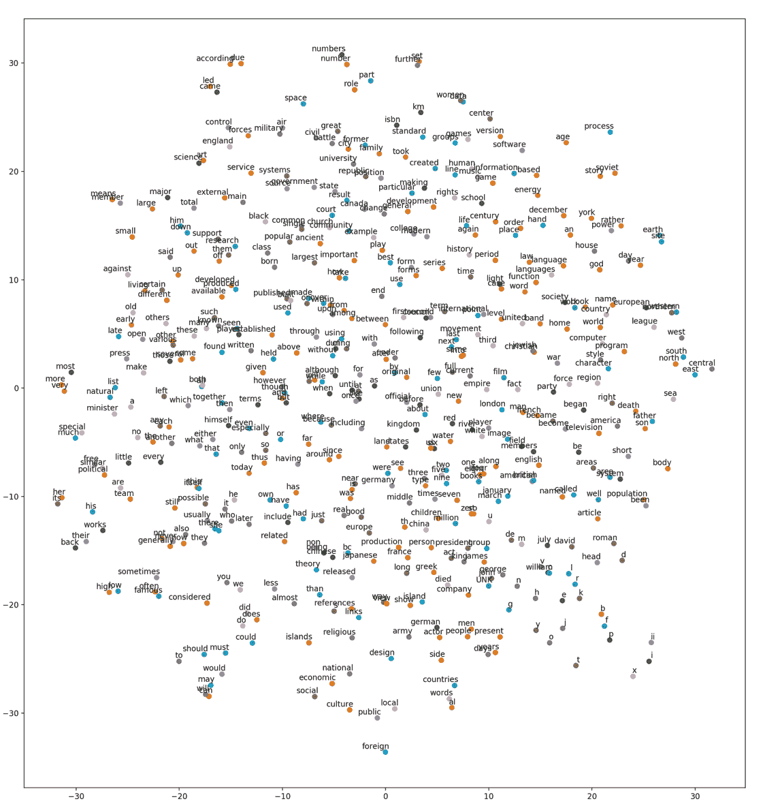

使用 t-SNE 的 Word2Vec 嵌入的可视化


# 使用现有的预训练 Word2Vec 嵌入

在本节中，我们将讨论以下主题:

*   来自谷歌新闻的 Word2Vec
*   使用预先训练的 Word2Vec 嵌入


# 来自谷歌新闻的 Word2Vec

Google 在 Google News 数据集上训练的 Word2Vec 模型，特征维度为 300。特性的数量被认为是一个超参数，你可以，也许应该，在你自己的应用程序中试验，看看哪个设置产生最好的结果。

在这个预训练的模型中，一些停用词如 *a* 、*和*以及的*被排除，但其他如 *the* 、 *also* 以及 *should* 被包括在内。一些拼错的单词也包括在内，例如，*拼错了*，而*拼错了*——后者才是正确的。*

你可以找到开源工具，如[https://github.com/chrisjmccormick/inspect_word2vec](https://github.com/chrisjmccormick/inspect_word2vec)来检查预训练模型中的词嵌入。


# 使用预先训练的 Word2Vec 嵌入

在本节中，我们将简要说明如何使用预训练向量。在阅读本节之前，从[https://drive . Google . com/file/d/0 b 7 xkcwpi 5 kdynlnuttlss 21 pqmm/edit](https://drive.google.com/file/d/0B7XkCwpI5KDYNlNUTTlSS21pQmM/edit)下载 Word2Vec 预训练向量，并加载模型:

```py
from gensim.models import KeyedVectors
# Load pre-trained model
model = KeyedVectors.load_word2vec_format(
    './GoogleNews-vectors-negative300.bin', binary=True)
```

然后，我们找到与`woman`和`king`相似，但与`man`不同的前`5`个单词:

```py
model.wv.most_similar(
    positive=['woman', 'king'], negative=['man'], topn=5)
```

我们看到以下内容:

```py
[(u'queen', 0.7118192911148071),
 (u'monarch', 0.6189674139022827),
 (u'princess', 0.5902431607246399),
 (u'crown_prince', 0.5499460697174072),
 (u'prince', 0.5377321243286133)]
```

这是有意义的，因为`queen`与`woman`和`king`共享相似的属性，但与`man`不共享属性。


# 理解手套

GloVe 是一种无监督学习算法，用于获得单词的矢量表示(嵌入)。已经看到，利用相似的训练超参数，使用两种方法生成的嵌入往往在下游 NLP 任务中表现得非常相似。

不同的是，Word2Vec 是一个预测模型，它通过最小化预测损失，即损失(目标词|上下文词； *W* 。在 Word2Vec 中，它被形式化为前馈神经网络，并使用优化方法(如 SGD)来更新网络。

另一方面，GloVe 本质上是一个基于计数的模型，其中首先构建一个共现矩阵。这个共现中的每个条目对应于我们看到目标单词(行)的频率，同时，我们看到上下文单词(列)。然后，分解该矩阵以产生低维(单词 x 特征)矩阵，其中每一行现在产生每个单词的向量表示。这就是降维的意义所在，因为目标是最小化重建损失，并找到低维表示来解释高维数据中的大部分差异。

尽管 GloVe over Word2Vec 有一些好处，因为它更容易并行化实现，从而可以在更多数据上训练模型。

网上有很多资源。对于使用 TensorFlow 的实现，可以查看[https://github . com/grady Simon/tensor flow-glove/blob/master/Getting % 20 started . ipynb .](https://github.com/GradySimon/tensorflow-glove/blob/master/Getting%20Started.ipynb)


# 快速文本

fast text(【https://fasttext.cc/】)是一个高效学习单词表示和句子分类的库。与 Word2Vec 相比，FastText 嵌入的主要优势是在学习单词表示时考虑单词的内部结构，这对于形态学丰富的语言以及很少出现的单词非常有用。

Word2Vec 和 FastText 的主要区别在于，对于 Word2Vec，原子实体是每个单词，这是训练的最小单位。相反，在 FastText 中，最小单位是字符级的 *n* -grams，每个单词都被视为由字符 *n* -grams 组成。例如， *happy* 的单词向量具有最小尺寸为 3 且最大尺寸为 6 的*n*-克，可以分解为:

<哈、<哈、<哈普、<哈普、哈普、哈普、哈普、哈普、哈普>，app、appy、appy >，ppy、ppy >，py >

正因为如此，FastText 通常会为罕见的单词生成更好的词嵌入，因为即使在单词级别，它们也是罕见的，并且组成的*n*gram 字符仍然可以看到并与其他单词共享。而在 Word2Vec 中，一个罕见的单词通常有更少的邻居，因此可以学习的结果训练实例更少。还有，Word2Vec 有固定的词汇大小，词汇是基于给定的训练数据通过预处理配置的。当面对一个不在词汇表中的新单词时，Word2Vec 和 GloVe 都会无解。但由于 FastText 是在字符 *n* -gram 层面上，只要来自生僻字的*n*-gram 在训练语料库中出现过，FastText 就能通过对字符 *n* -gram 向量求和来构建单词层面的向量。

由于粒度更细，FastText 也需要更长的时间和更多的内存来学习。因此，需要仔细选择控制 *n* 克大小的超参数，例如 *n* 克最大值和 *n* 克最小值。使用预设的 *n* -gram min/max，可以调整最小字数，这决定了一个单词需要在语料库中出现的最小频率，才能包含在词汇表中。参数-桶数用于控制单词和字符*n*gram 特征被散列到的桶数(为*n*gram 选择一个向量是一个散列函数)。这有助于限制模型的内存使用。对于设置铲斗尺寸，如果 *n* 克数不大，建议使用较小的铲斗尺寸。

读者可以在[https://github . com/face book research/fast text/blob/master/pre trained-vectors . MD](https://github.com/facebookresearch/fastText/blob/master/pretrained-vectors.md)找到 294 种语言的预训练词向量。


# 应用程序

在本节中，我们将讨论一些示例用例以及 NLP 模型的微调。


# 示例使用案例

通过预先训练的 Word2Vec 嵌入，NLP 的下游应用可以很多，例如，文档分类或情感分类。一个例子叫做 **Doc2Vec** ，它以最简单的形式获取文档中每个单词的 Word2Vec 向量，并通过取这些词的归一化总和或算术平均值来聚合它们。每个文档的结果向量用于文本分类。这种类型的应用可以被认为是所学词嵌入的直接应用。

另一方面，我们可以将 Word2Vec 建模的思想应用于其他应用程序，例如，在电子商务环境中查找类似的物品。在每个会话窗口期间，在线用户可能会浏览多个项目。从这样的行为中，我们可以使用行为信息来寻找相似或相关的项目。在这种情况下，具有唯一 ID 的每个项目可以被认为是一个单词，同一会话中的项目可以被认为是上下文单词。我们可以进行类似的训练数据生成，并将生成的数据对传送到网络中。嵌入结果然后可以用于计算项目之间的相似性。


# 微调

微调是指用来自另一个任务(例如无监督的训练任务)的参数初始化网络，然后根据手头的任务更新这些参数的技术。例如，NLP 架构通常使用预先训练的词嵌入，如 Word2Vec，然后在训练期间或通过对特定任务(如情感分析)的持续训练来更新这些词嵌入。


# 摘要

在这一章中，我们介绍了使用神经网络学习分布式单词表示的基本思想和模型。我们特别深入到 Word2Vec 模型，并展示了如何训练模型，以及如何为下游 NLP 应用程序加载预先训练好的向量。在下一章，我们将讨论 NLP 中更高级的深度学习模型，如循环神经网络、长时短记忆模型，以及几个真实世界的应用。