# 六、高级自然语言处理

在前一章中，我们介绍了自然语言处理的基础知识。我们讨论了单词袋模型形式的简单文本表示，以及捕获文本语义属性的更高级的词嵌入表示。本章旨在通过采用一种更加以模型为中心的方法来处理文本，从而构建单词表示技术。我们将回顾一些核心模型，如**循环神经网络** ( **RNNs** )和**长短期记忆** ( **LSTM** )网络。我们将具体回答以下问题:

*   理解文本有哪些核心的深度学习模型？
*   哪些核心概念构成了理解 RNNs 的基础？
*   哪些核心概念构成了理解 LSTMs 的基础？
*   如何使用 TensorFlow 实现 LSTM 的基本功能？
*   RNN/LSTM 最流行的文本处理应用有哪些？


# 文本深度学习

到目前为止，我们已经看到了各种不同的技术，这些技术使用不同的神经网络进行文本处理。基于单词的嵌入是神经网络的一种常见应用。如前一章所见，基于单词的嵌入技术是特征级的，或者说是表示学习的问题。换句话说，它们解决了一个非常具体的问题:给定一个文本块，用某种用于下游文本挖掘应用的特征形式来表示它，比如分类、机器翻译、属性标注等等。目前存在许多机器学习技术，它们可以在不同的准确度水平上应用文本挖掘。在这一章中，我们关注一个完全不同的文本处理模型。我们研究了适用于文本处理应用程序并可以同时执行这两种应用程序的核心深度学习模型:

*   表示学习或特征提取
*   统一模型下的下游文本挖掘应用

在我们开始理解文本的深度学习模型之前，让我们暂时重温一下神经网络，并尝试理解为什么它们不适合一些重要的文本挖掘应用。


# 神经网络的局限性

神经网络是逼近任何非线性函数的非常有效的工具，这是任何模式识别或机器学习任务中经常出现的问题。尽管它们的建模方法非常强大，但是它们有一定的局限性，这使得它们在执行各种模式识别任务时能力有限。其中一些限制是:

*   **固定大小的输入**:神经网络架构具有固定数量的输入层。因此，对于任何任务，它只能接受固定大小的输入和输出。这是许多模式识别任务的限制因素。例如，想象一个图像字幕任务，其中网络的目标是获取图像并生成文字作为字幕。一个典型的神经网络不能模拟这个任务，因为对于每一张图片，标题中的许多单词都是不同的。给定固定的输出大小，神经网络不可能有效地对此任务建模。再比如情感分类的任务。在这项任务中，网络应该将一个句子作为其输入，并输出单个标签(例如，正面或负面)。假设一个句子有不同数量的单词，这个任务的输入也有不同数量的输入。因此，典型的神经网络不能模拟这一任务。这种类型的任务通常被称为 T2 序列分类任务。
*   **缺乏记忆:**神经网络的另一个限制是它们缺乏记忆。例如，对于情感分类的任务，重要的是记住单词的顺序来对整句的情感进行分类。对于神经网络，每个输入单元都是彼此独立处理的。因此，句子中的下一个单词标记与句子中的任何前一个单词标记都没有相关性，这使得对句子进行分类的任务极其困难。能够很好地执行这类任务的好模型需要维护上下文或记忆:

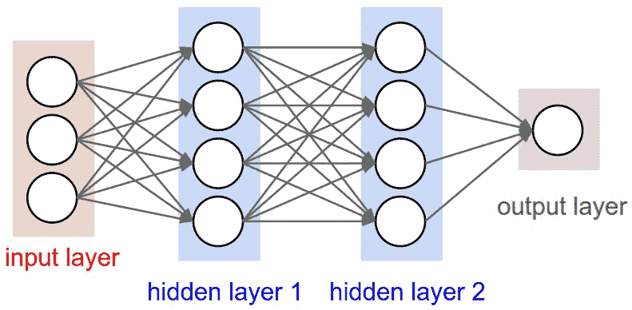

神经网络的固定大小输入(来源:https://raw . githubusercontent . com/cs 231n/cs 231n . github . io/master/assets/nn1/neural _ net 2 . JPEG)

为了解决这些限制，使用了 RNN。这类深度学习模型是我们本章的主要关注点。


# 循环神经网络

循环神经网络背后的基本思想是数据的矢量化。如果你看图*固定大小的神经网络输入*，它代表一个传统的神经网络，网络中的每个节点接受一个标量值并产生另一个标量值。看待这种架构的另一种方式是，网络中的每一层都接受一个向量作为其输入，并生成另一个向量作为其输出。图*水平卷起的神经网络*和图*垂直卷起的神经网络*说明了这种表示:

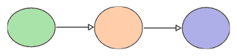

水平卷起的神经网络

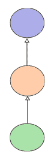

垂直卷起的神经网络

图形*神经网络垂直卷起*是简单的 RNN 表示，是一对一的 RNN；使用一个隐藏层将一个输入映射到一个输出。


# RNN 建筑

通常，rnn 有许多不同的架构。在这一节中，我们将回顾 rnn 的一些基本架构，并讨论它们如何适应各种不同的文本挖掘应用:

*   **一对多 RNN**:**图 *RNN:一对多架构*阐述了一对多 RNN 架构的基本思想。如下图所示，在该架构中，RNN 的单个输入单元映射到多个隐藏单元以及多个输出单元。这种架构的一个应用示例是图像字幕。如前所述，在这个应用程序中，输入层接受单个图像并将其映射到标题中的多个单词:**

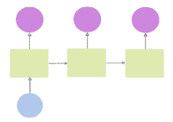

RNN:一对多架构

*   **多对一 RNN** : 图 *RNN:多对一架构，*说明了多对一 RNN 架构的基本思想。如下图所示，在此架构中，RNN 的多个输入单元映射到多个隐藏单元，但只有一个输出单元。这种架构的一个应用例子是情感分类。如前所述，在该应用中，输入层接受来自句子的多个单词标记，并将它们映射到句子的单个情感，作为肯定或否定:

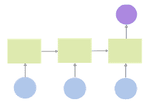

RNN:多对一架构

*   **多对多 RNN** : 图 *RNN:多对多架构*阐述了多对多 RNN 架构的基本思想。如下所示，在这个架构中，RNN 的多个输入单元被映射到多个隐藏单元和多个输出单元。这种体系结构的一个应用例子是机器翻译。如前所述，在该应用中，输入层接受来自源语言的多个单词标记，并将它们映射到来自目标语言的多个单词标记:

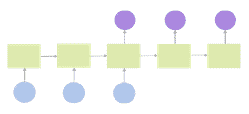

RNN:多对多架构


# 基本 RNN 模型

图*基本 RNN 模型*更详细地描述了基本 RNN 模型。如您所见，这是一个简单的一对多 RNN 模型。如果只关注节点**X[1]T5、 **h [1]** 、 **Y [1]** ，它们很像一个一层的神经网络。这个 RNN 模型唯一增加的是隐藏神经元取不同值时的时间步长，比如**h[2]和**h[3]T21。该 RNN 模型的总体操作顺序如下:******

*   时间步长 t1，其中 X [1] 被输入到 RNN 模型
*   时间步长 t1，其中 h1 根据输入 X1 计算
*   基于输入 h1 计算 Y1 的时间步长 t1
*   基于输入 h1 计算 h2 的时间步长 t2
*   基于输入 h2 计算 Y2 的时间步长 t2
*   基于输入 h2 计算 h3 的时间步长 t3
*   基于输入 h [3] 计算 Y [3] 的时间步长 t3

使用这个模型，我们可以基于每个时间步长生成多个输出向量。因此，这种模型广泛适用于许多时间序列或基于序列的数据模型。

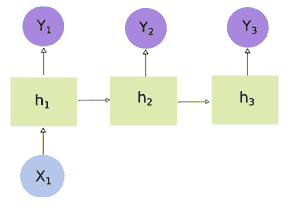

基本 RNN 模型


# 训练 RNN 是艰难的

在本节中，我们将了解 RNN 培训的一些现有限制。我们也将深入了解为什么训练 RNN 如此艰难。

训练神经网络的传统方法是通过反向传播算法。在 RNN 的情况下，我们需要执行梯度随时间的反向传播，通常称为随时间的**反向传播** ( **BPTT** )。虽然在数值上可以计算梯度随时间的反向传播，但由于经典的消失(或爆炸)梯度问题，结果往往很差，如图消失*RNN 乘性梯度的梯度问题*所示:

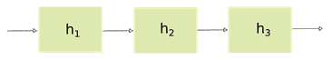

乘性梯度下 RNN 中的消失梯度问题

为了更详细地理解这个概念，让我们看一下图*基本 RNN 模型*。它通过三个时间步骤显示了单层隐藏神经元。为了计算穿过该区域的梯度向前传递，我们需要计算复合函数的导数，如下所示:

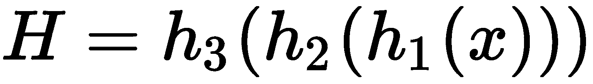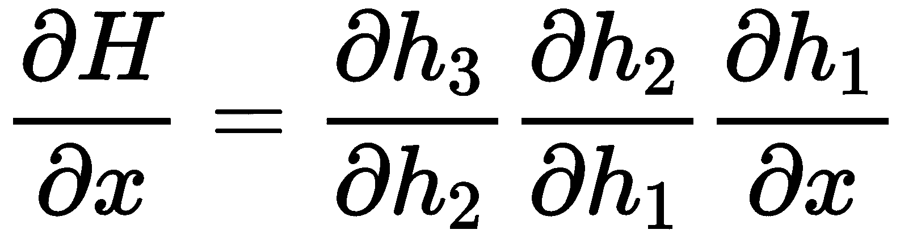

可以想象，这里的每个梯度计算都会逐渐变小，将较小的值乘以较大的值会导致通过大时间步长计算的整体梯度减小。因此，使用这种方法不能以更长时间步长的有效方式训练 RNNs。解决这种方法的一种方法是使用如图所示的门控逻辑*用附加梯度解决消失梯度问题:*

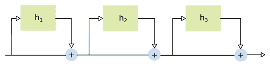

用加性梯度求解消失梯度问题

在这个逻辑中，我们不是将梯度相乘，而是将它们相加，如下所示:

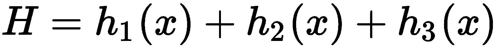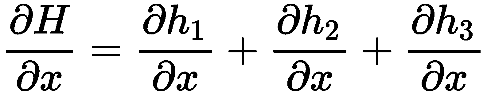

从上式可以看出，总梯度可以计算为较小梯度的总和，即使经过较长的时间步长，梯度也不会减小。这种增加是由于门控逻辑而实现的，门控逻辑在每个时间步长将隐藏层的输出与原始输入相加，从而减少梯度减小的影响。这种门控结构形成了一种新型 RNN 的基础，也称为长短期记忆网络或 LSTMs。LSTMs 是在长序列时态数据上训练 rnn 的最流行的方法，并且已经被证明在各种各样的文本挖掘任务上表现得相当好。


# 长短期记忆网络

到目前为止，我们已经看到，由于消失和爆炸梯度问题，RNNs 表现不佳。LSTMs 旨在帮助我们克服这一限制。LSTM 背后的核心思想是一个门控逻辑，它提供了一个基于内存的架构，导致一个加法渐变效果，而不是乘法渐变效果，如下图所示。为了更详细地说明这个概念，让我们来看看 LSTM 的记忆架构。像任何其他基于存储器的系统一样，典型的 LSTM 单元包括三个主要功能:

*   写入内存
*   从内存中读取
*   重置内存

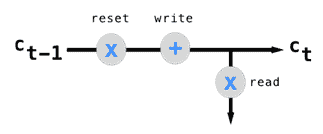

LSTM:核心思想(来源:https://ayearofai . com/rohan-Lenny-3-recurrent-neural-networks-10300100899 b)

图 *LSTM:核心理念*阐述了这个核心理念。如图 LSTM:核心思想所示，首先，前一个 LSTM 单元的值通过复位门，该复位门将前一个状态值乘以 0 到 1 之间的标量。如果标量接近 1，则导致传递前一个单元状态的值(记住前一个状态)。如果它更接近 0，这将导致阻止该值的先前单元状态(忘记先前状态)。接下来，写门简单地写复位门的转换输出。最后，读门读取写门输出的视图:

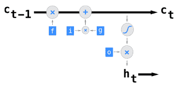

LSTM:细胞中的门控功能(来源:https://ayearofai . com/rohan-Lenny-3-recurrent-neural-networks-10300100899 b)

理解 LSTM 的门控逻辑可能相当复杂。为了更简洁地描述这一点，让我们在没有任何输入的情况下详细了解一下 LSTM 的小区架构，如图 *LSTM:核心想法*所示。门控功能现在有明确定义的标签。我们可以这样称呼它们:

1.  **f 门**:通常被称为遗忘门，该门将一个 sigmoid 函数应用于来自前一时间步的输入单元值。因为 sigmoid 函数取 0 和 1 之间的任何值，所以这个门相当于基于 sigmoid 函数的激活而忘记了先前单元状态值的一部分。
2.  **g 门**:该门的主要作用是调节前一个单元状态值的加性因子。换句话说，f 门的输出现在加上了由 g 门控制的某个标量。通常，在这种情况下应用-1 和 1 之间的双曲正切函数。因此，该门通常充当递增或递减计数器。
3.  **i 门** : 虽然 g 门调节加法因子，但 *i* 门是另一个介于 0 和 1 之间的双曲正切函数，它决定 g 门的哪一部分实际上可以加到 f 门的输出上。
4.  **o 门**:也称为*输出门*，这个门也使用一个 sigmoid 函数来产生一个缩放的输出，然后在当前时间步输入到隐藏状态:

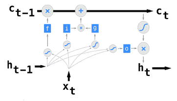

LSTM:基本细胞结构(来源:https://ayearofai . com/rohan-Lenny-3-recurrent-neural-networks-10300100899 b)

图*LSTM:**单元*中的选通函数显示了完整的 LSTM 单元，具有来自先前和当前时间步长的输入和隐藏状态。如此处所示，前面四个门的每一个都接收来自前一时间步的隐藏状态的输入以及来自当前时间步的输入。该单元的输出被传递到当前时间步长的隐藏状态，并结转到下一个 LSTM 单元。图*端到端 LSTM 网络*直观地描述了这种连接。

如此处所示，每个 LSTM 细胞在所有时间步长上充当输入神经元和隐藏神经元之间的独立单元。这些细胞中的每一个都使用双通道通信机制跨时间步长连接，该机制共享 LSTM 细胞输出以及跨不同时间步长的隐藏神经元激活:

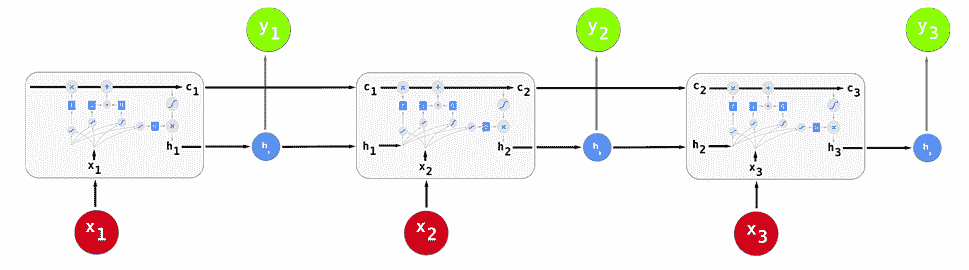

端到端 LSTM 网络(来源:https://ayearofai . com/rohan-Lenny-3-recurrent-neural-networks-10300100899 b)


# 用 tensorflow 实现 LSTM

在本节中，我们将看一个在 TensorFlow 中使用 LSTM 进行情感分类的例子。LSTM 的输入将是一个句子或单词序列。LSTM 的输出将是一个二进制值，用 1 表示积极情绪，用 0 表示消极情绪。对于这个问题，我们将使用多对一 LSTM 架构，因为它将多个输入映射到单个输出。图 *LSTM:基本单元架构*更详细地展示了这种架构。如此处所示，输入接受一系列单词标记(在本例中，是一系列三个单词)。每个单词标记在新的时间步长输入，并在相应的时间步长输入到隐藏状态。

例如，在时间步 *t* 输入单词 B *ook* 并输入隐藏状态*h[t]:*

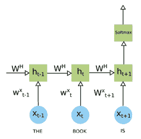

使用 LSTM 的情感分析

要在 TensorFlow 中实现该模型，我们需要首先定义如下几个变量:

```py
batch_size = 4
lstm_units = 16
num_classes = 2
max_sequence_length = 4
embedding_dimension = 64
num_iterations = 1000
```

如前所示，`batch_size`决定了我们可以在一批训练中输入多少个记号序列。`lstm_units`代表网络中 LSTM 细胞的总数。`max_sequence_length`表示给定序列的最大可能长度。定义后，我们现在开始初始化输入数据的 TensorFlow 特定数据结构，如下所示:

```py
import tensorflow as tf

labels = tf.placeholder(tf.float32, [batch_size, num_classes])
raw_data = tf.placeholder(tf.int32, [batch_size, max_sequence_length])
```

假设我们正在使用单词标记，我们希望使用一种好的特征表示技术来表示它们。我们建议使用第五章、 *NLP 向量表示*中的词嵌入技术来完成这项任务。让我们假设词嵌入表示取一个单词标记，并将其投影到维度为`embedding_dimension`的嵌入空间上。包含原始单词标记的二维输入数据现在被转换成三维单词张量，其中增加的维度表示词嵌入。我们还使用预先计算的词嵌入，存储在一个`word_vectors`数据结构中。我们如下初始化数据结构:

```py
data = tf.Variable(tf.zeros([batch_size, max_sequence_length,  
  embedding_dimension]),dtype=tf.float32)
data = tf.nn.embedding_lookup(word_vectors,raw_data)
```

既然输入数据已经准备好了，我们就来定义 LSTM 模型。如前所示，我们需要创建一个基本 LSTM 单元的`lstm_units`。因为我们需要在最后执行分类，所以我们用 dropout 包装器包装 LSTM 单元。为了在定义的网络上执行数据的完整时间传递，我们使用 TensorFlow 的`dynamic_rnn`例程展开 LSTM。我们还初始化一个随机权重矩阵和一个常量值`0.1`作为偏置向量，如下所示:

```py
weight = tf.Variable(tf.truncated_normal([lstm_units, num_classes]))
bias = tf.Variable(tf.constant(0.1, shape=[num_classes]))
lstm_cell = tf.contrib.rnn.BasicLSTMCell(lstm_units)
wrapped_lstm_cell = tf.contrib.rnn.DropoutWrapper(cell=lstm_cell,                           
    output_keep_prob=0.8)
output, state = tf.nn.dynamic_rnn(wrapped_lstm_cell, data,  
    dtype=tf.float32)
```

一旦由动态展开的 RNN 生成输出，我们转置其形状，将其乘以权重向量，并向其添加偏置向量以计算最终预测值:

```py
output = tf.transpose(output, [1, 0, 2])
last = tf.gather(output, int(output.get_shape()[0]) - 1)
prediction = (tf.matmul(last, weight) + bias)
weight = tf.cast(weight, tf.float64)
last = tf.cast(last, tf.float64)
bias = tf.cast(bias, tf.float64)
```

由于初始预测需要改进，我们定义一个具有交叉熵的目标函数来最小化损失，如下所示:

```py
loss = tf.reduce_mean(tf.nn.softmax_cross_entropy_with_logits
                      (logits=prediction, labels=labels))
optimizer = tf.train.AdamOptimizer().minimize(loss)
```

在这一系列步骤之后，我们有了一个训练有素的端到端 LSTM 网络，用于任意长度句子的情感分类。


# 应用程序

今天，RNNs(例如，LSTM)已被用于各种不同的应用，从时间序列数据建模，图像分类，视频字幕，以及文本分析。在本节中，我们将介绍 RNNs 在解决不同自然语言理解问题中的一些重要应用。


# 语言建模

语言建模是自然语言理解的基本问题之一。**(**)。语言模型的核心思想是对给定语言中单词的重要分布属性进行建模。一旦这样的模型被学习，它可以被应用于新单词序列，以在给定学习的分布表示的情况下生成最可能的下一个单词标记。更正式地说，语言模型如下计算单词序列的联合概率:****

****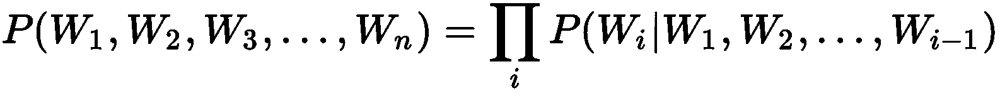

估计这个概率在计算上是昂贵的，因此存在许多估计技术，这些技术对单词标记的时间范围依赖性做出某些假设。其中一些如下:

*   **Unigram 模型**:假设每个单词令牌独立于其前后的单词序列；

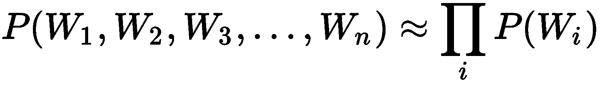

*   **二元模型**:假设每个单词标记只依赖于它前面的单词标记:

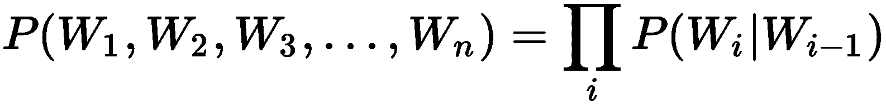

我们可以通过使用基于 LSTM 的网络来有效地解决语言模型估计问题。下图说明了一个特定的体系结构，它估计了一个三个字母的语言模型。如此处所示，我们采用一个多对多 LSTM，将整个句子分块到一个运行窗口中，每个窗口由三个单词组成。例如，我们假设一个训练句子是:【**什么**，**是**，**问题**，**问题**。第一个输入序列是:[ **什么**，**是**，**是**，输出是[ **是**，**是**，**问题**:

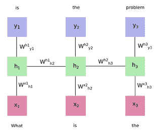

传统 LSTM 语言建模


# 序列标签

序列标记可以理解为一个问题，其中模型看到一个单词序列或序列中每个单词的标记，并且期望它发出一个标签。换句话说，期望模型用来自已知标签字典的适当标签来标记整个记号序列。序列标记在自然语言理解中有一些非常有趣的应用，例如命名实体识别、词性标记等等:

*   **命名实体识别** : 也称为 **NER** ，命名实体识别是一种信息抽取技术，旨在识别给定序列的文本标记(例如单词)中的命名实体。一些常见的命名实体包括人员、位置、组织、货币等。例如，当您向 NER 系统输入一个序列 *IBM 在秘鲁开设了一个办事处*时，它可以识别出两个命名实体 *B-ORG* 和 *B-LOC，*的存在，并将它们分别标记为令牌 *IBM* 和*秘鲁*。
*   **词性标注**:词性标注又称词性标注，是一种信息抽取技术，旨在识别文本中的词性。一些常见的词类有 NN(名词，单数)，NNS(名词，复数)，NNPS(专有名词，单数)，VB(动词，基本形式)，CC(并列连词)，CD(基数)，等等:

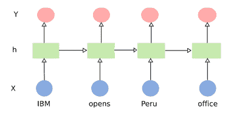

传统 LSTM 序列标签

如上图所示，*用传统 LSTM* 进行序列标记，可以用一个简单的 LSTM 来模拟这个问题。此图中需要注意的重要一点是，LSTM 只能利用以前的数据环境。例如，在时间 t 的隐藏状态中，LSTM 单元看到来自时间 t 的输入和来自时间 t-1 的隐藏状态的输出。在这种体系结构中，无法利用时间大于 t 的任何未来上下文。对于序列标记的任务，这是传统 LSTM 模型的一个强有力的限制。

为了解决这个问题，提出了双向 LSTM 或 B-lstm。双向 LSTM 的核心思想是有两个 LSTM 层，一个在向前方向，另一个在向后方向。通过这一设计更改，您现在可以组合来自两个方向的信息来获得以前的上下文(向前的 LSTM)和将来的上下文(向后的 LSTM)。图*使用传统 LSTM* 的语言建模更详细地展示了这种设计。b-lstm 是目前用于序列标记任务的最流行的 LSTM 变体之一:

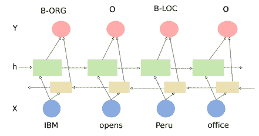

用双向 LSTM 进行序列标记

为了在 TensorFlow 中实现 B-LSTM，我们定义了两个 LSTM 层，一个用于正向，一个用于反向，如下所示:

```py
lstm_cell_fw = tf.contrib.rnn.BasicLSTMCell(lstm_units)
lstm_cell_bw = tf.contrib.rnn.BasicLSTMCell(lstm_units)
```

在前面的实现中，我们使用动态 RNN 展开 LSTM。TensorFlow 为双向 LSTM 提供了一个类似的例程，我们可以按如下方式使用:

```py
(output_fw, output_bw), state = tf.nn.bidirectional_dynamic_rnn(lstm_cell_fw,lstm_cell_bw, data,  
  dtype=tf.float32)
context_rep = tf.concat([output_fw, output_bw], axis=-1)
context_rep_flat = tf.reshape(context_rep, [-1, 2*lstm_units])
```

现在，我们像以前一样初始化权重和偏置(注意，`weight`的数量是以前的两倍，LSTM 的每个方向层一个):

```py
weight = tf.Variable(tf.truncated_normal([2*lstm_units, num_classes]))
bias = tf.Variable(tf.constant(0.1, shape=[num_classes]))
```

现在，您可以基于权重的当前值生成预测，并计算损失值。在前面的例子中，我们计算了交叉熵损失。对于序列标记，具有基于**条件随机场** ( **CRF** )的损失函数通常是有用的。您可以如下定义这些损失函数:

```py
prediction = tf.matmul(context_rep_flat, weight) + bias
scores = tf.reshape(prediction, [-1, max_sequence_length, num_classes])
log_likelihood, transition_params = tf.contrib.crf.crf_log_likelihood(
    scores, labels, sequence_lengths)
loss_crf = tf.reduce_mean(-log_likelihood)
```

该模型现在可以训练如下:

```py
optimizer = tf.train.AdamOptimizer().minimize(loss_crf)
```


# 机器翻译

机器翻译是 NLU 最近的成功故事之一。这个问题的目标是将源语言(如英语)中的一个文本句子转换成给定目标语言(如西班牙语)中的同一个句子。解决这个问题的传统方法依赖于使用基于短语的模型。这些模型通常将句子分成更短的短语，并将这些短语逐一翻译成目标语言短语。

尽管短语层面的翻译相当不错，但当你将这些翻译的短语组合成目标语言来生成一个完整的翻译句子时，你会发现偶尔会出现不连贯，或者*不流畅*。为了避免基于短语的机器翻译模型的这种限制，提出了**神经机器翻译** ( **NMT** )技术，其利用 RNN 的变体来解决这个问题:

Neural machine translation core idea (Source: https://github.com/tensorflow/nmt)

NMT 的核心思想可以在图*神经机器翻译核心思想*中描述。它由两部分组成:(a) **编码器**和(b) **解码器**。

编码器的作用是获取源语言中的句子，并将其转换为向量表示(也称为**思想向量**)，该向量表示捕获句子的整体语义和含义。这个向量表示然后被输入到解码器，解码器然后将其解码成目标语言句子。如您所见，这个问题非常适合多对多的 RNN 架构。在前面的序列标记应用示例中，我们引入了 B-LSTM 的概念，它可以将输入序列映射到一组输出标记。即使 B-LSTM 也不能将输入序列映射到输出序列。因此，为了用 RNN 架构解决这个问题，我们引入了 RNN 的另一个变体，也称为 ***Seq2Seq*** 模型。

图*具有 Seq2Seq 模型的神经机器翻译架构*描述了应用于 NMT 任务的 Seq2Seq 模型的核心架构:

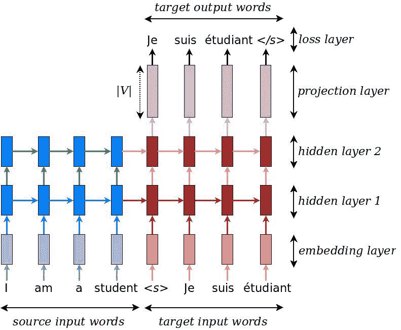

具有 Seq2Seq 模型的神经机器翻译架构(来源:https://github.com/tensorflow/nmt)

一个 Seq2Seq 模型，如图*seq 2 seq 模型的神经机器翻译架构*本质上由两组 rnn 组成，编码器和解码器。这些 rnn 中的每一个可以由单向 LSTM 或双向 LSTM 组成，可以由多个隐藏层组成，并且可以使用 LSTM 或 GRU 作为其基本单元类型。如图所示，编码器 RNN(如左图所示)将源单词作为其输入，并将其投射到两个隐藏层上。这两个隐藏层在时间步长上移动时，调用解码器 RNN(如右图所示)并将输出投影到投影和损失层上，以生成目标语言中最有可能的候选单词。

为了在 TensorFlow 中实现 Seq2Seq，我们为编码和解码定义了一个简单的 LSTM 单元，并用动态 RNN 模块展开编码器，如下所示:

```py
lstm_cell_encoder = tf.nn.rnn_cell.BasicLSTMCell(lstm_units) lstm_cell_decoder = tf.nn.rnn_cell.BasicLSTMCell(lstm_units) encoder_outputs, encoder_state = tf.nn.dynamic_rnn( lstm_cell_encoder, encoder_data, sequence_length=max_sequence_length, time_major=True)
```

如果您想在此步骤中使用双向 LSTM，您可以按如下方式操作:

```py
lstm_cell_fw = tf.contrib.rnn.BasicLSTMCell(lstm_units)
lstm_cell_bw = tf.contrib.rnn.BasicLSTMCell(lstm_units)
bi_outputs, 
encoder_state = tf.nn.bidirectional_dynamic_rnn(lstm_cell_fw,
                                                lstm_cell_bw, 
                                                encoder_data, 
                                                sequence_length=
                                                max_sequence_length, 
                                                time_major=True)
encoder_outputs = tf.concat(bi_outputs, -1)
```

现在我们需要执行一个解码步骤来生成目标语言中最可能的候选单词(假设)。对于这一步，TensorFlow 在 Seq2Seq 模块下提供了一个`dynamic_decoder`函数。我们如下使用它:

```py
training_helper = tf.contrib.seq2seq.TrainingHelper(decoder_data,  
  decoder_lengths, time_major=True)
projection_layer = tf.python.layers.core.Dense(target_vocabulary_size)
decoder = tf.contrib.seq2seq.BasicDecoder(decoder_cell,  
  training_helper, encoder_state, output_layer=projection_layer)
outputs, state = tf.contrib.seq2seq.dynamic_decode(decoder)
logits = outputs.rnn_output
```

最后，我们定义一个损失函数并训练该模型以最小化损失:

```py
loss =  
tf.reduce_sum(tf.nn.softmax_cross_entropy_with_logits(logits=prediction, 
  labels=labels))
optimizer = tf.train.AdamOptimizer().minimize(loss)
```


# Seq2Seq 推理

在推理阶段，经过训练的 Seq2Seq 模型得到一个源句子。它用这个来获得一个用于初始化解码器的`encoder_state`。解码器一收到特殊符号 **< s >** 就开始翻译过程，表示解码过程开始。

解码器 RNN 现在为当前时间步长运行，并计算由`projection_layer`定义的目标词汇表中所有单词的概率分布。它现在采用一种贪婪策略，从这个分布中选择最可能的单词，并将其作为下一个时间步的目标输入单词。这个过程现在重复另一个时间步长，直到解码器 RNN 选择一个特殊符号 **< /s >** ，这标志着翻译的结束。图*对 Seq2Seq 模型进行贪婪搜索的神经机器翻译解码*用一个例子说明了这种贪婪搜索技术:

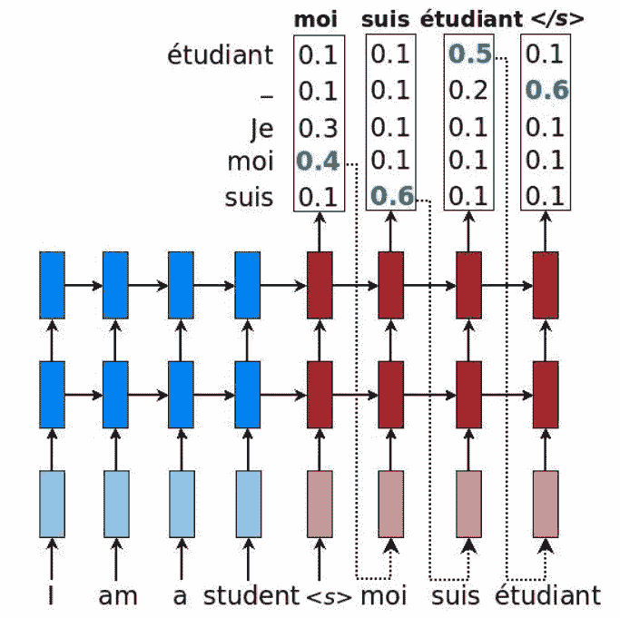

Seq2Seq 模型上贪婪搜索的神经机器翻译解码(来源:https://github.com/tensorflow/nmt)

为了在 TensorFlow 中实现这种贪婪搜索策略，我们使用 Seq2Seq 模块中的`GreedyEmbeddingHelper`函数，如下所示:

```py
helper = tf.contrib.seq2seq.GreedyEmbeddingHelper(decoder_data,
  tf.fill([batch_size], "<s>"), "</s>")
decoder = tf.contrib.seq2seq.BasicDecoder(
  decoder_cell, helper, encoder_state,
  output_layer=projection_layer)
# Dynamic decoding
num_iterations = tf.round(tf.reduce_max(max_sequence_length) * 2)
outputs, _ = tf.contrib.seq2seq.dynamic_decode(
  decoder, maximum_iterations=num_iterations)
translations = outputs.sample_id
```


# 聊天机器人

聊天机器人是非常适合 RNN 模型的应用程序的另一个例子。图*使用传统 LSTM 的序列标记*显示了一个使用 Seq2Seq 模型构建的聊天机器人应用程序的示例，这在上一节中已有描述。聊天机器人可以被理解为机器翻译的一个特例，其中目标语言被替换为聊天机器人知识库中每个可能问题的响应词汇:

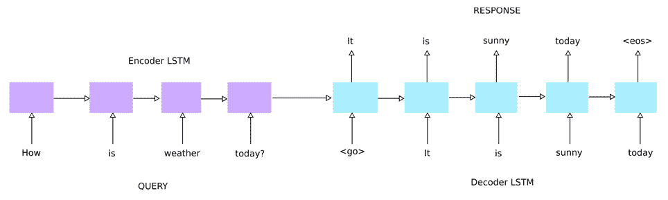

Seq2Seq LSTM 聊天机器人


# 摘要

在本章中，我们介绍了一些用于理解文本的核心深度学习模型。我们描述了文本数据顺序建模背后的核心概念，以及什么样的网络架构更适合这种类型的数据处理。我们介绍了循环神经网络(RNN)的基本概念，并说明了它们在实践中难以训练的原因。我们将 LSTM 描述为 RNN 的一种实际形式，并用 TensorFlow 描述了它们的实现。最后，我们讨论了许多自然语言理解应用程序，这些应用程序可以从各种 RNN 架构的应用程序中受益。

在下一章，第 7 章，我们将看看深度学习技术如何应用于涉及 NLP 和图像的任务。****