# 一、PyTorch 简介

这是使用 PyTorch 框架对深度学习的逐步介绍。PyTorch 是深入学习的一个很好的切入点，如果你对 Python 有所了解，你会发现 PyTorch 是一种直观、高效和有启发性的体验。快速原型实验和测试想法的能力是 PyTorch 的核心优势。再加上能够将实验转化为多产的、可部署的资源的可能性，学习曲线挑战获得了丰厚的回报。

PyTorch 是理解深度学习概念的一种相对容易和有趣的方式。您可能会对解决常见的分类问题(如手写识别和图像分类)只需要几行代码感到惊讶。虽然说 PyTorch 很简单，但是深度学习在很多方面都很难，这是不争的事实。它涉及一些复杂的数学和一些棘手的逻辑难题。然而，这不应该分散对这项事业的乐趣和有用部分的注意力。毫无疑问，机器学习可以提供深刻的见解，解决我们周围世界的重要问题，但要实现这一点可能需要一些工作。

这本书是一种尝试，不是为了掩饰重要的观点，而是用一种没有术语的简洁的方式来解释它们。如果解复杂的微分方程的想法让你出一身冷汗，你并不孤单。这可能与一些高中创伤有关，一个坏脾气的数学老师愤怒地要求你引用欧拉公式或三角恒等式。这是一个问题，因为数学本身应该是有趣的，洞察力不是来自公式的费力记忆，而是通过理解关系和基本概念产生的。

另一个可能使深度学习显得困难的事情是，它具有多样化和动态的研究前沿。这可能会让新手感到困惑，因为它没有提供一个明显的入口点。如果你理解了一些原则，并想测试你的想法，找到一套合适的工具可能是一项令人困惑的任务。开发语言、框架、部署架构等等的组合，呈现了一个重要的决策过程。

机器学习的科学已经成熟到出现了一套用于解决诸如散列分类和回归等问题的通用算法的程度。随后，一些框架被创建来利用这些算法的能力，并使用它们来解决一般的问题。这意味着进入点处于这样一个水平，即这些技术现在掌握在非计算机科学专业人员的手中。不同领域的专家现在可以使用这些想法来推进他们的努力。到本书结束时，加上一点点奉献，你将能够构建和部署有用的深度学习模型，以帮助解决你感兴趣的问题。

在本章中，我们将讨论以下主题:

*   PyTorch 是什么？
*   安装 PyTorch
*   基本操作
*   加载数据


# PyTorch 是什么？

PyTorch 是一个基于动态张量的深度学习框架，用于实验、研究和生产。它可以用作 NumPy 的 GPU 支持的替代物，或者用于构建神经网络的灵活、高效的平台。动态图形创建和紧密的 Python 集成使 PyTorch 成为深度学习框架中的佼佼者。

如果你对深度学习生态系统非常熟悉，那么像 Theano 和 TensorFlow 这样的框架，或者像 Keras 这样的高级衍生品，都是最受欢迎的。PyTorch 是深度学习框架集的相对新人。尽管如此，它现在被谷歌、推特和脸书广泛使用。它从其他框架中脱颖而出，因为 Theano 和 TensorFlow 都在静态结构中编码计算图，需要在自包含会话中运行。相比之下，PyTorch 可以动态实现计算图。神经网络的结果是，网络可以在运行时改变行为，而只需很少或不需要开销。在 TensorFlow 和 Theano 中，要改变行为，你必须有效地从头开始重建网络。

这种动态实现是通过一个称为基于磁带的 auto-diif 的过程实现的，它允许 PyTorch 表达式被自动区分。这有许多优点。梯度可以在运行中计算，由于计算图是动态的，它可以在每次函数调用时改变，允许它以有趣的方式用于循环和条件调用中，例如，可以响应输入参数或中间结果。这种动态行为和巨大的灵活性使 PyTorch 成为深度学习的首选实验平台。

PyTorch 的另一个优势是它与 Python 语言紧密集成。对于 Python 编码人员来说，它非常直观，并且可以与其他 Python 包无缝互操作，比如 NumPy 和 SciPy。PyTorch 很容易实验。它不仅是构建和运行有用模型的理想工具，也是通过直接实验理解深度学习原理的一种方式。

如你所料，PyTorch 可以在多个**图形处理单元**(**GPU**)上运行。深度学习算法在计算上可能很昂贵。对于大数据集来说尤其如此。PyTorch 拥有强大的 GPU 支持，进程间张量智能内存共享。这基本上意味着有一种高效且用户友好的方式来在 CPU 和 GPU 之间分配处理负载。这对测试和运行大型复杂模型的时间有很大的影响。

动态图形生成、紧密的 Python 语言集成和相对简单的 API 使得 PyTorch 成为研究和实验的优秀平台。然而，PyTorch 1 之前的版本存在缺陷，这使得它无法在生产环境中表现出色。PyTorch 1 正在解决这一缺陷。

研究是深度学习的一个重要应用，但越来越多的深度学习被嵌入到在网络、设备或机器人上实时运行的应用中。这样的应用程序可以同时处理数千个查询，并与大量动态数据进行交互。尽管 Python 是最适合人类使用的语言之一，但其他语言也有特定的效率和优化，最常见的是 C++和 Java。即使构建特定深度学习模型的最佳方式可能是使用 PyTorch，但这可能不是部署它的最佳方式。这不再是一个问题，因为现在有了 PyTorch 1，我们可以导出 PyTorch 模型的 Python 自由表示。

这是通过 PyTorch 的主要利益相关者脸书和微软之间的合作实现的，他们创建了**开放神经网络交换** ( **ONNX** )来帮助开发人员在框架之间转换神经网络模型。这导致了 PyTorch 与更适合生产的框架 CAFFE2 的合并。在 CAFFE2 中，模型由纯文本模式表示，这使得它们与语言无关。这意味着它们更容易部署到 Android、iOS 或 Rasberry Pi 设备上。

考虑到这一点，PyTorch 版本 1 扩展了其 API，包括生产就绪功能，例如优化 Android 和 iPhone 的代码，一个**just in time**(**JIT**)c++编译器，以及几种使 *Python 免费*表示您的模型的方法。

综上所述，PyTorch 具有以下特点:

*   动态图形表示
*   与 Python 编程语言紧密集成
*   高级和低级 API 的混合
*   在多个 GPU 上直接实现
*   能够构建用于导出和生产的*无 Python 的*模型表示
*   使用 Caffe 框架扩展到海量数据


# 安装 PyTorch

PyTorch 可以在 macOS X、64 位 Linux 和 64 位 Windows 上运行。请注意，Windows 目前不提供对 PyTorch 中使用 GPU 的(简单)支持。在安装 PyTorch 之前，您需要在计算机上安装 Python 2.7 或 Python 3.5 / 3.6，记住要为每个 Python 版本安装正确的版本。除非您有理由不安装，否则建议您安装 Python 的 Anaconda 发行版。这个这个可以从:[https://anaconda.org/anaconda/python](https://anaconda.org/anaconda/python)得到。

Anaconda 包括 PyTorch 的所有依赖项，以及对您的深度学习工作至关重要的技术、数学和科学库。整本书都会用到它们，所以除非你想单独安装它们，否则就安装 Anaconda。

以下是我们将在本书中使用的软件包和工具的列表。它们都安装了 Anaconda:

*   一个数学库，主要用于处理多维数组
*   一个绘图和可视化库
*   `SciPy`:科学和技术计算包
*   机器学习的图书馆
*   `Pandas`:用于处理数据的库
*   `IPython`:笔记本风格的代码编辑器，用于在浏览器中编写和运行代码

一旦安装了 Anaconda，现在就可以安装 PyTorch 了。在 https://pytorch.org/访问 PyTorch 网站。

这个网站上的安装矩阵非常简单明了。只需选择您的操作系统、Python 版本和 CUDA 版本(如果您有 GPU ),然后运行适当的命令。

和往常一样，在安装 PyTorch 之前，确保您的操作系统和依赖包是最新的，这是一个很好的做法。Anaconda 和 PyTorch 运行在 Windows、Linux 和 macOS 上，尽管 Linux 可能是最常用和最一致的操作系统。在本书中，我将使用运行在 Linux 上的 Python 3.7 和 Anaconda 3.6.5

本书中的代码写在 Jupyter 笔记本上，这些笔记本可以从本书的网站上获得。

您可以选择在您自己的机器上本地设置 PyTorch 环境，或者在云服务器上远程设置。它们各有利弊。在本地工作的好处是通常更容易和更快地开始工作。如果您不熟悉 SSH 和 Linux 终端，这一点尤其正确。只需安装 Anaconda 和 PyTorch，您就可以上路了。此外，您可以选择和控制自己的硬件，虽然这是一项前期成本，但从长远来看，它通常更便宜。一旦您开始扩大硬件需求，云解决方案就会变得非常昂贵。在本地工作的另一个好处是你可以选择和定制你的**集成开发环境** ( **IDE** )。事实上，Anaconda 有自己优秀的桌面 Spyder。

在构建自己的深度学习硬件时，有几件事需要记住，并且需要 GPU 加速:

*   使用兼容 NVIDIA CUDA 的 GPU(例如，GTX 1060 或 GTX 1080)
*   至少有 16 个 PCIe 通道的芯片组
*   至少 16 GB 的内存

在云上工作确实提供了在任何机器上工作的灵活性，并且更容易试验不同的操作系统、平台和硬件。您还可以更轻松地共享和协作。开始时通常很便宜，每月只需几美元，甚至免费，但随着项目变得越来越复杂和数据密集，您将需要为更多容量付费。

让我们简单看一下两个云服务器主机的安装过程:Digital Ocean 和 Amazon Web Services。


# 数字海洋

数字海洋为云计算提供了一个最简单的切入点。它提供了可预测的简单支付结构和简单的服务器管理。遗憾的是，数字海洋目前不支持 GPU。该功能围绕 d *roplets* ，虚拟专用服务器的预建实例。以下是设置 droplet 所需的步骤:

1.  注册一个数字海洋帐户。前往[https://www.digitalocean.com/.](https://www.digitalocean.com/)
2.  点击创建按钮，选择新建 Droplet **。**
3.  选择 Linux 的 Ubuntu 发行版，选择 2g 或以上的计划。
4.  如果需要，选择 CPU 优化。默认值应该可以开始使用。
5.  或者，设置公钥/私钥加密。
6.  使用发送给您的电子邮件中包含的信息设置 SSH 客户端(例如 PuTTY)。
7.  通过您的 SSH 客户端和最新的 Anaconda 安装程序`curl` 连接到您的 droplet。您可以在[https://repo.continuum.io/](https://repo.continuum.io/)找到适合您特定环境的安装程序的地址位置。
8.  使用以下命令安装 PyTorch:

```py
conda install pytorch torchvision -c pytorch
```

一旦您启动了 droplet，您就可以通过 SSH 客户端访问 Linux 命令。在命令提示符下，您可以从[https://www.anaconda.com/download/#linux](https://www.anaconda.com/download/#linux)获得最新的 Anaconda 安装程序。

安装脚本也可从 https://repo.continuum.io/archive/.的 continuum archive 获得。完整的分步说明可从数字海洋教程部分获得。


# 隧道连接到 IPython

IPython 是一种通过 web 浏览器编辑代码的简单方便的方法。如果你在台式电脑上工作，你只需启动 IPython，将浏览器指向`localhost:8888`。这是 IPython 服务器 Jupyter 运行的端口。但是，如果您在云服务器上工作，那么处理代码的一种常见方式是使用 SSH 隧道连接到 IPython。到 IPython 的隧道包括以下步骤:

1.  在您的 SSH 客户端中，将您的目的端口设置为`localhost:8888`。在 PuTTY 中，转到连接| SSH |隧道。
2.  将源端口设置为大于`8000`的任何值，以避免与其他服务冲突。单击添加。保存这些设置并打开连接。像往常一样登录您的 droplet。
3.  通过在服务器实例的命令提示符下键入`jupyter notebook`来启动 IPython 服务器。
4.  通过将浏览器指向`localhost: source port` *来访问 IPython*比如`localhost:8001`。
5.  启动 IPython 服务器。

请注意，您可能需要一个令牌来首次访问服务器。一旦启动 Jupyter，就可以从命令输出中获得这一点。您可以将此输出中给出的 URL 直接复制到浏览器的地址栏中，将端口地址更改为您的本地源端口地址，例如:`8001`，或者您可以选择将令牌(在`token=`之后的部分)粘贴到 Jupyter 启动页面中，并替换为密码，以方便将来使用。您现在应该能够打开、运行和保存 IPython 笔记本了。


# 亚马逊网络服务(AWS)

AWS 是最初的云计算平台，最著名的是其高度可扩展的架构。它提供了大量的产品。我们需要从 EC2 实例开始。这可以从 AWS 控制面板的服务选项卡中访问。从那里，选择 EC2，然后启动实例。从这里，您可以选择您需要的机器映像。AWS 提供了几种专门用于深度学习的机器图像。你可以随意试验其中的任何一个，但是我们这里要用的是 Ubuntu version 10 的深度学习 AMI。它附带了 PyTorch 和 TensorFlow 的预安装环境。选择此选项后，您可以选择其他选项。默认的 2 GB 内存的 T2 微处理器应该可以试验；然而，如果你想要 GPU 加速，你将需要使用 T2 中等实例类型。最后，当您启动实例时，系统会提示您创建并下载您的公钥-私钥对。然后，您可以使用 SSH 客户机连接到服务器实例，并按照前面的说明隧道连接到 Jupyter 笔记本。再次检查文档以获得更详细的信息。亚马逊有一个按资源付费的模式，所以重要的是你要监控你正在使用的资源，以确保你不会收到任何不必要的或意想不到的费用。


# 基本 PyTorch 操作

张量是 PyTorch 的主力。如果你懂线性代数，它们就相当于一个矩阵。火炬张量实际上是`numpy.array`对象的扩展。张量是深度学习系统中一个必不可少的概念组件，因此很好地理解它们是如何工作的非常重要。

在第一个例子中，我们将研究大小为 2 x 3 的张量。在 PyTorch 中，我们可以像创建 NumPy 数组一样创建张量。例如，我们可以向它们传递嵌套列表，如下面的代码所示:

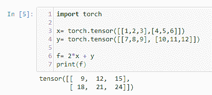

这里我们创建了两个张量，每个张量的维数都是 2 x 3。你可以看到我们创建了一个简单的线性函数(关于线性函数的更多内容在[第二章](fc03f00c-2991-4e13-af19-6afbf2eb6ded.xhtml)、*深度学习基础*)并将其应用于`x`和`y`并打印出结果。我们可以通过下图对此进行可视化:


从线性代数中你可能知道，矩阵的乘法和加法是逐元素进行的，所以对于 *x* 的第一个元素，我们把它写成*X[00]。这个乘以二加到 *y* 的第一个元素，写成 *Y [00]* ，给出 *F [00] = 9。X [01] = 2* 和 *Y [01] = 8 所以 f [01] = 4 + 12* 。请注意，索引从零开始。*

如果你从未看过任何线性代数，不要太担心这个，因为我们将在第二章、*深度学习基础*中复习这些概念，并且你将很快练习 Python 索引。现在，就把我们的 2 x 3 张量想象成有数字的表格。


# 默认值初始化

在很多情况下，我们需要将 torch 张量初始化为默认值。这里，我们创建三个 2 x 3 张量，用 0、1 和随机浮点数填充它们:

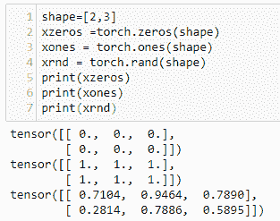

当我们初始化随机数组时，需要考虑的一个要点是所谓的可重复性种子。看看当您多次运行前面的代码时会发生什么。每次你都会得到一组不同的随机数。通常在机器学习中，我们需要能够重现结果。我们可以通过使用随机种子来实现这一点。下面的代码演示了这一点:


请注意，当您多次运行此代码时，张量值保持不变。如果您通过删除第一行来删除种子，那么每次运行代码时，张量值将会不同。使用什么数字作为随机数生成器的种子并不重要，只要它是一致的，就能获得可重复的结果。


# 张量和 NumPy 数组之间的转换

转换 NumPy 数组就像用 torch 张量对它执行操作一样简单。下面的代码应该可以说明这一点:

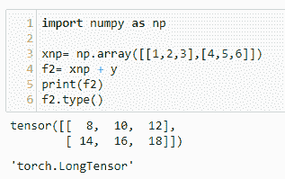

我们可以看到 torch 张量的结果。在许多情况下，我们可以将 NumPy 数组与张量互换使用，并始终确保结果是张量。然而，有时我们需要从数组中显式地创建一个张量。这是通过`torch.from_numpy`功能完成的:

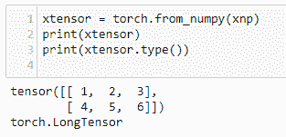

要从张量转换成 NumPy 数组，只需调用`torch.numpy()`函数:


注意，我们使用 Python 内置的`type()`函数，如在`type(object)`中，而不是我们之前使用的`tensor.type()`。NumPy 数组没有`type`属性。另一个需要理解的重要事情是 NumPy 数组和 PyTorch 张量共享相同的内存空间。例如，看看当我们更改变量值时会发生什么，如下面的代码所示:


还要注意，当我们打印一个张量时，它返回一个由张量本身及其`dtype`或数据类型属性组成的元组。这里很重要，因为有些`dtype`数组不能转化为张量。例如，考虑以下代码:


这将生成一条错误消息，告诉我们只有受支持的`dtype`才能转换成张量。显然，`int8`不是这些受支持的类型之一。我们可以通过将我们的`int8`数组转换为`int64`数组，然后将其传递给`torch.from_numpy`来解决这个问题。我们使用`numpy.astype`函数来实现这一点，如以下代码所示:


理解`numpy dtype`数组如何转换为 torch `dtype`也很重要。在前面的例子中，`numpy int32`转换为`IntTensor`。下表列出了火炬`dtype`及其等同物`numpy`:

| num py 型 | **数据类型** | **焊枪类型** | **描述** |
| `int64` | `torch.int64` `torch.float` | `LongTensor` | 64 位整数 |
| `int32` | `torch.int32` `torch.int` | `IntegerTensor` | 32 位有符号整数 |
| `uint8` | `torch.uint8` | `ByteTensor` | 8 位无符号整数 |
| `float64 double` | `torch.float64` `torch.double` | `DoubleTensor` | 64 位浮点 |
| `float32` | `torch.float32` `torch.float` | `FloatTensor` | 32 位浮点 |
|  | `torch.int16` `torch.short` | `ShortTensor` | 16 位有符号整数 |
|  | `torch.int8` | `CharTensor` | 6 位有符号整数 |

张量的默认`dtype`为`FloatTensor`；然而，我们可以通过使用张量的`dtype`属性来指定特定的数据类型。有关示例，请参见以下代码:


# 切片、索引和整形

`torch.Tensor`拥有 NumPy 的大部分属性和功能。例如，我们可以像 NumPy 数组一样对张量进行切片和索引:

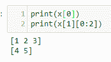

这里我们打印出了`x`的第一个元素，写成*x[0]T5，第二个例子中我们打印出了`x`的第二个元素的一个切片；在这种情况下，*x[11]T9*x[12]。***

如果您没有遇到过切片和索引，您可能想再看看这个。请注意，索引是从`0`开始的，而不是从`1`开始的，我们保留了与此一致的下标符号。还要注意，切片`[1][0:2]`是元素 *x [10]* 和 *x [11]* ，包括端点。它不包括切片中指定的结束索引，即索引`2`。

我们可以使用`view()`函数创建一个现有张量的重塑副本。以下是三个例子:

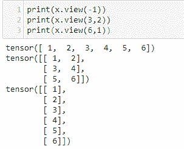

(`3`、`2`)和(`6`、`1`)做什么很清楚，但是第一个例子中的`–1`呢？如果您知道需要多少列，但不知道需要多少行，这将非常有用。这里指示`–1`是告诉 PyTorch 计算需要的行数。在没有其他维度的情况下使用它只会创建一个单行张量。如果您不知道输入张量的形状，但知道它需要有三行，您可以重写前面提到的示例二，如下所示:

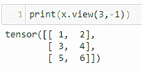

一个重要的操作是交换轴或换位。对于一个二维张量，我们 a 可以使用`tensor.transpose()`，传递给它我们想要转置的轴。在这个例子中，原来的 2 x 3 张量变成了 3 x 2 张量。行只是变成了列:

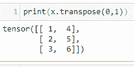

在 PyTorch 中，`transpose()`一次只能交换两个轴。我们可以在多个步骤中使用`transpose`;然而，更方便的方法是使用`permute()`，向它传递我们想要交换的轴。下面的例子应该可以说明这一点:


当我们考虑二维张量时，我们可以把它们想象成平板。当我们移动到更高维度时，这种视觉表现就变得不可能了。我们只是耗尽了空间维度。深度学习的神奇之处在于，就所涉及的数学而言，它并不重要。现实世界的每个特征都被编码到数据结构的一个维度中。所以，我们可能在处理潜在的几千维的张量。虽然这可能会令人不安，但大多数可以在二维或三维空间中展示的想法在更高维空间中同样适用。


# 就地操作

理解就地操作和分配操作之间的区别很重要。例如，当我们使用`transpose(x)`时，会返回一个值，但`x`的值不会改变。在到目前为止的所有例子中，我们都是通过赋值来执行操作的。也就是说，我们已经将一个变量赋给了一个运算的结果，或者只是将它打印到输出中，就像前面的例子一样。在任一情况下，原始变量保持不变。或者，我们可能需要在适当的位置应用一个操作。当然，我们可以给变量本身赋值，比如在`x = x.transpose(0,1)`；然而，更方便的方法是就地操作。通常，PyTorch 中的就地操作有一个尾随下划线。有关示例，请参见以下代码:

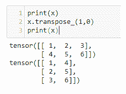

作为另一个例子，这是我们在本章开始时对`y`使用就地操作的线性函数:

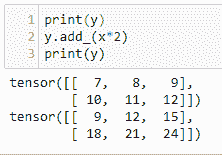

# 加载数据

你将花在深度学习项目上的大部分时间将用于处理数据，深度学习项目失败的主要原因之一是因为糟糕的或理解不佳的数据。当我们使用众所周知且构造良好的数据集时，这个问题经常被忽略。这里的重点是学习模型。让深度学习模型工作的算法本身就足够复杂，而这种复杂性不会因某些仅部分已知的东西(如不熟悉的数据集)而加剧。真实世界的数据是嘈杂的、不完整的，并且容易出错。这些混杂轴意味着，如果深度学习算法没有给出合理的结果，在代码中的逻辑错误被消除后，坏数据或我们对数据的理解错误可能是罪魁祸首。

因此，抛开我们与数据的角力，并理解深度学习可以提供有价值的现实世界见解，我们如何学习深度学习？我们的出发点是尽可能多地消除变量。这可以通过使用众所周知的代表特定问题的数据来实现；比如说，分类。这使得我们既有了深度学习任务的起点，也有了检验模型想法的标准。

最著名的数据集之一是手写数字的 MNIST 数据集，其中通常的任务是正确地分类每个数字，从 0 到 9。最好的模型误差率在 0.2%左右。我们可以将这个表现良好的模型稍加调整，应用到任何视觉分类任务中，得到不同的结果。我们不太可能得到接近 0.2%的结果，原因是数据不同。理解如何 tweek 深度学习模型以考虑这些有时细微的数据差异，是成功的深度学习实践者的关键技能之一。

考虑从彩色照片进行面部识别的图像分类任务。任务仍然是分类，但是数据类型和结构的不同决定了模型需要如何改变来考虑这一点。如何做到这一点是机器学习的核心。例如，如果我们处理彩色图像，而不是黑白图像，我们将需要两个额外的输入通道。我们还需要每个可能的类的输出通道。在一个笔迹分类任务中，我们需要 10 个输出通道；每个数字一个通道。对于面部识别任务，我们会考虑为每个目标面部设置一个输出通道(比如，警察数据库中的罪犯)。

显然，一个重要的考虑因素是数据类型和结构。图像数据在图像中的组织方式与音频信号或医疗设备的输出方式有很大不同。如果我们试图根据人们的声音对他们的名字进行分类，或者根据症状对疾病进行分类，会怎么样呢？都是分类任务；然而，在每一个特定的案例中，代表每一个的模型将会有很大的不同。为了在每种情况下建立合适的模型，我们需要非常熟悉我们正在使用的数据。

讨论每种数据类型、格式和结构的细微差别已经超出了本书的范围。我们能做的是让您对 PyTorch 中数据处理的工具、技术和最佳实践有一个简单的了解。深度学习数据集通常非常大，了解它们在内存中的处理方式是一个重要的考虑因素。在将数据输入模型之前，我们需要能够转换数据、批量输出数据、混洗数据以及对数据执行许多其他操作。我们需要能够在不将整个数据集加载到内存中的情况下完成所有这些事情，因为许多数据集实在是太大了。PyTorch 在处理数据时采用对象方法，为每个特定的活动创建类对象。我们将在接下来的章节中对此进行更详细的研究。


# PyTorch 数据集加载器

Pytorch 包括几个数据集的数据加载器，可以帮助您入门。`torch.dataloader`是用于加载数据集的类。以下是包含的 torch 数据集列表和简要说明:

| 赔偿 | 手写数字 1–9。手写字符 NIST 数据集的子集。包含 60，000 个测试图像的训练集和 10，000 个测试集。 |
| **时尚- MNIST** | MNIST 的嵌入式数据集。包含时尚物品的图像；比如 t 恤，裤子，套头衫。 |
| **EMNIST** | 基于 NIST 手写字符，包括字母和数字，并拆分为 47、26 和 10 类分类问题。 |
| **可可** | 超过 100，000 张图片被分类为日常物品；例如，人、背包和自行车。每个图像可以有多个类别。 |
| **祝你好运** | 用于图像的大规模场景分类；比如卧室，桥，教堂。 |
| **Imagenet-12** | 包含 120 万幅图像和 1，000 个类别的大规模视觉识别数据集。用`ImageFolder`类实现，其中每个类都在一个文件夹中。 |
| **CIFAR** | 60，000 幅低分辨率(32 32)彩色图像，分 10 个互斥类；例如，飞机、卡车和汽车。 |
| **STL10** | 类似于 CIFAR，但具有更高的分辨率和更大数量的未标记图像。 |
| **SVHN** | 从谷歌街景获取的 60 万张街道号图片。用于现实世界设置中的数字识别。 |
| **摄影图** | 学习局部图像描述符。由 126 个补丁组成的灰度图像和描述符文本文件组成。用于模式识别。 |

下面是我们如何将这些数据集加载到 PyTorch 中的典型示例:

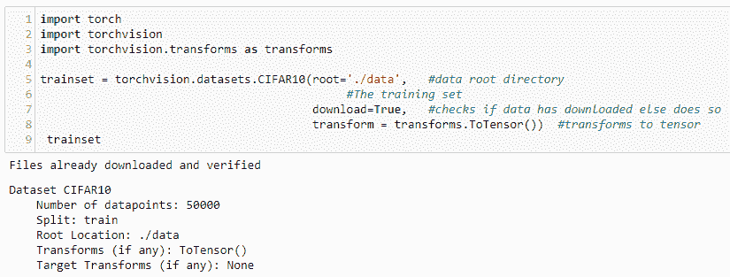

`CIFAR10`是一个`torch.utils.dataset`对象。在这里，我们传递给它四个参数。我们指定一个相对于代码运行位置的根目录，一个布尔值，`train`，表明我们是否希望加载测试或训练集，一个布尔值，如果设置为`True`，将检查数据集是否已经下载，如果没有下载，以及一个可调用的转换。在这种情况下，我们选择的转换是`ToTensor()`。这是一个内置的`torchvision.transforms`类，它使这个类返回一个张量。我们将在本章后面更详细地讨论转换。

数据集的内容可以通过简单的索引查找来检索。我们还可以用`len`函数检查整个数据集的长度。我们还可以按顺序遍历数据集。下面的代码演示了这一点:


# 显示图像

`CIFAR10` dataset 对象返回一个元组，其中包含一个图像对象和一个表示图像标签的数字。从图像数据的大小可以看出，每个样本都是一个 3 x 32 x 32 的张量，代表图像中 322 个像素中每个像素的三个颜色值。重要的是要知道这与用于`matplotlib`的格式并不完全相同。张量以`[color, height, width]`的格式处理图像，而`numpy`图像以`[height, width, color]`的格式处理。为了绘制图像，我们需要使用`permute()`函数交换轴，或者使用`transpose`函数将其转换为 NumPy 数组。注意，我们不需要将图像转换成 NumPy 数组，因为`matplotlib`将显示正确排列的张量。下面的代码应该可以说明这一点:


# 资料载入器

我们将看到，在深度学习模型中，我们可能不总是希望一次加载一个图像，或者每次都以相同的顺序加载图像。出于这个以及其他原因，使用`torch.utils.data.DataLoader`对象通常更好。`DataLoader`提供了一个多用途的迭代器，以特定的方式对数据进行采样，比如批量采样或者混洗。这也是在多处理器环境中分配工作人员的一个方便的地方。

在以下示例中，我们分批对数据集进行采样，每批四个样本:


这里`DataLoader`返回两个张量的元组。第一个张量包含该批中所有四个图像的图像数据。第二个张量是图像标签。每批由四个图像标签、图像对或样本组成。在迭代器上调用`next()`会生成下一组四个样本。在机器学习术语中，对整个数据集的每一遍都被称为一个时期。这种技术被广泛使用，正如我们将看到的训练和测试深度学习模型。


# 创建自定义数据集

`Dataset`类是表示数据集的抽象类。其目的是以一致的方式表示数据集的具体特征。当我们处理不熟悉的数据集时，创建一个`Dataset`对象是理解和表示数据结构的好方法。它和一个`data loader`类一起使用，以一种干净有效的方式从数据集中抽取样本。下图说明了如何使用这些类:

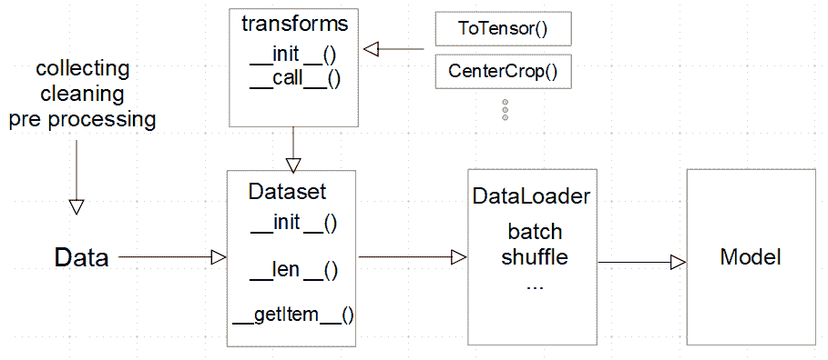

我们使用`Dataset`类执行的常见操作包括检查数据的一致性、应用转换方法、将数据分成训练集和测试集，以及加载单个样本。

在下面的例子中，我们使用了一个小的玩具数据集，它由被分类为玩具或非玩具的物体的图像组成。这是一个简单的图像分类问题的代表，其中模型是在一组标记图像上训练的。深度学习模型将需要以一致的方式应用各种转换的数据。可能需要分批抽取样本，并对数据集进行洗牌。拥有一个用于表示这些数据任务的框架，可以极大地简化和增强深度学习模型。

完整的数据集可从 http://www . vision . Caltech . edu/PMO reles/Datasets/Giuseppe _ Toys _ 03/获得。

对于这个例子，我创建了一个更小的数据集子集，以及一个`labels.csv`文件。这可以在本书的 GitHub 资源库的`data/GiuseppeToys`文件夹中找到。表示该数据集的类如下:

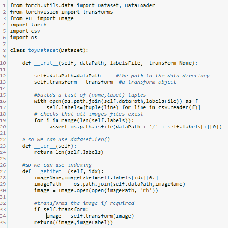

`__init__`函数是我们初始化类的所有属性的地方。因为它只在我们第一次创建实例来做所有事情时被调用一次，所以我们执行所有的内务处理功能，例如读取 CSV 文件、设置变量和检查数据的一致性。我们只执行发生在整个数据集上的操作，所以我们不下载有效负载(在本例中是一个图像)，但我们确保关于数据集的关键信息，如目录路径、文件名和数据集标签，都存储在变量中。

`__len__`函数只允许我们在数据集上调用 Python 的内置`len()`函数。这里，我们简单地返回标签元组列表的长度，指示数据集中图像的数量。我们希望确保它尽可能简单可靠，因为我们依赖它来正确地遍历数据集。

`__getitem__`函数是一个内置的 Python 函数，我们在`Dataset`类定义中覆盖了它。这给了`Dataset`类 Python 序列类型的功能，比如使用索引和切片。这个方法经常被调用——每次我们做索引查找时——所以要确保它只做检索样本所需要做的事情。

为了在我们自己的数据集中利用这一功能，我们需要创建一个自定义数据集的实例，如下所示:


# 转换

除了`ToTensor()`转换之外，`torchvision`包还包括许多专门针对 Python 图像库图像的转换。我们可以使用`compose`函数将多个转换应用到数据集对象，如下所示:


合成对象本质上是一个转换列表，然后可以作为单个变量传递给数据集。重要的是要注意，图像变换只能应用于 PIL 图像数据，而不能应用于张量。由于合成中的转换是按照它们被列出的顺序来应用的，所以`ToTensor`转换最后出现是很重要的。如果它被放在`Compose`列表中的 PIL 变换之前，将会产生一个错误。

最后，我们可以通过使用`DataLoader`加载一批带有变换的图像来检查它是否工作正常，就像我们之前做的那样:


# 图像文件夹

我们可以看到 dataset 对象的主要作用是从一个数据集中取一个样本，`DataLoader`的作用是将一个样本，或者一批样本，交付给深度学习模型进行评估。在编写我们自己的数据集对象时，要考虑的一个主要问题是，我们如何从磁盘上文件中组织的数据在可访问的内存中构建一个数据结构。我们可能希望组织数据的一种常见方式是在按类命名的文件夹中。比方说，在这个例子中，我们有三个名为`toy`、`notoy`和`scenes`的文件夹，包含在父文件夹`images`中。这些文件夹中的每一个都代表其中包含的文件的标签。我们需要能够加载它们，同时将它们保留为单独的标签。令人高兴的是，这有一个类，像 PyTorch 中的大多数东西一样，它非常容易使用。类别为`torchvision.datasets.ImageFolder`，其用法如下:


在`data/GiuseppeToys/images`文件夹中，有三个文件夹，`toys`、`notoys`和`scenes`，包含图像，它们的文件夹名称表示标签。注意，使用`DataLoader`检索到的标签由整数表示。因为在这个例子中，我们有三个文件夹，代表三个标签，`DataLoader`返回整数`1`到`3`，代表图像标签。


# 串联数据集

很明显，将会出现连接数据集的需求——我们可以用`torch.utils.data.ConcatDataset`类来实现。`ConcatDataset`获取数据集列表并返回串联数据集。在下面的例子中，我们添加了两个转换，删除了蓝色和绿色通道。然后，我们再创建两个 dataset 对象，应用这些转换，最后将三个数据集连接成一个，如下面的代码所示:


# 摘要

在本章中，我们介绍了 PyTorch 的一些特性和操作。我们概述了安装平台和步骤。希望您已经获得了一些张量运算的知识，以及如何在 PyTorch 中执行它们。你应该清楚就地和按赋值操作之间的区别，现在还应该理解索引和切片张量的基础。在本章的后半部分，我们讨论了如何将数据加载到 PyTorch 中。我们讨论了数据的重要性以及如何创建一个`dataset`对象来表示定制数据集。我们查看了 PyTorch 中内置的数据加载器，并讨论了使用`ImageFolder`对象表示文件夹中的数据。最后，我们看了如何连接数据集。

在下一章，我们将对深度学习的基础知识及其在机器学习领域的地位进行一次旋风式的考察。我们将让你快速掌握所涉及的数学概念，包括研究线性系统和解决它们的常用技术。