# 四、卷积网络

之前，我们构建了几个简单的网络来解决回归和分类问题。这些说明了用 PyTorch 构建 ann 所涉及的基本代码结构和概念。

在本章中，我们将通过添加层和使用卷积层来解决现实世界示例中发现的非线性问题，从而扩展简单的线性模型。具体来说，我们将涵盖以下主题:

*   超参数和多层网络
*   构建一个简单的基准函数来训练和测试模型
*   卷积网络


# 超参数和多层网络

既然您已经理解了构建、训练和测试模型的过程，您将会看到扩展这些简单的网络来提高性能是相对简单的。您会发现，我们构建的几乎所有模型本质上都包含以下六个步骤:

1.  为定型集和测试集导入数据并创建可迭代的数据加载器对象
2.  构建并实例化一个模型类
3.  实例化损失类
4.  实例化优化器类
5.  训练模型
6.  测试模型

当然，一旦我们完成这些步骤，我们将希望通过调整一组超参数并重复这些步骤来改进我们的模型。应该提到的是，虽然我们通常认为超参数是由人专门设置的，但是这些超参数的设置可以部分自动化，正如我们将在学习率的情况下看到的。以下是最常见的超参数:

*   梯度下降的学习率
*   运行模型的时期数
*   非线性激活的类型
*   网络的深度，即隐藏的层数
*   网络的宽度，即每层中神经元的数量
*   网络的连通性(例如，卷积网络)

我们已经研究了一些超参数。我们知道，学习率如果设置得太小，将会花费更多的时间来找到最优值，如果设置得太大，将会过冲和表现不稳定。历元数是训练集上的完整遍数。考虑到数据集和所用算法的限制，我们预计随着历元数量的增加，每个历元的精确度都会提高。在某一点上，准确性将会趋于平稳，并且在更多的时期进行训练是对资源的浪费。如果精度在前几个时期下降，最可能的原因之一是学习率设置得太高。

激活功能在分类任务中起着至关重要的作用，不同类型激活的效果可能有些微妙。人们普遍认为，ReLU 或修正线性函数在最常见的实践数据集上表现最佳。这并不是说，其他激活函数，特别是双曲正切或双曲正切函数及其变体，如 leaky ReLU，在某些条件下可以产生更好的结果。

随着我们增加深度或层数，我们增加了网络的学习能力，使它能够捕获训练集的更复杂的特征。显然，这种增强的能力在很大程度上取决于数据集和任务的大小和复杂性。对于较小的数据集和相对简单的任务(例如使用 MNIST 进行数字分类)，很少的图层数量(一个或两个)就可以获得非常好的结果。过多的层会浪费资源，并会使网络过载或表现不稳定。

当我们增加宽度，也就是每层中的单元数量时，大部分情况都是如此。增加线性网络的宽度是提高学习能力最有效的方法之一。当谈到卷积网络时，正如我们将看到的，不是每个单元都连接到下一个转发层中的每个单元；连通性，即每层中输入和输出通道的数量，至关重要。我们很快就会看到卷积网络，但首先我们需要开发一个框架来测试和评估我们的模型。


# 基准模型

基准测试和评估是任何深度学习探索成功的核心。我们将开发一些简单的代码来评估两个关键的性能指标:准确性和训练时间。我们将使用以下模型模板:

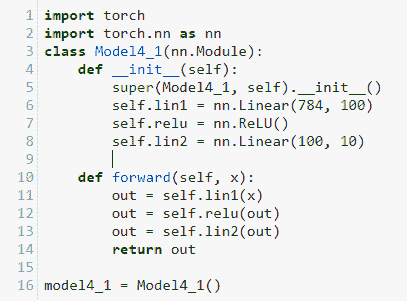

该模型是求解 MNIST 最常见和最基本的线性模板。你可以看到我们在`**init**` 方法中初始化每一层，通过创建一个类变量，该变量被分配给 PyTorch `nn`对象。这里，我们初始化两个线性函数和一个 ReLU 函数。`nn.Linear`功能的输入大小为`28*28`或`784`。这是每个训练图像的大小。输出通道或网络宽度被设置为`100`。这可以设置为任何值，一般来说，在计算资源的限制和更宽的网络过度适应训练数据的趋势下，更高的值将提供更好的性能。

在`forward` 方法中，我们创建了一个`out`变量。您可以看到，out 变量在返回之前经过了一个由一个线性函数、一个 ReLU 函数和另一个线性函数组成的有序序列。这是一个相当典型的网络架构，由线性层和非线性层交替组成。

现在让我们再创建两个模型，用 tanh 和 sigmoid 激活函数替换 ReLU 函数。以下是 tanh 的版本:

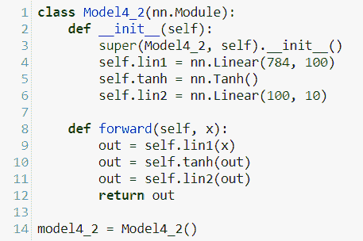

你可以看到我们简单地改变了名字，用`nn.Tanh()`代替了`nn.RelU()`函数。以完全相同的方式创建第三个模型，用`nn.Sigmoid()`替换`nn.Tanh()`。不要忘记更改超级构造函数和用于实例化模型的变量的名称。还要记得相应地更改转发功能。

现在，让我们创建一个简单的`benchmark`函数，我们可以用它来运行和记录每个模型的准确性和训练时间:

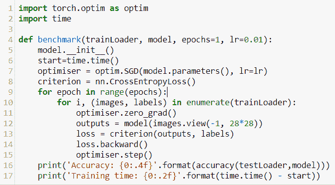

希望这是不言自明的。`benchmark`函数接受两个必需的参数:数据和要评估的模型。我们为纪元和学习速率设置默认值。我们需要初始化模型，这样我们可以在同一个模型上一次运行多次，否则模型参数会累积，扭曲我们的结果。运行代码与以前型号使用的代码相同。最后，我们打印出精度和训练时间。这里计算的训练时间实际上只是一个近似的度量，因为训练时间会受到处理器中正在发生的任何其他事情、内存量以及我们无法控制的其他因素的影响。我们应该只使用这个结果作为一个模型的时间性能的相对指标。最后，我们需要一个函数来计算精度，定义如下:

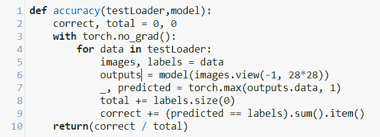

记住加载训练和测试数据集，并使它们完全像我们之前所做的那样是可迭代的。现在，我们可以运行我们的三个模型，并使用如下内容对它们进行比较:

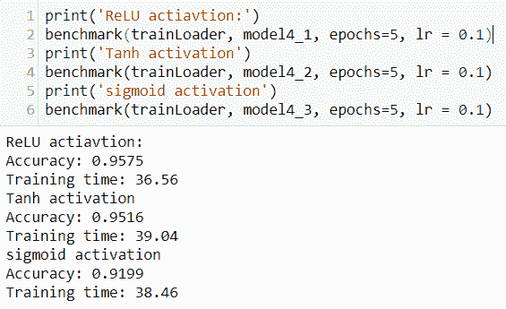

我们可以看到，`Tanh`和`ReLU`函数的性能都明显优于`sigmoid`。对于大多数网络来说，隐藏层上的`ReLU activation`函数给出了最好的结果，无论是在准确性还是训练时间方面。输出层上不使用`ReLU`激活。对于输出层，因为我们需要计算损耗，所以我们使用`softmax`函数。这是损失等级的标准，和以前一样，我们使用`CrossEntropy Loss()`，如果你记得的话，它包括`softmax`函数。

从这里我们有几种方法可以改进；一个显而易见的方法就是增加更多的层。这通常是通过添加交替的非线性和线性层对来实现的。在下面，我们使用`nn.Sequential`来组织我们的层。在我们的前向层中，我们只需调用顺序对象，而不是每个单独的层和函数。这使得我们的代码更紧凑，更易于阅读:


在这里，我们增加了两层:一个线性层和一个非线性层。如何设置输入和输出大小尤为重要。在第一个线性层中，输入尺寸是`784`，这是图像尺寸。这一层的输出，我们选择的东西，被设置为`100`。因此，第二个线性层的输入必须是`100`。这是输出的宽度，内核和特征映射的数量。第二个线性层的输出是我们选择的，但总体思路是减小尺寸，因为我们正试图过滤掉特征，只过滤掉目标类`10`。出于好玩，创建一些模型并尝试不同的输入和输出大小，记住任何层的输入必须与前一层的输出大小相同。以下是三个模型的输出，我们打印了每个隐藏层的输出大小，让您了解可能的情况:

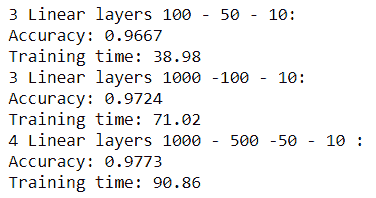

我们可以继续添加尽可能多的层和内核，但是这并不总是一个好主意。我们如何在网络中设置输入和输出大小与数据的大小、形状和复杂性密切相关。对于简单的数据集，例如 MNIST，很明显几个线性图层可以获得非常好的结果。在某种程度上，简单地添加线性图层和增加核的数量将无法捕捉复杂数据集的高度非线性特征。


# 卷积网络

到目前为止，我们在网络中使用完全连接的层，其中每个输入单元代表图像中的一个像素。另一方面，在卷积网络中，每个输入单元都被分配了一个小的局部感受域。感受野的概念，就像人工神经网络一样，是以人脑为模型的。1958 年，人们发现大脑视觉皮层中的神经元对视野中有限区域的刺激做出反应。更有趣的是，一组组神经元只对某些基本形状做出反应。例如，一组神经元可能对水平线做出反应，而其他神经元只对其他方向的线做出反应。据观察，各组神经元可能具有相同的感受野，但对不同的形状作出反应。人们还注意到，神经元被组织成层，更深的层响应更复杂的模式。事实证明，这是计算机学习和分类一组图像的非常有效的方法。


# 单个卷积层

卷积层是有组织的，因此第一层中的单元只响应它们各自的感受域。下一层中的每个单元仅连接到第一层的一小块区域，第二个隐藏层中的每个单元连接到第三层中的有限区域，以此类推。以这种方式，网络可以被训练以从前一层中存在的低级特征组装更高级的特征。

实际上，这是通过使用**滤波器**或**卷积核**来扫描图像以生成所谓的**特征图**来实现的。内核只是一个矩阵，大小和感受野一样。我们可以把这想象成一台相机以不连续的步伐扫描一幅图像。我们通过核矩阵与图像感受域中的值的逐元素相乘来计算特征映射矩阵。然后将得到的矩阵求和，以计算特征图中的单个数字。核矩阵中的值表示我们想要从图像中提取的特征。这些是我们最终希望模型学习的参数。考虑一个简单的例子，我们试图检测图像中的水平线和垂直线。为了简化，我们将使用一个输入维度；这或者是黑色，由一个 **1** 表示，或者是白色，由一个 **0** 表示。请记住，在实践中，这些将是代表灰度或颜色值的缩放和标准化的浮点数。在这里，我们将内核设置为 4 x 4 像素，并使用步幅 **1** 进行扫描。步长就是我们移动内核的距离，所以步长为 **1** 会将内核移动一个像素:

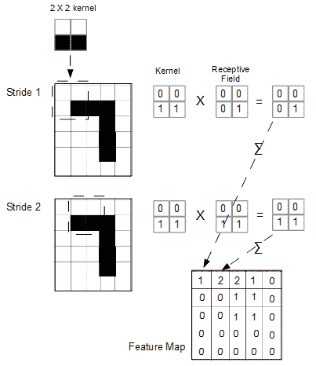

一个卷积是图像的一次完整扫描，并且每个卷积生成一个特征图。在每一步中，我们将图像的感受野与核进行逐元素相乘，并对结果矩阵求和。

你会注意到，当我们在图像上移动内核时，如上图所示，**步距 1** 采样左上角，**步距 2** 采样补丁-向左一个像素，**步距** **3** 将再次向左采样一个像素，依此类推。当我们到达第一行的末尾时，我们需要添加一个填充像素，因此将值设置为 **0** ，以便对图像的边缘进行采样。用零填充输入数据称为**有效填充**。如果我们不对图像进行填充，特征图在尺寸上会比原始图像小。填充用于确保原始文件中的信息不会丢失。

理解输入和输出大小、内核大小、填充和步幅之间的关系很重要。它们可以用下面的公式非常简洁地表达出来:


这里， *O* *=* 输出大小， *W* =输入高度或宽度， *K* =内核大小， *P* =填充， *S* =步幅。请注意，输入高度或宽度假定这两者相同，即输入图像是正方形，而不是矩形。如果输入图像是一个矩形，我们需要分别计算宽度和高度的输出值。

填充可以通过下式计算:

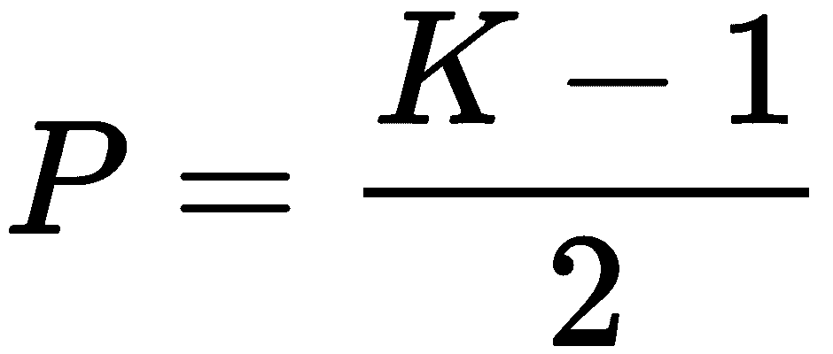


# 多核

在每个卷积中，我们可以包含多个内核。卷积中的每个核都生成自己的特征图。核的个数就是输出通道的个数，也就是卷积层生成的特征图的个数。我们可以通过使用另一个内核来生成进一步的特征映射。作为练习，计算将由以下内核生成的特征图:


通过堆叠内核或过滤器，并使用不同大小和价值的狗窝，我们可以从图像中提取各种特征。

此外，请记住，每个内核并不局限于一个输入维度。例如，如果我们正在处理一个 RGB 彩色图像，那么每个内核的输入维度将是 3。因为我们做的是逐元素乘法，所以内核必须和感受野一样大。当我们有三个维度时，内核需要有三个输入深度。因此，我们的灰度 2×2 内核变成了彩色图像的 2×2×3 矩阵。我们仍然在每个内核的每个卷积上生成单个特征图。我们仍然能够进行元素级乘法，因为核的大小与感受野相同，除了现在当我们进行求和时，我们对三个维度求和以得到每一步所需的单个数字。

你可以想象，我们有很多种方法可以扫描图像。我们可以改变内核的大小和值，或者我们可以改变它的步幅，包括填充，甚至包括不连续的像素。

为了更好地了解一些可能性，请查看 vdumoulin 的优秀动画:[https://github . com/VDU moulin/conv _ 算术/blob/master/README.md](https://github.com/vdumoulin/conv_arithmetic/blob/master/README.md) 。


# 多重卷积层

与全连接线性层一样，我们可以添加多个卷积层。与线性图层一样，也有同样的限制:

*   时间和内存的限制(计算负载)
*   倾向于过度适应训练集，而不是推广到测试集
*   需要更大的数据集才能有效工作

适当添加卷积图层的好处在于，它们能够逐步从数据集中提取更复杂的非线性要素。


# 池层

卷积层通常使用**池层**堆叠。合并图层的目的是减小由前面的卷积生成的要素地图的大小，而不是深度。汇集图层保留 RGB 信息，但压缩空间信息。我们这样做的原因是为了使内核能够有选择地关注某些非线性特征。这意味着我们可以通过关注影响最大的参数来减少计算量。拥有更少的参数也减少了过度拟合的趋势。

使用池图层来降低输出要素地图的维度有三个主要原因:

*   通过丢弃不相关的特征来减少计算量
*   参数数量较少，因此不太可能过度拟合数据
*   能够提取以某种方式变换的特征，例如从不同角度拍摄的物体图像

池图层与普通卷积图层非常相似，因为它们使用核矩阵或过滤器对图像进行采样。合并图层的不同之处在于，我们对输入进行缩减采样。缩减采样减少了输入维度。这可以通过增加内核的大小和/或步长来实现。检查单卷积层部分的公式，确认这是正确的。

记住，在卷积中，我们所做的就是在一幅图像上，在每一步上乘以两个张量。卷积中的每个后续步长对输入的另一部分进行采样。这种采样是通过将内核与该特定步幅所包含的前一卷积层的输出进行逐元素相乘来实现的。这个采样的结果是一个单一的数字。对于卷积层，这个数字是元素乘法的总和。对于池层，这个单一的数字通常是由按元素相乘的平均值或最大值生成的。术语**平均池**和**最大池**指的是这些不同的池技术。


# 构建单层 CNN

所以现在我们应该有足够的理论来建立一个简单的卷积网络，并了解它的工作原理。下面是我们可以开始使用的模型类模板:

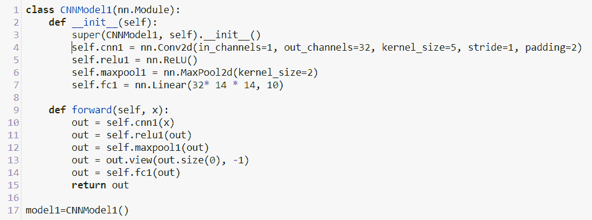

我们将在 PyTorch 中使用的基本卷积单元是`nn.Conv2d`模块。其特征在于以下签名:

```py
nn.Conv2d(in_channels, outs_channels, kernel_size, stride=1, 
padding = 0)
```

这些参数的值受输入数据的大小和上一节讨论的公式的限制。在这个例子中，`in_channels`被设置为`1`。这是指我们的输入图像具有一个颜色维度的事实。如果我们正在处理一个三通道的彩色图像，这将被设置为`3`。`out_channel`为仁数。我们可以将它设置为任何值，但是要记住这是有计算代价的，性能的提高依赖于更大、更复杂的数据集。对于这个例子，我们将输出通道的数量设置为`16`。输出通道或内核的数量实质上是我们认为可能指示目标类的低级特征的数量。我们将步幅设置为`1`，填充设置为`2`。这确保了输出大小与输入保持一致；这可以通过将这些值代入单卷积层部分的输出公式来验证。

在`__init__`方法中，你会注意到我们实例化了一个卷积层、`ReLU`激活函数、`MaxPool2d`层和一个全连接线性层。这里重要的是理解我们如何获得传递给`nn.Linear()`函数的值。这是最大池层的输出大小。我们可以使用输出公式来计算。我们知道卷积层的输出与输入相同。因为输入图像是正方形的，我们可以用 28(高度或宽度)来表示输入，从而表示卷积层的输出大小。我们还知道我们已经设置了一个`2`的内核大小。默认情况下，`MaxPool2d`将步幅分配给内核大小，并使用隐含填充。出于实用目的，这意味着当我们使用默认的步幅和填充值时，我们可以简单地将输入值(这里是 28)除以内核大小。因为我们的内核大小是 2，所以我们可以计算出输出大小为 14。由于我们使用的是完全连接的线性层，我们需要展平宽度、高度和通道的数量。我们有 32 个通道，如在`nn.Conv2d`的`out_channels`参数中设置的。因此，输入大小为 16 X 14 X 14。输出大小为 10，因为与线性网络一样，我们使用输出来区分 10 个类别。

该模型的`forward`功能相当简单。我们简单地通过卷积层、激活函数、池层和全连接线性层传递`out`变量。请注意，我们需要调整线性层的输入大小。假设批量大小为`100`，池层的输出是一个四维张量:`100, 32, 14, 14`。这里，`out.view(out.size(0), -1)`将这个四维张量重塑为二维张量:`100, 32*14*14`。

为了更具体一点，让我们来训练我们的模型，看看几个变量。我们可以使用几乎相同的代码来训练卷积模型。然而，我们确实需要在我们的`benchmark()`函数中改变一行。由于卷积层可以接受多个输入维度，我们不需要展平输入的宽度和高度。对于之前的线性模型，在我们的运行代码中，我们使用了以下方法来拉平输入:

```py
outputs= model(images.view(-1, 28*28))
```

对于我们的卷积层，我们不需要这样做；我们可以简单地将图像传递给模型，如下所示:

```py
outputs = model(images)
```

这条线也必须在我们在本章前面的基准标记一节中定义的`accuracy()`功能中改变。


# 构建多层 CNN

正如你所料，我们可以通过增加一个卷积层来改善这个结果。当我们添加多个层时，将每个层捆绑成一个序列是很方便的。这正是`nn.Sequential`派上用场的地方:

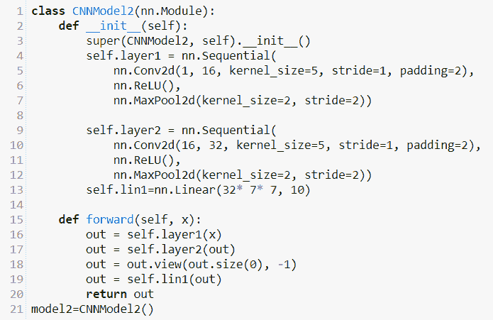

我们初始化两个隐藏层和一个完全连接的线性输出层。注意传递给`Conv2d`实例的参数和线性输出。和以前一样，我们有一个输入维度。由此，我们的卷积层输出`16`特征图或者输出通道。

下图显示了两层卷积网络:

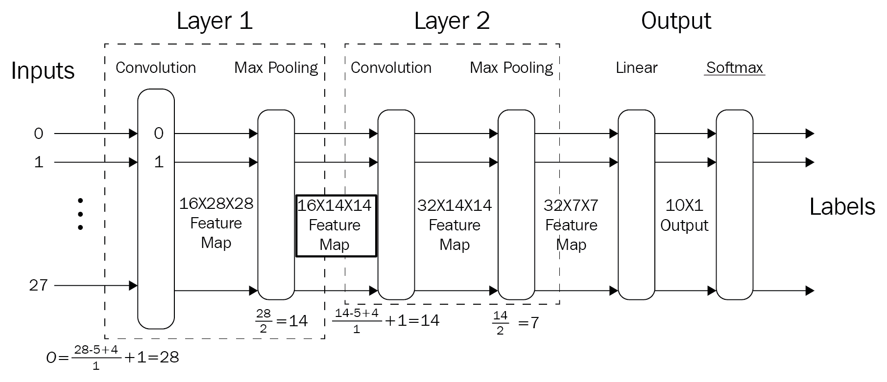

这将使我们清楚如何计算输出大小，尤其是如何为线性输出图层导出输入大小。使用输出公式，我们知道，在最大汇集之前，第一个卷积层的输出大小与输入大小相同，即 28 x 28。因为我们使用 16 个内核或通道，生成 16 个特征图，所以最大池层的输入是 16×28×28 张量。最大池层的内核大小为 2，步长为 2，默认的隐式填充意味着我们只需将特征映射大小除以 2，即可计算出最大池输出大小。这使我们的输出大小为 16 x 14 x 14。这是第二卷积层的输入大小。同样，使用输出公式，我们可以计算出第二个卷积层在 max pooling 之前生成 14 x 14 的特征映射，大小与其输入相同。因为我们将内核的数量设置为 32，所以第二个最大池层的输入是一个 32×14×14 的矩阵。我们的第二个最大池层与第一个相同，内核大小和步幅设置为 2，默认为隐式填充。同样，我们可以简单地除以 2 来计算输出大小，从而计算线性输出层的输入。最后，我们需要将这个矩阵展平到一维。因此，线性输出图层的输入大小是 32 * 7 * 7 的单维，即 1，568。通常，我们需要最终线性图层的输出大小为类的数量，在本例中为 10。

我们可以检查模型参数，看看运行代码时到底发生了什么:

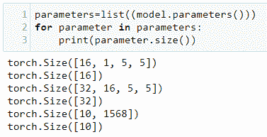

模型参数由六个张量组成。第一张量是第一卷积层的参数。它由`16`个核、`1`个颜色维度和一个大小为`5`的核组成。下一个张量是偏差，有一个尺寸为`16`的单一维度。列表中的第三个张量是第二卷积层中的`32`核、`16`输入通道、深度和`5 x 5`核。在最后的线性层中，我们将这些尺寸展平为`10 x 1568`。


# 批量标准化

批处理规范化被广泛用于提高神经网络的性能。它通过稳定层输入的分布来工作。这是通过调整这些输入的平均值和方差来实现的。研究人员社区对于批处理规范化为什么如此有效存在不确定性，这很好地表明了深度学习研究的性质。有人认为这是因为它减少了所谓的**内部同变移位** ( **ICS** )。这是指由于前面层的参数更新而导致的分布变化。批处理规范化的最初动机是减少这种偏移。然而，ICS 和性能之间的明确联系还没有最终发现。最近的研究表明，批处理规范化通过*平滑*优化前景来工作。基本上，这意味着梯度下降将更有效地工作。这方面的细节可以在*批处理规范化如何帮助优化*中找到？由桑图卡等人编写，可在[https://arxiv.org/abs/1805.11604](https://arxiv.org/abs/1805.11604)买到。

批量标准化，用`nn.BatchNorm2d`函数实现:

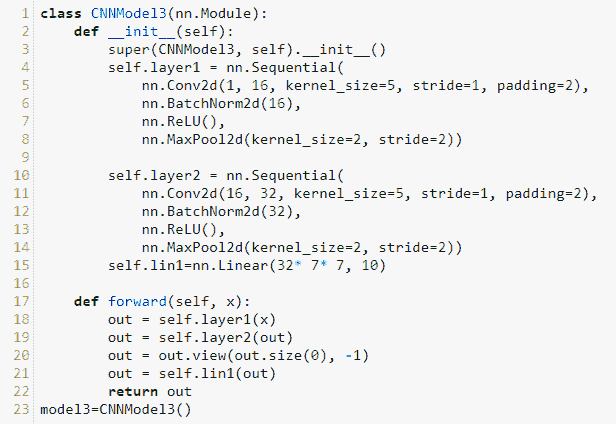

该模型与之前的两层 CNN 相同，只是增加了卷积层输出的批量归一化。以下是我们迄今为止构建的三个卷积网络的性能打印输出:


# 摘要

在本章中，我们看到了如何改进在第 3 章、*计算图和线性模型*中开发的简单线性网络。我们可以增加线性层，增加网络的宽度，增加运行模型的次数，并调整学习速率。然而，线性网络将无法捕捉数据集的非线性特征，并且在某一点上，它们的性能将趋于平稳。另一方面，卷积层使用核来学习非线性特征。我们看到，有了两个卷积层，MNIST 的性能显著提高。

在下一章，我们将看看一些不同的网络架构，包括循环网络和长短期网络。