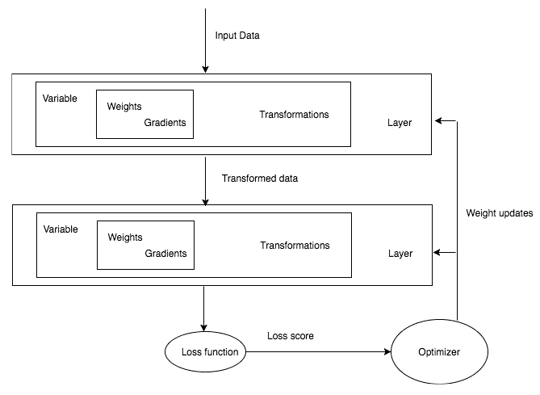

# 深入研究神经网络

在本章中，我们将探索用于解决现实世界问题的深度学习架构的不同模块。在前一章中，我们使用 PyTorch 的低级操作来构建网络架构、损失函数和优化器等模块。在本章中，我们将探索解决现实世界问题所需的神经网络的一些重要组件，以及 PyTorch 如何通过提供大量高级函数来抽象出大量复杂性。在本章的最后，我们将构建解决现实世界问题的算法，例如回归、二元分类和多类分类。

在本章中，我们将讨论以下主题:

*   深入研究神经网络的各种构件
*   非线性激活
*   PyTorch 非线性激活
*   使用深度学习的图像分类


# 深入神经网络的构建模块

正如我们在前一章中了解到的，训练深度学习算法需要以下步骤:

1.  构建数据管道
2.  构建网络架构
3.  使用损失函数评估架构
4.  使用优化算法优化网络架构权重

在前一章中，网络由使用 PyTorch 数值运算构建的简单线性模型组成。虽然使用数值运算为虚拟问题构建神经架构更容易，但当我们试图构建解决不同领域复杂问题所需的架构时，这很快变得复杂，例如计算机视觉和自然语言处理。

大多数深度学习框架，如 PyTorch、TensorFlow 和 Apache MXNet，都提供了更高级别的功能，抽象了很多这种复杂性。这些更高级别的功能在深度学习框架中被称为**层**。它们接受输入数据，应用我们在前一章看到的转换，然后输出数据。为了解决现实世界的问题，深度学习架构由 1 到 150 层不等的若干层组成，有时甚至更多。抽象低级操作和训练深度学习算法将看起来像下面的图表:



任何深度学习训练都涉及到获取数据，构建架构(一般来说，这意味着将一堆层放在一起)，使用损失函数评估模型的准确性，然后通过优化我们网络的权重来优化算法。在考虑解决一些现实世界的问题之前，我们将了解 PyTorch 为构建层、损失函数和优化器提供的高级抽象。


# 层——神经网络的基本模块

在本章的其余部分，我们将遇到不同类型的层。首先，让我们试着理解最重要的一层，线性层，它的功能与前一章的网络架构完全相同。线性图层应用线性变换:


它的强大之处在于，我们在上一章中编写的整个函数可以用一行代码编写，如下所示:

```py
from torch.nn import Linear
linear_layer = Linear(in_features=5,out_features=3,bias=True)
```

在前面的代码中，`linear_layer`函数将接受大小为 5 的张量，并在应用线性变换后输出大小为 3 的张量。让我们看一个简单的例子来说明如何做到这一点:

```py
inp = Variable(torch.randn(1,5))
linear_layer(inp)
```

我们可以使用权重来访问该层的可训练参数:

```py
Linear_layer.weight
```

这将产生以下输出:


同样，我们可以使用`bias`属性访问层的可训练参数:

```py
linear_layer.bias
```

这将产生以下输出:


线性层有不同的名称，如**密集**或**全连接**层，跨越不同的框架。用于解决真实世界用例的深度学习架构通常包含不止一层。在 PyTorch 中，我们可以通过一种简单的方法将一层的输出传递给另一层:

```py
linear_layer = Linear(5,3)
linear_layer_2 = Linear(3,2)
linear_layer_2(linear_layer(inp))
```

这将产生以下输出:


每一层都有自己的可学习参数。使用多层背后的想法是，每一层将学习某种模式，后面的层将在此基础上构建。仅仅将线性图层相加存在一个问题，因为除了线性图层的简单表示之外，他们无法学到任何新的东西。让我们通过一个简单的例子来看看，为什么将多个线性层堆叠在一起是没有意义的。

假设我们有两个线性图层，权重如下:

| **层** | **权重 1** |
| 第 1 层 | Three |
| 第 2 层 | Two |

具有两个不同层的前述架构可以简单地表示为具有不同层的单个层。因此，仅仅堆叠多个线性层不会帮助我们的算法学习任何新的东西。有时，这可能不清楚，所以我们可以用下面的数学公式来形象化这个架构:


为了解决这个问题，我们有不同的非线性函数来帮助学习不同的关系，而不是只关注线性关系。

深度学习中有许多不同的非线性函数可用。PyTorch 以层的形式提供了这些非线性功能，我们将能够像使用线性层一样使用它们。

一些流行的非线性函数如下:

*   乙状结肠的
*   双曲正切
*   热卢
*   李奇注意到了


# 非线性激活

非线性激活是接受输入，然后应用数学变换并产生输出的功能。我们在实践中会遇到几种非线性运算。我们将讨论一些流行的非线性激活函数。


# 乙状结肠的

sigmoid 激活函数具有简单的数学形式，如下所示:


sigmoid 函数直观地接受一个实数值，并输出一个介于 0 和 1 之间的数字。对于较大的负数，它返回接近 0 的值，对于较大的正数，它返回接近 1 的值。下图代表不同的 sigmoid 函数输出:


sigmoid 函数在历史上曾被用于不同的架构，但最近，它已经不再流行，因为它有一个主要缺点。当 sigmoid 函数的输出接近 0 或 1 时，sigmoid 函数之前的层的梯度接近 0，因此，前一层的可学习参数得到接近 0 的梯度，并且不经常调整权重，导致死神经元。


# 双曲正切

tanh 非线性函数会将-1 到 1 范围内的实数压缩。当 tanh 输出接近-1 和 1 的极值时，tanh 也面临饱和梯度的问题。但是，最好使用 sigmoid，因为 tanh 的输出以零为中心:


# 热卢

ReLU 近年来越来越受欢迎；我们可以在几乎任何现代建筑中找到它的用法或它的变体之一。它有一个简单的数学公式:


简单地说，ReLU 压缩任何负到 0 的输入，并保留正数不变。我们可以将 ReLU 函数形象化如下:


使用 ReLU 的一些优点和缺点如下:

*   它有助于优化器更快地找到正确的权重集。更技术性的是，它使得随机梯度下降的收敛速度更快。
*   它的计算量很小，因为我们只是设定阈值，并不计算任何东西，就像我们对 sigmoid 和 tangent 函数所做的那样。
*   ReLU 有一个缺点:当大梯度在反向传播过程中穿过它时，它往往会变得无响应；这些被称为**死中子**，可以通过仔细选择学习率来控制。我们将在[第四章](bfebc11a-90af-4c67-ab9a-3118061abaf3.xhtml)、*计算机视觉深度学习*中讨论调整学习速率的不同方式时，讨论如何选择学习速率。


# 李奇注意到了

Leaky ReLU 试图解决一个垂死的问题，它不是饱和到 0，而是饱和到一个非常小的数，比如 0.001。对于某些用例，这个激活函数提供了优于其他函数的性能，但是它并不一致。


# PyTorch 非线性激活

PyTorch 已经为我们实现了大多数常见的非线性激活功能，它可以像任何其他层一样使用。让我们看一个如何在 PyTorch 中使用 ReLU 函数的快速示例:

```py
example_data = Variable(torch.Tensor([[10,2,-1,-1]]))
example_relu = ReLU()
example_relu(example_data)
```

这将导致以下输出:


在前面的例子中，我们取一个具有两个正值和两个负值的张量，并对其应用 ReLU，它将负数阈值设为 0，并保留正数。

现在我们已经涵盖了构建网络架构所需的大部分细节，让我们构建一个可用于解决现实世界问题的深度学习架构。在前一章中，我们使用了一种简单的方法，以便我们可以只关注深度学习算法如何工作。我们将不再使用这种风格来构建我们的架构；相反，我们将按照 PyTorch 中的设计方式来构建架构。


# 构建深度学习算法的 PyTorch 方式

PyTorch 中的所有网络都实现为类，子类化一个名为`nn.Module`的 PyTorch 类，并且应该实现`__init__`和`forward`方法。在`init`函数中，我们初始化任何层，比如我们在上一节中提到的线性层。在`forward`方法中，我们将输入数据传递给在`init`方法中初始化的层，并返回最终输出。非线性函数通常直接用在`forward`函数中，有些也用在`init`方法中。以下代码片段显示了深度学习架构是如何在 PyTorch 中实现的:

```py
class NeuralNetwork(nn.Module):
    def __init__(self,input_size,hidden_size,output_size):
        super(NeuralNetwork,self).__init__()
        self.layer1 = nn.Linear(input_size,hidden_size)
        self.layer2 = nn.Linear(hidden_size,output_size)
    def __forward__(self,input):
        out = self.layer1(input)
        out = nn.ReLU(out)
        out = self.layer2(out)
        return out
```

如果您是 Python 的新手，前面的一些代码可能很难理解，但它所做的只是继承一个父类并在其中实现两个方法。在 Python 中，我们通过将父类作为参数传递给类名来子类化。在 Python 中，`init`方法充当构造函数，`super`用于将子类的参数传递给父类，在我们的例子中是`nn.Module`。


# 不同机器学习问题的模型架构

我们正在解决的这种问题将决定我们将使用什么样的层，从线性层开始，到顺序数据的长期短期记忆。基于你试图解决的问题的类型，你的最后一层是确定的。我们通常使用任何机器学习或深度学习算法来解决三个问题。让我们看看最后一层是什么样子的:

*   对于回归问题，例如预测要出售的 t 恤的价格，我们将使用最后一个图层作为输出为 1 的线性图层，它输出连续值。
*   为了将给定图像分类为 t 恤或衬衫，您将使用 sigmoid 激活函数，因为它输出更接近 1 或 0 的值，这通常被称为**二元分类问题**。
*   对于多类分类，我们必须对给定图像是 t 恤、牛仔裤、衬衫还是裙子进行分类，我们将在网络末端使用 softmax 层。让我们试着直观地理解 softmax 是做什么的，而不去研究它的数学。例如，它从前一个线性图层获取输入，并输出给定数量的示例的概率。在我们的例子中，它将被训练来预测每种类型图像的四种概率。记住，所有这些概率的总和总是 1。


# 损失函数

一旦我们定义了我们的网络架构，我们剩下两个重要的步骤。一个是计算我们的网络在执行回归、分类的特定任务方面有多好，下一个是优化权重。

优化器(梯度下降)通常接受标量值，因此我们的损失函数应该生成一个标量值，在我们的训练过程中必须最小化该标量值。某些用例需要两个或更多的损失函数，例如预测道路上的障碍物并将其归类为行人。即使在这种情况下，我们也需要将损失合并到一个标量中，以便优化器最小化。我们将在[第 8 章](aeec9e18-7c1d-4ae2-b362-ea7a9d94dd22.xhtml)、*现代网络架构的迁移学习*中用一个真实世界的例子详细讨论将多个损失合并成一个标量的例子。

在前一章中，我们定义了自己的损失函数。PyTorch 提供了常用损失函数的几种实现。让我们看看用于回归和分类的损失函数。

回归问题常用的损失函数是**均方误差** ( **MSE** )。这与我们在上一章中实现的损失函数相同。我们可以使用 PyTorch 中实现的损失函数，如下所示:

```py
loss = nn.MSELoss()
input = Variable(torch.randn(2, 6), requires_grad=True)
target = Variable(torch.randn(2, 6))
output = loss(input, target)
output.backward()
```

对于分类，我们使用交叉熵损失。在研究交叉熵的数学之前，让我们先了解一下交叉熵损失是怎么回事。它计算分类网络的损失，预测概率，其总和应为 1，就像我们的 softmax 层一样。当预测概率偏离正确概率时，交叉熵损失增加。比如，如果我们的分类算法预测下面的图像有 0.1 的概率是猫，但实际上是熊猫，那么交叉熵损失会更高。如果它预测与实际标签相似，那么交叉熵损失将会更低:


让我们看一个在 Python 代码中如何实现的示例:

```py
def cross_entropy_function(true_label, prediction):
    if true_label == 1:
        return -log(prediction)
    else:
        return -log(1 - prediction)
```

要在分类问题中使用交叉熵损失，我们真的不需要担心内部会发生什么——我们需要记住的是，当我们的预测不好时，损失会很高，当预测好时，损失会很低。PyTorch 为我们提供了丢失的实现，我们可以使用它，如下所示:

```py
loss = nn.CrossEntropyLoss()
input = Variable(torch.randn(2, 6), requires_grad=True)
target = Variable(torch.LongTensor(2).random_(6))
output = loss(input, target)
output.backward()
```

PyTorch 中的一些其他损失函数如下:

| L1 损失 | 多用作正则化子；我们将在[第四章](bfebc11a-90af-4c67-ab9a-3118061abaf3.xhtml)、*计算机视觉深度学习*中进一步讨论 |
| MSE 损失 | 用作回归问题的损失函数 |
| 交叉熵损失 | 用于二元和多类分类问题 |
| NLL 损失 | 用于分类问题，并允许我们使用特定权重来处理不平衡的数据集 |
| nll 损失 | 用于按像素分类，主要用于与图像分割相关的问题 |


# 优化网络架构

一旦我们计算出网络的损耗，我们将优化权重以减少损耗，从而提高算法的准确性。为了简单起见，让我们把这些优化器看作是黑盒，它接受损失函数和所有可学习的参数，并稍微移动它们以提高我们的性能。PyTorch 提供了深度学习所需的大部分常用优化器。如果你想探索这些优化器内部发生了什么，并且有数学背景，我强烈推荐以下博客:

*   [http://ruder.io/optimizing-gradient-descent/](http://ruder.io/optimizing-gradient-descent/)
*   [https://medium . com/datadriveninvestor/overview-of-different-optimizer-for-neural-networks-e0ed 119440 c 3](https://medium.com/datadriveninvestor/overview-of-different-optimizers-for-neural-networks-e0ed119440c3)

PyTorch 提供的一些优化器如下:

*   `ASGD`
*   `Adadelta`
*   `Adagrad`
*   `Adam`
*   `Adamax`
*   `LBFGS`
*   `RMSprop`
*   `Rprop`
*   `SGD`
*   `SparseAdam`

我们将在[第四章](bfebc11a-90af-4c67-ab9a-3118061abaf3.xhtml)、*计算机视觉深度学习*中深入了解一些算法的细节，以及一些优势和权衡。让我们浏览一下创建任何优化器的一些重要步骤:

```py
sgd_optimizer = optim.SGD(model.parameters(), lr = 0.01)
```

在前面的示例中，我们创建了一个 SGD 优化器，它将网络的所有可学习参数作为第一个参数，并将学习率作为可学习参数的变化率。在[第四章](bfebc11a-90af-4c67-ab9a-3118061abaf3.xhtml)、*计算机视觉的深度学习*中，我们会深入学习速率和动量的更多细节，这是优化器的一个重要参数。一旦您创建了一个优化器对象，我们需要在我们的循环中调用`zero_grad()`,因为参数将累积在之前的优化器调用中创建的梯度:

```py
for input, target in dataset:
    sgd_optimizer.zero_grad()
    output = model(input)
   loss = loss_fn(output, target)
    loss.backward()
    sgd_optimizer.step()
```

一旦我们对计算梯度(可学习参数需要改变的量)的损失函数调用 backward，我们就调用`optimizer.step()`，对我们的可学习参数进行实际的改变。

现在，我们已经介绍了帮助计算机看到或识别图像所需的大部分组件。让我们建立一个复杂的深度学习模型，可以区分狗和猫，以将所有理论付诸实践。


# 使用深度学习的图像分类

解决任何现实世界问题的最重要的一步是获取数据。为了在本章中测试我们的深度学习算法，我们将使用 GitHub 存储库中提供的数据集，该数据集来自一个名为`ardamavi`的用户。我们将在[第四章](bfebc11a-90af-4c67-ab9a-3118061abaf3.xhtml)、*计算机视觉的深度学习*中再次使用这个数据集，这将涉及**卷积神经网络**(**CNN**)以及一些我们可以用来提高图像识别模型性能的高级技术。

可以从以下链接下载数据:[https://github . com/ardamavi/Dog-Cat-Classifier/tree/master/Data/Train _ Data](https://github.com/ardamavi/Dog-Cat-Classifier/tree/master/Data/Train_Data)。该数据集包含狗和猫的图像。数据的预处理以及训练、验证和测试分割的创建是我们在实现算法之前需要执行的一些重要步骤。

当以下列格式提供时，大多数框架使阅读图像和给它们贴标签变得更容易。这意味着每个类都应该有一个单独的图像文件夹。这里，所有的猫图像应该在`cat`文件夹中，狗图像应该在`dog`文件夹中:


Python 使得将数据转换成正确的格式变得很容易。让我们快速地看一下代码，然后我们将浏览它的重要部分:

```py
path = 'Dog-Cat-Classifier/Data/Train_Data/'
#Read all the files inside our folder.
dog_files = [f for f in glob.glob('Dog-Cat-Classifier/Data/Train_Data/dog/*.jpg')]
cat_files = [f for f in glob.glob('Dog-Cat-Classifier/Data/Train_Data/cat/*.jpg')]
files = dog_files + cat_files
print(f'Total no of images {len(files)}')
no_of_images = len(files)
```

创建可用于创建验证数据集的混排索引:

```py
shuffle = np.random.permutation(no_of_images)
```

创建用于保存训练和验证图像的验证目录:

```py
os.mkdir(os.path.join(path,'train'))
os.mkdir(os.path.join(path,'valid'))
Create directories with label names.
for t in ['train','valid']:
    for folder in ['dog/','cat/']:
         os.mkdir(os.path.join(path,t,folder))
```

将一小部分图像复制到验证文件夹中:

```py
for i in shuffle[:250]:
    folder = files[i].split('/')[-2].split('.')[0]
    image = files[i].split('/')[-1]
    os.rename(files[i],os.path.join(path,'valid',folder,image))
```

将一小部分图像复制到培训文件夹中:

```py
for i in shuffle[250:]:
    folder = files[i].split('/')[-2].split('.')[0]
    image = files[i].split('/')[-1]
    os.rename(files[i],os.path.join(path,'train',folder,image))
```

前面的代码所做的就是检索所有的文件，并挑选一个图像样本来创建一个测试和验证集。它将所有的图片分为猫和狗两类。创建单独的验证集是一种常见且重要的做法，因为在相同的数据上测试我们的算法是不公平的。为了创建一个数据集，我们创建了一个数字列表，这些数字在图像长度的范围内，并按照随机的顺序排列。被打乱的数字充当索引，让我们挑选一堆图像来创建我们的数据集。让我们详细检查代码的每一部分。

我们使用`glob`方法返回特定路径中的所有文件:

```py
dog_files = [f for f in glob.glob('Dog-Cat-Classifier/Data/Train_Data/dog/*.jpg')]
cat_files = [f for f in glob.glob('Dog-Cat-Classifier/Data/Train_Data/cat/*.jpg')]
```

当有大量图像时，我们也可以使用`iglob`，它返回一个迭代器，而不是将名称加载到内存中。在我们的例子中，我们正在处理的图像量很小，我们可以很容易地将它们放入内存，所以这是不必要的。

我们可以使用下面的代码来打乱我们的文件:

```py
shuffle = np.random.permutation(no_of_images)
```

前面的代码以随机顺序返回 0 到 1，399 范围内的数字，我们将使用这些数字作为选择图像子集以创建数据集的索引。

我们可以创建测试和验证代码，如下所示:

```py
os.mkdir(os.path.join(path,'train'))
os.mkdir(os.path.join(path,'valid'))
for t in ['train','valid']:
    for folder in ['dog/','cat/']:
         os.mkdir(os.path.join(path,t,folder))
```

前面的代码基于目录`train`和`valid`中的类别(猫和狗)创建文件夹。

我们可以用下面的代码打乱一个索引:

```py
for i in shuffle[:250]:
    folder = files[i].split('/')[-2].split('.')[0]
    image = files[i].split('/')[-1]
    os.rename(files[i],os.path.join(path,'valid',folder,image))
```

在前面的代码中，我们使用随机索引为我们的验证集随机挑选了 250 个不同的图像。我们对训练数据做一些类似的事情来分离`train`目录中的图像。

既然我们有了所需格式的数据，让我们快速地看看如何将图像加载为 PyTorch 张量。


# 将数据加载到 PyTorch 张量中

PyTorch `torchvision.datasets`包提供了一个名为`ImageFolder`的实用程序类，当数据以上述格式呈现时，该类可用于加载图像及其相关标签。通常的做法是执行以下预处理步骤:

1.  将所有图像调整到相同的大小。大多数深度学习架构期望图像大小相同。
2.  用数据集的平均值和标准差归一化数据集。
3.  将图像数据集转换为 PyTorch 张量。

PyTorch 通过在`transforms`模块中提供许多实用函数，简化了这些预处理步骤。对于我们的示例，让我们应用三个转换:

*   缩放至 256 x 256 的图像尺寸
*   转换为 PyTorch 张量
*   标准化数据(我们将在下一节讨论如何得出平均值和标准差)

以下代码演示了如何使用`ImageFolder`类应用变换和加载图像:

```py
transform = transforms.Compose([transforms.Resize((224,224))
                                       ,transforms.ToTensor()
                                       ,transforms.Normalize([0.12, 0.11, 0.40], [0.89, 0.21, 0.12])])
train = ImageFolder('Dog-Cat-Classifier/Data/Train_Data/train/',transform)
valid = ImageFolder('Dog-Cat-Classifier/Data/Train_Data/valid/',transform)
```

`train`对象保存数据集的所有图像和相关标签。它包含两个重要的属性:一个给出类和数据集中使用的相关索引之间的映射，另一个给出类的列表:

*   `train.class_to_idx - {'cat': 0, 'dog': 1}`
*   `train.classes - ['cat', 'dog']`

将加载到张量中的数据可视化通常是最佳实践。为了可视化张量，我们必须重塑张量的形状，并对其值进行反规格化。下面的函数为我们完成了这项工作:

```py
import matplotlib.pyplot as plt
def imshow(inp):
    """Imshow for Tensor."""
    inp = inp.numpy().transpose((1, 2, 0))
    mean = np.array([0.12, 0.12, 0.40])
    std = np.array([0.22, 0.20, 0.20])
    inp = std * inp + mean
    inp = np.clip(inp, 0, 1)
    plt.imshow(inp) 
```

现在，我们可以将张量传递给前面的`imshow`函数，该函数将其转换为图像:

```py
imshow(train[30][0])
```

上述代码生成以下输出:


# 批量加载 PyTorch 张量

在深度学习或机器学习中，批量处理图像样本是一种常见的做法，因为现代的**图形处理单元**(**GPU**)和 CPU 经过优化，可以在一批图像上更快地运行操作。批量大小通常取决于我们使用的 GPU 的种类。每个 GPU 都有自己的内存，内存从 2 GB 到 12 GB 不等，商用 GPU 有时会更多。PyTorch 提供了`DataLoader`类，它接收一个数据集并返回一批图像。它抽象了批处理中的许多复杂性，例如使用多个工人来应用转换。以下代码将之前的`train`和`valid`数据集转换为数据加载器:

```py
train_data_generator = torch.utils.data.DataLoader(train,shuffle=True,batch_size=64,num_workers=8)
valid_data_generator = torch.utils.data.DataLoader(valid,batch_size=64,num_workers=8)
```

`DataLoader`类为我们提供了许多选项，一些最常用的选项如下:

*   `shuffle`:如果为真，则每次调用数据加载器时都会打乱图像。
*   `num_workers`:负责并行化。通常使用的工作线程数量少于机器中可用的内核数量。


# 构建网络架构

对于大多数真实世界的用例，特别是在计算机视觉中，我们很少构建自己的架构。有不同的架构可以快速用于解决我们现实世界的问题。对于我们的例子，我们将使用一种流行的深度学习算法，称为 **ResNet** ，它在 2015 年的不同比赛中获得了一等奖，如与计算机视觉相关的 ImageNet。

为了更简单的理解，让我们假设这个算法是一堆不同的 PyTorch 层仔细地绑在一起，而不是集中在这个算法内部发生了什么。当我们学习 CNN 时，我们将会看到 ResNet 算法的一些关键构件。PyTorch 通过在`torchvision.models`模块中提供现成的算法，使得使用这些流行算法变得更加容易。因此，对于这个例子，让我们快速地看一下如何使用这个算法，然后遍历每一行代码:

```py
pretrained_resnet = models.resnet18(pretrained=True)
number_features = pretrained_resnet.fc.in_features
pretrained_resnet.fc = nn.Linear(number_features, 4)
```

`models.resnet18(pertrained = True)`对象创建算法的一个实例，它是 PyTorch 层的集合。我们可以通过打印`pretrained_resnet`来快速看一下 ResNet 算法的构成。该算法的一小部分看起来像下面的截图(我没有包括完整的算法，因为它可以运行几页):


正如我们所看到的，ResNet 架构是层的集合，即`Conv2d`、`BatchNorm2d`和`MaxPool2d`，它们以一种特定的方式连接在一起。所有这些算法都会接受一个名为`pretrained`的参数。当`pretrained`为`True`时，算法的权重已经针对预测 1000 个不同类别的特定 ImageNet 分类问题进行了调整，这些类别包括汽车、船只、鱼、猫和狗。该算法被训练来预测 1，000 个 ImageNet 类别，并且权重被调整到该算法达到最先进精度的某个点。这些权重被存储并与我们用于用例的模型共享。当以微调的权重开始时，算法往往比以随机权重开始时工作得更好。因此，对于我们的用例，我们将从预训练的重量开始。

ResNet 算法不能直接使用，因为它被训练为预测 1，000 个类别中的一个。对于我们的用例，我们只需要预测狗和猫这两个类别中的一个。为了实现这一点，我们采用 ResNet 模型的最后一层，这是一个线性层，并将输出特征更改为`4`，如以下代码所示:

```py
pretrained_resnet.fc = nn.Linear(number_features, 4)
```

如果你在基于 GPU 的机器上运行这个算法，那么为了让算法在 GPU 上运行，我们在模型上调用`cuda`方法。强烈建议您在 GPU 驱动的机器上运行这些程序；用一个不到一美元的 GPU 来旋转一个云实例是很容易的。以下代码片段中的最后一行告诉 PyTorch 在 GPU 上运行代码:

```py
if is_cuda:
   pretrained_resnet = pretrained_resnet.cuda()
```


# 训练模型

在前面的小节中，我们创建了一些`DataLoader`实例和算法。现在我们来训练模型。为此，我们需要一个损失函数和一个优化器:

```py
learning_rate = 0.005
criterion = nn.CrossEntropyLoss()
fit_optimizer = optim.SGD(pretrained_resnet.parameters(), lr=0.005, momentum=0.6)
exp_learning_rate_scheduler = lr_scheduler.StepLR(fit_optimizer, step_size=2, gamma=0.05)
```

在前面的代码中，我们基于`CrossEntropyLoss`创建了损失函数，基于`SGD`创建了优化器。`StepLR`功能有助于动态改变学习率。我们将在[第 4 章](bfebc11a-90af-4c67-ab9a-3118061abaf3.xhtml)、*计算机视觉深度学习*中讨论可用于调整学习速率的不同策略。

下面的`train_my_model`函数接受一个模型，并通过运行多个时期和减少损失来调整我们算法的权重:

```py
def train_my_model(model, criterion, optimizer, scheduler, number_epochs=20):
    since = time.time()
    best_model_weights = model.state_dict()
    best_accuracy = 0.0
    for epoch in range(number_epochs):
        print('Epoch {}/{}'.format(epoch, number_epochs - 1))
        print('-' * 10)
```

每个时期都有一个训练和验证阶段:

```py
        for each_phase in ['train', 'valid']:
            if each_phase == 'train':
                scheduler.step()
                model.train(True) 
            else:
                model.train(False)

            running_loss = 0.0
            running_corrects = 0
```

迭代数据:

```py
            for data in dataloaders[each_phase]:
                input_data, label_data = data
                if torch.cuda.is_available():
                    input_data = Variable(inputs.cuda())
                    label_data = Variable(labels.cuda())
                else:
                    input_data, label_data = Variable(input_data), Variable(label_data)
                optimizer.zero_grad()  
                outputs = model(input_data)
                _, preds = torch.max(outputs.data, 1)
                loss = criterion(outputs, label_data)
                if each_phase == 'train':
                    loss.backward()
                    optimizer.step()
                running_loss += loss.data[0]
                running_corrects += torch.sum(preds == label_data.data)
            epoch_loss = running_loss / dataset_sizes[each_phase]
            epoch_acc = running_corrects / dataset_sizes[each_phase]
            print('{} Loss: {:.4f} Acc: {:.4f}'.format(each_phase, epoch_loss, epoch_acc))
            if each_phase == 'valid' and epoch_acc > best_acc:
                best_accuracy = epoch_acc
                best_model_weights = model.state_dict()
        print()
    time_elapsed = time.time() - since
    print('Training complete in {:.0f}m {:.0f}s'.format(time_elapsed // 60, time_elapsed % 60))
    print('Best val Acc: {:4f}'.format(best_accuracy))
    model.load_state_dict(best_model_weights)
    return model
```

该功能可以按如下方式运行:

```py
train_my_model(pretrained_resnet, criterion, fit_optimizer, exp_learning_rate_scheduler, number_epochs=20)
```

上述函数执行以下操作:

*   它通过模型传递图像并计算损失。
*   它在训练阶段反向传播。对于验证/测试阶段，它不调整权重。
*   对于每个时期，损失在批次间累积。
*   存储最佳模型并打印验证精度。

前面的模型在运行 20 个时期后，得到 87%的验证准确度。

在接下来的章节中，我们将学习更先进的技术，帮助我们以更快的方式训练更精确的模型。之前的模型在 Titan X GPU 上运行大约需要 30 分钟。我们将介绍有助于更快训练模型的不同技术。


# 摘要

在本章中，我们探索了 PyTorch 中神经网络的完整生命周期，从构建不同类型的层开始，添加激活，计算交叉熵损失，最后，通过使用 SGD 优化器调整层的权重来优化网络性能(即最小化损失)。

我们研究了如何将流行的 ResNet 架构应用于二元或多类分类问题。

在这样做的同时，我们试图解决现实世界中的图像分类问题，即将猫图像分类为猫，将狗图像分类为狗。该知识可用于对不同种类/类别的实体进行分类，例如对鱼的种类进行分类、识别不同种类的狗、对植物幼苗进行分类、将宫颈癌归为 1 型、2 型和 3 型等等。

在下一章，我们将学习机器学习的基础知识。