# 实现自动编码器

本章通过引入自动编码器来阐述半监督学习算法的概念，然后继续讨论**受限玻尔兹曼机器** ( **RBMs** )和**深度信念网络** ( **DBNs** )，以便理解数据的概率分布。这一章将向你概述这些算法是如何应用于一些现实世界的问题的。还将提供用 PyTorch 实现的编码示例。

自动编码器是一种无监督的学习技术。他们可以获取一个未标记的数据集，并通过使用非监督学习问题(与监督学习问题相反)对其进行建模来重建原始输入。自动编码器的目标是使输入尽可能与输出相似。

具体来说，本章将涵盖以下主题:

*   自动编码器及其应用综述
*   瓶颈和损失函数
*   不同类型的自动编码器
*   受限玻尔兹曼机器
*   深度信念网络


# 自动编码器的应用

自动编码器属于代表性学习，用于寻找输入的压缩表示。它们由一个编码器和一个解码器组成。下图显示了自动编码器的结构:

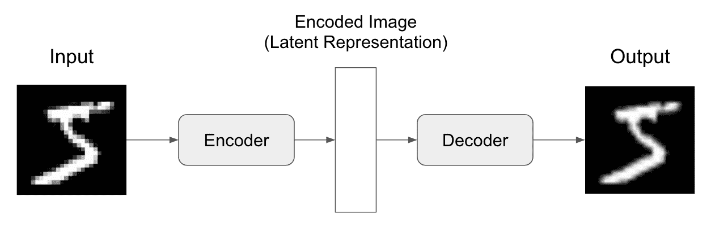

自动编码器的应用示例包括:

*   数据去噪
*   数据可视化的降维
*   图象生成
*   插入文本


# 瓶颈和损失函数

自动编码器在网络上强加了一个瓶颈，强制执行原始输入的压缩知识表示。如果瓶颈不存在，网络将简单地学习记忆输入值。因此，这意味着模型不能很好地概括看不见的数据:

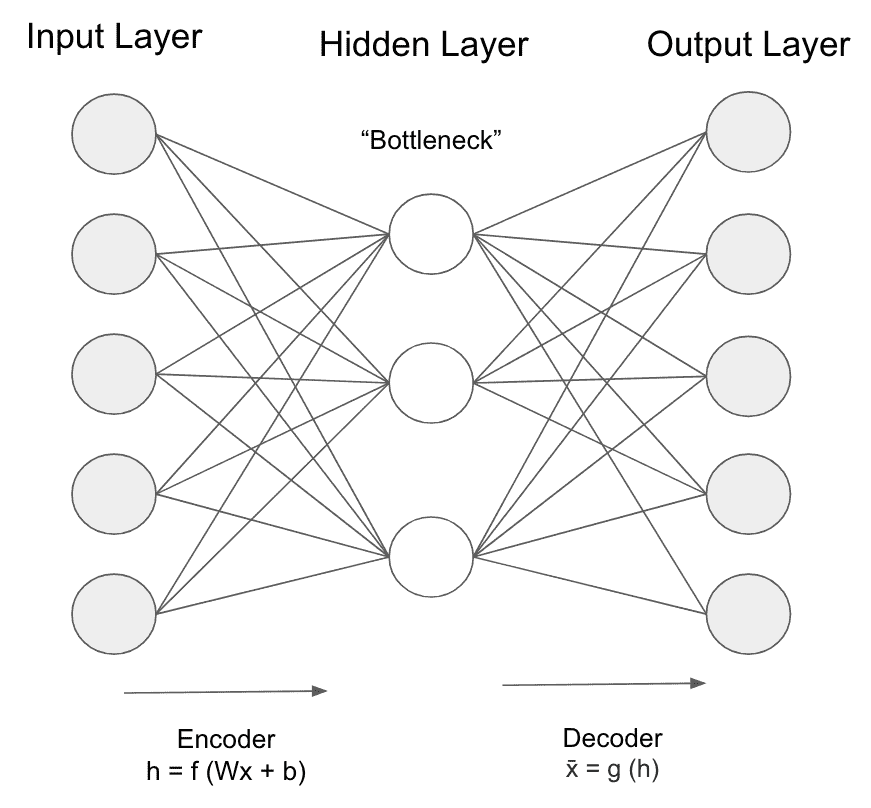

为了让模型检测到信号，我们需要它对输入敏感，但不要太敏感，以至于它只是记住它们，而不能很好地预测看不见的数据。为了确定最佳权衡，我们需要构建一个损失/成本函数:

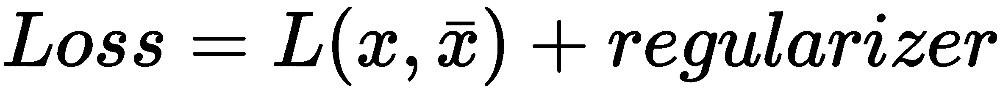

有一些常用的自动编码器架构来施加这两个约束，并确保这两者之间有一个最佳的平衡。


# 编码示例–标准自动编码器

在本例中，我们将向您展示如何在 PyTorch 中编译自动编码器模型:

1.  首先，导入相关的库:

```py
import os
from torch import nn
from torch.autograd import Variable
from torch.utils.data import DataLoader
from torchvision import transforms
from torchvision.datasets import MNIST
from torchvision.utils import save_image
```

2.  现在，定义模型参数:

```py
number_epochs = 10
batch_size = 128
learning_rate = 1e-4
```

3.  然后，启动一个函数来变换 MNIST 数据集中的图像:

```py
transform_image = transforms.Compose([
    transforms.ToTensor(),
    transforms.Normalize((0.5, 0.5, 0.5), (0.5, 0.5, 0.5))
])

dataset = MNIST('./data', transform=transform_image)
data_loader = DataLoader(dataset, batch_size=batch_size, shuffle=True)
```

4.  定义自动编码器类，在其中输入数据并初始化模型:

```py
class autoencoder_model(nn.Module):
    def __init__(self):
        super(autoencoder_model, self).__init__()
        self.encoder = nn.Sequential(
            nn.Linear(28 * 28, 128),
            nn.ReLU(True),
            nn.Linear(128, 64),
            nn.ReLU(True), nn.Linear(64, 12), nn.ReLU(True), nn.Linear(12, 3))
        self.decoder = nn.Sequential(
            nn.Linear(3, 12),
           nn.ReLU(True),
            nn.Linear(12, 64),
            nn.ReLU(True),
            nn.Linear(64, 128),
            nn.ReLU(True), nn.Linear(128, 28 * 28), nn.Tanh())

    def forward(self, x):
        x = self.encoder(x)
        x = self.decoder(x)
        return x

model = autoencoder_model()
criterion = nn.MSELoss()
optimizer = torch.optim.Adam(
model.parameters(), lr=learning_rate, weight_decay=1e-5)
```

5.  定义一个函数，该函数将在每个历元后输出模型中的图像:

```py
def to_image(x):
    x = 0.5 * (x + 1)
    x = x.clamp(0, 1)
    x = x.view(x.size(0), 1, 28, 28)
    return x
```

6.  现在，在每个时期运行模型，并查看重建图像的结果:

```py
for epoch in range(number_epochs):
    for data in data_loader:
        image, i = data
        image = image.view(image.size(0), -1)
        image = Variable(image)

        # Forward pass
        output = model(image)
        loss = criterion(output, image)

        # Backward pass
        optimizer.zero_grad()
        loss.backward()
        optimizer.step()

    print('Epoch [{}/{}], Loss:{:.4f}'.format(epoch + 1, number_epochs, loss.data[0]))
    if epoch % 10 == 0:
        pic = to_image(output.cpu().data)
        save_image(pic, './mlp_img/image_{}.png'.format(epoch))

torch.save(model.state_dict(), './sim_autoencoder.pth')
```

这将产生以下输出:

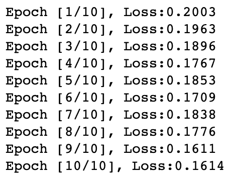

下图显示了自动编码器在每个时期的输出:

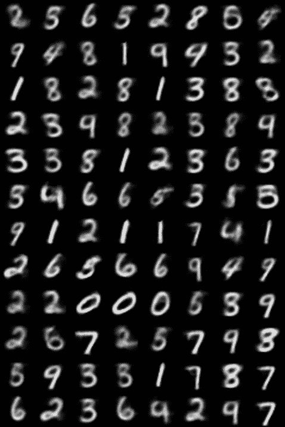

随着模型继续学习，经过的时期越多，图像就变得越清晰。


# 卷积自动编码器

自动编码器可以用于卷积，而不是完全连接的层。这可以使用 3D 矢量而不是 1D 矢量来完成。在图像的上下文中，对图像进行下采样会强制自动编码器学习图像的压缩版本。


# 编码示例–卷积自动编码器

在本例中，我们将向您展示如何编译卷积自动编码器:

1.  和前面一样，您从 MNIST 数据集获得训练和测试数据集，并定义模型参数:

```py
number_epochs = 10
batch_size = 128
learning_rate = 1e-4

transform_image = transforms.Compose([
    transforms.ToTensor(),
    transforms.Normalize((0.5, 0.5, 0.5), (0.5, 0.5, 0.5))
])

dataset = MNIST('./data', transform=transform_image)
data_loader = DataLoader(dataset, batch_size=batch_size, shuffle=True)
```

2.  从这里开始，初始化卷积自动编码器的模型:

```py
class conv_autoencoder(nn.Module):
    def __init__(self):
        super(conv_autoencoder, self).__init__()
        self.encoder = nn.Sequential(
            nn.Conv2d(1, 16, 3, stride=3, padding=1), 
            nn.ReLU(True),
            nn.MaxPool2d(2, stride=2), 
            nn.Conv2d(16, 8, 3, stride=2, padding=1), 
            nn.ReLU(True),
            nn.MaxPool2d(2, stride=1) 
        )
        self.decoder = nn.Sequential(
            nn.ConvTranspose2d(8, 16, 3, stride=2), 
            nn.ReLU(True),
            nn.ConvTranspose2d(16, 8, 5, stride=3, padding=1), 
            nn.ReLU(True),
            nn.ConvTranspose2d(8, 1, 2, stride=2, padding=1), 
            nn.Tanh()
        )

    def forward(self, x):
        x = self.encoder(x)
        x = self.decoder(x)
        return x

model = conv_autoencoder()
criterion = nn.MSELoss()
optimizer = torch.optim.Adam(model.parameters(), lr=learning_rate, weight_decay=1e-5)
```

3.  最后，在每个时期运行模型，同时保存输出图像以供参考:

```py
for epoch in range(number_epochs):
    for data in data_loader:
        img, i = data
        img = Variable(img)

        # Forward pass
        output = model(img)
        loss = criterion(output, img)

        # Backward pass
        optimizer.zero_grad()
        loss.backward()
        optimizer.step()
    # Print results
    print('epoch [{}/{}], loss:{:.4f}'
          .format(epoch+1, number_epochs, loss.data[0]))
    if epoch % 10 == 0:
        pic = to_image(output.cpu().data)
        save_image(pic, './dc_img/image_{}.png'.format(epoch))

torch.save(model.state_dict(), './convolutional_autoencoder.pth')
```

我们可以在代码中提到的文件夹中查看每个纪元后保存的图像。


# 降噪自动编码器

去噪编码器故意将噪声添加到网络的输入中。这些自动编码器实际上创建了数据的损坏副本。这样做有助于编码器学习输入数据中的潜在表示，使其更具普遍性:

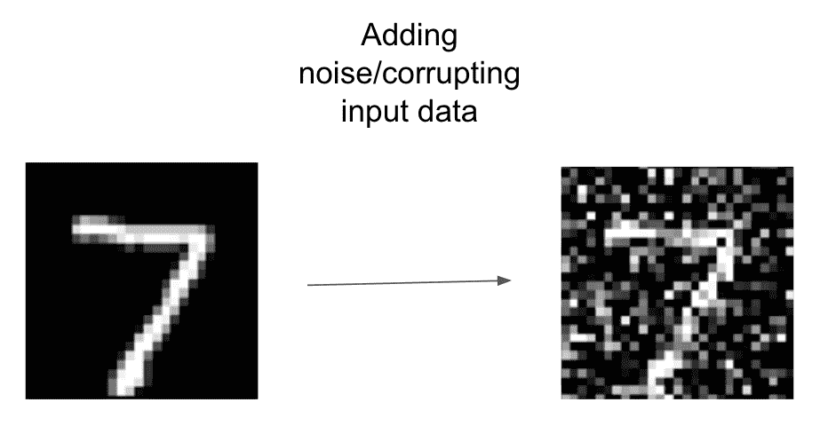

这个被破坏的图像以与其他标准自动编码器相同的方式被馈送到网络中:

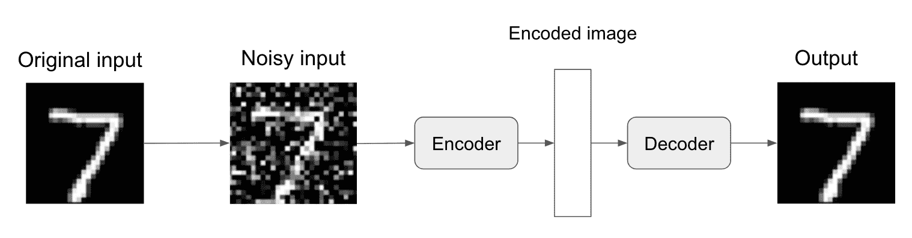

正如我们所看到的，原始输入中添加了噪声，编码器对输入进行编码并将其发送给解码器，然后解码器将噪声输入解码为干净的输出。因此，我们研究了自动编码器的各种应用。我们现在来看一种特定类型的自动编码器，它是一种**变型自动编码器** ( **VAE** )。


# 可变自动编码器

VAEs 不同于迄今为止我们所考虑的标准自动编码器，因为它们以概率方式而不是确定性方式描述潜在空间中的观察。输出每个潜在属性的概率分布，而不是单个值。

标准自动编码器在现实世界中的应用有些有限，因为它们只有在您想要复制已经放入其中的数据时才真正有用。由于 vae 是创成式模型，因此它们可以应用于不希望输出与输入相同的数据的情况。

让我们在现实环境中考虑这个问题。当在人脸数据集上训练 autoencoder 模型时，您会希望它能够学习潜在的属性，例如这个人是否在微笑，他们的肤色，他们是否戴着眼镜，等等:

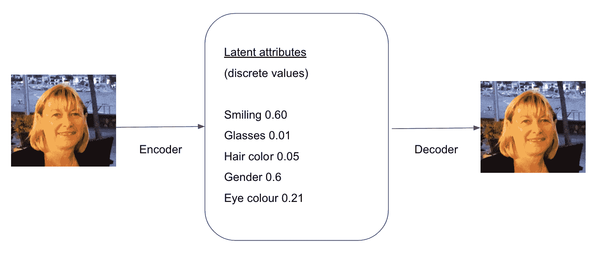

正如我们在上图中看到的，标准自动编码器将这些潜在属性表示为离散值。

如果我们允许每个特征在一个可能值的范围内，而不是单个值，我们可以使用 VAEs 以概率术语描述属性:

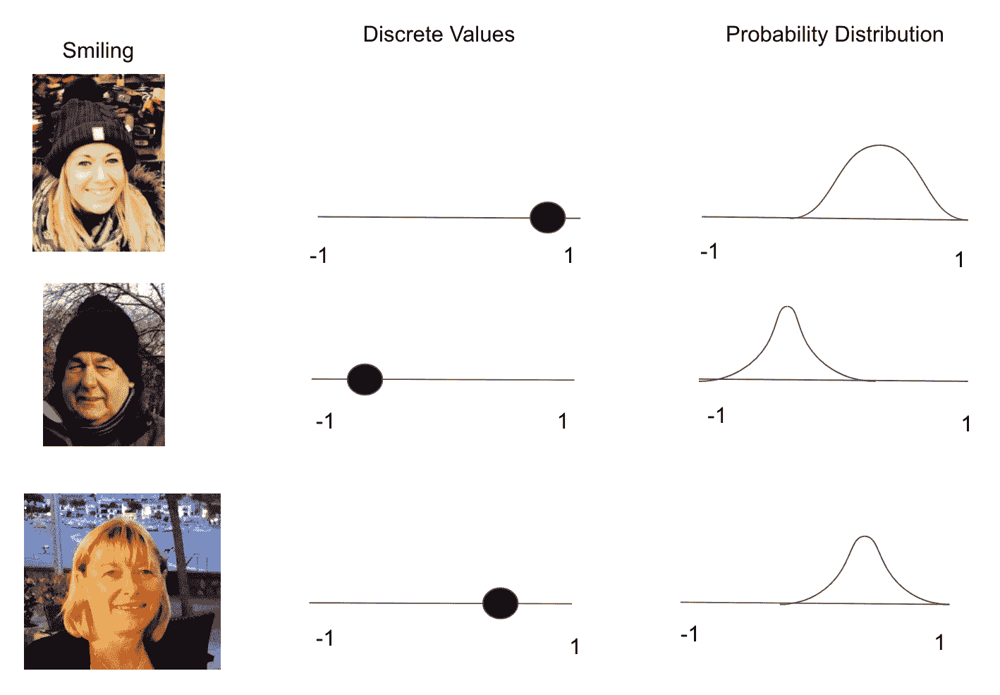

上图描述了我们如何用离散值或概率分布来表示一个人是否在微笑。

从图像中采样每个潜在属性的分布，以便生成用作解码器模型的输入的向量:

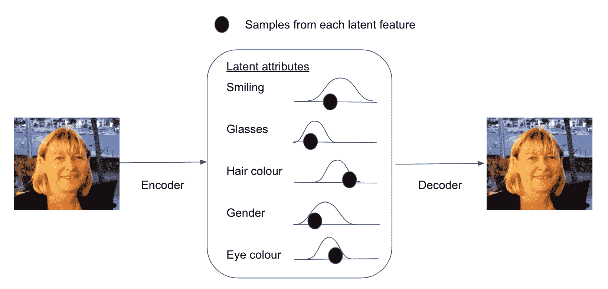

输出两个向量，如下图所示:

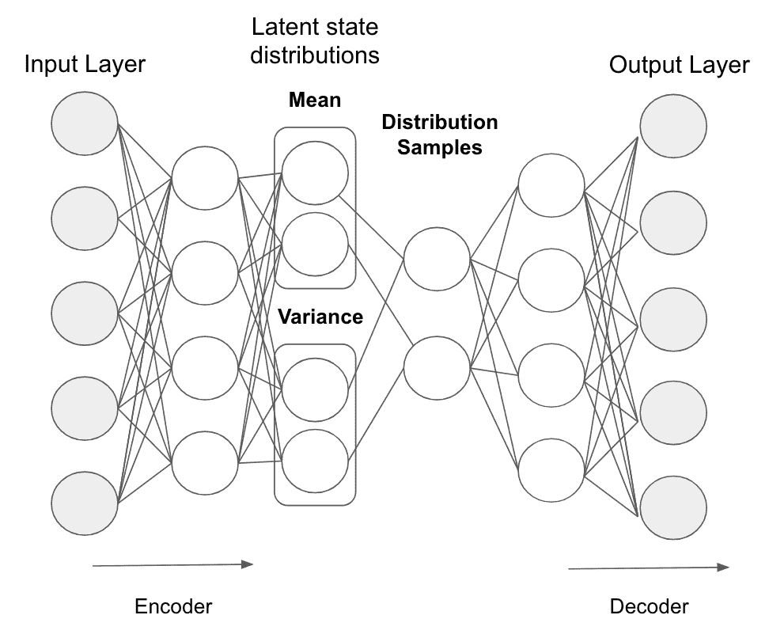

一个描述平均值，另一个描述分布的方差。


# 培训课程

在训练过程中，我们使用称为**反向传播**的过程来计算网络中每个参数相对于总损耗的关系。

标准自动编码器使用反向传播来重建网络权重的损失值。由于 VAEs 中的采样操作不可微，梯度不能从重建误差中传播。下图对此进行了进一步解释:

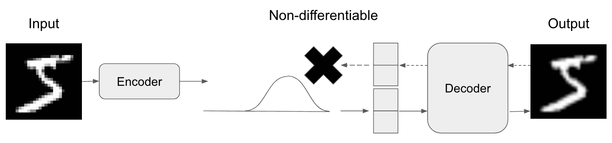

为了克服这个限制，可以使用重新参数化技巧。重新参数化技巧从单位正态分布中采样ε，通过潜在属性的平均𝜇对其进行移位，然后通过潜在属性的方差𝜎:对其进行缩放

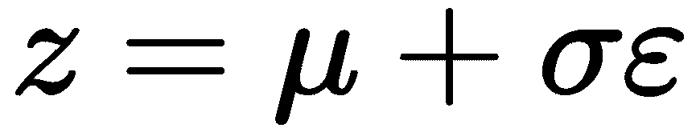

这将采样过程从梯度流中移除，因为它现在在网络之外。因此，采样过程不依赖于网络中的任何东西。我们现在可以优化分布的参数，同时保持从中随机取样的能力:

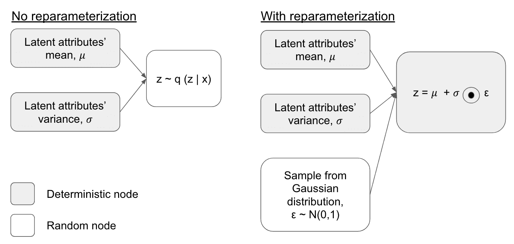

由于每个属性的分布为高斯分布，因此我们可以使用均值、𝜇和协方差矩阵∑进行变换，如下所示:

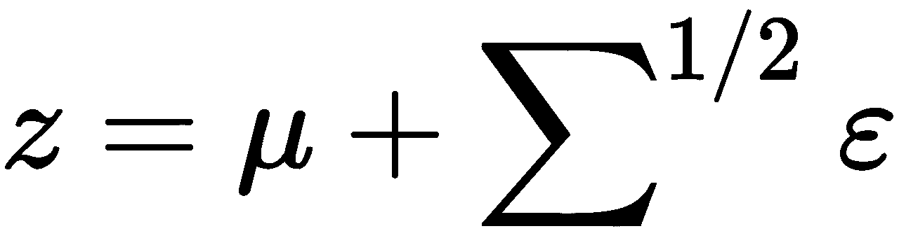

Here, ε ~ N(0,1).

现在，我们可以通过引入重新参数化技巧，使用简单的反向传播来训练模型:

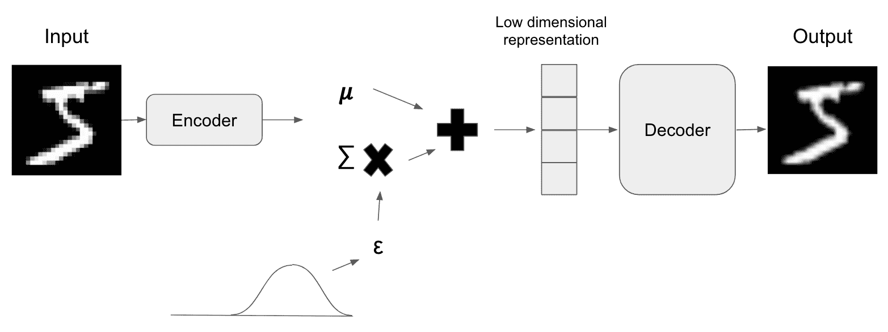

如上图所示，我们已经训练了自动编码器来平滑图像。


# 编码示例-VAE

为了在 PyTorch 中编写一个 VAE，我们可以像前面的例子一样加载库和数据集。从这里，我们可以定义 VAE 类:

```py
class VariationalAutoEncoder(nn.Module):
    def __init__(self):
        super(VariationalAutoEncoder, self).__init__()

        self.fc1 = nn.Linear(784, 400)
        self.fc21 = nn.Linear(400, 20)
        self.fc22 = nn.Linear(400, 20)
        self.fc3 = nn.Linear(20, 400)
        self.fc4 = nn.Linear(400, 784)

    def encode_function(self, x):
        h1 = F.relu(self.fc1(x))
        return self.fc21(h1), self.fc22(h1)

    def reparametrize(self, mu, logvar):
        std = logvar.mul(0.5).exp_()
        if torch.cuda.is_available():
            eps = torch.cuda.FloatTensor(std.size()).normal_()
        else:
            eps = torch.FloatTensor(std.size()).normal_()
        eps = Variable(eps)
        return eps.mul(std).add_(mu)

    def decode_function(self, z):
        h3 = F.relu(self.fc3(z))
        return F.sigmoid(self.fc4(h3))

    def forward(self, x):
        mu, logvar = self.encode_function(x)
        z = self.reparametrize(mu, logvar)
        return self.decode_function(z), mu, logvar
```

然后，我们借助 KL 散度定义损失函数，并启动模型:

```py
def loss_function(reconstruction_x, x, mu, latent_log_variance):
    """
    reconstruction_x: generating images
    x: original images
    mu: latent mean
    """
    BCE = reconstruction_function(reconstruction_x, x) 
    # KL loss = 0.5 * sum(1 + log(sigma^2) - mu^2 - sigma^2)
    KLD_aspect = mu.pow(2).add_(latent_log_variance.exp()).mul_(-1).add_(1).add_(logvar)
    KLD = torch.sum(KLD_aspect).mul_(-0.5)
    # KL divergence
    return BCE + KLD

optimizer = optim.Adam(model.parameters(), lr=1e-4)
```

从这里，我们可以在每个时期运行模型并保存输出:

```py
for epoch in range(number_epochs):
    model.train()
    train_loss = 0
    for batch_idx, data in enumerate(data_loader):
        img, _ = data
        img = img.view(img.size(0), -1)
        img = Variable(img)
        if torch.cuda.is_available():
            img = img.cuda()
        optimizer.zero_grad()
        recon_batch, mu, logvar = model(img)
        loss = loss_function(recon_batch, img, mu, logvar)
        loss.backward()
        train_loss += loss.data[0]
        optimizer.step()
        if batch_idx % 100 == 0:
            print('Train Epoch: {} [{}/{} ({:.0f}%)]\tLoss: {:.6f}'.format(
                epoch,
                batch_idx * len(img),
                len(data_loader.dataset), 100\. * batch_idx / len(data_loader),
                loss.data[0] / len(img)))

    print('Epoch: {} Average loss: {:.4f}'.format(epoch, train_loss / len(data_loader.dataset)))
    if epoch % 10 == 0:
        save = to_image(recon_batch.cpu().data)
        save_image(save, './vae_img/image_{}.png'.format(epoch))

torch.save(model.state_dict(), './vae.pth')
```

现在我们已经看到了各种自动编码器以及如何编译它们，让我们学习如何在推荐系统中实现它们。


# 受限玻尔兹曼机器

一个 **RBM** 是一种算法，已经被广泛用于诸如协同过滤、特征提取、主题建模和维度减少的任务。他们可以在无人监督的情况下学习数据集中的模式。

例如，如果你看了一部电影，然后说你是否喜欢它，我们可以使用 RBM 来帮助我们确定你做出这个决定的原因。

RBM 的目标是最小化由以下公式定义的能量，该公式取决于可见/输入状态、隐藏状态、权重和偏差的配置:

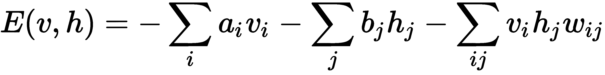

RBM 是两层网络，是 DBN 的基本构造块。RBM 的第一层是神经元的可见/输入层，第二层是神经元的隐藏层:

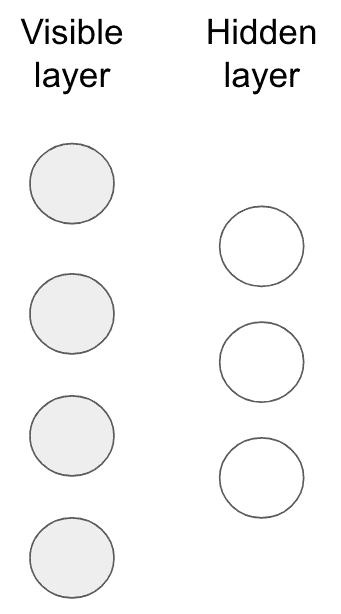

RBM 转换来自可见层的输入，并将其转换成一组数字。通过几次向前和向后传递，然后将数字转换回来以重建输入。RBM 中的限制是同一层中的节点不连接。

从训练数据集中向可见图层的每个节点提供一个低级要素。在图像分类的情况下，每个节点将接收图像中每个像素的一个像素值:

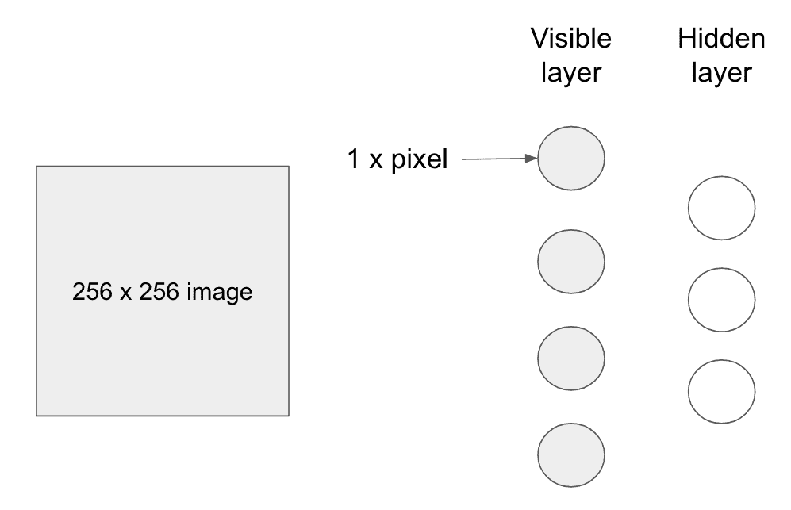

通过网络跟随一个像素，输入 *x* 乘以来自隐藏层的权重，然后加上偏差。从这里，这然后被馈入一个激活函数，该函数产生输出，该输出实质上是在给定输入 *x* 的情况下通过它的信号的强度，如下图所示:

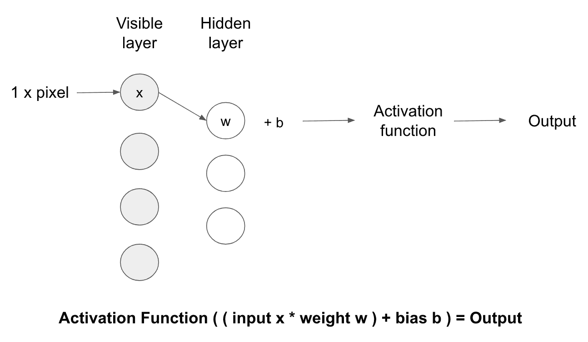

在隐藏层的每个节点，每个像素值的 x 乘以一个单独的权重。然后对乘积求和，并加上一个偏差。然后，其输出通过激活函数传递，在单个节点上产生输出:

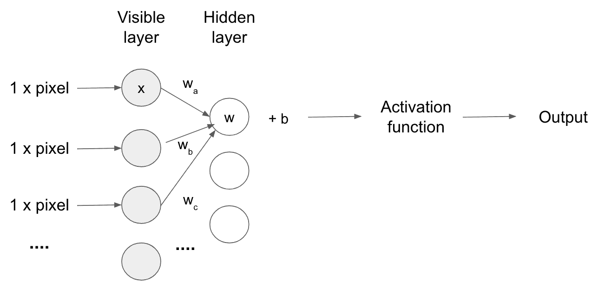

在每一个时间点，RBM 都处于一定的状态，这是指可见 *v* 和隐藏 *h* 层中神经元的值。这种状态的概率可以由下面的联合分布函数给出:

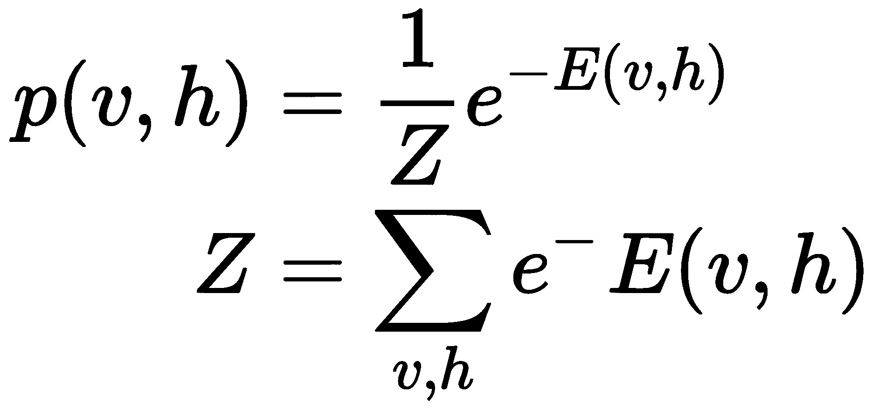

这里，Z 是配分函数，它是所有可能的可见和隐藏向量对的总和。


# 培训成果管理制

RBM 在训练过程中主要执行两个步骤:

1.  **吉布斯采样**:训练过程的第一步使用吉布斯采样，重复以下过程 *k* 次:

*   给定输入向量时隐藏向量的概率；隐藏值的预测。
*   给定隐藏向量时输入向量的概率；输入值的预测。由此，我们获得了另一个输入向量，它是从原始输入值重新创建的。

2.  **对比差异**:RBM 通过对比差异调整权重。在此过程中，随机生成可见节点的权重，并用于生成隐藏节点。然后，隐藏节点使用相同的权重来重建可见节点。用于重构可见节点的权重始终相同。但是，生成的节点并不相同，因为它们彼此并不相连。

一旦 RBM 经过训练，它基本上能够表达两件事:

*   输入数据特征之间的相互关系
*   识别模式时，哪些特征是最重要的


# 理论示例——RBM 推荐系统

在电影的背景下，我们可以使用 RBM 来揭示一系列代表其类型的潜在因素，从而确定一个人喜欢哪种类型的电影。例如，如果我们要求某人告诉我们他们看过哪些电影以及他们是否喜欢这些电影，那么我们可以将他们表示为 RBM 的二进制输入(1 或 0)。对于那些他们没有看过或没有告诉我们的电影，我们需要分配一个值-1，以便网络可以在训练期间识别这些电影，并忽略它们的相关权重。

让我们考虑一个例子，用户喜欢*窈窕奶爸*、*宿醉*和*伴娘*，不喜欢*尖叫*或*精神病*，并且还没有看过*霍比特人*。给定这些输入，RBM 可以识别三个隐藏的因素:喜剧、恐怖和幻想，它们对应于电影的类型:

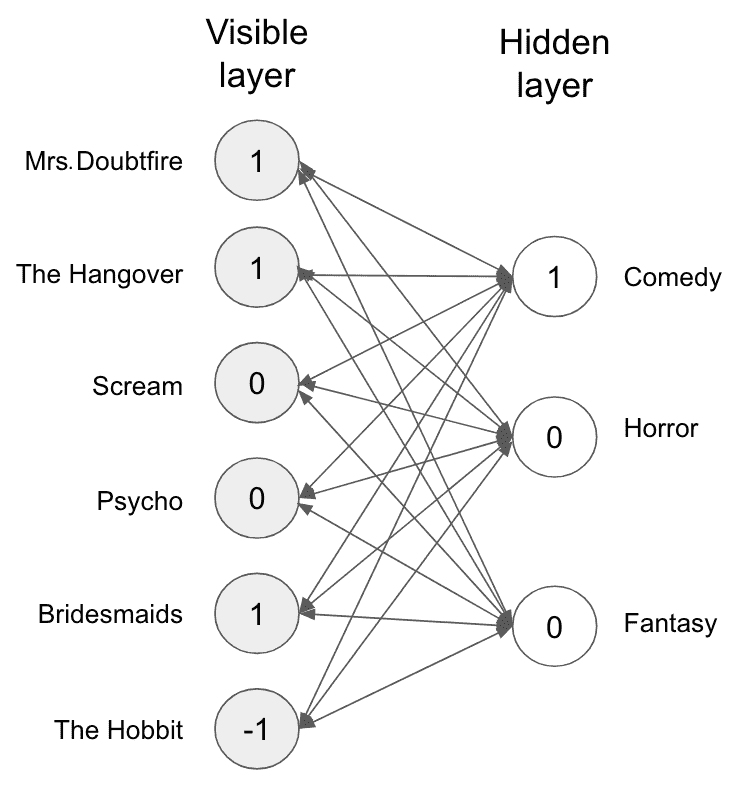

对于每个隐藏神经元，在给定输入神经元的情况下，RBM 分配隐藏神经元的概率。神经元的最终二进制值是通过从伯努利分布采样获得的。

在前面的例子中，代表喜剧类型的唯一隐藏神经元变得活跃。这样，给定输入到 RBM 中的电影评级，它预测用户最喜欢喜剧电影。

对于训练有素的 RBM 来说，根据他们的偏好，对用户尚未看过的电影进行预测，RBM 使用可见神经元给定隐藏神经元的概率。它从伯努利分布中取样，以找出哪一个可见神经元可以变得活跃。


# 编码示例-RBM 推荐系统

继续电影的上下文，我们现在将给出一个例子，说明如何使用 PyTorch 库构建一个 RBM 推荐系统。该示例的目标是训练一个模型来确定用户是否会喜欢某部电影。

在这个例子中，我们使用了 100 万收视率的 MovieLens 数据集([https://grouplens.org/datasets/movielens/](https://grouplens.org/datasets/movielens/))，它是由明尼苏达大学的 GroupLens 研究小组创建的:

1.  首先，下载数据集。这可以通过终端命令完成，如下所示:

```py
wget -O moviedataset.zip http://files.grouplens.org/datasets/movielens/ml-1m.zip
unzip -o moviedataset.zip -d ./data
unzip -o moviedataset.zip -d ./data
```

2.  现在导入我们将使用的库:

```py
import numpy as np
import pandas as pd
import torch
import torch.nn as nn
import torch.nn.parallel
import torch.optim as optim
import torch.utils.data
from torch.autograd import Variable
```

3.  然后导入数据:

```py
movies = pd.read_csv('ml-1m/movies.dat', sep = '::', header = None, engine = 'python', encoding = 'latin-1')
users = pd.read_csv('ml-1m/users.dat', sep = '::', header = None, engine = 'python', encoding = 'latin-1')
ratings = pd.read_csv('ml-1m/ratings.dat', sep = '::', header = None, engine = 'python', encoding = 'latin-1')
```

下面的屏幕截图展示了我们的数据集的结构:


4.  准备测试和训练数据集:

```py
training_dataset = pd.read_csv('ml-100k/u1.base', delimiter = '\t')
training_dataset = np.array(training_set, dtype = 'int')
test_dataset = pd.read_csv('ml-100k/u1.test', delimiter = '\t')
test_dataset = np.array(test_dataset, dtype = 'int') 
```

5.  现在我们需要准备一个用户评级矩阵。该矩阵将用户作为行，电影作为列。零用来表示用户没有给某部电影评分的情况。我们定义`no_users`和`no_movies`变量，然后考虑训练和测试数据集中的`max`值，如下所示:

```py
no_users = int(max(max(training_dataset[:,0]), max(test_dataset[:,0])))
no_movies = int(max(max(training_dataset[:,1]), max(test_dataset[:,1])))
```

6.  现在我们定义一个名为`convert_dataset`的函数，将数据集转换成一个矩阵。这是通过创建一个循环来实现的，该循环将遍历数据集并获取特定用户评级的所有电影以及该用户的评级。我们首先创建一个零矩阵，因为存在用户没有评级的电影:

```py
def convert_dataset(data):
    converted_data = []
    for id_users in range(1, no_users + 1):
        id_movies = data[:,1][data[:,0] == id_users]
        id_ratings = data[:,2][data[:,0] == id_users]
        movie_ratings = np.zeros(no_movies)
        ratings[id_movies - 1] = id_ratings
        converted_data.append(list(movie_ratings))
    return converted_data

training_dataset = convert_dataset(training_dataset)
test_dataset = convert_dataset(test_dataset)
```

7.  现在我们通过使用`FloatTensor`实用程序将数据转换成 Torch 张量。这将把数据集转换成 PyTorch 数组:

```py
training_dataset = torch.FloatTensor(training_dataset)
test_dataset = torch.FloatTensor(test_dataset)
```

8.  在这个例子中，我们要进行二元分类，即用户是否会喜欢这部电影。因此，我们将评级转换为 0 和 1。但是，首先，我们用-1 替换现有的零，以表示用户从未评价过的电影:

```py
training_dataset[training_dataset == 0] = -1
training_dataset[training_dataset == 1] = 0
training_dataset[training_dataset == 2] = 0
training_dataset[training_dataset >= 3] = 1
test_dataset[test_dataset == 0] = -1
test_dataset[test_dataset == 1] = 0
test_dataset[test_dataset == 2] = 0
test_dataset[test_dataset >= 3] = 1
```

9.  现在，我们需要创建一个类来定义 RBM 的架构。该类使用随机正态分布初始化权重和偏差。还定义了两种类型的偏差，其中`a`是给定可见节点时隐藏节点的概率，而`b`是给定隐藏节点时可见节点的概率。该类创建了一个`sample_hidden_nodes`函数，它以`x`作为参数，表示可见的神经元。从这里，我们计算给定`v`的`h`的概率，其中`h`和`v`分别代表隐藏和可见的节点。这代表了乙状结肠激活功能。它被计算为权重向量和`x`加上偏差`a`的乘积。由于我们正在考虑二元分类模型，我们返回隐藏神经元的伯努利样本。从这里，我们创建一个`sample_visible_function`函数，它将对可见节点进行采样。最后，我们创建训练函数。它采用包含电影分级的输入向量、在 *k* 次采样后获得的可见节点、概率向量以及在 *k* 次采样后隐藏节点的概率:

```py
class RBM():
    def __init__(self, num_visible_nodes, num_hidden_nodes):
        self.W = torch.randn(num_hidden_nodes, num_visible_nodes)
        self.a = torch.randn(1, num_hidden_nodes)
        self.b = torch.randn(1, num_visible_nodes)

    def sample_hidden_nodes(self, x):
        wx = torch.mm(x, self.W.t())
        activation = wx + self.a.expand_as(wx)
        p_h_given_v = torch.sigmoid(activation)
        return p_h_given_v, torch.bernoulli(p_h_given_v)

    def sample_visible_nodes(self, y):
        wy = torch.mm(y, self.W)
        activation = wy + self.b.expand_as(wy)
        p_v_given_h = torch.sigmoid(activation)
        return p_v_given_h, torch.bernoulli(p_v_given_h)

    def train(self, v0, vk, ph0, phk):
        self.W += torch.mm(v0.t(), ph0) - torch.mm(vk.t(), phk)
        self.b += torch.sum((v0 - vk), 0)
        self.a += torch.sum((ph0 - phk), 0)
```

10.  现在我们定义我们的模型参数:

```py
num_visible_nodes = len(training_dataset[0])
num_hidden_nodes = 200
batch_size = 100
rbm = RBM(num_visible_nodes, num_hidden_nodes)
```

11.  从这里，我们可以为每个时期训练模型:

```py
nb_epoch = 10
for epoch in range(1, nb_epoch + 1):
    train_loss = 0
    s = 0.
    for id_user in range(0, nb_users - batch_size, batch_size):
        vk = training_dataset[id_user:id_user+batch_size]
        v0 = training_dataset[id_user:id_user+batch_size]
        ph0,_ = rbm.sample_hidden_nodes(v0)
        for k in range(10):
            _,hk = rbm.sample_hidden_nodes(vk)
            _,vk = rbm.sample_visible_nodes(hk)
            vk[v0<0] = v0[v0<0]
        phk,_ = rbm.sample_hidden_nodes(vk)
        rbm.train(v0, vk, ph0, phk)
        train_loss += torch.mean(torch.abs(v0[v0>=0] - vk[v0>=0]))
        s += 1.
    print('epoch: '+str(epoch)+' loss: '+str(train_loss/s))
```

我们可以在训练期间绘制跨时期的误差:

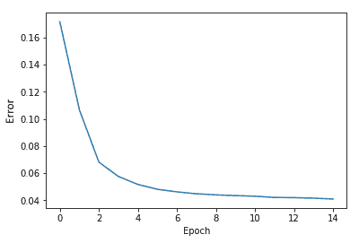

这可以帮助我们确定应该运行多少个时期的训练。它表明在六个时期之后，改进的性能比率下降，因此我们应该考虑在这个阶段停止训练。

我们已经看到了在 RBM 实现推荐系统的编码示例，现在让我们简单地浏览一下 DBN 的架构。


# DBN 建筑

DBN 是一个多层的信念网络，其中每一层都是相互堆叠的 RBM。除了 DBN 的第一层和最后一层之外，每一层都既是其之前节点的隐藏层，也是其之后节点的输入层:

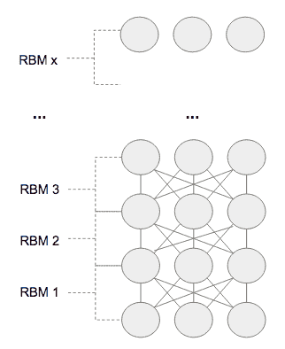

DBN 中的两层由权重矩阵连接。DBN 的最上面两层是无向的，这使得它们之间有一个对称的连接，形成一个联想记忆。下面的两层与上面的层直接相连。方向感将联想记忆转化为观察变量:


DBNs 的两个最重要的属性如下:

*   DBN 通过有效的逐层过程自上而下地学习生成权重。这些权重决定了一个层中的变量如何依赖于上面的层。
*   一旦训练完成，每一层中的隐藏变量的值可以通过单次自底向上的传递来推断。该过程从较低层中的可见数据向量开始，并在相反方向上使用其生成权重。

可见层和隐藏层上的联合配置网络的概率取决于联合配置网络的能量与所有其他联合配置网络的能量的比较:

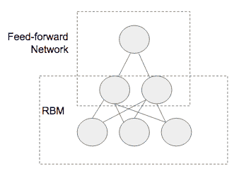

一旦 RBM 堆栈完成了 DBN 的预训练阶段，前馈网络就可以用于微调阶段，以便创建分类器或简单地帮助在无监督学习场景中聚类未标记的数据。


# 微调

微调旨在找到各层之间权重的最佳值。它调整了原始特征，以获得更精确的类边界。为了帮助模型将模式和特征与数据集相关联，使用了一个小的带标签的数据集。

微调可以作为自下而上的随机过程来应用，然后用于调整自上而下的权重。一旦到达顶层，递归就被应用到顶层。为了进一步微调，我们可以做一个随机的自上而下的传递，并调整自下而上的权重。


# 摘要

在这一章中，我们解释了什么是自动编码器以及它们的不同变体。在本章中，我们给出了一些编码示例，说明如何将它们应用于 MNIST 数据集。我们随后介绍了 RBM，并通过一些额外的例子解释了如何将它们开发成 DBN。

在下一章，我们将介绍生成敌对网络。我们将展示如何使用它们来生成图像和文本。


# 进一步阅读

有关更多信息，请参考以下内容:

*   *变型自动编码器教程*:【https://arxiv.org/abs/1606.05908 
*   *cs 598 laz–变型自动编码器*:【http://slazebni.cs.illinois.edu/spring17/lec12_vae.pdf 
*   *自动编码变分贝叶斯*:【https://arxiv.org/abs/1312.6114 
*   *深度学习书籍*:【https://www.deeplearningbook.org/contents/autoencoders.html】T2
*   *深度信念网的快速学习算法*:【http://www.cs.toronto.edu/~fritz/absps/ncfast.pdf】T2
*   *训练受限玻尔兹曼机器:介绍*:[https://www . science direct . com/science/article/ABS/pii/s 0031320313002495](https://www.sciencedirect.com/science/article/abs/pii/S0031320313002495)
*   *深度玻尔兹曼机器*:[http://proceedings . MLR . press/V5/salakhutdinov 09 a/salakhutdinov 09 a . pdf](http://proceedings.mlr.press/v5/salakhutdinov09a/salakhutdinov09a.pdf)
*   训练受限玻尔兹曼机器的实用指南:【https://www.cs.toronto.edu/~hinton/absps/guideTR.pdf 
*   *深度信念网络*:[https://link . springer . com/chapter/10.1007/978-3-319-06938-8 _ 8](https://link.springer.com/chapter/10.1007/978-3-319-06938-8_8)
*   *动手神经网络:*[https://www . Amazon . co . uk/Hands-Neural-Networks-Neural-network-ebook/DP/b 07 SKD SGB 6/](https://www.amazon.co.uk/Hands-Neural-Networks-neural-network-ebook/dp/B07SKDSGB6/)