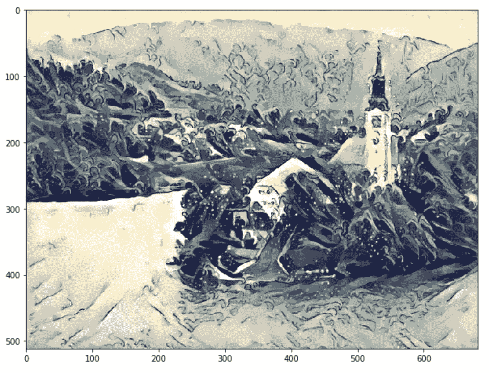
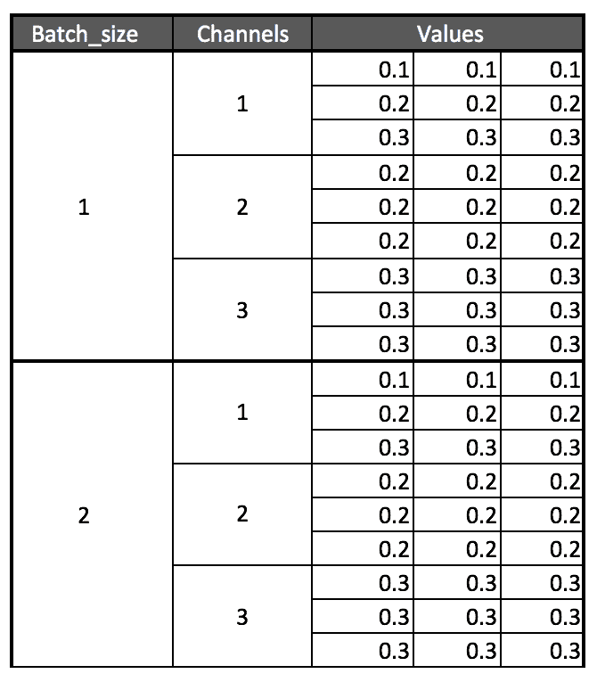
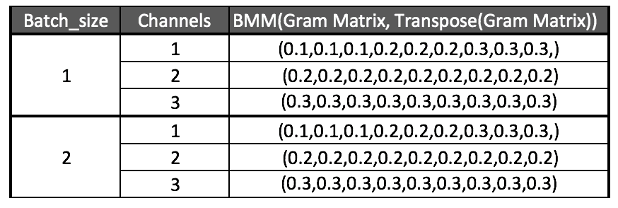
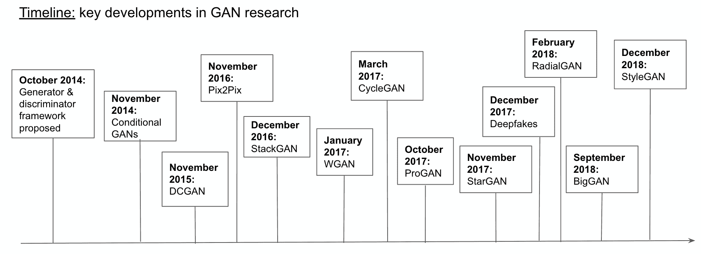
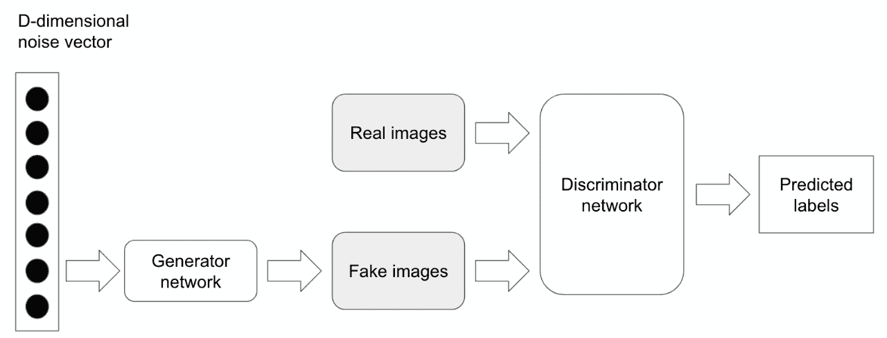
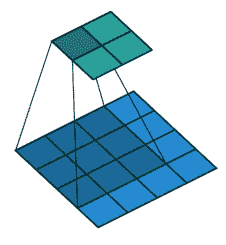
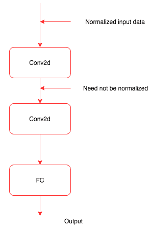
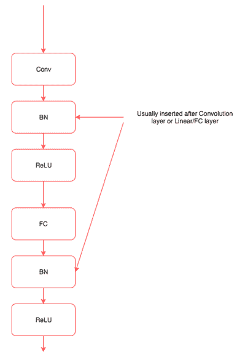
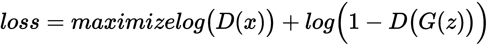
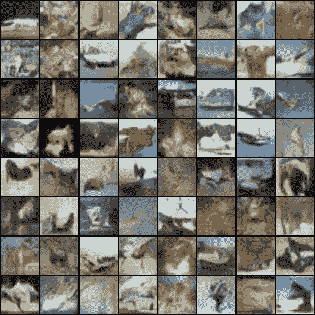

# 十、使用生成对抗网络

我们在前几章看到的所有例子都集中在解决分类或回归等问题上。这一章非常有趣，对于理解深度学习如何进化以解决无监督学习中的问题非常重要。

在本章中，我们将训练学习如何创建以下内容的网络:

*   基于内容和特定艺术风格的图像，通常称为风格迁移
*   用一种特殊类型的**生成对抗网络** ( **干**)生成新人的面孔

这些技术构成了深度学习领域大多数高级研究的基础。深入每个子领域的具体细节，比如 GANs 和语言建模，超出了本书的范围，因为它们应该有单独的一本书。我们将学习它们一般是如何工作的，以及在 PyTorch 中构建它们的过程。

本章将涵盖以下主题:

*   神经类型转移
*   GANs 简介
*   达金斯


# 神经类型转移

我们人类创作的艺术品具有不同的精确度和复杂程度。虽然艺术创作的过程可能是一个非常复杂的过程，但它可以被视为两个最重要因素的结合，即画什么和怎么画。画什么受到我们周围所见的启发，我们如何画也会受到我们周围某些事物的影响。从艺术家的角度来看，这可能过于简单，但对于理解我们如何使用深度学习算法创作艺术品来说，这非常有用。

我们将训练一种深度学习算法，从一幅图像中提取内容，然后根据特定的艺术风格绘制它。如果你是一名艺术家或者从事创意行业，你可以直接利用近年来进行的惊人研究来改进这一点，并在你工作的领域内创造一些很酷的东西。即使你不是，它仍然把你引入了生成模型的领域，在那里网络生成新的内容。

让我们从高层次上理解在神经风格转换中做了什么，然后深入细节，以及构建它所需的 PyTorch 代码。样式转移算法具有内容图像(C)和样式图像(S)——该算法必须生成新的图像(O ),该图像具有来自内容图像的内容和来自样式图像的样式。这种创造神经风格迁移的过程是由莱昂·盖茨(Leon Gates)等人在 2015 年的论文中介绍的，*一种艺术风格的神经算法*(【https://arxiv.org/pdf/1508.06576.pdf】)。以下是我们将使用的内容图像(C ):


以下是风格图片:


Source of the preceding image: The Great Wave Off Kanagawa from by Katsushika Hokusai ([https://commons.wikimedia.org/wiki/File:The_Great_Wave_off_Kanagawa.jpg](https://commons.wikimedia.org/wiki/File:The_Great_Wave_off_Kanagawa.jpg)[)](https://commons.wikimedia.org/wiki/File:The_Great_Wave_off_Kanagawa.jpg)

这是我们最终会得到的图像:



当你理解**卷积神经网络**(**CNN**)如何工作时，风格迁移背后的想法就变得清晰了。当 CNN 被训练用于物体识别时，经过训练的 CNN 的早期层学习非常普通的信息，如直线、曲线和形状。CNN 的最后一层捕捉图像中更高层次的概念，如眼睛、建筑物和树木。所以相似图像的最后一层的值趋于接近。我们采用相同的概念，并将其应用于内容损失。内容图像和生成图像的最后一层应该是相似的，我们使用均方误差(MSE)来计算相似性。我们使用优化算法来降低损失值。

图像的风格通常通过一种称为 gram matrix 的技术在 CNN 的多个层中捕捉。gram 矩阵计算跨多个图层捕获的特征图之间的相关性。gram 矩阵给出了计算样式的度量。相似风格的图像具有相似的 gram 矩阵值。还使用风格图像的 gram 矩阵和生成的图像之间的 MSE 来计算风格损失。

我们将使用 TorchVision 模型中提供的预训练 VGG19 模型。训练风格迁移模型所需的步骤类似于任何其他深度学习模型，除了计算损失比分类或回归模型更复杂这一事实。神经类型算法的训练可以分解为以下步骤:

1.  正在加载数据。
2.  创建 VGG19 模型。
3.  定义内容损失。
4.  定义风格损失。
5.  从 VGG 模型中提取跨层损失。
6.  创建优化器。
7.  训练—生成与内容图像相似的图像，以及与样式图像相似的样式。


# 加载数据

加载数据类似于我们在第 3 章*中看到的解决图像分类问题，深入研究神经网络*。我们将使用预训练的 VGG 模型，因此我们必须使用与训练预训练模型相同的值来归一化图像。

下面的代码展示了我们如何做到这一点。代码基本上是不言自明的，因为我们已经在前面的章节中详细讨论过了:

```py
image_size = 512 
is_cuda = torch.cuda.is_available()
preprocessing = transforms.Compose([transforms.Resize(image_size),
                           transforms.ToTensor(),
                           transforms.Lambda(lambda x: x[torch.LongTensor([2,1,0])]), 
                           transforms.Normalize(mean=[0.40760392, 0.45795686, 0.48501961], 
                                                std=[1,1,1]),
                           transforms.Lambda(lambda x: x.mul_(255)),
                          ])
processing = transforms.Compose([transforms.Lambda(lambda x: x.mul_(1./255)),
                           transforms.Normalize(mean=[-0.40760392, -0.45795686, -0.48501961], 
                                                std=[1,1,1]),
                           transforms.Lambda(lambda x: x[torch.LongTensor([2,1,0])]), 
                           ])
postprocess = transforms.Compose([transforms.ToPILImage()])

def postprocess_b(tensor): 
    t = processing(tensor)
    t[t>1] = 1 
    t[t<0] = 0
    img = postprocess(t)
    return img
```

在这段代码中，我们定义了三个功能，预处理完成所有需要的预处理，并使用与训练 VGG 模型相同的值进行归一化。模型的输出需要归一化回其原始值；`processing`函数执行所需的处理。生成的模型可能超出了可接受值的范围，`postprocess_b`函数将所有大于 1 的值和小于 0 的值限制为 0。

现在我们定义`loader`函数，它加载图像，应用`preprocessing`转换，并将其转换为一个变量:

```py
def loader(image_name):
    image = Image.open(image_name)
    image = Variable(preprocessing(image))
    # fake batch dimension required to fit network's input dimensions
    image = image.unsqueeze(0)
    return image
```

以下函数加载样式和内容图像:

```py
style_image = loader("img/style_image.jpg")
content_image = loader("img/content_image.jpg")
```

我们可以创建一个带有噪声(随机数)的图像，也可以使用相同的内容图像。在这种情况下，我们将使用内容图像。以下代码创建内容图像:

```py
output_image = Variable(content_image.data.clone(),requires_grad=True)
```

我们将使用优化器来调整`output_image`变量的值，以使图像更接近内容图像和样式图像。出于这个原因，我们要求 PyTorch 通过提及`requires_grad=True`来保持梯度。


# 创造 VGG 模式

我们将从`torchvisions.models`加载一个预训练模型。我们将仅在提取特征时使用该模型，并且 PyTorch VGG 模型以这样的方式定义，即所有卷积块将在特征模块中，并且全连接或线性层在分类器模块中。由于我们将不训练 VGG 模型中的任何权重或参数，因此我们还将冻结该模型，如以下代码所示:

```py
vgg = vgg19(pretrained=True).features
for param in vgg.parameters():
   param.requires_grad = False
```

在这段代码中，我们创建了一个 VGG 模型，只使用了它的卷积块，并冻结了模型的所有参数，因为我们将只使用它来提取特征。


# 内容损失

**内容损失**是输入和输出图像之间的距离。目的是保留图像的原始内容。它是根据特定图层的输出计算的 MSE，通过网络传递两幅图像来提取。我们通过使用`register_forward_hook`功能从 VGG 中提取中间层的输出，传入内容图像和要优化的图像。

我们计算从这些层的输出中获得的 MSE，如以下代码所述:

```py
target_layer = dummy_fn(content_img)
noise_layer = dummy_fn(noise_img)
criterion = nn.MSELoss()
content_loss = criterion(target_layer,noise_layer)
```

我们将在接下来的小节中为这段代码实现`dummy_fn`。目前，我们只知道`dummy_fn`函数通过传递图像返回特定层的输出。我们将通过传递内容图像和噪声图像生成的输出传递给 MSE 损失函数。


# 风格丧失

跨多个层计算样式损失。风格损失是为每个特征图生成的 gram 矩阵的 MSE。gram 矩阵表示其特征的相关值。让我们通过下图和一个代码实现来理解 gram matrix 是如何工作的。

下表显示了维度为[2，3，3，3]的特征映射的输出，具有列属性 **Batch_size** 、**通道**和**值**:



为了计算 gram 矩阵，我们展平每个通道的所有值，然后通过乘以其转置找到其相关性，如下表所示:



我们所做的只是将每个通道的所有值展平为一个向量或张量。以下代码实现了这一点:

```py
class GramMatrix(nn.Module):

   def forward(self,input):
       b,c,h,w = input.size()
       features = input.view(b,c,h*w)
       gram_matrix = torch.bmm(features,features.transpose(1,2))
       gram_matrix.div_(h*w)
       return gram_matrix
```

我们将`GramMatrix`函数实现为另一个具有`forward`函数的 PyTorch 模块，这样我们就可以像使用 PyTorch 层一样使用它。我们从这一行的输入图像中提取不同的维度:

```py
b,c,h,w = input.size()
```

这里，`b`表示批次，`c`表示过滤器或通道，`h`表示高度，`w`表示宽度。在下一步中，我们将使用以下代码保持批次和通道尺寸不变，并沿高度和宽度尺寸展平所有值，如上图所示:

```py
features = input.view(b,c,h*w)
```

gram 矩阵是通过将展平值与其转置向量相乘来计算的。我们可以通过使用 PyTorch 批处理矩阵乘法函数来实现，提供为`torch.bmm()`，如下面的代码所示:

```py
gram_matrix = torch.bmm(features,features.transpose(1,2))
```

我们通过将 gram 矩阵除以元素的数量来完成对其值的归一化。这防止了具有大量值的特定特征图支配分数。一旦计算出`GramMatrix`,计算样式损失就变得简单了，这在下面的代码中实现:

```py
class StyleLoss(nn.Module):
   def forward(self,inputs,targets):
       out = nn.MSELoss()(GramMatrix()(inputs),targets)
       return (out)
```

`StyleLoss`类被实现为另一个 PyTorch 层。它计算输入值`GramMatrix`和风格图像值`GramMatrix`之间的 MSE。


# 提取损失

就像我们使用`register_forward_hook()`函数提取卷积层的激活一样，我们可以提取计算样式损失和内容损失所需的不同卷积层的损失。这种情况下的一个区别是，我们需要提取多个层的输出，而不是从一个层提取。下面的类集成了所需的更改:

```py
class LayerActivations():
   features=[]

   def __init__(self,model,layer_numbers):

       self.hooks = []
       for layer_num in layer_numbers:
           self.hooks.append(model[layer_numbers].register_forward_hook(self.hook_fn))

   def hook_fn(self,module,input,output):
       self.features.append(output)

   def remove(self):
       for hook in self.hooks:
           hook.remove()
```

`__init__`方法获取我们需要调用`register_forward_hook`方法的模型和我们需要提取输出的层数。`__init__`方法中的`for`循环遍历层数并注册拉输出所需的前向钩子。

在注册了`hook_fn`函数的层之后，PyTorch 调用传递给`register_forward_hook`方法的`hook_fn`函数。在函数内部，我们捕获输出并将其存储在 features 数组中。

当我们不想捕获输出时，我们需要调用一次 remove 函数。忘记调用 remove 方法会导致内存不足异常，因为所有的输出都会累积起来。

让我们编写另一个实用函数，它可以提取样式和内容图像所需的输出。以下函数具有相同的功能:

```py
def extract_layers(layers,image,model=None):

   la = LayerActivations(model,layers)
   la.features = []
   out = model(image)
   la.remove()
   return la.features
```

在`extract_layers`函数中，我们通过传入模型和层号为`LayerActivations`类创建对象。特性列表可能包含以前运行的输出，所以我们要重新初始化一个空列表。然后我们通过模型传入图像，我们不打算使用输出。我们对特性数组中生成的输出更感兴趣。我们调用 remove 方法从模型中删除所有注册的钩子并返回特性。下面的代码显示了我们如何提取样式和内容所需的目标图像:

```py
content_targets = extract_layers(content_layers,content_img,model=vgg)
style_targets = extract_layers(style_layers,style_img,model=vgg)
```

一旦我们提取了目标，我们需要将输出从创建它们的图中分离出来。请记住，所有这些输出都是 PyTorch 变量，它们维护着关于如何创建它们的信息。但是，在我们的例子中，我们只对输出值感兴趣，对图形不感兴趣，因为我们既不更新样式图像，也不更新内容图像。以下代码说明了这种技术:

```py
content_targets = [t.detach() for t in content_targets]
style_targets = [GramMatrix()(t).detach() for t in style_targets]
```

一旦我们分离了，让我们把所有的目标添加到一个列表中。以下代码说明了这种技术:

```py
targets = style_targets + content_targets
```

在计算样式损失和内容损失时，我们传递了两个名为内容层和样式层的列表。不同的图层选择会对生成的图像质量产生影响。让我们选择与论文作者提到的相同的层。下面的代码显示了我们在这里使用的层的选择:

```py
style_layers = [1,6,11,20,25]
content_layers = [21]
loss_layers = style_layers + content_layers
```

优化器期望单个标量最小化。为了获得单个标量值，我们将到达不同层的所有损耗相加。通常的做法是对这些损失进行加权求和，我们再次选择了与 GitHub 资源库([https://github.com/leongatys/PytorchNeuralStyleTransfer](https://github.com/leongatys/PytorchNeuralStyleTransfer))中的论文实现中使用的相同权重。我们的实现是作者的实现的稍微修改的版本。以下代码描述了所使用的权重，这些权重是由所选图层中的过滤器数量计算得出的:

```py
style_weights = [1e3/n**2 for n in [64,128,256,512,512]]
content_weights = [1e0]
weights = style_weights + content_weights
```

为了形象化这一点，我们可以打印 VGG 层。花一分钟观察我们选择了哪些图层，您可以尝试不同的图层组合。我们将使用以下代码来打印 VGG 层:

```py
print(vgg)
```

这会产生以下输出:

```py
#Results

Sequential(
 (0): Conv2d (3, 64, kernel_size=(3, 3), stride=(1, 1), padding=(1, 1))
 (1): ReLU(inplace)
 (2): Conv2d (64, 64, kernel_size=(3, 3), stride=(1, 1), padding=(1, 1))
 (3): ReLU(inplace)
 (4): MaxPool2d(kernel_size=(2, 2), stride=(2, 2), dilation=(1, 1))
 (5): Conv2d (64, 128, kernel_size=(3, 3), stride=(1, 1), padding=(1, 1))
 (6): ReLU(inplace)
 (7): Conv2d (128, 128, kernel_size=(3, 3), stride=(1, 1), padding=(1, 1))
 (8): ReLU(inplace)
 (9): MaxPool2d(kernel_size=(2, 2), stride=(2, 2), dilation=(1, 1))
 (10): Conv2d (128, 256, kernel_size=(3, 3), stride=(1, 1), padding=(1, 1))
 (11): ReLU(inplace)
 (12): Conv2d (256, 256, kernel_size=(3, 3), stride=(1, 1), padding=(1, 1))
 (13): ReLU(inplace)
 (14): Conv2d (256, 256, kernel_size=(3, 3), stride=(1, 1), padding=(1, 1))
 (15): ReLU(inplace)
 (16): Conv2d (256, 256, kernel_size=(3, 3), stride=(1, 1), padding=(1, 1))
 (17): ReLU(inplace)
 (18): MaxPool2d(kernel_size=(2, 2), stride=(2, 2), dilation=(1, 1))
 (19): Conv2d (256, 512, kernel_size=(3, 3), stride=(1, 1), padding=(1, 1))
 (20): ReLU(inplace)
 (21): Conv2d (512, 512, kernel_size=(3, 3), stride=(1, 1), padding=(1, 1))
 (22): ReLU(inplace)
 (23): Conv2d (512, 512, kernel_size=(3, 3), stride=(1, 1), padding=(1, 1))
 (24): ReLU(inplace)
 (25): Conv2d (512, 512, kernel_size=(3, 3), stride=(1, 1), padding=(1, 1))
 (26): ReLU(inplace)
 (27): MaxPool2d(kernel_size=(2, 2), stride=(2, 2), dilation=(1, 1))
 (28): Conv2d (512, 512, kernel_size=(3, 3), stride=(1, 1), padding=(1, 1))
 (29): ReLU(inplace)
 (30): Conv2d (512, 512, kernel_size=(3, 3), stride=(1, 1), padding=(1, 1))
 (31): ReLU(inplace)
 (32): Conv2d (512, 512, kernel_size=(3, 3), stride=(1, 1), padding=(1, 1))
 (33): ReLU(inplace)
 (34): Conv2d (512, 512, kernel_size=(3, 3), stride=(1, 1), padding=(1, 1))
 (35): ReLU(inplace)
 (36): MaxPool2d(kernel_size=(2, 2), stride=(2, 2), dilation=(1, 1))
)
```

我们必须定义损失函数和优化器来生成艺术图像。我们将在下一节中初始化它们。


# 为每个层创建损失函数

我们已经将损失函数定义为 PyTorch 层。因此，让我们为不同的样式损失和内容损失创建损失层。以下代码定义了该函数:

```py
loss_fns = [StyleLoss()] * len(style_layers) + [nn.MSELoss()] * len(content_layers)
```

`loss_fns`函数是一个列表，根据创建的数组的长度，包含一组样式丢失对象和内容丢失对象。


# 创建优化器

一般来说，我们传递像 VGG 这样的网络的参数来进行训练。但是，在这个例子中，我们使用 VGG 模型作为特征提取器，所以我们不能传递 VGG 参数。这里，我们将只提供`opt_img`变量的参数，我们将优化这些参数以使图像具有所需的内容和样式。以下代码创建优化其值的优化器:

```py
optimizer = optim.LBFGS([output_image]);
```

现在我们有了训练的所有组件。


# 训练模型

与我们迄今为止培训的其他模型相比，培训方法有所不同。这里，我们需要计算多个层的损失，每次调用优化器时，它都会改变输入图像，使其内容和样式接近目标的内容和样式。让我们看看用于培训的代码，然后我们将浏览培训中的重要步骤:

```py
maximum_iterations = 500
show_iteration-1 = 50
n_iter=[0]

optimizer = optim.LBFGS([output_image]);
n_iteration=[0]

while n_iteration[0] <= maximum_iterations:

    def closure():
        optimizer.zero_grad()

        out = extract_layers(loss_layers,output_image,model=vgg)
        layer_losses = [weights[a] * loss_fns[a](A, targets[a]) for a,A in enumerate(out)]
        loss = sum(layer_losses)
        loss.backward()
        n_iteration[0]+=1
        if n_iteration[0]%show_iteration == (show_iteration-1):
            print('Iteration: %d, loss: %f'%(n_iteration[0]+1, loss.data[0]))

        return loss

    optimizer.step(closure)
```

我们正在运行 500 次迭代的训练循环。对于每次迭代，我们使用我们的`extract_layers`函数计算来自 VGG 模型不同层的输出。在这种情况下，唯一改变的是`output_image`的值，它将包含我们的样式图像。一旦计算出输出，我们通过迭代输出并把它们传递给相应的损失函数以及它们各自的目标来计算损失。我们将所有损失相加，并调用后向函数。在闭包函数结束时，损失被返回。闭包方法和`max_iterations`的`optimizer.step`方法一起被调用。如果你在 GPU 上运行，可能需要几分钟的时间；如果您在 CPU 上运行，请尝试减小图像的大小以使其运行得更快。

运行 500 个时期后，在我的机器上得到的图像如下所示。尝试不同的内容和风格组合，生成有趣的图片:


在下一部分中，让我们继续使用**深度卷积生成对抗网络** ( **DCGANs** )来生成人脸。


# GANs 简介

gan 是由 Ian Goodfellow 在 2014 年推出的，现在已经非常受欢迎。近年来，氮化镓研究取得了许多重大进展，以下时间表显示了氮化镓研究中一些最值得注意的进展和关键进展:



在这一章中，我们将关注 DCGAN 的 PyTorch 实现。然而，有一个非常有用的 GitHub 存储库，它提供了大量 PyTorch 实现示例，这些示例是时间线中显示的 GANs 以及其他示例。可以通过以下链接访问:[https://github.com/eriklindernoren/PyTorch-GAN](https://github.com/eriklindernoren/PyTorch-GAN)。

GAN 通过训练两个相互竞争的深度神经网络(称为生成器和鉴别器)来解决无监督学习的问题。在训练过程中，两个人最终都会在他们所执行的任务中变得更好。

使用伪造者(生产者)和警察(鉴别者)的例子可以直观地理解 GANs。最初，伪钞制造者向警察展示假钞。警察鉴定是假的，并向造假者解释为什么是假的。伪造者根据收到的反馈制造新的假币。警察发现它是假的，并告知伪造者为什么它是假的。如此重复大量次，直到伪造者能够制造出警察无法识别的假币。在 GAN 场景中，我们最终得到了一个生成器，它可以生成与真实图像非常相似的假图像，而一个分类器可以很好地从真实图像中识别出假图像。

甘是一个伪造者网络和专家网络的结合体，两者都被训练来击败对方。生成器网络将随机向量作为输入，并生成合成图像。鉴别器网络获取输入图像，并预测该图像是真的还是假的。我们将真实图像或虚假图像传递给鉴别器网络。

生成器网络被训练产生图像，并欺骗鉴别器网络，使其相信这些图像是真实的。鉴别器网络在不被愚弄方面也在不断改进，因为我们在训练它的同时传递反馈。

下图描述了 GAN 模型的架构:



虽然 GAN 的想法在理论上听起来很简单，但训练一个实际工作的 GAN 模型是非常困难的，因为有两个深度神经网络需要并行训练。

DCGAN 是早期模型之一，演示了如何构建一个能够自我学习并生成有意义图像的 GAN。你可以在这里了解更多:[https://arxiv.org/pdf/1511.06434.pdf](https://arxiv.org/pdf/1511.06434.pdf)。我们将介绍这个架构的每个组件，以及它背后的一些推理，以及如何在 PyTorch 中实现它。


# DCGAN

在本节中，我们将基于我在前面的信息框中提到的 DCGAN 论文，实现 GAN 架构培训的不同部分。训练 DCGAN 的一些重要部分包括:

*   一个生成器网络，它将某个固定维度的潜在向量(数字列表)映射到某个形状的图像。在我们的实现中，形状是(3，64，64)。
*   鉴别器网络，其将由生成器生成的或来自实际数据集的图像作为输入，并将估计输入图像是真是假的分数映射到该图像。
*   定义发生器和鉴别器的损失函数。
*   定义优化器。

让我们来详细探讨这些部分。该实现提供了 PyTorch GitHub 存储库中可用代码的更详细解释:[https://github.com/pytorch/examples/tree/master/dcgan.](https://github.com/pytorch/examples/tree/master/dcgan)


# 定义发电机网络

生成器网络以固定维度的随机向量作为输入，并对其应用一组转置卷积、批量归一化和 ReLU 激活，并生成所需大小的图像。在研究生成器实现之前，我们先来看看转置卷积和批量归一化的定义。


# 转置卷积

转置卷积也称为分数步长卷积。它们的工作方式与卷积的工作方式相反。直觉上，他们试图计算如何将输入向量映射到更高维度。

让我们来看看下图，以便更好地理解它:



这个图在 Theano 文档(另一个流行的深度学习框架—[http://deep learning . net/software/the ano/tutorial/conv _ 算术. html](http://deeplearning.net/software/theano/tutorial/conv_arithmetic.html) )中有引用。如果您想进一步了解步进卷积是如何工作的，我强烈建议您阅读 Theano 文档中的这篇文章。对我们来说重要的是，它有助于将向量转换为所需维度的张量，并且我们可以通过反向传播来训练核的值。


# 批量标准化

我们已经观察了几次，所有传递给机器学习或深度学习算法的特征都被标准化了；也就是说，通过从数据中减去平均值，并通过将数据除以其标准偏差，给数据一个单位标准偏差，来将特征值居中到零。我们通常会使用 PyTorch `torchvision.Normalize`方法来实现这一点。以下代码显示了一个示例:

```py
transforms.Normalize((0.5, 0.5, 0.5), (0.5, 0.5, 0.5))
```

在我们看到的所有例子中，数据在进入神经网络之前被标准化；不能保证中间层得到规范化的输入。下图显示了神经网络中的中间层如何无法获得规范化数据:



批量归一化的作用类似于中间函数或层，当训练期间均值和方差随时间变化时，它会对中间数据进行归一化。批处理规范化是由约菲和塞格迪([https://arxiv.org/abs/1502.03167](https://arxiv.org/abs/1502.03167))在 2015 年提出的。在训练和验证或测试过程中，批处理规范化的表现有所不同。在训练期间，会计算批次中数据的平均值和方差。对于验证和测试，使用全局值。为了使用它，我们需要理解的是它将中间数据规范化。使用批处理规范化的一些主要优点是，它执行以下操作:

*   改善网络中的梯度流量，从而帮助我们建立更深层次的网络
*   允许更高的学习率
*   减少对初始化的强烈依赖
*   作为正规化的一种形式，减少辍学的依赖性

大多数现代架构，如 ResNet 和 Inception，在它们的架构中广泛使用批处理规范化。我们将在下一章深入探讨这些架构。批量归一化图层是在卷积图层或线性/完全连接图层之后引入的，如下图所示:



至此，我们对发电机网络的关键组件有了直观的了解。


# 发电机

让我们快速查看以下发电机网络代码，然后讨论发电机网络的主要特性:

```py
class _net_generator(nn.Module):
    def __init__(self):
        super(_net_generator, self).__init__()

        self.main = nn.Sequential(
            nn.ConvTranspose2d( nz, ngf * 8, 4, 1, 0, bias=False),
            nn.BatchNorm2d(ngf * 8),
            nn.ReLU(True),
           nn.ConvTranspose2d(ngf * 8, ngf * 4, 4, 2, 1, bias=False),
            nn.BatchNorm2d(ngf * 4),
            nn.ReLU(True),
            nn.ConvTranspose2d(ngf * 4, ngf * 2, 4, 2, 1, bias=False),
            nn.BatchNorm2d(ngf * 2),
            nn.ReLU(True),
            nn.ConvTranspose2d(ngf * 2, ngf, 4, 2, 1, bias=False),
            nn.BatchNorm2d(ngf),
            nn.ReLU(True),
            nn.ConvTranspose2d( ngf, nc, 4, 2, 1, bias=False),
            nn.Tanh()
        )

    def forward(self, input):
        output = self.main(input)
        return output

net_generator = _net_generator()
net_generator.apply(weights_inititialisation)
print(net_generator)
```

在我们看到的大多数代码示例中，我们使用一堆不同的层，然后在 forward 方法中定义流。在生成器网络中，我们使用顺序模型定义了`__init__`方法中的层和数据流。该模型将大小为 nz 的张量作为输入，然后将其传递给转置卷积，以将输入映射到它需要生成的图像大小。forward 函数将输入传递给顺序模块，并返回输出。生成器网络的最后一层是 tanh 层，它限制了网络可以生成的值的范围。

我们没有使用相同的随机权重，而是使用论文中定义的权重来初始化模型。以下是重量初始化代码:

```py
def weights_inititialisation(m):
   class_name = m.__class__.__name__
   if class_name.find('Conv') != -1:
       m.weight.data.normal_(0.0, 0.02)
   elif class_name.find('BatchNorm') != -1:
       m.weight.data.normal_(1.0, 0.02)
       m.bias.data.fill_(0)
```

我们通过将函数传递给生成器对象`net_generator`来调用权重函数。每一层都传递给函数；如果这个层是一个卷积层，我们初始化权重不同，如果它是`BatchNorm`，那么我们初始化它有点不同。我们使用以下代码调用网络对象上的函数:

```py
net_generator.apply(weights_inititialisation)
```


# 定义鉴频器网络

让我们快速查看下面的鉴别器网络代码，然后讨论鉴别器网络的关键特性:

```py
class _net_discriminator(nn.Module):
    def __init__(self):
        super(_net_discriminator, self).__init__()
        self.main = nn.Sequential(
            nn.Conv2d(nc, ndf, 4, 2, 1, bias=False),
            nn.LeakyReLU(0.2, inplace=True),
            nn.Conv2d(ndf, ndf * 2, 4, 2, 1, bias=False),
            nn.BatchNorm2d(ndf * 2),
            nn.LeakyReLU(0.2, inplace=True),
            nn.Conv2d(ndf * 2, ndf * 4, 4, 2, 1, bias=False),
            nn.BatchNorm2d(ndf * 4),
            nn.LeakyReLU(0.2, inplace=True),
            nn.Conv2d(ndf * 4, ndf * 8, 4, 2, 1, bias=False),
            nn.BatchNorm2d(ndf * 8),
            nn.LeakyReLU(0.2, inplace=True),
            nn.Conv2d(ndf * 8, 1, 4, 1, 0, bias=False),
            nn.Sigmoid()
        )

    def forward(self, input):
        output = self.main(input)
        return output.view(-1, 1).squeeze(1)

net_discriminator = _net_discriminator()
net_discriminator.apply(weights_inititialisation)
print(net_discriminator)
```

之前的网络有两个重要的东西，即使用 leaky ReLU 作为激活函数，使用 sigmoid 作为最后的激活层。首先，我们来了解一下什么是漏 ReLU。

Leaky ReLU 是一个试图修复垂死的 ReLU 问题的尝试。当输入为负时，函数不会返回零，leaky ReLU 将输出一个非常小的数字，如 0.001。文中指出，使用泄漏 ReLU 可以提高鉴频器的效率。

另一个重要的区别是在鉴别器的末端没有使用完全连接的层。常见的是看到最后完全连接的层被全局平均池取代。但是使用全局平均池降低了收敛速度(构建精确分类器的迭代次数)。最后一个卷积层被展平并传递给一个 s 形层。

除了这两个不同之处，网络的其余部分与我们在书中看到的其他图像分类器网络相似。


# 定义损失和优化器

我们将在下面的代码中定义一个二进制交叉熵损失和两个优化器，一个用于生成器，另一个用于鉴别器:

```py
criterion = nn.BCELoss()

optimizer_discriminator = optim.Adam(net_discriminator.parameters(), lr, betas=(beta1, 0.95))
optimizer_generator = optim.Adam(net_generator.parameters(), lr, betas=(beta1, 0.95))
```

到目前为止，它与我们在前面的例子中看到的非常相似。让我们探索如何训练生成器和鉴别器。


# 训练鉴别器

鉴别器网络的损耗取决于它在真实图像上的表现以及它在生成器网络生成的伪图像上的表现。损失可定义如下:



因此，我们需要用真实图像和生成器网络生成的伪图像来训练鉴别器。


# 用真实图像训练鉴别器

让我们通过一些真实的图像作为直接信息来训练鉴别器。

首先，我们将看一下做同样事情的代码，然后探索重要的特性:

```py
output = net_discriminator(inputv)
err_discriminator_real = criterion(output, labelv)
err_discriminator_real.backward()
```

在前面的代码中，我们计算了鉴别器图像所需的损耗和梯度。`inputv`和`labelv`值代表来自 CIFAR10 数据集和标签的输入图像，这是一个真实图像。这非常简单，因为它类似于我们为其他图像分类器网络所做的。


# 用假图像训练鉴别器

现在传递一些随机图像来训练鉴别器。

让我们看看它的代码，然后探索它的重要特性:

```py
fake = net_generator(noisev)
output = net_discriminator(fake.detach())
err_discriminator_fake = criterion(output, labelv)
err_discriminator_fake.backward()
optimizer_discriminator.step()
```

这段代码的第一行传递一个大小为 100 的向量，生成器网络(`net_generator`)生成一个图像。我们将图像传递给鉴别器，由它来鉴别图像是真是假。我们不希望生成器被训练，因为鉴别器正在被训练。因此，我们通过对其变量调用 detach 方法来从图中移除假图像。一旦计算出所有的梯度，我们就调用优化器来训练鉴别器。


# 训练发电机网络

让我们看看以下用于训练发电机网络的代码，然后探究其重要特性:

```py
net_generator.zero_grad()
labelv = Variable(label.fill_(real_label)) # fake labels are real for generator cost
output = net_discriminator(fake)
err_generator = criterion(output, labelv)
err_generator.backward()
optimizer_generator.step()
```

除了一些关键的区别之外，它看起来与我们在假图像上训练鉴别器时所做的相似。我们传递由生成器创建的相同的假图像，但是这一次我们没有将它从生成它的图形中分离出来，因为我们希望生成器被训练。我们计算损失(`err_generator`)并计算梯度。然后我们调用生成器优化器，因为我们只希望生成器被训练，在我们让生成器产生稍微真实的图像之前，我们重复这个整个过程几次迭代。


# 训练整个网络

我们已经看了如何训练 GAN 的各个部分。让我们将它们总结如下，并查看将用于训练我们创建的 GAN 网络的完整代码:

*   用真实图像训练鉴别器网络
*   用假图像训练鉴别器网络
*   优化鉴别器
*   基于鉴别器反馈训练发电机
*   单独优化发电机网络

我们将使用以下代码来训练网络:

```py
for epoch in range(niter):
    for i, data in enumerate(dataloader, 0):
        # train with real
        net_discriminator.zero_grad()
        real_cpu, _ = data
        batch_size = real_cpu.size(0)
        if torch.cuda.is_available():
            real_cpu = real_cpu.cuda()
        input.resize_as_(real_cpu).copy_(real_cpu)
        label.resize_(batch_size).fill_(real_label)
        inputv = Variable(input)
        labelv = Variable(label)

        output = net_discriminator(inputv)
        err_discriminator_real = criterion(output, labelv)
        err_discriminator_real.backward()
        D_x = output.data.mean()

        noise.resize_(batch_size, nz, 1, 1).normal_(0, 1)
        noisev = Variable(noise)
        fake = net_generator(noisev)
        labelv = Variable(label.fill_(fake_label))
        output = net_discriminator(fake.detach())
        err_discriminator_fake = criterion(output, labelv)
        err_discriminator_fake.backward()
        D_G_z1 = output.data.mean()
        err_discriminator = err_discriminator_real + err_discriminator_fake
        optimizer_discriminator.step()

        net_generator.zero_grad()
        labelv = Variable(label.fill_(real_label)) # fake labels are real for generator cost
        output = net_discriminator(fake)
        err_generator = criterion(output, labelv)
        err_generator.backward()
        D_G_z2 = output.data.mean()
        optimizer_generator.step()

        print('[%d/%d][%d/%d] Loss_Discriminator: %.4f Loss_Generator: %.4f D(x): %.4f D(G(z)): %.4f / %.4f'
              % (epoch, niter, i, len(dataloader),
                 err_discriminator.data[0], err_generator.data[0], D_x, D_G_z1, D_G_z2))
        if i % 100 == 0:
            vutils.save_image(real_cpu,
                    '%s/real_samples.png' % outf,
                    normalize=True)
            fake = net_generator(fixed_noise)
            vutils.save_image(fake.data,
                    '%s/fake_samples_epoch_%03d.png' % (outf, epoch),
                    normalize=True)
```

`vutils.save_image`将获取一个张量并将其保存为图像。如果提供了小批量的图像，那么它会将它们保存为图像网格。

在接下来的部分中，我们将看看生成的图像和真实的图像是什么样子的。


# 检查生成的图像

那么，我们来比较一下生成的图像和真实的图像。

生成的图像如下:



真实图像如下:


比较两组图像，我们可以看到我们的 GAN 能够学习如何生成图像。


# 摘要

在这一章中，我们讲述了如何训练深度学习算法，这些算法可以使用生成网络生成艺术风格迁移。我们还学习了如何使用 GAN 和 DCGAN 生成新图像。在 DCGAN 中，我们探索了用真实和虚假图像训练鉴别器，并检查生成的图像。除了训练生成新图像，我们还有一个鉴别器，可以用于分类问题。当可用的标记数据量有限时，鉴别器学习可用于分类任务的关于图像的重要特征。当有有限的标记数据时，我们可以训练一个 GAN，它将为我们提供一个分类器，可以用来提取特征，并且可以在它的基础上建立一个分类器模块。

在下一章中，我们将介绍一些现代架构，如 ResNet 和 Inception，用于构建更好的计算机视觉模型和模型，如序列到序列，可用于构建语言翻译和图像字幕。