# 十一、现代网络架构下的迁移学习

在前一章中，我们探讨了深度学习算法如何用于创建艺术图像，基于现有数据集创建新图像，以及生成文本。在这一章中，我们将向您介绍支持现代计算机视觉应用和自然语言系统的不同网络架构。我们还将讨论迁移学习如何融入到这些模型中。

迁移学习是机器学习中的一种方法，其中为特定任务开发的模型被重新用于另一个任务。例如，如果我们想学习如何驾驶摩托车，但我们已经知道如何驾驶汽车，我们会将我们关于驾驶汽车的知识转移到新的任务中，而不是从头开始。

为了将这样的知识从一个任务转移到另一个任务，网络中的一些层需要被冻结。冻结层意味着层的权重在训练期间不会更新。迁移学习的好处是，它可以通过重用预训练模型所学的知识来加快开发和训练新模型的时间，从而有助于加快结果。

我们将在本章中探讨的一些架构如下:

*   **残余网** ( **ResNet** )
*   开始
*   DenseNet
*   编码器-解码器架构

本章将涵盖以下主题:

*   现代网络架构
*   密集连接的卷积网络–dense net
*   模型组装
*   编码器-解码器架构


# 现代网络架构

当深度学习模型无法学习时，我们做的最好的事情之一是向模型添加更多层。添加图层时，模型的精度会提高，然后开始饱和。然而，添加超过一定数量的层会带来一定的挑战，例如渐变的消失或爆炸。这可以通过仔细初始化权重和引入中间归一化层来部分解决。现代架构，如 ResNet 和 Inception，试图通过引入不同的技术来解决这个问题，如剩余连接。


# ResNet

ResNet 于 2015 年由何等人(【https://arxiv.org/pdf/1512.03385.pdf】)在一篇名为*用于图像识别的深度残差学习*的论文中首次提出。它使我们训练成千上万层并达到高性能成为可能。ResNet 的核心概念是引入一个跳过一个或多个层的标识快捷连接。下图描述了 ResNet 的工作原理:

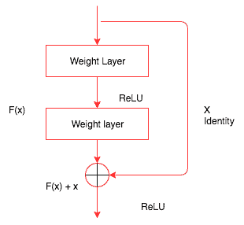

此身份映射没有任何参数。它只是将前一层的输出添加到下一层。然而，有时，x 和 F(x)不会有相同的维数。卷积运算通常会缩小图像的空间分辨率。例如，在 32 x 32 图像上进行 3 x 3 卷积会产生 30 x 30 图像。这个身份映射乘以线性投影 *W* ，以便扩展快捷方式的通道来匹配残差。因此，需要将输入 x 和 F(x)组合起来，以创建下一层的输入:

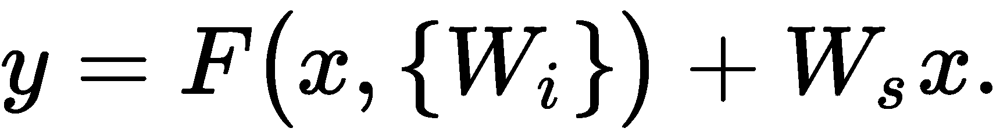

以下代码演示了 PyTorch 中一个简单的 ResNet 块的外观:

```py
class ResNetBlock(nn.Module):
    def __init__(self,in_channels,output_channels,stride):
        super().__init__()
        self.convolutional_1 = nn.Conv2d(input_channels,output_channels,kernel_size=3,stride=stride,padding=1,bias=False)
        self.bn1 = nn.BatchNorm2d(output_channels)
        self.convolutional_2 = nn.Conv2d(output_channels,output_channels,kernel_size=3,stride=stride,padding=1,bias=False)
        self.bn2 = nn.BatchNorm2d(output_channels)
        self.stride = stride
    def forward(self,x):
        residual = x
       out = self.convolutional_1(x)
        out = F.relu(self.bn1(out),inplace=True)
        out = self.convolutional_2(out)
        out = self.bn2(out)
        out += residual
        return F.relu(out)        
```

`ResNetBasicBlock`类包含一个`init`方法，该方法初始化所有不同的层，例如卷积层和批量归一化。除了在返回之前将输入添加到图层的输出中之外，forward 方法与我们到目前为止看到的方法几乎相同。

PyTorch `torchvision`包提供了一个带有不同层的现成 ResNet 模型。一些不同的可用模型如下:

*   ResNet-18
*   ResNet-34
*   ResNet-50
*   ResNet-101
*   ResNet-152

我们也可以用这些模型来进行迁移学习。`torchvision`实例允许我们简单地创建这些模型中的一个并使用它，如下面的代码所示:

```py
from torchvision.models import resnet18
resnet_model = resnet18(pretrained=False)
```

下图显示了 34 层 ResNet 模型的外观:

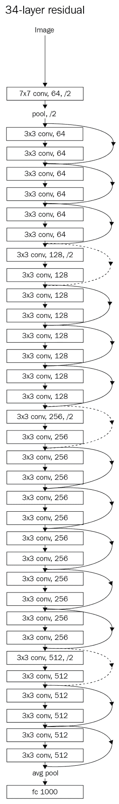

在这里，我们可以看到这个网络由多个 ResNet 块组成。这些现代网络的一个关键优势是，与 VGG 等模型相比，它们需要的参数非常少，因为它们避免使用需要大量参数来训练的全连接层。

现在，我们将在猫狗数据集上训练一个 ResNet 模型。我们将使用我们在[第 3 章](f93f665d-9a2a-4d36-b442-75e7fb89d9cd.xhtml)、*中使用的数据，深入研究神经网络*，并根据从 ResNet 计算出的特征快速训练一个模型。像往常一样，我们将按照以下步骤来训练模型:

1.  创建 PyTorch 数据集。
2.  创建用于培训和验证的加载器。
3.  创建 ResNet 模型。
4.  提取卷积特征。
5.  为预卷积要素和加载程序创建自定义 PyTorch 数据集类。
6.  创建一个简单的线性模型。
7.  训练和验证模型。

一旦完成，我们将为 Inception 和 DenseNet 重复这些步骤。最后，我们将探索集成技术，在这里我们将这些强大的模型结合起来构建一个新的模型。


# 创建 PyTorch 数据集

首先，我们需要创建一个包含所需的所有基本转换的转换对象，并使用`ImageFolder`函数从我们在[第 3 章](f93f665d-9a2a-4d36-b442-75e7fb89d9cd.xhtml)、*深入研究神经网络*中创建的数据目录中加载图像。在下面的代码中，我们创建了数据集:

```py
transform_data = transforms.Compose([
        transforms.Resize((299,299)),
        tansforms.ToTensor(),
        transforms.Normalize([0.30, 0.40, 0.40], [0.20, 0.20, 0.20])
    ])

train_dataset = ImageFolder('../Chapter03/Dog-Cat-Classifier/Data/Train_Data/train/',transform=transform_data)
validation_dataset = ImageFolder('../Chapter03/Dog-Cat-Classifier/Data/Train_Data/valid/',transform=transform_data)
classes=2
```

到目前为止，前面的大部分代码都是不言自明的。


# 创建用于培训和验证的加载器

我们使用 PyTorch 加载器以批处理的形式加载数据集提供的数据，并利用它的所有优势(如混排数据和使用多线程)来加速这个过程。下面的代码演示了这一点:

```py
training_data_loader = DataLoader(train_dataset,batch_size=32,shuffle=False,num_workers=4)
validation_data_loader = DataLoader(validation_dataset,batch_size=32,shuffle=False,num_workers=4)
```

在计算预卷积特征时，我们需要保持数据的准确顺序。当我们允许数据被打乱时，我们将无法保持标签。所以，确保`shuffle`是`False`；否则，需要在代码内部处理所需的逻辑。


# 创建 ResNet 模型

这里，我们将考虑一个创建 ResNet 模型的编码示例。首先，我们启动预训练的`resnet34`模型:

```py
resnet_model = resnet34(pretrained=True)
```

然后，我们丢弃最后一个线性层:

```py
m = nn.Sequential(*list(resnet_model.children())[:-1])
```

一旦创建了模型，我们将`requires_grad`参数设置为`False`,这样 PyTorch 就不必为保存梯度保留任何空间:

```py
for p in resnet_model.parameters():
   p.requires_grad = False
```


# 提取卷积特征

在这里，我们通过模型传递来自训练和验证数据加载器的数据，并将结果存储在一个列表中以供进一步计算。通过计算预卷积特征，我们可以节省大量训练模型的时间，因为我们不会在每次迭代中计算这些特征:

```py
# Stores the labels of the train data
training_data_labels = [] 
# Stores the pre convoluted features of the train data
training_features = [] 
```

使用以下代码遍历训练数据并存储计算出的特征和标签:

```py
for d,la in training_data_loader:
    o = m(Variable(d))
    o = o.view(o.size(0),-1)
    training_data_labels.extend(la)
    training_features.extend(o.data)
```

对于验证数据，迭代验证数据并存储计算的要素和标注:

```py
validation_data_labels = []
validation_features = []
for d,la in validation_data_loader:
    o = m(Variable(d))
    o = o.view(o.size(0),-1)
    validation_data_labels.extend(la)
    validation_features.extend(o.data)
```


# 为预卷积要素和加载程序创建自定义 PyTorch 数据集类

既然我们已经计算了预卷积的要素，我们需要创建一个自定义数据集来从中选择数据。在这里，我们将为预先复杂的要素创建一个自定义数据集和加载器:

```py
class FeaturesDataset(Dataset):
    def __init__(self,features_list,labels_list):
        self.features_list = features_list
        self.labels_list = labels_list
    def __getitem__(self,index):
        return (self.features_lst[index],self.labels_list[index])
    def __len__(self):
        return len(self.labels_list)
#Creating dataset for train and validation
train_features_dataset = FeaturesDataset(training_features,training_data_labels)
validation_features_dataset = FeaturesDataset(validation_features,validation_data_labels)
```

一旦创建了预卷积特征的自定义数据集，我们就可以使用`DataLoader`函数，如下所示:

```py
train_features_loader = DataLoader(train_features_dataset,batch_size=64,shuffle=True)
validation_features_loader = DataLoader(validation_features_dataset,batch_size=64)
```

这将创建一个用于训练和验证的数据加载器。


# 创建简单的线性模型

现在，我们需要创建一个简单的线性模型，将预先复杂的特性映射到相应的类别。在这个例子中，有两个类别(狗和猫):

```py
class FullyConnectedLinearModel(nn.Module):
    def __init__(self,input_size,output_size):
        super().__init__()
        self.fc = nn.Linear(input_size,output_size)

    def forward(self,inp):
        out = self.fc(inp)
        return out

fully_connected_in_size = 8192

fc = FullyConnectedLinearModel(fully_connected_in_size,classes)
if is_cuda:
    fc = fc.cuda()
```

现在，我们准备好训练我们的新模型并验证数据集。


# 训练和验证模型

下面的代码显示了我们如何训练模型。注意，`fit`函数与 [第 3 章](f93f665d-9a2a-4d36-b442-75e7fb89d9cd.xhtml)*中讨论的函数相同，深入神经网络*:

```py
train_losses , train_accuracy = [],[]
validation_losses , validation_accuracy = [],[]
for epoch in range(1,20):
    epoch_loss, epoch_accuracy = fit(epoch,fc,train_features_loader,phase='training')
    validation_epoch_loss , validation_epoch_accuracy = fit(epoch,fc,validation_features_loader,phase='validation')
    train_losses.append(epoch_loss)
    train_accuracy.append(epoch_accuracy)
    validation_losses.append(validation_epoch_loss)
    validation_accuracy.append(validation_epoch_accuracy)
```


# 开始

初始网络是 CNN 分类器开发中的一个重要里程碑，因为它被证明提高了速度和准确性。《盗梦空间》有许多版本，其中最值得一提的是:

*   盗梦空间 v1([https://arxiv.org/pdf/1409.4842v1.pdf](https://arxiv.org/pdf/1409.4842v1.pdf))，俗称谷歌网
*   盗梦空间 v2 和 v2([https://arxiv.org/pdf/1512.00567v3.pdf](https://arxiv.org/pdf/1512.00567v3.pdf))
*   盗梦空间 v4 和盗梦空间 ResNet([https://arxiv.org/pdf/1602.07261.pdf](https://arxiv.org/pdf/1602.07261.pdf))

下图显示了天真的初始网络是如何构建的(v1):


图片来源:[https://arxiv.org/pdf/1409.4842.pdf](https://arxiv.org/pdf/1409.4842.pdf)

这里，不同大小的卷积被应用于输入，并且所有这些层的输出被连接。这是一个初始模块的最简单的版本。有另一种形式的初始块，我们先将输入通过 1×1 卷积，然后再通过 3×3 和 5×5 卷积。1×1 卷积用于降维。它有助于解决计算瓶颈。1 x 1 卷积一次查看一个值，并跨越多个通道。例如，对 100 x 64 x 64 的输入大小使用 10 x 1 x 1 的过滤器将得到 10 x 64 x 64。下图显示了降维后的初始块:

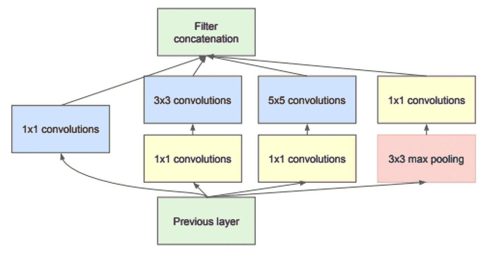

图片来源:[https://arxiv.org/pdf/1409.4842.pdf](https://arxiv.org/pdf/1409.4842.pdf)

现在，让我们看一个 PyTorch 示例，看看前面的 Inception 块是什么样子的:

```py
class BasicConvolutional2d(nn.Module):

    def __init__(self, input_channels, output_channels, **kwargs):
        super(BasicConv2d, self).__init__()
        self.conv = nn.Conv2d(input_channels, output_channels, bias=False, **kwargs)
        self.bn = nn.BatchNorm2d(output_channels)

    def forward(self, x):
        x = self.conv(x)
        x = self.bn(x)
        return F.relu(x, inplace=True)

class InceptionBlock(nn.Module):

    def __init__(self, input_channels, pool_features):
        super().__init__()
        self.inception_branch_1x1 = BasicConv2d(input_channels, 64, kernel_size=1)

        self.inception_branch_5x5_1 = BasicConv2d(input_channels, 48, kernel_size=1)
        self.inception_branch_5x5_2 = BasicConv2d(48, 64, kernel_size=5, padding=2)

        self.inception_branch_3x3dbl_1 = BasicConv2d(input_channels, 64, kernel_size=1)
        self.inception_branch_3x3dbl_2 = BasicConv2d(64, 96, kernel_size=3, padding=1)

        self.inception_branch_pool = BasicConv2d(input_channels, pool_features, kernel_size=1)

    def forward(self, x):
        inception_branch_1x1 = self.inception_branch1x1(x)

        inception_branch_5x5 = self.inception_branch_5x5_1(x)
        inception_branch_5x5 = self.inception_branch_5x5_2(branch5x5)

        inception_branch_3x3dbl = self.inception_branch_3x3dbl_1(x)
        inception_branch_3x3dbl = self.inception_branch_3x3dbl_2(inception_branch3x3dbl)

        branch_pool = F.avg_pool2d(x, kernel_size=3, stride=1, padding=1)
        branch_pool = self.branch_pool(branch_pool)

        outputs = [inception_branch_1x1, inception_branch_5x5, inception_branch_3x3dbl, inception_branch_pool]
        return torch.cat(outputs, 1)
```

前面的代码包含两个类:`BasicConv2d`和`InceptionBasicBlock`。`BasicConv2d`类似于一个自定义层，它将二维卷积层、批规格化和 ReLU 层应用于通过的输入。当我们有一个重复的代码结构时，创建一个新的层是一个很好的实践，以使代码看起来优雅。

`InceptionBasicBlock`类实现了第二个先启图中的内容。让我们浏览每个较小的代码片段，并尝试理解它是如何实现的:

```py
inception_branch_1x1 = self.inception_branch_1x1(x)
```

上述代码通过应用 1 x 1 卷积块来转换输入:

```py
inception_branch_5x5 = self.inception_branch_5x5_1(x)
inception_branch_5x5 = self.inception_branch_5x5_2(inception_branch5x5)
```

在上述代码中，我们通过应用 1 x 1 卷积块，然后是 5 x 5 卷积块来转换输入:

```py
inception_branch_3x3dbl = self.inception_branch_3x3dbl_1(x)
inception_branch_3x3dbl = self.inception_branch_3x3dbl_2(inception_branch3x3dbl)
```

在前面的代码中，我们通过应用 1 x 1 卷积块，然后是 3 x 3 卷积块来转换输入:

```py
branch_pool = F.avg_pool2d(x, kernel_size=3, stride=1, padding=1)
branch_pool = self.branch_pool(branch_pool)
```

在前面的代码中，我们应用了一个平均池，以及一个 1 x 1 卷积块。最后，我们将所有结果连接在一起。一个初始网络由几个初始块组成。下图显示了一个初始架构的样子:

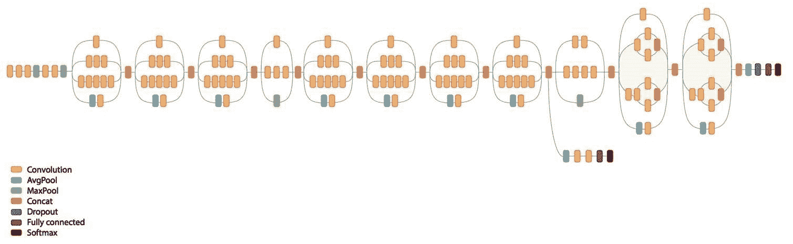


# 初始架构

`torchvision`包有一个初始网络，可以像我们使用 ResNet 网络一样使用它。对最初的 Inception 块进行了许多改进，PyTorch 当前可用的实现是 Inception v3。让我们看看如何使用来自`torchvision`的 Inception v3 模型来计算预先计算的特性。我们不会经历数据加载过程，因为我们将使用来自*创建 ResNet 模型*部分的相同数据加载器。我们将关注以下重要主题:

*   创建一个初始模型
*   使用`register_forward_hook`提取卷积特征
*   为复杂要素创建新数据集
*   创建完全连接的模型
*   训练和验证模型


# 创建一个初始模型

Inception v3 模型有两个分支，每个分支生成一个输出，在最初的模型训练中，我们将合并损失，就像我们对风格转移所做的那样。目前，我们感兴趣的是仅仅使用一个分支来使用 Inception 计算预先复杂的特性。这方面的细节超出了本书的范围。如果你有兴趣了解更多关于这是如何工作的，那么浏览一下论文和盗梦空间模型的源代码([https://github . com/py torch/vision/blob/master/torch vision/models/Inception . py](https://github.com/pytorch/vision/blob/master/torchvision/models/inception.py))会有所帮助。我们可以通过将`aux_logits`参数设置为`False`来禁用其中一个分支。以下代码解释了如何创建模型以及如何将`aux_logits`参数设置为`False`:

```py
inception_model = inception_v3(pretrained=True)
inception_model.aux_logits = False
if is_cuda:
   inception_model = inception_model.cuda()
```

从初始模型中提取卷积特征并不简单，所以我们将使用`register_forward_hook`函数来提取激活。


# 使用 register_forward_hook 提取卷积特征

我们将使用相同的技术，我们用来计算风格转移激活。由于我们只对提取特定层的输出感兴趣，下面是做了一些小修改的`LayerActivations`类:

```py
class LayerActivations():
   features=[]

   def __init__(self,model):
       self.features = []
       self.hook = model.register_forward_hook(self.hook_function)

   def hook_function(self,module,input,output):

       self.features.extend(output.view(output.size(0),-1).cpu().data)

   def remove(self):

       self.hook.remove()
```

除了`hook`函数，其余的代码与我们用于风格转换的代码相似。由于我们正在捕捉所有图像的输出并存储它们，我们将无法在**图形处理单元** ( **GPU** )内存中保存数据。因此，我们需要从 GPU 和 CPU 中提取张量，并只存储张量，而不是存储`Variable`。我们正在将它们转换回张量，因为数据加载器只能与张量一起工作。在下面的代码中，我们将使用`LayerActivations`的对象从最后一层提取初始模型的输出，不包括平均池层、漏失层和线性层。我们跳过了平均池层，以避免丢失数据中的有用信息:

```py
# Create LayerActivations object to store the output of inception model at a particular layer.
train_features = LayerActivations(inception_model.Mixed_7c)
train_labels = []

# Passing all the data through the model , as a side effect the outputs will get stored
# in the features list of the LayerActivations object.
for da,la in train_loader:
   _ = inception_model(Variable(da.cuda()))
   train_labels.extend(la)
train_features.remove()

# Repeat the same process for validation dataset .

validation_features = LayerActivations(inception_model.Mixed_7c)
validation_labels = []
for da,la in validation_loader:
   _ = inception_model(Variable(da.cuda()))
   validation_labels.extend(la)
validation_features.remove()
```

让我们创建新的复杂特性所需的数据集和加载器。


# 为复杂要素创建新数据集

我们可以使用相同的`FeaturesDataset`类来创建新的数据集和数据加载器。在以下代码中，我们将创建数据集和加载器:

```py
#Dataset for pre computed features for train and validation data sets

train_feat_dset = FeaturesDataset(train_features.features,train_labels)
validation_feat_dset = FeaturesDataset(validation_features.features,validation_labels)

#Data loaders for pre computed features for train and validation data sets

train_feat_loader = DataLoader(train_feat_dset,batch_size=64,shuffle=True)
validation_feat_loader = DataLoader(validation_feat_dset,batch_size=64)
```

让我们创建一个新的模型，我们可以在预先复杂的功能上进行训练。


# 创建完全连接的模型

一个简单的模型可能会过度拟合，所以让我们在模型中包括辍学。辍学将帮助我们避免过度适应。在下面的代码中，我们正在创建我们的模型:

```py
class FullyConnectedModel(nn.Module):

    def __init__(self,input_size,output_size,training=True):
        super().__init__()
        self.fully_connected = nn.Linear(input_size,output_size)

    def forward(self,input):
        output = F.dropout(input, training=self.training)
        output = self.fully_connected(output)
        return output

# The size of the output from the selected convolution feature
fc_in_size = 131072

fc = FullyConnectedModel(fc_in_size,classes)
if is_cuda:
   fc = fc.cuda()
```

一旦创建了模型，我们就可以训练模型。


# 训练和验证模型

这里，我们将使用与 ResNet 示例中相同的 fit 和 training 逻辑。我们将只查看训练代码及其返回的结果:

```py
for epoch in range(1,10):
   epoch_loss, epoch_accuracy = fit(epoch,fc,train_feat_loader,phase='training')
   validation_epoch_loss , validation_epoch_accuracy = fit(epoch,fc,validation_feat_loader,phase='validation')
   train_losses.append(epoch_loss)
   train_accuracy.append(epoch_accuracy)
   validation_losses.append(validation_epoch_loss)
   validation_accuracy.append(validation_epoch_accuracy)
```

这将导致以下输出:

```py
training loss is 0.78 and training accuracy is 22825/23000 99.24
validation loss is 5.3 and validation accuracy is 1947/2000 97.35
training loss is 0.84 and training accuracy is 22829/23000 99.26
validation loss is 5.1 and validation accuracy is 1952/2000 97.6
training loss is 0.69 and training accuracy is 22843/23000 99.32
validation loss is 5.1 and validation accuracy is 1951/2000 97.55
training loss is 0.58 and training accuracy is 22852/23000 99.36
validation loss is 4.9 and validation accuracy is 1953/2000 97.65
training loss is 0.67 and training accuracy is 22862/23000 99.4
validation loss is 4.9 and validation accuracy is 1955/2000 97.75
training loss is 0.54 and training accuracy is 22870/23000 99.43
validation loss is 4.8 and validation accuracy is 1953/2000 97.65
training loss is 0.56 and training accuracy is 22856/23000 99.37
validation loss is 4.8 and validation accuracy is 1955/2000 97.75
training loss is 0.7 and training accuracy is 22841/23000 99.31
validation loss is 4.8 and validation accuracy is 1956/2000 97.8
training loss is 0.47 and training accuracy is 22880/23000 99.48
validation loss is 4.7 and validation accuracy is 1956/2000 97.8
```

查看结果，Inception 模型在训练数据集上实现了 99%的准确率，在验证数据集上实现了 97.8%的准确率。由于我们预计算并将所有特征保存在内存中，因此训练模型只需不到几分钟的时间。如果在机器上运行程序时内存不足，那么您可能需要避免将这些特性保存在内存中。

在下一节中，我们将看看另一个有趣的架构，DenseNet，它在去年变得非常流行。


# 密集连接的卷积网络–dense net

一些最成功和最受欢迎的架构，如 ResNet 和 Inception，已经显示了更深更广的网络的重要性。ResNet 利用快捷连接建立更深层次的网络。DenseNet 将这一点提升到了一个全新的水平，它允许从每一层到后续层的连接，也就是说，在这些层上，我们可以接收来自之前层的所有特征地图。象征性地，这将如下所示:

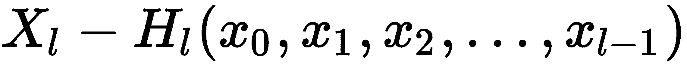

下图描述了五层密集块的外观:

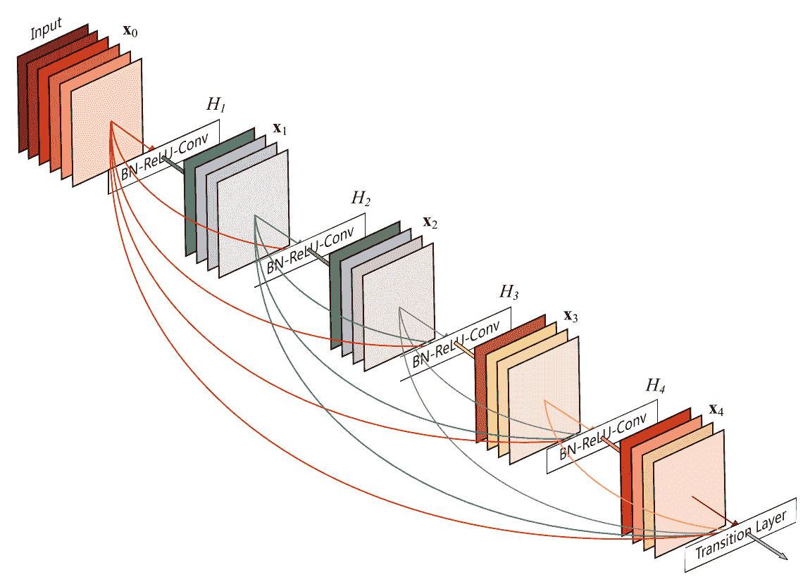

图片来源:[https://arxiv.org/abs/1608.06993](https://arxiv.org/abs/1608.06993)

还有`torchvision`([https://github . com/py torch/vision/blob/master/torch vision/models/DenseNet . py](https://github.com/pytorch/vision/blob/master/torchvision/models/densenet.py))的 dense net 实现。让我们来看看它的两个主要功能，即`_DenseBlock`和`_DenseLayer`。


# _DenseBlock 对象

让我们看看`_DenseBlock`的代码，然后浏览一下:

```py
class _DenseBlock(nn.Sequential):
    def __init__(self, number_layers, number_input_features, bn_size, growth_rate, drop_rate):
        super(_DenseBlock, self).__init__()
        for i in range(number_layers):
            layer = _DenseLayer(number_input_features + i * growth_rate, growth_rate, bn_size, drop_rate)
            self.add_module('denselayer%d' % (i + 1), layer)
```

`_DenseBlock`是一个顺序模块，我们按顺序添加层。基于块中的层数(`number_layers`)，我们将这个数量的`_DenseLayer`对象和一个名称添加到块中。所有的魔法都发生在`_DenseLayer`物体内部。让我们看看`DenseLayer`对象内部发生了什么。


# _DenseLayer 对象

了解特定网络如何工作的一种方法是查看源代码。PyTorch 有一个非常简洁的实现，大多数时候都很容易阅读。让我们看看`_DenseLayer`的实现:

```py
class _DenseLayer(nn.Sequential):
   def __init__(self, number_input_features, growth_rate, bn_size, drop_rate):
       super(_DenseLayer, self).__init__()
       self.add_module('norm.1', nn.BatchNorm2d(number_input_features)),
       self.add_module('relu.1', nn.ReLU(inplace=True)),
       self.add_module('conv.1', nn.Conv2d(number_input_features, bn_size *
                       growth_rate, kernel_size=1, stride=1, bias=False)),
       self.add_module('norm.2', nn.BatchNorm2d(bn_size * growth_rate)),
       self.add_module('relu.2', nn.ReLU(inplace=True)),
       self.add_module('conv.2', nn.Conv2d(bn_size * growth_rate, growth_rate,
                       kernel_size=3, stride=1, padding=1, bias=False)),
       self.drop_rate = drop_rate

   def forward(self, x):
       new_features = super(_DenseLayer, self).forward(x)
       if self.drop_rate > 0:
           new_features = F.dropout(new_features, p=self.drop_rate, training=self.training)
       return torch.cat([x, new_features], 1)
```

如果您不熟悉 Python 中的继承，那么前面的代码可能看起来不直观。`_DenseLayer`对象是`nn.Sequential`的子类；让我们看看每个方法内部发生了什么。

在`__init__`方法中，我们添加输入数据需要传递到的所有层。它与我们见过的所有其他网络架构非常相似。

神奇的事情发生在`forward`方法中。我们将输入传递给超类的`forward`方法，即`nn.Sequential`。我们来看看顺序类的`forward`方法([https://github . com/py torch/py torch/blob/409 B1 c 8319 ECD E4 BD 62 fcf 98 d0a 6658 AE 7 a4 ab 23/torch/nn/modules/container . py](https://github.com/pytorch/pytorch/blob/409b1c8319ecde4bd62fcf98d0a6658ae7a4ab23/torch/nn/modules/container.py))中发生了什么:

```py
def forward(self, input):
   for module in self._modules.values():
       input = module(input)
   return input
```

输入通过先前添加到顺序块的所有层，输出连接到输入。对于块中所需的层数，重复该过程。

现在我们已经了解了 DenseNet 块的工作原理，让我们来探索如何使用 DenseNet 来计算预卷积特征，并在此基础上构建一个分类器模型。在高层次上，DenseNet 的实现类似于 VGG 的实现。DenseNet 实现还有一个包含所有密集块的特性模块和一个包含全连接模型的分类器模块。在本节中，我们将通过以下步骤来构建模型，但将跳过与我们在 Inception 和 ResNet 中看到的类似的大部分部分，例如创建数据加载器和数据集。

我们将详细讨论以下步骤:

*   创建 DenseNet 模型
*   提取 DenseNet 特征
*   创建数据集和加载器
*   创建一个完全连接的模型并训练它

到目前为止，大部分代码都是不言自明的。


# 创建 DenseNet 模型

Torchvision 具有预训练的 DenseNet 模型，具有不同的层选项(121、169、201 和 161)。这里，我们选择了 121 层的模型。正如我们之前提到的，DenseNet 模型有两个模块:`features`(包含密集块)和`classifier`(全连接块)。由于我们使用 DenseNet 作为图像特征提取器，我们将只使用`features`模块:

```py
densenet_model = densenet121(pretrained=True).features
if is_cuda:
   densenet_model = densenet_model.cuda()

for p in densenet_model.parameters():
   p.requires_grad = False
```

让我们从图像中提取 DenseNet 特征。


# 提取 DenseNet 特征

这个过程类似于我们为 Inception 所做的，除了我们没有使用`register_forward_hook`来提取特征。以下代码显示了如何提取 DenseNet 要素:

```py
#For training data
train_labels = []
train_features = []

#code to store densenet features for train dataset.
for d,la in train_loader:
   o = densenet_model(Variable(d.cuda()))
   o = o.view(o.size(0),-1)
   train_labels.extend(la)
   train_features.extend(o.cpu().data)

#For validation data
validation_labels = []
validation_features = []

#Code to store densenet features for validation dataset.
for d,la in validation_loader:
   o = densenet_model(Variable(d.cuda()))
   o = o.view(o.size(0),-1)
   validation_labels.extend(la)
   validation_features.extend(o.cpu().data)
```

前面的代码类似于我们在 Inception 和 ResNet 中看到的代码。


# 创建数据集和加载器

我们将使用为 ResNet 创建的相同的`FeaturesDataset`类，并使用它来为训练和验证数据集创建数据加载器。我们将使用以下代码来实现这一点:

```py
# Create dataset for train and validation convolution features
train_feat_dset = FeaturesDataset(train_features,train_labels)
validation_feat_dset = FeaturesDataset(validation_features,validation_labels)

# Create data loaders for batching the train and validation datasets
train_feat_loader = DataLoader(train_feat_dset,batch_size=64,shuffle=True,drop_last=True)
validation_feat_loader = DataLoader(validation_feat_dset,batch_size=64)
```

现在，是时候创建模型并训练它了。


# 创建一个完全连接的模型并训练它

现在，我们将使用一个简单的线性模型，类似于我们在 ResNet 和 Inception 中使用的模型。以下代码显示了我们将用来训练模型的网络架构:

```py
class FullyConnectedModel(nn.Module):

    def __init__(self,input_size,output_size):
        super().__init__()
        self.fc = nn.Linear(input_size,output_size)

    def forward(self,input):
        output = self.fc(input)
        return output

fc = FullyConnectedModel(fc_in_size,classes)
if is_cuda:
   fc = fc.cuda()
```

我们将使用相同的`fit`方法来训练前面的模型。以下代码片段显示了训练代码以及结果:

```py
train_losses , train_accuracy = [],[]
validation_losses , validation_accuracy = [],[]
for epoch in range(1,10):
   epoch_loss, epoch_accuracy = fit(epoch,fc,train_feat_loader,phase='training')
   validation_epoch_loss , validation_epoch_accuracy = fit(epoch,fc,validation_feat_loader,phase='validation')
   train_losses.append(epoch_loss)
   train_accuracy.append(epoch_accuracy)
   validation_losses.append(validation_epoch_loss)
   validation_accuracy.append(validation_epoch_accuracy)
```

上述代码的结果如下:

```py
training loss is 0.057 and training accuracy is 22506/23000 97.85
validation loss is 0.034 and validation accuracy is 1978/2000 98.9
training loss is 0.0059 and training accuracy is 22953/23000 99.8
validation loss is 0.028 and validation accuracy is 1981/2000 99.05
training loss is 0.0016 and training accuracy is 22974/23000 99.89
validation loss is 0.022 and validation accuracy is 1983/2000 99.15
training loss is 0.00064 and training accuracy is 22976/23000 99.9
validation loss is 0.023 and validation accuracy is 1983/2000 99.15
training loss is 0.00043 and training accuracy is 22976/23000 99.9
validation loss is 0.024 and validation accuracy is 1983/2000 99.15
training loss is 0.00033 and training accuracy is 22976/23000 99.9
validation loss is 0.024 and validation accuracy is 1984/2000 99.2
training loss is 0.00025 and training accuracy is 22976/23000 99.9
validation loss is 0.024 and validation accuracy is 1984/2000 99.2
training loss is 0.0002 and training accuracy is 22976/23000 99.9
validation loss is 0.025 and validation accuracy is 1985/2000 99.25
training loss is 0.00016 and training accuracy is 22976/23000 99.9
validation loss is 0.024 and validation accuracy is 1986/2000 99.3
```

前面的算法能够实现 99%的最大训练准确度和 99%的验证准确度。您的结果可能会有所不同，因为您将创建的验证数据集可能有不同的图像。

DenseNet 的一些优势如下:

*   它大大减少了所需参数的数量。
*   它缓解了消失梯度问题。
*   它鼓励特性重用。

在下一节中，我们将探索如何构建一个模型，将我们使用 ResNet、Inception 和 DenseNet 计算出的复杂特性的优点结合起来。


# 模型组装

有时候，我们需要尝试组合多个模型来构建一个非常强大的模型。有许多技术我们可以用来建立一个集合模型。在本节中，我们将学习如何使用三个不同模型(ResNet、Inception 和 DenseNet)生成的特性来组合输出，以构建一个强大的模型。我们将使用本章其他例子中使用的相同数据集。

集合模型的架构如下:

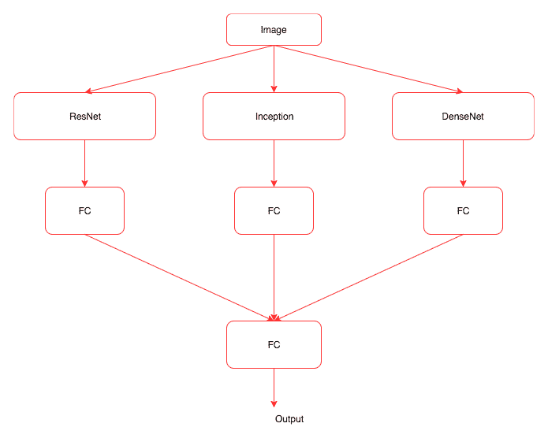

上图显示了我们在系综模型中要做的事情，可以总结为以下步骤:

1.  创建三个模型。
2.  使用创建的模型提取图像特征。
3.  创建一个自定义数据集，返回所有三个模型的要素以及标注。
4.  创建一个类似于上图所示架构的模型。
5.  训练和验证模型。

让我们详细探讨一下这些步骤。


# 创建模型

让我们创建所有三个必需的模型，如下面的代码块所示。

创建 ResNet 模型的代码如下:

```py
resnet_model = resnet34(pretrained=True)

if is_cuda:
   resnet_model = resnet_model.cuda()

resnet_model = nn.Sequential(*list(resnet_model.children())[:-1])

for p in resnet_model.parameters():
   p.requires_grad = False
```

创建初始模型的代码如下:

```py
inception_model = inception_v3(pretrained=True)
inception_model.aux_logits = False
if is_cuda:
   inception_model = inception_model.cuda()
for p in inception_model.parameters():
   p.requires_grad = False
```

创建 DenseNet 模型的代码如下:

```py
densenet_model = densenet121(pretrained=True).features
if is_cuda:
   densenet_model = densenet_model.cuda()

for p in densenet_model.parameters():
   p.requires_grad = False
```

现在我们有了所有的模型，让我们从图像中提取特征。


# 提取图像特征

在这里，我们将结合我们在本章中单独看到的算法的所有逻辑。

ResNet 的代码如下:

```py
train_labels = []
train_resnet_features = []
for d,la in train_loader:
   o = resnet_model(Variable(d.cuda()))
   o = o.view(o.size(0),-1)
   train_labels.extend(la)
   train_resnet_features.extend(o.cpu().data)
validation_labels = []
validation_resnet_features = []
for d,la in validation_loader:
   o = resnet_model(Variable(d.cuda()))
   o = o.view(o.size(0),-1)
   validation_labels.extend(la)
   validation_resnet_features.extend(o.cpu().data)
```

初始阶段的代码如下:

```py
train_inception_features = LayerActivations(inception_model.Mixed_7c)
for da,la in train_loader:
   _ = inception_model(Variable(da.cuda()))

train_inception_features.remove()

validation_inception_features = LayerActivations(inception_model.Mixed_7c)
for da,la in validation_loader:
   _ = inception_model(Variable(da.cuda()))

validation_inception_features.remove()
```

DenseNet 的代码如下:

```py
train_densenet_features = []
for d,la in train_loader:
   o = densnet_model(Variable(d.cuda()))
   o = o.view(o.size(0),-1)

   train_densenet_features.extend(o.cpu().data)

validation_densenet_features = []
for d,la in validation_loader:
   o = densnet_model(Variable(d.cuda()))
   o = o.view(o.size(0),-1)
   validation_densenet_features.extend(o.cpu().data)
```

现在，我们已经使用所有模型创建了图像特征。如果您面临内存问题，那么您可以删除其中一个模型，或者停止在内存中存储训练速度较慢的特征。如果您在 CUDA 实例上运行它，那么您可以使用一个更强大的实例。


# 创建自定义数据集以及数据加载器

我们不能像现在这样使用`FeaturesDataset`类，因为它被开发来只从一个模型的输出中选择。因此，下面的实现包含了对`FeaturesDataset`类所做的微小改动，这样我们就可以容纳所有三个生成的特性:

```py
class FeaturesDataset(Dataset):
   def __init__(self,featlst1,featlst2,featlst3,labellst):
       self.featlst1 = featlst1
       self.featlst2 = featlst2
       self.featlst3 = featlst3
       self.labellst = labellst

   def __getitem__(self,index):
       return (self.featlst1[index],self.featlst2[index],self.featlst3[index],self.labellst[index])

   def __len__(self):
       return len(self.labellst)

train_feat_dset = FeaturesDataset(train_resnet_features,train_inception_features.features,train_densenet_features,train_labels)
validation_feat_dset = FeaturesDataset(validation_resnet_features,validation_inception_features.features,validation_densenet_features,validation_labels)
```

这里，我们对`__init__`方法进行了修改，这样我们就可以存储从不同模型生成的所有特征。我们还更改了`__getitem__`方法，以便我们可以检索图像的特征和标签。使用`FeatureDataset`类，我们为训练和验证数据创建了数据集实例。创建数据集后，我们可以使用同一个数据加载器来批处理数据，如以下代码所示:

```py
train_feat_loader = DataLoader(train_feat_dset,batch_size=64,shuffle=True)
validation_feat_loader = DataLoader(validation_feat_dset,batch_size=64)
```


# 创建集合模型

现在，我们需要创建一个像我们之前看到的架构图那样工作的模型。以下代码实现了这一点:

```py
class EnsembleModel(nn.Module):

    def __init__(self,output_size,training=True):
        super().__init__()
        self.fully_connected1 = nn.Linear(8192,512)
        self.fully_connected2 = nn.Linear(131072,512)
        self.fully_connected3 = nn.Linear(82944,512)
        self.fully_connected4 = nn.Linear(512,output_size)

    def forward(self,input1,input2,input3):
        output1 = self.fully_connected1(F.dropout(input1,training=self.training))
        output2 = self.fully_connected2(F.dropout(input2,training=self.training))
        output3 = self.fully_connected3(F.dropout(input3,training=self.training))
        output = output1 + output2 + output3
        output = self.fully_connected4(F.dropout(out,training=self.training))
        return output

em = EnsembleModel(2)
if is_cuda:
   em = em.cuda()
```

在前面的代码中，我们创建了三个线性图层，它们采用不同模型将生成的要素。我们汇总这三个线性层的所有输出，并将它们传递给另一个线性层，后者将它们映射到所需的类别。为了防止模型过度拟合，我们使用了辍学。


# 训练和验证模型

我们需要对`fit`方法做一些小的修改，以适应我们从数据加载器生成的三个输入值。下面的代码实现了新的`fit`函数:

```py
def fit(epoch,model,data_loader,phase='training',volatile=False):
   if phase == 'training':
       model.train()
   if phase == 'validation':
       model.eval()
       volatile=True
   running_loss = 0.0
   running_correct = 0
   for batch_idx , (data1,data2,data3,target) in enumerate(data_loader):
       if is_cuda:
           data1,data2,data3,target = data1.cuda(),data2.cuda(),data3.cuda(),target.cuda()
       data1,data2,data3,target = Variable(data1,volatile),Variable(data2,volatile),Variable(data3,volatile),Variable(target)
       if phase == 'training':
           optimizer.zero_grad()
       output = model(data1,data2,data3)
       loss = F.cross_entropy(output,target)

       running_loss += F.cross_entropy(output,target,size_average=False).data[0]
       preds = output.data.max(dim=1,keepdim=True)[1]
       running_correct += preds.eq(target.data.view_as(preds)).cpu().sum()
       if phase == 'training':
           loss.backward()
           optimizer.step()

   loss = running_loss/len(data_loader.dataset)
   accuracy = 100\. * running_correct/len(data_loader.dataset)

   print(f'{phase} loss is {loss:{5}.{2}} and {phase} accuracy is {running_correct}/{len(data_loader.dataset)}{accuracy:{10}.{4}}')
   return loss,accuracy
```

如您所见，大部分代码保持不变，除了加载程序返回三个输入和一个标签。因此，我们必须对函数进行更改，这是不言自明的。

以下是培训代码:

```py
train_losses , train_accuracy = [],[]
validation_losses , validation_accuracy = [],[]
for epoch in range(1,10):
    epoch_loss, epoch_accuracy = fit(epoch,em,trn_feat_loader,phase='training')
    validation_epoch_loss , validation_epoch_accuracy = fit(epoch,em,validation_feat_loader,phase='validation')
    train_losses.append(epoch_loss)
    train_accuracy.append(epoch_accuracy)
    validation_losses.append(validation_epoch_loss)
    validation_accuracy.append(validation_epoch_accuracy)
```

上述代码的结果如下:

```py
training loss is 7.2e+01 and training accuracy is 21359/23000 92.87
validation loss is 6.5e+01 and validation accuracy is 1968/2000 98.4
training loss is 9.4e+01 and training accuracy is 22539/23000 98.0
validation loss is 1.1e+02 and validation accuracy is 1980/2000 99.0
training loss is 1e+02 and training accuracy is 22714/23000 98.76
validation loss is 1.4e+02 and validation accuracy is 1976/2000 98.8
training loss is 7.3e+01 and training accuracy is 22825/23000 99.24
validation loss is 1.6e+02 and validation accuracy is 1979/2000 98.95
training loss is 7.2e+01 and training accuracy is 22845/23000 99.33
validation loss is 2e+02 and validation accuracy is 1984/2000 99.2
training loss is 1.1e+02 and training accuracy is 22862/23000 99.4
validation loss is 4.1e+02 and validation accuracy is 1975/2000 98.75
training loss is 1.3e+02 and training accuracy is 22851/23000 99.35
validation loss is 4.2e+02 and validation accuracy is 1981/2000 99.05
training loss is 2e+02 and training accuracy is 22845/23000 99.33
validation loss is 6.1e+02 and validation accuracy is 1982/2000 99.1
training loss is 1e+02 and training accuracy is 22917/23000 99.64
validation loss is 5.3e+02 and validation accuracy is 1986/2000 99.3
```

集成模型达到了 99.6%的训练准确率和 99.3%的验证准确率。尽管集合模型功能强大，但它们的计算开销很大。当你在像 Kaggle 这样的比赛中解决问题时，它们是很好的技巧。


# 编码器-解码器架构

我们在这本书里看到的几乎所有深度学习算法，都善于学习如何将训练数据映射到其对应的标签上。对于模型需要从一个序列中学习并生成另一个序列或图像的任务，我们不能直接使用它们。一些示例应用如下:

*   语言翻译
*   图像字幕
*   图像生成(`seq2img`)
*   语音识别
*   问题回答

这些问题中的大多数可以被视为序列到序列映射的形式，并且这些可以使用称为编码器-解码器架构的架构家族来解决。在本节中，我们将了解这些架构背后的直觉。我们不会关注这些网络的实现，因为需要对它们进行更详细的研究。

概括地说，编码器-解码器架构如下所示:

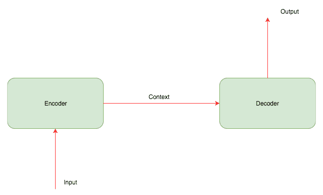

编码器通常是一个**循环神经网络** ( **RNN** )(用于顺序数据)或一个**卷积神经网络** ( **CNN** )(用于图像)，它接收一幅图像或一个序列，并将其转换为一个固定长度的向量，对所有信息进行编码。解码器是另一个 RNN 或 CNN，它学习解码由编码器生成的矢量，并生成新的数据序列。下图显示了图像字幕系统的编码器-解码器架构:

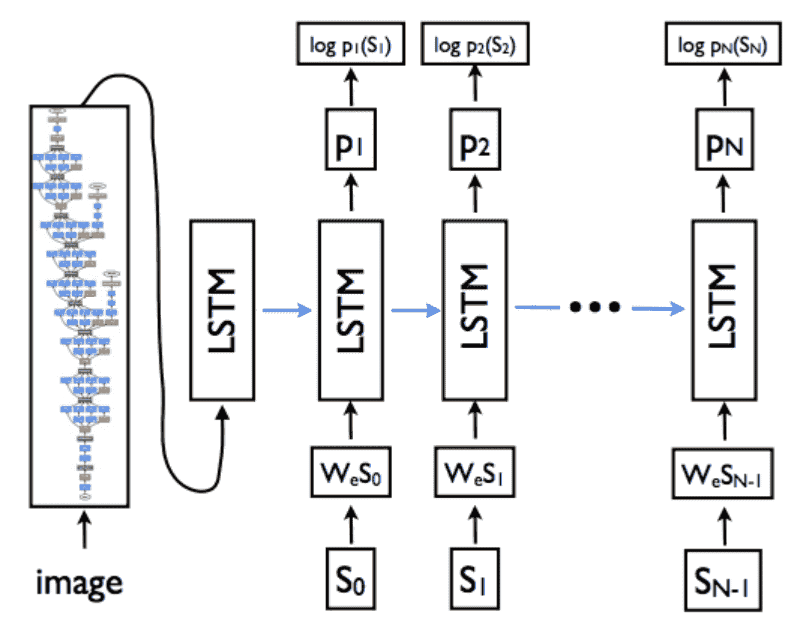

图片来源:[https://arxiv.org/pdf/1411.4555.pdf](https://arxiv.org/pdf/1411.4555.pdf)

现在，让我们看看图像字幕系统的编码器和解码器架构内部发生了什么。


# 编码器

对于一个图像字幕系统，我们应该使用一个训练有素的架构，如 ResNet 或 Inception，从图像中提取特征。就像我们对集合模型所做的那样，我们可以通过使用线性层来输出固定的向量长度，然后使该线性层可训练。


# 解码器

解码器是一个**长短期记忆**(**【LSTM】**)层，它将为图像生成字幕。为了构建一个简单的模型，我们可以将编码器嵌入作为输入传递给 LSTM。然而，这对于解码器学习来说可能是相当具有挑战性的；相反，通常的做法是在解码器的每一步都嵌入编码器。直观地说，解码器学习生成最好地描述给定图像的标题的文本序列。


# 注意力集中的编码器-解码器

2017 年，阿希什·瓦斯瓦尼公司(【https://arxiv.org/pdf/1706.03762.pdf】)发表了一篇题为*注意力是你所需要的全部*的论文，其中包含了一种注意力机制。在每个时间步，注意力网络计算像素的权重。它考虑到目前为止已经生成的单词序列，并输出接下来应该描述的内容:

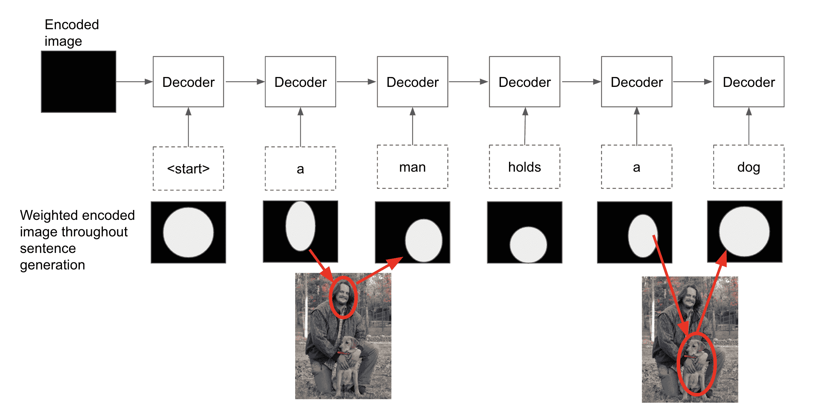

在前面的例子中，我们可以看到，正是 LSTM 保留信息的能力可以帮助它了解在“*一个人”*之后写*“正牵着一条狗”*是符合逻辑的。


# 摘要

在这一章中，我们探索了一些现代架构，如 ResNet、Inception 和 DenseNet。我们还探讨了如何将这些模型用于迁移学习和集成，并介绍了支持许多系统(如语言翻译系统)的编码器-解码器架构。

在下一章，我们将深入强化学习，学习如何应用模型来解决现实世界中的问题。我们还将研究一些 PyTorch 实现，它们可以对此有所帮助。