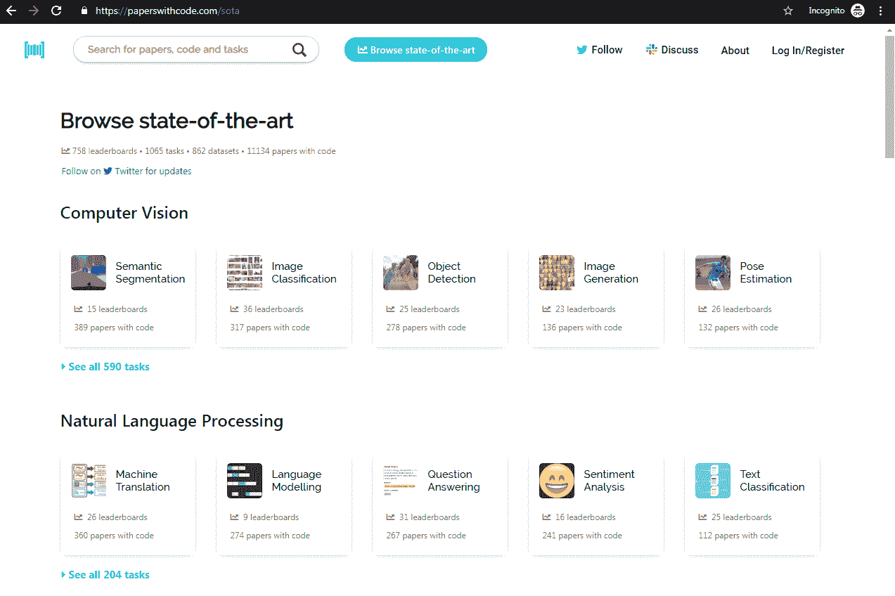
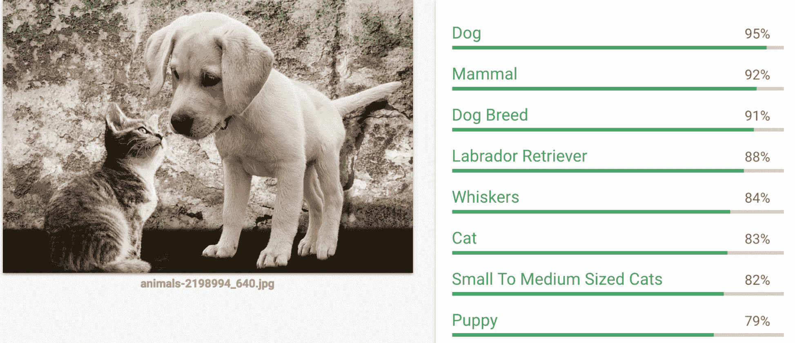
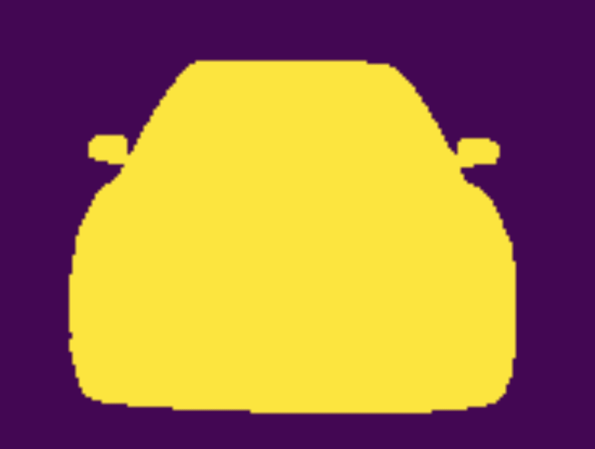

# 接下来是什么？

你终于完成了这本书！给自己一个鼓励！感谢你通读这本书，我真诚地希望它能在你前进的道路上帮助你，无论是作为一名数据科学家，一名机器学习工程师，还是人工智能领域许多其他不断发展的职位之一。到目前为止，您应该已经牢牢掌握了 PyTorch API，以及如何使用它来执行计算机视觉、自然语言处理和强化学习等多项任务。然而，这绝不是你已经开始的旅程的结束，而是一个奇妙的前路的开始！

# 下一步是什么？

在这一章中，我们将着眼于接下来的一系列逻辑步骤，以便在你已经用这本书取得的进步的基础上更进一步。然而，让我们先退后一步，看看我们到目前为止学到的所有工具和技术，并了解到目前为止您学到的所有东西是如何适应更深入的学习环境的。

# 本书概述

下面的列表将帮助你理解书中每一章的精髓，并且可以作为一个快速指南，将我们在整本书中学到的东西放到上下文中:

*   人工智能、神经网络和深度学习的历史。正在使用的各种深度学习框架。PyTorch 的重要性和必要性。PyTorch v1.0 中的改进。GPU 相对于 CPU。使用 CUDA 并行化张量计算。
*   神经网络的构建模块:网络如何学习表征？我们查看了 PyTorch `tensors`、`tensor operations`、`nn.module`、`torch optim`，以及 PyTorch 如何通过运行动态 Dag 来定义工作。
*   我们了解了训练神经网络所涉及的不同过程，例如用于数据准备的 PyTorch 数据集、用于批处理张量的数据加载器、用于创建网络架构的`torch.nn`包，以及使用 PyTorch 损失函数和优化器。我们还采用了不同的技术来处理过拟合，比如剔除、l1 和 l2 正则化以及使用批量归一化。
*   我们学习了**卷积神经网络**(**CNN**)的不同构建模块，还学习了迁移学习，这有助于我们使用预训练的模型。我们还看到了一些技术，如使用预进化特征，这有助于减少训练模型所需的时间。
*   我们学习了单词嵌入以及如何使用它来解决文本分类问题。我们还探索了如何使用预训练单词嵌入。我们探索了**递归神经网络** ( **RNN** )、其变体如**长短期记忆** ( **LSTM** )，以及如何利用它们解决文本分类问题。
*   在这一章中，我们研究了半监督学习的思想，使用自动编码器对数据进行降噪，并使用可变自动编码器生成新图像。
*   我们探索了生成模型，并学习了 PyTorch 如何用于创建艺术风格转换，以及如何使用**生成对抗网络** ( **甘**)创建新的 CIFAR 图像。我们还探索了可用于生成新文本或创建特定领域嵌入的语言建模技术。
*   我们探索了现代架构，如 ResNet、Inception、DenseNet 和编码解码器架构。我们也看到了这些模型如何用于迁移学习。我们还通过组合所有这些模型建立了一个集合模型。
*   最后，我们研究了如何使用强化学习来训练模型在不确定的序列环境中做出决策。我们研究了各种深度强化学习策略，如 deep-Q 学习、基于策略的模型和行动者批评模型。我们使用 OpenAI 健身房环境，通过深度强化学习解决了著名的 cart-pole 问题。

# 阅读和实施研究论文

深度学习是一个不断发展的领域，跟上该领域的最新发展肯定会影响你为所在团队以及整个领域做出贡献的能力。

起初，研究论文可能看起来像是难以理解的行话，但不断努力阅读和实现这些算法将大大提高你的能力。我最喜欢的一个关于论文及其代码实现的知识库是 paperswithcode([https://paperswithcode.com/sota](https://paperswithcode.com/sota)):

paperswithcode 网站

你应该找到人工智能中各种任务的最新研究论文和代码，如 CV、NLP、强化学习、语音等等。每周至少阅读一篇论文，并通过下载源代码来实现代码，这将帮助你跟上该领域的最新发展。

# 探索有趣的想法

我们在书中学到的大多数概念都构成了由深度学习驱动的现代应用程序的基础。在这一部分，我们将看看我们可以做的与计算机视觉和**自然语言处理** ( **NLP** )相关的不同有趣项目。

# 目标检测

我们在本书中看到的所有例子都有助于你判断给定的图像是这只(猫)还是那只(狗)。但是，要解决现实世界中的一些问题，您可能需要识别图像中的不同对象，如下所示:

对象检测算法的输出

此图像显示了对象检测算法的输出，其中该算法正在检测对象，例如一只漂亮的狗和猫。正如有现成的图像分类算法一样，也有许多令人惊叹的算法可以帮助构建对象识别系统。这里列出了一些重要的算法和关于对象检测的论文:

*   **单次多盒探测器**(**SSD**):【https://arxiv.org/abs/1512.02325】T4
*   更快的 RCNN:[https://arxiv.org/abs/1506.01497](https://arxiv.org/abs/1506.01497)
*   约罗 2:[https://arxiv.org/abs/1612.08242](https://arxiv.org/abs/1612.08242)

# 图象分割法

让我们假设你正在一栋建筑的阳台上阅读这本书。你在周围看到了什么？你能勾勒出你所看到的吗？如果你是一个优秀的艺术家，不像我，那么你可能会画一些建筑物、树木、鸟和一些围绕着你的更有趣的东西。图像分割算法试图捕捉类似的东西。给定一幅图像，它们为每个像素生成一个预测，确定每个像素属于哪一类。下图显示了图像分割算法识别的内容:

图像分割算法的输出

下面给出了一些重要的图像分割算法:

*   美国有线电视新闻网:https://arxiv.org/abs/1311.2524
*   快速 R-CNN:[https://arxiv.org/abs/1504.08083](https://arxiv.org/abs/1504.08083)
*   更快的 R-CNN:[https://arxiv.org/abs/1506.01497](https://arxiv.org/abs/1506.01497)
*   面具 R-CNN:[https://arxiv.org/abs/1703.06870](https://arxiv.org/abs/1703.06870)

# pytorch 中的 opennms

**开源神经机器翻译**(**OpenNMT**)(【https://github.com/OpenNMT/OpenNMT-py】T4)项目帮助构建了许多由编码器-解码器架构驱动的应用。您可以构建的一些应用程序包括翻译系统、文本摘要和图像到文本转换。

# 艾伦 NLP

Allen NLP 是一个基于 PyTorch 的开源项目，它使我们能够更轻松地完成许多 NLP 任务。有一个演示页面([http://demo.allennlp.org/machinecomprehension](http://demo.allennlp.org/machinecomprehension))，你应该看看，以了解你可以使用艾伦 NLP 构建什么。

# fast . ai——让神经网络再次变得不酷

我最喜欢了解深度学习的地方之一，也是灵感的绝佳去处，是 MOOC，它的唯一动机是让深度学习对所有人开放，由来自`fast.ai`(【http://www.fast.ai/】)、杰瑞米·霍华德和瑞秋·托马斯的两位了不起的导师组织。对于他们课程的新版本，他们在 PyTorch 上构建了一个令人难以置信的框架(【https://github.com/fastai/fastai】T4)，使得构建应用程序变得更加容易和快捷。如果你还没有开始他们的课程，我强烈建议你开始。探索`fast.ai`框架是如何构建的会让你对许多强大的技术有更深刻的了解。

# 开放式神经网络交换

**开放神经网络交换**(**ONNX**)(【http://onnx.ai/】T4)是迈向开放生态系统的第一步，随着项目的发展，它将使你能够选择正确的工具。ONNX 为深度学习模型提供了开源格式。它定义了一个可扩展的计算图模型，以及内置操作符和标准数据类型的定义。Caffe2、PyTorch、微软认知工具包、Apache MXNet 等工具都在开发 ONNX 支持。这个项目可以帮助生产电离 PyTorch 模型。

# 如何让自己保持更新

社交媒体平台，尤其是 Twitter，可以帮助你了解这个领域的最新动态。有很多人你可以追随。如果你不确定从哪里开始，我建议你关注杰瑞米·霍华德([https://twitter.com/jeremyphoward](https://twitter.com/jeremyphoward))以及他可能关注的任何有趣的人。这样做，你将迫使 Twitter 推荐系统为你工作。你需要关注的另一个重要的 Twitter 账户是 py torch(【https://twitter.com/PyTorch】T2)。PyTorch 背后的了不起的人分享了一些伟大的内容。如果你在寻找研究论文，那么看看 http://www.arxiv-sanity.com/的，那里有许多聪明的研究人员发表他们的论文。学习 PyTorch 的更多资源是它的教程([http://pytorch.org/tutorials/](http://pytorch.org/tutorials/))、源代码([https://github.com/pytorch/pytorch](https://github.com/pytorch/pytorch))和文档([http://pytorch.org/docs/0.3.0/](http://pytorch.org/docs/0.3.0/)[)](http://pytorch.org/docs/0.3.0/)。

# 摘要

深度学习和 PyTorch 还有更多。PyTorch 是一个相对较新的框架，在编写本章时，它已经有 3 年的历史了。还有很多要学习和探索，所以快乐学习。万事如意。