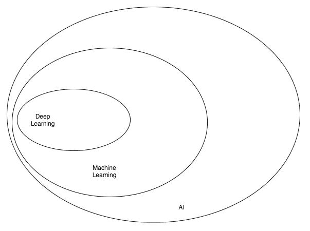
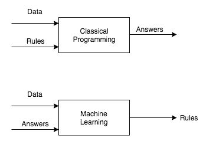
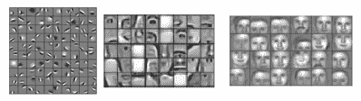
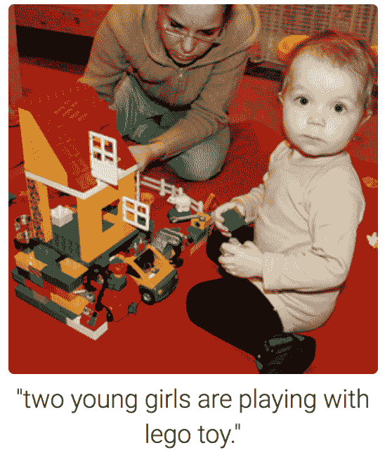
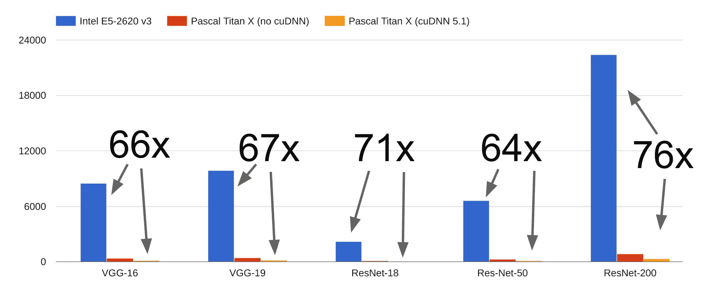

# 一、使用 PyTorch 开始深度学习

**深度学习** ( **DL** )革新了一个又一个行业。吴恩达在推特上曾有一段著名的描述:

*Artificial Intelligence is the new electricity!*

电力改变了无数的行业；人工智能 ( **AI** )现在也会这么做。

AI 和 DL 像同义词一样使用，但两者之间有实质性的区别。让我们揭开行业术语的神秘面纱，以便作为从业者的你能够区分信号和噪声。

在这一章中，我们将涵盖人工智能的以下不同部分:

*   人工智能本身及其起源
*   现实世界中的机器学习
*   深度学习的应用
*   为什么现在要深度学习？
*   深度学习框架:PyTorch

# 人工智能

每天都有无数讨论 AI 的文章发表。这一趋势在过去两年有所增强。网络上流传着几个关于人工智能的定义，我最喜欢的是通常由人类完成的智能任务的自动化。

# 人工智能的历史

人工智能这个术语是约翰·麦卡锡在 1956 年首次提出的，当时他召开了关于这个主题的第一次学术会议。机器是否会思考这个问题的旅程比这要早得多。在 AI 早期，机器能够解决人类难以解决的问题。

例如，恩尼格玛机建于第二次世界大战末期，用于军事通信。艾伦·图灵建立了一个人工智能系统，帮助破解了恩尼格玛密码。破解恩尼格玛密码对一个人来说是一项非常具有挑战性的任务，对一个分析师来说可能需要几周的时间。这台人工智能机器能够在几个小时内破解代码。

计算机很难解决对我们来说很直观的问题，例如区分狗和猫，告诉你的朋友是否因为你在聚会上迟到而生气(情绪)，区分卡车和汽车，在研讨会上做笔记(语音识别)，或者为不懂你的语言的朋友将笔记转换为另一种语言(例如，法语到英语)。这些任务中的大部分对我们来说是直观的，但是我们无法编程或硬编码计算机来完成这些任务。早期人工智能机器中的大多数智能都是硬编码的，例如计算机程序下棋。

在人工智能的早期，许多研究人员认为人工智能可以通过硬编码规则来实现。这种人工智能被称为**符号人工智能**，在解决定义明确的逻辑问题方面非常有用，但它几乎无法解决复杂的问题，如图像识别、对象检测、对象分割、语言翻译和自然语言理解任务。较新的人工智能方法，如机器学习和 DL，被开发出来解决这类问题。

为了更好地理解 AI、ML 和 DL 之间的关系，让我们将它们想象成与 AI 同心的圆圈——首先出现的想法(最大)，然后是机器学习(后来开花)，最后是 DL——这是推动今天 AI 爆炸的原因(两者都符合):

人工智能、机器学习和人工智能是如何融合在一起的

# 机器学习

**机器学习** ( **ML** )是人工智能的一个子领域，在过去 10 年里变得很受欢迎，有时，两者可以互换使用。除了机器学习，人工智能还有很多其他子领域。ML 系统是通过展示大量的例子来构建的，不像符号人工智能，我们硬编码规则来构建系统。在高层次上，机器学习系统查看大量数据，并提出规则来预测未知数据的结果:

机器学习与传统编程

大多数 ML 算法在结构化数据上表现良好，例如销售预测、推荐系统和营销个性化。任何最大似然算法的一个重要因素是特征工程，数据科学家需要花费大量时间来获得最大似然算法要执行的正确特征。在某些领域，如计算机视觉和自然语言处理领域，特征工程很有挑战性，因为它们的维数很高。

直到最近，由于特征工程和高维度等原因，组织使用典型的机器学习技术(如线性回归、随机森林等)来解决这类问题仍具有挑战性。考虑尺寸为 224 x 224 x 3(高 x 宽 x 通道)的图像，其中图像尺寸中的 *3* 表示彩色图像中红色、绿色和蓝色通道的值。为了将该图像存储在计算机存储器中，我们的矩阵将包含用于单个图像的 150，528 个维度。假设您想要在 1，000 张大小为 224 x 224 x 3 的图像上构建一个分类器，那么维数将变成 1，000 乘以 150，528。机器学习的一个特殊分支叫做**深度学习**允许你使用现代技术和硬件来处理这些问题。

# 现实生活中机器学习的例子

以下是一些由机器学习驱动的酷产品:

*   **例 1** : Google Photos 使用一种叫做**深度学习的特定形式的机器学习对照片进行分组**
*   **例 2** :推荐系统是一个 ML 算法家族，被网飞、亚马逊、iTunes 等大公司用于推荐电影、音乐和产品

# 深度学习

传统的 ML 算法使用手写特征提取来训练算法，而 DL 算法使用现代技术以自动方式提取这些特征。

例如，预测图像是否包含面部的 DL 算法提取特征，例如第一层检测边缘，第二层检测鼻子和眼睛等形状，最后一层检测面部形状或更复杂的结构。每一层都基于前一层的数据表示进行训练。如果你觉得这个解释难以理解，没关系，本书后面的章节将帮助你直观地建立和检查这样的网络:

可视化中间层的输出(图片来源:https://www . cs . Princeton . edu/~ rajeshr/papers/cacm 2011-research highlights-conv dbn . pdf)

随着 GPU、大数据、云提供商(如**亚马逊网络服务** ( **AWS** )和谷歌云)以及框架(如 Torch、TensorFlow、Caffe 和 PyTorch)的兴起，DL 的使用在过去几年中有了巨大的增长。除此之外，大公司分享在巨大数据集上训练的算法，从而帮助创业公司不费吹灰之力就在几个用例上建立最先进的系统。

# 深度学习的应用

使用 DL 可能实现的一些流行应用程序如下:

*   接近人类水平的图像分类
*   接近人类水平的语音识别
*   机器翻译
*   自动驾驶汽车
*   近年来，Siri、谷歌语音和 Alexa 变得更加准确
*   一名日本农民正在挑选黄瓜
*   肺癌检测
*   语言翻译击败人类水平的准确性

下面的屏幕截图显示了一个简短的摘要示例，其中计算机提取了一大段文本，并将其总结为几行:

计算机生成的样本段落摘要

在下图中，一台计算机在没有被告知它显示什么的情况下获得了一个普通图像，通过使用对象检测和字典的一些帮助，您得到了一个图像标题，说明**两个年轻女孩正在玩乐高玩具**。是不是很精彩？

物体检测和图像字幕(图片来源:https://cs.stanford.edu/people/karpathy/cvpr2015.pdf)

# 与深度学习相关的炒作

媒体和人工智能领域以外的人，或者不是人工智能和人工智能真正实践者的人，一直在暗示，随着人工智能/人工智能的发展，像电影*终结者 2:审判日*的故事线这样的事情可能会成为现实。他们中的一些人甚至谈到有一天我们会被机器人控制，由机器人决定什么对人类有益。目前，人工智能的能力被夸大了，远远超出了它的真实能力。目前，大多数 DL 系统部署在一个非常受控的环境中，并且被给予有限的决策边界。

我的猜测是，当这些系统能够学会做出智能决策，而不仅仅是完成模式匹配时，当数百或数千个 DL 算法能够一起工作时，我们可能会看到机器人的行为可能会像我们在科幻电影中看到的那样。在现实中，我们并没有更接近一般的人工智能，即机器可以在没有被告知的情况下做任何事情。DL 目前的状态更多的是从现有数据中寻找模式来预测未来的结果。作为 DL 实践者，我们需要区分信号和噪声。

# 深度学习的历史

尽管深度学习近年来变得流行，但深度学习背后的理论自 20 世纪 50 年代以来一直在发展。下表显示了目前在 DL 应用程序中使用的一些最流行的技术及其大致时间表:

| **技巧** | **年** |
| 神经网络 | One thousand nine hundred and forty-three |
| 反向传播 | 60 年代初 |
| 卷积神经网络 | One thousand nine hundred and seventy-nine |
| 递归神经网络 | One thousand nine hundred and eighty |
| 长短期记忆 | One thousand nine hundred and ninety-seven |

多年来，深度学习已经被赋予了几个名称。它在 20 世纪 70 年代被称为**控制论**，在 80 年代被称为连接主义，现在它要么被称为*深度学习*要么被称为*神经网络*。我们将交替使用 DL 和神经网络。神经网络通常被称为一种受人脑工作启发的算法。然而，作为 DL 的实践者，我们需要理解它主要是由数学(线性代数和微积分)、统计学(概率)和软件工程中强大的理论所启发和支持的。

# 为什么不

为什么 DL 现在变得这么流行？一些关键原因如下:

*   硬件可用性
*   数据和算法
*   深度学习框架

# 硬件可用性

深度学习需要对数百万，有时数十亿个参数进行复杂的数学运算。现有的 CPU 需要很长时间来执行这些类型的操作，尽管这在过去几年中有所改善。一种叫做**图形处理器** ( **GPU** )的新型硬件完成了这些庞大的数学运算，比如矩阵乘法，速度快了几个数量级。

GPU 最初是由 Nvidia 和 AMD 等公司为游戏行业打造的。事实证明，这种硬件非常高效，不仅可以渲染高质量的视频游戏，还可以加快 DL 算法的速度。Nvidia 最近推出的一款 GPU*1080 ti*，花了几天时间在一个`ImageNet`数据集上构建一个图像分类系统，而以前可能需要一个月左右。

如果你打算购买运行深度学习的硬件，我会建议你根据预算选择英伟达的 GPU。选择一个内存大的。记住，你的电脑内存和 GPU 内存是两回事。1080ti 配有 11 GB 内存，价格约为 700 美元。

你也可以使用各种云提供商，比如 AWS，Google Cloud，或者 Floyd(这家公司提供针对 DL 优化的 GPU 机器)。如果您刚刚开始使用 DL，或者如果您正在设置供组织使用的机器，您可能有更多的财务自由，那么使用云提供商是经济的。

如果对这些系统进行优化，性能可能会有所不同。

下图显示了比较 CPU 和 GPU 性能的一些基准:

神经架构在 CPU 和 GPU 上的性能基准测试(图片来源:http://cs 231n . Stanford . edu/slides/2017/cs 231n _ 2017 _ lecture 8 . pdf)

# 数据和算法

数据是深度学习成功的最重要因素。由于互联网的广泛采用和智能手机的日益普及，一些公司，如脸书和谷歌，已经能够收集各种格式的大量数据，特别是文本、图像、视频和音频。在计算机视觉领域，ImageNet 竞赛在提供 1000 个类别的 140 万幅图像的数据集方面发挥了巨大作用。

这些类别都是手工标注的，每年都有数百个团队参加比赛。一些在竞赛中成功的算法是 VGG，雷斯网，盗梦空间，DenseNet 等等。这些算法今天在工业中用于解决各种计算机视觉问题。在深度学习领域中，一些常用于测试各种算法的其他流行数据集如下:

*   梦妮丝
*   COCO 数据集
*   西法尔
*   街景门牌号码
*   帕斯卡 VOC
*   维基百科转储
*   20 个新闻组
*   Penn Treebank
*   卡格尔

不同算法的发展，如批量标准化、激活函数、跳过连接、**长短期记忆**(**)、辍学等等，使得近年来更快、更成功地训练非常深的网络成为可能。在本书接下来的章节中，我们将深入了解每种技术的细节，以及它们如何帮助构建更好的模型。**

 **# 深度学习框架

在早期，人们需要具备 C++和 CUDA 方面的专业知识来实现 DL 算法。随着许多组织现在开源他们的深度学习框架，具有脚本语言(如 Python)知识的人可以开始构建和使用 DL 算法。目前业界使用的一些流行的深度学习框架有 TensorFlow、Caffe2、Keras、Theano、PyTorch、Chainer、DyNet、MXNet 和 CNTK。

如果没有这些框架，深度学习的采用不会如此巨大。它们抽象出许多潜在的复杂性，使我们能够专注于应用程序。我们仍然处于 DL 的早期，在那里，随着大量的研究，突破每天都在公司和组织中发生。因此，各种框架各有利弊。

# PyTorch

PyTorch 和大多数其他深度学习框架可以用于两种不同的事情:

*   用 GPU 加速的运算取代类似 NumPy 的运算
*   构建深度神经网络

PyTorch 越来越受欢迎的原因是它的易用性和简单性。与大多数其他流行的使用静态计算图的深度学习框架不同，PyTorch 使用动态计算，这允许在构建复杂架构时有更大的灵活性。

PyTorch 广泛使用 Python 概念，如类、结构和条件循环，允许我们以纯面向对象的方式构建 DL 算法。大多数其他流行的框架都有自己的编程风格，有时会使编写新算法变得复杂，并且不支持直观的调试。在后面的章节中，我们将详细讨论计算图。

虽然 PyTorch 是最近发布的，仍处于测试版本，但它已经在数据科学家和深度学习研究人员中非常受欢迎，因为它易于使用，性能更好，易于调试，并且得到了 SalesForce 等各种公司的大力支持。

由于 PyTorch 主要是为研究而构建的，因此不建议在某些延迟要求非常高的场景中用于生产。然而，随着一个名为**开放神经网络交换**(**ONNX**)([https://onnx.ai/](https://onnx.ai/))的新项目的出现，这种情况正在发生变化，该项目专注于将 PyTorch 上开发的模型部署到像 Caffe2 这样的平台上，以便进行生产。在撰写本文时，谈论这个项目还为时过早，因为它才刚刚启动。该项目得到了脸书和微软的支持。

在本书的其余部分，我们将学习各种乐高积木(更小的概念或技术),用于在计算机视觉和 NLP 领域构建强大的 DL 应用程序。

# 摘要

在这一介绍性章节中，我们探讨了什么是人工智能、机器学习和深度学习，并讨论了这三者之间的差异。我们还研究了日常生活中由它们驱动的应用。我们深入探究为什么 DL 现在才变得更受欢迎。最后，我们温柔的介绍了 PyTorch，这是一个深度学习框架。

在下一章，我们将在 PyTorch 中训练我们的第一个神经网络。**