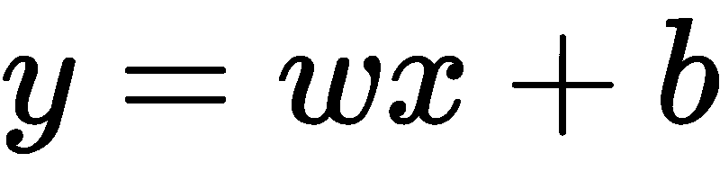
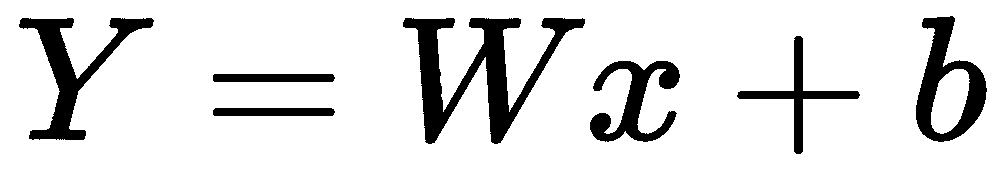
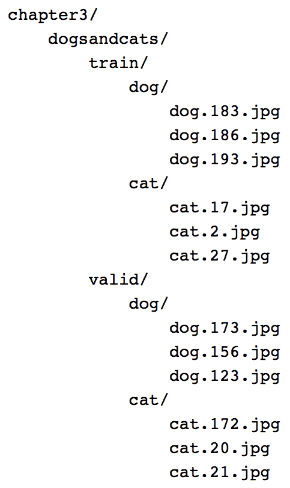

# 神经网络的构建模块

理解神经网络的基本构建块，如张量、张量运算和梯度下降，对于构建复杂的神经网络非常重要。在本章中，我们将通过涵盖以下主题来构建我们在神经网络中的第一个`Hello world`程序:

*   安装 PyTorch
*   实现我们的第一个神经网络
*   将神经网络分割成功能块
*   浏览每个基本块，包括张量、变量、自动签名、梯度和优化器
*   使用 PyTorch 加载数据

# 安装 PyTorch

PyTorch 以 Python 包的形式提供，您可以使用`pip`或`conda`来构建它，也可以从源代码构建它。本书推荐的方法是使用 Anaconda Python 3 发行版。要安装 Anaconda，请参考位于 https://conda.io/docs/user-guide/install/index.htmlT2 的 Anaconda 官方文档。所有的例子都可以在本书的 GitHub 库中以 Jupyter 笔记本的形式获得。我强烈建议你使用 Jupyter Notebook，因为它允许你进行交互式实验。如果您已经安装了 Anaconda Python，那么您可以继续执行下面的 PyTorch 安装步骤。

对于基于 GPU 的 Cuda 8 安装:

```py
conda install pytorch torchvision cuda80 -c soumith
```

对于基于 GPU 的 Cuda 7.5 安装:

```py
conda install pytorch torchvision -c soumith
```

对于非基于 GPU 的安装:

```py
conda install pytorch torchvision -c soumith
```

在撰写本文时，PyTorch 无法在 Windows 机器上运行，因此您可以尝试使用一个**虚拟机** ( **VM** )或 Docker 映像。

# 我们的第一个神经网络

我们提出了我们的第一个神经网络，它学习如何将训练样本(输入数组)映射到目标(输出数组)。假设我们为最大的在线公司之一工作， **Wondermovies，**提供视频点播服务。我们的训练数据集包含一个表示用户在该平台上观看电影的平均时间的功能，我们希望预测每个用户在未来一周内在该平台上花费的时间。只是一个假想的用例，不要想太多。构建这种解决方案的一些高级活动如下:

*   **数据准备**:`get_data`函数准备包含输入和输出数据的张量(数组)
*   **创建可学习的** **参数**:`get_weights`函数为我们提供了包含随机值的张量，我们将优化这些张量来解决我们的问题
*   **网络模型**:`simple_network`函数产生输入数据的输出，应用线性规则，将权重与输入数据相乘，并添加偏差项( *y = Wx+b* )
*   **损失**:`loss_fn`函数提供了关于模型有多好的信息
*   **优化器**:`optimize`函数帮助我们调整最初创建的随机权重，以帮助模型更准确地计算目标值

如果你是机器学习的新手，不要担心，因为我们会在本章结束时准确理解每个函数的作用。下面的函数抽象出 PyTorch 代码，使我们更容易理解。我们将深入探讨每一项功能的细节。前述高级活动对于大多数机器学习和深度学习问题来说是常见的。本书后面的章节讨论了可以用来改进每个功能以构建有用的应用程序的技术。

让我们考虑以下神经网络的线性回归方程:



让我们用 PyTorch 编写第一个神经网络:

```py
x,y = get_data() # x - represents training data,y -                 represents target variables

w,b = get_weights() # w,b - Learnable parameters

for i in range(500):
    y_pred = simple_network(x) # function which computes wx + b
    loss = loss_fn(y,y_pred) # calculates sum of the squared differences of y and y_pred

if i % 50 == 0: 
        print(loss)
    optimize(learning_rate) # Adjust w,b to minimize the loss
```

在本章结束时，你将对每个函数内部发生的事情有一个概念。

# 数据准备

PyTorch 提供了两种数据抽象，称为`tensors`和`variables`。张量类似于`numpy`阵列，它们也可以用在 GPU 上，从而提高性能。它们提供了在 GPU 和 CPU 之间切换的简单方法。对于某些操作，我们可以注意到性能的提升，机器学习算法可以理解不同形式的数据，只有当数据表示为数字的张量时。张量就像 Python 数组，大小可以改变。例如，图像可以表示为三维数组(高度、重量、通道(RGB))。深度学习中使用大小高达五维的张量是很常见的。一些常用的张量如下:

*   标量(零维张量)
*   向量(一维张量)
*   矩阵(二维张量)
*   三维张量
*   切片张量
*   四维张量
*   五维张量
*   GPU 上的张量

# 标量(零维张量)

只包含一个元素的张量叫做**标量**。它通常是类型`FloatTensor`或`LongTensor`。在写这篇文章的时候，PyTorch 还没有一个特殊的零维张量。因此，我们使用一个元素的一维张量，如下所示:

```py
x = torch.rand(10)
x.size()

Output - torch.Size([10])
```

# 向量(一维张量)

一个`vector`只是一个元素数组。例如，我们可以使用一个向量来存储上周的平均温度:

```py
temp = torch.FloatTensor([23,24,24.5,26,27.2,23.0])
temp.size()

Output - torch.Size([6])
```

# 矩阵(二维张量)

大多数结构化数据以表格或矩阵的形式表示。我们将使用一个名为`Boston House Prices`的数据集，它在 Python scikit-learn 机器学习库中很容易获得。数据集是一个由`506`样本或行和代表每个样本的`13`特征组成的`numpy`数组。Torch 提供了一个名为`from_numpy()`的实用函数，它将一个`numpy`数组转换成一个`torch`张量。得到的张量的形状是`506`行 x `13`列:

```py
boston_tensor = torch.from_numpy(boston.data)
boston_tensor.size()

Output: torch.Size([506, 13])

boston_tensor[:2]

Output:
Columns 0 to 7 
   0.0063 18.0000 2.3100 0.0000 0.5380 6.5750 65.2000 4.0900
   0.0273 0.0000 7.0700 0.0000 0.4690 6.4210 78.9000 4.9671

Columns 8 to 12 
   1.0000 296.0000 15.3000 396.9000 4.9800
   2.0000 242.0000 17.8000 396.9000 9.1400
[torch.DoubleTensor of size 2x13]
```

# 三维张量

当我们把多个矩阵加在一起，我们得到一个三维张量。三维张量用于表示类似数据的图像。图像可以表示为矩阵中的数字，这些数字堆叠在一起。图像形状的一个例子是`224`、`224`、`3`，其中第一个索引代表高度，第二个代表宽度，第三个代表通道(RGB)。使用下面的代码片段，让我们看看计算机是如何看到熊猫的:

```py
from PIL import Image
# Read a panda image from disk using a library called PIL and convert it to numpy array
panda = np.array(Image.open('panda.jpg').resize((224,224)))
panda_tensor = torch.from_numpy(panda)
panda_tensor.size()

Output - torch.Size([224, 224, 3])
#Display panda
plt.imshow(panda)

```

由于显示大小为`224`、`224`、`3`的张量会占据书中的几页，我们将显示图像，并学习将图像分割成更小的张量来可视化它:


显示图像

# 切片张量

处理张量的一个常见方法是切掉它的一部分。一个简单的例子是选择一维张量的前五个元素；姑且称之为张量`sales`。我们使用一个简单的符号，`sales[:slice_index]`,其中`slice_index`代表你想要切片张量的索引:

```py
sales = torch.FloatTensor([1000.0,323.2,333.4,444.5,1000.0,323.2,333.4,444.5])

sales[:5]
 1000.0000
  323.2000
  333.4000
  444.5000
 1000.0000
[torch.FloatTensor of size 5]

sales[:-5]
 1000.0000
  323.2000
  333.4000
[torch.FloatTensor of size 3]

```

让我们用我们的熊猫图像做更多有趣的事情，比如看看当只选择一个通道时熊猫图像是什么样子，看看如何选择熊猫的脸。

这里，我们仅从熊猫图像中选择一个通道:

```py
plt.imshow(panda_tensor[:,:,0].numpy())
#0 represents the first channel of RGB
```

输出如下所示:


现在，让我们裁剪图像。假设我们想为熊猫制作一个人脸检测器，我们只需要一张熊猫的脸。我们裁剪张量图像，使其仅包含熊猫的面部:

```py
plt.imshow(panda_tensor[25:175,60:130,0].numpy())
```

输出如下所示:


另一个常见的例子是，你需要选择一个张量的特定元素:

```py
#torch.eye(shape) produces an diagonal matrix with 1 as it diagonal #elements.
sales = torch.eye(3,3)
sales[0,1]

Output- 0.00.0
```

当我们讨论使用 CNN 构建图像分类器时，我们将在第 5 章、*、*中再次讨论图像数据。

Most of the PyTorch tensor operations are very similar to `NumPy` operations.

# 四维张量

四维张量类型的一个常见示例是一批图像。现代的 CPU 和 GPU 经过优化，可以更快地对多个实例执行相同的操作。因此，它们处理一幅图像或一批图像需要相似的时间。因此，通常使用一批例子，而不是一次使用一个图像。选择批量大小并不简单；这取决于几个因素。使用更大的批处理或完整数据集的一个主要限制是 GPU 内存限制— *16* 、 *32* 和 *64* 是常用的批处理大小。

让我们看一个例子，其中我们加载一批大小为`64` x `224` x `224` x `3`的 cat 图像，其中 *64* 表示图像的批大小或数量， *244* 表示高度和宽度， *3* 表示通道:

```py
#Read cat images from disk
cats = glob(data_path+'*.jpg')
#Convert images into numpy arrays
cat_imgs = np.array([np.array(Image.open(cat).resize((224,224))) for cat in cats[:64]]) 
cat_imgs = cat_imgs.reshape(-1,224,224,3)
cat_tensors = torch.from_numpy(cat_imgs)
cat_tensors.size()

Output - torch.Size([64, 224, 224, 3])
```

# 五维张量

一个可能必须使用五维张量的常见例子是视频数据。视频可以分割成帧，例如，一个包含熊猫玩球的 30 秒视频可能包含 30 帧，这可以表示为形状张量(1 x 30 x 224 x 224 x 3)。一批这样的视频可以表示为形状张量(32×30×224×224×3)—*30*在示例中表示单个视频片段中的帧数，其中 *32* 表示这样的视频片段的数量。

# GPU 上的张量

我们已经学会了如何用张量表示来表示不同形式的数据。一旦我们有了张量形式的数据，我们执行的一些常见操作是加法、减法、乘法、点积和矩阵乘法。所有这些操作都可以在 CPU 或 GPU 上执行。PyTorch 提供了一个名为`cuda()`的简单函数，将 CPU 上的一个张量复制到 GPU 上。我们将了解一些运算，并比较 CPU 和 GPU 上矩阵乘法运算的性能。

张量加法可以通过使用以下代码获得:

```py
#Various ways you can perform tensor addition
a = torch.rand(2,2) 
b = torch.rand(2,2)
c = a + b
d = torch.add(a,b)
#For in-place addition
a.add_(5)

#Multiplication of different tensors

a*b
a.mul(b)
#For in-place multiplication
a.mul_(b)
```

对于张量矩阵乘法，让我们比较代码在 CPU 和 GPU 上的性能。任何张量都可以通过调用`.cuda()`函数移动到 GPU。

GPU 上的乘法运行如下:

```py
a = torch.rand(10000,10000)
b = torch.rand(10000,10000)

a.matmul(b)

Time taken: 3.23 s

#Move the tensors to GPU
a = a.cuda()
b = b.cuda()

a.matmul(b)

Time taken: 11.2 µs
```

这些加法、减法和矩阵乘法的基本运算可以用来构建复杂的运算，例如一个**卷积神经网络** ( **CNN** )和一个**递归神经网络** ( **RNN** )，我们将在本书后面的章节中了解到。

# 变量

深度学习算法通常被表示为计算图。下面是我们在示例中构建的变量计算图的一个简单示例:

Variable computation graph

前面计算图中的每个圆圈代表一个变量。变量在张量对象、其梯度和对创建它的函数的引用周围形成一层薄薄的包装。下图显示了`Variable`类组件:

Variable class

梯度是指`loss`函数相对于各种参数( **W** 、 **b** )的变化率。例如，如果 **a** 的梯度是 2，那么 **a** 的值的任何变化都会将 **Y** 的值修改两倍。如果这不清楚，不要担心——大多数深度学习框架会为我们计算梯度。在这一章中，我们将学习如何使用这些渐变来提高模型的性能。

除了渐变之外，一个变量还有一个对创建它的函数的引用，而这个函数又引用了每个变量是如何创建的。例如，变量`a`具有作为`X`和`W`之间乘积的结果而生成的信息。

让我们看一个例子，在这个例子中，我们创建变量并检查梯度和函数引用:

```py
x = Variable(torch.ones(2,2),requires_grad=True)
y = x.mean()

y.backward()

x.grad
Variable containing:
 0.2500  0.2500
 0.2500  0.2500
[torch.FloatTensor of size 2x2]

x.grad_fn
Output - None

x.data
 1 1
 1 1
[torch.FloatTensor of size 2x2]

y.grad_fn
<torch.autograd.function.MeanBackward at 0x7f6ee5cfc4f8>
```

在前面的例子中，我们对变量调用了一个`backward`操作来计算梯度。默认情况下，变量的梯度是零。

变量的`grad_fn`指向它创建的函数。如果变量是由用户创建的，比如我们例子中的变量`x`，那么函数引用就是`None`。在变量`y,`的情况下，它引用它的函数引用`MeanBackward`。

数据属性访问与变量相关联的张量。

# 为我们的神经网络创造数据

我们第一个神经网络代码中的`get_data`函数创建了两个变量`x`和`y`，大小分别为(`17`、`1`)和(`17`)。我们将看看函数内部发生了什么:

```py
def get_data():
    train_X = np.asarray([3.3,4.4,5.5,6.71,6.93,4.168,9.779,6.182,7.59,2.167,
                         7.042,10.791,5.313,7.997,5.654,9.27,3.1])
    train_Y = np.asarray([1.7,2.76,2.09,3.19,1.694,1.573,3.366,2.596,2.53,1.221,
                         2.827,3.465,1.65,2.904,2.42,2.94,1.3])
    dtype = torch.FloatTensor
    X = Variable(torch.from_numpy(train_X).type(dtype),requires_grad=False).view(17,1)
    y = Variable(torch.from_numpy(train_Y).type(dtype),requires_grad=False)
    return X,y

```

# 创建可学习的参数

在我们的神经网络示例中，我们有两个可学习参数`w`和`b`，以及两个固定参数`x`和`y`。我们已经在我们的`get_data`函数中创建了变量`x`和`y`。可学习参数使用随机初始化创建，并将`require_grad`参数设置为`True`，不像`x`和`y`设置为`False`。初始化可学习参数有不同的方法，我们将在接下来的章节中探讨。让我们来看看我们的`get_weights`函数:

```py
def get_weights():
    w = Variable(torch.randn(1),requires_grad = True)
    b = Variable(torch.randn(1),requires_grad=True)
    return w,b
```

前面的大部分代码都是不言自明的；`torch.randn`创建任意给定形状的随机值。

# 神经网络模型

一旦我们使用 PyTorch 变量定义了模型的输入和输出，我们就必须构建一个模型，学习如何从输入映射输出。在传统编程中，我们通过手工编码不同的逻辑来构建函数，以将输入映射到输出。然而，在深度学习和机器学习中，我们通过向它显示输入和相关输出来学习函数。在我们的例子中，我们实现了一个简单的神经网络，它试图将输入映射到输出，假设是线性关系。线性关系可以表示为 *y = wx + b* ，其中 *w* 和 *b* 为可学习参数。我们的网络要学习 *w* 和 *b* 的值，这样 *wx + b* 才会更接近实际的 *y* 。让我们可视化我们的训练数据集和我们的神经网络必须学习的模型:


输入数据点

下图显示了拟合输入数据点的线性模型:

Linear model fitted on input data points

图像中的深灰色(蓝色)线代表我们的网络学习的模型。

# 网络实施

因为我们有实现网络所需的所有参数(`x`、`w`、`b`和`y`，所以我们在`w`和`x`之间执行矩阵乘法。然后，用`b`对结果求和。这将给出我们预测的`y`。该功能的实现如下:

```py
def simple_network(x):
    y_pred = torch.matmul(x,w)+b
    return y_pred
```

PyTorch 还在`torch.nn`中提供了一个更高层次的抽象，称为**层**，它将负责与神经网络中可用的大多数常见技术相关的大多数底层初始化和操作。我们使用底层操作来理解这些函数内部发生了什么。在后面的章节中，即[第 5 章](4.html)，计算机视觉的深度学习和[第 6 章](5.html)，序列数据和文本的深度学习，我们将依靠 PyTorch 抽象来构建复杂的神经网络或函数。先前的模型可以表示为一个`torch.nn`层，如下所示:

```py
f = nn.Linear(17,1) # Much simpler.
```

既然我们已经计算了`y`值，我们需要知道我们的模型有多好，这在`loss`函数中完成。

# 损失函数

当我们从随机值开始时，我们的可学习参数`w`和`b`将导致`y_pred`，它将不会接近实际的`y`。因此，我们需要定义一个函数来告诉模型它的预测值与实际值有多接近。由于这是一个回归问题，我们使用一个称为**误差平方和** ( **SSE** )的损失函数。我们取预测的`y`和实际的`y`之差，并求平方。SSE 有助于模型了解预测值与实际值的接近程度。`torch.nn`库有不同的损失函数，比如 MSELoss 和交叉熵损失。然而，对于这一章，让我们自己实现`loss`函数:

```py
def loss_fn(y,y_pred):
    loss = (y_pred-y).pow(2).sum()
    for param in [w,b]:
        if not param.grad is None: param.grad.data.zero_()
    loss.backward()
    return loss.data[0]
```

除了计算损失，我们还调用了`backward`操作，它计算我们的可学习参数`w`和`b`的梯度。由于我们将不止一次地使用`loss`函数，我们通过调用`grad.data.zero_()`操作来移除任何先前计算的梯度。我们第一次调用`backward`函数时，渐变是空的，所以我们只在渐变不是`None`时将渐变归零。

# 优化神经网络

我们从随机权重开始预测我们的目标，并为我们的算法计算损失。我们通过在最后一个`loss`变量上调用`backward`函数来计算梯度。整个过程重复一个时期，也就是说，重复整个例子集。在大多数真实世界的例子中，我们将在每次迭代中执行优化步骤，这是整个集合的一个小的子集。一旦计算出损耗，我们就用计算出的梯度优化这些值，从而降低损耗，这在以下函数中实现:

```py
def optimize(learning_rate):
    w.data -= learning_rate * w.grad.data
    b.data -= learning_rate * b.grad.data
```

学习率是一个超参数，它允许我们通过少量的梯度来调整变量中的值，其中梯度表示每个变量(`w`和`b`)需要调整的方向。

不同的优化器，比如 Adam、RmsProp 和 SGD 已经在`torch.optim`包中实现。我们将在后面的章节中利用这些优化器来减少损失或提高精度。

# 加载数据

为深度学习算法准备数据本身可能是一个复杂的管道。PyTorch 提供了许多实用程序类，这些类抽象了许多复杂性，例如通过多线程、数据扩充和批处理实现的数据并行化。在本章中，我们将看看两个重要的实用程序类，即`Dataset`类和`DataLoader`类。为了理解如何使用这些类，让我们从 ka ggle([https://www.kaggle.com/c/dogs-vs-cats/data](https://www.kaggle.com/c/dogs-vs-cats/data))获取`Dogs vs. Cats`数据集，并创建一个数据管道，以 PyTorch 张量的形式生成一批图像。

# 数据集类

任何自定义数据集类，比如说我们的`Dogs`数据集类，都必须从 PyTorch 数据集类继承。自定义类必须实现两个主要功能，即`__len__(self)`和`__getitem__(self, idx)`。任何充当`Dataset`类的自定义类应该类似于下面的代码片段:

```py
from torch.utils.data import Dataset
class DogsAndCatsDataset(Dataset):
    def __init__(self,):
        pass
    def __len__(self):
        pass
    def __getitem__(self,idx):
        pass
```

如果需要的话，我们在`init`方法中进行初始化——例如，在我们的例子中，读取表的索引和图像的文件名。`__len__(self)`操作负责返回数据集中最大数量的元素。每次调用`__getitem__(self, idx)`操作时，它都会返回一个基于`idx`的元素。下面的代码实现了我们的`DogsAndCatsDataset`类:

```py
class DogsAndCatsDataset(Dataset):

    def __init__(self,root_dir,size=(224,224)):
        self.files = glob(root_dir)
        self.size = size 

    def __len__(self):
        return len(self.files)

    def __getitem__(self,idx):
        img = np.asarray(Image.open(self.files[idx]).resize(self.size))
        label = self.files[idx].split('/')[-2]
        return img,label
```

一旦创建了`DogsAndCatsDataset`类，我们就可以创建一个对象并遍历它，如下面的代码所示:

```py
for image,label in dogsdset:
#Apply your DL on the dataset.
```

对单个数据实例应用深度学习算法不是最佳的。我们需要一批数据，因为现代 GPU 在对一批数据执行时会优化性能。`DataLoader`类通过抽象大量的复杂性来帮助创建批处理。

# 数据加载器类

PyTorch 的`utils`类中的`DataLoader`类组合了一个数据集对象和不同的采样器，如`SequentialSampler`和`RandomSampler`，并使用单进程或多进程迭代器为我们提供了一批图像。采样器是为算法提供数据的不同策略。以下是我们的`Dogs vs. Cats`数据集的`DataLoader`示例:

```py
dataloader = DataLoader(dogsdset,batch_size=32,num_workers=2)
for imgs , labels in dataloader:
     #Apply your DL on the dataset.
     pass
```

`imgs`将包含一个形状张量(32，224，224，3)，其中 *32* 代表批量大小。

PyTorch 团队还维护了两个有用的库，称为`torchvision`和`torchtext`，它们构建在`Dataset`和`DataLoader`类之上。我们将在相关章节中使用它们。

# 摘要

在这一章中，我们探索了 PyTorch 提供的各种数据结构和操作。我们使用 PyTorch 的基本块实现了几个组件。为了准备数据，我们创建了算法使用的张量。我们的网络架构是一个模型，用于学习预测用户在 Wondermovies 平台上花费的平均时间。我们使用损失函数来检查我们的模型的标准，并使用`optimize`函数来调整我们的模型的可学习参数，以使它表现得更好。

我们还研究了 PyTorch 如何通过抽象出一些需要我们并行化和增加数据的复杂性来简化数据管道的创建。

在下一章，我们将深入研究神经网络和深度学习算法是如何工作的。我们将探索用于构建网络架构、损失函数和优化的各种 PyTorch 内置模块。我们还将展示如何在真实数据集上使用它们。

# 深入研究神经网络

在本章中，我们将探索用于解决现实世界问题的深度学习架构的不同模块。在前一章中，我们使用 PyTorch 的低级操作来构建网络架构、损失函数和优化器等模块。在本章中，我们将探索解决现实世界问题所需的神经网络的一些重要组件，以及 PyTorch 如何通过提供大量高级函数来抽象出大量复杂性。在本章的最后，我们将构建算法来解决现实世界中的问题，如回归、二元分类和多类分类。

在本章中，我们将讨论以下主题:

*   深入探究神经网络的各种构建模块
*   探索 PyTorch 中的高级功能以构建深度学习架构
*   将深度学习应用于真实世界的图像分类问题

# 深入探究神经网络的构建模块

正如我们在前一章中了解到的，训练深度学习算法需要以下步骤:

1.  构建数据管道

2.  构建网络架构
3.  使用损失函数评估架构
4.  使用优化算法优化网络架构权重

在前一章中，网络由使用 PyTorch 数值运算构建的简单线性模型组成。虽然使用数值运算为玩具问题构建神经架构更容易，但当我们试图构建解决不同领域复杂问题所需的架构时，这很快变得复杂，例如计算机视觉和自然语言处理。大多数深度学习框架，如 PyTorch、TensorFlow 和 Apache MXNet，都提供了更高级别的功能，抽象了很多这种复杂性。这些更高级别的功能在深度学习框架中被称为**层**。它们接受输入数据，应用我们在前一章看到的转换，然后输出数据。为了解决现实世界的问题，深度学习架构由 1 到 150 个层次组成，有时甚至更多。抽象底层操作和训练深度学习算法将看起来像下面的图表:


总结前面的图表，任何深度学习训练都涉及到获取数据，建立一个架构，通常是将一堆层放在一起，使用损失函数评估模型的准确性，然后通过优化我们网络的权重来优化算法。在解决一些现实世界的问题之前，我们将开始理解 PyTorch 为构建层、损失函数和优化器提供的高级抽象。

# 层——神经网络的基本块

在本章的其余部分，我们将遇到不同类型的层。首先，让我们试着了解最重要的一层，线性层，它的功能与我们之前的网络架构完全相同。线性图层应用线性变换:



它的强大之处在于，我们在上一章中编写的整个函数可以用一行代码编写，如下所示:

```py
from torch.nn import Linear
myLayer = Linear(in_features=10,out_features=5,bias=True)
```

前面代码中的`myLayer`将接受大小为`10`的张量，并在应用线性变换后输出大小为`5`的张量。让我们看一个简单的例子来说明如何做到这一点:

```py
inp = Variable(torch.randn(1,10))
myLayer = Linear(in_features=10,out_features=5,bias=True)
myLayer(inp)
```

我们可以使用`weights`和`bias`属性访问层的可训练参数:

```py
myLayer.weight

Output :
Parameter containing:
-0.2386 0.0828 0.2904 0.3133 0.2037 0.1858 -0.2642 0.2862 0.2874 0.1141
 0.0512 -0.2286 -0.1717 0.0554 0.1766 -0.0517 0.3112 0.0980 -0.2364 -0.0442
 0.0776 -0.2169 0.0183 -0.0384 0.0606 0.2890 -0.0068 0.2344 0.2711 -0.3039
 0.1055 0.0224 0.2044 0.0782 0.0790 0.2744 -0.1785 -0.1681 -0.0681 0.3141
 0.2715 0.2606 -0.0362 0.0113 0.1299 -0.1112 -0.1652 0.2276 0.3082 -0.2745
[torch.FloatTensor of size 5x10]

myLayer.bias
 Output : Parameter containing:-0.2646-0.2232 0.2444 0.2177 0.0897[torch.FloatTensor of size 5
```

线性层有不同的称呼，比如跨越不同框架的**密集**或**全连通层**。用于解决真实世界用例的深度学习架构通常包含不止一层。在 PyTorch 中，我们可以通过多种方式实现，如下所示。

一种简单的方法是将一层的输出传递给另一层:

```py
myLayer1 = Linear(10,5)
myLayer2 = Linear(5,2)
myLayer2(myLayer1(inp))
```

每一层都有自己的可学习参数。使用多层背后的想法是，每一层将学习某种模式，后面的层将在此基础上构建。仅仅将线性层加在一起是有问题的，因为除了线性层的简单表示之外，他们学不到任何新的东西。让我们通过一个简单的例子来说明为什么将多个线性层堆叠在一起没有意义。

假设我们有两个线性图层，权重如下:

| **层** | **权重 1** |
| 第 1 层 | Three |
| 第 2 层 | Two |

具有两个不同层的前述体系结构可以简单地表示为具有不同层的单个层。因此，仅仅堆叠多个线性层不会帮助我们的算法学习任何新的东西。有时，这可能不清楚，所以我们可以用下面的数学公式来形象化这个架构:


为了解决这个问题，我们有不同的非线性函数来帮助学习不同的关系，而不是只关注线性关系。

深度学习中有许多不同的非线性函数可用。PyTorch 以层的形式提供了这些非线性功能，我们将能够像使用线性层一样使用它们。

一些流行的非线性函数如下:

*   乙状结肠的
*   双曲正切
*   热卢
*   李奇注意到了

# 非线性激活

非线性激活是接受输入，然后应用数学变换并产生输出的功能。我们在实践中会遇到几种非线性运算。我们将讨论一些流行的非线性激活函数。

# 乙状结肠的

sigmoid 激活函数具有简单的数学形式，如下所示:


sigmoid 函数直观地接受一个实数值，并输出一个介于 0 和 1 之间的数字。对于大的负数，它返回接近零的值，对于大的正数，它返回接近 1 的值。下图代表不同的 sigmoid 函数输出:


sigmoid 函数在历史上曾被用于不同的架构，但最近它不再流行，因为它有一个主要缺点。当 sigmoid 函数的输出接近于 0 或 1 时，sigmoid 函数之前的层的梯度接近于 0，因此，前一层的可学习参数的梯度接近于 0，并且权重不经常调整，导致死神经元。

# 双曲正切

双曲正切非线性函数压缩-1 和 1 范围内的实数值。当 tanh 输出接近-1 和 1 的极值时，tanh 也面临相同的饱和梯度问题。然而，它优于 sigmoid，因为 tanh 的输出以零为中心:


Image source: http://datareview.info/article/eto-nuzhno-znat-klyuchevyie-rekomendatsii-po-glubokomu-obucheniyu-chast-2/

# 热卢

ReLU 在最近几年变得更受欢迎；我们可以在几乎任何现代建筑中找到它的用法或它的变体之一。它有一个简单的数学公式:

*f(x)=max(0，x)*

简而言之，ReLU 将任何负到零的输入压缩，并保留正数不变。我们可以将 ReLU 函数形象化如下:


Image source: http://datareview.info/article/eto-nuzhno-znat-klyuchevyie-rekomendatsii-po-glubokomu-obucheniyu-chast-2/

使用 ReLU 的一些优点和缺点如下:

*   它有助于优化器更快地找到正确的权重集。从技术上讲，它使随机梯度下降的收敛速度更快。
*   它的计算成本很低，因为我们只是设定阈值，而不是像对 sigmoid 和 tangent 函数那样计算任何东西。
*   ReLU 有一个缺点；当大梯度在反向传播期间穿过它时，它们通常变得无响应；这些被称为**死中子**，可以通过仔细选择学习率来控制。在[第四章](3.html)、*机器学习基础*讨论调整学习率的不同方式时，我们会讨论如何选择学习率。

# 李奇注意到了

Leaky ReLU 试图解决一个垂死的问题，它不是饱和到零，而是饱和到一个非常小的数，比如 0.001。对于某些用例，这个激活函数提供了优于其他函数的性能，但是它并不一致。

# PyTorch 非线性激活

PyTorch 已经为我们实现了大多数常见的非线性激活功能，它可以像任何其他层一样使用。让我们看一个如何在 PyTorch 中使用`ReLU`函数的简单例子:

```py
sample_data = Variable(torch.Tensor([[1,2,-1,-1]]))
myRelu = ReLU()
myRelu(sample_data)

Output:

Variable containing:
 1 2 0 0
[torch.FloatTensor of size 1x4]
```

在前面的例子中，我们采用了一个具有两个正值和两个负值的张量，并对其应用了一个`ReLU`，它将负数阈值设置为`0`，并保留正数。

现在我们已经涵盖了构建网络架构所需的大部分细节，让我们构建一个可用于解决现实世界问题的深度学习架构。在前一章中，我们使用了一种简单的方法，以便我们可以只关注深度学习算法如何工作。我们将不再使用这种风格来构建我们的架构；相反，我们将按照 PyTorch 中的设计方式来构建架构。

# 构建深度学习算法的 PyTorch 方式

PyTorch 中的所有网络都实现为类，子类化一个名为`nn.Module`的 PyTorch 类，并且应该实现`__init__`和`forward`方法。在`init`函数中，我们初始化任何层，比如我们在上一节中提到的`linear`层。在`forward`方法中，我们将输入数据传递给在`init`方法中初始化的层，并返回最终输出。非线性函数通常直接用在`forward`函数中，有些也用在`init`方法中。以下代码片段显示了深度学习架构是如何在 PyTorch 中实现的:

```py
class MyFirstNetwork(nn.Module):

    def __init__(self,input_size,hidden_size,output_size):
        super(MyFirstNetwork,self).__init__()
        self.layer1 = nn.Linear(input_size,hidden_size)
        self.layer2 = nn.Linear(hidden_size,output_size)

    def __forward__(self,input): 
        out = self.layer1(input)
        out = nn.ReLU(out)
        out = self.layer2(out)
        return out

```

如果您是 Python 的新手，前面的一些代码可能很难理解，但它所做的只是继承一个父类并在其中实现两个方法。在 Python 中，我们通过将父类作为参数传递给类名来子类化。在 Python 中，`init`方法充当构造函数，`super`用于将子类的参数传递给父类，在我们的例子中是`nn.Module`。

# 不同机器学习问题的模型架构

我们正在解决的这种问题将决定我们将使用什么样的层，从线性层开始，到顺序数据的长期短期记忆。基于你试图解决的问题的类型，你的最后一层是确定的。我们通常使用任何机器学习或深度学习算法来解决三个问题。让我们看看最后一层是什么样子的:

*   对于回归问题，例如预测要出售的 t 恤的价格，我们将使用最后一个图层作为输出为 1 的线性图层，它输出连续值。
*   为了将给定图像分类为 t 恤或衬衫，您将使用 sigmoid 激活函数，因为它输出接近 1 或 0 的值，这通常被称为**二元分类问题**。
*   对于多类分类，我们必须对给定图像是 t 恤、牛仔裤、衬衫还是连衣裙进行分类，我们将在网络末端使用 softmax 层。让我们试着直观地理解 softmax 是做什么的，而不去研究它的数学。例如，它从前一个线性图层获取输入，并输出给定数量的示例的概率。在我们的例子中，它将被训练来预测每种类型图像的四种概率。记住，所有这些概率加起来总是 1。

# 损失函数

一旦我们定义了我们的网络架构，我们剩下两个重要的步骤。一个是计算我们的网络在执行回归、分类的特定任务方面有多好，下一个是优化权重。

优化器(梯度下降)通常接受一个标量值，所以我们的`loss`函数应该生成一个标量值，在我们的训练过程中必须将其最小化。某些用例需要两个或更多损失函数，例如预测道路上的障碍物并将其归类为行人。即使在这种情况下，我们也需要将损失合并到单个标量中，以便优化器最小化。我们将在最后一章用一个真实的例子详细讨论将多个损失合并到单个标量的例子。

在前一章中，我们定义了自己的`loss`函数。PyTorch 提供了常用的`loss`函数的几种实现。让我们看看用于回归和分类的`loss`函数。

回归问题常用的`loss`函数是**均方误差** ( **MSE** )。它与我们在上一章中实现的`loss`函数相同。我们可以使用 PyTorch 中实现的`loss`函数，如下所示:

```py
loss = nn.MSELoss()
input = Variable(torch.randn(3, 5), requires_grad=True)
target = Variable(torch.randn(3, 5))
output = loss(input, target)
output.backward()
```

对于分类，我们使用交叉熵损失。在研究交叉熵的数学之前，让我们先了解一下交叉熵损失是怎么回事。它计算预测概率的分类网络的损失，其总和应该为 1，就像我们的 softmax 层一样。当预测概率偏离正确概率时，交叉熵损失增加。例如，如果我们的分类算法预测下面的图像有 0.1 的概率是一只猫，但它实际上是一只熊猫，那么交叉熵损失会更高。如果它预测与实际标签相似，那么交叉熵损失将会更低:


让我们看一个在 Python 代码中如何实现的示例:

```py
def cross_entropy(true_label, prediction):
    if true_label == 1:
        return -log(prediction)
    else:
        return -log(1 - prediction)
```

要在分类问题中使用交叉熵损失，我们真的不需要担心内部会发生什么——我们需要记住的是，当我们的预测不好时，损失会很高，当预测好时，损失会很低。PyTorch 为我们提供了`loss`的实现，我们可以使用它，如下所示:

```py
loss = nn.CrossEntropyLoss()
input = Variable(torch.randn(3, 5), requires_grad=True)
target = Variable(torch.LongTensor(3).random_(5))
output = loss(input, target)
output.backward()
```

PyTorch 的其他一些`loss`功能如下:

| L1 损失 | 大多用作正则项。我们将在[第四章](3.html)、*机器学习基础*中进一步讨论。 |
| MSE 损失 | 用作回归问题的损失函数。 |
| 交叉熵损失 | 用于二元和多类分类问题。 |
| NLL 损失 | 用于分类问题，并允许我们使用特定的权重来处理不平衡的数据集。 |
| nll 损失 | 用于按像素分类，主要用于与图像分割相关的问题。 |

# 优化网络架构

一旦我们计算出网络的损耗，我们将优化权重以减少损耗，从而提高算法的准确性。为了简单起见，让我们把这些优化器看作是黑盒，它接受损失函数和所有可学习的参数，并稍微移动它们以提高我们的性能。PyTorch 提供了深度学习所需的大部分常用优化器。如果你想探索这些优化器内部发生了什么，并且有数学背景，我强烈推荐下面的一些博客:

*   [http://colah.github.io/posts/2015-08-Backprop/](http://colah.github.io/posts/2015-08-Backprop/)
*   [http://ruder.io/deep-learning-optimization-2017/](http://ruder.io/deep-learning-optimization-2017/)

PyTorch 提供的一些优化器如下:

*   阿达德尔塔
*   阿达格拉德
*   圣经》和《古兰经》传统中）亚当（人类第一人的名字
*   SparseAdam
*   阿达马斯
*   ASGD
*   LBFGS
*   RMSProp
*   Rprop
*   签名于

我们将在[第四章](3.html)、*机器学习基础*中深入一些算法的细节，以及一些优点和权衡。让我们来看看创建任何`optimizer`的一些重要步骤:

```py
optimizer = optim.SGD(model.parameters(), lr = 0.01)
```

在前面的例子中，我们创建了一个`SGD`优化器，它将网络的所有可学习参数作为第一个参数，并将一个学习速率作为可学习参数的变化率。在[第 4 章](3.html)、*机器学习的基础*中，我们将深入学习速率和动量的更多细节，这是优化器的一个重要参数。一旦你创建了一个优化器对象，我们需要在我们的循环中调用`zero_grad()`,因为参数将累积在前面的`optimizer`调用中创建的梯度:

```py
for input, target in dataset:
    optimizer.zero_grad()
    output = model(input)
    loss = loss_fn(output, target)
    loss.backward()
    optimizer.step()
```

一旦我们在`loss`函数上调用`backward`，它计算梯度(可学习参数需要改变的量)，我们调用`optimizer.step()`，它对我们的可学习参数进行实际的改变。

现在，我们已经介绍了帮助计算机看到/识别图像所需的大部分组件。让我们建立一个复杂的深度学习模型，可以区分狗和猫，以将所有理论付诸实践。

# 使用深度学习的图像分类

解决任何现实问题最重要的一步是获取数据。Kaggle 提供了大量关于不同数据科学问题的竞赛。我们将挑选 2014 年出现的一个问题，我们将在本章中用来测试我们的深度学习算法，并在[第 5 章](4.html)、*计算机视觉的深度学习*中对其进行改进，这些问题将在**卷积神经网络**(**CNN**)和一些我们可以用来提高图像识别模型性能的高级技术上进行。你可以从 https://www.kaggle.com/c/dogs-vs-cats/data[下载数据。该数据集包含 25，000 张狗和猫的图像。数据的预处理以及训练、验证和测试分割的创建是我们在实现算法之前需要执行的一些重要步骤。数据下载后，查看一下，它显示文件夹包含以下格式的图像:](https://www.kaggle.com/c/dogs-vs-cats/data)


大多数框架在以下面的格式提供时，使阅读图像和给它们贴标签变得更容易。这意味着每个类都应该有一个单独的图像文件夹。这里，所有的猫图像应该在`cat`文件夹中，狗图像应该在`dog`文件夹中:



Python 使得将数据转换成正确的格式变得很容易。让我们快速地看一下代码，然后，我们将浏览它的重要部分:

```py
path = '../chapter3/dogsandcats/'

#Read all the files inside our folder.
files = glob(os.path.join(path,'*/*.jpg'))

print(f'Total no of images {len(files)}')

no_of_images = len(files)

#Create a shuffled index which can be used to create a validation data set
shuffle = np.random.permutation(no_of_images)

#Create a validation directory for holding validation images.
os.mkdir(os.path.join(path,'valid'))

#Create directories with label names 
for t in ['train','valid']:
     for folder in ['dog/','cat/']:
          os.mkdir(os.path.join(path,t,folder)) 

#Copy a small subset of images into the validation folder.
for i in shuffle[:2000]:
     folder = files[i].split('/')[-1].split('.')[0]
     image = files[i].split('/')[-1]
     os.rename(files[i],os.path.join(path,'valid',folder,image))

#Copy a small subset of images into the training folder.
for i in shuffle[2000:]:
     folder = files[i].split('/')[-1].split('.')[0]
     image = files[i].split('/')[-1]
     os.rename(files[i],os.path.join(path,'train',folder,image))
```

前面的代码所做的就是检索所有的文件并挑选 2，000 张图片来创建一个验证集。它将所有的图片分为猫和狗两类。创建单独的验证集是一种常见且重要的做法，因为在相同的数据上测试我们的算法是不公平的。为了创建一个`validation`数据集，我们创建了一个数字列表，这些数字在图像的长度范围内，并以随机的顺序排列。混排的数字作为索引，让我们挑选一组图像来创建我们的`validation`数据集。让我们详细检查代码的每一部分。

我们使用以下代码创建一个文件:

```py
files = glob(os.path.join(path,'*/*.jpg'))
```

`glob`方法返回特定路径中的所有文件。当有大量图像时，我们也可以使用`iglob`，它返回一个迭代器，而不是将名称加载到内存中。在我们的例子中，我们只有 25，000 个文件名，可以很容易地放入内存。

我们可以使用下面的代码来打乱我们的文件:

```py
shuffle = np.random.permutation(no_of_images)
```

前面的代码返回 25，000 个数字，范围从 0 到 25，000，顺序是随机的，我们将使用这些数字作为选择图像子集的索引，以创建一个`validation`数据集。

我们可以创建一个验证码，如下所示:

```py
os.mkdir(os.path.join(path,'valid'))
for t in ['train','valid']:
     for folder in ['dog/','cat/']:
          os.mkdir(os.path.join(path,t,folder)) 
```

前面的代码创建了一个`validation`文件夹，并基于`train`和`valid`目录中的类别(猫和狗)创建了文件夹。

我们可以用下面的代码打乱一个索引:

```py
for i in shuffle[:2000]:
     folder = files[i].split('/')[-1].split('.')[0]
     image = files[i].split('/')[-1]
     os.rename(files[i],os.path.join(path,'valid',folder,image))
```

在前面的代码中，我们使用我们的混排索引为我们的验证集随机挑选`2000`个不同的图像。我们对训练数据做一些类似的事情来分离`train`目录中的图像。

既然我们有了所需格式的数据，让我们快速地看看如何将图像加载为 PyTorch 张量。

# 将数据加载到 PyTorch 张量中

PyTorch `torchvision.datasets`包提供了一个名为`ImageFolder`的实用程序类，当数据以上述格式呈现时，该类可用于加载图像及其相关标签。通常的做法是执行以下预处理步骤:

1.  将所有图像调整到相同的大小。大多数深度学习架构都希望图像大小相同。
2.  用数据集的平均值和标准差归一化数据集。
3.  将图像数据集转换为 PyTorch 张量。

PyTorch 通过在`transforms`模块中提供许多实用函数，简化了这些预处理步骤。对于我们的示例，让我们应用三个转换:

*   缩放至 256 x 256 的图像尺寸
*   转换为 PyTorch 张量
*   标准化数据(我们将在第五章、【计算机视觉深度学习的 中讨论我们如何得出均值和标准差)

以下代码演示了如何使用`ImageFolder`类应用转换和加载图像:

```py
simple_transform=transforms.Compose([transforms.Scale((224,224)),
                             transforms.ToTensor(),
                             transforms.Normalize([0.485, 0.456,                     0.406], [0.229, 0.224, 0.225])])
train = ImageFolder('dogsandcats/train/',simple_transform)
valid = ImageFolder('dogsandcats/valid/',simple_transform)
```

`train`对象保存数据集的所有图像和相关标签。它包含两个重要的属性:一个给出类和数据集中使用的相关索引之间的映射，另一个给出类的列表:

*   `train.class_to_idx - {'cat': 0, 'dog': 1}`
*   `train.classes - ['cat', 'dog']`

将加载到张量中的数据可视化通常是最佳实践。为了可视化张量，我们必须重塑张量的形状，并对其值进行反规格化。下面的函数为我们完成了这项工作:

```py
def imshow(inp):
    """Imshow for Tensor."""
    inp = inp.numpy().transpose((1, 2, 0))
    mean = np.array([0.485, 0.456, 0.406])
    std = np.array([0.229, 0.224, 0.225])
    inp = std * inp + mean
    inp = np.clip(inp, 0, 1)
    plt.imshow(inp)

```

现在，我们可以将张量传递给前面的`imshow`函数，该函数将其转换为图像:

```py
imshow(train[50][0])
```

上述代码生成以下输出:


# 批量加载 PyTorch 张量

在深度学习或机器学习中，批量处理图像样本是一种常见的做法，因为现代的**图形处理单元**(**GPU**)和 CPU 经过优化，可以在一批图像上更快地运行操作。批量大小通常取决于我们使用的 GPU 的种类。每个 GPU 都有自己的内存，内存从 2 GB 到 12 GB 不等，商用 GPU 有时会更多。PyTorch 提供了`DataLoader`类，它接收一个数据集并返回给我们一批图像。它抽象了批处理中的许多复杂性，例如使用多个工人来应用转换。以下代码将之前的`train`和`valid`数据集转换为数据加载器:

```py
train_data_gen =  
  torch.utils.data.DataLoader(train,batch_size=64,num_workers=3)
valid_data_gen = 
  torch.utils.data.DataLoader(valid,batch_size=64,num_workers=3)
```

`DataLoader`类为我们提供了许多选项，一些最常用的选项如下:

*   `shuffle`:如果为真，则每次调用数据加载器时都会打乱图像。
*   `num_workers`:负责并行化。通常使用的工作线程数量少于机器中可用的内核数量。

# 构建网络架构

对于大多数真实世界的用例，特别是在计算机视觉中，我们很少构建自己的架构。有不同的架构可以快速用于解决我们现实世界的问题。对于我们的例子，我们使用了一种流行的深度学习算法，叫做 **ResNet** ，它在 2015 年的不同比赛中获得了一等奖，比如与计算机视觉相关的 ImageNet。为了更简单的理解，让我们假设这个算法是一堆不同的 PyTorch 层仔细地绑在一起，而不是集中在这个算法内部发生了什么。当我们了解 CNN 时，我们将在第五章、*计算机视觉的深度学习*中看到 ResNet 算法的一些关键构建模块。PyTorch 通过在`torchvision.models`模块中提供现成的算法，使得使用这些流行算法变得更加容易。因此，对于这个例子，让我们快速地看一下如何使用这个算法，然后遍历每一行代码:

```py
model_ft = models.resnet18(pretrained=True)
num_ftrs = model_ft.fc.in_features
model_ft.fc = nn.Linear(num_ftrs, 2)

if is_cuda:
    model_ft = model_ft.cuda()
```

`models.resnet18(pertrained = True)`对象创建算法的一个实例，它是 PyTorch 层的集合。我们可以通过打印`model_ft`来快速看一下 ResNet 算法的构成。算法的一小部分看起来像下面的截图。我没有包括完整的算法，因为它可以运行几页:


正如我们所看到的，ResNet 架构是层的集合，即`Conv2d`、`BatchNorm2d`和`MaxPool2d`，它们以一种特定的方式连接在一起。所有这些算法都会接受一个名为 **pretrained** 的参数。当`pretrained`是`True`时，算法的权重已经针对预测 1000 个不同类别的特定 ImageNet 分类问题进行了调整，这些类别包括汽车、船只、鱼、猫和狗。该算法被训练来预测 1，000 个 ImageNet 类别，并且权重被调整到该算法达到最先进精度的某个点。这些权重被存储并与我们用于用例的模型共享。当以微调的权重开始时，算法往往比以随机权重开始时工作得更好。因此，对于我们的用例，我们从预训练重量开始。

ResNet 算法不能直接使用，因为它被训练为预测 1，000 个类别中的一个。对于我们的用例，我们只需要预测狗和猫这两个类别中的一个。为了实现这一点，我们采用 ResNet 模型的最后一层，这是一个`linear`层，并将输出特性更改为两个，如以下代码所示:

```py
model_ft.fc = nn.Linear(num_ftrs, 2)
```

如果你在基于 GPU 的机器上运行这个算法，那么为了让算法在 GPU 上运行，我们在模型上调用`cuda`方法。强烈建议您在 GPU 驱动的机器上运行这些程序；用一个不到一美元的 GPU 来旋转一个云实例是很容易的。以下代码片段中的最后一行告诉 PyTorch 在 GPU 上运行代码:

```py
if is_cuda:
    model_ft = model_ft.cuda()
```

# 训练模型

在前面的章节中，我们已经创建了`DataLoader`实例和算法。现在，让我们训练模型。为此，我们需要一个`loss`函数和一个`optimizer`:

```py
# Loss and Optimizer
learning_rate = 0.001
criterion = nn.CrossEntropyLoss()
optimizer_ft = optim.SGD(model_ft.parameters(), lr=0.001, momentum=0.9)
exp_lr_scheduler = lr_scheduler.StepLR(optimizer_ft, step_size=7,  
  gamma=0.1)
```

在前面的代码中，我们创建了基于`CrossEntropyLoss`的`loss`函数和基于`SGD`的优化器。`StepLR`功能有助于动态改变学习率。我们将在[第 4 章](3.html)、*机器学习基础*中讨论调整学习速率的不同策略。

下面的`train_model`函数接受一个模型，并通过运行多个时期和减少损失来调整我们算法的权重:

```py
def train_model(model, criterion, optimizer, scheduler, num_epochs=25):
    since = time.time()

    best_model_wts = model.state_dict()
    best_acc = 0.0

    for epoch in range(num_epochs):
        print('Epoch {}/{}'.format(epoch, num_epochs - 1))
        print('-' * 10)

        # Each epoch has a training and validation phase
        for phase in ['train', 'valid']:
            if phase == 'train':
                scheduler.step()
                model.train(True) # Set model to training mode
            else:
                model.train(False) # Set model to evaluate mode

            running_loss = 0.0
            running_corrects = 0

            # Iterate over data.
            for data in dataloaders[phase]:
                # get the inputs
                inputs, labels = data

                # wrap them in Variable
                if is_cuda:
                    inputs = Variable(inputs.cuda())
                    labels = Variable(labels.cuda())
                else:
                    inputs, labels = Variable(inputs),                 Variable(labels)

                # zero the parameter gradients
                optimizer.zero_grad()

                # forward
                outputs = model(inputs)
                _, preds = torch.max(outputs.data, 1)
                loss = criterion(outputs, labels)

                # backward + optimize only if in training phase
                if phase == 'train':
                    loss.backward()
                    optimizer.step()

                # statistics
                running_loss += loss.data[0]
                running_corrects += torch.sum(preds == labels.data)

            epoch_loss = running_loss / dataset_sizes[phase]
            epoch_acc = running_corrects / dataset_sizes[phase]

            print('{} Loss: {:.4f} Acc: {:.4f}'.format(
                phase, epoch_loss, epoch_acc))

            # deep copy the model
            if phase == 'valid' and epoch_acc > best_acc:
                best_acc = epoch_acc
                best_model_wts = model.state_dict()

        print()

    time_elapsed = time.time() - since
    print('Training complete in {:.0f}m {:.0f}s'.format(
        time_elapsed // 60, time_elapsed % 60))
    print('Best val Acc: {:4f}'.format(best_acc))

    # load best model weights
    model.load_state_dict(best_model_wts)
    return model
```

上述函数执行以下操作:

1.  通过模型传递图像并计算损失。
2.  在训练阶段反向传播。对于验证/测试阶段，它不调整权重。
3.  对于每个时期，损失在批次间累积。
4.  存储最佳模型并打印验证精度。

前面的模型在运行了`25`个时期后，得到了 87%的验证准确度。下面是前面的`train_model`函数在我们的`Dogs vs. Cats`数据集上运行时生成的日志；为了节省篇幅，我只是将过去几个时代的结果包括在本书中:

```py
Epoch 18/24
----------
train Loss: 0.0044 Acc: 0.9877
valid Loss: 0.0059 Acc: 0.8740

Epoch 19/24
----------
train Loss: 0.0043 Acc: 0.9914
valid Loss: 0.0059 Acc: 0.8725

Epoch 20/24
----------
train Loss: 0.0041 Acc: 0.9932
valid Loss: 0.0060 Acc: 0.8725

Epoch 21/24
----------
train Loss: 0.0041 Acc: 0.9937
valid Loss: 0.0060 Acc: 0.8725

Epoch 22/24
----------
train Loss: 0.0041 Acc: 0.9938
valid Loss: 0.0060 Acc: 0.8725

Epoch 23/24
----------
train Loss: 0.0041 Acc: 0.9938
valid Loss: 0.0060 Acc: 0.8725

Epoch 24/24
----------
train Loss: 0.0040 Acc: 0.9939
valid Loss: 0.0060 Acc: 0.8725

Training complete in 27m 8s
Best val Acc: 0.874000
```

在接下来的章节中，我们将学习更先进的技术，帮助我们以更快的方式训练更精确的模型。之前的模型在 Titan X GPU 上运行大约需要 30 分钟。我们将介绍有助于更快训练模型的不同技术。

# 摘要

在本章中，我们探索了 Pytorch 中神经网络的完整生命周期，从构建不同类型的层开始，添加激活，计算交叉熵损失，最后通过使用 SGD 优化器调整层的权重来优化网络性能(即最小化损失)。

我们已经研究了如何将流行的 ResNET 体系结构应用于二元或多类分类问题。

在这样做的同时，我们试图解决现实世界中的图像分类问题，将猫图像分类为猫，将狗图像分类为狗。该知识可用于对不同种类/类别的实体进行分类，例如对鱼的种类进行分类、识别不同种类的狗、对植物幼苗进行分类、将宫颈癌归为 1 型、2 型和 3 型等等。

在下一章，我们将学习机器学习的基础知识。