# 四、计算机视觉的深度学习

在[第三章](2.html)、*深入研究神经网络、*中，我们使用一种流行的**卷积神经网络** ( **CNN** )架构构建了一个图像分类器，称为 **ResNet** ，但我们将这个模型用作黑盒。在本章中，我们将讨论卷积网络的重要组成部分。本章中我们将涉及的一些重要主题包括:

*   神经网络导论
*   从头开始构建 CNN 模型
*   创建和探索 VGG16 模型
*   计算预卷积特征
*   理解 CNN 模型学到了什么
*   可视化 CNN 图层的权重

我们将探索如何从零开始构建一个架构来解决图像分类问题，这是最常见的用例。我们还将学习如何使用迁移学习，这将有助于我们使用非常小的数据集构建图像分类器。

除了学习如何使用 CNN，我们还将探索这些卷积网络学习什么。

# 神经网络导论

在过去的几年中，CNN 在图像识别、对象检测、分割和计算机视觉领域中的许多其他任务中变得流行。它们在自然语言处理领域也越来越受欢迎，尽管它们还没有被广泛使用。完全连接层和卷积层之间的根本区别在于中间层中权重相互连接的方式。让我们来看一张图片，其中我们描绘了完全连接的或线性的层是如何工作的:


使用线性层或全连接层进行计算机视觉的最大挑战之一是，它们会丢失所有空间信息，并且全连接层使用的权重数量方面的复杂性太大。例如，当我们将 224 像素的图像表示为平面阵列时，我们最终会得到 150，528 (224 x 224 x 3 通道)。当图像变平时，我们失去了所有的空间信息。让我们看看简化版的 CNN 是什么样子的:


卷积层所做的就是在图像上应用一个叫做**滤镜**的权重窗口。在我们试图详细理解卷积和其他构建模块之前，让我们为`MNIST`数据集构建一个简单而强大的图像分类器。一旦我们建立了这个，我们将走过网络的每个组成部分。我们将把构建图像分类器分解为以下步骤:

*   获取数据
*   创建验证数据集
*   从头开始构建我们的 CNN 模型
*   训练和验证模型

# MNIST—获取数据

`MNIST`数据集包含 60，000 个用于训练的从 0 到 9 的手写数字，以及 10，000 个用于测试集的图像。PyTorch `torchvision`库为我们提供了一个`MNIST`数据集，它下载数据并以一种易于使用的格式提供数据。让我们使用 dataset `MNIST`函数将数据集拉到我们的本地机器上，然后用一个`DataLoader`将它包装起来。我们将使用 torchvision 变换将数据转换为 PyTorch 张量，并进行数据归一化。以下代码负责下载、包装`DataLoader`并标准化数据:

```py
transformation = 
  transforms.Compose([transforms.ToTensor(),
  transforms.Normalize((0.1307,), (0.3081,))])

train_dataset = 
  datasets.MNIST('data/',train=True,transform=transformation,
    download=True)
test_dataset =  
  datasets.MNIST('data/',train=False,transform=transformation,
    download=True)

train_loader =   
  torch.utils.data.DataLoader(train_dataset,batch_size=32,shuffle=True)
test_loader =  
  torch.utils.data.DataLoader(test_dataset,batch_size=32,shuffle=True)
```

因此，前面的代码为`train`和`test`数据集提供了一个`DataLoader`。让我们想象一些图像来理解我们正在处理的事情。以下代码将帮助我们可视化 MNIST 图像:

```py
def plot_img(image):
    image = image.numpy()[0]
    mean = 0.1307
    std = 0.3081
    image = ((mean * image) + std)
    plt.imshow(image,cmap='gray')
```

现在我们可以通过`plot_img`方法来可视化我们的数据集。我们将使用以下代码从`DataLoader`中提取一批记录，并绘制图像:

```py
sample_data = next(iter(train_loader))
plot_img(sample_data[0][1])
plot_img(sample_data[0][2])
```

图像如下所示:

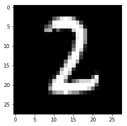 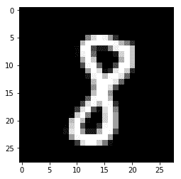

# 从头开始构建 CNN 模型

对于这个例子，让我们从头开始构建我们自己的架构。我们的网络架构将包含不同层的组合，即:

*   `Conv2d`
*   `MaxPool2d`
*   **整流线性单元** ( **ReLU** )
*   视角
*   线性层

让我们看一下我们将要实现的架构的图示:


让我们在 PyTorch 中实现这个架构，然后看看每个单独的层是做什么的:

```py
class Net(nn.Module):
    def __init__(self):
        super().__init__()
        self.conv1 = nn.Conv2d(1, 10, kernel_size=5)
        self.conv2 = nn.Conv2d(10, 20, kernel_size=5)
        self.conv2_drop = nn.Dropout2d()
        self.fc1 = nn.Linear(320, 50)
        self.fc2 = nn.Linear(50, 10)

    def forward(self, x):
        x = F.relu(F.max_pool2d(self.conv1(x), 2))
        x = F.relu(F.max_pool2d(self.conv2_drop(self.conv2(x)), 2))
        x = x.view(-1, 320)
        x = F.relu(self.fc1(x))
        x = F.dropout(x, training=self.training)
        x = self.fc2(x)
        return F.log_softmax(x)
```

我们来详细了解一下每一层是做什么的。

# Conv2d

负责对我们的 MNIST 图像应用卷积滤波器。让我们试着理解卷积是如何应用在一维数组上的，然后转移到二维卷积是如何应用到图像上的。我们将看下面的图像，我们将把一个过滤器(或内核)大小的`3`的`Conv1d`应用于一个长度为`7`的张量:


底部的方框表示七个值的输入张量，相连的方框表示应用大小为三的卷积滤波器后的输出。在图像的右上角，三个框代表`Conv1d`层的权重和参数。卷积滤波器的应用就像一个窗口，它通过跳过一个值来移动到下一个值。要跳过的值的数量称为**步距**，默认设置为`1`。让我们通过记下第一个和最后一个输出的计算结果来了解输出值是如何计算的:

输出 1->(*-0.5209 x 0.2286*)+(*-0.0147 x 2.4488*)+(*-0.4281 x-0.9498*)

输出 5->(*-0.5209 x-0.6791*)+(*-0.0147 x-0.6535*)+(*-0.4281 x 0.6437*)

现在，卷积的作用应该很清楚了。它通过基于步幅值移动输入来对输入应用过滤器(或内核)，过滤器是一组权重。在前面的例子中，我们一次移动一个过滤器。如果步幅值是`2`，那么我们将一次移动两个点。让我们看一个 PyTorch 实现来理解它是如何工作的:

```py
conv = nn.Conv1d(1,1,3,bias=False)
sample = torch.randn(1,1,7)
conv(Variable(sample))

#Check the weights of our convolution filter by 
conv.weight
```

还有一个重要的参数，叫做**填充，**，它经常与卷积一起使用。如果我们仔细观察前面的例子，我们可能会意识到，如果直到数据结束时才应用过滤器，当没有足够的元素供数据跨越时，它就会停止。填充通过在张量的两端添加零来防止这种情况。让我们再次看看填充如何工作的一维示例:


在前面的图像中，我们用填充`2`和步幅`1`应用了一个`Conv1d`层。

让我们看看 Conv2d 如何处理图像:

在我们了解 Conv2d 的工作原理之前，我强烈建议您查看令人惊叹的博客([http://setosa.io/ev/image-kernels/](http://setosa.io/ev/image-kernels/))，其中包含卷积如何工作的现场演示。在您花了几分钟时间玩了演示之后，请阅读下一部分。

让我们了解一下演示中发生了什么。在图像的中间方框中，我们有两组不同的数字；一个在盒子里，另一个在盒子下面。方框中表示的是像素值，如左边照片中的白色方框所示。方框下面的数字是用于锐化图像的过滤器(或内核)值。这些数字是为完成某项特定任务而精心挑选的。在这种情况下，它是锐化图像。就像我们前面的例子一样，我们正在做一个元素到元素的乘法，并对所有值求和，以生成右边图像中的像素值。生成的值通过图像右侧的白色框突出显示。

虽然在这个例子中内核中的值是手工选取的，但是在 CNN 中我们不手工选取这些值，而是我们随机地初始化它们，并且让梯度下降和反向传播来调整内核的值。学习后的内核将负责识别不同的特征，如直线、曲线和眼睛。让我们看另一个图像，我们把它看作一个数字矩阵，看看卷积是如何工作的:


在前面的屏幕截图中，我们假设 6 x 6 矩阵代表一幅图像，我们应用了大小为 3 x 3 的卷积滤波器，然后我们展示了输出是如何生成的。为了简单起见，我们只计算矩阵中突出显示的部分。通过执行以下计算生成输出:

输出–>*0.86 x 0+-0.92 x 0+-0.61 x 1+-0.32 x-1+-1.69 x-1+........*

在`Conv2d`函数中使用的另一个重要参数是`kernel_size`，它决定了内核的大小。一些常用的内核大小有 *1* 、 *3* 、 *5* 和 *7* 。内核大小越大，滤波器可以覆盖的区域就越大，因此常见的是将 *7* 或 *9* 的滤波器应用于早期层中的输入数据。

# 联营

在卷积图层之后添加池化图层是一种常见的做法，因为它们会减小要素地图的大小和卷积图层的结果。

池提供了两个不同的功能:一个是减少要处理的数据的大小，另一个是迫使算法不要关注图像位置的微小变化。例如，人脸检测算法应该能够检测照片中的人脸，而不管人脸在照片中的位置如何。

我们来看看 MaxPool2d 是如何工作的。它也有相同的内核大小和步幅的概念。它不同于卷积，因为它没有任何权重，只作用于每个过滤器从前一层生成的数据。如果内核大小是 *2 x 2，*，那么它会考虑图像中的大小并选择该区域的最大值。让我们看看下面的图像，它将清楚地表明 MaxPool2d 是如何工作的:

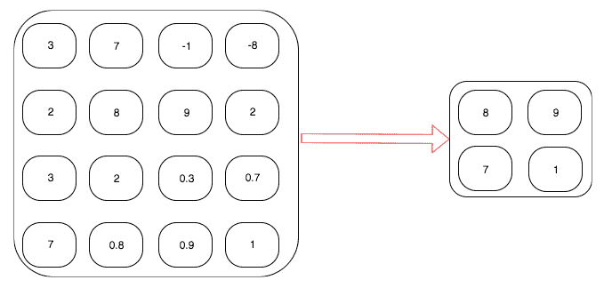

左手边的方框包含特征映射的值。应用最大池后，输出存储在盒子的右侧。让我们看看输出是如何计算的，在输出的第一行中写下值的计算结果:


另一种常用的汇集技术是**平均汇集**。`maximum`功能被`average`功能取代。下图解释了平均池的工作原理:


在这个例子中，我们不是取四个值的最大值，而是取四个值的平均值。让我们把计算写下来，这样更容易理解:


# 非线性激活–ReLU

在最大池化之后，或者在应用卷积之后，有一个非线性层是常见的和最佳的实践。大多数网络架构倾向于使用 ReLU 或不同风格的 ReLU。无论我们选择什么非线性函数，它都会应用到特征图的每个元素。为了更直观，让我们看一个例子，在这个例子中，我们对应用了最大池和平均池的相同特征映射应用 ReLU:

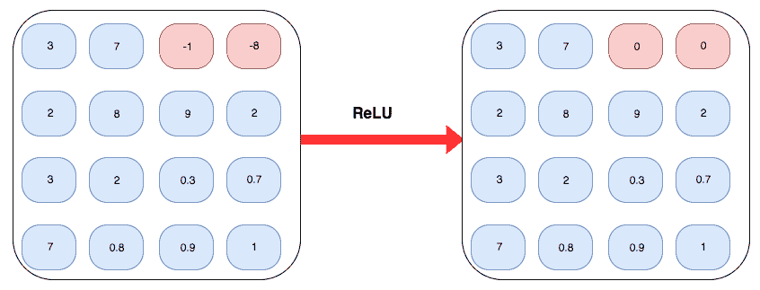

# 视角

对于影像分类问题，通常在大多数网络的末端使用全连通或线性图层。我们使用的是二维卷积，它将一个数字矩阵作为输入，输出另一个数字矩阵。要应用线性层，我们需要将二维张量的矩阵展平为一维向量。以下示例将向您展示`view`是如何工作的:


让我们来看一下我们的网络中使用的代码，它具有同样的功能:

```py
x.view(-1, 320)
```

正如我们之前看到的，`view`方法将把一个 *n* 维张量展平为一个一维张量。在我们的网络中，第一维是每个图像。批处理后的输入数据将具有尺寸*32×1×28×28，*，其中第一个数字 *32，*将表示存在尺寸 *28* 高、 *28* 宽、 *1* 通道的 *32* 图像，因为它是黑白图像。当我们展平时，我们不想展平或混合不同图像的数据。因此，我们传递给`view`函数的第一个参数将指示 PyTorch 避免在第一维上展平数据。让我们在下图中看看这是如何工作的:

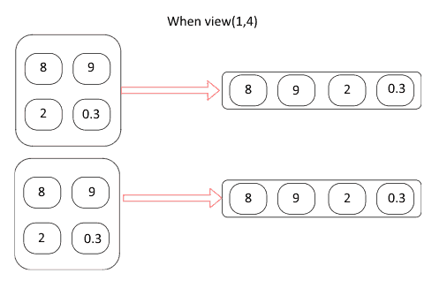

在前面的例子中，我们有大小为 *2 x 1 x 2 x 2* 的数据；在我们应用了`view`函数之后，它被转换成大小为 *2 x 1 x 4* 的张量。我们再来看另一个例子，我们没有提到 *- 1* :

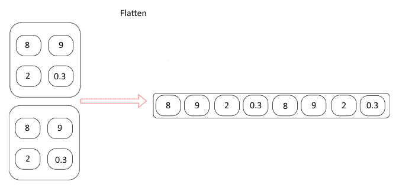

如果我们忘记提到要展平哪个维度，我们可能会得到意想不到的结果。所以在这一步要格外小心。

# 线性层

在我们将数据从二维张量转换为一维张量后，我们将数据通过一个线性层，然后是一个非线性激活层。在我们的架构中，我们有两个线性层；一个后跟 ReLU，另一个后跟一个`log_softmax`，它预测给定图像中包含什么数字。

# 训练模型

训练模型的过程和我们之前的猫狗图像分类问题是一样的。以下代码片段在提供的数据集上对我们的模型进行了训练:

```py
def fit(epoch,model,data_loader,phase='training',volatile=False):
    if phase == 'training':
        model.train()
    if phase == 'validation':
        model.eval()
        volatile=True
    running_loss = 0.0
    running_correct = 0
    for batch_idx , (data,target) in enumerate(data_loader):
        if is_cuda:
            data,target = data.cuda(),target.cuda()
        data , target = Variable(data,volatile),Variable(target)
        if phase == 'training':
            optimizer.zero_grad()
        output = model(data)
        loss = F.nll_loss(output,target)

        running_loss += F.nll_loss(output,target,size_average=False).data[0]
        preds = output.data.max(dim=1,keepdim=True)[1]
        running_correct += preds.eq(target.data.view_as(preds)).cpu().sum()
        if phase == 'training':
            loss.backward()
            optimizer.step()

    loss = running_loss/len(data_loader.dataset)
    accuracy = 100\. * running_correct/len(data_loader.dataset)

    print(f'{phase} loss is {loss:{5}.{2}} and {phase} accuracy is {running_correct}/{len(data_loader.dataset)}{accuracy:{10}.{4}}')
    return loss,accuracy
```

这个方法对于`training`和`validation`有不同的逻辑。使用不同模式主要有两个原因:

*   在`train`模式中，删除会删除一定百分比的值，这在验证或测试阶段是不应该发生的
*   对于`training`模式，我们计算梯度并改变模型的参数值，但是在测试或验证阶段不需要反向传播

如前几章所述，前面函数中的大部分代码都是不言自明的。在函数的最后，我们返回该特定时期的模型的`loss`和`accuracy`。

让我们通过前面的函数运行模型 20 次迭代，并绘制出`train`和`validation`的`loss`和`accuracy`，以了解我们的网络表现如何。以下代码为`20`迭代的`train`和`test`数据集运行`fit`方法:

```py
model = Net()
if is_cuda:
    model.cuda()

optimizer = optim.SGD(model.parameters(),lr=0.01,momentum=0.5)
train_losses , train_accuracy = [],[]
val_losses , val_accuracy = [],[]
for epoch in range(1,20):
    epoch_loss, epoch_accuracy = fit(epoch,model,train_loader,phase='training')
    val_epoch_loss , val_epoch_accuracy = fit(epoch,model,test_loader,phase='validation')
    train_losses.append(epoch_loss)
    train_accuracy.append(epoch_accuracy)
    val_losses.append(val_epoch_loss)
    val_accuracy.append(val_epoch_accuracy)
```

以下代码绘制了`training`和`test loss`:

```py
plt.plot(range(1,len(train_losses)+1),train_losses,'bo',label = 'training loss')
plt.plot(range(1,len(val_losses)+1),val_losses,'r',label = 'validation loss')
plt.legend()
```

上述代码生成了下图:


以下代码绘制了训练和测试精度:

```py
plt.plot(range(1,len(train_accuracy)+1),train_accuracy,'bo',label = 'train accuracy')
plt.plot(range(1,len(val_accuracy)+1),val_accuracy,'r',label = 'val accuracy')
plt.legend()
```

上述代码生成了下图:

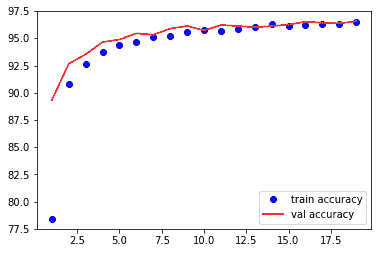

在第 20 个^(周期)结束时，我们达到了 98.9%的`test`精确度。我们已经得到了我们的简单卷积模型的工作，并几乎达到了最先进的结果。让我们看看当我们在以前使用的`Dogs vs. Cats`数据集上尝试相同的网络架构时会发生什么。我们将使用上一章的数据，[第 3 章](2.html)、*神经网络的构建模块、*以及 MNIST 示例中的架构，并做一些小的改动。一旦我们训练了模型，让我们评估它以理解我们的简单架构执行得有多好。

# 给狗和猫分类——CNN 从零开始

我们将使用相同的架构，但做了一些小的改动，如下所示:

*   第一个线性层的输入尺寸改变了，因为我们的猫和狗图像的尺寸是 *256，256*
*   我们添加了另一个线性层，为模型学习提供更多的灵活性

让我们看看实现网络架构的代码:

```py
class Net(nn.Module):
    def __init__(self):
        super().__init__()
        self.conv1 = nn.Conv2d(3, 10, kernel_size=5)
        self.conv2 = nn.Conv2d(10, 20, kernel_size=5)
        self.conv2_drop = nn.Dropout2d()
        self.fc1 = nn.Linear(56180, 500)
        self.fc2 = nn.Linear(500,50)
        self.fc3 = nn.Linear(50, 2)

    def forward(self, x):
        x = F.relu(F.max_pool2d(self.conv1(x), 2))
        x = F.relu(F.max_pool2d(self.conv2_drop(self.conv2(x)), 2))
        x = x.view(x.size(0),-1)
        x = F.relu(self.fc1(x))
        x = F.dropout(x, training=self.training)
        x = F.relu(self.fc2(x))
        x = F.dropout(x,training=self.training)
        x = self.fc3(x)
        return F.log_softmax(x,dim=1)
```

我们将使用用于 MNIST 例子的相同的`training`函数。所以，我不包括这里的代码。但是让我们看看当模型被训练用于 *20* 迭代时生成的图。

`training`和`validation`数据集丢失:

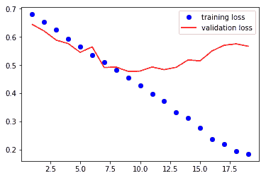

`training`和`validation`数据集的精度:


从图中可以清楚地看出，每次迭代的训练损失都在减少，但是验证损失却越来越严重。准确度在训练期间也增加，但是在 75%时几乎饱和。这是一个很明显的例子，这个模型并没有推广。我们将看看另一种称为**迁移学习**的技术，它帮助我们训练更精确的模型，并提供技巧使训练更快。

# 利用迁移学习对狗和猫进行分类

迁移学习是一种在类似数据集上重用已训练算法的能力，而无需从头开始训练。我们人类不会通过分析数以千计的相似图像来学习识别新图像。作为人类，我们只知道区分特定动物的不同特征，比如狐狸和狗。我们不需要通过理解线条、眼睛和其他更小的特征来了解狐狸是什么。因此，我们将学习如何使用一个预训练的模型，用非常少的数据来构建最先进的图像分类器。

CNN 架构的前几层关注较小的特征，例如直线或曲线的外观。CNN 后面几层中的过滤器学习更高层次的特征，例如眼睛和手指，最后几层学习识别确切的类别。预训练模型是在类似数据集上训练的算法。大多数流行的算法都在流行的`ImageNet`数据集上进行了预训练，以识别 1000 个不同的类别。这种预先训练的模型将具有被调整以识别各种模式的过滤器权重。那么，让我们来了解如何利用这些预先训练好的重量。我们将研究一种叫做 **VGG16** 的算法，这是最早在 ImageNet 竞赛中获得成功的算法之一。尽管有更多的现代算法，这种算法仍然很受欢迎，因为它易于理解和用于迁移学习。让我们看看 VGG16 模型的架构，然后尝试理解该架构以及我们如何使用它来训练我们的图像分类器:

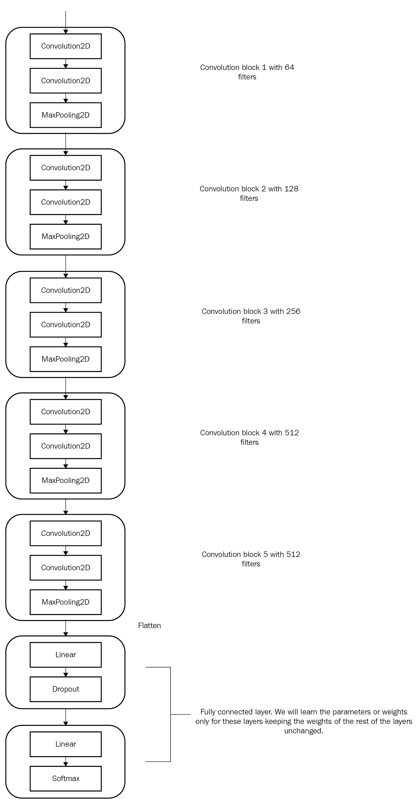Architecture of the VGG16 model

VGG16 架构包含五个 VGG 模块。一个块是一组卷积层、一个非线性激活函数和一个最大汇集函数。所有算法参数都经过调整，以实现对 1，000 个类别进行分类的最先进结果。该算法采用批处理形式的输入数据，这些数据通过`ImageNet`数据集的平均值和标准偏差进行标准化。在迁移学习中，我们试图通过冻结架构大多数层的学习参数来捕捉算法学习的内容。通常只对网络的最后几层进行微调。在这个例子中，让我们只训练最后几个线性层，并保持卷积层不变，因为卷积特征学习的特征主要用于图像共享相似属性的各种图像问题。让我们用迁移学习训练一个 VGG16 模型，对狗和猫进行分类。让我们来看看实现这一点所需的不同步骤。

# 创建和探索 VGG16 模型

PyTorch 在其`torchvision`库中提供了一组经过训练的模型。他们中的大多数人接受一个名为`pretrained` when `True`的论点，该论点下载为 **ImageNet** 分类问题调整的权重。让我们看看创建 VGG16 模型的代码片段:

```py
from torchvision import models
vgg = models.vgg16(pretrained=True)
```

现在，我们有了 VGG16 模型，所有预先训练好的砝码都已准备就绪，可以使用了。第一次运行代码时，可能需要几分钟，这取决于您的网速。权重的大小可能在 500 MB 左右。我们可以通过打印来快速浏览一下 VGG16 模型。当我们使用现代架构时，理解这些网络是如何实现的变得非常有用。让我们来看看这个模型:

```py
VGG (
  (features): Sequential (
    (0): Conv2d(3, 64, kernel_size=(3, 3), stride=(1, 1), padding=(1, 1))
    (1): ReLU (inplace)
    (2): Conv2d(64, 64, kernel_size=(3, 3), stride=(1, 1), padding=(1, 1))
    (3): ReLU (inplace)
    (4): MaxPool2d (size=(2, 2), stride=(2, 2), dilation=(1, 1))
    (5): Conv2d(64, 128, kernel_size=(3, 3), stride=(1, 1), padding=(1, 1))
    (6): ReLU (inplace)
    (7): Conv2d(128, 128, kernel_size=(3, 3), stride=(1, 1), padding=(1, 1))
    (8): ReLU (inplace)
    (9): MaxPool2d (size=(2, 2), stride=(2, 2), dilation=(1, 1))
    (10): Conv2d(128, 256, kernel_size=(3, 3), stride=(1, 1), padding=(1, 1))
    (11): ReLU (inplace)
    (12): Conv2d(256, 256, kernel_size=(3, 3), stride=(1, 1), padding=(1, 1))
    (13): ReLU (inplace)
    (14): Conv2d(256, 256, kernel_size=(3, 3), stride=(1, 1), padding=(1, 1))
    (15): ReLU (inplace)
    (16): MaxPool2d (size=(2, 2), stride=(2, 2), dilation=(1, 1))
    (17): Conv2d(256, 512, kernel_size=(3, 3), stride=(1, 1), padding=(1, 1))
    (18): ReLU (inplace)
    (19): Conv2d(512, 512, kernel_size=(3, 3), stride=(1, 1), padding=(1, 1))
    (20): ReLU (inplace)
    (21): Conv2d(512, 512, kernel_size=(3, 3), stride=(1, 1), padding=(1, 1))
    (22): ReLU (inplace)
    (23): MaxPool2d (size=(2, 2), stride=(2, 2), dilation=(1, 1))
    (24): Conv2d(512, 512, kernel_size=(3, 3), stride=(1, 1), padding=(1, 1))
    (25): ReLU (inplace)
    (26): Conv2d(512, 512, kernel_size=(3, 3), stride=(1, 1), padding=(1, 1))
    (27): ReLU (inplace)
    (28): Conv2d(512, 512, kernel_size=(3, 3), stride=(1, 1), padding=(1, 1))
    (29): ReLU (inplace)
    (30): MaxPool2d (size=(2, 2), stride=(2, 2), dilation=(1, 1))
  )
  (classifier): Sequential (
    (0): Linear (25088 -> 4096)
    (1): ReLU (inplace)
    (2): Dropout (p = 0.5)
    (3): Linear (4096 -> 4096)
    (4): ReLU (inplace)
    (5): Dropout (p = 0.5)
    (6): Linear (4096 -> 1000)
  )
)
```

模型摘要包含两个顺序模型`features`和`classifiers`。`features sequential`模型有我们将要冻结的层。

# 冷冻各层

让我们冻结`features`模型的所有层，它包含卷积块。冻结层中的权重将防止这些卷积块的权重。由于模型的权重被训练来识别许多重要的特征，我们的算法将能够从第一次迭代开始就做同样的事情。使用模型权重的能力，最初是为不同的用例而训练的，被称为**迁移学习**。现在让我们看看如何冻结层的权重或参数:

```py
for param in vgg.features.parameters(): param.requires_grad = False
```

这段代码阻止优化器更新权重。

# 微调 VGG16

VGG16 模型被训练来分类 1000 个类别，但没有被训练来分类狗和猫。所以我们需要把最后一层的输出特征从`1000`改成`2`。下面的代码片段可以做到这一点:

```py
vgg.classifier[6].out_features = 2
```

`vgg.classifier`提供了对顺序模型中所有层的访问，第六个元素将包含最后一层。当我们训练 VGG16 模型时，我们只需要训练分类器参数。因此，我们只将`classifier.parameters`传递给优化器，如下所示:

```py
optimizer = 
  optim.SGD(vgg.classifier.parameters(),lr=0.0001,momentum=0.5)
```

# 培训 VGG16 模型

我们已经创建了模型和优化器。因为我们使用的是`Dogs vs. Cats`数据集，所以我们可以使用相同的数据加载器和`train`函数来训练我们的模型。请记住，当我们训练模型时，只有分类器内部的参数会发生变化。以下代码片段将为`20`时代训练模型，达到 98.45%的验证准确率:

```py
train_losses , train_accuracy = [],[]
val_losses , val_accuracy = [],[]
for epoch in range(1,20):
    epoch_loss, epoch_accuracy = fit(epoch,vgg,train_data_loader,phase='training')
    val_epoch_loss , val_epoch_accuracy = fit(epoch,vgg,valid_data_loader,phase='validation')
    train_losses.append(epoch_loss)
    train_accuracy.append(epoch_accuracy)
    val_losses.append(val_epoch_loss)
    val_accuracy.append(val_epoch_accuracy)
```

让我们想象一下培训和验证的损失:


让我们想象一下培训和验证的准确性:

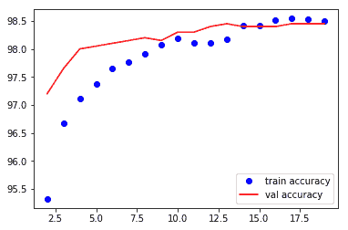

我们可以应用一些技巧，比如数据扩充和使用不同的 dropout 值来提高模型的泛化能力。以下代码片段将 VGG 的分类器模块中的 dropout，值从`0.5`更改为`0.2`，并训练模型:

```py
for layer in vgg.classifier.children():
    if(type(layer) == nn.Dropout):
        layer.p = 0.2

#Training
train_losses , train_accuracy = [],[]
val_losses , val_accuracy = [],[]
for epoch in range(1,3):
    epoch_loss, epoch_accuracy = fit(epoch,vgg,train_data_loader,phase='training')
    val_epoch_loss , val_epoch_accuracy = fit(epoch,vgg,valid_data_loader,phase='validation')
    train_losses.append(epoch_loss)
    train_accuracy.append(epoch_accuracy)
    val_losses.append(val_epoch_loss)
    val_accuracy.append(val_epoch_accuracy)
```

训练这几个时代给了我一点点改善；您可以尝试使用不同的 dropout 值来弹奏。提高模型泛化能力的另一个重要技巧是添加更多数据或进行数据扩充。我们将通过随机水平翻转图像或小角度旋转图像来进行数据扩充。`torchvision`转换为数据扩充提供了不同的功能，并且它们是动态进行的，每个时期都会发生变化。我们使用以下代码实现数据扩充:

```py
train_transform =transforms.Compose([transforms.Resize((224,224)),
                                     transforms.RandomHorizontalFlip(),
                                     transforms.RandomRotation(0.2),
                                     transforms.ToTensor(),
                                     transforms.Normalize([0.485, 0.456, 0.406], [0.229, 0.224, 0.225])
                                      ])

train = ImageFolder('dogsandcats/train/',train_transform)
valid = ImageFolder('dogsandcats/valid/',simple_transform)

#Training 

train_losses , train_accuracy = [],[]
val_losses , val_accuracy = [],[]
for epoch in range(1,3):
    epoch_loss, epoch_accuracy = fit(epoch,vgg,train_data_loader,phase='training')
    val_epoch_loss , val_epoch_accuracy = fit(epoch,vgg,valid_data_loader,phase='validation')
    train_losses.append(epoch_loss)
    train_accuracy.append(epoch_accuracy)
    val_losses.append(val_epoch_loss)
    val_accuracy.append(val_epoch_accuracy)
```

上述代码的输出生成如下:

```py
#Results

training loss is 0.041 and training accuracy is 22657/23000 98.51 validation loss is 0.043 and validation accuracy is 1969/2000 98.45 training loss is 0.04 and training accuracy is 22697/23000 98.68 validation loss is 0.043 and validation accuracy is 1970/2000 98.5
```

通过仅运行两个时期，用扩充数据训练模型将模型准确度提高了 0.1%；我们可以再运行几次来进一步改进。如果你在阅读这本书的时候一直在训练这些模型，你会意识到每个历元的训练可能需要几分钟以上，这取决于你运行的 GPU。让我们看看一种技术，我们可以在几秒钟内训练每个时期。

# 计算预卷积特征

当我们冻结卷积层和训练模型时，全连接层或密集层的输入(`vgg.classifier`)总是相同的。为了更好地理解，让我们把卷积块，在我们的例子中是`vgg.features`块，看作一个已经学习了权重并且在训练期间不改变的函数。因此，计算卷积特征并存储它们将有助于提高训练速度。训练模型的时间减少了，因为我们只计算这些特征一次，而不是为每个时期计算。让我们直观地理解并实现它:

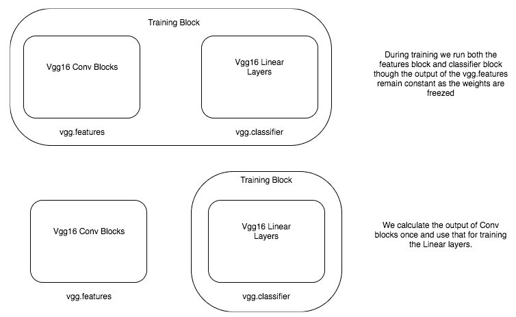

第一个框描述了一般如何进行训练，这可能会很慢，因为我们计算每个时期的卷积特征，尽管这些值不会改变。在底部的框中，我们计算一次卷积特征，并且只训练线性层。为了计算预卷积特征，我们将通过卷积块传递所有训练数据并存储它们。为此，我们需要选择 VGG 模型的卷积模块。幸运的是，VGG16 的 PyTorch 实现有两个顺序模型，因此只需挑选第一个顺序模型的特性就足够了。下面的代码可以做到这一点:

```py
vgg = models.vgg16(pretrained=True)
vgg = vgg.cuda()
features = vgg.features

train_data_loader = torch.utils.data.DataLoader(train,batch_size=32,num_workers=3,shuffle=False)
valid_data_loader = torch.utils.data.DataLoader(valid,batch_size=32,num_workers=3,shuffle=False)

def preconvfeat(dataset,model):
    conv_features = []
    labels_list = []
    for data in dataset:
        inputs,labels = data
        if is_cuda:
            inputs , labels = inputs.cuda(),labels.cuda() 
        inputs , labels = Variable(inputs),Variable(labels)
        output = model(inputs)
        conv_features.extend(output.data.cpu().numpy())
        labels_list.extend(labels.data.cpu().numpy())
    conv_features = np.concatenate([[feat] for feat in conv_features])

    return (conv_features,labels_list)

conv_feat_train,labels_train = preconvfeat(train_data_loader,features)
conv_feat_val,labels_val = preconvfeat(valid_data_loader,features)
```

在前面的代码中，`preconvfeat`方法接收数据集和`vgg`模型，并返回复杂的特征以及与之关联的标签。其余的代码与我们在其他示例中创建数据加载器和数据集时使用的代码相似。

一旦我们有了`train`和`validation`集合的卷积特征，让我们创建一个 PyTorch 数据集和`DataLoader`类，这将简化我们的训练过程。以下代码为我们的卷积特征创建了`Dataset`和`DataLoader`:

```py
class My_dataset(Dataset):
    def __init__(self,feat,labels):
        self.conv_feat = feat
        self.labels = labels

    def __len__(self):
        return len(self.conv_feat)

    def __getitem__(self,idx):
        return self.conv_feat[idx],self.labels[idx]

train_feat_dataset = My_dataset(conv_feat_train,labels_train)
val_feat_dataset = My_dataset(conv_feat_val,labels_val)

train_feat_loader = 
  DataLoader(train_feat_dataset,batch_size=64,shuffle=True)
val_feat_loader = 
  DataLoader(val_feat_dataset,batch_size=64,shuffle=True)
```

因为我们有了新的数据加载器，可以生成批量复杂的特征和标签，所以我们可以使用在其他示例中使用的相同的`train`函数。现在我们将使用`vgg.classifier`作为创建`optimizer`和`fit`方法的模型。下面的代码训练分类器模块来识别狗和猫。在 Titan X GPU 上，每个历元不到 5 秒，否则需要几分钟:

```py
train_losses , train_accuracy = [],[]
val_losses , val_accuracy = [],[]
for epoch in range(1,20):
    epoch_loss, epoch_accuracy = fit_numpy(epoch,vgg.classifier,train_feat_loader,phase='training')
    val_epoch_loss , val_epoch_accuracy = fit_numpy(epoch,vgg.classifier,val_feat_loader,phase='validation')
    train_losses.append(epoch_loss)
    train_accuracy.append(epoch_accuracy)
    val_losses.append(val_epoch_loss)
    val_accuracy.append(val_epoch_accuracy)
```

# 理解 CNN 模型学到了什么

深度学习模型经常被认为是不可解释的。但是人们正在探索不同的技术来解释这些模型内部发生了什么。对于图像，修道院所学的特征是可以解释的。我们将探讨两种流行的技术来理解修道院。

# 可视化中间层的输出

可视化中间层的输出将有助于我们理解输入图像如何在不同层之间转换。通常，每一层的输出被称为**激活**。要做到这一点，我们应该从中间层提取输出，这可以通过不同的方式来完成。PyTorch 提供了一个名为`register_forward_hook`的方法，它允许我们传递一个可以提取特定层的输出的函数。

默认情况下，PyTorch 模型只存储最后一层的输出，以优化使用内存。因此，在我们检查中间层的激活看起来像什么之前，让我们理解如何从模型中提取输出。让我们看看下面的代码片段，它提取了，我们将通过它来了解发生了什么:

```py
vgg = models.vgg16(pretrained=True).cuda()

class LayerActivations():
    features=None

    def __init__(self,model,layer_num):
        self.hook = model[layer_num].register_forward_hook(self.hook_fn)

    def hook_fn(self,module,input,output):
        self.features = output.cpu()

    def remove(self):
        self.hook.remove()

conv_out = LayerActivations(vgg.features,0)

o = vgg(Variable(img.cuda()))

conv_out.remove()

act = conv_out.features
```

我们从创建预训练的 VGG 模型开始，从中提取特定层的输出。`LayerActivations`类指示 PyTorch 将层的输出存储到`features`变量中。让我们遍历一下`LayerActivations`类中的每个函数。

`_init_`函数将需要提取输出的模型和层数作为参数。我们在层上调用`register_forward_hook`方法并传入一个函数。PyTorch 在向前传递时——也就是说，当图像通过各层时——调用传递给`register_forward_hook`方法的函数。该方法返回一个句柄，该句柄可用于注销传递给`register_forward_hook`方法的函数。

`register_forward_hook`方法向我们传递给它的函数传递三个值。`module`参数允许我们访问层本身。第二个参数是`input`，指的是流经该层的数据。第三个参数是`output`，它允许访问层的转换输入或激活。我们将输出存储到`LayerActivations`类的特征变量中。

第三个函数从`_init_`函数中取出`hook`，并取消注册该函数。现在我们可以传递我们正在寻找激活的模型和层号。让我们看看为不同层的下图创建的激活:


让我们来看看第一个卷积层创建的一些激活和用于它的代码:

```py
fig = plt.figure(figsize=(20,50))
fig.subplots_adjust(left=0,right=1,bottom=0,top=0.8,hspace=0,
  wspace=0.2)
for i in range(30):
    ax = fig.add_subplot(12,5,i+1,xticks=[],yticks=[])
    ax.imshow(act[0][i])
```

让我们来看看第五卷积层创建的一些激活:


让我们看看最后一层 CNN:


通过查看不同层生成的内容，我们可以看到，早期的层检测线条和边缘，最后的层倾向于学习更高级别的特征，可解释性更差。在我们继续可视化权重之前，让我们看看在 ReLU 层之后，功能映射或激活是如何表示其自身的。那么，让我们来看看第二层的输出。

如果您快速查看前面图像第二行中的第五幅图像，看起来滤镜正在检测图像中的眼睛。当模型不执行时，这些可视化的技巧可以帮助我们理解为什么模型可能不工作。

# 可视化 CNN 图层的权重

获取特定层的模型权重非常简单。所有的模型重量都可以通过`state_dict`功能访问。`state_dict`函数返回一个字典，以关键字作为其层，以权重作为其值。以下代码演示了如何提取特定图层的权重并对其进行可视化:

```py
vgg.state_dict().keys()
cnn_weights = vgg.state_dict()['features.0.weight'].cpu()
```

上述代码为我们提供了以下输出:

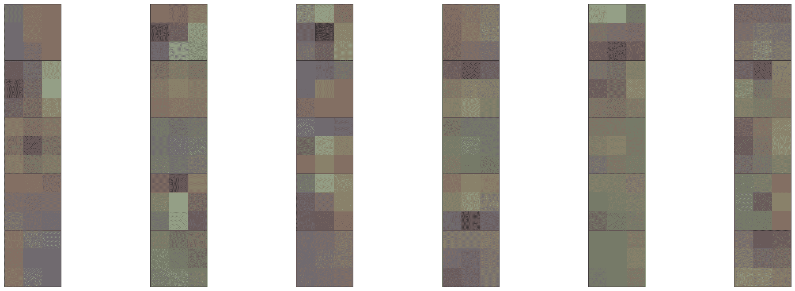

每个方框代表尺寸为*3×3*的过滤器的重量。每个过滤器被训练来识别图像中的特定模式。

# 摘要

在这一章中，我们学习了如何使用 convents 构建图像分类器，以及如何使用预训练的模型。我们讲述了如何通过使用这些预先复杂的特性来加速训练过程的技巧。此外，我们了解了不同的技术，可以用来了解 CNN 内部发生了什么。

在下一章，我们将学习如何使用循环神经网络处理顺序数据。