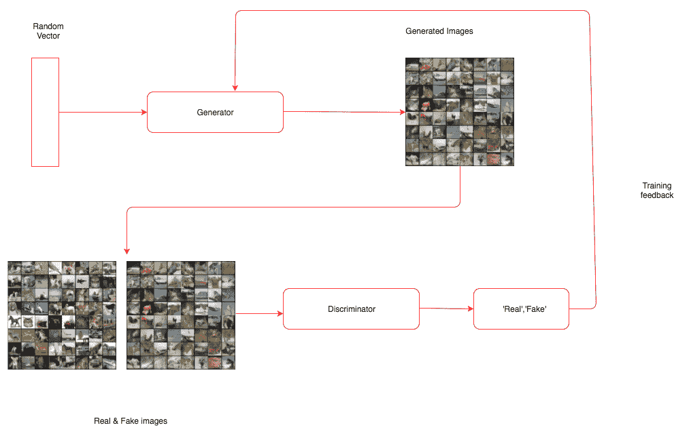
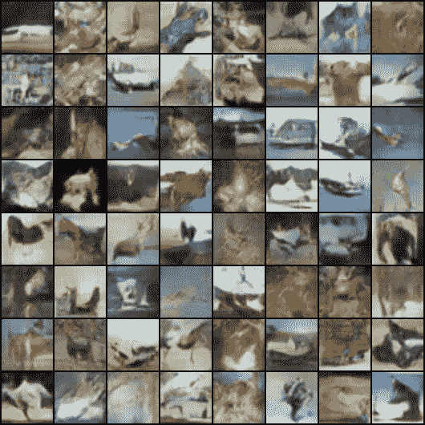

# 六、生成网络

我们在前面章节中看到的所有例子都集中在解决分类或回归等问题上。这一章非常有趣，对于理解深度学习是如何进化来解决无监督学习中的问题非常重要。

在本章中，我们将训练学习如何创建的网络:

*   基于内容和特定艺术风格的图像，通常称为**风格迁移**
*   用一种特殊类型的**生成对抗网络** ( **干**)生成新人的面孔
*   使用语言建模生成新文本

这些技术构成了深度学习领域大多数高级研究的基础。深入每个子领域的具体细节，比如 GANs 和语言建模，超出了本书的范围，因为它们应该有单独的一本书。我们将学习它们一般是如何工作的，以及在 PyTorch 中构建它们的过程。

# 神经类型转移

我们人类创作的艺术品具有不同的精确度和复杂程度。虽然艺术创作的过程可能是一个非常复杂的过程，但它可以被视为两个最重要因素的结合，即画什么和怎么画。画什么受到我们周围所见的启发，我们如何画也会受到我们周围某些事物的影响。从艺术家的角度来看，这可能过于简单，但对于理解我们如何使用深度学习算法创作艺术品来说，这非常有用。我们将训练一种深度学习算法，从一幅图像中提取内容，然后根据特定的艺术风格绘制它。如果你是一名艺术家或者从事创意行业，你可以直接利用近年来进行的惊人研究来改进这一点，并在你工作的领域内创造一些很酷的东西。即使你不是，它仍然把你引入了生成模型的领域，在那里网络生成新的内容。

让我们从高层次上理解在神经风格转换中做了什么，然后深入细节，以及构建它所需的 PyTorch 代码。风格迁移算法具有内容*图像(C)* 和风格*图像(S)；*该算法必须生成新的图像(O ),该图像具有来自内容图像的内容和来自样式图像的样式。这种创建神经风格迁移的过程是由 Leon Gates 等人在 2015 年提出的([一种艺术风格的神经算法)](https://arxiv.org/pdf/1508.06576.pdf)。以下是我们将使用的内容图像(C ):

Image source: https://arxiv.org/pdf/1508.06576.pdf

以下是风格图片:

Image source: https://arxiv.org/pdf/1508.06576.pdf

这是我们将要生成的图像:


图片来源:https://arxiv.org/pdf/1508.06576.pdf

通过理解**卷积神经网络**(**CNN**)的工作方式，风格转换背后的想法变得很直观。当 CNN 被训练用于物体识别时，经过训练的 CNN 的早期层学习非常普通的信息，如直线、曲线和形状。CNN 的最后一层从图像中捕捉更高层次的概念，如眼睛、建筑物和树木。所以相似图像的最后一层的值趋于接近。我们采用相同的概念，并将其应用于内容损失。内容图像和生成图像的最后一层应该是相似的，我们使用**均方误差** ( **MSE** )来计算相似度。我们使用优化算法来降低损失值。

图像的风格通常通过一种叫做 **gram matrix** 的技术在 CNN 的多个层中捕捉。Gram matrix 计算跨多个图层捕获的特征图之间的相关性。Gram 矩阵给出了一种计算风格的方法。相似风格的图像具有相似的 gram 矩阵值。还使用风格图像的 gram 矩阵和生成的图像之间的 MSE 来计算风格损失。

我们将使用 torchvision 模型中提供的预训练 VGG19 模型。训练风格迁移模型所需的步骤类似于任何其他深度学习模型，除了计算损失比分类或回归模型更复杂这一事实。神经类型算法的训练可以分解为以下步骤:

1.  正在加载数据。
2.  创建 VGG19 模型。
3.  定义内容损失。
4.  定义风格损失。
5.  从 VGG 模型提取跨层损失。
6.  创建优化器。
7.  训练—生成与内容图像相似的图像，以及与风格图像相似的风格。

# 加载数据

加载数据类似于我们在[第五章](4.html)、*计算机视觉深度学习*中看到的解决图像分类问题。我们将使用预训练的 VGG 模型，因此我们必须使用与训练预训练模型相同的值来归一化图像。

下面的代码展示了我们如何做到这一点。代码基本上是不言自明的，因为我们已经在前面的章节中详细讨论过了:

```py
#Fixing the size of the image, reduce it further if you are not using a GPU.
imsize = 512 
is_cuda = torch.cuda.is_available()

#Converting image ,making it suitable for training using the VGG model.

prep = transforms.Compose([transforms.Resize(imsize),
                           transforms.ToTensor(),
                           transforms.Lambda(lambda x: x[torch.LongTensor([2,1,0])]), #turn to BGR
                           transforms.Normalize(mean=[0.40760392, 0.45795686, 0.48501961], #subtract imagenet mean
                                                std=[1,1,1]),
                           transforms.Lambda(lambda x: x.mul_(255)),
                          ])

#Converting the generated image back to a format which we can visualise. 

postpa = transforms.Compose([transforms.Lambda(lambda x: x.mul_(1./255)),
                           transforms.Normalize(mean=[-0.40760392, -0.45795686, -0.48501961], #add imagenet mean
                                                std=[1,1,1]),
                           transforms.Lambda(lambda x: x[torch.LongTensor([2,1,0])]), #turn to RGB
                           ])
postpb = transforms.Compose([transforms.ToPILImage()])

#This method ensures data in the image does not cross the permissible range .
def postp(tensor): # to clip results in the range [0,1]
    t = postpa(tensor)
    t[t>1] = 1 
    t[t<0] = 0
    img = postpb(t)
    return img

#A utility function to make data loading easier.
def image_loader(image_name):
    image = Image.open(image_name)
    image = Variable(prep(image))
    # fake batch dimension required to fit network's input dimensions
    image = image.unsqueeze(0)
    return image
```

在这段代码中，我们定义了三个功能，`prep`执行所有需要的预处理，并使用与训练 VGG 模型相同的值进行归一化。模型的输出需要归一化回其原始值；`postpa`函数执行所需的处理。生成的模型可能超出可接受值的范围，`postp`函数限制所有大于 1 比 1 的值和小于 0 比 0 的值。最后，`image_loader`函数加载图像，应用预处理转换，并将其转换为变量。以下函数加载样式和内容图像:

```py
style_img = image_loader("img/vangogh_starry_night.jpg")
content_img = image_loader("img/Tuebingen_Neckarfront.jpg")
```

我们可以创建一个带有噪声(随机数)的图像，也可以使用相同的内容图像。在这种情况下，我们将使用内容图像。以下代码创建内容图像:

```py
opt_img = Variable(content_img.data.clone(),requires_grad=True)
```

我们将使用优化器来调整`opt_img`的值，以使图像更接近内容图像和样式图像。出于这个原因，我们要求 PyTorch 通过提及`requires_grad=True`来保持梯度。

# 创造 VGG 模式

我们将从`torchvisions.models`加载一个预训练模型。我们将只在提取特征时使用这个模型，PyTorch VGG 模型是以这样一种方式定义的，即所有卷积块都在`features`模块中，全连接或线性层在`classifier`模块中。由于我们将不训练 VGG 模型中的任何权重或参数，因此我们也将冻结该模型。下面的代码演示了同样的情况:

```py
#Creating a pretrained VGG model
vgg = vgg19(pretrained=True).features

#Freezing the layers as we will not use it for training.
for param in vgg.parameters():
    param.requires_grad = False
```

在这段代码中，我们创建了一个 VGG 模型，只使用了它的卷积块，并冻结了模型的所有参数，因为我们将只使用它来提取特征。

# 内容损失

**内容损失**是对特定层的输出计算的 MSE，通过网络传递两幅图像来提取。我们通过使用`register_forward_hook`功能，通过传入内容图像和要优化的图像，从 VGG 中提取中间层的输出。我们计算从这些层的输出中获得的 MSE，如以下代码所述:

```py
target_layer = dummy_fn(content_img)
noise_layer = dummy_fn(noise_img)
criterion = nn.MSELoss()
content_loss = criterion(target_layer,noise_layer)
```

我们将在接下来的小节中实现这段代码的`dummy_fn`。目前，我们所知道的是，`dummy_fn`函数通过传递图像返回特定层的输出。我们将通过传递内容图像和噪声图像生成的输出传递给 MSE `loss`函数。

# 风格丧失

跨越多个层计算**风格损失**。风格损失是为每个特征图生成的 gram 矩阵的 MSE。gram 矩阵表示其特征的相关值。让我们通过下图和一个代码实现来理解 gram matrix 是如何工作的。

下表显示了维度为[2，3，3，3]的特征映射的输出，具有列属性`Batch_size`、`Channels`和`Values`:


为了计算 gram 矩阵，我们展平每个通道的所有值，然后通过乘以其转置找到相关性，如下表所示:


我们所做的只是将每个通道的所有值展平为一个向量或张量。以下代码实现了这一点:

```py
class GramMatrix(nn.Module):

    def forward(self,input):
        b,c,h,w = input.size()
        features = input.view(b,c,h*w)
        gram_matrix = torch.bmm(features,features.transpose(1,2))
        gram_matrix.div_(h*w)
        return gram_matrix
```

我们将`GramMatrix`实现为另一个具有`forward`功能的 PyTorch 模块，这样我们就可以像使用 PyTorch 层一样使用它。我们从这一行的输入图像中提取不同的维度:

```py
b,c,h,w = input.size()
```

这里，`b`表示批次，`c`表示过滤器或通道，`h`表示高度，`w`表示宽度。在下一步中，我们将使用以下代码保持批次和通道维度不变，并沿高度和宽度维度展平所有值，如上图所示:

```py
features = input.view(b,c,h*w)
```

gram 矩阵是通过将展平值与其转置向量相乘来计算的。我们可以通过使用 PyTorch 批处理矩阵乘法函数来实现，提供为`torch.bmm()`，如下面的代码所示:

```py
gram_matrix = torch.bmm(features,features.transpose(1,2))
```

我们通过将 gram 矩阵除以元素的数量来完成对其值的归一化。这防止了具有大量值的特定特征图支配分数。一旦计算出`GramMatrix`,计算样式损失就变得简单了，这在下面的代码中实现:

```py
class StyleLoss(nn.Module):

    def forward(self,inputs,targets):
        out = nn.MSELoss()(GramMatrix()(inputs),targets)
        return (out)
```

`StyleLoss`被实现为另一个 PyTorch 层。它计算输入值`GramMatrix`和风格图像值`GramMatrix`之间的 MSE。

# 提取损失

就像我们在[第五章](4.html)、*计算机视觉深度学习、*中使用`register_forward_hook()`函数提取卷积层的激活一样，我们可以提取计算样式损失和内容损失所需的不同卷积层的损失。这种情况下的一个区别是，我们需要提取多个层的输出，而不是从一个层提取。下面的类集成了所需的更改:

```py
class LayerActivations():
    features=[]

    def __init__(self,model,layer_nums):

        self.hooks = []
        for layer_num in layer_nums:
            self.hooks.append(model[layer_num].register_forward_hook(self.hook_fn))

    def hook_fn(self,module,input,output):
        self.features.append(output)

    def remove(self):
        for hook in self.hooks:
            hook.remove()
```

`__init__`方法获取我们需要调用`register_forward_hook`方法的模型和我们需要提取输出的层数。`__init__`方法中的`for`循环遍历层数并注册拉输出所需的前向钩子。

传递给`register_forward_hook`方法的`hook_fn`在注册了`hook_fn`函数的层之后被 PyTorch 调用。在函数内部，我们捕获输出并将其存储在`features`数组中。

当我们不想捕获输出时，我们需要调用一次`remove`函数。忘记调用`remove`方法会导致内存溢出异常，因为所有的输出都会累积。

让我们编写另一个实用函数，它可以提取样式和内容图像所需的输出。以下函数具有相同的功能:

```py
def extract_layers(layers,img,model=None):

    la = LayerActivations(model,layers)
    #Clearing the cache 
    la.features = []
    out = model(img)
    la.remove()
    return la.features
```

在`extract_layers`函数中，我们通过传入模型和层号为`LayerActivations`类创建对象。特性列表可能包含以前运行的输出，所以我们要重新初始化一个空列表。然后我们通过模型传入图像，我们不打算使用输出。我们对在`features`数组中生成的输出更感兴趣。我们调用`remove`方法从模型中移除所有注册的钩子并返回特征。下面的代码显示了我们如何提取样式和内容所需的目标图像:

```py
content_targets = extract_layers(content_layers,content_img,model=vgg)
style_targets = extract_layers(style_layers,style_img,model=vgg)
```

一旦我们提取了目标，我们需要将输出从创建它们的图中分离出来。请记住，所有这些输出都是 PyTorch 变量，它们维护着它们是如何被创建的信息。但是，在我们的例子中，我们只对输出值感兴趣，对图形不感兴趣，因为我们不打算更新`style`图像或`content`图像。以下代码说明了这种技术:

```py
content_targets = [t.detach() for t in content_targets]
style_targets = [GramMatrix()(t).detach() for t in style_targets]
```

一旦我们分离了，让我们把所有的目标添加到一个列表中。以下代码说明了这种技术:

```py
targets = style_targets + content_targets
```

在计算样式损失和内容损失时，我们传递了两个名为内容层和样式层的列表。不同的图层选择会对生成的图像质量产生影响。让我们选择与论文作者提到的相同的层。下面的代码显示了我们在这里使用的层的选择:

```py
style_layers = [1,6,11,20,25]
content_layers = [21]
loss_layers = style_layers + content_layers
```

优化器期望单个标量最小化。为了获得单个标量值，我们将到达不同层的所有损耗相加。通常的做法是对这些损失进行加权求和，我们再次选择了与 GitHub 资源库([https://github.com/leongatys/PytorchNeuralStyleTransfer](https://github.com/leongatys/PytorchNeuralStyleTransfer))中的论文实现中使用的相同权重。我们的实现是作者的实现的稍微修改的版本。以下代码描述了所使用的权重，这些权重是由所选图层中的过滤器数量计算得出的:

```py
style_weights = [1e3/n**2 for n in [64,128,256,512,512]]
content_weights = [1e0]
weights = style_weights + content_weights
```

为了形象化这一点，我们可以打印 VGG 层。花一分钟时间观察我们选择的图层，你可以尝试不同的图层组合。我们将使用下面的代码来`print`VGG 层:

```py
print(vgg)

#Results 

Sequential(
  (0): Conv2d (3, 64, kernel_size=(3, 3), stride=(1, 1), padding=(1, 1))
  (1): ReLU(inplace)
  (2): Conv2d (64, 64, kernel_size=(3, 3), stride=(1, 1), padding=(1, 1))
  (3): ReLU(inplace)
  (4): MaxPool2d(kernel_size=(2, 2), stride=(2, 2), dilation=(1, 1))
  (5): Conv2d (64, 128, kernel_size=(3, 3), stride=(1, 1), padding=(1, 1))
  (6): ReLU(inplace)
  (7): Conv2d (128, 128, kernel_size=(3, 3), stride=(1, 1), padding=(1, 1))
  (8): ReLU(inplace)
  (9): MaxPool2d(kernel_size=(2, 2), stride=(2, 2), dilation=(1, 1))
  (10): Conv2d (128, 256, kernel_size=(3, 3), stride=(1, 1), padding=(1, 1))
  (11): ReLU(inplace)
  (12): Conv2d (256, 256, kernel_size=(3, 3), stride=(1, 1), padding=(1, 1))
  (13): ReLU(inplace)
  (14): Conv2d (256, 256, kernel_size=(3, 3), stride=(1, 1), padding=(1, 1))
  (15): ReLU(inplace)
  (16): Conv2d (256, 256, kernel_size=(3, 3), stride=(1, 1), padding=(1, 1))
  (17): ReLU(inplace)
  (18): MaxPool2d(kernel_size=(2, 2), stride=(2, 2), dilation=(1, 1))
  (19): Conv2d (256, 512, kernel_size=(3, 3), stride=(1, 1), padding=(1, 1))
  (20): ReLU(inplace)
  (21): Conv2d (512, 512, kernel_size=(3, 3), stride=(1, 1), padding=(1, 1))
  (22): ReLU(inplace)
  (23): Conv2d (512, 512, kernel_size=(3, 3), stride=(1, 1), padding=(1, 1))
  (24): ReLU(inplace)
  (25): Conv2d (512, 512, kernel_size=(3, 3), stride=(1, 1), padding=(1, 1))
  (26): ReLU(inplace)
  (27): MaxPool2d(kernel_size=(2, 2), stride=(2, 2), dilation=(1, 1))
  (28): Conv2d (512, 512, kernel_size=(3, 3), stride=(1, 1), padding=(1, 1))
  (29): ReLU(inplace)
  (30): Conv2d (512, 512, kernel_size=(3, 3), stride=(1, 1), padding=(1, 1))
  (31): ReLU(inplace)
  (32): Conv2d (512, 512, kernel_size=(3, 3), stride=(1, 1), padding=(1, 1))
  (33): ReLU(inplace)
  (34): Conv2d (512, 512, kernel_size=(3, 3), stride=(1, 1), padding=(1, 1))
  (35): ReLU(inplace)
  (36): MaxPool2d(kernel_size=(2, 2), stride=(2, 2), dilation=(1, 1))
)
```

我们必须定义`loss`函数和`optimizer`来生成艺术图像。我们将在下一节中初始化它们。

# 为每个层创建损失函数

我们已经将`loss`函数定义为 PyTorch 层。因此，让我们为不同的样式损失和内容损失创建损失层。以下代码定义了该函数:

```py
loss_fns = [StyleLoss()] * len(style_layers) + [nn.MSELoss()] * len(content_layers)
```

`loss_fns`是一个列表，根据创建的数组的长度，包含一组样式丢失对象和内容丢失对象。

# 创建优化器

一般来说，我们传递像 VGG 这样的网络的参数来进行训练。但是，在这个例子中，我们使用 VGG 模型作为特征提取器，因此，我们不能传递 VGG 参数。这里，我们将只提供`opt_img`变量的参数，我们将优化这些参数以使图像具有所需的内容和样式。以下代码创建了优化其值的`optimizer`:

```py
optimizer = optim.LBFGS([opt_img]);
```

现在我们有了训练的所有组件。

# 培养

与我们迄今为止培训的其他模型相比,`training`方法有所不同。这里，我们需要计算多个层的损失，每次调用优化器时，它都会改变输入图像，使其内容和样式接近目标的内容和样式。让我们看看用于培训的代码，然后我们将浏览培训中的重要步骤:

```py
max_iter = 500
show_iter = 50
n_iter=[0]

while n_iter[0] <= max_iter:

    def closure():
        optimizer.zero_grad()

        out = extract_layers(loss_layers,opt_img,model=vgg)
        layer_losses = [weights[a] * loss_fns[a](A, targets[a]) for a,A in enumerate(out)]
        loss = sum(layer_losses)
        loss.backward()
        n_iter[0]+=1
        #print loss
        if n_iter[0]%show_iter == (show_iter-1):
            print('Iteration: %d, loss: %f'%(n_iter[0]+1, loss.data[0]))

        return loss

    optimizer.step(closure)
```

我们正在运行`500`迭代的训练循环。对于每次迭代，我们使用我们的`extract_layers`函数计算来自 VGG 模型不同层的输出。在这种情况下，唯一改变的是`opt_img`的价值观，它将包含我们的风格形象。一旦计算出输出，我们就通过迭代输出并将其传递给相应的`loss`函数及其各自的目标来计算损失。我们把所有的损失加起来，然后调用`backward`函数。在`closure`功能结束时，loss 被返回。`closure`方法与`max_iter`的`optimizer.step`方法一起被调用。如果你在 GPU 上运行，可能需要几分钟的时间；如果您在 CPU 上运行，请尝试减小图像的大小以使其运行得更快。

运行 500 个时期后，在我的机器上得到的图像如下所示。尝试不同的内容和风格组合，生成有趣的图片:


在下一部分中，让我们继续使用**深度卷积生成对抗网络** ( **DCGANs** )来生成人脸。

# 生成对抗网络

在过去的几年里，GANs 变得非常流行。每周在 GANs 领域都有一些进展。它已经成为深度学习的重要子领域之一，拥有非常活跃的研究社区。甘在 2014 年由伊恩·古德菲勒介绍。GAN 通过训练两个深度神经网络来解决无监督学习的问题，这两个网络称为*生成器*和*鉴别器*，它们相互竞争。在训练过程中，两个人最终都会在他们所执行的任务中变得更好。

使用伪造者(生产者)和警察(鉴别者)的情况可以直观地理解 GANs。最初，伪钞制造者向警察展示假钞。警察鉴定是假的，并向造假者解释为什么是假的。伪造者根据收到的反馈制造新的假币。警察发现它是假的，并通知造假者为什么它是假的。如此重复无数次，直到伪造者能够制造出警察无法识别的假币。在 GAN 场景中，我们最终得到了一个生成器，它可以生成与真实图像非常相似的假图像，而分类器在识别真假图像方面变得非常出色。

甘是一个伪造者网络和专家网络的结合体，两者都被训练来击败对方。生成器网络将随机向量作为输入，并生成合成图像。鉴别器网络获取输入图像，并预测该图像是真的还是假的。我们将真实图像或虚假图像传递给鉴别器网络。

生成器网络被训练产生图像，并欺骗鉴别器网络，使其相信这些图像是真实的。鉴别器网络在不被愚弄方面也在不断改进，因为我们在训练它的同时传递反馈。虽然 GAN 的想法在理论上听起来很简单，但训练一个实际工作的 GAN 模型是非常困难的。训练 GAN 也具有挑战性，因为有两个深度神经网络需要训练。

DCGAN 是早期模型之一，演示了如何构建一个能够自我学习并生成有意义图像的 GAN 模型。你可以在这里了解更多:
[https://arxiv.org/pdf/1511.06434.pdf](https://arxiv.org/pdf/1511.06434.pdf)

下图显示了 GAN 模型的架构:



我们将遍历这个架构的每个组件，以及它们背后的一些推理，然后在下一节中我们将在 PyTorch 中实现相同的流程。在这个实现结束时，我们将对 DCGANs 如何工作有基本的了解。

# 深度卷积 GAN

在本节中，我们将根据前面信息框中提到的 *DCGAN 论文 I* 实施 GAN 架构培训的不同部分。训练 DCGAN 的一些重要部分包括:

*   一个生成器网络，它将某个固定维度的潜在向量(数字列表)映射到某个形状的图像。在我们的实现中，形状是(3，64，64)。
*   鉴别器网络，其将由生成器生成的或来自实际数据集的图像作为输入，并将估计输入图像是真是假的分数映射到该图像。
*   定义发生器和鉴别器的损失函数。
*   定义优化器。
*   训练一个 GAN。

让我们来详细探讨这些部分。该实现基于以下 PyTorch 示例中的代码:

[https://github.com/pytorch/examples/tree/master/dcgan](https://github.com/pytorch/examples/tree/master/dcgan)

# 定义发电机网络

生成器网络以固定维度的随机向量作为输入，并对其应用一组转置卷积、批量归一化和 ReLu 激活，并生成所需大小的图像。在研究生成器实现之前，我们先来看看转置卷积和批量归一化的定义。

# 转置卷积

转置卷积也称为**分数步长卷积**。它们的工作方式与卷积的工作方式相反。直觉上，他们试图计算如何将输入向量映射到更高维度。让我们看看下图，以便更好地理解它:


这个图参考自 Theano(另一个流行的深度学习框架)文档([http://deep learning . net/software/the ano/tutorial/conv _ 算术. html](http://deeplearning.net/software/theano/tutorial/conv_arithmetic.html) )。如果您想进一步了解步进卷积是如何工作的，我强烈建议您阅读 Theano 文档中的这篇文章。对我们来说重要的是，它有助于将向量转换成所需维数的张量，并且我们可以通过反向传播来训练核的值。

# 批量标准化

我们已经观察了几次，所有传递给机器学习或深度学习算法的特征都被标准化了；也就是说，通过从数据中减去平均值，并通过将数据除以其标准偏差，给数据一个单位标准偏差，来将特征值居中到零。我们通常会使用 PyTorch `torchvision.Normalize`方法来实现这一点。以下代码显示了一个示例:

```py
transforms.Normalize((0.5, 0.5, 0.5), (0.5, 0.5, 0.5))
```

在我们看到的所有例子中，数据在进入神经网络之前被标准化；不能保证中间层得到规范化的输入。下图显示了神经网络中的中间层如何无法获得规范化数据:


当训练过程中均值和方差随时间变化时，批量归一化就像一个中间函数或一个对中间数据进行归一化的层。批处理规范化是由约菲和塞格迪([https://arxiv.org/abs/1502.03167](https://arxiv.org/abs/1502.03167))在 2015 年提出的。在训练和验证或测试过程中，批处理规范化的表现有所不同。在训练期间，计算批次中数据的平均值和方差。对于验证和测试，使用全局值。要使用它，我们需要理解的只是它对中间数据进行了规范化。使用批处理规范化的一些主要优点是:

*   改善网络中的梯度流量，从而帮助我们建立更深层次的网络
*   允许更高的学习率
*   减少对初始化的强烈依赖
*   作为正规化的一种形式，减少辍学的依赖性

大多数现代架构，如 ResNet 和 Inception，在它们的架构中广泛使用批处理规范化。批量归一化图层是在卷积图层或线性/完全连接图层之后引入的，如下图所示:


至此，我们对发电机网络的关键组件有了直观的了解。

# 发电机

让我们快速查看以下发电机网络代码，然后讨论发电机网络的主要特性:

```py
class Generator(nn.Module):
    def __init__(self):
        super(Generator, self).__init__()

        self.main = nn.Sequential(
            # input is Z, going into a convolution
            nn.ConvTranspose2d(nz, ngf * 8, 4, 1, 0, bias=False),
            nn.BatchNorm2d(ngf * 8),
            nn.ReLU(True),
            # state size. (ngf*8) x 4 x 4
            nn.ConvTranspose2d(ngf * 8, ngf * 4, 4, 2, 1, bias=False),
            nn.BatchNorm2d(ngf * 4),
            nn.ReLU(True),
            # state size. (ngf*4) x 8 x 8
            nn.ConvTranspose2d(ngf * 4, ngf * 2, 4, 2, 1, bias=False),
            nn.BatchNorm2d(ngf * 2),
            nn.ReLU(True),
            # state size. (ngf*2) x 16 x 16
            nn.ConvTranspose2d(ngf * 2, ngf, 4, 2, 1, bias=False),
            nn.BatchNorm2d(ngf),
            nn.ReLU(True),
            # state size. (ngf) x 32 x 32
            nn.ConvTranspose2d( ngf, nc, 4, 2, 1, bias=False),
            nn.Tanh()
            # state size. (nc) x 64 x 64
        )

    def forward(self, input):
        output = self.main(input)
        return output

netG = Generator()
netG.apply(weights_init)
print(netG)
```

在我们看到的大多数代码示例中，我们使用一堆不同的层，然后在`forward`方法中定义流。在生成器网络中，我们使用顺序模型定义了层和`__init__`方法中的数据流。

该模型将大小为`nz`的张量作为输入，然后将其传递给转置卷积，以将输入映射到它需要生成的图像大小。`forward`函数将输入传递给顺序模块并返回输出。

生成器网络的最后一层是`tanh`层，它限制了网络可以生成的值的范围。

我们没有使用相同的随机权重，而是使用论文中定义的权重来初始化模型。以下是重量初始化代码:

```py
def weights_init(m):
    classname = m.__class__.__name__
    if classname.find('Conv') != -1:
        m.weight.data.normal_(0.0, 0.02)
    elif classname.find('BatchNorm') != -1:
        m.weight.data.normal_(1.0, 0.02)
        m.bias.data.fill_(0)
```

我们通过将函数传递给生成器对象`netG`来调用`weight`函数。每一层都传递给函数；如果这个层是一个卷积层，我们初始化权重不同，如果它是一个`BatchNorm`，那么我们初始化它有点不同。我们使用以下代码调用网络对象上的函数:

```py
netG.apply(weights_init)
```

# 定义鉴别器网络

让我们快速查看下面的鉴别器网络代码，然后讨论鉴别器网络的关键特性:

```py
class Discriminator(nn.Module):
    def __init__(self):
        super(_netD, self).__init__()
        self.main = nn.Sequential(
            # input is (nc) x 64 x 64
            nn.Conv2d(nc, ndf, 4, 2, 1, bias=False),
            nn.LeakyReLU(0.2, inplace=True),
            # state size. (ndf) x 32 x 32
            nn.Conv2d(ndf, ndf * 2, 4, 2, 1, bias=False),
            nn.BatchNorm2d(ndf * 2),
            nn.LeakyReLU(0.2, inplace=True),
            # state size. (ndf*2) x 16 x 16
            nn.Conv2d(ndf * 2, ndf * 4, 4, 2, 1, bias=False),
            nn.BatchNorm2d(ndf * 4),
            nn.LeakyReLU(0.2, inplace=True),
            # state size. (ndf*4) x 8 x 8
            nn.Conv2d(ndf * 4, ndf * 8, 4, 2, 1, bias=False),
            nn.BatchNorm2d(ndf * 8),
            nn.LeakyReLU(0.2, inplace=True),
            # state size. (ndf*8) x 4 x 4
            nn.Conv2d(ndf * 8, 1, 4, 1, 0, bias=False),
            nn.Sigmoid()
        )

    def forward(self, input):
        output = self.main(input)
        return output.view(-1, 1).squeeze(1)

netD = Discriminator()
netD.apply(weights_init)
print(netD)
```

之前的网络有两个重要的东西，一个是使用 **leaky ReLU** 作为激活函数，一个是使用 sigmoid 作为最后的激活层。首先，我们来了解一下什么是漏 ReLU。

Leaky ReLU 是一个试图修复垂死的 ReLU 问题的尝试。当输入为负时，函数不会返回零，leaky ReLU 将输出一个非常小的数字，如 0.001。文中指出，使用泄漏 ReLU 可以提高鉴频器的效率。

另一个重要的区别是在鉴别器的末端没有使用完全连接的层。常见的是看到最后完全连接的层被全局平均池取代。但是使用全局平均池降低了收敛速度(构建精确分类器的迭代次数)。最后一个卷积层被展平并传递给一个 s 形层。

除了这两个不同之处，网络的其余部分与我们在书中看到的其他图像分类器网络相似。

# 定义损失和优化器

我们将在下面的代码中定义一个二进制交叉熵损失和两个优化器，一个用于生成器，另一个用于鉴别器:

```py
criterion = nn.BCELoss()

# setup optimizer
optimizerD = optim.Adam(netD.parameters(), lr, betas=(beta1, 0.999))
optimizerG = optim.Adam(netG.parameters(), lr, betas=(beta1, 0.999))
```

到目前为止，它与我们在前面的例子中看到的非常相似。让我们探索如何训练生成器和鉴别器。

# 训练鉴别器

鉴别器网络的损耗取决于它在真实图像上的表现以及它在生成器网络生成的伪图像上的表现。损失可以定义为:

*损失=最大化 log(D(x)) + log(1-D(G(z)))*

因此，我们需要用真实图像和生成器网络生成的伪图像来训练鉴别器。

# 用真实图像训练鉴别器

让我们将一些真实图像作为地面事实传递给训练鉴别器。

首先，我们将看一下做同样事情的代码，然后探索重要的特性:

```py
output = netD(inputv)
errD_real = criterion(output, labelv)
errD_real.backward()
```

在前面的代码中，我们计算了鉴别器图像所需的损耗和梯度。`inputv`和`labelv`代表来自`CIFAR10`数据集和标签的输入图像，这是一个真实图像。这非常简单，因为它类似于我们为其他图像分类器网络所做的。

# 用假图像训练鉴别器

现在传递一些随机图像给训练鉴别器。

让我们看看它的代码，然后探索它的重要特性:

```py
fake = netG(noisev)
output = netD(fake.detach())
errD_fake = criterion(output, labelv)
errD_fake.backward()
optimizerD.step()
```

这段代码的第一行传递一个大小为 100 的向量，生成器网络(`netG`)生成一个图像。我们将图像传递给鉴别器，由它来鉴别图像是真是假。我们不希望生成器被训练，因为鉴别器正在被训练。因此，我们通过对其变量调用`detach`方法来从它的图中移除假图像。一旦计算出所有的梯度，我们就调用`optimizer`来训练鉴别器。

# 训练发电机网络

让我们看看它的代码，然后探索它的重要特性:

```py
netG.zero_grad()
labelv = Variable(label.fill_(real_label)) # fake labels are real for generator cost
output = netD(fake)
errG = criterion(output, labelv)
errG.backward()
optimizerG.step()
```

除了一些关键的区别之外，它看起来与我们在假图像上训练鉴别器时所做的相似。我们传递由生成器创建的相同的假图像，但是这一次我们没有将它从生成它的图形中分离出来，因为我们希望生成器被训练。我们计算损失(`errG`)并计算梯度。然后我们调用生成器优化器，因为我们只需要训练生成器，在我们让生成器生成稍微真实的图像之前，我们重复整个过程几次。

# 训练整个网络

我们看了如何训练 GAN 的各个部分。让我们将它们总结如下，并查看将用于训练我们创建的 GAN 网络的完整代码:

*   用真实图像训练鉴别器网络
*   用假图像训练鉴别器网络
*   优化鉴别器
*   基于鉴别器反馈训练发电机
*   单独优化发电机网络

我们将使用以下代码来训练网络:

```py
for epoch in range(niter):
    for i, data in enumerate(dataloader, 0):
        ############################
        # (1) Update D network: maximize log(D(x)) + log(1 - D(G(z)))
        ###########################
        # train with real
        netD.zero_grad()
        real, _ = data
        batch_size = real.size(0)
        if torch.cuda.is_available():
            real = real.cuda()
        input.resize_as_(real).copy_(real)
        label.resize_(batch_size).fill_(real_label)
        inputv = Variable(input)
        labelv = Variable(label)

        output = netD(inputv)
        errD_real = criterion(output, labelv)
        errD_real.backward()
        D_x = output.data.mean()

        # train with fake
        noise.resize_(batch_size, nz, 1, 1).normal_(0, 1)
        noisev = Variable(noise)
        fake = netG(noisev)
        labelv = Variable(label.fill_(fake_label))
        output = netD(fake.detach())
        errD_fake = criterion(output, labelv)
        errD_fake.backward()
        D_G_z1 = output.data.mean()
        errD = errD_real + errD_fake
        optimizerD.step()

        ############################
        # (2) Update G network: maximize log(D(G(z)))
        ###########################
        netG.zero_grad()
        labelv = Variable(label.fill_(real_label)) # fake labels are real for generator cost
        output = netD(fake)
        errG = criterion(output, labelv)
        errG.backward()
        D_G_z2 = output.data.mean()
        optimizerG.step()

        print('[%d/%d][%d/%d] Loss_D: %.4f Loss_G: %.4f D(x): %.4f D(G(z)): %.4f / %.4f'
              % (epoch, niter, i, len(dataloader),
                 errD.data[0], errG.data[0], D_x, D_G_z1, D_G_z2))
        if i % 100 == 0:
            vutils.save_image(real_cpu,
                    '%s/real_samples.png' % outf,
                    normalize=True)
            fake = netG(fixed_noise)
            vutils.save_image(fake.data,
                    '%s/fake_samples_epoch_%03d.png' % (outf, epoch),
                    normalize=True)
```

`vutils.save_image`将获取一个张量并将其保存为图像。如果提供了小批量的图像，那么它会将它们保存为图像网格。

在接下来的部分中，我们将看看生成的图像和真实的图像是什么样子的。

# 检查生成的图像

那么，我们来比较一下生成的图像和真实的图像。

生成的图像如下:



真实图像如下:


比较两组图像，我们可以看到我们的 GAN 能够学习如何生成图像。除了训练生成新图像，我们还有一个鉴别器，可以用于分类问题。鉴别器学习关于图像的重要特征，当可用的标记数据量有限时，这些特征可用于分类任务。当有有限的标记数据时，我们可以训练一个 GAN，它将为我们提供一个分类器，可以用来提取特征，并且可以在它的基础上建立一个分类器模块。

在下一节中，我们将训练一个深度学习算法来生成文本。

# 语言建模

我们将学习如何教一个**循环神经网络** ( **RNN** )如何创建一个文本序列。简而言之，给定一些上下文，我们现在要建立的 RNN 模型将能够预测下一个单词。这就像你手机上的 *Swift* 应用程序，它会猜测你正在键入的下一个单词。生成顺序数据的能力在许多不同的领域都有应用，例如:

*   图像字幕
*   语音识别
*   语言翻译
*   自动回复电子邮件

我们在[第 6 章](5.html)、*利用序列数据和文本的深度学习、*中了解到，rnn 很难训练。所以，我们将使用 RNN 的一个变种，叫做**长短期记忆** ( **LSTM** )。LSTM 算法的开发始于 1997 年，但在最近几年开始流行。由于强大的硬件和高质量数据的可用性，它变得流行起来，一些进步(如辍学)也有助于比以前更容易地训练更好的 LSTM 模型。

使用 LSTM 模型来生成字符级语言模型或单词级语言模型是非常流行的。在字符级语言建模中，我们给出一个字符，LSTM 模型被训练来预测下一个字符，而在单词级语言建模中，我们给出一个单词，LSTM 模型预测下一个单词。在本节中，我们将使用 PyTorch LSTM 模型构建一个单词级语言模型。就像培训任何其他模块一样，我们将遵循标准步骤:

*   准备数据
*   生成批量数据
*   定义基于 LSTM 的模型
*   训练模型
*   测试模型

本节的灵感来源于 PyTorch 中的 word 语言建模示例的一个稍微简化的版本，该示例位于[https://github . com/py torch/examples/tree/master/word _ language _ model](https://github.com/pytorch/examples/tree/master/word_language_model)。

# 准备数据

对于这个例子，我们使用一个名为`WikiText2`的数据集。`WikiText language modeling`数据集是从维基百科上经过验证的商品和特色文章集中提取的超过 1 亿个标记的集合。与预处理版本的 **Penn Treebank** ( **PTB** )相比，另一个普遍使用的数据集`WikiText-2`要大两倍以上。`WikiText`数据集还具有更大的词汇表，并保留了原来的大小写、标点和数字。该数据集包含完整的文章，因此非常适合利用长期依赖关系的模型。

该数据集是在一篇名为*指针哨兵混合模型*(【https://arxiv.org/abs/1609.07843】T2)的论文中介绍的。该论文讨论了可用于解决特定问题的解决方案，其中具有 softmax 图层的 LSTM 很难预测生僻字，尽管上下文不清楚。我们现在不要担心这个，因为它是一个高级概念，不在本书的讨论范围之内。

下面的屏幕截图显示了 WikiText 转储中的数据:


像往常一样，`torchtext`通过提供下载和读取数据集的抽象，使得使用数据集变得更加容易。让我们看看实现这一点的代码:

```py
TEXT = d.Field(lower=True, batch_first=True)
train, valid, test = datasets.WikiText2.splits(TEXT,root='data')
```

前面的代码负责下载`WikiText2`数据，并将其分成`train`、`valid`和`test`数据集。语言建模的关键区别在于数据是如何处理的。我们在`WikiText2`中的所有文本数据都存储在一个长张量中。让我们看看下面的代码和结果，以了解如何更好地处理数据:

```py
print(len(train[0].text))

#output
2088628
```

从前面的结果可以看出，我们只有一个示例字段，它包含所有的文本。让我们快速看一下文本是如何表示的:

```py
print(train[0].text[:100])

#Results of first 100 tokens

'<eos>', '=', 'valkyria', 'chronicles', 'iii', '=', '<eos>', '<eos>', 'senjō', 'no', 'valkyria', '3', ':', '<unk>', 'chronicles', '(', 'japanese', ':', '3', ',', 'lit', '.', 'valkyria', 'of', 'the', 'battlefield', '3', ')', ',', 'commonly', 'referred', 'to', 'as', 'valkyria', 'chronicles', 'iii', 'outside', 'japan', ',', 'is', 'a', 'tactical', 'role', '@-@', 'playing', 'video', 'game', 'developed', 'by', 'sega', 'and', 'media.vision', 'for', 'the', 'playstation', 'portable', '.', 'released', 'in', 'january', '2011', 'in', 'japan', ',', 'it', 'is', 'the', 'third', 'game', 'in', 'the', 'valkyria', 'series', '.', '<unk>', 'the', 'same', 'fusion', 'of', 'tactical', 'and', 'real', '@-@', 'time', 'gameplay', 'as', 'its', 'predecessors', ',', 'the', 'story', 'runs', 'parallel', 'to', 'the', 'first', 'game', 'and', 'follows', 'the'
```

现在，快速看一下显示初始文本的图像，以及它是如何被标记的。现在我们有一个长序列，长度为`2088628`，代表`WikiText2`。下一件重要的事情是我们如何批量处理数据。

# 生成批次

让我们看一下代码，理解在顺序数据的批处理中涉及的两个关键问题:

```py
train_iter, valid_iter, test_iter = data.BPTTIterator.splits(
    (train, valid, test), batch_size=20, bptt_len=35, device=0)
```

通过这种方法有两件重要的事情。一个是`batch_size`，另一个是`bptt_len`，叫做穿越时间的**反向传播** **。它简要介绍了数据在每个阶段是如何转换的。**

# 一批

将整个数据作为一个序列进行处理非常具有挑战性，并且计算效率不高。因此，我们将序列数据分成多个批次，并将每个批次视为一个单独的序列。虽然听起来可能不简单，但它的效果要好得多，因为模型可以更快地从批量数据中学习。让我们举一个例子，在这个例子中，英语字母表被排序，我们把它分成几批。

顺序:a，b，c，d，e，f，g，h，I，j，k，l，m，n，o，p，q，r，s，t，u，v，w，x，y，z。

当我们将前面的字母序列转换成四个批次时，我们得到:

*一个 g m s y*

b h n t z

*c i o u*

d j p v

*e k q w*

*f l r x*

在大多数情况下，我们最终会修剪掉形成小批量的最后一个额外的单词或标记，因为这对文本建模没有太大影响。

对于示例`WikiText2`，当我们将数据分成 20 个批次时，我们将获得每个批次的元素 104431。

# 穿越时间的反向传播

我们看到通过迭代器的另一个重要变量是通过时间 ( **BPTT** )的**反向传播。它实际上的意思是，模型需要记住的序列长度。数字越高越好——但是模型的复杂度和模型所需的 GPU 内存也会增加。**

为了更好地理解它，让我们来看看如何将前面的成批字母数据拆分成长度为 2 的序列:

*一个 g m s*

b h n t

前面的示例将作为输入传递给模型，输出将来自序列，但包含接下来的值:

b h n t

*c I o u*

对于示例`WikiText2`，当我们分割批量数据时，我们得到每批大小为 30，20 的数据，其中 *30* 是序列长度。

# 定义基于 LSTM 的模型

我们定义了一个模型，有点类似于我们在[第 6 章](5.html)、*中看到的网络，使用序列数据和文本进行深度学习、*，但它有一些关键的区别。网络的高级架构如下图所示:


像往常一样，让我们看一下代码，然后浏览一下它的关键部分:

```py
class RNNModel(nn.Module):
    def __init__(self,ntoken,ninp,nhid,nlayers,dropout=0.5,tie_weights=False):
        #ntoken represents the number of words in vocabulary.
        #ninp Embedding dimension for each word ,which is the input for the LSTM.
        #nlayer Number of layers required to be used in the LSTM .
        #Dropout to avoid overfitting.
        #tie_weights - use the same weights for both encoder and decoder. 
        super().__init__()
        self.drop = nn.Dropout()
        self.encoder = nn.Embedding(ntoken,ninp)
        self.rnn = nn.LSTM(ninp,nhid,nlayers,dropout=dropout)
        self.decoder = nn.Linear(nhid,ntoken)
        if tie_weights:
            self.decoder.weight = self.encoder.weight

        self.init_weights()
        self.nhid = nhid
        self.nlayers = nlayers

    def init_weights(self):
        initrange = 0.1
        self.encoder.weight.data.uniform_(-initrange,initrange)
        self.decoder.bias.data.fill_(0)
        self.decoder.weight.data.uniform_(-initrange,initrange)

    def forward(self,input,hidden):
        emb = self.drop(self.encoder(input))
        output,hidden = self.rnn(emb,hidden)
        output = self.drop(output)
        s = output.size()
        decoded = self.decoder(output.view(s[0]*s[1],s[2]))
        return decoded.view(s[0],s[1],decoded.size(1)),hidden

    def init_hidden(self,bsz):
        weight = next(self.parameters()).data

        return (Variable(weight.new(self.nlayers,bsz,self.nhid).zero_()),Variable(weight.new(self.nlayers,bsz,self.nhid).zero_()))

```

在`__init__`方法中，我们创建了所有的层，如嵌入、漏失、RNN 和解码器。在早期的语言模型中，嵌入通常不用于最后一层。嵌入的使用，以及将初始嵌入与最终输出层的嵌入联系起来，提高了语言模型的准确性。这个概念在 2016 年 Press 和 Wolf 的论文*使用输出嵌入改进语言模型*([https://arxiv.org/abs/1608.05859](https://arxiv.org/abs/1608.05859))和 2016 年伊南及其合著者的论文*捆绑词向量和词分类器:语言建模的损失框架*([https://arxiv.org/abs/1611.01462](https://arxiv.org/abs/1611.01462))中介绍。一旦我们绑定了编码器和解码器的权重，我们就调用`init_weights`方法来初始化层的权重。

`forward`功能将所有层缝合在一起。最后的线性层将来自 LSTM 层的所有输出激活映射到词汇表大小的嵌入。`forward`函数输入的流通过嵌入层，然后传递到 RNN(在本例中是 LSTM)，然后传递到解码器，另一个线性层。

# 定义训练和评估功能

模型的训练与我们在本书前面所有例子中看到的非常相似。为了让训练好的模型更好地工作，我们需要做一些重要的更改。让我们看看代码及其关键部分:

```py
criterion = nn.CrossEntropyLoss()

def trainf():
    # Turn on training mode which enables dropout.
    lstm.train()
    total_loss = 0
    start_time = time.time()
    hidden = lstm.init_hidden(batch_size)
    for i,batch in enumerate(train_iter):
        data, targets = batch.text,batch.target.view(-1)
        # Starting each batch, we detach the hidden state from how it was previously produced.
        # If we didn't, the model would try backpropagating all the way to start of the dataset.
        hidden = repackage_hidden(hidden)
        lstm.zero_grad()
        output, hidden = lstm(data, hidden)
        loss = criterion(output.view(-1, ntokens), targets)
        loss.backward()

        # `clip_grad_norm` helps prevent the exploding gradient problem in RNNs / LSTMs.
        torch.nn.utils.clip_grad_norm(lstm.parameters(), clip)
        for p in lstm.parameters():
            p.data.add_(-lr, p.grad.data)

        total_loss += loss.data

        if i % log_interval == 0 and i > 0:
            cur_loss = total_loss[0] / log_interval
            elapsed = time.time() - start_time
            (print('| epoch {:3d} | {:5d}/{:5d} batches | lr {:02.2f} | ms/batch {:5.2f} | loss {:5.2f} | ppl {:8.2f}'.format(epoch, i, len(train_iter), lr,elapsed * 1000 / log_interval, cur_loss, math.exp(cur_loss))))
            total_loss = 0
            start_time = time.time()
```

由于我们在模型中使用 dropout，我们需要在训练和验证/测试数据集时使用不同的 dropout。在模型上调用`train()`将确保在训练期间 dropout 处于活动状态，在模型上调用`eval()`将确保 dropout 以不同方式使用:

```py
lstm.train()
```

对于 LSTM 模型，除了输入，我们还需要传递隐藏变量。`init_hidden`函数将批次大小作为输入，然后返回一个隐藏变量，该变量可以与输入一起使用。我们可以迭代训练数据，并将输入数据传递给模型。因为我们正在处理序列数据，所以每次迭代都以一个新的隐藏状态(随机初始化)开始是没有意义的。因此，在通过调用`detach`方法从图中删除隐藏状态之后，我们将使用前一次迭代中的隐藏状态。如果我们不调用`detach`方法，那么我们最终会为一个很长的序列计算梯度，直到耗尽 GPU 内存。

然后，我们将输入传递给 LSTM 模型，并使用`CrossEntropyLoss`计算损失。使用隐藏状态的先前值在下面的`repackage_hidden`函数中实现:

```py
def repackage_hidden(h):
    """Wraps hidden states in new Variables, to detach them from their history."""
    if type(h) == Variable:
        return Variable(h.data)
    else:
        return tuple(repackage_hidden(v) for v in h)
```

rnn 及其变体，如 LSTM 和**门控循环单元** ( **GRU** )，都有一个叫做**爆炸梯度**的问题。避免该问题的一个简单技巧是剪切渐变，这在下面的代码中完成:

```py
torch.nn.utils.clip_grad_norm(lstm.parameters(), clip)
```

我们使用下面的代码手动调整参数值。手动实现优化器比使用预构建的优化器更加灵活:

```py
  for p in lstm.parameters():
      p.data.add_(-lr, p.grad.data)
```

我们遍历所有的参数，把梯度值加起来，乘以学习率。一旦我们更新了所有的参数，我们就记录所有的统计数据，比如时间、损失和困惑。

我们为验证编写了一个类似的函数，其中我们在模型上调用了`eval`方法。使用以下代码定义`evaluate`函数:

```py
def evaluate(data_source):
    # Turn on evaluation mode which disables dropout.
    lstm.eval()
    total_loss = 0 
    hidden = lstm.init_hidden(batch_size)
    for batch in data_source: 
        data, targets = batch.text,batch.target.view(-1)
        output, hidden = lstm(data, hidden)
        output_flat = output.view(-1, ntokens)
        total_loss += len(data) * criterion(output_flat, targets).data
        hidden = repackage_hidden(hidden)
    return total_loss[0]/(len(data_source.dataset[0].text)//batch_size)
```

大部分训练逻辑和评估逻辑都差不多，除了调用`eval`和不更新模型的参数。

# 训练模型

我们针对多个时期训练该模型，并使用以下代码对其进行验证:

```py
# Loop over epochs.
best_val_loss = None
epochs = 40

for epoch in range(1, epochs+1):
    epoch_start_time = time.time()
    trainf()
    val_loss = evaluate(valid_iter)
    print('-' * 89)
    print('| end of epoch {:3d} | time: {:5.2f}s | valid loss {:5.2f} | '
        'valid ppl {:8.2f}'.format(epoch, (time.time() - epoch_start_time),
                                   val_loss, math.exp(val_loss)))
    print('-' * 89)
    if not best_val_loss or val_loss < best_val_loss:
        best_val_loss = val_loss
    else:
        # Anneal the learning rate if no improvement has been seen in the validation dataset.
        lr /= 4.0
```

前面的代码是为`40`时期训练模型，我们从 20 的高学习率开始，当验证损失饱和时进一步降低它。运行该模型 40 个时期给出大约为`108.45`的`ppl`分数。以下代码块包含模型上次运行时的日志:

```py
-----------------------------------------------------------------------------------------
| end of epoch  39 | time: 34.16s | valid loss  4.70 | valid ppl   110.01
-----------------------------------------------------------------------------------------
| epoch  40 |   200/ 3481 batches | lr 0.31 | ms/batch 11.47 | loss  4.77 | ppl   117.40
| epoch  40 |   400/ 3481 batches | lr 0.31 | ms/batch  9.56 | loss  4.81 | ppl   122.19
| epoch  40 |   600/ 3481 batches | lr 0.31 | ms/batch  9.43 | loss  4.73 | ppl   113.08
| epoch  40 |   800/ 3481 batches | lr 0.31 | ms/batch  9.48 | loss  4.65 | ppl   104.77
| epoch  40 |  1000/ 3481 batches | lr 0.31 | ms/batch  9.42 | loss  4.76 | ppl   116.42
| epoch  40 |  1200/ 3481 batches | lr 0.31 | ms/batch  9.55 | loss  4.70 | ppl   109.77
| epoch  40 |  1400/ 3481 batches | lr 0.31 | ms/batch  9.41 | loss  4.74 | ppl   114.61
| epoch  40 |  1600/ 3481 batches | lr 0.31 | ms/batch  9.47 | loss  4.77 | ppl   117.65
| epoch  40 |  1800/ 3481 batches | lr 0.31 | ms/batch  9.46 | loss  4.77 | ppl   118.42
| epoch  40 |  2000/ 3481 batches | lr 0.31 | ms/batch  9.44 | loss  4.76 | ppl   116.31
| epoch  40 |  2200/ 3481 batches | lr 0.31 | ms/batch  9.46 | loss  4.77 | ppl   117.52
| epoch  40 |  2400/ 3481 batches | lr 0.31 | ms/batch  9.43 | loss  4.74 | ppl   114.06
| epoch  40 |  2600/ 3481 batches | lr 0.31 | ms/batch  9.44 | loss  4.62 | ppl   101.72
| epoch  40 |  2800/ 3481 batches | lr 0.31 | ms/batch  9.44 | loss  4.69 | ppl   109.30
| epoch  40 |  3000/ 3481 batches | lr 0.31 | ms/batch  9.47 | loss  4.71 | ppl   111.51
| epoch  40 |  3200/ 3481 batches | lr 0.31 | ms/batch  9.43 | loss  4.70 | ppl   109.65
| epoch  40 |  3400/ 3481 batches | lr 0.31 | ms/batch  9.51 | loss  4.63 | ppl   102.43
val loss 4.686332647950745
-----------------------------------------------------------------------------------------
| end of epoch  40 | time: 34.50s | valid loss  4.69 | valid ppl   108.45
-----------------------------------------------------------------------------------------
```

在过去的几个月里，研究人员开始探索以前的方法，为创建预训练嵌入创建一个语言模型。如果你对这种方法更感兴趣，我强烈建议你阅读杰瑞米·霍华德和塞巴斯蒂安·鲁德的论文*微调文本分类语言模型*[【https://arxiv.org/abs/1801.06146](https://arxiv.org/abs/1801.06146)】,其中他们详细介绍了如何使用语言建模技术来准备特定领域的单词嵌入，这些单词嵌入以后可以用于不同的 NLP 任务，例如文本分类问题。

# 摘要

在这一章中，我们讲述了如何训练深度学习算法，这些算法可以使用生成网络生成艺术风格转换，使用 GAN 和 DCGAN 生成新图像，以及使用 LSTM 网络生成文本。

在下一章中，我们将介绍一些现代架构，如 ResNet 和 Inception，用于构建更好的计算机视觉模型和模型，如序列到序列，可用于构建语言翻译和图像字幕。