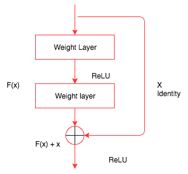

# 现代网络架构

在最后一章中，我们探索了深度学习算法如何用于创建艺术图像，基于现有数据集创建新图像，以及生成文本。在这一章中，我们将向您介绍支持现代计算机视觉应用和自然语言系统的不同网络架构。我们将在本章中探讨的一些架构包括:

*   ResNet
*   开始
*   DenseNet
*   编码器-解码器架构

# 现代网络架构

当深度学习模型无法学习时，我们所做的一件重要事情是向模型添加更多层。随着图层的增加，模型的精度会提高，然后开始饱和。随着你不断添加更多的层，它开始退化。添加超过一定数量的更多层会增加一定的挑战，例如消失或爆炸渐变，这可以通过仔细初始化权重和引入中间归一化层来部分解决。现代架构，比如**残网** ( **ResNet** )和 Inception，试图通过引入不同的技术来解决这个问题，比如残网连接。

# ResNet

ResNet 通过添加快捷方式连接，显式地让网络中的层适合残差映射，从而解决了这些问题。下图显示了 ResNet 的工作方式:



在我们见过的所有网络中，我们试图通过堆叠不同的层来找到一个将输入( *x* )映射到其输出( *H(x)* )的函数。但是 ResNet 的作者提出了一个解决方案；我们不是试图学习从 *x* 到 *H(x)* 的底层映射，而是学习两者之间的差异，或者残差。然后，为了计算 *H(x)* ，我们可以将残差加到输入中。说残差是*F(x)= H(x)-x*；我们不是尝试直接学习 *H(x)* ，而是尝试学习 *F(x) + x* 。

每个 ResNet 块由一系列层和一个快捷连接组成，该快捷连接将块的输入添加到块的输出。加法运算是按元素执行的，输入和输出需要具有相同的大小。如果它们的大小不同，那么我们可以使用衬垫。下面的代码演示了一个简单的 ResNet 块的外观:

```py
class ResNetBasicBlock(nn.Module):

    def __init__(self,in_channels,out_channels,stride):

        super().__init__()
        self.conv1 = nn.Conv2d(in_channels,out_channels,kernel_size=3,stride=stride,padding=1,bias=False)
        self.bn1 = nn.BatchNorm2d(out_channels)
        self.conv2 = nn.Conv2d(out_channels,out_channels,kernel_size=3,stride=stride,padding=1,bias=False)
        self.bn2 = nn.BatchNorm2d(out_channels)
        self.stride = stride

    def forward(self,x):

        residual = x
        out = self.conv1(x)
        out = F.relu(self.bn1(out),inplace=True)
        out = self.conv2(out)
        out = self.bn2(out)
        out += residual
        return F.relu(out)       
```

`ResNetBasicBlock`包含一个`init`方法，该方法初始化所有不同的层，例如卷积层、批量标准化和 ReLU 层。`forward`方法几乎类似于我们到目前为止所看到的，除了输入在返回之前被添加回图层的输出。

PyTorch `torchvision`包提供了一个带有不同层的现成 ResNet 模型。一些不同的型号包括:

*   ResNet-18
*   ResNet-34
*   ResNet-50
*   ResNet-101
*   ResNet-152

我们也可以用这些模型来进行迁移学习。`torchvision`实例使我们能够简单地创建这些模型中的一个并使用它们。我们在本书中已经这样做了几次，下面的代码是对此的复习:

```py
from torchvision.models import resnet18

resnet = resnet18(pretrained=False)
```

下图显示了 34 层 ResNet 模型的外观:


34 层 ResNet 模型

我们可以看到这个网络是如何由多个 ResNet 块组成的。在一些实验中，团队尝试了深达 1000 层的模型。对于大多数真实的用例，我个人建议从较小的网络开始。这些现代网络的另一个关键优势是，与 VGG 等模型相比，它们需要的参数非常少，因为它们避免了使用需要大量参数来训练的全连接层。另一个用来解决计算机视觉领域问题的流行架构是 **Inception** 。在继续进行 Inception 架构之前，让我们在`Dogs vs. Cats`数据集上训练一个 ResNet 模型。我们将使用我们在[第 5 章](4.html) *【计算机视觉的深度学习】*中使用的数据，并将根据从 ResNet 计算的特征快速训练一个模型。像往常一样，我们将按照以下步骤来训练模型:

*   创建 PyTorch 数据集
*   创建用于培训和验证的加载器
*   创建 ResNet 模型
*   提取卷积特征
*   为预卷积要素和加载程序创建自定义 PyTorch 数据集类
*   创建简单的线性模型
*   训练和验证模型

一旦完成，我们将为 Inception 和 DenseNet 重复这个步骤。最后，我们还将探讨集成技术，在这种技术中，我们将这些强大的模型结合起来，构建一个新的模型。

# 创建 PyTorch 数据集

我们创建一个包含所需的所有基本转换的转换对象，并使用`ImageFolder`从我们在 [章节](4.html)*5“计算机视觉的深度学习*中创建的数据目录中加载图像。在下面的代码中，我们创建了数据集:

```py
data_transform = transforms.Compose([
        transforms.Resize((299,299)),
        transforms.ToTensor(),
        transforms.Normalize([0.485, 0.456, 0.406], [0.229, 0.224, 0.225])
    ])

# For Dogs & Cats dataset
train_dset = ImageFolder('../../chapter5/dogsandcats/train/',transform=data_transform)
val_dset = ImageFolder('../../chapter5/dogsandcats/valid/',transform=data_transform)
classes=2
```

到目前为止，前面的大部分代码都是不言自明的。

# 创建用于培训和验证的加载器

我们使用 PyTorch 加载器以批处理的形式加载数据集提供的数据，并利用所有的优势(如混排数据和使用多线程)来加快进程。下面的代码演示了这一点:

```py
train_loader = DataLoader(train_dset,batch_size=32,shuffle=False,num_workers=3)
val_loader = DataLoader(val_dset,batch_size=32,shuffle=False,num_workers=3)

```

在计算预卷积特征时，我们需要保持数据的准确顺序。当我们允许数据被打乱时，我们将无法保持标签。所以，确保`shuffle`是`False`，否则需要在代码内部处理所需的逻辑。

# 创建 ResNet 模型

使用`resnet34`预训练模型的层，我们通过丢弃最后一个线性层来创建 PyTorch 序列模型。我们将使用这个训练好的模型从我们的图像中提取特征。下面的代码演示了这一点:

```py
#Create ResNet model
my_resnet = resnet34(pretrained=True)

if is_cuda:
    my_resnet = my_resnet.cuda()

my_resnet = nn.Sequential(*list(my_resnet.children())[:-1])

for p in my_resnet.parameters():
    p.requires_grad = False
```

在前面的代码中，我们创建了一个在`torchvision`模型中可用的`resnet34`模型。在下面一行中，我们选择所有的 ResNet 层，不包括最后一层，并使用`nn.Sequential`创建一个新的模型:

```py
for p in my_resnet.parameters():
    p.requires_grad = False
```

`nn.Sequential`实例允许我们使用一堆 PyTorch 层快速创建一个模型。一旦创建了模型，不要忘记将`requires_grad`参数设置为`False`，因为这将允许 PyTorch 不保留任何空间来保存梯度。

# 提取卷积特征

我们通过模型传递来自训练和验证数据加载器的数据，并将模型的结果存储在一个列表中以供进一步计算。通过计算预卷积特征，我们可以节省大量训练模型的时间，因为我们不会在每次迭代中计算这些特征。在下面的代码中，我们计算转换前的特征:

```py
#For training data

# Stores the labels of the train data
trn_labels = [] 

# Stores the pre convoluted features of the train data
trn_features = [] 

#Iterate through the train data and store the calculated features and the labels
for d,la in train_loader:
    o = m(Variable(d.cuda()))
    o = o.view(o.size(0),-1)
    trn_labels.extend(la)
    trn_features.extend(o.cpu().data)

#For validation data

#Iterate through the validation data and store the calculated features and the labels
val_labels = []
val_features = []
for d,la in val_loader:
    o = m(Variable(d.cuda()))
    o = o.view(o.size(0),-1)
    val_labels.extend(la)
    val_features.extend(o.cpu().data)
```

一旦我们计算了预卷积特征，我们需要创建一个自定义数据集，它可以从我们的预卷积特征中选取数据。让我们为预先复杂的要素创建一个自定义数据集和加载器。

# 为预卷积要素和加载程序创建自定义 PyTorch 数据集类

我们已经看到了如何创建 PyTorch 数据集。它应该是`torch.utils.data`数据集类的子类，并且应该实现`__getitem__(self, index)`和`__len__(self)`方法，这两个方法返回数据集中数据的长度。在以下代码中，我们为预卷积功能实现了一个自定义数据集:

```py
class FeaturesDataset(Dataset):

    def __init__(self,featlst,labellst):
        self.featlst = featlst
        self.labellst = labellst

    def __getitem__(self,index):
        return (self.featlst[index],self.labellst[index])

    def __len__(self):
        return len(self.labellst)
```

一旦创建了自定义数据集类，为预先复杂的要素创建数据加载器就很简单了，如以下代码所示:

```py
#Creating dataset for train and validation
trn_feat_dset = FeaturesDataset(trn_features,trn_labels)
val_feat_dset = FeaturesDataset(val_features,val_labels)

#Creating data loader for train and validation
trn_feat_loader = DataLoader(trn_feat_dset,batch_size=64,shuffle=True)
val_feat_loader = DataLoader(val_feat_dset,batch_size=64)
```

现在我们需要创建一个简单的线性模型，将预先复杂的特性映射到相应的类别。

# 创建简单的线性模型

我们将创建一个简单的线性模型，将预先复杂的特征映射到相应的类别。在这种情况下，类别的数量是两个:

```py
class FullyConnectedModel(nn.Module):

    def __init__(self,in_size,out_size):
        super().__init__()
        self.fc = nn.Linear(in_size,out_size)

    def forward(self,inp):
        out = self.fc(inp)
        return out

fc_in_size = 8192

fc = FullyConnectedModel(fc_in_size,classes)
if is_cuda:
    fc = fc.cuda()
```

现在，我们可以训练新模型并验证数据集了。

# 训练和验证模型

我们将使用从第五章的[到第三章【计算机视觉的深度学习】中一直在使用的同一个`fit`函数。为了节省篇幅，我没有把它包括在内。以下代码片段包含训练模型的功能并显示结果:](4.html)

```py
train_losses , train_accuracy = [],[]
val_losses , val_accuracy = [],[]
for epoch in range(1,10):
    epoch_loss, epoch_accuracy = fit(epoch,fc,trn_feat_loader,phase='training')
    val_epoch_loss , val_epoch_accuracy = fit(epoch,fc,val_feat_loader,phase='validation')
    train_losses.append(epoch_loss)
    train_accuracy.append(epoch_accuracy)
    val_losses.append(val_epoch_loss)
    val_accuracy.append(val_epoch_accuracy)
```

上述代码的结果如下:

```py
#Results
training loss is 0.082 and training accuracy is 22473/23000     97.71
validation loss is   0.1 and validation accuracy is 1934/2000      96.7
training loss is  0.08 and training accuracy is 22456/23000     97.63
validation loss is  0.12 and validation accuracy is 1917/2000     95.85
training loss is 0.077 and training accuracy is 22507/23000     97.86
validation loss is   0.1 and validation accuracy is 1930/2000      96.5
training loss is 0.075 and training accuracy is 22518/23000      97.9
validation loss is 0.096 and validation accuracy is 1938/2000      96.9
training loss is 0.073 and training accuracy is 22539/23000      98.0
validation loss is   0.1 and validation accuracy is 1936/2000      96.8
training loss is 0.073 and training accuracy is 22542/23000     98.01
validation loss is 0.089 and validation accuracy is 1942/2000      97.1
training loss is 0.071 and training accuracy is 22545/23000     98.02
validation loss is  0.09 and validation accuracy is 1941/2000     97.05
training loss is 0.068 and training accuracy is 22591/23000     98.22
validation loss is 0.092 and validation accuracy is 1934/2000      96.7
training loss is 0.067 and training accuracy is 22573/23000     98.14
validation loss is 0.085 and validation accuracy is 1942/2000      97.1
```

从结果可以看出，该模型达到了 98%的训练准确率和 97%的验证准确率。让我们了解另一种现代架构，以及如何使用它来计算预卷积特征，并使用它们来训练模型。

# 开始

在我们见过的大多数用于计算机视觉模型的深度学习算法中，我们要么选择一个过滤器大小为 1 x 1、3 x 3、5 x 5、7 x 7 的卷积层，要么选择一个地图池层。初始模块组合不同滤波器大小的卷积，并将所有输出连接在一起。下图使先启模型更加清晰:


图片来源:https://arxiv.org/pdf/1409.4842.pdf

在这个初始块图像中，不同大小的卷积被应用于输入，并且所有这些层的输出被连接。这是一个初始模块的最简单的版本。有另一种形式的初始块，我们先将输入通过 1×1 卷积，然后再通过 3×3 和 5×5 卷积。1×1 卷积用于降维。它有助于解决计算瓶颈。1 x 1 卷积一次查看一个值，并跨越多个通道。例如，对 100 x 64 x 64 的输入大小使用 10 x 1 x 1 的过滤器将得到 10 x 64 x 64。下图显示了降维后的初始块:


图片来源:https://arxiv.org/pdf/1409.4842.pdf

现在，让我们看一个 PyTorch 示例，看看前面的 Inception 块是什么样子的:

```py
class BasicConv2d(nn.Module):

    def __init__(self, in_channels, out_channels, **kwargs):
        super(BasicConv2d, self).__init__()
        self.conv = nn.Conv2d(in_channels, out_channels, bias=False, **kwargs)
        self.bn = nn.BatchNorm2d(out_channels)

    def forward(self, x):
        x = self.conv(x)
        x = self.bn(x)
        return F.relu(x, inplace=True)

class InceptionBasicBlock(nn.Module):

    def __init__(self, in_channels, pool_features):
        super().__init__()
        self.branch1x1 = BasicConv2d(in_channels, 64, kernel_size=1)

        self.branch5x5_1 = BasicConv2d(in_channels, 48, kernel_size=1)
        self.branch5x5_2 = BasicConv2d(48, 64, kernel_size=5, padding=2)

        self.branch3x3dbl_1 = BasicConv2d(in_channels, 64, kernel_size=1)
        self.branch3x3dbl_2 = BasicConv2d(64, 96, kernel_size=3, padding=1)

        self.branch_pool = BasicConv2d(in_channels, pool_features, kernel_size=1)

    def forward(self, x):
        branch1x1 = self.branch1x1(x)

        branch5x5 = self.branch5x5_1(x)
        branch5x5 = self.branch5x5_2(branch5x5)

        branch3x3dbl = self.branch3x3dbl_1(x)
        branch3x3dbl = self.branch3x3dbl_2(branch3x3dbl)

        branch_pool = F.avg_pool2d(x, kernel_size=3, stride=1, padding=1)
        branch_pool = self.branch_pool(branch_pool)

        outputs = [branch1x1, branch5x5, branch3x3dbl, branch_pool]
        return torch.cat(outputs, 1)

```

前面的代码包含两个类，`BasicConv2d`和`InceptionBasicBlock`。`BasicConv2d`类似于一个自定义层，它将二维卷积层、批量标准化和 ReLU 层应用于通过的输入。当我们有一个重复的代码结构时，创建一个新的层是一个好的实践，使代码看起来优雅。

`InceptionBasicBlock`实现了我们在第二个盗梦空间中拥有的东西。让我们浏览每个较小的代码片段，并尝试理解它是如何实现的:

```py
branch1x1 = self.branch1x1(x)
```

上述代码通过应用 1 x 1 卷积块来转换输入:

```py
branch5x5 = self.branch5x5_1(x)
branch5x5 = self.branch5x5_2(branch5x5)
```

在前面的代码中，我们通过应用 1 x 1 卷积块和 5 x 5 卷积块来转换输入:

```py
branch3x3dbl = self.branch3x3dbl_1(x)
branch3x3dbl = self.branch3x3dbl_2(branch3x3dbl)
```

在前面的代码中，我们通过应用 1 x 1 卷积块和 3 x 3 卷积块来转换输入:

```py
branch_pool = F.avg_pool2d(x, kernel_size=3, stride=1, padding=1)
branch_pool = self.branch_pool(branch_pool)
```

在前面的代码中，我们应用了一个平均池和一个 1 x 1 卷积块，最后，我们将所有结果连接在一起。一个初始网络将由几个初始块组成。下图显示了一个初始架构的样子:


初始架构

`torchvision`包有一个初始网络，可以像我们使用 ResNet 网络一样使用它。对最初的 Inception 块进行了许多改进，PyTorch 当前可用的实现是 Inception v3。让我们看看如何使用来自`torchvision`的 Inception v3 模型来计算预先计算的特性。我们将不讨论数据加载过程，因为我们将使用前面 ResNet 部分中的相同数据加载器。我们将关注以下重要主题:

*   创建一个初始模型
*   使用`register_forward_hook`提取卷积特征
*   为复杂要素创建新数据集
*   创建完全连接的模型
*   训练和验证模型

# 创建一个初始模型

Inception v3 模型有两个分支，每个分支生成一个输出，在最初的模型训练中，我们会像处理风格转移一样合并损失。到目前为止，我们只对使用一个分支来计算使用 Inception 的预卷积特征感兴趣。这方面的细节超出了本书的范围。如果你有兴趣更多地了解它是如何工作的，那么浏览一下论文和盗梦空间模型的源代码([https://github . com/py torch/vision/blob/master/torch vision/models/Inception . py](https://github.com/pytorch/vision/blob/master/torchvision/models/inception.py))会有所帮助。我们可以通过将`aux_logits`参数设置为`False`来禁用其中一个分支。下面的代码解释了如何创建一个模型并将`aux_logits`参数设置为`False`:

```py
my_inception = inception_v3(pretrained=True)
my_inception.aux_logits = False
if is_cuda:
    my_inception = my_inception.cuda()
```

与 ResNet 一样，从 Inception 模型中提取卷积特征并不简单，所以我们将使用`register_forward_hook`来提取激活。

# 使用 register_forward_hook 提取卷积特征

我们将使用相同的技术，我们用来计算风格转移激活。下面是做了一些小修改的`LayerActivations`类，因为我们只对提取特定层的输出感兴趣:

```py
class LayerActivations():
    features=[]

    def __init__(self,model):
        self.features = []
        self.hook = model.register_forward_hook(self.hook_fn)

    def hook_fn(self,module,input,output):

        self.features.extend(output.view(output.size(0),-1).cpu().data)

    def remove(self):

        self.hook.remove()
```

除了`hook`函数，其余的代码与我们用于风格转换的代码相似。由于我们正在捕捉所有图像的输出并存储它们，我们将无法在**图形处理单元** ( **GPU** )内存中保存数据。所以我们从 GPU 提取张量到 CPU，只存储张量而不是`Variable`。我们正在将其转换回张量，因为数据加载器只能与张量一起工作。在下面的代码中，我们使用`LayerActivations`的对象来提取最后一层的初始模型的输出，不包括平均池层、漏失层和线性层。我们跳过了平均池层，以避免丢失数据中的有用信息:

```py
# Create LayerActivations object to store the output of inception model at a particular layer.
trn_features = LayerActivations(my_inception.Mixed_7c)
trn_labels = []

# Passing all the data through the model , as a side effect the outputs will get stored 
# in the features list of the LayerActivations object. 
for da,la in train_loader:
    _ = my_inception(Variable(da.cuda()))
    trn_labels.extend(la)
trn_features.remove()

# Repeat the same process for validation dataset .

val_features = LayerActivations(my_inception.Mixed_7c)
val_labels = []
for da,la in val_loader:
    _ = my_inception(Variable(da.cuda()))
    val_labels.extend(la)
val_features.remove()
```

让我们创建新的复杂特性所需的数据集和加载器。

# 为复杂要素创建新数据集

我们可以使用相同的`FeaturesDataset`类来创建新的数据集和数据加载器。在下面的代码中，我们创建了数据集和加载器:

```py
#Dataset for pre computed features for train and validation data sets

trn_feat_dset = FeaturesDataset(trn_features.features,trn_labels)
val_feat_dset = FeaturesDataset(val_features.features,val_labels)

#Data loaders for pre computed features for train and validation data sets

trn_feat_loader = DataLoader(trn_feat_dset,batch_size=64,shuffle=True)
val_feat_loader = DataLoader(val_feat_dset,batch_size=64)
```

让我们创建一个新的模型来训练预复杂的特性。

# 创建完全连接的模型

一个简单的模型可能会以过度拟合结束，所以让我们在模型中包括辍学。辍学将有助于避免过度拟合。在下面的代码中，我们正在创建我们的模型:

```py
class FullyConnectedModel(nn.Module):

    def __init__(self,in_size,out_size,training=True):
        super().__init__()
        self.fc = nn.Linear(in_size,out_size)

    def forward(self,inp):
        out = F.dropout(inp, training=self.training)
        out = self.fc(out)
        return out

# The size of the output from the selected convolution feature 
fc_in_size = 131072

fc = FullyConnectedModel(fc_in_size,classes)
if is_cuda:
    fc = fc.cuda()
```

一旦创建了模型，我们就可以训练模型了。

# 训练和验证模型

我们使用与前面的 ResNet 和其他示例中相同的拟合和训练逻辑。我们将只查看训练代码及其结果:

```py
for epoch in range(1,10):
    epoch_loss, epoch_accuracy = fit(epoch,fc,trn_feat_loader,phase='training')
    val_epoch_loss , val_epoch_accuracy = fit(epoch,fc,val_feat_loader,phase='validation')
    train_losses.append(epoch_loss)
    train_accuracy.append(epoch_accuracy)
    val_losses.append(val_epoch_loss)
    val_accuracy.append(val_epoch_accuracy)

#Results

training loss is 0.78 and training accuracy is 22825/23000 99.24
validation loss is 5.3 and validation accuracy is 1947/2000 97.35
training loss is 0.84 and training accuracy is 22829/23000 99.26
validation loss is 5.1 and validation accuracy is 1952/2000 97.6
training loss is 0.69 and training accuracy is 22843/23000 99.32
validation loss is 5.1 and validation accuracy is 1951/2000 97.55
training loss is 0.58 and training accuracy is 22852/23000 99.36
validation loss is 4.9 and validation accuracy is 1953/2000 97.65
training loss is 0.67 and training accuracy is 22862/23000 99.4
validation loss is 4.9 and validation accuracy is 1955/2000 97.75
training loss is 0.54 and training accuracy is 22870/23000 99.43
validation loss is 4.8 and validation accuracy is 1953/2000 97.65
training loss is 0.56 and training accuracy is 22856/23000 99.37
validation loss is 4.8 and validation accuracy is 1955/2000 97.75
training loss is 0.7 and training accuracy is 22841/23000 99.31
validation loss is 4.8 and validation accuracy is 1956/2000 97.8
training loss is 0.47 and training accuracy is 22880/23000 99.48
validation loss is 4.7 and validation accuracy is 1956/2000 97.8

```

从结果来看，Inception 模型在训练数据集上达到了 99%的准确率，在验证数据集上达到了 97.8%的准确率。由于我们预先计算并将所有特征保存在内存中，因此训练模型只需不到几分钟的时间。如果在机器上运行程序时内存不足，那么您可能需要避免将这些特性保存在内存中。

我们将看看另一个有趣的架构，DenseNet，它在去年变得非常流行。

# 密集连接的卷积网络–dense net

一些成功和流行的架构，如 ResNet 和 Inception，已经显示了更深和更广的网络的重要性。ResNet 利用快捷连接建立更深层次的网络。DenseNet 通过引入从每一层到所有其他后续层的连接，将它带到了一个新的水平，在这一层中，人们可以接收来自先前层的所有特征地图。象征性地，它看起来如下:


下图描述了五层密集块的外观:


图片来源:https://arxiv.org/abs/1608.06993

torchvision 有一个 DenseNet 实现([https://github . com/py torch/vision/blob/master/torch vision/models/dense net . py](https://github.com/pytorch/vision/blob/master/torchvision/models/densenet.py))。我们来看两大功能，`_DenseBlock`和`_DenseLayer`。

# DenseBlock

让我们看看`DenseBlock`的代码，然后浏览一下:

```py
class _DenseBlock(nn.Sequential):
    def __init__(self, num_layers, num_input_features, bn_size, growth_rate, drop_rate):
        super(_DenseBlock, self).__init__()
        for i in range(num_layers):
            layer = _DenseLayer(num_input_features + i * growth_rate, growth_rate, bn_size, drop_rate)
            self.add_module('denselayer%d' % (i + 1), layer)
```

`DenseBlock`是一个顺序模块，我们按顺序添加层。基于块中的层数(`num_layers`)，我们将`_Denselayer`对象的数量和名称添加到其中。所有的魔法都发生在`DenseLayer`内部。让我们看看`DenseLayer`里面发生了什么。

# 致密层

了解特定网络如何工作的一个好方法是查看源代码。PyTorch 有一个非常干净的实现，大部分时间都很容易阅读。让我们看看`DenseLayer`的实现:

```py
class _DenseLayer(nn.Sequential):
    def __init__(self, num_input_features, growth_rate, bn_size, drop_rate):
        super(_DenseLayer, self).__init__()
        self.add_module('norm.1', nn.BatchNorm2d(num_input_features)),
        self.add_module('relu.1', nn.ReLU(inplace=True)),
        self.add_module('conv.1', nn.Conv2d(num_input_features, bn_size *
                        growth_rate, kernel_size=1, stride=1, bias=False)),
        self.add_module('norm.2', nn.BatchNorm2d(bn_size * growth_rate)),
        self.add_module('relu.2', nn.ReLU(inplace=True)),
        self.add_module('conv.2', nn.Conv2d(bn_size * growth_rate, growth_rate,
                        kernel_size=3, stride=1, padding=1, bias=False)),
        self.drop_rate = drop_rate

    def forward(self, x):
        new_features = super(_DenseLayer, self).forward(x)
        if self.drop_rate > 0:
            new_features = F.dropout(new_features, p=self.drop_rate, training=self.training)
        return torch.cat([x, new_features], 1)
```

如果您不熟悉 Python 中的继承，那么前面的代码可能看起来不直观。`_DenseLayer`是`nn.Sequential`的子类；让我们看看每个方法内部发生了什么。

在`__init__`方法中，我们添加输入数据需要传递到的所有层。它与我们见过的所有其他网络架构非常相似。

神奇的事情发生在`forward`方法中。我们将输入传递给`super`类的`forward`方法，也就是`nn.Sequential`。我们来看看顺序类的`forward`方法中发生了什么([https://github . com/py torch/py torch/blob/409 B1 c 8319 ECD E4 BD 62 fcf 98 d0a 6658 AE 7 a4 ab 23/torch/nn/modules/container . py](https://github.com/pytorch/pytorch/blob/409b1c8319ecde4bd62fcf98d0a6658ae7a4ab23/torch/nn/modules/container.py)):

```py
def forward(self, input):
    for module in self._modules.values():
        input = module(input)
    return input
```

输入通过先前添加到顺序块的所有层，输出连接到输入。对块中所需的层数重复该过程。

了解了`DenseNet`块的工作原理后，让我们探索如何使用 DenseNet 来计算预卷积的特征，并在此基础上构建分类器模型。在高层次上，DenseNet 的实现类似于 VGG 的实现。DenseNet 实现还有一个包含所有密集块的特性模块和一个包含全连接模型的分类器模块。我们将通过以下步骤来构建模型。我们将跳过与我们在 Inception 和 ResNet 中看到的类似的大部分内容，例如创建数据加载器和数据集。此外，我们将详细讨论以下步骤:

*   创建 DenseNet 模型
*   提取 DenseNet 特征
*   创建数据集和加载器
*   创建完全连接的模型和列车

到目前为止，大部分代码都是不言自明的。

# 创建 DenseNet 模型

Torchvision 具有预训练的 DenseNet 模型，具有不同的层选项(121、169、201、161)。我们选择了有`121`层的模型。如前所述，DenseNet 有两个模块:特征(包含密集块)和分类器(完全连通块)。由于我们使用 DenseNet 作为图像特征提取器，我们将只使用特征模块:

```py
my_densenet = densenet121(pretrained=True).features
if is_cuda:
    my_densenet = my_densenet.cuda()

for p in my_densenet.parameters():
    p.requires_grad = False
```

让我们从图像中提取 DenseNet 特征。

# 提取 DenseNet 特征

这与我们为 Inception 所做的非常相似，除了我们没有使用`register_forward_hook`来提取特征。以下代码显示了如何提取 DenseNet 要素:

```py
#For training data
trn_labels = []
trn_features = []

#code to store densenet features for train dataset.
for d,la in train_loader:
    o = my_densenet(Variable(d.cuda()))
    o = o.view(o.size(0),-1)
    trn_labels.extend(la)
    trn_features.extend(o.cpu().data)

#For validation data
val_labels = []
val_features = []

#Code to store densenet features for validation dataset. 
for d,la in val_loader:
    o = my_densenet(Variable(d.cuda()))
    o = o.view(o.size(0),-1)
    val_labels.extend(la)
    val_features.extend(o.cpu().data)
```

前面的代码类似于我们在 Inception 和 ResNet 中看到的代码。

# 创建数据集和加载器

我们将使用为 ResNet 创建的相同的`FeaturesDataset`类，并在下面的代码中使用它为`train`和`validation`数据集创建数据加载器:

```py
# Create dataset for train and validation convolution features
trn_feat_dset = FeaturesDataset(trn_features,trn_labels)
val_feat_dset = FeaturesDataset(val_features,val_labels)

# Create data loaders for batching the train and validation datasets
trn_feat_loader = DataLoader(trn_feat_dset,batch_size=64,shuffle=True,drop_last=True)
val_feat_loader = DataLoader(val_feat_dset,batch_size=64)
```

是时候创建模型并训练它了。

# 创建完全连接的模型和列车

我们将使用一个简单的线性模型，类似于我们在 ResNet 和 Inception 中使用的模型。以下代码显示了我们将用来训练模型的网络架构:

```py
class FullyConnectedModel(nn.Module):

    def __init__(self,in_size,out_size):
        super().__init__()
        self.fc = nn.Linear(in_size,out_size)

    def forward(self,inp):
        out = self.fc(inp)
        return out

fc = FullyConnectedModel(fc_in_size,classes)
if is_cuda:
    fc = fc.cuda()
```

我们将使用相同的`fit`方法来训练前面的模型。以下代码片段显示了训练代码以及结果:

```py
train_losses , train_accuracy = [],[]
val_losses , val_accuracy = [],[]
for epoch in range(1,10):
    epoch_loss, epoch_accuracy = fit(epoch,fc,trn_feat_loader,phase='training')
    val_epoch_loss , val_epoch_accuracy = fit(epoch,fc,val_feat_loader,phase='validation')
    train_losses.append(epoch_loss)
    train_accuracy.append(epoch_accuracy)
    val_losses.append(val_epoch_loss)
    val_accuracy.append(val_epoch_accuracy)

```

上述代码的结果是:

```py
# Results

training loss is 0.057 and training accuracy is 22506/23000 97.85
validation loss is 0.034 and validation accuracy is 1978/2000 98.9
training loss is 0.0059 and training accuracy is 22953/23000 99.8
validation loss is 0.028 and validation accuracy is 1981/2000 99.05
training loss is 0.0016 and training accuracy is 22974/23000 99.89
validation loss is 0.022 and validation accuracy is 1983/2000 99.15
training loss is 0.00064 and training accuracy is 22976/23000 99.9
validation loss is 0.023 and validation accuracy is 1983/2000 99.15
training loss is 0.00043 and training accuracy is 22976/23000 99.9
validation loss is 0.024 and validation accuracy is 1983/2000 99.15
training loss is 0.00033 and training accuracy is 22976/23000 99.9
validation loss is 0.024 and validation accuracy is 1984/2000 99.2
training loss is 0.00025 and training accuracy is 22976/23000 99.9
validation loss is 0.024 and validation accuracy is 1984/2000 99.2
training loss is 0.0002 and training accuracy is 22976/23000 99.9
validation loss is 0.025 and validation accuracy is 1985/2000 99.25
training loss is 0.00016 and training accuracy is 22976/23000 99.9
validation loss is 0.024 and validation accuracy is 1986/2000 99.3
```

前面的算法能够实现 99%的最大训练准确度和 99%的验证准确度。您的结果可能会改变，因为您创建的`validation`数据集可能有不同的图像。

DenseNet 的一些优势包括:

*   它大大减少了所需参数的数量
*   它缓解了消失梯度问题
*   它鼓励特性重用

在下一节中，我们将探索如何使用 ResNet、Inception 和 DenseNet 的不同模型来构建一个模型，该模型结合了计算出的复杂特征的优点。

# 模型组装

有时候，我们可能需要尝试组合多个模型来构建一个非常强大的模型。有许多技术可用于建立集合模型。在本节中，我们将学习如何使用三个不同模型(ResNet、Inception 和 DenseNet)生成的特性来组合输出，以构建一个强大的模型。我们将使用本章其他例子中使用的相同数据集。

整体模型的架构如下所示:


此图像显示了我们将在集合模型中执行的操作，这些操作可以总结为以下步骤:

1.  创建三个模型
2.  使用创建的模型提取图像特征
3.  创建一个自定义数据集，该数据集返回所有三个模型的特征以及标注
4.  创建类似于上图中架构的模型
5.  训练和验证模型

让我们详细探讨一下每个步骤。

# 创建模型

让我们创建所有三个必需的模型，如下面的代码所示:

```py
#Create ResNet model
my_resnet = resnet34(pretrained=True)

if is_cuda:
    my_resnet = my_resnet.cuda()

my_resnet = nn.Sequential(*list(my_resnet.children())[:-1])

for p in my_resnet.parameters():
    p.requires_grad = False

#Create inception model

my_inception = inception_v3(pretrained=True)
my_inception.aux_logits = False
if is_cuda:
    my_inception = my_inception.cuda()
for p in my_inception.parameters():
    p.requires_grad = False

#Create densenet model

my_densenet = densenet121(pretrained=True).features
if is_cuda:
    my_densenet = my_densenet.cuda()

for p in my_densenet.parameters():
    p.requires_grad = False
```

现在我们有了所有的模型，让我们从图像中提取特征。

# 提取图像特征

这里，我们结合了我们在本章中单独看到的算法的所有逻辑:

```py
### For ResNet

trn_labels = []
trn_resnet_features = []
for d,la in train_loader:
    o = my_resnet(Variable(d.cuda()))
    o = o.view(o.size(0),-1)
    trn_labels.extend(la)
    trn_resnet_features.extend(o.cpu().data)
val_labels = []
val_resnet_features = []
for d,la in val_loader:
    o = my_resnet(Variable(d.cuda()))
    o = o.view(o.size(0),-1)
    val_labels.extend(la)
    val_resnet_features.extend(o.cpu().data)

### For Inception

trn_inception_features = LayerActivations(my_inception.Mixed_7c)
for da,la in train_loader:
    _ = my_inception(Variable(da.cuda()))

trn_inception_features.remove()

val_inception_features = LayerActivations(my_inception.Mixed_7c)
for da,la in val_loader:
    _ = my_inception(Variable(da.cuda()))

val_inception_features.remove()

### For DenseNet

trn_densenet_features = []
for d,la in train_loader:
    o = my_densenet(Variable(d.cuda()))
    o = o.view(o.size(0),-1)

    trn_densenet_features.extend(o.cpu().data)

val_densenet_features = []
for d,la in val_loader:
    o = my_densenet(Variable(d.cuda()))
    o = o.view(o.size(0),-1)
    val_densenet_features.extend(o.cpu().data)
```

到目前为止，我们已经使用所有模型创建了图像特征。如果您面临内存问题，那么您可以删除其中一个模型，或者停止在内存中存储特征，这可能会导致训练速度变慢。如果您在 CUDA 实例上运行它，那么您可以使用一个更强大的实例。

# 创建自定义数据集和数据加载器

我们将不能像现在这样使用`FeaturesDataset`类，因为它被开发来仅仅从一个模型的输出中挑选。因此，下面的实现包含了对`FeaturesDataset`类的微小修改，以适应所有三种不同的生成特性:

```py
class FeaturesDataset(Dataset):

    def __init__(self,featlst1,featlst2,featlst3,labellst):
        self.featlst1 = featlst1
        self.featlst2 = featlst2
        self.featlst3 = featlst3
        self.labellst = labellst

    def __getitem__(self,index):
        return (self.featlst1[index],self.featlst2[index],self.featlst3[index],self.labellst[index])

    def __len__(self):
        return len(self.labellst)

trn_feat_dset = FeaturesDataset(trn_resnet_features,trn_inception_features.features,trn_densenet_features,trn_labels)
val_feat_dset = FeaturesDataset(val_resnet_features,val_inception_features.features,val_densenet_features,val_labels)
```

我们修改了`__init__`方法来存储不同模型生成的所有特征，修改了`__getitem__`方法来检索图像的特征和标签。使用`FeatureDataset`类，我们为训练和验证数据创建了数据集实例。创建数据集后，我们可以使用相同的数据加载器来批处理数据，如以下代码所示:

```py
trn_feat_loader = DataLoader(trn_feat_dset,batch_size=64,shuffle=True)
val_feat_loader = DataLoader(val_feat_dset,batch_size=64)
```

# 创建集合模型

我们需要创建一个类似于之前展示的架构图的模型。以下代码实现了这一点:

```py
class EnsembleModel(nn.Module):

    def __init__(self,out_size,training=True):
        super().__init__()
        self.fc1 = nn.Linear(8192,512)
        self.fc2 = nn.Linear(131072,512)
        self.fc3 = nn.Linear(82944,512)
        self.fc4 = nn.Linear(512,out_size)

    def forward(self,inp1,inp2,inp3):
        out1 = self.fc1(F.dropout(inp1,training=self.training))
        out2 = self.fc2(F.dropout(inp2,training=self.training))
        out3 = self.fc3(F.dropout(inp3,training=self.training))
        out = out1 + out2 + out3
        out = self.fc4(F.dropout(out,training=self.training))
        return out

em = EnsembleModel(2)
if is_cuda:
    em = em.cuda()
```

在上述代码中，我们创建了三个线性图层，这些图层采用不同模型生成的要素。我们汇总这三个线性层的所有输出，并将它们传递给另一个线性层，后者将它们映射到所需的类别。为了防止模型过度拟合，我们使用了辍学。

# 训练和验证模型

我们需要对`fit`方法做一些小的修改，以适应数据加载器生成的三个输入值。下面的代码实现了新的`fit`函数:

```py
def fit(epoch,model,data_loader,phase='training',volatile=False):
    if phase == 'training':
        model.train()
    if phase == 'validation':
        model.eval()
        volatile=True
    running_loss = 0.0
    running_correct = 0
    for batch_idx , (data1,data2,data3,target) in enumerate(data_loader):
        if is_cuda:
            data1,data2,data3,target = data1.cuda(),data2.cuda(),data3.cuda(),target.cuda()
        data1,data2,data3,target = Variable(data1,volatile),Variable(data2,volatile),Variable(data3,volatile),Variable(target)
        if phase == 'training':
            optimizer.zero_grad()
        output = model(data1,data2,data3)
        loss = F.cross_entropy(output,target)

        running_loss += F.cross_entropy(output,target,size_average=False).data[0]
        preds = output.data.max(dim=1,keepdim=True)[1]
        running_correct += preds.eq(target.data.view_as(preds)).cpu().sum()
        if phase == 'training':
            loss.backward()
            optimizer.step()

    loss = running_loss/len(data_loader.dataset)
    accuracy = 100\. * running_correct/len(data_loader.dataset)

    print(f'{phase} loss is {loss:{5}.{2}} and {phase} accuracy is {running_correct}/{len(data_loader.dataset)}{accuracy:{10}.{4}}')
    return loss,accuracy
```

从前面的代码中可以看出，除了加载器返回三个输入和一个标签之外，大部分内容保持不变。因此，我们对函数进行了修改，这是不言自明的。

下面的代码显示了培训代码:

```py
train_losses , train_accuracy = [],[]
val_losses , val_accuracy = [],[]
for epoch in range(1,10):
    epoch_loss, epoch_accuracy = fit(epoch,em,trn_feat_loader,phase='training')
    val_epoch_loss , val_epoch_accuracy = fit(epoch,em,val_feat_loader,phase='validation')
    train_losses.append(epoch_loss)
    train_accuracy.append(epoch_accuracy)
    val_losses.append(val_epoch_loss)
    val_accuracy.append(val_epoch_accuracy)

```

上述代码的结果如下:

```py
#Results 

training loss is 7.2e+01 and training accuracy is 21359/23000 92.87
validation loss is 6.5e+01 and validation accuracy is 1968/2000 98.4
training loss is 9.4e+01 and training accuracy is 22539/23000 98.0
validation loss is 1.1e+02 and validation accuracy is 1980/2000 99.0
training loss is 1e+02 and training accuracy is 22714/23000 98.76
validation loss is 1.4e+02 and validation accuracy is 1976/2000 98.8
training loss is 7.3e+01 and training accuracy is 22825/23000 99.24
validation loss is 1.6e+02 and validation accuracy is 1979/2000 98.95
training loss is 7.2e+01 and training accuracy is 22845/23000 99.33
validation loss is 2e+02 and validation accuracy is 1984/2000 99.2
training loss is 1.1e+02 and training accuracy is 22862/23000 99.4
validation loss is 4.1e+02 and validation accuracy is 1975/2000 98.75
training loss is 1.3e+02 and training accuracy is 22851/23000 99.35
validation loss is 4.2e+02 and validation accuracy is 1981/2000 99.05
training loss is 2e+02 and training accuracy is 22845/23000 99.33
validation loss is 6.1e+02 and validation accuracy is 1982/2000 99.1
training loss is 1e+02 and training accuracy is 22917/23000 99.64
validation loss is 5.3e+02 and validation accuracy is 1986/2000 99.3
```

集成模型达到了 99.6%的训练准确率和 99.3%的验证准确率。尽管集合模型功能强大，但它们的计算开销很大。当你在像 Kaggle 这样的比赛中解决问题时，它们是很好的技巧。

# 编码器-解码器架构

我们在书中看到的几乎所有深度学习算法都善于学习如何将训练数据映射到其对应的标签上。对于模型需要从一个序列中学习并生成另一个序列或图像的任务，我们不能直接使用它们。一些示例应用程序如下:

*   语言翻译
*   图像字幕
*   图像生成(seq2img)
*   语音识别
*   问题回答

这些问题中的大多数可以被视为某种形式的序列到序列映射，这些可以使用一系列称为**编码器-解码器架构**的架构来解决。在本节中，我们将了解这些架构背后的直觉。我们不会关注这些网络的实现，因为它们需要更详细的研究。

概括地说，编码器-解码器架构如下所示:


编码器通常是一个**递归神经网络**(**【RNN】**)(用于序列数据)或一个**卷积神经网络** ( **CNN** )(用于图像)，它接收一幅图像或一个序列，并将其转换成一个固定长度的向量，该向量对所有信息进行编码。解码器是另一个 RNN 或 CNN，它学习解码编码器生成的向量，并生成新的数据序列。下图显示了编码器-解码器架构如何寻找图像字幕系统:


图像字幕系统的编码器-解码器架构
图像来源:https://arxiv.org/pdf/1411.4555.pdf

让我们更详细地看看图像字幕系统的编码器和解码器架构内部发生了什么。

# 编码器

对于图像字幕系统，我们将优选地使用训练过的架构，例如 ResNet 或 Inception，用于从图像中提取特征。就像我们对集合模型所做的那样，我们可以通过使用线性层来输出固定的向量长度，然后使该线性层可训练。

# 解码器

解码器是一个**长短期记忆**(**【LSTM】**)层，它将为图像生成字幕。为了构建一个简单的模型，我们可以只将编码器嵌入作为输入传递给 LSTM 一次。但是对于解码器来说，学习起来可能很有挑战性；相反，通常的做法是在解码器的每一步都嵌入编码器。直观地说，解码器学习生成最好地描述给定图像的标题的文本序列。

# 摘要

在这一章中，我们探索了一些现代架构，如 ResNet、Inception 和 DenseNet。我们还探讨了如何将这些模型用于迁移学习和集成，并介绍了支持许多系统的编码器-解码器架构，如语言翻译系统。

在下一章中，我们将总结我们在这本书的学习过程中所取得的成就，并讨论你将何去何从。我们将访问 PyTorch 上的大量资源，以及一些已经使用 PyTorch 创建或正在进行研究的很酷的深度学习项目。