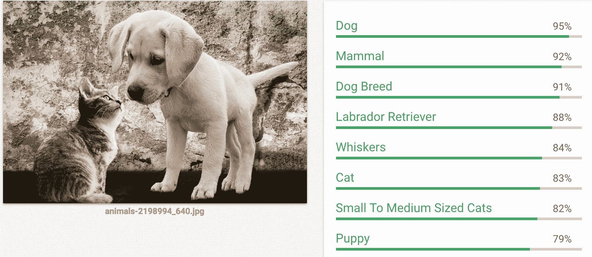
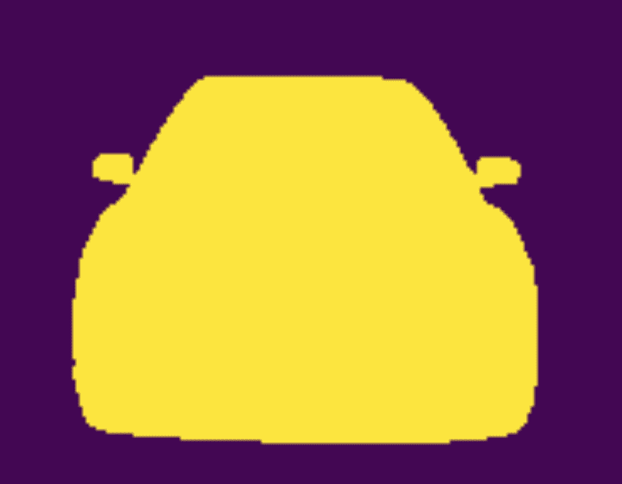

# 八、接下来是什么？

你成功了！感谢用 PyTorch 阅读*深度学习。你应该对使用 PyTorch 构建深度学习应用程序所需的核心机制和**应用程序接口** ( **API** )有一个牢固的理解。到目前为止，您应该已经能够自如地使用为大多数现代深度学习算法提供动力的所有基础模块。*

# 接下来呢？

在本章中，我们将总结我们在本书中学到的内容，并进一步探索不同的项目和资源。这些项目和资源将帮助你进一步了解最新的研究。

# 概观

这一部分提供了我们在整本书中学到的东西的鸟瞰图:

*   **人工智能** ( **AI** )的历史，机器学习——硬件和算法的各种改进如何在不同应用程序中实现深度学习方面引发巨大成功。
*   如何利用 PyTorch 的各种积木块，比如变量，张量，`nn.module`来开发神经网络。
*   了解训练神经网络所涉及的不同过程，例如用于数据准备的 PyTorch 数据集、用于批处理张量的数据加载器、用于创建网络架构的`torch.nn`包，以及使用 PyTorch 损失函数和优化器。
*   我们看到了不同类型的机器学习问题以及挑战，如过度适应和欠适应。我们还经历了不同的技术，如数据扩充、添加漏失，以及使用批量标准化来防止过度拟合。
*   我们学习了**卷积神经网络**(**CNN**)的不同构建模块，还学习了迁移学习，这有助于我们使用预训练的模型。我们还看到了一些技术，例如使用预卷积特征，这有助于减少训练模型所需的时间。
*   我们学习了单词嵌入以及如何使用它们来解决文本分类问题。我们还探索了如何使用预训练单词嵌入。我们探索了**递归神经网络** ( **RNN** )、其变体如**长短期记忆** ( **LSTM** )，以及如何使用它们解决文本分类问题。
*   我们探索了生成模型，并学习了 PyTorch 如何用于创建艺术风格转移，以及如何使用**生成对抗网络** ( **甘**)创建新的 CIFAR 图像。我们还探索了语言建模技术，这些技术可用于生成新文本或创建特定于领域的嵌入。
*   我们探索了现代架构，如 ResNet、Inception、DenseNet 和编码解码器架构。我们也看到了这些模型如何用于迁移学习。我们还通过组合所有这些模型建立了一个集合模型。

# 探索有趣的想法

我们在书中学到的大多数概念都构成了由深度学习驱动的现代应用程序的基础。在这一部分，我们将看看我们可以做的与计算机视觉和**自然语言处理** ( **NLP** )相关的不同有趣项目。

# 目标检测

我们在本书中看到的所有例子都有助于你判断给定的图像是这只(猫)还是那只(狗)。但是，要解决现实世界中的一些问题，您可能需要识别图像中的不同对象，如下所示:

目标检测算法的输出

此图像显示了对象检测算法的输出，其中该算法正在检测对象，例如一只漂亮的狗和猫。正如有现成的图像分类算法一样，也有许多令人惊叹的算法可以帮助构建对象识别系统。这里列出了一些重要的算法和提到它们的论文:

*   **单次多盒探测器**(**SSD**)【https://arxiv.org/abs/1512.02325】T4
*   更快的 RCNN[https://arxiv.org/abs/1506.01497](https://arxiv.org/abs/1506.01497)
*   约罗 2[https://arxiv.org/abs/1612.08242](https://arxiv.org/abs/1612.08242)

# 图象分割法

让我们假设你正在一栋建筑的阳台上阅读这本书。你在周围看到了什么？你能勾勒出你所看到的吗？如果你是一个优秀的艺术家，不像我，那么你可能会画一些建筑物、树木、鸟和一些围绕着你的更有趣的东西。图像分割算法试图捕捉类似的东西。给定一幅图像，它们为每个像素生成一个预测，确定每个像素属于哪一类。下图显示了图像分割算法识别的内容:

图像分割算法的输出

您可能想探索的一些重要的图像分割算法有:

*   美国有线电视新闻网[https://arxiv.org/abs/1311.2524](https://arxiv.org/abs/1311.2524)
*   快速 R-CNN[https://arxiv.org/abs/1504.08083](https://arxiv.org/abs/1504.08083)
*   更快的 R-CNN[https://arxiv.org/abs/1506.01497](https://arxiv.org/abs/1506.01497)
*   面具 R-CNN[https://arxiv.org/abs/1703.06870](https://arxiv.org/abs/1703.06870)

# pytorch 中的 opennms

**开源神经机器翻译**(**OpenNMT**)(【https://github.com/OpenNMT/OpenNMT-py】T4)项目帮助构建了许多由编码器-解码器架构驱动的应用。您可以构建的一些应用程序包括翻译系统、文本摘要和图像到文本转换。

# 外星人 NLP

Alien NLP 是一个基于 PyTorch 的开源项目，它使我们能够更轻松地完成许多 NLP 任务。有一个演示页面([http://demo.allennlp.org/machine-comprehension](http://demo.allennlp.org/machine-comprehension))你应该看看，以了解你可以使用 Alien NLP 构建什么。

# fast . ai——让神经网络再次变得不酷

我最喜欢了解深度学习的地方之一，也是灵感的绝佳去处，是一个 MOOC，它的唯一目的是让深度学习对所有人开放，由来自*fast . ai*(【http://www.fast.ai/】)、杰瑞米·霍华德和瑞秋·托马斯的两位令人惊叹的导师组织。对于他们课程的新版本，他们在 PyTorch 上构建了一个令人难以置信的框架(【https://github.com/fastai/fastai】T4)，使得构建应用程序变得更加容易和快捷。如果你还没有开始他们的课程，我强烈建议你开始。探索 *fast.ai* 框架是如何构建的，会让你对许多强大的技术有很好的了解。

# 开放式神经网络交换

**开放神经网络交换**(**ONNX**)(【http://onnx.ai/】T4)是迈向开放生态系统的第一步，随着项目的发展，它将使你能够选择正确的工具。ONNX 为深度学习模型提供了开源格式。它定义了一个可扩展的计算图模型，以及内置运算符和标准数据类型的定义。Caffe2、PyTorch、微软认知工具包、Apache MXNet 等工具都在开发 ONNX 支持。这个项目可以帮助产品电离 PyTorch 模型。

# 如何让自己保持更新

社交媒体平台，尤其是 Twitter，可以帮助你了解这个领域的最新动态。有很多人你可以追随。如果你不确定从哪里开始，我建议你关注杰瑞米·霍华德([https://twitter.com/jeremyphoward](https://twitter.com/jeremyphoward))，以及他可能关注的任何有趣的人。这样做，你将迫使 Twitter 推荐系统为你工作。

你需要关注的另一个重要的 Twitter 账户是 PyTorch 的([https://twitter.com/PyTorch](https://twitter.com/PyTorch))。PyTorch 背后的了不起的人分享了一些伟大的内容。

如果你正在寻找研究论文，那么看看*arxiv-sanity*(【http://www.arxiv-sanity.com/】T2)，许多聪明的研究人员在那里发表他们的论文。

学习 PyTorch 的更多资源是它的教程([http://pytorch.org/tutorials/](http://pytorch.org/tutorials/))、源代码(【https://github.com/pytorch/pytorch】T2)和文档([http://pytorch.org/docs/0.3.0/](http://pytorch.org/docs/0.3.0/))。

# 摘要

深度学习和 PyTorch 还有更多。PyTorch 是一个相对较新的框架，在撰写本章时，它已经有一年的历史了。还有很多要学习和探索，所以快乐学习。万事如意。