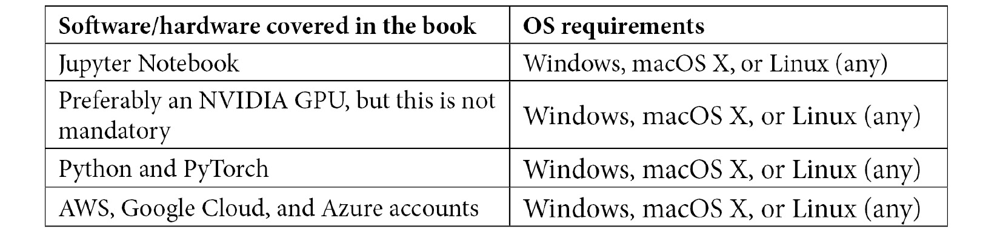

  

# 零、前言

**深度学习** ( **DL** )正在推动人工智能革命，PyTorch 正在让人们比以往任何时候都更容易构建 DL 应用。这本书将帮助你发现专家技术，从你的数据中获得最大价值，并建立复杂的神经网络模型。

这本书从 PyTorch 的快速概述开始，探索了用于图像分类的**卷积神经网络** ( **CNN** )架构。你将探索**循环神经网络** ( **RNN** )架构以及转换器，并使用它们进行情感分析。随着您的进步，您将使用生成模型在不同的领域应用 DL，如音乐、文本和图像生成。之后，你将深入研究**生成对抗网络** ( **GANs** )的世界，在 PyTorch 中构建并训练你自己的深度强化学习模型，并解读 DL 模型。您不仅将学习如何构建模型，还将使用专家提示和技术将 PyTorch 模型部署到生产中。最后，您将掌握以分布式方式高效训练大型模型的技能，使用 AutoML 有效搜索神经架构，并使用 PyTorch 和 fast.ai 快速构建模型原型。

到本 PyTorch 书结束时，您将能够使用 PyTorch 构建智能**人工智能**模型来执行复杂的 DL 任务。

# 这本书是给谁的

本书面向希望使用 PyTorch 1.x 实现高级 DL 范例的数据科学家、机器学习研究人员和 DL 实践者。要求具备使用 Python 编程的 DL 工作知识。

# 这本书涵盖了什么

[*第 1 章*](B12158_01_Final_ASB_ePUB.xhtml#_idTextAnchor017)*使用 PyTorch* 进行深度学习的概述，包括对各种 DL 术语和概念的简要说明，这些将有助于您理解本书的后续部分。这一章也给了你一个 PyTorch 作为一种语言的快速概述，以及在本书中用来构建 DL 模型的工具。最后，我们将使用 PyTorch 训练一个神经网络模型。

[*第 2 章*](B12158_02_Final_ASB_ePUB.xhtml#_idTextAnchor036) ，*结合 CNN 和 LSTMs* ，带领我们通过一个例子，我们将建立一个具有 CNN 和**长短期记忆** ( **LSTM** )的神经网络模型，当使用 PyTorch 给定图像作为输入时，它生成文本/字幕作为输出。

[*第三章*](B12158_03_Final_ASB_ePUB.xhtml#_idTextAnchor053) 、*深度 CNN 架构*，给出了近年来最先进的深度 CNN 模型架构的梗概。我们使用 PyTorch 创建许多这样的模型，并针对不同的任务训练它们。

[*第四章*](B12158_04_Final_ASB_ePUB.xhtml#_idTextAnchor074) 、*深度循环模型架构*，讲述循环神经架构的最新进展，具体为 RNNs、LSTMs 和**门控递归单元** ( **GRUs** )。完成本章后，您将能够在 PyTorch 中创建自己的复杂递归架构。

[*第五章*](B12158_05_Final_ASB_ePUB.xhtml#_idTextAnchor106) 、*混合高级模型*，讨论了一些高级的、独特的混合神经架构，比如转换器，它们彻底改变了自然语言处理的世界。这一章还讨论了 RandWireNNs，使用 PyTorch 窥视了神经结构搜索的世界。

[*第 6 章*](B12158_06_Final_ASB_ePUB.xhtml#_idTextAnchor121)*用 PyTorch 生成音乐和文本*，演示了如何使用 PyTorch 创建 DL 模型，这些模型可以作曲和编写文本，而在运行时几乎不需要向它们提供任何东西。

[*第七章*](B12158_07_Final_ASB_ePUB.xhtml#_idTextAnchor162) 、*神经风格迁移*，讨论了一种特殊类型的生成神经网络模型，可以混合多个输入图像，生成具有艺术外观的任意图像。

[*第 8 章*](B12158_08_Final_ASB_ePUB.xhtml#_idTextAnchor179) ，*深度卷积 GANs* ，解释 GANs，看你用 PyTorch 训练一个特定任务。

[*第 9 章*](B12158_09_Final_ASB_ePUB.xhtml#_idTextAnchor219) ，*深度强化学习*，探索 PyTorch 如何用于在深度强化学习任务中训练代理，比如视频游戏。

[*第十章*](B12158_10_Final_NM_ePUB.xhtml#_idTextAnchor243) ，*将 PyTorch 模型投入生产*，贯穿了使用 Flask 和 Docker 以及 TorchServe 将 PyTorch 编写的 DL 模型部署到实际生产系统的过程。然后，我们将学习如何使用 TorchScript 和 ONNX 导出 PyTorch 模型。我们还将学习如何将 PyTorch 代码作为 C++应用程序发布。最后，我们还将学习如何在一些流行的云计算平台上使用 PyTorch。

[*第十一章*](B12158_11_Final_ASB_ePUB.xhtml#_idTextAnchor270) 、*分布式培训*，探讨如何通过 PyTorch 中的分布式培训实践，用有限的资源高效地培训大型模型。

[*第十二章*](B12158_12_Final_ASB_ePUB.xhtml#_idTextAnchor281) ， *PyTorch 和 AutoML* ，带我们通过 PyTorch 有效地使用 AutoML 建立机器学习实验。

[*第十三章*](B12158_13_Final_ASB_ePUB.xhtml#_idTextAnchor291) ， *PyTorch 和可解释的 AI* ，专注于使用 Captum 等工具结合 PyTorch 使机器学习模型对外行人来说是可解释的。

[*第十四章*](B12158_14_Final_ASB_ePUB.xhtml#_idTextAnchor302) 、*用 PyTorch* FastAI，讨论了 [fast.ai](http://fast.ai) 和 PyTorch Lightning 等各种工具和库，使 PyTorch 中模型训练的过程快了几倍。

# 为了充分利用这本书

希望具备 Python 实践经验以及 PyTorch 的基础知识。因为本书中的大多数练习都是以笔记本的形式出现的，所以希望有使用 Jupyter 笔记本的经验。一些章节中的一些练习可能需要 GPU 来进行更快的模型训练，因此拥有 NVIDIA GPU 是一个优势。最后，在 AWS、Google Cloud 和 Microsoft Azure 等云计算平台上注册帐户将有助于导航第十章[](B12158_10_Final_NM_ePUB.xhtml#_idTextAnchor243)**将 PyTorch 模型投入生产*[*第十一章*](B12158_11_Final_ASB_ePUB.xhtml#_idTextAnchor270)*分布式培训*的部分内容，其中您将在几个虚拟机上分发培训。*

*

如果你使用的是这本书的数字版本，我们建议你自己输入代码或者通过 GitHub 库获取代码(链接见下一节)。这样做将帮助您避免任何与复制和粘贴代码相关的潜在错误。

# 下载示例代码文件

你可以从 https://github.com/PacktPublishing/Mastering-PyTorch 的 GitHub 下载本书的示例代码文件。如果代码有更新，它将在现有的 GitHub 库中更新。

我们在[https://github.com/PacktPublishing/](https://github.com/PacktPublishing/)也有丰富的书籍和视频目录中的其他代码包。看看他们！

# 下载彩色图片

我们还提供了一个 PDF 文件，其中有本书中使用的截图/图表的彩色图像。可以在这里下载:[https://static . packt-cdn . com/downloads/9781789614381 _ color images . pdf](_ColorImages.pdf)。

# 使用的惯例

本书通篇使用了许多文本约定。

`Code in text`:表示文本中的码字、数据库表名、文件夹名、文件名、文件扩展名、路径名、伪 URL、用户输入和 Twitter 句柄。这里有一个例子:“因为`batch_size`现在与`world_size`耦合在一起，我们提供它作为一个更简单的训练接口的输入参数。”

代码块设置如下:

```py
# define the optimization schedule for both G and D
```

```py
opt_gen = torch.optim.Adam(gen.parameters(), lr=lrate)
```

```py
opt_disc = torch.optim.Adam(disc.parameters(), lr=lrate)
```

当我们希望将您的注意力吸引到代码块的特定部分时，相关的行或项目以粗体显示:

```py
def main():
```

```py
    parser.add_argument('--num-gpu-processes', default=1, type=int)
```

```py
    args.world_size = args.num_gpu_processes * args.num_machines                
```

```py
    mp.spawn(train, nprocs=args.num_gpu_processes, args=(args,))
```

任何命令行输入或输出都按如下方式编写:

```py
jupyter==1.0.0
```

```py
torch==1.4.0
```

```py
torchvision==0.5.0 matplotlib==3.1.2
```

```py
pytorch-lightning==1.0.5
```

```py
fastai==2.1.8
```

**Bold** :表示一个新术语、一个重要单词或您在屏幕上看到的单词。例如，菜单或对话框中的单词出现在文本中，如下所示。这里有一个例子:“首先，大小为 **64** 的随机噪声输入向量被整形并投影到大小为 **16x16** 的 **128** 个特征图中。”

提示或重要注意事项

像这样出现。

# 取得联系

我们随时欢迎读者的反馈。

**总体反馈**:如果您对本书的任何方面有疑问，请在邮件主题中提及书名，并发邮件至 customercare@packtpub.com 联系我们。

**勘误表**:虽然我们已经尽力确保内容的准确性，但错误还是会发生。如果你在这本书里发现了一个错误，请告诉我们，我们将不胜感激。请访问 www.packtpub.com/support/errata，选择您的图书，点击勘误表提交表格链接，并输入详细信息。

**盗版**:如果您在互联网上遇到我们作品的任何形式的非法拷贝，如果您能提供我们的地址或网站名称，我们将不胜感激。请通过 copyright@packt.com 的[联系我们，并提供材料链接。](mailto:copyright@packt.com)

**如果你有兴趣成为一名作家**:如果有你擅长的主题，并且你有兴趣写书或投稿，请访问 authors.packtpub.com。

# 评论

请留下评论。一旦你阅读并使用了这本书，为什么不在你购买它的网站上留下评论呢？潜在的读者可以看到并使用您不带偏见的意见来做出购买决定，我们 Packt 可以了解您对我们产品的看法，我们的作者可以看到您对他们的书的反馈。谢谢大家！

更多关于 Packt 的信息，请访问[packt.com](http://packt.com)。*