<link href="Styles/Style01.css" rel="stylesheet" type="text/css"> <link href="Styles/Style00.css" rel="stylesheet" type="text/css"> 

# *第一章*:使用 PyTorch 的深度学习概述

**深度学习**是一类机器学习方法，它彻底改变了计算机/机器在现实生活中执行认知任务的方式。基于深度神经网络的数学概念，深度学习使用大量数据来学习复杂非线性函数形式的输入和输出之间的非平凡关系。如*图 1.1* 所示，一些输入和输出可能如下:

*   *输入*:一个文本的图像；*输出*:文本
*   *输入*:文本；*输出*:自然语音朗读文本
*   *输入*:自然语音朗读文本；*输出*:转录文本

以此类推。这里有一张图来支持前面的解释:

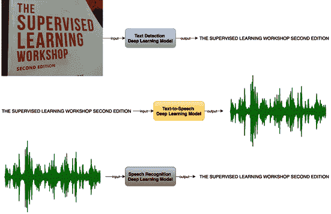

图 1.1–深度学习模型示例

D eep 神经网络涉及大量的数学计算、线性代数方程、复杂的非线性函数以及各种优化算法。为了使用 Python 等编程语言从头开始构建和训练深度神经网络，需要我们编写所有必要的方程、函数和优化时间表。此外，需要编写这样的代码，以便可以有效地加载大量数据，并且可以在合理的时间内执行训练。这相当于我们每次构建深度学习应用时都要实现几个较低级别的细节。

深度学习库，如 **Theano** 和 **TensorFlow** ，以及其他各种各样的库，多年来已经被开发出来，以抽象出这些细节。 **PyTorch** 就是这样一个基于 Python 的深度学习库，可以用来构建深度学习模型。

T ensorFlow 是 Google 在 2015 年末推出的开源深度学习 Python(和 C++)库，它彻底改变了应用深度学习领域。2016 年，脸书以自己的开源深度学习库作为回应，并将其命名为**火炬**。Torch 最初是和一种叫做 **Lua** 的脚本语言一起使用的，很快，Python 的等价物出现了，叫做 **PyTorch** 。大约在同一时间，微软发布了自己的库—**CNTK**。在激烈的竞争中，PyTorch 迅速发展成为使用最多的深度学习库之一。

这本书旨在成为一些最先进的深度学习问题的实践资源，如何使用复杂的深度学习架构解决这些问题，以及如何有效地使用 PyTorch 来构建、训练和评估这些复杂的模型。虽然这本书以 PyTorch 为中心，但它也包括一些最新和最先进的深度学习模型的全面覆盖。这本书的目标读者是数据科学家、机器学习工程师或研究人员，他们掌握了 Python 的工作知识，并且最好以前使用过 PyTorch。

由于本书的实践性质，强烈建议您在自己的计算机上亲自尝试每一章中的示例，以熟练编写 PyTorch 代码。我们从这一介绍性章节开始，随后探索各种深度学习问题和模型架构，这将揭示 PyTorch 必须提供的各种功能。

本章将回顾深度学习背后的一些概念，并提供 PyTorch 库的简要概述。我们以一个动手练习来结束本章，在这个练习中，我们使用 PyTorch 来训练一个深度学习模型。

本章将涵盖以下主题:

*   深度学习的复习
*   探索 PyTorch 图书馆
*   使用 PyTorch 训练神经网络

# 技术要求

我们将在所有练习中使用 Jupyter 笔记本。下面是使用`pip`为本章安装的 Python 库列表。例如，在命令行上运行`pip install torch==1.4.0`:

```py
jupyter==1.0.0
```

```py
torch==1.4.0
```

```py
torchvision==0.5.0
```

```py
matplotlib==3.1.2
```

与本章相关的所有代码文件都可以从 https://github . com/packt publishing/Mastering-py torch/tree/master/chapter 01 获得。

# 深度学习的复习

神经网络是机器学习方法的一个子类，其灵感来自人脑的结构和功能。在神经网络中，每个计算单元，类比称为神经元，以分层的方式连接到其他神经元。当这样的层数超过两层时，这样形成的神经网络被称为**深度神经网络**。这样的模型就是一般称为**深度学习模型**。

深度学习模型已被证明优于其他经典的机器学习模型，因为它们能够学习输入数据和输出(基础事实)之间的高度复杂的关系。最近，深度学习获得了很多关注，这是理所当然的，主要是因为以下两个原因:

*   强大计算机器的可用性，尤其是在云中
*   海量数据的可用性

由于摩尔定律，即计算机的处理能力将每两年翻一番，我们现在生活在一个可以在现实和合理的短时间内训练数百层深度学习模型的时代。与此同时，随着各地数字设备的使用呈指数级增长，我们的数字足迹也呈爆炸式增长，导致全球每时每刻都在产生大量数据。

因此，已经有可能为一些最困难的认知任务训练深度学习模型，这些任务要么在早期难以处理，要么通过其他机器学习技术获得次优解决方案。

深度学习，或一般的神经网络，比经典的机器学习模型还有另一个优势。通常，在经典的基于机器学习的方法中，**特征工程**在一个训练好的模型的整体性能中扮演着的关键角色。然而，深度学习模型消除了手动制作特征的需要。有了大量的数据，深度学习模型可以在不需要手工设计功能的情况下表现得非常好，并且可以胜过传统的机器学习模型。下图显示了深度学习模型如何比经典机器模型更好地利用大量数据:

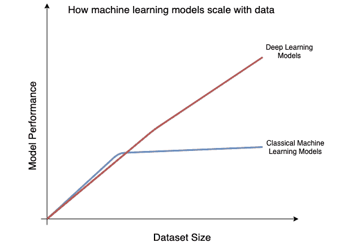

图 1.2–模型性能与数据集大小的关系

从图表中可以看出，深度学习的性能不一定能区分到特定的数据集大小。然而，随着数据量开始进一步增加，深度神经网络开始胜过非深度学习模型。

深度学习模型可以基于多年来开发的各种类型的神经网络架构来构建。不同体系结构之间的主要区别因素是神经网络中使用的层的类型和组合。一些众所周知的层如下:

*   **全连接**或**线性**:在全连接层中，如下图所示，该层之前的所有神经元都与该层之后的所有神经元相连:

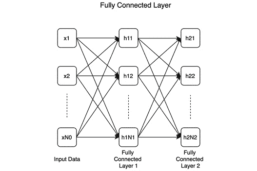

图 1.3-全连接层

这个例子显示了两个连续的完全连接的层，分别具有 **N1** 和 **N2** 数量的神经元。完全连接的层是许多——实际上是大多数——深度学习分类器的基本单元。

*   **卷积**:下图显示了一个卷积层，其中卷积核(或滤波器)在输入上进行卷积:

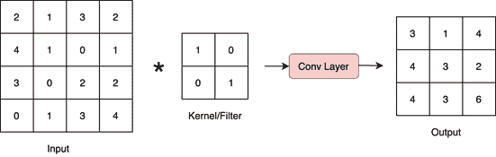

图 1.4–卷积层

卷积层是**卷积神经网络**(**CNN**)的一个基本单元，是解决计算机视觉问题最有效的模型。

*   **轮回**:下图显示了一个轮回层。虽然它看起来类似于完全连接的层，但主要区别在于循环连接(用粗体弯曲箭头标记):

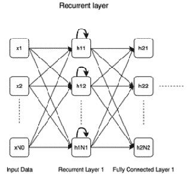

图 1.5–循环层

递归层比全连接层更有优势，因为它们表现出记忆能力，这在处理顺序数据时很方便，因为人们需要记住过去的输入和现在的输入。

*   **解卷积**(卷积层的反转):与卷积层的完全相反，**解卷积层**的工作原理如下图所示:

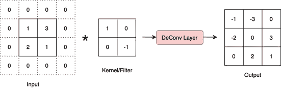

图 1.6–去卷积层

这一层在空间上扩展了输入数据，因此在以生成或重建图像为目标的模型中至关重要。

*   **池化**:下图显示了最大池化层，这可能是最广泛使用的一种池化层:

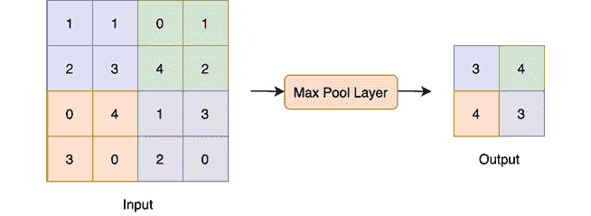

图 1.7-池层

这是一个最大汇集层，汇集输入的 2x2 大小的子部分中的最大数量。其他形式的汇集是**最小汇集**和**平均汇集**。

*   **脱落**:下图展示了脱落层是如何工作的。本质上，在脱离层中，一些神经元被暂时关闭(在图中用 **X** 标记)，也就是说，它们与网络断开连接:

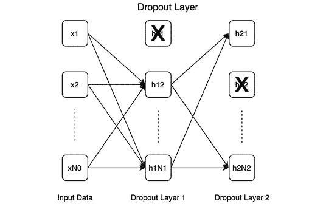

图 1.8–脱落层

Dropout 有助于模型正则化，因为它迫使模型在某些神经元偶尔缺失的情况下运行良好，这迫使模型学习可概括的模式，而不是记忆整个训练数据集。

下图显示了许多基于前面提到的层的著名架构:。

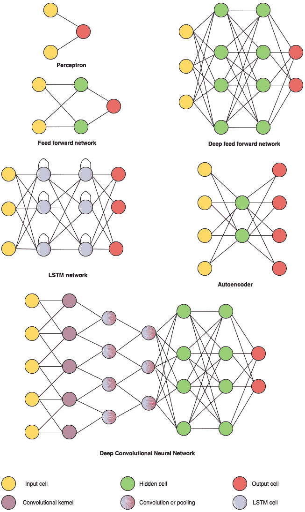

图 1.9-不同的神经网络架构

一个更详尽的神经网络架构集合可以在这里找到:[https://www.asimovinstitute.org/neural-network-zoo/](https://www.asimovinstitute.org/neural-network-zoo/)。

除了层的类型和它们如何在网络中连接，其他因素如**激活函数**和**优化时间表**也定义了模型。

## 激活功能

激活函数对神经网络至关重要，因为它们增加了非线性，如果没有非线性，无论我们增加多少层，整个神经网络都会简化为简单的线性模型。这里列出的不同类型的激活函数基本上是不同的非线性数学函数。

一些常用的激活功能如下:

*   **Sigmoid** :一个 Sigmoid(或逻辑)函数被表达为如下:

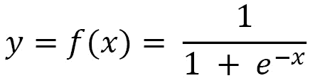

该函数以图表形式显示如下:

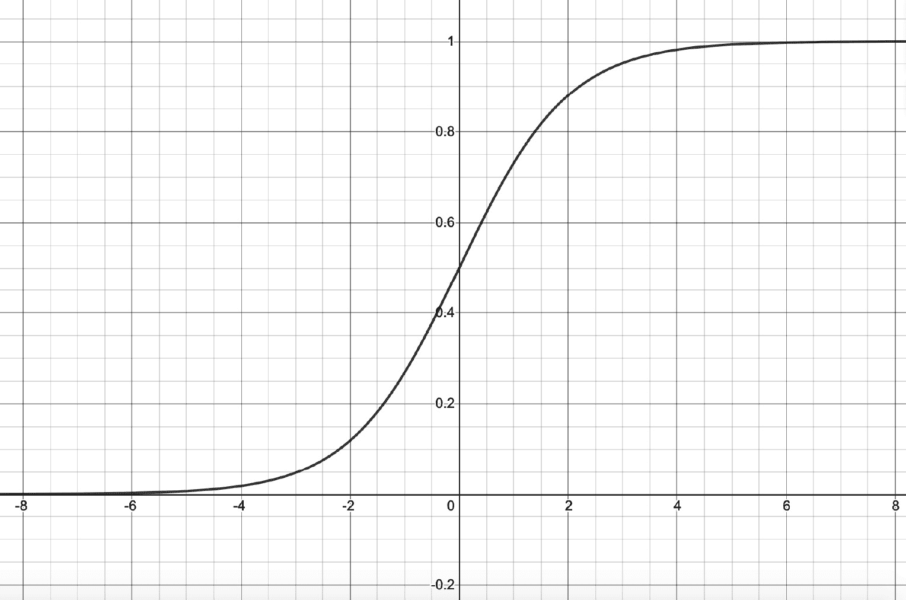

图 1.10–Sigmoid 函数

从图中可以看出，sigmoid 函数接受数值 *x* 作为输入，并输出范围(0，1)内的值 *y* 。

*   **TanH** : TanH 为表示如下:

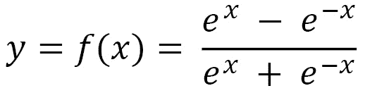

该函数以图表形式显示如下:

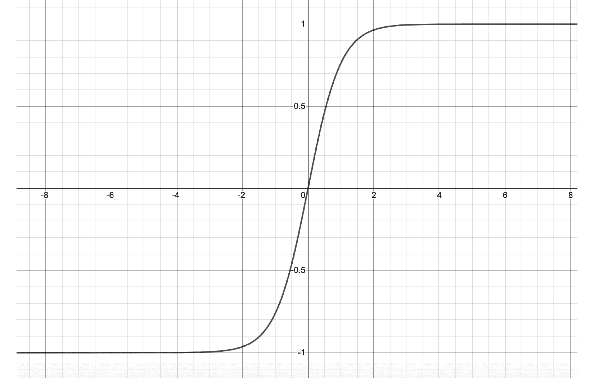

图 1.11–双曲正切函数

与 sigmoid 相反，在 TanH 激活功能的情况下，输出 *y* 从-1 变化到 1。因此，这种激活在情况下很有用，我们既需要正输出，也需要负输出。

*   **整流线性单元** ( **ReLUs** ): ReLUs 是比前两个更新的，简单地用表示如下: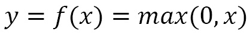

该函数以图表形式显示如下:

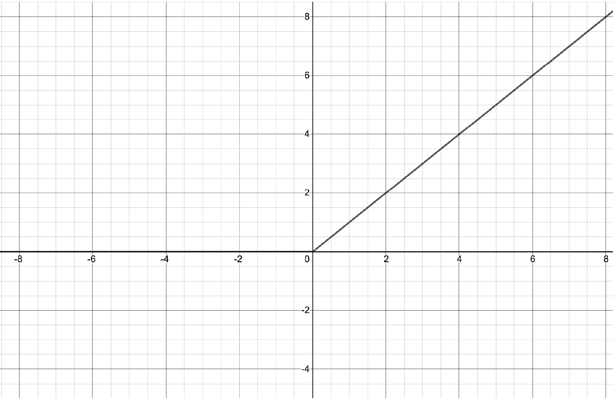

图 1.12–ReLU 功能

与 sigmoid 和 TanH 激活函数相比，ReLU 的一个显著特点是只要输入大于 0，输出就会随着输入不断增长。这防止了该函数的梯度像前面两个激活函数的情况一样减小到 0。尽管，每当输入为负时，输出和梯度都将为 0。

*   **泄漏 ReLU**:ReLU 通过输出 0 来完全抑制任何进入的负输入。然而，我们可能还想处理某些情况下的负面输入。泄漏 ReLUs 通过输出输入负输入的一小部分 *k* 来提供处理负输入的选项。这个分数 *k* 是这个激活函数的一个参数，数学上可以表示为: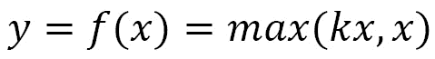

下图显示了泄漏 ReLU 的输入输出关系:

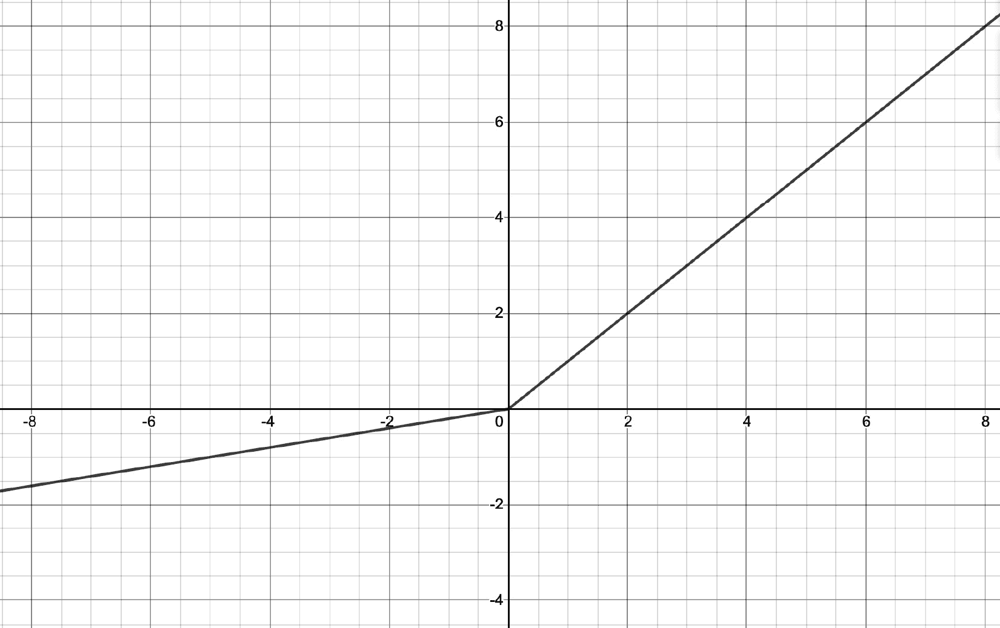

图 1.13–泄漏 ReLU 功能

激活功能是深度学习中一个积极发展的研究领域。这里不可能列出所有的激活功能，但是我鼓励你去看看这个领域最近的发展。许多激活功能只是本节提到的那些功能的细微变化。

## 优化时间表

到目前为止，我们已经谈到了神经网络结构是如何构建的。为了训练一个神经网络，我们需要采用一个**优化调度**。像任何其他基于参数的机器学习模型一样，深度学习模型是通过调整其参数来训练的。通过**反向传播**的过程来调整参数，其中神经网络的最终或输出层产生损失。这种损失是在损失函数的帮助下计算的，该损失函数接受神经网络最终层的输出和相应的地面真实目标值。然后使用*梯度下降*和*微分链规则*将这种损失反向传播到前面的层。

每一层的参数或权重被相应地修改，以最小化损失。修改的程度由一个系数决定，该系数从 0 到 1 变化，也称为**学习率**。这个更新神经网络权重的整个过程，我们称之为**优化时间表**，对模型的训练有着重要的影响。因此，在这方面已经做了大量的研究，并且仍在进行中。以下是一些流行的优化计划:

*   **随机梯度下降** ( **SGD** ):以如下方式更新模型参数:

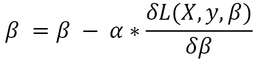

*β* 是模型的参数,*X*和 *y* 分别是输入的训练数据和对应的标签。 *L* 是损失函数， *α* 是学习率。SGD 为每个训练示例对( *X* ， *y* )执行此更新。这种方法的一个变体——小批量梯度下降——对每个 *k* 样本进行更新，其中 *k* 是批量。整个小批量的梯度计算在一起。另一种变体，批量梯度下降，通过计算整个数据集的梯度来执行参数更新。

*   **Adagrad** :在之前的优化时间表中，我们对模型的所有参数使用单一学习率。然而，不同的参数可能需要以不同的速度更新，特别是在稀疏数据的情况下，其中一些参数比其他参数更积极地参与特征提取。Adagrad 引入了按参数更新的思想，如下所示:

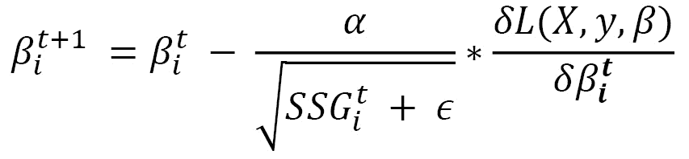

这里，我们使用下标 *i* 来表示第 I 个参数，上标 *t* 用于表示梯度下降迭代的时间步长 *t* 。 *SSG* 是从时间步长 0 到时间步长 *t* 的第 I 个参数的*梯度平方和*。 *є* 用于表示加到 *SSG* 上的小数值，以避免被零除。将全局学习速率 *α* 除以 *SSG* 的平方根，确保频繁改变参数的学习速率比很少更新参数的学习速率下降得更快。

*   **Adadelta** :在 Adagrad 中，学习率的分母是一个由于在中每一个时间步长增加平方项而不断增值的项。这导致学习率衰减到几乎为零的小值。为了解决这个问题，Adadelta 引入了只计算前一时间步的梯度平方和的思想。其实我们可以把它表达为过去梯度的一个运行衰减平均值: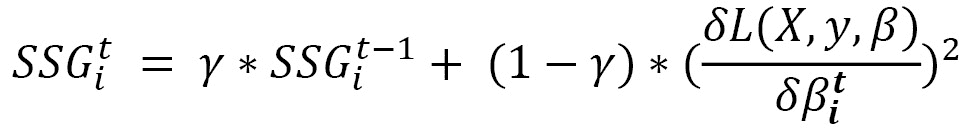

γ这里是我们希望为之前的梯度平方和选择的衰减因子。利用这个公式，由于衰减平均值，我们确保梯度的平方和不会累积到很大的值。一旦定义了 *SSG* ，我们就可以使用*阿达格拉德方程*来定义阿达德尔塔的更新步骤。

然而，如果我们仔细观察*阿达格拉德方程*，均方根梯度不是的无量纲量，因此理想情况下不应用作学习速率的系数。为了解决这个问题，我们定义了另一个运行平均值，这次是平方参数更新。让我们首先定义参数更新:


然后，类似于*过去梯度的运行衰减平均值*方程(在 *Adadelta* 下的第一个方程)，我们可以如下定义参数更新的平方和:

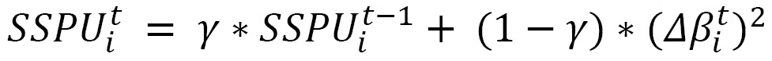

这里， *SSPU* 是参数更新的平方和。一旦我们有了这个，我们可以用最终的阿达德尔塔方程来调整*阿达格拉德方程*中的维数问题:

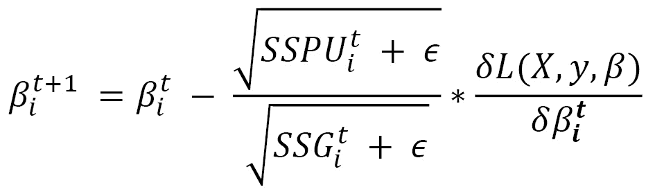

值得注意的是，最终的 Adadelta 方程不需要任何学习率。然而，我们仍然可以提供一个学习率作为乘数。因此，这个优化调度的唯一强制超参数是衰减因子..

*   RMSprop :我们在讨论 Adadelta 时已经含蓄地讨论了 RMSprop 的内部工作方式，因为两者非常相似。唯一的区别是 RMSProp 没有针对维度问题进行调整，因此更新方程与 *Adagrad* 部分中给出的方程保持相同，其中 *SSG* 是从 *Adadelta* 部分中的第一个方程获得的。这实质上意味着，在 RMSProp 的情况下，我们确实需要指定基本学习率和衰减因子。
*   **自适应矩估计(Adam)** :这是另一个优化调度，计算每个参数的定制学习率。就像 Adadelta 和 RMSprop 一样，Adam 也使用先前平方梯度的衰减平均值，如 *Adadelta* 部分的第一个等式所示。但是，它也使用先前渐变值的衰减平均值:

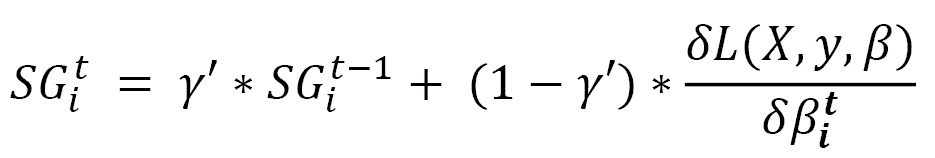

*SG* 和 *SSG* 在数学上等价于分别估计梯度的一阶和二阶矩，这种方法因此得名——**自适应矩估计**。通常，γ和γ'接近于 1，在这种情况下，SG 和 SSG 的初始值可能都趋向于零。为了抵消这一点，这两个量在偏差校正的帮助下被重新表述:

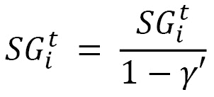

和

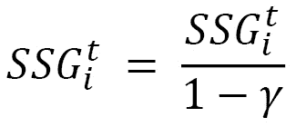

定义后，参数更新表示如下:

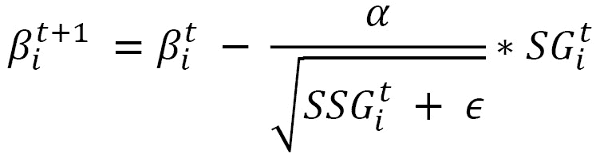

基本上，方程最右边的梯度被梯度的衰减平均值所代替。值得注意的是，Adam 优化涉及三个超参数——基本学习率，以及梯度和平方梯度的两个衰减率。对于训练复杂的深度学习模型，Adam 是最近最成功的优化时间表之一，如果不是最成功的话。

那么，我们应该使用哪个优化器？看情况。如果我们正在处理稀疏数据，那么自适应优化器(编号 2 到 5)将是有利的，因为每个参数的学习率更新。如前所述，对于稀疏数据，不同的参数可能以不同的速度工作，因此定制的每参数学习率机制可以极大地帮助模型达到最优解。SGD 也可能找到一个不错的解决方案，但在培训时间方面需要更长的时间。在自适应算法中，Adagrad 的缺点是学习率为零，因为学习率分母单调增加。

RMSProp、Adadelta 和 Adam 在各种深度学习任务上的表现相当接近。RMSprop 在很大程度上类似于 Adadelta，除了在 RMSprop 中使用基本学习率，而在 Adadelta 中使用以前参数更新的衰减平均值。Adam 略有不同，因为它还包括梯度的一阶矩计算，并考虑了偏差校正。总的来说，在其他条件相同的情况下，亚当可能是最佳人选。我们将在本书的练习中使用这些优化计划。请随意将它们与另一个进行切换，以观察以下方面的变化:

*   模型训练时间和轨迹(收敛)
*   最终模型性能

在接下来的章节中，我们将在 PyTorch 的帮助下，在解决不同类型的机器学习问题时使用许多这些架构、层、激活函数和优化调度。在本章包含的示例中，我们将创建一个包含卷积层、线性层、最大池层和漏失层的卷积神经网络。 **Log-Softmax** 用于最终层，ReLU 用作所有其他层的激活函数。并且使用具有固定学习速率`0.5`的 Adadelta 优化器来训练该模型。

# 探索 PyTorch 图书馆

PyTorch 是一个基于 Torch 库的 Python 的机器学习库。PyTorch 被广泛用作深度学习工具，既用于研究，也用于构建工业应用。它主要由脸书的机器学习研究实验室开发。PyTorch 是另一个著名的深度学习库——tensor flow 的竞争对手，后者是由谷歌开发的。这两者之间最初的区别是 PyTorch 基于**急切执行**，而 TensorFlow 基于**基于图形的延迟执行**。虽然，TensorFlow 现在也提供了急切执行模式。

急切执行基本上是一种命令式编程模式，在这种模式下，数学运算是立即计算的。延迟执行模式会将所有操作存储在一个计算图中，而不立即进行计算，然后在以后评估整个图。急切执行被认为是有利的，原因包括直观的流程、易于调试和较少的脚手架代码。

PyTorch 不仅仅是一个深度学习库。凭借其类似 NumPy 的语法/接口，它使用 GPU 提供了强大的加速张量计算能力。但是什么是张量呢？张量是计算单位，非常类似于 NumPy 数组，只是它们也可以用在 GPU 上来加速计算。

借助加速计算和创建动态计算图的工具，PyTorch 提供了一个完整的深度学习框架。除此之外，它在本质上是真正的 Python，这使得 PyTorch 用户能够利用 Python 提供的所有特性，包括广泛的 Python 数据科学生态系统。

在本节中，我们将了解一些有用的 PyTorch 模块，这些模块扩展了各种功能，有助于在模型训练期间加载数据、构建模型和指定优化计划。我们还将扩展张量是什么，以及如何在 PyTorch 中实现它的所有属性。

## PyTorch 模块

PyTorch 库除了像 NumPy 一样提供计算功能外，还提供了一组模块，使开发人员能够快速设计、训练和测试深度学习模型。以下是一些最有用的模块

### torch.nn

当构建神经网络架构时，网络构建的基本方面是层数、每层中神经元的数量以及其中哪些是可学习的，等等。PyTorch `nn`模块使用户能够通过定义一些高级方面来快速实例化神经网络架构，而不是必须手动指定所有细节。以下是不使用`nn`模块的一层神经网络初始化:

```py
import math
```

```py
# we assume a 256-dimensional input and a 4-dimensional output for this 1-layer neural network
```

```py
# hence, we initialize a 256x4 dimensional matrix filled with random values
```

```py
weights = torch.randn(256, 4) / math.sqrt(256)
```

```py
# we then ensure that the parameters of this neural network ar trainable, that is, the numbers in the 256x4 matrix can be tuned with the help of backpropagation of gradients
```

```py
weights.requires_grad_()
```

```py
# finally we also add the bias weights for the 4-dimensional output, and make these trainable too
```

```py
bias = torch.zeros(4, requires_grad=True)
```

我们可以用`nn.Linear(256, 4)`来代表同样的东西。

在`torch.nn`模块中，有一个叫做`torch.nn.functional`的子模块。这个子模块由`torch.nn`模块中的所有函数组成，而所有的子模块都是类。这些函数是**损失函数**、**激活函数**，以及**神经函数**，其能够被用于以函数方式(即，当每个后续层被表示为前一层的函数时)创建神经网络，例如*汇集*、*卷积*和*线性*函数。使用`torch.nn.functional`模块的损失函数示例如下:

```py
import torch.nn.functional as F
```

```py
loss_func = F.cross_entropy
```

```py
loss = loss_func(model(X), y)
```

这里，`X`是输入，`y`是目标输出，model 是神经网络模型。

### 火炬. optim

当我们训练一个神经网络时，我们反向传播误差来调整网络的权重或参数——这个过程我们称之为**优化**。`optim`模块包括在训练深度学习模型时，与运行各种类型的优化调度相关的所有工具和功能。假设我们在培训会话期间使用`torch.optim`模块定义了一个优化器，如下面的代码片段所示:

```py
opt = optim.SGD(model.parameters(), lr=lr)
```

然后，我们不需要手动编写优化步骤，如下所示:

```py
with torch.no_grad():
```

```py
    # applying the parameter updates using stochastic gradient descent
```

```py
    for param in model.parameters(): param -= param.grad * lr
```

```py
    model.zero_grad()
```

我们可以简单地这样写:

```py
opt.step()
```

```py
opt.zero_grad()
```

接下来，我们将看看`utis.data`模块。

### torch.utils.data

在`utis.data`模块下，torch 提供了自己的数据集和`DatasetLoader`类，由于其抽象和灵活的实现，这些类非常方便。基本上，这些类提供了在张量上迭代和执行其他类似操作的直观而有用的方法。使用这些，我们可以确保优化张量计算的高性能，并且还具有故障安全数据 I/O。例如，假设我们使用如下`torch.utils.data.DataLoader`:

```py
from torch.utils.data import (TensorDataset, DataLoader)
```

```py
train_dataset = TensorDataset(x_train, y_train)
```

```py
train_dataloader = DataLoader(train_dataset, batch_size=bs)
```

然后，我们不需要手动迭代成批的数据，就像这样:

```py
for i in range((n-1)//bs + 1):
```

```py
    x_batch = x_train[start_i:end_i]
```

```py
    y_batch = y_train[start_i:end_i]
```

```py
    pred = model(x_batch)
```

我们可以简单地这样写:

```py
for x_batch,y_batch in train_dataloader:
```

```py
    pred = model(x_batch)
```

现在让我们看看张量模。

## 张量模块

如前所述，张量在概念上类似于 NumPy 数组。张量是一个 *n* 维数组，我们可以在上面操作数学函数，通过 GPU 加速计算，张量也可以用于跟踪计算图形和梯度，这被证明对深度学习至关重要。要在 GPU 上运行张量，我们只需要将张量转换成某种数据类型。

下面是我们如何在 PyTorch 中实例化张量:

```py
points = torch.tensor([1.0, 4.0, 2.0, 1.0, 3.0, 5.0]) 
```

要获取第一个条目，只需编写以下代码:

```py
float(points[0])
```

我们也可以用这个来检查张量的形状:

```py
points.shape
```

在 PyTorch 中，张量被实现为存储在连续内存块中的数值数据的一维数组的视图。这些阵列称为存储实例。每个 PyTorch 张量都有一个存储属性，可以调用该属性来输出张量的底层存储实例，如下例所示:

```py
points = torch.tensor([[1.0, 4.0], [2.0, 1.0], [3.0, 5.0]])
```

```py
points.storage()
```

这将输出以下内容:

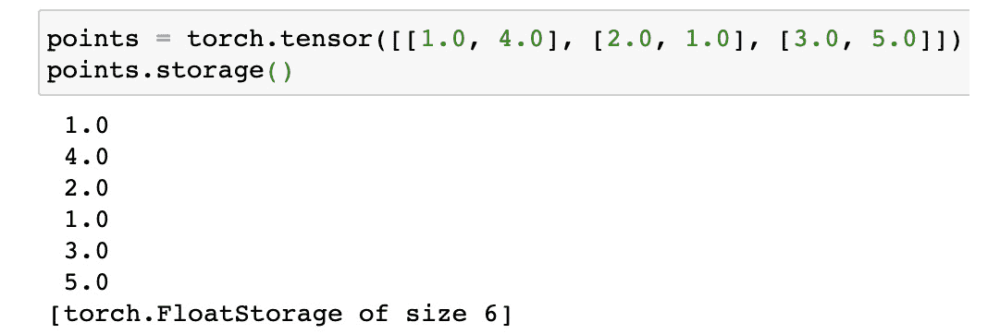

图 1.14–py torch 张量存储

当我们说张量是存储实例上的视图时，张量使用以下信息来实现视图:

*   大小
*   储存；储备
*   抵消
*   进展

让我们在前面例子的帮助下研究一下这个问题:

```py
points = torch.tensor([[1.0, 4.0], [2.0, 1.0], [3.0, 5.0]])
```

让我们研究一下这些不同信息的含义:

```py
points.size()
```

这将输出以下内容:

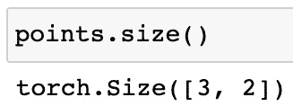

图 1.15–py torch 张量大小

正如我们所看到的，`size`类似于 NumPy 中的`shape`属性，它告诉我们每个维度上的元素数量。这些数字的乘积等于底层存储实例的长度(本例中为 6)。

我们已经研究过了`storage`属性的含义，让我们看看`offset`:

```py
points.storage_offset()
```

这将输出以下内容:

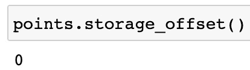

图 1.16–py torch 张量存储偏移 1

这里的偏移量表示`storage`数组中张量的第一个元素的索引。因为输出是`0`，这意味着张量的第一个元素是`storage`数组中的第一个元素。

让我们看看这个:

```py
points[1].storage_offset()
```

这将输出以下内容:

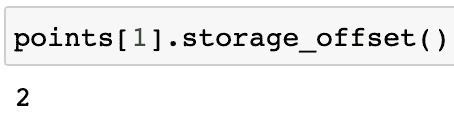

图 1.17–py torch 张量存储偏移 2

因为`points[1]`是`[2.0, 1.0]`，`storage`数组是`[1.0, 4.0, 2.0, 1.0, 3.0, 5.0]`，我们可以看到张量`[2.0, 1.0]`的第一个元素，也就是`. 2.0`在`storage`数组的索引`2`处。

最后，我们来看看`stride`属性:

```py
points.stride()
```

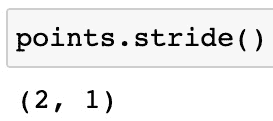

图 1.18–py torch 张量步幅

正如我们所看到的，`stride`包含了每个维度中为了访问张量的下一个元素而要跳过的元素的数量。所以，在这种情况下，沿着第一维度，为了访问第一维度之后的元素，即`1.0`我们需要跳过 2 个元素(即`1.0`和`4.0`来访问下一个元素，即`2.0`。同样，沿着第二维，我们需要跳过 1 个元素来访问`1.0`之后的元素，即`4.0`。因此，使用所有这些属性，张量可以从连续的一维存储阵列中导出。

张量中包含的数据是数字类型的。具体来说，PyTorch 提供了包含在张量中的以下数据类型:

*   `torch.float32`或`torch.float` —32 位浮点
*   `torch.float64`或`torch.double` —64 位，双精度浮点
*   `torch.float16`或`torch.half` —16 位、半精度浮点
*   `torch.int8`—带符号的 8 位整数
*   `torch.uint8`—无符号 8 位整数
*   `torch.int16`或`torch.short`—带符号的 16 位整数
*   `torch.int32`或`torch.int`—有符号的 32 位整数
*   `torch.int64`或`torch.long`—带符号的 64 位整数

我们如何指定用于张量的特定数据类型的示例如下:

```py
points = torch.tensor([[1.0, 2.0], [3.0, 4.0]], dtype=torch.float32)
```

除了数据类型，PyTorch 中的张量还需要一个存储它们的设备规范。设备可以被指定为实例化:

```py
points = torch.tensor([[1.0, 2.0], [3.0, 4.0]], dtype=torch.float32, device='cpu')
```

或者我们也可以在所需的设备中创建一个张量的副本:

```py
points_2 = points.to(device='cuda')
```

正如在两个例子中看到的，我们可以将张量分配给 CPU(使用`device='cpu'`)，如果我们没有指定设备，这是默认情况下发生的，或者我们可以将张量分配给 GPU(使用`device='cuda'`)。

注意

PyTorch 目前只支持支持 CUDA 的 GPU。

当一个张量被放置在 GPU 上时，计算速度会加快，因为张量 API 在 CPU 和 GPU 上很大程度上是一致的，在 PyTorch 中放置张量，在设备间移动相同的张量、执行计算并将其移回是非常方便的。

如果有多个相同类型的设备，比如多个 GPU，我们可以使用设备索引精确定位要放置张量的设备，如下所示:

```py
points_3 = points.to(device='cuda:0')
```

你可以在这里阅读更多关于 PyTorch-CUDA 的信息:[https://pytorch.org/docs/stable/notes/cuda.html](https://pytorch.org/docs/stable/notes/cuda.html)。你可以在这里阅读更多关于 https://developer.nvidia.com/about-cuda. CUDA 的一般信息

既然我们已经探索了 PyTorch 库并理解了 PyTorch 和 Tensor 模块，让我们学习如何使用 PyTorch 训练神经网络。

# 使用 PyTorch 训练神经网络

在这个练习中，我们将使用著名的`MNIST`数据集(可在 http://yann.lecun.com/exdb/mnist/[获得)](http://yann.lecun.com/exdb/mnist/)，这是手写邮政编码数字的图像序列，从 0 到 9，带有相应的标签。`MNIST`数据集由 60，000 个训练样本和 10，000 个测试样本组成，其中每个样本都是 28 x 28 像素的灰度图像。PyTorch 还在其`Dataset`模块下提供了`MNIST`数据集。

在本练习中，我们将使用 PyTorch 在该数据集上训练深度学习多类分类器，并测试训练后的模型在测试样本上的表现如何:

1.  在本练习中，我们需要导入一些依赖项。执行以下`import`语句:

    ```py
    import torch
    import torch.nn as nn
    import torch.nn.functional as F
    import torch.optim as optim
    from torch.utils.data import DataLoader
    from torchvision import datasets, transforms
    import matplotlib.pyplot as plt
    ```

2.  Next, we define the model architecture as shown in the following diagram: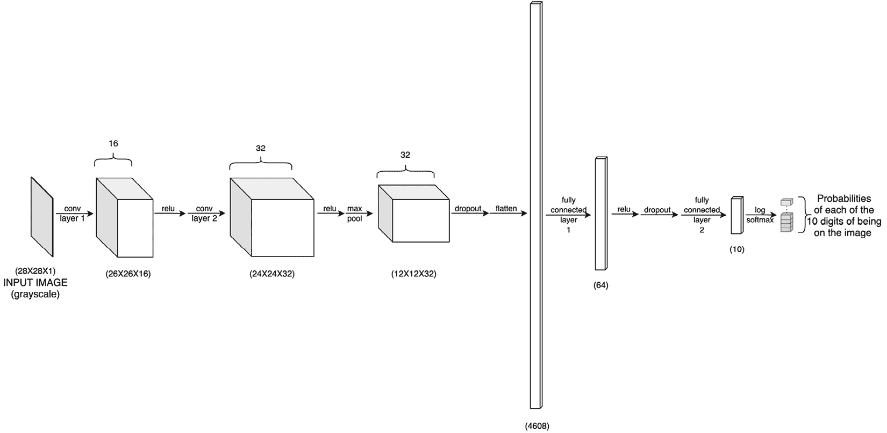

    图 1.19–神经网络架构

    该模型由卷积层、漏失层以及线性/全连接层组成，所有这些都可以通过`torch.nn`模块获得:

    ```py
    class ConvNet(nn.Module):
        def __init__(self):
            super(ConvNet, self).__init__()
            self.cn1 = nn.Conv2d(1, 16, 3, 1)
            self.cn2 = nn.Conv2d(16, 32, 3, 1)
            self.dp1 = nn.Dropout2d(0.10)
            self.dp2 = nn.Dropout2d(0.25)
            self.fc1 = nn.Linear(4608, 64) # 4608 is basically 12 X 12 X 32
            self.fc2 = nn.Linear(64, 10)
        def forward(self, x):
            x = self.cn1(x)
            x = F.relu(x)
            x = self.cn2(x)
            x = F.relu(x)
            x = F.max_pool2d(x, 2)
            x = self.dp1(x)
            x = torch.flatten(x, 1)
            x = self.fc1(x)
            x = F.relu(x)
            x = self.dp2(x)
            x = self.fc2(x)
            op = F.log_softmax(x, dim=1)
            return op
    ```

    `__init__`函数定义了模型的核心架构，即每层神经元个数的所有层。而`forward`函数，顾名思义，就是在网络中做正向传递。因此，它包括每一层的所有激活功能，以及在任何层之后使用的任何汇集或丢弃功能。该函数将返回最终的层输出，我们称之为模型的预测，它与目标输出(地面真实)具有相同的维度。

    请注意，第一个卷积层有一个 1 通道输入，一个 16 通道输出，内核大小为 3，步长为 1。单通道输入主要用于将被输入模型的灰度图像。出于各种原因，我们决定采用 3x3 的内核大小。首先，核大小通常是奇数，使得输入图像像素围绕中心像素对称分布。1×1 会太小，因为在给定像素上操作的内核将没有关于相邻像素的任何信息。接下来是 3，但为什么不进一步到 5，7，甚至 27 呢？

    嗯，在最高端，27x27 内核对 28x28 映像的卷积会给我们带来非常粗粒度的特性。然而，图像中最重要的视觉特征是相当局部的，因此对于视觉模式，使用一次查看几个相邻像素的小内核是有意义的。3x3 是 CNN 中用于解决计算机视觉问题的最常见的内核大小之一。

    请注意，我们有两个连续的卷积层，都具有 3×3 内核。就空间覆盖而言，这相当于使用一个具有 5×5 内核的卷积层。然而，使用具有较小内核大小的多层几乎总是优选的，因为它导致更深的网络，因此更复杂的学习特征以及由于更小的内核导致的更少的参数。

    卷积层输出中的信道数量通常高于或等于输入信道数量。我们的第一个卷积层接收一个通道的数据，并输出 16 个通道。这基本上意味着图层正在尝试从输入图像中检测 16 种不同的信息。这些通道中的每一个都被称为**特征图**，并且它们中的每一个都有一个专用内核为它们提取特征。

    我们在第二卷积层将通道的数量从 16 增加到 32，试图从图像中提取更多种类的特征。这种频道数量(或图像深度)的增加在 CNN 中很常见。我们将在 [*第三章*](B12158_03_Final_ASB_ePUB.xhtml#_idTextAnchor053) *、深度 CNN 架构*中的*基于宽度的 CNN*下阅读更多相关内容。

    最后，`1`的步幅是有意义的，因为我们的内核大小只有`3`。保持较大的步幅值——比如 10——会导致内核跳过图像中的许多像素，我们不想这样做。然而，如果我们的内核大小是 100，我们可能会认为 10 是一个合理的步幅值。步幅越大，卷积运算的次数越少，但是内核的整体视野越小。

3.  We then define the training routine, that is, the actual backpropagation step. As can be seen, the `torch.optim` module greatly helps in keeping this code succinct:

    ```py
    def train(model, device, train_dataloader, optim, epoch):
        model.train()
        for b_i, (X, y) in enumerate(train_dataloader):
            X, y = X.to(device), y.to(device)
            optim.zero_grad()
            pred_prob = model(X)
            loss = F.nll_loss(pred_prob, y) # nll is the negative likelihood loss
            loss.backward()
            optim.step()
            if b_i % 10 == 0:
                print('epoch: {} [{}/{} ({:.0f}%)]\t training loss: {:.6f}'.format(
                    epoch, b_i * len(X), len(train_			dataloader.dataset),
                    100\. * b_i / len(train_dataloader), loss.			item()))
    ```

    它批量迭代数据集，在给定设备上复制数据集，在神经网络模型上向前传递检索到的数据，计算模型预测和实际情况之间的损失，使用给定的优化器调整模型权重，并每 10 批打印一次训练日志。完成一次的整个过程称为`1`时期，即整个数据集被读取一次。

4.  Similar to the preceding training routine, we write a test routine that can be used to evaluate the model performance on the test set:

    ```py
    def test(model, device, test_dataloader):
        model.eval()
        loss = 0
        success = 0
        with torch.no_grad():
            for X, y in test_dataloader:
                X, y = X.to(device), y.to(device)
                pred_prob = model(X)
                loss += F.nll_loss(pred_prob, y, reduction='sum').item()  # loss summed across the batch
                pred = pred_prob.argmax(dim=1, 		 keepdim=True)  # us argmax to get the most 		 likely prediction
                success += pred.eq(y.view_as(pred)).sum().item()
        loss /= len(test_dataloader.dataset)
        print('\nTest dataset: Overall Loss: {:.4f}, Overall Accuracy: {}/{} ({:.0f}%)\n'.format(
            loss, success, len(test_dataloader.dataset),
            100\. * success / len(test_dataloader.dataset)))
    ```

    这个函数的大部分类似于前面的`train`函数。唯一的区别是，从模型预测和实际情况中计算出来的损失并不用于使用优化器来调整模型权重。相反，损失用于计算整个测试批次的总体测试误差。

5.  Next, we come to another critical component of this exercise, which is loading the dataset. Thanks to PyTorch's `DataLoader` module, we can set up the dataset loading mechanism in a few lines of code:

    ```py
    # The mean and standard deviation values are calculated as the mean of all pixel values of all images in the training dataset
    train_dataloader = torch.utils.data.DataLoader(
        datasets.MNIST('../data', train=True, download=True,
                       transform=transforms.Compose([
                           transforms.ToTensor(),
                           transforms.Normalize((0.1302,), (0.3069,))])), # train_X.mean()/256\. and train_X.std()/256.
        batch_size=32, shuffle=True)
    test_dataloader = torch.utils.data.DataLoader(
        datasets.MNIST('../data', train=False, 
                       transform=transforms.Compose([
                           transforms.ToTensor(),
                           transforms.Normalize((0.1302,), (0.3069,)) 
                       ])),
        batch_size=500, shuffle=False)
    ```

    如你所见，我们将`batch_size`设置为`32`，这是一个相当常见的选择。通常，在决定批量大小时有一个权衡。由于频繁的梯度计算，非常小的批量会导致缓慢的训练，并且会导致非常嘈杂的梯度。另一方面，由于计算梯度的等待时间较长，非常大的批量也会降低训练速度。在单个梯度更新之前等待很长时间是不值得的。这是相当可取的，使频繁，不太精确的梯度，因为它将最终导致模型更好的学习参数集。

    对于训练和测试数据集，我们指定要保存数据集的本地存储位置和批处理大小，批处理大小决定了构成训练和测试运行的一次传递的数据实例的数量。我们还指定，我们希望随机调整训练数据实例，以确保数据样本在各批之间的均匀分布。最后，我们还将数据集归一化为具有指定平均值和标准偏差的正态分布。

6.  We defined the training routine earlier. Now is the time to actually define which optimizer and device we will use to run the model training. And we will finally get the following:

    ```py
    torch.manual_seed(0)
    device = torch.device("cpu")
    model = ConvNet()
    optimizer = optim.Adadelta(model.parameters(), lr=0.5)
    ```

    我们将这个练习的设备定义为`cpu`。我们还设置了一个种子来避免未知的随机性并保证可重复性。我们将使用 AdaDelta 作为这个练习的优化器，学习速率为`0.5`。在本章前面讨论优化时间表时，我们提到如果我们处理稀疏数据，Adadelta 可能是一个不错的选择。这是一个稀疏数据的例子，因为并不是图像中的所有像素都是有用的。话虽如此，我鼓励您在这个问题上尝试其他优化器，如 Adam，看看它如何影响训练过程和模型性能。

7.  And then we start the actual process of training the model for *k* number of epochs, and we also keep testing the model at the end of each training epoch:

    ```py
    for epoch in range(1, 3):
        train(model, device, train_dataloader, optimizer, epoch)
        test(model, device, test_dataloader)
    ```

    出于演示目的，我们将只运行两个时期的训练。输出如下所示:

    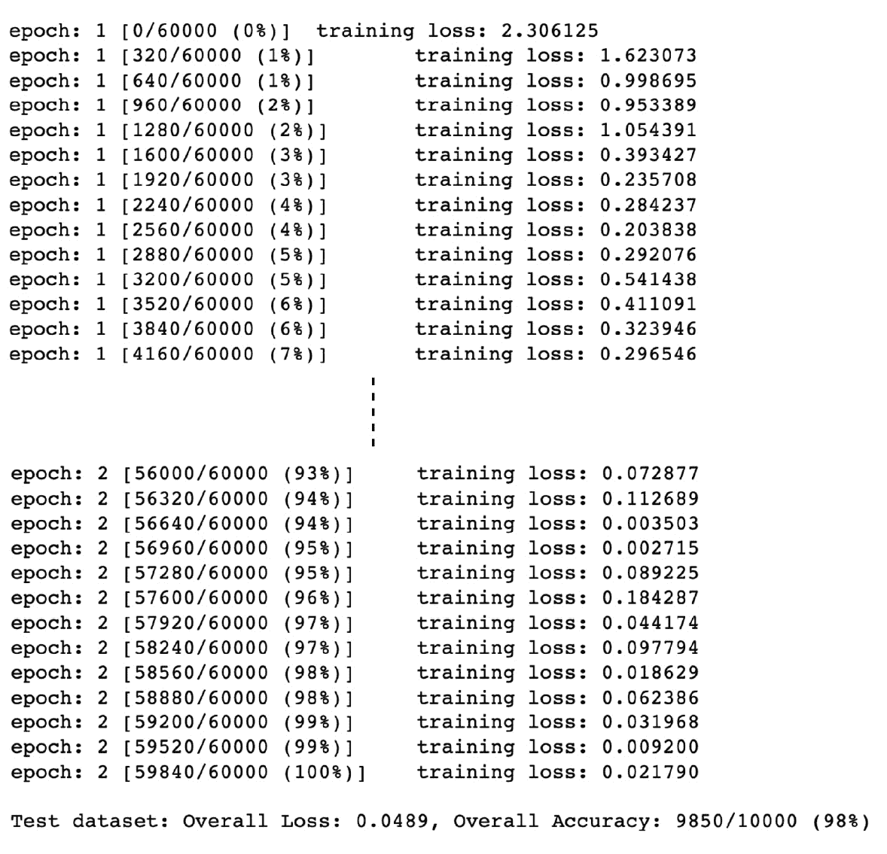

    图 1.20–培训日志

8.  Now that we have trained a model, with a reasonable test set performance, we can also manually check whether the model inference on a sample image is correct:

    ```py
    test_samples = enumerate(test_dataloader)
    b_i, (sample_data, sample_targets) = next(test_samples)
    plt.imshow(sample_data[0][0], cmap='gray', interpolation='none')
    ```

    输出如下所示:

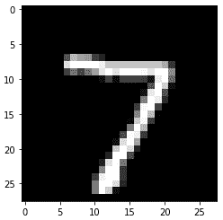

图 1.21–样本手写图像

现在我们对这张图片进行模型推断，并将其与真实情况进行比较:

```py
     print(f"Model prediction is : {model(sample_data).data.max(1)[1][0]}")
```

```py
print(f"Ground truth is : {sample_targets[0]}")
```

注意，对于预测，我们首先使用**轴=1** 上的`max`函数计算具有最大概率的类。`max`函数输出两个列表——一个是`sample_data`中每个样本的分类概率列表，另一个是每个样本的分类标签列表。因此，我们使用索引`[1]`选择第二个列表。我们通过使用索引`[0]`进一步选择第一类标签，只查看`sample_data`下的第一个样本。输出如下所示:

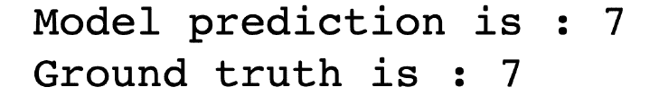

图 1.22–py torch 模型预测

这似乎是的正确预测。使用`model()`完成的神经网络的正向传递产生概率。因此，我们使用`max`函数输出概率最大的类。

注意

这个练习的代码模式来自官方的 PyTorch 范例库，可以在这里找到:[https://github.com/pytorch/examples/tree/master/mnist](https://github.com/pytorch/examples/tree/master/mnist)。

# 总结

在这一章中，我们刷新了深度学习的概念，如层、激活函数和优化调度，以及它们如何有助于构建各种深度学习架构。我们探索了 PyTorch 深度学习库，包括一些重要的模块，如`torch.nn`、`torch.optim`、`torch.data`，以及张量模块。

然后，我们进行了一次动手练习，从零开始训练深度学习模型。我们使用 PyTorch 模块构建了一个 CNN。我们还编写了相关的 PyTorch 代码来加载数据集，训练和评估模型，最后，根据训练好的模型进行预测。

在下一章中，我们将探索一个稍微复杂一点的模型架构，它涉及多个子模型，并使用这种类型的混合模型来处理使用自然文本描述图像的现实任务。使用 PyTorch，我们将实现这样一个系统，并为看不见的图像生成标题。