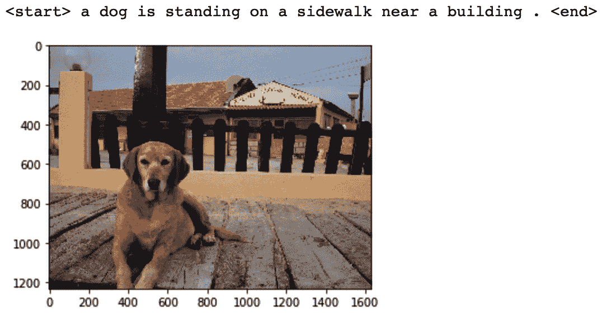

<link href="Styles/Style01.css" rel="stylesheet" type="text/css"> <link href="Styles/Style00.css" rel="stylesheet" type="text/css"> 

# *第二章*:结合 CNN 和 LSTMs

**卷积神经网络**(**CNN**)是一种已知的深度学习模型，用于解决与图像和视频相关的机器学习问题，如图像分类、对象检测、分割等。这是因为 CNN 使用一种叫做**卷积层**的特殊类型的层，这种层具有共享的可学习参数。权重或参数共享是可行的，因为要在图像中学习的模式(例如边缘或轮廓)被假定为与图像中像素的位置无关。就像 CNN 应用于图像一样，**长短期记忆** ( **LSTM** )网络——这是一种**递归神经网络**(**RNN**)——被证明在解决与**序列数据**相关的机器学习问题方面极其有效。顺序数据的一个例子可以是文本。例如，在一个句子中，每个单词都依赖于前面的单词。LSTM 模型就是用来模拟这种顺序依赖关系的。

这两种不同类型的网络——CNN 和 LSTMs 可以级联起来，形成一个混合模型，接收图像或视频，输出文本。这种混合模型的一个众所周知的应用是图像字幕，其中模型接收图像并输出图像的似乎合理的文本描述。自 2010 年以来，机器学习一直被用来执行图像字幕的任务([https://dl.acm.org/doi/10.5555/1858681.1858808](https://dl.acm.org/doi/10.5555/1858681.1858808))。

然而，神经网络在 2014/2015 年左右首次成功用于这项任务([https://www . cv-foundation . org/open access/content _ cvpr _ 2015/html/viny als _ Show _ and _ Tell _ 2015 _ CVPR _ paper . html](https://www.cv-foundation.org/openaccess/content_cvpr_2015/html/Vinyals_Show_and_Tell_2015_CVPR_paper.html))。从那时起，图像字幕就被积极地研究。随着每年的重大改进，这种深度学习应用程序可能会帮助视力障碍者更好地可视化世界。

本章首先讨论这种混合模型的架构，以及 PyTorch 中相关的实现细节，在本章的最后，我们将使用 PyTorch 从头开始构建一个图像字幕系统。本章涵盖以下主题:

*   用 CNN 和 LSTMs 构建神经网络
*   使用 PyTorch 构建图像标题生成器

# 技术要求

我们将在所有练习中使用 Jupyter 笔记本。下面是使用`pip`应该为本章安装的 Python 库的列表。例如，命令行上的`run pip install torch==1.4.0`等等:

```py
jupyter==1.0.0
```

```py
torch==1.4.0
```

```py
torchvision==0.5.0
```

```py
nltk==3.4.5
```

```py
Pillow==6.2.2
```

```py
pycocotools==2.0.0
```

与本章相关的所有代码文件可在[https://github . com/packt publishing/Mastering-py torch/tree/master/chapter 02](https://github.com/PacktPublishing/Mastering-PyTorch/tree/master/Chapter02)获得。

# 用 CNN 和 LSTMs 构建神经网络

CNN-LSTM 网络架构包括一个卷积层，用于从输入数据(图像)中提取特征，随后是一个 LSTM 层，用于执行顺序预测。这种模型在空间和时间上都是深度的。模型的卷积部分通常被用作**编码器**，它接收输入图像并输出高维特征或嵌入。

实际上，用于这些混合网络的 CNN 通常是预先训练好的，比如图像分类任务。然后，预训练 CNN 模型的最后一个隐藏层被用作LSTM 组件的输入，该组件被用作**解码器**来生成文本。

当我们处理文本数据时，我们需要将单词和其他符号(标点符号、标识符等等)——统称为**记号**——转换成数字。为此，我们用一个唯一的对应数字来表示文本中的每个标记。在下面的小节中，我们将演示一个文本编码的例子。

## 文本编码演示

让我们假设我们正在用文本数据构建一个机器学习模型；比方说，我们的文本如下:

```py
<start> PyTorch is a deep learning library. <end>
```

然后，我们将这些单词/符号中的每一个映射到数字，如下所示:

```py
<start> : 0
```

```py
PyTorch : 1
```

```py
is : 2
```

```py
a : 3
```

```py
deep : 4
```

```py
learning : 5
```

```py
library : 6
```

```py
. : 7
```

```py
<end> : 8
```

一旦我们有了映射，我们就可以用数字列表来表示这个句子:

```py
<start> PyTorch is a deep learning library. <end> -> [0, 1, 2, 3, 4, 5, 6, 7, 8]
```

另外，例如，`<start> PyTorch is deep. <end>`将被编码为`-> [0, 1, 2, 4, 7, 8]`等等。一般来说，这种映射被称为**词汇表**，构建词汇表是大多数与文本相关的机器学习问题的关键部分。

充当解码器的 LSTM 模型在`t=0`接收 CNN 嵌入作为输入。然后，每个 LSTM 单元在每个时间步长进行一次令牌预测，作为下一个 LSTM 单元的输入。由此生成的整体架构可以如下图所示进行可视化:


图 2.1–CNN-LSTM 架构示例

所展示的架构适用于图像字幕任务。如果不是只有单个图像，我们有一个图像序列(比如说，在视频中)作为 CNN 层的输入，那么我们将在每个时间步长包括 CNN 嵌入作为 LSTM 单元输入，而不仅仅是在`t=0`。这种架构对于活动识别或视频描述等应用非常有用。

在下一节中，我们将在 PyTorch 中实现一个图像字幕系统，包括构建一个混合模型架构以及数据加载、预处理、模型训练和模型评估管道。

# 使用 PyTorch 构建图像标题生成器

在本练习中，我们将使用**上下文中的常见对象** ( **可可**)数据集(可在【http://cocodataset.org/#overview】T4 获得)，这是一个大规模对象检测、分割和字幕数据集。

这个数据集由超过 200，000 个带标签的图像组成，每个图像有五个标题。COCO 数据集于 2014 年出现，并在与物体识别相关的计算机视觉任务的进步中发挥了重要作用。它是最常用的基准任务数据集之一，如对象检测、对象分割、实例分割和图像字幕。

在本练习中，我们将使用 PyTorch 在该数据集上训练一个 CNN-LSTM 模型，并使用训练好的模型为看不见的样本生成字幕。不过，在此之前，我们需要完成一些先决条件。

注意

为了便于说明，我们将只引用重要的代码片段。完整的练习代码可以在[https://github . com/packt publishing/Mastering-py torch/blob/master/chapter 02/image _ captioning _ py torch . ipynb](https://github.com/PacktPublishing/Mastering-PyTorch/blob/master/Chapter02/image_captioning_pytorch.ipynb)找到

## 下载图像字幕数据集

在我们开始构建图像字幕系统之前，我们需要下载所需的数据集。如果您没有下载数据集，那么在 Jupyter Notebook 的帮助下运行以下脚本。这应该有助于在本地下载数据集。

注意

我们正在使用稍微旧一点的数据集版本，因为它的大小稍微小一点，使我们能够更快地获得结果。

训练数据集和验证数据集的大小分别为 13 GB 和 6 GB。下载和提取数据集文件，以及清理和处理它们，可能需要一段时间。一个好主意是如下执行这些步骤，并让它们在一夜之间完成:

```py
# download images and annotations to the data directory
```

```py
!wget http://msvocds.blob.core.windows.net/annotations-1-0-3/captions_train-val2014.zip -P ./data_dir/
```

```py
!wget http://images.cocodataset.org/zips/train2014.zip -P ./data_dir/
```

```py
!wget http://images.cocodataset.org/zips/val2014.zip -P ./data_dir/
```

```py
# extract zipped images and annotations and remove the zip files
```

```py
!unzip ./data_dir/captions_train-val2014.zip -d ./data_dir/
```

```py
!rm ./data_dir/captions_train-val2014.zip
```

```py
!unzip ./data_dir/train2014.zip -d ./data_dir/
```

```py
!rm ./data_dir/train2014.zip 
```

```py
!unzip ./data_dir/val2014.zip -d ./data_dir/ 
```

```py
!rm ./data_dir/val2014.zip
```

您应该会看到以下输出:


图 2.2–数据下载和提取

这一步主要是创建一个数据文件夹(`./data_dir`)，下载压缩的图像和注释文件，并在数据文件夹中提取它们。

## 预处理字幕(文本)数据

下载的图像字幕数据集由文本(字幕)和图像组成。在本节中，我们将对文本数据进行预处理，使其可用于我们的 CNN-LSTM 模型。这个练习被设计成一系列的步骤。前三个步骤侧重于处理文本数据:

1.  For this exercise, we will need to import a few dependencies. Some of the crucial modules we will import for this chapter are as follows:

    ```py
    import nltk
    from pycocotools.coco import COCO
    import torch.utils.data as data
    import torchvision.models as models
    import torchvision.transforms as transforms
    from torch.nn.utils.rnn import pack_padded_sequence
    ```

    `nltk`是自然语言工具包，它将有助于构建我们的词汇，而`pycocotools`是使用 COCO 数据集的辅助工具。我们在这里引入的各种火炬模块已经在前一章讨论过了，除了最后一个——也就是`pack_padded_sequence`。这个函数将有助于通过应用填充将可变长度(字数)的句子转换为固定长度的句子。

    除了导入`nltk`库，我们还需要下载它的`punkt` tokenizer 模型，如下所示:

    ```py
    nltk.download('punkt')
    ```

    这将使我们能够将给定的文本标记成组成单词。

2.  Next, we build the vocabulary – that is, a dictionary that can convert actual textual tokens (such as words) into numeric tokens. This step is essential for any text-related tasks. The approximate code here gives an idea of what is being done at this step:

    ```py
    def build_vocabulary(json, threshold):
        """Build a vocab wrapper."""
        coco = COCO(json)
        counter = Counter()
        ids = coco.anns.keys()
        for i, id in enumerate(ids):
            caption = str(coco.anns[id]['caption'])
            tokens = nltk.tokenize.word_tokenize(caption.lower())
            counter.update(tokens)
            if (i+1) % 1000 == 0:
                print("[{}/{}] Tokenized the captions.".format(i+1, len(ids)))
    ```

    首先，在词汇表构建器函数中，加载 JSON 文本注释，注释/标题中的单个单词被标记化或转换成数字并存储在计数器中。

    然后，在词汇表构建器函数中，出现次数少于一定数量的标记将被丢弃，其余的标记将被添加到一个词汇表对象中，旁边是一些通配符标记—`start`(句子的)、`end`、`unknown_word`和填充标记，如下所示:

    ```py
        # If word freq < 'thres', then word is discarded.
        tokens = [token for token, cnt in counter.items() if cnt >= threshold]
        # Create vocab wrapper + add special tokens.
        vocab = Vocab()
        vocab.add_token('<pad>')
        vocab.add_token('<start>')
        vocab.add_token('<end>')
        vocab.add_token('<unk>')
        # Add words to vocab.
        for i, token in enumerate(tokens):
            vocab.add_token(token)
        return vocab
    ```

    最后，词汇构建器函数，称为词汇对象，被创建并保存在本地以供进一步重用，如下面的代码所示:

    ```py
    vocab = build_vocabulary(json='data_dir/annotations/captions_train2014.json', threshold=4)
    vocab_path = './data_dir/vocabulary.pkl'
    with open(vocab_path, 'wb') as f:
        pickle.dump(vocab, f)
    print("Total vocabulary size: {}".format(len(vocab)))
    print("Saved the vocabulary wrapper to '{}'".format(vocab_path))
    ```

    其输出如下所示:


图 2.3–词汇创建

在这一步中，我们定义了一个词汇对象`vocab`，我们在其中添加了标记，这将最终为我们提供文本标记和数字标记之间的映射。词汇表对象也保存在本地，这样我们就不必为了以后重新训练模型而重新运行词汇表构建器。

`build_vocabulary`函数通过`pycocotools`助手库从步骤 1 中下载的注释文件中读取注释。在读取所有注释之后，它遍历文本标记，并将每个新发现的文本标记添加到映射中。

一旦我们构建了词汇表，我们就可以通过在运行时将文本数据转换成数字来处理它。

## 图像数据预处理

在下载了数据并为文本标题构建了词汇表之后，我们需要对图像数据进行一些预处理。

因为数据集中的图像可能有各种大小或形状，所以我们需要将所有图像重新整形为固定的形状，以便它们可以输入到 CNN 模型的第一层，如下所示:

```py
def reshape_images(image_path, output_path, shape):
```

```py
    images = os.listdir(image_path)
```

```py
    num_im = len(images)
```

```py
    for i, im in enumerate(images):
```

```py
        with open(os.path.join(image_path, im), 'r+b') as f:
```

```py
            with Image.open(f) as image:
```

```py
                image = reshape_image(image, shape)
```

```py
                image.save(os.path.join(output_path, im), image.format)
```

```py
        if (i+1) % 100 == 0:
```

```py
            print ("[{}/{}] Resized the images and saved into '{}'.".format(i+1, num_im, output_path))
```

```py
reshape_images(image_path, output_path, image_shape)
```

其输出如下所示:


图 2.4–图像预处理(整形)

我们已经将所有的图像重新调整为 256 X 256 像素，这使得它们与我们的 CNN 模型架构兼容。

## 定义图像字幕数据加载器

我们已经下载并预处理了图像字幕数据。现在是时候将这些数据转换为 PyTorch 数据集对象了。该数据集对象随后可用于定义 PyTorch 数据加载器对象，我们将在训练循环中使用该对象来获取批量数据，如下所示:

1.  Now, we will implement our own custom `Dataset` module and a custom data loader:

    ```py
    class CustomCocoDataset(data.Dataset):
        """COCO Dataset compatible with torch.utils.data.DataLoader."""
        def __init__(self, data_path, coco_json_path, vocabulary, transform=None):
            """Set path for images, texts and vocab wrapper.

            Args:
                data_path: image directory.
                coco_json_path: coco annotation file path.
                vocabulary: vocabulary wrapper.
                transform: image transformer.
            """
            ...
        def __getitem__(self, idx):
            """Returns one data sample (X, y)."""
            ...
            return image, ground_truth
        def __len__(self):
            return len(self.indices)
    ```

    首先，为了定义我们的自定义 PyTorch `Dataset`对象，我们定义了自己的`__init__`、`__get_item__`和`__len__`方法，分别用于实例化、获取项目和返回数据集的大小。

2.  Next, we define `collate_function`, which returns mini batches of data in the form of `X`, `y`, as follows:

    ```py
    def collate_function(data_batch):
        """Creates mini-batches of data
        We build custom collate function rather than using standard collate function, 
        because padding is not supported in the standard version.
        Args:
            data: list of (image, caption)tuples. 
                - image: tensor of shape (3, 256, 256).
                - caption: tensor of shape (:); variable length.
        Returns:
            images: tensor of size (batch_size, 3, 256, 256).
            targets: tensor of size (batch_size, padded_length).
            lengths: list.
        """
        ...       
        return imgs, tgts, cap_lens
    ```

    通常，我们不需要编写自己的`collate`函数，但是我们这样做是为了处理长度可变的句子，因此当句子的长度(比如说，`k`)小于固定长度`n`时，我们需要使用`pack_padded_sequence`函数用填充标记填充`n-k`标记。

3.  最后，我们将实现`get_loader`函数，它在下面的代码中为`COCO`数据集返回一个定制的数据加载器:

    ```py
    def get_loader(data_path, coco_json_path, vocabulary, transform, batch_size, shuffle, num_workers):
        # COCO dataset
        coco_dataset = CustomCocoDataset(data_path=data_path,
                           coco_json_path=coco_json_path,
                           vocabulary=vocabulary,
                           transform=transform)
        custom_data_loader = torch.utils.data.DataLoader(dataset=coco_dataset, batch_size=batch_size, shuffle=shuffle, num_workers=num_workers, collate_fn=collate_function)
        return custom_data_loader
    ```

在训练循环中，这个函数在获取小批量数据时非常有用。

这就完成了为模型训练建立数据管道所需的工作。我们现在将致力于实际的模型本身。

## 定义 CNN-LSTM 模型

在这一节中，我们将定义模型架构，它包括 CNN 和 LSTM 组件。

现在我们已经建立了数据管道，我们将根据*图 2.1* 中的描述定义模型架构，如下所示:

```py
class CNNModel(nn.Module):    def __init__(self, embedding_size):        """Load pretrained ResNet-152 & replace last fully connected layer."""        super(CNNModel, self).__init__()        resnet = models.resnet152(pretrained=True)        module_list = list(resnet.children())[:-1]      # delete last fully connected layer.        self.resnet_module = nn.Sequential(*module_list)        self.linear_layer = nn.Linear(resnet.fc.in_features, embedding_size)        self.batch_norm = nn.BatchNorm1d(embedding_size, momentum=0.01)            def forward(self, input_images):        """Extract feats from images."""        with torch.no_grad():            resnet_features = self.resnet_module(input_images)        resnet_features = resnet_features.reshape(resnet_features.size(0), -1)        final_features = self.batch_norm(self.linear_layer(resnet_features))        return final_features
```

我们定义了两个子模型，即 CNN 模型和 RNN 模型。对于 CNN 部分，我们使用 PyTorch 模型库下的预训练 CNN 模型:ResNet 152 架构。虽然我们将在下一章详细了解 ResNet，但这个有 152 层的深度 CNN 模型是在 ImageNet 数据集上预先训练的([http://www.image-net.org/](http://www.image-net.org/))。ImageNet 数据集包含超过 140 万张 RGB 图像，标记了超过 1000 个类别。这 1000 个类属于诸如植物、动物、食物、运动等类别。

我们移除这个预训练的 ResNet 模型的最后一层，并用一个完全连接的层替换它，随后是一个批处理规范化层。为什么我们能够替换全连接层？神经网络可以被视为一系列权重矩阵，从输入层和第一个隐藏层之间的权重矩阵开始，一直到倒数第二层和输出层之间的权重矩阵。然后，预训练模型可以被视为一系列调整良好的权重矩阵。

通过替换最后一层，我们实质上是用新的随机初始化的权重矩阵(*K×256*维，其中 256 是新的输出大小)替换最终的权重矩阵(*K×1000*维，假设 *K* 倒数第二层中的神经元数量)。

批次标准化层使用整个批次的平均值`0`和标准偏差`1`对全连接层输出进行标准化。这类似于我们使用`torch.transforms`执行的标准输入数据标准化。执行批量标准化有助于限制隐藏层输出值波动的程度。这通常也有助于更快的学习。由于更均匀的(`0`均值，`1`标准差)优化超平面，我们可以使用更高的学习率。

由于这是 CNN 子模型的最后一层，批量标准化有助于将 LSTM 子模型与 CNN 可能引入的任何数据偏移隔离开来。如果我们不使用 batch-norm，那么在最坏的情况下，CNN 最终层可能在训练期间输出平均值为 0.5 且标准差为 1 的值。但是在推断过程中，如果对于某个图像，CNN 输出的值的平均值<为 0.5，标准偏差为 1，那么 LSTM 子模型将很难对这个不可预见的数据分布进行操作。

回到全连接层，我们引入我们自己的层，因为我们不需要 ResNet 模型的 1000 类概率。相反，我们希望使用这个模型来为每个图像生成一个嵌入向量。这种嵌入可以被认为是给定输入图像的一维数字编码版本。这种嵌入然后被馈送到 LSTM 模型。

我们将在第四章 、*深度递归模型架构*中详细探讨 LSTMs。但是，正如我们在*图 2.1* 中看到的，LSTM 层将嵌入向量作为输入，并输出一系列单词，这些单词应该能够理想地描述生成嵌入的图像:

```py
class LSTMModel(nn.Module):
```

```py
    def __init__(self, embedding_size, hidden_layer_size, vocabulary_size, num_layers, max_seq_len=20):
```

```py
        ...
```

```py
        self.lstm_layer = nn.LSTM(embedding_size, hidden_layer_size, num_layers, batch_first=True)
```

```py
        self.linear_layer = nn.Linear(hidden_layer_size, vocabulary_size)
```

```py
        ...
```

```py
    def forward(self, input_features, capts, lens):
```

```py
        ... 
```

```py
        hidden_variables, _ = self.lstm_layer(lstm_input)
```

```py
        model_outputs = self.linear_layer(hidden_variables[0])
```

```py
        return model_outputs
```

LSTM 模型由一个 LSTM 层和一个完全连接的线性层组成。LSTM 层是一个循环层，可以想象为 LSTM 细胞沿着时间维度展开，形成 LSTM 细胞的时间序列。对于我们的用例，这些单元格将在每个时间步长输出单词预测概率，概率最高的单词将被附加到输出句子中。

每个时间步的 LSTM 单元也产生一个内部单元状态，作为输入传递给下一个时间步的 LSTM 单元。该过程继续，直到 LSTM 单元输出一个`<end>`令牌/字。`<end>`标记被附加到输出句子中。完成的句子是我们预测的图片标题。

注意，我们还将最大允许序列长度指定为`max_seq_len`变量下的`20`。这基本上意味着任何短于 20 个单词的句子将在末尾填充空单词标记，而长于 20 个单词的句子将被缩减到只有前 20 个单词。

我们为什么这么做，为什么 20？如果我们真的希望我们的 LSTM 处理任意长度的句子，我们可能希望将这个变量设置为一个非常大的值，比如 9999 个单词。然而，(a)没有多少图片说明配有那么多单词，以及(b)更重要的是，如果曾经有过这样的超长异常句子，LSTM 人将很难在如此大量的时间步长上学习时间模式。

我们知道 LSTMs 在处理更长的序列时比 RNNs 更好；然而，很难在这样的序列长度上保持记忆。考虑到通常的图像标题长度和我们希望我们的模型生成的标题的最大长度，我们选择`20`作为一个合理的数字。

前面代码中的 LSTM 层和线性层对象都是从`nn.module`中派生出来的，我们定义了`__init__`和`forward`方法来分别构建模型和向前遍历模型。对于 LSTM 模型，我们额外实现了一个`sample`方法，如下面的代码所示，这将有助于为给定的图像生成标题:

```py
    def sample(self, input_features, lstm_states=None):
```

```py
        """Generate caps for feats with greedy search."""
```

```py
        sampled_indices = []
```

```py
        ...
```

```py
        for i in range(self.max_seq_len):
```

```py
		...
```

```py
            sampled_indices.append(predicted_outputs)
```

```py
            ...
```

```py
        sampled_indices = torch.stack(sampled_indices, 1)
```

```py
        return sampled_indices
```

`sample`方法利用贪婪搜索生成句子；也就是说，它选择总体概率最高的序列。

这使我们结束了图像字幕模型定义步骤。我们现在已经准备好训练这个模型了。

## 训练 CNN-LSTM 模型

由于我们已经在上一节定义了模型架构，我们现在将训练 CNN-LSTM 模型。让我们一个一个地检查这个步骤的细节:

1.  First, we define the device. If there is a GPU available, use it for training; otherwise, use the CPU:

    ```py
    # Device configuration device = torch.device('cuda' if torch.cuda.is_available() else 'cpu')
    ```

    虽然我们已经把所有的图像重塑成固定的形状，`(256,` `256)`，但这还不够。我们仍然需要标准化数据。规范化很重要，因为不同的数据维度可能有不同的分布，这可能会扭曲整体优化空间，并导致低效的梯度下降(想想椭圆与圆)。

2.  We will use PyTorch's `transform` module to normalize the input image pixel values:

    ```py
    # Image pre-processing, normalization for pretrained resnet
    transform = transforms.Compose([ 
        transforms.RandomCrop(224),
        transforms.RandomHorizontalFlip(), 
        transforms.ToTensor(), 
        transforms.Normalize((0.485, 0.456, 0.406), 
                             (0.229, 0.224, 0.225))])
    ```

    此外，我们增加了可用的数据集。这不仅有助于生成大量的训练数据，而且有助于使模型对输入数据的潜在变化具有鲁棒性。使用 PyTorch 的`transform`模块，我们在这里执行两种数据增强技术:

    I)随机裁剪，导致图像尺寸从`(256,` `256)`缩小到`(224,` `224)`。

    ii)图像的水平翻转。

3.  接下来，我们加载我们在*预处理字幕(文本)数据*部分构建的词汇表。我们还使用定义图像字幕数据加载器部分的*中定义的`get_loader`函数初始化数据加载器:

    ```py
    # Load vocab wrapper
    with open('data_dir/vocabulary.pkl', 'rb') as f:
        vocabulary = pickle.load(f)

    # Instantiate data loader
    custom_data_loader = get_loader('data_dir/resized_images', 'data_dir/annotations/captions_train2014.json', vocabulary, 
                             transform, 128,
                             shuffle=True, num_workers=2) 
    ``` 
4.  Next, we come to the main section of this step, where we instantiate the CNN and LSTM models in the form of encoder and decoder models. Furthermore, we also define the loss function – **cross entropy loss** – and the optimization schedule – the **Adam optimizer** – as follows:

    ```py
    # Build models
    encoder_model = CNNModel(256).to(device)
    decoder_model = LSTMModel(256, 512, len(vocabulary), 1).to(device)

    # Loss & optimizer
    loss_criterion = nn.CrossEntropyLoss()
    parameters = list(decoder_model.parameters()) + list(encoder_model.linear_layer.parameters()) + list(encoder_model.batch_norm.parameters())
    optimizer = torch.optim.Adam(parameters, lr=0.001)
    ```

    正如在 [*第一章*](B12158_01_Final_ASB_ePUB.xhtml#_idTextAnchor017) 、*使用 PyTorch 进行深度学习概述*中所讨论的，当处理稀疏数据时，Adam 可能是优化调度的最佳选择。这里，我们同时处理图像和文本——稀疏数据的完美例子，因为不是所有的像素都包含有用的信息，并且数字化/矢量化的文本本身就是一个稀疏矩阵。

5.  Finally, we run the training loop (for five epochs) where we use the data loader to fetch a mini batch of the COCO dataset, run a forward pass with the mini batch through the encoder and decoder networks, and finally, tune the parameters of the CNN-LSTM model using backpropagation (backpropagation through time, for the LSTM network):

    ```py
    for epoch in range(5):
        for i, (imgs, caps, lens) in enumerate(custom_data_loader):
            tgts = pack_padded_sequence(caps, lens, batch_first=True)[0]
            # Forward pass, backward propagation
            feats = encoder_model(imgs)
            outputs = decoder_model(feats, caps, lens)
            loss = loss_criterion(outputs, tgts)
            decoder_model.zero_grad()
            encoder_model.zero_grad()
            loss.backward()
            optimizer.step()
    ```

    在训练循环中每迭代 1000 次，我们就保存一个模型检查点。出于演示目的，我们只运行了两个时期的训练，如下所示:

    ```py
            # Log training steps
            if i % 10 == 0:
                print('Epoch [{}/{}], Step [{}/{}], Loss: {:.4f}, Perplexity: {:5.4f}'
                      .format(epoch, 5, i, total_num_steps, loss.item(), np.exp(loss.item()))) 
            # Save model checkpoints
            if (i+1) % 1000 == 0:
                torch.save(decoder_model.state_dict(), os.path.join(
                    'models_dir/', 'decoder-{}-{}.ckpt'.format(epoch+1, i+1)))
                torch.save(encoder_model.state_dict(), os.path.join(
                    'models_dir/', 'encoder-{}-{}.ckpt'.format(epoch+1, i+1)))
    ```

    输出如下所示:


图 2.5–模型训练循环

## 使用训练的模型生成图像字幕

在前面的部分中，我们已经训练了一个图像字幕模型。在本节中，我们将使用训练好的模型为模型以前看不到的图像生成标题:

1.  我们已经存储了一个样本图像`sample.jpg`，用于运行推理。正如我们在培训中所做的那样，如果可用，我们将设备定义给 GPU 否则，我们将它定义给 CPU。然后，我们定义一个函数来加载图像并将其整形为`(224, 224)`像素。最后，我们定义变换模块来归一化图像像素，如下:

    ```py
    image_file_path = 'sample.jpg'
    # Device config
    device = torch.device('cuda' if torch.cuda.is_available() else 'cpu')
    def load_image(image_file_path, transform=None):
        img = Image.open(image_file_path).convert('RGB')
        img = img.resize([224, 224], Image.LANCZOS)
        if transform is not None:
            img = transform(img).unsqueeze(0)
        return img
    # Image pre-processing
    transform = transforms.Compose([
        transforms.ToTensor(), 
        transforms.Normalize((0.485, 0.456, 0.406), 
                             (0.229, 0.224, 0.225))])
    ```

2.  接下来，我们加载词汇表并实例化编码器和解码器模型:

    ```py
    # Load vocab wrapper
    with open('data_dir/vocabulary.pkl', 'rb') as f:
        vocabulary = pickle.load(f)
    # Build models
    encoder_model = CNNModel(256).eval()  # eval mode (batchnorm uses moving mean/variance)
    decoder_model = LSTMModel(256, 512, len(vocabulary), 1)
    encoder_model = encoder_model.to(device)
    decoder_model = decoder_model.to(device)
    ```

3.  Once we have the model scaffold ready, we will use the latest saved checkpoint from the two epochs of training to set the model parameters:

    ```py
    # Load trained model params
    encoder_model.load_state_dict(torch.load('models_dir/encoder-2-3000.ckpt'))
    decoder_model.load_state_dict(torch.load('models_dir/decoder-2-3000.ckpt'))
    ```

    在这之后，模型就可以用于推理了。

4.  接下来是该步骤的主要部分，我们实际加载图像并对其进行推理——也就是说，首先我们使用编码器模型从图像中生成嵌入，然后我们将该嵌入馈送到解码器网络以生成序列，如下所示:

    ```py
    # Prepare image
    img = load_image(image_file_path, transform)
    img_tensor = img.to(device)
    # Generate caption text from image
    feat = encoder_model(img_tensor)
    sampled_indices = decoder_model.sample(feat)
    sampled_indices = sampled_indices[0].cpu().numpy()          # (1, max_seq_length) -> (max_seq_length)
    ```

5.  在这个阶段，字幕预测仍然是数字标记的形式。我们需要通过逆向应用文本和数字标记之间的映射，使用词汇表将数字标记转换成实际的文本:

    ```py
    # Convert numeric tokens to text tokens
    predicted_caption = []
    for token_index in sampled_indices:
        word = vocabulary.i2w[token_index]
        predicted_caption.append(word)
        if word == '<end>':
            break
    predicted_sentence = ' '.join(predicted_caption)
    ```

6.  Once we have transformed our output into text, we can visualize both the image as well as the generated caption:

    ```py
    # Print image & generated caption text
    print (predicted_sentence)
    img = Image.open(image_file_path)
    plt.imshow(np.asarray(img))
    ```

    输出如下所示:



图 2.6-样本图像的模型推断

看起来虽然这个模型不是绝对完美的，但在两个时代内，它已经被训练得足够好来生成合理的字幕。

# 总结

本章讨论了在编码器-解码器框架中组合 CNN 模型和 LSTM 模型的概念，联合训练它们，并使用组合的模型为图像生成字幕。我们首先描述了这种系统的模型架构看起来会是什么样子，以及对架构的微小改变如何能够解决不同的应用，例如*活动识别*和*视频描述*。我们还探讨了为文本数据集构建词汇表在实践中意味着什么。

在本章的第二部分，也是最后一部分，我们实际上使用 PyTorch 实现了一个图像字幕系统。我们下载了数据集，编写了我们自己的自定义 PyTorch 数据集加载器，基于标题文本数据集构建了一个词汇表，并对图像应用了变换，如整形、归一化、随机裁剪和水平翻转。然后，我们定义了 CNN-LSTM 模型架构，以及损失函数和优化时间表，最后，我们运行了训练循环。一旦模型被训练，我们就在一个样本图像上生成标题，这个模型看起来工作得相当好。

在本章和上一章的练习中，我们都使用了 CNN。

在下一章中，我们将深入了解多年来开发的各种 CNN 架构，每种架构的独特用途，以及如何使用 PyTorch 轻松实现它们。