<link href="Styles/Style01.css" rel="stylesheet" type="text/css"> <link href="Styles/Style00.css" rel="stylesheet" type="text/css"> 

# *第三章*:深度 CNN 架构

在这一章中，我们将首先简要回顾 CNN 的发展(在架构方面)，然后我们将详细研究不同的 CNN 架构。我们将使用 PyTorch 实现这些 CNN 架构，这样做的目的是彻底探索 PyTorch 在构建**深度 CNN**的上下文中必须提供的工具(模块和内置函数)。在 PyTorch 中建立强大的 CNN 专业知识将使我们能够解决许多涉及 CNN 的深度学习问题。这也将帮助我们建立更复杂的深度学习模型或应用程序，CNN 是其中的一部分。

本章将涵盖以下主题:

*   CNN 为什么这么厉害？
*   CNN 架构的演变
*   从零开始开发 LeNet
*   微调 AlexNet 模型
*   运行预训练的 VGG 模型
*   探索 GoogLeNet 和 Inception v3
*   讨论 ResNet 和 DenseNet 架构
*   了解效率网络和 CNN 架构的未来

# 技术要求

我们将在所有练习中使用 Jupyter 笔记本。下面是使用`pip`应该为本章安装的 Python 库的列表。例如，在命令行上使用`run pip install torch==1.4.0`，以此类推:

```py
jupyter==1.0.0 
```

```py
torch==1.4.0 
```

```py
torchvision==0.5.0 
```

```py
nltk==3.4.5 
```

```py
Pillow==6.2.2 
```

```py
pycocotools==2.0.0 
```

与本章相关的所有代码文件都可以从 https://github . com/packt publishing/Mastering-py torch/tree/master/chapter 03 获得。

# CNN 为什么这么厉害？

CNN 是解决图像分类、对象检测、对象分割、视频处理、自然语言处理和语音识别等挑战性问题的最强大的机器学习模型之一。他们的成功归因于各种因素，例如:

*   **权重共享**:这使得 CNN 参数高效，也就是说，使用相同的一组权重或参数来提取不同的特征。**特性**是模型用其参数生成的输入数据的高级表示。
*   **自动特征提取**:多个特征提取阶段帮助 CNN自动学习数据集中的特征表示。
*   **分级学习**:多层 CNN 结构帮助 CNN 学习低级、中级和高级特征。
*   探索数据中空间和时间相关性的能力，例如在视频处理任务中。

除了这些预先存在的基本特征之外，这些年来，在以下领域的改进的帮助下，CNN 已经取得了进步:

*   The use of better **activation** and **loss functions**, such as using **ReLU** to overcome the **vanishing gradient problem**. What is the vanishing gradient problem? Well, we know backpropagation in neural networks works on the basis of the *chain rule of differentiation*.

    根据链式法则，损失函数相对于输入层参数的梯度可以写成每层梯度的乘积。如果这些梯度都小于 1——更糟的是，趋向于 0——那么这些梯度的乘积将是一个小得几乎为零的值。消失梯度问题可以通过阻止网络参数改变它们的值而在优化过程中引起严重的麻烦，这相当于发育不良的学习。

*   **参数优化**，比如使用一个基于**自适应动量** ( **Adam** )的优化器代替简单的**随机梯度下降**。
*   **正则化**:除了 L2 正则化外，还应用了剔除和批量正则化。

但是这些年来 CNN 发展的一些最重要的驱动力是各种各样的*架构创新*:

*   **基于空间探索的 CNN**:**空间探索**背后的思想是使用不同的内核大小，以便探索输入数据中不同层次的视觉特征。下图显示了基于空间探索的 CNN 模型的示例架构:

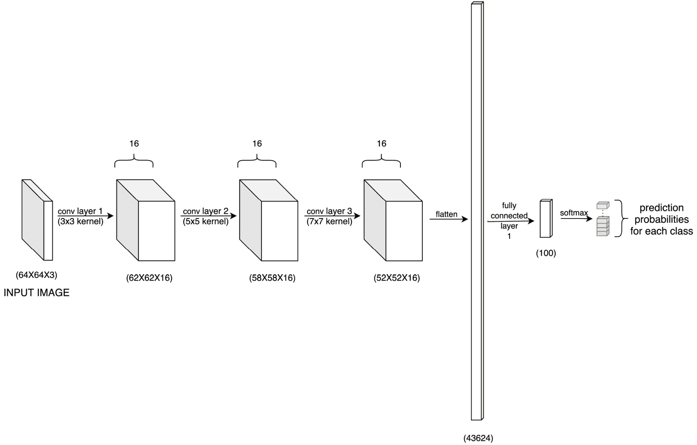

图 3.1-基于空间探索的 CNN

*   **基于深度的 CNN**:这里的**深度**是指神经网络的深度，即层数。因此，这里的想法是创建一个具有多个卷积层的 CNN 模型，以便提取高度复杂的视觉特征。下图显示了这种模型架构的一个示例:

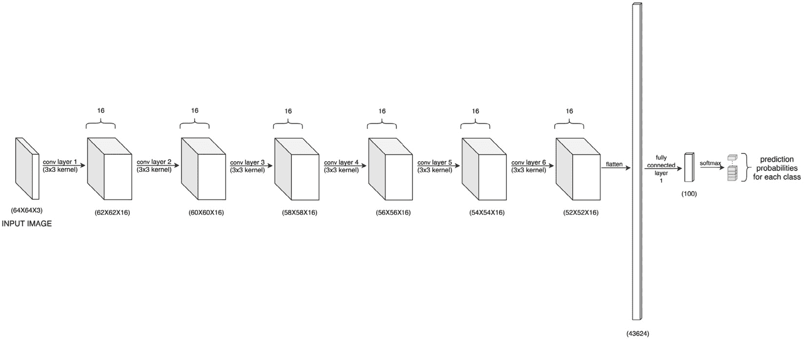

图 3.2-基于深度的 CNN

*   **基于宽度的 CNN**:**宽度**是指中的通道或特征图的数量，即数据或从数据中提取的特征。因此，基于宽度的 CNN 就是在从输入图层到输出图层的过程中增加要素地图的数量，如下图所示:

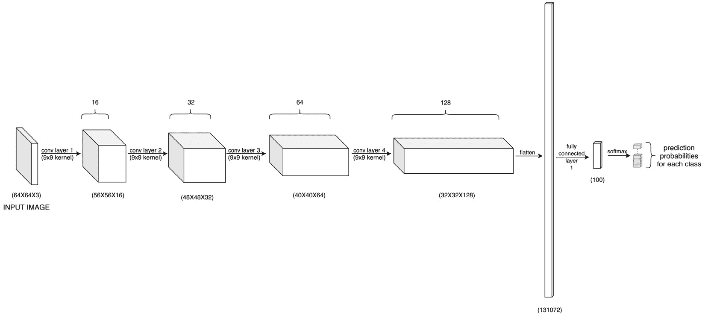

图 3.3–基于宽度的 CNN

*   **基于多路径的 CNN**:到目前为止，前面三类架构在层间连接上具有单调性，即直接连接只存在于连续的层间。**多路径 CNN**带来了在非连续层之间进行快捷连接或跳过连接的想法。下图显示了多路径 CNN 模型架构的示例:

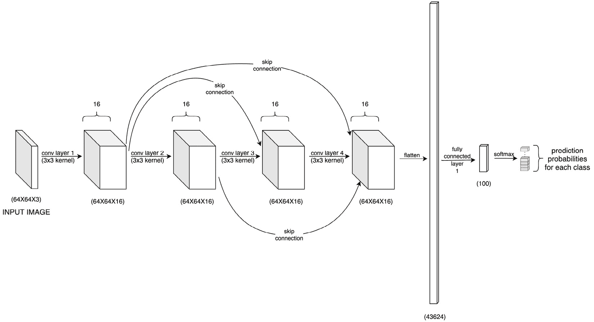

图 3.4–多路径 CNN

多路径架构的一个关键优势是，由于采用了跳跃连接，信息可以更好地在多个层之间流动。这反过来也让梯度流回到输入层而没有太多的耗散。

在查看了 CNN 模型中的不同架构设置之后，我们现在来看看 CNN 自首次使用以来是如何发展的。

# CNN 架构的演变

CNN 早在 1989 年就已经存在，当时 Yann LeCun 开发了第一个多层 CNN，叫做 **ConvNet** 。这个模型可以执行视觉认知任务，如识别手写数字。1998 年，LeCun 开发了一个改进的 ConvNet 模型，名为 **LeNet** 。由于 LeNet 在光学识别任务中的高准确性，它在发明后不久就被用于工业用途。从那以后，无论是在工业界还是学术界，CNN 都是最成功的机器学习模型之一。下图显示了 CNN 从 1989 年到 2020 年期间架构发展的简要时间表:

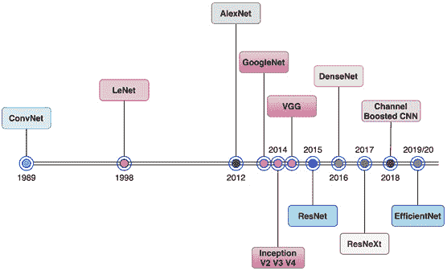

图 3.5——CNN 架构演变——概貌

正如我们所看到的，1998 年和 2012 年之间有很大的差距。这主要是因为没有足够大和合适的数据集来展示 CNN 的能力，尤其是深度 CNN。在当时现有的小数据集上，如 MNIST，经典的机器学习模型如支持向量机开始击败 CNN 的性能。在那些年里，CNN 有了一些发展。

设计 ReLU 激活函数是为了处理反向传播过程中的梯度爆炸和衰减问题。网络参数值的非随机初始化证明是至关重要的。最大池法是作为二次抽样的有效方法而发明的。GPU 在训练神经网络方面越来越受欢迎，尤其是大规模的 CNN。最后，也是最重要的一点，一个名为**ImageNet**([http://www.image-net.org/](http://www.image-net.org/))的大规模专用图像数据集由斯坦福大学的一个研究小组创建。到目前为止，这个数据集仍然是 CNN 模型的主要基准数据集之一。

随着这些年来所有这些发展的复合，在 2012 年，一种不同的架构设计带来了 CNN 在`ImageNet`数据集上性能的巨大改善。这个网络被称为 **AlexNet** (以创建者 Alex Krizhevsky 命名)。AlexNet 具有各种新颖的方面，如随机裁剪和预训练，确立了统一和模块化卷积层设计的趋势。通过重复堆叠这种模块(卷积层)，统一和模块化的层结构向前发展，产生了非常深的 CNN，也称为 **VGGs** 。

将卷积层的块/模块分支并将这些分支的块堆叠在彼此之上的另一种方法被证明对于定制的视觉任务极其有效。这个网络被称为**谷歌网**(因为它是在谷歌开发的)或**盗梦空间 v1** (盗梦空间是这些分支块的术语)。随之而来的还有 **VGG** 和**盗梦空间**网络的几个变种，比如 **VGG16** 、 **VGG19** 、**盗梦空间 v2** 、**盗梦空间 v3** 和等等。

开发的下一个阶段从**跳过连接**开始。为了解决在训练CNN 时的梯度衰减问题，非连续层通过跳跃连接来连接，以免信息因小梯度而在它们之间消散。伴随这一技巧出现的一种流行的网络类型是 **ResNet** ，以及其他新颖的特性，比如批处理规范化。

ResNet 的一个逻辑扩展是 **DenseNet** ，其中各层彼此紧密相连，也就是说，每一层都从所有先前层的输出要素地图获得输入。此外，混合架构是通过混合过去的成功架构开发的，例如 **Inception-ResNet** 和 **ResNeXt** ，其中块内的并行分支数量增加。

最近，**频道增强**技术被证明在改善 CNN 性能方面是有用的。这里的想法是通过迁移学习来学习新的特征和利用预先学习的特征。最近，自动设计新块并找到最佳 CNN 架构已经成为 CNN 研究中一个日益增长的趋势。这种 CNN 的例子有 **MnasNets** 和 **EfficientNets** 。这些模型背后的方法是执行神经架构搜索，以使用统一的模型缩放方法推导出最佳 CNN 架构。

在下一节中，我们将回顾最早的 CNN 模型之一，并仔细研究此后开发的各种 CNN 架构。我们将使用 PyTorch 构建这些架构，在真实数据集上训练一些模型。我们还将探索 PyTorch 的预先训练的 CNN 模型库，通常被称为**模型动物园**。我们将学习如何微调这些预先训练好的模型，并对它们进行预测。

# 从零开始开发 LeNet

LeNet，原名 **LeNet-5** ，是 CNN 最早的机型之一，开发于 1998 年。LeNet-5 中的数字 *5* 代表该模型中的*总层数*，即两个卷积层和三个全连接层。该模型总共有大约 60，000 个参数，在 1998 年对手写数字图像的图像识别任务中提供了最先进的性能。正如 CNN 模型所预期的那样，LeNet 展示了旋转、位置和比例不变性，以及对图像失真的鲁棒性。与当时的经典机器学习模型(如分别处理图像每个像素的支持向量机)相反，LeNet 利用了相邻像素之间的相关性。

请注意，虽然 LeNet 是为手写数字识别开发的，但它当然可以扩展到其他图像分类任务，我们将在下一个练习中看到这一点。下图显示了 LeNet 模型的架构:

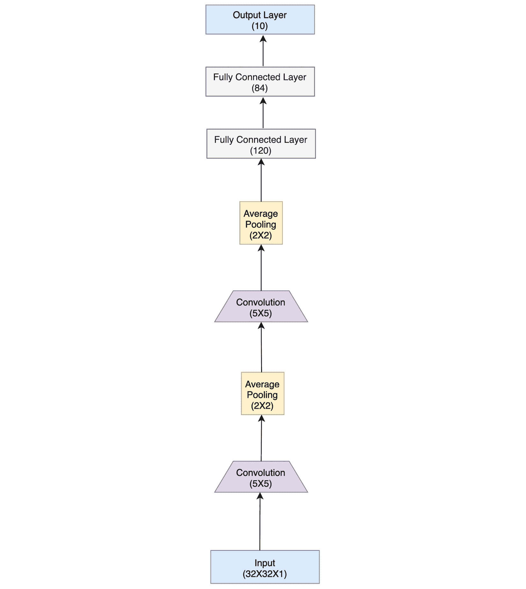

图 3.6–LeNet 架构

如前所述，有两个卷积层，后面是三个全连接层(包括输出层)。这种堆叠卷积层然后是全连接层的方法后来成为 CNN 研究的趋势，并且仍然应用于最新的 CNN 模型。除了这些层之外，中间还有池层。这些基本上是减少图像表示的空间大小的子采样层，从而减少参数和计算的数量。LeNet 中使用的池层是具有可训练权重的平均池层。不久之后， **max pooling** 成为 CNN 中最常用的池功能。

图中每层括号中的数字表示维度(对于输入层、输出层和全连接层)或窗口大小(对于卷积层和池层)。灰度图像的预期输入大小为 32x32 像素。该图像然后由 5×5 卷积内核操作，接着是 2×2 池，等等。输出图层大小为 10，代表 10 个类别。

在本节中，我们将使用 PyTorch 从头开始构建 LeNet，并在图像数据集上对其进行训练和评估，以完成图像分类任务。我们将看到使用*图 3.6* 中的大纲在 PyTorch 中构建网络架构是多么简单和直观。

此外，我们将展示 LeNet 是如何有效，即使是在不同于最初开发它的数据集(即 MNIST)上，以及 PyTorch 如何使用几行代码训练和测试模型变得容易。

## 使用 PyTorch 构建 LeNet

观察建立模型的以下步骤:

1.  For this exercise, we will need to import a few dependencies. Execute the following `import` statements:

    ```py
    import numpy as np
    import matplotlib.pyplot as plt
    import torch
    import torchvision
    import torch.nn as nn
    import torch.nn.functional as F
    import torchvision.transforms as transforms
    torch.manual_seed(55)
    ```

    在这里，我们导入练习所需的所有`torch`模块。我们还导入了`numpy`和`matplotlib`来显示练习中的图像。除了导入之外，我们还设置了随机种子，以确保此练习的可重复性。

2.  Next, we will define the model architecture based on the outline given in *Figure 3.6*:

    ```py
    class LeNet(nn.Module):
        def __init__(self):
            super(LeNet, self).__init__()
            # 3 input image channel, 6 output feature maps and 5x5 conv kernel
            self.cn1 = nn.Conv2d(3, 6, 5)
            # 6 input image channel, 16 output feature maps and 5x5 conv kernel
            self.cn2 = nn.Conv2d(6, 16, 5)
            # fully connected layers of size 120, 84 and 10
            self.fc1 = nn.Linear(16 * 5 * 5, 120)  # 5*5 is the spatial dimension at this layer
            self.fc2 = nn.Linear(120, 84)
            self.fc3 = nn.Linear(84, 10)
        def forward(self, x):
            # Convolution with 5x5 kernel
            x = F.relu(self.cn1(x))
            # Max pooling over a (2, 2) window
            x = F.max_pool2d(x, (2, 2))
            # Convolution with 5x5 kernel
            x = F.relu(self.cn2(x))
            # Max pooling over a (2, 2) window
            x = F.max_pool2d(x, (2, 2))
            # Flatten spatial and depth dimensions into a single vector
            x = x.view(-1, self.flattened_features(x))
            # Fully connected operations
            x = F.relu(self.fc1(x))
            x = F.relu(self.fc2(x))
            x = self.fc3(x)
            return x
        def flattened_features(self, x):
            # all except the first (batch) dimension
            size = x.size()[1:]  
            num_feats = 1
            for s in size:
                num_feats *= s
            return num_feats
    lenet = LeNet()
    print(lenet)
    ```

    在的最后两行，我们实例化了模型并打印了网络架构。输出如下所示:

    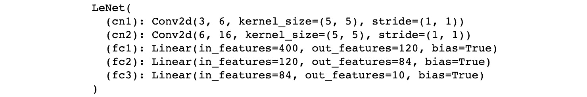

    图 3.7–LeNet py torch 模型对象

    有常用的`__init__`和`forward`方法分别用于架构定义和运行正向传递。附加的`flattened_features`方法旨在计算图像表示层中的要素总数(通常是卷积层或池层的输出)。此方法有助于将要素的空间表示展平为一个数字矢量，然后用作完全连接图层的输入。

    除了前面提到的架构的细节，ReLU 在整个网络中被用作激活功能。此外，与接受单通道图像的原始 LeNet 网络相反，当前模型被修改为接受 RGB 图像，即三个通道作为输入。这样做是为了适应用于本练习的数据集。

3.  We then define the training routine, that is, the actual backpropagation step:

    ```py
    def train(net, trainloader, optim, epoch):
        # initialize loss
        loss_total = 0.0
         for i, data in enumerate(trainloader, 0):
            # get the inputs; data is a list of [inputs, labels]
            # ip refers to the input images, and ground_truth refers to the output classes the images belong to
            ip, ground_truth = data
            # zero the parameter gradients
            optim.zero_grad()
            # forward-pass + backward-pass + optimization -step
            op = net(ip)
            loss = nn.CrossEntropyLoss()(op, ground_truth)
            loss.backward()
            optim.step()
            # update loss
            loss_total += loss.item()
             # print loss statistics
            if (i+1) % 1000 == 0:    # print at the interval of 1000 mini-batches
                print('[Epoch number : %d, Mini-batches: %5d] loss: %.3f' % (epoch + 1, i + 1, loss_total / 200))
                loss_total = 0.0
    ```

    对于每个时期，该函数遍历整个训练数据集，通过网络运行正向传递，并使用反向传播，基于指定优化器的更新模型的参数。在迭代训练数据集的每 1，000 个小批量之后，该方法还记录计算的损失。

4.  Similar to the training routine, we will define the test routine that we will use to evaluate model performance:

    ```py
    def test(net, testloader):
        success = 0
        counter = 0
        with torch.no_grad():
            for data in testloader:
                im, ground_truth = data
                op = net(im)
                _, pred = torch.max(op.data, 1)
                counter += ground_truth.size(0)
                success += (pred == ground_truth).sum().item()
        print('LeNet accuracy on 10000 images from test dataset: %d %%' % (100 * success / counter))
    ```

    该函数对每个测试集图像的模型进行正向传递，计算正确的预测数，并打印测试集上正确预测的百分比。

5.  Before we get on to training the model, we need to load the dataset. For this exercise, we will be using the `CIFAR-10` dataset.

    数据集引用

    从微小的图像中学习多层特征

    该数据集由 60，000 张 32x32 的 RGB 图像组成，标记了 10 个类别，每个类别有 6，000 张图像。这 60，000 幅图像被分成 50，000 幅训练图像和 10，000 幅测试图像。更多详情可点击此处:[https://www.cs.toronto.edu/~kriz/cifar.html](https://www.cs.toronto.edu/~kriz/cifar.html)。Torch 支持`torchvision.datasets`模块下的`CIFAR`数据集。我们将使用该模块直接加载数据，并实例化训练和测试数据加载器，如以下代码所示:

    ```py
    # The mean and std are kept as 0.5 for normalizing pixel values as the pixel values are originally in the range 0 to 1 
    train_transform = transforms.Compose([transforms.RandomHorizontalFlip(),
    transforms.RandomCrop(32, 4),
    transforms.ToTensor(),
    transforms.Normalize((0.5, 0.5, 0.5), (0.5, 0.5, 0.5))])
    trainset = torchvision.datasets.CIFAR10(root='./data', train=True, download=True, transform=train_transform)
    trainloader = torch.utils.data.DataLoader(trainset, batch_size=8, shuffle=True, num_workers=1)
    test_transform = transforms.Compose([transforms.ToTensor(), transforms.Normalize((0.5, 0.5, 0.5), (0.5, 0.5, 0.5))])
    testset = torchvision.datasets.CIFAR10(root='./data', train=False, download=True, transform=test_transform)
    testloader = torch.utils.data.DataLoader(testset, batch_size=10000, shuffle=False, num_workers=2)
    # ordering is important
    classes = ('plane', 'car', 'bird', 'cat', 'deer', 'dog', 'frog', 'horse', 'ship', 'truck')
    ```

    注意

    在前一章中，我们手动下载了数据集，并编写了一个自定义数据集类和一个`dataloader`函数。由于有了`torchvision.datasets`模块，我们不需要在这里写这些。

    因为我们将`download`标志设置为`True`，数据集将被本地下载。然后，我们将看到以下对话框:

    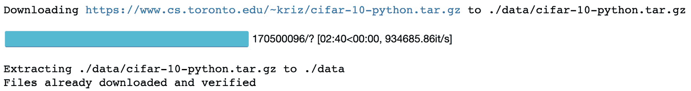

    图 3.8–CIFAR-10 数据集下载

    用于训练和测试数据集的转换是不同的，因为我们对训练数据集应用了一些数据扩充，例如翻转和裁剪，这些不适用于测试数据集。此外，在定义了`trainloader`和`testloader`之后，我们以预定义的顺序声明了这个数据集中的 10 个类。

6.  After loading the datasets, let's investigate how the data looks:

    ```py
    # define a function that displays an image
    def imageshow(image):
        # un-normalize the image
        image = img/2 + 0.5     
        npimage = image.numpy()
        plt.imshow(np.transpose(npimage, (1, 2, 0)))
        plt.show()
    # sample images from training set
    dataiter = iter(trainloader)
    images, labels = dataiter.next()
    # display images in a grid
    num_images = 4
    imageshow(torchvision.utils.make_grid(images[:num_images]))
    # print labels
    print('    '+'  ||  '.join(classes[labels[j]] for j in range(num_images)))
    ```

    前面的代码向我们展示了来自训练数据集中的四个样本图像及其各自的标签。输出如下所示:

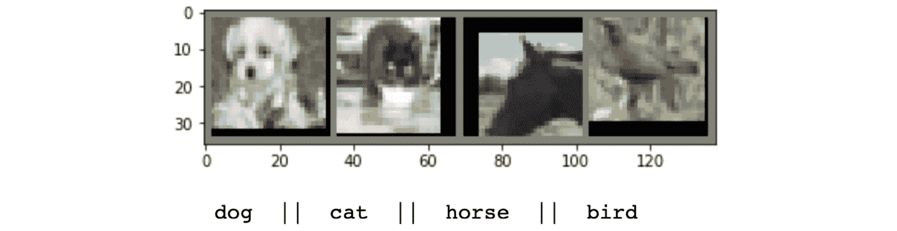

图 3.9–CIFAR-10 数据集样本

前面的输出向我们展示了四幅彩色图像，其中的大小为 32×32 像素。这四个图像属于四个不同的标签，如图像后面的文本所示。

我们现在将训练 LeNet 模型。

## 培训网络

现在我们准备训练模型。让我们借助以下步骤来实现这一点:

1.  We will define `optimizer` and start the training loop as shown here:

    ```py
    # define optimizer
    optim = torch.optim.Adam(lenet.parameters(), lr=0.001)
    # training loop over the dataset multiple times
    for epoch in range(50):  
        train(lenet, trainloader, optim, epoch)
        print()
        test(lenet, testloader)
        print()
    print('Finished Training')
    ```

    输出将如下所示:

    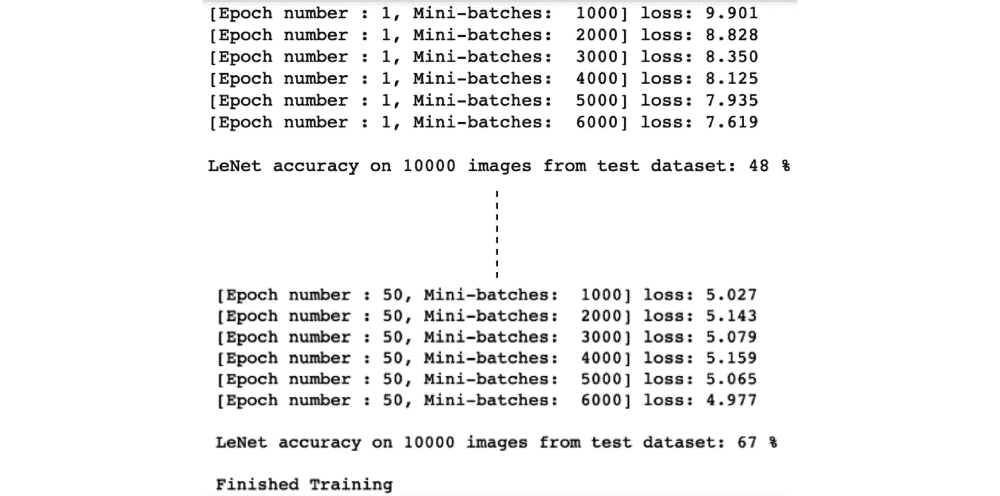

    图 3.10–培训网络

2.  训练完成后，我们可以在本地保存模型文件:

    ```py
    model_path = './cifar_model.pth'
    torch.save(lenet.state_dict(), model_path)
    ```

训练完 LeNet 模型后，我们将在下一节的测试数据集上测试它的性能。

## 测试 LeNet

测试 LeNet 模型需要遵循以下步骤:

1.  Let's make predictions by loading the saved model and running it on the test dataset:

    ```py
    # load test dataset images
    d_iter = iter(testloader)
    im, ground_truth = d_iter.next()
    # print images and ground truth
    imageshow(torchvision.utils.make_grid(im[:4]))
    print('Label:      ', ' '.join('%5s' % classes[ground_truth[j]] for j in range(4)))
    # load model
    lenet_cached = LeNet()
    lenet_cached.load_state_dict(torch.load(model_path))
    # model inference
    op = lenet_cached(im)
    # print predictions
    _, pred = torch.max(op, 1)
    print('Prediction: ', ' '.join('%5s' % classes[pred[j]] for j in range(4)))
    ```

    输出如下所示:

    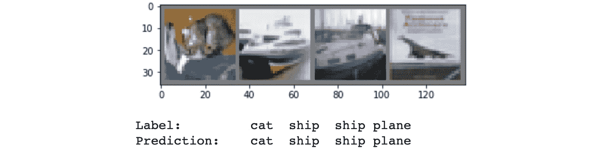

    图 3.11–LeNet 预测

    显然，这四个预测都是正确的。

2.  Finally, we will check the overall accuracy of this model on the test dataset as well as per class accuracy:

    ```py
    success = 0
    counter = 0
    with torch.no_grad():
        for data in testloader:
            im, ground_truth = data
            op = lenet_cached(im)
            _, pred = torch.max(op.data, 1)
            counter += ground_truth.size(0)
            success += (pred == ground_truth).sum().item()
    print('Model accuracy on 10000 images from test dataset: %d %%' % (
        100 * success / counter))
    ```

    输出如下所示:

    

    图 3.12–LeNet 总体精度

3.  For per class accuracy, the code is as follows:

    ```py
    class_sucess = list(0\. for i in range(10))
    class_counter = list(0\. for i in range(10))
    with torch.no_grad():
        for data in testloader:
            im, ground_truth = data
            op = lenet_cached(im)
            _, pred = torch.max(op, 1)
            c = (pred == ground_truth).squeeze()
            for i in range(10000):
                ground_truth_curr = ground_truth[i]
                class_sucess[ground_truth_curr] += c[i].item()
                class_counter[ground_truth_curr] += 1
    for i in range(10):
        print('Model accuracy for class %5s : %2d %%' % (
            classes[i], 100 * class_sucess[i] / class_counter[i]))
    ```

    输出如下所示:

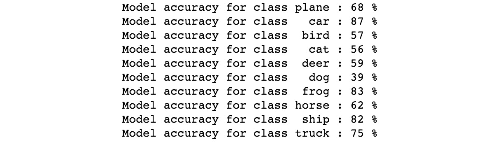

图 3.13–每级精度的 LeNet

有些班级比其他班级表现更好。总体而言，该模型远非完美(即，100%的准确性)，但比随机预测的模型好得多，后者的准确性为 10%(由于 10 个类别)。

我们已经从头开始构建了 LeNet 模型，并使用 PyTorch 评估了它的性能，现在我们将继续讨论 LeNet 的继任者—**Alex net**。对于 LeNet，我们从头开始构建模型，训练并测试它。对于 AlexNet，我们将使用预训练的模型，在较小的数据集上对其进行微调，并进行测试。

# 微调 AlexNet 模型

在这一节中，我们将首先快速浏览一下 AlexNet 架构，以及如何使用 PyTorch 构建一个。然后，我们将探索 PyTorch 的预训练 CNN 模型库，最后，使用预训练的 AlexNet 模型对图像分类任务进行微调，并进行预测。

AlexNet 是 LeNet 的继任者，在架构上有增量变化，例如 8 层(5 个卷积层和 3 个全连接层)而不是 5 层，6000 万个模型参数而不是 6 万个，以及使用`MaxPool`而不是`AvgPool`。此外，AlexNet 是在一个更大的数据集上进行训练和测试的——ImageNet，其大小超过 100 GB，而不是 MNIST 数据集(LeNet 是在其上训练的),其大小为几兆字节。AlexNet 真正彻底改变了 CNN，因为它是一种比其他经典机器学习模型(如支持向量机)更强大的图像相关任务模型。*图 3.14* 显示了 AlexNet 架构:

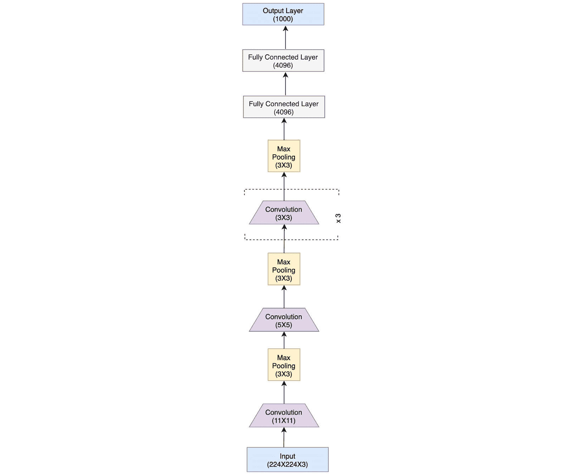

图 3.14–Alex net 架构

正如我们所见，该架构遵循 LeNet 的共同主题，即卷积层按顺序堆叠，然后是一系列朝向输出端的全连接层。PyTorch 使得将这样的模型架构转换成实际代码变得很容易。这可以在下面的 PyTorch 代码等效架构中看到:

```py
class AlexNet(nn.Module):
```

```py
    def __init__(self, number_of_classes):
```

```py
        super(AlexNet, self).__init__()
```

```py
        self.feats = nn.Sequential(
```

```py
            nn.Conv2d(in_channels=3, out_channels=64, kernel_size=11, stride=4, padding=5),
```

```py
            nn.ReLU(),
```

```py
            nn.MaxPool2d(kernel_size=2, stride=2),
```

```py
            nn.Conv2d(in_channels=64, out_channels=192, kernel_size=5, padding=2),
```

```py
            nn.ReLU(),
```

```py
            nn.MaxPool2d(kernel_size=2, stride=2),
```

```py
            nn.Conv2d(in_channels=192, out_channels=384, kernel_size=3, padding=1),
```

```py
            nn.ReLU(),
```

```py
            nn.Conv2d(in_channels=384, out_channels=256, kernel_size=3, padding=1),
```

```py
            nn.ReLU(),
```

```py
            nn.Conv2d(in_channels=256, out_channels=256, kernel_size=3, padding=1),
```

```py
            nn.ReLU(),
```

```py
            nn.MaxPool2d(kernel_size=2, stride=2),
```

```py
        )
```

```py
        self.clf = nn.Linear(in_features=256, out_features=number_of_classes)
```

```py
    def forward(self, inp):
```

```py
        op = self.feats(inp)
```

```py
        op = op.view(op.size(0), -1)
```

```py
        op = self.clf(op)
```

```py
        return op
```

代码是不言自明的，其中`__init__`函数包含整个分层结构的初始化，包括卷积层、池层和全连接层，以及 ReLU 激活。`forward`函数只是通过这个初始化的网络运行一个数据点 *x* 。请注意，`forward`方法的第二行已经执行了展平操作，所以我们不需要像对 LeNet 那样单独定义那个函数。

但是除了初始化模型架构并自己训练它的选项之外，PyTorch 及其`torchvision`包还提供了一个`models`子包，它包含了用于解决不同任务的 CNN 模型的定义，例如图像分类、语义分割、对象检测等等。以下是可用于图像分类任务的模型列表(来源:【https://pytorch.org/docs/stable/torchvision/models.html】T4):

*   AlexNet
*   VGG
*   ResNet
*   斯奎泽尼
*   DenseNet
*   盗梦空间 v3
*   谷歌网
*   ShuffleNet v2
*   MobileNet v2
*   ResNeXt
*   Wide ResNet
*   MNASNet

在下一节中，我们将使用一个预训练的 AlexNet 模型作为例子，并以练习的形式演示如何使用 PyTorch 对其进行微调。

## 使用 PyTorch 对 AlexNet 进行微调

在下面的练习中，我们将加载一个预训练的 AlexNet 模型，并在不同于 ImageNet 的图像分类数据集上对其进行微调(最初是在 ImageNet 上训练的)。最后，我们将测试微调后的模型的性能，看看它是否可以从新数据集进行迁移学习。练习中的部分代码为了可读性进行了剪裁，但您可以在这里找到完整的代码:https://github . com/packt publishing/Mastering-py torch/blob/master/chapter 03/transfer _ learning _ Alex net . ipynb。

在本练习中，我们需要导入一些依赖项。执行以下`import`语句:

```py
import os
```

```py
import time
```

```py
import copy
```

```py
import numpy as np
```

```py
import matplotlib.pyplot as plt
```

```py
import torch
```

```py
import torchvision
```

```py
import torch.nn as nn
```

```py
import torch.optim as optim
```

```py
from torch.optim import lr_scheduler
```

```py
from torchvision import datasets, models, transforms
```

```py
torch.manual_seed(0)
```

接下来，我们将下载并转换数据集。对于这个微调练习，我们将使用蜜蜂和蚂蚁的一个小图像数据集。有 240 幅训练图像和 150 幅验证图像在两个类别(蜜蜂和蚂蚁)之间平均分配。

我们从[https://www.kaggle.com/ajayrana/hymenoptera-data](https://www.kaggle.com/ajayrana/hymenoptera-data)下载数据集，并将其存储在当前工作目录中。关于数据集的更多信息可以在 https://hymenoptera.elsiklab.missouri.edu/的[找到。](https://hymenoptera.elsiklab.missouri.edu/)

数据集引用

埃尔西克 CG，塔亚尔 A，迪什厘米，乌尼博士，金刚砂毫升，阮 HN，哈根德。膜翅目基因组数据库:在膜翅目中整合基因组注释。核酸研究 2016 年 1 月 4 日；44(D1):D793-800。doi: 10.1093/nar/gkv1208。Epub 2015 年 11 月 17 日。考研 PMID: 26578564。

为了下载数据集，您需要登录 Kaggle。如果您还没有 Kaggle 帐户，您需要注册:

```py
ddir = 'hymenoptera_data'
```

```py
# Data normalization and augmentation transformations for train dataset
```

```py
# Only normalization transformation for validation dataset
```

```py
# The mean and std for normalization are calculated as the mean of all pixel values for all images in the training set per each image channel - R, G and B
```

```py
data_transformers = {
```

```py
    'train': transforms.Compose([transforms.RandomResizedCrop(224), transforms.RandomHorizontalFlip(),
```

```py
                                    transforms.ToTensor(), 
```

```py
                                    transforms.Normalize([0.490, 0.449, 0.411], [0.231, 0.221, 0.230])]),
```

```py
    'val': transforms.Compose([transforms.Resize(256), transforms.CenterCrop(224), transforms.ToTensor(), transforms.Normalize([0.490, 0.449, 0.411], [0.231, 0.221, 0.230])])}
```

```py
img_data = {k: datasets.ImageFolder(os.path.join(ddir, k), data_transformers[k]) for k in ['train', 'val']}
```

```py
dloaders = {k: torch.utils.data.DataLoader(img_data[k], batch_size=8, shuffle=True, num_workers=0) 
```

```py
            for k in ['train', 'val']}
```

```py
dset_sizes = {x: len(img_data[x]) for x in ['train', 'val']}
```

```py
classes = img_data['train'].classes
```

```py
dvc = torch.device("cuda:0" if torch.cuda.is_available() else "cpu")
```

既然我们已经完成了先决条件，让我们开始吧:

1.  Let's visualize some sample training dataset images:

    ```py
    def imageshow(img, text=None):
        img = img.numpy().transpose((1, 2, 0))
        avg = np.array([0.490, 0.449, 0.411])
        stddev = np.array([0.231, 0.221, 0.230])
        img = stddev * img + avg
        img = np.clip(img, 0, 1)
        plt.imshow(img)
        if text is not None:
            plt.title(text)
    # Generate one train dataset batch
    imgs, cls = next(iter(dloaders['train']))
    # Generate a grid from batch
    grid = torchvision.utils.make_grid(imgs)
    imageshow(grid, text=[classes[c] for c in cls])
    ```

    输出如下所示:

    

    图 3.15–蜜蜂与蚂蚁数据集

2.  We now define the fine-tuning routine, which is essentially a training routine performed on a pre-trained model:

    ```py
    def finetune_model(pretrained_model, loss_func, optim, epochs=10):
        ...
        for e in range(epochs):
            for dset in ['train', 'val']:
                if dset == 'train':
                    pretrained_model.train()  # set model to train mode (i.e. trainbale weights)
                else:
                    pretrained_model.eval()   # set model to validation mode
                # iterate over the (training/validation) data.
                for imgs, tgts in dloaders[dset]:
                    ...
                    optim.zero_grad()
                    with torch.set_grad_enabled(dset == 'train'):
                        ops = pretrained_model(imgs)
                        _, preds = torch.max(ops, 1)
                        loss_curr = loss_func(ops, tgts)
                        # backward pass only if in training mode
                        if dset == 'train':
                            loss_curr.backward()
                            optim.step()
                    loss += loss_curr.item() * imgs.size(0)
                    successes += torch.sum(preds == tgts.data)
                loss_epoch = loss / dset_sizes[dset]
                accuracy_epoch = successes.double() / dset_sizes[dset]
                if dset == 'val' and accuracy_epoch > accuracy:
                    accuracy = accuracy_epoch
                    model_weights = copy.deepcopy(pretrained_model.state_dict())
        # load the best model version (weights)
        pretrained_model.load_state_dict(model_weights)
        return pretrained_model
    ```

    在这个函数中，我们需要预训练的模型(即架构和权重)作为输入，以及损失函数、优化器和时期数。基本上，我们不是从随机初始化权重开始，而是从 AlexNet 预训练的权重开始。该函数的其他部分与我们之前的练习非常相似。

3.  在开始微调(训练)模型之前，我们将定义一个函数来可视化模型预测:

    ```py
    def visualize_predictions(pretrained_model, max_num_imgs=4):
        was_model_training = pretrained_model.training
        pretrained_model.eval()
        imgs_counter = 0
        fig = plt.figure()
        with torch.no_grad():
            for i, (imgs, tgts) in enumerate(dloaders['val']):
                imgs = imgs.to(dvc)
                tgts = tgts.to(dvc)
                ops = pretrained_model(imgs)
                _, preds = torch.max(ops, 1)
                 for j in range(imgs.size()[0]):
                    imgs_counter += 1
                    ax = plt.subplot(max_num_imgs//2, 2, imgs_counter)
                    ax.axis('off')
                    ax.set_title(f'Prediction: {class_names[preds[j]]}, Ground Truth: {class_names[tgts[j]]}')
                    imshow(inputs.cpu().data[j])
                    if imgs_counter == max_num_imgs:
     pretrained_model.train(mode=was_training)
                        return
            model.train(mode=was_training)
    ```

4.  Finally, we get to the interesting part. Let's use PyTorch's `torchvision.models` sub-package to load the pre-trained AlexNet model:

    ```py
    model_finetune = models.alexnet(pretrained=True) 
    ```

    这个模型对象有以下两个主要组件:

    i) `features`:特征提取组件，包含所有卷积层和池层

    ii) `classifier`:分类器块，包含通向输出层的所有完全连接的层

5.  We can visualize these components as shown here:

    ```py
    print(model_finetune.features)
    ```

    这将输出以下内容:

    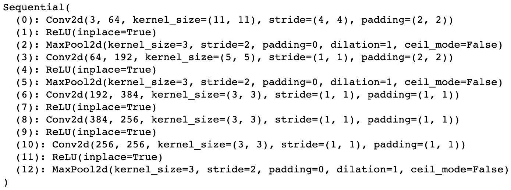

    图 3.16–Alex net 特征提取器

6.  Now, we will run the `classifier` feature as follows:

    ```py
    print(model_finetune.classifier)
    ```

    此应输出以下内容:

    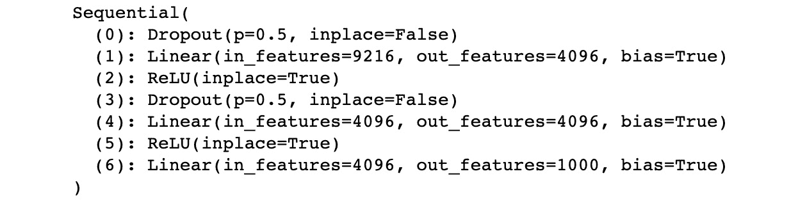

    图 3.17–Alex net 分类器

7.  您可能已经注意到，预训练模型具有大小为`1000`的输出层，但是在我们的微调数据集中只有`2`个类。因此，我们将改变这一点，如下所示:

    ```py
    # change the last layer from 1000 classes to 2 classes
    model_finetune.classifier[6] = nn.Linear(4096, len(classes))
    ```

8.  And now, we are all set to define the optimizer and loss function, and thereafter run the training routine as follows:

    ```py
    loss_func = nn.CrossEntropyLoss()
    optim_finetune = optim.SGD(model_finetune.parameters(), lr=0.0001)
    # train (fine-tune) and validate the model
    model_finetune = finetune_model(model_finetune, loss_func, optim_finetune, epochs=10)
    ```

    输出如下:

    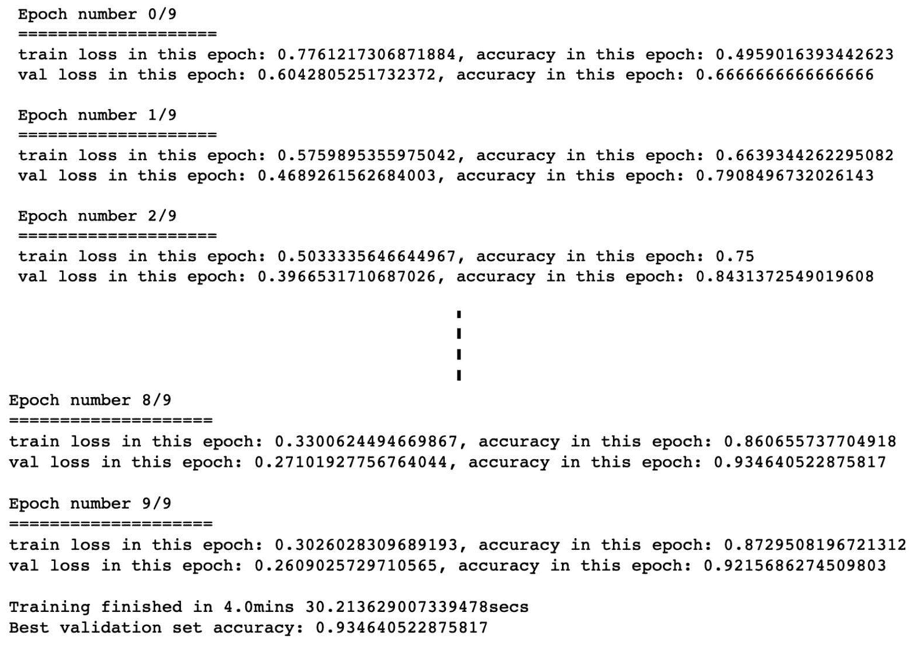

    图 3.18–Alex net 微调循环

9.  Let's visualize some of the model predictions to see whether the model has indeed learned the relevant features from this small dataset:

    ```py
    visualize_predictions(model_finetune)
    ```

    这将输出以下内容:

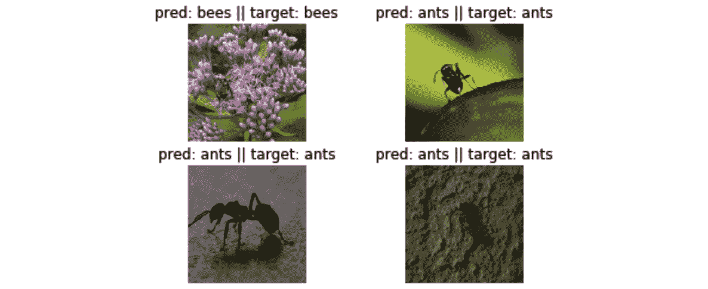

图 3.19–Alex net 预测

显然，预训练的 AlexNet 模型已经能够在这个非常小的图像分类数据集上进行迁移学习。这既展示了迁移学习的力量，也展示了我们使用 PyTorch 微调众所周知的模型的速度和简易性。

在下一节中，我们将讨论 AlexNet 的一个更深更复杂的后继者——VGG 网络。我们已经为 LeNet 和 AlexNet 详细演示了模型定义、数据集加载、模型训练(或微调)和评估步骤。在随后的章节中，我们将主要关注模型架构定义，因为其他方面(比如数据加载和评估)的 PyTorch 代码也是类似的。

# 运行预先训练好的 VGG 模型

我们已经讨论了 LeNet 和 AlexNet，这两个 CNN 的基础架构。随着本章的进展，我们将探索越来越复杂的 CNN 模型。但是，构建这些模型架构的关键原则是相同的。我们将看到一种模块化模型构建方法，将卷积层、池层和全连接层放在一起形成块/模块，然后按顺序或分支方式堆叠这些块。在这一节中，我们来看看 AlexNet 的继任者——VGGNet。

VGG 这个名字来源于牛津大学视觉几何小组，这个模型就是在这里发明的。相比于 AlexNet 的 8 层和 6000 万个参数，VGG 由 13 层(10 个卷积层和 3 个全连通层)和 1.38 亿个参数组成。VGG 基本上是在 AlexNet 架构上堆叠更多层，使用更小尺寸的卷积内核(2x2 或 3x3)。因此，VGG 的新颖之处在于其建筑所带来的前所未有的深度。*图 3.20* 显示了 VGG 的建筑:

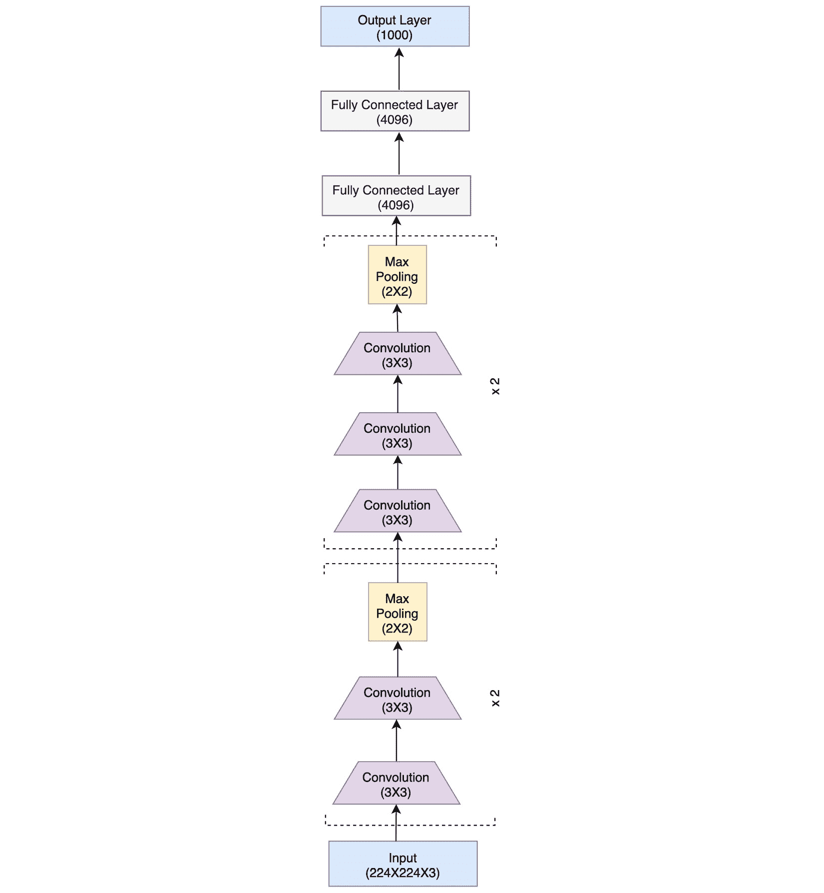

图 3.20–vgg 16 架构

前面的 VGG 架构被称为 **VGG13** ，因为有 13 层。其他变体是 VGG16 和 VGG19，分别由 16 层和 19 层的组成。还有另一组变体——**vgg 13 _ bn**、 **VGG16_bn** 和 **VGG19_bn** ，其中 **bn** 暗示这些模型也由**批规范化层**组成。

PyTorch 的`torchvision.model`子包提供了在 ImageNet 数据集上训练的预训练`VGG`模型(包含前面讨论的所有六种变体)。在下面的练习中，我们将使用预训练的`VGG13`模型对蜜蜂和蚂蚁的小数据集进行预测(在前面的练习中使用)。在这里，我们将重点关注关键的代码片段，因为我们代码的大多数其他部分将与前面的练习重叠。我们总是可以参考我们的笔记本来探索完整的代码:https://github . com/packt publishing/Mastering-py torch/blob/master/chapter 03/vgg 13 _ pre trained _ run _ inference . ipynb:

1.  首先，我们需要导入依赖项，包括`torchvision.models`。
2.  下载数据，设置 ant 和 bees 数据集和数据加载器，并进行转换。
3.  为了对这些图像进行预测，我们将需要 ImageNet 数据集的 1000 个标签，可以在这里找到:[https://gist.github.com/yrevar/942d3a0ac09ec9e5eb3a](https://gist.github.com/yrevar/942d3a0ac09ec9e5eb3a)。
4.  Once downloaded, we need to create a mapping between the class indices 0 to 999 and the corresponding class labels, as shown here:

    ```py
    import ast
    with open('./imagenet1000_clsidx_to_labels.txt') as f:
        classes_data = f.read()
    classes_dict = ast.literal_eval(classes_data)
    print({k: classes_dict[k] for k in list(classes_dict)[:5]})
    ```

    这将输出前五个类映射，如下面的屏幕截图所示:

    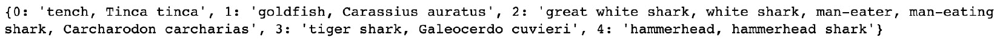

    图 3.21–ImageNet 类映射

5.  定义模型预测可视化函数，该函数接受预训练的模型对象和运行预测的图像数量。这个函数应该输出带有预测的图像。
6.  Load the pretrained `VGG13` model:

    ```py
    model_finetune = models.vgg13(pretrained=True)
    ```

    这将输出以下内容:

    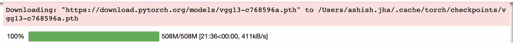

    图 3.22–加载 VGG13 模型

    508 MB `VGG13`型号在这一步下载。

7.  Finally, we run predictions on our ants and bees dataset using this pre-trained model:

    ```py
    visualize_predictions(model_finetune)
    ```

    这将输出以下内容:

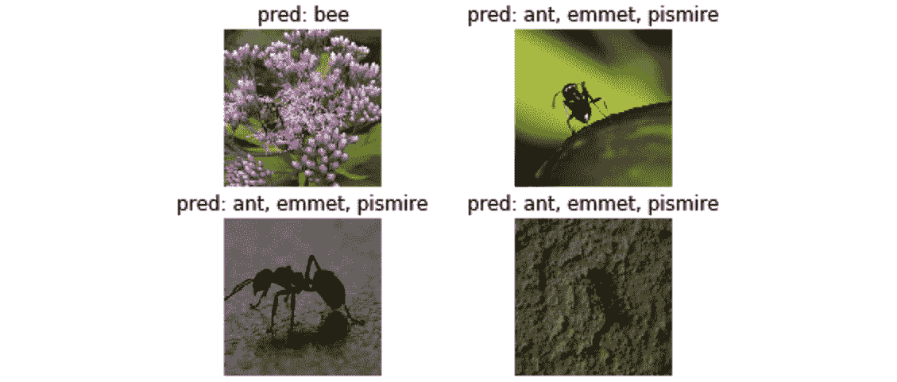

图 3.23–vgg 13 预测

在完全不同的数据集上训练的`VGG13`模型似乎正确地预测了蚂蚁和蜜蜂数据集中的所有测试样本。基本上，该模型从 1000 个类别的数据集中抓取两个最相似的动物，并在图像中找到它们。通过做这个练习，我们看到该模型仍然能够从图像中提取相关的视觉特征，并且该练习展示了 PyTorch 的开箱即用推理功能的效用。

在下一节中，我们将研究一种不同类型的 CNN 架构——它包含具有多个并行卷积层的模块。这些模块被称为**初始模块**，由此产生的网络被称为**初始网络**。我们将探索这个网络的各个部分及其成功背后的原因。我们还将使用 PyTorch 构建初始模块和初始网络架构。

# 探索 GoogLeNet 和 Inception v3

到目前为止，我们已经发现了 CNN 模型从 LeNet 到 VGG 的进展，我们已经观察到更多卷积和全连接层的顺序堆叠。这导致了需要训练大量参数的深层网络。 *GoogLeNet* 作为一种完全不同类型的 CNN 架构出现，它由一个称为初始模块的并行卷积层模块组成。正因为如此，GoogLeNet 也被称为 **Inception v1** (v1 标志着第一个版本，因为后来出现了更多版本)。GoogLeNet 中引入的一些全新元素如下:

*   **初始模块**——几个并行卷积层的模块
*   使用 **1x1 卷积**来减少模型参数的数量
*   **全局平均池**代替全连接层的——减少过度拟合
*   使用**辅助分类器**进行训练——用于正则化和梯度稳定

GoogLeNet 有 22 层，比任何 VGG 模型变体的层数都多。然而，由于使用了一些优化技巧，GoogLeNet 中的参数数量为 500 万，远远少于 VGG 的 1.38 亿个参数。让我们详细介绍一下该模型的一些关键特性。

## 初始模块

也许这个模型最重要的贡献是开发了一个卷积模块，它具有几个并行运行的卷积层，这些卷积层最终连接在一起产生一个输出向量。这些并行卷积层以从 1x1 到 3x3 到 5x5 的不同内核大小运行。这个想法是从图像中提取所有层次的视觉信息。除了这些卷积，3x3 最大池层增加了另一个级别的特征提取。*图 3.24* 显示了初始框图以及整个 GoogLeNet 架构:

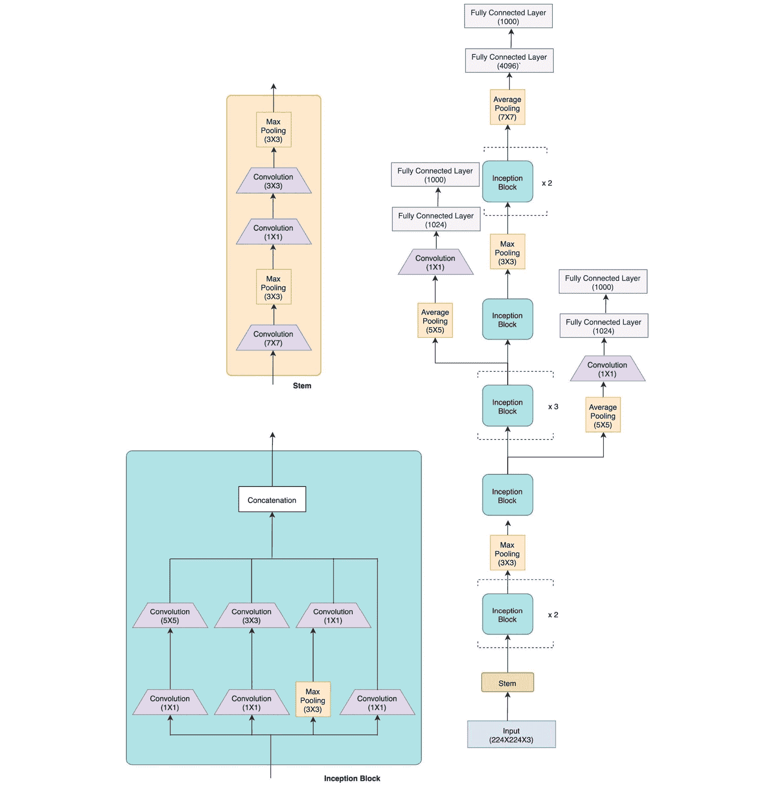

图 3.24–谷歌网络架构

通过使用这个架构图，我们可以在 PyTorch 中构建 inception 模块，如下所示:

```py
class InceptionModule(nn.Module):
```

```py
    def __init__(self, input_planes, n_channels1x1, n_channels3x3red, n_channels3x3, n_channels5x5red, n_channels5x5, pooling_planes):
```

```py
        super(InceptionModule, self).__init__()
```

```py
        # 1x1 convolution branch
```

```py
        self.block1 = nn.Sequential(
```

```py
            nn.Conv2d(input_planes, n_channels1x1, kernel_size=1),nn.BatchNorm2d(n_channels1x1),nn.ReLU(True),)
```

```py
        # 1x1 convolution -> 3x3 convolution branch
```

```py
        self.block2 = nn.Sequential(
```

```py
            nn.Conv2d(input_planes, n_channels3x3red, kernel_size=1),nn.BatchNorm2d(n_channels3x3red),
```

```py
            nn.ReLU(True),nn.Conv2d(n_channels3x3red, n_channels3x3, kernel_size=3, padding=1),nn.BatchNorm2d(n_channels3x3),nn.ReLU(True),)
```

```py
        # 1x1 conv -> 5x5 conv branch
```

```py
        self.block3 = nn.Sequential(
```

```py
            nn.Conv2d(input_planes, n_channels5x5red, kernel_size=1),nn.BatchNorm2d(n_channels5x5red),nn.ReLU(True),
```

```py
            nn.Conv2d(n_channels5x5red, n_channels5x5, kernel_size=3, padding=1),nn.BatchNorm2d(n_channels5x5),nn.ReLU(True),
```

```py
            nn.Conv2d(n_channels5x5, n_channels5x5, kernel_size=3, padding=1),nn.BatchNorm2d(n_channels5x5),
```

```py
            nn.ReLU(True),)
```

```py
        # 3x3 pool -> 1x1 conv branch
```

```py
        self.block4 = nn.Sequential(
```

```py
            nn.MaxPool2d(3, stride=1, padding=1),
```

```py
            nn.Conv2d(input_planes, pooling_planes, kernel_size=1),
```

```py
            nn.BatchNorm2d(pooling_planes),
```

```py
            nn.ReLU(True),)
```

```py
    def forward(self, ip):
```

```py
        op1 = self.block1(ip)
```

```py
        op2 = self.block2(ip)
```

```py
        op3 = self.block3(ip)
```

```py
        op4 = self.block4(ip)
```

```py
        return torch.cat([op1,op2,op3,op4], 1)
```

接下来，我们将看看Google net 的另一个重要特性——1x1 卷积。

## 1x1 盘旋

除了初始模块中的并行卷积层之外，每个并行层都有一个在前的 **1x1 卷积层**。使用这些 1x1 卷积层背后的原因是*降维*。1x1 卷积不会改变图像表示的宽度和高度，但可以改变图像表示的深度。此技巧用于在并行执行 1x1、3x3 和 5x5 卷积之前降低输入视觉特征的深度。减少参数的数量不仅有助于构建一个更轻的模型，还可以防止过度拟合。

## 全球平均池

如果我们在*图 3.24* 中查看整个 GoogLeNet 架构，模型的倒数第二个输出层之前是一个 7x7 平均池层。该层同样有助于减少模型的参数数量，从而减少过度拟合。如果没有这一层，由于全连接层的密集连接，模型将有数百万个附加参数。

## 辅助量词

*图 3.24* 还显示了模型中的两个额外或辅助输出分支。这些辅助分类器被认为是通过在反向传播期间增加梯度的大小来解决消失的梯度问题，特别是对于朝向输入端的层。因为这些模型有大量的层，消失的渐变会成为一个瓶颈。因此，使用辅助分类器已经被证明对于这个 22 层深度模型是有用的。此外，辅助分支也有助于正规化。请注意，在进行预测时，这些辅助分支被关闭/丢弃。

一旦我们有了使用 PyTorch 定义的 inception 模块，我们就可以很容易地实例化整个 Inception v1 模型，如下所示:

```py
class GoogLeNet(nn.Module):
```

```py
    def __init__(self):
```

```py
        super(GoogLeNet, self).__init__()
```

```py
        self.stem = nn.Sequential(
```

```py
            nn.Conv2d(3, 192, kernel_size=3, padding=1),
```

```py
            nn.BatchNorm2d(192),
```

```py
            nn.ReLU(True),)
```

```py
        self.im1 = InceptionModule(192,  64,  96, 128, 16, 32, 32)
```

```py
        self.im2 = InceptionModule(256, 128, 128, 192, 32, 96, 64)
```

```py
        self.max_pool = nn.MaxPool2d(3, stride=2, padding=1)
```

```py
        self.im3 = InceptionModule(480, 192,  96, 208, 16,  48,  64)
```

```py
        self.im4 = InceptionModule(512, 160, 112, 224, 24,  64,  64)
```

```py
        self.im5 = InceptionModule(512, 128, 128, 256, 24,  64,  64)
```

```py
        self.im6 = InceptionModule(512, 112, 144, 288, 32,  64,  64)
```

```py
        self.im7 = InceptionModule(528, 256, 160, 320, 32, 128, 128)
```

```py
        self.im8 = InceptionModule(832, 256, 160, 320, 32, 128, 128)
```

```py
        self.im9 = InceptionModule(832, 384, 192, 384, 48, 128, 128)
```

```py
        self.average_pool = nn.AvgPool2d(7, stride=1)
```

```py
        self.fc = nn.Linear(4096, 1000)
```

```py
    def forward(self, ip):
```

```py
        op = self.stem(ip)
```

```py
        out = self.im1(op)
```

```py
        out = self.im2(op)
```

```py
        op = self.maxpool(op)
```

```py
        op = self.a4(op)
```

```py
        op = self.b4(op)
```

```py
        op = self.c4(op)
```

```py
        op = self.d4(op)
```

```py
        op = self.e4(op)
```

```py
        op = self.max_pool(op)
```

```py
        op = self.a5(op)
```

```py
        op = self.b5(op)
```

```py
        op = self.avgerage_pool(op)
```

```py
        op = op.view(op.size(0), -1)
```

```py
        op = self.fc(op)
```

```py
        return op
```

除了实例化我们自己的模型之外，我们总是可以用两行代码加载一个预先训练好的 GoogLeNet:

```py
import torchvision.models as models
```

```py
model = models.googlenet(pretrained=True)
```

最后，如前所述，随后开发了许多版本的初始模型。其中最著名的是 Inception v3，我们接下来将简要讨论它。

## 盗梦空间第三版

Inception v1 的后继版本总共有 2400 万个参数，相比之下 v1 中有 500 万个。除了增加几层之外，这个模型还引入了不同种类的初始模块，这些模块是按顺序堆叠的。*图 3.25* 显示了不同的初始模块和完整的模型架构:

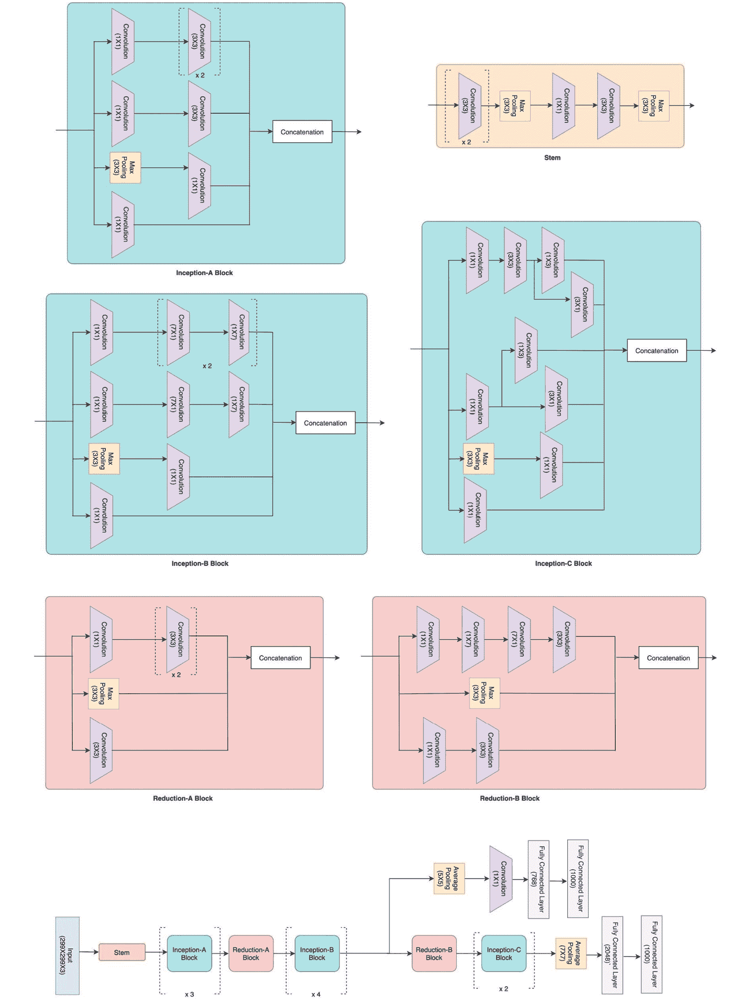

图 3.25–初始版本 3 架构

从架构上可以看出，这个模型是 Inception v1 模型的架构扩展。同样，除了手动构建模型之外，我们还可以使用 PyTorch 存储库中预先训练好的模型，如下所示:

```py
import torchvision.models as models
```

```py
model = models.inception_v3(pretrained=True)
```

在下一节中，我们将浏览在非常深的 CNN 中有效地对抗消失梯度问题的 CNN 模型的类别——**ResNet**和 **DenseNet** 。我们将学习跳过连接和密集连接的新颖技术，并使用 PyTorch 编写这些高级架构背后的基本模块。

# 讨论 ResNet 和 DenseNet 架构

在前面的部分中，我们探索了初始模型，由于 1x1 卷积和全局平均池，随着层数的增加，初始模型的模型参数的数量减少了。此外，使用辅助分类器来解决消失梯度问题。

ResNet 引入了**跳过连接**的概念。这个简单而有效的技巧克服了参数溢出和渐变消失的问题。如下图所示，这个想法非常简单。输入首先通过非线性变换(卷积，然后是非线性激活)，然后该变换的输出(称为残差)被添加到原始输入。这种计算的每一个块被称为一个**残差块**，因此该模型的名称为**残差网络**或 **ResNet** 。

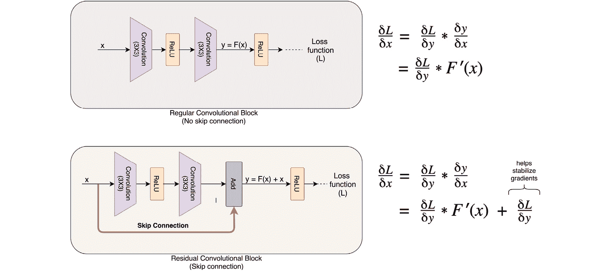

图 3.26–跳过连接

使用这些跳过(或快捷方式)连接，对于总共 50 层(ResNet-50)，参数的数量被限制在 2600 万个参数。由于参数数量有限，即使当层数增加到 152 (ResNet-152)时，ResNet 也能够很好地概括而不会过度拟合。下图显示了 ResNet-50 架构:

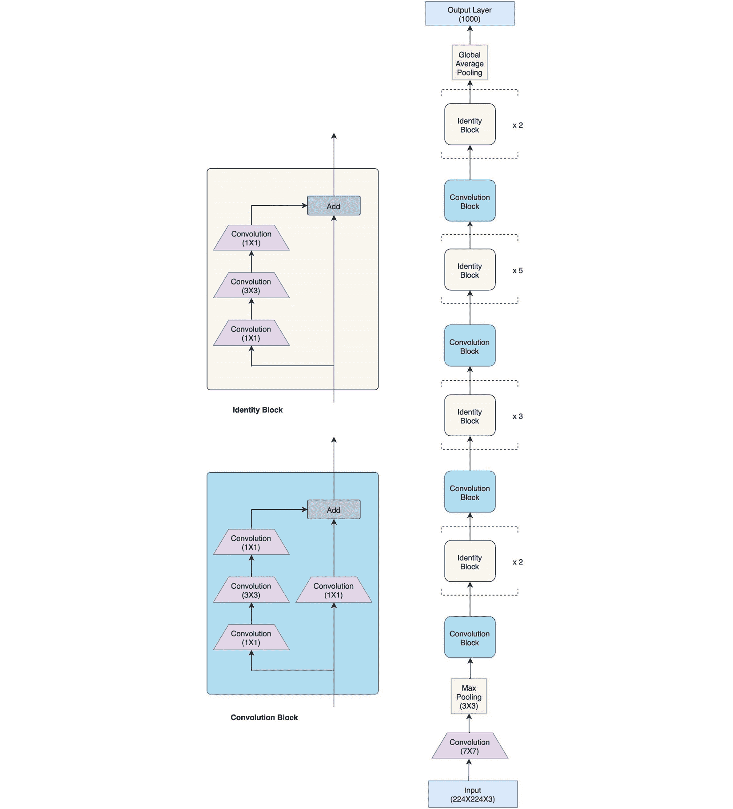

图 3.27-ResNet 架构

有两种剩余块——**卷积**和**同一性**，都有跳过连接。对于卷积块，增加了一个 1x1 卷积层，这进一步有助于减少维度。ResNet 的剩余块可以在 PyTorch 中实现，如下所示:

```py
class BasicBlock(nn.Module):
```

```py
    multiplier=1
```

```py
    def __init__(self, input_num_planes, num_planes, strd=1):
```

```py
        super(BasicBlock, self).__init__()
```

```py
        self.conv_layer1 = nn.Conv2d(in_channels=input_num_planes, out_channels=num_planes, kernel_size=3, stride=stride, padding=1, bias=False)
```

```py
        self.batch_norm1 = nn.BatchNorm2d(num_planes)
```

```py
        self.conv_layer2 = nn.Conv2d(in_channels=num_planes, out_channels=num_planes, kernel_size=3, stride=1, padding=1, bias=False)
```

```py
        self.batch_norm2 = nn.BatchNorm2d(num_planes)
```

```py
        self.res_connnection = nn.Sequential()
```

```py
        if strd > 1 or input_num_planes != self.multiplier*num_planes:
```

```py
            self.res_connnection = nn.Sequential(
```

```py
                nn.Conv2d(in_channels=input_num_planes, out_channels=self.multiplier*num_planes, kernel_size=1, stride=strd, bias=False),
```

```py
                nn.BatchNorm2d(self.multiplier*num_planes))
```

```py
    def forward(self, inp):
```

```py
        op = F.relu(self.batch_norm1(self.conv_layer1(inp)))
```

```py
        op = self.batch_norm2(self.conv_layer2(op))
```

```py
        op += self.res_connnection(inp)
```

```py
        op = F.relu(op)
```

```py
        return op
```

为了快速开始使用 ResNet，我们可以使用 PyTorch 存储库中预先训练的 ResNet 模型:

```py
import torchvision.models as models
```

```py
model = models.resnet50(pretrained=True)
```

ResNet 使用 identity 函数(通过直接将输入连接到输出)在反向传播期间保持梯度(因为梯度将为 1)。然而，对于非常深的网络，该原理可能不足以保持从输出层回到输入层的强梯度。

我们接下来将讨论的 CNN 模型旨在确保强大的梯度流，以及所需参数数量的进一步减少。

## DenseNet

ResNet 的跳过连接将残差块的输入直接连接到其输出。然而，残差块间的连接仍然是顺序的，即，编号为 3 的残差块与块 2 有直接连接，但与块 1 没有直接连接。

DenseNet，或密集网络，引入了在所谓的**密集块**内将每个卷积层与每隔一层连接起来的想法。并且每个密集块都与整个密集网中的每个其他密集块相连。密集块只是两个 3×3 密集连接的卷积层的模块。

这些密集的连接确保每一层都从网络的所有前面的层接收信息。这确保了从最后一层到第一层有很强的梯度流动。与直觉相反，这种网络设置的参数数量也会很少。由于每一层都从所有先前层接收特征地图，因此所需的通道(深度)数量可能会更少。在早期的模型中，不断增加的深度代表了来自早期层的信息积累，但我们不再需要它了，这要归功于网络中无处不在的密集连接。

ResNet 和 DenseNet 之间的一个关键区别还在于，在 ResNet 中，使用跳过连接将输入添加到输出。但是在 DenseNet 的情况下，前面层的输出与当前层的输出连接在一起。并且连接发生在深度维度中。

随着我们在网络中继续深入，这可能会提出一个关于输出爆炸大小的问题。为了对抗这种复合效应，为该网络设计了一种特殊类型的块，称为**过渡块**。该模块由 1×1 卷积层和随后的 2×2 池化层组成，标准化或重置深度维度的大小，以便该模块的输出可以提供给后续的密集模块。下图显示了 DenseNet 架构:

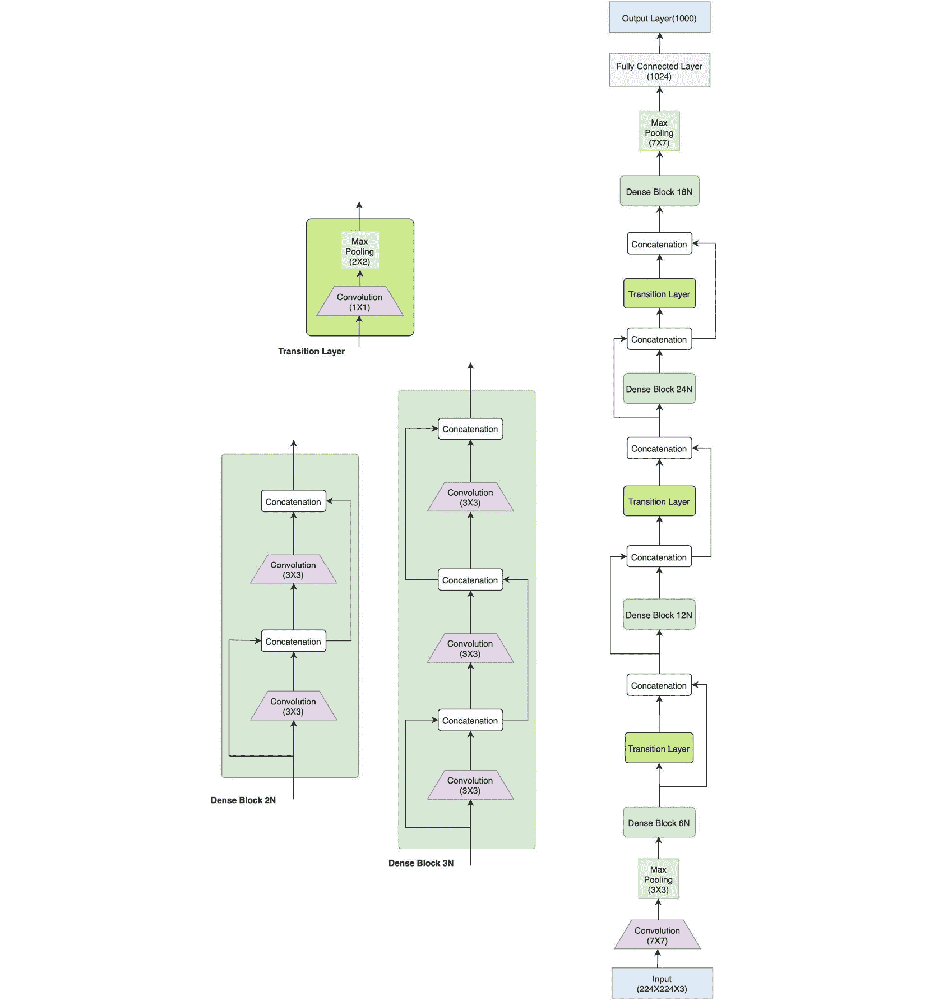

图 3.28–dense net 架构

如前所述，涉及两种类型的区块——密集区块**和过渡区块**。这些块可以用几行代码写成 PyTorch 中的类，如下所示:****

```py
class DenseBlock(nn.Module):
```

```py
    def __init__(self, input_num_planes, rate_inc):
```

```py
        super(DenseBlock, self).__init__()
```

```py
        self.batch_norm1 = nn.BatchNorm2d(input_num_planes)
```

```py
        self.conv_layer1 = nn.Conv2d(in_channels=input_num_planes, out_channels=4*rate_inc, kernel_size=1, bias=False)
```

```py
        self.batch_norm2 = nn.BatchNorm2d(4*rate_inc)
```

```py
        self.conv_layer2 = nn.Conv2d(in_channels=4*rate_inc, out_channels=rate_inc, kernel_size=3, padding=1, bias=False)
```

```py
    def forward(self, inp):
```

```py
        op = self.conv_layer1(F.relu(self.batch_norm1(inp)))
```

```py
        op = self.conv_layer2(F.relu(self.batch_norm2(op)))
```

```py
        op = torch.cat([op,inp], 1)
```

```py
        return op
```

```py
class TransBlock(nn.Module):
```

```py
    def __init__(self, input_num_planes, output_num_planes):
```

```py
        super(TransBlock, self).__init__()
```

```py
        self.batch_norm = nn.BatchNorm2d(input_num_planes)
```

```py
        self.conv_layer = nn.Conv2d(in_channels=input_num_planes, out_channels=output_num_planes, kernel_size=1, bias=False)
```

```py
    def forward(self, inp):
```

```py
        op = self.conv_layer(F.relu(self.batch_norm(inp)))
```

```py
        op = F.avg_pool2d(op, 2)
```

```py
        return op
```

这些模块然后密集堆叠，形成整体 DenseNet 架构。DenseNet 和 ResNet 一样，有各种变体，如 **DenseNet121** 、 **DenseNet161** 、 **DenseNet169** 和 **DenseNet201** ，其中数字代表总层数。如此大数量的层是通过密集和过渡块加上输入端固定的 7×7 卷积层和输出端固定的全连接层的重复堆叠得到的。PyTorch 为所有这些变体提供了预训练模型:

```py
import torchvision.models as models
```

```py
densenet121 = models.densenet121(pretrained=True)
```

```py
densenet161 = models.densenet161(pretrained=True)
```

```py
densenet169 = models.densenet169(pretrained=True)
```

```py
densenet201 = models.densenet201(pretrained=True)
```

DenseNet 在 ImageNet 数据集上的表现优于目前讨论的所有模型。通过混合和匹配前面章节中介绍的思想，已经开发了各种混合模型。Inception-ResNet 和 ResNeXt 模型就是这种混合网络的例子。下图显示了 ResNeXt 架构:

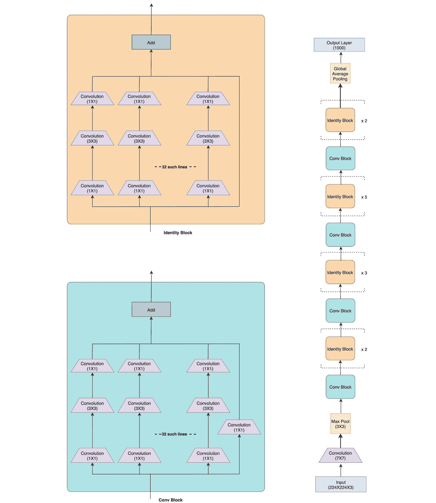

图 3.29–ResNeXt 架构

正如你所看到的，它看起来像是一个 *ResNet + Inception* 混合的更广泛的变体，因为在残差块中有大量并行卷积分支——并行的思想源自 Inception 网络。

在本章的下一个也是最后一个部分，我们将看看目前表现最好的 CNN 架构——efficient nets。我们还将讨论 CNN 架构发展的未来，同时触及 CNN 架构在图像分类之外的任务中的应用。

# 了解效率网络和 CNN 架构的未来

到目前为止，在我们从 LeNet 到 DenseNet 的探索中，我们已经注意到了 CNN 架构发展的一个潜在主题。这个主题就是通过以下方式之一扩展或缩放 CNN 模式:

*   层数的增加
*   卷积层中特征图或通道数量的增加
*   空间尺寸增加，从 LeNet 中的 32x32 像素图像增加到 AlexNet 中的 224x224 像素图像，等等

可以执行缩放的这三个不同方面分别被标识为*深度*、*宽度*和*分辨率*。通常会导致次优结果，而 **EfficientNets** 使用神经架构搜索来计算每个属性的最佳缩放因子，而不是手动缩放这些属性。

扩大深度被认为是重要的，因为网络越深，模型越复杂，因此它可以学习高度复杂的特征。然而，有一个折衷，因为随着深度的增加，消失梯度问题随着过度拟合的一般问题而升级。

类似地，从理论上来说，扩大带宽应该会有所帮助，因为随着信道数量的增加，网络应该会了解到更多细粒度的特性。然而，对于非常宽的模型，精度往往很快饱和。

最后，从理论上讲，分辨率越高的图像效果越好，因为它们包含的信息越精细。然而，从经验上看，分辨率的增加并不会带来模型性能的线性增加。所有这些都是说，在决定缩放因子时需要进行权衡，因此，神经架构搜索有助于找到最佳缩放因子。

EfficientNet 建议寻找在深度、宽度和分辨率之间取得适当平衡的架构，并且使用一个全局缩放因子来缩放所有这三个方面。高效网络架构分两步构建。首先，通过将缩放因子固定为`1`来设计基本架构(称为**基本网络**)。在这个阶段，深度、宽度和分辨率的相对重要性由给定任务和数据集决定。得到的基础网络与一个众所周知的 CNN 架构非常相似——**MnasNet**，是**移动神经架构搜索网络**的简称。PyTorch 提供预训练的`MnasNet`模型，可以如下所示加载:

```py
import torchvision.models as models
```

```py
model = models.mnasnet1_0()
```

一旦在第一步中获得了基网络，就可以计算最优的全局比例因子，目的是最大化模型的精度并最小化计算(或 flops)的次数。基础网络被称为**效率网络 B0** ，针对不同最优比例因子导出的后续网络被称为**效率网络 B1-B7** 。

随着我们向前发展，随着受初始、剩余和密集模块启发的更复杂模块的开发，CNN 架构的有效扩展将是一个突出的研究方向。CNN 架构开发的另一个方面是在保持性能的同时最小化模型大小。**移动互联网**(【https://pytorch.org/hub/pytorch_vision_mobilenet_v2/】T2)是的一个典型例子，在这方面有很多正在进行的研究。

除了自上而下的方法来查看现有模型的架构修改，还将继续努力采用自下而上的观点，从根本上重新思考 CNN 的单元，如卷积核、池机制、更有效的扁平化方法等等。一个具体的例子可能是**CapsuleNet**([https://en.wikipedia.org/wiki/Capsule_neural_network](https://en.wikipedia.org/wiki/Capsule_neural_network))，它修改了卷积单元以迎合图像的第三维(深度)。

CNN 本身就是一个巨大的研究课题。在这一章中，我们已经谈到了细胞神经网络的架构的发展，主要是在图像分类的背景下。然而，这些相同的架构被广泛应用。一个众所周知的例子是以**rcn ns**([https://en . Wikipedia . org/wiki/Region _ Based _ convolutionary _ Neural _ Networks](https://en.wikipedia.org/wiki/Region_Based_Convolutional_Neural_Networks))的形式使用 ResNets 进行对象检测和分割。RCNN 的一些改进变种有**更快的 R-CNN** 、 **Mask-RCNN** 和**关键点-RCNN** 。PyTorch 为所有三种变型提供预训练的模型:

```py
faster_rcnn = models.detection.fasterrcnn_resnet50_fpn()
```

```py
mask_rcnn = models.detection.maskrcnn_resnet50_fpn()
```

```py
keypoint_rcnn = models.detection.keypointrcnn_resnet50_fpn()
```

PyTorch 还为 resnet提供预训练的模型，这些模型应用于视频相关的任务，例如视频分类。用于视频分类的两个这样的基于 ResNet 的模型是 **ResNet3D** 和 **ResNet 混合卷积**:

```py
resnet_3d = models.video.r3d_18()
```

```py
resnet_mixed_conv = models.video.mc3_18()
```

虽然我们在这一章中没有详细介绍这些不同的应用程序和相应的 CNN 模型，但我们鼓励您阅读更多关于它们的内容。PyTorch 的网站可以是一个很好的起点:[https://py torch . org/docs/stable/torch vision/models . html # object-detection-instance-segmentation-and-person-key point-detection](https://pytorch.org/docs/stable/torchvision/models.html#object-detection-instance-segmentation-and-person-keypoint-detection)。

# 总结

这一章是关于 CNN 架构的。首先，我们简要讨论了 CNN 的历史和发展。然后，我们详细探索了最早的 CNN 模型之一——LeNet。使用 PyTorch，我们从头开始构建模型，并在图像分类数据集上对其进行训练和测试。然后我们探索了 LeNet 的继任者——Alex net。我们没有从头开始构建，而是使用 PyTorch 的预训练模型库来加载预训练的 AlexNet 模型。然后，我们在不同的数据集上微调加载的模型，并评估其性能。

接下来，我们研究了 VGG 模型，它是 AlexNet 的更深入、更先进的继承者。我们使用 PyTorch 加载了预训练的 VGG 模型，并使用它在不同的图像分类数据集上进行预测。然后，我们连续讨论了由几个先启模块组成的 GoogLeNet 和 Inception v3 模型。使用 PyTorch，我们编写了一个 inception 模块和整个网络的实现。接下来，我们讨论了 ResNet 和 DenseNet。对于这些架构中的每一个，我们都使用 PyTorch 实现了它们的构建块，即剩余块和密集块。我们还简要介绍了一种先进的混合 CNN 架构——ResNeXt。

最后，我们总结了当前最先进的 CNN 模式——efficient net。我们讨论了它背后的思想和 PyTorch 下可用的相关预训练模型，如 MnasNet。我们还为 CNN 架构的发展提供了合理的未来方向，并简要提及了其他特定于对象检测和视频分类的 CNN 架构，如 RCNNs 和 ResNet3D。

尽管本章没有涵盖 CNN 架构概念下的每个可能的主题，但它仍然提供了对 CNN 从 LeNet 到 EfficientNet 以及其他方面的进展的详细理解。此外，本章强调了 PyTorch 在我们已经讨论过的各种 CNN 架构中的有效使用和应用。

在下一章，我们将探索一个类似的旅程，但对于另一种重要的神经网络类型-循环神经网络。我们将讨论各种循环网络架构，并使用 PyTorch 来有效地实现、训练和测试它们。**