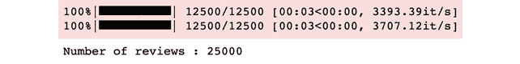
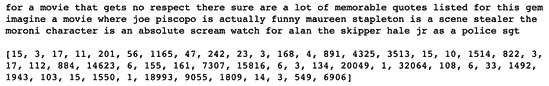

  

# 四、深度循环模型架构

**神经网络**是强大的机器学习工具，用于帮助我们学习数据集的输入( *X* )和输出( *y* )之间的复杂模式。在前一章中，我们讨论了卷积神经网络，它学习了 *X* 和 *y* 之间的一对一映射；也就是说，每个输入 *X* 独立于其他输入，每个输出 *y* 独立于数据集的其他输出。

在本章中，我们将讨论一类可以对序列进行建模的神经网络，其中 *X* (或 *y* )不仅仅是单个独立的数据点，而是数据点的时间序列【X1，X2，..Xt](或[y1，y2，..yt])。请注意，X2(时间步长 2 的数据点)取决于 X1，X3 取决于 X2 和 X1，依此类推。

这样的网络被归类为**循环神经网络** ( **RNNs** )。这些网络能够通过在模型中包括在网络中创建循环的额外权重来对数据的时间方面进行建模。这有助于维护状态，如下图所示:


图 4.1-RNN

循环的概念解释了术语*循环*，这种循环有助于在这些网络中建立记忆的概念。本质上，这种网络便于使用在*时间步长 t* 的中间输出作为*时间步长 t+1* 的输入，同时保持隐藏的内部状态。这些跨时间步长的连接称为**循环连接**。

本章将重点介绍多年来发展起来的各种循环神经网络架构，如不同类型的 RNNs、**长短期记忆**(**)、**门控递归单元** ( **GRUs** )。我们将使用 PyTorch 来实现其中的一些架构，并在现实世界的顺序建模任务中训练和测试循环模型。除了模型训练和测试，我们还将学习如何有效地使用 PyTorch 来加载和预处理顺序数据。到本章结束时，你将能够使用 PyTorch 中的(RNNs)解决序列数据集的机器学习问题。**

 **本章涵盖以下主题:

*   探索循环网络的演变
*   训练用于情感分析的 rnn
*   构建双向 LSTM
*   讨论 GRUs 和基于注意力的模型

# 技术要求

我们将在所有练习中使用 Jupyter 笔记本。以下是本章使用`pip`必须安装的 Python 库列表；例如，在命令行上运行`pip install torch==1.4.0`:

```py
jupyter==1.0.0 torch==1.4.0 tqdm==4.43.0 matplotlib==3.1.2 torchtext==0.5.0
```

与本章相关的所有代码文件都可以在[https://github . com/packt publishing/Mastering-py torch/blob/master/chapter 04](https://github.com/PacktPublishing/Mastering-PyTorch/blob/master/Chapter04)上找到。

# 探索循环网络的进化

循环网络从 80 年代就已经存在了。在这一节中，我们将探讨循环网络架构自出现以来的演变。我们将通过回顾(RNNs)发展过程中的关键里程碑来讨论和推理架构的发展。在进入时间线之前，我们将快速回顾不同类型的 rnn 以及它们与一般前馈神经网络的关系。

## 循环神经网络的类型

虽然大多数受监督的机器学习模型都是建立一对一的关系，但(RNNs)可以建立以下类型的输入-输出关系:

*   **Many-to-many** (**instantaneous**)

    示例:命名实体识别:给定一个句子/文本，用命名实体类别标记单词，例如名称、组织、位置等等。

*   **Many-to-many** (**encoder-decoder**)

    例如:机器翻译(例如，从英语文本到德语文本):获取自然语言的一个句子/一段文本，将其编码为统一的固定大小的表示，并对该表示进行解码，以产生另一种语言的等效句子/一段文本。

*   **Many-to-one**

    例子:情感分析:给定一个句子/一段文字，将其分类为正面、负面、中性等等。

*   **One-to-many**

    示例:图像字幕:给定一张图像，用一句话/一段文字来描述它。

*   **One-to-one** (although not very useful)

    示例:图像分类(通过处理图像像素序列 )。

下图显示了这些 RNN 类型与常规 NN 的对比:


图 4.2–rnn 的类型

注意

我们在 [*第二章*](B12158_02_Final_ASB_ePUB.xhtml#_idTextAnchor036) 、*结合 CNN 和 LSTMs* 的图像字幕练习中提供了一个一对多循环神经网络的例子。

正如我们所看到的，循环神经架构具有常规神经网络中不存在的递归连接。在上图中，这些循环连接是沿着时间维度展开的。下图显示了安 RNN 在**时间折叠**和**时间展开** 两种形式下的结构:


图 4.3-RNN 的时间展开

在下面的章节中，我们将使用时间展开的版本来演示 RNN 架构。在前面的图表中，我们用红色标记了 RNN 层作为神经网络的隐藏层。虽然网络可能看起来只有一个隐藏层，但是一旦这个隐藏层沿着时间维度展开，我们可以看到网络实际上有 *T* 个隐藏层。这里， *T* 是时序数据中时间步长的总数。

rnn 的强大特性之一是它们可以处理不同序列长度的序列数据( *T* )。处理这种长度可变性的一种方法是填充较短的序列和截断较长的序列，我们将在本章 后面的练习中看到。

接下来，我们将深入研究递归架构的历史和发展，从基本的 rnn 开始。

## RNNs

随着 1982 年 Hopfield 网络的出现，RNNs 背后的想法变得显而易见，Hopfield 网络是一种特殊类型的 RNN，试图模拟人类记忆的工作方式。1986 年，rnn 在 David Rumelhart 等人的作品的基础上形成了自己的存在。这些 rnn 能够处理带有潜在记忆概念的序列。从这里开始，对其架构进行了一系列改进，如下图所示:


图 4.4–RNN 建筑发展–一幅广阔的画面

上图没有涵盖 RNNs 架构演进的全部历史，但它涵盖了重要的检查点。接下来，我们将按时间顺序讨论 RNNs 的后继者，从双向 RNNs 开始。

## 双向 RNNs

尽管 RNNs 在序列数据上表现良好，但后来人们意识到，一些与序列相关的任务，如语言翻译，可以通过查看过去和未来的信息来更有效地完成。例如，英语中的*我看见你*将被翻译成法语中的*我很高兴*。这里， *te* 表示*你*， *vois* 表示*见*。因此，为了正确地将英语翻译成法语，在用法语书写第二个和第三个单词之前，我们需要所有三个英语单词。

为了克服这个限制，**双向 rnn**在 1997 年被发明。这些与传统的 rnn 非常相似，除了双向 rnn 有两个内部工作的 rnn:一个从头到尾运行序列，另一个从头到尾反向运行序列，如下图所示:


图 4.5–双向无线网络

接下来，我们将了解 LSTMs。

## lstm

虽然 rnn 能够处理顺序数据并记住信息，但它们遭受了爆炸和消失梯度的问题。这之所以发生，是因为在时间维度中展开循环网络所产生的极其深层的网络。

1997 年，设计了一种不同的方法。RNN 细胞被一个更复杂的记忆细胞取代了——长短期记忆细胞。RNN 电池通常具有**s 形**或 **tanh** 激活功能。选择这些函数是因为它们能够控制 0(无信息流)到 1(完整信息流)之间的输出，或者在 tanh 的情况下控制-1 到 1 之间的输出。

此外，Tanh 还有利于提供 0 平均输出值和更大的梯度，这两者都有助于更快地学习(收敛)。这些激活函数应用于当前时间步的输入和前一时间步的隐藏状态的连接，如下图所示的:


图 4.6-RNN 电池

在**反向传播**期间，由于在时间展开的 RNN 单元上梯度项的倍增，梯度或者在这些 RNN 单元中的几个上保持减小或者保持增长。因此，虽然 rnn 可以记住短序列的顺序信息，但由于乘法次数较多，它们往往难以处理长序列。LSTMs 通过使用门控制它们的输入和输出来解决这个问题。

LSTM 层本质上由各种随时间展开的 LSTM 细胞组成。信息以单元状态的形式从一个单元传递到另一个单元。这些单元状态通过使用门机制的乘法和加法来控制或操纵。如下图所示，这些门控制着流向下一个单元格的信息流，同时保留或忽略来自上一个单元格的信息:


图 4.7-LSTM 网络

LSTMs 彻底改变了循环网络，因为它们可以有效地处理更长的序列。接下来，我们讨论 LSTMs 的更高级的变体。

## 扩展和双向 LSTMs

最初，在 1997 年，lstm 被发明时只有输入和输出门。不久之后，在 2000 年，一个扩展的 LSTM 被开发出来，它就是现在最常用的。几年后，在 2005 年开发了双向 LSTMs，其在概念上类似于双向 rnn。

## 多维 RNNs

2007 年，**多维 RNNs** ( **MDRNNs** )被发明。在这里，RNN 细胞之间的单个循环连接被数据中的维度所取代。这在视频处理中很有用，例如，当数据是固有的二维图像序列时。

## 堆叠的 LSTMs

虽然单层 LSTM 网络似乎确实克服了梯度消失和爆炸的问题，但事实证明，堆叠更多的 LSTM 层对学习各种顺序处理任务(如语音识别)中的高度复杂模式更有帮助。这些强大的模型被称为**堆叠 lstm**。下图显示了具有两个 LSTM 图层的堆叠 LSTM 模型:


图 4.8–堆叠 LSTMs

LSTM 细胞本质上是堆叠在 LSTM 层的时间维度中。在空间维度中堆叠几个这样的层为他们提供了他们所需要的额外的空间深度。这些模型的缺点是，由于额外的深度和额外的循环连接，它们的训练速度明显较慢。此外，在每个训练迭代中，额外的 LSTM 层需要在展开(在时间维度上)。因此，训练堆叠循环模型通常是不可并行化的。

## 格鲁

LSTM 单元有两种状态——内部和外部——以及三个不同的门——输入门、**忘记门**和**输出门**。一种类似类型的细胞，名为**门控循环单元** ( **GRU** )，于 2014 年发明，目标是学习长期依赖关系，同时有效处理爆炸和消失梯度问题。gru 只有一个状态和两个门——一个**复位门**(输入和遗忘门的组合)和一个**更新门**。下图显示了一个 GRU 网络:


图 4.9-GRU 网络

接下来是网格 LSTM。

## 电网 lstms

一年后，在 2015 年，**网格 LSTM** 模型作为 MDLSTM 模型的继任者被开发出来，作为多维 RNNs 的 LSTM 等价物。在网格 LSTM 模型中，LSTM 单元被排列成多维网格。这些单元沿着数据的时空维度连接，并且在网络层之间连接。

## 门控正交递归单元

2017 年，**门控正交递归单元**被设计出来，集合了 GRUs 和**酉 RNNs** 的思想。酉 RNNs 是基于的使用**酉矩阵**(其中是**正交矩阵**)作为 RNNs 到的**隐藏状态循环矩阵**的思想处理爆炸和消失梯度的问题。这是因为偏离梯度归因于从一个偏离**隐藏到隐藏**权重矩阵的**特征值**。因此，这些矩阵已被正交矩阵取代，以解决梯度问题。你可以在原文：<https://arxiv.org/pdf/1511.06464.pdf>中阅读更多关于酉 RNNs 的内容。

在这一节中，我们简要介绍了循环神经架构的发展。接下来，我们将通过执行一个基于文本分类任务的简单 RNN 模型架构来深入研究 RNNs。我们还将探讨 PyTorch 如何在处理序列数据以及构建和评估循环模型中发挥重要作用。

# 训练用于情感分析的 rnn

在这一部分，我们将使用 PyTorch 训练一个 RNN 模型来完成文本分类任务——情感分析。在这个任务中，模型接受一段文本——一系列单词——作为输入，输出`1`(表示积极情感)或`0`(消极情感)。对于这个涉及序列数据的二元分类任务，我们将使用一个**单向单层 RNN** 。

在训练模型之前，我们将手动处理文本数据，并将其转换为可用的数字形式。在训练模型后，我们将在一些样本文本上测试它。我们将演示如何使用各种 PyTorch 功能来有效地执行这项任务。这个练习的代码可以在[https://github . com/packt publishing/Mastering-py torch/blob/master/chapter 04/rnn . ipynb](https://github.com/PacktPublishing/Mastering-PyTorch/blob/master/Chapter04/rnn.ipynb)找到。

## 加载并预处理文本数据集

对于这个练习，我们将需要导入一些依赖项:

1.  First, execute the following `import` statements:

    ```py
    import os import time import numpy as np from tqdm import tqdm from string import punctuation from collections import Counter import matplotlib.pyplot as plt
    import torch import torch.nn as nn import torch.optim as optim from torch.utils.data import DataLoader, TensorDataset device = torch.device('cuda' if torch.cuda.is_available() else 'cpu')torch.manual_seed(123)
    ```

    除了导入常规的`torch`依赖项，我们还导入了用于文本处理的`punctuation`和`Counter`。我们还导入了`matplotlib`来显示图像，`numpy`用于数组操作，`tqdm`用于可视化进度条。除了导入，我们还设置了随机种子来确保这个练习的可重复性，如代码片段的最后一行所示。

2.  Next, we will read the data from the text files. For this exercise, we will be using the IMDb sentiment analysis dataset, which can be found here: [https://ai.stanford.edu/~amaas/data/sentiment/](https://ai.stanford.edu/~amaas/data/sentiment/). This IMDb dataset consists of several movie reviews as texts and corresponding sentiment labels (positive or negative). First, we will download the dataset and run the following lines of code in order to read and store the list of texts and corresponding sentiment labels:

    ```py
    # read sentiments and reviews data from the text files
    review_list = []
    label_list = []
    for label in ['pos', 'neg']:
        for fname in tqdm(os.listdir(f'./aclImdb/train/{label}/')):
            if 'txt' not in fname:
                continue
            with open(os.path.join(f'./aclImdb/train/{label}/', fname), encoding="utf8") as f:
                review_list += [f.read()]
                label_list += [label]
    print ('Number of reviews :', len(review_list))
    ```

    这将输出以下内容:

    

    图 4.10-IMDb 数据集加载

    我们可以看到，总共有 2.5 万条影评，正面 12500 条，负面 12500 条。

    数据集引用

    安德鲁·马斯、雷蒙德·戴利、彼得·范、黄丹、安德鲁·Ng 和克里斯托弗·波茨。(2011).*学习用于情感分析的词向量。*计算语言学协会第 49 届年会(ACL 2011)。

3.  Following the data loading step, we will now start processing the text data, as follows:

    ```py
    # pre-processing review text
    review_list = [review.lower() for review in review_list]
    review_list = [''.join([letter for letter in review if letter not in punctuation]) for review in tqdm(review_list)]
    # accumulate all review texts together
    reviews_blob = ' '.join(review_list)
    # generate list of all words of all reviews
    review_words = reviews_blob.split()
    # get the word counts
    count_words = Counter(review_words)
    # sort words as per counts (decreasing order)
    total_review_words = len(review_words)
    sorted_review_words = count_words.most_common(total_review_words)
    print(sorted_review_words[:10])
    ```

    这将输出以下内容:

    

    图 4.11–字数

    如您所见，首先，我们对整个文本语料库进行了小写处理，随后从评论文本中删除了所有标点符号。然后，我们将所有评论中的所有单词累积在一起，以获得单词计数，并按计数降序排列，以查看最受欢迎的单词。注意，最流行的单词都是**非名词**，比如限定词、代词等等，如前面的截图所示。

    理想情况下，这些非名词，也被称为**停用词**，将从语料库中删除，因为它们没有太多的意义。然而，为了简单起见，我们将跳过这些高级的文本处理步骤。

4.  We will continue with data processing by converting these individual words into numbers or tokens. This is a crucial step because machine learning models only understand numbers, not words:

    ```py
    # create word to integer (token) dictionary in order to encode text as numbers
    vocab_to_token = {word:idx+1 for idx, (word, count) in enumerate(sorted_review_words)}
    print(list(vocab_to_token.items())[:10])
    ```

    这将输出以下内容:

    

    图 4.12-单词令牌生成

    从最流行的单词开始，数字被分配给从`1`开始的单词。

5.  We obtained the word-to-integer mapping in the previous step, which is also known as the vocabulary of our dataset. In this step, we will use the vocabulary to translate movie reviews in our dataset into a list of numbers:

    ```py
    reviews_tokenized = []
    for review in review_list:
        word_to_token = [vocab_to_token[word] for word in review.split()]
        reviews_tokenized.append(word_to_token)
    print(review_list[0])
    print()
    print (reviews_tokenized[0])
    ```

    这应该会输出如下所示的内容:

    

    图 4.13–数字文本

6.  我们还将把情感目标——`pos`和`neg`——分别编码成数字`1`和`0`:

    ```py
    # encode sentiments as 0 or 1
    encoded_label_list = [1 if label =='pos' else 0 for label in label_list]
    reviews_len = [len(review) for review in reviews_tokenized]
    reviews_tokenized = [reviews_tokenized[i] for i, l in enumerate(reviews_len) if l>0 ]
    encoded_label_list = np.array([encoded_label_list[i] for i, l in enumerate(reviews_len) if l> 0 ], dtype='float32')
    ```

7.  Before we train the model, we need a final data-processing step. Different reviews can be of different lengths. However, we will define our simple RNN model for a fixed sequence length. Hence, we need to normalize different length reviews so that they're all same length.

    为此，我们将定义一个序列长度 *L* (本例中为`512`)，然后填充长度小于 *L* 的序列，并截断长度大于 *L* 的序列:

    ```py
    def pad_sequence(reviews_tokenized, sequence_length):
        ''' returns the tokenized review sequences padded with 0's or truncated to the sequence_length.
        '''
        padded_reviews = np.zeros((len(reviews_tokenized), sequence_length), dtype = int)
        for idx, review in enumerate(reviews_tokenized):
            review_len = len(review)
            if review_len <= sequence_length:
                zeroes = list(np.zeros(sequence_length-review_len))
                new_sequence = zeroes+review
            elif review_len > sequence_length:
                new_sequence = review[0:sequence_length]
            padded_reviews[idx,:] = np.array(new_sequence)
        return padded_reviews
    sequence_length = 512
    padded_reviews = pad_sequence(reviews_tokenized=reviews_tokenized, sequence_length=sequence_length)
    plt.hist(reviews_len);
    ```

    输出如下所示:

    

    图 4.14–审查长度直方图

    正如我们所看到的，评论大多低于 500，所以我们选择 512(2 的幂)作为我们模型的序列长度，并相应地修改了不是正好 512 个单词长的序列。

8.  最后我们可以训练模型。要做到这一点，我们必须将我们的数据集分成训练集和验证集，比率为 75:25:

    ```py
    train_val_split = 0.75
    train_X = padded_reviews[:int(train_val_split*len(padded_reviews))]
    train_y = encoded_label_list[:int(train_val_split*len(padded_reviews))]
    validation_X = padded_reviews[int(train_val_split*len(padded_reviews)):]
    validation_y = encoded_label_list[int(train_val_split*len(padded_reviews)):]
    ```

9.  在这个阶段，我们可以开始使用 PyTorch 从处理后的数据:

    ```py
    # generate torch datasets
    train_dataset = TensorDataset(torch.from_numpy(train_X).to(device), torch.from_numpy(train_y).to(device))
    validation_dataset = TensorDataset(torch.from_numpy(validation_X).to(device), torch.from_numpy(validation_y).to(device))
    batch_size = 32
    # torch dataloaders (shuffle data)
    train_dataloader = DataLoader(train_dataset, batch_size=batch_size, shuffle=True)
    validation_dataloader = DataLoader(validation_dataset, batch_size=batch_size, shuffle=True)
    ```

    生成`dataset`和`dataloader`对象
10.  To get a feeling of what the data looks like before we feed it to the model, let's visualize a batch of 32 reviews and the corresponding sentiment labels:

    ```py
    # get a batch of train data
    train_data_iter = iter(train_dataloader)
    X_example, y_example = train_data_iter.next()
    print('Example Input size: ', X_example.size()) # batch_size, seq_length
    print('Example Input:\n', X_example)
    print()
    print('Example Output size: ', y_example.size()) # batch_size
    print('Example Output:\n', y_example)
    ```

    输出将如下:


图 4.15–样本数据点

将文本数据集加载并处理成数字符号序列后，接下来，我们将在 PyTorch 中创建 RNN 模型对象，并训练 RNN 模型。

## 实例化和训练模型

现在我们已经准备好了数据集，我们可以实例化我们的单向单层 RNN 模型。首先，PyTorch 通过它的 **nn 使它非常紧凑。RNN** 模块来实例化 RNN 层。它接受的只是输入/嵌入维度、隐藏到隐藏状态维度和层数。让我们开始吧:

1.  Let's define our own wrapper RNN class. This instantiates the whole RNN model, which is composed of the embedding layer, followed by the RNN layer, and finally followed by a fully connected layer, as follows:

    ```py
    class RNN(nn.Module):
        def __init__(self, input_dimension, embedding_dimension, hidden_dimension, output_dimension):
            super().__init__()
            self.embedding_layer = nn.Embedding(input_dimension, embedding_dimension)  
            self.rnn_layer = nn.RNN(embedding_dimension, hidden_dimension, num_layers=1)
            self.fc_layer = nn.Linear(hidden_dimension, output_dimension)
        def forward(self, sequence):
            # sequence shape = (sequence_length, batch_size)
            embedding = self.embedding_layer(sequence)  
            # embedding shape = [sequence_length, batch_size, embedding_dimension]
            output, hidden_state = self.rnn_layer(embedding)
            # output shape = [sequence_length, batch_size, hidden_dimension]
            # hidden_state shape = [1, batch_size, hidden_dimension]
            final_output = self.fc_layer(hidden_state[-1,:,:].squeeze(0))      
            return final_output
    ```

    嵌入层的功能在`nn.Embedding`模块下提供，该模块存储单词嵌入(以查找表的形式)并使用索引检索它们。在本练习中，我们将嵌入维度设置为`100`。这意味着如果我们的词汇表中总共有 1000 个单词，那么嵌入查找表的大小将是 1000×100。

    例如，单词 *it* ，在我们的词汇表中被标记为数字 *8* ，将作为大小为 100 的向量存储在这个查找表的第 8 行。为了获得更好的性能，您可以使用预训练的嵌入来初始化嵌入查找表，但是在本练习中，我们将从头开始训练它。

2.  In the following code, we are instantiating the RNN model:

    ```py
    input_dimension = len(vocab_to_token)+1 # +1 to account for padding
    embedding_dimension = 100
    hidden_dimension = 32
    output_dimension = 1
    rnn_model = RNN(input_dimension, embedding_dimension, hidden_dimension, output_dimension)
    optim = optim.Adam(rnn_model.parameters())
    loss_func = nn.BCEWithLogitsLoss()
    rnn_model = rnn_model.to(device)
    loss_func = loss_func.to(device)
    ```

    我们使用`nn.BCEWithLogitsLoss`模块来计算损失。这个 PyTorch 模块提供了对一个 **Sigmoid** 函数的数值稳定计算，后面是一个**二元交叉熵**函数，这正是我们想要的二元分类问题的损失函数。`32`的隐藏维度仅仅意味着每个 RNN 单元(隐藏)状态将是一个大小为`32`的向量。

3.  我们还将定义一个`accuracy metric`来衡量我们的训练模型在验证集上的性能。在这个练习中，我们将使用简单的`0-1``accuracy`:

    ```py
    def accuracy_metric(predictions, ground_truth):
        """
        Returns 0-1 accuracy for the given set of predictions and ground truth
        """
        # round predictions to either 0 or 1
        rounded_predictions = torch.round(torch.sigmoid(predictions))
        success = (rounded_predictions == ground_truth).float() #convert into float for division 
        accuracy = success.sum() / len(success)
        return accuracy
    ```

4.  Once we've completed the model instantiation and metrics definition, we can define the training and validation routines. The code for the training routine is as follows:

    ```py
    def train(model, dataloader, optim, loss_func):
        loss = 0
        accuracy = 0
        model.train()
        for sequence, sentiment in dataloader:
            optim.zero_grad()     
            preds = model(sequence.T).squeeze()
            loss_curr = loss_func(preds, sentiment)
            accuracy_curr = accuracy_metric(preds, sentiment)
            loss_curr.backward()
            optim.step()
            loss += loss_curr.item()
            accuracy += accuracy_curr.item()
        return loss/len(dataloader), accuracy/len(dataloader)
    ```

    验证程序的代码如下:

    ```py
    def validate(model, dataloader, loss_func):
        loss = 0
        accuracy = 0
        model.eval()
        with torch.no_grad():
            for sequence, sentiment in dataloader:
                preds = model(sequence.T).squeeze()
                loss_curr = loss_func(preds, sentiment)   
                accuracy_curr = accuracy_metric(preds, sentiment)
                loss += loss_curr.item()
                accuracy += accuracy_curr.item()
        return loss/len(dataloader), accuracy/len(dataloader)
    ```

5.  Finally, we are now ready to train the model:

    ```py
    num_epochs = 10
    best_validation_loss = float('inf')
    for ep in range(num_epochs):
        time_start = time.time()
        training_loss, train_accuracy = train(rnn_model, train_dataloader, optim, loss_func)
        validation_loss, validation_accuracy = validate(rnn_model, validation_dataloader, loss_func)
        time_end = time.time()
        time_delta = time_end - time_start
        if validation_loss < best_validation_loss:
            best_validation_loss = validation_loss
            torch.save(rnn_model.state_dict(), 'rnn_model.pt')
        print(f'epoch number: {ep+1} | time elapsed: {time_delta}s')
        print(f'training loss: {training_loss:.3f} | training accuracy: {train_accuracy*100:.2f}%')
        print(f'\tvalidation loss: {validation_loss:.3f} |  validation accuracy: {validation_accuracy*100:.2f}%')
    ```

    输出如下所示:

    

    图 4.16-RNN 模型培训日志

    模型似乎通过过度拟合在训练集上学习得特别好。模型在时间维度上有 512 层，这也解释了为什么这个强大的模型可以相当好地学习训练集。验证集的性能从一个低值开始，然后上升并波动。

6.  让我们快速定义一个辅助函数对训练好的模型进行实时推理:

    ```py
    def sentiment_inference(model, sentence):
        model.eval()
        # text transformations
        sentence = sentence.lower()
        sentence = ''.join([c for c in sentence if c not in punctuation])
        tokenized = [vocab_to_token.get(token, 0) for token in sentence.split()]
        tokenized = np.pad(tokenized, (512-len(tokenized), 0), 'constant')
        # model inference
        model_input = torch.LongTensor(tokenized).to(device)
        model_input = model_input.unsqueeze(1)
        pred = torch.sigmoid(model(model_input))
        return pred.item()
    ```

7.  As the last step of this exercise, we will test the performance of this model on some manually entered review texts:

    ```py
    print(sentiment_inference(rnn_model, "This film is horrible"))print(sentiment_inference(rnn_model, "Director tried too hard but this film is bad"))print(sentiment_inference(rnn_model, "Decent movie, although could be shorter"))print(sentiment_inference(rnn_model, "This film will be houseful for weeks"))print(sentiment_inference(rnn_model, "I loved the movie, every part of it"))
    ```

    输出如下所示:


图 4.17-RNN 推理输出

在这里，我们可以看到这个模型确实采用了积极和消极的概念。此外，它似乎能够处理可变长度的序列，即使它们都比`512`单词短得多。

在这个练习中，我们训练了一个相当简单的 RNN 模型，它不仅在模型架构方面有局限性，在数据处理方面也有局限性。在下一个练习中，我们将使用一个更先进的循环架构——双向 LSTM 模型——来完成同样的任务。我们将使用一些正则化方法来克服我们在本练习中观察到的过度拟合问题。此外，我们将使用 PyTorch 的`torchtext`模块更高效、更简洁地处理数据加载和处理管道。

# 构建双向 LSTM

到目前为止，我们已经在情感分析任务上训练并测试了一个简单的 RNN 模型，这是一个基于文本数据的二元分类任务。在本节中，我们将尝试通过使用更高级的循环架构 LSTMs 来提高我们在相同任务上的性能。

正如我们所知，LSTMs 更有能力处理更长的序列，因为它们的存储单元门有助于保留之前几个时间步骤的重要信息，并忘记不相关的信息，即使是最近的信息。随着爆炸和消失梯度问题的检查，LSTMs 应该能够在处理长电影评论时表现良好。

此外，我们将使用一个双向模型，因为它在任何时间步都扩大了上下文窗口，以便模型对电影评论的情感做出更明智的决定。我们在之前的练习中看到的 RNN 模型在训练期间过度拟合了数据集，因此为了解决这个问题，我们将在我们的 LSTM 模型中使用辍学作为正则化机制。

## 加载和预处理文本数据集

在这个练习中，我们将展示 PyTorch 的`torchtext` 模块的威力。在前面的练习中，我们大概用了一半的时间来加载和处理文本数据集。使用`torchtext`，我们将用不到 10 行代码完成同样的工作。

我们将使用`torchtext.datasets`下预先存在的 IMDb 数据集来加载数据集，而不是手动下载数据集。我们还将使用`torchtext.data`来标记单词并生成词汇。最后，我们将使用`nn.LSTM`模块直接填充序列，而不是手动填充。这个练习的代码可以在[https://github . com/packt publishing/Mastering-py torch/blob/master/chapter 04/lstm . ipynb](https://github.com/PacktPublishing/Mastering-PyTorch/blob/master/Chapter04/lstm.ipynb)找到。让我们开始吧:

1.  在本练习中，我们需要导入一些依赖项。首先，我们将执行与上一个练习相同的`import`语句。但是，我们还需要导入以下内容:

    ```py
    import random from torchtext import (data, datasets)
    ```

2.  接下来，我们将使用`torchtext`模块中的 datasets 子模块直接下载 IMDb 情感分析数据集。我们将评论文本和情感标签分成两个独立的字段，并将数据集分成训练集、验证集和测试集:

    ```py
    TEXT_FIELD = data.Field(tokenize = data.get_tokenizer("basic_english"), include_lengths = True)LABEL_FIELD = data.LabelField(dtype = torch.float)
    train_dataset, test_dataset = datasets.IMDB.splits(TEXT_FIELD, LABEL_FIELD)train_dataset, valid_dataset = train_dataset.split(random_state = random.seed(123))
    ```

3.  Next, we will use the `build_vocab` method of `torchtext.data.Field` and `torchtext.data.LabelField` to build the vocabulary for the movie reviews text dataset and the sentiment labels, respectively:

    ```py
    MAX_VOCABULARY_SIZE = 25000
    TEXT_FIELD.build_vocab(train_dataset, 
                     max_size = MAX_VOCABULARY_SIZE)
    LABEL_FIELD.build_vocab(train_dataset)
    ```

    正如我们所见，使用预定义的函数构建词汇表只需要三行代码。

4.  在我们进入模型相关的细节之前，我们还将为训练、验证和测试集创建数据集迭代器。

现在，我们已经加载并处理了数据集，并派生了数据集迭代器，让我们创建 LSTM 模型对象并训练 LSTM 模型。

## 实例化和训练 LSTM 模型

在这个部分，我们将实例化 LSTM 模型对象。然后，我们将定义优化器、损失函数和模型训练性能指标。最后，我们将使用定义的模型训练和模型验证例程运行模型训练循环。让我们开始吧:

1.  首先，我们必须实例化带有辍学的双向 LSTM 模型。虽然大多数模型实例化看起来与上一个练习中的一样，但是下面一行代码是关键的区别:

    ```py
    self.lstm_layer = nn.LSTM(embedding_dimension, 
                               hidden_dimension, 
                               num_layers=1, 
                               bidirectional=True, 
                               dropout=dropout)
    ```

2.  我们在词汇表中添加了两种特殊类型的标记——`unknown_token`(表示我们的词汇表中不存在的单词)和`padding_token`(表示只是为了填充序列而添加的标记)。因此，我们需要将这两个令牌的嵌入设置为全零:

    ```py
    UNK_INDEX = TEXT_FIELD.vocab.stoi[TEXT_FIELD.unk_token]
    lstm_model.embedding_layer.weight.data[UNK_INDEX] = torch.zeros(EMBEDDING_DIMENSION)
    lstm_model.embedding_layer.weight.data[PAD_INDEX] = torch.zeros(EMBEDDING_DIMENSION)
    ```

3.  接下来，我们将定义优化器(*亚当*)和损失函数( *Sigmoid* 后跟*二元交叉熵*)。我们还将定义一个准确性指标计算函数，就像我们在之前的练习中所做的那样。
4.  然后，我们将定义培训和验证程序。
5.  Finally, we will run the training loop with 10 epochs. This should output the following:

    图 4.18-LSTM 模型培训日志

    正如我们所见，模型正在随着时代的进步而学习。此外，辍学似乎控制过度拟合，因为训练集和验证集的精度都在以类似的速度增加。然而，与 RNNs 相比，LSTMs 的训练速度较慢。正如我们所见，LSTMs 的历元时间大约是 RNNs 的 9 到 10 倍。这也是因为我们在这个练习中使用了双向网络。

6.  The previous step also saves the best performing model. In this step, we will load the best performing model and evaluate it on the test set:

    ```py
    lstm_model.load_state_dict(torch.load('lstm_model.pt'))
    test_loss, test_accuracy = validate(lstm_model, test_data_iterator, loss_func)
    print(f'test loss: {test_loss:.3f} | test accuracy: {test_accuracy*100:.2f}%')
    ```

    这将输出以下内容:

    

    图 4.19-LSTM 测试集准确度

7.  Finally, we will define a sentiment inference function, as we did in the previous exercise, and run some manually entered movie reviews against the trained model:

    ```py
    print(sentiment_inference(rnn_model, "This film is horrible"))print(sentiment_inference(rnn_model, "Director tried too hard but this film is bad"))print(sentiment_inference(rnn_model, "Decent movie, although could be shorter"))print(sentiment_inference(rnn_model, "This film will be houseful for weeks"))print(sentiment_inference(rnn_model, "I loved the movie, every part of it"))
    ```

    这将输出以下内容:


图 4.20-LSTM 模型推理输出

显然，在验证集上，LSTM 模型的性能优于 RNN 模型。辍学有助于防止过度适应，双向 LSTM 架构似乎已经学会了电影评论文本句子中的顺序模式。

前两个练习都是关于多对一类型的序列任务，其中输入是一个序列，输出是一个二进制标签。这两个练习，再加上 [*第二章*](B12158_02_Final_ASB_ePUB.xhtml#_idTextAnchor036) 、*结合 CNN 和 lstm*中的一对多练习，应该已经为您提供了足够的上下文，让您能够使用 PyTorch 实际操作不同的递归架构。

在下一节，也是最后一节，我们将简要讨论 gru 以及如何在 PyTorch 中使用它们。然后，我们将介绍注意力的概念以及它是如何在递归架构中使用的。

# 讨论 gru 和基于注意力的模型

在本章的最后一节，我们将简要介绍 GRU，它们与 LSTMs 有哪些相似和不同，以及如何使用 PyTorch 初始化 GRU 模型。我们还会看看基于注意力的(RNNs)。我们将通过描述当涉及序列建模任务时，基于注意力(无递归或卷积)的模型如何优于循环神经模型家族来结束这一部分。

## GRUs 和 PyTorch

正如我们在*探索循环网络*部分中所讨论的，gru 是一种具有两个门的存储单元——一个复位门和一个更新门，以及一个隐藏状态向量。就配置而言，gru 比 LSTMs 简单，但在处理爆炸和消失梯度问题上同样有效。为了比较 LSTMs 和 gru 的性能，已经进行了大量的研究。虽然在各种与序列相关的任务中，两者都比简单的 rnn 表现得更好，但在某些任务中，一个比另一个略好，反之亦然。

GRUs 比 lstm 训练得更快，并且在许多任务上，例如语言建模，GRUs 可以用少得多的训练数据表现得和 lstm 一样好。然而，理论上，LSTMs 应该比 gru 保留来自更长序列的信息。PyTorch 提供了`nn.GRU`模块来用一行代码实例化一个 GRU 层。以下代码创建了一个具有两个双向 GRU 层的深度 GRU 网络，每个层的经常性丢失率为 80%:

```py
self.gru_layer = nn.GRU(input_size, hidden_size, num_layers=2, dropout=0.8, bidirectional=True)
```

正如我们所见，it 只需要一行代码就可以开始使用 PyTorch GRU 模型。我鼓励你将`gru`层而不是`lstm`层或`rnn`层插入到之前的练习中，看看它如何影响模型训练时间以及模型性能。

## 基于注意力的模型

我们在本章中讨论的模型在解决与序列数据相关的问题方面具有开拓性。然而，在 2017 年，一种新的基于注意力的方法被发明出来，随后使这些循环网络黯然失色。注意力的概念来源于我们人类在不同时间对一个序列的不同部分(比如文本)给予不同程度的关注。

例如，如果我们要完成陈述*玛莎唱得很美，我迷上了 _ voice。*，我们会更加注意单词*玛莎*，猜测遗漏的单词可能是*她的*。另一方面，如果我们要完成陈述*玛莎唱得很美，我被她迷住了。*，那我们就多关注一下*唱*这个词来猜测缺失的词要么是*声*、*歌*、*唱*等等。

在我们所有的递归架构中，不存在一种关注序列的特定部分以预测当前时间步长的输出的机制。相反，循环模型只能以压缩的隐藏状态向量的形式获得过去序列的概要。

基于注意力的循环网络是 2014-2015 年间第一个利用注意力概念的网络。在这些模型中，一个额外的注意层被添加到通常的重现层之上。这个注意力层学习了序列中每个前面单词的注意力权重。

上下文向量被计算为所有前面单词的隐藏状态向量的注意力加权平均值。除了在任何时间步长的常规隐藏状态向量、 *t* 之外，该上下文向量被馈送到输出层。下图显示了基于注意力的(RNNs)的架构:


图 4.21–基于注意力的 RNN

在这种架构中，在每个时间步计算全局上下文向量。然后使用本地上下文向量设计了这种架构的变体——不注意所有前面的单词，而只注意前面的单词。在机器翻译等任务上，基于注意力的 RNNs 优于最先进的循环模型。

几年后，在 2017 年，人们意识到，我们只需要注意力来处理序列数据，以超越我们迄今为止讨论过的各种循环模型。这不仅提高了任务的准确性，更重要的是，大大减少了模型训练(和推理)的时间。

循环网络需要及时展开，这使得它们不可并行化。然而，我们将在下一章讨论的一个新的模型称为**转换器**模型，它没有递归(和卷积)层，这使得它既可并行化又轻量级(就计算 flops 而言)。

# 总结

在这一章中，我们已经广泛地探索了循环神经结构。首先，我们了解了各种 RNN 类型:一对多、多对多等等。然后，我们深入研究了 RNN 建筑的历史和演变。从这里，我们看到了简单的 rnn、LSTMs 和 gru 到双向、多维和堆叠模型。我们还考察了这些单独的架构看起来是什么样子，以及它们有什么新颖之处。

接下来，我们在基于情感分析的多对一序列分类任务上进行了两次实践练习。使用 PyTorch，我们在 IMDb 电影评论数据集上训练了一个单向 RNN 模型，然后是一个双向 LSTM 模型。在第一个练习中，我们手动加载并处理数据。在第二个练习中，使用 PyTorch 的`torchtext`模块，我们演示了如何高效简洁地加载数据集和处理文本数据，包括词汇生成。

在本章的最后一节，我们讨论了 GRUs，如何在 PyTorch 中使用它们，并将它们与 LSTMs 进行了比较。最后，我们探讨了循环模型中的注意机制，并讨论了基于注意的 RNN 模型的架构。我们最后讨论了基于注意力的模型——被称为转换器——它们没有循环层，在(训练)速度和准确性方面都优于循环模型。

在下一章中，我们将详细阐述转换器和其他此类模型架构，它们既不是纯粹的递归架构，也不是卷积架构，但已经取得了最先进的成果。**