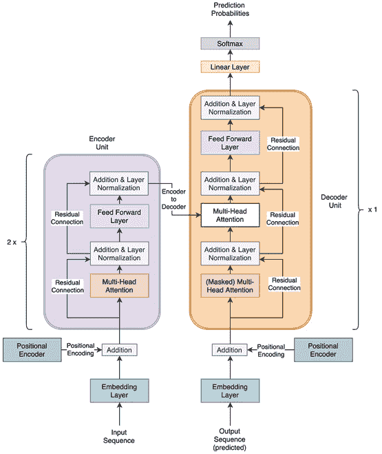
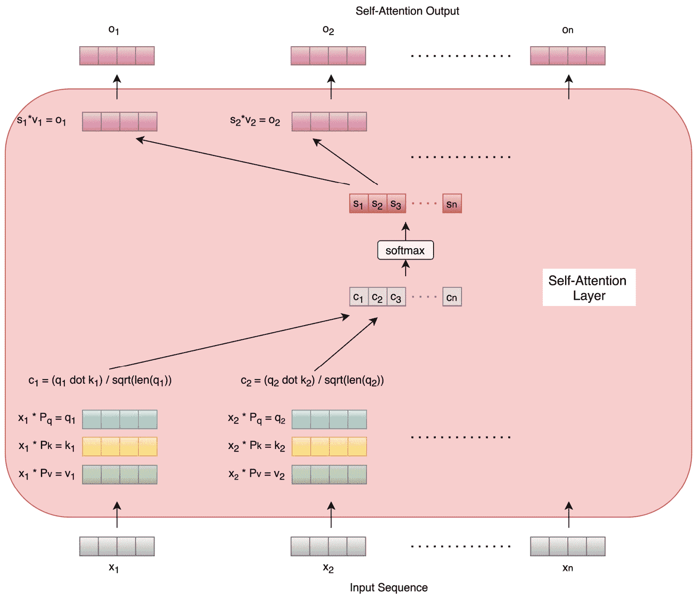
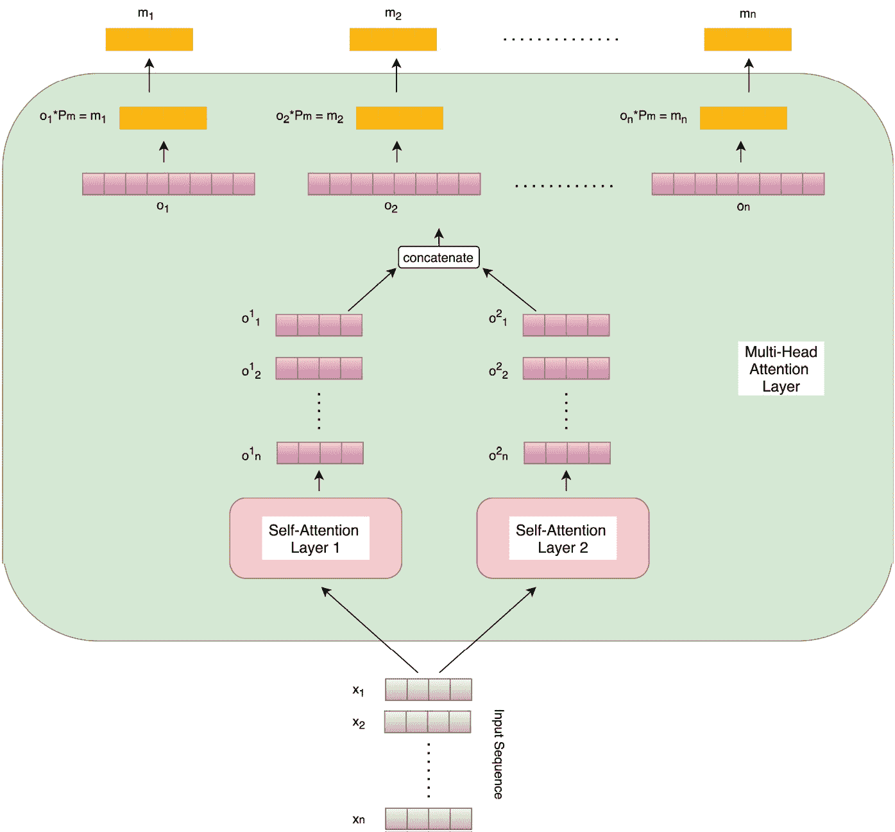
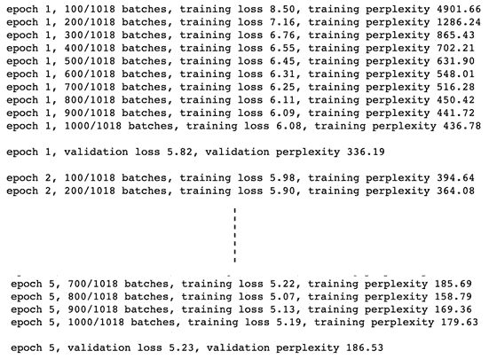
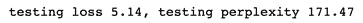
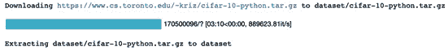
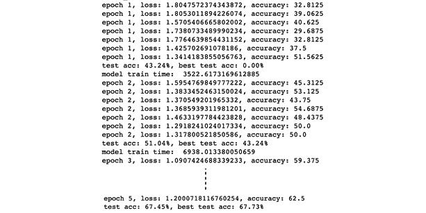
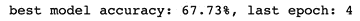
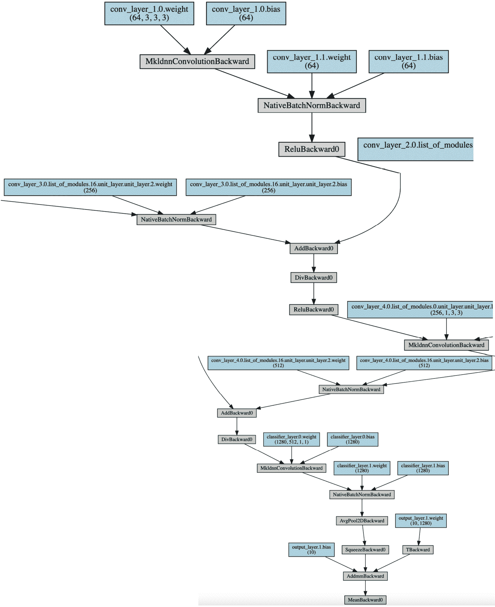

<link href="Styles/Style01.css" rel="stylesheet" type="text/css"> <link href="Styles/Style00.css" rel="stylesheet" type="text/css"> 

# *第五章*:混合动力高级车型

在前两章中，我们广泛了解了各种可用的卷积和递归网络架构，以及它们在 PyTorch 中的实现。在这一章中，我们将看看其他一些深度学习模型架构，这些架构已经被证明在各种机器学习任务上是成功的，并且在本质上既不是纯粹的卷积也不是递归的。我们将从第三章[](B12158_03_Final_ASB_ePUB.xhtml#_idTextAnchor053)**、深度 CNN 架构*和 [*第四章*](B12158_04_Final_ASB_ePUB.xhtml#_idTextAnchor074) *、深度轮回模型架构*中我们停止的地方继续。*

 *首先，我们将探索变形金刚，正如我们在第四章*的 [*结尾所了解到的，深度循环模型架构*在各种顺序任务上已经超越了循环架构。然后，我们将从第三章](B12158_04_Final_ASB_ePUB.xhtml#_idTextAnchor074) *【深度 CNN 架构】结尾的 **EfficientNets** 讨论中继续，并探索生成随机有线神经网络的想法，也称为 **RandWireNNs** 。**

 *通过这一章，我们的目标是总结本书中不同种类的神经网络结构的讨论。完成本章后，您将详细了解 transformers，以及如何使用 PyTorch 将这些强大的模型应用于顺序任务。此外，通过构建您自己的 RandWireNN 模型，您将获得在 PyTorch 中执行神经架构搜索的实践经验。本章分为以下几个主题:

*   为语言建模构建转换器模型
*   从头开始开发 RandWireNN 模型

# 技术要求

我们将在所有练习中使用 Jupyter 笔记本。以下是本章使用`pip`必须安装的 Python 库列表。这里，您必须在命令行上运行`pip install torch==1.4.0`,然后使用以下命令:

```py
jupyter==1.0.0
```

```py
torch==1.4.0
```

```py
tqdm==4.43.0
```

```py
matplotlib==3.1.2
```

```py
torchtext==0.5.0
```

```py
torchvision==0.5.0
```

```py
torchviz==0.0.1
```

```py
networkx==2.4
```

与本章相关的所有代码文件都可以在[https://github . com/packt publishing/Mastering-py torch/tree/master/chapter 05](https://github.com/PacktPublishing/Mastering-PyTorch/tree/master/Chapter05)获得。

# 为语言建模构建转换器模型

在这一节中，我们将探索什么是 transformers 并使用 PyTorch 构建一个用于语言建模的任务。我们还将通过 PyTorch 的预训练模型库，学习如何使用它的一些继任者，如**伯特**和 **GPT** 。在我们开始构建 transformer 模型之前，让我们快速回顾一下什么是语言建模。

## 回顾语言建模

**语言建模**是计算出一个单词或一个单词序列出现的概率的任务，这个单词或单词序列应该在一个给定的单词序列之后。比如给我们*法语是一个漂亮的 _____* 作为我们的单词序列，那么下一个单词是*语言*或*单词*的概率是多少，以此类推？这些概率是通过使用各种概率和统计技术对语言建模来计算的。其思想是观察文本语料库，并通过学习哪些单词一起出现以及哪些单词从不一起出现来学习语法。这样，给定各种不同的序列，语言模型围绕不同单词或序列的出现建立概率规则。

递归模型已经成为学习语言模型的一种流行方式。然而，与许多序列相关的任务一样，变形金刚在这项任务上也胜过了递归网络。我们将通过在维基百科文本语料库上训练英语来实现基于转换器的语言模型。

现在，让我们开始训练一个用于语言建模的转换器。在这个练习中，我们将只演示代码中最重要的部分。完整代码可在[https://github . com/packt publishing/Mastering-py torch/blob/master/chapter 05/transformer . ipynb](https://github.com/PacktPublishing/Mastering-PyTorch/blob/master/Chapter05/transformer.ipynb)获取。

在练习之间，我们将更深入地研究 transformer 架构的各个组件。

在本练习中，我们需要导入一些依赖项。这里列出了一个重要的`import`陈述:

```py
from torch.nn import TransformerEncoder, TransformerEncoderLayer
```

除了导入常规的`torch`依赖项，我们还必须导入一些特定于 transformer 模型的模块；这些都是在火炬图书馆下直接提供的。我们还将导入`torchtext`，以便直接从`torchtext.datasets`下的可用数据集中下载一个文本数据集。

在下一节中，我们将定义 transformer 模型架构，并查看模型组件的细节。

## 了解变压器模型架构

这也许是这项工作中最重要的一步。在这里，我们定义了 transformer 模型的架构。

首先，让我们简单讨论一下模型架构，然后看看定义模型的 PyTorch 代码。下图显示了模型架构:



图 5.1–变压器模型架构

首先要注意的是，这本质上是一个基于编码器-解码器的架构，左边是**编码器单元**(紫色)，右边是**解码器单元**(橙色)。编码器和解码器单元可以多次拼接，用于更深层次的架构。在我们的例子中，我们有两个级联的编码器单元和一个解码器单元。这个编码器-解码器设置实质上意味着编码器将一个序列作为输入，并生成与输入序列中的单词一样多的嵌入(即每个单词一个嵌入)。然后，这些嵌入连同模型迄今所做的预测一起被馈送到解码器。

让我们浏览一下该模型中的各个层:

*   **嵌入层**:这一层仅仅是，用于执行将序列中的每个输入单词转换成数字向量的传统任务；也就是一个嵌入。和往常一样，在这里，我们使用`torch.nn.Embedding`模块对这一层进行编码。
*   **Positional Encoder**: Note that transformers do not have any recurrent layers in their architecture, yet they outperform recurrent networks on sequential tasks. How? Using a neat trick known as *positional encoding*, the model is provided the sense of sequentiality or sequential-order in the data. Basically, vectors that follow a particular sequential pattern are added to the input word embeddings.

    这些向量的生成方式使模型能够理解第二个单词在第一个单词之后，依此类推。使用`sinusoidal`和`cosinusoidal`函数生成向量，以分别表示系统周期性和后续单词之间的距离。在我们的练习中，这一层的实现如下:

    ```py
    class PosEnc(nn.Module):
        def __init__(self, d_m, dropout=0.2, size_limit=5000):
            # d_m is same as the dimension of the embeddings
            pos = torch.arange(0, size_limit, dtype=torch.float).unsqueeze(1)
            divider = torch.exp(torch.arange(0, d_m, 2).float() * (-math.log(10000.0) / d_m))
            # divider is the list of radians, multiplied by position indices of words, and fed to the sinusoidal and cosinusoidal function.  
            p_enc[:, 0::2] = torch.sin(pos * divider)
            p_enc[:, 1::2] = torch.cos(pos * divider)
        def forward(self, x):
            return self.dropout(x + self.p_enc[:x.size(0), :])
    ```

    如你所见，`sinusoidal`和`cosinusoidal`功能被交替使用来代替给出顺序模式。虽然有许多方法来实现位置编码。如果没有位置编码层，模型将无法知道单词的顺序。

*   **多头关注**:在看多头关注层之前，我们先了解一下什么是**自我关注层**。我们在 [*第 4 章*](B12158_04_Final_ASB_ePUB.xhtml#_idTextAnchor074) 、*深度递归模型架构*中讨论了关于递归网络的注意力概念。这里顾名思义，注意机制应用于自我；即序列中的每个单词。序列的每个单词嵌入都经过自我注意层，并产生一个与单词嵌入长度完全相同的单独输出。下图详细描述了这一过程:



图 5.2-自我关注层

我们可以看到，对于每个单词，通过三个可学习的参数矩阵( **Pq** 、 **Pk** 和 **Pv** )生成三个向量。这三个向量是查询向量、键向量和值向量。查询和关键向量被点乘，以产生每个单词的数字。这些数字通过除以每个单词的关键向量长度的平方根来归一化。然后，同时对所有单词的结果数字进行软最大化，以产生最终乘以每个单词的相应值向量的概率。这导致序列的每个字有一个输出向量，输出向量和输入字嵌入的长度是相同的。

多头注意力层是自我注意力层的扩展，其中多个自我注意力模块为每个单词计算输出。这些单独的输出被连接并与另一个参数矩阵( **Pm** )矩阵相乘，以生成最终的输出向量，其长度等于输入嵌入向量的长度。下图显示了多头注意力层，以及我们将在本练习中使用的两个自我注意力单元:



图 5.3–具有两个自我关注单元的多头关注层

拥有多个自我关注的头部有助于不同的头部关注序列单词的不同方面，类似于不同的特征图在卷积神经网络中学习不同的模式。由于这一点，多头注意力层比个体自我注意力层表现得更好，并将在我们的练习中使用。

此外，请注意，解码器单元中的掩蔽多头关注层的工作方式与多头关注层完全相同，只是增加了掩蔽；即，给定处理序列的时间步长 *t* ，从 *t+1* 到 *n* (序列长度)的所有字都被屏蔽/隐藏。

在训练期间，解码器有两种类型的输入。一方面，它从最终编码器接收查询和关键向量作为其(未屏蔽的)多头注意层的输入，其中这些查询和关键向量是最终编码器输出的矩阵变换。另一方面，解码器从先前的时间步骤接收它自己的预测，作为它的掩蔽多头注意层的顺序输入。

*   **Addition and Layer Normalization**: We discussed the concept of a residual connection in [*Chapter 3*](B12158_03_Final_ASB_ePUB.xhtml#_idTextAnchor053)*, Deep CNN Architectures*, while discussing ResNets. In *Figure 5.1*, we can see that there are residual connections across the addition and layer normalization layers. In each instance, a residual connection is established by directly adding the input word embedding vector to the output vector of the multi-head attention layer. This helps with easier gradient flow throughout the network and avoiding problems with exploding and vanishing gradients. Also, it helps with efficiently learning identity functions across layers.

    此外，层标准化被用作标准化技巧。这里，我们独立地归一化每个特征，使得所有特征具有统一的平均值和标准偏差。请注意，在网络的每个阶段，这些加法和归一化分别应用于序列的每个字向量。

*   **前馈层**:在编码器和解码器单元中，序列中所有字的归一化剩余输出向量通过一个公共前馈层。由于单词之间有一组共同的参数，这一层有助于跨序列学习更广泛的模式。
*   **Linear and Softmax Layer** :到目前为止，每一层都在输出一系列向量，每个单词一个。对于我们的语言建模任务，我们需要一个单一的最终输出。线性层将向量序列转换成单个向量，其大小等于我们的词汇的长度。 **Softmax** 层将该输出转换成一个概率矢量，其总和为`1`。这些概率是各个单词(在词汇表中)作为序列中的下一个单词出现的概率。

既然我们已经详细阐述了 transformer 模型的各种元素，那么让我们看看实例化模型的 PyTorch 代码。

### 在 PyTorch 中定义转换器模型

使用前面章节中描述的架构细节，我们现在将编写必要的 PyTorch 代码来定义一个转换器模型，如下所示:

```py
class Transformer(nn.Module):
```

```py
    def __init__(self, num_token, num_inputs, num_heads, num_hidden, num_layers, dropout=0.3):
```

```py
        self.position_enc = PosEnc(num_inputs, dropout)
```

```py
        layers_enc = TransformerEncoderLayer(num_inputs, num_heads, num_hidden, dropout)
```

```py
        self.enc_transformer = TransformerEncoder(layers_enc, num_layers)
```

```py
        self.enc = nn.Embedding(num_token, num_inputs)
```

```py
        self.num_inputs = num_inputs
```

```py
        self.dec = nn.Linear(num_inputs, num_token)
```

正如我们所看到的，在类的`__init__`方法中，由于 PyTorch 的`TransformerEncoder`和`TransformerEncoderLayer`函数，我们不需要自己实现这些。对于我们的语言建模任务，我们只需要单词输入序列的单个输出。因此，解码器只是一个线性层，将来自编码器的向量序列转换为单个输出向量。位置编码器也使用我们之前讨论的定义进行初始化。

在`forward`方法中，输入经过位置编码，然后通过编码器，接着是解码器:

```py
    def forward(self, source):
```

```py
        source = self.enc(source) * math.sqrt(self.num_inputs)
```

```py
        source = self.position_enc(source)
```

```py
        op = self.enc_transformer(source, self.mask_source)
```

```py
        op = self.dec(op)
```

```py
        return op
```

现在我们已经定义了 transformer 模型架构，我们将加载文本语料库来训练它。

### 加载和处理数据集

在本节中，我们将讨论与为我们的任务加载文本数据集并使其可用于模型训练例程相关的步骤。让我们开始吧:

1.  For this exercise, we will be using texts from Wikipedia, all of which are available as the `WikiText-2` dataset.

    数据集引用

    [https://blog . Einstein . ai/the-wikitext-long-term-dependency-language-modeling-dataset/](https://blog.einstein.ai/the-wikitext-long-term-dependency-language-modeling-dataset/)。

    我们将使用`torchtext`的功能来下载数据集(在`torchtext` datasets 下可用)，标记其词汇，并将数据集分为训练集、验证集和测试集:

    ```py
    TEXT = torchtext.data.Field(tokenize=get_tokenizer("basic_english"), lower=True, eos_token='<eos>', init_token='<sos>')
    training_text, validation_text, testing_text = torchtext.datasets.WikiText2.splits(TEXT)
    TEXT.build_vocab(training_text)
    device = torch.device("cuda" if torch.cuda.is_available() else "cpu")
    ```

2.  我们还将定义用于训练和评估的批处理大小，并声明一个批处理生成函数，如下所示:

    ```py
    def gen_batches(text_dataset, batch_size):
        text_dataset = TEXT.numericalize([text_dataset.examples[0].text])
        # distribute dataset across batches evenly
        text_dataset = text_dataset.view(batch_size, -1).t().contiguous()
        return text_dataset.to(device)
    training_batch_size = 32
    training_data = gen_batches(training_text, training_batch_size)
    ```

3.  接下来，我们必须定义最大序列长度并编写一个函数，该函数将为每批生成输入序列和输出目标，相应地:

    ```py
    max_seq_len = 64
    def return_batch(src, k):
        sequence_length = min(max_seq_len, len(src) - 1 - k)
        sequence_data = src[k:k+sequence_length]
        sequence_label = src[k+1:k+1+sequence_length].view(-1)
        return sequence_data, sequence_label
    ```

定义了模型并准备好训练数据后，我们现在将训练 transformer 模型。

### 训练变压器模型

在本节中，我们将定义模型训练所需的超参数，定义模型训练和评估例程，并最终执行训练循环。让我们开始吧:

1.  在这一步中，我们定义所有的模型超参数，并实例化我们的 transformer 模型。下面的代码不言自明:

    ```py
    num_tokens = len(TEXT.vocab.stoi) # vocabulary size
    embedding_size = 256 # dimension of embedding layer
    num_hidden_params = 256 # transformer encoder's hidden (feed forward) layer dimension
    num_layers = 2 # num of transformer encoder layers within transformer encoder
    num_heads = 2 # num of heads in (multi head) attention models
    dropout = 0.25 # value (fraction) of dropout
    loss_func = nn.CrossEntropyLoss()
    lrate = 4.0 # learning rate
    transformer_model = Transformer(num_tokens, embedding_size, num_heads, num_hidden_params, num_layers, dropout).to(device)
    ```

2.  在开始模型训练和评估循环之前，我们需要定义训练和评估例程:

    ```py
    def train_model():
        num_tokens = len(TEXT.vocab.stoi)
        for b, i in enumerate(range(0, training_data.size(0) - 1, max_seq_len)):
            train_data_batch, train_label_batch = return_batch(training_data, i)
            optim_module.zero_grad()
            op = transformer_model(train_data_batch)
            loss_curr = loss_func(op.view(-1, num_tokens), train_label_batch)
            loss_curr.backward()
    torch.nn.utils.clip_grad_norm_(transformer_model.parameters(), 0.6)
            optim_module.step()
            loss_total += loss_curr.item()
    def eval_model(eval_model_obj, eval_data_source):
    ...
    ```

3.  Finally, we must run the model training loop. For demonstration purposes, we are training the model for `5` epochs, but you are encouraged to run it for longer in order to get better performance:

    ```py
    min_validation_loss = float("inf")
    eps = 5 
    best_model_so_far = None
    for ep in range(1, eps + 1):
        ep_time_start = time.time()
        train_model()
        validation_loss = eval_model(transformer_model, validation_data)
        if validation_loss < min_validation_loss:
            min_validation_loss = validation_loss
            best_model_so_far = transformer_model
    ```

    这应该产生以下输出:

    

    图 5.4–变压器培训日志

    除了交叉熵损失，困惑也被报道。**困惑**是自然语言处理中普遍使用的一种度量，用来表示**概率分布**(在我们的例子中是一种语言模型)对样本的拟合或预测程度。复杂度越低，模型对样本的预测就越好。数学上，困惑是交叉熵损失的指数。直观地说，该指标用于表明模型在进行预测时的困惑程度。

4.  Once the model has been trained, we can conclude this exercise by evaluating the model's performance on the test set:

    ```py
    testing_loss = eval_model(best_model_so_far, testing_data)
    print(f"testing loss {testing_loss:.2f}, testing perplexity {math.exp(testing_loss):.2f}")
    ```

    这应该会产生以下输出:



图 5.5–变压器评估结果

在本练习中，我们使用 PyTorch 为语言建模任务构建了一个 transformer 模型。我们详细探讨了 transformer 架构，以及它是如何在 PyTorch 中实现的。我们使用了`WikiText-2`数据集和`torchtext`功能来加载和处理数据集。然后，我们为`5`时代训练了 transformer 模型，并在单独的测试集上对其进行了评估。这将为我们提供开始使用变压器所需的所有信息。

除了 2017 年设计的原始 transformer 模型之外，自以来，多年来已经开发了许多后继模型，尤其是在语言建模领域，例如:

*   **来自变压器** ( **伯特**)的双向编码器表示，2018
*   **生成式预训练变压器** ( **GPT** )，2018
*   2019 年 **GPT-2**
*   **条件变换器语言模型** ( **CTRL** )，2019
*   **变压器-XL** ，2019
*   **蒸馏伯特** ( **蒸馏伯特**)，2019
*   **稳健优化的 BERT 预训练方法** ( **罗伯塔**)，2019
*   2020 年 GPT 三号

虽然我们不会在这一章的中详细介绍这些模型，但是由于 hugging face([https://github.com/huggingface/transformers](https://github.com/huggingface/transformers))开发的`transformers`库，你仍然可以通过 PyTorch 开始使用这些模型。它为各种任务提供了预先训练好的 transformer 系列模型，例如语言建模、文本分类、翻译、问答等等。

除了模型本身，它还为各个模型提供了标记器。例如，如果我们想使用一个预先训练好的 BERT 模型来进行语言建模，一旦我们安装了`transformers`库，我们就需要编写下面的代码:

```py
import torch
```

```py
from transformers import BertForMaskedLM, BertTokenizer
```

```py
bert_model = BertForMaskedLM.from_pretrained('bert-base-uncased')
```

```py
token_gen = BertTokenizer.from_pretrained('bert-base-uncased')
```

```py
ip_sequence = token_gen("I love PyTorch !", return_tensors="pt")["input_ids"]
```

```py
op = bert_model(ip_sequence, labels=ip_sequence)
```

```py
total_loss, raw_preds = op[:2]
```

正如我们所看到的，开始使用基于 BERT 的语言模型只需要几行代码。这证明了 PyTorch 生态系统的力量。我们鼓励你使用`transformers`库，用更复杂的变体来探索这个问题，比如*蒸馏伯特*或*罗伯塔*。更多细节，请参考他们的 GitHub 页面，之前提到过。

我们对变形金刚的探索到此结束。我们通过从头构建一个以及重用预先训练好的模型来做到这一点。自然语言处理领域中变形金刚的发明与计算机视觉领域中的 ImageNet 时刻齐头并进，因此这将是一个活跃的研究领域。PyTorch 将在这类模型的研究和部署中发挥重要作用。

在本章的下一个也是最后一个部分，我们将继续我们在 [*第三章*](B12158_03_Final_ASB_ePUB.xhtml#_idTextAnchor053)T5，深度 CNN 架构末尾提供的神经架构搜索讨论，在那里我们简要讨论了生成最佳网络架构的想法。我们将探索一种模型，在这种模型中，我们不决定模型架构看起来像什么，而是运行一个网络生成器，它将为给定的任务找到一个最优的架构。由此产生的网络被称为**随机连线神经网络** ( **RandWireNN** )，我们将使用 PyTorch 从头开发一个。

# 从头开始开发 RandWireNN 模型

我们在 [*第三章*](B12158_03_Final_ASB_ePUB.xhtml#_idTextAnchor053) *、深度 CNN 架构*中讨论了 EfficientNets，其中我们探讨了寻找最佳模型架构而不是手动指定它的想法。RandWireNNs，或称随机连线神经网络，顾名思义，就是建立在类似的概念上。在本节中，我们将使用 PyTorch 研究并构建我们自己的 RandWireNN 模型。

## 了解 RandWireNNs

首先，使用随机图生成算法来生成具有预定义数量的节点的随机图。通过对其施加一些定义，该图被转换成神经网络，例如:

*   **有向**:图被限制为有向图，边的方向被认为是等价神经网络中数据流的方向。
*   **聚合**:一个节点(或神经元)的多条输入边通过加权和进行聚合，其中权重是可以学习的。
*   **变换**:在这个图的每个节点内，应用一个标准操作:ReLU 后跟 3x3 可分离卷积(即一个常规的 3x3 卷积后跟一个 1x1 逐点卷积)，然后是批量归一化。这个操作也被称为 **ReLU-Conv-BN 三联体**。
*   **分布**:最后，来自每个神经元的多个传出边缘携带前述三联体操作的副本。

拼图中的最后一块是向该图添加单个输入节点(源)和单个输出节点(汇),以便将随机图完全转换为神经网络。一旦图形被实现为神经网络，它就可以被训练用于各种机器学习任务。

在 **ReLU-Conv-BN 三联体单元**中，出于重复性原因，通道/特性的输出数量与通道/特性的输入数量相同。但是，根据手头任务的类型，您可以使用越来越多的下游通道(以及越来越小的数据/图像空间大小)来暂存这些图表。最后，通过以顺序方式将一个图的汇点连接到另一个图的源点，这些分级图可以相互连接。

接下来，以练习的形式，我们将使用 PyTorch 从头构建一个 RandWireNN 模型。

## 使用 PyTorch 开发 RandWireNNs

我们现在将为图像分类任务开发一个 RandWireNN 模型。这将在 CIFAR-10 数据集上执行。我们将从一个空模型开始，生成一个随机图，将其转换为神经网络，在给定的数据集上为给定的任务训练它，评估训练好的模型，最后探索生成的结果模型。在本练习中，出于演示目的，我们将只展示代码的重要部分。要访问完整代码，请访问 https://github . com/packt publishing/Mastering-py torch/blob/master/chapter 05/rand _ wire _ nn . ipynb。

### 定义训练程序并加载数据

在本练习的第一小节中，我们将定义模型训练循环将调用的训练函数，并定义我们的数据集加载器，它将为我们提供用于训练的批量数据。让我们开始吧:

1.  首先，我们需要导入一些库。在本练习中将使用的一些新库如下:

    ```py
    from torchviz import make_dot
    import networkx as nx
    ```

2.  接下来，我们必须定义训练例程，该例程接受一个经过训练的模型，该模型可以在给定 RGB 输入图像的情况下产生预测概率:

    ```py
    def train(model, train_dataloader, optim, loss_func, epoch_num, lrate):
        for training_data, training_label in train_dataloader:
            pred_raw = model(training_data)
            curr_loss = loss_func(pred_raw, training_label)
            training_loss += curr_loss.data
        return training_loss / data_size, training_accuracy / data_size
    ```

3.  Next, we define the dataset loader. We will use the `CIFAR-10` dataset for this image classification task, which is a well-known database of 60,000 32x32 RGB images labeled across 10 different classes containing 6,000 images per class. We will use the `torchvision.datasets` module to directly load the data from the torch dataset repository.

    数据集引用

    从微小的图像中学习多层特征。

    代码如下:

    ```py
    def load_dataset(batch_size):
        train_dataloader = torch.utils.data.DataLoader(
            datasets.CIFAR10('dataset', transform=transform_train_dataset, train=True, download=True),
            batch_size=batch_size,  shuffle=True)
        return train_dataloader, test_dataloader
    train_dataloader, test_dataloader = load_dataset(batch_size)
    ```

    这将为我们提供以下输出:



图 5.6–RandWireNN 数据加载

我们现在将继续设计神经网络模型。为此，我们需要设计随机连线图。

### 定义随机连线图

在本节中，我们将定义一个图形生成器，以生成一个随机图形，该图形稍后将被用作神经网络。让我们开始吧:

如下面的代码所示，我们必须定义随机图形生成器类:

```py
class RndGraph(object):
```

```py
    def __init__(self, num_nodes, graph_probability, nearest_neighbour_k=4, num_edges_attach=5):
```

```py
    def make_graph_obj(self):
```

```py
        graph_obj = nx.random_graphs.connected_watts_strogatz_graph(self.num_nodes, self.nearest_neighbour_k,self.graph_probability)
```

```py
        return graph_obj
```

在本练习中，我们将使用一个众所周知的 n 随机图模型——**瓦特·斯特罗加兹(WS)** 模型。这是关于 RandWireNNs 的原始研究论文中试验的三个模型之一。在这个模型中，有两个参数:

*   每个节点的邻居数量(应该严格为偶数)， *K*
*   重新布线的概率， *P*

首先，图的所有 *N* 节点以环形方式组织，并且每个节点连接到其左侧的 *K/2* 节点和其右侧的 *K/2* 节点。然后，我们顺时针 *K/2* 次遍历每个节点。在第 *m* 次遍历( *0 < m < K/2* 时，当前节点与其右侧第 *m* 个邻居之间的边以概率 *P* 被*重连线。*

这里的重布线是指在当前节点和另一个不同于自己的节点之间，以及第 *m* 个邻居之间，边被另一条边代替。在前面的代码中，我们的随机图生成器类的`make_graph_obj`方法使用`networkx`库实例化了 WS 图模型。

在前面的代码中，我们的随机图形生成器类的 make_graph_obj 方法使用 networkx 库实例化 WS 图形模型。

此外，我们添加了一个`get_graph_config`方法来返回图中节点和边的列表。当我们将抽象图形转换成神经网络时，这将会派上用场。出于再现性和效率的原因，我们还将定义一些图形保存和加载方法来缓存生成的图形:

```py
    def get_graph_config(self, graph_obj):
```

```py
        return node_list, incoming_edges
```

```py
    def save_graph(self, graph_obj, path_to_write):
```

```py
        nx.write_yaml(graph_obj, "./cached_graph_obj/" + path_to_write)
```

```py
    def load_graph(self, path_to_read):
```

```py
        return nx.read_yaml("./cached_graph_obj/" + path_to_read)
```

接下来，我们将致力于创建实际的神经网络模型。

### 定义 RandWireNN 模型模块

现在我们有了随机的图形生成器，我们需要把它转换成一个神经网络。但在此之前，我们将设计一些神经模块来促进这种转化。让我们开始吧:

1.  Starting from the lowest level of the neural network, first, we will define a separable 2D convolutional layer, as follows:

    ```py
    class SepConv2d(nn.Module):
        def __init__(self, input_ch, output_ch, kernel_length=3, dilation_size=1, padding_size=1, stride_length=1, bias_flag=True):
            super(SepConv2d, self).__init__()
            self.conv_layer = nn.Conv2d(input_ch, input_ch, kernel_length, stride_length, padding_size, dilation_size, bias=bias_flag, groups=input_ch)
            self.pointwise_layer = nn.Conv2d(input_ch, output_ch, kernel_size=1, stride=1, padding=0, dilation=1, groups=1, bias=bias_flag)
        def forward(self, x):
            return self.pointwise_layer(self.conv_layer(x))
    ```

    可分离卷积层是常规 3×3 2D 卷积层的级联，其后是逐点 1×1 2D 卷积层。

    定义了可分离 2D 卷积层后，我们现在可以定义 ReLU-Conv-BN 三元组单元:

    ```py
    class UnitLayer(nn.Module):
        def __init__(self, input_ch, output_ch, stride_length=1):
            self.unit_layer = nn.Sequential(
                nn.ReLU(),
                SepConv2d(input_ch, output_ch, stride_length=stride_length),nn.BatchNorm2d(output_ch),nn.Dropout(self.dropout)
            )
        def forward(self, x):
            return self.unit_layer(x)
    ```

    正如我们前面提到的，三元组单元是一个 ReLU 层的级联，后面是一个可分离的 2D 卷积层，再后面是一个批量归一化层。我们还必须添加一个正则化的辍学层。

    有了三元组单元，我们现在可以用我们需要的所有`aggregation`、`transformation`和`distribution`功能在图中定义一个节点，如本练习开始时所讨论的:

    ```py
    class GraphNode(nn.Module):
        def __init__(self, input_degree, input_ch, output_ch, stride_length=1):
            self.unit_layer = UnitLayer(input_ch, output_ch, stride_length=stride_length)
        def forward(self, *ip):
            if len(self.input_degree) > 1:
                op = (ip[0] * torch.sigmoid(self.params[0]))
                for idx in range(1, len(ip)):
                    op += (ip[idx] * torch.sigmoid(self.params[idx]))
                return self.unit_layer(op)
            else:
                return self.unit_layer(ip[0])
    ```

    在`forward`方法中，我们可以看到，如果节点的传入边的数量大于`1`，则计算加权平均值，并且这些权重是该节点的可学习的参数。将三元组单元应用于加权平均值，并返回变换后的(ReLU-Conv-BN-ed)输出。

2.  We can now consolidate all of our graph and graph node definitions in order to define a randomly wired graph class, as shown here:

    ```py
    class RandWireGraph(nn.Module):
        def __init__(self, num_nodes, graph_prob, input_ch, output_ch, train_mode, graph_name):
            # get graph nodes and in edges
            rnd_graph_node = RndGraph(self.num_nodes, self.graph_prob)
            if self.train_mode is True:
                rnd_graph = rnd_graph_node.make_graph_obj()
                self.node_list, self.incoming_edge_list = rnd_graph_node.get_graph_config(rnd_graph)
            else:
            # define source Node
            self.list_of_modules = nn.ModuleList([GraphNode(self.incoming_edge_list[0], self.input_ch, self.output_ch, 
    stride_length=2)])
            # define the sink Node
    self.list_of_modules.extend([GraphNode(self.incoming_edge_list[n], self.output_ch, self.output_ch) 
                                         for n in self.node_list if n > 0])
    ```

    在这个类的`__init__`方法中，首先生成一个抽象的随机图。它的节点和边的列表被导出。使用`GraphNode`类，这个抽象随机图的每个抽象节点被封装为所需神经网络的一个神经元。最后，将源或输入节点和接收器或输出节点添加到网络，以使神经网络为图像分类任务做好准备。

    `forward`方法也非常规，如下所示:

    ```py
        def forward(self, x):
            # source vertex
            op = self.list_of_modules[0].forward(x)
            mem_dict[0] = op
            # the rest of the vertices
            for n in range(1, len(self.node_list) - 1):
                if len(self.incoming_edge_list[n]) > 1:
                    op = self.list_of_modules[n].forward(*[mem_dict[incoming_vtx] 
                                                           for incoming_vtx in self.incoming_edge_list[n]])
                mem_dict[n] = op
            for incoming_vtx in range(1, len(self.incoming_edge_list[self.num_nodes + 1])):
                op += mem_dict[self.incoming_edge_list[self.num_nodes + 1][incoming_vtx]]
            return op / len(self.incoming_edge_list[self.num_nodes + 1])
    ```

首先，为源神经元运行一个正向过程，然后基于图的`list_of_nodes`为后续神经元运行一系列正向过程。使用`list_of_modules`执行单独的向前传球。最后，通过接收神经元的正向传递给我们这个图的输出。

接下来，我们将使用这些已定义的模块和随机连线图类来构建实际的 RandWireNN 模型类。

### 将随机图转换成神经网络

在上一步中，我们定义了一个随机连线图。然而，正如我们在本练习开始时提到的，随机连线的神经网络由几个分阶段的随机连线图组成。其背后的基本原理是当我们在图像分类任务中从输入神经元前进到输出神经元时，具有不同(增加)数量的通道/特征。这对于仅仅一个随机连线图是不可能的，因为根据设计，通过一个这样的图，通道的数量是恒定的。让我们开始吧:

1.  In this step, we define the ultimate randomly wired neural network. This will have three randomly wired graphs cascaded next to each other. Each graph will have double the number of channels compared to the previous graph to help us align with the general practice of increasing the number of channels (while downsampling spatially) in an image classification task:

    ```py
    class RandWireNNModel(nn.Module):
        def __init__(self, num_nodes, graph_prob, input_ch, output_ch, train_mode):
            self.conv_layer_1 = nn.Sequential(
                nn.Conv2d(in_channels=3, out_channels=self.output_ch, kernel_size=3, padding=1),
                nn.BatchNorm2d(self.output_ch) )
            self.conv_layer_2 = … 
            self.conv_layer_3 = … 
            self.conv_layer_4 = … 
            self.classifier_layer = nn.Sequential(
                nn.Conv2d(in_channels=self.input_ch*8, out_channels=1280, kernel_size=1), nn.BatchNorm2d(1280))
            self.output_layer = nn.Sequential(nn.Dropout(self.dropout), nn.Linear(1280, self.class_num))
    ```

    `__init__`方法从一个常规的 3×3 卷积层开始，随后是三个阶段随机连线图，信道数量翻倍。接下来是一个全连接层，它将最后一个随机连线图的最后一个神经元的卷积输出展平为一个大小为`1280`的向量。

2.  最后，另一个完全连接的层产生一个 10 大小的向量，包含 10 个类别的概率，如下:

    ```py
        def forward(self, x):
            x = self.conv_layer_1(x)
            x = self.conv_layer_2(x)
            x = self.conv_layer_3(x)
            x = self.conv_layer_4(x)
            x = self.classifier_layer(x)
            # global average pooling
            _, _, h, w = x.size()
            x = F.avg_pool2d(x, kernel_size=[h, w])
            x = torch.squeeze(x)
            x = self.output_layer(x)
            return x
    ```

除了在第一个完全连接的层之后立即应用的全局平均池化之外，`forward`方法是非常自明的。这有助于减少维数和网络中的参数数量。

在这个阶段，我们已经成功地定义了 RandWireNN 模型，加载了数据集，并定义了模型训练例程。现在，我们已经准备好运行模型训练循环。

### 训练 RandWireNN 模型

在本节中，我们将设置模型的超参数并训练 RandWireNN 模型。让我们开始吧:

1.  我们已经为我们的练习定义了所有的构件。现在，是时候执行它了。首先，让我们声明必要的超参数:

    ```py
    num_epochs = 5
    graph_probability = 0.7
    node_channel_count = 64
    num_nodes = 16
    lrate = 0.1
    batch_size = 64
    train_mode = True
    ```

2.  声明超参数后，我们实例化 RandWireNN 模型，以及优化器和损失函数:

    ```py
    rand_wire_model = RandWireNNModel(num_nodes, graph_probability, node_channel_count, node_channel_count, train_mode).to(device)
    optim_module = optim.SGD(rand_wire_model.parameters(), lr=lrate, weight_decay=1e-4, momentum=0.8)
    loss_func = nn.CrossEntropyLoss().to(device)
    ```

3.  Finally, we begin training the model. We're training the model for `5` epochs here for demonstration purposes, but you are encouraged to train for longer to see the boost in performance:

    ```py
    for ep in range(1, num_epochs + 1):
        epochs.append(ep)
        training_loss, training_accuracy = train(rand_wire_model, train_dataloader, optim_module, loss_func, ep, lrate)
        test_accuracy = accuracy(rand_wire_model, test_dataloader)
        test_accuracies.append(test_accuracy)
        training_losses.append(training_loss)
        training_accuracies.append(training_accuracy)
        if best_test_accuracy < test_accuracy:
            torch.save(model_state, './model_checkpoint/' + model_filename + 'ckpt.t7')
        print("model train time: ", time.time() - start_time)
    ```

    这应该会产生以下输出:



图 5.7–RandWireNN 培训日志

从这些日志中可以明显看出，随着时代的发展，模型正在逐步学习。验证集的性能似乎一直在增加，这表明模型的可推广性。

这样，我们已经创建了一个模型，没有特定的架构，可以合理地在 CIFAR-10 数据集上执行图像分类任务。

### 评估和可视化 RandWireNN 模型

最后，在直观地简单探索模型架构之前，我们将看看这个模型的测试集性能。让我们开始吧:

1.  Once the model has been trained, we can evaluate it on the test set:

    ```py
    rand_wire_nn_model.load_state_dict(model_checkpoint['model'])
    for test_data, test_label in test_dataloader:
        success += pred.eq(test_label.data).sum()
        print(f"test accuracy: {float(success) * 100\. / len(test_dataloader.dataset)} %")
    ```

    这应该会产生以下输出:

    

    图 5.8-RandWireNN 评估结果

    表现最好的模型出现在第四个历元，准确率超过 67%。虽然该模型还不完善，但我们可以对其进行更多时期的训练，以达到更好的性能。此外，用于该任务的随机模型将以 10%的精度执行(因为有 10 个同样可能的类)，因此 67.73%的精度仍然是有希望的，特别是考虑到我们使用随机生成的神经网络架构的事实。

2.  为了结束这个练习，让我们来看一下所学的模型架构。下图显示了学习到的网络架构的样子:



图 5.9–RandWireNN 架构

从这张图中，我们可以观察到以下要点:

*   在前面的图的左侧，我们有完整的模型架构。由于单个组件在完整的模型图像中几乎不可见，我们必须放大它的某些部分。
*   在右上角，我们可以看到这个神经网络的开始，它由 64 通道 3x3 2D 卷积层组成，然后是 64 通道 1x1 逐点 2D 卷积层。
*   在中右，我们可以看到第三阶段和第四阶段随机图之间的过渡，我们可以看到第三阶段随机图的接收神经元`conv_layer_3`，后面是第四阶段随机图的源神经元`conv_layer_4`。
*   最后，上图的右下角显示了最终的输出层 stage 4 随机图的 sink 神经元(512 通道可分离 2D 卷积层),接着是全连接展平层，产生 1280 大小的特征向量，接着是全连接 softmax 层，产生 10 个类概率。

因此，我们已经建立、训练、测试和可视化了用于图像分类的神经网络模型，而没有指定任何特定的模型架构。我们确实指定了该结构的一些总体约束，例如倒数第二个特征向量长度(`1280`)、可分离 2D 卷积层中的通道数量(`64`)、RandWireNN 模型中的级数(`4`)、每个神经元的定义(ReLU-Conv-BN 三元组)等等。

然而，我们没有指定这个神经网络架构的结构应该是什么样子。我们使用了一个随机图形生成器来完成这项工作，这为我们找到最佳神经网络架构提供了几乎无限的可能性。

神经架构搜索是深度学习领域中正在进行的、有前途的研究领域。在很大程度上，这非常适合为特定任务训练定制机器学习模型的领域，称为 AutoML。

**AutoML** 代表**自动化机器学习**，因为它不再需要手动加载数据集，预定义特定的神经网络模型架构来解决给定的任务，并手动将模型部署到生产系统中。在 [*第十二章*](B12158_12_Final_ASB_ePUB.xhtml#_idTextAnchor281) *、PyTorch 和 AutoML* 中，我们将详细讨论 AutoML，并学习如何用 PyTorch 构建这样的系统。

# 总结

在这一章中，我们研究了两种不同的混合类型的神经网络。首先，我们研究了 transformer 模型——这是一种基于注意力的模型，没有循环连接，在多个连续任务中表现优于所有循环模型。我们进行了一个练习，在这个练习中，我们使用 PyTorch 在 WikiText-2 数据集上构建、训练和评估了一个语言建模任务的 transformer 模型。在这个练习中，我们通过解释的架构图以及相关的 PyTorch 代码，详细探索了 transformer 架构。

我们通过简要讨论变形金刚的后继者——如伯特、GPT 等模型，结束了第一部分。我们展示了 PyTorch 如何帮助我们在不到五行的代码中加载这些高级模型的预训练版本。

在本章的第二部分也是最后一部分，我们从第三章 *的 [*处继续，深入 CNN 架构*处，我们讨论了优化模型架构的想法，而不是在修复架构时仅优化模型参数。我们探索了实现这一目标的方法之一——使用随机连线神经网络(RandWireNNs)——我们生成随机图形，为这些图形的节点和边赋予意义，并将这些图形相互连接以形成神经网络。](B12158_03_Final_ASB_ePUB.xhtml#_idTextAnchor053)*

我们在 CIFAR-10 数据集上建立、训练和评估了用于图像分类任务的 RandWireNN 模型。我们还直观地研究了生成的模型架构，并放大了它的某些部分，以了解为该任务生成了什么样的网络结构。

在下一章，我们将转换话题，离开模型架构，看看一些有趣的 PyTorch 应用程序。我们将学习如何使用 PyTorch 通过生成式深度学习模型生成音乐和文本。**