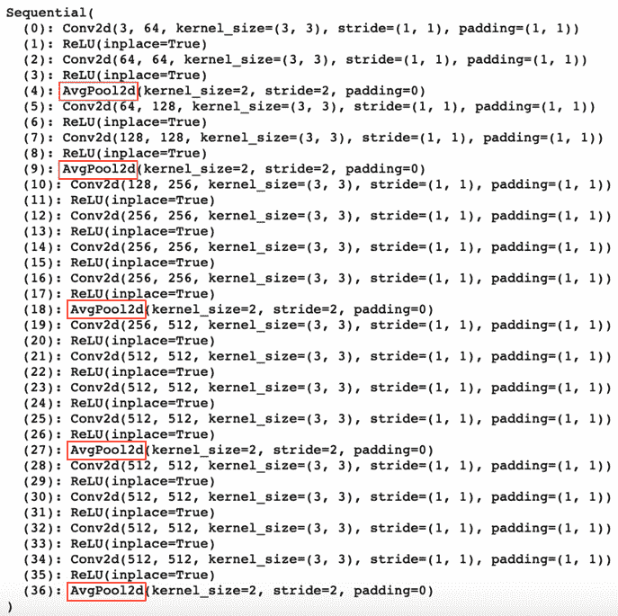

  

# 七、神经风格迁移

在前一章，我们开始使用 PyTorch 探索生成模型。我们建立了机器学习模型，可以通过在没有监督的情况下分别对文本和音乐数据进行训练来生成文本和音乐。在本章中，我们将通过对图像数据应用类似的方法来继续探索生成式建模。

我们将混合两个不同图像 **A** 和 **B** 的不同方面，以生成合成图像 **C** ，其中包含图像 **A** 的内容和图像 **B** 的样式。这项任务通常也被称为**神经样式迁移**，因为在某种程度上，我们正在将图像 **B** 的样式迁移到图像 **A** 以获得图像 **C** ，如下图所示:


F 图 7.1–神经类型迁移示例

首先，我们将简要讨论如何处理这个问题，并理解实现风格转换背后的想法。使用 PyTorch，我们将实现我们自己的神经风格迁移系统，并将其应用于一对图像。通过这个实现练习，我们还将尝试理解风格转换机制中不同参数的效果。

到本章结束时，你将理解神经类型迁移背后的概念，并能够使用 PyTorch 建立和测试你自己的神经类型迁移模型。

本章涵盖以下主题:

*   了解如何在图像间转换风格
*   用 PyTorch 实现神经风格转换

# 技术要求

我们将在所有练习中使用 Jupyter 笔记本。

这里列出了使用`pip`必须为本章安装的 Python 库。例如，在这里，您必须在命令行上运行`pip install torch==1.4.0`等等:

```py
jupyter==1.0.0
```

```py
torch==1.4.0
```

```py
torchvision==0.5.0
```

```py
matplotlib==3.1.2
```

```py
Pillow==8.0.1
```

与本章相关的所有代码文件都可以在[https://github . com/packt publishing/Mastering-py torch/tree/master/chapter 07](https://github.com/PacktPublishing/Mastering-PyTorch/tree/master/Chapter07)获得。

# 了解如何在图像间传递风格

在 [*第三章*](B12158_03_Final_ASB_ePUB.xhtml#_idTextAnchor053) 、*深度 CNN 架构*中，我们详细讨论了**卷积神经网络**(**CNN**)。CNN在处理图像数据时很大程度上是最成功的一类模型。我们已经看到，基于 CNN 的架构是在图像分类、对象检测等任务中表现最好的神经网络架构。这一成功背后的核心原因之一是卷积层学习空间表示的能力。

例如，在狗与猫的分类器中，CNN 模型基本上能够捕捉图像的高级特征内容，这有助于它根据猫的特定特征检测狗的特定特征。我们将利用图像分类器 CNN 的这种能力来掌握图像的内容。

我们知道 VGG 是一个强大的图像分类模型，正如 [*第三章*](B12158_03_Final_ASB_ePUB.xhtml#_idTextAnchor053)*深度 CNN 架构*中讨论的。我们将使用 VGG 模型的卷积部分(不包括线性层)从图像中提取内容相关的特征。

我们知道每个卷积层产生，比如说，N 个维度为 *X*Y* 的特征图。例如，假设我们有一个大小为(3，3)的单通道(灰度)输入图像和一个卷积层，其中输出通道的数量( *N* )为 3，内核大小为(2，2)，步长为(1，1)，并且没有填充。这个卷积层将产生 3 个( *N* )特征图，每个尺寸为 2x2，因此在这种情况下 *X* =2 和 *Y* =2。

我们可以将卷积层产生的这些 *N* 特征图表示为大小为 *N*M* 的 2D 矩阵，其中 *M=X*Y* 。通过将每个卷积层的输出定义为 2D 矩阵，我们可以定义每个卷积层的损失函数。这个损失函数称为**内容损失**，是卷积层的预期和预测输出之间的平方损失，如下图所示，其中 *N* =3， *X* =2， *Y* =2:


图 7.2-内容丢失示意图

我们可以看到，本例中的输入图像(图像 *C* ，按照我们在*图 7.1* 中的标注)通过**卷积** ( **conv** ) **层**转化为**三幅特征图**。这三个特征图的大小分别为 2×2，被格式化为 3×4 矩阵。将该矩阵与预期输出进行比较，预期输出是通过将图像 *A* (内容图像)通过相同的流而获得的。然后计算逐像素平方的总损失，我们称之为的**内容损失**。

现在，为了从图像中提取样式，我们将使用从简化的 2D 矩阵表示的行之间的内积导出的格拉姆矩阵，如下图所示:


图 7.3–风格损失示意图

格拉姆矩阵

你可以在这里阅读更多关于克矩阵的内容:[https://mathworld.wolfram.com/GramMatrix.html](https://mathworld.wolfram.com/GramMatrix.html)。

与内容损失计算相比，**克矩阵**计算是唯一的额外步骤。此外，正如我们所看到的，与内容损失相比，像素平方和损失的输出是一个相当大的数字。因此，这个数字通过除以 *N*X*Y* 来归一化；即特征地图的数量( *N* )乘以特征地图的长度( *X* )乘以宽度( *Y* )。这也有助于跨不同卷积层标准化风格损失度量，这些卷积层具有不同的 *N* 、 *X* 和 *Y* 。实现的细节可以在介绍神经风格迁移的原始论文中找到:【https://arxiv.org/pdf/1508.06576.pdf】T21。

现在我们理解了内容和风格损失的概念，让我们来看看神经风格迁移是如何工作的，如下:

1.  对于给定的 VGG(或任何其他 CNN)网络，我们定义网络中的哪些卷积层应该附加有内容丢失。重复这个练习，减少风格损失。
2.  一旦我们有了这些列表，我们就通过网络传递内容图像，并在要计算内容损失的卷积层计算预期的卷积输出(2D 矩阵)。
3.  接下来，我们通过网络传递样式图像，并在卷积层计算预期的 gram 矩阵。这是计算样式损失的地方，如下图所示。

例如，在下图中，内容损失将在第二和第三卷积层计算，而样式损失将在第二、第三和第五卷积层计算:


图 7.4–风格转换架构示意图

既然我们已经在决定的卷积层上有了内容和样式目标，我们就可以生成包含内容图像的内容和样式图像的样式的图像了。

对于初始化，我们可以使用随机噪声矩阵作为生成图像的起点，或者直接使用内容图像开始。我们通过网络传递此图像，并计算预选卷积层的样式和内容损失。我们加上样式损失以得到总的样式损失，加上内容损失以得到总的内容损失。最后，我们将这两个分量加权求和，得出总损耗。

如果我们给样式组件更多的权重，那么生成的图像将会反映更多的样式，反之亦然。使用梯度下降，我们将损失一路反向传播回输入，以便更新我们生成的图像。在几个时期之后，所生成的图像应该以这样的方式发展，即它产生最小化各自损失的内容和风格表示，从而产生风格迁移的图像。

在上图中，池层是基于平均池的，而不是传统的最大池。平均池特意用于风格迁移，以确保平滑的梯度流动。我们希望生成的图像在像素之间没有明显的变化。此外，值得注意的是，上图中的网络终止于计算最后一个样式或内容损失的层。因此，在这种情况下，因为没有与原始网络的第六卷积层相关联的损失，所以在风格迁移的上下文中讨论第五卷积层以外的层是没有意义的。

在下一节中，我们将使用 PyTorch 实现我们自己的神经风格迁移系统。在一个预先训练好的 VGG 模型的帮助下，我们将使用我们在本节中讨论的概念来生成艺术风格的图像。我们还将探讨调整各种模型参数对生成图像的内容和纹理/风格的影响。

# 使用 PyTorch 实现神经风格转换

已经讨论了神经风格迁移系统的内部结构，我们都准备使用 PyTorch 来构建一个。在练习的形式中，我们将加载一个样式和一个内容图像。然后，我们将加载预训练的 VGG 模型。在定义了要计算样式和内容损失的层之后，我们将修剪模型，以便它只保留相关的层。最后，我们将训练神经类型迁移模型，以便逐时段地改进所生成的图像。

## 加载内容和样式图片

在本练习中，出于演示目的，我们将仅展示代码的重要部分。要访问完整代码，请访问[https://github . com/packt publishing/Mastering-py torch/blob/master/chapter 07/neural _ style _ transfer . ipynb](https://github.com/PacktPublishing/Mastering-PyTorch/blob/master/Chapter07/neural_style_transfer.ipynb)。请遵循以下步骤:

1.  Firstly, we need to import the necessary libraries by running the following lines of code:

    ```py
    from PIL import Image
    import matplotlib.pyplot as pltimport torch
    import torch.nn as nn
    import torch.optim as optim
    import torchvisiondvc = torch.device("cuda" if torch.cuda.is_available() else "cpu")
    ```

    我们导入与图像 I/O 相关的库来加载内容和样式图像，并显示生成的图像。我们还为风格迁移模型的训练导入了标准的 Torch 依赖，以及用于加载预训练的 VGG 模型和其他计算机视觉相关实用程序的`torchvision`库。

2.  Next, we need a style and content image. We will use [https://unsplash.com/](https://unsplash.com/) to download an image of each kind. The downloaded images are included in the code repository for this book. In the following code, we are writing a function that will load the images as tensors:

    ```py
    def image_to_tensor(image_filepath,  image_dimension=128):
        img = Image.open(image_filepath).convert('RGB')
        # display image
        … 
        torch_transformation =       torchvision.transforms.Compose([
            torchvision.transforms.Resize(img_size),
            torchvision.transforms.ToTensor()
                                  ])
        img = torch_transformation(img).unsqueeze(0)
        return img.to(dvc, torch.float)
    style_image = image_to_tensor("./img/style.jpg")
    content_image =image_to_tensor("./img/content.jpg")
    ```

    这将为我们提供以下输出:


图 7.5–样式和内容图像

因此，内容图像是*泰姬陵*的真实照片，而风格图像是一幅艺术绘画。使用风格转换，我们希望产生一个艺术的*泰姬陵*画。然而，在我们这样做之前，我们需要加载和调整 VGG19 模型。

## 加载和修剪预训练的 VGG19 模型

在这部分练习中，我们将使用预训练的 VGG 模型，并保留其卷积层。我们将对模型做一些小的改动，使其可用于神经类型的迁移。让我们开始吧:

1.  We already have the content and style images. Here, we will load the pre-trained VGG19 model and use its convolutional layers to generate the content and style targets to yield the content and style losses, respectively:

    ```py
    vgg19_model = torchvision.models.vgg19(pretrained=True).to(dvc)
    print(vgg19_model)
    ```

    输出应该如下所示:

    

    图 7.6–vgg 19 型号

2.  We do not need the linear layers; that is, we only need the convolutional part of the model. In the preceding code, this can be achieved by only retaining the `features` attribute of the model object, as follows:

    ```py
    vgg19_model = vgg19_model.features
    ```

    注意

    在本练习中，我们不打算调整 VGG 模型的参数。我们要调整的只是生成图像的像素，就在模型的输入端。因此，我们将确保加载的 VGG 模型的参数是固定的。

3.  我们必须用以下代码冻结 VGG 模型的参数:

    ```py
    for param in vgg19_model.parameters():
        param.requires_grad_(False)
    ```

4.  Now that we've loaded the relevant section of the VGG model, we need to change the `maxpool` layers into average pooling layers, as discussed in the previous section. While doing so, we will take note of where the convolutional layers are located in the model:

    ```py
    conv_indices = []for i in range(len(vgg19_model)):
        if vgg19_model[i]._get_name() == 'MaxPool2d':
            vgg19_model[i] =  nn.AvgPool2d(kernel_size=vgg19_model[i].kernel_size, 
    stride=vgg19_model[i].stride, padding=vgg19_model[i].padding)
        if vgg19_model[i]._get_name() == 'Conv2d':
            conv_indices.append(i)
    ```

    conv 指数=字典(枚举(conv 指数，1))打印(vgg19 _ 模型)

    输出应该如下所示:



图 7.7–修改后的 VGG19 模型

正如我们所见，线性层已被移除，最大池层已被平均池层取代，如前图中的红框所示。

在前面的步骤中，我们加载了一个预训练的 VGG 模型，并对其进行了修改，以便将其用作神经类型迁移模型。接下来，我们将把这个修正的 VGG 模型转换成一个神经类型迁移模型。

## 建立神经风格迁移模型

此时，我们可以定义我们希望在哪些卷积层上计算内容和样式损失。在原始论文中，样式损失在前五个卷积层上计算，而内容损失仅在第四个卷积层上计算。我们将遵循相同的约定，尽管我们鼓励您尝试不同的组合，并观察它们对生成的图像的影响。请遵循以下步骤:

1.  First, we list the layers we need to have the style and content loss on:

    ```py
    layers = {1: 's', 2: 's', 3: 's', 4: 'sc', 5: 's'}
    ```

    这里，我们定义了第一至第五卷积层，它们与样式损失相关，第四卷积层与内容损失相关。

2.  Now, let's remove the unnecessary parts of the VGG model. We shall only retain it until the fifth convolutional layer, as shown here:

    ```py
    vgg_layers = nn.ModuleList(vgg19_model)
    last_layer_idx = conv_indices[max(layers.keys())]
    vgg_layers_trimmed = vgg_layers[:last_layer_idx+1]
    neural_style_transfer_model = nn.Sequential(*vgg_layers_trimmed)
    print(neural_style_transfer_model)
    ```

    这将为我们提供以下输出:


图 7.8–神经类型迁移模型对象

正如我们所见，我们已经将具有 16 个卷积层的 VGG 模型转换为具有 5 个卷积层的神经式传输模型。

## 训练风格迁移模型

在这一部分，我们将开始处理将要生成的图像。我们可以用很多方法初始化这个图像，比如使用随机噪声图像或者使用内容图像作为初始图像。目前，我们将从随机噪声开始。稍后，我们还将看到使用内容图像作为起点如何影响结果。请遵循以下步骤:

1.  The following code demonstrates the process of initializing a `torch` tensor with random numbers:

    ```py
    # initialize as the content image
    # ip_image = content_image.clone()
    # initialize as random noise:
    ip_image = torch.randn(content_image.data.size(), device=dvc)
    plt.figure()
    plt.imshow(ip_image.squeeze(0).cpu().detach().numpy().transpose(1,2,0).clip(0,1));
    ```

    这将为我们提供以下输出:

    

    图 7.9–随机噪声图像

2.  最后，我们可以开始模型训练循环了。首先，我们将定义要训练的时期数、为样式和内容损失提供的相对权重，并实例化 Adam 优化器，用于基于梯度下降的优化，学习速率为`0.1` :

    ```py
    num_epochs=180
    wt_style=1e6
    wt_content=1
    style_losses = []
    content_losses = []
    opt = optim.Adam([ip_image.requires_grad_()], lr=0.1)
    ```

3.  在开始训练循环时，我们在时期开始时将样式和内容损失初始化为零，然后为了数值稳定性在`0`和`1`之间剪切输入图像的像素值:

    ```py
    for curr_epoch in range(1, num_epochs+1):    
        ip_image.data.clamp_(0, 1)
        opt.zero_grad()
        epoch_style_loss = 0
        epoch_content_loss = 0
    ```

4.  At this stage, we have reached a crucial step in the training iteration. Here, we must calculate the style and content losses for each of the pre-defined style and content convolutional layers. The individual style losses and content losses for each of the respective layers are added together to get the total style and content loss for the current epoch:

    ```py
        for k in layers.keys():
            if 'c' in layers[k]:
                target = neural_style_transfer_model[:conv_indices[k]+1](content_image).detach()
                ip = neural_style_transfer_model[:conv_indices[k]+1](ip_image)
                epoch_content_loss += torch.nn.functional.mse_loss(ip, target)
            if 's' in layers[k]:
                target = gram_matrix(neural_style_transfer_model[:conv_indices[k]+1](style_image)).detach()
                ip = gram_matrix(neural_style_transfer_model[:conv_indices[k]+1](ip_image))
                epoch_style_loss += torch.nn.functional.mse_loss(ip, target)
    ```

    如前面的代码所示，对于样式和内容损失，首先，我们使用样式和内容图像计算样式和内容目标(基本事实)。我们对目标使用`.detach()`来表示这些是不可训练的，只是固定的目标值。接下来，我们基于生成的图像作为输入，在每个样式和内容层计算预测的样式和内容输出。最后，我们计算样式和内容的损失。

5.  For the style loss, we also need to compute the gram matrix using a pre-defined gram matrix function, as shown in the following code:

    ```py
    def gram_matrix(ip):
        num_batch, num_channels, height, width = ip.size()
        feats = ip.view(num_batch * num_channels, width *   height)
        gram_mat = torch.mm(feats, feats.t()) 
        return gram_mat.div(num_batch * num_channels *        width * height)
    ```

    正如我们前面提到的，我们可以使用`torch.mm`函数计算内点积。这将计算 gram 矩阵，并通过将其除以特征图的数量乘以每个特征图的宽度乘以高度来归一化该矩阵。

6.  Moving on in our training loop, now that we've computed the total style and content losses, we need to compute the final total loss as a weighted sum of these two, using the weights we defined earlier:

    ```py
        epoch_style_loss *= wt_style
        epoch_content_loss *= wt_content
        total_loss = epoch_style_loss + epoch_content_loss
        total_loss.backward()
    ```

    最后，在每个 *k* 时期的,我们可以通过查看损失和生成的图像来了解我们训练的进展。下图显示了在每 20 个时期记录的总共 180 个时期的先前代码的所生成的风格迁移图像的演变:


图 7.10——神经类型迁移按时段生成的图像

很明显这个模型是从将样式图像中的样式应用到随机噪声开始的。随着训练的进行，内容损失开始发挥作用，从而将内容传递给样式化的图像。到了纪元 **180** ，我们可以看到生成的图像，它看起来像是一幅很好的艺术画作*泰姬陵*。下图显示了随着时期从 **0** 到 **180** 的进展，样式和内容的损失逐渐减少:


图 7.11-风格和内容损失曲线

值得注意的是，风格损失在最初急剧下降，这在*图 7.10* 中也很明显，因为最初的时代标志着风格对图像的影响大于内容。在训练的高级阶段，两个损失一起逐渐下降，产生风格迁移图像，这是风格图像的艺术作品和用相机拍摄的照片的真实性之间的适当妥协。

## 尝试风格迁移系统

在上一节成功地训练了一个风格迁移系统后，我们现在来看看该系统如何响应不同的超参数设置。请遵循以下步骤:

1.  In the preceding section, we set the content weight to `1` and the style weight to `1e6`. Let's increase the style weight 10x further – that is, to `1e7` – and observe how it affects the style transfer process. Upon training with the new weights for 600 epochs, we get the following progression of style transfer:

    图 7.12-具有较高风格权重的风格迁移时期

    在这里，我们可以看到，最初，它需要比前一个场景多得多的时期才能达到合理的结果。更重要的是，较高的样式权重似乎对生成的图像有影响。当我们将上图中的图像与*图 7.10* 中的图像进行比较时，我们发现前者与*图 7.5* 中所示的风格图像有更强的相似性。

2.  Likewise, reducing the style weight from `1e6` to `1e5` produces a more content-focused result, as can be seen in the following screenshot:

    图 7.13–具有较低风格权重的风格迁移时期

    与具有较高样式权重的场景相比，具有较低的样式权重意味着需要更少的历元来获得看起来合理的结果。生成的图像中的样式数量要少得多，并且大部分都填充了内容图像数据。我们只对这个场景进行了 6 个时期的训练，因为在那之后结果就饱和了。

3.  最后一个改变是用内容图像而不是随机噪声初始化生成的图像，同时分别使用原始样式和内容权重`1e6`和`1`。下图显示了在这个场景中的时代进展:


图 7.14–带有内容映像初始化的风格传输时期

通过将上图与*图 7.10* 进行比较，我们可以看到，将内容图像作为起点为我们提供了一条不同的前进路径，以获得合理的风格转换图像。与*图 7.10* 相比，内容和样式组件似乎更同步地被施加到生成的图像上，在图 7.10 中，样式首先被施加，然后是内容。下图证实了这一假设:


图 7.15-带有内容图像初始化的样式和内容损失曲线

正如我们所见，随着时代的发展，风格和内容的损失都在减少，最终达到饱和。尽管如此，最终的结果无论是 7.10 的*人物和 7.14* 的*人物，甚至是 7.12* 的*人物和 7.13*的*人物，都代表了泰姬陵*的合理艺术表现。**

我们已经使用 PyTorch 成功构建了一个神经风格迁移模型，其中使用了一张内容图像——一张美丽的*泰姬陵*的照片——和一张风格图像——一幅油画——我们生成了一幅合理近似的*泰姬陵*的艺术画。该应用可以扩展到各种其他组合。交换内容和样式图像也可以产生有趣的结果，并提供对模型内部工作的更多洞察。

建议您通过以下方式扩展本章中讨论的练习:

*   更改样式和内容层列表
*   使用更大的图像尺寸
*   尝试更多样式和内容损失权重的组合
*   使用其他优化器，如 SGD 和 LBFGS
*   以不同的学习速率对更长的时期进行训练，以观察所有这些方法生成的图像的差异

# 总结

在这一章中，我们通过生成包含一幅图像的内容和另一幅图像的风格的图像，将生成机器学习的概念应用于图像——这一任务被称为神经风格迁移。首先，我们理解了风格转换算法背后的思想，特别是使用 gram 矩阵从图像中提取风格。

接下来，我们使用 PyTorch 来构建我们自己的神经风格迁移模型。我们使用预先训练的 VGG19 模型的一部分，通过它的一些卷积层提取内容和样式信息。我们将 VGG19 模型的最大汇集层替换为平均汇集层，以实现平滑的梯度流。然后，我们将一个随机的初始图像输入到风格转换模型中，在风格和内容损失的帮助下，我们使用梯度下降对图像像素进行微调。

这个输入图像经历了不同的时期，并为我们提供了最终生成的图像，它包含了内容图像的内容和样式图像的样式。最后，我们通过改变相对风格损失权重和初始输入图像来进行风格实验，以观察对生成的图像沿着时期的演变的影响。

这就结束了我们使用 PyTorch 对神经类型迁移的讨论。请注意，在样式转换中，我们不会生成看起来像模型正在被训练的数据的数据(在本例中是 VGG19)。事实上，我们正在生成的数据应该能够在内容和风格这两个世界之间找到最佳的平衡点。在下一章，我们将扩展这个范例，我们将有一个生成器来生成*假*数据，还有一个鉴别器来区分*假*和*真*数据。这种模型通常被称为**生成对抗网络(GANs)** 。我们将在下一章探讨深度卷积 gan。